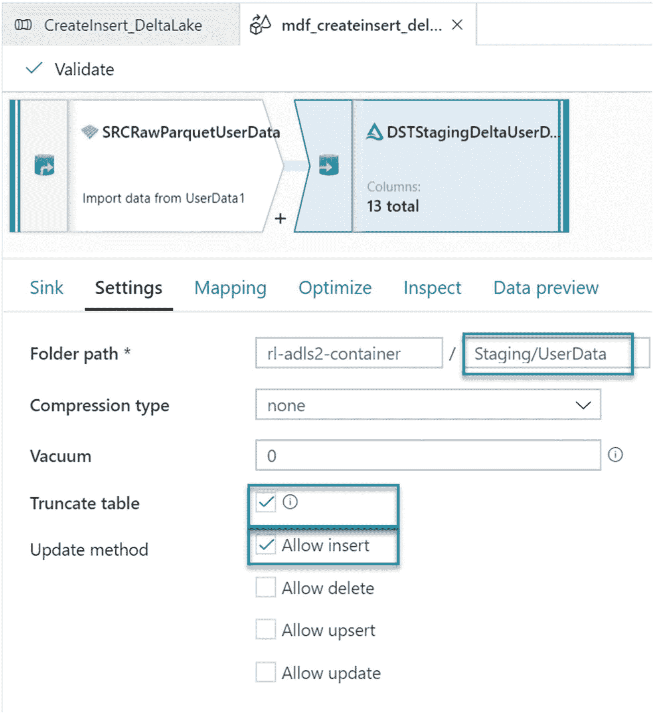

# 十五、DeltaLake

在使用 Azure Data Lake Storage Gen2 和 Apache Spark 时，用户已经了解了 Apache Spark 的局限性和许多数据湖实现挑战。在数据湖环境中，对 ACID 兼容功能集的需求至关重要，Delta Lake 针对标准 Azure 数据湖存储二代帐户的当前限制提供了许多解决方案。

Delta Lake 是一个开源存储层，它保证了湖中数据的原子性、一致性、隔离性和持久性。简而言之，DeltaLake泊是酸性的。除了提供 ACID 事务、可伸缩的元数据处理等等，Delta Lake 运行在现有的数据湖之上，并且与 Apache Spark APIs 兼容。DeltaLake有几种入门方法。Databricks 提供笔记本以及兼容的 Apache Spark APIs 来创建和管理DeltaLake泊。或者，Azure Data Factory 的映射数据流(使用向外扩展的 Apache Spark 集群)可用于通过 GUI 设计的 ETL 管道执行符合 ACID 的 CRUD 操作。本章将通过如何在 Delta Lake 中创建、插入、更新和删除的示例，演示如何使用 Azure Data Factory 的 Delta Lake 连接器开始使用 Delta Lake。

## 为什么是酸性DeltaLake

将 Delta Lake 引入现代云数据架构有许多优势。传统上，数据湖和 Apache Spark 不符合 ACID。Delta Lake 引入了这种酸性合规性，以解决以下许多酸性合规性问题:

1.  **原子性** : *要么写全部数据，要么什么都不写*。Apache Spark *保存模式*不使用任何锁定，并且不是原子的。这样，失败的作业可能会留下不完整的文件，并可能会损坏数据。此外，失败的作业可能会删除旧文件并损坏新文件。虽然这似乎令人担忧，但 Spark 确实有内置的数据帧编写器 API，这些 API 不是原子的，但对于追加操作却是如此。然而，使用云存储会带来性能开销。当前可用的 Apache Spark 保存模式包括 ErrorIfExists、Append、Overwrite 和 Ignore。

2.  **一致性** : *数据始终处于有效状态*。如果 Spark API writer 删除一个旧文件并创建一个新文件，并且该操作不是事务性的，那么在删除旧文件和创建新文件之间总会有一段时间文件不存在。在这种情况下，如果覆盖操作失败，这将导致旧文件的数据丢失。此外，可能无法创建新文件。这是一个典型的与一致性相关的 Spark 覆盖操作问题。

3.  **隔离** : *多个交易独立发生，互不干扰*。这意味着写入数据集时，同一数据集上的其他并发读取或写入不应受到写入操作的影响。典型的事务数据库提供多种隔离级别，如未提交读、提交读、可重复读、快照和可序列化。虽然 Spark 有任务级和作业级提交，但由于它缺乏原子性，所以它没有隔离类型。

4.  **耐久性** : *提交的数据永不丢失。*当 Spark 没有正确执行提交时，它会覆盖云存储选项提供的所有强大的持久性功能，并损坏和/或丢失数据。这违反了数据持久性。

## 先决条件

现在，您已经了解了当前的数据湖，了解了 Spark 挑战以及符合 ACID 的 Delta 湖的好处，让我们开始练习吧。

对于本练习，请确保成功创建以下先决条件:


图 15-1

ADLS 第二代区域/文件夹

1.  **创建数据工厂 V2** :数据工厂将用于执行 ELT 编排。此外，ADF 的地图数据流DeltaLake连接器将用于创建和管理DeltaLake。

2.  **创建数据湖存储二代** : ADLS Gen2 将是数据湖存储，在其之上将创建 Delta 湖。

3.  **创建 Data Lake Storage Gen2 容器和区域**:创建 Data Lake Storage Gen2 帐户后，还要创建适当的容器和区域。再次访问第 [3](03.html) 章，了解有关设计 ADLS 第二代区域的更多信息，我将在其中讨论如何设计 ADLS 第二代存储客户。本练习将使用原始区域来存储示例源拼花文件。此外，临时区域将用于增量更新、插入、删除和其他转换。尽管在本练习中不会使用策划区域，但有一点很重要，即该区域可能包含最终的 ETL、高级分析或数据科学模型，这些模型是从临时区域进一步转换和策划的。一旦在你的 ADLS 第二代账户中创建了不同的区域，它们看起来将类似于图 [15-1](#Fig1) 中的图示。


图 15-2

示例 userdata1.parquet 文件

1.  **上传数据到原始区域**:最后，这个练习你需要一些数据。通过在网上或公开可用的数据集中搜索“样本拼花文件”，您将获得大量免费样本拼花文件。对于本练习，您可以在下面的[GitHub repo](https://github.com/Teradata/kylo/tree/master/samples/sample-data/parquet)`(`[`https://github.com/Teradata/kylo/tree/master/samples/sample-data/parquet`](https://github.com/Teradata/kylo/tree/master/samples/sample-data/parquet)`)`中下载示例拼花文件，然后将其上传到您的 ADLS Gen2 存储帐户，如图 [15-2](#Fig2) 所示。


图 15-3

ADF 中的 userData1 连接设置

1.  **创建一个指向原始区域**的数据工厂拼花数据集:最后一个先决条件是在新创建的 ADF V2 实例中创建一个拼花格式数据集，如图 [15-3](#Fig3) 所示，指向原始区域中存储的样本拼花文件。

## 创建并插入DeltaLake

现在，所有先决条件都已就绪，您可以创建初始增量表，并将原始区域中的数据插入到增量表中。

通过创建一个新的数据工厂管道并向其添加一个新的“映射数据流”来开始这个过程。还记得命名管道和数据流的合理名称，很像图 [15-4](#Fig4) 中所示的示例。


图 15-4

映射用于插入的数据流画布

在数据流中，添加一个源，其配置设置如图 [15-5](#Fig5) 所示。此外，选中“允许模式漂移”选项当与字段、列和类型相关的元数据频繁更改时，这被称为模式漂移。如果没有适当的过程来处理模式漂移，ETL 管道可能会失败。ADF 支持经常变化的灵活模式。ADF 将模式漂移视为后期绑定。因此，您将无法在数据流中查看漂移的架构。

当启用模式漂移时，所有传入的字段都在执行期间从源中读取，并通过整个流传递到接收器。默认情况下，所有新检测到的列都是字符串数据类型。如果需要自动推断漂移列的数据类型，则需要在源设置中启用推断漂移列类型。

允许自动检测漂移的色谱柱类型。采样提供了一种限制源中行数的方法，主要用于测试和调试目的。


图 15-5

为插入操作映射数据流 ETL 流源设置

由于 Delta Lake 利用了 Spark 的分布式处理能力，它能够适当地对数据进行分区。然而，为了探索手动设置分区的能力，在 ID 列上配置 20 个散列分区，如图 [15-6](#Fig6) 所示。


图 15-6

优化 MDF 分区的设置

添加目的地活动后，确保在 Azure 数据工厂 `(` [`https://docs.microsoft.com/en-us/azure/data-factory/format-delta`](https://docs.microsoft.com/en-us/azure/data-factory/format-delta) `)`中将如图 [15-7](#Fig7) 所示的 sink 类型设置为 [Delta 格式。请注意，DeltaLake在绘制数据流图时既可以作为源，也可以作为汇。此外，一旦选择了 Delta Lake 的汇类型，您将需要选择链接的服务。](https://docs.microsoft.com/en-us/azure/data-factory/format-delta)


图 15-7

MDF 接收器设置

在图 [15-8](#Fig8) 所示的设置选项卡下，确保暂存文件夹被选中，并选择允许插入作为更新方法。此外，如果需要在加载前截断增量表，请选择 Truncate table 选项。

在湖`(` [`https://docs.databricks.com/spark/latest/spark-sql/language-manual/delta-vacuum.html`](https://docs.databricks.com/spark/latest/spark-sql/language-manual/delta-vacuum.html) `)`中清空增量表的过程将删除增量表不再引用的文件以及超过保留阈值(小时)的文件。如果该值保留为 0 或为空，则默认值为 30 天。



图 15-8

在 MDF 中插入水槽的设置

最后，在图 [15-9](#Fig9) 所示的优化选项卡中，使用当前分区，因为源分区将向下游流向接收器。


图 15-9

用于优化接收器的分区选项

正如预期的那样，一旦您触发了管道，并且在它完成运行之后，从图 [15-10](#Fig10) 中可以注意到，在 20 个不同的分区中创建了 13 个新列。


图 15-10

ADF MDF 管道运行详细信息

在查看 ADLS Gen2 暂存文件夹时，请注意图 [15-11](#Fig11) 中的一个 *delta_log* 文件夹以及 20 个快速压缩的拼花文件已经创建。


图 15-11

DeltaLake分区文件

打开 *delta_log* 文件夹查看两个事务日志文件，如图 [15-12](#Fig12) 所示。事务日志捕获了许多重要的特性，包括 ACID 事务、可伸缩的元数据处理、时间旅行，以及更多的`(` [`https://databricks.com/blog/2019/08/21/diving-into-delta-lake-unpacking-the-transaction-log.html`](https://databricks.com/blog/2019/08/21/diving-into-delta-lake-unpacking-the-transaction-log.html) `)`。


图 15-12

增量日志文件

在检查了 Staging Delta Lake 中的新数据后，注意到有新的记录被插入。要通过绘制数据流图从 ADF 轻松探索DeltaLake，只需切换数据预览选项卡即可查看数据流的详细信息，如图 [15-13](#Fig13) 所示。


图 15-13

插入从拼花文件读取的数据结果

## 更新DeltaLake

到目前为止，在上一节中已经介绍了到 Delta Lake 的插入。接下来，让我们看看 Data Factory 如何处理对增量表的更新。类似于您在上一节中对插入所做的，创建一个新的 ADF 管道，带有用于更新的映射数据流，如图 [15-14](#Fig14) 所示。


图 15-14

MDF 更新DeltaLake

在这个更新练习中，更新用户的名字和姓氏，并将其转换为小写。为此，向更新映射数据流画布添加一个派生的 column 和 AlterRow 转换活动，如图 [15-15](#Fig15) 所示。


图 15-15

用于更新映射数据流拼花的源设置

在图 [15-16](#Fig16) 所示的源选项选项卡中，源数据仍然是您的暂存 Delta Lake，它也是为插入而配置的。ADF 中的 Delta Lake source 连接器[还为大规模数据湖](https://databricks.com/blog/2019/02/04/introducing-delta-time-travel-for-large-scale-data-lakes.html)引入了 delta time travel，以审计数据更改、重现结果、处理回滚等。时光旅行可以按时间戳或版本查询数据( [`https://databricks.com/blog/2019/02/04/introducing-delta-time-travel-for-large-scale-data-lakes.html`](https://databricks.com/blog/2019/02/04/introducing-delta-time-travel-for-large-scale-data-lakes.html) ) *)。*


图 15-16

更新源选项

派生的列转换活动使用表达式`lower(first_name)`和`lower(last_name)`将名字和姓氏转换成小写，如图 [15-17](#Fig17) 所示。映射数据流能够在这个阶段处理极其复杂的转换。


图 15-17

用于更新的派生列设置

对于更改行设置，您需要指定一个更新 if 条件`true()`来更新所有符合条件的行，如图 [15-18](#Fig18) 所示。


图 15-18

AlterRow 更新的设置

确保您验证了 Sink 选项卡的配置设置，如图 [15-19](#Fig19) 所示。


图 15-19

更新 MDF 的接收器设置

确保接收器仍然指向暂存的DeltaLake数据。另外，选择“允许更新”作为更新方法。为了显示可以同时选择多个键列，在图 [15-20](#Fig20) 中选择了三列。


图 15-20

更新 MDF 接收器的方法设置

保存并触发管道后，注意 ADF 数据预览选项卡的结果，如图 [15-21](#Fig21) 所示。名字和姓氏已更新为小写值。


图 15-21

显示预期更新的数据

## 从DeltaLake删除

概括地说，到目前为止，已经讨论了插入和更新。接下来，让我们看一个映射数据流如何处理 Delta Lake 中的删除的例子。类似于建立插入和更新 MDF 管道的过程，创建一个新的数据工厂映射数据流，如图 [15-22](#Fig22) 所示。


图 15-22

用于从 Delta Lake 删除的 MDF

根据需要配置增量源设置，如图 [15-23](#Fig23) 所示。


图 15-23

mdf_delete_deltalake 的源设置

由于您仍在使用相同的暂存DeltaLake，这些源设置(如图 [15-24](#Fig24) 所示)将按照您在前面章节中配置插入和更新的方式进行配置。


图 15-24

mdf_delete_deltalake 的源选项

对于本例，删除所有`gender = male`处的记录。为此，您需要将更改行条件配置为 *Delete if gender == 'Male'* ，如图 [15-25](#Fig25) 所示。


图 15-25

更改 mdf_delete_deltalake delta 的行设置

最后，图 [15-26](#Fig26) 显示了 sink delta 配置设置。


图 15-26

mdf_delete_deltalake 的接收器设置

选择 sink 的 Staging Delta Lake，选择*【允许删除】*，同时选择需要的`id``registration_dttm``and ip_address`按键栏，如图 [15-27](#Fig27) 所示。


图 15-27

mdf_delete_deltalake 的目标

发布并触发该管道后，请注意图 [15-28](#Fig28) 中`gender = Male`处的所有记录是如何被删除的。


图 15-28

按预期删除数据文件

## 浏览增量日志

最后，让我们看一下增量日志，以简要了解日志是如何创建和填充的。主提交信息文件生成并存储在插入、更新和删除 JSON 提交文件中。此外，还会创建 CRC 文件。CRC 是一种用于检查数据完整性的流行技术，因为它具有出色的错误检测能力，使用很少的资源，并且易于使用。从 ADF 增量插入、更新和删除 MDF 管道创建的增量日志存储在您的 ADLS Gen2 帐户的 *_delta_log* 文件夹中，如图 [15-29](#Fig29) 所示。


图 15-29

插入、更新和删除后的增量日志

### 插入

打开图 [15-30](#Fig30) 所示的插入 JSON 提交文件，注意它包含插入操作的提交信息，由以单词*“添加”*开头的行项目引用。在构建 ETL 管道和过程时，通常不需要使用或打开这些文件。但是，日志总是以 JSON 格式保存在这个文件夹中，所以您总是可以选择在需要时打开日志。对于本练习，打开这些日志将使您更深入地了解这些日志是如何捕获信息的，从而有助于更好地理解该过程的机制。


图 15-30

增量日志插入

```
{"commitInfo":{"timestamp":1594782281467,"operation":"WRITE","operationParameters":{"mode":"Append","partitionBy":"[]"},"isolationLevel":"WriteSerializable","isBlindAppend":true}}

```

### 更新

类似于插入增量日志，打开图 [15-31](#Fig31) 所示的更新 JSON 提交文件，注意它包含更新操作的提交信息。以*“删除”*开头的行项目显示了已删除数据文件的路径，以*“添加”*开头的行项目显示了更新过程中添加的数据。此外，这些日志中还提供了与提交信息、时间戳等相关的重要细节。同样，在常规的 ADF 管道过程中，您不需要研究这些增量日志，这意味着是一个信息性和探索性的练习。


图 15-31

增量日志更新

```
{"commitInfo":{"timestamp":1594782711552,"operation":"MERGE","operationParameters":{"predicate":"(((source.`id` = target.`id`) AND (source.`registration_dttm` = target.`registration_dttm`)) AND (source.`ip_address` = target.`ip_address`))","updatePredicate":"((NOT ((source.`ra2b434a305b34f2f96cd5b4b4149455e` & 2) = 0)) OR (NOT ((source.`ra2b434a305b34f2f96cd5b4b4149455e` & 8) = 0)))","deletePredicate":"(NOT ((source.`ra2b434a305b34f2f96cd5b4b4149455e` & 4) = 0))"},"readVersion":0,"isolationLevel":"WriteSerializable","isBlindAppend":false}}

```

### 删除

最后，打开图 [15-32](#Fig32) 所示的删除 JSON 提交文件，注意它包含了删除操作的提交信息。已删除的文件由以*“删除”*开头的行项目捕获。现在您已经了解了这些 delta 事务日志，以及如何打开和解释它们，您将更好地理解 Delta Lake 的相关性，以及它在处理数据湖中符合 ACID 的事务方面的定位。


图 15-32

增量日志删除

```
"commitInfo":{"timestamp":1594783812366,"operation":"MERGE","operationParameters":{"predicate":"(((source.`id` = target.`id`) AND (source.`registration_dttm` = target.`registration_dttm`)) AND (source.`ip_address` = target.`ip_address`))","updatePredicate":"((NOT ((source.`ra079d97a688347b581710234d2cc4b63` & 2) = 0)) OR (NOT ((source.`ra079d97a688347b581710234d2cc4b63` & 8) = 0)))","deletePredicate":"(NOT ((source.`ra079d97a688347b581710234d2cc4b63` & 4) = 0))"},"readVersion":1,"isolationLevel":"WriteSerializable","isBlindAppend":false}}

```

## 摘要

在这一章中，我通过使用 Azure Data Lake Storage Gen2 作为存储帐户在 Delta Lake 中创建、插入、更新和删除的示例，演示了如何使用 Azure Data Factory 的 Delta Lake 连接器开始使用 Delta Lake。由于 Delta Lake 是一个开源项目，旨在支持在现有存储系统的基础上构建 lakehouse 架构，因此它当然可以用于其他存储系统，如亚马逊 S3、谷歌云存储、HDFS 等。此外，通过在 Databricks 笔记本中编写 Spark、Python 和/或 Scala 代码，您可以轻松地使用 Delta Lake。

有了这样的灵活性，lakehouse 数据管理范式正在获得动力，它有望成为行业标准，并推动数据湖和数据仓库的发展。数据湖的低成本存储使得这种选择对于那些对成本敏感和追求增长的组织来说非常有吸引力。data lakehouse 的其他优势包括减少数据冗余、消除简单的 ETL 作业、将计算与存储分离、实时流支持、简化数据管理以及直接连接到现代 BI 工具的能力。虽然还处于起步阶段，但 data lakehouse 和 Delta Lake 确实有一定的局限性，使它们无法完全取代传统的数据仓库设备，如 SQL Server 数据库和仓库。然而，本章展示了以无代码方式直接使用 Delta Lake 的能力，并展示了如何轻松地使用 Delta Lake 开始探索数据湖库的构建块。