# 16.流分析异常检测

许多企业越来越需要处理大数据实时流。众多行业的客户都在寻求利用实时大数据的力量来获得有价值的见解。他们正在寻求一种易于使用、灵活、可靠且可扩展的解决方案来处理和转换其物联网项目的实时数据流。此外，伴随这些大型实时数据流而来的是数据中的异常。各行各业的客户都对使用机器学习算法和运算符进行实时异常检测的概念感兴趣。

Azure Stream Analytics 是一个事件处理引擎，允许检查来自设备、传感器、网站、社交媒体源、应用等的大量数据流。它易于使用并且基于简单的 SQL。此外，它是 Azure 上的一个完全托管(PaaS)产品，可以运行针对成本进行了优化的大规模分析作业，因为用户只需为所消耗的流单元付费。

Azure Stream Analytics 现在提供内置的基于机器学习的异常检测功能，以监控临时和持久的异常。这种异常检测功能与 Power BI 的实时流服务相结合，形成了一种强大的实时异常检测服务。在这一章中，我将展示一个实例，展示如何使用 Azure Stream Analytics 创建实时异常检测来处理流，并使用 Power BI 来可视化数据。

## 先决条件

要开始实现本章的示例解决方案，您需要创建并运行一些 Azure 资源。这些是

*   **流分析工作** : Azure Stream Analytics 是一个实时分析和复杂事件处理引擎，旨在同时分析和处理来自多个来源的大量快速流数据。

*   **物联网中心**:物联网中心是托管在云中的托管服务，充当物联网应用和其管理的设备之间双向通信的中央消息中心。

*   **Power BI 服务**:对于中小型企业而言，Power BI Pro 是向所有用户提供全面商业智能功能的最佳选择。Power BI Premium 最适合需要大量人员使用 Power BI 查看仪表板和报告的大型企业组织。请重新阅读第 [1](01.html) 章，我在这一章的最后讨论了 Power BI Pro 与 Premium 的优缺点。在本练习中，将使用 Power BI Premium。

*   **设备模拟器**:[设备模拟器](https://github.com/Azure/azure-stream-analytics/tree/master/Samples/DeviceSimulator) app，这是一个 Visual Studio 项目，可以从以下 GitHub 位置( [`https://github.com/Azure/azure-stream-analytics/tree/master/Samples/DeviceSimulator`](https://github.com/Azure/azure-stream-analytics/tree/master/Samples/DeviceSimulator) )下载，用于模拟从设备发送到物联网 Hub 的异常。一旦你下载并打开这个设备模拟器 Visual Studio 项目，你将能够运行它来查看设备模拟器 UI，它可以被配置为将事件从模拟器传递到你将在 Azure 中创建的物联网中心。模拟器数据的模式使用温度和传感器 ID。然后，这些事件可以由 Azure 流分析作业使用，该作业被配置为从该物联网中心读取。

下面几节将带您创建这些先决条件。

### 创建 Azure 流分析作业

让我们通过简单地搜索流分析，在 Azure Portal 中创建新的流分析作业，如图 [16-1](#Fig1) 所示。

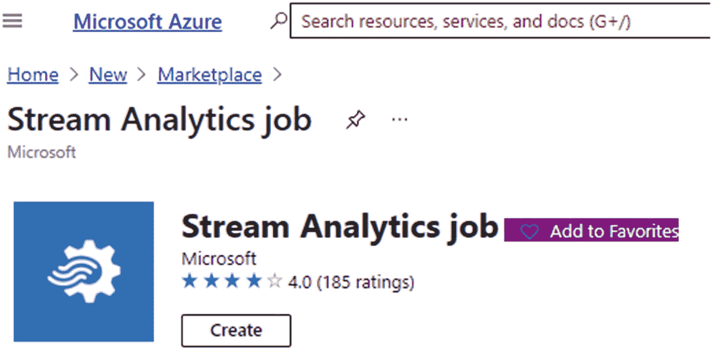

图 16-1

Azure 门户中的新流分析作业

图 [16-2](#Fig2) 说明你需要将作业命名为`asa-001`。另外，选择相应的订阅、资源组和位置。我建议在一个资源组中为这个项目创建所有的资源。也就是说，您可以为此流分析作业创建一个新的资源组。此外，尽量在同一位置创建所有资源，以减少数据和网络延迟，尤其是因为这是一个实时流解决方案。对于本练习，选择“Cloud”将作业部署到 Azure cloud，因为这是典型的选择。选择“边缘”将作业部署到内部物联网网关边缘设备。做出选择后，单击创建。

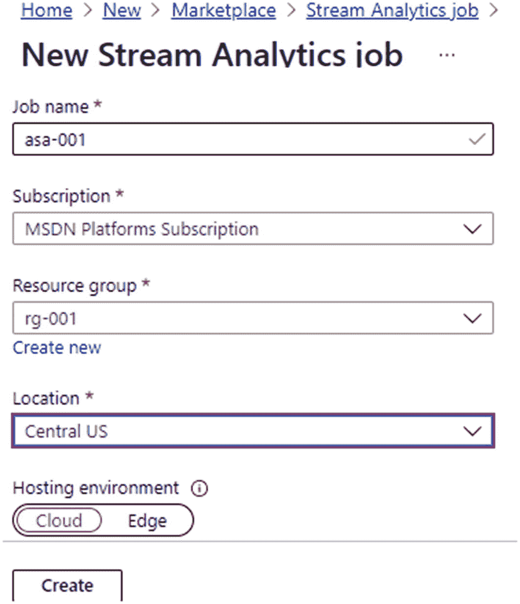

图 16-2

新流分析作业详细信息

您现在已经创建了一个流分析作业。您还需要创建一个[物联网中心](https://docs.microsoft.com/en-us/azure/iot-hub/iot-hub-compare-event-hubs)，它将用于弥合设备模拟器和流分析作业之间的差距。

### 创建物联网中心

物联网中心是托管在云中的托管服务，充当物联网应用及其管理的设备之间双向通信的中央消息中心。物联网中心本质上是一个事件中心，具有额外的功能，包括每设备身份、云到设备的消息传递以及其他一些功能。在第 [1](01.html) 章中，我已经更详细地讨论了物联网和活动中心之间的异同。图 [16-3](#Fig3) 展示了如何从 Azure 门户创建物联网中心。

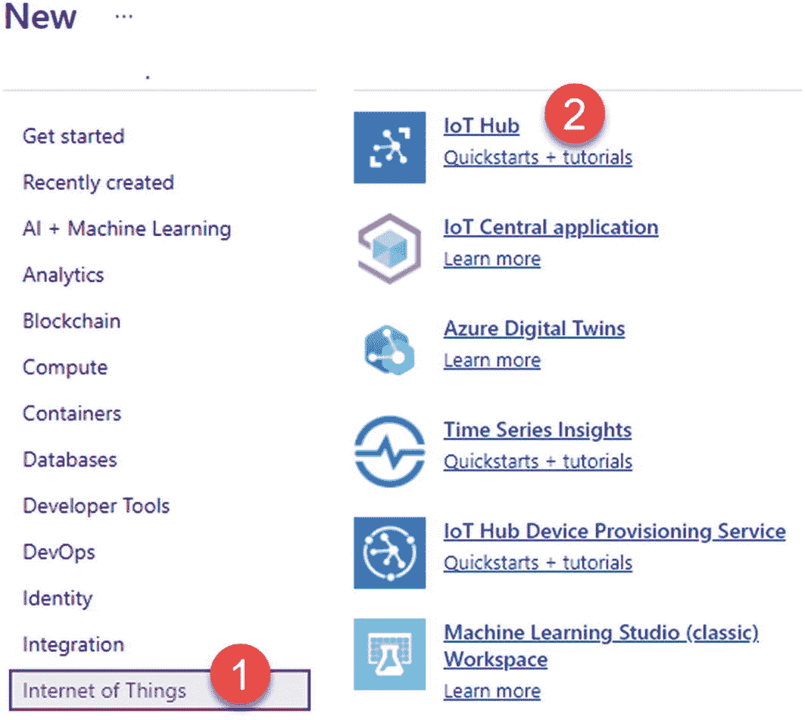

图 16-3

创建 Azure 门户物联网中心

在图 [16-4](#Fig4) 所示的基本选项卡中，为您的物联网中心命名，并确保订阅、资源组和区域配置正确。回想一下上一节，最好让物联网中心与流分析作业位于相同的资源组和区域。

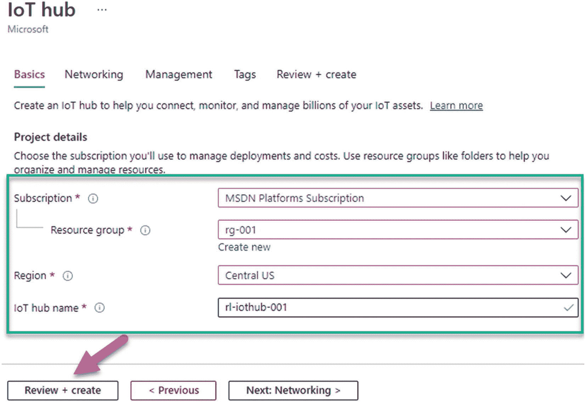

图 16-4

物联网中心基础选项卡

还可以选择调整物联网中心的大小和规模，如图 [16-5](#Fig5) 所示。对于本练习，使用自由层，因为它最适合测试场景。物联网集线器的标准层支持所有功能，并且是任何想要利用双向通信功能的物联网解决方案所必需的。基本层支持部分功能，适用于仅需要从设备到云的单向通信的物联网解决方案。两层都提供相同的安全和身份验证功能。阅读微软的文档，了解何时以及如何根据能力需求选择合适的层( [`https://docs.microsoft.com/en-us/azure/iot-hub/iot-hub-scaling`](https://docs.microsoft.com/en-us/azure/iot-hub/iot-hub-scaling) )。

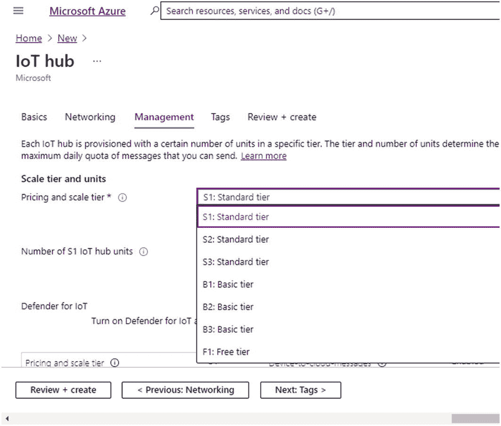

图 16-5

物联网中心管理选项卡

选择所需的层后，查看图 [16-6](#Fig6) 中显示的选择，然后单击创建以部署物联网资源。

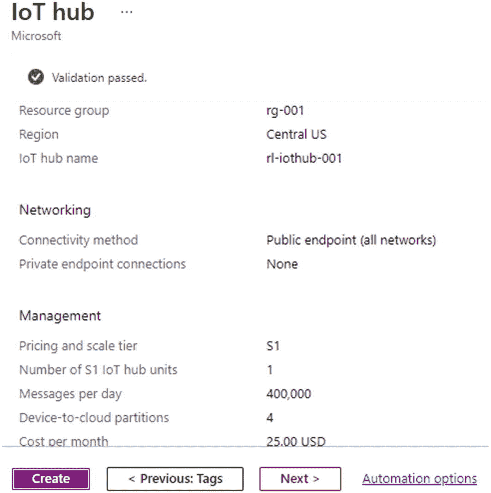

图 16-6

物联网中心审查+创建

部署物联网中心资源后，导航至图 [16-7](#Fig7) 所示的资源管理器下的物联网设备，然后单击物联网中心导航菜单下的新建，添加一个新设备，然后我们可以使用它来配置设备模拟器，该模拟器将向该物联网设备发送模拟事件。

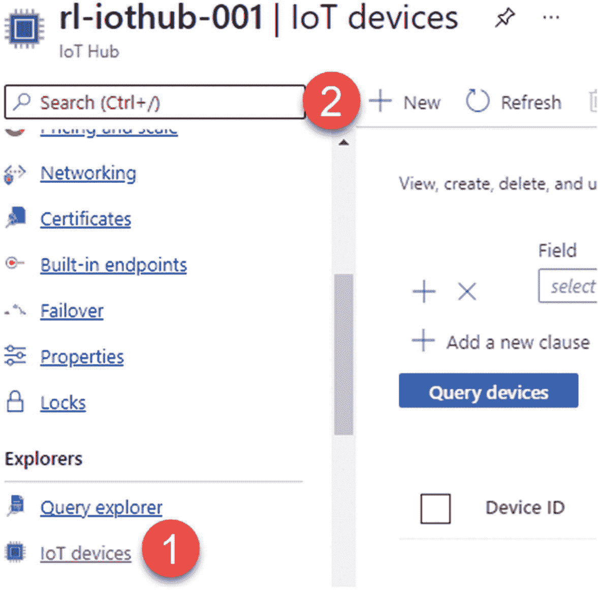

图 16-7

物联网中心物联网设备

然后添加一个设备 ID，点击保存，如图 [16-8](#Fig8) 所示。设备 ID 只是设备的标识，用于设备认证和访问控制。对称密钥必须是有效的 base-64 格式，密钥长度在 16 到 64 字节之间。通过将证书指纹或证书颁发机构(CA)上传到 Azure IoT Hub，您可以使用任何 X.509 证书通过 IoT Hub 对设备进行身份验证。使用证书指纹的身份验证验证提供的指纹是否与配置的指纹匹配。选择“自动生成密钥”为该设备自动生成对称密钥。最后，支持设备与物联网中心的交互。

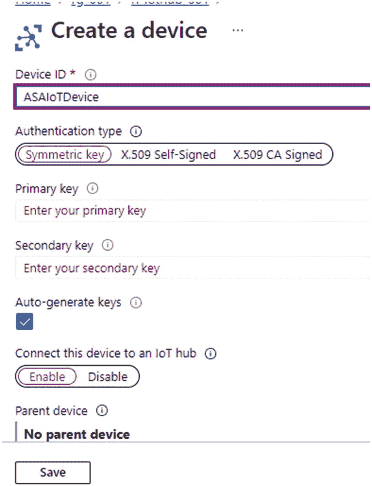

图 16-8

创建物联网中枢设备

一旦设备被添加，它将显示“启用”状态，如图 [16-9](#Fig9) 所示。单击设备以打开设备详细信息，包括密钥、身份和附加配置。

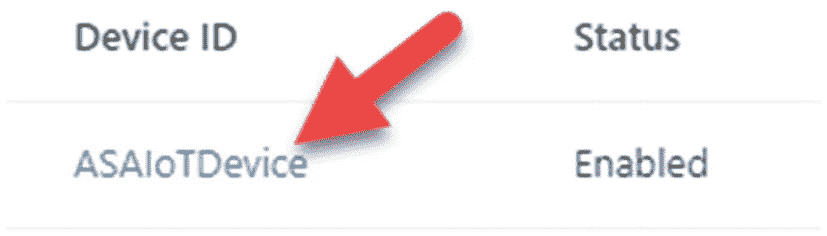

图 16-9

ASA 设备状态和 ID

接下来，复制如图 [16-10](#Fig10) 所示主键的连接字符串，它将被用作物联网设备的连接。

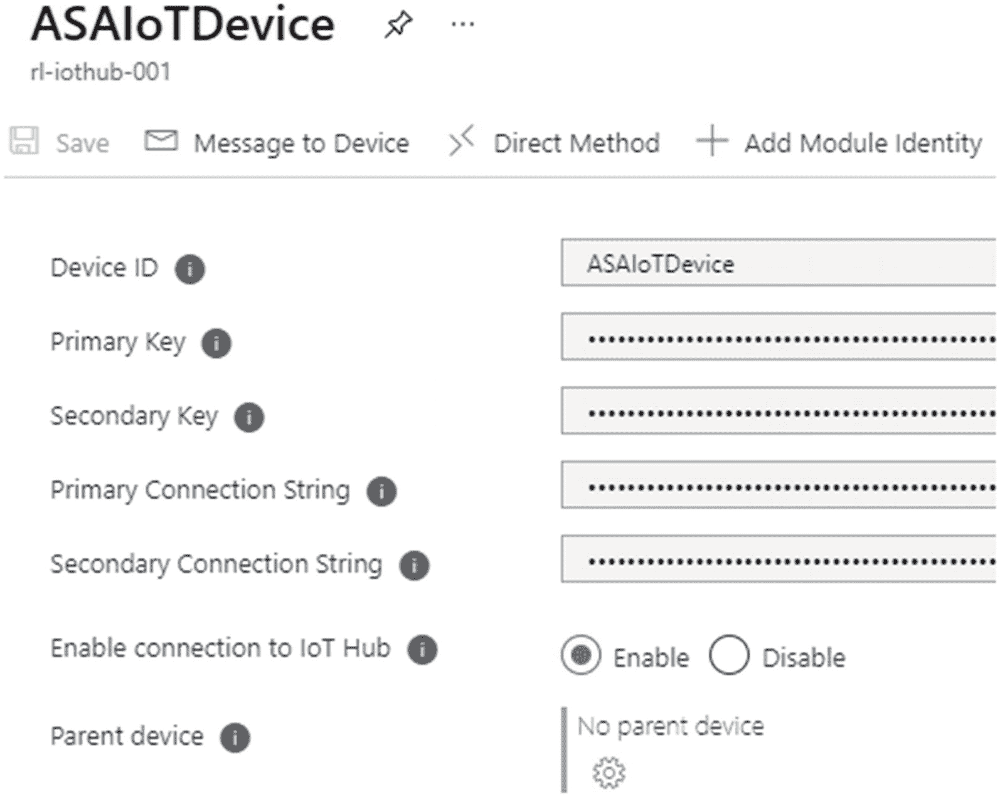

图 16-10

ASA 物联网设备的连接详细信息

### 创建 Power BI 服务

要开始使用 Power BI，请从以下网址下载免费桌面版: [`https://powerbi.microsoft.com/en-us/downloads/`](https://powerbi.microsoft.com/en-us/downloads/) 。在考虑生产就绪型 Power BI 服务时，请探索专业版和高级版选项。在第 1 章中，我简单地比较了专业版和高级版。Pro 的每用户许可费为 9.99 美元，Premium 的每用户许可费为 20 美元。在本练习中，使用了 Power BI Premium。请检查各种选项，并选择最适合您和您的组织的选项。

### 下载设备模拟器

设备模拟器用于模拟从设备发送到物联网集线器的异常情况。该模式使用温度和传感器 ID。然后，这些事件可以被配置为从该物联网中心读取的 Azure 流分析作业消费。从下面的 URL `(` [`https://github.com/Azure/azure-stream-analytics/tree/master/Samples/DeviceSimulator`](https://github.com/Azure/azure-stream-analytics/tree/master/Samples/DeviceSimulator) `)`下载设备模拟器，然后打开相应的 Visual Studio 解决方案文件并运行模拟器。打开设备模拟器解决方案文件时，该文件应类似于图 [16-11](#Fig11) 。

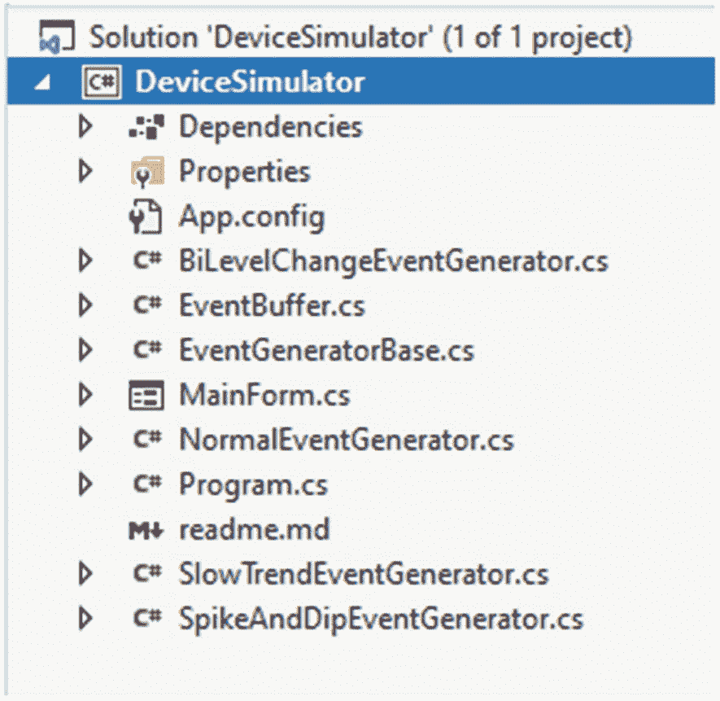

图 16-11

设备模拟器项目的 VS 视图

当设备模拟器开始运行时，请注意各种可用的设置。请务必查看 readme.md GitHub 文件，以了解可用的各种配置和设置。例如，模拟模式是一种用模拟器和各种异常模式进行实验的方法，无需向实时物联网中心发送数据。

一旦您有了可用的物联网集线器名称空间(例如 rl-iothub-001)、设备 ID (ASAIoTDevice)和设备密钥(主键)，在运行模拟器之前，在物联网集线器配置部分输入这些信息，如图 [16-12](#Fig12) 所示，以确保消息和数据被发送到物联网设备。

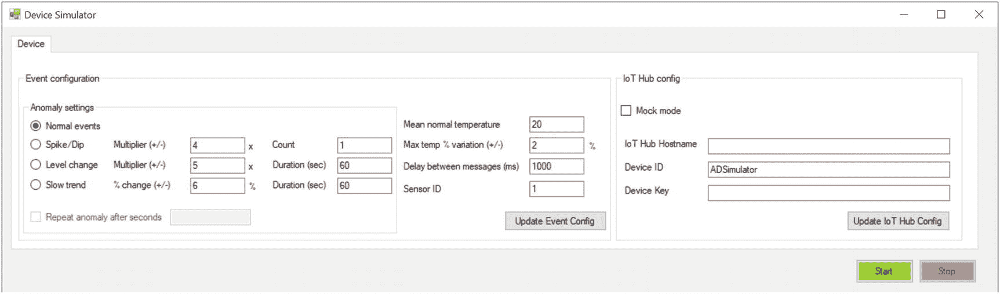

图 16-12

设备模拟器

## 创建流分析输入和输出

流分析作业由输入、查询和输出组成。需要对其进行定义和运行，以便获取物联网中枢设备输入，使用查询对其进行处理，并将其输出到 Power BI 实时流仪表板。

### 添加流输入

您的第一步是捕获输入。首先添加一个物联网集线器流输入，如图 [16-13](#Fig13) 所示。请注意，还有其他选项可以使用事件中心、Blob 存储和 ADLS gen 2——它们也是流输入。

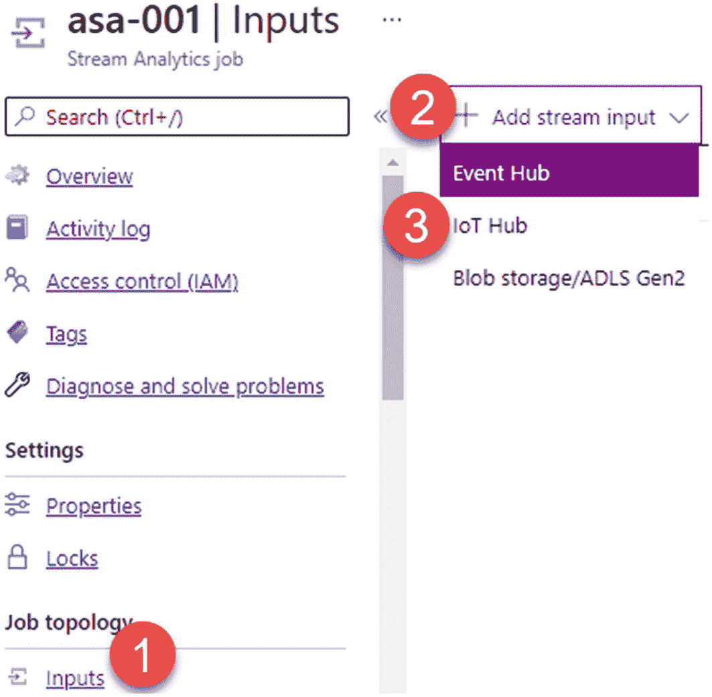

图 16-13

添加物联网集线器流输入

接下来，图 [16-14](#Fig14) 显示了如何配置输入流细节。以下是高级配置选项的一些附加详细信息:

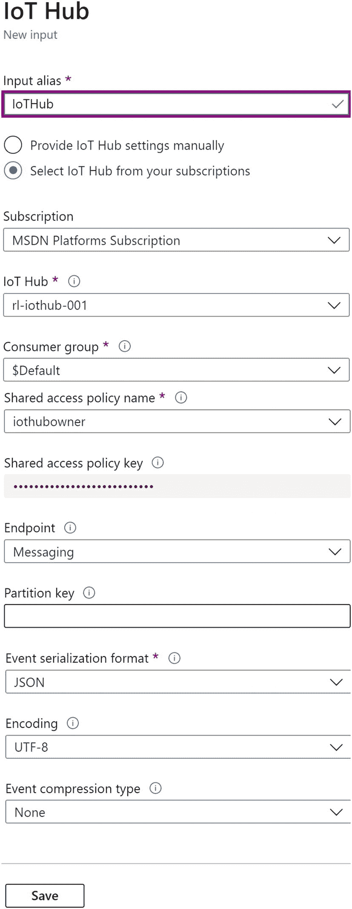

图 16-14

配置输入流详细信息

*   **消费群体**:物联网枢纽将一个消费群体内的阅读器数量限制在 5 个。Microsoft 建议对每个作业使用单独的组。将此字段留空将使用' $Default '使用者组。

*   **共享访问策略名称**:当您创建物联网集线器时，您也可以在物联网集线器设置中创建共享访问策略。每个共享访问策略都有一个名称、您设置的权限和访问密钥。

*   **共享访问策略键**:当您创建物联网中心时，您也可以在物联网中心设置中创建共享访问策略。每个共享访问策略都有一个名称、您设置的权限和访问密钥。

*   **端点**:对从设备到云的消息使用“消息”端点。将“操作监控”端点用于设备遥测和元数据。

*   **分区键**:如果你的输入被一个属性分区，你可以在这里添加这个属性的名称。这是可选的，如果在该属性中包含 PARTITION BY 或 GROUP BY 子句，则用于提高查询的性能。如果此作业使用 1.2 或更高的兼容级别，则默认情况下会添加“PartitionId”，因此您无需在此处显式添加它。

*   **事件序列化格式**:为了确保您的查询按照您期望的方式工作，Stream Analytics 需要知道您对传入的数据流使用哪种序列化格式。

*   **编码** : UTF-8 是目前唯一支持的编码格式。

*   **事件压缩类型**:压缩选项使您能够指定压缩类型 Gzip、Deflate 或无压缩。

一旦指定了输入流的详细信息并获得了您想要的信息，请单击 Save 按钮。您将被带到如图 [16-15](#Fig15) 所示的屏幕，在这里您可以看到已经为您创建了物联网中心源流。

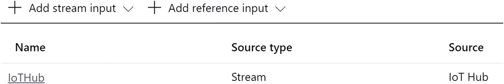

图 16-15

物联网中心源流

### 添加流输出

同样，也添加一个输出流，如图 [16-16](#Fig16) 所示。这将定义事件需要流向的接收器。请注意各种可用的接收器选项，包括 ADLS Gen2、SQL 数据库、Cosmos DB、Power BI 等等。在本练习中，选择 Power BI。

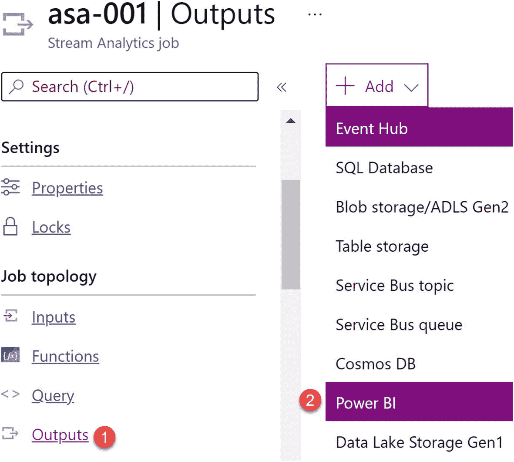

图 16-16

到 PBI 的物联网输出流

接下来，授权 Power BI 访问流分析作业，如图 [16-17](#Fig17) 所示。

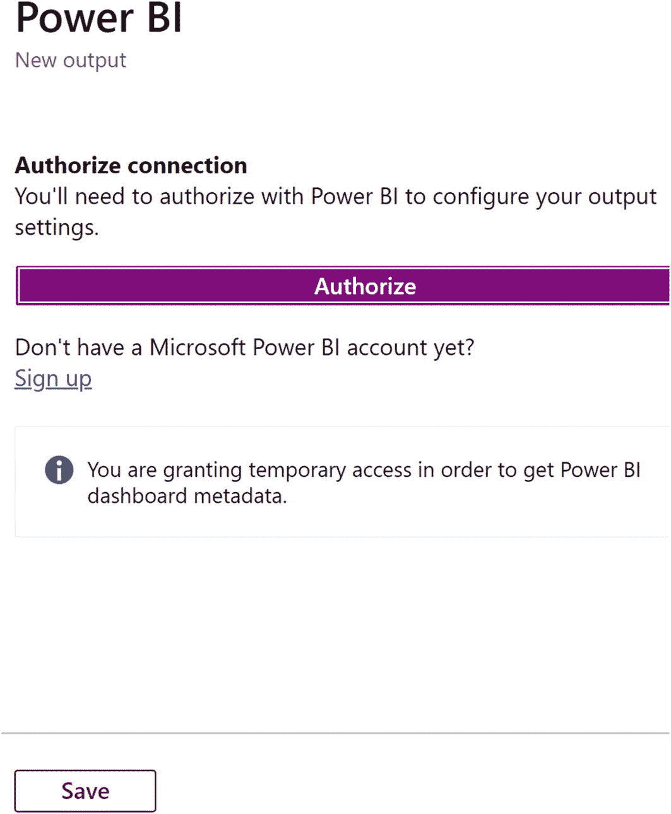

图 16-17

授权 Power BI 访问 ASA

这将显示输入您的 Azure 门户凭据的提示，然后单击下一步，如图 [16-18](#Fig18) 所示。考虑使用服务帐户进行生产授权和身份验证，而不是简单地使用个人帐户。

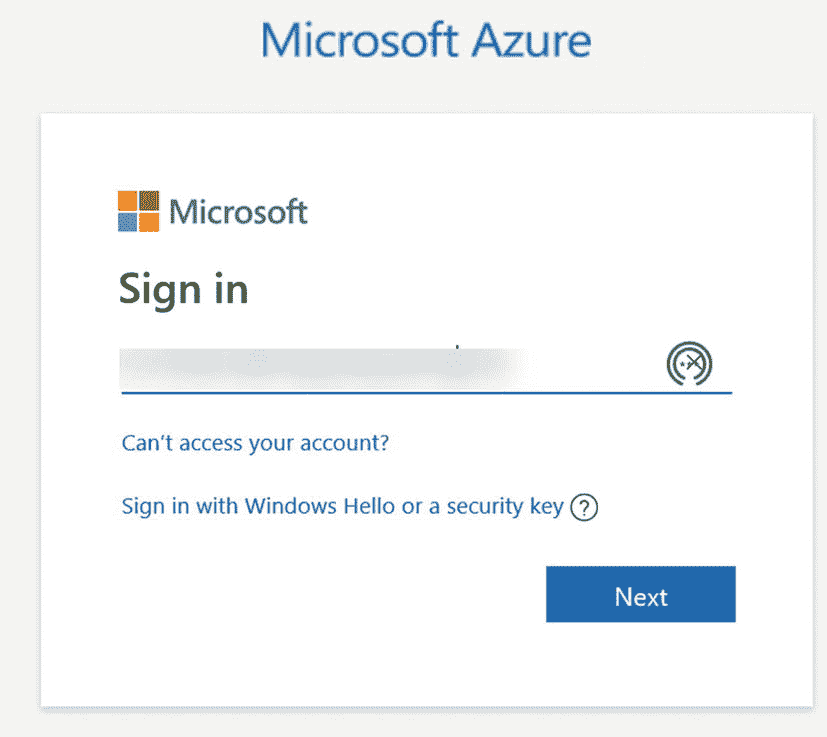

图 16-18

登录到 Azure 门户网站

配置数据集和表，并将验证模式设置为“用户令牌”，因为这将在开发/演示模式下临时运行，如图 [16-19](#Fig19) 所示。

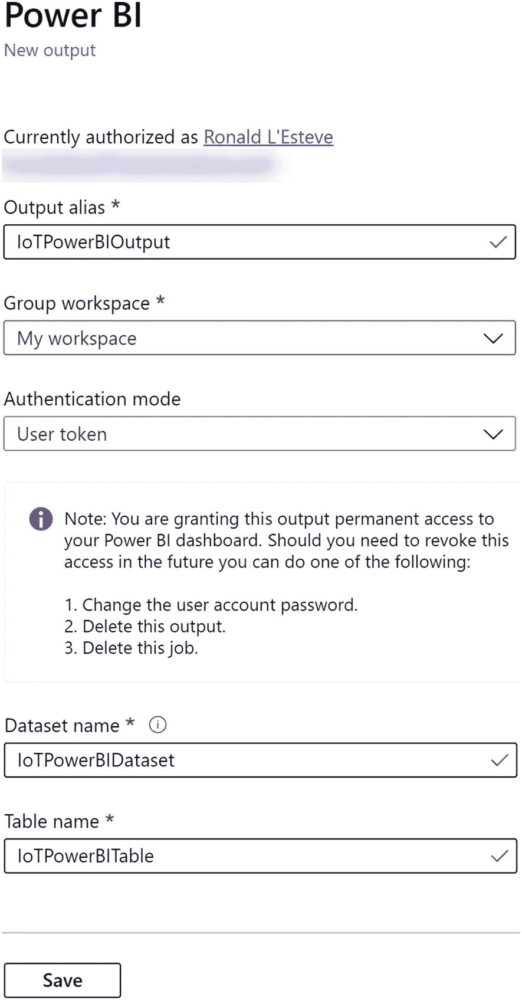

图 16-19

配置数据集和表，并设置身份验证模式

您还可以[使用托管身份来认证您的 Azure 流分析作业，以支持 BI](https://docs.microsoft.com/en-us/azure/stream-analytics/powerbi-output-managed-identity) 。[用于输出到 Power BI 的托管身份认证](https://docs.microsoft.com/en-us/azure/active-directory/managed-identities-azure-resources/overview)使流分析作业能够直接访问您的 Power BI 帐户中的工作区。该特性允许流分析作业的部署完全自动化，因为用户不再需要通过 Azure Portal 交互式登录 Power BI。此外，写入 Power BI 的长期运行的作业现在得到了更好的支持，因为您将不再需要定期重新授权作业`(` [`https://docs.microsoft.com/en-us/azure/stream-analytics/powerbi-output-managed-identity`](https://docs.microsoft.com/en-us/azure/stream-analytics/powerbi-output-managed-identity) `)`。

最后，图 [16-20](#Fig20) 显示 IoTPowerBIOutput 接收流已经创建。

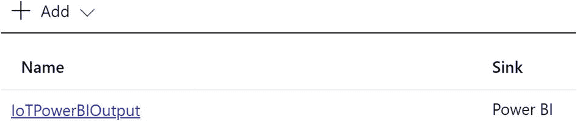

图 16-20

IoTPowerBIOutput 接收器流

### 编写流分析查询

创建流分析作业的最后一步是为异常检测编写 SQL 查询。在这个场景中，让我们使用峰值和下降函数。Azure Stream Analytics 提供内置的基于机器学习的异常检测功能，可用于监控两种最常见的异常:暂时的和持久的。使用 AnomalyDetection _ SpikeAndDip 和 AnomalyDetection_ChangePoint 函数，您可以直接在流分析作业中执行异常检测。[Azure Stream Analytics 中的异常检测](https://docs.microsoft.com/en-us/azure/stream-analytics/stream-analytics-machine-learning-anomaly-detection)采用基于机器学习的异常检测运算符，如 Spike 和 Dip 以及 Change Point。图 [16-21](#Fig21) 显示了在哪里添加包含内置异常检测峰值和下降函数的 SQL 查询。

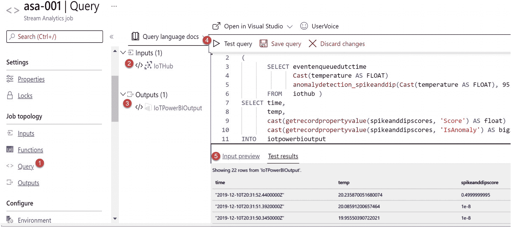

图 16-21

异常检测的 ASA SQL 查询

这是用作图 [16-21](#Fig21) 所示的源流分析查询的代码。此源查询将获取传入的流事件，并对其应用 SQL 查询，其中包括添加别名、转换以及使用峰值和下降异常检测功能，该功能是流分析 SQL 查询功能的一部分:

```
WITH anomalydetectionstep AS
(
       SELECT eventenqueuedutctime
AS time,
              Cast(temperature AS FLOAT)
AS temp,
              anomalydetection_spikeanddip(Cast(temperature AS FLOAT), 95, 120, 'spikesanddips') OVER(limit duration(second, 120)) AS spikeanddipscores
       FROM   iothub )
SELECT time,
       temp,
       cast(getrecordpropertyvalue(spikeanddipscores, 'Score') AS float)       AS spikeanddipscore,
       cast(getrecordpropertyvalue(spikeanddipscores, 'IsAnomaly') AS bigint) AS isspikeanddipanomaly
INTO   iotpowerbioutput
FROM   anomalydetectionstep

```

### 启动流分析作业

创建成功的流分析作业的最后一步是启动作业。这将确保从物联网集线器设备接收事件，并实时传递给 Power BI 服务。配置完作业的所有必要组件后，启动流分析作业，如图 [16-22](#Fig22) 所示。请注意，有一个物联网集线器输入和一个电源 BI 输出。

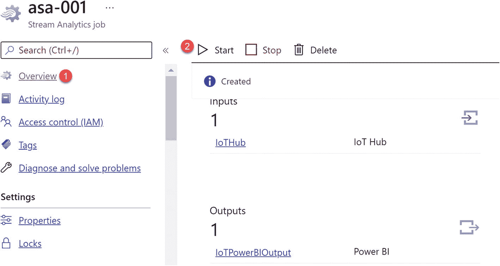

图 16-22

从 Azure 门户启动 ASA 作业

开始作业时，系统会提示您设置作业输出开始时间，如图 [16-23](#Fig23) 所示。此作业将从特定数量的流单元开始。您可以在缩放部分下更改流单位。作业将默认为 3 个流单位。您可以将配置为在流分析提供的标准多租户环境或您拥有的专用流分析集群中运行此作业。该作业将默认为标准环境。作业可能需要提前读取输入数据，以确保结果的准确性。要恢复停止的作业而不丢失数据，请选择上次停止。请注意，如果您是第一次运行作业，此选项不可用。在本练习中，确保作业输出开始时间设置为“Now ”,然后单击“start”。

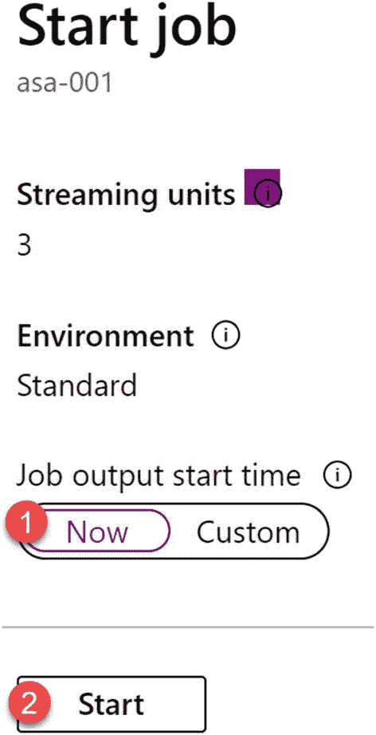

图 16-23

ASA 开始作业详细信息

一旦工作开始，注意“运行”状态，如图 [16-24](#Fig24) 所示。

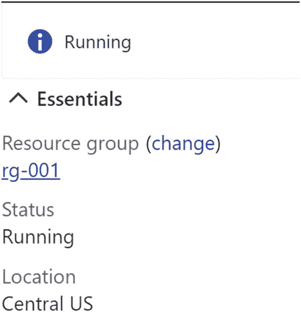

图 16-24

处于运行状态的 ASA 作业

## 创建实时电源 BI 仪表板

一旦作业开始运行，就可以使用 Power BI 开始构建实时仪表板。在这个控制面板上，您将能够看到您的监控查询的结果。密切关注仪表板是您知道异常情况何时出现的方法。

### 创建数据集

首先导航到包含图 [16-25](#Fig25) 所示数据集部分中的 IoTPowerBIDataSet 的工作空间。请注意，流分析作业必须正在运行，并且必须为要创建的数据集处理了至少一个事件。

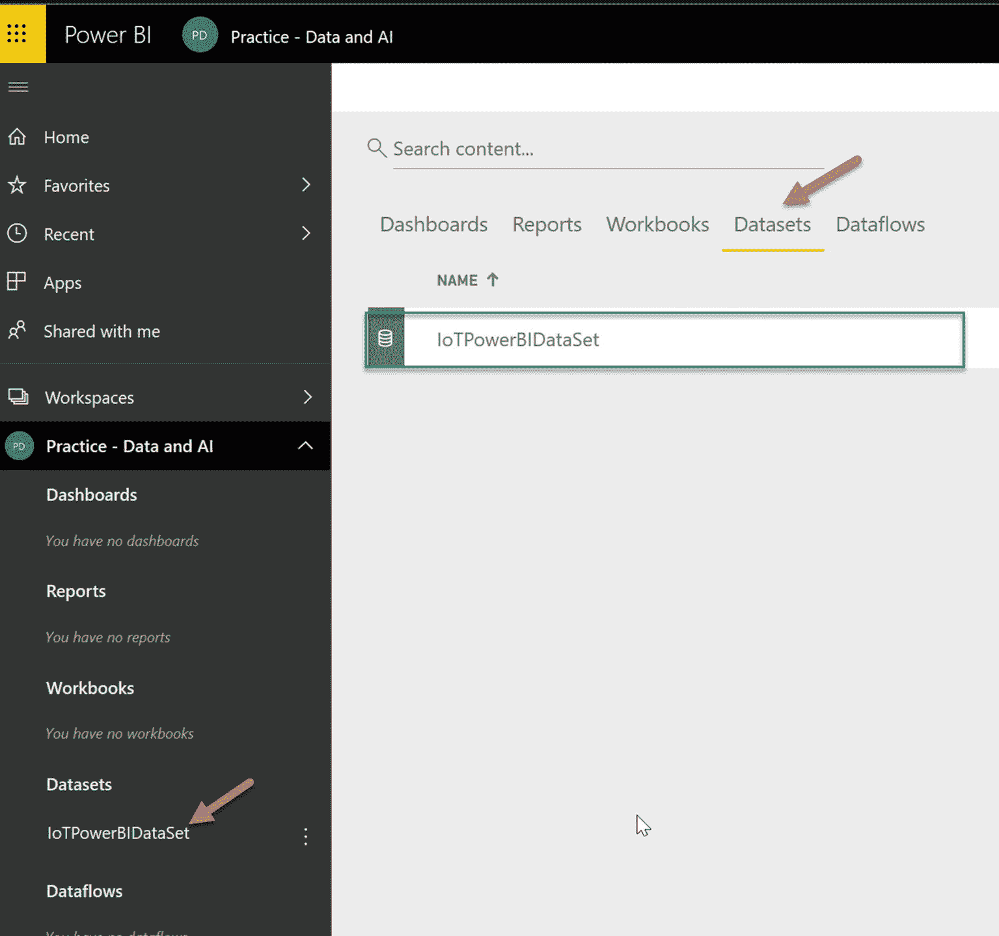

图 16-25

PBI 创建数据集

### 创建仪表板

验证数据集已创建后，还要创建一个新的仪表板，如图 [16-26](#Fig26) 所示。

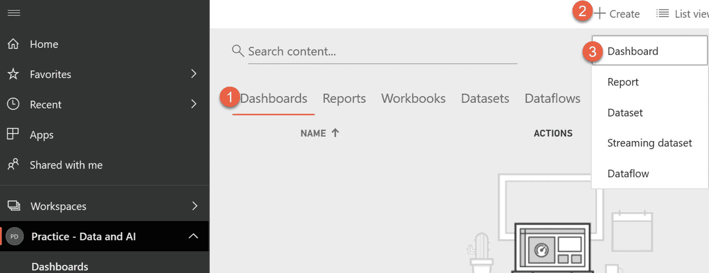

图 16-26

PBI 创建了一个仪表板

为仪表板命名。在本练习中，它被称为 IoTPowerBIDashboard，如图 [16-27](#Fig27) 所示。

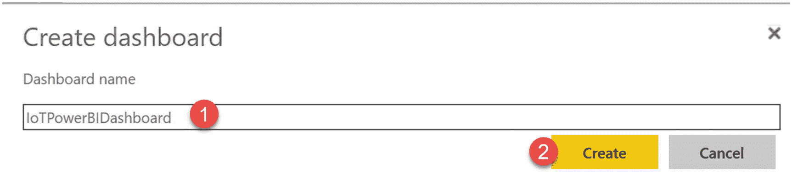

图 16-27

PBI 命名仪表板

### 添加单幅图块

图块是数据的快照，固定在仪表板上。可以从报表、数据集、仪表板等创建切片。仪表板和仪表板磁贴是 Power BI 服务的一项功能，而不是 Power BI Desktop 的功能，因此您需要确保启动并运行 Power BI 服务。为实时自定义流数据添加一个图块，如图 [16-28](#Fig28) 所示。

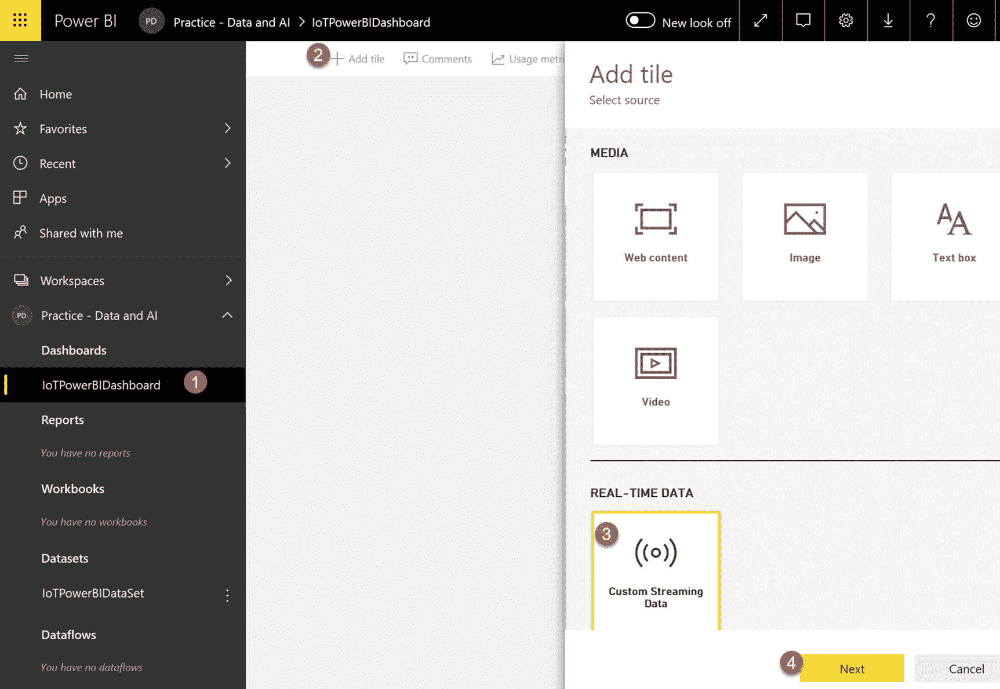

图 16-28

PBI 添加一个瓷砖

选择数据集，如图 [16-29](#Fig29) 所示。请注意，数据集是您导入或连接到的数据的集合。Power BI 允许您连接和导入各种数据集，并将它们集中在一个地方。数据集与工作空间相关联，单个数据集可以是许多工作空间的一部分。

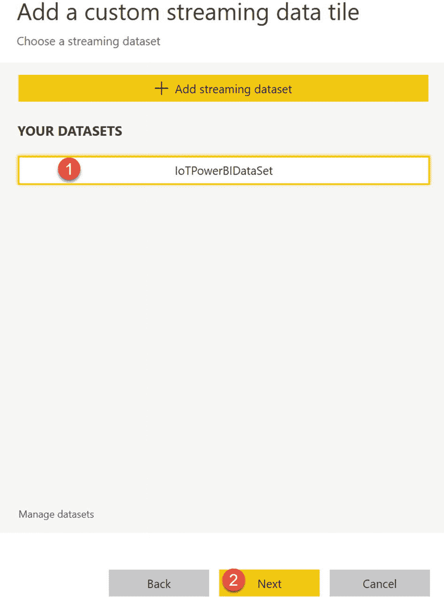

图 16-29

PBI 添加了一个自定义的流数据块

卡片可视化是 Power BI 仪表板中唯一的数字，也是您需要在[仪表板](https://data-flair.training/blogs/power-bi-dashboard/)或报告中跟踪的最重要的东西。在本练习中，异常是需要跟踪的最重要的指标。添加卡片可视化以跟踪峰值和谷值异常的计数，如图 [16-30](#Fig30) 所示。

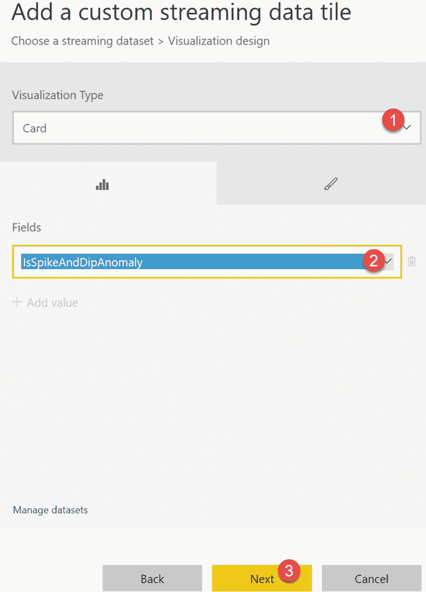

图 16-30

PBI 添加了一个卡片可视化

折线图是由点表示并由直线连接的一系列数据点。折线图可以有一条或多条线。折线图有一个 X 轴和一个 Y 轴。还要添加一个折线图可视化来跟踪峰值和谷值，如图 [16-31](#Fig31) 所示。

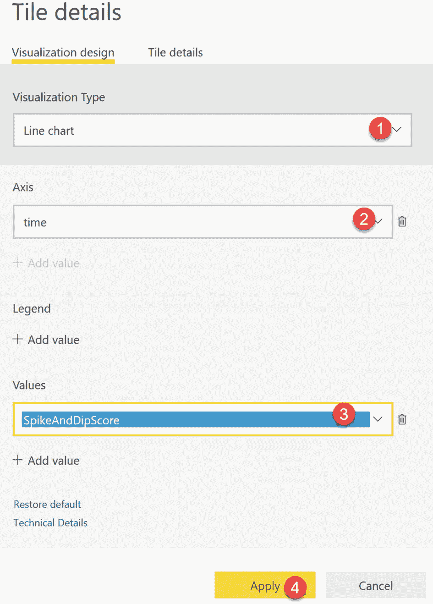

图 16-31

PBI 瓷砖详情

### 运行设备模拟器

现在回到设备模拟器，配置您在本章前几节中积累的物联网集线器详细信息。详细配置完成后，点击设备模拟器中的“更新物联网集线器配置”，如图 [16-32](#Fig32) 所示。

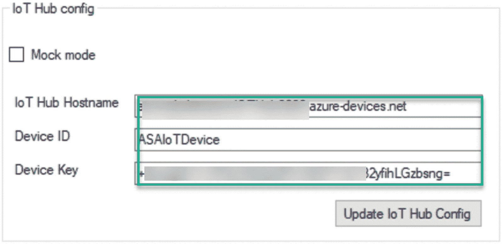

图 16-32

物联网集线器配置详细信息

选择正常事件的异常设置，如图 [16-33](#Fig33) 所示，启动装置模拟器。这将简单地启动模拟器，并开始生成一组正常的事件，这些事件将被传递到物联网中心和 Power BI 仪表板。

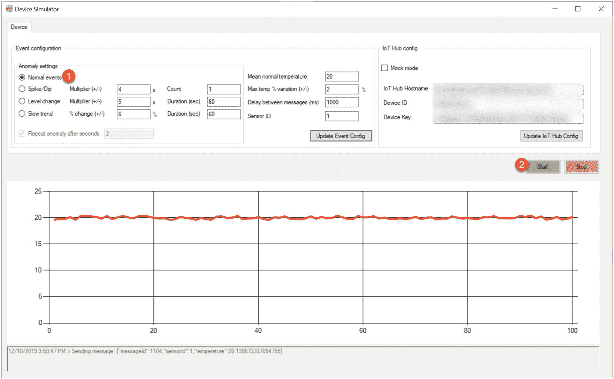

图 16-33

正常事件的设备模拟器异常设置

## 监控实时电源 BI 流

一旦设备启动，回到您的 Power BI 仪表板开始监控流。请注意图 [16-34](#Fig34) 中的流细节现在可以在 Power BI 仪表板上看到。还要注意 SpikeandDip 异常卡仍然为 0，因为我们目前只流式传输正常事件。

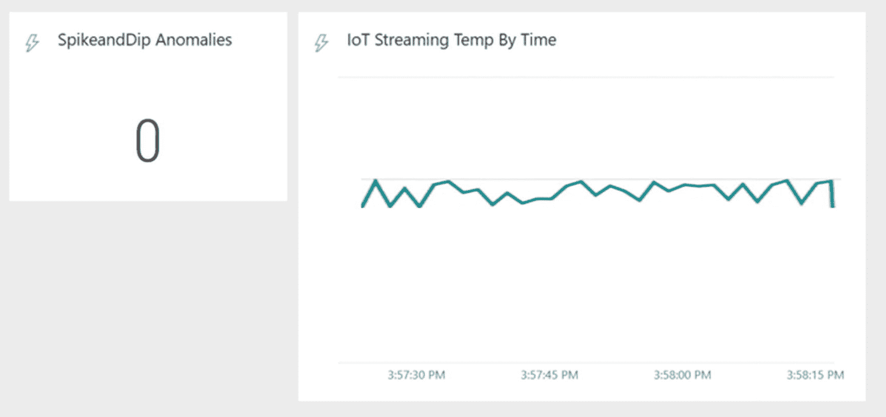

图 16-34

带有正常事件的 PBI 实时流仪表板

然后回到模拟器，将异常设置改为峰值/下降，每 2 秒重复一次。从图 [16-35](#Fig35) 中注意到模拟器中已经开始出现异常。

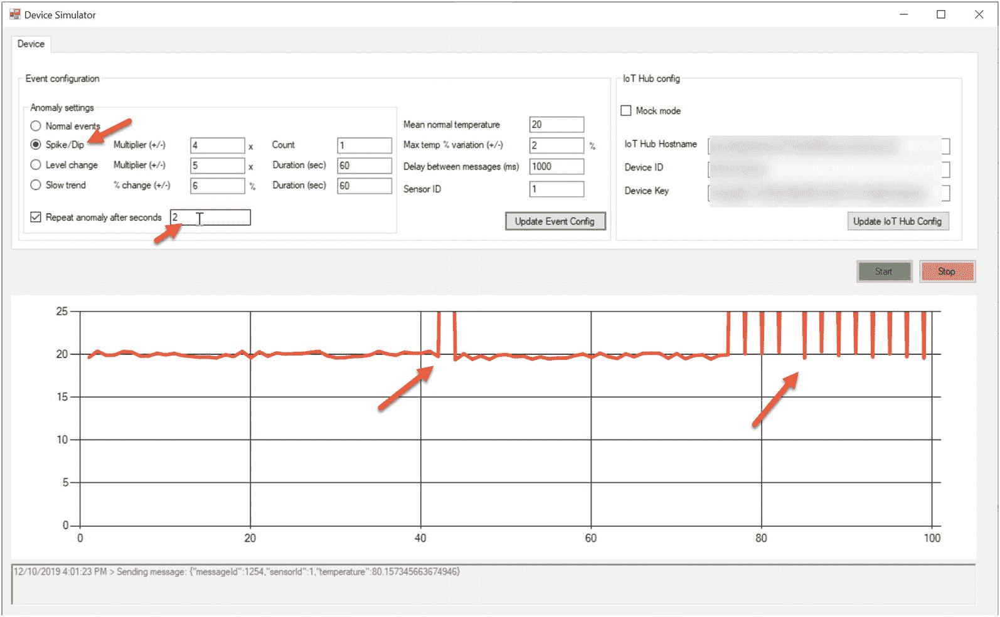

图 16-35

设备模拟器创建异常事件

回到实时功率 BI 仪表板后，请注意尖峰和下降异常已经开始流入仪表板，并且尖峰和下降异常卡开始显示进入的异常，如图 [16-36](#Fig36) 所示。

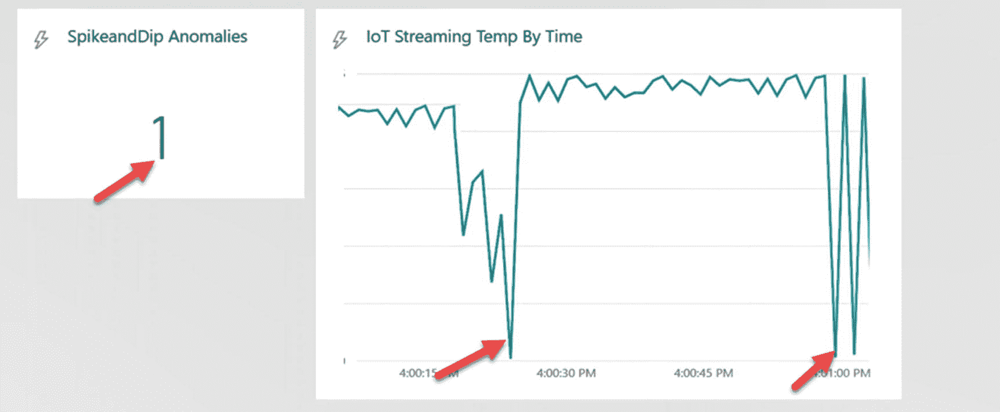

图 16-36

PBI 尖峰和倾斜异常

装置模拟器中还有一些额外的异常设置，可作为下一步探索，如液位变化和缓慢趋势，如图 [16-37](#Fig37) 所示。

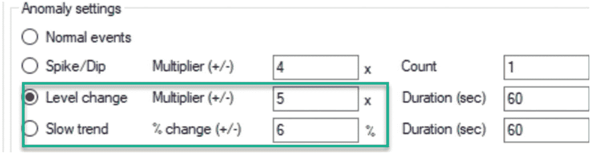

图 16-37

设备模拟器中的 PBI 异常设置

一旦测试完成，确保你回到 Azure Portal 并停止流分析作业和设备模拟器，如图 [16-38](#Fig38) 所示。

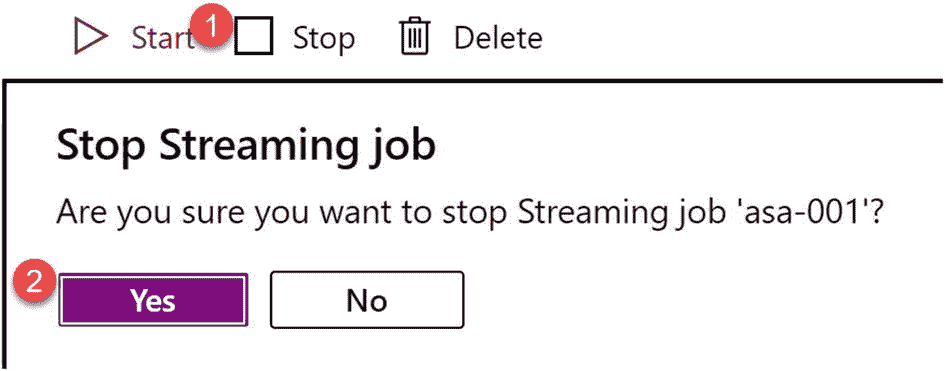

图 16-38

停止流式作业

## 摘要

在本章中，我展示了一个实际的端到端示例，说明如何使用设备模拟器创建实时事件并将这些事件发送到物联网中心，该中心将收集这些事件，并使用 Azure Stream Analytics 的内置峰值和谷值异常检测功能进行下游异常检测。最后，您学习了如何使用 Power BI 将实时流数据可视化到仪表板中。您还了解了 Azure 中实时异常检测和报告的一些功能。