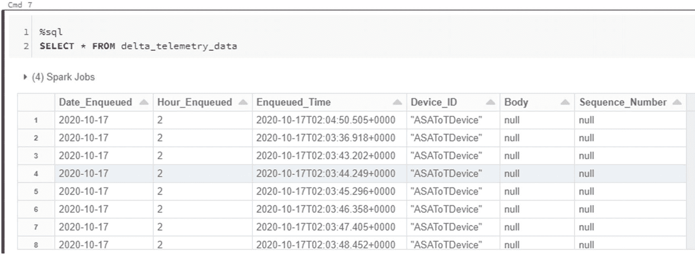

# 十七、使用 Apache Spark 的实时物联网分析

实时物联网分析、高级分析和实时机器学习洞察都是许多组织渴望推进其业务和目标的领域。Apache Spark 先进的 API 产品为大数据工作负载的高级流分析带来了许多机会。Apache Spark 提供的一个这样的 API 以结构化流为中心，支持大数据和实时高级分析功能。

如图 [17-1](#Fig1) 所示，Apache Spark 的结构化流适合整个 Databricks 统一数据分析平台，是一个基于 Spark SQL 引擎构建的流处理框架。一旦指定了计算以及源和目的地，结构化流引擎将随着新数据的可用而递增并连续地运行查询。结构化流将数据流视为一个表，并不断追加数据。在本章中，我将带您完成一个端到端的练习，使用一个设备模拟器来实现一个结构化的流解决方案，该模拟器将生成随机的设备数据，这些数据将被馈送到 Azure IoT Hub，并由 Apache Spark 通过 Databricks 笔记本进行处理，然后进入一个 Delta Lake 来持久存储数据。此外，我将向您展示如何定制结构化的流输出模式，比如 append vs. update vs. complete，并向您介绍代码中的触发器。


图 17-1

Apache Spark 的结构化流和 DeltaLake 框架

## 先决条件

作为本练习的基础，请确保您已经阅读并理解了第 [16](16.html) 章，该章讨论了如何完成以下步骤:

1.  安装并运行物联网设备模拟器 Visual Studio 解决方案文件。该设备模拟器将创建一个随机设备数据流，该数据流将被输入物联网中枢设备，并由 Spark 结构化流使用。

2.  创建和配置物联网集线器设备。这项服务将弥合设备模拟器和 Spark 结构化流服务之间的鸿沟。

3.  此外，Databricks 服务需要在 Azure Portal 中创建。Databricks 的 Spark 计算集群将用于结构化流处理。或者，Synapse Analytics 也可以用于这一过程。

## 创建物联网中心

一旦创建了物联网中心，并向该中心添加了物联网设备，则向物联网中心的内置端点部分添加一个新的消费群，如图 [17-2](#Fig2) 所示。应用使用消费者群体从物联网中心获取数据。因此，当您开始编写结构化流代码时，拥有一个可识别的别名将非常有用。


图 17-2

内置端点事件中心详细信息

## 创建数据块集群

接下来，需要创建一个 Databricks 集群。出于本练习的目的，使用图 [17-3](#Fig3) 所示的配置创建一个标准集群。


图 17-3

标准数据块集群

## 安装 Maven 库

在开始在 Databricks 笔记本中编写结构化流代码之前，还有一个设置和配置步骤。用下面列出的坐标安装一个 Maven 库。这些坐标取自 MvnRepository，可以通过以下网址找到: [`https://mvnrepository.com/artifact/com.microsoft.azure/azure-eventhubs-spark`](https://mvnrepository.com/artifact/com.microsoft.azure/azure-eventhubs-spark) 。

在集群库配置界面输入 Maven 库中的坐标`com.microsoft.azure:azure-eventhubs-spark_2.12:2.3.15`，如图 [17-4](#Fig4) 所示。请注意，有各种库源选项可供选择和安装。对于这个场景，您将使用 Maven。或者，您还可以指定要排除的源存储库和依赖项。


图 17-4

安装 Databricks Maven 库

一旦选定的 Maven 库被安装到集群上，它将显示“已安装”状态，如图 [17-5](#Fig5) 所示。重新启动群集，以便在群集上正确安装库。


图 17-5

查看 Databricks 集群上安装的库

## 创建笔记本并运行结构化流查询

在下一节中，您将了解如何在 Databricks 笔记本中实现 Scala 代码，该笔记本将连接到您的物联网中心，并启动一个结构化的传入设备模拟器事件流。这些实时流事件将显示在您笔记本电脑的仪表板上，并保存在增量表中，以便为进一步的处理和转换准备数据。此外，您将了解触发器的概念以及如何在事件流处理代码中实现它们。

### 配置笔记本连接

现在，您已经准备好创建一个新的 Databricks 笔记本，如图 [17-6](#Fig6) 所示，并将安装了 Maven 库的标准集群附加到它上面。此外，使用 Scala 作为将在本 Databricks 笔记本中实现的代码的语言。


图 17-6

创建新的数据块笔记本

以下代码将使用 IoT Hub 连接详细信息构建连接字符串，并启动结构化流。在本节中，您将需要改进这个通用代码，它目前包括连接配置的占位符。在运行代码之前，替换以下示例中的物联网集线器连接。此外，记得根据 Azure Portal 中的 IoT Hub 中定义的内容来验证代码中的消费者组:

```
import org.apache.spark.eventhubs._
import org.apache.spark.eventhubs.{ ConnectionStringBuilder, EventHubsConf, EventPosition }
import org.apache.spark.sql.functions.{ explode, split }

// To connect to an Event Hub, EntityPath is required as part of the connection string.
// Here, we assume that the connection string from the Azure portal does not have the EntityPath part.
val connectionString = ConnectionStringBuilder("—Event Hub Compatible Endpoint--")
  .setEventHubName("—Event Hub Compatible Name--")
  .build
val eventHubsConf = EventHubsConf(connectionString)
  .setStartingPosition(EventPosition.fromEndOfStream)
  .setConsumerGroup("delta")

val eventhubs = spark.readStream
  .format("eventhubs")
  .options(eventHubsConf.toMap)
  .load()

```

在 Azure Portal 的物联网中心的内置端点部分，复制图 [17-7](#Fig7) 中所示的事件中心兼容名称，并将其替换在提供的代码块的`—Event Hub Compatible Name--`部分。


图 17-7

事件中心-内置端点中兼容的名称

接下来，复制图 [17-8](#Fig8) 所示的事件中枢兼容端点，并将其替换到代码块的`—Event Hub Compatible Endpoint--`部分。


图 17-8

事件中心–内置端点中兼容的端点

### 开始结构化流

本 Databricks 笔记本的第二部分将添加下面提供的代码，该代码旨在获取上一部分中定义的连接，读取流，然后将数据保存到增量表中。图 [17-9](#Fig9) 中的结果表明流已被成功读取。


图 17-9

用于读取和验证流细节的笔记本代码

接下来，运行以下代码来显示流的详细信息:

```
display(eventhubs)

```

图 [17-10](#Fig10) 显示流正在初始化。


图 17-10

正在初始化流

### 启动物联网设备模拟器

完成上一步后，前往设备模拟器，输入与集线器名称空间、设备 ID 和设备密钥相关的物联网集线器设备详细信息，然后运行设备模拟器。一旦设备产生事件，这些事件将开始出现在图 [17-11](#Fig11) 所示设备模拟器底部的折线图中。请注意，正常事件正在生成，因此事件数据在整个过程中相当一致。


图 17-11

设备模拟器详细信息

### 显示实时流数据

在导航回 Databricks 笔记本并展开`display(eventhubs)`代码块的仪表板部分后，请注意与输入相关的输入流的处理指标与处理速率、批处理持续时间和聚集状态，如图 [17-12](#Fig12) 所示。


图 17-12

显示流的处理度量的仪表板

导航至原始数据选项卡，注意数据流的结构和数据，如图 [17-13](#Fig13) 所示。


图 17-13

流的结构和数据

### 创建 Spark SQL 表

由于数据现在是流式的，因此通过在同一个 Databricks 笔记本中的新代码块中运行以下代码来创建一个 Spark SQL 表。请记住根据您的物联网设备数据定义列。在本练习中，使用设备模拟器中的列`body`和`sequenceNumber`:

```
import org.apache.spark.sql.types._
import org.apache.spark.sql.functions._
val schema = (new StructType)
    .add("body", DoubleType)
    .add("sequence_number", DoubleType)
val df = eventhubs.select(($"enqueuedTime").as("Enqueued_Time"),($"systemProperties.iothub-connection-device-id")
                  .as("Device_ID"),(from_json($"body".cast("string"), schema)
                  .as("telemetry_json"))).select("Enqueued_Time","Device_ID", "telemetry_json.*")

```

预期输出将显示`spark.sqlDataFrame`的结果，如图 [17-14](#Fig14) 所示。


图 17-14

spark.sqlDataFrame 的结果

运行以下代码，创建 Spark SQL 表来存储设备遥测数据:

```
df.createOrReplaceTempView("device_telemetry_data")

```

图 [17-15](#Fig15) 显示了该代码在 Databricks 笔记本中的执行结果。


图 17-15

创建 Spark SQL 表

### 将流写入增量表

将流写入增量表，并开始运行以下代码来定义最终数据帧:

```
val finalDF = spark.sql("Select Date(Enqueued_Time) Date_Enqueued, Hour(Enqueued_Time) Hour_Enqueued, Enqueued_Time, Device_ID, body AS Body,sequence_number as Sequence_Number from device_telemetry_data")

```

图 [17-16](#Fig16) 显示了 Databricks 笔记本中代码的执行结果。


图 17-16

定义最终数据帧的代码

将图 [17-17](#Fig17) 中所示的下一个代码块复制并粘贴到同一个 Databricks 笔记本中的一个新单元格中。这段代码将把流写入增量表。请注意，您可以定义分区、格式、检查点位置和输出模式。正在使用默认的检查点位置，该位置由 Databricks 定义和管理，但是您也可以轻松地自己定义该位置，并将数据保存到不同的文件夹中:

```
finalDF.writeStream
  .outputMode("append")
  .option("checkpointLocation", "/delta/events/_checkpoints/device_delta")
  .format("delta")
  .partitionBy("Date_Enqueued", "Hour_Enqueued")
  .table("delta_telemetry_data")

```

图 [17-17](#Fig17) 显示了 Databricks 笔记本中代码的执行结果。


图 17-17

将流写入增量表的代码

注意，在图 [17-17](#Fig17) 中，输出模式被设置为附加。支持以下输出模式:

*   追加(仅向输出接收器添加新记录)

*   更新(就地更新已更改的记录)

*   完成(重写完整输出)

还可以将触发器添加到写入流中，以定义流数据的处理时间，以及该查询是作为具有固定批处理间隔的微批处理查询还是作为连续处理查询来执行。

这里有几个触发器的例子。Apache Spark 的文档包含更多关于触发器的细节，可以在下面的 URL 中找到: [`https://spark.apache.org/docs/2.3.0/structured-streaming-programming-guide.html#triggers`](https://spark.apache.org/docs/2.3.0/structured-streaming-programming-guide.html%2523triggers)

```
.trigger(Trigger.ProcessingTime("2 seconds"))
.trigger(Trigger.Once())
.trigger(Trigger.Continuous("1 second"))

```

请注意图 [17-18](#Fig18) 所示的原始数据选项卡，设备数据持续流入，您现在可以查看样本流数据及其结构。


图 17-18

显示设备数据持续流动的原始数据选项卡

最后，编写并执行图 [17-19](#Fig19) 所示的以下 SQL 查询，以检索结构化流数据正在写入的增量表。然后，该表可用于执行额外的高级分析和/或构建机器学习模型，以获得对物联网设备数据的更有价值的实时洞察:

```
%sql
SELECT *
FROM   delta_telemetry_data

```

图 [17-19](#Fig19) 显示了 Databricks 笔记本中代码的执行结果。



图 17-19

查询结构化流数据正在写入的增量表

## 摘要

在这一章中，我演示了如何使用设备模拟器实现结构化的流解决方案，该模拟器将随机设备数据生成到 Azure IoT Hub 中，由 Apache Spark 通过 Databricks 笔记本进行处理，并流入 Delta Lake 以持久存储数据。我还向您展示了如何定制结构化的流输出模式，包括追加、更新和完成。最后，我介绍了触发器的概念以及如何在您的 Databricks 笔记本代码中实现它们。

在 Databricks 中使用 Apache Spark 进行实时分析是流分析的替代方案，最适合大数据场景或数据非常非结构化的情况，需要 Databricks 中提供的一些高级功能，如模式进化等。它也非常适合将您的实时流与高级分析和机器学习工作流相集成。潜力是无限的，这一章仅仅触及了其中一些功能的表面。