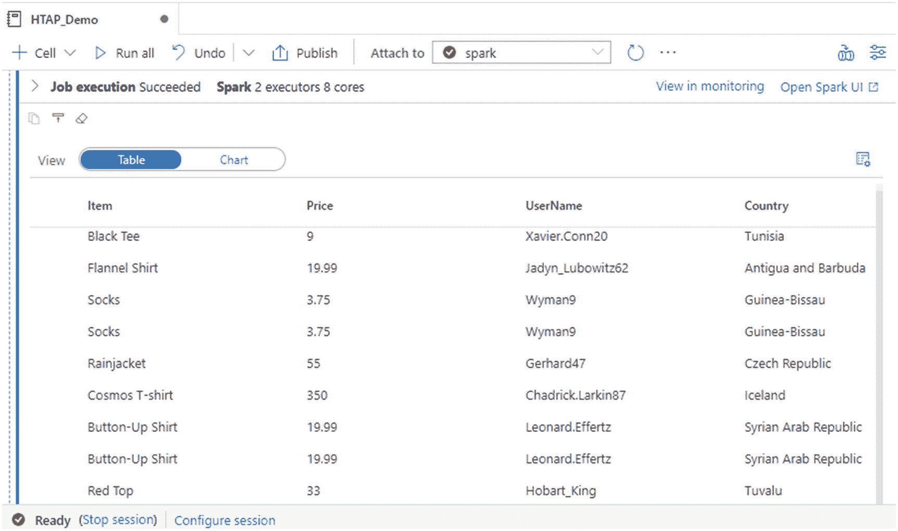

# 18.用于 Cosmos DB 的 Azure Synapse 链接

对存储在诸如 Cosmos DB 之类的事务系统中的数据进行近乎实时的洞察，是许多组织的长期目标和需求。Azure Synapse Link for Azure Cosmos DB 是一种云原生混合事务和分析处理(HTAP)功能，允许用户对 Azure Cosmos DB 中的运营数据进行近实时分析。数据工程师、业务分析师和数据科学家现在能够使用 Spark 或 SQL 池获得对其数据的近乎实时的洞察，而不会影响其在 Cosmos DB 中的事务性工作负载的性能。

Azure Synapse Link for Azure Cosmos DB 有许多优势，包括降低复杂性，因为接近实时的分析存储减少或消除了对复杂 ETL 或更改 feed 作业流程的需求。此外，对运营工作负载几乎没有影响，因为分析工作负载是独立于事务工作负载呈现的，不会消耗调配的运营吞吐量。此外，它还通过利用 Spark 和 SQL 按需池的功能，针对大规模分析工作负载进行了优化，由于具有高度弹性的 Azure Synapse 分析计算引擎，这使得它具有成本效益。Azure Synapse Link for Azure Cosmos DB 针对运营数据上的工作负载(包括聚合等)提供了一个面向列的分析存储，以及分析工作负载的解耦性能，支持对交易数据的自助式、近实时洞察，如图 [18-1](#Fig1) 所示。


图 18-1

Azure Synapse Link 的架构图

在本章中，您将通过实际的端到端练习了解如何实现以下目标:

1.  创建一个支持分析存储的基本 Azure Cosmos DB 帐户。

2.  在 Azure Synapse Analytics 中创建 Cosmos DB 链接服务。

3.  使用 Synapse Workspace 笔记本中的 Spark 来聚合和查询 Cosmos DB 数据。

## 创建一个 Azure Cosmos DB 帐户

Azure Cosmos DB 是一个完全托管的 NoSQL 数据库服务，用于现代应用开发。你需要从 Azure Portal 创建一个 Azure Cosmos DB 帐户，如图 [18-2](#Fig2) 所示。


图 18-2

创建一个宇宙数据库

如图 [18-3](#Fig3) 所示，确保帐户详细信息配置正确，并创建 Azure Cosmos DB 帐户。


图 18-3

配置 Cosmos DB 帐户详细信息

概括地说，在本节中，您使用核心(SQL) API 创建了一个 Azure Cosmos DB 帐户。有许多 API 可供选择，包括 native Core (SQL) API、MongoDB API、Cassandra API、Gremlin API 和 Table API。此外，选择调配吞吐量作为容量模式，因为它最适合具有持续流量、需要可预测性能的工作负载，而无服务器最适合具有间歇或不可预测流量以及较低的平均峰值流量比的工作负载。有关容量模式的更多详情，请参见 [`https://docs.microsoft.com/en-us/azure/cosmos-db/throughput-serverless`](https://docs.microsoft.com/en-us/azure/cosmos-db/throughput-serverless) `.`

## 启用 Azure Synapse 链接

一旦创建了 Cosmos DB 帐户，您将需要启用 Azure Synapse 链接，默认设置为“关闭”这可以通过首先点击图 [18-4](#Fig4) 所示的 Azure Synapse 链接功能来实现。


图 18-4

为 Cosmos DB 启用 Synapse Link 的步骤

然后点击“启用”，如图 [18-5](#Fig5) 所示。


图 18-5

启用 Synapse 链接

图 [18-6](#Fig6) 显示一旦 Azure Synapse Link 被启用，状态将变为“开启”


图 18-6

Synapse 链接已打开

## 创建一个 Cosmos DB 容器和数据库

既然已经为 Azure Synapse Link 启用了 Azure Cosmos DB 帐户，那么就创建一个数据库和容器。首先，Cosmos DB 中的 Quick start 部分可以让您更轻松地选择平台、创建数据库和容器，然后开始使用 Cosmos DB 笔记本来运行代码以导入数据。

出于本练习的目的，请使用 Python 平台。然而，请注意可供选择的更多平台选项，如图 [18-7](#Fig7) 所示。


图 18-7

用 Python 创建新笔记本

图 [18-8](#Fig8) 显示了如何通过用户界面创建一个数据库和容器。还有一些选项可用于从一个新的笔记本或带有预定义代码的样本笔记本开始。


图 18-8

创建新的 Cosmos DB 容器

您需要配置数据库名称、吞吐量、容器名称和分区键，如图 [18-9](#Fig9) 所示。您总是可以从包含 400 RU/s 和 5 GB 存储的空闲层开始，然后相应地纵向扩展。


图 18-9

配置容器数据库 id 和吞吐量详细信息

最后，一定要记住设置分区键并打开分析存储器，如图 [18-10](#Fig10) 所示。分区键用于跨多个服务器自动分区数据，以实现可伸缩性。它是一个分析商店，允许您对数据进行实时分析。


图 18-10

配置剩余的容器详细信息

## 将数据导入 Azure Cosmos DB

既然您已经创建并配置了数据库和容器的细节，那么创建一个新的笔记本来将数据导入到 Cosmos 数据库容器中，如图 [18-11](#Fig11) 所示。


图 18-11

在 Cosmos DB 中添加新笔记本

首先读取您在上一步中创建的数据库和容器，如图 [18-12](#Fig12) 所示。 [Azure Cosmos DB Python 示例](https://docs.microsoft.com/en-us/azure/cosmos-db/sql-api-python-samples) ( [`https://docs.microsoft.com/en-us/azure/cosmos-db/sql-api-python-samples`](https://docs.microsoft.com/en-us/azure/cosmos-db/sql-api-python-samples) )有额外的 API 引用命令，可以在笔记本代码中使用。请访问前面的 URL，了解有关为 Azure Cosmos DB 配置和使用 Azure Synapse Link 的更多信息，并查看其他代码片段，包括如何使用`analytical_storage_ttl`命令定义和更新分析存储生存时间。


图 18-12

创建或读取新的数据库和容器

下面是如图 [18-12](#Fig12) 所示的代码，用于读取您在上一节中创建的数据库和容器名称:

```
import azure.cosmos
from azure.cosmos.partition_key import PartitionKey

database = cosmos_client.get_database_client('RetailDemo')
print('Database RetailDemo Read')

container = database.get_container_client('WebsiteData')
print('Container WebsiteData Read')

```

一旦数据被读取，您可以通过使用图 [18-13](#Fig13) 所示的代码来更新容器的吞吐量，以允许更快的上传。


图 18-13

加载前扩大吞吐量

以下是图 [18-13](#Fig13) 中所示的代码，用于更新容器的吞吐量，以加快上传速度:

```
old_throughput = container.read_offer().offer_throughput
new_throughput = container.replace_throughput(1000).offer_throughput
print("Container WebsiteData's throughput updated from {} RU/s to {} RU/s".format(old_throughput, new_throughput))

```

接下来，使用图 [18-14](#Fig14) 所示的%%upload magic 函数将物品插入容器。


图 18-14

将数据加载到 Cosmos DB

下面是图 [18-14](#Fig14) 所示的代码，它使用%%upload 魔法函数将项目插入容器:

```
%%upload --databaseName RetailDemo --containerName WebsiteData --url https://cosmosnotebooksdata.blob.core.windows.net/notebookdata/websiteData.json

```

图 [18-15](#Fig15) 显示了一旦数据加载完成，如何通过编程降低容器的吞吐量。


图 18-15

加载完成后，缩减吞吐量

下面是图 [18-15](#Fig15) 所示的代码，用于在数据加载完成后按比例降低容器的吞吐量:

```
lowered_throughput = container.replace_throughput(400).offer_throughput
print("Container WebsiteData's throughput lowered from {} RU/s to {} RU/s".format(new_throughput, lowered_throughput))

```

## 在 Azure Synapse Analytics 中创建 Cosmos DB 链接服务

在 Cosmos DB 数据库容器中提供数据后，按照图 [18-16](#Fig16) 中所示的步骤，在 Azure Synapse Analytics 工作区中创建一个链接服务。


图 18-16

在 Synapse Analytics 中创建 Cosmos DB 链接

记得选择 Azure Cosmos DB (SQL API)，如图 [18-17](#Fig17) 所示，因为这是 Azure Cosmos DB API 的配置。注意，还有一个 MongoDB API 选项。


图 18-17

创建到 Cosmos DB 的链接的步骤

填写图 [18-18](#Fig18) 中所示的所需连接配置细节，并创建新的链接服务。


图 18-18

创建新的链接服务

## 使用 Synapse Spark 加载和查询数据

从 Azure Synapse Analytics 创建一个新的链接到 Cosmos DB 的服务后，按照图 [18-19](#Fig19) 所示的步骤创建一个新的笔记本并将数据加载到数据框中。


图 18-19

将数据加载到数据框进行分析

我想说明支持分析存储的容器和不支持分析存储的容器之间的视觉差异。基本上，启用分析存储的容器将有额外的三行，代表分析工作负载的列存储，如图 [18-20](#Fig20) 所示。


图 18-20

启用非分析存储

创建链接服务后，运行以下代码，该代码将在数据加载到上一步中的数据框时自动创建。在运行代码之前，记得创建一个 Synapse Spark pool 并将其连接到笔记本:

```
# Read from Cosmos DB analytical store into a Spark DataFrame and display 10 rows from the DataFrame
# To select a preferred list of regions in a multi-region Cosmos DB account, add .option("spark.cosmos.preferredRegions", "<Region1>,<Region2>")

df = spark.read\
    .format("cosmos.olap")\
    .option("spark.synapse.linkedService", "LS_CosmosDb_RetailDemo")\
    .option("spark.cosmos.container", "WebsiteData")\
    .load()

display(df.limit(10))

```

请注意图 [18-21](#Fig21) 中的插图，代码运行成功，并使用了两个执行器和八个内核来完成任务。请注意，这可以进行定制，以适应您所需的工作负载。此外，可以在 Spark UI 中查看作业细节。


图 18-21

要加载到数据框的代码

图 [18-22](#Fig22) 显示了数据框中前十条记录的预览，这证实了实时查询功能处于活动状态。



图 18-22

返回的样本数据的图像

接下来，使用以下代码聚合数据集以获得价格列的总和，然后显示数据框:

```
from pyspark.sql.functions import *
df = df.agg(sum(col('Price')))

df.show()

```

在作业完成运行后，图 [18-23](#Fig23) 显示了操作性 Cosmos DB 数据上成功聚合的价格列，而无需利用任何定制的 ETL 过程。这展示了利用这种 Azure Synapse Link for Cosmos DB 功能的未来方法的能力，以使自助服务数据用户能够以接近实时的速度获得对其数据的洞察。


图 18-23

汇总价格数据

## 摘要

在本章中，我向您展示了如何创建一个支持分析存储的基本 Azure Cosmos DB 帐户，如何在 Azure Synapse Analytics 中创建一个 Cosmos DB 链接服务，以及如何使用 Synapse Workspace 笔记本中的 Spark 来聚合和查询 Cosmos DB 数据。

通过设置这一流程，您的组织能够从对事务性数据的实时分析中获得有价值的见解，这使得业务分析师、数据科学家、数据工程师和其他公民开发人员能够分析大型数据集，而不会影响事务性工作负载的性能。除了其他各种好处之外，这个过程减少了构建和管理复杂 ETL 作业的需要。