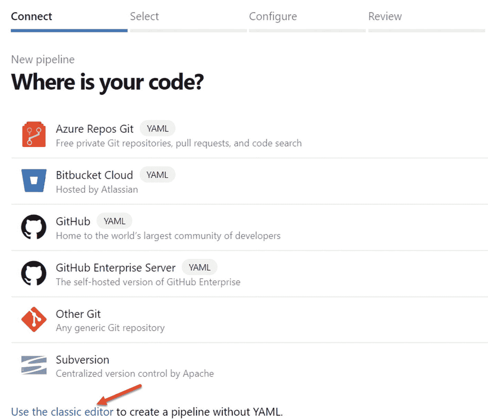
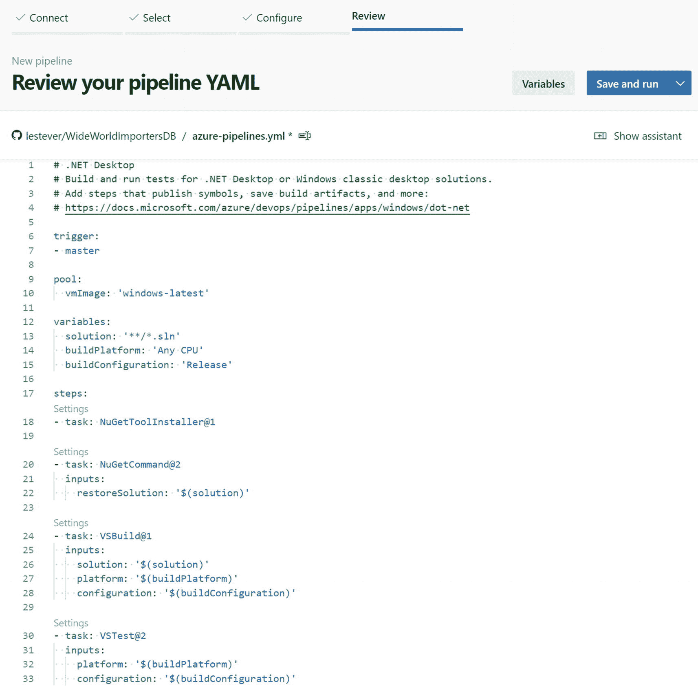
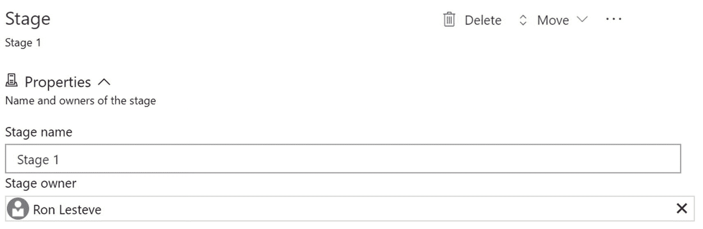

# 二十、部署 SQL 数据库

开发和测试应用的 DevTest 环境与生产环境之间的基础结构差异和不一致性是 IT 专业人员和软件开发人员可能会遇到的常见情况。尽管应用最初是以正确的方式部署的，但是对生产环境所做的配置更改可能会导致差异。客户经常会问，是否有一种无缝的方式来自动创建 Azure 资源，同时确保跨多个环境的一致性。

基础设施即代码是创建模板的过程，该模板定义并随应用一起部署环境，以确保一致性。Azure 资源管理器(ARM)是 Azure 的部署和管理服务。它提供了一致的管理层，使您能够创建、更新和删除 Azure 订阅中的资源。部署后，您可以使用其访问控制、审计和标记功能来保护和组织您的资源。

通过使用 ARM 模板，您可以通过声明性模板而不是脚本来管理您的基础架构，并作为一个组来部署、管理和监控您的解决方案的所有资源，而不是单独处理这些资源。此外，您可以在整个开发生命周期中重复部署您的解决方案，并且确信您的资源以一致的状态部署。

Visual Studio 中有几个源代码管理选项。GitHub 是这些源代码控制选项之一，它提供了许多好处，包括高级安全选项。集成多个应用，如 Visual Studio、GitHub、Azure DevOps 和 Azure SQL 数据库，以实现无缝 CI/CD 流程，这是许多企业在实现数据和基础架构平台现代化的过程中日益增长的需求。在本章中，我将展示图 [20-1](#Fig1) 所示架构流程的端到端解决方案，通过 GitHub 存储库将 AdventureWorksLT2019 数据库从 Visual Studio 部署到 Azure SQL 数据库，然后通过 Azure DevOps 构建(CI)和发布(CD)管道进行部署。

图 20-1

使用 GitHub repo 和 Visual Studio Azure SQL 数据库项目的 Azure DevOps CI/CD

## 先决条件

在您开始图 [20-1](#Fig1) 所示的架构模式的开发和部署过程之前，您需要创建以下先决资源:

1.  SSDT 版 Visual Studio 2019:您将使用 Visual Studio 2019 和 SSDT 版 Visual Studio 来部署这个数据库项目解决方案。你可以从这个网址下载最新版本的 Visual Studio:[`https://visualstudio.microsoft.com/downloads/`](https://visualstudio.microsoft.com/downloads/)。此外，您可以从以下网址下载 SQL Server Data Tools(SSDT)for Visual Studio:[`https://docs.microsoft.com/en-us/sql/ssdt/download-sql-server-data-tools-ssdt?view=sql-server-ver15`](https://docs.microsoft.com/en-us/sql/ssdt/download-sql-server-data-tools-ssdt%253Fview%253Dsql-server-ver15)。

2.  GitHub 帐户和回购:由于您将把您的 Visual Studio 项目与 GitHub 源代码控制帐户相关联，因此您可以使用该 URL 来了解更多有关如何在 GitHub `(` [`www.wikihow.com/Create-an-Account-on-GitHub`](https://www.wikihow.com/Create-an-Account-on-GitHub) `)`中创建帐户的信息。此外，您可以从这个 URL: [`https://docs.github.com/en/enterprise/2.16/user/github/getting-started-with-github/create-a-repo`](https://docs.github.com/en/enterprise/2.16/user/github/getting-started-with-github/create-a-repo) 了解更多关于如何创建 GitHub repo 的信息。

3.  Azure DevOps 帐户和项目:最后，您将需要一个 Azure DevOps 帐户和项目，用于构建 CI/CD 流程。您可以使用以下 URL 作为参考来创建组织和项目: [`https://docs.microsoft.com/en-us/azure/devops/organizations/accounts/create-organization?view=azure-devops`](https://docs.microsoft.com/en-us/azure/devops/organizations/accounts/create-organization%253Fview%253Dazure-devops) 。

## 创建 Visual Studio SQL 数据库项目

首先在 Visual Studio 2019 中创建新的 SQL 数据库项目，如图 [20-2](#Fig2) 所示。在项目中，您将导入示例 AdventureWorks 数据库。

图 20-2

创建 VS 项目的步骤

接下来，图 [20-3](#Fig3) 显示了您应该如何通过输入项目名称、位置和解决方案来配置和创建新的 SQL 数据库项目。

图 20-3

配置项目的步骤

## 安装 Visual Studio GitHub 扩展

由于这个 Visual Studio 解决方案将链接到 GitHub 源代码控制库，您将需要安装如图 [20-4](#Fig4) 所示的 GitHub 扩展，这将把 GitHub 流引入 Visual Studio。

图 20-4

安装 GitHub 扩展的步骤

此时，您应该关闭 Visual Studio 以完成 GitHub 扩展安装，这将启动如图 [20-5](#Fig5) 所示的安装。

图 20-5

显示扩展安装程序的图像

## 导入 AdventureWorks 数据库

重新打开 Visual Studio 项目，导入 AdventureWorksLT2019 Dacpac 文件，如图 [20-6](#Fig6) 所示。您可以从以下 URL 下载 [AdventureWorks 示例数据库](https://docs.microsoft.com/en-us/sql/samples/adventureworks-install-configure%253Fview%253Dsql-server-ver15%2526tabs%253Dssms)，用于导入过程: [`https://docs.microsoft.com/en-us/sql/samples/adventureworks-install-configure?view=sql-server-ver15&tabs=ssms`](https://docs.microsoft.com/en-us/sql/samples/adventureworks-install-configure%253Fview%253Dsql-server-ver15%2526tabs%253Dssms) 。

图 20-6

导入数据层的步骤

点击数据层应用选项后，会出现如图 [20-7](#Fig7) 所示的导入数据层应用文件界面，您需要选择合适的 Dacpac 文件并点击开始。

图 20-7

步骤 2 导入数据层 Dacpac

点击完成继续导入过程，如图 [20-8](#Fig8) 所示。请注意，状态和导入步骤显示在这个摘要 UI 中。

图 20-8

摘要导入进度的图像

一旦导入了数据层应用，模式将作为文件夹列在 SQL Server 数据库项目中，如图 [20-9](#Fig9) 所示。

图 20-9

AdventureWorks 解决方案项目的图像

确保从图 [20-10](#Fig10) 中的数据库项目属性 GUI 将数据库项目目标平台设置为 Microsoft Azure SQL Database。

图 20-10

项目属性和目标平台的图像

## 连接到 GitHub Repo 源代码控制

现在项目已经被导入并配置好了，将解决方案添加到 GitHub 源代码控制中，如图 [20-11](#Fig11) 所示。开始连接过程时，会要求您登录 GitHub。

图 20-11

向源代码管理添加解决方案的步骤

此时，继续从 Visual Studio GUI 提示符连接到 GitHub，如图 [20-12](#Fig12) 所示，使用您的 GitHub 凭证登录。

图 20-12

登录 GitHub 的步骤

会出现一个提示，授权 Visual Studio 和 GitHub 集成在一起。查看配置设置，然后点击授权 github，如图 [20-13](#Fig13) 所示。

图 20-13

授权 Visual Studio 的步骤

## 将 Visual Studio 解决方案签入 GitHub Repo

现在，解决方案已经添加到 GitHub 存储库中，单击 home，然后单击 sync，将解决方案签入并同步到 GitHub 存储库中，如图 [20-14](#Fig14) 所示。

图 20-14

同步到回购的步骤

此时，验证同步细节并点击发布，如图 [20-15](#Fig15) 所示，将解决方案同步到所需的 GitHub repo。

图 20-15

发布到回购的步骤

成功发布同步设置后，验证 Visual Studio 解决方案是否已签入选定的 GitHub repo 和分支。在图 [20-16](#Fig16) 中，注意解决方案和数据库已经被登记到存储库中。

图 20-16

GitHub repo 的图像

## 从 GitHub 安装 Azure 管道

既然已经将 Azure GitHub 与 Visual Studio 集成在一起，那么是时候从 GitHub Marketplace 安装 Azure Pipelines 来将 GitHub 与 Azure DevOps 集成在一起了。前往市场，搜索并点击 Azure Pipelines，如图 [20-17](#Fig17) 所示，这将导航到 Azure Pipelines 设置页面。

图 20-17

添加 Azure 管道

Azure Pipelines 自动构建和测试代码项目，以使它们对其他人可用。它几乎适用于任何语言或项目类型。Azure Pipelines 结合了持续集成(CI)和持续交付(CD ),以持续一致地测试和构建您的代码，并将其发送到任何目标。通过点击图 [20-18](#Fig18) 所示的设置计划来设置 Azure Pipelines 计划。

图 20-18

建立 Azure 管道计划

查看定价详情`(` [`https://azure.microsoft.com/en-us/pricing/details/devops/azure-devops-services/`](https://azure.microsoft.com/en-us/pricing/details/devops/azure-devops-services/) `)`了解更多关于 Azure DevOps 管道的详情。我通常建议从免费层开始，并根据需要进行扩展。在这个练习中，您可以选择免费帐户，它有许多免费的好处。点击免费安装，如图 [20-19](#Fig19) 所示，开始 Azure 管道安装过程。

图 20-19

安装 Azure 管道计划的步骤

您将被要求检查您的订单，然后完成订单以开始安装。请注意图 [20-20](#Fig20) 中的内容，使用免费计划，您将不会按月支付任何费用。

图 20-20

完成 Azure 管道安装计划的步骤

此时，选择是将 Azure Pipelines 安装到所有还是选定的存储库，点击安装，如图 [20-21](#Fig21) 所示。请注意，读写访问权限显示在安装页面上。

图 20-21

安装 Azure 管道的步骤

出现提示时，选择您的 Azure DevOps 管道项目和组织，点击继续，如图 [20-22](#Fig22) 所示。

图 20-22

设置 Azure 管道项目

出现提示时，授权 Azure Pipelines 和 GitHub 之间的集成，如图 [20-23](#Fig23) 所示。

图 20-23

授权 Azure 管道的步骤

## 从 GitHub Repo 构建 CI 管道

现在，您已经准备好从 GitHub repo 构建一个持续集成(CI)管道了。点击使用经典编辑器，如图 [20-24](#Fig24) 所示，创建没有 YAML 的构建管道。

图 20-24

选择代码位置的步骤

请注意，还有一个选项是创建需要 YAML 代码的 YAML 管道。想了解更多关于 YAML 的信息，我推荐阅读这篇文章，在 [`www.cloudbees.com/blog/yaml-tutorial-everything-you-need-get-started/`](https://www.cloudbees.com/blog/yaml-tutorial-everything-you-need-get-started/) 几分钟内开始了解 YAML。图 [20-25](#Fig25) 展示了一个 YAML 代码块的示例，以及你如何编写和配置它作为一个新的管道选项运行。在本练习中，使用经典编辑器创建管道。

图 20-25

显示 YAML 代码选项的图像

对于不使用 YAML 的经典选项，从空工单开始，如图 [20-26](#Fig26) 所示。

图 20-26

选择一个空作业模板

接下来，选择 GitHub 作为源。请注意图 [20-27](#Fig27) 中有许多可用的信号源选项可供选择。此外，选择所需的回购和分支。

还有一些额外的可用设置，通常设置为图 [20-27](#Fig27) 中列出的默认值。这些选项包括以下内容:

图 20-27

选择 GitHub 源

*   **Clean** :允许您在构建运行之前对私有代理的工作目录进行各种清理。

*   **标记源代码**:允许您在构建完成后标记源代码文件，以识别每个文件的哪个版本包含在完成的构建中。

*   **报告构建状态**:在源存储库上显示一个标记，指示构建是成功还是失败。

*   **签出子模块**:签出您的 Git 子模块，如果它们在同一个存储库中或者在一个公共存储库中。

*   **从 LFS 检出文件**:配置本地工作目录，但跳过同步源。

*   **不同步源**:限制从每个远程分支历史的尖端获取指定数量的提交，并允许您在获取深度选项中指定提交数量。

搜索并添加 *MSBuild* 任务到管道中，如图 [20-28](#Fig28) 所示。此任务将生成 Visual Studio 解决方案。

图 20-29

MSBuildConfig 的图像

图 20-28

添加 MSBuild 任务

验证图 [20-29](#Fig29) 中所示的 MSBuild 配置。**/*的相对通配符路径。sln 足以识别解决方案文件。

另外，添加如图 [20-30](#Fig30) 所示的复制文件任务，该任务将文件复制到工件暂存目录。空的源文件夹指定了存储库的根目录。在 Contents 中，*复制指定源文件夹中的所有文件，**复制指定源文件夹中的所有文件以及所有子文件夹中的所有文件，* * *从任何 bin 文件夹中递归复制所有文件。最后，使用变量构建目标文件夹。

图 20-30

添加复制文件任务

在复制文件任务中，验证图 [20-31](#Fig31) 所示的可用配置选项。

图 20-31

拷贝文件配置的图像

最后，添加如图 [20-32](#Fig32) 所示的发布构建工件任务，将暂存目录工件发布到 Azure 管道。

图 20-32

添加发布构建工件的步骤

验证图 [20-33](#Fig33) 中所示的发布构建工件配置。注意，要发布的路径是由一个变量指定的。

图 20-33

显示发布构建工件配置的步骤

验证构建管道任务的顺序是否正确，如图 [20-34](#Fig34) 所示。点击&保存队列。

图 20-34

构建任务摘要

验证图 [20-35](#Fig35) 所示的运行管线参数，点击保存并运行。

图 20-35

运行管道任务配置的图像

注意图 [20-36](#Fig36) 中的构建管道摘要，它包含了工作的细节和状态。

图 20-36

构建管道摘要

代理作业完成运行后，您将能够确认成功的作业状态。图 [20-37](#Fig37) 中的绿色复选框表示工作中所有任务步骤的成功完成。

图 20-37

构建作业摘要的图像

## 从 DevOps 项目报告中释放 CD 管道

既然已经创建并成功部署了构建管道，那么是时候创建发布管道了。首先添加一个发布管道工件，如图 [20-38](#Fig38) 所示。

图 20-38

添加发布工件的步骤

选择构建工件作为源类型，如图 [20-39](#Fig39) 所示。请注意其他可用的来源选项，其中包括各种来源回购。完成其他必需详细信息的配置，然后单击添加。

图 20-39

将构建工件添加到发布中

当提示选择模板时，为该阶段添加一个空作业。这可以通过点击表示空工单的蓝色链接找到，如图 [20-40](#Fig40) 所示。

图 20-40

选择空作业模板

验证图 [20-41](#Fig41) 所示的载物台属性。

图 20-41

验证阶段属性

在阶段内增加一个任务，如图 [20-42](#Fig42) 所示。

图 20-42

添加阶段任务

验证新发布管道中的代理作业详细信息，如图 [20-43](#Fig43) 所示。

图 20-43

发布代理配置的图像

首先添加一个 Azure Key Vault 任务，作为存储您的 SQL 数据库凭证的安全方式，这些凭证包括您的用户名和密码，它们作为秘密存储在 Azure Key Vault 中，如图 [20-44](#Fig44) 所示。

图 20-44

添加 Azure Key Vault 任务

实现这一点所需的步骤如图 [20-45](#Fig45) 所示，首先通过点击管理添加你的 Azure 订阅，然后登录到你的 Azure 帐户，从你的 Azure 订阅中选择你的密钥库帐户，最后选择秘密，在这种情况下将是*登录密码*和*登录用户*。

图 20-45

配置 Azure 密钥库任务

接下来，您需要添加一个 Azure SQL 数据库部署任务，如图 [20-46](#Fig46) 所示，该任务将使用 Dacpac 文件部署 Azure SQL 数据库。

图 20-46

添加 Azure SQL 数据库部署任务

填充必要的 Azure SQL 数据库部署参数，如图 [20-47](#Fig47) 所示。

图 20-47

填充必要的 Azure SQL 数据库部署参数

此外，在 Azure SQL Dacpac 任务中，选择 AdventureWorksLT2019 Dacpac 文件，该文件是从以前的构建管道中构建并存储在工件放置目录中的，如图 [20-48](#Fig48) 所示，然后单击确定。

图 20-48

选择 Dacpac 文件

继续创建新的发布管道，点击创建，如图 [20-49](#Fig49) 所示。

图 20-49

创建新版本

验证释放管道已经成功，如图 [20-50](#Fig50) 的阶段部分所示。

图 20-50

显示发布管道运行状态的图像

此外，验证代理作业初始化作业、下载工件、部署 Azure SQL Dacpac 任务以及成功完成作业的步骤。这些成功完成的代理作业步骤可以在图 [20-51](#Fig51) 中看到。

图 20-51

该图显示了发布代理作业摘要

## 验证部署的 Azure SQL AdventureWorks 数据库

在该过程的最后一步中，通过 SSMS 登录到 Azure SQL 数据库，以验证 AdventureWorksLT2019 数据库是否存在于指定的部署位置。请注意图 [20-52](#Fig52) 中的所有数据库对象都已成功部署到 Azure SQL 数据库。

图 20-52

通过 SSMS 验证 Azure SQL 数据库是否存在

## 摘要

在本章中，我演示了如何在 Visual Studio 中使用数据库 Dacpac 文件设计和实现一个端到端的解决方案来部署 AdventureWorksLT2019 数据库更改。该 Visual Studio 解决方案连接到 GitHub 库进行源代码控制，并链接到 Azure DevOps 管道。练习最后向您展示了如何使用 Azure DevOps 构建(CI)和发布(CD)管道，通过持续集成和部署方法将此 AdventureWorksLT2019 数据库部署到 Azure SQL 数据库。