# 二十一、将 Apache Spark 的 GraphFrame API 用于图形分析

图形技术使用户能够以图形的形式存储、管理和查询数据，其中实体被称为顶点或节点，实体之间的关系被称为边。图形分析支持通过查询和算法分析深度关系的能力。

Apache Spark 的 GraphFrame API 是一个 Apache Spark 包，它通过 Java、Python 和 Scala 中的高级 API 提供基于数据帧的图形，并包括用于主题查找、基于数据帧的序列化和高度表达的图形查询的扩展功能。使用 GraphFrames，您可以轻松地在图形中搜索模式，找到重要的顶点，等等。

图是一组点，称为节点或*顶点*，它们通过一组称为*边*的线相互连接，如图 [21-1](#Fig1) 所示。

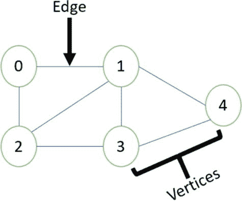

图 21-1

描绘边和顶点

**有向图**有带方向的边。这些边表示一种*单向*关系，即每条边只能在一个方向上遍历，如图 [21-2](#Fig2) 所示。常见的有向图是家谱树，它映射了父母和子女之间的关系。

**无向图**有没有方向的边，如图 [21-2](#Fig2) 。这些边表示双向关系，因为每个边都可以在两个方向上遍历。一个常见的无向图是[计算机网络](https://www.baeldung.com/java-netty-http-server)中的连接拓扑。该图是无向的，因为我们可以假设，如果一个设备连接到另一个设备，那么第二个设备也连接到第一个设备。值得一提的是，*孤立顶点*是指不是任何边的端点的顶点。

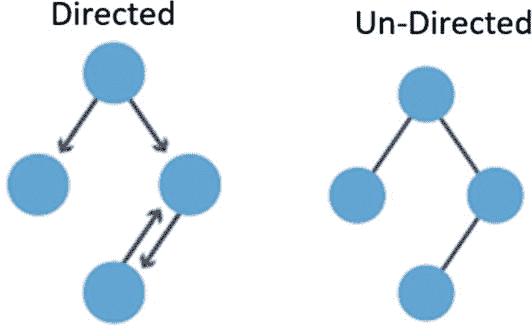

图 21-2

定向与非定向

在本章中，您将通过实现以下内容来了解使用 GraphFrame API 的实际示例:

1.  安装 JAR 库

2.  加载新数据表

3.  将数据加载到数据块笔记本的数据框中

4.  使用 GraphFrame API 运行查询和算法

## 安装 JAR 库

现在您已经对图形有了基本的了解，让我们开始使用 Apache Spark GraphFrame API 进行图形分析的练习。

在本章的练习中，我选择利用 Databricks 笔记本来运行图表分析。然而，您可以通过在 Synapse Analytics`(`[`https://docs.microsoft.com/en-us/azure/synapse-analytics/spark/apache-spark-job-definitions`](https://docs.microsoft.com/en-us/azure/synapse-analytics/spark/apache-spark-job-definitions)`)`中添加和配置 [Apache Spark 作业定义，并将 GraphFrame API JAR 文件添加到 Spark 定义中，来轻松使用 Synapse Workspace 笔记本。](https://docs.microsoft.com/en-us/azure/synapse-analytics/spark/apache-spark-job-definitions)

兼容 GraphFrame 版本的完整列表可以在[这里](https://spark-packages.org/package/graphframes/graphframes) : [`https://spark-packages.org/package/graphframes/graphframes`](https://spark-packages.org/package/graphframes/graphframes) 找到。在本练习中，使用 0.8.1-spark2.4-s_2.12 版本的 JAR 文件，并将其安装在标准数据块集群的库中，如图 [21-3](#Fig3) 所示。

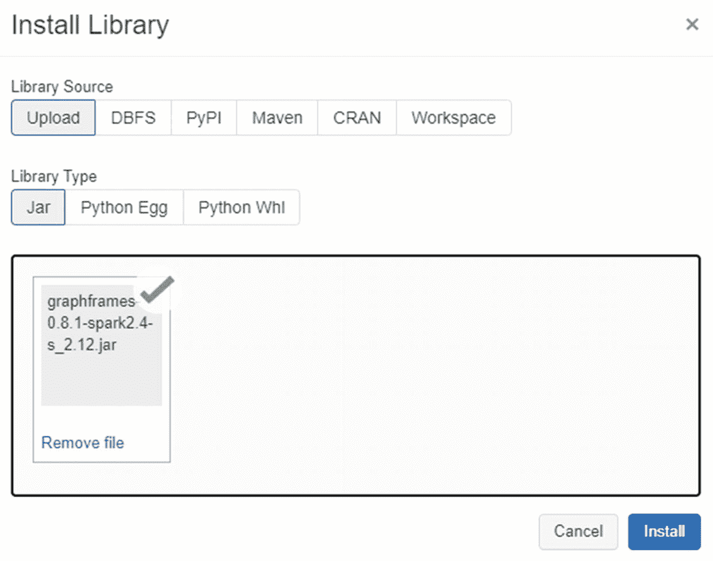

图 21-3

安装 JAR 库的步骤

一旦安装完成，请注意图 [21-4](#Fig4) 中的 JAR 已安装在集群上，它将用于运行后续部分中的笔记本代码。

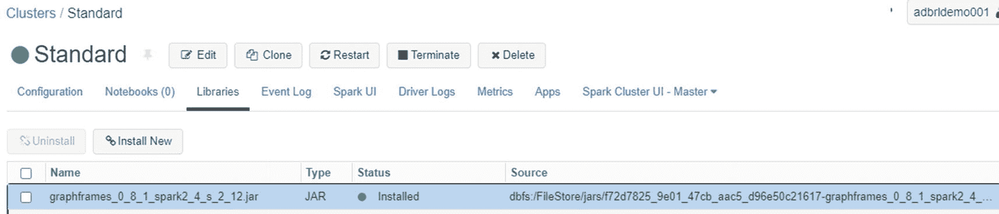

图 21-4

带库 JAR 的集群

## 加载新数据表

因为 GraphFrame API JAR 和集群已经准备好了，所以通过 DBFS 上传一些数据。在本练习中，使用了 CTA 站数据和行程数据。网上有很多免费的数据集可以利用。Kaggle 是一个允许用户查找和发布数据集的网站，这里有 CTA 站数据可用: [`www.kaggle.com/chicago/chicago-transit-authority-cta-data`](https://www.kaggle.com/chicago/chicago-transit-authority-cta-data) `.`首先使用图 [21-5](#Fig5) 所示的 UI 创建 *station_data* 表。您也可以在我的 GitHub 存储库 GraphAnalyticsSampleFiles 中找到这些示例文件，可以从以下 URL 获得: [`https://github.com/ronlesteve/GraphAnalyticsSampleFiles`](https://github.com/ronlesteve/GraphAnalyticsSampleFiles) `.`

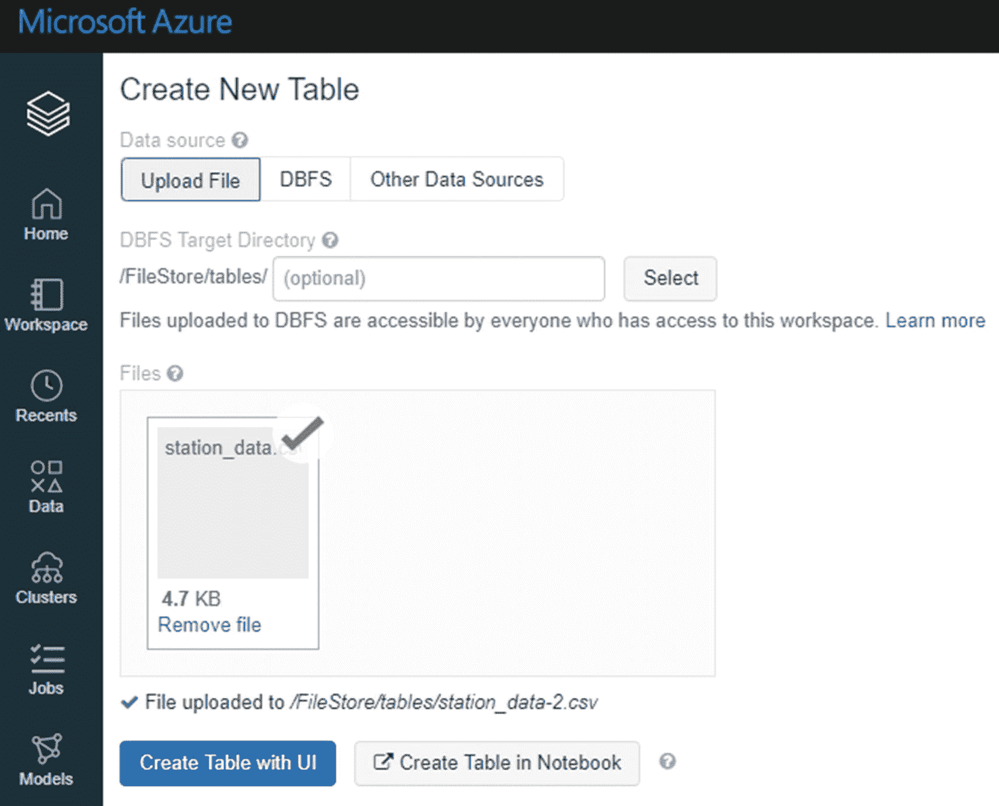

图 21-5

创建站数据表

验证模式，确保选中“第一行是标题”，然后点击“创建表格”，如图 [21-6](#Fig6) 所示。

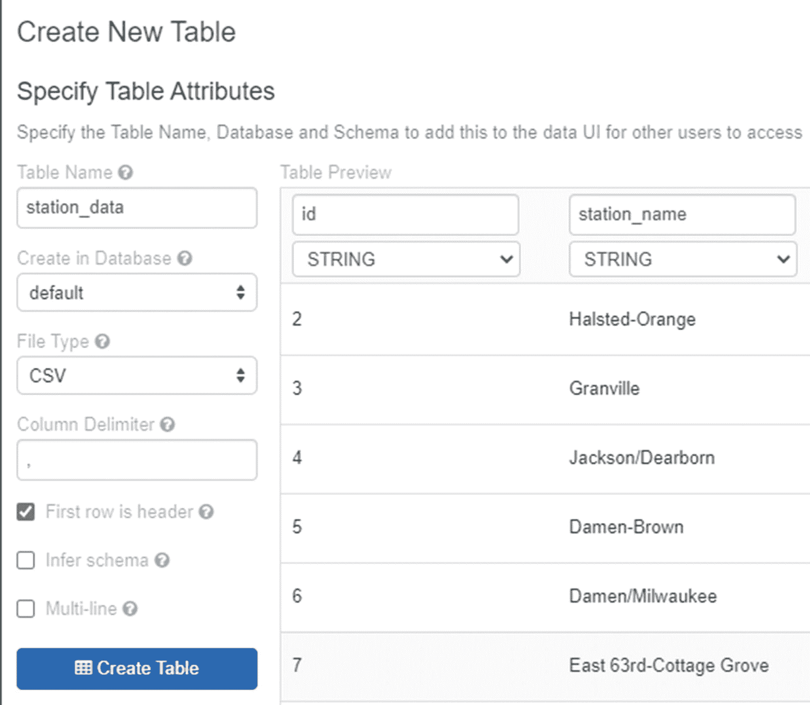

图 21-6

查看表格属性

图 [21-7](#Fig7) 显示了如何对 *trip_data* 执行相同的过程，并使用创建新表 UI 创建表。

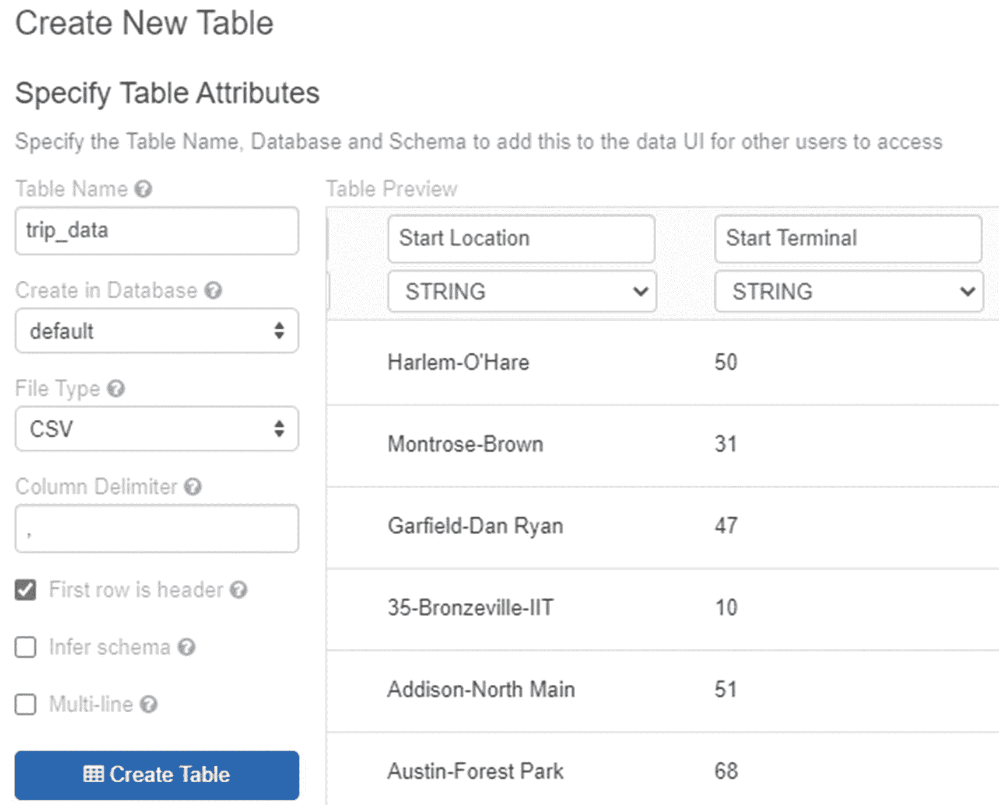

图 21-7

创建行程数据表

一旦表格被创建，它们都将出现在表格部分，如图 [21-8](#Fig8) 所示。

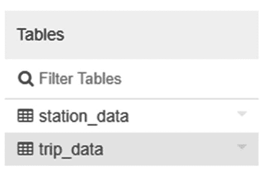

图 21-8

验证是否创建了表

## 将数据加载到数据块笔记本中

现在您已经创建了数据表，运行如图 [21-9](#Fig9) 所示的 Python 代码将数据加载到两个数据框中。

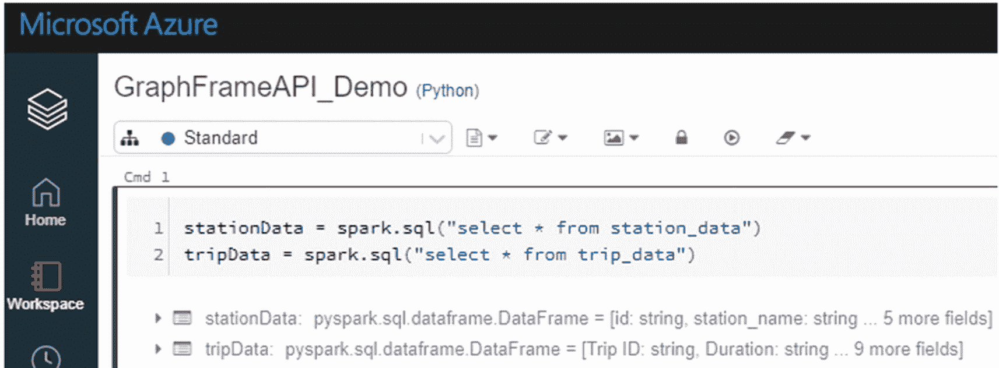

图 21-9

将数据加载到数据框中

以下是您将需要在 Databricks 笔记本中运行的 Python 代码，如图 [21-9](#Fig9) 所示:

```
stationData = spark.sql("select * from station_data")
tripData = spark.sql("select * from trip_data")

```

## 用顶点和边构建一个图

既然数据已加载到数据框中，那么是时候定义边和折点了。由于您将创建一个有向图，图 [21-10](#Fig10) 中显示的代码定义了行程的开始和结束位置。

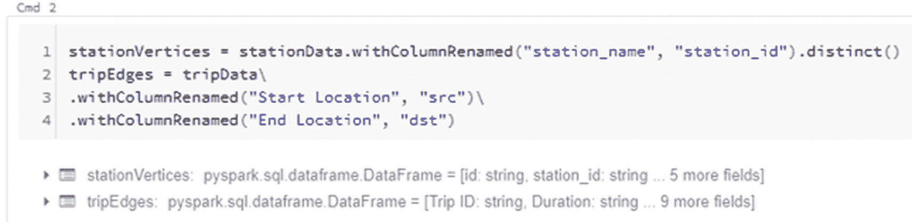

图 21-10

为顶点和边创建数据框

以下是您将需要在 Databricks 笔记本中运行的 Python 代码，如图 [21-10](#Fig10) 所示:

```
stationVertices = stationData.withColumnRenamed("station_name", "station_id").distinct()
tripEdges = tripData\
.withColumnRenamed("Start Location", "src")\
.withColumnRenamed("End Location", "dst")

```

接下来，您需要构建一个 GraphFrame 对象，它将使用前面定义的边和顶点数据框来表示您的图形。此外，您应该缓存数据以便以后更快地访问。图 [21-11](#Fig11) 显示了你需要运行的 Python 代码块。

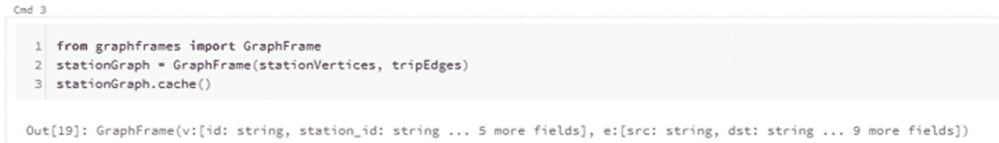

图 21-11

构建图表框架

以下是您将需要在 Databricks 笔记本中运行的 Python 代码，如图 [21-11](#Fig11) 所示:

```
from graphframes import GraphFrame
stationGraph = GraphFrame(stationVertices, tripEdges)
stationGraph.cache()

```

## 查询图表

既然您已经上传了将要处理的数据，并且定义了您的边和顶点，那么是时候运行图 [21-12](#Fig12) 中所示的基本计数查询来了解您将要处理的数据量了。这些查询将让您了解车站总数、图表中的行程以及原始数据中的行程。从图 [21-12](#Fig12) 中的执行结果消息中注意到，大约有 354K 次行程跨越 71 个车站。

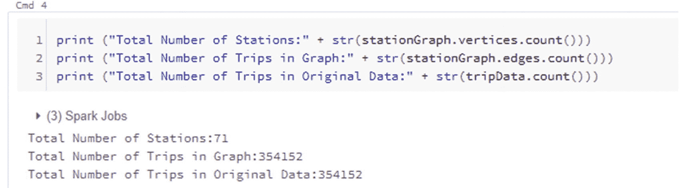

图 21-12

查询图表

以下是您将需要在 Databricks 笔记本中运行的 Python 代码，如图 [21-12](#Fig12) 所示:

```
print ("Total Number of Stations:" + str(stationGraph.vertices.count()))
print ("Total Number of Trips in Graph:" + str(stationGraph.edges.count()))
print ("Total Number of Trips in Original Data:" + str(tripData.count()))

```

为了确定哪个出发地和目的地的旅行次数最多，运行图 [21-13](#Fig13) 中所示的查询。

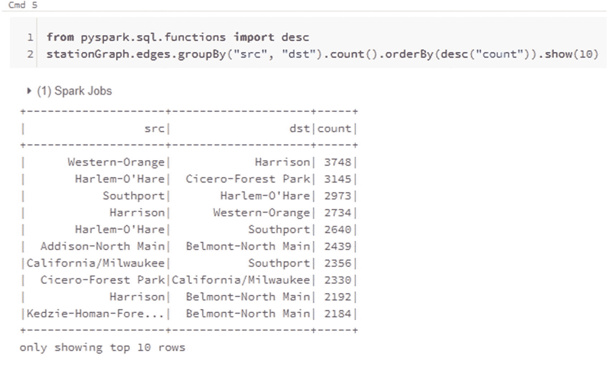

图 21-13

运行图表查询

以下是您将需要在 Databricks 笔记本中运行的 Python 代码，如图 [21-13](#Fig13) 所示:

```
from pyspark.sql.functions import desc
stationGraph.edges.groupBy("src", "dst").count().orderBy(desc("count")).show(10)

```

类似地，也运行图 [21-14](#Fig14) 中所示的以下查询来查找进出特定车站的车次。

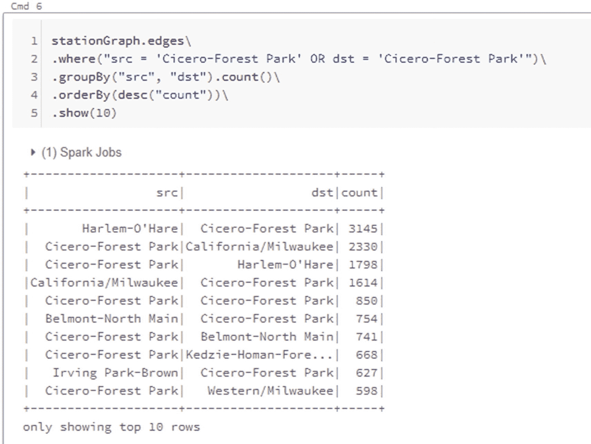

图 21-14

运行更多图表查询

以下是您将需要在 Databricks 笔记本中运行的 Python 代码，如图 [21-14](#Fig14) 所示:

```
stationGraph.edges\
.where("src = 'Cicero-Forest Park' OR dst = 'Cicero-Forest Park'")\
.groupBy("src", "dst").count()\
.orderBy(desc("count"))\
.show(10)

```

## 寻找有图案的图案

在对图形数据运行了一些基本查询之后，下一步让我们更深入一点，通过寻找具有所谓主题的模式，这是一种在图形中表达结构模式的方式，并查询数据中的模式而不是实际数据。例如，如果您对查找数据集中在三个站点之间形成三角形的所有行程感兴趣，您可以使用以下内容:"(a)-[ab]->(b)；(b)-[BC]->(c)；(c)-[ca]->(a)。”基本上(a)、(b)、(c)代表你的顶点，[ab]、[bc]、[ca]代表你的被排除在查询之外的边以下面的运算符为例:(a)-[ab]->(b)，如图 [21-15](#Fig15) 。

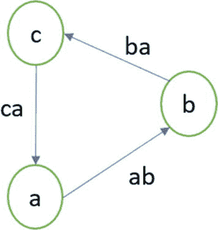

图 21-15

带图案的样品图案

可以使用自定义模式运行 motif 查询，如图 [21-16](#Fig16) 所示的代码块。

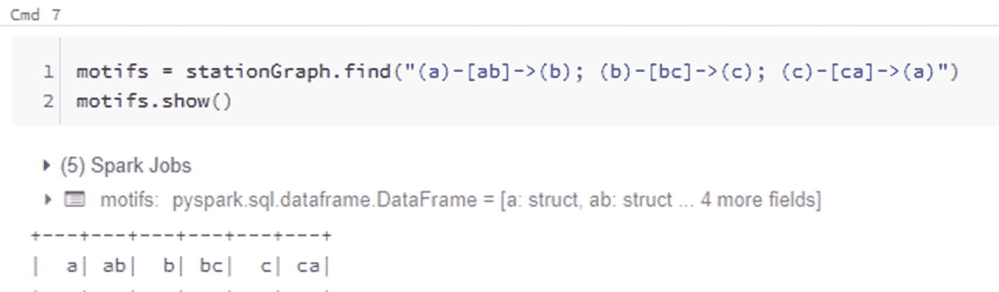

图 21-16

模体的模式算法

以下是您将需要在 Databricks 笔记本中运行的 Python 代码，如图 [21-16](#Fig16) 所示:

```
motifs = stationGraph.find("(a)-[ab]->(b); (b)-[bc]->(c); (c)-[ca]->(a)")
motifs.show()

```

一旦将主题添加到数据帧中，就可以在以下查询中使用该主题，例如，通过利用时间戳找到从站(a)到(b)到(c)再回到(a)的最短时间:

```
from pyspark.sql.functions import expr
motifs.selectExpr("*",
"to_timestamp(ab.`Start Date`, 'MM/dd/yyyy HH:mm') as abStart",
"to_timestamp(bc.`Start Date`, 'MM/dd/yyyy HH:mm') as bcStart",
"to_timestamp(ca.`Start Date`, 'MM/dd/yyyy HH:mm') as caStart")\
.where("ca.`Station_Name` = bc.`Station_Name`").where("ab.`Station_Name` = bc.`Station_Name`")\
.where("a.id != b.id").where("b.id != c.id")\
.where("abStart < bcStart").where("bcStart < caStart")\
.orderBy(expr("cast(caStart as long) - cast(abStart as long)"))\
.selectExpr("a.id", "b.id", "c.id", "ab.`Start Date`", "ca.`End Date`")
.limit(1).show(1, False)

```

## 用 PageRank 发现重要性

GraphFrames API 还利用图论和算法来分析数据。 *PageRank* 就是这样一种图形算法，它通过计算一个页面链接的数量和质量来确定一个网站重要性的粗略估计，如图 [21-17](#Fig17) 所示。潜在的假设是，更重要的网站可能会从其他网站收到更多的链接。

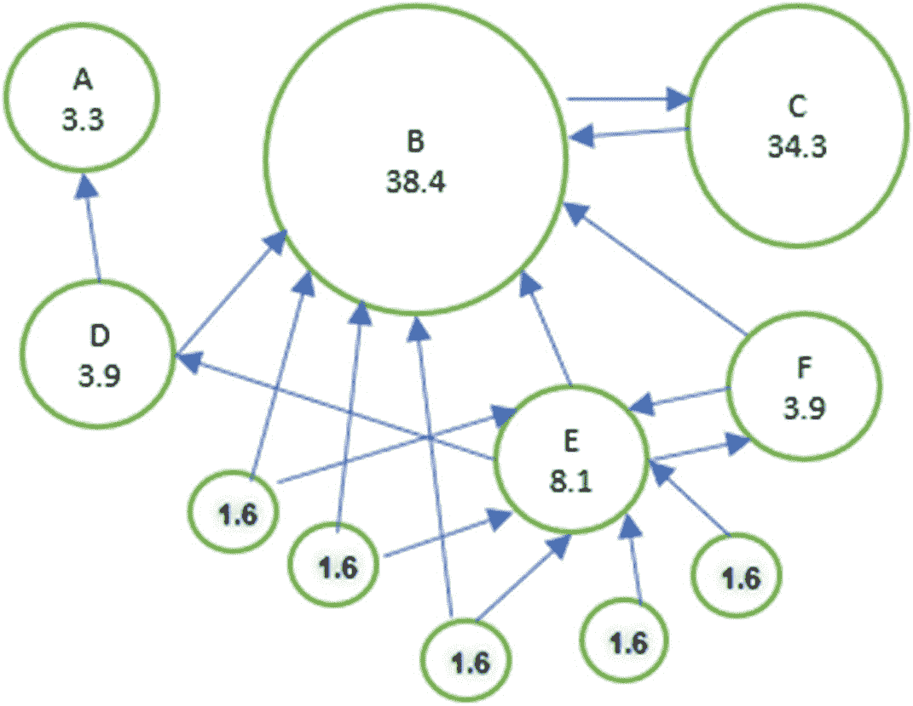

图 21-17

PageRank 示例图像

PageRank 的概念可应用于您的数据，以了解接收大量自行车流量的火车站。在图 [21-18](#Fig18) 所示的例子中，重要的站点将被赋予较大的 PageRank 值。

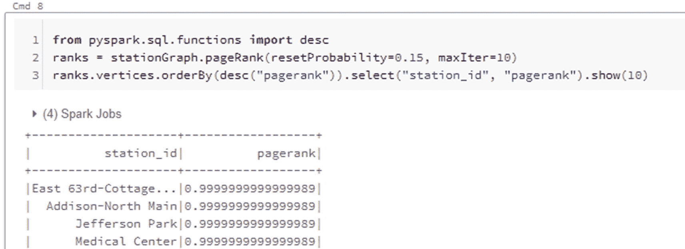

图 21-18

PageRank 代码

以下是您将需要在 Databricks 笔记本中运行的 Python 代码，如图 [21-18](#Fig18) 所示:

```
from pyspark.sql.functions import desc
ranks = stationGraph.pageRank(resetProbability=0.15, maxIter=10)
ranks.vertices.orderBy(desc("pagerank")).select("station_id", "pagerank").show(10)

```

## 探索入度和出度度量

测量和计算进出车站的行程可能是一项必要的任务，您可以使用称为入度和出度的度量来完成这项任务。这可能更适用于社交网络的情况，在社交网络中，我们可以找到拥有更多关注者(内度)的人，而不是他们关注的人(度外)。图 [21-19](#Fig19) 中说明了这种入度和出度的概念。

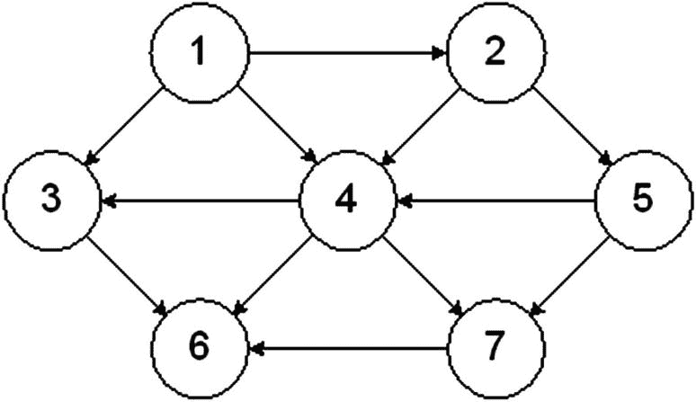

图 21-19

入和出度图像

使用 GraphFrames，您可以运行图 [21-20](#Fig20) 中所示的查询来查找 in-degrees。

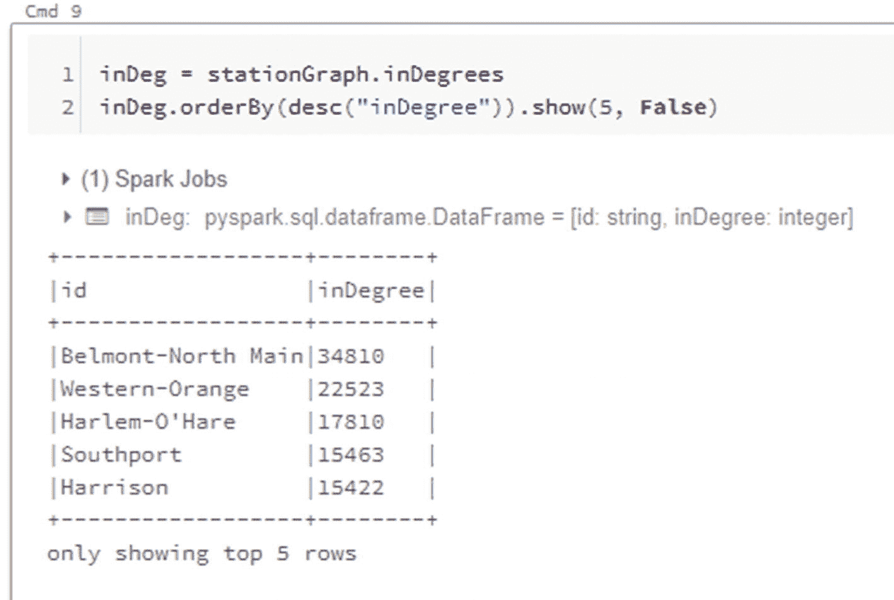

图 21-20

入学位代码

以下是您将需要在 Databricks 笔记本中运行的 Python 代码，如图 [21-20](#Fig20) 所示:

```
inDeg = stationGraph.inDegrees
inDeg.orderBy(desc("inDegree")).show(5, False)

```

类似地，运行图 [21-21](#Fig21) 所示的代码块，找出出度并注意结果。

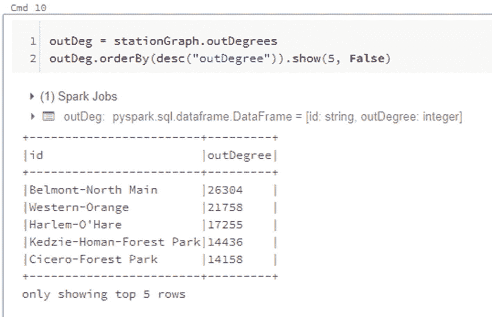

图 21-21

外向度代码

以下是您将需要在 Databricks 笔记本中运行的 Python 代码，如图 [21-21](#Fig21) 所示:

```
outDeg = stationGraph.outDegrees
outDeg.orderBy(desc("outDegree")).show(5, False)

```

最后，运行图 [21-22](#Fig22) 所示的代码，找出入度和出度之间的比率。较高的比率值将指示许多行程结束的位置(但很少开始)，而较低的值告诉我们行程经常开始的位置(但很少结束)。

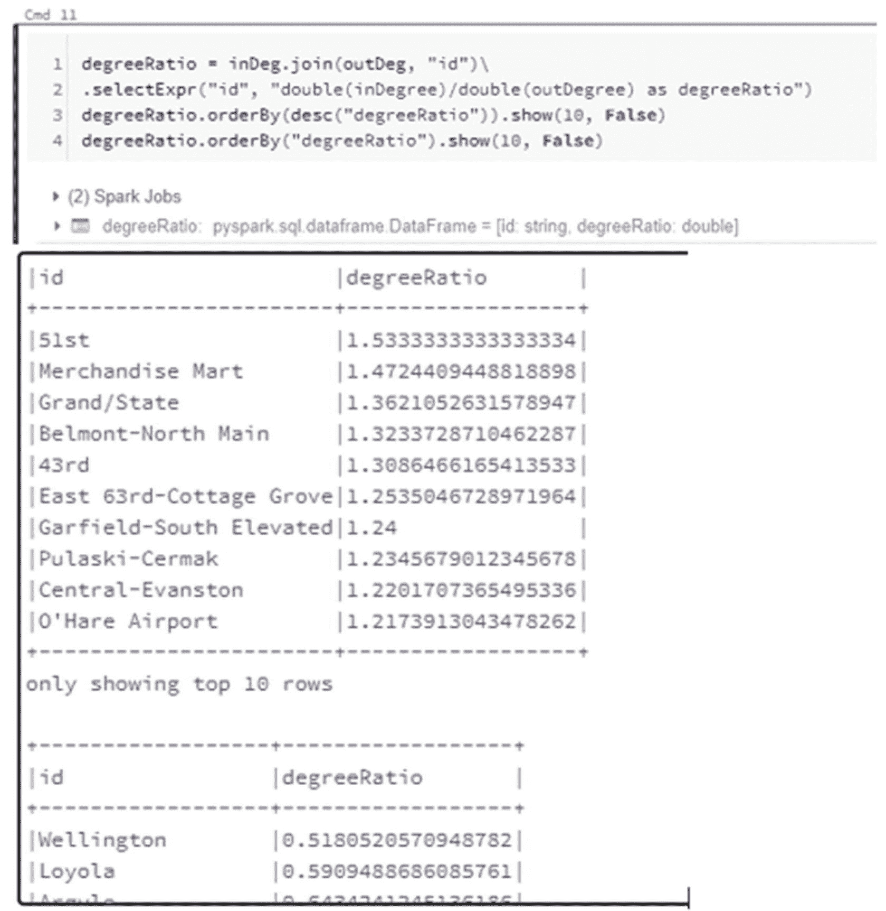

图 21-22

入度和出度比率

以下是您将需要在 Databricks 笔记本中运行的 Python 代码，如图 [21-22](#Fig22) 所示:

```
degreeRatio = inDeg.join(outDeg, "id")\
.selectExpr("id", "double(inDegree)/double(outDegree) as degreeRatio")
degreeRatio.orderBy(desc("degreeRatio")).show(10, False)
degreeRatio.orderBy("degreeRatio").show(10, False)

```

### 进行广度优先搜索

广度优先搜索可用于连接两组节点，根据图中的边找到通往不同站点的最短路径。使用 *maxPathLength* ，您可以指定要连接的最大边数，并指定一个 *edgeFilter* 来过滤掉不符合特定要求的边。运行图 [21-23](#Fig23) 所示的代码，完成广度优先搜索。

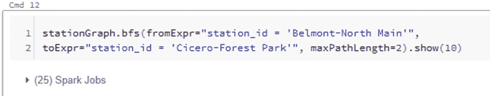

图 21-23

广度优先搜索代码

以下是您将需要在 Databricks 笔记本中运行的 Python 代码，如图 [21-23](#Fig23) 所示:

```
stationGraph.bfs(fromExpr="station_id = 'Belmont-North Main'",
toExpr="station_id = 'Cicero-Forest Park'", maxPathLength=2).show(10)

```

### 查找连接的组件

连通分量定义了一个(无向)子图，该子图与自身有连接，但不与更大的图连接。

如图 [21-24](#Fig24) 所示的两个子图所示，如果一个图中的每对顶点之间都包含一条路径，则该图是*强连通的*，如果任意两对顶点之间不存在任何路径，则该图是*弱连通的*。

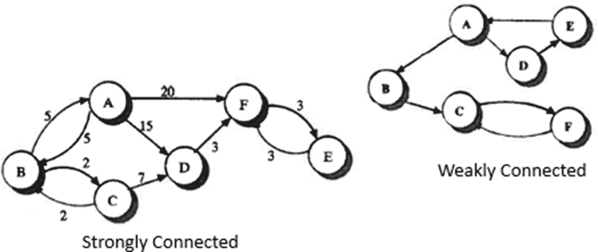

图 21-24

强连接组件与弱连接组件

图 [21-25](#Fig25) 所示的代码将生成连接的组件。注意结果。

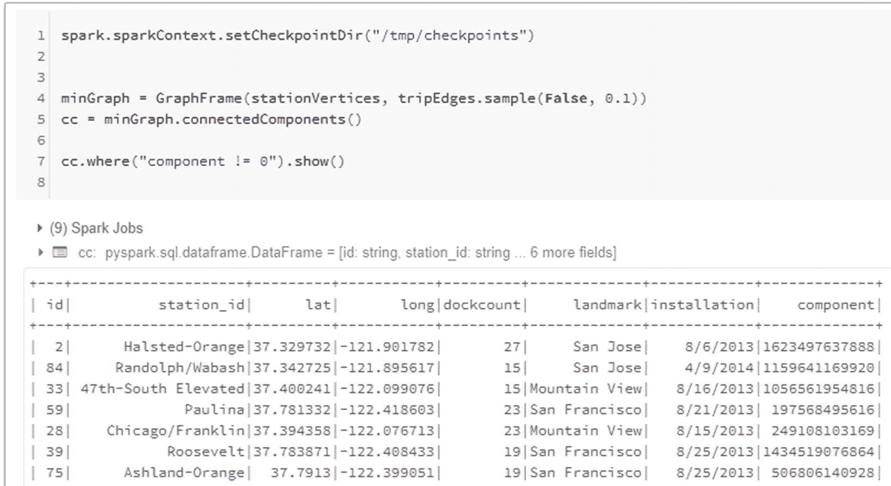

图 21-25

查找连接组件时要运行的代码

以下是您将需要在 Databricks 笔记本中运行的 Python 代码，如图 [21-25](#Fig25) 所示:

```
spark.sparkContext.setCheckpointDir("/tmp/checkpoints")

minGraph = GraphFrame(stationVertices, tripEdges.sample(False, 0.1))
cc = minGraph.connectedComponents()

cc.where("component != 0").show()

```

此外，图 [21-26](#Fig26) 中所示的基本代码可用于寻找强连接组件。

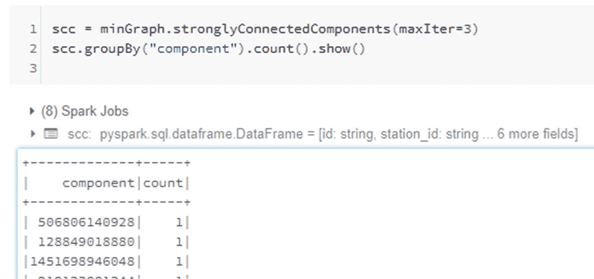

图 21-26

寻找强连通分量的代码

以下是您将需要在 Databricks 笔记本中运行的 Python 代码，如图 [21-26](#Fig26) 所示:

```
scc = minGraph.stronglyConnectedComponents(maxIter=3)
scc.groupBy("component").count().show()

```

## 摘要

在这一章中，我演示了几个实际例子，说明如何使用 Databricks GraphFrame API 轻松地搜索图形和顶点中的模式，然后查询它们以获得对数据的洞察。在 Azure 中，图形数据库服务可以通过 Cosmos DB Gremlin API 获得。Cosmos DB 是一个多模型、全球分布的 NoSQL 数据库，它的 Gremlin API 支持由顶点和边组成的结构。SQL Server 等其他微软技术也增加了对图形数据库的支持，以处理包含复杂实体关系的数据。所有这些不同的图形技术都显示了对超大型图形数据集(如使用 Apache Spark 的社交媒体提要)进行分析的价值。