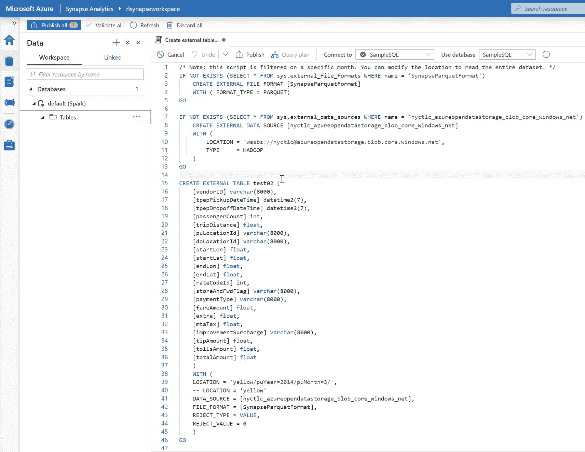
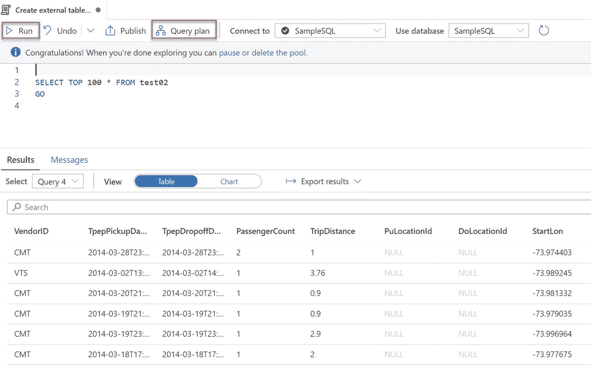
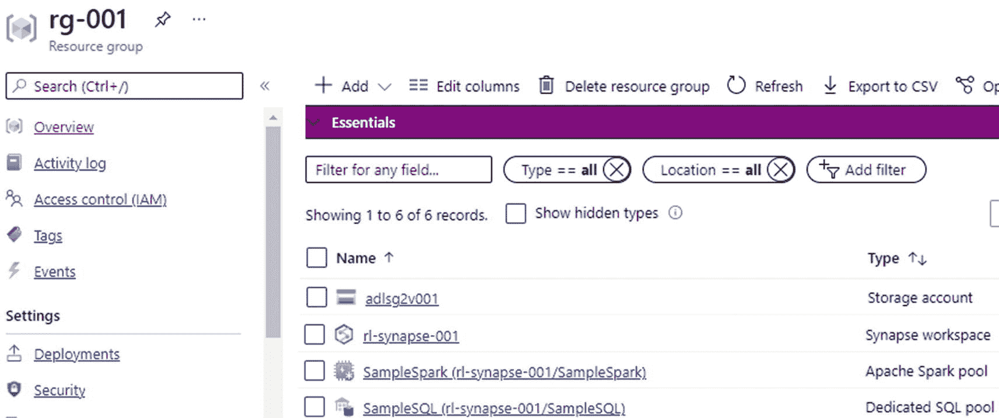

# 二十二、Synapse 分析工作区

微软 Azure 数据平台的众多新增功能已经围绕许多类似的产品及其在现代 Azure 数据平台中的用途产生了兴奋和困惑。Azure Synapse Analytics work spaces 就是这样一种产品，不要与 Azure Synapse Analytics DW 混淆，后者传统上是下一代 Azure 数据仓库，现已更名为 Synapse Analytics 专用 SQL 池(Synapse Analytics DW)。Azure Synapse Analytics work spaces 是统一的现代数据和分析平台的发展，它将各种 Azure 服务集中到一个集中的位置。

azure Synapse Analytics work spaces 是一种 web 原生体验，它为数据工程师统一了端到端分析解决方案，使他们能够通过利用 SQL 或 Spark 池的单一体验来获取、浏览、准备、编排和可视化他们的数据。此外，它还带来了调试、性能优化、数据治理以及与 CI/CD 集成的能力。在本章中，我将通过利用 Synapse Analytics workspaces 知识中心提供的一些实际示例、代码和用例，介绍如何开始使用 Synapse Analytics Workspaces。

## 创建 Synapse 分析工作区

首先创建一个新的 Azure Synapse 分析工作区，如图 [22-1](#Fig1) 所示。


图 22-1

Synapse Analytics 工作区创建

接下来，配置并完成“创建 Synapse 工作区”部分。请注意，您将需要在工作区创建过程中创建和使用 Azure Data Lake Storage Gen2，如图 [22-2](#Fig2) 所示。


图 22-2

查看并创建 Synapse 工作区

一旦创建了工作空间，它将在 Azure Portal 中的所选资源组中可用，并如图 [22-3](#Fig3) 所示。无服务器 SQL 将在提供工作空间后立即可用，并将包括按查询付费的计费模式。


图 22-3

门户中部署的 Synapse 工作区

既然已经创建了工作区，请注意添加新的专用 SQL 池和新的 Apache Spark 池的选项。SQL 专用池(以前称为 SQL DW)是指 Azure Synapse Analytics 中提供的企业数据仓库功能，代表使用 Synapse SQL 时配置的分析资源的集合。专用 SQL 池(以前称为 SQL DW)的大小由数据仓库单元(DWU)决定。在 Synapse Analytics 工作区中，您可以创建和配置一个无服务器的 Apache Spark 池来处理 Azure 中的数据。继续点击图 [22-4](#Fig4) 所示的“打开 Synapse Studio”。


图 22-4

从门户启动 Synapse Studio

Synapse Analytics Studio 工作区启动后，导航到知识中心并单击“立即使用样本”，如图 [22-5](#Fig5) 所示，立即浏览自动为您提供的脚本、笔记本、数据集和池。


图 22-5

使用知识中心的示例

## 使用 Spark 探索样本数据

知识中心有三个样本可供即时探索，如图 [22-6](#Fig6) 所示。第一个用 Spark 探索样本数据，包括样本脚本，甚至为您创建一个新的 Spark 池，或者您也可以自己创建。


图 22-6

使用 Spark 探索样本数据

选择第一个样本，然后单击“使用样本”将创建一个笔记本，其中包含许多包含来自 [Azure ML OpenDatasets 包](https://docs.microsoft.com/en-us/python/api/azureml-opendatasets/azureml.opendatasets%253Fview%253Dazure-ml-py) `(` [`https://docs.microsoft.com/en-us/python/api/azureml-opendatasets`](https://docs.microsoft.com/en-us/python/api/azureml-opendatasets) `)`的数据的脚本。具体来说，本笔记本使用纽约市黄色出租车数据集。点击“Run all”执行笔记本，并从图 [22-7](#Fig7) 中的已完成执行结果中注意到，该作业使用了两个 Spark 执行器和八个内核来接收数据。


图 22-7

纽约市出租车数据样本笔记本

以下是在图 [22-7](#Fig7) 所示的笔记本插图中执行的代码:

```
# Read NYC yellow cab data from Azure Open Datasets
from azureml.opendatasets import NycTlcYellow

from datetime import datetime
from dateutil import parser

end_date = parser.parse('2018-05-08 00:00:00')
start_date = parser.parse('2018-05-01 00:00:00')

nyc_tlc = NycTlcYellow(start_date=start_date, end_date=end_date)
nyc_tlc_df = nyc_tlc.to_spark_dataframe()

```

该过程的下一步演示了如何将数据复制到关联的 Azure Data Lake Store Gen2 帐户。笔记本中的脚本，如图 [22-8](#Fig8) 所示，将通过用复制的数据创建一个火花表、一个 CSV 和一个拼花文件来完成这个复制数据任务。你可以只使用数据框；但是，此步骤将演示如何集成 ADLS Gen2 并持久存储数据。


图 22-8

使用 Spark pool 复制数据示例

以下是在图 [22-8](#Fig8) 所示的笔记本插图中执行的代码:

```
nyc_tlc_df.createOrReplaceTempView('nyc_tlc_df')
nyc_tlc_df.write.csv('nyc_tlc_df_csv', mode='overwrite')
nyc_tlc_df.write.parquet('nyc_tlc_df_parquet', mode='overwrite')

```

作业运行完成后，导航到 Azure Data Lake Storage Gen2 帐户，验证 CSV 和 parquet 文件是否都已创建。请注意图 [22-9](#Fig9) 中显示的两个包含纽约出租车数据集的新文件夹。


图 22-9

在 ADLS Gen2 中创建的文件夹和文件

打开拼花文件夹，注意如图 [22-10](#Fig10) 所示的压缩拼花文件的数量。


图 22-10

在 ADLS 创建的拼花文件 Gen2

接下来，导航回 Azure Synapse Studio 工作区并运行图 [22-11](#Fig11) 中所示的 select 语句，以确保数据也被摄取到 Spark 表中。


图 22-11

选择笔记本中的所有数据

以下是在图 [22-11](#Fig11) 所示的笔记本插图中执行的代码:

```
%%sql
SELECT * FROM myc_tlc_df

```

从这里开始，您可以通过开始聚合数据来获得更高级的数据探索，如图 [22-12](#Fig12) 所示。


图 22-12

汇总笔记本中的数据

以下是在图 [22-12](#Fig12) 所示的笔记本插图中执行的代码:

```
from pyspark.sql import functions as F
df_nyc = nyc_tlc_df.groupBy("passengerCount").agg(F.avg('tripDistance').alias('AvgTripDistance'), F.sum('tripDistance').alias('SumTripDistance'))
display(df_nyc)

```

此时，您可以使用 matplotlib 和 seaborn 等流行的库来渲染折线图，从而使您的分析更加高级，如图 [22-13](#Fig13) 所示。


图 22-13

使用 Spark 和笔记本电脑定制数据可视化

以下是在图 [22-13](#Fig13) 所示的笔记本插图中执行的代码:

```
import matplotlib.pyplot
import seaborn

seaborn.set(style = "whitegrid")
pdf_nyc = df_nyc.toPandas()
seaborn.lineplot(x="passengerCount", y="SumTripDistance" , data = pdf_nyc)
seaborn.lineplot(x="passengerCount", y="AvgTripDistance" , data = pdf_nyc)
matplotlib.pyplot.show()

```

最后，通过结束连接的会话来清理资源，以确保 Spark 实例被关闭。注意，当达到 Apache Spark 池中指定的空闲时间时，这个池就会关闭。您也可以从笔记本底部的状态栏中选择结束会话。

## 用 SQL 查询数据

接下来，让我们继续第二个示例，它包括一个示例脚本和一个 SQL 随需应变池来使用 SQL 查询数据，如图 [22-14](#Fig14) 所示。无服务器 SQL 池是对数据湖中数据的查询服务，它使用按查询付费的模式。它使您能够通过 T-SQL 语法访问您的数据，并针对查询和分析 ADLS Gen2 中的大数据进行了优化。因为它是无服务器的，所以不需要维护基础架构或集群。数据工程师、数据科学家、数据分析师和 BI 专业人员可以使用它在湖中的原始数据或不同数据上执行基本的数据探索、转换和数据抽象。


图 22-14

Synapse Studio 中使用 SQL 查询数据的示例

与第一个示例类似，创建了一个新的 SQL 脚本，演示如何通过使用标准 SQL 命令和 OPENROWSET 函数来查询 Azure Data Lake Storage Gen2 帐户，如图 [22-15](#Fig15) 所示。OPENROWSET 是一个 T-SQL 函数，允许从许多来源读取数据，包括使用 SQL Server 的大容量导入功能。代码中的格式参数允许拼花地板和 CSV 类型。


图 22-15

样本查询数据湖

以下是在图 [22-15](#Fig15) 所示的笔记本插图中执行的代码:

```
SELECT TOP 100 * FROM
    OPENROWSET(
        BULK 'https://azureopendatastorage.blob.core.windows.net/nyctlc/yellow/puYear=2019/puMonth=*/*.parquet',
        FORMAT='PARQUET'
    ) AS [nyc];

```

下一个查询，如图 [22-16](#Fig16) 所示，通过添加额外的过滤器和子句增加了更多的复杂性，并且在展示 Synapse Studio 工作区的功能方面做得很好，可以从熟悉的 SQL 体验中直接查询 Azure Data Lake Storage Gen2 帐户。[使用 SQL on demand 分析 Azure 开放数据集，并在 Azure Synapse Studio](https://docs.microsoft.com/en-us/azure/synapse-analytics/sql/tutorial-data-analyst) 中可视化结果。您可以在以下 URL 中找到更多代码示例: [`https://docs.microsoft.com/en-us/azure/synapse-analytics/sql/tutorial-data-analyst`](https://docs.microsoft.com/en-us/azure/synapse-analytics/sql/tutorial-data-analyst) 。


图 22-16

更复杂的数据湖查询

以下是在图 [22-16](#Fig16) 所示的笔记本插图中执行的代码:

```
SELECT
    YEAR(tpepPickupDateTime) AS current_year,
    COUNT(*) AS rides_per_year
FROM
    OPENROWSET(
        BULK 'https://azureopendatastorage.blob.core.windows.net/nyctlc/yellow/puYear=*/puMonth=*/*.parquet',
        FORMAT='PARQUET'
    ) AS [nyc]
WHERE nyc.filepath(1) >= '2014' AND nyc.filepath(1) <= '2019'
GROUP BY YEAR(tpepPickupDateTime)
ORDER BY 1 ASC;

```

## 用 SQL 创建外部表

本章的最后一个练习包括使用 SQL 创建和查询外部表，如图 [22-17](#Fig17) 所示。与前面的示例类似，将在工作区中为您创建一个示例脚本和表。


图 22-17

在 Synapse Studio 中创建外部表的示例

图 [22-18](#Fig18) 所示的 SQL 代码块(包含在示例中)将演示如何创建外部表。



图 22-18

创建外部表的示例脚本

以下是您需要在图 [22-18](#Fig18) 所示的笔记本插图中运行的代码:

```
/* Note: this script is filtered on a specific month. You can modify the location to read the entire dataset. */
IF NOT EXISTS (SELECT * FROM sys.external_file_formats WHERE name = 'SynapseParquetFormat')
    CREATE EXTERNAL FILE FORMAT [SynapseParquetFormat]
    WITH ( FORMAT_TYPE = PARQUET)
GO

IF NOT EXISTS (SELECT * FROM sys.external_data_sources WHERE name = 'nyctlc_azureopendatastorage_blob_core_windows_net')
    CREATE EXTERNAL DATA SOURCE [nyctlc_azureopendatastorage_blob_core_windows_net]
    WITH (
        LOCATION = 'wasbs://nyctlc@azureopendatastorage.blob.core.windows.net',
        TYPE     = HADOOP
    )
GO

CREATE EXTERNAL TABLE nyc_tlc_yellow_trip_ext (
    [vendorID] varchar(8000),
    [tpepPickupDateTime] datetime2(7),
    [tpepDropoffDateTime] datetime2(7),
    [passengerCount] int,
    [tripDistance] float,
    [puLocationId] varchar(8000),
    [doLocationId] varchar(8000),
    [startLon] float,
    [startLat] float,
    [endLon] float,
    [endLat] float,
    [rateCodeId] int,
    [storeAndFwdFlag] varchar(8000),
    [paymentType] varchar(8000),
    [fareAmount] float,
    [extra] float,
    [mtaTax] float,
    [improvementSurcharge] varchar(8000),
    [tipAmount] float,
    [tollsAmount] float,
    [totalAmount] float
    )
    WITH (
    LOCATION = 'yellow/puYear=2014/puMonth=3/',
    -- LOCATION = 'yellow'
    DATA_SOURCE = [nyctlc_azureopendatastorage_blob_core_windows_net],
    FILE_FORMAT = [SynapseParquetFormat],
    REJECT_TYPE = VALUE,
    REJECT_VALUE = 0
    )
GO

SELECT TOP 100 * FROM nyc_tlc_yellow_trip_ext
GO

```

创建表后，运行一个简单的 SQL select 语句，如图 [22-19](#Fig19) 所示，查询新创建的外部表。请注意，还有一个“查询计划”按钮可用。



图 22-19

查询外部表的示例

以下是您需要在图 [22-19](#Fig19) 所示的笔记本插图中执行的代码:

```
SELECT TOP 100 * FROM nyc_tlc_yellow_trip_ext
GO

```

可以下载查询计划并在 SQL Server Management Studio (SSMS)中打开它，如图 [22-20](#Fig20) 所示，与使用 SSMS 在传统 SQL Server 体验中分析查询计划相比，这是一项非常有用的功能。


图 22-20

查询计划功能

请注意，在图 [22-21](#Fig21) 中，作为这些练习的一部分，已经创建了一个专用的 SQL 池和 Apache Spark 池。记得删除任何未使用的资源和 Spark/ SQL 池，以防止任何额外的成本。



图 22-21

示例演示中在 Azure 门户中创建的 SQL 和 Spark 池的图像

## 摘要

在本章中，我演示了如何创建新的 Azure Synapse Analytics Studio 工作区，然后向您展示了如何从知识中心创建三个示例来实现以下目标:

1.  使用 Spark 探索数据。

2.  用 SQL 查询数据。

3.  用 SQL 创建一个外部表。

Azure Synapse workspace 还有许多我们在本章中没有探讨的其他优势，例如连接到 Power BI 帐户以可视化和构建交互式报告的能力；创建、调度和监控 ETL 作业，就像您在 Azure 数据工厂体验中所做的那样；并通过与微软的新数据治理产品 Azure without 集成来搜索您的数据资产。有了图 [22-22](#Fig22) 所示的所有可用资源和易于使用的导航 UI，开始 Azure Synapse Analytics 之旅再简单不过了。Azure Synapse 分析工作区确实有潜力成为各种业务和技术专业人员的统一现代数据和分析平台。


图 22-22

Azure Synapse 分析主页