# 二十三、数据块中的机器学习

寻求利用机器学习(ML)和人工智能能力的组织和开发人员花费大量时间构建 ML 模型，并寻求一种方法来简化他们的机器学习开发生命周期，以跟踪实验，将代码打包成可重复运行的代码，以及构建、共享和部署 ML 模型。

MLflow 是一个管理端到端机器学习生命周期的开源平台，如图 [23-1](#Fig1) 所示。它处理四个主要功能:

1.  跟踪实验以比较和记录参数和结果

2.  打包 ML 代码以与其他数据科学家共享或转移到生产中。

3.  使用各种可用的库管理和部署 ML 模型

4.  注册模型以便于模型管理，并提供模型作为 REST 端点

在本章中，我将介绍如何使用 Azure Databricks 开始使用 MLflow。Databricks 为跟踪和保护 ML 模型培训运行以及运行 ML 项目提供了集成的 MLflow 体验。除了提供 MLflow 的全面管理版本，Databricks 还集成了企业安全功能、高可用性、实验和运行管理以及笔记本版本捕获。

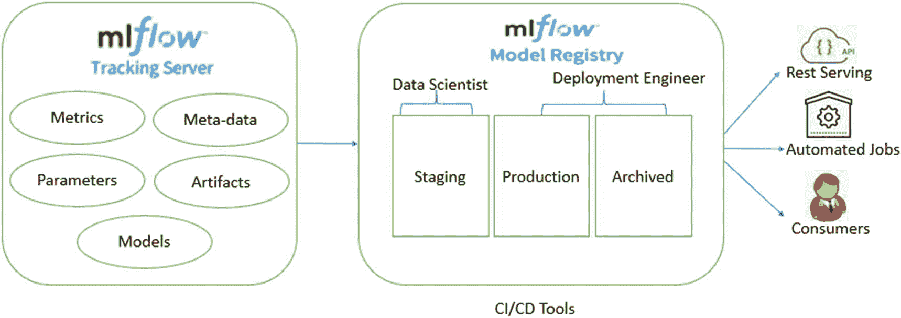

图 23-1

描述 MLflow 功能的图像

## 创建 MLflow 实验

让我们从在 Azure Databricks 中创建一个 MLflow 实验开始。首先导航至主页菜单并选择“新 MLflow 实验”，如图 [23-2](#Fig2) 所示。

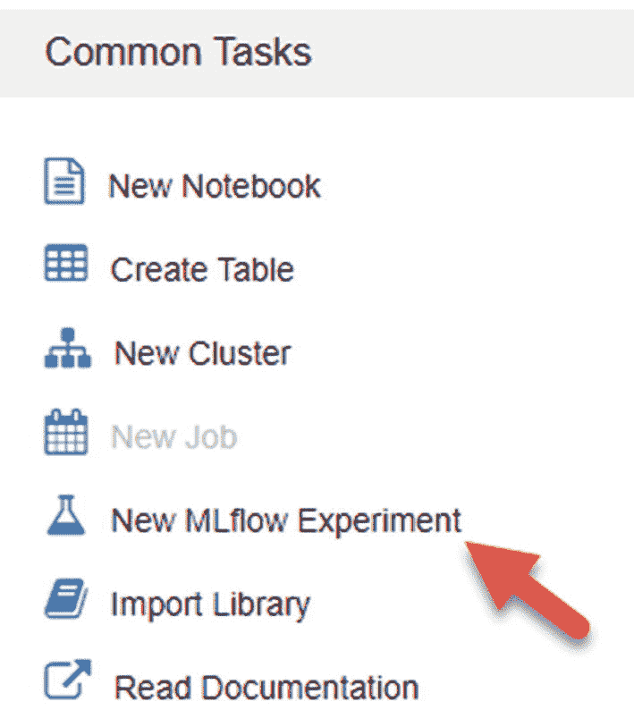

图 23-2

从主页菜单创建新的 MLflow 实验

选择“新建 MLflow 实验”打开一个新的“创建 MLflow 实验”界面。填充实验名称，然后创建实验，如图 [23-3](#Fig3) 所示。

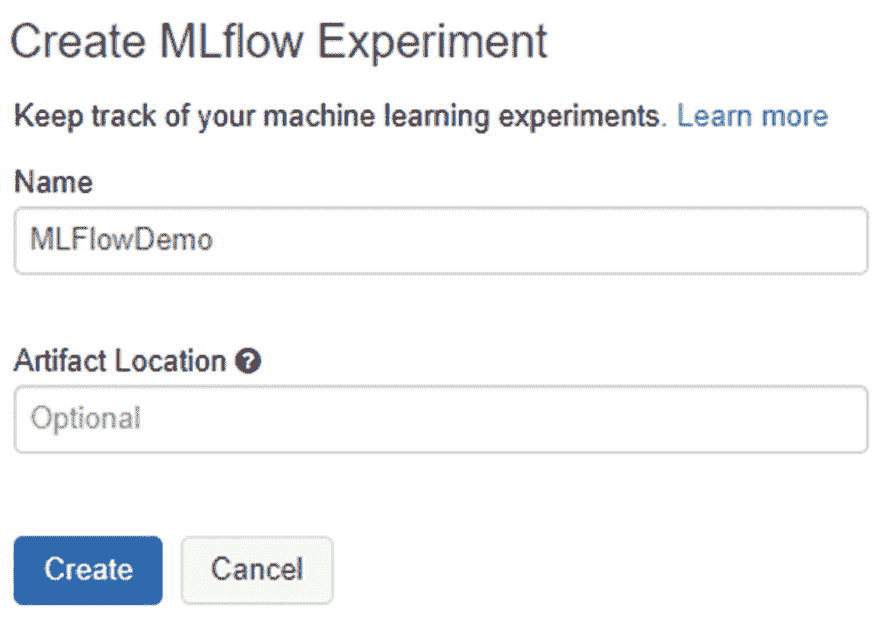

图 23-3

为 MLflow 创建实验

一旦实验被创建，它将有一个与之相关联的实验 ID，当您配置包含 ML 模型代码的笔记本时，您将需要这个 ID。注意图 [23-4](#Fig4) 所示的实验用户界面包含比较多个模型、按模型状态过滤、按标准搜索和下载 CSV 细节的选项。

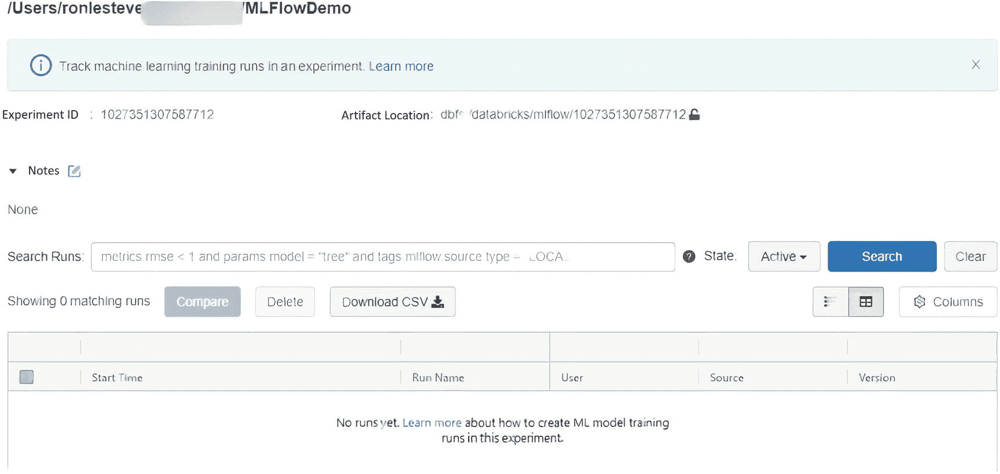

图 23-4

实验用户界面的示例图像

## 安装 MLflow 库

创建 MLflow 实验后，创建一个新的集群，并在其上安装 MLflow PyPI 库。如果您正在运行用于机器学习的 Databricks 运行时，则 MLflow 已经安装，不需要任何设置。如果您正在运行 Databricks 运行时，请按照图 [23-5](#Fig5) 中所示的步骤安装 MLflow 库。

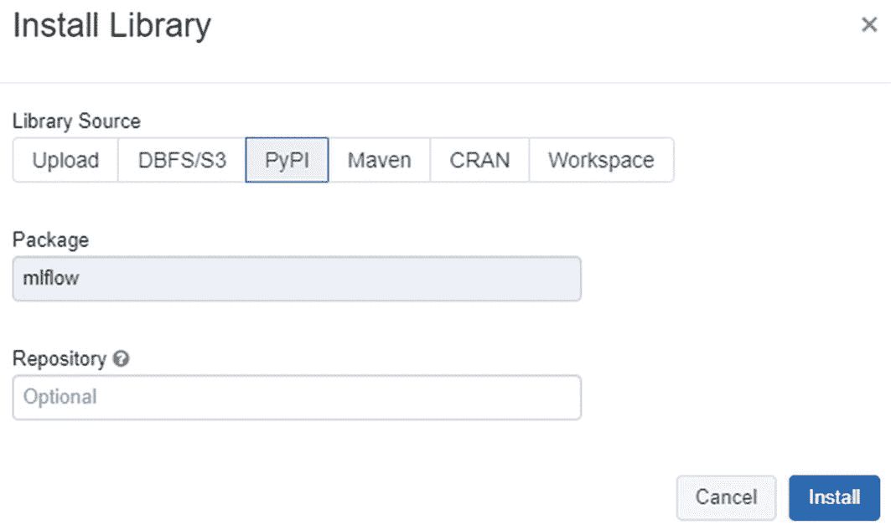

图 23-5

安装 MLflow PyPI 库

一旦库成功安装，可以在集群的库上看到 installed 状态，如图 [23-6](#Fig6) 所示。

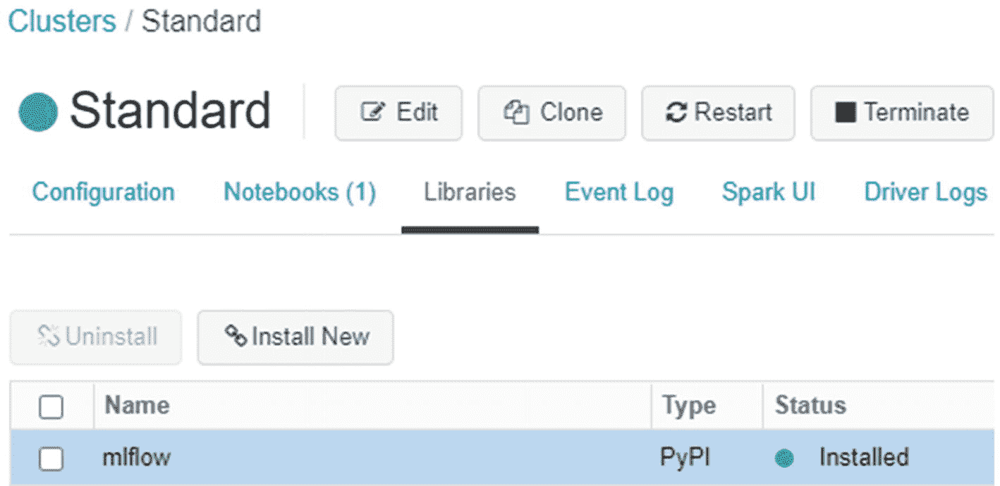

图 23-6

已安装的 MLflow 库

## 创建笔记本

在安装了一个实验、一个集群和 MLflow 库之后，您需要创建一个新的笔记本来构建 ML 模型，然后将它与 MLflow 实验相关联。请注意，如果开始运行时没有活动的实验，Databricks 会自动创建一个笔记本实验。

使用以下代码开始运行。因为您有一个实验 ID，所以使用

```
mlflow.start_run().
mlflow.start_run(experiment_id=1027351307587712)

```

或者，您可以如下定义实验名称，这将简单地使用实验名称而不是 ID:

```
experiment_name = "/Demo/MLFlowDemo/"
mlflow.set_experiment(experiment_name)

```

## 选择性测井

从日志的角度来看，可以选择自动记录特定于模型的指标、参数和工件。或者，可以根据需要通过向笔记本代码添加以下命令来定义这些指标、参数或模型:

数字度量:`mlflow.log_metric("accuracy", 0.9)`

训练参数:`mlflow.log_param("learning_rate", 0.001)`

型号:`mlflow.sklearn.log_model(model, "myModel")`

其他工件(文件):`mlflow.log_artifact("/tmp/my-file", "myArtifactPath")`

下面的代码从 scikit-learn 导入一个数据集，并创建训练和测试数据集。这段代码旨在演示一个 ML 模型示例。将此添加到 Databricks 笔记本中的代码块:

```
from sklearn.model_selection import train_test_split
from sklearn.datasets import load_diabetes

db = load_diabetes()
X = db.data
y = db.target
X_train, X_test, y_train, y_test = train_test_split(X, y)

```

下一个代码块将导入 MLflow 和 sklearn，开始实验，并记录执行运行的详细信息。只需将此代码添加到您的 Databricks 笔记本中并运行它:

```
import mlflow
import mlflow.sklearn
from sklearn.ensemble import RandomForestRegressor
from sklearn.metrics import mean_squared_error

# In this run, neither the experiment_id nor the experiment_name parameter is provided. MLflow automatically creates a notebook experiment and logs runs to it.
# Access these runs using the Experiment sidebar. Click Experiment at the upper right of this screen.
with mlflow.start_run(experiment_id=1027351307587712):
  n_estimators = 100
  max_depth = 6
  max_features = 3
  # Create and train model
  rf = RandomForestRegressor(n_estimators = n_estimators, max_depth = max_depth, max_features = max_features)
  rf.fit(X_train, y_train)
  # Make predictions
  predictions = rf.predict(X_test)

  # Log parameters
  mlflow.log_param("num_trees", n_estimators)
  mlflow.log_param("maxdepth", max_depth)
  mlflow.log_param("max_feat", max_features)

  # Log model
  mlflow.sklearn.log_model(rf, "random-forest-model")

  # Create metrics
  mse = mean_squared_error(y_test, predictions)

  # Log metrics
  mlflow.log_metric("mse", mse)

```

图 [23-7](#Fig7) 显示了需要记录的已定义参数、指标和模型。

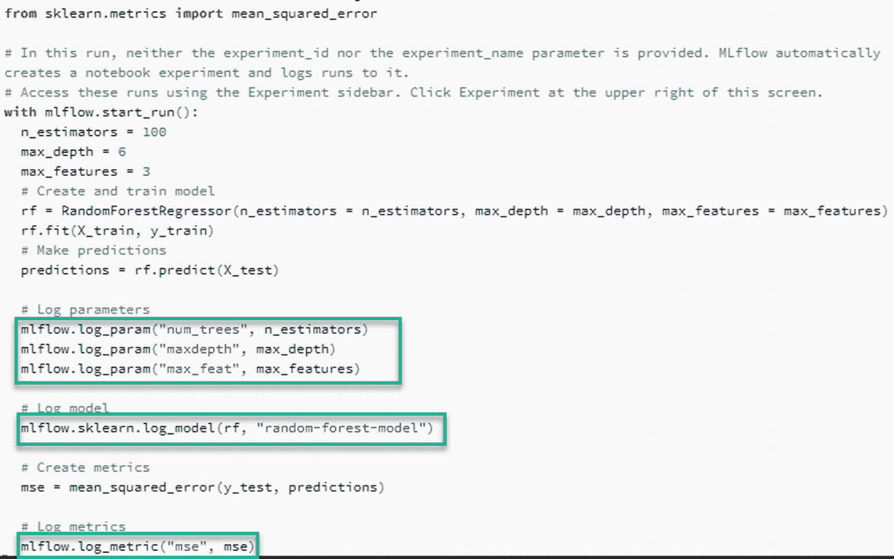

图 23-7

代码中定义的参数

点击图 [23-8](#Fig8) 中高亮显示的图标，查看实验运行详情。另外，点击底部的实验界面打开界面。如果没有创建实验，将为您创建一个新的随机实验，这将特别有用。

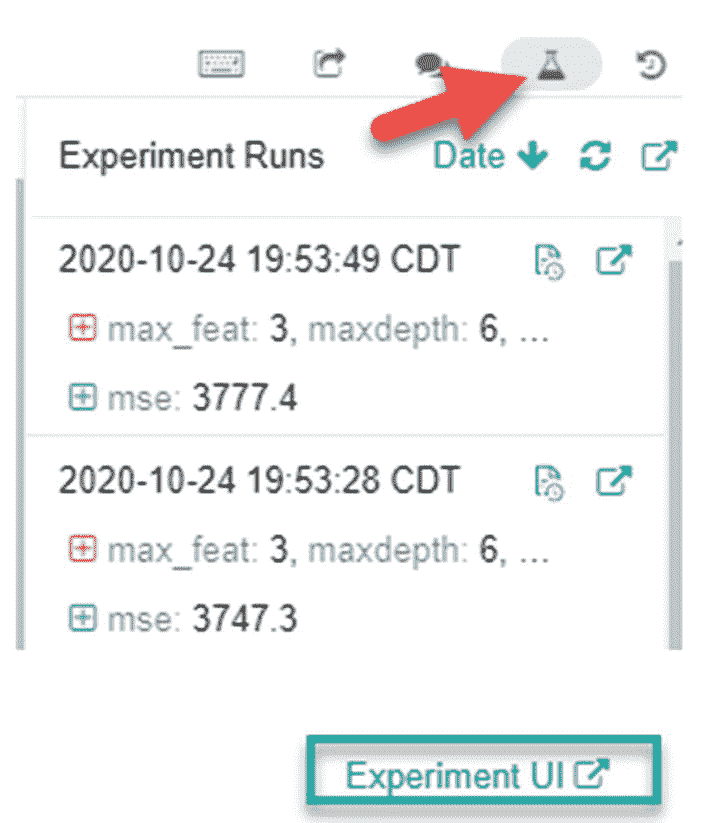

图 23-8

单击打开用户界面

由于之前已经创建了一个 MLflow 实验，点击 MLFlowDemo 打开它，如图 [23-9](#Fig9) 所示。

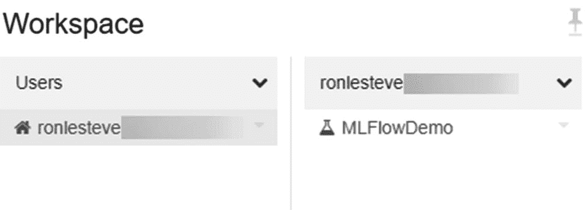

图 23-9

打开 MLflow 实验

请注意，该实验运行了两次，并注意与之相关的参数和指标。此外，现在可以选择比较两次运行，如图 [23-10](#Fig10) 所示。

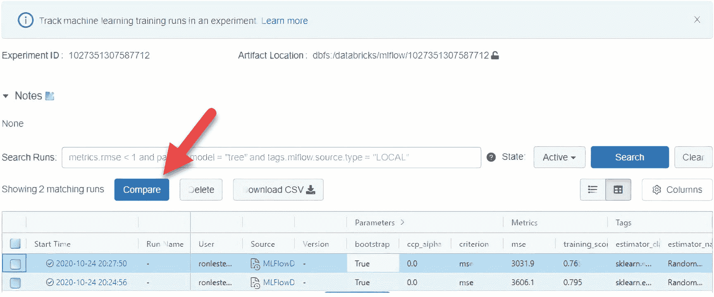

图 23-10

比较多次运行

点击比较，注意两次运行之间的所有相关细节，如图 [23-11](#Fig11) 所示。

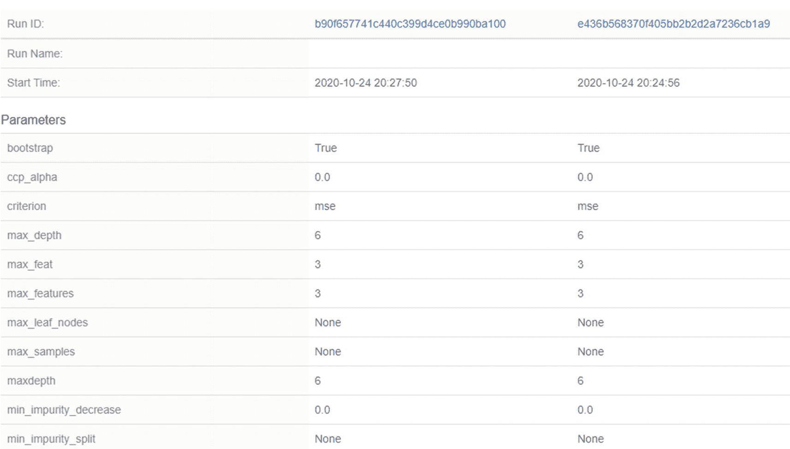

图 23-11

比较两次模型运行的参数

此外，您可以通过图 [23-12](#Fig12) 所示的散点图、等高线图或平行坐标图来可视化比较。要查看绘图，只需在各种绘图选项卡之间切换。这个特殊的图显示了平行坐标。

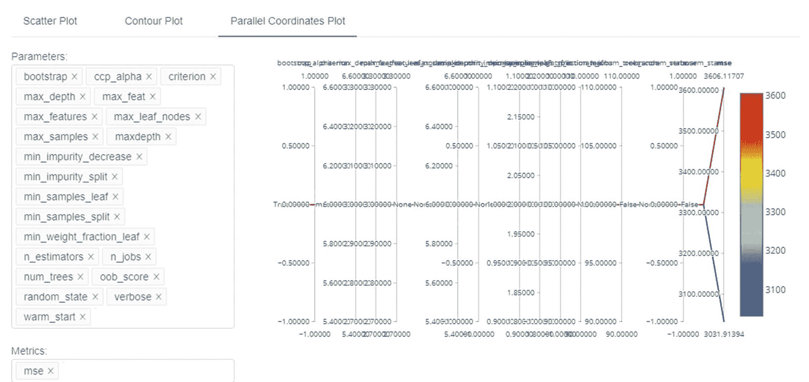

图 23-12

样本地块 1

## 自动记录

在测试了定义的日志选项之后，还要测试自动日志。您可以使用图 [23-13](#Fig13) 中所示的代码的以下变体来实现，它基本上用对`mlflow.sklearn.autolog()`的调用来替换所有已定义的度量、参数等等。

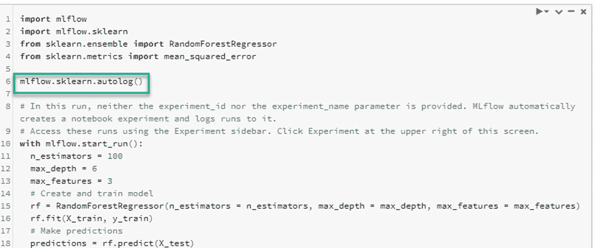

图 23-13

自动登录代码示例

以下是您需要在 Databricks 笔记本中运行的代码，如图 [23-13](#Fig13) 所示:

```
import mlflow
import mlflow.sklearn
from sklearn.ensemble import RandomForestRegressor
from sklearn.metrics import mean_squared_error

mlflow.sklearn.autolog()

# In this run, neither the experiment_id nor the experiment_name parameter is provided. MLflow automatically creates a notebook experiment and logs runs to it.
# Access these runs using the Experiment sidebar. Click Experiment at the upper right of this screen.
with mlflow.start_run():
  n_estimators = 100
  max_depth = 6
  max_features = 3
  # Create and train model
  rf = RandomForestRegressor(n_estimators = n_estimators, max_depth = max_depth, max_features = max_features)
  rf.fit(X_train, y_train)
  # Make predictions
  predictions = rf.predict(X_test)

```

在运行这个新模型两次并导航回 MLflow 实验后，请注意实验 UI 中记录的新运行，这一次在捕获的指标中有一些差异，正如预期的那样，如图 [23-14](#Fig14) 所示。

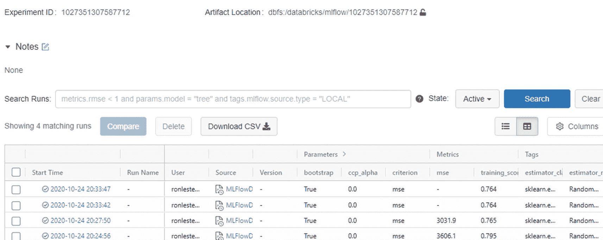

图 23-14

实验 UI 2

点击其中一个运行，查看各种细节，包括图，如图 [23-15](#Fig15) 所示。

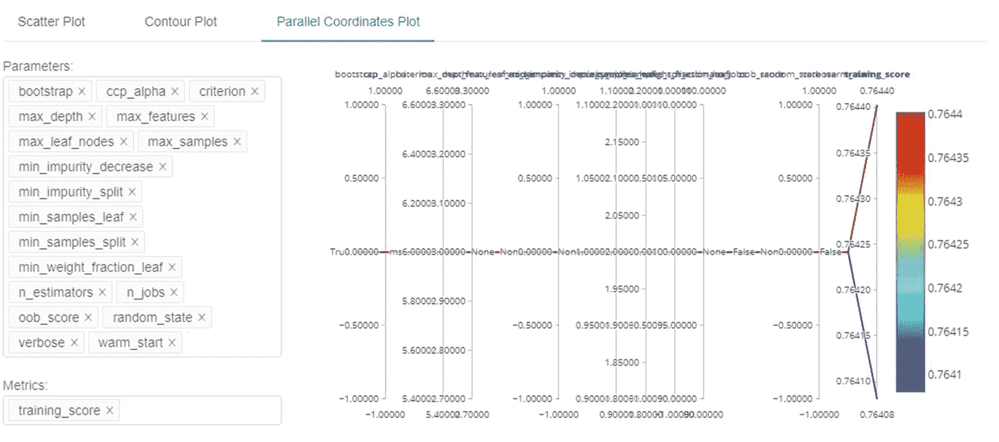

图 23-15

样地 2

## 注册一个模型

在创建、记录和比较模型之后，您可以通过点击想要记录的模型并向下滚动到运行细节中的工件来注册模型，如图 [23-16](#Fig16) 所示。

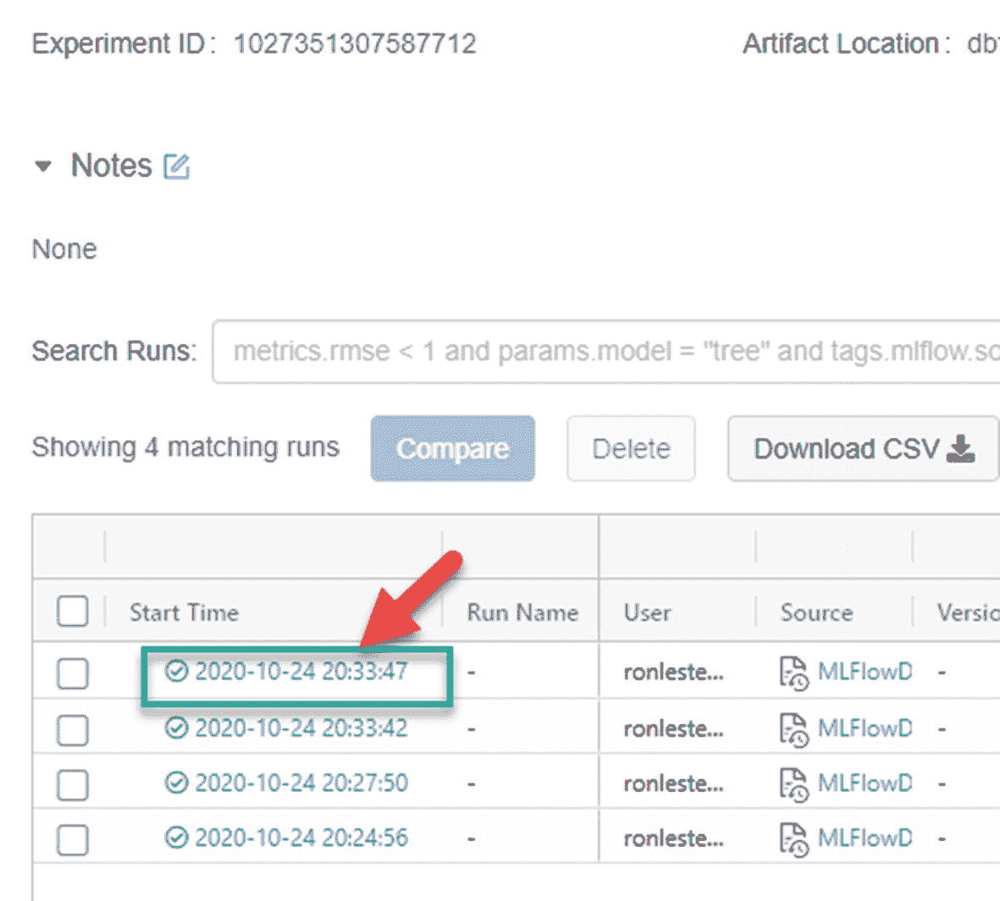

图 23-16

从实验界面选择模型

选择型号，点击【注册型号】，如图 [23-17](#Fig17) 所示。

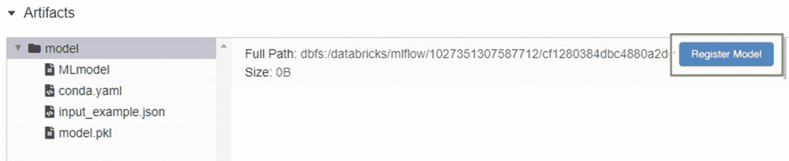

图 23-17

单击从工件注册模型

在图 [23-18](#Fig18) 所示的注册模型界面中，新建一个模型，命名并注册模型。

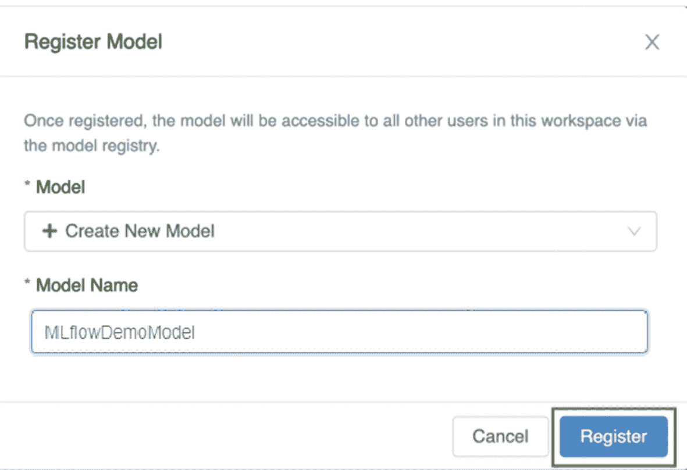

图 23-18

注册模型的步骤

一旦注册，Details 选项卡将包含与版本、注册时间戳、模型创建者和阶段相关的所有细节，如图 [23-19](#Fig19) 所示。

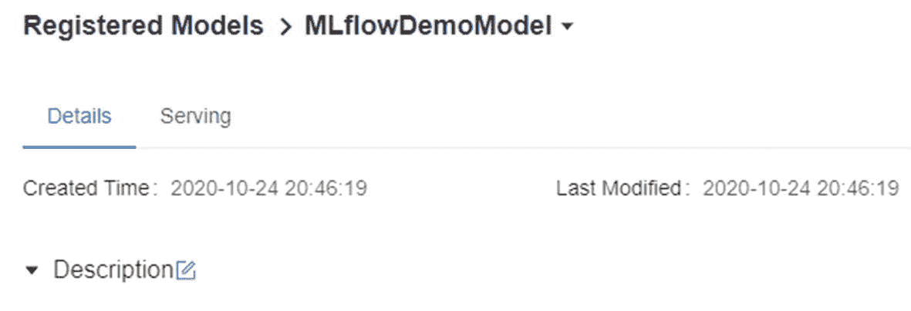

图 23-19

显示“详细信息”选项卡的图像

图 [23-20](#Fig20) 显示了各种版本以及每个阶段的其他细节。

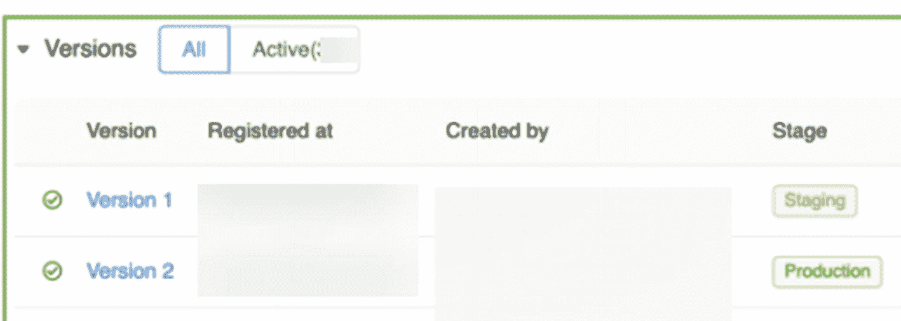

图 23-20

显示版本详细信息的图像

图 [23-21](#Fig21) 显示了如何将阶段从暂存过渡到生产再到存档。

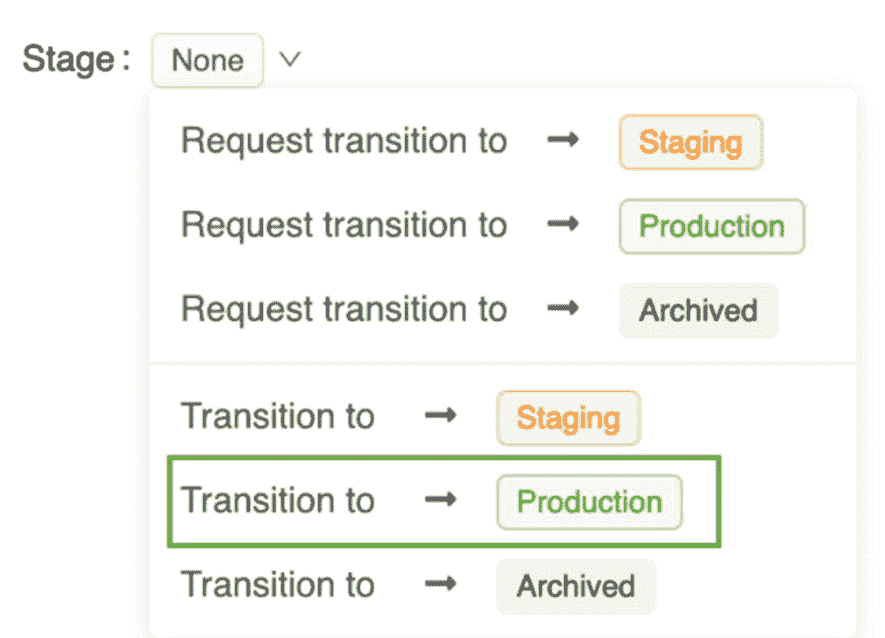

图 23-21

从一个阶段到另一个阶段的步骤

启用模型服务时，Databricks 会自动为模型创建一个唯一的单节点集群，并在该集群上部署模型的所有非归档版本。点击图 [23-22](#Fig22) 所示的启用上菜开始。

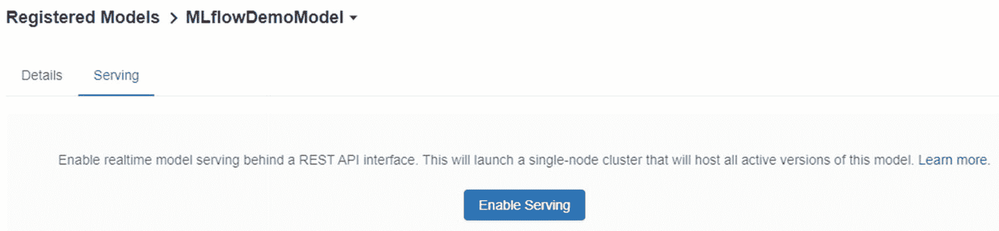

图 23-22

启用上菜的步骤

此时，您会看到服务和详细信息标签，如图 [23-23](#Fig23) 所示。MLflow 模型服务允许托管注册的 ML 模型作为 REST 端点，这些端点根据模型版本的可用性及其阶段自动更新。

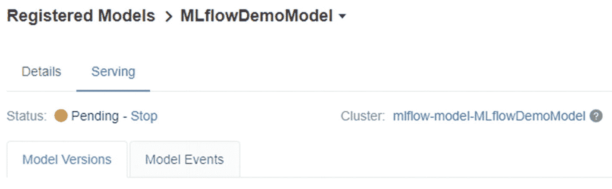

图 23-23

该图显示了新的“服务”选项卡属性

样本服务页面可能如图 [23-24](#Fig24) 所示。

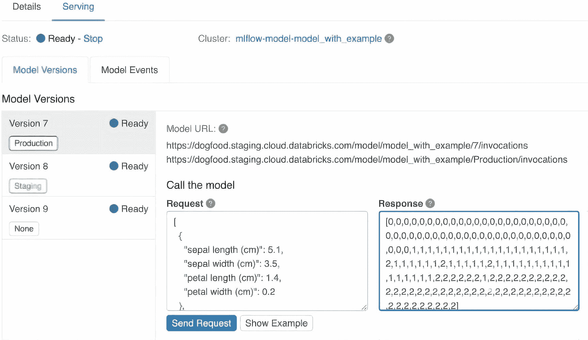

图 23-24

上菜标签的示例图像

最后，当一个模型被注册后，您可以通过导航到 Databricks UI 中的 Models 选项卡来找到它，如图 [23-25](#Fig25) 所示。


图 23-25

“模型”选项卡图标的图像

## 摘要

在本章中，我演示了如何创建 MLflow 实验、安装 MLflow 库以及创建 MLflow 笔记本。我还向您展示了选择性和自动日志记录的实际例子，最后向您展示了如何注册一个模型。随着 MLflow 通过 Databricks 体验的集成，您现在有能力管理 ML 生命周期，包括实验、再现性、部署和中央模型注册。