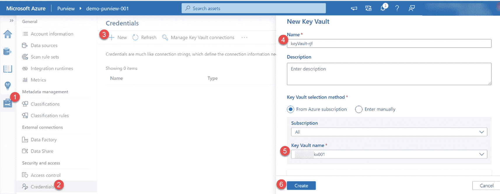
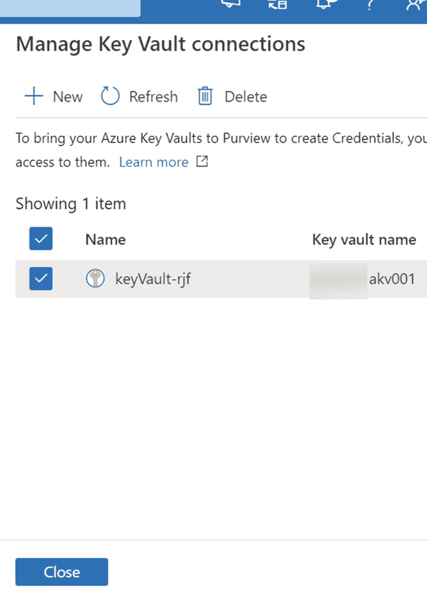
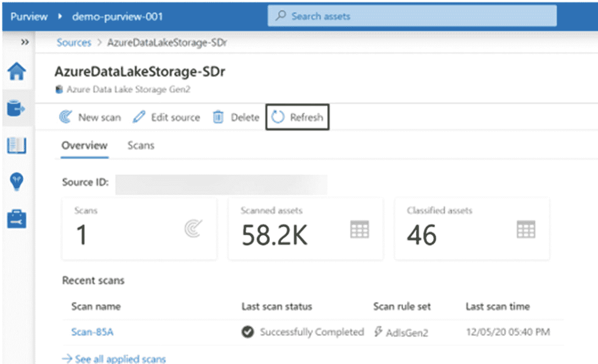
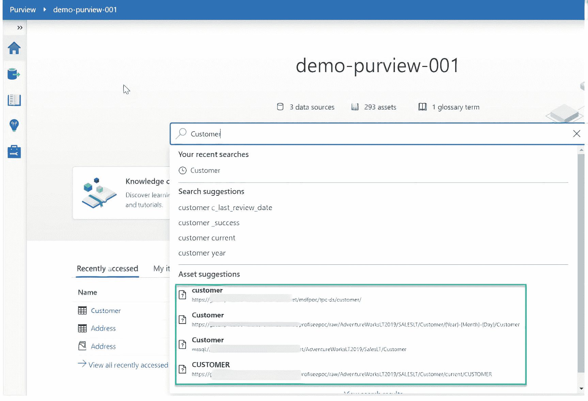

# 24.数据治理的权限

许多组织需要建立数据治理流程、标准和方法，并且已经能够使用内部 SQL Server 工具(如 Master Data Services)来完成这些工作。然而，在 Azure 空间中，这种数据治理产品还存在很大的缺口。此前，微软试图通过在 Azure 托管实例上托管 MDS 数据库或通过 Azure 数据目录将数据治理引入 Azure，这还不是一个真正成熟的数据治理产品。azure without 是一个基于云的数据治理产品，用于集中管理您的数据资产中的数据治理，涵盖云和内部环境。

Azure 权限易于使用的用户界面和目录使得管理数据的用户可以很容易地发现和理解数据源。azure without 提供了一个基于云的服务，用户可以在其中注册数据源，同时维护索引元数据的副本以及对源位置的引用。此外，可以通过标签、描述等进一步丰富这些元数据的范围。Azure 权限旨在解决数据消费者和生产者面临的一些挑战。在这一章中，我将向你展示如何开始使用 Azure 权限，然后演示如何探索权限工作室中的一些特性和功能。

## 创建 azure 预览帐户

Azure 权限提供了自动化和管理元数据、加速大规模分类、支持数据消费者发现数据资产、分配所有权、管理敏感数据等功能。在本节中，您将学习如何创建 Azure 权限帐户。Azure 权限可以通过 Azure Portal 访问，如图 [24-1](#Fig1) 所示。继续操作并单击 Create 开始创建新的权限帐户。


图 24-1

创建新的预览帐户

与所有 Azure 资源一样，view 也需要项目和实例细节，如图 [24-2](#Fig2) 所示。


图 24-2

新预览帐户详细信息

还可以选择其他配置选项，如图 [24-3](#Fig3) 所示:


图 24-3

新预览帐户配置详细信息

*   平台大小:下面的[链接](https://azure.microsoft.com/en-us/pricing/details/azure-purview/) `(` [`https://azure.microsoft.com/en-us/pricing/details/azure-purview/`](https://azure.microsoft.com/en-us/pricing/details/azure-purview/) `)`捕获容量单位，这是一组用于保持权限数据图最新和运行的资源。至少需要选择四个单元。

*   目录和数据要素:允许您为权限帐户指定要素集级别。有一些可用的选项，包括业务术语表和谱系可视化、源注册、数据发现、自动扫描和分类，以及目录和敏感数据洞察。

最初，当试图创建 Azure 权限实例时，您可能会遇到错误，如图 [24-4](#Fig4) 所示，因为权限需要作为订阅级别的提供者添加。此外，用户必须对 Azure 权限拥有适当的 Azure Active Directory 权限。权限数据读取器可以访问权限工作室，并且可以读取除扫描绑定之外的所有内容。权限数据管理员拥有与数据读者相同的访问权限，并且能够编辑分类和术语表术语并将其应用于资产。最后，权限数据源管理员无权访问权限工作室，也无权读取或写入权限中除扫描之外的内容。


图 24-4

创建新的预览帐户时出错

图 [24-5](#Fig5) 展示了在订阅级别添加资源提供者权限所需的步骤。首先，导航到将部署 Azure 权限的订阅。接下来，点击资源提供者，最后搜索并注册`Microsoft.Purview`为资源提供者。


图 24-5

在资源提供者中注册

添加`Microsoft.Purview`为资源提供者，从图 [24-6](#Fig6) 中可以看到，权限已经成功通过验证，可以创建了。回到 Azure Portal 中的权限帐户创建 UI，创建您的权限帐户。


图 24-6

创建权限帐户的验证通过

## 探索 azure 预览

现在，您已经成功创建了具有相关访问权限的权限帐户，您可以开始探索权限的各种功能，包括创建和注册数据源、管理凭证和访问权限、创建扫描、探索术语表以及浏览资产。首先点击“打开权限工作室”，如图 [24-7](#Fig7) 所示，启动 Azure 权限。


图 24-7

单击以从 azure 门户打开预览

### 创建和注册数据源

在 Azure 范围内工作时，创建和注册数据源是关键的第一步。一旦你进入了权限工作室，点击 sources 图标，如图 [24-8](#Fig8) 所示，添加数据源并注册为权限内的资产。


图 24-8

预览工作室主页

要添加新源，首先通过完成以下步骤创建一个集合，如图 [24-9](#Fig9) 所示:


图 24-9

创建新预览集合的步骤

1.  单击来源。

2.  单击新建收藏。

3.  给新收藏命名。

4.  单击完成。

接下来，您需要从图 [24-10](#Fig10) 所示的已注册信号源列表中搜索并选择一个信号源进行注册。随着范围的不断成熟，将会添加更多的源，希望它也能够容纳 Azure 之外的多个源。


图 24-10

注册信号源的步骤

选择 Azure Data Lake Storage Gen2 作为您的源。另外，输入源的详细信息，如图 [24-11](#Fig11) 所示。


图 24-11

注册 ADLS Gen2

注意图 [24-12](#Fig12) 中，源被添加到它们注册的集合中。一个收藏可以有多个来源，画布中也可以有多个收藏。


图 24-12

源的预览集合的显示

### 管理凭证和访问

在 Azure 范围内，需要凭据来快速重用保存的身份验证信息，并将其应用于数据源扫描。权限强制要求使用密钥库存储密码和秘密，作为存储凭证`(` [`https://docs.microsoft.com/en-us/azure/purview/manage-credentials`](https://docs.microsoft.com/en-us/azure/purview/manage-credentials) `)`的最低要求。按照图 [24-13](#Fig13) 所示的步骤添加新的密钥库凭证。(1)首先单击管理中心图标，(2)单击凭据，(3)单击新建，(4)命名您的密钥库连接，(5)指定您的密钥库名称，以及(6)单击创建。



图 24-13

注册预览凭据和密钥库的步骤

权限将显示如图 [24-14](#Fig14) 所示的消息，以确认授予权限访问密钥库。单击确认继续。


图 24-14

授予权限访问权的步骤

图 [24-15](#Fig15) 说明了通过 Azure 门户从 Azure Key Vault 向权限提供必要的 GET 访问权限所采取的步骤。只需导航到正在使用的密钥库帐户，选择访问策略，然后选择添加访问策略。


图 24-15

权限的关键保管库访问策略

图 [24-16](#Fig16) 显示了添加访问策略所需的步骤。选择获取机密权限，从选择主体部分选择您的权限帐户，然后单击添加。


图 24-16

添加对密钥保管库预览的访问权限

一旦在权限内创建并验证了连接，它们将出现在“管理密钥库连接”部分，如图 [24-17](#Fig17) 所示。



图 24-17

密钥库现在在预览中可见

然后，在添加新的数据源和连接时，可以在凭据身份验证用户界面中配置密钥库连接。例如，图 [24-18](#Fig18) 显示了如何使用密钥库提取相应 ADLS Gen2 账户的账户密钥。


图 24-18

为 ADLS Gen2 添加凭据

### 创建扫描

在 Azure 权限目录中，有创建扫描规则集的功能，使用户能够快速扫描组织内的数据源。[扫描规则集](https://docs.microsoft.com/en-us/azure/purview/create-a-scan-rule-set)是一个容器，用于将一组扫描规则组合在一起，以便轻松地将它们与扫描相关联。要为您的源创建新的扫描，点击图 [24-19](#Fig19) 所示的扫描图标，然后填充所需的凭证信息。


图 24-19

扫描预览源的步骤

此外，图 [24-20](#Fig20) 显示了如何定制和更改扫描范围，以选择或取消选择源中的对象。


图 24-20

根据需要选择表格

扫描规则集可以利用默认规则集来包含所有支持的系统分类规则，如图 [24-21](#Fig21) 所示，或者您可以自定义此规则集的范围。


图 24-21

选择扫描规则集

图 [24-22](#Fig22) 显示了可用分类系统规则的示例列表。


图 24-22

选择多个规则

或者，图 [24-23](#Fig23) 显示了如何创建新的自定义扫描规则集，以指定从可用规则列表或可定义的自定义规则中应用的规则。


图 24-23

选择分类规则

创建扫描规则集的最后一步是设置手动(一次性)或重复(由计划定义)触发器。请注意，还有一个设置重复结束日期的选项。图 [24-24](#Fig24) 展示了这个扫描触发器的样子。请注意您在选择扫描触发器的日期范围、时间范围和重复时所具有的灵活性。


图 24-24

触发可以是手动的，也可以根据计划重复进行

配置好扫描规则集后，检查它，保存并运行它，如图 [24-25](#Fig25) 所示。


图 24-25

检查扫描并保存/运行

类似于 Azure SQL 数据库源，如图 [24-26](#Fig26) 所示，可以为这个新的源创建一个新的范围，也可以为 ADLS Gen2 帐户添加。


图 24-26

扫描范围为 ADLS 第二代

您还需要为这个新的 ADLS Gen2 源创建一个新的扫描规则集，如图 [24-27](#Fig27) 所示。选择系统默认扫描规则集，然后单击继续。


图 24-27

为 ADLS 第二代制定规则

扫描完成后,“概述”部分将提供与执行的扫描次数以及扫描的资产相关的更多详细信息。图 [24-28](#Fig28) 显示了成功完成的 SQL 数据库扫描的概况。


图 24-28

成功完成的 SQL 扫描概述

此外，图 [24-29](#Fig29) 显示了对您的 ADLS Gen2 帐户成功完成扫描的概述。



图 24-29

成功完成的 ADLS Gen2 扫描概述

## 探索词汇表

[权限的业务术语表](https://docs.microsoft.com/en-us/azure/purview/concept-business-glossary) `(` [`https://docs.microsoft.com/en-us/azure/purview/concept-business-glossary`](https://docs.microsoft.com/en-us/azure/purview/concept-business-glossary) `)`允许用户轻松定义和管理术语表术语。图 [24-30](#Fig30) 说明了创建术语表术语所需的步骤。(1)通过单击图标导航到术语表，(2)创建新术语，(3)为新术语模板命名，(4)添加新属性，以及(5)单击创建。


图 24-30

添加新的词汇表术语

一旦创建了术语表术语，就可以添加额外的数据、联系人和相关项目，并链接到术语以丰富它们。此外，这些术语表术语可以链接到资产，以进一步丰富资产的元数据，如图 [24-31](#Fig31) 所示。


图 24-31

词汇表的显示

从图 [24-32](#Fig32) 的图示中，注意您可以使用 UI 添加新的术语表术语。


图 24-32

词汇表的附加显示

## 浏览资产

最后，一旦在权限内注册了资产，就可以通过在图 [24-33](#Fig33) 所示的搜索框中进行搜索，从主页访问这些资产。单击搜索框，键入您有兴趣搜索的资产名称。



图 24-33

在预览主屏幕页面中搜索资产的步骤

或者，可以从图 [24-34](#Fig34) 所示主页上的“浏览资产”图标访问资产。


图 24-34

在预览中浏览资源的步骤

登记的资产列表也将在粒度级别可用，如图 [24-35](#Fig35) 所示。


图 24-35

ADLS 第二代资产在范围内

在这些部分中，可以探索、编辑和丰富细节以及血统。图 [24-36](#Fig36) 显示了 ADLS Gen2 概览选项卡的详细信息。


图 24-36

ADLS Gen2 中的数据概览

图 [24-37](#Fig37) 显示了与浏览 SQL 数据库表和模式相关的细节。


图 24-37

在预览中浏览 sql 表的步骤

请注意，分类部分会自动捕获符合已定义的敏感性和隐私规则集的字段，如图 [24-38](#Fig38) 所示。


图 24-38

可以在预览中浏览的关于 sql 表的详细信息

有趣的是，在图 [24-39](#Fig39) 所示的模式部分中，有一个选项可以改变表的列名和数据类型，因此应该谨慎使用，并从访问的角度进行良好的管理。

此外，示例 customer 表中的每个字段都可以链接到一个术语表术语，在列级别捕获描述，并根据需要更改列级别的分类，这有助于进一步丰富元数据，并真正提供 Azure 中详细且无与伦比的数据治理体验，这种体验在这个领域已经缺失了很长时间。


图 24-39

从预览编辑 sql 表的步骤

图 [24-40](#Fig40) 描述了范围内相关资产的更多细节。请注意，分层视图有助于直观地描述和理解资产的相关项目。


图 24-40

权限内的相关资产

通过导航至图 [24-41](#Fig41) 所示的沿袭选项卡，您还可以查看权限内注册资产的沿袭。当您有兴趣从 ETL 的角度了解端到端的数据流过程，以进一步理解数据如何从源流向接收器时，这一点尤其有价值。


图 24-41

预览中的沿袭

## 以编程方式使用预览

现在，您已经很好地理解了如何创建一个权限帐户，以及如何在权限工作室中注册资产、创建扫描规则集和预定触发器、浏览术语表术语以及通过权限工作室 UI 查看沿袭。Azure 权限还提供了以编程方式使用您的权限帐户的能力，我们将在本节简要探讨这一点。

Azure 权限支持通过 REST APIs 为权限不直接支持的系统进行集成。一个这样的 API 叫做 Apache Atlas REST API。Atlas 公开了各种 REST 端点来处理类型、实体、血统和数据发现`(` [`https://atlas.apache.org/api/v2/index.html`](https://atlas.apache.org/api/v2/index.html) `)`。要使用 Atlas API，您首先需要在 Azure 门户的订阅中的 Azure Active Directory 帐户中创建一个服务主体应用。您还需要在您的权限帐户的访问控制(IAM)部分授予这个新创建的服务主体应用“权限数据管理员”角色。一旦完成，您将需要`tenant_id`、`client_id`和`client_secret`来开始以编程方式使用 Azure 权限。

此时，您可以连接到一个新的 Databricks 笔记本，并使用在线提供的许多示例，或者构建自己的示例来开始使用 Atlas API。这里有一个 GitHub 存储库示例，其中包含许多示例，您可以使用 Atlas API `(` [`https://github.com/wjohnson/pyapacheatlas/tree/master/samples/CRUD`](https://github.com/wjohnson/pyapacheatlas/tree/master/samples/CRUD) `)`对您的权限帐户执行创建、读取、更新和删除操作。通过利用 Azure 函数集成 Databricks 和你的权限帐户，你还可以变得更有创造力。

下面是一个示例代码块，您可以将它添加到您的 Databricks 笔记本中，以便从 GUID 或限定名中读取现有的实体，您可以从您的权限工作室帐户中手动获取 GUID 或限定名。该示例代码旨在说明利用 Apache Atlas API 和相应的`pyapacheatlas`类以编程方式处理权限的能力:

```
import json
import os

# PyApacheAtlas packages
# Connect to Atlas via a Service Principal
from pyapacheatlas.auth import ServicePrincipalAuthentication
from pyapacheatlas.core import PurviewClient, AtlasEntity, AtlasProcess

if __name__ == "__main__":
    """
    This sample provides an example of reading an existing entity
    through the rest api / pyapacheatlas classes.
    You need either the Guid of the entity or the qualified name and type name.
    The schema of the response follows the /v2/entity/bulk GET operation
    even if you are requesting only one entity by Guid.
    https://atlas.apache.org/api/v2/json_AtlasEntitiesWithExtInfo.html
    The response of get_entity will be a dict that has an "entities" key
    that contains a list of the entities you requested.
    """

    # Authenticate against your Atlas server
    oauth = ServicePrincipalAuthentication(
        tenant_id=os.environ.get("TENANT_ID", "Enter-tenant-id"),
        client_id=os.environ.get("CLIENT_ID", "Enter-client-id"),
        client_secret=os.environ.get("CLIENT_SECRET", "Enter-Client-secret")
    )
    client = PurviewClient(
        account_name = os.environ.get("PURVIEW_NAME", "Enter-Purview-name"),
        authentication=oauth
    )

    # When you know the GUID that you want to get
    response = client.get_entity(guid="Enter-guid")
    print(json.dumps(response, indent=2))

    # When you need to find multiple Guids and they all are the same type
    #entities = client.get_entity(
    #    qualifiedName=["qualifiedname1", "qualifiedname2", "qualifiedname3"],
    #    typeName="my_type"
    #)

    #for entity in entities.get("entities"):
    #    print(json.dumps(entity, indent=2))

```

运行上述代码后，您将能够在 Databricks 笔记本中看到返回的关于各自 GUID 的结果，如图 [24-42](#Fig42) 所示。还要考虑探索和集成 Spline ( [`https://absaoss.github.io/spline/blog.html`](https://absaoss.github.io/spline/blog.html) )，这是一种以轻量级和易于使用的方式从内部 Spark 执行计划中捕获和存储沿袭信息的编程方法。


图 24-42

apache atlas api 从数据块读取预览帐户

## 摘要

在这一章中，我探讨了如何开始使用 Azure 权限，从设置一个新的权限帐户到管理凭证和访问。然后，我演示了如何创建和注册数据源，创建和触发扫描，以及浏览资产。最后，我谈到了如何通过使用 Apache Atlas API 以编程方式使用 Azure 权限。

azure without 是微软提供的一款很有前途的现代云数据治理产品，它通过 without Studio 提供了一个低代码、易于使用的接口。这种易用性使各种业务和 IT 专业人员能够轻松地使用权限。随着这种数据治理产品的不断成熟，它所支持的特性和来源只会越来越多。

权限也开始与其他 Azure 产品很好地集成，如 Synapse Analytics workspaces，我们在第 [23](23.html) 章中讨论过。在 Synapse Analytics 工作区中，用户可以创建新的数据工厂管道，连接到权限帐户，并利用权限的力量在数据工厂体验中搜索源、汇和各种其他资产。这提供了轻松搜索和构建 ETL 管道的能力。无论是通过编程还是通过其低代码的 studio 接口，without 还可以与各种其他 Azure 服务(如 Power BI 等)很好地集成。随着 Azure 的不断成熟，它有可能成为一个成熟的数据治理产品，可以与市场上更成熟的基于云的数据治理工具相媲美。