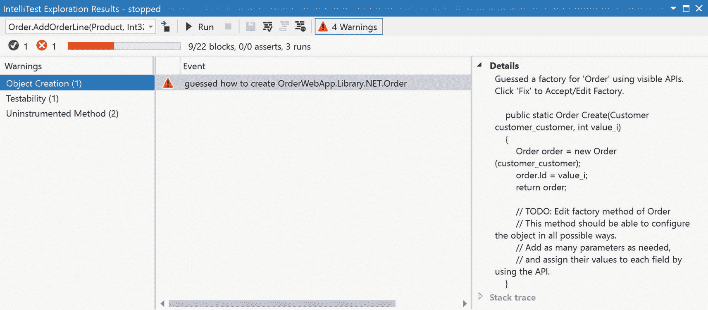

# 3.单元测试

对于现代应用开发人员来说，典型的工作流包括一系列反复重复的步骤。这些步骤俗称红/绿/重构。您为开发中失败的功能创建一个单元测试。这导致单元测试结果中出现红色。接下来，编写足够的代码来通过单元测试，然后重新运行所有测试。如果一切顺利，你应该有一个绿色(所有测试通过)。最后一步是重构你写的代码。整理一下。找到重复的代码并将其转换为单独的方法。确保遵守编码标准。完成后，再次运行测试以确保它们仍然是绿色的。至此，循环完成…红色，然后绿色，然后重构。并且重复这个循环，直到当前任务的开发完成。

Visual Studio 2019 通过许多相关功能帮助您度过这个周期。它能够使用许多不同的框架来创建和运行单元测试。还有一些工具可以帮助你完成重构步骤。但除了帮助完成基础工作，Visual Studio 2019 还提供了自动生成单元测试的能力，并确定测试了多少代码。如果你有 Visual Studio 2019 的企业版，实时单元测试，它允许你在打字时跟踪单元测试的状态。不过还是从基础开始吧……在 Visual Studio 2019 中创建单元测试。

## 编写和运行单元测试

Visual Studio 2019 包括一个内置的单元测试框架。它叫做 MSTest。然而，并不是每个团队都在使用 MSTest。像 NUnit 和 xUnit 这样的框架在专业开发团队中很常见。Visual Studio 也支持它们。令人高兴的是，尽管一些细节发生了变化，但是不管测试框架如何，编写单元测试的基本结构和流程是相同的。对于本节中的示例，我们将使用 MSTest，因为它包含在 Visual Studio 中。但是对于其他框架，几乎只有语法和属性名发生了变化。流量接近相同。

该示例的起点是一个 web 应用。虽然该应用是一个简单的销售订单系统，但是您将为其创建测试用例的功能在 order 类中，特别是一个将 OrderLine 对象添加到 Order 类的行集合中的方法。

首先，使用 Visual Studio 打开章节 [3](03.html) 。开始文件夹中的 sln 文件。该解决方案中有许多项目(欢迎您运行它来查看实际情况)，但我们关心的一个项目名为 OrderWebApp.Library，它是包含要测试的类的项目。

测试项目模板是 Visual Studio 可用的大部分工作负载的一部分。对于 ASP.NET 核心 Web 应用(示例应用是 ASP.NET 核心)，有三种不同的类型。如果在解决方案资源管理器中右击该解决方案，然后选择“添加➤新项目”，将出现“添加新项目”对话框。在顶部的搜索框中键入 test，只显示不同类型测试的模板。图 [3-1](#Fig1) 就是你会看到的。


图 3-1

为测试模板添加新项目对话框

前四个模板中的三个是用于 MSTest、NUnit 和 xUnit 测试的项目。NET 核心应用。选择 MSTest 测试项目(。NET Core)并单击下一步。输入 OrderWebApp 的项目名称。测试并单击 Create 来创建项目。

新创建的项目没什么看头。图 [3-2](#Fig2) 显示了项目的结构。


图 3-2

单元测试项目结构

一点也不多。只有一个包含测试方法和测试设置方法占位符的文件。但是在做任何事情之前，需要添加的是对被测试库的引用。否则，就不可能调用将要测试的方法。右击该项目，并从上下文菜单中选择“添加➤引用”。在出现的对话框中，选择 OrderWebApp。库项目，因为我们要测试的类就是在那里实现的。

在进入代码之前，简单地偏离一下单元测试类和测试方法的命名。首先，更普遍接受的方法名称之一是使用以下格式:unit of work _ state beingtested _ expected result。UnitOfWork 可以很小，就像单个方法一样，尽管更常见的是在类级别将测试组合在一起。StateBeingTested 表示作为测试主题的工作单元中的状态。ExpectedResult 表示运行测试的预期结果。可能的值将指示成功的类型或遇到的特定异常。

出于组织的目的，测试方法被放入不同的类中。这些类的命名应该完全基于您希望如何在测试资源管理器中显示测试，因为类名是用于显示测试结果的层次结构的一部分。一般来说，每个类都有自己的单元测试类，这将在本例中使用。还要考虑到班级名称和工作单位确实不需要重复。创建一个 OrderTest 类，然后让工作单元为 Order，这是复制信息。使用工作单元来表示正在测试的 Order 类中的属性或方法。

将所有这些放在一起，让我们看看一个简单单元测试的代码:

```
[TestClass]
public class OrderTest
{
    [TestMethod]
    public void TestMethod1()
    {
    }
}

```

这是生成的代码，除了类名。包含单元测试的文件名从 UnitTest1.cs 更改为 OrderTest.cs，导致类名更改。有两个元素表明这个类将在单元测试中使用。该类的 TestClass 属性指示该类将包含测试。修饰方法声明的 TestMethod 属性将该方法标记为测试。TestMethod 属性是必需的，因为并非类中的每个方法都是测试方法。在测试类中有不同的助手方法在测试方法中使用是可能的，也是经常需要的。当您选择运行单元测试时，测试运行器(执行测试的进程)会查看测试项目中的测试类，并找到所有具有 TestMethod 属性的方法。这些是将要执行的测试。

对于这个例子，我们将为 Order 类中的 AddOrderLine 方法编写一个测试。测试的成功标准是，当添加订单行时，订单对象的 Lines 属性的计数为 1。若要运行此测试，以下方法应替换 OrderTest 类中的 TestMethod1 方法:

```
[TestMethod]
public void Lines_AddOrderLine_LinesCountIsCorrect()
{
   Order target = new Order();

   target.AddOrderLine();

   Assert.AreEqual(1, target.Lines.Count,
      "The order line was not added");
}

```

按照现在的情况，这个应用应该不会成功编译。虽然不看 Order 类的代码看不出来，但是 AddOrderLine 方法还没有定义。这是单元测试的“红色”过程的一部分。但是不能编译是没有帮助的。需要将 AddOrderLine 方法添加到 Order 类中。您可以通过编辑 Order 类并添加一个名为 AddOrderLine 的方法来手动完成此操作。或者，您可以使用快速动作来完成相同的目标，而无需从当前编辑上下文切换。使用 Ctrl+。击键打开快速动作菜单(也可以通过点击代码行`target.AddOrderLine()`左侧的灯泡打开)，并选择生成方法“订单”。AddOrderLine”选项。如果使用快速操作，该方法如下所示:

```
public void AddOrderLine()
{
   throw new NotImplementedException();
}

```

这个方法不做任何事情，除了在被调用时抛出一个异常，这正是我们想要开始的地方。这有助于测试变红。但是为了确认它是红色的，我们需要运行测试。

运行测试有几个选项。从单元测试类本身的代码中，最简单的方法是右键单击编辑器中的任意位置，然后选择 Run Tests。这将生成项目并运行测试，在测试资源管理器中显示结果。第二种方法是使用同一个测试资源管理器对话框。若要访问测试资源管理器，请使用“测试➤测试资源管理器”菜单选项。测试浏览器将如图 [3-3](#Fig3) 所示。至少在您展开树中的所有节点后会这样。


图 3-3

测试浏览器

测试资源管理器为您提供了许多运行测试的方法。但是对于第一次执行，单击 Run All Test 工具栏按钮(左边的第一个)。在构建和运行之后，结果如图 [3-4](#Fig4) 所示。


图 3-4

测试失败的测试资源管理器

鉴于图像是黑白的，这并不明显，但整棵树都是红色的。树中的所有图标都表示测试失败。同样，在工具栏中，有一个带有 x 的红色图标。该图标旁边是失败测试的数量。拥有所有这些不同的指标是一个想法。红/绿/重构的“红”已经实现。

该过程的下一步是通过编写通过测试所需的最少代码来修复测试。将 AddOrderLine 方法更改为如图 [3-5](#Fig5) 所示即可实现这一点。


图 3-5

使该方法通过测试

首先，请注意，为了通过测试，只添加了一行。这是这个过程的最小方面。其次，第 [2](02.html) “辅助编码”一章中描述的方法增加了抬头显示显示中的第二个元素表明该方法被 1 个单元测试覆盖，并且 0/1 的测试通过。平视显示器中测试元件的功能将在本章后面详细介绍。

回到绿色测试。更改代码后，在“测试资源管理器”窗格中，再次单击“全部运行”链接。项目构建，测试运行，结果如图 [3-6](#Fig6) 所示。


图 3-6

通过测试的测试资源管理器

过去是红色的现在是绿色的。工具栏中的绿色图标(带有复选标记)旁边现在有一个 1(表示一次成功的测试)，而红色图标旁边有一个 0。红/绿/重构过程的第二步已经完成。第三步包含在第 4 章“重构代码”中。

### 测试浏览器

测试资源管理器是 Visual Studio 2019 单元测试的核心。它包含了几个旨在简化单元测试运行的特性。

您已经使用了顶部的 Run All Test 工具栏按钮来执行解决方案中的所有测试，这在只有少量测试时(或者当您确实需要运行所有测试时)是很好的。但是紧挨着右边的是一个运行工具栏按钮，点击它会打开一个下拉菜单。下拉菜单的内容如图 [3-7](#Fig7) 所示。


图 3-7

运行…下拉菜单

第一个选项 Run 运行树中所选节点内包含的所有测试。如果选择了一个类，那么这个类中的所有测试都会被执行。如果选择了单个测试，则只运行该测试。第二个选项，运行所有测试，就是这样做的。执行当前解决方案中的所有测试。

上下文菜单中接下来的三个选项根据测试的状态运行不同的测试集。测试可以处于三种状态之一:通过、失败和尚未运行。通过的测试将被认为是“绿色”，失败的测试将被认为是“红色”，而尚未运行的测试是指尚未在当前工作会话中运行的测试。可用的选项允许您执行这些测试子集之一。“重复最后一个测试”选项用于重新执行先前的测试运行，而不考虑包含的测试集。

图 [3-7](#Fig7) 下拉菜单第二部分的三个选项用于调试不同组的测试。在执行的测试集中,“调试”、“调试所有测试”和“调试上次运行”与“运行”、“运行所有测试”和“重复上次测试”相同。不同之处在于，如果在测试或应用中设置了断点，那么当遇到断点时，执行就会暂停。如果您试图找出测试失败的原因，这个功能非常有用。

Tip

还可以在调试模式下执行测试，方法是在编辑器中右键单击并从上下文菜单中选择 Debug Tests 选项。

下拉菜单中的最后一个选项是分析所有测试的代码覆盖率。此选项运行所有测试，但是如果测试成功，它还会为运行生成代码覆盖率分析。关于代码覆盖率的更多细节可以在本章后面的“代码覆盖率”部分找到。

在运行测试时，您可以从测试资源管理器中选择另一个选项。如果右键单击层次结构中的一个节点，会出现一个上下文菜单，如图 [3-8](#Fig8) 所示。


图 3-8

测试资源管理器上下文菜单

上下文菜单中最上面的两个选项运行测试。所包含的测试取决于所选的节点，但最终取决于所选节点或其下的所有测试。换句话说，如果您右键单击 OrderTest，并选择 Run，那么 OrderTest 中的所有测试都会被执行。这同样适用于调试，除了测试是在调试模式下执行的。

在上下文菜单的底部，有一个“转到测试”选项。仅在选择单个测试时启用，此选项打开所选测试所在的文件，并将光标置于相应的方法上。

上下文菜单中还有四个其他选项:关联到测试用例、分析代码覆盖率、配置文件和添加到播放列表。“关联到测试用例”和“添加到播放列表”选项将在本章后面的章节中介绍。Analyze Code Coverage 选项为选定的节点运行测试，在成功的测试运行(即没有失败)之后，执行代码覆盖分析。代码覆盖率的细节将在本章后面的单独章节中介绍。Profile 选项用于为测试所使用的代码启动性能分析。有关分析的详细信息可以在第 [7](07.html) 章“调试和分析”中找到

为了查看测试资源管理器中可用的一些附加功能，让我们向 OrderTest 类添加另一个单元测试。特别是，添加以下方法:

```
[TestMethod]
public void Lines_AddOrderLineWithProduct_ProductIsCorrect()
{
    Order target = new Order();
    Product product = new Product()
    {
        Id = 1,
        Number = "A-123"
    };

    target.AddOrderLine();

    Assert.AreEqual(1, target.Lines.Count,
        "The order line was not added");
    Assert.IsNotNull(target.Lines[0].Product ,
        "No product was added to the order line");
    Assert.AreEqual(product.Id,
        target.Lines[0].Product.Id,
        "The product was not added to the order line");
}

```

这个单元测试背后的想法是将一个产品对象传递到 AddOrderLine 方法中，然后应该可以在添加的订单行上找到该产品。此时，单元测试应该会失败，这正是我们想要的。当所有测试运行时，测试浏览器看起来如下(图 [3-9](#Fig9) )。


图 3-9

具有多个失败测试的测试资源管理器

您会注意到其中一个测试通过了，另一个测试失败了。如果您选择了一个失败的测试，那么关于失败的详细信息将出现在右侧。有用的部分是消息，它包含在对 Assert 方法和堆栈跟踪的调用中。堆栈跟踪包含对异常进行的调用列表。虽然示例中只有一个，但是堆栈跟踪中可以有更多项。每一项都是一个链接，单击该链接将打开相应文件的编辑器，并将光标置于异常发生时正在执行的方法上。当试图确定 bug 的来源时，所有这些都非常有用。

本章前面提到了代码中的平视显示。图 [3-10](#Fig10) 包括 AddOrderLine 方法的当前视图。


图 3-10

AddOrderLine 方法平视显示器

与测试相关的抬头显示元素显示 1/2 的测试通过。如果点击该链接，将显示如图 [3-11](#Fig11) 所示的信息。


图 3-11

测试抬头显示信息

平视显示器提到有两项测试，其中一项是通过。信息显示包括测试列表，左侧的图标指示测试的状态(通过或失败)。在信息显示中，您可以通过双击某个测试来导航至该测试。此外，在左下方，有运行所有测试或者只是运行所选测试的链接。

#### 与测试用例相关联

“与测试用例关联”选项用于将单元测试链接到 TFS (Team Foundation Server)或 Team Services 中的测试用例。图 [3-12](#Fig12) 显示了选择该选项时出现的对话框。

Note

如果“与测试用例关联”选项不可见，则很可能是因为您登录 Visual Studio 所使用的帐户未与 TFS 或 Team Services 关联。


图 3-12

与测试用例对话框相关联

虽然只有在选择了单个测试时才启用这个选项，但是理解这个关联的上下文是很重要的。通过将单元测试与测试用例联系起来，将有助于理解一些限制。

团队服务/TFS 中的测试用例是为了测试一项功能而需要执行的一组步骤的描述。例如，一个测试用例可能是为一个客户创建一个包含产品“A-123”的订单它包括一个用户添加订单所需步骤的详细列表，包括选择的菜单选项、输入的数据和单击的按钮。在过去，这可能大致相当于手动测试。

当您将一个测试与一个测试用例相关联时，您就说这个测试覆盖了测试用例中描述的功能。这意味着测试的成功完成具有相同的权重，就好像用户已经手动完成了测试用例中的所有步骤，并且它们都通过了。

当自动化执行测试时，将测试与测试用例相关联的真正好处就来了。如果项目和测试是构建管道的一部分，那么可以将测试配置为自动运行。当这种情况发生时，与测试用例相关联的测试作为构建的一部分被执行，来自该测试运行的结果也与测试用例相关联。如果测试通过，测试用例被标记为完成。如果测试失败，测试用例也被认为是失败的。对于在开发中有许多移动部分的复杂系统，测试与测试用例的关联以及构建管道中的后续包含可以是对开发工作流的强大补充。

然而，作为与测试用例相关的上下文的结果，对于哪些类型的测试可以与一个测试用例相关联有一些限制。毕竟，将本章中构建的简单单元测试与多步骤、手动执行的测试用例联系起来是没有意义的。以下类型的测试可以与一个测试用例相关联:

*   编码 UI 测试(尽管需要注意的是，在 Visual Studio 2019 之后，对编码 UI 的支持已被否决)

*   硒测试

*   使用 MSTest 框架版本 1 编写的单元测试

*   MSTest 版本 2、NUnit 和 xUnit 测试(但是，如果它们是使用 TFS 管道构建的，则不能是较旧的 XAML 版本之一)

*   。NET 核心框架测试(但是，它们不能使用旧的 XAML 版本)

使用 JavaScript 测试框架的测试，比如 Chutzpah 或 Jest，不能与测试用例相关联。

Note

虽然同一个测试可以与多个测试用例相关联，但是每个测试用例只能与一个测试相关联。

如果您确实有一个合格的测试，那么将一个测试与一个测试用例相关联的流程是简单的。例如，使用 TFS 门户获取测试用例的标识符。在文本框中输入标识符，然后单击添加关联。对话框底部的列表显示了所选测试的所有现有关联。

#### 播放列表

在图 [3-8](#Fig8) 的上下文菜单中还可以看到一个添加到播放列表选项。播放列表是一种机制，用于创建可以一起执行的测试组。到目前为止，测试的唯一分类是基于状态(通过、失败、未运行)或代码的物理位置(类或项目)。播放列表提供了一种可自定义的测试分组方式。

要创建播放列表，首先在测试资源管理器中选择一个或多个节点。然后右键单击并从上下文菜单中选择添加到播放列表➤新播放列表选项。测试资源管理器的一个新实例出现了，测试树以您最初选择的节点为根。两个测试浏览器之间唯一的区别是新创建的浏览器在消息类型图标的右边有一个保存图标。如果希望在 Visual Studio 会话之间保留播放列表，单击保存图标将提示您输入文件名(带有。播放列表扩展)。一旦创建了播放列表，就可以在整个测试资源管理器的不同地方使用它。例如，您可以使用顶部的播放列表图标打开播放列表来查看测试(参见图 [3-13](#Fig13) )。


图 3-13

打开现有播放列表

或者您可以将测试添加到打开的播放列表中。通过从上下文菜单中选择添加到播放列表，完成与创建播放列表时相同的过程。然后选择要添加测试的播放列表的名称。如果你特别喜欢冒险，你甚至可以编辑。播放列表文件。播放列表信息存储为 XML 文档，其中播放列表中的每个测试都是一个节点。节点的属性之一是测试方法的完全限定名。

每次打开或创建播放列表时，都会打开一个新的测试资源管理器实例，只显示播放列表中包含的测试。新实例中的功能与原始测试资源管理器中的功能相同，也就是说，您可以运行测试、调试测试以及查看任何测试的结果。

## 智能测试

编写单元测试是一项有趣的脑力劳动。遵循红/绿/重构模式会产生一些单元测试，但是这些单元测试是为覆盖功能而设计的。它们可能不一定涵盖所有的边缘情况，特别是就传入的参数值的范围而言。开发人员需要考虑参数的所有不同可能性，然后为每个场景编写单元测试。技术上不具有挑战性，但很有必要。而且乏味。

IntelliTest 正好填补了这一空白。它始于微软的一个研究项目(代号为 Pex ),目标是通过对代码执行动态分析来生成单元类型，这意味着它检查被测试的代码并识别应该创建的单元测试。它试图确保代码中的所有路径都被测试覆盖。它确保参数的极端值(比如为一个对象传递一个空值)包含在测试中。

随着时间的推移，来自该项目的功能以 IntelliTest 的形式发布到产品中。IntelliTest 检查您的代码，查找以下项目:

*   条件分支`–`对于每个 switch 或 if 语句，参数值被标识为通过每个分支执行。

*   断言`–`确定断言通过和失败所需的参数值。

*   超出范围`–`对于某些类型的参数，发现包含空值的测试。

这些信息用于创建一套单元测试。而且，如果您愿意，可以将这些单元测试添加到您的项目中，无论是在现有的项目中还是在单独的项目中。

启动 IntelliTest 的过程很简单。右键单击要处理的方法中的任意位置，并从上下文菜单中选择 IntelliTest ➤运行 IntelliTest(图 [3-14](#Fig14) )。


图 3-14

IntelliTest 上下文菜单

Note

在 IntelliTest 菜单选项可见之前，需要满足几个条件。首先，IntelliTest 是 Visual Studio 2019 企业版的一项功能。专业版和社区版不会显示菜单项。此外，根据版本号，IntelliTest 不支持。NET 核心应用。微软最新说法是支持 IntelliTest 和。从 16.3 版本开始，NET Core 将被零星地包含在内，但目前还没有完整支持的时间表。

运行 IntelliTest 时，会生成项目，然后对方法进行动态分析。结果显示在它自己的窗格中，如图 [3-15](#Fig15) 所示。


图 3-15

IntelliTest 探索结果窗格

从 IntelliTest 运行的结果来看，生成了两个单元测试。输出中的第一列包括被测试对象的构造函数(在本例中，是一个 Order 对象)。正在测试的方法(AddOrderLine)有两个参数，一个产品和一个数量。对于这些参数中的每一个(标记为 product 和 quantity ),在显示屏上都有一列，您可以看到作为测试的一部分传入的值。接下来的三列处理运行测试的结果。在第一行中，测试运行时生成了一个异常(NullReferenceException)。还有一条错误消息，包含与异常相关的消息。在第二行中，测试通过，标有 result(target)的列显示成功执行后目标对象的状态。

以这种方式运行 IntelliTest 不会生成单元测试的代码并将其添加到项目中。相反，测试完全在内存中生成和执行。如果您选择了一行，图 [3-15](#Fig15) 中窗格右侧的部分显示了生成的单元测试的代码。也可以这样发现:

```
[TestMethod]
[PexGeneratedBy(typeof(OrderTest))]
[PexRaisedException(typeof(NullReferenceException))]
public void AddOrderLineThrowsNullReferenceException886()
{
    Order order;
    order = new Order((Customer)null);
    order.Id = 0;
    this.AddOrderLine(order, (Product)null, 0);
}

```

您看到的一些内容对于单元测试来说是完全正常的。但是该方法是如何调用的有点不寻常，值得进一步研究。

TestMethod 属性是如何将一个方法指示为单元测试的。但是另外两个属性 PexGeneratedBy 和 PexRaisedException 是非典型的。如果您将这个测试转移到您的项目中，它们是不必要的。PexGeneratedBy 属性用于跟踪哪些测试属于哪个类。PexRaisedException 属性指示运行测试导致引发 NullReferenceException。IntelliTest 使用它们来帮助确定在 IntelliTest 浏览结果窗格中显示哪些方法以及何时显示。

在方法本身内部，创建目标对象并将属性设置为适当的值。然后调用一个名为 AddOrderLine 的私有方法。注意，传递了目标对象以及 AddOrderLine 的参数。

AddOrderLine 方法是内部生成的方法。代码如下:

```
[PexMethod]
public void AddOrderLine(
   [PexAssumeUnderTest]Order target,
   Product product,
   int quantity
)
{
   target.AddOrderLine(product, quantity);
}

```

这种方法从表面上看似乎没有增加多少价值。在这种情况下，这可能是不必要的。除了用于帮助 IntelliTest 浏览结果窗格的属性(PexMethod 和 PexAssumeUnderTest)之外，还显示相应的信息。但是，作为一种良好的实践，将对测试方法的调用放在一个单独的方法中会很有用。例如，很可能会有许多对 AddOrderLine 的调用。其中的每一个都将涉及检查调用是否导致 OrderLine 被添加到 Order 对象(由目标变量表示)。可以将断言添加到这个方法中对 AddOrderLine 的调用下面，现在对 AddOrderLine 的所有调用都包含该断言。减少了每个单元测试中需要出现的重复断言的数量。当测试是手工编写的时候，这种类型的单元测试重构也会被执行。IntelliTest 只是从最初的代码生成开始。

图 [3-15](#Fig15) 顶部是一个工具栏，帮助您在结果窗格中执行常见功能。左侧的下拉列表包含智能测试运行中包含的所有方法的列表。虽然在前面描述的示例中，IntelliTest 是通过在方法内右击来执行的，但是如果您改为在类中右击，那么 IntelliTest 将会为该类中的所有公共方法(包括构造函数)生成测试。从下拉列表中选择一种方法，会显示为该方法生成的测试。

紧挨着下拉列表的右边是一个图标(一个带箭头的正方形),它将您带到被测方法的定义。接下来是一个运行探索的图标(绿色三角形)和一个停止探索的图标(红色正方形)。

接下来的四个图标用于执行从生成的结果中选择的测试的功能。如果您选择一个或多个测试，则至少会启用第一个图标。这个图标(看起来像软盘)用于将测试保存到项目中。该项目的命名细节基于下面描述的 Create IntelliTest 设置。

其他三个图标是有选择地启用的。对于图 [3-15](#Fig15) 中的视图，只有一种可能性，那就是允许图标(四个中的第三个)。如果您选择了由于空引用异常而失败的单元测试，则“允许”图标将被启用。当您单击该图标时，表示让该方法引发异常是可接受的结果。这会将 PexExceptedException 添加到本节前面描述的 AddOrderLines 方法中(该方法是测试的一部分，而不是测试中的方法)。现在，当出现异常时，它被视为通过测试。

要访问其他两个图标，需要稍微绕一下工具栏。在右边，有一个警告图标。它直观地描述了在运行浏览过程中发现了多少个警告。但是当您单击它时，您会将 IntelliTest 窗格的内容更改为类似图 [3-16](#Fig16) 的内容。



图 3-16

IntelliTest 的警告

作为探索过程的一部分，IntelliTest 对每个方法进行了详尽的遍历。但是这种遍历不仅仅是沿着可能存在的任何分支或循环。它查看不同变量的数据类型来确定边界情况。它还考虑如何创建对象的实例，如果合适的话，将不同范围的参数传递给构造函数。如果该方法具有将接口作为数据类型的参数，则它会查看项目中的任何具体实现。IntelliTest 可能会考虑各种各样的事情，如果有问题，甚至有机会改进测试过程，就会生成警告。

在图 [3-16](#Fig16) 中，有三类警告可见。如果您单击第一个，您可以看到该特定警告的详细信息。在此实例中，IntelliTest 找不到订单对象的工厂。在细节部分的右边，是 IntelliTest 提出的工厂。在这一点上，其他两个图标开始发挥作用。

选择警告后，之前禁用的两个图标将被启用。第二个图标用于修复警告。在这种情况下，它将为已经发现的单元测试创建一个测试项目，并将提议的工厂添加到执行流中。第二个图标用于抑制警告。在这种情况下，不会添加任何修复，警告也不会在以后的探索中出现。

使用 Fix 选项要考虑的一件事是，一旦工厂被添加到测试项目中，您就能够调整它以适应您的类的具体情况。这里的“调整”意味着改变实现。向工厂添加参数。将属性初始化为不同的值。所有选项都是开放的，因为工厂只是测试类中的一个方法，您所做的任何更改都将被集成到单元测试执行流程中。

### 测试项目设置

到目前为止，在关于 IntelliTest 的讨论中，已经有许多函数接受了生成的单元测试，并在实际项目中展现出来。例如，修复上一节末尾的警告将创建一个单元测试项目(如果它还不存在)并添加一个包含工厂方法的适当命名的类。因为代码是生成的，所以您可以定制以满足您的需求。

然而，生成代码的诀窍是用最少的努力让它很好地适应您的项目。让您的测试项目名称符合您的项目名称标准。创建与红/绿/重构过程中使用的单元测试类相同的类。幸运的是，Visual Studio 2019 提供了一种机制，为生成的测试的各个部分定义命名模式。

用于定制命名的屏幕通过图 [3-14](#Fig14) 所示上下文菜单中的智能测试➤创建智能测试菜单项访问。结果是如图 [3-17](#Fig17) 所示的对话框。


图 3-17

创建智能测试对话框

起点是选择您正在使用的测试框架。Visual Studio 2019 提供的唯一选项是两个版本的 MSTest。如果您正在使用另一个测试框架，您可以从 Visual Studio Marketplace 中找到支持 xUnit 和 NUnit 的扩展。如果您安装了一个(或多个)扩展，您可以从下拉列表中选择您想要的框架。

下一个字段，Test Project，用于指定您是否想要创建一个新的项目，或者将测试添加到一个现有的项目中。您将在下拉列表中看到的唯一项目是那些匹配所选择的测试框架的项目。

剩下的四个字段用于定义命名测试项目、名称空间、测试类和测试方法的模式。您会注意到有四个占位符:项目、名称空间、类和方法。通过用方括号将占位符括起来，将它们与名称的静态部分区分开来。您可以在任何字段中使用任何占位符。当您根据需要配置好框架和名称后，单击 OK。这会生成测试项目(如果尚未选择现有的),并添加脚手架代码来运行在使用 IntelliTest exploration 结果窗格中的保存功能时创建的测试。

#### 代码覆盖率

单元测试的一个更常见的度量是代码覆盖率。代码覆盖率的目标是描述单元测试覆盖的代码的百分比。虽然对于什么是足够的百分比以及应用的哪些部分应该或不应该包括在计算中有许多观点，但是您需要知道的是如何为您的项目生成该数字。

您开始在 IntelliTest exploration 结果窗格中看到与代码覆盖率相关的信息(图 [3-16](#Fig16) )。在工具栏的正下方有一个条，粗略地显示了覆盖率，以及发现和覆盖的块的数量(9/22 块意味着 22 个发现的块中有 9 个被单元测试覆盖)。

然而，为了生成整个项目的代码覆盖率信息(或者在一个更细粒度的层次上)，需要使用测试资源管理器。要在收集代码覆盖率统计数据的同时运行您的测试，单击运行图标右侧的下拉菜单，并选择分析所有测试的代码覆盖率菜单选项(图 [3-18](#Fig18) )。


图 3-18

生成代码覆盖率统计数据

在这一点上，这个过程与运行测试非常相似。项目构建并执行测试。不同之处在于，一旦测试运行完成，就会出现一个不同的窗格，它包含代码覆盖信息，而不是测试结果。在图 [3-19](#Fig19) 中可以找到一个例子。


图 3-19

代码覆盖率结果窗格

图 [3-19](#Fig19) 中显示的代码覆盖率信息是代码覆盖率按程序集、命名空间、类和(图中不可见)方法的层次分解。对于每个不同的级别，列出了覆盖和未覆盖区块的数量，以及各自的百分比。

块不是唯一可以用来度量代码覆盖率的单位。Visual Studio 还支持使用行数作为代码覆盖率的度量单位。换句话说，您可以查看代码覆盖率分析，它显示了基于作为测试的一部分而执行的代码行数的数字和百分比。

为什么你会选择一种度量单位而不是另一种？这实际上取决于您试图从代码覆盖率中提取的信息。以块为单位查看覆盖率并不能说明块的实际大小。在图 [3-19](#Fig19) 中，有 24 块未被覆盖。那是 24 行逻辑还是 2400？没有办法知道。对于一些经理来说，这种差异是代码质量的潜在盲点。

没有必要为了从块到行再返回而重新运行代码覆盖分析。相反，右击代码覆盖率结果区域的标题，然后选择“添加/移除列”。图 [3-20](#Fig20) 出现。


图 3-20

添加和移除代码覆盖率列

你可以看到出现在图 [3-19](#Fig19) 中的四列都被选中。如果您想以行的形式显示代码覆盖率，那么检查末尾有(行)的任何或所有列。当您单击“确定”时，它们现在将出现在代码覆盖率结果中。

虽然代码覆盖率数字很好，可以让您了解代码库中可能需要更多测试的区域，但对于一些开发人员来说，数字本身并不能真正提供足够的粒度来确定需要编写哪些测试。为了帮助实现这一点，Visual Studio 2019 中的代码覆盖率能够根据代码行是否作为单元测试的一部分执行来为代码行着色。

若要打开和关闭线条的颜色，请在“代码覆盖率结果”窗格的工具栏上，单击紧靠“移除”按钮左侧的“显示代码覆盖率颜色”按钮。当打开着色时，单个代码文件的线条会变暗，如图 [3-21](#Fig21) 所示。


图 3-21

代码颜色的源代码

虽然实际的颜色在黑白图像中不明显，但是单元测试覆盖的代码行是淡蓝色的，而没有覆盖的代码行是浅红色的。这允许您针对尚未解决的代码进行测试。这并不是一个完美的方法(毕竟，单个测试覆盖了代码并不意味着代码不包含 bug)，但是这是一个查看您的测试可能存在不足的方便方法。

##### 合并结果

“代码覆盖率结果”窗格仅显示代码覆盖率分析过程的最新运行结果。然而，如果您试图确定所有测试所提供的覆盖率，这可能是不够的。为了覆盖所有的代码，一些单元测试可能需要多次运行(例如，每次运行之间的配置信息不同)。

在“代码覆盖率结果”窗格中，您可以将多个测试运行的结果合并成一组代码覆盖率结果。首先，如果您想查看以前分析的结果，它们位于工具栏左侧的下拉列表中。图 [3-22](#Fig22) 显示了包含几个先前执行的测试的下拉列表。


图 3-22

合并代码覆盖率分析结果

当您选择出现的任何项目时，该分析的结果会出现在窗格中。但是，请注意，该列表只包括自 Visual Studio 启动以来发生的分析运行。如果您想包含之前的结果，您需要导入结果，这个过程将在下一节中描述。

但是我们正在考虑将不同分析的结果合并成一份报告的能力。为此，单击工具栏中的合并结果图标(在图 [3-22](#Fig22) 中圈出)。这将启动如图 [3-23](#Fig23) 所示的对话框。


图 3-23

合并测试运行对话框

选择要合并到单个报告中的不同运行，当您单击“确定”时，它们将与“代码覆盖率结果”窗格中可见的结果相结合。

合并不同运行结果的主要限制是，它们都需要针对相同版本的代码执行。仔细想想，这是有道理的。结果中有信息将测试执行与被执行的代码行相匹配。如果您对正在测试的代码进行了更改，那么先前的结果可能不再能够与代码匹配。因此任何分析对于确定代码覆盖率都不再有效。如果您合并不同版本的结果，它不会阻止信息显示。它们将在两个不同的顶级节点下独立显示，而不是合并到一个层次结构中。

##### 管理结果

无论结果是否合并，都可以根据需要导出并发送给其他人。首先，分析结果本身存储在一个名为 TestResults 的文件夹中，与您的解决方案文件处于同一级别。在 TestResults 文件夹中，每次运行都有一个单独的文件夹。文件夹名是烦人的 GUIDs(全局唯一标识符)，所以没有办法根据名称来判断运行来自哪里。只有日期可以指引你。

该文件夹中有一个`.coverage`文件，包含二进制格式的测试结果。也就是说，你可以在记事本中打开它，但不要指望从中获得任何有用的信息。如果您需要与他人分享分析运行的结果，您只需向他们发送`.coverage`文件。然后他们可以使用 Import Results 按钮(弯曲的箭头图标，见图 [3-22](#Fig22) 中合并结果图标的左边)将结果导入到代码覆盖率结果窗格中。

如果您喜欢更易于阅读的结果形式，您可以使用 Export Results 按钮(下拉列表右侧的图标，烧瓶是它的一部分)来实现这一点。单击时，您会看到标准的保存文件对话框，保存文件的唯一格式是一个`.coveragexml`文件。这个文件包含与`.coverage`相同的信息，但是是 XML 格式的，所以人类和其他工具更容易理解。

##### 用户化

至此，代码覆盖率已经使用了默认设置。从实用的角度来看，这意味着分析过程考虑了作为解决方案一部分的所有程序集。对于许多情况，这种默认行为已经足够了。但是，如果您想更具体地了解包含或排除的工件，Visual Studio 2019 提供了一种可以使用的机制。

自定义信息保存在一个`.runsettings`文件中。这只是一个扩展名为`.runsettings`的 XML 文件。若要创建文件，请向解决方案中添加一个新项。这个项目是一个 XML 文件，只要扩展名是`.runsettings`，它的名称可以随意设置。Visual Studio 2019 中没有此文件的模板。如果您想要一个基本布局，请考虑以下几点:

```
<?xml version="1.0" encoding="utf-8"?>
<RunSettings>
  <RunConfiguration>
    <MaxCpuCount>1</MaxCpuCount>
    <ResultsDirectory>.\TestResults</ResultsDirectory>
    <TargetPlatform>x86</TargetPlatform>
    <TargetFrameworkVersion>Framework45
    </TargetFrameworkVersion>
    <TestSessionTimeout>10000</TestSessionTimeout>
  </RunConfiguration>
  <DataCollectionRunSettings>
    <DataCollectors>
      <DataCollector friendlyName="Code Coverage"
         uri="datacollector://Microsoft/CodeCoverage/2.0"
         assemblyQualifiedName=
"Microsoft.VisualStudio.Coverage.DynamicCoverageDataCollector, Microsoft.VisualStudio.TraceCollector, Version=11.0.0.0, Culture=neutral, PublicKeyToken=b03f5f7f11d50a3a">
        <Configuration>
          <CodeCoverage>
            <ModulePaths>
              <Exclude>
                 <ModulePath>.*MyUnitTestFramework.*
                 </ModulePath>
              </Exclude>
            </ModulePaths>
          </CodeCoverage>
        </Configuration>
      </DataCollector>
    </DataCollectors>
  </DataCollectionRunSettings>
  <TestRunParameters>
    <Parameter name="testUserId" value="Admin" />
    <Parameter name="testPassword" value="P@ssw0rd" />
  </TestRunParameters>
</RunSettings>

```

这里的大多数值都是代码覆盖率分析的默认设置，因此可以在不改变行为的情况下删除这些值。可能最常定制的两个元素是 ModulePaths 和 TestRunParameters。

ModulePaths 元素可以选择包含 Exclude 和 Include 子元素。Exclude 元素是 ModulePath 元素的集合，其中的内容是用于指定不包括在代码覆盖率分析中的程序集的正则表达式。Include 元素是 ModulePath 元素的集合，其中的内容是一个正则表达式，用于指定要包含在分析中的程序集。

ModulePath 元素并不是指定处理中包含或排除的元素的唯一方式。还提供了

*   CompanyName `–`使用程序集的 company 属性。

*   PublicKeyToken `–`使用程序集的公钥标记。这假定程序集已经过签名。

*   Source `–`通过源文件的路径查找程序集。

*   Attribute `–`寻找用特定属性修饰过的元素。必须使用属性的全名，包括类名的“属性”部分。

*   函数`–`找到具体的方法。这个元素的内容是一个正则表达式，它必须与函数的完全限定名相匹配。此实例中的完全限定包括命名空间、类名、方法名和参数列表。例如，在类`OrderTest`和名称空间`OrderWebApp.Library.Test`中带有签名`public void Lines_AddOrderLine_LinesCountIsCorrect(int orderNumber)`的方法需要一个匹配以下字符串的正则表达式:

```
OrderWebApp.Library.Test.OrderTest.Lines_AddOrderLine_LinesCountIsCorrect(int)

```

TestRunParameters 元素是参数元素的集合。每个参数都是一个名称/值对，用于提供可以在测试执行中使用的参数信息。在这方面，集合看起来像许多其他名称/值对，如 AppSettings，用于参数化执行。诀窍是现在检索当前值并在测试中使用它。对于 TestRunParameters，这些值通过 TestContext 对象中的属性列表显示出来。MSTest 中的以下示例提供了一个说明:

```
private string _testCompanyName;
private string _testEmployeeName;

[ClassInitialize]
public static void TestClassInitialize(TestContext context)
{
   _testCompanyName =
      context.Properties["testCompanyName"].ToString();
   _testEmployeeName =
      context.Properties["testEmployeeName"].ToString();
}

```

TestContext 可作为用于初始化该类的方法中的一个参数。是 ClassInitialize 属性指示在类初始化时调用哪个方法。在该示例中，使用参数名称作为索引从 Properties 属性中提取值。然后，该值存储在类级别的变量中，以便所有方法都可以使用它们。

您可以在您的项目中有多个可用的`.runsettings`文件，并选择一个用于测试执行期间。要选择所需的文件，请在测试资源管理器中单击齿轮旁边的下拉按钮。图 [3-24](#Fig24) 显示了出现的选项。


图 3-24

选择运行设置文件

“选择设置文件”选项启动“打开文件”对话框，允许您选择所需的设置文件。一旦您使用了某个特定的文件，它就会被添加到与齿轮图标相关联的选项列表中，以便您下次需要它时更容易使用。图 [3-25](#Fig25) 显示了相同的菜单，但是之前已经选择了一个设置文件。


图 3-25

再次选择. runsettings 文件

在齿轮图标下有几个其他选项，可能适用于您的情况。通过在菜单中选择选项，可以打开和关闭每个选项。

构建后运行测试`–`使得测试在任何成功的构建后立即运行。如果你有一个有很多测试的应用，并且你是在有规律的基础上做构建，这可能是有问题的。构建完成和调试启动之间的延迟可能令人抓狂。然而，一个简单的解决方案是创建一个`.runsettings`文件，该文件针对与您正在做的工作相关的测试。现在延迟减少了，如果任何测试失败，它们都与您正在做的工作直接相关。

AnyCPU 项目的处理器架构`–`允许您设置标记为“Any CPU”的项目的处理器架构是使用 x86 还是 x64 运行。这与配置管理器中的设置不同，因为该值只影响测试，而不会影响整个项目或解决方案。

保持测试执行引擎运行`–`当 Visual Studio 运行单元测试时，它们实际上是在一个单独的进程中执行的。这允许 Visual Studio 在单元测试执行期间保持交互性和稳定性。该选项用于确定在测试执行完成后，您是否希望保持该单独的进程运行。这是速度(下一次运行单元测试时，您不会花费公认的很少的时间来启动单独的进程)和资源(测试执行进程在运行时使用内存)之间的权衡。Visual Studio 2019 的默认设置是打开此设置。

并行运行测试`–`这个选项提供了一个机会，通过并行运行测试来加速测试的整体执行。首先，为了让这成为一个优势，您需要在一台拥有多个内核的机器上运行。一旦满足该要求，如果该选项已经打开，那么将在每个内核上启动单独的测试执行过程。然后每个过程将被给予一个测试工件来工作。通常，测试工件是一个包含单元测试的程序集。运行这些测试并将结果传回 Visual Studio 将取决于流程。

当涉及到并行测试时，需要理解一些注意事项和警告。您可以配置测试中使用的内核数量，从而确定并行化的程度。这是通过`.runsettings`文件中的`RunConfiguration`元素完成的。以下元素确保使用的内核不超过两个:

```
<RunConfiguration>
    <MaxCpuCount>2</MaxCpuCount>
</RunConfiguration>

```

警告来自于你如何组织单元测试的形式。为了并行工作，测试必须彼此完全独立。完成这项工作的难易程度在很大程度上取决于您的环境。从经验上来说，当单元测试使用一个共享的资源，比如一个数据库时，与并行测试最大的冲突就来了。所以如果你计划并行化你的测试，记住这一点。这将节省你调试挫折的时间。

## 实时单元测试

Visual Studio 2019 Enterprise 包括一项技术，允许您的单元测试实时执行。换句话说，当您对代码进行更改时，涵盖您正在更改的代码的单元测试会得到执行。这为您编写的代码提供了即时反馈，无论您所做的更改是否会对代码先前的功能产生负面影响。这项技术被称为实时单元测试。活单元测试不仅向您显示基于您的更改哪些测试会通过或失败，它还更新了代码覆盖信息。

默认情况下，不启用实时单元测试。正如您所想象的，连续运行单元测试会对性能产生影响。虽然 Visual Studio 能够智能地处理每次更改时需要执行的测试，但是测试仍然在运行，这确实会占用 CPU 周期。

现场单元测试的起点是任何测试项目。两者都有人支持。NET 框架和。NET 核心测试项目。对于测试框架，实时单元测试支持 MSTest、NUnit 和 xUnit.net。对于下面的例子，我们将使用本章前面创建的测试项目。

如前所述，默认情况下，没有启用实时单元测试。您需要手动启动它。这是通过 Visual Studio 中的“测试➤现场单元测试➤”开始菜单项完成的。当您开始实时单元测试时，第一步是执行您当前所有的单元测试。这与您手动运行所有测试是一样的。测试完成后，将出现测试资源管理器，向您显示结果。同样，这与您手动运行测试是一样的。图 [3-26](#Fig26) 展示了当所有测试都通过时的测试浏览器。


图 3-26

通过测试的测试资源管理器

当你查看你的代码时，你会发现与实时单元测试的区别。图 [3-27](#Fig27) 显示了典型方法的样子。


图 3-27

一种在实时单元测试中通过单元测试的方法

不同之处在于绿色的复选标记出现在每一行和方法的旁边，这些方法包含了所有测试。复选标记(好像绿色还不够)表示测试成功。但是，正如章节标题所暗示的，这是**现场**单元测试。要查看运行中的活动零件，请更改将数量更新为自增量的行中的自减量运算符。现在单元测试失败，复选标记变为红色 X，如图 [3-28](#Fig28) 所示。


图 3-28

一种实时单元测试中单元测试失败的方法

X 不仅仅是单元测试失败的指示器。如果您单击其中一个 X，您可以看到覆盖该行代码的特定测试，以及哪些测试通过了，哪些测试失败了。图 [3-29](#Fig29) 显示了点击时可用的信息。


图 3-29

现场单元测试详细信息

该信息包括一个测试列表，这些测试覆盖了与您单击的 X 相关联的行。每个测试旁边的 X 和复选标记表示测试是通过还是失败。如果双击其中一个测试，将打开包含该测试的文件，并将光标放在该测试方法上。

除了关于测试及其状态的信息之外，您还可以运行所有的测试或调试所有的测试。如果您选择了其中一个测试，您还可以运行或调试那个单独的测试。

如前所述，如果您使用实时单元测试，可能会对性能产生影响。有许多设置可以帮助缓解您可能遇到的任何问题。要获取设置，请单击“工具”“➤选项”菜单项，并导航到左侧的“实时单元测试”节点。应看到图 [3-30](#Fig30) 。


图 3-30

实时单元测试设置

这些设置中的大部分与帮助您确保保持性能水平直接相关。使用图 [3-30](#Fig30) 中的选项，可以配置以下区域:

如果考虑到 Visual Studio 正在做的事情和所涉及的 CPU 工作，那么在构建和调试解决方案时暂停实时单元测试是有意义的。至于调试，除非您计划在调试时对应用进行更改，否则没有必要运行实时单元测试。

当电池电量低于某个百分比`–`时，再次暂停实时单元测试，这有助于延长电池寿命。

打开解决方案时启动实时单元测试`–`这决定了当解决方案完成加载时，是否自动启动实时单元测试。

生成调试符号和 XML 文档。作为实时单元测试过程的一部分，应用不断地自我编译。此标志指示应用是否应生成调试符号(即。pdb 文件)和 XML 注释。

作为调试符号生成的一部分，您还可以指定存放持久化数据的目录。同样，如果您想删除任何已经持久化的数据，有一个按钮可以做到这一点。这将清理数据，允许在下次需要时重新生成数据。

在测试级别，您可以使用 Testcase Timeout 来限制单元测试在被标记为失败之前可以运行的毫秒数。此外，还有一个选项来定义将要运行实时单元测试的进程的数量。

最后一个基于性能的选项用于设置用于实时单元测试的内存上限。同样，这是在编码时更新的 X 或复选标记的响应性和 Visual Studio 的性能之间的权衡。

最后，还有编译过程在实时单元测试中使用的日志记录级别。通过编译生成的信息出现在“实时单元测试输出”窗口中。

## 摘要

编写和执行测试，无论是手动完成还是作为实时单元测试的一部分，都是本章顶部描述的红/绿/重构过程的核心功能。它几乎是红色和绿色部分的核心。本章介绍了 Visual Studio 在编写、运行和受益于应用中的单元测试方面提供的支持。

在下一章中，你将学习开发三元组的第三条腿:重构。这是获取有效代码(根据单元测试)并通过精简、重组和重构来改进它的过程。