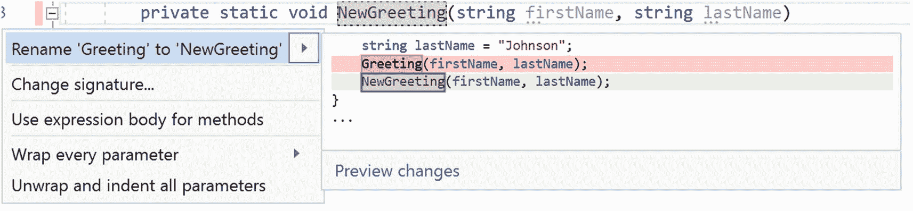
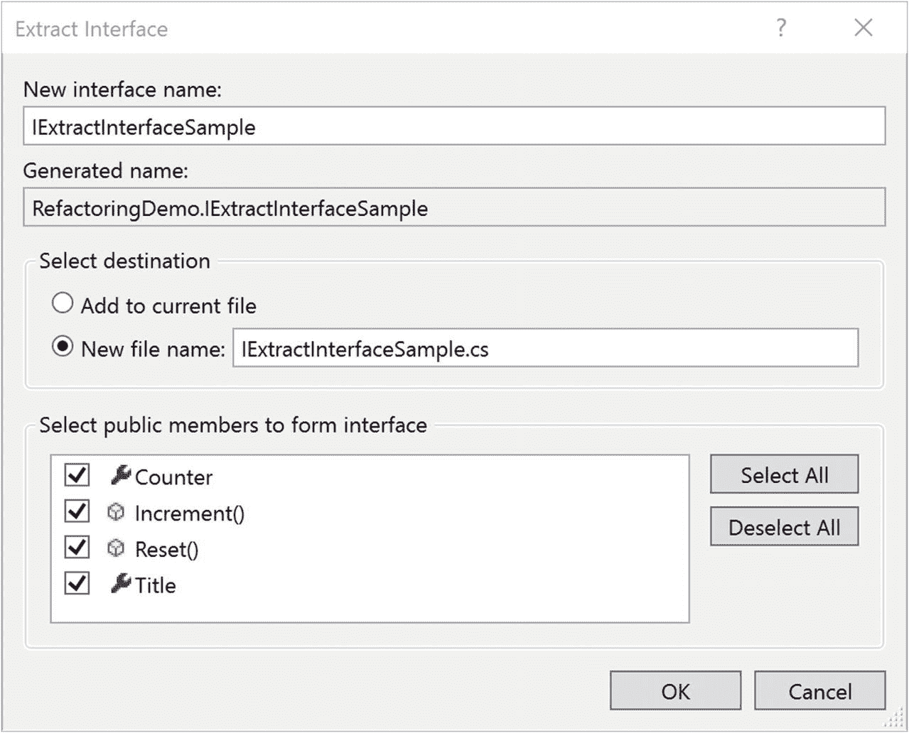
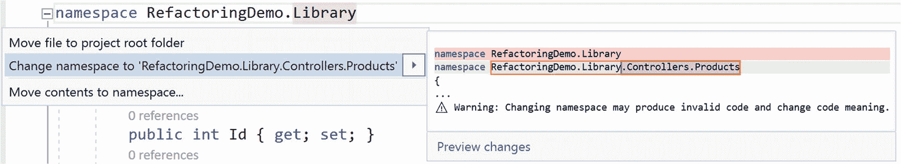

# 4.重构代码

在第 [3](03.html) 章，“单元测试”中，红/绿/重构作为一种开发范例被引入。通过单元测试，有可能实现三人组的红色和绿色部分。讨论中遗漏的是重构，幸运的是，对于从前到后阅读书籍的人来说，重构是本章的主题。在简要描述了重构的功能和形式之后，您将了解 Visual Studio 2019 带来的许多不同工具来帮助完成这一步。

## 什么是重构

首先，让我们把重构看作一个概念，而不是用来实现它的工具。简单来说，重构的目的是让你的代码更干净；6 个月后，当你通读你的申请，想知道是谁写的时，更容易跟踪；并且当您将代码从一个地方复制到另一个地方时，更不容易出现由重复的 bug 引起的错误。随着时间的推移，所有这些都是潜移默化进入代码库的问题。这也是重构想要帮助解决的问题。

重构背后的思想是在不改变功能的情况下改变代码的结构。考虑一个简单的例子:

```
decimal CalculatePay(decimal hours, decimal? rate)
{
   return hours *
      rate.HasValue ? hourlyRate.Value : 15.0d;
}

```

此方法通过小时数乘以小时工资率来计算工资。但是，计算中使用的三元运算包括 15 的文字值。从代码中看不出 15 到底代表什么。事实证明，这是最低工资。但是六个月后你真的会记得吗？还是 2 年？或者接手这段代码的初级开发人员看的时候？可能不会。解决方案是重构代码，以便将 15 定义为常数，如下所示:

```
const decimal minimumWage = 15.0d;
decimal CalculatePay(decimal hours, decimal? rate)
{
   return hours *
      rate.HasValue ? hourlyRate.Value : minimumWage;
}

```

至少，现在代码的意图更加清晰了。这也意味着，想要改变最低工资的人只需要在一个地方这样做(在那里定义了常数变量)。如果在某个时候，最低工资的计算变得更加复杂(因此函数是一个更好的实现选择)，代码已经设置好了，只需做最小的修改就可以处理。

您刚刚重构了代码。代码的结构已经改变，但是公开的功能没有改变。这是重构背后的关键思想。这也是编写单元测试如此重要的原因。在红色/绿色/重构工作流中，在执行重构之后，单元测试保持绿色是非常关键的。这就是为什么您知道功能保持不变，即使实现被修改了。如果您重构了没有单元测试的代码，那么您确定功能是否相同的能力仅限于运行手动测试。或者只是目测。拥有单元测试覆盖要好得多(也不那么伤脑筋)。

您可能会问自己，为什么需要特殊的工具来执行这样的重构。而且，在这种特殊情况下，可能不值得。然而，正如你将会看到的，本章所涉及的更复杂的重构从自动化中受益匪浅。这并不是说你不能用手做。但是如果你使用工具的话，会更容易，更不容易出错。

## 可用重构

重构工具的质量基于几个标准。首先是可用的不同重构的数量，不仅仅是重构的数量，还有它们的有用性。一年只看一次的重构不如一天看多次的有用。第二个标准是工具能够识别常见的重构模式，并以一种容易发现的方式呈现重构选项。

Visual Studio 2019 满足这两个标准。在深入研究可用的不同重构之前，让我们看看在开发过程中的任何一点可用的重构是如何出现的。

### 表面重构选项

Visual Studio 2019 使用其快速操作菜单(俗称灯泡图标)进行各种与编写代码相关的通知。图 [4-1](#Fig1) 显示了灯泡图标的一个位置。


图 4-1

灯泡图标

出现在编辑器中某一行的槽中的灯泡图标是您可能对该行感兴趣的指示器。当有人对你的代码提出建议时，它就会出现。这可能是语法错误，或者是风格上的改进，或者是您有一个未定义的方法或者数据类型未被语句引用。快速行动涵盖了许多不同的情况。而且，与手头的主题相关，当有可能的重构可用时，它就会出现。

灯泡是下拉菜单的一部分。当您单击灯泡右侧的三角形时，将显示该行感兴趣的项目列表。列表中显示的项目对上下文非常敏感。在图 [4-1](#Fig1) 中，有四种不同类型的重构和一个选项来抑制在生产线上发现的问题。但是移动到其他行，甚至是你放置光标的地方，可以完全改变列表。

您也可以使用其他技术来访问灯泡选项。如前所述，灯泡功能的实际名称是快速动作。如果右键单击该行，会出现一个标记为“快速操作和重构”的上下文菜单选项。选择该选项会得到一个类似的列表，如图 [4-2](#Fig2) 所示。


图 4-2

使用快速动作上下文菜单选项

您还会偶尔在代码的某些部分看到模糊的指示器。将鼠标悬停在指示器上，会显示灯泡的另一种变化，包括一组可能的重构，如图 [4-3](#Fig3) 所示。


图 4-3

潜在代码修复菜单

在图 [4-3](#Fig3) 中，微弱的指示器是出现在参数名称开头下方的三个点。这个界面与其他界面的最大区别在于，解决问题的选项并不容易获得。相反，您可以单击“显示潜在的修复”来获取问题列表。这种具体情况的列表如图 [4-4](#Fig4) 所示。不同的情况会产生不同的列表，虽然基本流程大致相同。


图 4-4

对建议的代码更改采取快速行动

在图 [4-4](#Fig4) 中需要注意的一点是出现在项目列表右边的代码块，这一点到现在还没有被看到。当您将鼠标悬停在项目上时，在适当的时候，右侧会出现一个弹出按钮，其中包含将要进行的更改的示例，使用当前上下文作为起点。明确地说，当通过选择项目进行的更改不需要开发人员的任何进一步输入时，预览是合适的。例如，更改签名选项不包括代码预览，因为选择该选项会显示一个对话框，允许您重新组织方法中的参数。

如果弹出按钮中的示例更改不够，请单击弹出按钮左下角的预览更改链接。这导致类似图 [4-5](#Fig5) 的对话框出现。


图 4-5

预览更改对话框

图 [4-5](#Fig5) 中的预览更改对话框分为两部分。顶部是一个分层视图，其中包含了您的解决方案中提议的更改将发生的所有位置。它被分解为项目、文件和代码行。在底部，建议的更改会出现，并突出显示这些更改。当您单击顶部树中的不同节点时，底部的代码窗口会发生变化，以显示相应的建议。要进行更改，请单击“应用”按钮。

灯泡图标并不是开始重构过程的唯一方式。“编辑”菜单下有一个“重构”菜单项，但是其中的选项不是上下文敏感的。它们也不像灯泡选择那样细致。开始重构过程的第二种可能更有用的方法是使用键盘快捷键。当您面对灯泡图标时，可以使用 QuickActionsForPosition 命令触发选项列表显示，该命令的默认值为 Ctrl+..通过使用这个，您可以触发重构，而无需将手离开键盘。开始重构的第三种方法是右键单击灯泡旁边的代码行。有一个快速动作选项，其作用与键盘快捷键相同。在这两种情况下，可用的选项都是上下文相关的。

现在，开始重构过程的机制已经出来了，让我们看看 Visual Studio 2019 提供的不同重构。

## 重构

在本节中，将详细介绍 Visual Studio 2019 提供的不同重构选项。这个列表令人惊讶地长(嗯，也许令人惊讶……它确实随着每个版本变得越来越长)，并且它涵盖了许多经常使用的重构。话虽如此，有些人最终会将这个列表与 ReSharper 等第三方工具进行比较。最终的选择是个人的选择。如果第三方工具有你每天使用十次的精确重构，那么它值得你为它付出的代价。但是，确切了解 Visual Studio 2019 必须提供什么可以帮助您做出决定。

Note

如果您使用的是第三方重构工具，某些菜单描述可能与您的 Visual Studio 实例不匹配。这是因为一些工具覆盖了与重构相关的各种菜单(工具栏和上下文菜单)。

本节的其余部分将介绍 Visual Studio 提供的许多不同的重构。虽然按字母顺序排列看起来很合理，但是你找到某个特定名字的能力取决于你是否知道这个名字。而且有些名字不一定显而易见。因此，它们大致分为三类:类声明、编码结构和文件组织。希望这能帮助你更容易地找到此刻对你重要的东西。

### 类声明

在这一节中，我们将描述与类和方法的定义相关的重构。粗略地说，这转化为影响由类公开的方法和属性的变化。

#### 更改方法名称

更改方法名重构名副其实。它用于更改方法的名称。更准确地说，它允许您在声明方法时对其进行重命名，并将更改传播到代码中使用该方法的每个地方。

这种重构的起点不是一个灯泡图标。相反，您可以通过就地修改名称来更改方法名称。然后当你触发快速动作菜单时，你会得到一个类似图 [4-6](#Fig6) 的选项。或者，您可以使用右键单击方法名称时出现的上下文菜单中的 Rename 选项到达相同的位置。或者在光标位于方法名称上时使用 Ctrl+R 键盘命令来启动该过程。



图 4-6

更改方法名称

列表中的第一个选项是将“Greeting”(方法的旧名称)重命名为“NewGreeting”(方法的新名称)。在弹出菜单中，代码以红色显示旧代码，以浅绿色显示新代码。如果选择此选项，则在解决方案中调用 Greeting 方法的每个地方，该方法的名称都将从 Greeting 更改为 NewGreeting。

完全清楚地说，只有当编译器能够确定 Greeting 正在被调用时，更改才会发生。重要的区别是编译器必须能够识别调用。重构过程无法识别 Greeting 方法的任何运行时调用。只有编译时调用被重命名。

例如，考虑一个场景，其中名称“Greeting”嵌入在配置文件的字符串中。当应用程序运行时，将提取配置值，并使用反射调用该方法。重构过程检测不到这种用法，因为没有对存储在配置文件中的方法名进行编译时检查。

#### 将匿名类型转换为类

匿名类型在。网了好一阵子。下面是一个例子:

```
var tempType = new {FirstName="Kyle", LastName = "Johnson"};

```

匿名类型非常有用，但是它们的特点是只能在本地环境中使用。不能从一个方法返回它们，也不能将它们作为参数传递给另一个方法。如果这成为一个限制，有一个重构允许您将匿名类型转换成一个类。将光标放在`new`关键字上，启动快速操作。您将看到如图 [4-7](#Fig7) 所示的显示。


图 4-7

将匿名类型转换为类

在这里你可以看到一个新的类被创建了。该类用 internal 的访问修饰符标记，该类的构造函数接受匿名类型中包含的字段。同样，Equals 和 GetHashCode 方法也有一个自定义实现。这些是必需的，以便两个匿名类型的比较与该类的两个实例的比较保持一致。

#### 在 Get 方法和属性之间转换

在检索一个类的属性值时，可能会对 get 方法和属性的正确使用进行长时间的讨论。但首先，请考虑以下代码片段:

```
public string Name { get; set; }

private string name;
public string GetName()
{
   return name;
}

```

首先，您有一个名称属性，使用自动属性`get`和`set`函数。第二，你有一个`GetName`方法，返回一个私有变量的值，这个私有变量(大概)被设置在类中的某个地方。甚至可能有一个`SetName`方法允许设置名称的值。

这些方法之间的差异(以及“正确”方法之间任何分歧的来源)本质上是语义上的。其思想是一个性质应该是幂等的。如果你得到一个属性值，类的状态不应该以任何方式改变。如果你设置了一个属性的值，唯一改变的就是这个属性。另一方面，调用方法不应该是等幂的。仅仅调用一个方法来修改包含该方法的类中的属性并不是不合理的。

这种重构的目的是允许您在不同的模态之间切换。将光标置于 Name 属性中，并调用快速操作。图 [4-8](#Fig8) 是你可能会看到的一个例子。


图 4-8

用方法替换属性

您可以看到 Name 属性将被删除，并替换为 GetName 方法和 SetName 方法，这两个方法都以新值作为参数。

这种重构还包括相反的变化，即从 GetName 方法转移到 Name 属性。起点仍然是将光标放在方法名上。但是现在启动快速行动会显示如图 [4-9](#Fig9) 所示的选项。


图 4-9

用属性替换方法

在这里，您可以看到 GetName 方法被移除，并替换为 lambda 形式的属性声明。如果你的类中也有一个 SetName 方法，那么重构预览会有些不同(见图 [4-10](#Fig10) )。


图 4-10

用一个属性替换两个方法

现在这两个方法都被删除了，取而代之的是一个包含 getter 和 setter 定义的属性。

#### 将局部函数转换为方法

这种特殊的重构有点深奥，也就是说，它在大多数开发环境中很少出现的场景中发挥作用。它接受一个局部函数，并将其转换为私有方法。

让这变得深奥的是局部函数的定义。它是一个作用于特定方法的函数。考虑以下代码:

```
public  static decimal CalculateTotalCost(decimal price,
   decimal federalTax = 0,
   decimal stateTax = 0,
   decimal cityTax = 0)
{
   decimal TotalTax(decimal tax1, decimal tax2, decimal tax3)
   {
      return tax1 + tax2 + tax3;
   }
   return price * (1 + TotalTax(federalTax, stateTax,
      cityTax));
}

```

在这段代码中，`CalculateTotalCost`方法中定义的`TotalTax`函数是一个局部函数。该功能仅在`CalculateTotalCost`范围内可用。

重构用于将局部函数从方法中取出，并将其移到类级别。这允许该类中的其他方法使用它。它还被赋予了一个 private 访问修饰符，这样它只能在类中使用。图 [4-11](#Fig11) 显示了建议的代码变更。


图 4-11

将局部函数转换为方法

#### 封装字段

从深奥的到更常见的重构，封装字段用于修改公共字段，使其成为公共属性。考虑以下代码:

```
public double Age;

```

这是公共字段的声明。如果您调用变量上的快速操作，您将看到图 [4-12](#Fig12) 。


图 4-12

封装字段

您可以看到提出了两项更改。第一，公有领域改为私有领域。其次，添加了一个名为 Age 的属性(使用 lambda 声明)。关于这些变化，有两点需要注意。首先，年龄属性不一定放在声明公共字段的地方。相反，Visual Studio 将它放在它第一次看到声明的其他属性的地方。这符合将声明组合在一起的标准，通常在类定义的顶部。有一个重构(将声明移动到引用)将声明移动到接近使用值的地方。

其次，在快速操作菜单中有两个选项可用于封装字段。就可见的提议变更而言，它们是相同的。不同之处在于，如果您选择第一个选项(使用“并使用属性”)，那么对该类中字段的任何引用都将改为使用属性。如果选择第二个选项(带有“但仍使用字段”)，则不会对该字段的任何引用进行任何更改。

#### 提取接口

更有用的重构之一是提取接口，尤其是如果您经常使用接口编写可测试代码的话。它的目的是查看类中声明的属性和方法，并使用这些元素创建一个接口。事实证明，您可以挑选哪些属性和方法包含在接口中。当它完成时，不仅接口被声明，而且类被配置为实现接口。

考虑下面的类:

```
    public class ExtractInterfaceSample
    {
        public int Counter { get; private set; }
        public string Title { get; set; }
        public void Increment()
        {
            Counter++;
        }
        public void Reset()
        {
            Counter = 0;
        }
    }

```

起点是将光标放在类声明上并调用快速操作。选择提取接口选项。这将显示如图 [4-13](#Fig13) 所示的对话框。



图 4-13

提取接口对话框

图 [4-13](#Fig13) 中的对话框用于提供正在提取的接口的具体信息。从顶部开始是接口的名称(默认情况下，它是以“I”为前缀的类名)和完全限定名(使用类的名称空间)。接下来，您可以为创建的文件指定目标。虽然默认情况下使用接口的名称创建一个单独的文件，但是您可以更改名称或将接口放入当前文件中。

最后，列出公共成员(方法和属性)。默认情况下，所有这些成员都将包含在接口中，但是您可以通过取消选中不想包含的属性来设置所需的属性。准备就绪后，单击 OK，接口就创建好了，并且该类被标记为实现它。

#### 提取方法

提取方法是最常用的重构之一。当您有一个代码块想要从它的当前位置提取并放入一个新方法中时，就使用它。虽然您可以复制和粘贴代码，但重构的亮点在于它能够自动为您设置参数列表，并添加类型和引用关键字(如`out`和`ref`)。

起点是一段代码，通常嵌入到一个方法中。考虑以下代码:

```
public bool Validate(Person person)
{
   bool result = true;

   if (String.IsNullOrEmpty(person.FirstName))
      result = false;
   else if (person.FirstName.Length > 50)
      result = false;

   if (String.IsNullOrEmpty(person.LastName))
      result = false;
   else if (person.LastName.Length > 50)
      result = false;

   return result;
}

```

暂且不论代码是如何的不自然，很明显有一段代码已经被复制，并且可以很容易地放入它自己的方法中。要使用这个重构，选择要提取的代码(在这个例子中，是两个`if`块中的任何一个)并触发快速动作。您的编辑器将类似于图 [4-14](#Fig14) 。


图 4-14

提取方法

提议的主要变化有两个。首先，在所选代码块的位置，整个代码块都被替换为一个方法调用。参数列表通过考虑在块之前定义并在块中使用的变量来确定。

返回值是通过查看块内发生变化的变量来确定的。如果不止一个变量被改变，这些变量将在参数表中被标记为`ref`或 o `ut`。例如，考虑如下所示的方法:

```
public bool Validate(Person person)
{
   bool result = true;
   bool result1 = false;

   if (String.IsNullOrEmpty(person.FirstName))
   {
      result = false;
      result1 = true;
   }
   else if (person.FirstName.Length > 50)
      result = false;

   return result && result1;
}

```

现在，如果对 if 语句执行提取方法重构，新方法的签名如下所示:

```
NewMethod(person, ref result, ref result1)

```

您可能会注意到，调用和被调用位置的方法都被赋予了通用名称`NewMethod`。光标放在方法声明处。如果您现在更改方法名，它也会更改调用位置。同样，在编辑器的右上角，有一个与重命名方法相关的小表单。如图 [4-15](#Fig15) 所示。


图 4-15

重命名方法设置

此表单中的选项还允许您在任何注释或字符串中进行更改。或者，您可以使用复选框在单击“应用”时预览更改，而不只是立即更新代码。

#### 生成参数

“生成参数”重构的目标是为您提供一种简单的方法，在将注意力放在代码编辑器上的同时将参数添加到方法中。首先，您需要一个没有在方法中声明的变量。

```
public void GenerateParameter()
{
   taxRate = 0.13m;
}

```

然后，将光标放在变量上，触发快速动作命令以查看以下内容(图 [4-16](#Fig16) )。


图 4-16

生成参数

从建议的更改中，您可以看到一个适当类型的参数被插入到方法的签名中。参数名与变量名相同。

一个警告是变量不能被完全声明。换句话说，如果该行显示为`var taxRate = 0.13m;`，那么您将不会在快速动作菜单中找到生成参数选项。

#### 向上拉构件

这种重构适用于实现接口或从基类派生的类。这个想法是你已经创建了基类或者接口。然后，您已经创建了一个从该工件派生或实现该工件的类。随着您继续开发，您向类中添加了一个新方法，并决定该方法真正属于基类或接口。因此，您将成员提升到更高的类型或接口。

要调用，首先将光标放在方法名称上，然后调用 Quick Actions 命令。图 [4-17](#Fig17) 出现。


图 4-17

拉起一个成员

在重构列表中，有两个功能非常明确。有一个将选定的方法(Reset)拉至该类实现的接口(IPullMethodUpSample)。如果该类实现多个接口，列表中会有额外的选项。此外，您可以选择将方法提升到基类(SampleBase)。在这种情况下，方法声明和实现都从派生类移动到基类。

第三个选项是将成员提升到基类型，它提供了对过程的更多控制。当您选择此选项时，您将看到一个类似于图 [4-18](#Fig18) 的对话框。


图 4-18

向上拉成员对话框

首先，您可以选择目的地，无论它是基类还是一个实现的接口。接下来是不属于基类和接口的成员列表。对于每个成员，您可以决定是否要将该成员拉至所选目标。完成所有选择后，单击“确定”完成重构。

#### 重新命名

重命名事物的能力是最基本的重构之一。它适用于变量、属性、方法、类和接口。用户界面非常简单。首先对项目进行更改，然后触发“快速动作”命令。图 [4-19](#Fig19) 显示了一个例子。


图 4-19

重命名重构

这种流程在所有可以重命名的不同类型的事物中是一致的。而且，随着您熟悉这些步骤，重命名所有这些不同的项目将会在您的手指中根深蒂固。改变一个变量的名字，做一个 Ctrl+。，按回车键，继续前进。Visual Studio 对所有已知的引用进行了更改(关于不能重命名字符串中的值的标准免责声明适用)。

### 代码结构

令人惊讶的是，保持代码看起来整洁对于理解代码在做什么非常有用。空白会有所帮助，将代码转换成功能相当的版本也会有所帮助，因为这样做的目的更加明显。为了帮助解决潜在的错误，增加了对经常被忽略的场景的检查。本节将介绍有助于这一过程的重构。

#### 为参数添加空检查

作为开发人员，创建接受对对象的引用作为参数`–`的方法，然后不加思索地访问该对象中的属性或方法是很常见的。如果将空值传递给该方法，就会出现问题。并且引发了空引用异常，由应用程序(或者可能是不同的开发人员)来找出异常发生的位置和原因。

为了帮助缓解这个问题，在使用传入的参数值之前对它们执行空检查通常是一个好主意。这种重构允许您快速创建一个代码块来完成这一任务。

要开始重构，将光标放在参数列表中并触发快速操作。图 [4-20](#Fig20) 显示了产生的菜单和显示。


图 4-20

添加空检查重构

您可以看到，对于`person`参数，将添加一个 null 检查，如果为 null，将抛出一个异常。顺便说一句，只为引用类型的变量添加 null 检查。例如，它不包括整数变量。

#### 将匿名类型转换为元组

元组是将相关值集合合并为一个单元的轻量级方式。类似于类，但是没有一些语法开销，当需要在一个类中的方法之间移动相关值时，它们非常有用。这个重构与上一节中的将匿名类型转换为类重构相关，不同之处在于结果是一个元组，而不是一个类。更有用的是，它实际上是一个命名元组，区别在于命名元组将字段名公开为元组中的值(与 Item1、Item2 等相对)。在常规元组中发现)。

要触发重构，从匿名类型的声明开始。例如，它可以直接完成或者作为 LINQ 查询的一部分。以下代码是一个示例:

```
var tempType = new {FirstName="Cam", LastName = "Johnson"};

```

将光标放在`new`关键字或匿名类型中的任何地方，并触发快速动作。你会看到类似图 [4-21](#Fig21) 的东西。


图 4-21

将匿名类型转换为命名元组

一旦完成重构，就可以将元组传递给参数，这在匿名类型中是不可能的。例如，下面的方法签名将接受图 [4-21](#Fig21) 中创建的元组:

```
private void TakeParameter(
   (string FirstName, string LastName) temporaryType)

```

#### 在 For 循环和 Foreach 之间转换

C#提供了许多不同的方法来创建循环。这种重构是从一种形式转换到另一种形式的第一步。这里的起点是一个`for`循环。更具体地说，这是一个包含所有三个标准部分的`for`循环:初始化器、条件和迭代器。以下代码是一个示例:

```
List<string> data =
   new List<string>() { "a", "b", "c", "d", "e" };
for (int i = 0; i < data.Count; i++)
{
   Console.WriteLine(data[i]);
}

```

如您所见，`for`语句包含了所有三个必需的组件。但是，要实现重构，还需要有另外一个元素。在循环本身中找到的。需要对作为循环基础的集合进行索引引用。例如，参考`data[i]`即可满足该标准。当满足这些条件时，将光标放在 for 关键字上，并触发快速操作。出现如图 [4-22](#Fig22) 所示的显示。


图 4-22

将 for 转换为 foreach

从 for 到 foreach 的更改在预览更改中可见。事实证明，还有一个重构来逆转这些变化。触发重构几乎是一样的，因为它涉及到将光标放在 foreach 关键字中并执行 Quick Actions 命令。图 [4-23](#Fig23) 为结果。


图 4-23

将 foreach 转换为 for 循环

虽然这种反转不是完全逐字符的，但结果非常接近原始代码。

#### 在外国和 LINQ 之间转换

与上一节类似，这两个重构用于在 foreach 结构化循环和 LINQ 查询之间移动。然而，起点略有不同。考虑以下代码:

```
public IEnumerable<string> Sample()
{
   List<string> data =
      new List<string>() { "a", "b", "c", "d", "e" };
   foreach (var datum in data)
   {
      yield return datum;
   }
   yield break;
}

```

这个代码示例与上一节中的代码示例之间最大的变化是引入了关键字`yield`。这表明被调用的方法是一个迭代器。它通常在处理可枚举集合(如泛型类列表)时使用。这里迭代器的实现是显式的，与列表隐藏的隐式实现相反。LINQ 查询的结果也是一个迭代器，这就是为什么需要这种形式的代码来支持重构。

将光标放在 foreach 关键字上并触发快速操作。结果如图 [4-24](#Fig24) 所示。


图 4-24

从外国转换到 LINQ

在显示潜在变化的部分，您可以看到从该方法返回的值现在是一个 LINQ 查询结果。还有一种稍微不同的重构形式。如果选择转换为 LINQ(调用形式)，而不是 LINQ 的内联语法形式，则使用 Select 方法。因此,`return`语句将如下所示:

```
return data.Select(datum => datum);

```

还有一个执行反向转换的重构。起点是前面重构的输出(内联语法，而不是调用形式)，将光标放在`from`关键字上。然后触发快速动作显示图 [4-25](#Fig25) 。


图 4-25

从 LINQ 转换到外国

提议的更改与本节开头的原始代码相似。

#### 将 Switch 语句转换为 Switch 表达式

这是一个新的重构，它利用了 C# 8.0 中引入的一个特性:一个开关表达式。switch 表达式的目的是简化用于为变量赋值的 switch 语句的使用。考虑以下代码:

```
int place = 1;
string result;
switch (place)
{
    case 1: result = "First"; break;
    case 2: result = "Second"; break;
    case 3: result = "Third"; break;
    default: result = "Unknown"; break;
}

```

示例中 switch 语句的最终目的是根据`place`的值设置`result`的值。开关表达式允许您使用一个`switch`关键字和 lambda 操作符的组合来更直接地执行赋值。下面是等效的开关表达式:

```
int place = 1;
string result = place switch
{
   1 => "First",
   2 => "Second",
   3 => “Third",
   _ => "Unknown"
};

```

重构旨在为您自动完成这一转变。从第一个代码示例开始，将光标放在 switch 关键字上，开始快速操作。图 [4-26](#Fig26) 应该变得可见。


图 4-26

将 switch 语句转换为 switch 表达式

在预览区域中，您可以看到原始代码被删除，替换为 switch 表达式的 lambda 语法。

#### 内嵌临时变量

通过内联临时变量来重构代码的能力很好，但并不总是至关重要的。前提是你有一些使用临时变量的代码。然后，该变量被用于不同的表达式，而没有修改。例如，考虑以下代码行:

```
double temp = diameter / 2;
double area = Math.PI * temp * temp;

```

从变量名看不出`temp`的目的是什么。因此，您可能希望内联原始计算。将光标放在`temp`的声明上，并启动快速操作。图 [4-27](#Fig27) 就是结果。


图 4-27

内联临时变量

虽然重构是好的，因为只是用来保存计算结果的变量已经被删除了，但有时保留它还是有好处的。例如，如果变量的名字是`radius`而不是`temp`，那么在未来许多年阅读该代码的人将能够更快地理解正在执行的计算。情况并不总是这样，但是在使用这种重构之前，值得考虑一下。

#### 反转条件和逻辑表达式

条件值是任何应用程序的常见部分。以及如何设置条件值可能是未来可读性的一个重要方面。当开发人员回顾代码时，如果与设置值相关的逻辑很复杂，就很难解开最初的意图。更糟糕的是，如果计算中使用的变量名在条件的上下文中难以理解。

考虑以下代码:

```
bool continueProcessing =
   valueToTest > 100 ? false : canUpdate;

```

从阅读代码中可能看不出，只要`valueToTest`小于或等于 100 并且`canUpdate`为真，`continueProcessing`就被设置为真。虽然该语句工作正常，因为正确的值被赋给了`continueProcessing`，但它的可读性并不是特别好。如果将光标置于表达式中的任意位置并触发快速动作，图 [4-28](#Fig28) 出现。


图 4-28

反转条件表达式

重构完成后，结果如下:

```
bool continueProcessing =
   valueToTest <= 100 ? canUpdate : false;

```

虽然这在功能上等同于前面的语句，但条件的排序使其更易于阅读。在查看现有代码时，越简单越好。

#### 反转 If 语句

这个重构的目的与前一个相同。它采用 if 语句或 if-else 语句，并反转条件中的逻辑。同时，它交换块，以便代码工作相同。请考虑以下几点:

```
public bool SampleMethod(int valueToTest, bool canUpdate)
{
    bool result;

    if (valueToTest > 100)
    {
        result = false;
    }
    else
    {
        result = canUpdate;
    }

    return result;
}

```

与前面的代码一样，条件的意图不是特别清楚。通过反转 if 语句，可以使其成为更容易阅读的代码块。将光标放在第一行(包含 if 和条件的那一行)并触发快速操作。图 [4-29](#Fig29) 出现。


图 4-29

反转 if 语句

if 语句的意图在倒置后更加明显。至少可以说。有些人总会找到不同意的理由。

#### 将声明移动到引用附近

当谈到在哪里放置变量声明时，至少有两个主要的思想流派。一种是收集方法顶部的所有声明。第二种方法是在方法中第一次引用变量的地方附近声明变量。无需权衡每个选项的利弊，这种重构允许您轻松地移动声明位置。以下代码是该示例的起点:

```
int variableToMove;

ConvertAnonymousTypeToClassSample();
ConvertForEachLoopToFor();

variableToMove = 100;

```

将光标放在变量声明中，并启动快速操作命令。图 [4-30](#Fig30) 显示了可用的选项。


图 4-30

将声明移动到引用附近

预览窗格中可见的更改是将声明从方法调用的上方向下移动到它的使用位置的正上方。

#### 拆分或合并 If 语句

这种重构也属于让代码更容易阅读的范畴。或者您需要为您的`if`语句中的不同条件添加功能。拆分`if`语句的前提是你有一个带有多个条件的单个`if`。例如，考虑以下情况:

```
if (valueToTest <= 100 && canUpdate)
{
   ...
}

```

这是一个带有两个条件的 if 语句。拆分 if 语句将产生以下代码:

```
if (valueToTest <= 100))
{
   If (canUpdate)
   {
      ...
   }
}

```

合并一个 if 语句执行相反的功能，将嵌套的`if`语句和条件放在一个`if`中。

要查看重构，请将光标放在两个条件之间的操作符上，并触发快速操作。图 [4-31](#Fig31) 出现。


图 4-31

拆分 if 语句

您可以在 proposed changes 窗格中看到前面描述的拆分。同样，如果原始的`if`语句包含一个 else 块，那么这个块将被复制，这样无论哪条路径通过`if`语句，它都将在适当的时候被执行。

合并重构是类似的。不同之处在于，您需要将光标放在嵌套的`if`语句的 if 命令中。上下文菜单上的选项表明它将把`if`语句与外部的`if`块合并。

#### 使用 Lambda 表达式或块体

在 C#中使用 lambda 表达式定义函数时，有两种语法选择。它们在功能上是等效的，因此“正确”的选项取决于您的偏好。这种重构允许您轻松地从一种风格转换到另一种风格。例如，lambda 的表达式样式如下所示:

```
delegate int del(int i); // Defines the delegate signature
del myFunction = x => x * x;

```

以块主体样式表示的相同定义如下:

```
del myFunction = x => {
   return x * x;
}

```

虽然有时不得不使用块主体样式，例如当主体有多个语句时，但是这种重构在任何一种样式中都是可以接受的。

要执行重构，请在光标位于 lambda 表达式内时触发快速操作。图 [4-32](#Fig32) 出现。


图 4-32

将 lambdas 从表达式转换为块体

正如在预览窗格中可以看到的，如果您选择此重构，将执行从表达式语法到块主体的转换。反其道而行之，从块状体到表情，也可以。将光标放在块内并触发快速动作。图 [4-33](#Fig33) 为结果。


图 4-33

将 lambdas 从块体转换为表达式

#### 未使用的赋值、变量和参数

Visual Studio 的一个微妙特性是，它淡出不使用的方法、参数和变量。还会生成一个警告，因此它会出现在任何编译器输出中。这种行为有几个好处。首先，这是一种快速找到代码死部分的方法。从可读性的角度来看，删除代码的死部分是一件好事。但是有时看到一个变量未被使用可能是一个错误的指示。也许调用了错误的方法，因为你**确定**你调用了那个淡出的方法？

不管怎样，对于 Visual Studio 来说，这是一个很好的特性，可以表明缺乏使用。还有一个重构来帮助你删除不合适的变量、参数或赋值。

如何触发重构取决于要删除的内容。对于未使用的变量或方法，将光标放在变量声明上就足够了。对于未使用的参数，需要将光标放在该参数上。如果有问题的语句是一个不需要的赋值，将光标放在初始赋值上就可以进行重构。无论你处于哪种情况，这个过程现在都很熟悉了。触发“快速动作”命令，您将看到您所做更改的预览窗格。图 [4-34](#Fig34) 就是一个例子。


图 4-34

移除未使用的变量

在本例中，唯一的变化是删除了变量的声明。这种模式适用于移除参数或方法。不同之处在于，如果您正在移除赋值。在这种情况下，问题是变量在声明时已经被赋予了一个值。与值中的`var a = 1`一样，`a`立即被赋值为 1。然而，如果`a`在使用之前就被赋予了另一个值，那么初始值的赋值就是多余的。这种重构会移除声明中的赋值。

#### 使用显式类型

几个版本之前引入到 C#中的一个特性是用隐式类型声明变量的能力。最简单的例子如下:

```
var a = 1;

```

编译器从语句中计算出 a 是一个整数没有问题。所以，它编译你的代码时已经做了这个假设。

所有这些都很好，直到有了要求变量显式类型声明的编码标准。对于前一种情况，这没什么大不了的。但是随着类型变得越来越复杂，人们习惯于使用一个工具来帮助从隐式类型声明转换到显式类型，然后再转换回来。

将光标放在变量名上并触发快速动作。图 [4-35](#Fig35) 出现。


图 4-35

转换为显式类型

正如您所看到的，唯一的变化是在变量声明中，这正是您从重构中所期望的。如果变量最初是使用`var`关键字声明的，那么重构选项会读作“使用 var 而不是显式类型”此时，执行快速动作将显示图 [4-36](#Fig36) 。


图 4-36

转换为隐式类型

在此示例中，完成该操作会将变量声明转换为隐式类型声明格式。

Note

从隐式类型声明转换为显式类型并不总是可能的。如果您使用匿名类型，尤其如此。在这种情况下，重构将不可用。相反，您可以使用本章前面介绍的将匿名类型转换为元组重构来创建具体类型。

### 文件组织

这一节讨论的重构不是关于移动功能，而是关于识别代码驻留的位置，向文件中添加必需的元素，以及一般来说，使您的代码和项目更加一致。

#### 未导入类型的智能感知完成

如果您使用 IntelliSense 已经有一段时间了，那么您可能熟悉这样一个功能:当您使用非完全限定的类时，该功能允许您自动将 using 语句添加到代码的顶部。例如，假设您键入了以下代码:

```
File f = new File();

```

现在，如果在与您当前的类相同的名称空间中还没有一个`File`类，您将会看到红色的曲线，表示在`File`的两个实例下都有错误。如果将光标放在`File`上并触发快速动作，将会看到图 [4-37](#Fig37) 。


图 4-37

自动添加 using 语句

在这种情况下，您可以选择使用 File 作为系统中的类。IO 命名空间或系统。WebRequestMethods 命名空间。包含每个命名空间定义的程序集已经作为原始项目模板的一部分或因为您添加了引用而导入到您的项目中。

到目前为止，这种重构的限制是程序集需要已经在项目中被引用。Visual Studio 2019 增加了不仅可以添加适当的 using 语句，还可以添加对当前不存在的项目或程序集的引用的能力。

流程和之前一样。您将光标放入该类型并启动快速操作。图 [4-38](#Fig38) 是结果的一个例子。


图 4-38

通过快速操作添加参考

与图 [4-37](#Fig37) 不同，在图 4-37 中，选项是添加一个`using`语句来导入名称空间，在这种情况下，您的选择包括添加一个对定义了缺失类的项目的引用。RefactoringDemo。Library 是当前解决方案中的一个项目，所以`SampleClass`是一个类，它的实现当前在您的解决方案中。然而，在寻找可能添加的引用时，IntelliSense 并不仅仅停留在解决方案中的项目上。它也考虑标准。NET Framework 程序集(至少是基于您的目标框架可用于您的项目的程序集)，以及查看 NuGet 以寻找可能添加的库。如果你选择执行这个动作，一个对项目或程序集的引用会被添加到你的项目中，同时在文件的顶部添加`using`语句。如果您选择一个 NuGet 包，包引用将与`using`语句一起添加。

#### 将类型移动到匹配文件

当您专注于一个特性的开发时，通常会将实现代码(如枚举或类)放在您正在工作的文件中。这可能看起来没有很大的区别，但是对于一些开发人员来说，它允许他们停留在流程中，而不用从一个选项卡移动到另一个选项卡或者从一个编辑器窗口移动到另一个编辑器窗口。

一旦开发完成(也就是说，所有的测试都通过了…这仍然是红/绿/重构模式)，将类型和枚举转移到单独的文件是一个好的实践。下一个开发代码库的开发人员更容易找到实现。

这种重构正是您所需要的，使您的代码与每个文件一种类型的目标保持一致。为此，将光标放在该类型的名称上，并触发快速操作。图 [4-39](#Fig39) 变得可见。


图 4-39

将类型移动到不同的文件

如您所见，重构提供了类型定义并将其移动到一个单独的文件中。并且文件的名称与类型的名称相同。

为了完整起见，请记住该类型的命名空间将与当前声明该类型的命名空间相同。并且该文件与当前找到该声明的文件放在同一个文件夹中。虽然这肯定会使应用程序继续编译，但它可能不一定是正确的位置，这取决于您项目的标准。也不能保证它位于项目的正确名称空间中，因为它依赖于您的标准，这将导致下一次重构。

#### 将类型移动到命名空间

这种重构的目的是修改特定类的名称空间。首先，将光标放在类名上，并触发快速操作。图 [4-40](#Fig40) 为结果。


图 4-40

移动到特定的名称空间

当您选择将类型移动到不同的命名空间时，下一步涉及选择目标命名空间。为了适应这种情况，出现如图 [4-41](#Fig41) 所示的对话框。


图 4-41

选择新的名称空间

下拉列表包含项目中当前定义的所有名称空间。当您选择不同的命名空间并单击“确定”时，该类的命名空间将会更改，并且解决方案中对该类的所有引用都会更新。或者，您可以在框中键入一个新的名称空间，它将作为完整重构的一部分被创建。

#### 通过智能感知完成正则表达式

虽然这种智能感知功能严格来说不是重构，但 Visual Studio 2019 在文档的“重构”一节中描述了它。不管你如何归类，它的有用性是无可争议的。

其思想是，在编写表达式的过程中，IntelliSense 会提示您如何构造正则表达式字符串。考虑图 [4-42](#Fig42) 中可见的智能感知选项。


图 4-42

通过智能感知完成正则表达式

当您触发 IntelliSense(默认击键是 Ctrl+space)时，会出现一个包含正则表达式选项列表的下拉列表。虽然这只是一个列表，但至少它给了你一个起点，或者一个提醒。无论哪种方式，当您考虑创建良好的正则表达式的挑战时，每一点点的帮助都会受到感谢。

#### 删除无法访问的代码

如果没有一组允许代码执行的条件，则代码被视为不可访问。举个简单的例子，检查下面几行:

```
throw new Exception();
Console.WriteLine("This will never be executed");

```

第二行(控制台)是不可能的。WriteLine 方法)来执行。前一行抛出一个异常，它立即终止当前代码块的执行。控制台。WriteLine 被视为不可读。

在 Visual Studio 2019 中，无法访问的代码是灰色的。同样，该行的开头包含一条绿色曲线，表示存在问题。关于该问题的工具提示解释说检测到了不可达的代码。

这种重构的目的是为了轻松地删除无法访问的代码。将光标放在无法访问的代码行上，并执行快速操作注释。显示图 [4-43](#Fig43) 。


图 4-43

删除无法访问的代码

当调用重构时，当前节中所有不可到达的代码都被删除。

Note

您可能想知道为什么 Visual Studio 中包含这样的重构。毕竟，手动删除这一行代码是非常琐碎的。原因之一与开发人员的流动有关。如果您熟悉各种击键命令，可以使用 Ctrl+ `.`来触发快速操作。然后，按 Enter 键会导致执行重构。换句话说，您可以通过两次击键来删除无法访问的代码。而且，在一个有经验的开发人员手中，这将在几分之一秒内发生。这比用鼠标选择一两行更容易。换句话说，这一切都是为了从开发人员的工作流程中节省时间。

#### 排序使用

这种重构是美学功能的典型代表。它的目的是将代码文件顶部的`using`语句按字母顺序排序。表面上看，原因是当列表按字母顺序排列时，更容易找到特定的名称空间。有一些开发者(包括作者在内)仅仅因为看起来更漂亮就觉得有必要对 usings 进行排序。

这种重构的不同之处在于，它不是通过快速动作命令触发的。相反，该选项是通过使用“编辑➤智能感知➤排序”菜单命令调用的。或者，您可以右键单击导入并从上下文菜单中选择移除和排序 Usings 选项。

然而，有一个相关的重构是可用的。如果您有不再需要的`using`语句(也就是说，在文件中没有引用名称空间中的类)，它们将显示为灰色，类似于不可访问的代码。如果您在光标位于`using`部分时执行快速操作，有一个删除不必要的 usings 选项将删除不需要的语句。

#### 同步命名空间和文件夹

当你对你的项目进行清理的时候，这种重构也会出现。常见的操作是将文件拖到不同的文件夹中，或者决定将多个文件分组到各自的文件夹中会更好。不管理由是什么，你在文件夹之间移动文件，直到你对结果满意为止。

问题在于 Visual Studio 如何在您的文件中定义命名空间。当您第一次创建文件时，默认分配的命名空间是项目的名称，后跟以点分隔的文件夹层次结构。因此，如果在您的 RefactoringDemo 项目中，您在控制器➤产品文件夹中创建了一个文件，则命名空间将如下所示:

```
namespace RefactoringDemo.Controllers.Products

```

通常，这正是您想要的名称空间。但是您只是将一些文件移到了不同的文件夹中。并且它们的名称空间还没有被更新以归档它们的新家。这就是同步名称空间和文件夹重构的用武之地。将光标放在名称空间命令上，并触发快速操作。出现类似图 [4-44](#Fig44) 的东西。



图 4-44

同步命名空间和文件位置

正如您所看到的，对文件的更改是您所期望的。并且在文件中找到的对类的任何引用也被更新。

#### 同步类型和文件名

这个重构和上一个类似。在这种情况下，它将文件中声明的类型的名称与文件名的名称同步。它有几种不同的触发方式。首先，如果您使用解决方案资源管理器的上下文菜单中的重命名选项更改文件的名称，系统会提示您是否也要更改文件中类型的名称。

或者，如果文件中的类型名称已经不同于文件的名称，可以将光标放在文件中的类型名称上并触发快速操作。图 [4-45](#Fig45) 出现。


图 4-45

更改类型以匹配文件名

这种重构带来的变化非常简单。任何对原始类名的引用都会更新以匹配新名称，就像您手动重命名该类型一样。

#### 换行、缩进和对齐参数

这种重构绝对符合美学的范畴。它的目的是在方法声明中或调用方法时改变参数的布局。起点要么是方法声明，要么是方法调用。将光标放在参数列表中，并执行“快速动作”命令。将显示图 [4-46](#Fig46) 或与之相近的内容。


图 4-46

包装参数

这种重构背后的前提是允许您轻松地让所有方法声明和调用符合一个标准。从图 [4-46](#Fig46) 中，所有的参数都放在一行中。包装参数时，有三个选项:

*   对齐包装的参数`–`参数放在不同的行上(除了第一个，它和方法名在同一行)。并且参数与第一个参数的开头对齐。

*   缩进所有参数`–`参数放在单独的行上(第一个是*而不是*在方法名的同一行上)，然后从行首缩进一个制表位。

*   缩进换行参数`–`参数放在单独的行上(第一个参数在方法名所在的行上),从行首缩进一个制表位。

这些选项在调用方法时也可用。有一个重构来执行相反的功能。也就是将不同行上的参数移动到与方法名相同的行上。

## 摘要

在过去的两章中，您已经仔细了解了 Visual Studio 2019 包含的工具，这些工具可以帮助您使用红/绿/重构范式进行开发。但是即使这不是你喜欢的开发风格，单元测试和重构都是可靠的(双关语)开发实践的核心。

在下一章中，现代开发的另一个不可或缺的部分将被涵盖——源代码控制。更具体地说，Git 和 Visual Studio 2019 之间的集成与您日常面临的常见任务有关。