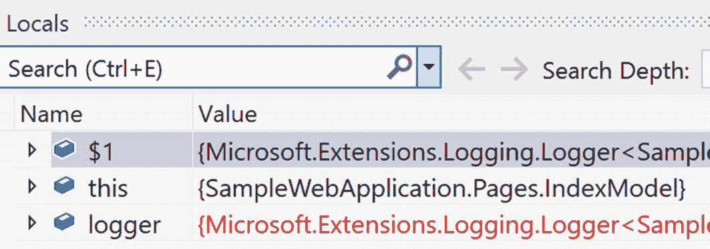
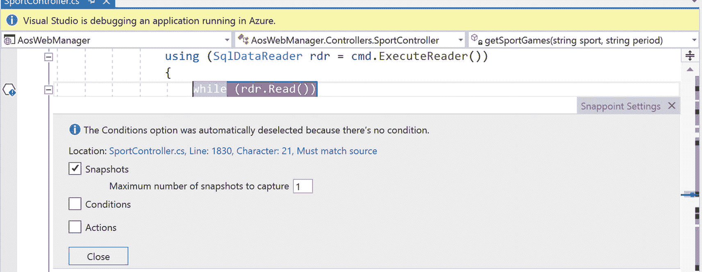

# 7.调试和分析

作为一名开发人员，您将花费大量时间调试代码。当然，不是你的代码。你的代码完全被单元测试覆盖，没有任何错误。而是别人的代码。那些没有你多年经验的人，或者没有你打造防弹解决方案的技能的人。或者第三方或开源代码。有时候里面也有 bug。

希望开头那段的挖苦性质是显而易见的。但这一点仍然有效。您将花费大量时间调试您的应用程序。Visual Studio 提供了大量工具来帮助完成这一过程。因为这是一个过程，至少在某些时候，需要你能得到的所有帮助。

本章不打算讨论在 Visual Studio 中调试应用程序的基础知识。假设已经很好地理解了设置断点、查看变量的当前值以及使用局部变量、监视和快速监视功能的技术。这些对 Visual Studio 2019 来说都不是新的，已经在开发人员的军火库中存在多年了。相反，重点将放在 Visual Studio 2019 中已经引入或增强的功能上，或者只是有用但未得到充分重视的功能上。

## 断点

在介绍完之后，开始谈论断点可能有点奇怪。毕竟，断点是调试技术的元老。它们在应用程序中指定一个应该暂停执行的位置，并给你机会检查运行时的当前状态。这是最先教给任何开发人员的事情之一。但是使用断点的某些部分没有被充分利用。Visual Studio 2019 更令人兴奋的新增功能之一恰好针对这一古老的功能。

正如刚才提到的，断点用于在特定的代码行暂停应用程序。但是，默认行为是每当命中该行代码时暂停。在某些情况下，这很好。对于其他人来说，则不然。您可能希望对给定断点暂停执行的时间有更多的控制。

### 条件断点

您可以通过断点设置窗格向断点添加条件。通过右键单击断点指示器(位于编辑器的左侧)时出现的上下文菜单上的设置选项，可以访问此窗格。在图 [7-1](#Fig1) 中看到的上下文菜单，包括许多对更高级断点功能有用的选项。


图 7-1

断点的上下文菜单

点击条件选项显示窗格，如图 [7-2](#Fig2) 所示。


图 7-2

用于定义条件的断点设置窗格

有许多选项可用于确定应用于断点的条件类型。首先，有一个包含所用条件类型的下拉列表。有三种选择。

#### 条件表达式

前提是定义条件的那一行右边的大文本框将包含一个表达式。中间的字段包含一个下拉菜单，用于控制表达式的使用方式。下拉列表中有两个选项。对于`Is true`选项，如果表达式的计算结果为真，那么执行将在断点处停止。对于`When changed`选项，执行会在第一次遇到设置了断点的行时暂停。计算表达式，并记住值。随后每次命中断点时，都使用当前变量再次计算表达式。如果结果与前一个值不同，执行将在断点处停止。

Note

如果您正在调试本机代码，则“更改时间”选项的行为会略有不同。在这种情况下，调试器不认为第一次求值是值的变化。结果是第一次命中断点时，执行不会停止。

表达式使用的语言取决于设置断点的文件的语言。C#文件将使用 C#表达式。JavaScript 文件将使用 JavaScript 表达式。对于其他情况，确定文件类型和表达式语言之间的关系是留给读者的练习。

虽然表达式具有 IntelliSense，但它不立即进行语法检查。而且它肯定不能判断你的表达式是否会产生运行时异常。在这两种情况下，执行在断点处第一次停止。也就是说，在语法错误的情况下，第一次遇到断点，对于运行时异常，第一次引发异常。

当您有对象集合时，使用条件表达式可能会令人沮丧。除了创建与对象的唯一属性相关联的附加条件之外，没有明显的方法来区分集合中的不同对象。Visual Studio 2019 提供了一种机制，允许您生成一个对象 ID，然后可以在断点表达式中使用。在“局部变量”窗口中，右键单击所需的对象，并从上下文菜单中选择“生成对象 ID”(图 [7-3](#Fig3) )。


图 7-3

局部变量的上下文菜单

一个新的变量现在被添加到“局部变量”窗口中(图 [7-4](#Fig4) )。



图 7-4

对象 ID 跟踪变量

变量名的格式是`$n`，其中`n`是一个序列号。要在条件断点中使用这个对象标识符，可以添加表达式`item == $n`，其中`$n`是对象标识符。

尽管这种选择可能有用，但也有一些缺点。首先，对象标识符不会超过当前调试会话。您需要为每个调试会话创建一个对象标识符。标识符的数字部分有可能是相同的(序列号在每个调试会话中都被重置为 1)，但这是您应该确保的。

此外，原始对象和跟踪对象之间的关系是弱引用。这意味着跟踪对象的存在不会阻止原始对象被垃圾回收。根据您正在调试的具体情况，这可能是一个重大问题。

#### 点击计数

有些时候，条件就是不合适。相反，您希望在一行执行了一定次数后中断执行。如果您的代码在循环中执行，或者被应用程序的其他部分多次访问，这种情况很常见。

定义命中次数条件是通过同一个断点设置窗格完成的。不同的是，第一个下拉菜单设置为点击次数(图 [7-5](#Fig5) )。


图 7-5

断点的命中次数设置

点击次数的表达式是数字的。事实上，不允许非数字输入。如何处理该数字取决于中间下拉列表中的值。可用的选项如下:

*   Equals (=) `–`当断点达到表达式中找到的次数时，执行停止。

*   是`–`的倍数当断点被命中的次数是表达式中数值的偶数倍时，执行停止。

*   大于或等于(> =) `–`当断点达到表达式中找到的次数时，执行停止。之后每次执行都会暂停。

#### 过滤器

应用程序早就达到了需要运行多个应用程序才能正常工作的地步。Visual Studio 的优势之一是能够作为调试会话的一部分启动多个应用程序。然而，这可能会给调试这样的解决方案带来一些问题。当执行在断点处暂停时，所有的进程都会暂停，而不仅仅是断点所在的进程。

有一个设置可以改变这种行为。在“工具➤选项”对话框中，导航到“调试➤常规”节点。在列表顶部附近，您会发现一个名为“当一个进程中断时，中断所有进程”的选项。如果您取消选中该选项，那么执行将只在包含断点的进程中暂停。

虽然这很好，但并不总是足够的。创建多线程应用变得越来越普遍。并且这些线程在单个进程中运行。如果能够定位一个断点，使执行只在单个线程中暂停，而不是每次在所有线程中遇到断点时都暂停，这将非常有用。筛选条件是为多线程和多进程目标设计的。

图 [7-6](#Fig6) 显示了过滤条件的断点设置窗格。


图 7-6

断点的筛选器设置

前两个字段没有选项。第三个字段是表达式。它也是有限的。虽然表达式可以有 ANDs)、or(| |)、NOTs(！)，和括号，可以测试的值仅限于线程、进程和机器值。具体来说，可以使用 ThreadId、ThreadName、ProcessId、ProcessName 和 MachineName。

#### 附加设置

您可能已经注意到，在“条件类型”下拉列表下面有一个“添加条件”链接。一旦您填充了任何条件，您就能够添加额外的条件，注意每种类型只能添加一个条件。换句话说，当命中次数为 5 并且进程名为“demo.exe”时，可以有一个断点，在该断点处执行停止。但是不能有条件为“命中次数为 5，命中次数为 7”的断点。

除了多个条件之外，您还可以精确确定断点的位置。如果在一行代码中有多个语句，这很有用。在窗格的顶部，有一个设置断点的位置。点击数值可以直接编辑数值，如图 [7-7](#Fig7) 所示。


图 7-7

设置断点的位置

在这里，您可以指定源代码文件中的行号以及该行中的字符位置。如果当前源代码不同于用于编译正在运行的可执行文件的源代码，那么会有一个复选框指示您是否愿意允许断点处于活动状态。

### 动作断点

当在调试会话期间遇到断点时，默认操作是停止当前线程。事实上，默认情况下是停止所有线程，尽管正如上一节提到的，这是一个配置选项。但是，如果您试图调试一个正在处理争用情况的多线程应用程序，这可能会是一个问题。或者如果您只是不需要暂停应用程序，而只需要在断点命中时从调试器中获取一些信息。

这些情况可以通过操作断点(也称为跟踪点)来解决。创建操作断点与创建常规断点是一样的。事实上，正是您对断点的设置所做的事情使它成为一个操作断点。与条件断点一样，右键单击断点指示器(在编辑器的左侧)，然后从上下文菜单中选择“操作”。断点设置窗格出现，这次操作是可见的，如图 [7-8](#Fig8) 所示。


图 7-8

断点窗格中的操作设置

有两个字段与操作设置相关联。第一个是断点命中时设置到输出窗口的消息说明。有几个适用的格式元素(它们将在下面的段落中描述)，但这是操作断点的基本目的。这样，它类似于代码中的调试或跟踪语句。区别在于动作断点是动态设置的，因此不需要重新编译应用程序。

第二个字段是一个复选框，指示当断点被命中时程序的执行是否应该继续。默认情况下，应用程序不会暂停执行。在这种情况下，它与常规断点完全相反，并且这种行为在本节开头描述的多线程场景中运行良好。但是，如果您仍然希望暂停执行，请清除此复选框。

要显示的消息不是表达式。也就是说，期望不是定义一个字符串值，用连接符号完成。相反，这种格式更接近于您在`String.Format`字符串中使用的模板，使用特殊的变量作为固有值，使用花括号符号作为变量值。例如，考虑以下情况:

```
$FUNCTION: The value of x.y is {x.y}

```

当遇到这个动作断点时，我们将从当前函数的名称(即`$FUNCTION`值)开始，接着是字符串`The value of x.y is`，然后是`x`对象上`y`属性的值。因此，消息由内置变量、文本和局部变量值的花括号符号的组合组成。

内置变量列表可通过 IntelliSense 获得(在图 [7-8](#Fig8) 中可见)。每个的含义如下:

*   $ADDRESS `–`当前指令

*   $CALLER `–`调用当前方法的函数的名称

*   $CALLSTACK `–`当前调用堆栈

*   $FILEPOS `–`代码文件中的当前位置

*   $FUNCTION `–`当前函数的名称

*   $PID `–`当前进程 ID

*   $PNAME `–`当前进程的名称

*   $TICK `–`当前的滴答计数

*   $TID `–`当前线程 ID

*   $TNAME `–`当前线程的名称

动作断点(与常规断点相反)的存在由不同的断点指示符来指示。编辑器的左边出现了一个红色的菱形，而不是红色的圆圈，尽管只有勾选了`Continue code execution`复选框时才会出现这种情况。如果未选中，则红圈照常出现。

### 函数断点

无论是否添加条件，手动设置断点的一个基本前提是，您可以访问要应用断点的源代码。您可以打开文件，找到有问题的行，并应用断点。但这并不总是行得通的。Visual Studio 2019 提供了几个不同的函数，旨在帮助解决这些情况。

当您知道要暂停执行的函数的名称，但不知道文件在源代码中的位置时，可以使用函数断点。或者，如果您有一个函数的多个重载，使用函数断点比在每个重载方法中放置断点更容易。

使用调试菜单创建函数断点，特别是选择调试➤新断点➤函数断点。出现如图 [7-9](#Fig9) 所示的对话框。


图 7-9

函数断点对话框

在对话框的下半部分，有两个复选框，分别标记为条件和操作。这些用于设置您希望应用于断点的任何条件，或者在到达断点时应该发生的任何操作。这些操作与常规断点对话框中的条件和操作相同。本章前面的“条件断点”和“操作断点”部分描述了用这些复选框启动的选项。

将函数断点与其他断点区别开来的是如何定义何时暂停执行。这是在函数名文本框中完成的。最简单的方法是，输入函数的名称。该名称必须是完全限定的，因此，例如，它看起来像下面这样:

```
SampleApplication.Models.Order.Add()

```

在这个例子中，方法的名称空间是`SampleApplication.Models`。包含方法的类的名字是`Order`，方法的名字是`Add`。还要注意没有参数的括号。这个符号将匹配对`Add`的每个调用，而不管使用的参数是什么。换句话说，它将在`Add`方法的每个重载实例上中断。

函数名的目标是提供尽可能多的特殊性或可变性，以便在适当的时候打破。例如，尽管前面的例子将在所有的`Add`方法上中断，不管签名是什么，但是您可以通过提供参数和数据类型来更准确地使用断点。

```
SampleApplication.Models.Order.Add(Customer c)

```

现在，只有当类型为`Customer`的单个参数被传递给`Add`方法时，执行才会暂停。

您可以指定该方法所在的模块，而不是为该方法使用命名空间。例如，当从 Order.dll 模块调用 Add 方法时，下面的代码将暂停执行。

```
Order.dll!Add

```

最后，如果在本机 C++中调试，可以在用于标识断点位置的信息中包含偏移量。

```
{Add, , Order.dll}+2

```

此符号在 Order.dll 模块中从 Add 方法开始的第二行设置一个断点。

与函数名相关的另一个字段是语言下拉列表。这用于影响您用来声明函数名的语法。前面显示的向方法传递参数的示例使用了 C#语法，这意味着需要将 Language 属性设置为 C#。下拉列表包含许多不同的选项，包括 JavaScript、TypeScript、F#和 Basic。用于定义函数名的语法需要与所选择的语言相匹配。

### 数据断点

Visual Studio 2019 的一个新功能是数据断点的概念。其思想是，当变量值改变时，执行暂停，而不是在一行代码处中断。这是一个非常强大的想法，因为解决 bug 的关键通常是识别应用程序中变量值被修改的地方。虽然 C++开发人员已经可以使用这一功能，但长期以来，它一直是托管代码开发人员的常规要求。

首先，坏消息。目前，创建数据断点仅在中可用。网芯 3.0 或更高版本。从好的方面来看。NET Core 3.0 支持使用 WPF 或 Windows 窗体的 Windows 桌面应用程序，因此您对可以使用的应用程序类型的限制已经大大减少。但如果你不坚持。NET Core 3.0，那么这个功能对你是不可用的。

若要在托管代码中设置数据断点，需要运行应用程序。然后在“局部变量”、“自动”或“监视”窗口中，右键单击要监视的属性，并从上下文菜单中选择“值更改时中断”。图 [7-10](#Fig10) 显示了该序列的作用。


图 7-10

设置数据断点

一旦设置了断点，窗口中的变量旁边就会出现一个红色的圆圈。

在执行过程中，如果变量的值发生变化，则执行会暂停，并出现一条消息，指出断点的原因。图 [7-11](#Fig11) 说明了该信息。


图 7-11

为数据断点显示的消息

此时，您的执行已经暂停，您可以访问所有典型的调试信息和功能。

Note

提醒一下，当变量值改变时，数据断点被触发。如果您将断点与一个对象相关联，那就很好了。但是在一个对象上设置断点不会在该对象的属性被修改时暂停执行。为此，您需要在 Locals/Auto/Watch 窗口中展开对象，并在该对象中选择要监视的属性。为了强调这一点，数据断点是实例敏感的。如果您有同一个类别的两个执行个体，当第二个执行个体的相同属性被修改时，在其中一个执行个体的属性上设定的资料中断点不会导致执行暂停。

### 使用调用堆栈定义断点

对于大型应用程序，调试的挑战之一是在正确的位置设置断点。在执行过程中过早地设置它，您将花费很长时间来使用单步执行和单步执行函数。如果设置得太晚，那么，一切都太晚了。这实际上是司法使用条件断点如此有价值的原因之一。

但是 Visual Studio 确实提供了另一种定义断点的方法，这种方法非常有用，尤其是在试图确定意外异常的来源时。当执行因任何原因暂停时，调用堆栈是可用的。虽然调用堆栈中的所有级别都不容易调试，但您的代码在堆栈中肯定是可见的。在堆栈中的任何级别，您都可以右击并在上下文菜单中选择插入断点。这将在代码中由调用堆栈指示的位置放置一个断点。

现在可能需要添加额外的条件来避免多次命中断点，但是您可以在调用点检查局部变量，看看最合适的选择是什么。但最重要的是，您不需要浏览代码来找出它是如何到达异常位置的。调用堆栈已经给出了路径。

### 远程调试

在麻烦的生产应用程序中，远程调试的诱惑始终存在。有多少次，您在本地开发和测试了一个应用程序，甚至是在一个试运行环境中，结果却是在它被部署到生产环境中后遇到了全新的问题。

通过使用一个小的可执行文件，您可以像调试本地应用程序一样调试远程应用程序，也就是说，断点和单步执行功能是可用的，查看变量值的能力也是可用的。关键是那个小的可执行文件和使用哪个文件背后的细节。

第一步是下载适当的可执行文件。起点是下载 Visual Studio 2019 的远程工具。你可以在 [`https://visualstudio.microsoft.com/downloads/#remote-tools-for-visual-studio-2019`](https://visualstudio.microsoft.com/downloads/%2523remote-tools-for-visual-studio-2019) 找到下载链接。在图 [7-12](#Fig12) 中可以看到页面本身的一部分。


图 7-12

Visual Studio 2019 远程工具的下载页面

诀窍是下载正确的工具集。ARM64、x64 和 X86 的描述右侧有一组单选按钮。此选项应设置为目标计算机的体系结构，而不是运行 Visual Studio 的计算机的体系结构。

远程工具由远程调试监视器和远程调试器配置向导组成。在最简单的部署中，您可以将远程调试监视器(msvsmon.exe)复制到目标机器上并执行它。要知道，每次想要初始化调试会话时，都需要执行监视器。配置向导的目的是帮助您将远程调试监视器设置为 Windows 服务，从而允许更经常地进行远程调试，而无需开发人员或 IT 人员付出额外的努力。

当您执行远程调试监视器时，拥有对计算机的管理员访问权限是很重要的。这可以通过以管理员身份登录或使用应用程序上下文菜单中的“以管理员身份运行”选项来关闭。当应用程序启动时，界面如图 [7-13](#Fig13) 所示。


图 7-13

远程调试配置

远程调试监视器要求安装 Window Web 服务 API 并配置 Windows 防火墙，以允许远程访问 Visual Studio 用来与监视器通信的端口。配置远程机器的必要选项可通过该对话框获得，该对话框仅在当前配置不允许远程调试时出现。您唯一的选择是应该允许哪些网络进行远程调试。作为标准的安全实践，建议只选择那些您真正需要的选项。虽然检查所有这些工作，但它确实有可能为运行它的机器打开一个攻击媒介。

当监视器启动时，它会显示一个包含状态信息的屏幕。图 [7-14](#Fig14) 显示了启动时的对话框。


图 7-14

Visual Studio 2019 远程调试器状态信息

一旦远程调试器开始运行，Visual Studio 2019 就该开始行动了。现在，您连接到远程调试器所采取的步骤基于您正在调试的应用程序的类型。

#### ASP.NET 应用

对于 Web 应用程序，无论是 ASP.NET 还是 ASP.NET 核心，都可以通过使用“调试➤附加到进程”菜单来附加到远程调试监视器。在出现的对话框中(图 [7-15](#Fig15) ，指定远程机器的名称，以及监视器监听的端口。


图 7-15

附加到远程进程进行调试

默认情况下，对于 Visual Studio 2019，该端口为 4024。列表中可能已经包含了您正在寻找的进程，但是如果没有，请检查显示所有用户的进程，将每个正在运行的进程都包含在列表中。连接到所需的进程(通常是一个`w3wp.exe`进程),调试会话开始。

#### 桌面应用程序

对于桌面应用程序，远程调试的配置在项目的属性中进行。打开 Properties 窗格(通过右击项目并选择 Properties)并导航到 Debug 部分，如图 [7-16](#Fig16) 所示。


图 7-16

桌面应用程序的调试窗格

选中“使用远程计算机”复选框，然后在右侧的文本框中填入远程计算机的名称和端口号。在开始调试之前，还需要满足几个其他条件。首先，`Working directory`字段需要为空，并且必须取消选中`Enable native code debugging`复选框。工作目录需要是空的，因为您将在远程机器上运行应用程序，所以在本地指定工作目录是无效的。并且远程调试当前不支持本机代码调试。

最后一个主要要求是，您要调试的应用程序的调试版本需要位于远程计算机上，与本地应用程序的调试实例位于同一路径。也就是说，路径中的所有文件夹都需要匹配，包括…/bin/Debug 文件夹(默认情况下)。通常，工作流是构建应用程序，然后使用您喜欢的方法将其复制到远程机器，然后启动调试会话。

#### Azure 应用程序

如果您已经将应用程序部署到 Azure 中，您仍然能够远程调试它。同样，路径取决于部署的类型。如果将应用程序加载到虚拟机(VM)中，远程调试的步骤与 ASP.NET 或桌面应用程序相同，具体取决于 VM 上运行的应用程序。然而，如果您部署到 Azure 应用服务中，步骤会有所不同。首先打开服务器浏览器并展开 Azure 节点(图 [7-17](#Fig17) )。


图 7-17

服务器资源管理器中的 Azure 节点

当您单击应用程序服务节点下的打开云浏览器选项时，它会启动云浏览器。在该窗格中找到的树包括所有 Azure 订阅，您可以使用 Visual Studio 中使用的当前凭据访问这些订阅。如果您尚未登录，系统会提示您提供 Azure 凭据，然后再继续。图 [7-18](#Fig18) 展示了应用服务节点展开后的云浏览器。


图 7-18

云浏览器中的应用服务节点

右键单击要调试的应用服务。在出现的上下文菜单中(这可能需要几秒钟)，选择“附加调试器”。这将您连接到远程调试器，方式与前面描述的 ASP.NET 应用程序部分相同。

### 快照调试

调试应用程序的另一个圣杯是致力于解决生产中出现的问题。很少有开发者没有遇到过那种“但是它在我的机器上工作”的感觉。虽然越来越多地使用模拟生产的测试和试运行环境降低了频率，但仍有在早期环境中工作的应用程序在生产中出现问题的情况。当人们真的在使用一个网站时，设置断点和单步调试代码的想法，伴随着所有其他线程的暂停，是行不通的。

快照调试器的目的是帮助解决这种情况。在应用程序执行期间的适当时刻，拍摄应用程序状态的快照。这个过程大约需要 10 `–` 20 毫秒，所以对性能有一定的影响。但是对整体用户体验的影响应该可以忽略不计。

在 Visual Studio 2019 中，您需要安装快照调试器组件。这是 ASP.NET 和 web 开发工作量的一部分。此外，你的应用程序需要运行在许多不同的环境中的一个:Azure 应用程序服务、Azure 虚拟机或运行在 Kubernetes 服务中的 ASP.NET 应用程序，在所有情况下，至少运行在 ASP.NET 应用程序上。NET Framework 4.6.1 或。网芯 2.0。

通常，执行快照调试的流程是打开要调试的解决方案。然后通过为应用程序指定端点来附加到快照调试器。此时，您正在调试应用程序，但不是以通常的方式。您可以指定对齐点，而不是指定断点。这个过程类似于设置断点。然而，不是暂停执行并允许您查看本地状态，而是制作本地状态的副本并继续执行。您仍然可以查看本地状态，但是应用程序不会暂停…这在您处理生产时非常重要。

现在，让我们更详细地介绍一下这些步骤。首先，打开已部署应用程序的解决方案。重要的是源代码与部署的版本相匹配。否则，您将会遇到与使用过时的源代码调试本地项目时相同的问题，也就是说，您的快照点将会受到影响。事实上，不匹配的源代码是尝试快照调试时出现问题的主要原因，所以如果您发现自己无法跟上，那么这应该是您首先要考虑的地方。

阅读解决方案后，选择“调试➤连接快照调试器”菜单项。出现如图 [7-19](#Fig19) 所示的对话框。


图 7-19。

附加到快照调试器

该对话框会记住您最后输入的内容，因此第一次附加时，两个下拉列表都是空的。在这两种情况下，下拉菜单都会弹出如图 [7-20](#Fig20) 所示的对话框。


图 7-20

选择 Azure 资源

下拉值的目的是让您确定要调试的 azure 资源以及将用于包含快照信息的存储帐户。对于这两个下拉列表，您选择 Azure 订阅，然后选择应用服务、虚拟机或 Kubernetes 服务(对于 Azure 资源值)或存储帐户(对于商店帐户值)。

当两个值都指定后，点击图 [7-19](#Fig19) 中的连接按钮，等待调试会话开始。如果这是你第一次在选择的资源上使用快照调试，你会看到一个如图 [7-21](#Fig21) 所示的对话框，询问你是否允许安装几个扩展。


图 7-21

授予安装扩展的权限

虽然运行快照调试器需要这些扩展，但请注意安装这些扩展将会重新启动您的站点。重新启动可能会影响应用程序的状态。一旦安装了扩展，您将需要完成再次连接到快照调试器的步骤。毕竟，目标资源已经重新启动。

一旦连接到快照调试器，下一步就是设置快照点。在您想要放置对齐点的代码行左侧的装订线中单击。会显示一个六边形指示器来显示对齐点的位置。一旦快照点就位，您可以右键单击它以提供更多详细信息，例如拍摄快照点的条件。图 [7-22](#Fig22) 不仅显示了卡点指示器，还显示了可用的选项。



图 7-22

已经设置了快照点

除了断点中可用的条件和操作，还有一个快照选项。您可以确定捕获的快照的最大数量。限制这些信息的原因是，每个快照都会占用您的 Azure 存储帐户中的资源。创建的快照越多，使用的存储就越大，因此产生的成本也就越高。通过限制快照的数量，您可以确保拥有数百个用户或将您的快照点置于循环中不会过度使用存储帐户。

识别快照点后，您可以通过单击工具栏中的“Start Collection”选项开始收集快照。或者使用“调试➤开始收集”菜单项。Visual Studio 会将快照点部署到资源。为了生成快照，您需要在 web 应用程序中安排放置快照的代码行，或者等待用户这样做。一旦快照命中，您将看到快照的详细信息出现在诊断工具窗口的快照调试器窗格中(图 [7-23](#Fig23) )。


图 7-23

连接到快照调试器时拍摄的快照

有关快照的详细信息可以通过单击快照来查看。但是，如果您想要查看快照的详细信息，包括状态，请单击相应快照底部的查看快照链接。或者您也可以双击快照。

此时，快照的内容被下载到您的本地机器上。这需要多长时间取决于您的网络速度，但有可能会有几分钟的延迟。

一旦快照可用，您将被置于代码中拍摄快照的位置。此时的视图看起来非常像典型的调试会话(参见图 [7-24](#Fig24) )。


图 7-24

快照调试视图

你现在看到的是 Visual Studio 中的历史调试。您可以访问拍摄快照时范围内的值。例如,“局部变量”窗口包含所有局部变量的值。您可以展开任何对象来查看属性值，以及任何其他相关的对象。“调用堆栈”窗口可用于显示代码到达这一点所采用的路径。你可以通过悬停在变量上来查看变量的值。

当然，你不能做的是单步调试代码，看看接下来会发生什么，或者改变变量的值来影响程序流程。这是您看到的历史信息，生成快照的请求早已完成。但是请记住，快照调试的目的是让您在生产过程中看到应用程序的状态。快照调试器绝对符合这个标准。

默认情况下，对于您设置的任何快照点，只拍摄一个快照。如前所述，您可以通过快照点设置窗格更改快照的数量(图 [7-22](#Fig22) )。但是快照将只包含第一次点击快照点时的信息。如果要为快照收集另一个数据快照，请单击工具栏中出现的“更新集合”按钮，或者使用“调试➤更新集合”菜单项。

## 智能跟踪

与从生产环境中获取调试信息相关的挑战已经在快照调试器一节中提到。在那一节中，描述了一种适用于部署到各种 Azure 环境中的 ASP.NET 应用程序的技术。但是没有人会感到惊讶，Azure 并不是唯一一个。NET 应用程序已部署。IntelliTrace 的目的至少部分在于允许在服务器上捕获应用程序的状态(生产或非生产)，然后由查看原始源代码的开发人员检查。

IntelliTrace 并不局限于在生产环境中使用。当测试人员发现的 bug 不能在开发环境中重现时，这是非常方便的。通过 IntelliTrace 捕获的信息可以附加到 bug 上，然后由开发人员在以后打开。

首先，IntelliTrace 收集器需要安装在运行应用程序的环境中。IntelliTrace 适用于在 7.0 到 16.0 版本的 Internet 信息服务(IIS)下运行的 ASP.NET 应用程序。但它也可用于从 SharePoint 2010 和 2013 应用程序、Windows Presentation Foundation(WPF)应用程序和 Windows Forms (WinForms)应用程序中捕获信息。收集器可以在微软下载中心找到( [`https://visualstudio.microsoft.com/downloads/#intellitrace-standalone-collector-for-visual-studio-2019`](https://visualstudio.microsoft.com/downloads/%2523intellitrace-standalone-collector-for-visual-studio-2019) )。该下载是一个可执行文件。这个文件需要在收集信息的机器上执行。这可能是 ASP.NET 应用程序或 SharePoint 应用程序的 web 服务器，也可能是 WPF 或 WinForms 应用程序的用户机器。当它被执行时，它会创建一个`IntelliTraceCollection.cab`文件。一旦。cab 文件是可用的，命令`expand /f:∗ <pathToCabFile>/IntelliTraceCollection.cab`将用必要的文件填充目录。`<pathToCabFile>`是生成`.cab`文件的路径，或者是相对于当前目录，或者是完全限定路径。

您还需要创建一个目录，在其中可以创建 IntelliTrace 文件。它与`IntelliTraceCollection.cab`文件被展开的目录是同一个目录没有问题，但这不是必需的。然后，您需要确保运行该应用程序的用户对 IntelliTrace 文件目录拥有完全权限。

如果您计划在 web 或 SharePoint 应用程序上使用 IntelliTrace，有一些 PowerShell 脚本非常有用。使用 Install-Module cmdlet 安装展开的`Microsoft.VisualStudio.IntelliTrace.PowerShell.dll`文件。执行此操作的命令如下:

```
Install-Module -Name Microsoft.VisualStudio.IntelliTrace.PowerShell

```

现在您已经准备好捕获 IntelliTrace 文件了。无论您使用的是 web 应用程序还是客户端可执行文件，概念都是相同的。您将指定放置跟踪文件的位置，并确定 IntelliTrace 要使用的收集计划。收集计划是一个 XML 文件，它指定 IntelliTrace 运行时要捕获的事件。在可以使用的扩展文件中有许多标准收集计划。

对于 WPF 或 WinForms 应用程序，IntelliTrace 收集器不仅可用于开始捕获跟踪文件，还可用于启动应用程序本身。命令行的基本结构如下:

```
IntelliTraceSC.exe launch
   /cp:<collectionPath>
   /f:<pathToTraceFileDirectory>
   <pathToExecutableBeingTested>

```

需要注意的是，跟踪文件的位置路径必须是完全限定的路径。相对路径不行。

对于 web 或 SharePoint 应用程序，有一个 PowerShell cmdlet，尽管提供的信息基本相同。

```
Start-IntelliTraceCollection "<applicationPool>"
   <collectionPath> <pathToTraceFileDirectory>

```

应用程序池是运行 web 应用程序的应用程序池的名称。

现在复制你遇到的问题。当您运行应用程序时，会生成跟踪信息，但是您不一定能够看到跟踪文件(具有`.itrace`扩展名)大小的增加。您正在跟踪的应用程序需要在生成`.itrace`文件之前完成。对于 WPF 或 WinForms 应用程序，这只是一个终止应用程序的问题。对于 web 或 SharePoint 应用程序，运行以下命令停止收集信息:

```
Stop-IntelliTraceCollection "<applicationPool>"

```

所有这些活动的结果是一个`.itrace`文件。开发人员要使用它，需要将其移动到安装了 Visual Studio 2019 Enterprise 的机器上。一旦有了它，就可以打开它，为开发人员提供类似于快照调试器所提供的历史调试体验，其中有一个主要的变化。

IntelliTrace 和快照调试器都提供称为历史调试的功能。这意味着，即使调试会话是在不同的环境中执行的，它的信息对 Visual Studio 也是可用的。不同之处在于，快照调试是在单个快照点捕获的信息，而通过 IntelliTrace 捕获的信息允许您继续进行更传统的调试会话。

当你打开一个`.itrace`文件时，你会看到一个类似于图 [7-25](#Fig25) 的概述。


图 7-25

iTrace 文件摘要窗格

可以看到许多可扩展的部分。你可能还能看到一些其他的。例如，如果应用程序中出现了异常，或者应用程序的某些部分的执行时间过长，那么将会有针对这些异常的可见部分。对于每一个部分，您都可以选择一项并单击一个按钮来开始调试。这将打开 IntelliTrace 事件或项目的详细信息。

调试事件时会发生什么取决于事件。如果您调试异常或性能冲突，并且触发事件在您的代码中引发，您将被带到代码中发生该事件的位置。此时，您可以使用调用堆栈、局部变量或自动窗口来查看变量的当前值。这就是历史调试带给你的。

但是，IntelliTrace 允许您继续执行。IntelliTrace 更像是一系列离散事件，而不是一个时间点。因此，一旦您完成了对一个事件的检查，您就可以进入下一个事件。现在，应用程序的状态变为捕获流中的下一个 IntelliTrace 事件。这样，你就可以跟踪应用程序的流程，从一个事件到另一个事件，向前和向后，寻找你试图解决的任何问题的原因。

## 诊断工具窗口

可通过调试➤窗口➤显示诊断工具菜单项访问的诊断工具窗口是用于帮助进行性能分析的工具的中心位置。虽然它们可能不会在日常生活中使用，但是当你需要它们的时候，它们在你的工具箱中是非常有用的。

通过诊断工具获得的性能信息用于监控 CPU 和内存的使用情况。虽然它们在可视信息方面是不同的，但它们是联系在一起的，因为它们是同时收集的，并且可以一起可视化。

在“诊断工具”窗口可用之前，需要将其打开。这是通过工具➤选项对话框完成的。导航到“调试➤常规”节点，并确保选中“调试时启用诊断工具”选项。

启用诊断工具后，当您调试应用程序时,“诊断工具”窗口将打开，并开始收集和显示信息。图 [7-26](#Fig26) 是一个应用程序运行一段时间后，这个窗口的样子。


图 7-26

诊断工具窗口

在图 [7-26](#Fig26) 中，窗口顶部有三个可展开的部分。它们针对事件(特别是 IntelliTrace 事件)、正在运行的进程所使用的内存量以及解决方案中所有进程的 CPU 使用情况。在最顶端，有一个调试会话的时间表。在深入了解一些细节时，您可以使用此时间表来选择会话的子集。

### 事件

“事件”选项卡出现在窗口的顶部。与时间线类似，它旨在帮助您确定要关注的诊断部分。事件的主要特征是沿时间轴以不同间隔出现的菱形。每个形状对应于一个被跟踪的特定事件。要查看事件的详细信息，单击窗口顶部的事件选项卡(图 [7-27](#Fig27) )。


图 7-27

诊断工具窗口中的事件选项卡

从列表中选择一个特定事件会显示该事件的更多详细信息。在列表的顶部，您可以按类别或来源(即事件发生的线程)过滤事件。或者您可以在右边的框中键入文本，它将只显示名称或描述包含匹配项的事件。

### 内存使用

图 [7-26](#Fig26) 中间的图表记录了一段时间内应用的内存使用情况。有两个指标标志着某些与记忆有关的事件何时发生。第一个是较小的橙色箭头。这表示在时间线内垃圾收集发生的时间。第二个是蓝色三角形，表示拍摄快照的时间。

虽然内存使用图表很好，但在确定应用程序中可能存在的任何内存问题的来源时，它并不是非常有用。在诊断工具窗口的底部，有一个内存使用选项卡。图 [7-28](#Fig28) 是该选项卡的一个例子。


图 7-28

内存使用选项卡

最初，这个选项卡是空的。使用它的关键是“拍摄快照”按钮。此按钮的目的是在特定时间点拍摄应用程序正在使用的内存的快照。它收集在堆中找到的所有信息，并显示对象的计数和堆的大小。您可以在应用程序运行过程中拍摄多个快照。这允许您比较一段时间内内存的大小和内容，这通常是识别内存使用来源的核心。

正如你所想象的，收集信息确实需要一点时间。您甚至可能会对应用程序中存在的对象数量感到惊讶。在 web 应用程序(用于生成图形的应用程序类型)的情况下，它不仅包括您已经创建的所有对象，还包括提供 web 页面所需的对象。因此，对于 MVC 应用程序，它包括会话信息、路由信息和用于构建呈现页面的对象。换句话说，有很多对象，虽然它们是为应用程序服务而创建的，但并不是显式创建的。

在图 [7-28](#Fig28) 中，您可以看到在流程的不同点拍摄了三个快照。对于每一张照片，您都可以看到拍摄快照的时间点。并且有一个对象计数和堆大小如何从一个快照变化到另一个快照的可视化表示。要深入查看特定快照的内容，请单击对象计数或堆大小值。或者选择一个快照，然后单击工具栏中的查看堆图标。详情见图 [7-29](#Fig29) 窗口。


图 7-29

内存快照的内容

快照的详细信息分为两部分。顶部是组成快照的对象类型列表。每种类型的对象都包含在列表中。对于每种类型，您可以看到存在多少个对象以及对象的累积大小。实际上有两个大小的列。这两个值的区别在于 Size 列是特定对象的字节大小。包含大小列不仅是对象中的字节数，也是对象引用的子对象中的所有字节数。

图 [7-29](#Fig29) 的下半部分将所选对象类型的计数分为不同的派生类型。图 [7-29](#Fig29) 显示应用程序中的大部分数组列表对象实际上是 ConfigurationValue 对象。

如果要查看特定类型的各个对象的更多详细信息，请在鼠标悬停在特定行上时，单击显示在对象类型名称右侧的图标。该图标在图 [7-29](#Fig29) 中可见，在数组列表类型旁边。具体如图 [7-30](#Fig30) 所示。


图 7-30

检查特定对象类型的实例

在图 [7-30](#Fig30) 中，您可以看到所选对象类型的不同实例列表。对于每个实例，都有大小和包含大小，以字节为单位。在屏幕底部，您可以看到与图 [7-29](#Fig29) 中相同的衍生类型扩展。

拍摄快照的目的之一是比较内存随时间的增长情况。好吧，有可能记忆力会随着时间而下降。但这种情况发生的可能性有多大？

在用于查看不同对象类型的原始窗口的顶部，有一个包含当前流程的其他快照的下拉列表。通过选择其中一个快照，您可以比较两者之间对象的变化。该信息的可视化与图 [7-29](#Fig29) 相似，但也包括变更。如图 [7-31](#Fig31) 所示。


图 7-31

两个快照的比较

现在，这些列显示了快照之间在计数、大小和包含大小方面的差异。屏幕的下半部分包括对象类型及其派生类型的相同细分，其中有一列显示快照之间的引用计数差异以及绝对计数。

### CPU 使用情况

图 [7-26](#Fig26) 中的下图以百分比的形式跟踪了应用程序运行期间的 CPU 使用率。如果您有多个 CPU，将在所有可用的 CPU 中计算百分比。有关 CPU 使用的更多详细信息，点击 CPU 使用选项卡以显示类似于图 [7-32](#Fig32) 所示的区域，但没有功能信息。


图 7-32

诊断工具中的 CPU 使用选项卡

为了查看图 [7-32](#Fig32) 中可见的信息，应用程序必须暂停。窗格的初始状态包括一个 Break All 链接，单击该链接可以暂停所有线程。或者应用程序可以被您放置的任何断点暂停。当应用程序中断时，将收集到该点的 CPU 使用信息，片刻之后，显示如图 [7-32](#Fig32) 所示。

“诊断工具”窗口中还有另外两个元素会影响 CPU 使用率信息的显示。第一个是在 CPU 使用选项卡上。工具栏左侧是一个黑色或红色的圆圈。此图标用于开始或停止收集 CPU 信息。除非开启了收集过程，否则您将看不到任何详细信息。

第二个元素实际上是贯穿所有网格的东西，实际上在本节前面已经提到过。可以通过按住鼠标并沿着窗口顶部的 CPU 使用图表拖动鼠标来选择时间范围。然后，选择的时间范围成为生成 CPU 使用信息的界限。如果在指定的时间范围内未收集到 CPU 信息，则“CPU 使用情况”选项卡上会显示一条消息。否则，计算并显示使用信息。

如图 [7-32](#Fig32) 所示，使用信息显示了应用中不同组件使用的 CPU 数量。从图中可以看出，大部分时间都花在了外部代码上，这对于 web 应用程序来说并不罕见。但是您也可以看到几个控制器和一个利用 CPU 的模型。

但这些信息还不够详细，不足以采取行动。要获得特定组件中 CPU 使用情况的更多详细信息，请双击它。这将以如图 [7-33](#Fig33) 所示的形式显示详细信息。


图 7-33

CPU 使用详细信息

在图 [7-33](#Fig33) 的顶部，你可以看到三个区域。左边是调用所选类的函数。右边是从所选类中调用的函数。中间区域包含所选类中使用了 CPU 的函数。对于每个函数，您可以看到 CPU 使用百分比。图 [7-33](#Fig33) 的底部将当前类的 CPU 使用率分解到行级别。

请记住，这个区域的目标是允许您在应用程序中导航，搜索 CPU 使用的来源。通过双击区域的所需部分来完成导航。例如，如果您想查看 AosWebManager 的用法。Lines 类中，您可以双击被调用函数区域的下半部分。这将修改 CPU 使用情况详细信息窗口中显示的数据，以便当前函数是 AosWebManager.Models.Lines .并且其他两个区域(调用函数和被调用函数)被调整为匹配。这项技术使您能够快速上下移动呼叫树，寻找潜在的问题。

## 摘要

调试是许多开发人员花费大量时间的地方。所以他们的开发环境提供的任何帮助都是受欢迎的。多年来，Visual Studio 一直处于调试辅助技术的前沿，最新版本也不例外。可用的工具不仅有助于解决一些更普通的情况，它们还可以让开发人员处理更具挑战性的场景，如识别生产环境中的问题，所有这些都有助于使 Visual Studio 像现在这样受欢迎。

但是诊断和调试并不是开发人员的唯一兴趣。事实上，Visual Studio 努力确保开发人员，不管他们使用什么语言，都能得到改进。在下一章中，我们将探讨使用 ASP.NET、Node.js、C++以及其他语言和平台的程序员可以使用的附加功能。