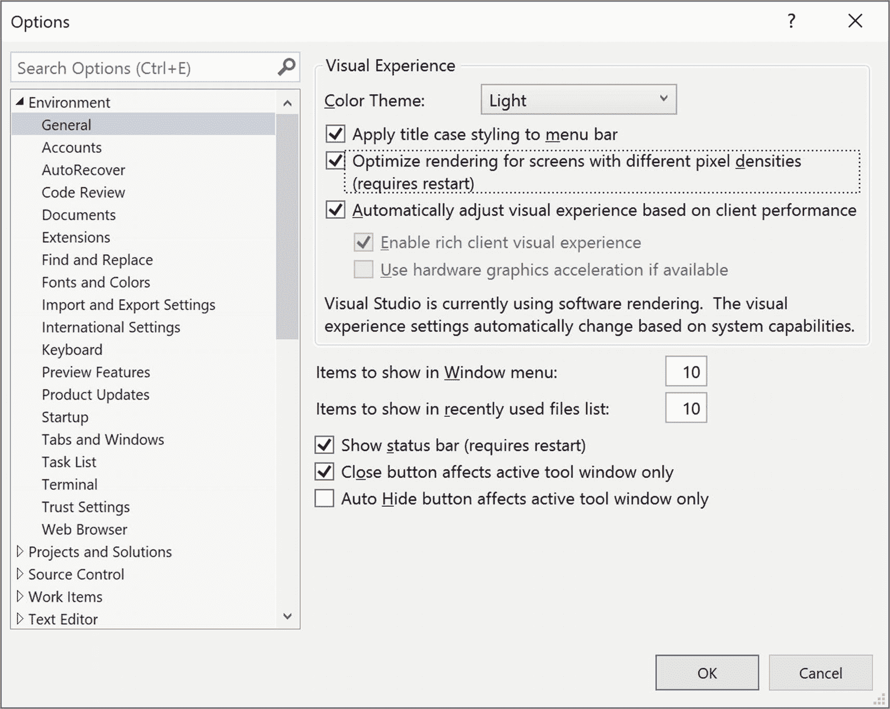
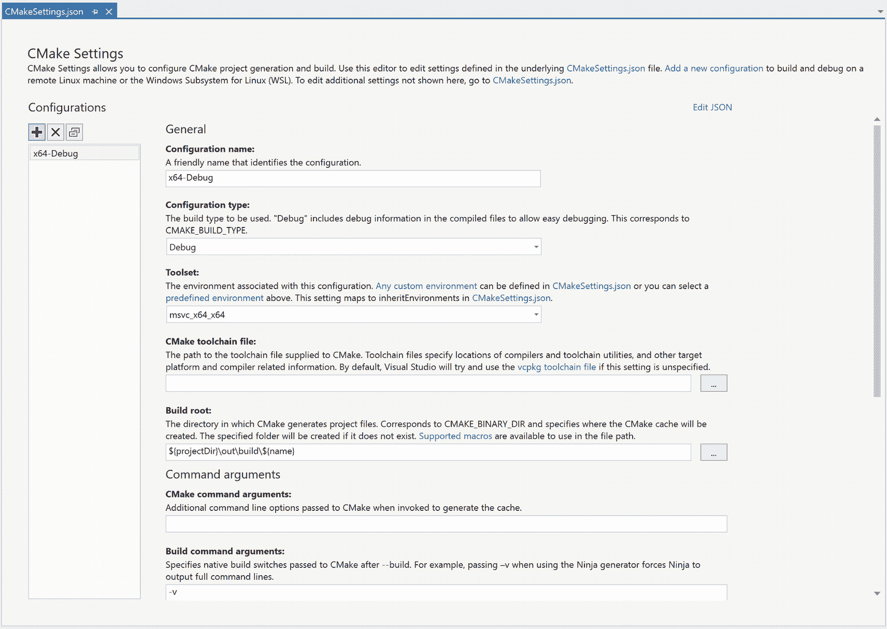

# 八、特定于语言的改进

虽然 Visual Studio 2019 中的许多改进在不同的语言和平台上都很有用，但总有一些更改是特定于个别语言的。它们满足了特定开发人员的特定需求。或者，这种语言的底层结构使得在不同平台上复制这种特性很难顺利实现。随着时间的推移，这些改进可能会出现在其他环境中，但是最初，它们只在某些工作负载中可用。

一个很好的例子是在第 [7](07.html) 章“调试和分析”中讨论的数据断点 C++开发人员可以使用数据断点为许多版本创建本机代码应用。支持数据断点的功能从未在。NET 框架。只有在 Visual Studio 2019 中，它们才可以被 C#应用访问，甚至只有在。NET 核心平台。

本着这种心态，本章将介绍 Visual Studio 2019 中的一些增强功能，这些功能更紧密地专注于一种语言或平台。即使您不使用这些环境进行开发，有时知道它们的存在也是有用的。至少，它可能会迫使你向微软提出建议，让他们花费必要的资源将该功能带给更多的用户。

## 总体改进

在我们开始介绍为支持个别语言而添加的功能之前，让我们花一些时间来介绍一些跨语言的功能，这些功能并不完全适合任何其他章节。

### 新闻部意识

众所周知，使用多台显示器的开发人员比只使用一台显示器的开发人员更有效率。无需切换应用即可查看代码、运行应用和浏览的能力惊人地强大。然而，在现实世界中，它并不是没有令人头痛的问题。拥有相同的显示器固然很好，但并不总是可能的。

分辨率、缩放设置或高于 100%的差异通常足以降低文本的清晰度。在这些情况下，经常会遇到模糊不清的文本。典型的情况是文本在一台显示器上看起来很棒，但在第二台显示器上就不那么清晰了。或者也许它只是在所有的监视器上看起来很糟糕。

Visual Studio 已经成为许多版本的 DPI(每英寸点数)感知应用。它被设置为系统感知模式。这意味着 Visual Studio 在确定如何呈现各种可视元素(包括文本)时将使用系统级分辨率信息。如前所述，当处理多个监视器时，这是一个问题。当远程处理到具有不同显示配置的机器时，这也是一个问题。

Visual Studio 2019 引入了每显示器 DPI 感知功能(PMA)。它要求。安装. NET Framework 4.8，并在 Windows 10(2018 年 4 月更新或更新版本)上运行。如果可用，它会自动激活。不同之处在于，它不是将单个设置(系统设置)应用于所有监视器，而是使用每个监视器的设置来确定元素的渲染方式。

虽然您不太可能想要禁用此功能，但是您可以选择。如图 [8-1](#Fig1) 所示，在选项对话框的环境➤常规部分有一个设置。



图 8-1

用于 PMA 支持的环境设置

如果您注意到在不同的监视器上看时，Visual Studio 中的文本或图标很模糊，那么查看此设置的主要好处可能就来了。如果相关的选项(标有优化不同像素密度屏幕的渲染的明显名称)是灰色的，这意味着您的系统不符合。NET Framework 4.8 或 Windows 10 要求。升级到这两个版本应该可以解决这个问题。

### 。NET Core 3.0 支持

2019 年，微软宣布发布。网芯 3.0。虽然这个名字看起来并不重要，但就所提供的功能而言，这是一个分水岭。NET 开发人员。第一次。NET Core 支持许多旧技术，包括 Windows 窗体(WinForms)和 Windows Presentation Foundation(WPF)。这对开发人员来说意味着您可以将旧的应用移植到。NET 核心，并让它使用最新的 API 集工作。

现在，并非所有平台都支持所有技术。WPF 和 WinForms 只能在 Windows 上使用。移植旧的应用需要注意一些问题。向后兼容性支持不是 100%。而微软内部也在努力打造类似的 surface。NET Core 2.0(及更高版本)和。NET 框架，有些差异不容易弥合。为了帮助确定可能存在的问题，微软提供了一个. NET 可移植性分析器，可以在 [`https://docs.microsoft.com/en-us/dotnet/standard/analyzers/portability-analyzer`](https://docs.microsoft.com/en-us/dotnet/standard/analyzers/portability-analyzer) 找到。

除了支持 WinForms 和 WPF，还有一个新的窗体设计器可供这两者使用。然而，他们不是同时被释放的。WPF 设计器包含在 Visual Studio 2019 版本 16.3 中，因此您可能需要升级到 Visual Studio 的更高版本才能看到它。新的 Windows 窗体设计器的预览版在 16.4 版中提供。但是，默认情况下不启用。要使用新的设计器，您需要转到选项对话框的环境➤预览功能部分(图 [8-2](#Fig2) )并手动启用它。


图 8-2

为启用预览 Windows 窗体设计器。净核心

## C++改进

在 Visual Studio 2019 中，C++领域有许多增量改进，旨在帮助开发人员更新和调试他们的应用。有趣的是，这些改进说明了两种语言之间的交叉授粉。例如，数据断点对于 C#开发人员来说是新的，但在 C++中已经存在一段时间了。另一方面，C#有一个快速的动作，为几个版本添加对缺失包的引用。这相当于在 C++中将缺失的包添加到 CMake 中。

### CMake 支持

CMake 是一个管理构建过程的开源工具。自 Visual Studio 2017 以来，它一直受 Visual Studio 支持，最新版本在许多方面对此进行了补充。

然而，你注意到的第一个变化可能会有点令人不安。CMake 菜单在 Visual Studio 2019 中不再是顶级菜单。但是不要害怕。并不是菜单项消失了。只是通过与 Visual Studio 的集成，这些项目已经移到了更合适的项目、构建、调试和测试菜单中。这种重组使普通 Visual Studio 用户更容易找到他们正在寻找的功能。直观地说，在 Build 菜单下找到 CMake Build 选项比在 CMake 菜单下更有意义。

#### CMake 设置编辑器

CMake 进程由 CMakeSettings.json 文件控制。这只是一个 JSON 格式的文本文件，包含用于控制 CMake 构建如何运行的属性。因为它只是一个 JSON 文件，所以可以使用任何文本编辑器进行编辑，包括在 Visual Studio 中。不过，根据开发者的反馈，Visual Studio 2019 包含了一个新的 CMake 设置编辑器，如图 [8-3](#Fig3) 所示。



图 8-3

CMake 设置编辑器

该编辑器可通过出现在现有配置列表底部的管理配置选项获得(见图 [8-4](#Fig4) )。


图 8-4

访问 CMake 设置编辑器

编辑器的左侧是为您的项目定义的配置列表。列表顶部的按钮用于添加、删除和克隆配置。当您添加配置时，您会看到安装在您机器上的 CMake 配置模板列表(图 [8-5](#Fig5) ，尽管您的列表可能会有所不同)。


图 8-5

添加 CMake 配置

屏幕右侧是管理实际设置的地方。有四个主要部分:常规、命令参数、CMake 变量和缓存以及高级。所提供的实际值取决于上下文(这超出了本书的范围)。例如，Linux 设置不同于 Windows 设置。但是任何开发人员都应该熟悉编辑这些值的机制。此外，默认情况下，高级部分是隐藏的。要查看和修改高级值，请单击编辑器底部的显示高级设置链接。最后，如果您想直接修改 JSON 文件，在编辑器的右上角，有一个编辑 JSON 链接，它将在文本编辑器中打开设置文件。

#### CMake 警告集成

当涉及到与 CMake 一起生成的警告时，Visual Studio 2019 包括几个不同的集成点。有些旨在帮助开发人员识别以前可能难以发现的问题。例如，不一致或不兼容的 CMake 设置(如使用 32 位生成器和 64 位配置)会生成警告，这些警告可在“错误列表”窗口中找到。

除了这种集成，您还可以配置生成的错误消息的级别。默认情况下，只显示错误。警告最终被禁止。但是，在 Visual Studio 2019 中，您可以对该行为进行更多的控制。图 [8-6](#Fig6) 显示了通过工具➤选项菜单可用的 CMake 设置页面。


图 8-6

通过选项对话框进行设置

在图 [8-6](#Fig6) 的右侧中间，有一个启用详细 CMake 输出的选项。如果启用此选项，将不会禁止显示警告。如果您需要更深入地研究 CMake 问题，可以选择启用内部诊断日志来进行调试。这使得 CMake 本身生成的消息可以选择记录到文件中，或者显示在输出窗口的单独窗格中。

### 仅我的代码支持

“仅我的代码”是一项调试功能，在 C#和 Visual Basic 的许多版本中都是 Visual Studio 的一部分。前提是，在单步调试代码时，调试器将跳过您没有编写的代码。这将包括系统调用或某些类型的生成代码。这个想法是，在调试应用时执行的自动单步执行只会在您编写的代码处停止。

关于默认添加一个类似“仅我的代码”的特性，有趣的事情之一是总会有一群人需要能够关闭它。正如你所料(或者只是认为这是一个幸运的巧合)，有一个设置可以做到这一点。在图 [8-7](#Fig7) 中，可以看到调试选项卡。


图 8-7

启用“仅我的代码”设置

突出显示的设置用于启用或禁用“仅我的代码”。作为一个警告，这个设置不是特定于语言的。如果您禁用了“仅我的代码”并开始调试 C#应用，您可能会发现自己步入了意想不到的函数。

## 控件

如果你与 XAML 合作，无论是作为 WPF 开发人员还是因为你正在编写 UWP(通用 Windows 平台)应用，那么 Visual Studio 2019 中的添加和改进都非常令人兴奋。主要重点是改进您如何创建和调试 XAML，但还有其他一些您会发现非常有用的花絮。

### 热重装

您可能知道此功能是“XAML 编辑并继续”,但在此版本的 Visual Studio 中，它已被重命名为“XAML 热重新加载”。更改名称的理由是这个名称更接近于 web 应用中常见的热重装功能。使用 XAML，当重载发生时，应用不会暂停，正如“编辑并继续”这个名字所暗示的那样。相反，它只是对呈现的表单的即时自动更新。

热重载的目标是解决 XAML 设计者的一个长期问题——使用应用的运行时上下文调试应用的外观。在热重新加载之前，您需要查看应用，决定要更改什么，停止应用，进行更改，然后重新运行应用。如果需要多个步骤才能回到应用中的目标点，那就太糟糕了。

使用热重装，您可以在调试模式下运行应用时更改应用的 XAML。更改会立即被检测到，甚至不需要保存文件。然后为新的 XAML 触发组件的呈现，并且应用的外观会立即修改。

热重装有一些限制。从平台的角度来看，WPF 应用需要运行。NET Framework 4.6 或更高版本以及。网芯 3。而且需要 Windows 7 以上。对于 UWP 应用，您需要安装 Windows 10 或更高版本，SKD 版本为 14393 或更高版本。

但是局限性并不仅限于平台。存在一些功能性挑战，但数量惊人地少。大多数问题都可以通过暂停应用来解决。

例如，您不能在热重装中修改事件处理程序属性。也不能在应用运行时向其添加控件、类或其他文件。这包括对 NuGet 包的任何管理。而且，虽然它只适用于 UWP 应用，但您不能修改 x:Uid 指令。

从概念上讲，所有这些都是有意义的。在每种情况下，您实际上并没有改变应用的外观，而是改变了应用可执行文件的一些组件。因此，如果您需要进行类似的更改，暂停或重启应用是必要的。

从 Visual Studio 2019 开始，支持一个强大的功能。这就是调整 x:Bind 标记扩展的值的能力。这意味着作为热重新加载的一部分，您可以更改 XAML 中属性值的来源。

由于存在一些潜在的障碍，微软在应用内工具栏中添加了一个通知，该通知在调试 XAML 应用时可用。图 [8-8](#Fig8) 显示了当热重装可用时工具栏的样子。


图 8-8

应用内 XAML 工具栏

您可以通过单击工具栏右侧的 v 形图标来显示或隐藏消息。

最后一个考虑事项`–`只有当您在调试模式下从 Visual Studio(或者 Visual Studio 代码)中启动应用时，热重载才可用。如果使用附加到进程功能将调试器附加到已经运行的应用，则热重新加载功能将不可用。

### 应用内工具栏

因为我们已经看到了应用内工具栏，所以有一些小的调整来提高它的可用性。

现在，您可以在应用的顶部重新定位工具栏。工具栏的左侧有一个抓手，可以让你在窗口顶部拖动工具栏，如图 [8-9](#Fig9) 所示。


图 8-9

应用内工具栏重新定位

此外，您可能会注意到应用内工具栏的样式略有不同。在 Visual Studio 的早期版本中，工具栏总是深色的。它已经过修改，因此可以选择您在 Visual Studio 中使用的主题。

从功能的角度来看，有一个变化可能需要一些时间来适应。左侧第二个图标用于选择应用中的元素，并在实时可视化树窗格中选择相应的元素。以前，您可以继续选择元素，并让该行为继续下去(即，每个选择的元素修改活动视觉树)。然而，这令人困惑，因为它不同于各种浏览器中的开发工具的工作方式。应用内工具栏已经更改，因此一旦您选择了一个元素，后续的点击将不会选择其他元素。

### 只是我的 XAML

Visual Studio 2019 在调试会话期间有一个名为实时视觉树的窗口可用。它包含应用的整个视觉树，允许您深入甚至单个控件，以查看功能和视觉效果是如何实现的。尽管毫无疑问，实时视觉树具有很大的价值，但它一直受到一个重大问题的困扰。它会很快变得非常混乱。考虑图 [8-10](#Fig10) 中的实时视觉树。


图 8-10

具有单个按钮的表单的实时可视化树

该树是从一个包含一个按钮的表单中生成的(如图 [8-9](#Fig9) 所示)。树的问题是它不能代表开发人员如何可视化表单。他们认为这是一个带有按钮的表单，而不是一个带有网格等内容呈现器的装饰器。从大多数开发人员的角度来看，动态视觉树应该只包含他们添加的组件。额外的元素虽然完全准确，却妨碍了对树的处理。

为了改善这种情况，Visual Studio 2019 引入了“仅我的 XAML”功能。类似于调试中的“仅我的代码”，当“仅我的 XAML”打开时(这是默认设置)，实时视觉树仅显示开发人员添加的组件。图 [8-11](#Fig11) 显示了启用“仅我的 XAML”时同一表单的实时视觉树。


图 8-11

打开“仅我的 XAML”的实时视觉树

虽然不那么杂乱的视图肯定有好处，但有时您可能需要所有的细节。您可以使用“实时可视化树”窗格工具栏中最右侧的图标在启用和禁用“仅我的 XAML”之间切换。或者，如果你喜欢一直关闭它，在工具➤选项对话框的调试窗格中有一个设置(见图 [8-12](#Fig12) )可以用来禁用它。


图 8-12

选项对话框仅显示我的 XAML 设置

## 。净核心

。NET Core 3.0 对于 Windows 应用的开发人员来说是一件大事，不仅仅是因为版本号比 2.0 大。3.0 版本完成了过去 5 年的旅程。当然，现在您可以构建在 Windows 上运行的服务器应用。而且这些应用将在 MacOS、众多版本的 Linux、iPhone 和物联网设备上运行。

客户端对的支持。网芯 3.0 同样令人印象深刻。你可以用。NET Core 3.0(只能运行在 Windows 平台上，不能运行在 Linux 或 MacOS 上)来构建 Windows 窗体和 WPF 应用。这意味着您可以将旧的桌面应用迁移到现在，并且知道它们在将来也会得到支持。除了对德高望重者的支持，还有对尖端技术的支持。。NET Code 3.0 提供了使用 Blazor 编写客户端 web 应用的能力。

### WPF 表单设计器

而最初的情绪时，听到有一个设计师可申请 WPF 在。NET Core 可能是怀疑论，现实几乎是令人失望的。图 [8-12](#Fig12) 显示了的 WPF 表单设计器。NET Core 3.0，以及工具箱。3


图 8-13

WPF 表单设计器。网络核心 3.0

失望的原因？窗体设计器的外观和行为与 WPF 窗体设计器在 Visual Studio 的最后几个版本中的外观和行为非常相似，也就是说，它将会让 WPF 开发人员感到舒适和熟悉。

为了了解设计者，有一个针对 WPF 应用的项目模板。NET 核心。以这种方式创建新项目时，WPF 窗体设计器可作为默认设计器使用。因此，您可以双击 XAML 文件并打开设计器，就像您一直在做的那样。

WPF 支持的更有趣的作品。NET 核心正在从现有的 WPF 应用迁移到。NET 核心。有一些基本的差异需要解决，但是这样做的步骤有很好的文档记录，GitHub 上有一个示例项目(Bean Trader，在 [`https://github.com/dotnet/windows-desktop/tree/master/Samples/BeanTrader`](https://github.com/dotnet/windows-desktop/tree/master/Samples/BeanTrader) 找到)。

一般来说，迁移问题分为两大类。首先，添加引用包的方法需要更改为使用 NuGet。更重要的是，NuGet 引用需要作为`<PackageReference>`元素包含在`.csproj`文件中，而不是有一个单独的`packages.config`文件。虽然这不是一个要求，但是使用针对。NET 标准，而不是。NET 框架。这不是必要条件的原因是。NET Framework 开发工作已经指向目标。净标准。结果是，。NET Framework 4.7.2 具有坚实的。NET 标准 2.0 支持。并且该支撑在两者之间包括足够的重叠。网芯和。NET Framework 表面上看，许多包无需修改就可以工作。然而，如果有问题，你不会发现它，直到遇到运行时异常。

第二类也涉及到。网芯和。NET 框架。您的应用可能正在使用在任何或所有平台上都不可用的功能。NET 核心支持。如前所述，微软提供了一个. NET 可移植性分析器( [`https://docs.microsoft.com/en-us/dotnet/standard/analyzers/portability-analyzer`](https://docs.microsoft.com/en-us/dotnet/standard/analyzers/portability-analyzer) )。该工具帮助您识别可能出现兼容性问题的区域，并能够识别。您的应用使用的. NET 核心。这在您确定能够支持您的应用的平台时非常有用。

### Windows 窗体设计器

使用 Windows 窗体的流程。NET 核心设计器几乎等同于 WPF 应用。不同之处在于，虽然安装了设计器，但它仍处于预览模式。因此，默认情况下它是不启用的。相反，第一次通过双击 Windows 窗体组件启动设计器时，您会在顶部看到一个黄色通知栏，要求您启用设计器。通过工具➤选项对话框中的预览特征选项卡启用设计器(见图 [8-14](#Fig14) )。请注意，在设计器可用之前，您需要重新启动 Visual Studio。


图 8-14

启用 Windows 窗体。网络核心设计者

Note

Visual Studio 2019 的早期版本(16.5 之前)具有 Windows 窗体。NET Core Designer 作为一个单独的 VSIX (Visual Studio 扩展)包，需要在使用前下载并安装。在 Visual Studio 2019 的未来版本中，在设计器不再处于预览状态后，Windows 窗体设计器很可能会默认启用。

但是一旦启用了设计器，你会发现体验和你习惯的几乎一样。图 [8-15](#Fig15) 显示了 Windows 窗体。NET 核心设计师。


图 8-15

Windows 窗体。网络核心设计者

转换为的过程。NET 核心版的 Windows 窗体类似于 WPF。一样的。在 WPF 部分描述的. NET 可移植性分析器工具对于识别潜在的问题是有用的。如果你使用的是 NuGet 包，那么把它们升级到目标包是个好主意。NET 标准，而不是。NET 框架。

Windows 窗体应用最有可能出现问题的一个方面是。NET API。这只是 Windows 窗体时代的一个结果。为了帮助缓解这些情况，微软提供了一个 Windows 兼容包。这是一个添加了许多 API 的库，这些 API 可用于 Windows 窗体应用，但在。NET 核心。当您考虑到软件包中大约有 20，000 个 API 时，您会很快意识到从 Windows 窗体移植时它是多么有用。您可以在 [`https://docs.microsoft.com/en-us/dotnet/core/porting/windows-compat-pack`](https://docs.microsoft.com/en-us/dotnet/core/porting/windows-compat-pack) 找到关于该软件包的更多信息，包括如何将其添加到您的应用中。

## 计算机编程语言

Visual Studio 中对 Python 开发的支持是通过一组名为 Python Tools for Visual Studio(PTVS)的工具提供的。这些工具都是开源的，源代码可以在 GitHub ( [`https://microsoft.github.io/PTVS/`](https://microsoft.github.io/PTVS/) )上找到。但是，它们受 Microsoft 支持，并且可以通过将 Python 开发工作负载包含在 Visual Studio 安装程序中而包含在 Visual Studio 中。它也包含在数据科学和应用工作负载中。

Visual Studio 2019 中可用的 PTVS 版本的改进主要围绕单元测试功能。包含了对 pytest 单元测试框架的支持，以及使用从文件夹打开功能创建单元测试的能力。

设置使用 pytest 只是在早期版本的 PTVS 中如何设置 unittest 框架的一个扩展。右键单击项目名称，并从上下文菜单中选择属性。这将显示项目的属性。导航到左侧的测试选项卡。出现的下拉菜单(如图 [8-16](#Fig16) 所示)包括 unittest 和 pytest。


图 8-16

为 Python 项目设置单元测试框架

现在。在执行测试发现过程时，将使用 pytest 的 ini 配置。如果您打开 Test Explorer 窗口，您将看到通过使用作为配置文件一部分的模式确定的测试列表。请记住，发现过程可能需要一分钟才能完成。

Visual Studio 2019 支持 Python 开发的打开文件夹场景。在这种情况下，您不是打开一个项目文件，而是将一个目录的内容作为整个 Python 项目使用。这是一种非常流行的使用 Visual Studio 来处理不是最初在 Visual Studio 中创建的现有 Python 项目的方式。

当使用打开文件夹方法时，您仍然可以确定要使用的测试框架。在 PythonSettings.json 文件中，可以添加许多 Visual Studio 将用来配置测试发现和执行的属性。以下是使用 pytest 的 PythonSettings.json 文件的示例:

```
{
   "TestFramework": "pytest",
   "UnitTestRootDirectory": "tests",
   "UnitTestPattern": "test_*.py",
   "SearchPaths": [ ".\\src" ]
}

```

属性标识了单元测试框架。`UnitTestRootDirectory`指定了包含测试的目录的名称。该目录将被扫描以查找匹配`UnitTestPattern`模式的文件。最后，如果您的源代码文件不在包含`tests`目录的同一个文件夹中，您需要指定包含源代码的路径。

## 摘要

Visual Studio 的体系结构是这样的，来自微软内部和外部的许多不同的团队都能够对环境的改进做出贡献。向更模块化结构的转变还允许不同的团队按照他们自己的节奏发布功能，而不是依赖于 Visual Studio 新版本的发布时间。因此，您会发现 Visual Studio 中新增的功能列表很难跟上。本章主要关注范围内的主要变化，但这不是一个广泛的列表，因为即使在本书出版时，不同的工具团队仍在继续发布新的功能。

本章有意遗漏的领域是与云计算机和容器相关的 Visual Studio 2019 的更改。这是因为它们中的每一个都足够重要，值得拥有自己的一章。这些变化将在接下来的两章中介绍。