# 9.Azure 工具

以这样或那样的方式，云已经成为大多数软件开发的中心。无论您是编写桌面应用程序、创建网站，还是使用移动设备，都可能有一个组件利用云，或者在适当的情况下能够利用云。

Visual Studio 已经发展到接受这种趋势。你可以在本书前面描述的实时分享功能中看到一些。但它也全心全意地支持使用 Microsoft Azure 作为云开发工作的基础。本章的重点是描述如何提供这种支持。

本章不会花时间详细描述微软 Azure 是什么。它包含了太多不同的片段，几个段落无法做到公正。很有可能在你写下这些段落和阅读它们之间，事情会有所改变。这就是云世界的发展速度。因此，Azure 的任何细节将只在所涉及的 Visual Studio 组件的上下文中提及。

## 云浏览器

Visual Studio 中 Azure 体验的核心是 Azure 云浏览器。通过云浏览器，您可以跨不同的资源组和订阅查看您的 Azure 资源。除了查看它们的属性，还可以对它们执行一些操作(列表取决于资源)，包括开发人员识别和解决问题所需的诊断类型。

当您通过 Visual Studio 安装程序安装 Azure 工作负载时，云浏览器默认可用。安装后，它将作为云浏览器选项出现在“视图”菜单上。选中该选项后，出现云浏览器窗口，如图 [9-1](#Fig1) 所示。

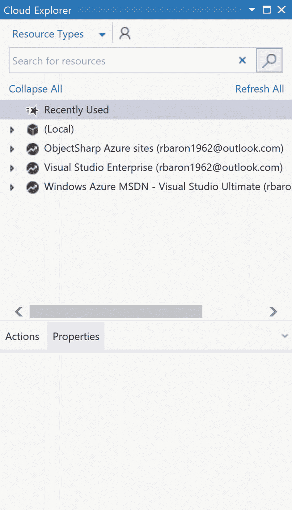

图 9-1

云浏览器

图 [9-1](#Fig1) 显示了云浏览器的基本外观。窗口顶部是当前用户可用的 Azure 订阅列表。窗口底部的端口当前是空的，用于查看和修改单个资源的属性，以及针对资源启动不同的操作。

默认情况下，用于登录 Visual Studio 的凭据用于检索 Azure 资源。但是你不限于使用那个账户，甚至不限于使用一个账户。若要添加帐户，请点按面板顶部工具栏中的帐户图标(形状像人的头部和肩部的图标)。这将打开一个区域，在这里您可以看到与您的 Visual Studio 实例的 Azure 相关联的不同 Microsoft 帐户(参见图 [9-2](#Fig2) )。

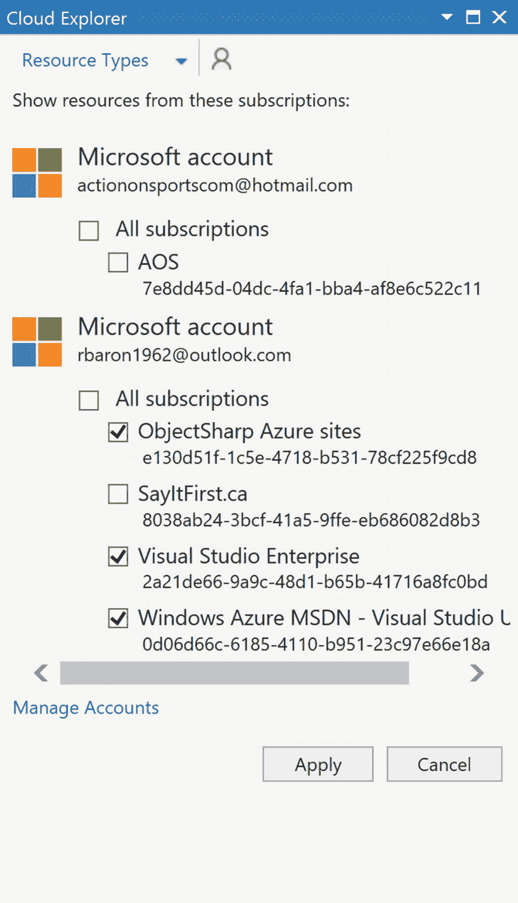

图 9-2

在云浏览器中选择订阅

对于每个帐户，您可以看到与它们相关联的不同订阅。通过选中和取消选中相应的复选框，您可以指定这些订阅的资源在 Cloud Explorer 中是否可用。在列表的底部，有一个用于管理通过此窗格可见的帐户的链接。如果要添加或删除账户，点击链接显示如图 [9-3](#Fig3) 所示的对话框。

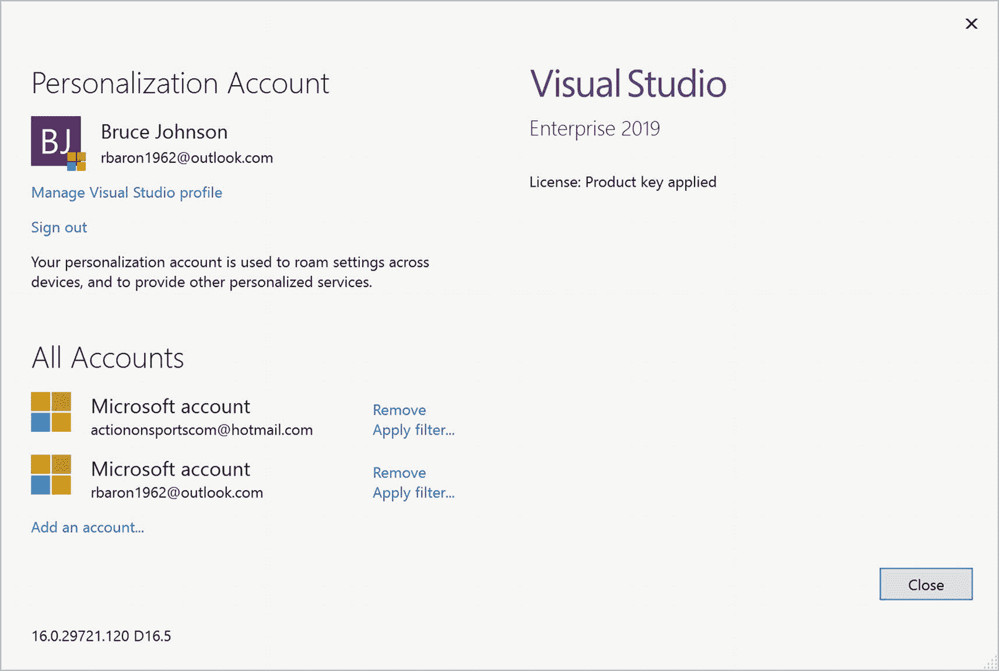

图 9-3

将 Microsoft 帐户与 Visual Studio 关联

这是用于定义 Visual Studio 帐户设置的同一个屏幕。在对话框的右下角，有一个关联帐户的列表。您可以添加帐户、移除帐户或对帐户应用过滤器。在这三个函数中，只有应用过滤器需要进一步解释。

可以将多个 Microsoft 帐户链接在一起，这样即使使用不同的电子邮件地址，它们也会被视为单一登录。这样，您只需登录一次，就可以访问每个关联帐户。通过应用过滤器，你可以看到链接帐户的列表，并选择在访问 Azure 时要使用的帐户。图 [9-4](#Fig4) 显示了点击应用过滤器时出现的对话框。

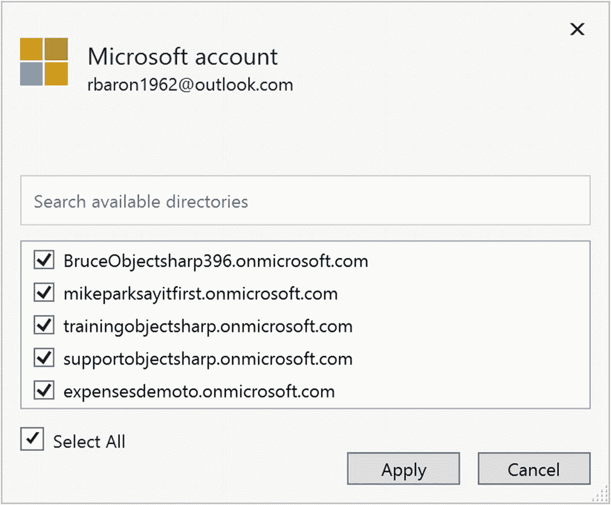

图 9-4

对 Microsoft 帐户应用筛选器

如果有 Azure 订阅与任何选中的 Microsoft 帐户相关联，它们将出现在如图 [9-2](#Fig2) 所示的列表中。取消选中电子邮件地址将从列表中删除任何关联的订阅。

### 资源

一旦确定了帐户并选择了所需的订阅，您就可以返回到图 [9-1](#Fig1) 中的基本云浏览器。每个订阅都在树视图中可用。通过展开订阅，您可以看到按资源类型或资源组收集到组中的资源。图 [9-5](#Fig5) 和 [9-6](#Fig6) 显示了同一订阅的两个视图。

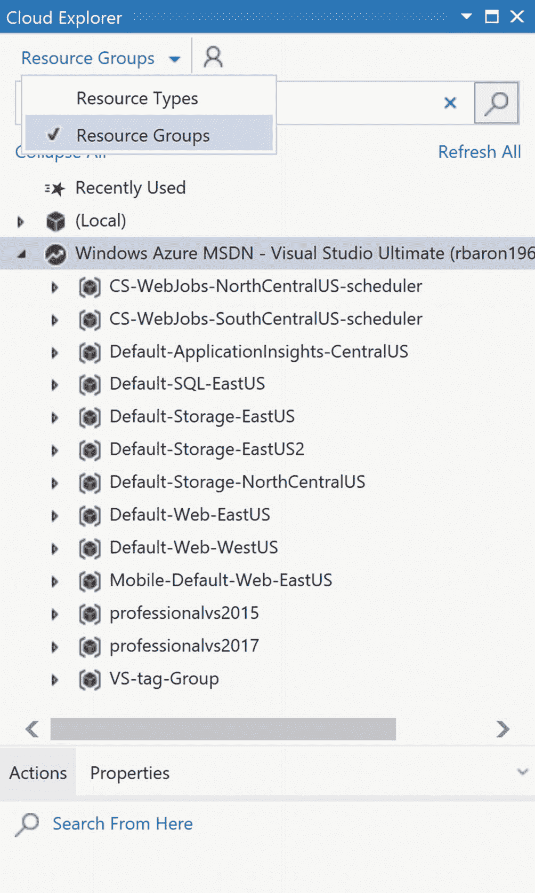

图 9-6

云浏览器的资源组视图

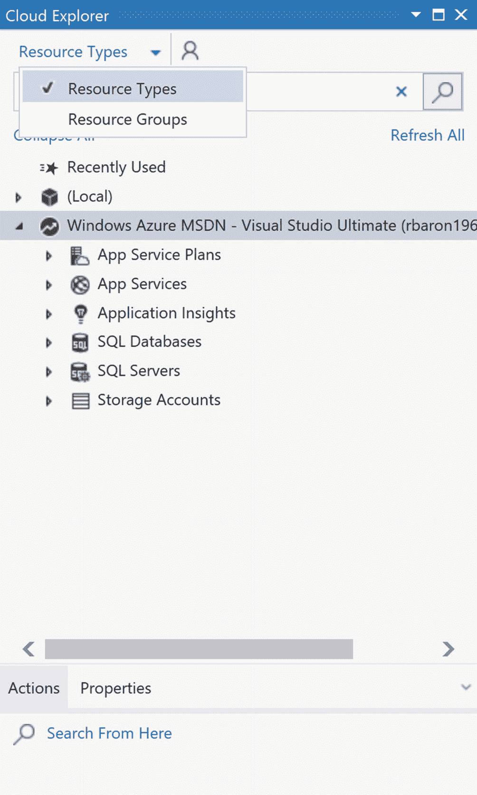

图 9-5

云浏览器中的资源类型视图

资源类型视图根据资源类型将订阅中的资源划分为预定义的分组。如果您想要查看订阅中的所有数据库或虚拟机，它们将在您展开相应的节点时出现。

“资源组”视图将资源分成您定义的组。Azure 中资源组的概念是由管理员放入桶中的资源集合。也许资源是按部门、项目或地点分组的。选择权由管理员决定。

#### 属性和操作

对于任何单个资源，都有许多关于资源的属性，以及可以在资源上执行的操作，这些都可以通过云资源管理器获得。这些显示在窗格底部的选项卡区域中。

要使用这个区域，首先要在树中导航，找到想要查看的资源。当您选择它时，适当的属性会显示在窗格的底部，如图 [9-7](#Fig7) 所示。

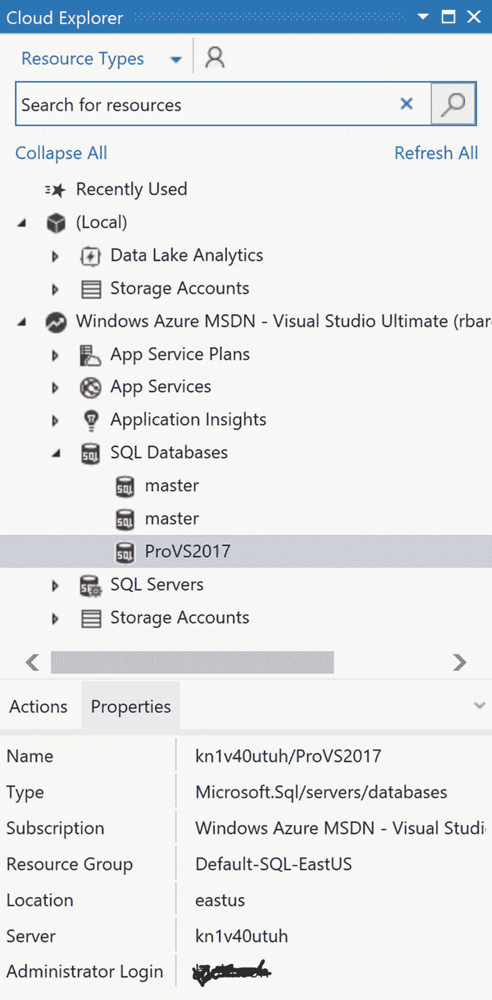

图 9-7

云浏览器中的属性窗格

显示的属性是只读的。如果你想对它们进行修改，那么你必须进入 Azure 门户网站。属性列表取决于资源的类型。有些人除了名字和类型之外什么也没有。其他人提供了更多的细节。

在操作窗格上也是如此，如图 [9-8](#Fig8) 所示。

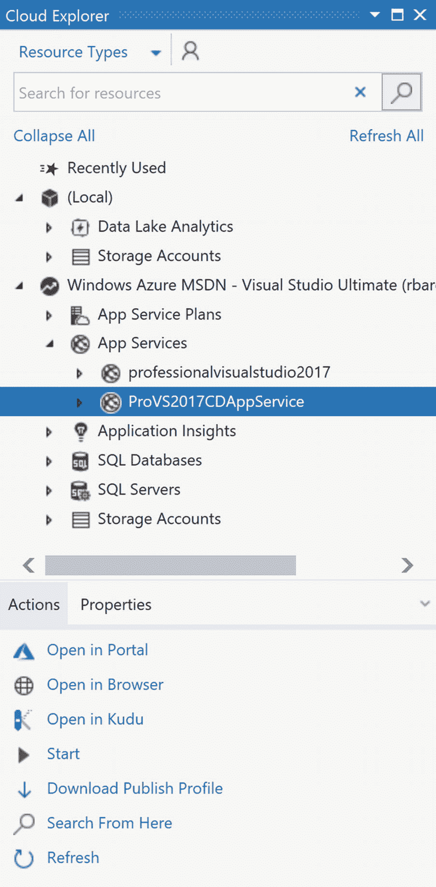

图 9-8

云浏览器中的操作窗格

在操作窗格中，有一个可以对选定资源执行的操作列表。与属性相比，可能的操作列表会因所选资源而异。至少，每个资源都支持在门户中打开操作。这将启动 Azure 门户网站，自动将您置于所选资源中。此外，如果所选资源有任何子资源，将从这里进行搜索并执行刷新操作。所有这些都可以在图 [9-8](#Fig8) 中看到，都是与一个 App 服务相关的动作。然而，从图 [9-8](#Fig8) 中，您还可以看到其他操作，例如启动和下载发布配置文件。这些是特定于应用服务的，如果你转移到不同类型的资源，它们就会消失。

Note

如果在云浏览器中右键单击某个资源，也可以使用操作窗格中可见的选项。

#### 物联网中心

云浏览器的一个新功能是支持物联网。Azure 支持创建物联网中心。对于物联网开发来说，物联网中枢是一种中央服务，通过它可以执行通信、身份验证和监控。如果您将您的物联网环境想象为一个工厂车间(见图 [9-9](#Fig9) )，其中有数百个设备发送遥测数据并执行操作，那么物联网中枢就是该网络的中心，将这些设备相互连接(如果需要)并与其他服务连接。

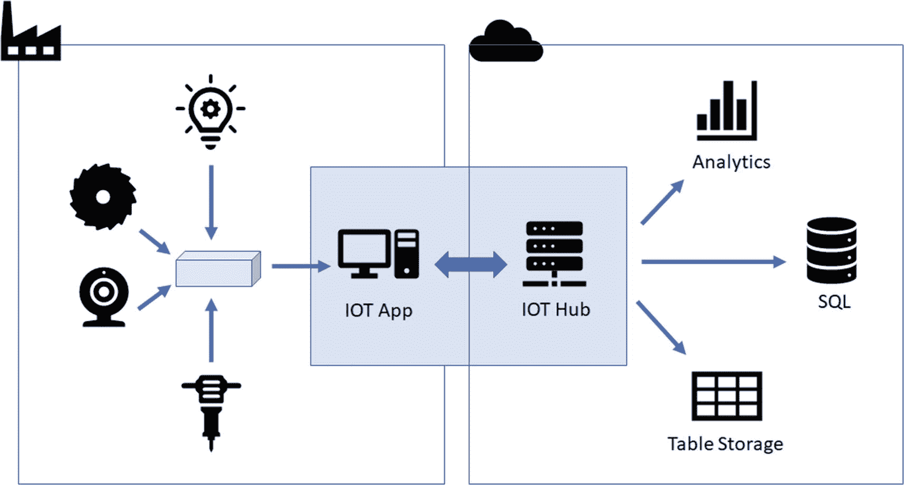

图 9-9

工厂中的物联网

就云浏览器而言，在许多方面，物联网中心就像任何其他 Azure 资源一样。它在资源树中可见，并且具有可用的属性和操作。图 [9-10](#Fig10) 显示了它在树和动作列表中的位置。

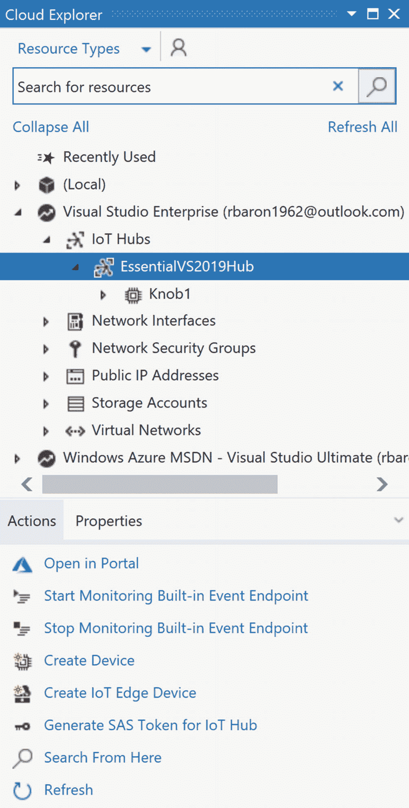

图 9-10

云浏览器中的物联网中心操作

列表中的操作开始让人了解云浏览器具有的与物联网设备相关的功能。您可以在集线器中创建设备，可以是常规设备，也可以是边缘设备。这两种设备的区别在于它们的功能。常规物联网设备是连接到无线网络的非传统计算机(即，不是笔记本电脑、台式机、平板电脑或手机)，能够发送数据，有时还能接收命令和执行操作。

边缘设备是具有允许其作为常规设备的监控能力的设备。它与常规设备通信，收集数据，然后将数据传回集线器。通常，它能够运行程序(通常使用 Docker 之类的容器基础设施部署),这使它成为半自治的。

除了通过云浏览器创建设备，您还能够为物联网中心生成共享访问签名(SAS)令牌。物联网集线器和设备使用此令牌来提供基于声明的身份验证机制。

云浏览器和物联网设备提供的更有趣的功能之一始于监控作为物联网中心一部分的事件端点的能力。事件端点是相关设备(常规设备和边缘设备)发送任何数据的地方。通过开始监视事件端点，您可以看到输出窗口中显示的所有传入消息。

这种监控功能很有用，但并不止于此。如果您在云浏览器中选择一个设备，操作列表会发生变化，如图 [9-11](#Fig11) 所示。

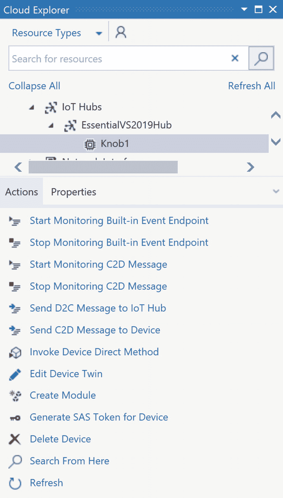

图 9-11

常规物联网设备的操作

与物联网中心一样，您可以监控特定设备的传入事件。此选项可用是因为常规物联网设备可能拥有相关的子设备。因此该选项监视来自这些子设备的任何传入请求。

当谈到物联网集线器和设备之间的消息传递时，有四种操作可用。您可以开始或停止监控 C2D 消息。在此操作中，“C”代表云，“D”代表“设备”因此，你所监控的是从云(物联网中心)传递到设备的信息。如果您想要查看 D2C 消息(即设备到云)，您可以监控物联网中心的事件端点消息。

但是监控并不是 Cloud Explorer 所提供功能的极限。您还可以在物联网集线器和设备之间手动发送消息，反之亦然。“将 D2C 消息发送到物联网集线器”操作会打开一个对话框，允许您输入将发送到集线器的消息，就像该消息是由设备生成的一样。“将 C2D 消息发送到设备”操作允许您输入一条消息，该消息将被传输到设备，就像来自物联网集线器一样。通过所有这些不同的选项，您可以非常灵活地诊断或纠正物联网基础设施中出现的任何问题。

对于您可能需要对物联网设备进行的任何诊断工作，还有一些其他措施可以提供帮助。有一个操作(调用设备直接方法)允许您将消息直接发送到特定的设备。当动作被触发时，系统会提示您输入方法名和 JSON 格式的有效负载。直接方法的想法是使用 HTTPS 将请求发送到设备的 URL。该请求包括指定的方法名和有效负载。预计设备将响应请求，但不要求有任何有效载荷。请求的结果出现在输出窗口中。

编辑设备 Twin 操作允许您在 IoT Hub 中编辑描述设备的 JSON 文件。这个 JSON 文件被称为 device twin，因为它描述了设备的属性和功能。它还包含设备的状态信息，因此可以使用设备提供的数据定期更新。

“创建模块”操作允许您为选定的 IoT 设备创建模块。物联网世界中的模块是一个独立的命名空间，通过它可以访问设备。然后，命名空间可以被赋予不同的访问规则，以便它们可以彼此独立地受到保护。远程维护的自动售货机就是一个例子。虽然自动售货机被认为是单个设备，但机器中可能有多个传感器。例如，一个传感器可能指示机器中仍有多少物品，而另一个传感器可能指示剩余的零钱数量。每组数据可能由不同的部门负责。在这种情况下，设备将包含两个模块，一个公开与清单相关的消息，另一个公开与变更相关的消息。

触发创建模块操作会向物联网设备添加子项。您输入模块的名称。如果您右键单击该模块(或查看其操作窗格)，您可以编辑该模块的模块孪生。类似于 Device Twin，这是一个基于云的 JSON 文件，描述了模块的元数据、状态和功能。

最后，为设备操作生成 SAS 令牌。这是为物联网集线器创建 SAS 令牌的相应操作。该操作会生成 SAS 令牌，设备可以使用该令牌与物联网集线器进行通信。完成生成所需的输入是令牌的生命周期(以小时为单位)。该值决定了在需要生成另一个令牌之前，该令牌将持续有效多长时间。

## Azure 函数

Azure 函数的官方定义(改写自 Azure 文档)是一种无服务器的计算服务，它运行事件触发的代码，而不需要提供支持基础设施。这个定义中有很多概念，所以让我们用几个段落来分解细节。

Azure 函数的根本目标是运行一段代码。它与您可能运行的其他代码的不同之处在于，它被设计成无需预先部署服务器就能执行这段代码，因此有了“无服务器”这个形容词。当您部署 Azure 功能时，您指定的是正在执行的代码，而不是它将在其中执行的环境。当它需要运行时，会在函数执行前动态构建环境。

代码本身可以用多种不同的语言编写:C#、Java、JavaScript、Python 或 PowerShell。支持的不仅仅是语言。您可以绑定不同类型的资源(队列、数据库、SendGrid 等。)以声明方式添加到您的函数中。对于 C#，属性用于将函数连接到资源。对于其他语言，绑定在一个`function.json`文件中声明。

该功能的执行是通过几种不同的机制启动的。其中一个更简单的是计时器。在这种情况下，该功能按照常规的预定时间表执行。但该函数也可以基于外部事件开始运行，比如队列中消息的到达、HTTP 请求或 Azure 事件网格中引发的事件。通过这一系列的触发器，Azure 功能的使用数量非常多。所以我们来看看 Visual Studio 在这个过程中是如何使用的。

### 创建 Azure 函数

Visual Studio 2019 提供了一个项目模板，可以作为你的 Azure 函数的起点。只要您在 Visual Studio 实例中包含了 Azure 开发工作负载，就可以使用该模板。还要注意，为了部署 Azure 功能，你需要一个 Azure 订阅。除了用 HTTP 请求触发的 Azure 函数之外，您还需要有与函数相关联的 blob 存储。但是不要让需求压倒一切，尤其是在成本方面。有一些免费资源足以让你的第一个 Azure 功能运行起来。

Azure 函数的起点是使用内置模板创建一个新项目。使用文件➤新➤项目菜单项启动对话框(见图 [9-12](#Fig12) )。

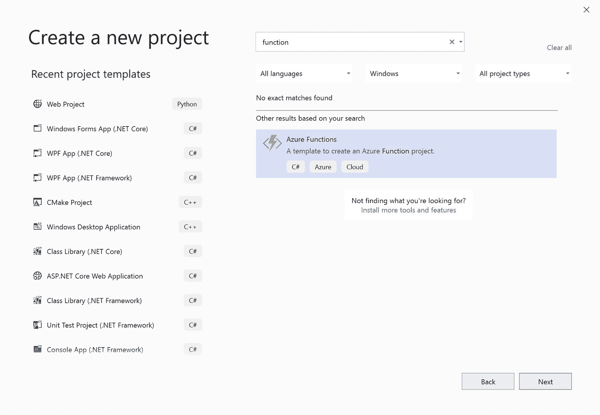

图 9-12

Azure 函数的新项目对话框

在对话框右侧显示的已安装模板列表中，找到 Azure Functions 模板。在图 [9-12](#Fig12) 中，顶部的搜索框已经被使用。选择模板，然后单击下一步。这将打开用于命名新项目和指定位置的对话框(图 [9-13](#Fig13) )。

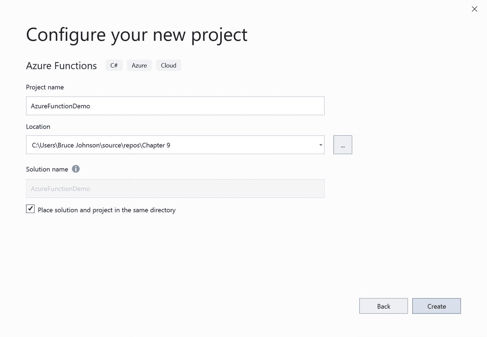

图 9-13

新建项目配置对话框

提供必要的配置信息后，单击“创建”按钮。这将打开用于选择您正在创建的 Azure 函数类型的对话框。图 [9-14](#Fig14) 显示了该对话框。正是在这个对话框中，你开始有特定于 Azure 功能的选择。

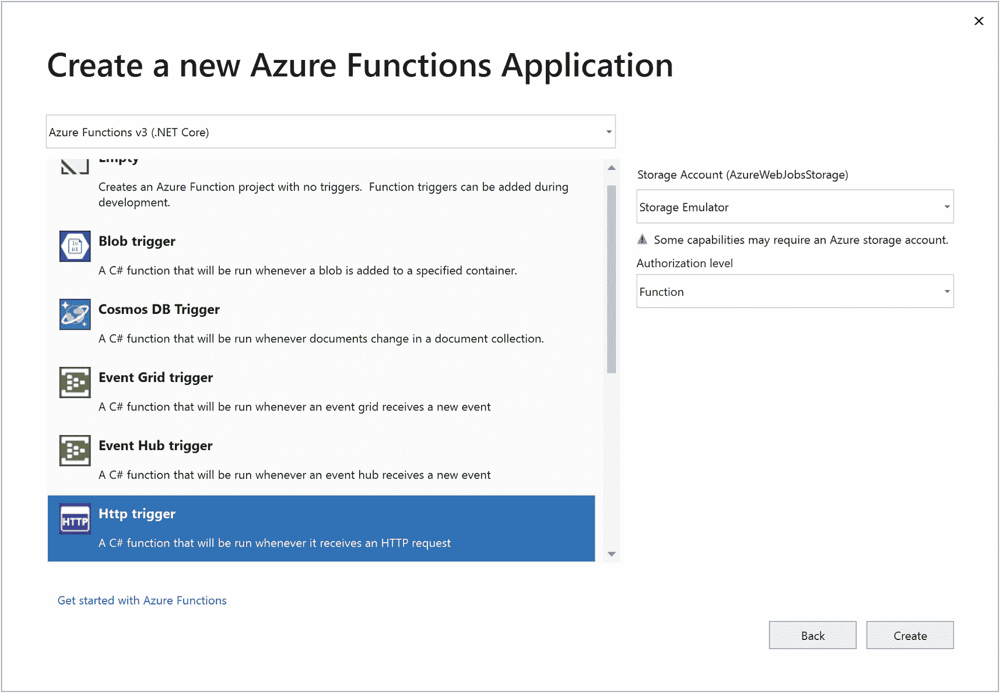

图 9-14

创建新的 Azure 函数应用程序对话框

在创建 Azure Function 项目之前，您需要指定四个不同的属性。它们是平台、模板、存储帐户和授权。接下来的几节将更详细地介绍。

### 平台

Azure 函数支持三种不同的运行时环境，这些环境或多或少与不同版本的发布时间相对应。做出选择。对于 Azure 函数 v1。NET Framework 4.6 是受支持的运行时。对于 v2，增加了对的支持。网芯 2.2。最新的版本是 v3。支持网芯 3.0。

不同的版本也有不同的语言支持。Azure Functions v1.0 版仅支持 C#、F#和 JavaScript。在 v2 中，增加了 Java、PowerShell、Python 和 TypeScript。

还有一个变化会影响不同版本 Azure Functions runtime 的开发。随着从。NET 框架到。NET Core，一些不同的触发器和绑定(除了 HTTP 和 Timer)需要在绑定可用之前安装一个扩展。如果您使用下一节中描述的模板之一，就会安装该扩展。但是，如果您选择空模板，您将需要手动添加扩展。这可以通过一个 NuGet 包来完成，所以机制是熟悉的。

### 模板

在 Visual Studio 中创建 Azure Function 应用程序的优势之一是可以帮助您入门的模板。不一定需要模板。有一个可用的空模板，您可以手动添加必要的配置和扩展。但是如果你在开始之前知道你的函数将要使用的触发器，那么这个模板会让事情变得更简单。

触发器和绑定都是 Azure 函数的一部分，尽管只有触发器是模板的一部分。触发器是启动功能的事件。请记住，Azure 函数背后的思想是，它们是为了响应某些外部事件而执行的。触发器类型决定了生成外部事件的底层技术。绑定还指定了一种技术。不同之处在于，绑定可以是函数的输入或输出(或两者都是),而不是启动事件。

例如，考虑一个想要检索图像缩略图的传入 HTTP 请求。Azure 函数将由 HTTP 请求触发，使用 blob 存储绑定来获取请求的图像，然后输出包含图像缩略图版本的 HTTP 响应。触发技术是 HTTP。绑定是 blob 存储(输入)和 HTTP(输出)。

提供了许多内置模板。您可以在图 [9-14](#Fig14) 中看到运行时选择下方的部分列表。在下文中可以找到更完整的列表和说明。请注意，每个模板中的触发器只是一个起点。您可以在开发过程中添加或删除触发器和绑定。

#### Blob 触发器

当添加新的 blob 或更改现有 blob 时，Blog 触发器启动该函数。该函数被绑定到一个 Blob 存储帐户，该帐户是监视更改的存储库。当触发触发器时，新的或更新的 blob 作为参数提供给函数。

#### Cosmos DB 触发器

Cosmos DB 是一种 NoSQL 风格的数据存储技术。它允许将项目存储在容器中，其中“项目”是一段与模式无关的数据，类似于 MongoDB 中的文档。Cosmos DB 中的容器类似于数据库表，尽管更准确地说它是文档所在的名称空间。

每当修改或添加特定容器中的一个项目时，Cosmos DB 触发器都会调用该函数。触发器中包括修改或添加的项目。

#### 事件网格触发器

Azure Event Grid 是一项允许开发人员轻松构建基于事件的消息应用程序的服务。它使用发布和订阅模型工作，方式与 Azure Service Bus 相同。但是，它不是传递消息，而是发送事件通知。是的，通知可以包括数据。但是这些数据只是事件的一部分，不会在事件引发后持续存在。在这方面，它不同于 Azure 服务总线。有了事件网格，发送者就不需要知道谁将处理事件或者事件是否会被处理。

每当相应的发布者引发事件时，事件网格触发器就会执行该函数。在这方面，事件网格触发器在事件网格支持的发布/下标模型中充当订阅者。

#### 事件中心触发器

事件网格名称的相似性掩盖了它的不同之处。Event Hub 是一个 Azure 服务，支持数据流的捕获和处理。这是一个大数据管道，传递信息，如遥测或状态，可能来自多个并发源。通过这种方式，它将自己与事件网格和服务总线的离散负载区分开来。当你设计一个带有事件中心触发器的 Azure 函数时，你需要意识到每秒钟可能会发生成千上万个触发器。

当通过事件流接收到事件时，触发事件中心触发器。通常有与事件相关的数据，但它只是作为字符串值键入。

#### Http 触发器

当通过 HTTP 管道收到请求时，将触发 Http 触发器。这允许使用任何能够提交 HTTP 请求的技术来启动 Azure 函数，公平地说，这几乎是所有技术。

对于触发器的发送者，响应要么是 HTTP 200 状态代码(对于 Azure 函数 v1)，要么是 HTTP 204 状态代码(对于 Azure 函数 v2 和 v3)。无论如何，没有迹象表明由事件触发的功能是成功还是失败。如果这是您的应用程序的要求，那么您需要向该函数添加一个 HTTP 输出绑定。

#### 物联网集线器触发器

物联网中心触发器与事件中心触发器非常相似。物联网集线器负责发送与一个或多个物联网设备相关的事件数据流。随着每个事件的到来，Azure 功能被启动。与物联网中心事件相关的任何数据都以字符串数据类型传递给该函数。

#### 队列触发器

队列存储是 Azure 中的一种存储类型，它模仿队列的功能。发送方发送的消息被接收到队列存储中。这些消息一直保留在队列存储中，直到被队列消息的接收者删除。

有了队列触发器，Azure 函数的执行就变成了排队消息的接收者。当消息到达队列存储时，函数被调用。排队的消息作为参数提供给函数。

#### 服务总线触发器

Azure 服务总线是最古老的 Azure 技术之一。它支持企业服务总线的传统概念。消息以先进先出的方式接收和处理，并具有有保证的传递、事务支持和过滤功能。

服务总线触发器在消息到达服务总线时启动 Azure 功能。触发器既可以针对整个服务总线队列进行操作，也可以针对该队列中的一个主题进行操作。对于后一种情况，您将选择服务总线主题触发器，而不是服务总线触发器作为模板。

#### 定时器触发器

虽然这个模板在列表中按字母顺序排在最后，但它在许多应用程序中是一个非常常见的请求。前提很简单。你希望有一个功能，你希望定期运行`–`可能是每小时，每天，甚至更复杂的情况。但是在适当的时候，你希望函数被执行。定时器触发启用这种能力。

关于定时器触发器有趣的部分是如何指定时间表。Azure 函数使用 NCRONTAB 格式来计时。这种格式类似于 CRON 格式，具有允许识别精确到秒的执行时间的扩展(CRON 将执行限制到分钟)。

### 存储帐户

除了 Http 触发器之外，所有触发器模板都需要存储帐户。在创建对话框中，窗口右上角有一个下拉菜单，您可以在其中指定将要使用的存储帐户。

下拉列表中有三个选项:无、存储模拟器和浏览。对于大多数触发器(即除 Http 之外的所有触发器)，您可以选择 Storage Emulator 作为起点。这允许你开发你的 Azure 函数，而不必首先识别存储帐户。相反，在开发应用程序时，它使用 Visual Studio 中的存储模拟器功能。但是，在部署完整的应用程序之前，您需要选择一个存储帐户。如果您没有选择，部署时会自动创建一个存储帐户。

如果您已经知道将在部署时使用哪个存储帐户，请选择浏览选项。这将打开一个对话框(如图 [9-15](#Fig15) 所示)，可用于选择要使用的存储帐户。

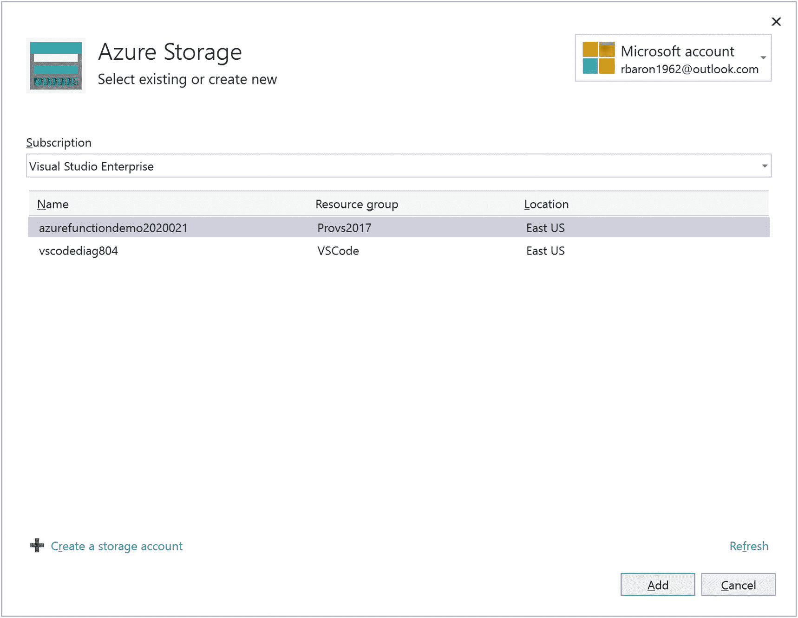

图 9-15

选择现有存储帐户

### 批准

创建 Azure 函数项目时最后一个可用的选项是为 Azure 函数设置授权。用于设置值的下拉列表位于存储帐户的正下方。可用选项包括功能、匿名和管理。

这些选项中最简单的是匿名。使用该选项，根本不执行任何授权。任何请求都被接受，不做进一步的检查。

Function 选项利用作为请求的一部分发送的密钥来限制谁有权访问 Azure 函数。有两种类型的键可用:主机和功能键。你的 Azure Function app 公开的所有函数都使用主机密钥。一个功能键专门绑定到一个功能，这意味着您需要不同的功能键，每个公开的功能一个。

Note

认识到使用功能键并不是访问 Azure 功能的完全安全的方式是非常重要的。用于访问功能的密钥不一定是加密的。例如，如果您使用 Http 触发器，则可以在 URL 的末尾或标头中作为不记名 cookie 传递密钥。该密钥没有加密，因此，如果请求被捕获，恶意用户可能会查看并保存该密钥，并在将来使用它来发送请求。

最后一个选项是 Admin。这类似于 Function 选项，因为请求时需要传递一个键。不同之处在于，唯一允许的密钥类型是主机密钥。如果传递了功能键，则返回 HTTP 状态 403(未授权)。

Function 和 Admin 选项都要求任何传入的请求中都要有一个键。密钥的生成是通过 Azure 门户完成的。不提供使用云浏览器生成密钥的功能。

### 项目文件

一旦指定了 Azure 函数需要的所有信息，单击 Create 创建项目。只有几个文件包含在生成的项目中。有一个 Function1.cs 文件包含一个示例 Azure 函数。这是一个静态类，有一个 Run 方法，用各种属性修饰。通常，该类将被删除或重命名，以便为函数提供更具描述性的名称。

项目中还有另外两个重要的文件。它们都是 JSON 文件，包含函数使用的配置信息。

*   hosts.json `–`包含应用于函数应用程序中定义的所有函数的元数据。这包括实例模型(无论是否是单例模型)、日志记录细节、用于调用函数的触发器以及输入和输出绑定等细节。

*   local.settings.json `–`包含函数在本地运行时使用的设置。这包括连接字符串、应用程序设置(典型的键/值对)和宿主详细信息。该文件仅用于本地执行。当您部署函数应用程序时，您需要配置此文件中包含的设置，以便在 Azure 中使用。这将在下一节“部署 Azure 功能”中讨论

### 部署 Azure 功能

一旦你完成了功能的开发和测试，就该把它部署到 Azure 了。对于 Visual Studio，部署是通过使用发布选项启动的。如果右键单击该项目，可以单击“发布”菜单项。或者您可以使用“生成”菜单中的“发布”项。无论您使用哪种方式，第一次发布项目时，都会出现如图 [9-16](#Fig16) 所示的对话框。

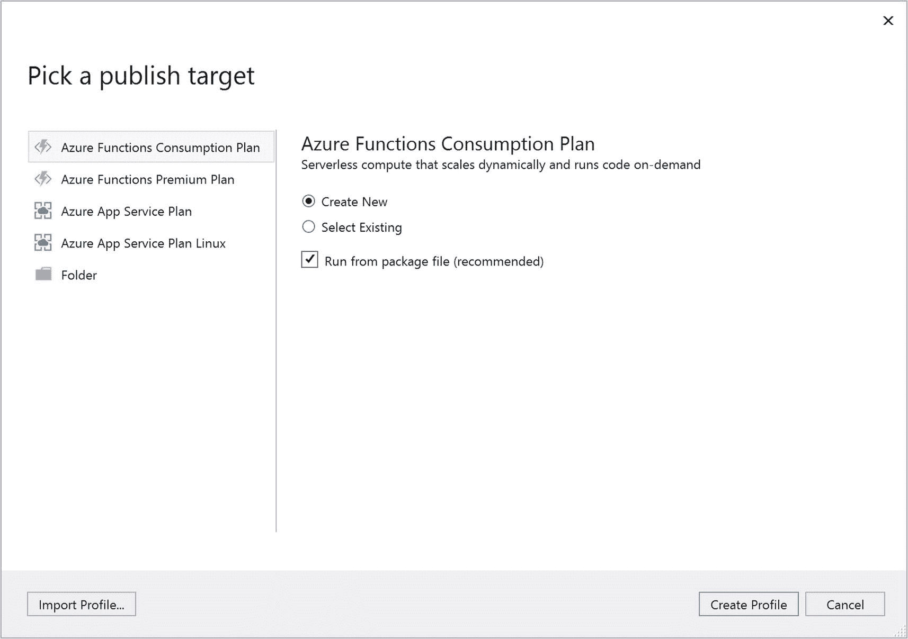

图 9-16

选择 Azure 发布目标

在实际部署函数应用程序之前，需要创建发布概要文件。接下来的几个对话框是用来创建概要文件的。如果您已经有一个可用的配置文件，您可以通过单击左下角的 Import Profile 按钮来使用它。

在继续之前，您需要注意，当您选择目标时，图 [9-16](#Fig16) 中可见的目标列表可能不会全部出现。可能的目标列表取决于您导入的概要文件，以及您用来创建应用程序的模板。例如，如果您使用常规的。NET 框架应用程序，那么在几个段落中描述的 Azure 功能计划可能不会出现。

在左边，您从五个不同的发布目标中选择一个。最简单的是列表底部的文件夹选项。如果部署到文件夹，则会创建一个 ZIP 部署包。这个包是一个 ZIP 文件，它的结构是 Azure 可以识别的。它允许您创建一个部署包并将其交给某人，然后此人可以将其部署到他们自己的 Azure 订阅中。

其他四个选项分为两个独立的组。前两个是 Azure Functions 消费计划和 Azure Functions Premium 计划。对于这两个计划，您的函数主机是根据传入请求的数量动态添加和删除的。因此，从这个角度来看，您的功能可以根据需求扩大和缩小。这是你应该从 Azure 函数的无服务器环境中期待的。

这种差异与环境的环境准备度有关。对于消费计划，您为正在使用的资源付费。一旦你的函数用完了它们，你就不再为它们付费了。这包括内存和计算时间。但是当发出请求时，可能会有短暂的延迟。如果前一个函数已经完成，则内存和计算资源已经被释放。它们需要被重新分配以处理请求。这需要一小段非零的时间。

另一方面，premium 计划总是有一个 warm 实例备用。因此，无论何时收到请求，都会有内存和计算资源准备好处理它。自然，这是有代价的。除了运行该功能所产生的成本之外，您还需要为待机模式下维护的资源付费。

一般来说，你的选择取决于对你的职能的要求。如果对你的功能有持续的需求，那么溢价计划是有意义的。它确保了您的函数对每个请求的响应时间始终是良好的。如果对你的功能的需求是不稳定的或集中的，那么消费计划更有意义。响应时间可能不一致，但是您不会为只是偶尔需要的资源付费。

其他两个发布目标(Azure App Service Plan 和 Azure App Service Plan Linux)都涉及到将您的功能部署到应用服务虚拟机(VM)上。这可能是一个已经在你的订阅中托管一个或多个网站的应用服务。因此，通过这个计划，您可以选择您需要的大小(内核和内存的数量)和隔离(共享或专用)。而且两个方案之间，区别在于底层服务器操作系统是 Windows 还是 Linux。

对于除文件夹之外的所有发布目标，您可以选择创建新的应用程序服务或使用现有的应用程序服务。如果您选择使用现有服务，单击创建配置文件会显示一个类似于图 [9-14](#Fig14) 的对话框，您可以在其中浏览您的订阅以选择所需的应用服务。如果你想为你的 Azure 功能创建一个新的应用服务，点击创建配置文件会显示如图 [9-17](#Fig17) 所示的对话框。

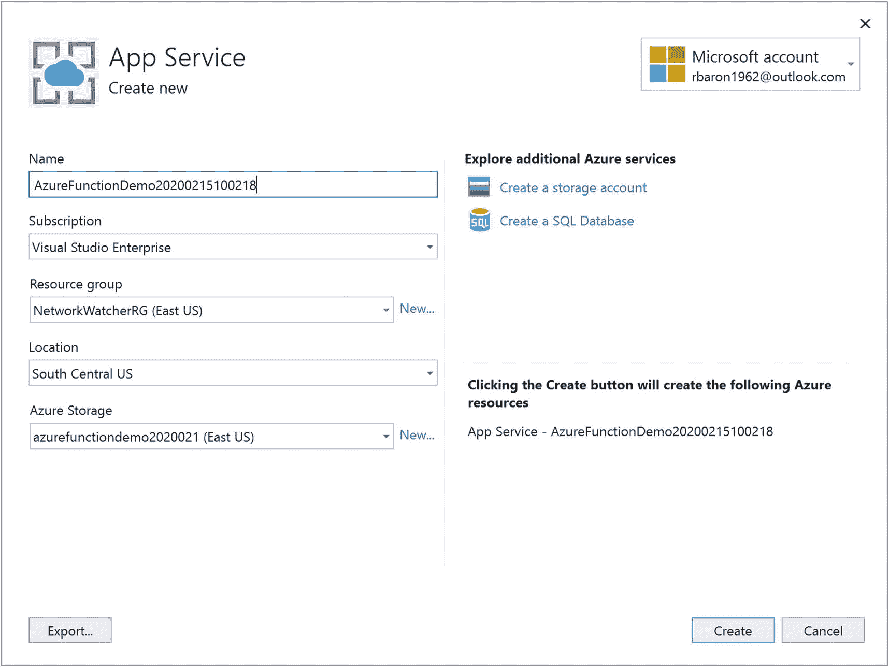

图 9-17

为部署创建新的应用服务

此对话框中的可用信息用于配置将要创建的应用程序服务。需要明确的是，即使您当前正在创建用于部署的配置文件(而不是实际部署应用程序)，如果您单击 Create 按钮，将会创建一个新的应用程序服务。换句话说，部署过程不会创建应用服务。你实际上正在创造它。

一旦您完成了概要文件的创建，或者如果这不是第一次发布函数应用程序，下一步就是实际触发部署。图 [9-18](#Fig18) 显示了用于开始部署到 Azure 的屏幕。

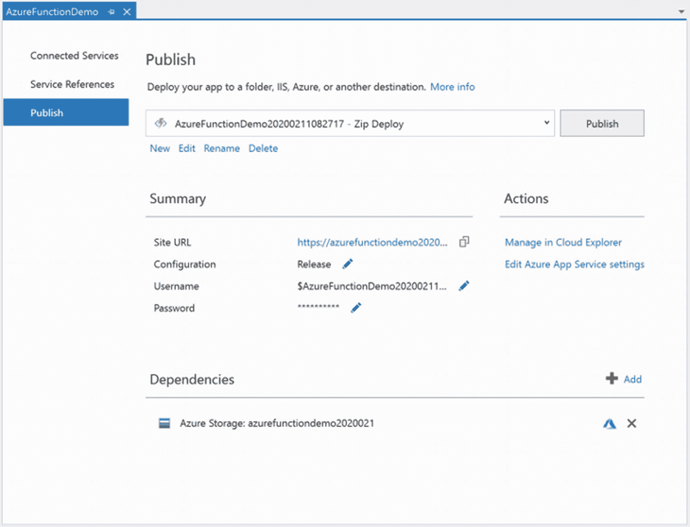

图 9-18

发布 Azure 函数

对话框的顶部是一个下拉列表，包含项目的发布概要文件列表。您在本节前面经历的步骤创建了一个概要文件(在一个`.pubxml`文件中找到)。但是没有什么可以阻止您为一个项目拥有多个概要文件。发布过程非常简单，只需选择所需的配置文件并单击发布即可。下拉列表下方的区域是所选配置文件的设置摘要，这样您就可以在触发部署之前知道自己在做什么。

在对话框的右侧，有几个链接指向您可以采取的快速操作。顶部的链接“在云浏览器中管理”会打开云浏览器窗格(图 [9-19](#Fig19) )。

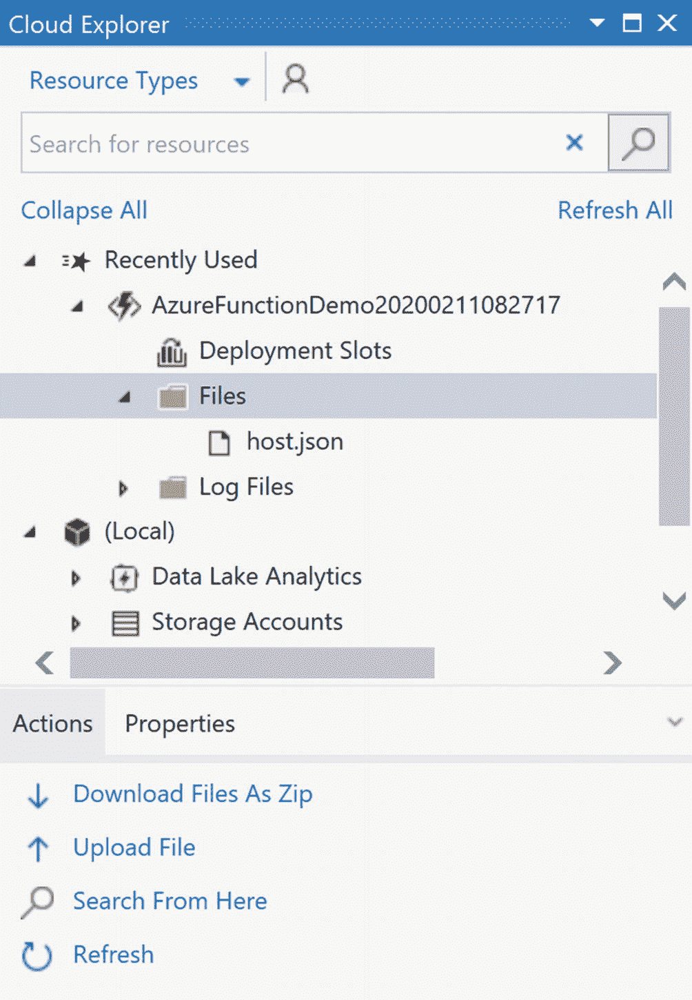

图 9-19

云浏览器中的 Azure 功能应用服务

在 Cloud Explorer 中，您可以查看应用服务的部署槽，以及上传和下载与服务相关的文件(至少是文本文件，如`hosts.json`和任何日志文件)。

第二个选项，编辑 Azure 应用服务设置，在本章前面提到过。`local.settings.json`文件包含功能应用程序在本地运行时使用的设置。此点击允许您配置当您的函数应用程序在 Azure 上运行时将使用的设置。点击链接显示如图 [9-20](#Fig20) 所示的对话框。

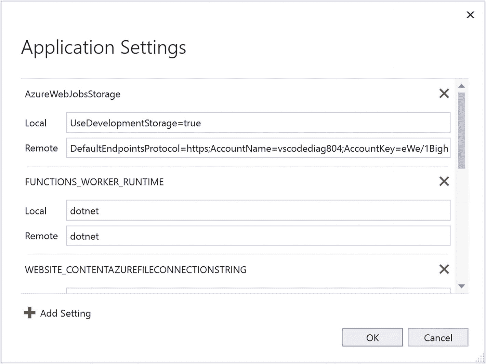

图 9-20

定义 Azure 功能应用设置

为了了解对话框正在做什么，`local.settings.json`文件的相关部分如下所示:

```
"Values": {
   "AzureWebJobsStorage": "UseDevelopmentStorage=true",
   "FUNCTIONS_WORKER_RUNTIME": "dotnet"
}

```

您可以看到该应用程序有两种设置。这两种设置出现在图 [9-20](#Fig20) 中，本地和远程值均可用。对于存储设置，指示在开发过程中应使用本地存储模拟器的值已被发布配置文件中指定的存储的连接字符串所替换。对于其他设置，复制了本地值。您可以更改已定义设置的值，包括附加设置(使用添加设置)链接，以及删除设置(使用每个设置右侧的 X。

除了在`local.settings.json`文件中明确定义的设置之外，还有其他可以访问的环境值。由于它们可以被访问，所以当使用相同的机制将函数应用程序部署到 Azure 时，您可以指定所使用的值。

## 摘要

Azure 是微软领域中的一项主要技术，所以在 Visual Studio 中对它有相当多的支持是不足为奇的，无论是开发还是管理部署的应用程序。

除了 Azure 之外，还有另一项技术正在大举进军开发和部署领域:容器。容器不仅允许您将应用程序捆绑在一起，还允许您将与应用程序相关的基础设施捆绑在一个包中。然后，可以在小型、可任意使用的虚拟机上部署和执行该包。下一章将更加详细地介绍容器背后的概念，更重要的是，微软如何通过 Visual Studio 2019 支持它们。