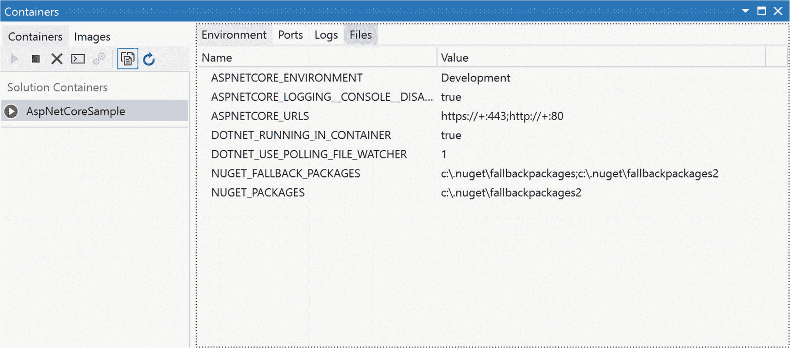

# 十、容器和编排

观看新技术在开发生态系统中移动总是令人着迷的。如果你够老，你可能还记得从单一桌面应用到客户机/服务器架构的转变。然后一切都必须在网络上运行。然后回到面向服务的架构。然后再放到网上。

正如您所看到的，随着技术赶上前面迭代中的缺陷，似乎有一个有规律的架构模式周期。目前，选择的模式是将应用部署为微服务的集合。这些微服务可以打包到容器中，容器本身可以以可伸缩的方式部署到云环境中。管理容器部署的技术称为编排。

在本章中，我们将了解 Visual Studio 2019 为容器的创建提供的支持，以及通过编排对容器的管理。底层的容器技术将是 Docker，而 Kubernetes 的编排功能将被涵盖。

## 容器和码头工人

可视化用于部署软件的容器的最好方法之一是将其与原始容器`–`进行类比，容器用于将货物从一个地方运送到另一个地方。最初，在船上运输货物时，货物是根据最适合货物本身的箱子包装的。小产品装在小盒子里。大型产品装在大箱子里。当试图将不同系列的产品装到一艘船上时，问题就出现了。想象一下，当每一件货物都是不同的尺寸和形状时，包装一艘船的货舱是一个多么大的挑战。这就像在现实生活中玩俄罗斯方块。而且往往会浪费很多空间。

容器使包装和运输货物的过程标准化。货船只接受容器，而不接受单独的包裹。形状规则。大小一致。易于将一个堆叠在另一个之上。一点也不浪费空间。通过增加一些标准功能，甚至可以让同一个容器从船到火车到卡车，一次也不打开。容器的发展彻底改变了这个行业。

对于软件部署，容器扮演着与运输容器相似的角色。如果您考虑部署一个应用需要什么，您将开始看到相似之处。软件通常有一系列的依赖关系，不管是显式的还是非显式的，当它被部署到操作系统、数据库、连接字符串、队列和其他资源时都必须考虑到。选项多且多样，这是问题的根源。当您创建包来部署应用时，您需要了解所有不同的依赖项以及如何解决它们。适应这一点的过程最终会使部署变得困难。

但是，如果软件被部署在一个已经包含所有依赖项的容器中，那会怎么样呢？因此，容器包括兼容的操作系统、应用所需的数据库以及应用所需的所有其他资源。像这样交付的应用只需要安装到网络环境中。希望访问该功能的其他应用将发送请求(通常，尽管不是必须，通过 HTTP)并接收结果。

自然，软件容器中还涉及到其他的复杂性。当涉及到如何共享数据或文件系统时，问题就出现了。但这个概念已经足够丰富，可以在 Visual Studio 2019 中讨论容器支持。但是仍然有一个问题，Docker 是什么，它如何融入这个世界。

### Docker 是什么？

在容器领域，Docker 已经牢牢确立了技术领导者的地位。通过与领先的 Linux 和 Windows 供应商(包括微软)合作，他们开发了允许在内部和云平台上定义和部署容器的工具。

Docker 容器可以在 Linux、OSX 或 Windows 上本机运行，尽管限制是 Windows 容器(即使用 Windows 作为底层操作系统的容器)只能部署到 Windows 机器上，本机运行或作为虚拟机(VM)运行，而 Linux 容器只能部署到 Linux 机器或支持 Hyper-V Linux VM 的 Windows 机器上。

创建 Docker 容器的过程包括两个步骤。第一个是创建应用或服务，开发人员对此非常了解。为了在 Visual Studio 中创建一个可以 Dockerized 的应用(耶…那真的是一个词)，你被限制在 ASP.NET，ASP.NET 核心，。NET 框架，以及。NET 核心应用。这是一把足够大的伞，大多数应用都可以放在它下面。这并不是说所有的应用都可以有效地容器化，只是说底层技术足够灵活，可以覆盖大多数情况。

创建 Docker 容器的第二步是打包应用。这相当于为应用创建一个部署。应用及其所有依赖项都放在一个容器映像中。该映像是应用部署的静态表示。当一个容器被创建时，图像实际上被实例化了。

为了创建 Docker 容器，您需要安装 Docker 桌面。它可以从 [`www.docker.com/products/docker-desktop`](http://www.docker.com/products/docker-desktop) 下载，并且是从 Visual Studio 中利用 Docker 所必需的。

使用 Docker 时，有几个额外的术语有助于理解:

*   Dockerfile `–`一定程度上，这是 Docker 的秘制酱。Dockerfile 是一个文本文件，类似于描述如何创建图像的批处理脚本。这包括如何安装所有需要的程序，需要复制哪些文件以及复制到哪里，以及正确配置运行时环境所需的任何其他命令。

*   存储库`–`先前创建的容器图像的集合。通常，每个图像都有一些共同点(属于同一个项目，同一图像的不同版本，等等。)，但这不是硬性要求。

*   注册表是一种允许其他人访问存储库的服务。有一些公共注册中心，最常见的是 Docker Hub。但也有可能托管私有注册中心，无论是在企业环境中还是通过 Docker Hub 提供的付费服务。

*   Docker Compose `–`一个用来定义 Docker 图像集合的工具，这些图像组成了一个更复杂的应用。Compose 由命令行界面和基于 YAML (YAML 不是标记语言)的文件格式组成。通过 YAML 文件，您可以获取先前定义的容器图像，并描述如何将不同的图像组合起来以创建更大的应用。然后，可以使用该文件通过一个命令实例化图像。

### Docker 和 Visual Studio

Visual Studio 中有两种级别的 Docker 支持。首先，如果您只想创建一个容器，Visual Studio 允许您在创建项目时或之后添加对 Docker 的支持。第二层涉及编排容器，该术语用于描述在 Docker Compose 支持的单个应用中使用多个容器。Visual Studio 支持使用 Docker Compose 或 Kubernetes 进行编排。本节的其余部分将介绍第一级支持。为编排提供的支持将在后面的章节中介绍。

如果您正在创建一个新项目，那么当您选择想要使用的特定模板时，就可以添加对 Docker 的支持了。图 [10-1](#Fig1) 显示了选择 ASP.NET 核心 Web 应用模板后出现的对话框。它在风格上是相似的，更重要的是，在 Docker 选项的位置上，与其他应用类型的对话框相似。


图 10-1

ASP.NET 核心网站模板选择

在右侧的“高级”部分，有一个标记为“启用 Docker 支持”的复选框。选中时，生成的项目将包含支持 Docker 所需的文件。此外，包含 Docker 文件运行时平台的下拉菜单也被启用。选项有 Linux 和 Windows，您可以选择最适合您的应用部署计划的操作系统。一旦创建了应用，就很有可能改变这个选择。如果您正在创建. NET Framework，则不会出现运行时下拉列表，因为它们只能在 Windows 下运行。

如果您有一个想要添加 Docker 支持的现有项目，请在解决方案资源管理器中右键单击该项目并选择添加➤ Docker 支持(如图 [10-2](#Fig2) 所示)。


图 10-2

向现有项目添加 Docker 支持

如果您要添加对. NET 核心或 ASP.NET 核心应用的支持，系统会提示您指定预期的运行时是 Linux 还是 Windows。为了。NET Framework 项目，则不会出现此提示。

Docker 支持的添加导致了两个文件被添加到项目中，以及一个 NuGet 引用。NuGet 引用是 Microsoft . visual studio . azure . containers . tools . targets。此引用是支持在项目中启用容器所必需的。这两个文件是 Dockerfile 和. dockerignore 文件。

默认 Dockerfile 是一个简单的文件，用于定义基本运行时，然后提供如何构建和发布应用的指令。以下是 docker 文件，它是在您创建 ASP.NET 核心项目时最初添加的。不同的项目类型会有不同的初始 Dockerfile，但基本内容和目的是相同的。

```
FROM mcr.microsoft.com/dotnet/core/aspnet:3.1-nanoserver-1903 AS base
WORKDIR /app
EXPOSE 80
EXPOSE 443

FROM mcr.microsoft.com/dotnet/core/sdk:3.1-nanoserver-1903 AS build
WORKDIR /src
COPY ["AspNetCoreSample.csproj", ""]
RUN dotnet restore "./AspNetCoreSample.csproj"
COPY . .
WORKDIR "/src/."
RUN dotnet build "AspNetCoreSample.csproj" -c Release -o /app/build

FROM build AS publish
RUN dotnet publish "AspNetCoreSample.csproj" -c Release -o /app/publish

FROM base AS final
WORKDIR /app
COPY --from=publish /app/publish .
ENTRYPOINT ["dotnet", "AspNetCoreSample.dll"]

```

应用的基本运行时在第一个语句块中声明。nanoserver-1903 参考指定将使用 Windows Server 版本 1903。如果您想查看公共注册表中可用的其他标签，您可以在 [`https://hub.docker.com/_/microsoft-windows/`](https://hub.docker.com/_/microsoft-windows/) 找到该列表(查看 Nano Server 和 Windows Server 代码实例的相关存储库)。找到可以用作容器基础的 Linux 服务器列表要稍微困难一些，因为您需要知道您要部署到的 Linux 版本(例如，Ubuntu、Debian 等。).

第一个脚本块还指定了要公开的端口 80 和 443 (HTTP 和 HTTPS)。

脚本的第二部分定义了构建时发生的事情(即，当执行`dotnet build`命令时)。这里的步骤包括执行恢复，更新项目使用的任何包，将项目文件复制到构建位置，然后直接针对项目执行构建。复制步骤很重要，因为它使用`.dockerignore`文件来决定哪些文件应该或不应该被复制。

脚本的第三部分定义了 Docker 的发布功能。在这种情况下，它只是对项目文件调用发布命令。

最后，第四个脚本块执行最后一步，使用基本运行时映像和发布的应用的组合来创建静态容器映像。

如前所述，还有一个`.dockerignore`文件被添加到项目中。该文件包含一组模式，用于指定在 Docker 容器创建过程中不应该复制的文件。默认情况下，这包括像`node_modules, bin`和`obj`这样的文件夹和像`.gitignore`这样的文件以及各种设置文件。当然，该文件完全可以由您定制，因此您可以确保只发布 Docker 容器所需的内容。

#### 在 Docker 中运行

当您将 Docker 支持添加到项目中时，Visual Studio 中还会添加一个其他元素。Visual Studio 顶部的工具栏现在包括 Docker 作为可能的调试目标(见图 [10-3](#Fig3) )。


图 10-3

在 Docker 中启动应用

添加此选项意味着当您调试应用时，您可以选择在 Docker 环境中运行应用，而不是在本地 IIS 或 IIS Express 等环境中运行。

将 Docker 设置为调试平台后，运行调试会话首先要创建一个 Docker 容器映像，并将该映像加载到 Docker 中以供执行。

为了成功完成这些步骤，需要满足一些标准。首先，您需要让 Docker 已经在您的机器上运行。安装它是不够的。它需要运行。现在，可以配置 Docker 在你启动机器时自动启动。但是如果没有该设置，您需要手动启动它。

其次，您的本地 Docker 需要配置为使用正确类型的运行时容器。一旦 Docker 运行，你可以通过右击系统托盘中的图标并选择适当的命令(切换到 Windows/Linux 容器)来改变容器类型，如图 [10-4](#Fig4) 所示。


图 10-4

切换 Docker 容器类型

一旦容器类型设置正确(完成更改需要一些时间)，您就可以正常运行应用了。

第一次通过 Docker 运行项目时，可能会提示您信任 SSL 认证。你会看到一个如图 [10-5](#Fig5) 所示的对话框。


图 10-5

信任 SSL 证书

当您选择信任该证书时，可能还会提示您安装自签名证书。一旦您信任并安装了认证，过一会儿，您将看到一个浏览器页面，您的应用在其中运行(无论如何是一个 web 应用)。您可以调试您的应用，就像您在本地运行它一样。

#### 容器视图

当容器运行时，您可以通过容器窗格查看有关它的信息。您可以通过查看➤其他窗口➤容器菜单项查看该窗口。图 [10-6](#Fig6) 显示了当前运行单个容器的容器窗格。



图 10-6

容器窗格

“容器”窗格有两个主要功能。第一个是可视化关于特定容器的信息。在图 [10-6](#Fig6) 中，所选容器有四个信息标签。出现的选项卡“环境”显示容器的配置信息。其他选项卡显示暴露的端口、应用生成的日志以及属于容器映像一部分的文件。

标签中的信息应该是只读的。是的，当容器中运行的应用生成消息时，日志文件会更新，但是您无法通过选项卡控制容器的执行。但是，通过容器窗格，您可以执行影响应用的命令。

在左侧容器列表上方的工具栏中，您可以使用左侧的两个图标(三角形和正方形)来启动和停止容器。还有一个从 Docker 中移除容器的图标(X)。但是，如果您希望能够在容器中执行命令，终端图标(左起第四个，看起来像一个盒子中的命令提示符)符合要求。

当您点按终端图标时，会打开一个命令行窗口。它看起来像任何其他命令行窗口，除了这个是连接到运行的容器。当您执行命令时，它们是针对容器实例执行的。而且，由于它是命令行，您可以根据需要运行各种命令来查看状态或修改图像。

但是，请记住，您所做的任何更改都只适用于当前正在执行的映像。当您关闭并重新启动映像时，所做的更改将会消失。如果您想让它们永久存在，您需要修改 docker 文件，以便正确配置您的映像。

## 管弦乐编曲

现在已经介绍了容器的概念，让我们添加一些如何管理容器的内容。如果您开发了一个使用单个容器的应用，那么从部署、生命周期和资源的角度来管理它是相当容易的。即使您的应用由运行在十几个容器上的三个或四个服务组成，管理起来也不会太困难。然而，一旦您进入运行数百个服务的数百个容器，那么处理容器的创建、销毁和管理对于手动执行来说将是难以承受的。因此，编排工具应运而生。

编排的思想是要有一个工具来处理容器的细节:当它们被创建和销毁时，在哪里被创建，应该在每个容器附近创建哪些容器集，需要什么外部资源和应该在哪里创建资源，以及需要什么网络连接。

在编排工具中，这些细节在一个单独的文件中定义，通常是 JSON 或 YAML 格式的。该定义由工具处理，以加载映像、挂载任何所需的资源，并将它们彼此连接起来。定义文件通常由负责团队进行版本控制，以便应用可以在投入生产之前部署到不同的环境中，例如试运行或质量控制。

在复杂的环境中，容器被部署到主机上。当需要容器的新实例时，通常是当容器映像被修改时，编排工具会寻找最合适的主机进行部署。用于确定什么是“合适”的标准包含在编排定义文件中。它可以包括地理位置、主机功能(CPU、内存)或管理员定义的标记等标准。

在 Visual Studio 2019 中，支持两种不同的编排工具:Kubernetes 和 Docker Compose。在接下来的部分中，我们将了解可用支持的性质。

### 忽必烈忽必烈忽必烈忽必烈忽必烈忽必烈忽必烈忽必烈忽必烈忽必烈

Kubernetes 是来自谷歌的工具。15 年来，谷歌一直在运行容器化的工作负载，以支持其许多不同的功能和项目。与此同时，它开发了许多专门用于帮助管理不同工作负载的工具。用于管理这些工作负载的内部工具被称为 Borg，它是 Kubernetes 的前身。Kubernetes 的许多想法都源于博格。但是，更重要的是，许多在 Borg 中根深蒂固、无法重构的痛点已经在 Kubernetes 中得到解决。

正如您所料，当您在 Visual Studio 中使用 Kubernetes 时，需要了解其中的一些术语:

*   集群是存储资源和计算节点(主机)的集合，构成了 Kubernetes 中的一个管理单元。每个集群至少有一个 Kubernetes 主服务器，负责跨不同节点调度和部署应用实例。

*   pod 是 Kubernetes 中最低级别的调度单元，pod 由一个或多个部署到一台主机上的容器组成。并且 pod 中的每个容器都能够与其他容器共享资源。每个 pod 还分配有一个 IP 地址，确保应用可以定义必要的端口号进行通信，而不必担心冲突。

*   Kubelet `–`在 Kubernetes 环境中的每个计算节点上运行的服务代理。代理负责管理和报告节点上运行的容器的状态。当 Kubernetes 主节点发出指令时，实际上是 Kubelet 代理在节点上执行操作。

*   部署`–`正如编排描述中提到的，有一个文件定义了组合在一起的容器。在 Kubernetes 中，该文件是 YAML 格式的，称为部署。当 Kubernetes 主服务器调度部署时，它会将 YAML 文件提交给 Kubelet，以便实际创建各种容器实例和资源。

*   作为 pod 定义的一部分，您还可以声明使用了一定数量的相同容器集。每个集合称为一个副本，目的是任何传入的请求都可以由任何单独的副本提供服务。副本的概念用于帮助确保维持正常运行时间。

*   StatefulSet `–`部署旨在成为无状态的应用。正是这种无状态性使得复制品的概念很容易实现。然而，有些情况下应用需要有状态，对于这些情况，Kubernetes 中有 StatefulSet 的概念。数据库服务器是可能需要 StatefulSet 的一个很好的例子。

对 Kubernetes 的支持始于 Visual Studio，它增加了对编排的支持。在解决方案资源管理器中，右键单击该项目，然后从上下文菜单中选择“添加➤容器业务流程支持”。此时会出现一个对话框(图 [10-7](#Fig7) )，让您确定希望包含在项目中的编排工具的类型。


图 10-7

添加容器编排支持

要添加 Kubernetes 支持，请选择 Kubernetes/Helm 选项，然后单击确定。这个过程向您的项目添加一个或多个文件和几个引用。如果您之前没有添加对 Docker 的支持，那么将添加与 Docker 相关联的文件和引用。对于 Kubernetes，添加了描述编排的 YAML 文件，以及一个名为 charts 的文件夹，其中包含 Helm 模板文件。这个文件的名字是`azds.yaml`(很快会有更多关于 Azure Dev Spaces `–`的介绍)，它定义了项目参与的编排。请记住，默认文件包含一个非常简单的编排，它只包含一个容器(在这个项目的 docker 文件中定义的容器)。对于更复杂的应用，YAML 编排文件可能会变得相当大。

您可能已经注意到，当您添加容器编排支持时，所选择的选项包括 Helm 和 Kubernetes。简单地说，Helm 是 Kubernetes 集群的包管理器。但是公平地说，它不仅仅是一个包管理器。部分原因是在 Kubernetes 中管理包是一项复杂的工作。

考虑下面的场景。您有一个包含许多不同微服务项目的应用。该应用有一个 YAML 配置，可以很好地将应用部署并运行在一个登台环境中。但是生产环境就是有点不一样。用于访问数据库的 URL 在生产中与在暂存中是不同的(当然)。因此，您编写一个脚本，作为持续部署过程的一部分，在管道中的准备和生产步骤之间修改 YAML 文件中的 URL。

这个解决方案运行良好。对于一个应用。或者甚至两三个。但是您部署的应用越多，这种自己动手的方法就越低效。对暂存和生产 YAML 文件进行版本控制变得很困难，因为还有另一个脚本在执行之前修改生产。还有一个长期的问题，那就是试图理解试运行环境和生产环境之间的差异。仅仅比较 YAML 的档案是不够的。您还需要查看转换脚本以获得完整的理解。

这就是头盔发挥作用的地方。除了为您的部署管理包之外，它还提供了关于您的环境中当前部署的服务和配置的单一真实来源。它还提供了一种模板机制来解决环境之间的差异。

从架构的角度来看，Helm 只是一个命令行工具。现在，作为一个命令行工具，很容易为它开发脚本。脚本的文本格式意味着根据需要修改脚本很简单。但是，除了命令行之外，还有一个名为`tiller`的服务器组件。分蘖在每一个 Kubernetes 集群上运行。它接受来自 Helm 的命令，并在集群上执行这些命令。这允许一个集中的命令窗口来影响远程 Kubernetes 集群上的软件部署。

一个舵包叫做海图。当您将 Kubernetes/Helm 支持添加到项目中时，会创建一个名为 charts 的目录。在该文件夹中，创建了一个以项目名称命名的子目录。在该文件夹中，创建了许多文件，其结构为 Helm 所认可。这包括以下内容:

*   templates `–`一个包含 YAML 文件集合的文件夹，这些文件在创建 Kubernetes 清单时充当模板。作为 Helm 构建过程的一部分，模板与 values.yaml 文件中的值相结合。

*   。helmignore `–`一个包含模式的文件，用于识别 Helm 应该忽略的文件。

*   Chart.yaml `–`这个文件包含关于特定图表的元数据。

*   values.yaml `–`包含模板使用的各种值，以便生成特定于该应用的清单。

至此，您已经具备了利用 Helm 和 Kubernetes 来打包和部署应用所需的所有条件。正如你所想象的，这些工具比我们在本章中讨论的要复杂得多。如何使用这些工具的细节已经超出了本书的范围。并且，至少目前，生成必要的文件是 Visual Studio 提供的支持级别。

#### Azure 开发空间

Azure 中提供的功能之一是 Azure Kubernetes 服务(AKS)。这是一个托管的 Kubernetes 服务，允许您在 Azure 中开发和运行复杂的 Kubernetes 编排。该服务提供一个 Kubernetes 主服务器，为您处理健康监控和维护任务。由您来创建应用并将它们部署到节点上。

Azure Dev Spaces 是对 AKS 的扩展，允许 Kubernetes 集群的快速迭代开发和部署。目标是帮助开发人员创建在 Kubernetes 中使用的应用，并将它们部署到集群中，以便可以与其他已经部署的服务一起测试它们。

`azds.yaml`文件的目的是定义如何将应用部署到 AKS 中。该文件的格式类似于 Python，因为内容的嵌套是由行的缩进决定的。默认文件对于单个项目部署来说通常是足够的，只要项目的功能不是过于复杂。换句话说，项目需要的外部资源越多，默认资源就越有可能不够好。

默认文件包括构建和安装部分。构建部分控制用于构建项目的过程。install 部分描述了发布的详细信息，包括包含设置和机密(如连接字符串)的文件、要使用的映像以及任何公开的端点等详细信息。

为了利用 Helm 和 Azure Dev Spaces，需要一些命令行脚本。您需要在 Azure 订阅中创建一个 AKS 实例，然后使用 Helm 将您的应用安装到 AKS 集群上。如果需要对应用进行修改，可以使用`adzs`命令将更新后的包上传到 Kubernetes 集群。所涉及步骤的详细描述可以在 [`https://docs.microsoft.com/en-us/azure/dev-spaces/quickstart-team-development`](https://docs.microsoft.com/en-us/azure/dev-spaces/quickstart-team-development) 找到。

### 复合坞站

当您添加容器编排支持时(图 [10-7](#Fig7) ，您可以选择 Docker Compose 而不是 Kubernetes 作为您的编排技术。像 Kubernetes 一样，Docker Compose 用于定义和执行多容器应用。有一个 YAML 文件，其中包含对所使用的不同容器的描述。有一个命令(`docker-compose`)将启动您的 YAML 文件中描述的所有容器。

那么 Docker Compose 和 Kubernetes 有什么区别呢？复杂性和特性。Kubernetes 是一个企业级容器编排工具。它处理跨多个主机运行的多个容器。它还提供了管理功能，包括自动扩展和重启。

Docker Compose 要简单得多。它的真正目的是允许您在一台主机上启动多个容器，而不需要单独启动每个容器。您可以启动和停止服务，查看正在运行的容器的状态，重建和更新容器，以及显示来自不同服务的日志。

在 Visual Studio 中，通过在添加 orchestrion 支持时选择选项，可以添加对 Docker Compose 支持。选中时，Visual Studio 会添加一个`docker-compose.yml`文件。如果您的项目还没有添加 Docker 支持，这些文件和引用也会被添加。以下是 Docker 撰写文件的内容:

```
version: '3.4'

services:
  aspnetcoresample:
    image: ${DOCKER_REGISTRY-}aspnetcoresample
    build:
      context: .
      dockerfile: Dockerfile

```

只有一个服务，因为这个文件与一个项目相关。对 Docker 容器使用的基本映像进行了描述。还有一节描述了如何构建将被部署到容器中的应用。

除了`docker-compose.yml`文件，还创建了一个`docker-compose.override.yml`文件。该文件的目的是允许添加额外的配置细节。不同之处在于覆盖文件的内容会覆盖基本配置文件中的任何设置。并且你有不同的覆盖文件，典型的名字表明了它的用途(例如，`docker-compose.test.yml`)。

默认情况下，`docker-compose`命令读取基本配置，然后使用覆盖文件中的内容来取代任何配置设置。如果您想使用一个特定的覆盖文件，您可以在命令行中为`docker-compose`包含该文件的名称。

添加 Docker Compose orchestration 支持的第一个应用将成为在 Visual Studio 中运行或调试应用时启动的应用。这相当于为解决方案指定启动项目。你有能力改变这种行为。如果右键单击添加支持时添加的 docker-compose 文件夹，并选择属性选项，将出现图 [10-8](#Fig8) 中的对话框。


图 10-8

Docker 合成属性页

这些是用于从 Visual Studio 中运行 Docker 撰写配置的设置。每个设置的含义如下:

*   启动操作`–`当应用成功编译和部署后，Visual Studio 应该做什么？默认情况下，它将启动一个浏览器，传入服务 URL。但是，您也可以不采取任何措施。在这种情况下，容器将会运行，但是没有要处理的默认请求。

*   服务名`–`启动时初始请求被发送到的服务的名称。该名称用作下一个属性的一部分。

*   服务 URL `–`用于访问该服务的 URL。默认值是一个模板脚本，其中包含取自配置文件的值。默认情况下，它将使用端口 80 和 HTTP 模式访问服务名。

*   目标 OS `–`容器将运行的操作系统。

## 摘要

在接下来的 5 年里，容器和编排将在开发者社区中扮演重要角色。这一直是非常关注扩展问题的公司关注的焦点。利用容器的微服务架构在很多情况下都很有用。

但是，即使您目前没有使用容器，考虑它们的功能也是有好处的。即使在最简单的情况下，只需几个脚本命令就可以创建自包含的应用并将它们部署到各种各样的环境中，这一事实非常强大。更不用说，如果由于意外的硬件或软件问题，您需要将应用转移到不同的服务器上，能够快速启动容器对于您的 IT 员工来说是一种新鲜空气。

重要的是，Visual Studio 提供了一组支持服务，可以帮助解决所有的用例，并最终提供使 Visual Studio 对如此大比例的开发人员社区如此重要的功能。