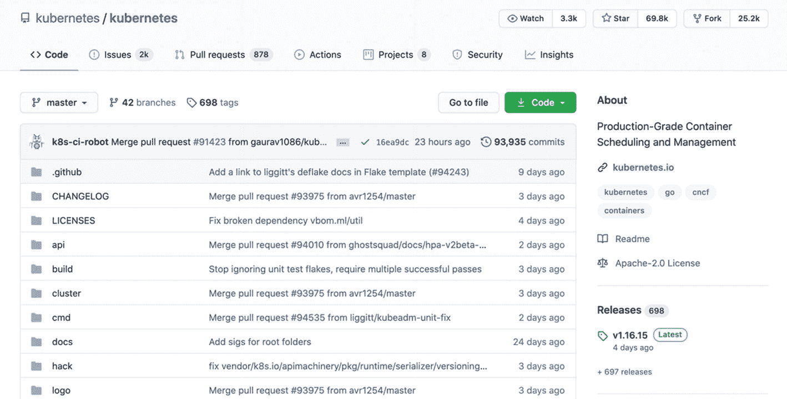
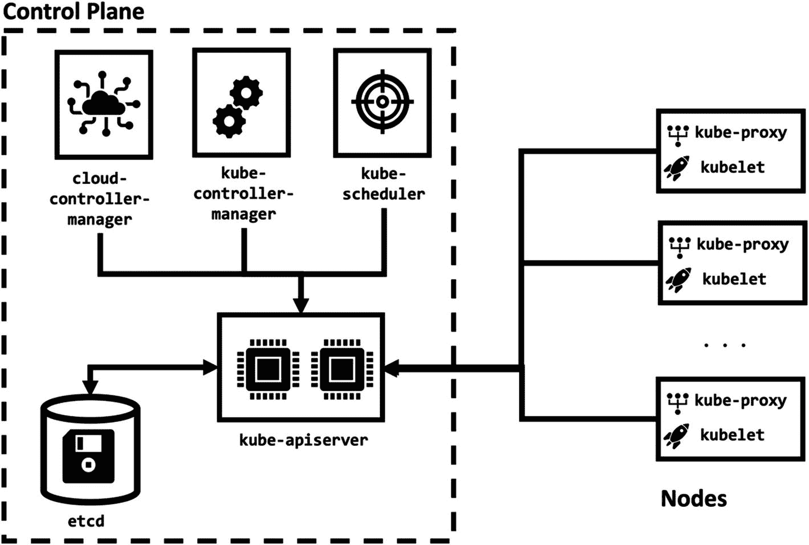
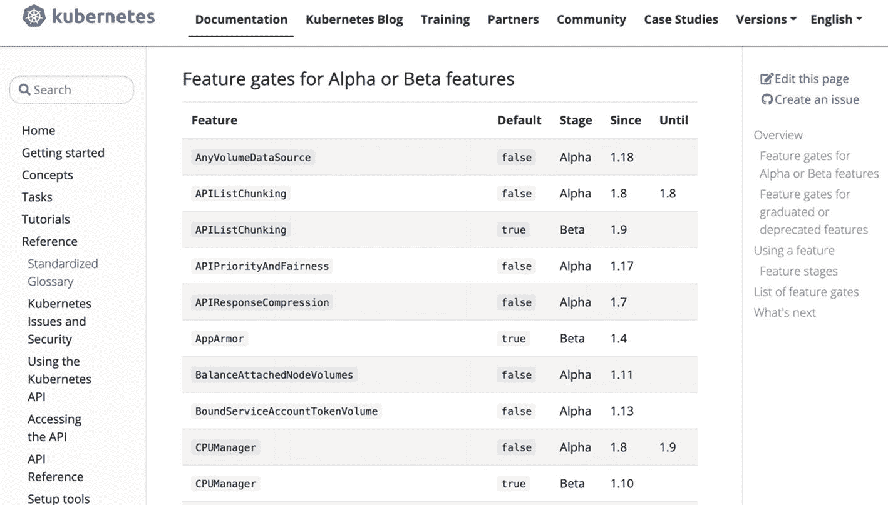
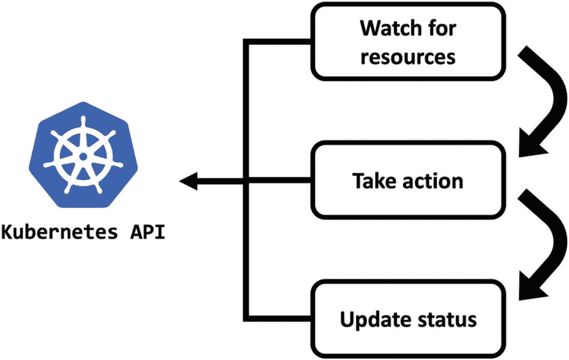
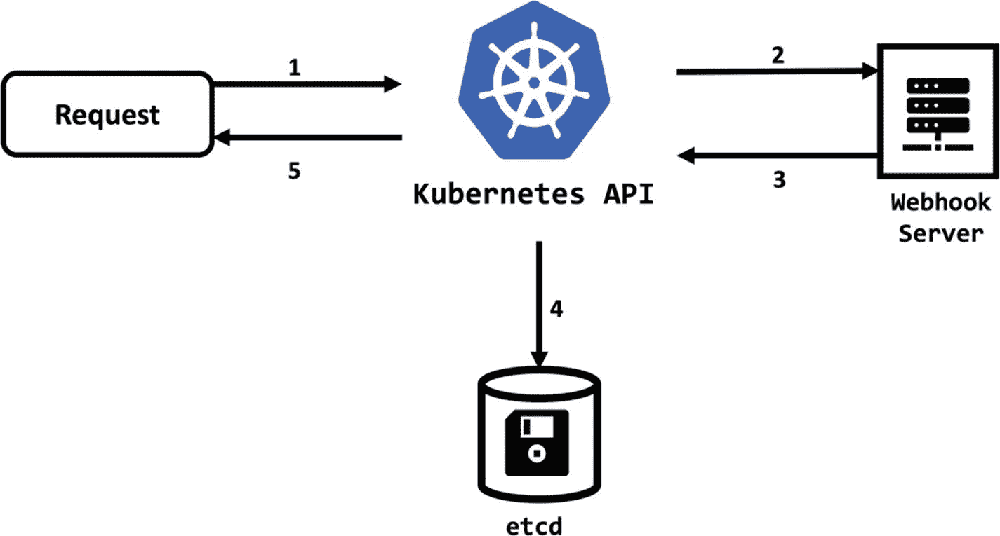

# 1.介绍

> 生活就像洋葱；你一层一层地剥开它，有时你会流泪。
> 
> 卡尔沙堡
> 
> 美国诗人、传记作家、记者和编辑，三次获得普利策奖

Kubernetes 就像洋葱。你一次剥开一层，有时你会流泪，检查你的 YAML 文件，并阅读更多的文档。

Kubernetes 是一个复杂的系统。第一章将从 Kubernetes 的简史以及它如何发展成为一个复杂的系统开始。虽然它已经有许多层，但它还可以用附加层来扩展。本章还将讨论如何配置 Kubernetes 系统、它的扩展模式和要点。在本章的最后，你将理解 Kubernetes 的复杂性和它的能力。

让我们先简要回顾一下 Kubernetes 的历史及其特点。

## 忽必烈再世

Kubernetes 是一个管理容器化应用的开源系统。名字源于希腊语，意为**舵手**。所以，说 Kubernetes 是帮助你在容器和微服务的风暴海洋中找到*莫比迪克*的工具并没有错。

谷歌在 2014 年开源了 Kubernetes，它是几十年来在容器中运行生产工作负载的经验积累。2015 年，谷歌宣布将 Kubernetes 项目移交给云计算原生计算基金会(CNCF)。 <sup>[1](#Fn1)</sup> CNCF 拥有超过 500 名成员， <sup>[2](#Fn2)</sup> 包括全球最庞大的公有云和企业软件公司以及超过 100 家创新创业公司。该基金会是许多发展最快的项目的供应商中立之家，包括 *Kubernetes* 、*普罗米修斯*和*特使*。

Kubernetes 是目前最受欢迎的开源项目之一，有近 3000 名贡献者，超过 1000 个拉请求和 2000 个开放问题。这个库(图 [1-1](#Fig1) )可以在 GitHub 上以名称`kubernetes/kubernetes`获得。 <sup>[3](#Fn3)</sup>



图 1-1

库存储库

有大量的开放问题需要解决，如果你想深入开源世界做出贡献，这个社区也是最受欢迎的。现在让我们再深入一个层次，看看我们所说的 Kubernetes 系统是什么意思。

Kubernetes 被设计为在集群上运行。Kubernetes 集群由节点组成，容器化的应用在这些节点上运行。

我们可以从逻辑上将 Kubernetes 系统分成两部分:**控制平面和工作节点**。控制平面管理工作节点和群集的工作负载，而工作节点运行工作负载。在图 [1-2](#Fig2) 中，您可以看到 Kubernetes 集群的组件是如何联系在一起的。



图 1-2

库比特组件

### 控制平面组件

控制平面是 Kubernetes 集群的**大脑**，负责做出决策、检测事件，并在需要时做出响应。例如，期望控制平面将 pod 的调度决策给予工作节点，识别故障节点，并重新调度新的 pod 以确保可扩展性。

控制平面组件可以在 Kubernetes 集群中的任何节点上运行；但是，为控制平面组件保存一些节点是一种典型的方法。这种方法将工作负载从集群中的控制平面组件中分离出来，使操作节点进行扩展和缩减或维护变得更加容易。

现在，让我们回顾一下每个控制平面组件及其对群集的重要性。

#### 多维数据集 apiserver

Kubernetes API 是控制平面的前端，`kube-apiserver`公开了它。`kube-apiserver`可以通过运行多个实例进行水平扩展，从而创建一个高度可用的 Kubernetes API。

#### 和 cd

`etcd`是一个开源的分布式键值存储，Kubernetes 将其所有数据存储在其中。集群的状态和变化仅通过`kube-apiserver`保存在`etcd`中，并且可以水平扩展`etcd`。

#### 多维数据集调度程序

Kubernetes 是一个容器编排系统，它需要将容器化的应用分配给节点。`kube-scheduler`负责通过考虑资源需求、可用资源、硬件和策略约束、相似性规则和数据局部性来做出调度决策。

#### kube-控制器-管理器

Kubernetes 的关键设计概念之一是控制器。Kubernetes 中的控制器是控制循环，用于监视集群的状态，并在需要时做出更改。每个控制器都与 Kubernetes API 交互，并试图将当前的集群状态转移到所需的状态。在本书中，您不仅会熟悉原生的 Kubernetes 控制器，还会学习如何创建新的控制器来实现新的功能。`kube-controller-manager`是 Kubernetes 集群的一组核心控制器。

#### 云控制器管理器

Kubernetes 被设计成一个独立于平台的可移植系统。因此，it 需要与云提供商进行交互，以创建和管理节点、路由或负载平衡器等基础设施。`cloud-controller-manager`是运行特定于云提供商的控制器的组件。

### 节点组件

节点组件安装在 Kubernetes 集群中的每个工作节点上。工作节点负责运行容器化的应用。在 Kubernetes 中，容器被分组到一个名为 *pod* 的资源中。`kube-scheduler`将 pod 分配给节点，节点组件确保它们启动并运行。

#### 忽必烈忽必烈忽必烈忽必烈忽必烈忽必烈忽必烈忽必烈忽必烈忽必烈忽必烈忽必烈忽必烈忽必烈忽必烈忽必烈

`kubelet`是运行在各个节点上的代理。它获取分配给该节点的 pod 的规范。然后，它与容器运行时交互，在 pod 中创建、删除和观察容器的状态。

#### 多维数据集代理

容器化的应用在 Kubernetes 集群中运行时，就像在单个网络中运行一样。作为网络代理在每个节点上运行，并连接应用。它还维护群集内外网络通信的网络规则。

在生产环境中，控制平面组件在多个节点上运行，以提供容错和高可用性。类似地，工作节点的数量随着工作负载和资源需求而扩展。另一方面，可以创建更多可移植的 Kubernetes 系统，在 Docker 容器或虚拟机内的单个节点上运行，用于开发和测试环境。在本书中，我们将创建生产就绪型和单节点 Kubernetes 集群，并观察它们的运行情况。在接下来的小节中，我们将重点介绍如何配置 Kubernetes 系统，以了解它的功能。

### 配置 Kubernetes 集群

您可以通过两种广泛的方法来约束或释放 Kubernetes 集群:配置和扩展。在配置方法中，您可以更改标志、配置文件或 API 资源。这一节将着重于配置 Kubernetes，然后我们将在本书的其余部分把重点转移到扩展上。

参考文档中定义了控制平面和节点组件的标志和配置文件。 <sup>[4](#Fn4)</sup> 还有，也有可能弄脏自己的手，用 Docker 图像检查一下。让我们从`kube-apiserver`开始，检查它的标志，如清单 [1-1](#PC1) 所示。

```
$ docker run -it --rm k8s.gcr.io/kube-apiserver:v1.19.0 kube-apiserver --help

The Kubernetes API server validates and configures data for the api objects which include pods, services, replicationcontrollers, and others. The API Server services REST operations and provides the frontend to the cluster's shared state through which all other components interact.

Usage:
  kube-apiserver [flags]

Generic flags:

      --advertise-address       ip
      The IP address on which to advertise the apiserver to members of the cluster. ...
      ...
      --cors-allowed-origins    strings
      List of allowed origins for CORS, comma separated.
      ...

Listing 1-1kube-apiserver flags

```

命令行输出是巨大的，`kube-apiserver`二进制文件有将近 150 个标志。但是，每个集群管理员都需要知道一个标志:`--feature-gates`。特性门是一组键和值对，用于启用 alpha 或实验性 Kubernetes 特性。它在每个 Kubernetes 组件中都可用，并且可以通过它的帮助来访问。这次让我们检查一下`kube-scheduler`，如清单 [1-2](#PC2) 所示。

```
$ docker run -it --rm k8s.gcr.io/kube-scheduler:v1.19.0 kube-scheduler --help 2>&1 |grep -A 250 feature-gates

--feature-gates     mapStringBool
A set of key=value pairs that describe feature gates for alpha/experimental features. Options are:
         APIListChunking=true|false (BETA - default=true)       APIPriorityAndFairness=true|false (ALPHA - default=false)      APIResponseCompression=true|false (BETA - default=true)       AllAlpha=true|false (ALPHA - default=false)
         AllBeta=true|false (BETA - default=false)
         ...

Listing 1-2kube-scheduler flags

```

特定版本的`kube-scheduler`有 85 个特征门选项，因此输出也很长。Kubernetes 中的实验特性需要在毕业或贬值前进行 alpha 和 beta 测试。您可以在官方参考文档 <sup>[5](#Fn5)</sup> 中跟踪特性的状态及其默认值、阶段、开始和结束版本，如图 [1-3](#Fig3) 所示。



图 1-3

特征门

在受管理的 Kubernetes 系统中，如亚马逊弹性 Kubernetes 服务(EKS)或*谷歌 Kubernetes 引擎(GKE)* ，无法编辑控制平面组件的标志。但是，在 Google Kubernetes 引擎 <sup>[6](#Fn6)</sup> 中有选项启用所有 alpha 功能，带有类似于`--feature-gates=AllAlpha=true`的`--enable-kubernetes-alpha`标志。使用 alpha 集群对新特性进行早期测试和验证是很有价值的。

Kubernetes 的配置支持设计定制的集群。因此，掌握控制平面和节点组件的配置参数至关重要。然而，配置参数只允许您调整 Kubernetes 中已经存在的内容。在下一节中，我们将通过扩展来扩展 Kubernetes 的边界。

## Kubernetes 扩展模式

Kubernetes 设计以 Kubernetes API 为核心。所有的 Kubernetes 组件如`kube-scheduler`和客户端如`kubectl`都与 Kubernetes API 交互操作。同样，扩展模式被设计成与 API 交互。然而，与客户机或 Kubernetes 组件不同，扩展模式丰富了 Kubernetes 的功能。有三种广为接受的设计模式来扩展 Kubernetes。

### 控制器

控制器是用于管理至少一种 Kubernetes 资源类型的循环。

他们检查资源的`spec`和`status`字段，并在需要时采取行动。在`spec`字段中，定义了期望状态，而`status`字段代表实际状态。我们可以用图 [1-4](#Fig4) 来说明控制器的流程。



图 1-4

Kubernetes 中的控制器模式

让我们从 Kubernetes 拿一个真正的控制器，试着理解它们是如何操作的。`CronJob`是一个 Kubernetes 资源，支持按照重复的时间表运行`Jobs`。`Job`是另一个 Kubernetes 资源，它运行一个或多个 pod 并确保它们成功终止。`CronJob`在 Go 包`k8s.io/kubernetes/pkg/controller/cronjob`中定义了一个控制器。您可以像下面这样创建一个`example CronJob`资源。

```
apiVersion: batch/v1beta1
kind: CronJob
metadata:
  name: example
spec:
  schedule: "*/1 * * * *"
  jobTemplate:
    spec:
      template:
        spec:
          containers:
          - name: hello
            image: busybox
            args:
            - /bin/sh
            - -c
            - date; echo Hello from the Kubernetes CronJob
          restartPolicy: OnFailure

Listing 1-3Example CronJob resource

```

期望的状态在`spec`字段中，有两个重要的部分:`schedule`和`jobTemplate`。`schedule`定义间隔，`example CronJob`以分钟为单位。`jobTemplate`字段具有要执行的容器的`Job`定义。

我们可以期望`CronJob`控制器监视`CronJob`资源，并在它们的调度发生时创建`Jobs`。源代码比较长，但是我们可以突出一些重点。`cronjob_controller.go`中的`syncOne`函数负责创建`Jobs`并更新单个`CronJob`实例的状态。

```
jobReq, err := getJobFromTemplate(cj, scheduledTime)
...
jobResp, err := jc.CreateJob(cj.Namespace, jobReq)
...
klog.V(4).Infof("Created Job %s for %s", jobResp.Name, nameForLog)
recorder.Eventf(cj, v1.EventTypeNormal, "SuccessfulCreate", "Created job %v", jobResp.Name)

...

// Add the just-started job to the status list.
ref, err := getRef(jobResp)
if err != nil {
      klog.V(2).Infof("Unable to make object reference for job for %s", nameForLog)
} else {
      cj.Status.Active = append(cj.Status.Active, *ref)
}
cj.Status.LastScheduleTime = &metav1.Time{Time: scheduledTime}
if _, err := cjc.UpdateStatus(cj); err != nil {
      klog.Infof("Unable to update status for %s (rv = %s): %v", nameForLog, cj.ResourceVersion, err)
}
...

Listing 1-4CronJob controller

```

当您部署示例`CronJob`资源时，您可以在集群中看到更新的状态和创建的作业资源，如清单 [1-5](#PC5) 所示。

```
$ kubectl apply -f cronjob_example.yaml
cronjob.batch/example created

$ kubectl get cronjob example -o yaml

apiVersion: batch/v1beta1
kind: CronJob
metadata:
  ...
  name: example
  namespace: default
  ...
spec:
        concurrencyPolicy: Allow
        failedJobsHistoryLimit: 1
        jobTemplate:
            ...
  schedule: '*/1 * * * *'
  successfulJobsHistoryLimit: 3
  suspend: false
status:
  active:
  - apiVersion: batch/v1
    kind: Job
    name: example-1598968200
    namespace: default
    resourceVersion: "588"
    uid: e4603eb1-e2b3-419f-9d35-eeea9021fc34
  lastScheduleTime: "2020-09-01T13:50:00Z"

$ kubectl get jobs
NAME                 COMPLETIONS   DURATION   AGE
example-1598968200   1/1           4s         119s
example-1598968260   1/1           4s         59s
example-1598968320   1/1           3s         8s

Listing 1-5CronJob in action

```

Note

CronJob 控制器的源代码可以在 GitHub 上找到: [`https://github.com/kubernetes/kubernetes/tree/master/pkg/controller/cronjob`](https://github.com/kubernetes/kubernetes/tree/master/pkg/controller/cronjob) 。

借助 Kubernetes 中的定制资源，控制器提供了一个健壮的扩展模式。可以通过定义定制资源来扩展 Kubernetes API，并通过控制器来管理它们。在第 4 章中，我们将扩展 Kubernetes API 并编写定制控制器来实现这种设计模式。

### web 手册

Webhook 是一个 HTTP 回调函数，用于发送事件通知并获取结果。在 Kubernetes API 中，可以通过外部 webhooks 来验证一些事件，如授权、验证或资源突变。Kubernetes 查询外部 REST 服务来处理此类事件。我们可以用图 [1-5](#Fig5) 来说明请求的流程。



图 1-5

Kubernetes 中的请求流

当一个新用户想要连接到 Kubernetes API 时，请求被打包并发送到定义的 webhook 地址，并检查响应。如果用户被授权，webhook 服务器可以发送如下数据，如清单 [1-6](#PC6) 所示。

```
{
  "apiVersion": "authorization.k8s.io/v1beta1",
  "kind": "SubjectAccessReview",
  "status": {
    "allowed": true
  }
}

Listing 1-6Authorization webhook response

```

类似地，如果用户想要更改 Kubernetes API 中的资源，可以查询 webhook 服务器来验证更改。当 webhook 后端通过发送类似于清单 [1-7](#PC7) 的以下数据接受更改时，Kubernetes API 将应用这些更改。

```
{
  "apiVersion": "admission.k8s.io/v1",
  "kind": "AdmissionReview",
  "response": {
    "uid": "<value from request.uid>",
    "allowed": true
  }
}

Listing 1-7Change webhook response

```

Webhook 后端易于遵循设计模式来扩展软件应用。然而，webhooks 给系统增加了一个故障点，在开发和运行过程中需要非常注意。

### 二进制插件

在二进制插件模式中，Kubernetes 组件执行第三方二进制文件。像`kubelet`这样的节点组件或者像`kubectl`这样的客户端程序利用这种模式，因为它需要主机系统上额外的二进制文件，例如，`kubectl`用清单 [1-8](#PC8) 中的函数执行第三方二进制文件。

```
// Execute implements PluginHandler
func (h *DefaultPluginHandler) Execute(executablePath string, cmdArgs, environment []string) error {

      // Windows does not support exec syscall.
      if runtime.GOOS == "windows" {
            cmd := exec.Command(executablePath, cmdArgs...)
            cmd.Stdout = os.Stdout
            cmd.Stderr = os.Stderr
            cmd.Stdin = os.Stdin
            cmd.Env = environment
            err := cmd.Run()
            if err == nil {
                  os.Exit(0)
            }
            return err
      }

      // invoke cmd binary relaying the environment and args given
      ..
      return syscall.Exec(executablePath, append([]string{executablePath}, cmdArgs...), environment)
}

Listing 1-8kubectl binary plugin handling

```

Go 函数`Execute`调用外部二进制文件，并将其输入和输出捕获到命令行。在接下来的章节中，您将创建类似的插件，并看到二进制插件模式的运行。

Note

`kubectl`的源代码可以在 GitHub: [`https://github.com/kubernetes/kubernetes/blob/master/pkg/kubectl/cmd/cmd.go`](https://github.com/kubernetes/kubernetes/blob/master/pkg/kubectl/cmd/cmd.go) 获得。

作为软件工程设计模式，扩展模式在 Kubernetes 中被接受，并且是常见问题的可重复解决方案。如果您有类似的障碍，这些模式有助于实现解决方案。但是，应该记住，设计模式和扩展模式都不是灵丹妙药。它们应该被视为扩展 Kubernetes 系统的方法。有了多个组件和 API 端点，Kubernetes 对扩展有了广泛的开放点。在下一节中，我们将对 Kubernetes 中的这些扩展点进行更技术性的概述。

### 立方扩展点

Kubernetes 是一个开放的系统，但它并不像 Kubernetes 的每个组件都是一个乐高积木，可以插入新的东西。有一些特殊的扩展点，您可以扩展 Kubernetes 系统的技能。有五组主要的扩展点及其实现模式和工作区域:

*   `kubectl` **插件** : `kubectl`是用户与 Kubernetes API 交互不可或缺的工具。可以通过在 CLI 中添加新命令来扩展`kubectl`。`kubectl`插件实现了二进制插件扩展模式，用户需要将它们安装在本地工作区。

*   **API 流扩展**:对 Kubernetes API 的每个请求都要经过几个步骤:认证、授权和准入控制。Kubernetes 用 webhooks 为每个步骤提供了一个扩展点。

*   **Kubernetes API 扩展** : Kubernetes API 有各种原生资源，比如 pods 或 nodes。您可以将自定义资源添加到 API 中，并对其进行扩展以适用于您的新资源。此外，Kubernetes 为其本地资源提供了控制器，您可以为您的定制资源编写和运行控制器。

*   **调度器扩展** : Kubernetes 有一个控制平面组件，即`kube-scheduler`，用于在集群节点上分配工作负载。此外，还可以开发定制的调度程序，并在`kube-scheduler`旁边运行。大多数调度程序遵循控制器扩展模式来监视资源并采取行动。

*   **基础设施扩展**:节点组件与基础设施交互，以创建集群网络或将卷挂载到容器。Kubernetes 通过指定的容器网络接口(CNI)和容器存储接口(CSI)拥有网络和存储的扩展点。基础设施中的扩展点遵循二进制插件扩展模式，并且需要在节点上安装可执行文件。

我们已经根据功能和实现的扩展模式对扩展点进行了分组。在本书接下来的章节中，我们将深入讨论每一组。您不仅将学习扩展点及其技术背景，还将创建它们并在集群中运行。

## 关键要点

*   Kubernetes 是一个复杂的系统。

*   您可以从逻辑上将 Kubernetes 集群分成两部分:控制平面和节点组件。

*   Kubernetes 组件有丰富的配置选项。

*   扩展 Kubernetes 有三种扩展模式:控制器、webhook 和二进制插件。

*   Kubernetes 组件及其设计允许许多开放点进行扩展:`kubectl`、API 流、Kubernetes API、调度器和基础设施。

在下一章中，我们将从第一个扩展点开始:`kubectl`插件。我们将为`kubectl`创建新的插件，并使用自定义命令来丰富它的功能。

<aside aria-label="Footnotes" class="FootnoteSection" epub:type="footnotes">Footnotes [1](#Fn1_source)

[T2`www.cncf.io`](https://www.cncf.io)

  [2](#Fn2_source)

[T2`www.cncf.io/about/members`](https://www.cncf.io/about/members)

  [3](#Fn3_source)

[T2`https://github.com/kubernetes/kubernetes`](https://github.com/kubernetes/kubernetes)

  [4](#Fn4_source)

[T2`https://kubernetes.io/docs/reference/command-line-tools-reference/`](https://kubernetes.io/docs/reference/command-line-tools-reference/)

  [5](#Fn5_source)

[T2`https://kubernetes.io/docs/reference/command-line-tools-reference/feature-gates/`](https://kubernetes.io/docs/reference/command-line-tools-reference/feature-gates/)

  [6](#Fn6_source)

[T2`https://cloud.google.com/kubernetes-engine/docs/how-to/creating-an-alpha-cluster`](https://cloud.google.com/kubernetes-engine/docs/how-to/creating-an-alpha-cluster)

 </aside>