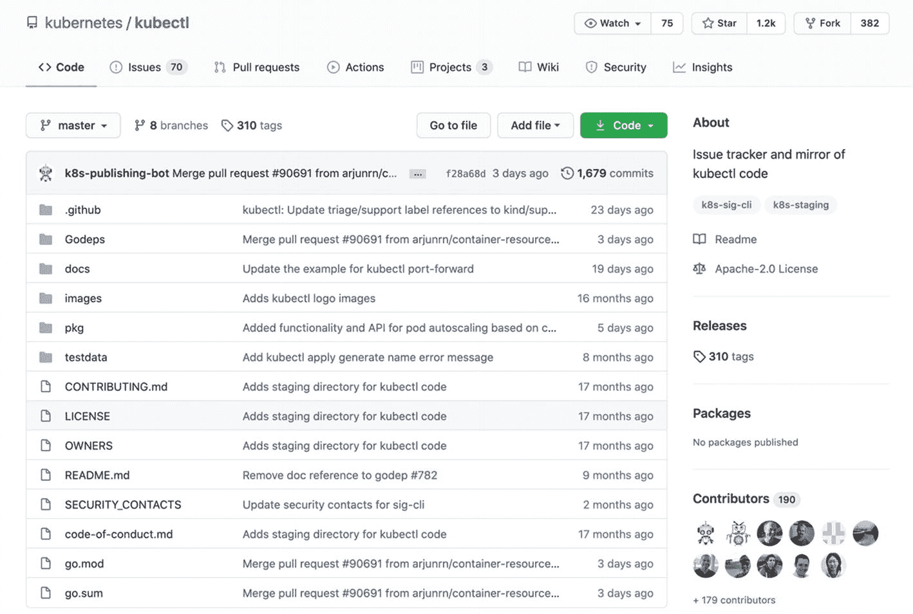
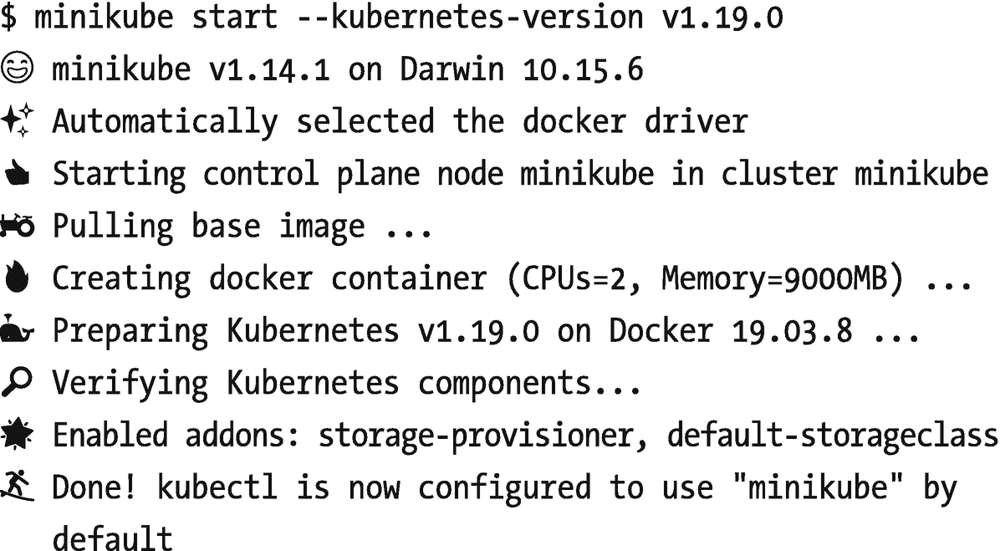
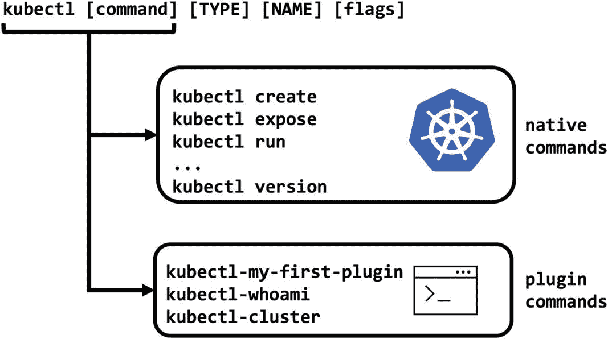
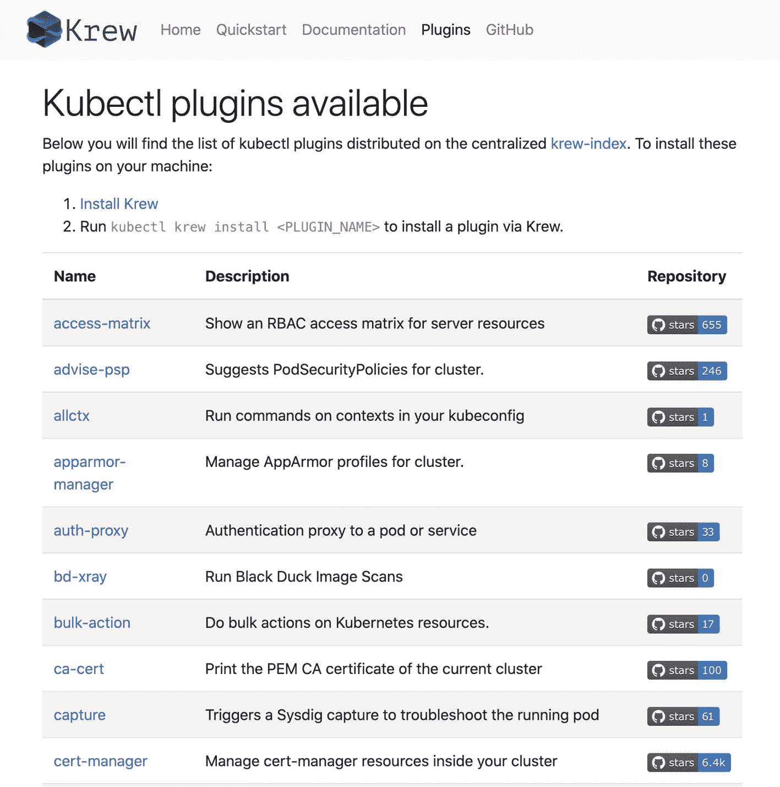
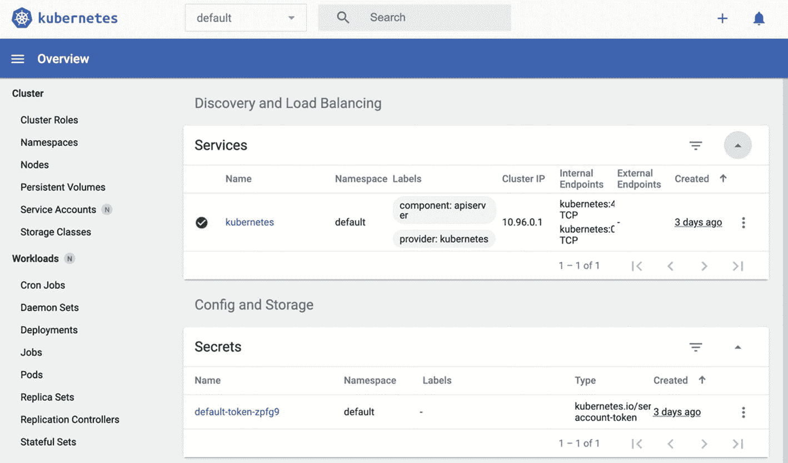

# 2.立方结构外挂程式

> 我们塑造工具，然后工具塑造我们。
> 
> —马歇尔·麦克卢汉
> 
> 媒体学者和评论家

命令行工具是开发人员的瑞士军刀。您可以连接到后端系统，运行复杂的命令，并使用它们自动化您的日常任务。Kubernetes 的官方命令行工具是`kubectl`。作为神话中的盖茨镇之神，`kubectl`是进入星团的入口之神。它允许您通过与 Kubernetes API 通信来创建工作负载、管理资源和检查状态。在这一章中，我们将通过编写插件来扩展`kubectl`。在本章的最后，你将开发并安装新的插件到`kubectl`中，并运行自定义命令。

让我们从将 Kubernetes API 网关安装到您的本地工作站开始。

## kubectl 安装和使用

`kubectl`是与 Kubernetes API 通信的客户端工具。因此，最好有一个与 Kubernetes API 版本完全相同或接近的版本。否则，可能会有不兼容的 API 请求和失败的操作。`kubectl`的源代码是官方 Kubernetes 库的一部分，它的发布版本与 Kubernetes 发布版本共同管理。但是需要查看图 [2-1](#Fig1) 中的`kubernetes/kubectl` <sup>[1](#Fn1)</sup> 库，了解`kubectl`的相关问题。



图 2-1

忽必烈〔t0〕资料档案库

安装`kubectl`相当简单，因为它是一个单二进制应用。您需要首先从您的操作系统的发布库下载二进制文件，如清单 [2-1](#PC1) 所示。

```
# Linux
curl -LO https://storage.googleapis.com/kubernetes-release/release/v1.19.0/bin/linux/amd64/kubectl

# macOS
curl -LO https://storage.googleapis.com/kubernetes-release/release/v1.19.0/bin/darwin/amd64/kubectl

Listing 2-1Downloading kubectl binary

```

然后您需要使二进制文件可执行。

```
chmod +x ./kubectl

Listing 2-2Executable kubectl binary

```

最后，您需要将二进制文件移动到您的`PATH`中。

```
sudo mv ./kubectl /usr/local/bin/kubectl

Listing 2-3Moving kubectl binary

```

您可以使用清单 [2-4](#PC4) 中的以下命令来测试`kubectl`。

```
kubectl version --client
Client Version: version.Info{Major:"1", Minor:"19", GitVersion:"v1.19.0", GitCommit:"e19964183377d0ec2052d1f1fa930c4d7575bd50", GitTreeState:"clean", BuildDate:"2020-08-26T14:30:33Z", GoVersion:"go1.15", Compiler:"gc", Platform:"darwin/amd64"}

Listing 2-4kubectl version check

```

该命令打印客户端版本的`kubectl`，即`v1.19.0`。在下面的练习中，您将创建一个本地 Kubernetes 集群，并继续使用更复杂的`kubectl`命令与集群进行交互。

EXERCISE: STARTING A LOCAL KUBERNETES CLUSTER

虽然 Kubernetes 是一个用于大型云的容器管理系统，但是也可以在本地创建单实例 Kubernetes 集群。`minikube`是推荐的、官方支持的创建单节点集群的方式。它主要用于开发和测试目的。

在本练习中，您将安装`minikube`并启动一个新的 Kubernetes 集群。

1.  根据您的操作系统下载 minikube 的二进制文件:

    ```
    # Linux
    curl -LO https://storage.googleapis.com/minikube/releases/latest/minikube-linux-amd64

    # macOS
    curl -LO https://storage.googleapis.com/minikube/releases/latest/minikube-darwin-amd64

    ```

2.  将二进制文件安装到路径:

    ```
    # Linux
    sudo install minikube-linux-amd64 /usr/local/bin/minikube

    # macOS
    sudo install minikube-darwin-amd64 /usr/local/bin/minikube

    ```

3.  Start a local cluster with minikube:

    

Kubernetes 操作的简单性被打包成一个简单的命令`minikube` start。它下载映像，启动控制面板组件，启用插件，并验证集群组件。在最后一步中，它配置`kubectl`连接到由`minikube`创建的集群。

您有一个 Kubernetes 集群和一个客户端工具。现在，是时候通过部署应用、扩展它们并检查它们的状态来享受 Kubernetes 的乐趣了。

`kubectl`的用法基于清单 [2-5](#PC5) 中的以下语法。

```
kubectl [command] [TYPE] [NAME] [flags]

Listing 2-5kubectl syntax

```

`command`指定要对 Kubernetes API 执行的操作，比如创建、获取、描述或删除。您可以通过运行`kubectl --help`列出所有命令。它列出了按功能和细节分组的所有命令，如清单 [2-6](#PC6) 所示。

```
$ kubectl --help
kubectl controls the Kubernetes cluster manager.

 Find more information at: https://kubernetes.io/docs/reference/kubectl/overview/

Basic Commands (Beginner):
  create        Create a resource from a file or from stdin.
  expose        Take a replication controller, service,
                deployment or pod and expose it as a new Kubernetes Service
  run           Run a particular image on the cluster
  set           Set specific features on objects

Basic Commands (Intermediate):
  explain       Documentation of resources
  get           Display one or many resources
  edit          Edit a resource on the server
  delete        Delete resources by filenames, stdin,
                resources and names, or by resources and label
                selector
...

Listing 2-6kubectl help output

```

`TYPE`指定 Kubernetes API 资源的类型，如 pod、部署或节点。在清单 [2-7](#PC10) 中使用以下命令可以列出 Kubernetes API 上支持的 API 资源。

```
$ kubectl api-resources --output=name
bindings
componentstatuses
configmaps
endpoints
events
limitranges
namespaces
nodes
persistentvolumeclaims
persistentvolumes
pods
podtemplates
replicationcontrollers

Listing 2-7kubectl API resources

```

这是一个很长的列表，目前在 Kubernetes API 中支持 50 多种资源。

`NAME`指定对其执行命令的资源的名称，操作。如果您没有指定一个`NAME`，那么将对该类型中的所有资源执行命令。

`flags`是命令的可选变量，如`--namespace`或`--kubeconfig`。你可以用`kubectl` `options`列出可以传递给任何命令的选项，如清单 [2-8](#PC8) 所示。

```
$ kubectl options
The following options can be passed to any command:
...
--cluster='': The name of the kubeconfig cluster to use
--context='': The name of the kubeconfig context to use
...
--kubeconfig='': Path to the kubeconfig file to use for CLI requests.
-n, --namespace='': If present, the namespace scope for this CLI request
...
--token='': Bearer token for authentication to the API server
...
-v, --v=0: number for the log level verbosity

Listing 2-8kubectl options output

```

您可以运行`kubectl <command> --help`来获得更多的信息，比如关于给定命令的选项、用法和示例。考虑到大量的资源和命令，`kubectl`是一个打包了大量动作的工具。建议通过尝试不同的命令来使用`kubectl`。`kubectl`几乎是集群部署、状态跟踪和故障排除的唯一入口。在下面的练习中，在开发扩展之前，您将使用最常见的`kubectl`命令来习惯它。

EXERCISE: GETTING STARTED WITH kubectl

在本练习中，您将使用`kubectl`与 Kubernetes 集群进行交互。

1.  Start with checking the version of your client tool and the API server:

    ```
    $ kubectl version
    Client Version: version.Info{Major:"1", Minor:"19", GitVersion:"v1.19.0", GitCommit:"e19964183377d0ec2052d1f1fa930c4d7575bd50", GitTreeState:"clean", BuildDate:"2020-08-26T14:30:33Z", GoVersion:"go1.15", Compiler:"gc", Platform:"darwin/amd64"}
    Server Version: version.Info{Major:"1", Minor:"19", GitVersion:"v1.19.0", GitCommit:"e19964183377d0ec2052d1f1fa930c4d7575bd50", GitTreeState:"clean", BuildDate:"2020-08-26T14:23:04Z", GoVersion:"go1.15", Compiler:"gc", Platform:"linux/amd64"}

    ```

    它显示客户端和服务器的版本都是 1.19.0。

2.  Check the nodes available in the cluster:

    ```
    $ kubectl get nodes
    NAME     STATUS ROLES  AGE VERSION
    minikube Ready  master 88s v1.19.0

    ```

    节点也是 Kubernetes 中的一种资源类型，命令是从 Kubernetes API 中检索它们。您将有一个节点，因为您正在运行一个`minikube`集群。

3.  Create a deployment with the following command:

    ```
    $ kubectl create deployment my-first-deployment ​--image=nginx
    deployment.apps/my-first-deployment created

    ```

    该命令使用映像`nginx`创建名为`my-first-deployment`的部署资源类型。

4.  Check the status of the deployment created in Step 3:

    ```
    $ kubectl get deployment my-first-deployment
    NAME                READY  UP-TO-DATE  AVAILABLE AGE
    my-first-deployment  1/1   1           1         16s

    ```

    此命令检索资源及其名称。该部署有一个可用的就绪实例。

5.  Scale the deployment to five instances:

    ```
    $ kubectl scale deployment/my-first-deployment ​--replicas=5
    deployment.apps/my-first-deployment scaled

    ```

    这是一个特殊的命令，用于扩展所提供资源的实例数量。`--replicas`标志指定了请求的复制计数。

6.  Check the pods after scale-up:

    ```
    $ kubectl get pods
    NAME                            READY   STATUS    RESTARTS   AGE
    my-first-deployment-...-26xpn   1/1     Running   0          13s
    my-first-deployment-...-87fcw   1/1     Running   0          13s
    my-first-deployment-...-b7nzv   1/1     Running   0          2m45s
    my-first-deployment-...-kxg2w   1/1     Running   0          13s
    my-first-deployment-...-wmg92   1/1     Running   0          13s

    ```

    正如所料，现在有五个 pod，后四个是在第一个之后创建的。

7.  使用以下命令清理部署:

    ```
    $ kubectl delete deployment my-first-deployment
    deployment.apps "my-first-deployment" deleted

    ```

您的 CLI 环境有了一个新成员，您已经开始发现它的功能。现在，是时候更进一步，扩展它的技能了。在接下来的部分，我们将继续插件设计，为`kubectl`添加自定义命令。

## 立方插件设计

核心命令对于与 Kubernetes API 的交互来说是必不可少的。插件用新的子命令扩展了`kubectl`,用于新的定制特性。`kubectl`扩展实现了二进制插件方法。与二进制插件模式一样，`kubectl`将第三方应用作为扩展来执行。插件二进制文件有三个主要规则:

*   -可执行

*   -用户`PATH`的任何地方

*   -从`kubectl-`开始

这三条规则基于`kubectl`如何发现插件。我们来看看`kubectl`中插件处理的源代码。

```
// Lookup implements PluginHandler
func (h *DefaultPluginHandler) Lookup(filename string) (string, bool) {
      for _, prefix := range h.ValidPrefixes {
            path, err := exec.LookPath(fmt.Sprintf("%s-%s", prefix, filename))
            if err != nil || len(path) == 0 {
      continue
      }
      return path, true
            }
            return "", false
      }

Listing 2-9Plugin handler in kubectl

```

注意默认插件句柄的源代码可以在 [`https://github.com/kubernetes/kubernetes/blob/master/pkg/kubectl/cmd/cmd.go`](https://github.com/kubernetes/kubernetes/blob/master/pkg/kubectl/cmd/cmd.go) 获得。

`DefaultPluginHandler`检查从`ValidPrefix`、`kubectl`开始的路径中的可执行文件。因此，`PATH`环境变量中任何名为`kubectl-my-first-plugin`或`kubectl-whoami`的二进制文件都是合适的`kubectl`插件。插件名被解释为子命令，比如名为`kubectl-whoami`的二进制文件代表`kubectl whoami`命令。因此，`kubectl`会检查本机实现中是否有命令，然后检查插件，如图 [2-2](#Fig2) 所示。



图 2-2

`kubectl`命令处理

我们来看看`kubectl`中的插件是如何执行的。

```
// Execute implements PluginHandler
func (h *DefaultPluginHandler) Execute(executablePath string, cmdArgs, environment []string) error {

    // Windows does not support exec syscall.
    if runtime.GOOS == "windows" {
         cmd := exec.Command(executablePath, cmdArgs...)
         cmd.Stdout = os.Stdout
         cmd.Stderr = os.Stderr
         cmd.Stdin = os.Stdin
         cmd.Env = environment
         err := cmd.Run()
         if err == nil {
              os.Exit(0)
         }
         return err
    }

  // invoke cmd binary relaying the environment and args given
    ..
    return syscall.Exec(executablePath, append([]string{executablePath}, cmdArgs...), environment)
}

Listing 2-10kubectl binary plugin handling

```

注意默认插件句柄的源代码可以在 [`https://github.com/kubernetes/kubernetes/blob/master/pkg/kubectl/cmd/cmd.go`](https://github.com/kubernetes/kubernetes/blob/master/pkg/kubectl/cmd/cmd.go) 获得。

`DefaultPluginHandler`有一个`Execute`函数，输入可执行路径、参数和环境变量。该函数将这些变量传递给第三方二进制文件，也就是插件。在 Windows 中，它将标准输入和输出连接到命令，然后执行它。在 Linux 和 macOS 中，该函数在操作系统级别使用`syscall`,带有参数和环境变量。

现在，是时候通过创建插件向`kubectl`添加一个新的定制命令了。

## 创建您的第一个 kubectl 插件

您可以使用`kubectl` plugin 命令在本地列出可用的插件。

```
$ kubectl plugin list

error: unable to find any kubectl plugins in your PATH

Listing 2-11Installed

plugins

```

`kubectl`没有在本地找到插件。现在，用以下内容创建一个名为`kubectl-whoami`的文件。

```
#!/bin/bash

kubectl config view --template='{{ range .contexts }}{{ if eq .name "'$(kubectl config current-context)'" }}User: {{ printf "%s\n" .context.user }}{{ end }}{{ end }}'

Listing 2-12Plugin code

```

将文件移动到 PATH 环境变量中的一个文件夹，并使其可执行。

```
sudo chmod +x ./kubectl-whoami
sudo mv ./kubectl-whoami /usr/local/bin

Listing 2-13Plugin installation

```

现在，重新运行`kubectl`插件列表命令。

```
$ kubectl plugin list
The following compatible plugins are available:

/usr/local/bin/kubectl-whoami

Listing 2-14Installed plugins

```

说明`kubectl`可以发现插件。让我们测试一下，看看它是如何工作的。

```
$ kubectl whoami
User: minikube

Listing 2-15kubectl whoami plugin

```

运行最后一个命令有两个关键点。第一点是`kubectl whoami`是一个扩展命令，在本地实现中不可用。但是，通过扩展功能，您可以运行自定义子命令。第二点是现在有可能检索信息，干扰`kubectl`的操作。

在下面的练习中，您将创建一个`kubectl`提示符命令，在 bash 提示符下显示当前的 Kubernetes 集群和用户名。

EXERCISE: KUBERNETES BASH PROMPT

处理一个 Kubernetes 集群很容易，但是当它变成日常事务中的几十个集群时就变得很麻烦了。在终端 bash 提示符中了解当前集群和用户有助于避免犯严重错误。我们将在每个带有`(user @ cluster)`信息的命令前显示一个字符串。

1.  Create a file with the name `kubectl-prompt` with the following content:

    ```
    #!/bin/bash

    currentContext=$(kubectl config current-context)
    prompt="(%s @ %s) > "
    template="{{ range .contexts }}{{ if eq .name \"$currentContext\" }}{{ printf \"$prompt\" .context.user .context.cluster}}{{ end }}{{ end }}"
    kubectl config view --template="$template"

    ```

    该脚本检查`kubeconfig`中的所有上下文，并检索集群和用户名字段。

2.  将文件移动到`PATH`环境变量中的文件夹，并使其可执行:

    ```
    sudo chmod +x ./kubectl-prompt
    sudo mv ./kubectl-prompt /usr/local/bin

    ```

3.  使用以下命令测试插件:

    ```
    $ kubectl prompt
    (minikube @ minikube) >

    ```

4.  设置提示环境变量:

    ```
    $ export PS1=$(kubectl prompt)
    (minikube @ minikube) >

    ```

从现在开始，每个终端命令都将提供提示符。哪个集群和用户处于控制中，这将始终在您的视线之内。

插件扩展了`kubectl`并帮助您在与 Kubernetes 集群交互时实现更多。预计在操作集群时会有类似的困难，这导致开发类似的插件。在下一节中，重点将放在`kubectl`的插件库以及如何使用它。

## 插件库:krew

Kubernetes 社区有一个名为`krew`的`kubectl`插件管理器。插件管理器帮助发现、安装和更新开源和社区维护的插件。目前，`krew`上分布着 100 多个插件。因此，在创建一个新的插件库之前，检查一下插件库是值得的。Kubernetes 社区中可能已经有人开发了相同的功能并发布了它。

让我们开始安装`krew`，一个`kubectl`插件本身，并发现一些存储库插件。在终端运行该命令下载`krew`。

```
curl -fsSLO "https://github.com/kubernetes-sigs/krew/releases/latest/download/krew.tar.gz"
tar zxf krew.tar.gz

Listing 2-16Downloading krew

```

现在，根据操作系统安装二进制文件。

```
# Linux
./krew-linux_amd64 install krew
# macOS
./krew-darwin_amd64 install krew

Adding "default" plugin index from https://github.com/kubernetes-sigs/krew-index.git.
Updated the local copy of plugin index.
Installing plugin: krew
Installed plugin: krew
\
 | Use this plugin:
 | kubectl krew
 | Documentation:
 | https://krew.sigs.k8s.io/
 | Caveats:
 | \
 | | krew is now installed! To start using kubectl plugins, you need to add
 | | krew's installation directory to your PATH:
 | |
 | | * macOS/Linux:
 | | - Add the following to your ~/.bashrc or ~/.zshrc:
 | | export PATH="${KREW_ROOT:-$HOME/.krew}/bin:$PATH"
 | | - Restart your shell.
 | |
 | | * Windows: Add %USERPROFILE%\.krew\bin to your PATH environment variable
 | |
 | | To list krew commands and to get help, run:
 | | $ kubectl krew
 | | For a full list of available plugins, run:
 | | $ kubectl krew search
 | |
 | | You can find documentation at
 | | https://krew.sigs.k8s.io/docs/user-guide/quickstart/.
 | /
/

Listing 2-17Downloading krew

```

最后，将 krew 安装目录添加到路径中。

```
export PATH="${KREW_ROOT:-$HOME/.krew}/bin:$PATH"

Listing 2-18Path expansion

```

现在，我们可以通过调用一个`kubectl`插件来测试它。

```
$ kubectl krew
krew is the kubectl plugin manager.
You can invoke krew through kubectl: "kubectl krew [command]..."

Usage:
  kubectl krew [command]

Available Commands:
  help        Help about any command
  index       Manage custom plugin indexes
  info        Show information about an available plugin
  install     Install kubectl plugins
  list        List installed kubectl plugins
  search      Discover kubectl plugins
  uninstall   Uninstall plugins
  update      Update the local copy of the plugin index
  upgrade     Upgrade installed plugins to newer versions
  version     Show krew version and diagnostics

Flags:
  -h, --help      help for krew
  -v, --v Level   number for the log level verbosity

Use "kubectl krew [command] --help" for more information about a command.

Listing 2-19kubectl krew output

```

现在可以搜索、安装和升级由`krew`管理的插件。在`krew`网站上可以获得最新的插件列表，包括名称、描述和 GitHub 流行度，如图 [2-3](#Fig3) 所示。



图 2-3

krew 插件列表

让我们假设您在 Kubernetes 中运行一个 web 应用，它在实例前面有一个服务。要访问和测试应用，您需要到达服务端点。幸运的是，Kubernetes 社区有一个插件可以完成这项任务。`open-svc`是通过本地代理服务器在浏览器中打开指定服务 URL 的`kubectl`插件。你可以通过`krew`安装。

```
$ kubectl krew install open-svc
Updated the local copy of plugin index.
Installing plugin: open-svc
Installed plugin: open-svc
\
 | Use this plugin:
 | kubectl open-svc
 | Documentation:
 | https://github.com/superbrothers/kubectl-open-svc-plugin
/
WARNING: You installed plugin "open-svc" from the krew-index plugin repository.
   These plugins are not audited for security by the Krew maintainers.
   Run them at your own risk.

Listing 2-20Installing open-svc plugin

```

**注意**如果您还没有为您的集群启用 Kubernetes 仪表板，您可以运行`minikube dashboard`来安装它。

现在，让我们使用`kubectl open-svc`插件打开 Kubernetes 仪表板。

```
$ kubectl open-svc kubernetes-dashboard -n kubernetes-dashboard
Starting to serve on 127.0.0.1:8001
Opening service/kubernetes-dashboard in the default browser...

Listing 2-21open-svc plugin in action

```

该命令应在浏览器中打开仪表板，如图 [2-4](#Fig4) 所示。



图 2-4

忽必烈的控制板

只需要几个命令就可以从存储库中安装新插件并开始使用它们。因此，在从头开始创建社区之前，检查社区已经开发了什么是有用的。

## 关键要点

*   `kubectl`是与 Kubernetes API 交互的官方客户端。

*   本机命令对于操作 Kubernetes 集群是必不可少的。

*   通过创建插件，可以用新命令扩展`kubectl`。

*   `kubectl`插件是第三方二进制，由`kubectl`执行。

*   有一个由社区维护的插件库，名为`krew`。

在下一章中，我们将继续 API 流扩展，并学习如何使用认证、授权和准入控制来扩展流。

<aside aria-label="Footnotes" class="FootnoteSection" epub:type="footnotes">Footnotes [1](#Fn1_source)

[T2`https://github.com/kubernetes/kubectl`](https://github.com/kubernetes/kubectl)

 </aside>