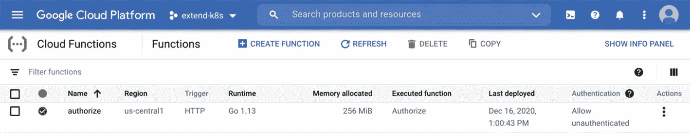

# 三、API 流扩展

> *把鸡蛋放在一个篮子里没关系，只要你能控制那个篮子会发生什么。*
> 
> —埃隆·马斯克
> 
> 商业巨头、工业设计师、工程师

Kubernetes 是安全、可靠、可扩展的云原生应用之家。Kubernetes API 流使得认证请求、决定授权和通过许可步骤成为可能。这个流程使 Kubernetes 成为一个受保护的环境，同时让您定义什么是允许的，什么是不允许的。在这一章中，我们将着重于扩展 Kubernetes API 流，并干预我们的自定义决策。在本章结束时，你将对 API 流有一个自信的看法，并对扩展 webhooks 有实际操作经验。

我们先来总结一下 Kubernetes API 流程及其扩展点。

## 忽必烈 API Flow

您可以使用`kubectl`、客户端库或者直接发送 REST 请求来连接和使用 Kubernetes API。对 API 的每个请求都要经过认证、授权和几个准入控制阶段。这三个阶段都通过 webhooks 提供了扩展点，将在本章中讨论。流程和扩展点可在图 [3-1](#Fig1) 中说明。


图 3-1

忽必烈 API flow

### 证明

身份验证是验证传入 API 请求身份的第一步。Kubernetes 使用客户端证书、不记名令牌、基本身份验证和身份验证插件来审查请求。此外，它能够同时运行多个授权码。普遍的 Kubernetes 装置预计具有以下特点:

*   服务帐户用户的服务帐户令牌

*   至少一种其他方法，如用于用户身份验证的客户端证书、承载令牌或基本 auth

您可以通过添加 webhook 身份验证器来验证不记名令牌，从而扩展身份验证机制。Kubernetes 将向远程服务发送一个 JSON 请求，远程服务充当您的 webhook 服务。在远程服务中，您将验证令牌并决定是否允许请求。

#### 批准

授权是确定用户是否可以读取、写入或更新 API 资源的第二个阶段。Kubernetes 中的授权模块检查请求的用户、组、HTTP 动词、资源和名称空间属性来验证它们。像身份验证一样，可以使用多个授权模块，如基于属性的访问控制(ABAC)、基于角色的访问控制(RBAC)和 webhooks。您可以通过添加新的 webhook 模块来扩展授权。您的定制 webhook 服务接收带有访问检查数据的 HTTP POST 请求。评估完成后，webhook 服务会根据允许与否发回响应。

#### 准入控制

传入请求的第三和最后阶段是准入控制模块。准入控制器是一个代码，用于在身份验证和授权之后、持久化到存储之前拦截到达 Kubernetes API 服务器的请求。与前面的阶段类似，可以依次运行多个准入控制器。然而，早期阶段之间有两个主要区别。第一个问题是，接纳控制器不是简单地应用于读取对象的 GET 请求。第二个区别是这些模块可以修改请求和相关的实体。因此，他们可以验证规范值(如容器图像)或设置默认值(如 CPU 请求)。

各种准入控制器已经打包到`kube-apiserver`中，并根据 Kubernetes 版本启用或禁用。让我们直接从`kube-apiserver`二进制文件中查看控制器列表:

```
$ docker run -it --rm k8s.gcr.io/kube-apiserver:v1.19.0 kube-apiserver --help | grep enable-admission-plugins
...
      --enable-admission-plugins strings admission plugins that should be enabled in addition to default enabled ones (NamespaceLifecycle, LimitRanger, ServiceAccount, TaintNodesByCondition, ...). Comma-delimited list of admission plugins: AlwaysAdmit, AlwaysDeny, AlwaysPullImages, CertificateApproval, CertificateSigning, CertificateSubjectRestriction, DefaultIngressClass, DefaultStorageClass, ...

Listing 3-1kube-apiserver plugin listing

```

Note

输出被连接起来，因为它长得令人难以置信，我们不会一一介绍每个准入插件。如果您需要关于插件的更多信息，您可以查看参考文档。

除了`kube-apiserver`中的默认准入控制器之外，还可以在运行时添加新的控制器作为 webhooks。与身份验证和授权插件不同，当集群运行时，可以添加或删除准入控制器；因此，他们被称为*动态接纳控制器*。

让我们通过开发 webhooks 和配置 Kubernetes 集群来扩展认证流程。

## 身份验证网页挂钩

身份验证 webhooks 通过外部安全逻辑扩展了 Kubernetes API 流。Kubernetes 中的 Webhooks 是对外部系统的 HTTP 回调。当集群中发生特定事件时，Kubernetes API 服务器通过 HTTP POST 向外部服务发送结构化请求。webhook 服务器应该返回一个结构化的响应，以便 Kubernetes API 服务器继续运行。运行认证 webhooks 需要配置两个基本部分: *Kubernetes API 服务器*和 *webhook 服务器*。让我们从 Kubernetes API 服务器开始，让它知道作为 webhook 连接到哪里。

### 服务器 API 配置库

Kubernetes API 服务器运行在控制平面中，需要知道作为 webhook 连接到哪里。通过`kube-apiserver`二进制的标志和配置文件设置配置。因此，集群管理员(很可能是您)应该处理设置。认证 webhook 配置的`kube-apiserver`有两个基本标志:

*   `--authentication-token-webhook-config-file`:描述如何访问远程 webhook 服务的配置文件

*   `--authentication-token-webhook-cache-ttl`:多长时间缓存认证决策，默认为两分钟

Note

还有一个名为`--authentication-token-webhook-version`的版本标志。它决定是否使用`authentication.k8s.io/v1beta1`或`authentication.k8s.io/v1 TokenReview`对象来发送/接收来自 webhook 的信息。默认为`v1beta1`，在本章中使用。

`authentication-token-webhook-config-file`标志没有默认值，需要一个类似于`kubeconfig`的配置文件。

```
apiVersion: v1
kind: Config
clusters:
  - name: remote-auth-service
    cluster:
      certificate-authority: /path/to/ca.pem
      server: https://extend.k8s.io/authenticate
users:
  - name: remote-auth-service-user
    user:
      client-certificate: /path/to/cert.pem
      client-key: /path/to/key.pem
current-context: webhook
contexts:
- context:
    cluster: remote-auth-service
    user: remote-auth-service-user
  name: webhook

Listing 3-2Authentication token webhook config example

```

当承载令牌认证激活时，Kubernetes API 服务器连接到集群中定义的服务器，并在必要时使用`certificate-authority`。此外，API 服务器利用`client-certificate`和`client-key`与 webhook 服务器进行安全通信。现在，让我们继续 webhook 服务器和 Kubernetes API 之间的通信。

#### web 手册服务器

当 API 服务器配置了 webhook 令牌认证时，它将发送一个带有`TokenReview`对象的 JSON 请求。示例`TokenReview`对象可以按如下方式构造。

```
{
  "apiVersion": "authentication.k8s.io/v1beta1",
  "kind": "TokenReview",
  "spec": {
    "token": "0x123...",
  }
}

Listing 3-3TokenReview object

```

webhook 服务器验证传入的令牌并收集用户信息。远程服务器必须填写 TokenReview 对象的状态字段并发回数据。不记名令牌的成功验证将返回以下令牌 Review 作为示例。

```
{
   "apiVersion": "authentication.k8s.io/v1beta1",
   "kind": "TokenReview",
   "status": {
      "authenticated": true,
      "user":{
         "username": "user@k8s.io",
         "uid": "21",
         "groups":[ "system", "qa" ]
      }
   }
}

Listing 3-4TokenReview with a successful status

```

用户名、UID 和组是经过验证的用户的标识符。该信息对于授权阶段决定谁有权访问哪个组是至关重要的。当令牌验证失败时，webhook 服务器应该返回一个类似如下的请求。

```
{
  "apiVersion": "authentication.k8s.io/v1beta1",
  "kind": "TokenReview",
  "status": {
    "authenticated": false,
    "error": "Credentials are not validated"
  }
}

Listing 3-5TokenReview with a failed status

```

当 webhook 服务器拒绝用户时，`kube-apiserver`使用`TokenReview`状态的错误信息。在图 [3-2](#Fig2) 中可以总结出 webhook 和 Kubernetes API 服务器之间的 TokenReview 消息流。


图 3-2

认证消息流

webhook 服务器可以在 Kubernetes 集群的内部或外部。换句话说，您可以在 Kubernetes 集群内部运行一个服务器，并将其用作 webhook 服务器。Kubernetes API 服务器使用 HTTPS 连接到 webhook 服务器；因此，您还需要设置 TLS 证书。或者，您可以将 webhook 服务器设置在集群外部，并使其对外部世界可用。这两个选项的关键点是启动并运行 webhook 服务器，因为身份验证流程依赖于它。在下面的练习中，您将把一个无服务器的 webhook 部署到 Google Cloud，并配置一个本地 minikube 集群，将其用作身份验证端点。

EXERCISE: SERVERLESS AUTHENTICATION WEBHOOK

本练习中的 webhook 服务器将运行在 Google Cloud 上，作为其无服务器平台的一部分。您将开始创建一个云功能，并将其部署到 Google Cloud。然后，您将配置本地 minikube 集群，以使用无服务器功能的地址作为身份验证 webhook。


图 3-4

创建功能


图 3-3

GCP 云函数

1.  在如图 [3-4](#Fig4) 所示的“创建函数”视图中，填写 name 字段，选择“*允许未授权调用*，然后点击**下一步**。

1.  打开[谷歌云控制台](https://console.cloud.google.com/)，前往*计算* ➤ *云功能*。在功能列表视图中点击**创建功能**，如图 [3-3](#Fig3) 所示。

记下触发器 URL，因为您将在步骤 5 中将其用作 SERVERLESS_ENDPOINT 环境变量。


图 3-5

功能的部署

1.  In the “Code” view, select **Go** as runtime and fill “Entry Point” field with **Authenticate**. Authenticate is the name of the function that Google Cloud will call when the serverless endpoint is reached. Change the contents of the `function.go` with the following content:

    ```
    package authenticate

    import (
          "encoding/json"
          "errors"
          "log"
          "net/http"
          "strings"

          authentication "k8s.io/api/authentication/v1beta1"
    )

    func Authenticate(w http.ResponseWriter, r *http.Request) {

          decoder := json.NewDecoder(r.Body)
          var tr authentication.TokenReview
          err := decoder.Decode(&tr)
          if err != nil {
                handleError(w, err)
                return
          }

          user, err := logon(tr.Spec.Token)
          if err != nil {
                handleError(w, err)
                return
          }

          log.Printf("[Success] login as %s", user.username)

          w.WriteHeader(http.StatusOK)
          trs := authentication.TokenReviewStatus{
                Authenticated: true,
                User: authentication.UserInfo{
                      Username: user.username,
                      Groups:   []string{user.group},
                },
          }
          tr.Status = trs
          json.NewEncoder(w).Encode(tr)
    }

    func handleError(w http.ResponseWriter, err error) {

          log.Println("[Error]", err.Error())

          tr := new(authentication.TokenReview)
          trs := authentication.TokenReviewStatus{
                Authenticated: false,
                Error: err.Error(),
          }
          tr.Status = trs

          w.WriteHeader(http.StatusUnauthorized)
          json.NewEncoder(w).Encode(tr)

    }

    func logon(token string) (*User, error) {
          data := strings.Split(token, ";")
          if len(data) < 3 {
                return nil, errors.New("no token data")
          }

          for _, u := range allowed {
                if u.group == data[0] && u.username == data[1] && u.password == data[2] {
                      return &u, nil
                }
          }

          return nil, errors.New("no user found")
    }

    type User struct {
          username string
          password string
          group    string
    }

    var allowed = []User{
          {
                username: "minikube-user",
                group:    "system:masters",
                password: "mysecret",
          },
    }

    ```

    这个文件有一个`Authenticate` HTTP 端点来解析`TokenReview`数据，登录用户，并将其发送回来。它使用`logon`助手函数来搜索允许的用户。被允许的用户只有一个:`minikube-user`，其有效令牌为`system:masters;minikube-user;mysecret`。

    Change the contents of `go.mod` as follows:

    ```
    module extend.k8s.io/authenticate

    go 1.14

    require k8s.io/api v0.19.0

    ```

    在`function.go`中，我们使用的是 Kubernetes Go 客户端库；因此，我们将其列为`k8s.io/api`，版本`v0.19.0`的需求。

    在图 [3-5](#Fig5) 中点击页面底部的**部署**。

`Note:`为了构建和部署该功能，如果您之前没有这样做，您需要在[云控制台 API 库](https://console.cloud.google.com/apis/library)视图中启用云构建 API。


图 3-7

功能日志


图 3-6

成功部署

1.  Create a local webhook config file `serverless-authn.yaml` with the following content:

    ```
    apiVersion: v1
    kind: Config
    clusters:
      - name: serverless-authn
        cluster:
          server: SERVERLESS_ENDPOINT
    users:
      - name: authn-user
    current-context: webhook
    contexts:
    - context:
        cluster: serverless-authn
        user: authn-user
      name: webhook

    ```

    不要忘记用步骤 2 中的 URL 更改`SERVERLESS_ENDPOINT`。

2.  将文件移动到 minikube 文件:

    ```
    mkdir -p $HOME/.minikube/files/var/lib/minikube/certs
    mv serverless-authn.yaml $HOME/.minikube/files/var/lib/minikube/certs/serverless-authn.yaml

    ```

3.  使用额外的标志启动 minikube 集群:

    

4.  创建一个新的空用户并在当前上下文中使用:

    ```
    $ kubectl config set-credentials auth-test
    User "auth-test" set.
    $ kubectl config set-context --current --user=auth-test
    Context "minikube" modified.

    ```

5.  Run `kubectl` with the valid token and check the result:

    ```
    $ kubectl get nodes --token="system:masters;minikube-user;mysecret"
    NAME       STATUS   ROLES    AGE    VERSION
    minikube   Ready    master   116s   v1.19.2

    ```

    正如预期的那样，Kubernetes API 发送列出节点的输出。

6.  使用随机令牌运行`kubectl`并检查结果:

    ```
    $ kubectl get nodes --token="xyz"
    error: You must be logged in to the server (Unauthorized)

    ```

7.  检查 Google Cloud 中的无服务器功能日志，并查看 webhook 的运行情况，如图 [3-7](#Fig7) 所示。

1.  在如图 [3-6](#Fig6) 所示的功能列表视图中等待，直到旁边出现绿色复选标记。

日志显示成功的(第一次)和失败的(第二次)登录活动。

在本练习中，您已经公开了一个公共函数，并在 Kubernetes 集群中使用了它。在您的生产设置中，建议使用受保护的功能。

在下一节中，我们将使用定制的授权模块来扩展 Kubernetes API 流。我们将学习 webhook 和 Kubernetes API 服务器需求，然后实现自定义决策逻辑来决定谁可以访问或修改集群中的资源。

## 授权网页挂钩

授权 webhooks 扩展了 Kubernetes API 的访问控制，以实现定制策略。当请求通过身份验证阶段时，授权模块按顺序评估属性。如果任何授权模块批准或拒绝请求，结果将立即返回。如果请求被批准，API 请求继续流程，并进入下一个阶段。与身份验证阶段一样，运行授权 webhooks 有两种基本配置:Kubernetes API 服务器和 webhook 服务器。

### 服务器 API 配置库

`kube-apiserver`具有定义授权模式和 webhook 配置的标志。授权模式通过`--authorization-mode`标志设置，默认值为`AlwaysAllow`。换句话说，默认情况下，Kubernetes API 允许所有经过身份验证的请求。但是，在典型的 Kubernetes 设置中，启用了以下授权模式:RBAC 和节点。因此，要添加 webhook 授权，您需要通过添加 Webhook 来更新标志值。配置授权 webhook 操作有三个基本标志:

*   `--authorization-webhook-config-file`:描述如何访问和查询远程服务的配置文件。该标志类似于认证中的标志，并且需要与`kubeconfig`相同的配置。确保授权 webhook 服务器地址和证书数据(如有必要)正确无误。

*   `--authorization-webhook-cache-authorized-ttl`:缓存已验证请求的持续时间；默认值为五分钟。

*   `--authorization-webhook-cache-unauthorized-ttl`:缓存无效请求的持续时间；默认值为 30 秒。

Note

还有一个名为`--authorization-webhook-version`的版本标志。它设置了`authorization.k8s.io SubjectAccessReview`的应用编程接口版本，以发送到网络钩子并从其获得期望。缺省值为`v1beta1`并在本章中使用。

#### web 手册服务器

Kubernetes API 服务器通过发送一个`SubjectAccessReview`对象来描述要检查的动作，从而调用 webhook 服务器。发送的 JSON 对象包含关于资源、用户和请求属性的信息。用户`ece`获取名称空间`default`中的 pod 的示例`SubjectAccessReview`具有以下结构。

```
{
  "apiVersion": "authorization.k8s.io/v1beta1",
  "kind": "SubjectAccessReview",
  "spec": {
    "resourceAttributes": {
      "namespace": "default",
      "verb": "get",
      "group": "",
      "resource": "pods"
    },
    "user": "ece"
  }
}

Listing 3-6SubjectAccessReview for pod listing

```

当 Kubernetes API 中的非资源路径被调用时，比如`/version`或`/metrics`,`nonResourceAttributes`字段被发送到 webhook 服务器。例如，当用户`nursin`调用`version`端点时，Kubernetes API 服务器将发布下面的`SubjectAccessReview`。

```
{
  "apiVersion": "authorization.k8s.io/v1beta1",
  "kind": "SubjectAccessReview",
  "spec": {
    "nonResourceAttributes": {
      "path": "/version",
      "verb": "get"
    },
    "user": "nursin"
  }
}

Listing 3-7SubjectAccessReview for version information

```

webhook 服务器通过填充`status`字段来响应`SubjectAccessReview`对象。如果 webhook 服务器接受请求，它可以很容易地将以下数据发送回 Kubernetes API 服务器。

```
{
  "apiVersion": "authorization.k8s.io/v1beta1",
  "kind": "SubjectAccessReview",
  "status": {
    "allowed": true
  }
}

Listing 3-8Accepted response

```

另一方面，在 webhook 服务器中有两种方法可以拒绝请求。第一种方法只表示请求不是如下的`allowed`。

```
{
  "apiVersion": "authorization.k8s.io/v1beta1",
  "kind": "SubjectAccessReview",
  "status": {
    "allowed": false,
    "reason": "user has no access"
  }
}

Listing 3-9Rejected response

```

当只有`allowed`字段被设置为假时，也检查其他授权模块是否允许它。如果没有一个授权模块允许该请求，则 API 服务器会拒绝该请求。第二种方法是立即拒绝任何请求，绕过剩余的授权模块。响应数据与前一个相似，只是增加了一个简单的内容。

```
 {
  "apiVersion": "authorization.k8s.io/v1beta1",
  "kind": "SubjectAccessReview",
  "status": {
    "allowed": false,
    "denied": true,
    "reason": "user has no access"
  }
}

Listing 3-10Rejected and denied response

```

Kubernetes API 和 authorization webhook 服务器之间的消息流可以总结在图 [3-8](#Fig8) 中。


图 3-8

授权消息流

尽管消息流看起来很简单，但是您将在 webhook 服务器中实现的逻辑是没有限制的。您可以设计一个授权系统来限制特定组的用户执行特定的操作。让我们假设你有两个团队，*开发*和*生产*，以及一个用于发布的*持续部署(CD)* 系统。可以创建一个授权 webhook，让开发团队只访问*阅读框*。类似地，您可以限制生产团队*更新部署*，并且只允许技术用户从 CD 到*创建新的部署*。考虑到团队成员是在任何其他外部系统(如 LDAP 或 GitHub)中定义的，webhook 服务器将拥有相关的逻辑并扩展 Kubernetes 授权。

在下面的练习中，您将创建一个无服务器授权 webhook，使 Kubernetes 中的名称空间成为只读的。用户只能读取、列出或查看资源，但不能在受保护的命名空间中更新、创建或删除资源。

EXERCISE: AUTHORIZATION WEBHOOK FOR READ-ONLY NAMESPACE

在本练习中，您将在 Google Cloud Functions 中开发一个无服务器 webhook。webhook 将做出授权决定，将名称空间`protected`设为只读。然后，您将启动一个本地 minikube 集群，并将其配置为使用无服务器端点作为授权 webhook。


图 3-10

创建功能


图 3-9

GCP 云函数

1.  在图 [3-10](#Fig10) 的“创建函数”视图中，填写名称字段并选择“允许未认证调用”,然后点击下一步。

1.  打开[谷歌云控制台](https://console.cloud.google.com/)，在主菜单中点击*计算* ➤ *云功能*。在图 [3-9](#Fig9) 的函数列表视图中点击“创建函数”。

在“代码”视图中，选择 Go as runtime，并用`Authorize`填充“入口点”字段。当到达无服务器端点时，它是我们的部署中要调用的函数。用以下内容更改`function.go`的内容:

```
package authorize

import (
      "encoding/json"
      "fmt"
      "log"
      "net/http"

      authorization "k8s.io/api/authorization/v1beta1"
)

const NAMESPACE = "protected"

func Authorize(w http.ResponseWriter, r *http.Request) {

      decoder := json.NewDecoder(r.Body)
      var sar authorization.SubjectAccessReview
      err := decoder.Decode(&sar)
      if err != nil {
            log.Println("[Error]", err.Error())

            sar := new(authorization.SubjectAccessReview)
            status := authorization.SubjectAccessReviewStatus{
                  Allowed: false,
                  Reason:  err.Error(),
            }
            sar.Status = status

            w.WriteHeader(http.StatusUnauthorized)
            json.NewEncoder(w).Encode(sar)
            return
      }

      if sar.Spec.ResourceAttributes != nil {
            v := sar.Spec.ResourceAttributes.Verb
            n := sar.Spec.ResourceAttributes.Namespace

            if n == NAMESPACE && (v == "create" || v == "delete" || v == "update") {

                  log.Printf("[Not Allowed] %s in namespace %s", sar.Spec.ResourceAttributes.Verb, NAMESPACE)

                  response := new(authorization.SubjectAccessReview)
                  status := authorization.SubjectAccessReviewStatus{
                        Allowed: false,
                        Denied:  true,
                        Reason:  fmt.Sprintf("%s is not allowed in the namespace: %s", sar.Spec.ResourceAttributes.Verb, NAMESPACE),
                  }
                  response.Status = status
                  json.NewEncoder(w).Encode(response)
                  return
            }
      }

      response := new(authorization.SubjectAccessReview)
      status := authorization.SubjectAccessReviewStatus{
            Allowed: true,
      }
      response.Status = status
      json.NewEncoder(w).Encode(response)
}

```

在这个文件中，只有一个名为`Authorize`的函数。它是一个 HTTP 处理程序，用于解析传入的`SubjectAccessReview`数据。如果传入的数据有`ResourceAttributes`，它将检查名称空间是否为`protected`，动词是否为`create`、`delete`或`update`。当发现这样的请求时，它通过发送`Allowed: false`和`Denied: true`来拒绝。对于所有其他请求，它允许请求并让其他授权模块决定。

将`go.mod`的内容更改如下:

```
module extend.k8s.io/authorize

go 1.13

require k8s.io/api v0.19.0

```

在`function.go`中，我们使用的是 Kubernetes Go 客户端库；因此，我们将其列为对`k8s.io/api`，版本`v0.19.0`的依赖。

在图 [3-11](#Fig11) 中点击页面底部的*部署*。


图 3-11

功能的部署



图 3-12

成功部署

1.  在图 [3-12](#Fig12) 中的功能列表视图中等待，直到旁边出现绿色复选标记。

用以下内容创建一个本地 webhook 配置文件`serverless-authz.yaml`:

```
apiVersion: v1
kind: Config
clusters:
  - name: serverless-authz
    cluster:
      server: SERVERLESS_ENDPOINT
users:
  - name: authz-user
current-context: webhook
contexts:
- context:
    cluster: serverless-authz
    user: authz-user
  name: webhook

```

不要忘记用步骤 2 中的 URL 更改`SERVERLESS_ENDPOINT`。


图 3-13

功能日志

1.  将文件移动到 minikube 文件:

    ```
    $ mkdir -p $HOME/.minikube/files/var/lib/minikube/certs
    $ mv serverless-authz.yaml $HOME/.minikube/files/var/lib/minikube/certs/serverless-authz.yaml

    ```

2.  使用额外的标志启动 minikube 集群:

    

    该命令使用两个额外的配置参数启动本地 minikube 集群。第一个配置将 webhook 添加到授权模式中，第二个配置指出了第 3 步中配置文件的位置。

3.  Check what the user is allowed to do with the following commands:

    ```
    $ kubectl auth can-i create deployments --as developer
    yes

    ```

    It shows that it is possible to create deployments in the default namespace.

    ```
    $ kubectl auth can-i create deployments --as developer --namespace protected

    no - create is not allowed the namespace protected

    $ kubectl auth can-i delete secrets --as developer --namespace protected

    no - delete is not allowed in the namespace protected

    ```

    However, it is not allowed to create deployments or delete secrets in the `protected` namespace. It ensures that the resources in the namespace stay as it is in a read-only mode.

    ```
    $ kubectl auth can-i list pods --as developer --namespace protected
    yes

    ```

    另一方面，可以在`protected`名称空间中列出 pod，这是我们在只读模式下想要的。

4.  检查 Google Cloud 中的无服务器功能日志，并查看 webhook 的运行情况，如图 [3-13](#Fig13) 所示。

日志表明授权 webhook 不允许创建和删除请求。

在下一节中，我们将扩展 Kubernetes API 流的最后一个阶段:准入控制器。准入控制器是在将请求保存到`etcd`存储器之前检查或改变请求的最后步骤。我们将学习准入 webhook 的设置以及如何动态定义来扩展和实现定制需求。

## 动态准入控制器

准入控制器是 Kubernetes API 流中对象持久化之前的最后一个阶段。这些控制器拦截验证或改变资源的请求。已经有各种准入控制器打包成`kube-apiserver`二进制，增加了两个扩展点:`MutatingAdmissionWebhook`和`ValidatingAdmissionWebhook`。这些扩展点执行变异和验证准入控制 webhooks，这是在 Kubernetes API 中动态定义的。与身份验证和授权 webhooks 不同，您可以在集群启动和运行时创建、更新或删除准入控制器。因此，它们主要包含在“动态接纳控制器”一节中

准入网络挂钩对于 Kubernetes 控制平面及其操作至关重要。变异准入 webhooks 允许设置复杂的默认值或注入字段，而验证 webhooks 对于控制部署到集群中的内容至关重要。首先，变异的 web 钩子被串行调用，因为每个钩子都可以修改资源对象。然后，并行调用所有验证 webhooks 如果它们中的任何一个拒绝了请求，那么它就会被 API 服务器拒绝。

有两个方面需要配置和设置来扩展接纳控制机制:webhook 配置资源和 webhook 服务器。让我们首先关注 webhook 配置资源，让 Kubernetes API 知道在哪里以及何时调用 webhooks。

### Webhook 配置资源

准入控制器的动态配置由`ValidatingWebhookConfiguration`和`MutatingWebhookConfiguration` API 资源处理。可以为 pod 创建定义一个验证 webhook 的示例，如下所示。

```
apiVersion: admissionregistration.k8s.io/v1
kind: ValidatingWebhookConfiguration
metadata:
  name: "validation.extend-k8s.io"
webhooks:
- name: "validation.extend-k8s.io"
  rules:
  - apiGroups:   [""]
    apiVersions: ["v1"]
    operations:  ["CREATE"]
    resources:   ["pods"]
    scope:       "Namespaced"
  clientConfig:
    url: "https://extend-k8s.io/validate"
  admissionReviewVersions: ["v1", "v1beta1"]
  sideEffects: None

Listing 3-11Webhook configuration example

```

API 资源有两个关键部分:`rules`和`clientConfig`。当 Kubernetes API 服务器收到一个符合规则的请求时，就会向在`clientConfig`中定义的 webhook 发出一个 HTTP 请求。例如，使用清单 [3-11](#PC27) 中的定义，当创建一个新的 pod 时，API 服务器将调用 [`https://extend-k8s.io/validate`](https://extend-k8s.io/validate) 。

变异 webhook 配置是用具有类似结构的`MutatingWebhookConfiguration`资源完成的。创建机密时调用的示例 webhook 可以定义如下。

```
apiVersion: admissionregistration.k8s.io/v1
kind: MutatingWebhookConfiguration
metadata:
  name: "mutation.extend-k8s.io"
webhooks:
- name: "mutation.extend-k8s.io"
  rules:
  - apiGroups:   [""]
    apiVersions: ["v1"]
    operations:  ["CREATE"]
    resources:   ["secrets"]
    scope:       "Namespaced"
  clientConfig:
    service:
      namespace: "extension"
      name: "mutation-service"
    caBundle: "Ci0tLS0tQk...tLS0K"
  admissionReviewVersions: ["v1", "v1beta1"]
  sideEffects: None

Listing 3-12Webhook configuration example

```

当接收到一个秘密创建请求时，Kubernetes API 服务器将到达在`extension`名称空间中运行的`mutation-service`的 443 端口。它将使用`caBundle`来验证 webhook 服务器的 TLS 证书。在下一节中，我们将介绍准入控制器 webhooks 之间的消息流。

#### web 手册服务器

Kubernetes API 服务器发送一个带有`AdmissionReview`对象的 POST 请求来定义请求及其属性。例如，当创建一个新的 pod 时，webhook 服务器将收到一个类似如下的项目。

```
{
  "apiVersion": "admission.k8s.io/v1",
  "kind": "AdmissionReview",
  "request": {

    "uid": "4b8bd269-bfc7-4dd5-8022-7ca57a334fa3",

    "name": "example-app",
    "namespace": "default",

    "operation": "CREATE",

    "kind": {"group":"","version":"v1","kind":"Pod"},
    "requestKind":  {"group":"","version":"v1","kind":"Pod"},

    "resource": {"group":"","version":"v1","resource":"pods"},
    "requestResource": {"group":"","version":"v1","resource":"pods"},

    "object": {"apiVersion":"v1","kind":"Pod",...},

    "userInfo": {
      "username": "minikube",
      "groups": ["system:authenticated"]
    },

    "options": {"apiVersion":"meta.k8s.io/v1","kind":"CreateOptions",...},
    "dryRun": false
  }
}

Listing 3-13AdmissionReview example

```

准入审查对象被合理地打包，因为它传输与请求和相关项目相关的所有信息。例如，在清单 [3-13](#PC29) 中的`request.object`字段中有一个完整的 pod 定义。Webhook 服务器需要再次发送一个加载了响应字段的`AdmissionReview`对象。最小接受响应可以按如下方式构建。

```
{
  "apiVersion": "admission.k8s.io/v1",
  "kind": "AdmissionReview",
  "response": {
    "uid": "<value from request.uid>",
    "allowed": true
  }
}

Listing 3-14Accepted admission review response

```

类似地，可以用以下数据发送一个简单的拒绝。

```
{
  "apiVersion": "admission.k8s.io/v1",
  "kind": "AdmissionReview",
  "response": {
    "uid": "<value from request.uid>",
    "allowed": false
  }
}

Listing 3-15Rejected admission review response

```

变异的 webhooks 也可以修改请求中的对象。因此，webhook 服务器应该在`AdmissionReview`响应中发送更改。Kubernetes 支持`JSONPatch`种改变资源领域的操作。例如，将一个部署的副本更改为 5 的`JSONPatch`可以如下构建:`[{"op": "replace", "path": "/spec/replicas", "value": 5}]`。当补丁在`AdmissionReview`内部传输时，将使用`base64`进行如下编码。

```
{
  "apiVersion": "admission.k8s.io/v1",
  "kind": "AdmissionReview",
  "response": {
    "uid": "<value from request.uid>",
    "allowed": true,
    "patchType": "JSONPatch",
    "patch": "W3sib3AiOiAicmVwbGFjZSIsICJwYXRoIjogIi9zcGVjL3JlcGxpY2FzIiwgInZhbHVlIjogNX1d"
  }
}

Listing 3-16Accepted admission review response with patch

```

当 Kubernetes API 获得带有补丁的响应时，它将在资源上应用更改，并继续处理下一个准入控制器。webhook 服务器和 Kubernetes API 之间的消息摘要可以总结在图 [3-14](#Fig14) 中。


图 3-14

准入 webhook 消息流

变异和验证 webhooks 都是 API 流中的关键组件，因为它们可以通过编程方式改变资源，接受或拒绝请求。当疏忽或设计不当使用时，它会很快造成混乱。对于可靠的准入控制设置，有三个最佳实践可以遵循:

*   **幂等**:变异的 webhooks 应该是幂等的；换句话说，可以多次调用 admission webhook，而不会改变第一次运行后的结果。

*   **可用性**:准入 webhooks 作为 Kubernetes API 操作的一部分被调用。因此，它们应该像所有其他 webhook 服务器一样，尽快评估并返回响应，以最小化总延迟。

*   **死锁**:如果 webhook 端点在集群内部运行，它们会干扰集群的资源，比如 pod、secrets 或 volumes。因此，建议不要在 webhook 的名称空间上运行准入控制器。

在以下练习中，您将首先创建一个动态验证准入 webhook 来检查和验证容器图像。在第二个练习中，您将把环境变量注入到在特定名称空间中运行的带有可变许可 webhooks 的 pod 中。

EXERCISE: VALIDATING WEBHOOK FOR CONTAINER IMAGE CHECK

在本练习中，您将在 Google Cloud Functions 中开发一个无服务器 webhook。webhook 将通过评估容器图像来验证 pod 创建请求。它将只允许包含 nginx 的容器图像，而拒绝所有其他容器。然后，您将启动一个 GKE 集群，并将集群的名称空间配置为使用验证 webhook。


图 3-15

GCP 云壳

1.  创建一个名称空间，并将其标记为:

    ```
    $ kubectl create namespace nginx-only
    namespace/nginx-only created
    $ kubectl label namespace nginx-only nginx=true
    namespace/nginx-only labeled

    ```

2.  Create a file with the name `validating-webhook.yaml` with the following content:

    ```
    apiVersion: admissionregistration.k8s.io/v1
    kind: ValidatingWebhookConfiguration
    metadata:
      name: nginx.validate.extend.k8s
    webhooks:
    - name: nginx.validate.extend.k8s
      namespaceSelector:
          matchLabels:
            nginx: "true"
      rules:
      - apiGroups:   [""]
        apiVersions: ["v1"]
        operations:  ["CREATE"]
        resources:   ["pods"]
        scope:       "Namespaced"
      clientConfig:
        url: https://us-central1-extend-k8s.cloudfunctions.net/validate
      admissionReviewVersions: ["v1", "v1beta1"]
      sideEffects: None
      timeoutSeconds: 10

    ```

    该文件将创建一个验证 webhook，当在标有`nginx=true`的名称空间中创建新的 pod 时，将调用该 web hook。不要忘记将`url`更改为步骤 3 中复制的那个。

    Deploy the validating webhook conifguration with the following code:

    ```
    $ kubectl apply -f validating-webhook.yaml
    validatingwebhookconfiguration.admissionregistration.k8s.io/nginx.validate.extend.k8s created

    ```

3.  Create pod with `nginx` image in the `nginx-only` namespace:

    ```
    $ kubectl run --generator=run-pod/v1 nginx --image=nginx --namespace=nginx-only
    pod/nginx created

    ```

    由于许可 webhook 只允许运行`nginx`图像，因此创建了 pod。

4.  Create a pod with `busybox` image in the `nginx-only` namespace:

    ```
    $ kubectl run --generator=run-pod/v1 busybox --image=busybox --namespace=nginx-only
    Error from server: admission webhook "nginx.validate.extend.k8s" denied the request without explanation

    ```

    许可 webhook 拒绝了指定名称空间中的图像名称`busybox`。它显示了 webhook 服务器和 Kubernetes API 服务器都被正确地配置为扩展验证准入控制器。

5.  删除云功能和 Kubernetes 集群，避免额外的云费用:

    ```
    $ gcloud container clusters delete test-validation --region=us-central1
    The following clusters will be deleted.
     - [test-validation] in [us-central1]
    Do you want to continue (Y/n)?  Y
    Deleting cluster test-validation...done.

    $ gcloud functions delete validate
    Resource
    [projects/extend-k8s/locations/us-central1/functions/validate] will be deleted.
    Do you want to continue (Y/n)?  Y
    Waiting for operation to finish...done.
    Deleted

    ```

1.  Create a folder named `validation` and change the directory into it:

    ```
    $ mkdir validation
    $ cd validation

    ```

    Create a file named `function.go` in the terminal or open the editor inside Google Cloud Console. The file should have the following content:

    ```
    package validate

    import (
          "encoding/json"
          "log"
          "net/http"
          "regexp"

          admission "k8s.io/api/admission/v1"
          corev1 "k8s.io/api/core/v1"
          metav1 "k8s.io/apimachinery/pkg/apis/meta/v1"
    )

    func Validation(w http.ResponseWriter, r *http.Request) {

          ar := new(admission.AdmissionReview)
          err := json.NewDecoder(r.Body).Decode(ar)
          if err != nil {
                handleError(w, nil, err)
                return
          }

          response := &admission.AdmissionResponse{
                UID:     ar.Request.UID,
                Allowed: true,
          }

          pod := &corev1.Pod{}
          if err := json.Unmarshal(ar.Request.Object.Raw, pod); err != nil {
                handleError(w, ar, err)
                return
          }

          re := regexp.MustCompile(`(?m)(nginx|nginx:\S+)`)

          for _, c := range pod.Spec.Containers {

                if !re.MatchString(c.Image) {
                      response.Allowed = false
                      break
                }
          }

          responseAR := &admission.AdmissionReview{
                TypeMeta: metav1.TypeMeta{
                      Kind:       "AdmissionReview",
                      APIVersion: "admission.k8s.io/v1",
                },
                Response: response,
          }

          json.NewEncoder(w).Encode(responseAR)
    }

    func handleError(w http.ResponseWriter, ar *admission.AdmissionReview, err error) {

          if err != nil {
                log.Println("[Error]", err.Error())
          }

          response := &admission.AdmissionResponse{
                Allowed: false,
          }
          if ar != nil {
                response.UID = ar.Request.UID
          }

          ar.Response = response
          json.NewEncoder(w).Encode(ar)
    }

    ```

    该文件有一个名为`Validation`的 HTTP 处理程序来解析传入的`AdmissionReview`对象并检查所有容器的图像。当它发现一个容器图像不符合`nginx`时，它将直接拒绝审查并发送响应。否则，它将通过发送`Allowed: true`来接受。

    Create another file named `go.mod` with the following content:

    ```
    module extend.k8s.io/validate

    go 1.13

    require (
      k8s.io/api v0.19.0
      k8s.io/apimachinery v0.19.0
    )

    ```

    在`function.go`中，我们使用的是 Kubernetes Go 客户端库；因此，我们将其列为与`k8s.io/api`和`k8s.io/apimachinery`，版本`v0.19.0`的依赖关系。

2.  Deploy the function with the following command:

    ```
    $ gcloud functions deploy validate --allow-unauthenticated --entry-point=Validation --trigger-http --runtime=go113
    ..
    entryPoint: Validation
    httpsTrigger:
      url: https://us-central1-extend-k8s.cloudfunctions.net/validate
    ...
    runtime: go113
    ...
    status: ACTIVE
    timeout: 60s
    ..
    versionId: '1'

    ```

    复制在以下步骤中使用的`httpsTrigger` URL。

3.  Create a Kubernetes cluster with the following command:

    ```
    $ gcloud container clusters create test-validation --num-nodes=1 --region=us-central1

    Creating cluster test-validation in us-central1...
    Cluster is being health-checked (master is healthy)...
    done.
    kubeconfig entry generated for test-validation.

    NAME             LOCATION     MASTER_VERSION    MASTER_IP     MACHINE_TYPE   NODE_VERSION      NUM_NODES  STATUS
    test-validation  us-central1  1.16.15-gke.4300  34.69.30.171  n1-standard-1  1.16.15-gke.4300  3          RUNNING

    ```

    注意为了创建一个 Kubernetes 集群，您需要在[云控制台 API 库](https://console.cloud.google.com/apis/library)视图中启用 Kubernetes 引擎 API，如果您之前没有这样做的话。

1.  打开[谷歌云控制台](https://console.cloud.google.com/)，点击导航栏中的激活云壳。它应该在你的浏览器中加载一个终端来运行如图 [3-15](#Fig15) 所示的命令。

EXERCISE: MUTATING WEBHOOK FOR ENVIRONMENT VARIABLE INJECTION

在本练习中，您将在 Google Cloud Functions 中开发一个无服务器 webhook。在创建新的 pod 时，webhook 将改变传入的请求。它将为在名为`debug=true`的名称空间中创建的 pod 注入一个值为`true`的环境变量`DEBUG`。此外，您将启动并配置一个 GKE 集群，以查看 webhook 的运行情况。


图 3-16

GCP 云壳

1.  Create a folder named `mutation` and change the directory into it:

    ```
    $ mkdir mutation
    $ cd mutation

    ```

    Create a file named `function.go` in the terminal with the following content:

    ```
    package mutator

    import (
          "encoding/json"
          "log"
          "net/http"

          admission "k8s.io/api/admission/v1"
          corev1 "k8s.io/api/core/v1"
          metav1 "k8s.io/apimachinery/pkg/apis/meta/v1"
    )

    func Mutation(w http.ResponseWriter, r *http.Request) {

          ar := new(admission.AdmissionReview)
          err := json.NewDecoder(r.Body).Decode(ar)
          if err != nil {
                handleError(w, nil, err)
                return
          }
          pod := &corev1.Pod{}
          if err := json.Unmarshal(ar.Request.Object.Raw, pod); err != nil {
                handleError(w, ar, err)
                return
          }

          for i := 0; i < len(pod.Spec.Containers); i++ {
                pod.Spec.Containers[i].Env = append(pod.Spec.Containers[i].Env, corev1.EnvVar{
                      Name:  "DEBUG",
                      Value: "true",
                })
          }

          containersBytes, err := json.Marshal(&pod.Spec.Containers)
          if err != nil {
                handleError(w, ar, err)
                return
          }

          patch := []JSONPatchEntry{
                {
                      OP:    "replace",
                      Path:  "/spec/containers",
                      Value: containersBytes,
                },
          }

          patchBytes, err := json.Marshal(&patch)
          if err != nil {
                handleError(w, ar, err)
                return

          }

          patchType := admission.PatchTypeJSONPatch

          response := &admission.AdmissionResponse{
                UID:       ar.Request.UID,
                Allowed:   true,
                Patch:     patchBytes,
                PatchType: &patchType,
          }

          responseAR := &admission.AdmissionReview{
                TypeMeta: metav1.TypeMeta{
                      Kind:       "AdmissionReview",
                      APIVersion: "admission.k8s.io/v1",
                },
                Response: response,
          }

          json.NewEncoder(w).Encode(responseAR)
    }

    type JSONPatchEntry struct {
          OP    string          `json:"op"`
          Path  string          `json:"path"`
          Value json.RawMessage `json:"value,omitempty"`
    }

    func handleError(w http.ResponseWriter, ar *admission.AdmissionReview, err error) {

          if err != nil {
                log.Println("[Error]", err.Error())
          }

          response := &admission.AdmissionResponse{
                Allowed: false,
          }
          if ar != nil {
                response.UID = ar.Request.UID
          }

          ar.Response = response
          json.NewEncoder(w).Encode(ar)
    }

    ```

    该函数有一个名为`Mutation`的 HTTP 处理程序来解析`AdmissionReview`并准备响应。它首先向 pod 中的所有容器添加环境变量，然后创建一个`JSONPatch`。最后，它发送一个带有补丁数据的批准的`AdmissionReview`响应。

    Create another file named `go.mod` with the following content:

    ```
    module extend.k8s.io/mutate

    go 1.13

    require (
      k8s.io/api v0.19.0
      k8s.io/apimachinery v0.19.0
    )

    ```

    在`function.go`中，我们使用的是 Kubernetes Go 客户端库；因此，我们将其列为与`k8s.io/api`和`k8s.io/apimachinery`，版本`v0.19.0`的依赖关系。

2.  Deploy the function with the following command:

    ```
    $ gcloud functions deploy mutate --allow-unauthenticated --entry-point=Mutation --trigger-http --runtime=go113
    ..
    entryPoint: Mutation
    httpsTrigger:
      url: https://us-central1-extend-k8s.cloudfunctions.net/mutate
    ...
    runtime: go113
    ...
    status: ACTIVE
    timeout: 60s
    ..
    versionId: '1'

    ```

    复制步骤 6 中使用的`httpsTrigger` URL。

3.  使用以下命令创建一个 Kubernetes 集群:

    ```
    $ gcloud container clusters create test-mutation --num-nodes=1 --region=us-central1

    Creating cluster test-mutation in us-central1...
    Cluster is being health-checked (master is healthy)...
    done.
    kubeconfig entry generated for test-mutation.

    NAME             LOCATION     MASTER_VERSION    MASTER_IP     MACHINE_TYPE   NODE_VERSION      NUM_NODES  STATUS
    test-mutation  us-central1  1.16.15-gke.4300  34.122.242.6  n1-standard-1  1.16.15-gke.4300  3          RUNNING

    ```

4.  创建一个名称空间，并将其标记为:

    ```
    $ kubectl create namespace testing
    namespace/testing created
    $ kubectl label namespace testing debug=true
    namespace/testing labeled

    ```

5.  Create a file with the name `mutating-webhook.yaml` with the following content. Do not forget to change the <httpstrigger>with the URL from Step 3:</httpstrigger>

    ```
    apiVersion: admissionregistration.k8s.io/v1
    kind: MutatingWebhookConfiguration
    metadata:
      name: debug.mutate.extend.k8s
    webhooks:
    - name: debug.mutate.extend.k8s
      namespaceSelector:
          matchLabels:
            debug: "true"
      rules:
      - apiGroups:   [""]
        apiVersions: ["v1"]
        operations:  ["CREATE"]
        resources:   ["pods"]
        scope:       "Namespaced"
      clientConfig:
        url: <httpsTrigger>
      admissionReviewVersions: ["v1", "v1beta1"]
      sideEffects: None
      timeoutSeconds: 10

    ```

    当在标有`debug=true`的名称空间中创建新的 pod 时，该文件将创建一个可变的 webhook 来调用。

    Deploy the mutating webhook configuration with the following code:

    ```
    $ kubectl apply -f mutating-webhook.yaml
    mutatingwebhookconfiguration.admissionregistration.k8s.io/debug.mutate.extend.k8s created

    ```

6.  Create pod in `testing` namespace:

    ```
    $ kubectl run --generator=run-pod/v1 nginx --image=nginx --namespace testing
    pod/nginx created

    ```

    Check for the environment variables in the `nginx` pod:

    ```
    $ kubectl --namespace testing exec nginx -- env | grep DEBUG
    DEBUG=true

    ```

    pod 有`DEBUG=true`环境变量，它是由变异的 webhook 注入的。它显示了 webhook 服务器和 Kubernetes API 服务器都被正确地配置为扩展可变准入控制器。

7.  Create pod in `default` namespace:

    ```
    $ kubectl run --generator=run-pod/v1 nginx --image=nginx
    pod/nginx created

    ```

    检查 nginx 窗格中的环境变量:

1.  打开[谷歌云控制台](https://console.cloud.google.com/)，点击导航栏中的激活云壳。它应该在你的浏览器中加载一个终端来运行如图 [3-16](#Fig16) 所示的命令。

```
$ kubectl exec nginx -- env | grep DEBUG

```

正如所料，在位于`default`名称空间中的 pod 中没有发现环境变量。

1.  删除云功能和 Kubernetes 集群，避免额外的云费用:

    ```
    $ gcloud container clusters delete test-mutation --region=us-central1
    The following clusters will be deleted.
     - [test-mutation] in [us-central1]
    Do you want to continue (Y/n)?  Y
    Deleting cluster test-mutation...done.
    $ gcloud functions delete mutate
    Resource
    [projects/extend-k8s/locations/us-central1/functions/mutate] will be deleted.
    Do you want to continue (Y/n)?  Y
    Waiting for operation to finish...done.
    Deleted

    ```

## 关键要点

*   对 Kubernetes API 的每个请求都要经过 Kubernetes API 流中的认证、授权和准入控制阶段。

*   Webhooks 可以扩展 Kubernetes API 流中的每个阶段。

*   身份验证 webhooks 支持使用自定义逻辑和外部系统验证无记名令牌。

*   Authorization webhooks 支持验证用户并控制谁可以访问集群中的哪些资源。

*   动态准入控制器可以修改相关资源并验证传入的 API 请求。

在下一章中，我们将使用自定义资源和自定义资源的自动化(即操作符)来扩展 Kubernetes API。