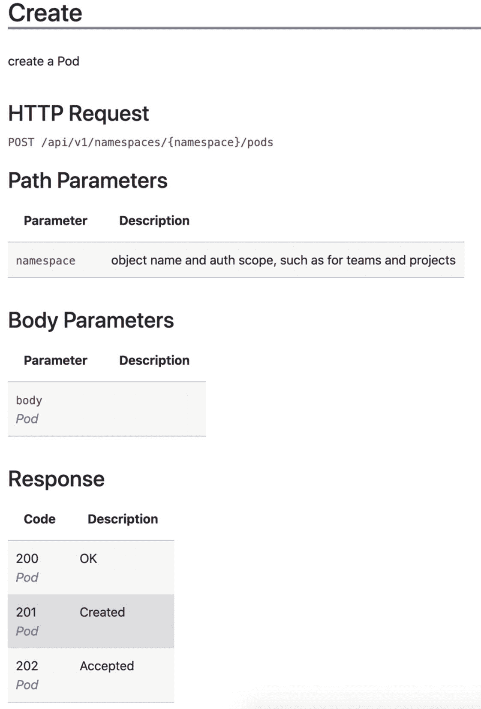
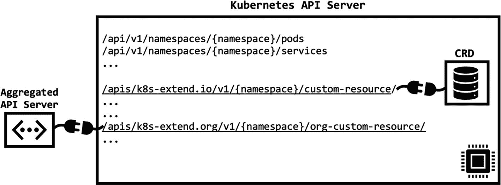
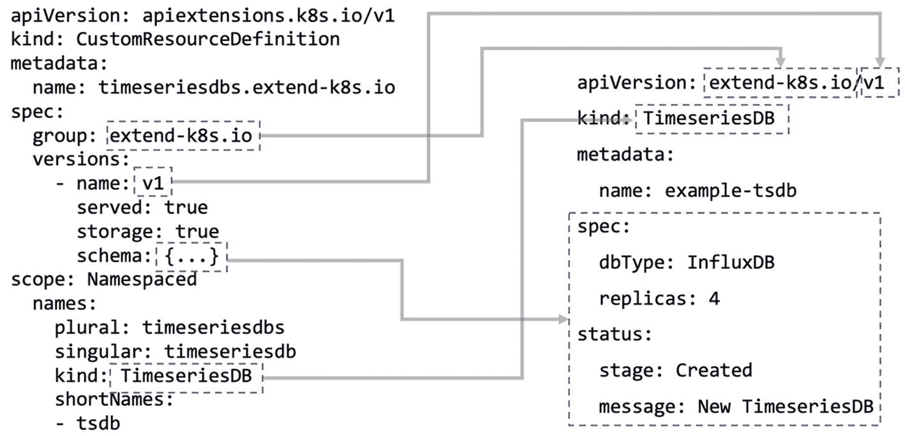
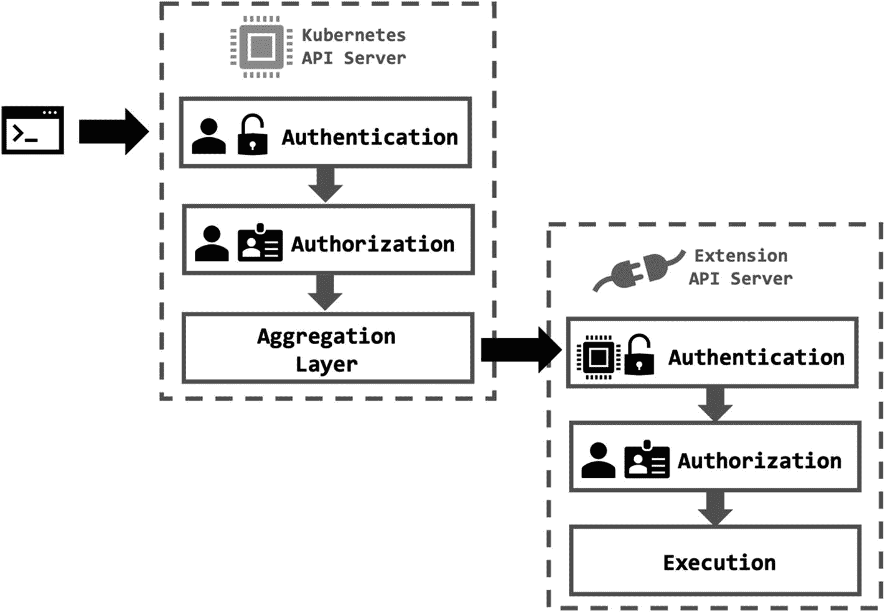

# 4.扩展 Kubernetes API

> *当我看着人类的大脑时，我仍然对它充满敬畏。*
> 
> —本杰明“本”所罗门卡森
> 
> 神经外科医生，美国政治家，作家

Kubernetes API 是云原生容器管理系统的大脑；它让你同时感到钦佩、尊重和惊讶。这是一个复杂的 API，有多层、各种资源，幸运的是，还有两个扩展点。本章将着重于通过创建定制资源和 API 聚合来扩展 Kubernetes API。在本章的最后，你将能够创建定制的资源和控制器；也就是说，您将实现一个 Kubernetes 操作符。此外，您将创建和部署扩展 API 服务器，并实际使用聚合 API。

让我们从 Kubernetes API 及其扩展点的概述开始。

## kuble API 概述

Kubernetes API 是系统的核心基础。对集群的所有内部和外部操作都是对 API 服务器的*请求*。因此，Kubernetes 中的所有东西都是一个具有相应动作的 *API 对象*。官方的版本化参考文档包含了所有的 API 对象以及大量的信息和例子，比如 [v1。19 参考](https://kubernetes.io/docs/reference/generated/kubernetes-api/v1.19/)。

API 是一个基于资源的接口，用于读取、创建、更新或删除资源。`kube-apiserver`组件通过它的 HTTP REST 端点为 API 提供服务。因此，控制平面、节点或终端用户的每个动作都是对`kube-apiserver`的一种 HTTP 调用。让我们假设您想要创建一个新的 pod。`kubectl create`命令向 Kubernetes API 服务器发送一个带有 pod 定义有效负载的请求。该请求是对图 [4-1](#Fig1) 的引用中提到的`/api/v1/namespaces/{namespace}/pods`端点的 HTTP POST。



图 4-1

Pod 创建参考

然后，`kube-scheduler`将 pod 调度到一个节点。正如所料，调度不是命令性的命令，而是声明性的 Kubernetes 资源:`Binding`。您可以创建一个带有节点和 pod 的`Binding`请求，如下所示。

```
apiVersion: v1
kind: Binding
metadata:
  name: pod-to-be-assigned
  namespace: default
target:
  apiVersion: v1
  kind: Node
  name: available-node

Listing 4-1Example Binding

```

`kube-scheduler`通过 HTTP POST 请求向`/api/v1/namespaces/{namespace}/bindings`端点发送绑定资源。然后`kubelet`在节点上施展魔法，创建容器、附加卷并等待就绪。在此期间，`kubelet`更新 pod 的状态，它是 Kubernetes 中的一个子资源。状态端点是`/api/v1/namespaces/{namespace}/pods/{name}/status`，更新通过补丁请求发送。最后，使用`kubectl get pods`命令列出本地工作站中的 pod。让我们用一些日志来调试这个命令，以检查它的 HTTP 请求。

```
$ kubectl get pods -v 9
...
* Starting client certificate rotation controller
* curl -k -v -XGET  -H "Accept: application/json;as=Table;v=v1;g=meta.k8s.io,application/json;as=Table;v=v1beta1;g=meta.k8s.io,application/json" -H "User-Agent: kubectl/v1.19.0 (darwin/amd64) kubernetes/e199641" 'https://127.0.0.1:55000/api/v1/namespaces/default/pods?limit=500'
* GET https://127.0.0.1:55000/api/v1/namespaces/default/pods?limit=500 200 OK in 19 milliseconds
* Response Headers:
     Cache-Control: no-cache, private
     Content-Type: application/json
...

Listing 4-2Getting pods with additional logs

```

正如所料，这是一个指向`/api/v1/namespaces/default/pods`地址的 GET 命令，用于列出默认名称空间中的 pod。如您所知，端点由两个主要部分构成:API 版本和组。

### API 版本控制

Kubernetes 中有三个级别的 API 版本，具有以下特征:

*   **稳定**:稳定版本的名字是`vX`，其中`X`是一个整数，比如`v1`。正如所料，稳定的 API 端点提供了完善的特性，这些特性将存在于 Kubernetes 的后续版本中。

*   **Beta** : Beta API 版本有一个包含`beta`的名字，比如`v1beta1`。默认情况下，这些特性和资源都经过了很好的测试和启用。但是，对这些 API 的支持在即将发布的版本中可能会过时。因此，您应该在生产中非常小心地使用 beta APIs。

*   **Alpha** : Alpha API 版本有一个包含`alpha`的名字，比如`v1alpha1`。Alpha 特性是新的，可能包含一些错误。更重要的是，Kubernetes 可能会在不考虑向后兼容性的情况下放弃支持或更改 API。因此，您应该只在测试中使用 alpha APIs，而不是在生产中使用。

### API 组

API 组打破了 API 服务器的整体结构，可以单独启用或禁用这些组。在 Kubernetes 中，有几个 API 组有两种命名约定:

*   遗留核心组有`apiVersion: v1`，由于历史原因位于`/api/v1`。

*   所有其他组以`apiVersion: $GROUP_NAME/$VERSION`命名，位于`/apis/$GROUP_NAME/$VERSION`。例如，使用`apps/v1`的`apiVersion`如下构造部署对象。

```
apiVersion: apps/v1
kind: Deployment
metadata:
  name: nginx
spec:
  replicas: 5
  selector:
    matchLabels:
      app: nginx
  template:
    metadata:
      labels:
        app: nginx
    spec:
      containers:
      - name: nginx
        image: nginx:1.14

Listing 4-3Example deployment

```

部署的 API 端点是`/apis/apps/v1/namespaces/$NAMESPACE/deployments`，包括组名和版本。

对 Kubernetes API 的扩展主要集中在两个部分:添加新的端点和为位于端点的资源添加自定义实现逻辑。现在，让我们继续 Kubernetes API 的两个扩展点。

### 库 API 中的扩展点

Kubernetes API 是一个面向资源的 API，通过创建自定义资源可以进行扩展。当群集启动并运行时，可以动态地添加或删除自定义资源。启用自定义资源时，它具有与本地资源(如 pod)类似的功能。Kubernetes 提供了两种添加定制资源的方法。

#### 自定义资源定义

`CustomResourceDefinition` (CRD)是一个本地的 Kubernetes API 资源，用于定义自定义资源。在 CRD 中，您用名称、组、版本和模式来表示新的自定义资源。Kubernetes API 服务器为您的定制资源创建一个 REST 端点，并处理 API 操作，如创建、读取、更新和删除。像所有其他 Kubernetes 资源一样，自定义资源实例存储在`etcd`中。

#### API 服务器聚合

Kubernetes 中的每个资源都有一个 REST 端点来处理 CRUD 操作。`APIService`是一个本地 Kubernetes 资源，用于向组、版本和后端端点注册定制资源。您可以声明一个 URL 路径，比如`/apis/k8s-extend.io/v1`，并让`kube-apiserver`将请求委派到您的定制后端。

这两种方法的主要区别在于，CRD 通过在 Kubernetes API 中添加新的资源来扩展 Kubernetes API。另一方面，服务器聚合创建了由外部服务器处理的新资源。这两种方法如图 [4-2](#Fig2) 所示。



图 4-2

库比特 API 扩展

带有 CRDs 的定制资源是存储在 Kubernetes API 中的结构化数据。然而，它们的动力来自于*定制控制器*。控制器作用于定制资源的状态，并采取诸如创建、删除或更新之类的动作。带有控制器的自定义资源也被称为 CoreOs 在 2016 年首次定义的*操作符模式*。您可以创建自定义控制器来实现基于存储在自定义资源中的状态的业务逻辑。定制控制器和聚合服务器都需要与 Kubernetes API 服务器通信。因此，您需要开发符合 Kubernetes REST API 的应用。幸运的是，您不需要从头开始实现每个资源和请求，因为客户端库是可用的。

### Kubernetes 客户库

Kubernetes 客户端库通过请求和响应来实现本地资源。此外，它们还处理日常任务，如身份验证、凭证发现和`kubeconfig`读取。Go、Python、Java、Dotnet、JavaScript 和 Haskell 都有官方支持的客户端库。此外，还有许多由社区维护的客户端库，它们覆盖了不同的本地资源和关注领域。

Kubernetes 在官方文档中维护着客户端库的列表；但是，建议使用 Go 或 Python，因为它们拥有最活跃的社区。另外，Kubernetes 及其生态系统是在 Go 语言上开发的；因此，Go 客户端库是无可争议的赢家。在下面的练习中，您将使用 Go 客户端库，即`client-go`，连接到一个 Kubernetes 集群。

EXERCISE: KUBERNETES GO CLIENT IN ACTION

在本练习中，您将使用`client-go`为秘密创建一个自定义观察器。我们将从创建依赖文件和源代码开始。然后，我们将借助 Go 中的跨平台选项来构建二进制文件。最后，您将运行自定义观察器并查看它的运行情况。

**注意**为了继续这个练习，您需要一个正在运行的 Kubernetes 集群和一个`kubeconfig`来访问。由`minikube`创建的本地集群足以执行这些步骤。

1.  Create a dependency file `go.mod` with the following content:

    ```
    module secret-watcher
    go 1.14
    require (
          k8s.io/apimachinery v0.19.0
          k8s.io/client-go v0.19.0
    )

    ```

    文件由我们应用的需求组成。第一个是`apimachinery`，是提供资源定义的库。第二个是`client-go`库，包括认证、实用程序和客户端命令。

2.  Create a file `secret_watcher.go` with the following content:

    ```
    package main

    import (
      "context"
      "flag"
      "fmt"
      "path/filepath"
      "time"

      metav1 "k8s.io/apimachinery/pkg/apis/meta/v1"
      "k8s.io/client-go/kubernetes"
      "k8s.io/client-go/tools/clientcmd"
      "k8s.io/client-go/util/homedir"

      _ "k8s.io/client-go/plugin/pkg/client/auth"
    )

    func main() {

      // kubeconfig flag
      var kubeconfig *string
      if home := homedir.HomeDir(); home != "" {
        kubeconfig = flag.String("kubeconfig", filepath.Join(home, ".kube", "config"), "(optional) path to the kubeconfig file")
      } else {
        kubeconfig = flag.String("kubeconfig", "", "path to the kubeconfig file")
      }
      flag.Parse()

      // create config
      config, err := clientcmd.BuildConfigFromFlags("", *kubeconfig)
      if err != nil {
        panic(err.Error())
      }

      // create client set
      clientset, err := kubernetes.NewForConfig(config)
      if err != nil {
        panic(err.Error())
      }

      // watch for secrets
      for {
        secrets, err := clientset.CoreV1().Secrets("").List(context.TODO(), metav1.ListOptions{})
        if err != nil {
          panic(err.Error())
        }
        fmt.Printf("There are %d secrets in the cluster\n", len(secrets.Items))
        time.Sleep(10 * time.Second)
      }
    }

    ```

    这是我们将构建并运行以与集群通信的主文件。如果没有使用默认目录，该函数开始解析`kubeconfig`标志。然后它使用`client-go`库读取`kubeconfig`。随后，创建一个由本地资源客户端组成的`clientset`。最后，所有的秘密都被列出，并在一个无限循环中打印出计数。

3.  Start a Go build environment in Docker with the following command:

    ```
    $ docker run -v "$(pwd)":/go/src/secret-watcher -it onuryilmaz/multi-platform-go-build:1.14-buster bash
    root@e45653990bb6:/go#

    ```

    该命令将挂载当前的工作目录，并在容器内部启动一个交互式 bash。

4.  Run the following command to build the binary:

    ```
    $ cd src/secret-watcher/
    $ export GOOS=darwin # for MacOS. Set to linux or windows based on your local operating system
    $ go build -v
    go: downloading k8s.io/apimachinery v0.19.0
    go: downloading k8s.io/client-go v0.19.0
    go: downloading github.com/google/gofuzz v1.1.0
    go: downloading gopkg.in/inf.v0 v0.9.1
    ...
    k8s.io/client-go/kubernetes/typed/storage/v1alpha1
    k8s.io/client-go/kubernetes/typed/storage/v1
    k8s.io/client-go/kubernetes/typed/storage/v1beta1
    k8s.io/client-go/kubernetes
    secret-watcher

    ```

    输出列表检索所有的依赖项，并最终构建二进制文件。使用`exit`命令从容器退出到本地工作站。

5.  运行`secret-watcher`二进制文件，设置`kubeconfig`标志或者留空以使用默认位置:

    ```
    ./secret-watcher
    There are 37 secrets in the cluster
    There are 37 secrets in the cluster
    There are 37 secrets in the cluster
    ...

    ```

`secret-watcher`应用在一个无限循环中列出集群中的所有秘密，如输出所示。二进制文件的成功运行表明我们可以使用`client-go`库创建一个定制的 Go 应用。此外，它还与集群进行通信，这表明集群配置、请求和响应工作正常。

在下一节中，我们将使用定制资源和控制器来扩展 Kubernetes API。我们将学习操作符模式的基础知识，然后创建自定义资源来扩展 Kubernetes API。然后我们将理解控制器的概念，并让 Kubernetes 为我们的定制资源和业务逻辑工作。

## 自定义资源定义和控制器

`CustomResourceDefinition` (CRD)是在 Kubernetes API 中创建定制资源的简单方法。有了新的资源，Kubernetes API 被扩展来处理 REST 操作和`etcd`中的存储。这意味着您可以创建、读取、更新或删除定制资源，最重要的是，您可以在它们之上创建自动化。因此，*的想法是为 vanilla Kubernetes* 中没有实现的业务需求创建定制资源。让我们假设您想要在 Kubernetes 上安装一个集群化和托管的数据库。您将部署机密、卷、配置、状态集和更多 Kubernetes 资源。此外，您希望运行一些业务逻辑，如数据库初始化、迁移或数据库升级。定制资源和控制器是以 Kubernetes 本地方式管理此类应用所遵循的设计模式。让我们从创建一些 CRD 来定义定制资源开始。

CRDs 类似于任何其他 Kubernetes 资源；它们是期望状态的声明性定义。在这种情况下，所需的状态是具有组名、版本、范围、模式和名称的新自定义资源。用于`TimeseriesDB`资源的示例 CRD 可以被构造如下。

```
apiVersion: apiextensions.k8s.io/v1
kind: CustomResourceDefinition
metadata:
  name: timeseriesdbs.extend-k8s.io
spec:
  group: extend-k8s.io
  versions:
    - name: v1
      served: true
      storage: true
      schema:
        openAPIV3Schema:
          type: object
          properties:
            spec:
              type: object
              properties:
                dbType:
                  type: string
                replicas:
                  type: integer
            status:
              type: object
              properties:
                stage:
                  type: string
                message:
                  type: string
  scope: Namespaced
  names:
    plural: timeseriesdbs
    singular: timeseriesdb
    kind: TimeseriesDB
    shortNames:
    - tsdb

Listing 4-4TimeseriesDB CRD

```

在 CRD 的规格中，有四个块:

*   `group`:多个定制资源可以被分组到一个 Kubernetes API 组中。该字段表示 API 组的名称。

*   在 Kubernetes 中，资源的版本随着模式的变化而变化。在 CRD，提供了受支持的版本及其`schema`。

*   `scope`:定制资源实例可以位于`Namespace`中，也可以位于`Cluster`中。

*   `names`:复数、单数和种类字段是资源的名称，用于 REST 端点、资源定义文件和`kubectl`命令。

CRD 资源的名称在`metadata.name`中定义，其格式为`<plural>.<group>`。此外，Kubernetes 将结构化数据存储在带有自定义字段的自定义资源中。字段的结构在模式字段中指定，并且是以 [OpenAPI 规范 v3 的形式。0](https://swagger.io/specification/) 。现在，将 CRD 保存在一个文件中，并将其部署到集群。

```
$ kubectl apply -f tsdb-crd.yaml
customresourcedefinition.apiextensions.k8s.io/timeseriesdbs.extend-k8s.io created

Listing 4-5Deployment of CRD

```

现在，您可以看到`timeseriesdbs`被添加到集群中的 API 资源。

```
$ kubectl api-resources --output=name | grep timeseriesdbs
timeseriesdbs.extend-k8s.io

Listing 4-6API resources listing

```

此外，您可以运行`kubectl`命令并与 Kubernetes API 交互`TimeseriesDB`资源。让我们在启用一些日志记录的情况下尝试一下。

```
$ kubectl get timeseriesdb -v=6 | grep extend-k8s
Config loaded from file:  ...
Starting client certificate rotation controller
GET https://127.0.0.1:55000/api?timeout=32s 200 OK in 18 milliseconds
GET https://127.0.0.1:55000/apis?timeout=32s 200 OK in 6 milliseconds
GET https://127.0.0.1:55000/apis/extend-k8s.io/v1?timeout=32s 200 OK in 11 milliseconds
GET https://127.0.0.1:55000/apis/autoscaling/v1?timeout=32s 200 OK in 10 milliseconds
...
GET https://127.0.0.1:55000/apis/storage.k8s.io/v1beta1?timeout=32s 200 OK in 20 milliseconds
GET https://127.0.0.1:55000/apis/extend-k8s.io/v1/namespaces/default/timeseriesdbs?limit=500 200 OK in 4 milliseconds
No resources found in default namespace.

Listing 4-7kubectl custom resource listing

```

Note

如果您没有看到 API 检索日志，这是因为`kubectl`缓存了它们。您可以清除位于＄HOME/的缓存目录。kube/cache 并重新运行该命令。

在日志中，`kubectl`首先连接到`api`和`apis`端点，以发现可用的 API 组和版本。API 发现结果被本地缓存，这样在第二次运行时，`kubectl`将直接调用`/apis/extend-k8s.io/v1/namespaces/default/timeseriesdbs`。

随着 CRD 的创建，Kubernetes API 得到了扩展；因此，API 服务器和客户端工具都可以使用新的资源了。不出所料，`TimeseriesDB`没有资源。现在，让我们继续在集群中创建定制资源。

或者您将创建的任何自定义资源与本地 Kubernetes 资源(如 pods 或 secrets)并无不同。对于`timeseriesdbs.extend-k8s.io` CRD 和`v1`模式，您可以创建以下资源。

```
apiVersion: extend-k8s.io/v1
kind: TimeseriesDB
metadata:
  name: example-tsdb
spec:
  dbType: InfluxDB
  replicas: 4
status:
  stage: Created
  message: New TimeseriesDB

Listing 4-8TimeseriesDB example

```

`example-tsdb`是创建一个有四个副本的 *InfluxDB* 数据库的定义。`status`域解释了资源的当前情况。现在，让我们在图 [4-3](#Fig3) 中直观地匹配 CRD 和示例资源字段。



图 4-3

CRD 和定制资源

您可以使用以下命令将资源部署到集群。

```
$ kubectl apply -f example-tsdb.yaml
timeseriesdb.extend-k8s.io/example-tsdb created

Listing 4-9Custom resource deployment

```

您还可以使用 CRD 中定义的`shortNames`来访问资源。

```
$ kubectl get tsdb                                                                                                                                             NAME           AGE
example-tsdb   1m

Listing 4-10Custom resource listing

```

现在，我们有一个定制的资源来管理我们的时间序列数据库。现在的关键问题是，谁将创建和管理四个实例 *InfluxDB* 到我们的集群中。同样，新版本发布时，谁来升级数据库？换句话说，需要有一个*操作员*来创建、更新、删除和管理应用。

### Kubernetes 中的运算符模式

Kubernetes API 存储并提供定制资源。另一方面，操作员是创建和管理自定义资源中定义的应用的软件扩展。*软件操作员*背后的动机是取代*人类操作员*的知识和经验。在传统方法中，运营团队*知道*如何部署和管理应用。他们观察特定的指标或仪表板，以跟踪整个系统的状态，并在必要时采取行动。在云原生世界中，您被期望使用自动化来处理这样的操作。

运算符是将人类知识和任务实现到代码中的模式。该模式很好地集成到了 Kubernetes 中，因为它遵循了 Kubernetes 中流行的控制器扩展模式。运营商管理生产就绪的云原生应用有四个主要级别:

*   **安装**:自动安装应用，并在定制资源中定义所需的状态。

*   **升级**:应用的自动化和用户触发升级，用户交互最少。

*   **生命周期管理**:决策规则和自动化的应用的初始化、备份和故障恢复。

*   **监控和可伸缩性**:监控和分析应用的指标和警报。必要时，采取自动化措施进行扩展、计划和重新平衡。

操作员被部署到带有`CustomResourceDefinition`和相关控制器的集群中。控制器在 Kubernetes 中作为容器化的应用运行，最常见的是作为部署运行。操作员应用与 Kubernetes API 交互；所以建议使用可以充当 Kubernetes 客户端的编程语言。开源和社区维护的运营商在 [OperatorHub](https://operatorhub.io/) 共享，它有 175 个运营商可供使用。如果您计划将一个流行的数据库部署到 Kubernetes，比如 etcd、MongoDB、PostgreSQL 或 CockroachDB，那么您应该检查 OperatorHub 中的操作符。使用有社区支持的现成操作员可以帮助您节省时间和金钱；因此，它是有价值的。

如果您想开发自己的操作符，有两个基本工具需要考虑:

*   **Operator SDK:** 它是 Operator 框架的一部分，以有效的自动化方式创建 Kubernetes-native 应用。SDK 提供了构建、测试、打包和部署操作者到集群的工具。可以在 Operator SDK 中开发 Go、Ansible 或 Helm 图表。

*   kubebuilder: 这是一个使用 CRDs 构建 Kubernetes APIs 的框架。它关注于创建和部署 Kubernetes API 扩展的速度和降低的复杂性。该工具为 Go 中的自定义资源生成客户端、接口和 webhooks。它还生成将操作员部署到集群所需的资源。接下来，我们将关注 kubebuilder 框架，因为它有两个基本特性:临近 Kubernetes 社区和增强的开发人员体验。

### kubebuilder 框架

`kubebuilder`是一个框架，用于初始化、生成和部署 Kubernetes-native API 扩展代码到集群。框架是包含的*电池，这样创建的项目就有了测试环境、部署文件和容器规范。本节将使用框架一步一步地为`TimeseriesDB`定制资源生成一个项目，并查看它的运行情况。*

Note

本节的其余部分将让您接触以下先决条件:Go 版本 1.14+，Docker 版本 17.03+，访问新的 Kubernetes 集群，以及`kubectl`和 [kustomize](https://kubectl.docs.kubernetes.io/installation/kustomize/binaries/) 。

让我们从将`kubebuilder`二进制文件安装到本地工作站开始。

```
$ export os=$(go env GOOS)
$ export arch=$(go env GOARCH)

$ curl -L https://go.kubebuilder.io/dl/2.3.1/${os}/${arch} | tar -xz -C /tmp/

$ sudo mv /tmp/kubebuilder_2.3.1_${os}_${arch} /usr/local/kubebuilder

$export PATH=$PATH:/usr/local/kubebuilder/bin

Listing 4-11kubebuilder installation

```

这些命令为您的操作系统下载二进制文件，并将其安装到您的`PATH`环境变量中。接下来，是时候创建一个新的 Go 项目了。

```
$ mkdir -p $GOPATH/src/extend-k8s.io/timeseries-operator
$ cd $GOPATH/src/extend-k8s.io/timeseries-operator
$ kubebuilder init --domain extend-k8s.io

Writing scaffold for you to edit...
Get controller runtime:
  go get sigs.k8s.io/controller-runtime@v0.5.0
go: downloading sigs.k8s.io/controller-runtime v0.5.0
go: downloading k8s.io/apimachinery v0.17.2
...
go fmt ./...
go vet ./...
go build -o bin/manager main.go
Next: define a resource with:
  kubebuilder create api

Listing 4-12Initializing a project

```

这些命令在`GOPATH`中创建一个文件夹，然后`kubebuilder`通过创建一个 scaffold 项目进行初始化。使用以下命令检查文件夹的内容。

```
$ tree -a
.
├── .gitignore
├── Dockerfile
├── Makefile
├── PROJECT
├── bin
│   └── manager
├── config
│   ├── certmanager
│   │   ├── certificate.yaml
│   │   ├── kustomization.yaml
│   │   └── kustomizeconfig.yaml
│   ├── default
│   │   ├── kustomization.yaml
│   │   ├── manager_auth_proxy_patch.yaml
│   │   ├── manager_webhook_patch.yaml
│   │   └── webhookcainjection_patch.yaml
│   ├── manager
│   │   ├── kustomization.yaml
│   │   └── manager.yaml
│   ├── prometheus
│   │   ├── kustomization.yaml
│   │   └── monitor.yaml
│   ├── rbac

│   │   ├── auth_proxy_client_clusterrole.yaml
│   │   ├── auth_proxy_role.yaml
│   │   ├── auth_proxy_role_binding.yaml
│   │   ├── auth_proxy_service.yaml
│   │   ├── kustomization.yaml
│   │   ├── leader_election_role.yaml
│   │   ├── leader_election_role_binding.yaml
│   │   └── role_binding.yaml
│   └── webhook
│       ├── kustomization.yaml
│       ├── kustomizeconfig.yaml
│       └── service.yaml
├── go.mod
├── go.sum
├── hack
│   └── boilerplate.go.txt
└── main.go

9 directories, 31 files

Listing 4-13Project structure

```

用最少的资源初始化项目来构建和运行一个操作符。大部分文件在`config`文件夹中，格式为`kustomize`，集成在`kubectl`中的无模板定制方式。

通过创建资源和控制器将`TimeseriesDB` API 添加到项目中。

```
$ kubebuilder create api --group operator --version v1 --kind TimeseriesDB
Create Resource [y/n]
y
Create Controller [y/n]
y
Writing scaffold for you to edit...
api/v1/timeseriesdb_types.go
controllers/timeseriesdb_controller.go
Running make:
make
...bin/controller-gen object:headerFile="hack/boilerplate.go.txt" paths="./..."
go fmt ./...
go vet ./...
go build -o bin/manager main.go

Listing 4-14Adding new API

```

样板资源和控制器被添加到项目中。让我们首先检查位于/ `api/v1/timeseriesdb_types.go`的资源定义。

```
type TimeseriesDBSpec struct {
      ...
      Foo string `json:"foo,omitempty"`
}

type TimeseriesDBStatus struct {
      ...
}

// +kubebuilder:object:root=true

// TimeseriesDB is the Schema for the timeseriesdbs API
type TimeseriesDB struct {
      metav1.TypeMeta   `json:",inline"`
      metav1.ObjectMeta `json:"metadata,omitempty"`

      Spec   TimeseriesDBSpec   `json:"spec,omitempty"`
      Status TimeseriesDBStatus `json:"status,omitempty"`
}

Listing 4-15Boilerplate TimeseriesDB resource

```

用下面的 Go 结构更新`TimeseriesDBSpec`和`TimeseriesDBStatus`，删除示例字段并存储实际数据。

```
// TimeseriesDBSpec defines the desired state of TimeseriesDB
type TimeseriesDBSpec struct {
      DBType   string `json:"dbType,omitempty"`
      Replicas int    `json:"replicas,omitempty"`
}

Listing 4-16TimeseriesDBSpec with actual fields

```

```
// TimeseriesDBStatus defines the observed state of TimeseriesDB
type TimeseriesDBStatus struct {
      Status  string `json:"status,omitempty"`
      Message string `json:"message,omitempty"`
}

Listing 4-17TimeseriesDBStatus with actual fields

```

此外，更改`kubebuilder`标志，在`TimeseriesDB`定义之前将`status`设置为`subresource`。

```
// +kubebuilder:object:root=true
// +kubebuilder:subresource:status

Listing 4-18Status subresource flag

```

检查位于`/controllers/timeseriesdb_controller.go`的控制器代码的`Reconcile`方法。

```
func (r *TimeseriesDBReconciler) Reconcile(req ctrl.Request) (ctrl.Result, error) {
      _ = context.Background()
      _ = r.Log.WithValues("timeseriesdb", req.NamespacedName)

      // your logic here

      return ctrl.Result{}, nil
}

Listing 4-19Boilerplate TimeseriesDB controller

```

Kubernetes API 中的`TimeseriesDB`实例的每个事务都将调用控制器的`Reconcile`方法。用以下内容更新函数。

```
func (r *TimeseriesDBReconciler) Reconcile(req ctrl.Request) (ctrl.Result, error) {
      ctx := context.Background()
      log := r.Log.WithValues("timeseriesdb", req.NamespacedName)

      timeseriesdb := new(operatorv1.TimeseriesDB)

      if err := r.Client.Get(ctx, req.NamespacedName, timeseriesdb); err != nil {
            return ctrl.Result{}, client.IgnoreNotFound(err)
      }

      log = log.WithValues("dbType", timeseriesdb.Spec.DBType, "replicas", timeseriesdb.Spec.Replicas)

      if timeseriesdb.Status.Status == "" || timeseriesdb.Status.Message == "" {
            timeseriesdb.Status = operatorv1.TimeseriesDBStatus{Status: "Initialized", Message: "Database creation is in progress"}
            err := r.Status().Update(ctx, timeseriesdb)
            if err != nil {
                  log.Error(err, "status update failed")
                  return ctrl.Result{}, err
            }
            log.Info("status updated")
      }

      return ctrl.Result{}, nil
}

Listing 4-20Updated controller

```

更新后的协调器方法展示了如何使用由`kubebuilder`生成的客户端检索`TimeseriesDB`实例。检索到的对象的字段被打印到输出中。此外，如果状态部分为空，则填充该部分，并在集群中更新资源。

运行`make`命令，用更新后的`TimeseriesDB`资源生成客户机和样本文件。

```
$ make
.../controller-gen object:headerFile="hack/boilerplate.go.txt" paths="./..."
go fmt ./...
go vet ./...
go build -o bin/manager main.go

Listing 4-21Code generation after resource update

```

`kubebuilder`平台使用`controller-gen`工具生成 YAML 格式的实用程序代码和 Kubernetes 资源文件。

将 CRD 安装到集群，并在本地运行控制器。

```
$ make install run

.../controller-gen "crd:trivialVersions=true" rbac:roleName=manager-role webhook paths="./..." output:crd:artifacts:config=config/crd/bases
...
kustomize build config/crd | kubectl apply -f -
customresourcedefinition.apiextensions.k8s.io/timeseriesdbs.operator.extend-k8s.io created
...
.../controller-gen object:headerFile="hack/boilerplate.go.txt" paths="./..."
go fmt ./...
go vet ./...
go run ./main.go
...
INFO    controller-runtime.metrics      metrics server is starting to listen    {"addr": ":8080"}
INFO    setup   starting manager
INFO    controller-runtime.manager      starting metrics server {"path": "/metrics"}
INFO    controller-runtime.controller   Starting EventSource    {"controller": "timeseriesdb", "source": "kind source: /, Kind="}
INFO    controller-runtime.controller   Starting Controller     {"controller": "timeseriesdb"}
INFO    controller-runtime.controller   Starting workers        {"controller": "timeseriesdb", "worker count": 1}

Listing 4-22Running the controller locally

```

在日志中，安装了 CRD，然后控制器代码开始使用 Go 命令。Metrics server、events source、controllers 和 workers 按列出的顺序开始，我们的控制器现在已经准备好，正在等待资源更改。

用以下内容更新位于`/config/sample/operator_v1_timeseriesdb.yaml`的示例`TimeseriesDB`实例。

```
apiVersion: operator.extend-k8s.io/v1
kind: TimeseriesDB
metadata:
  name: timeseriesdb-sample
spec:
  dbType: Prometheus
  replicas: 5

Listing 4-23Example TimeseriesDB instance

```

在另一个终端中，将示例自定义资源部署到集群。

```
$ kubectl apply -f config/samples/
timeseriesdb.operator.extend-k8s.io/timeseriesdb-sample created

Listing 4-24Deploying example TimeseriesDB

instance

```

在运行控制器的终端中，您现在应该看到下面两行。

```
INFO    controllers.TimeseriesDB        status updated  {"timeseriesdb": "default/timeseriesdb-sample", "dbType": "Prometheus", "replicas": 5}
DEBUG   controller-runtime.controller   Successfully Reconciled {"controller": "timeseriesdb", "request": "default/timeseriesdb-sample"}

Listing 4-25Controller logs after custom resource creation

```

它显示了创建资源时调用了控制器的`Reconcile`方法。让我们检查状态更新是否正确。

```
$ kubectl describe timeseriesdb timeseriesdb-sample
Name:         timeseriesdb-sample
Namespace:    default
...
Spec:
  Db Type:   Prometheus
  Replicas:  5
Status:
  Message:  Database creation is in progress
  Status:   Initialized
Events:     <none>

Listing 4-26Custom resource status

```

控制器更新状态字段，并显示控制器不处于只读模式，它可以对资源进行更改。

在使用`kubebuilder`框架从头开始创建一个操作符之后，您对如何使用定制资源和控制器来扩展 Kubernetes API 有了一个印象。值得一提的是，在开发运营商的同时，有三个要点需要考虑:

*   **声明式** : Kubernetes 有一个声明式 API，它的资源应该是一样的。您的定制资源和它们周围的控制器应该只读取`spec`和更新`status`字段。如果您发现自己改变了控制器中的`spec`，您需要修改您的定制资源和控制器逻辑。

*   **幂等**:控制器做的改变应该是幂等的，原子的。当操作员窗格在协调过程中重新启动时，它可以防止您从头开始创建完整的数据库。

*   **抵抗错误**:控制器在集群内部或外部创建资源，因此，它容易出现错误、超时或取消。您需要考虑控制器的每个动作及其潜在的故障。Kubernetes-native 方法是使用回退策略重试，更新资源的状态，并在必要时发布事件。

接下来，我们将继续 Kubernetes API 中的第二个扩展点，以创建由外部服务器处理的新资源。

## 聚合的 API 和扩展服务器

聚合层用额外的 API 扩展了 Kubernetes，以提供超出 Kubernetes API 服务器所提供的内容。CRD 和 operator 模式的主要区别在于*新资源不存储在 Kubernetes API* 中。资源的请求被定向到外部服务器，并收集响应。虽然这种方法增加了灵活性，但也增加了操作的复杂性。通过聚合扩展 Kubernetes API 有三个基本要素:

*   **聚合层**:该层在`kube-apiserver`内部运行，代理新 API 类型的请求。

*   `APIService` **资源**:新的 API 类型由`APIService`资源动态注册。

*   **扩展 API 服务器**:扩展 API 服务器响应聚合层上代理的请求。

我们可以在图 [4-4](#Fig4) 中说明一个请求的流程，该流程从 Kubernetes API 开始，到扩展 API 服务器结束。传入请求的旅程从用户的身份验证和授权开始。然后，聚合层将请求定向到扩展 API 服务器。在扩展服务器中，针对 API 服务器对传入的请求进行身份验证。换句话说，扩展 API 服务器检查请求是否来自 Kubernetes API 服务器。然后，扩展服务器向原始用户验证请求的授权。最后，如果请求通过了所有阶段，那么它将被执行并存储在扩展服务器中。请求流显示，用扩展服务器扩展 Kubernetes API 服务器遵循 webhook 设计模式。



图 4-4

聚合 API 请求流

扩展服务器和新资源的动态配置由`APIService`资源控制。`APIService`资源由 API 组、版本和扩展服务器的端点组成。为`backup.extend-k8s.io`组和`v1`版本扩展 Kubernetes API 的示例`APIService`资源可以如下构建。

```
apiVersion: apiregistration.k8s.io/v1
kind: APIService
metadata:
  name: v1.backup.extend-k8s.io
spec:
  version: v1
  group: backup.extend-k8s.io
  groupPriorityMinimum: 2000
  service:
    name: extension-server
    namespace: kube-extensions
  versionPriority: 10
  caBundle: "LS0tL...LS0K"

Listing 4-27Example APIService resource

```

该定义没有指定自定义资源的实际名称。相反，聚合层重定向所有到达`/apis/backup.extend-k8s.io/v1/`端点的请求。扩展服务器管理 API 组中的所有定制资源。扩展服务器被指定为 Kubernetes 服务及其名称和命名空间。默认情况下，使用服务的 HTTPS 端口，通过 TLS 处理通信。扩展服务器需要使用由`caBundle`中指定的 CA 证书签名的证书运行。

一个扩展 API 服务器的开发几乎和开发一个 Kubernetes API 服务器一样复杂，也就是`kube-apiserver`。对于完整获取的具体例子，参考实现，您可以查看 Kubernetes 的 [sample-apiserver](https://github.com/kubernetes/sample-apiserver) 存储库。使用`sample-apiserver`的推荐方式是派生存储库，修改 API 类型，并频繁地改变基础以跟踪改进和错误修复。

在本节中，我们将使用 [apiserver-builder](https://github.com/kubernetes-sigs/apiserver-builder-alpha) 从头开始生成和部署一个扩展 API 服务器。它是一个用于开发 API 服务器、客户端库和安装资源的完整框架。我们将使用该工具来初始化一个项目，添加定制的资源组和版本、代码生成以及集群部署。

Note

除了正在运行的 Kubernetes 集群之外，本节中的步骤还要求安装以下组件:Go v1.14+、Docker 版本 17.03+和 OpenSSL 1.1.1g+。

首先，让我们安装最新版本的`apiserver-boot`工具。

```
$ export os=$(go env GOOS)
$ mkdir -p /tmp/apiserver
$ cd /tmp/apiserver
$ curl  --output /tmp/apiserver/apiserver-builder-alpha.tar.gz -L https://github.com/kubernetes-sigs/apiserver-builder-alpha/releases/download/v2.0.0-alpha.0/apiserver-builder-alpha-v2.0.0-alpha.0-${os}-amd64.tar.gz

$ tar -xf /tmp/apiserver/     apiserver-builder-alpha.tar.gz
$ chmod +x /tmp/apiserver/bin/apiserver-boot

$ mkdir -p /usr/local/apiserver-builder/bin
$ mv /tmp/apiserver/bin/apiserver-boot /usr/local/apiserver-builder/bin/apiserver-boot
$ export PATH=$PATH:/usr/local/apiserver-builder/bin

Listing 4-28apiserver-boot installation

```

您可以通过运行以下命令来验证安装。

```
$ apiserver-boot version
Version: version.Version{ApiserverBuilderVersion:"8f12f3e43", KubernetesVendor:"kubernetes-1.19.2", GitCommit:"8f12f3e43cb0a75c82e8a6b316772a230f5fd471", BuildDate:"2020-11-04-20:35:32", GoOs:"darwin", GoArch:"amd64"}

Listing 4-29apiserver-boot version check

```

让我们从在`GOPATH`中创建一个文件夹开始。

```
$ mkdir -p $GOPATH/src/extend-k8s.io/timeseries-apiserver
$ cd $GOPATH/src/extend-k8s.io/timeseries-apiserver

Listing 4-30Go project initialization

```

使用`apiserver-boot`创建一个 scaffold API 服务器。

```
$ apiserver-boot init repo --domain extend-k8s.io
Writing scaffold for you to edit...

Listing 4-31API server initialization

```

现在，用下面的命令检查生成的文件。

```
$ tree -a
.
├── .gitignore
├── BUILD.bazel
├── Dockerfile
├── Makefile
├── PROJECT
├── WORKSPACE
├── bin
├── cmd
│   ├── apiserver
│   │   └── main.go
│   └── manager
│       └── main.go -> ../../main.go
├── go.mod
├── hack
│   └── boilerplate.go.txt
├── main.go
└── pkg
    └── apis
        └── doc.go

7 directories, 12 files

Listing 4-32Folder structure

```

生成的代码是一个基本的 API 服务器，带有工具，如`Makefile`和`bazel`文件。

使用以下命令向扩展服务器添加自定义资源和控制器。

```
$ apiserver-boot create group version resource --group backup --version v1 --kind TimeseriesDBBackup
Create Resource [y/n]
y
Create Controller [y/n]
y
Writing scaffold for you to edit...
controllers/backup/timeseriesdbbackup_controller.go

Listing 4-33Adding custom resource

```

运行代码生成工具，确保新资源和控制器按预期工作。

```
$  make generate
...controller-gen object:headerFile="hack/boilerplate.go.txt" paths="./..."

Listing 4-34Code generation for new resource and controller

```

首先，导出$REPOSITORY 环境变量作为 Docker 存储库，然后为扩展服务器构建容器映像。

```
$ apiserver-boot build container --image $REPOSITORY/timeseries-apiserver:v1

Will build docker Image from directory /var/folders/nn/.../T/apiserver-boot-build-container656172154
Writing the Dockerfile.

Building binaries for Linux amd64.
CGO_ENABLED=0
GOOS=linux
GOARCH=amd64
go build -o /var/folders/nn/.../T/apiserver-boot-build-container656172154/apiserver cmd/apiserver/main.go
go build -o /var/folders/nn/.../T/apiserver-boot-build-container656172154/controller-manager cmd/manager/main.go

Building the docker Image using /var/folders/nn/.../T/apiserver-boot-build-container656172154/Dockerfile.

docker build -t $REPOSITORY     /timeseries-apiserver:v1 /var/folders/nn/../T/apiserver-boot-build-container656172154
Sending build context to Docker daemon  102.2MB
Step 1/5 : FROM ubuntu:14.04
 ---> df043b4f0cf1
Step 2/5 : RUN apt-get update
 ---> Using cache
 ---> 60dfe53c07c6
Step 3/5 : RUN apt-get install -y ca-certificates
 ---> Using cache
 ---> ff5f3be9ac8d
Step 4/5 : ADD apiserver .
 ---> 3778467102f7
Step 5/5 : ADD controller-manager .
 ---> 32672f63fd9b
Successfully built 32672f63fd9b
Successfully tagged $REPOSITORY/timeseries-apiserver:v1

Listing 4-35Container build

```

将 Docker 容器推到注册表中，以便在 Kubernetes 集群中使用。

```
$ docker push $REPOSITORY/timeseries-apiserver:v1

Listing 4-36Container push

```

使用以下命令部署扩展 API 服务器。

```
$ apiserver-boot run in-cluster --name timeseriesdb-api --namespace default --image $REPOSITORY/timeseries-apiserver:v1 --build-image=false

openssl req -x509 -newkey rsa:2048 -addext basicConstraints=critical,CA:TRUE,pathlen:1 -keyout config/certificates/apiserver_ca.key -out config/certificates/apiserver_ca.crt -days 365 -nodes -subj /C=un/ST=st/L=l/O=o/OU=ou/CN=timeseriesdb-api-certificate-authority
Generating a RSA private key
.+++++
.................................+++++
writing new private key to 'config/certificates/apiserver_ca.key'
...

Adding APIs:
      backup.v1
...

kubectl apply -f config
deployment.apps/timeseriesdb-api-apiserver created
secret/timeseriesdb-api created
service/timeseriesdb-api created
apiservice.apiregistration.k8s.io/v1.backup.extend-k8s.io created
deployment.apps/timeseriesdb-api-controller created
statefulset.apps/etcd created
service/etcd-svc created
clusterrole.rbac.authorization.k8s.io/timeseriesdb-api-apiserver-auth-reader created
clusterrolebinding.rbac.authorization.k8s.io/timeseriesdb-api-apiserver-auth-reader created
clusterrolebinding.rbac.authorization.k8s.io/timeseriesdb-api-apiserver-auth-delegator created
clusterrole.rbac.authorization.k8s.io/timeseriesdb-api-controller created
clusterrolebinding.rbac.authorization.k8s.io/timeseriesdb-api-controller created

Listing 4-37Deployment of extension server

```

该命令处理一系列自动化操作，以创建 TLS 证书、添加 API 和部署一长串 Kubernetes YAML 文件。现在，是时候检查定制资源 API 是否已启用并按预期运行了。

让我们从描述新的`APIService`资源开始。

```
$ kubectl describe apiservice v1.backup.extend-k8s.io
Name:         v1.backup.extend-k8s.io
Namespace:
...
Status:
  Conditions:
      ...
    Message:               all checks passed
    Reason:                Passed
    Status:                True
    Type:                  Available
Events:                    <none>

Listing 4-38APIService status

```

`Message`字段表示所有检查通过，同时`APIService`列为`Available`。在`example-tsdb-backup.yaml`中创建一个包含以下内容的示例`TimeseriesDBBackup`资源。

```
apiVersion: backup.extend-k8s.io/v1
kind: TimeseriesDBBackup
metadata:
  name: example-tsdb-backup

Listing 4-39Example TimeseriesDBBackup

```

将示例资源部署到集群并检索回来。

```
$ kubectl apply -f example-tsdb-backup.yaml
timeseriesdbbackup.backup.extend-k8s.io/example-tsdb-backup created

$ kubectl get TimeseriesDBBackups
NAME                  CREATED AT
example-tsdb-backup   2021-07-28T09:05:00Z

Listing 4-40Create and read of the custom resource

```

输出显示，我们可以与 Kubernetes API 进行交互，以获得由 aggregated API 扩展的定制资源。

最后一步是更进一步检查`etcd`中扩展资源的物理数据。Kubernetes API 服务器使用`etcd`作为它的数据库。类似地，扩展 API 服务器与其数据库交互来存储定制资源。`etcd`部署在扩展 API 服务器旁边，它应该有一个 pod 正在运行并且可以访问。

```
$ kubectl exec -it etcd-0 -- sh
/ # ETCDCTL_API=3 etcdctl get --prefix /registry
/registry/sample-apiserver/backup.extend-k8s.io/timeseriesdbbackups/example-tsdb-backup
{"kind":"TimeseriesDBBackup","apiVersion":"backup.extend-k8s.io/v1","metadata":{"name":"example-tsdb-backup","uid":"...","creationTimestamp":"...","annotations":{"kubectl.kubernetes.io/last-applied-configuration":"{\"apiVersion\":\"backup.extend-k8s.io/v1\",\"kind\":\"TimeseriesDBBackup\",\"metadata\":{\"annotations\":{},\"name\":\"example-tsdb-backup\"}}\n"}},"spec":{},"status":{}}

Listing 4-41Access to etcd

```

来自`etcd`的数据显示扩展 API 服务器存储了`TimeseriesDBBackup`个实例。此外，使用`kubectl`表明 Kubernetes API 是用 aggregated API 方法扩展的。

与使用 CRDs 相比，创建和部署独立的服务器来处理 API 请求并不简单。然而，用聚合服务器扩展 Kubernetes API 比 CRDs 有以下两个好处:更灵活的资源验证检查和对客户机的协议缓冲支持。另一方面，在部署扩展服务器时，有三个要点需要考虑:

*   **新的故障点**:聚合 API 服务器根据业务逻辑和需求自行运行。它应该设计得很好，操作时要非常小心，不要在集群中出现单点故障。

*   **存储**:聚合的 API 服务器可以选择如何存储数据。应该考虑初始化、备份、恢复和存储容量。

*   **安全和审计**:聚合服务器的认证、授权和审计设置应该与主 API 服务器保持一致。

## 关键要点

*   Kubernetes API 是系统的核心结构，集群上的所有操作都作为对 API 服务器的请求来处理。

*   `CustomResourceDefinition` (CRD)是向 Kubernetes API 添加新的定制资源的简单方法。它处理由 CRDs 创建的资源的 REST 操作和存储。

*   当自定义资源与自定义控制器相结合时，就有可能将人类的知识和任务实现为代码，即操作符模式。

*   聚合层用额外的 API 扩展了 Kubernetes，以提供超出 Kubernetes API 服务器所提供的内容。Kubernetes API 代理聚合 API 资源的请求。

在下一章中，我们将通过运行多个调度器和开发定制的调度器来扩展 Kubernetes 调度。