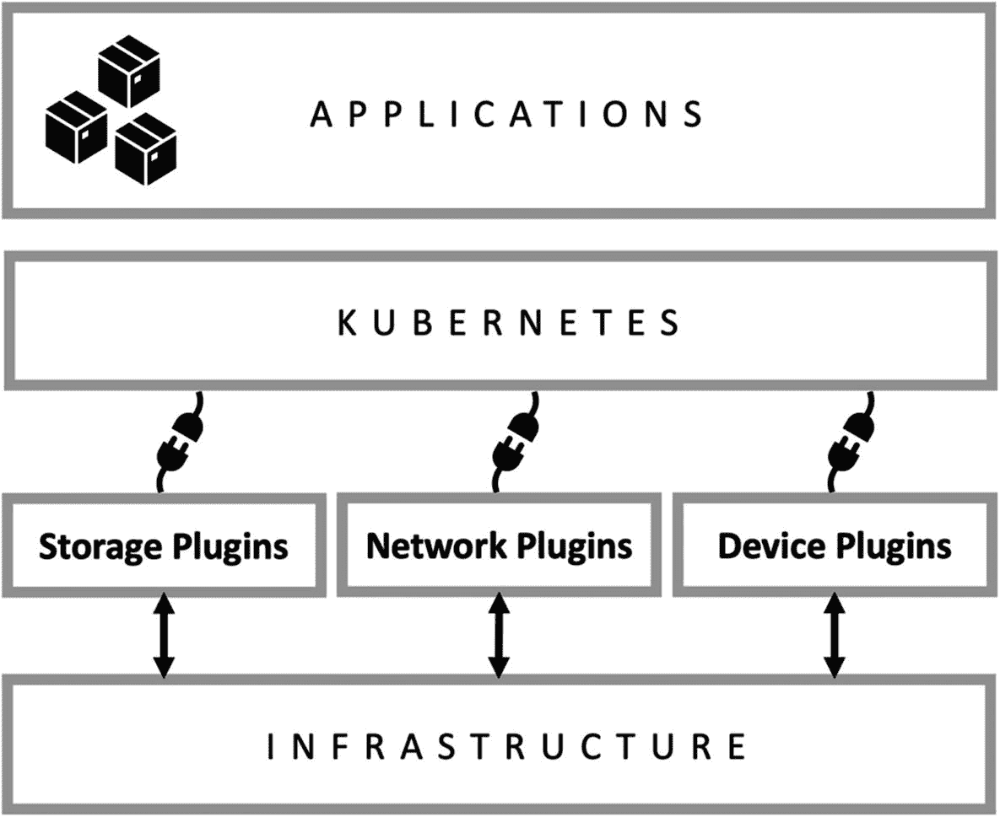
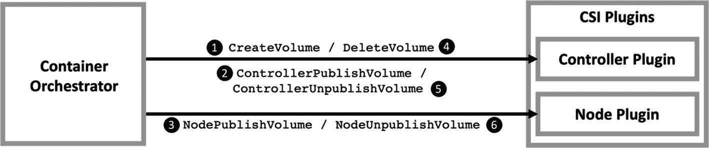
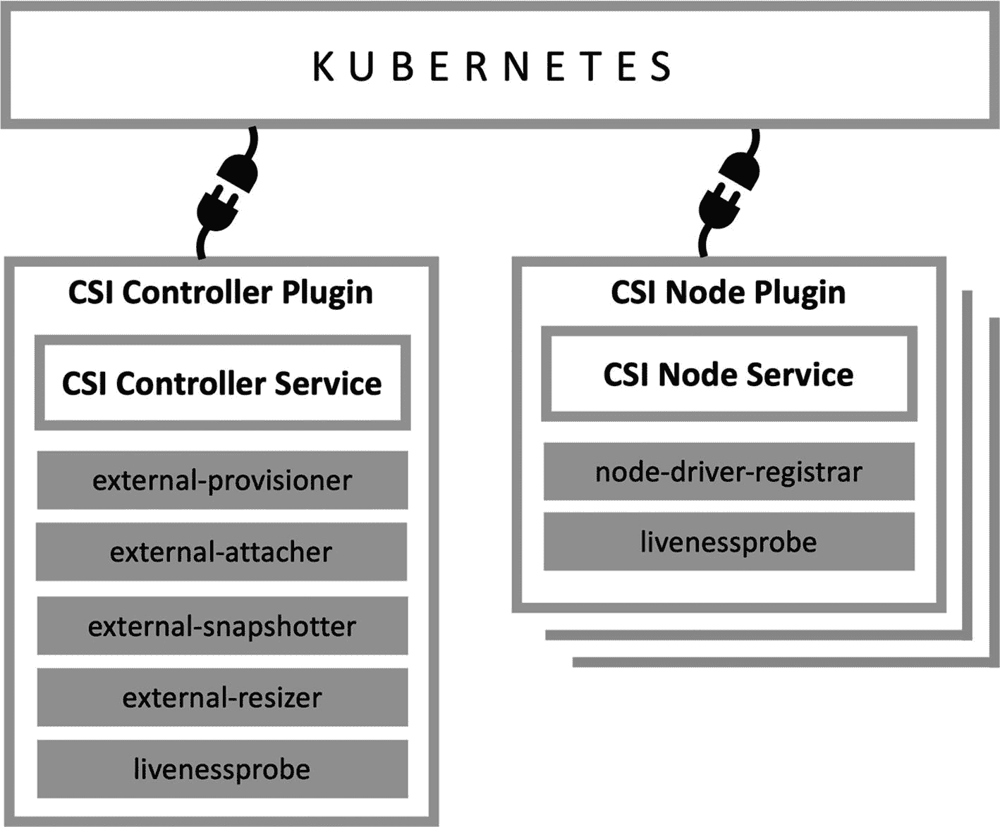
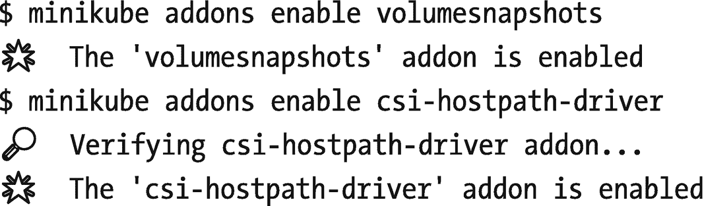
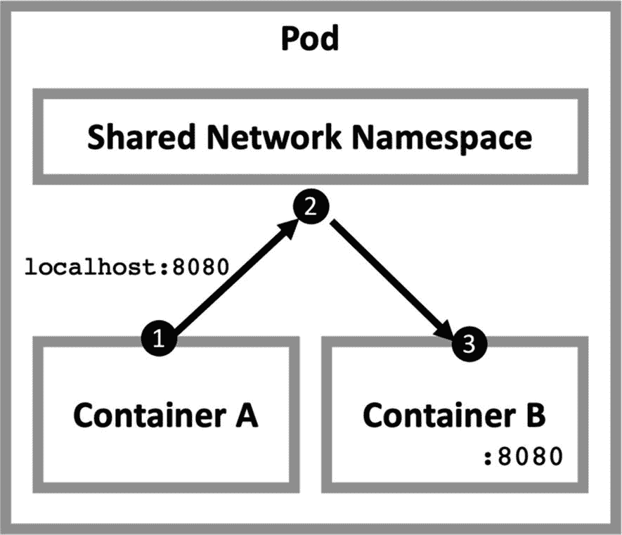
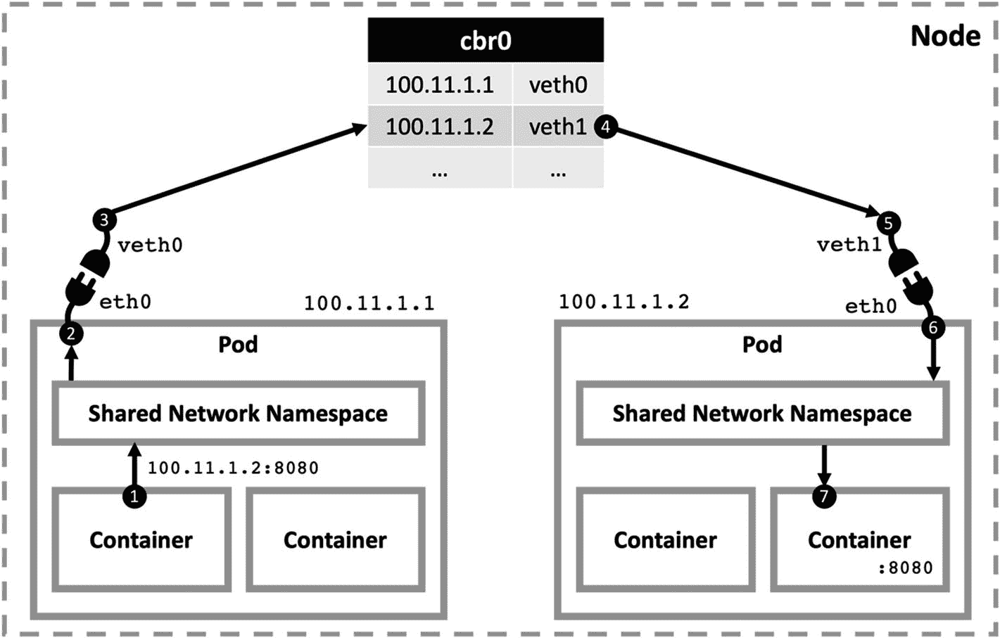
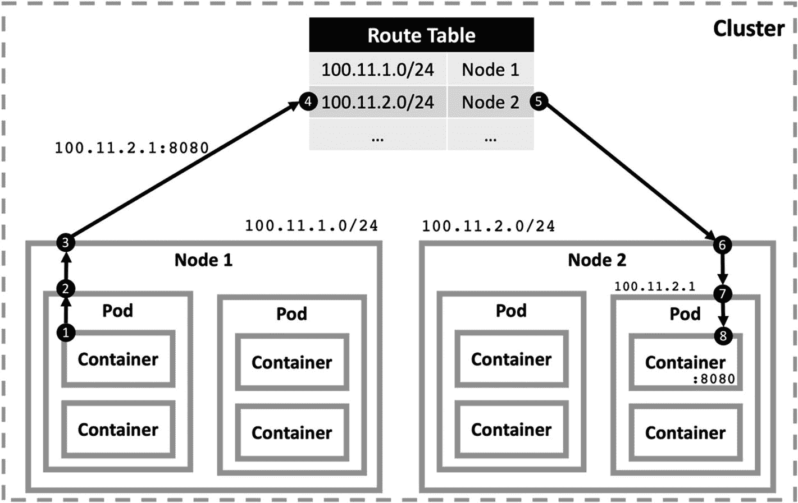
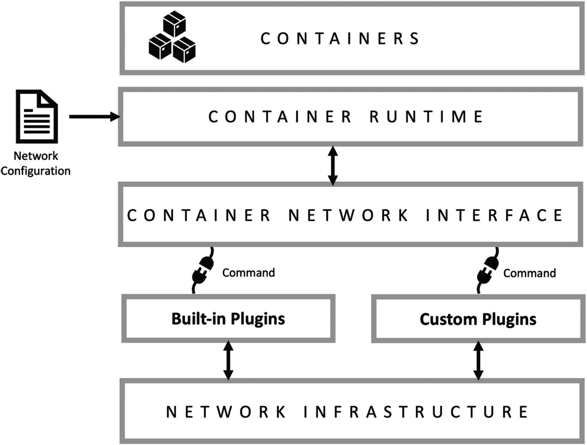
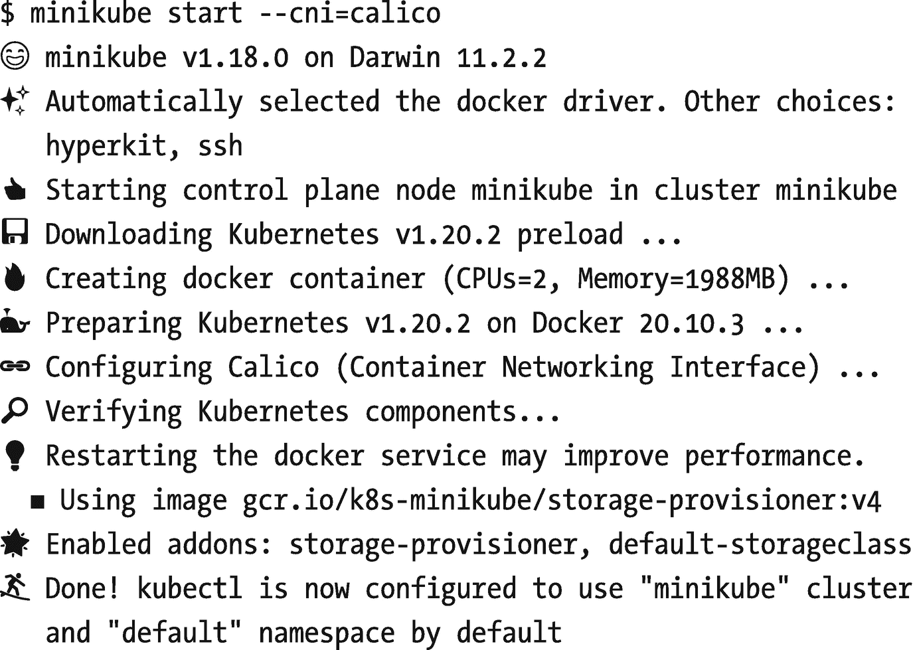
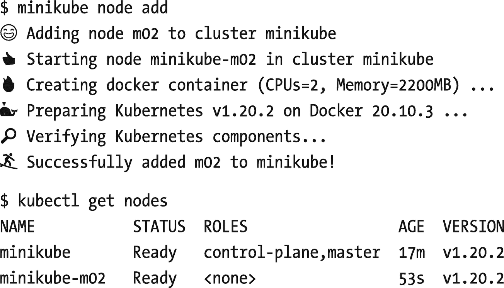

# 六、基础设施扩展

> *凭借稳定的基础设施快速移动。*
> 
> —马克·扎克伯格
> 
> 美国企业家、脸书创始人兼首席执行官

Kubernetes 是事实上的容器编排系统，它提供什么，也不提供什么。Kubernetes 提供了可伸缩的、可靠的容器运行时管理，但是它将与基础设施相关的决策留给了最终用户。它允许用户在任何基础设施上创建他们的集群，只要它符合 API。本章将重点关注通过改变底层的云原生基础设施来扩展 Kubernetes。本章结束时，您将配置和运行存储、网络和设备插件，以实现定制和灵活的要求。

让我们从云原生基础设施以及 Kubernetes 如何集成它的概述开始。

## 云原生基础架构

Kubernetes 不是一个"*编写一次，在任何地方运行*"类型的系统，但它也不限制任何云提供商或本地系统。它允许用户从生态系统中广泛的开放式基础架构选项中进行选择。您可以在几乎所有公共云提供商、数据中心甚至笔记本电脑上创建 Kubernetes 集群。然而，制作云原生应用需要底层的云原生基础设施。基础设施的设计应充分利用虚拟化和分布式微服务架构。

Kubernetes 是容器编排，所以它的重点是创建、运行和操作容器。然而，容器不是运行在裸机节点上的简单应用。相反，它们是需要复杂存储、网络和设备操作的虚拟化系统。图 [6-1](#Fig1) 显示了 Kubernetes 的堆叠情况。底层有与物理基础设施交互的存储、网络和设备插件。当它实现连接性和容量时，Kubernetes 可以创建和运行您的容器作为 pod 的构建块。Kubernetes 的上层使得用更复杂的 Kubernetes 资源开发可伸缩的、可靠的、云原生的应用成为可能。



图 6-1

Kubernetes 和基础设施

基础设施和 Kubernetes 之间的插件是将您的基础设施与定制存储或网络解决方案连接起来的工具。由于 Kubernetes 并不强制执行“一刀切”的方法，因此它可以与提供的每一个基础设施一起工作，只要它们符合公开可用的插件 API。在接下来的章节中，我们将介绍这三个插件及其 API 和示例。

## 存储插件

存储因其耐用性和刚性特征而成为云原生架构的挑战之一。容器是临时的，Kubernetes 可以重新启动或重新安排它们。如果有卷连接到容器，它们也可能会丢失。但是，您需要将数据库、ERP 系统和以数据为中心的应用部署到 Kubernetes，因此并不是集群中运行的所有应用都是短暂的。因此，基础设施应该将容器的应用数据作为持久存储的一部分。

让我们看看持久存储在 Kubernetes 中是如何工作的。用以下数据创建一个`PersistentVolumeClaim` (PVC)。

```
kind: PersistentVolumeClaim
apiVersion: v1
metadata:
 name: pvc-test
spec:
 accessModes:
 - ReadWriteOnce
 requests:
 storage: 1Gi

Listing 6-1Example PVC

```

现在，检查集群中的`PersistentVolumeClaim`和`PersistentVolume`资源。

```
$ kubectl get pvc
NAME       STATUS   VOLUME                                     CAPACITY   ACCESS MODES   STORAGECLASS   AGE
pvc-test   Bound    pvc-467fa613-0396-481a-aa73-d4b6c5fbcc4b   1Gi        RWO            standard       10s

$ kubectl get pv
NAME                                       CAPACITY   ACCESS MODES   RECLAIM POLICY   STATUS   CLAIM              STORAGECLASS   REASON   AGE
pvc-467fa613-0396-481a-aa73-d4b6c5fbcc4b   1Gi        RWO            Delete           Bound    default/pvc-test   standard                13s

Listing 6-2Volume listing

```

在 PVC 中，您请求了一个带有`1Gi`的卷，集群相应地创建了一个`PersistentVolume`。现在，您可以在 pod、statefulsets 甚至函数中使用它来存储您的应用数据。Kubernetes 中的 PVC 和 PV 看起来很简单，因为它从基础设施层创建了一个强大的抽象。作为最终用户，我们不需要知道基础架构中存储的生命周期:

*   卷是如何创建的？

*   分配了多少容量？

*   卷附在哪里？

*   如何提供对存储的访问？

*   如何管理卷的备份和恢复？

存储供应商和 Kubernetes 之间的通信被标准化为一个开源 API。因此，实施细节和问题的答案留给存储提供商。Kubernetes 和存储基础设施之间的抽象在*容器存储接口(CSI)* 中定义，接下来您将学习它的基础知识。

### 容器存储接口

容器存储接口(CSI)是一个开源 API，使容器编排器能够与存储系统一起工作。在 Kubernetes 的早期阶段，卷是由编译成 Kubernetes 二进制文件的插件管理的。随着供应商数量的增加，管理树内插件变得更加复杂。此外，它创建了一个封闭的环境，因为添加新的存储供应商需要成为 Kubernetes 源代码的一部分。另一方面，CSI 插件是具有开放标准 API 的外部应用。

从厂商的角度来看，主要优势是只开发插件，遵循 CSI 的要求。与每一个容器 orchestrator 合作就足够了，比如 Kubernetes、Apache Mesos，以及未来的许多合作伙伴。CSI 插件提供以下功能:

*   卷的动态供应和停用

*   卷的连接/安装和分离/卸载

完整的规范可从 GitHub 获得，包括所有的功能、请求和响应。CSI 插件和容器编排器之间的通信由 *gRPC(远程过程调用* *)* 处理，这是一个开放的高性能通信框架。

CSI 插件分为两种，即节点插件和控制器插件:

*   **节点插件**是一个 gRPC 服务器，运行在存储提供商卷被配置的节点上。

*   **控制器插件**是一个 gRPC 服务器，可以在集群中的任何地方运行。

这两个插件还实现了一个 Identity gRPC 服务来提供关于它们功能的信息。因此，您可以将节点和控制器插件部署为两个二进制文件，也可以组合成一个二进制文件。

下图图 [6-2](#Fig2) 总结了 gRPC 调用卷的生命周期。



图 6-2

动态卷的生命周期

流程开始于对*控制器插件*的`CreateVolume`调用，以提供新的卷。然后，进行`ControllerPublishVolume`调用以指示容器编排器想要使用卷上的节点。在这一步中，插件执行使卷在给定节点上可用的必要工作。随后，`NodePublishVolume`调用被发送到在特定节点上运行的*节点插件*，以发布工作负载已被调度并且它想要使用该卷。类似地，`NodeUnpublishVolume`、`ControllerUnpublishVolume`和`DeleteVolume`调用是在删除存储提供商中的卷时进行的。

CSI 界面使用起来很简单，但是将卷集成到一个容器编排系统(如 Kubernetes)中就不那么简单了。在下一节中，您将了解如何将 CSI 插件集成到 Kubernetes 中。

### kubernetes 中的 CSI 插件

CSI 是存储系统与 Kubernetes 等容器编排系统一起工作的标准。主要想法是让供应商开发插件，并将其安装到容器编排器中。在本节中，您将了解 Kubernetes 如何将 CSI 插件与本地 Kubernetes 资源集成在一起。

Kubernetes 用以下两条规则定义了`kubelet`和 CSI 插件之间的通信:

*   `kubelet`运行在节点上，直接调用 CSI 函数。因此，CSI 插件应该在节点上运行，其 Unix 套接字对`kubelet`可用。

*   `kubelet` *发现*带有插件注册机制的 CSI 插件。因此，CSI 插件应该向运行在节点上的`kubelet`注册自己。

此外，Kubernetes 存储社区提供了 sidecar 容器和资源，以最大限度地减少部署工作和样板代码。Sidecar 容器具有观察 Kubernetes API 和触发针对 CSI 插件的动作的通用逻辑。想法是将 sidecar 容器与 CSI 插件捆绑在一起，并将它们作为 pods 部署到集群中。使用边车容器不是强制性的；然而，我们强烈建议这样做，因为它们在 Kubernetes 和 CSI 之间创建了一个强大的抽象。目前，维护下列边车:

*   **外部供应器**:它在 Kubernetes API 中监视`PersistentVolumeClaim`对象，并针对 CSI 插件调用`CreateVolume`。当供应新卷时，外部供应器在 Kubernetes API 中创建一个`PersistentVolume`对象。

*   **外部附加器**:通过调用 CSI 驱动程序的`ControllerPublish`函数，将卷附加到节点上。

*   **外部快照**:它在 Kubernetes API 中监听`VolumeSnapshotContent`资源，对 CSI 驱动采取`CreateSnapshot`、`DeleteSnapshot`、`ListSnapshots`动作。

*   **external-resizer** :它监视`PersistentVolumeClaim`对象的变化，以捕捉是否有更多的存储请求。在这种情况下，它调用 CSI 插件的`ControllerExpandVolume`函数。

*   **节点-驱动-注册器**:从插件端点获取 CSI 驱动信息，并注册到`kubelet`。

*   **livenessprobe** :它监控 CSI 插件端点的健康状况，并在必要时帮助 Kubernetes 重启 pod。

如图 [6-3](#Fig3) 所示，CSI 插件通常作为两个组件部署到 Kubernetes，由边车容器打包。



图 6-3

CSI 在 Kubernetes 的部署

**控制器插件**由实现控制器服务的 CSI 插件和以下 sidecars 组成:外部供应器、外部附加器、外部快照器和外部调整大小器。它可以作为 deployment 或 statefulset 进行部署，因为它可以在集群中的任何节点上运行。

**节点插件**由一个 CSI 插件组成，用 node-driver-registrar sidecar 实现节点服务。它应该由 DaemonSet 部署在集群中的每个节点上。

sidecars 使得开发一个定制的存储插件，并将其集成到 Kubernetes 是很简单的。您只需要按照标准实现 CSI 服务。所有云提供商(如 Google Cloud、Azure、AWS 或 AliCloud)、基础设施提供商(如 IBM、Dell、VMware 或 Hewlett Packard)和存储技术(如 OpenEBS、GlusterFS 或 Vault)都已经准备好了他们的 CSI 驱动程序，并且[公开可用](https://kubernetes-csi.github.io/docs/drivers.html)。下一节将配置 CSI 驱动程序并将其部署到 Kubernetes 集群中，并查看它的运行情况。

#### CSI 主机路径驱动程序正在运行

CSI 主机路径驱动程序是使用本地目录创建卷的 CSI 实现。因此，它是非生产驱动程序，在单个节点上运行。在本节中，我们将把它部署到集群中，并查看它的运行情况。

让我们通过运行`minikube start --kubernetes-version v1.19.0`来创建一个`minikube`集群。

当您的集群启动并运行时，启用`volumesnapshots`和`csi-hostpath-driver`插件。

***清单 6-3。*** 迷你裙



第一个命令启用`volumesnapshots`并部署卷快照控制器和卷快照 CRDs。由于`minikube`是一个单节点集群，默认情况下，没有可用的 CSI 实现。第二个命令部署 *CSI Hostpath 驱动*，它将为你提供存储。

下一步是检查集群中安装了哪些`CSIDrivers`。

```
$ kubectl get CSIDrivers
NAME                  ATTACHREQUIRED   PODINFOONMOUNT   MODES                  AGE
hostpath.csi.k8s.io   true             true             Persistent,Ephemeral   9m17s

Listing 6-4CSIDrivers in the cluster

```

CSI 驱动程序的名称遵循域名符号`hostpath.csi.k8s.io`。此外，hostpath 驱动程序管理的卷应该有`StorageClass`。

```
$ kubectl get StorageClass
NAME                 PROVISIONER                RECLAIMPOLICY   VOLUMEBINDINGMODE   ALLOWVOLUMEEXPANSION   AGE
csi-hostpath-sc      hostpath.csi.k8s.io        Delete          Immediate           false                  12m
standard (default)   k8s.io/minikube-hostpath   Delete          Immediate           false                  18m

Listing 6-5Storage classes in the cluster

```

除了 minikube 的`default`存储集群，您还会看到一个名为`csi-hostpath-sc`的 CSI 管理的存储类。

现在，让我们深入了解插件和 sidecar 容器是如何部署的。

```
$ kubectl -n kube-system get statefulset
NAME                         READY   AGE
csi-hostpath-attacher        1/1     20m
csi-hostpath-provisioner     1/1     20m
csi-hostpath-resizer         1/1     20m
csi-hostpath-snapshotter     1/1     20m
csi-hostpathplugin           1/1     20m
volume-snapshot-controller   1/1     20m

Listing 6-6Statefulsets in the kube-system namespace

```

你可以一个接一个地检查每个状态集合，检查容器或者运行下面的`jq`魔法。

```
$ kubectl -n kube-system get statefulsets -o json | jq '.items[] | "\(.metadata.name): \(.spec.template.spec.containers[].name)"'
"csi-hostpath-attacher: csi-attacher"
"csi-hostpath-provisioner: csi-provisioner"
"csi-hostpath-resizer: csi-resizer"
"csi-hostpath-snapshotter: csi-snapshotter"
"csi-hostpathplugin: node-driver-registrar"
"csi-hostpathplugin: hostpath"
"csi-hostpathplugin: liveness-probe"
"volume-snapshot-controller: volume-snapshot-controller"

Listing 6-7Statefulsets and containers in the kube-system namespace

```

如您所见，控制器边盘独立运行，而节点边盘打包在`csi-hostpathplugin` statefulset 中。sidecars 和驱动程序之间的连接是通过共享 Unix 套接字作为卷来处理的。

```
$ kubectl -n kube-system describe statefulsets csi-hostpath-provisioner
Name:               csi-hostpath-provisioner
Namespace:          kube-system
...
  Volumes:
   socket-dir:
    Type:          HostPath (bare host directory volume)
    Path:          /var/lib/kubelet/plugins/csi-hostpath
    HostPathType:  Director

Listing 6-8Description of csi-hostpath-provisioner

```

从前面的命令输出可以看出，`csi-provisioner` sidecar 容器使用卷`socket-dir`中定义的套接字连接到 CSI 服务。

用以下内容创建一个名为`example-pvc.yaml`的文件。

```
apiVersion: v1
kind: PersistentVolumeClaim
metadata:
  name: example-pvc
spec:
  accessModes:
  - ReadWriteOnce
  resources:
    requests:
      storage: 1Gi
  storageClassName: csi-hostpath-sc

Listing 6-9Example PVC

```

部署到群集并检查卷。

```
$ kubectl apply -f example-pvc.yaml
persistentvolumeclaim/example-pvc created

$ kubectl get pv
NAME                                       CAPACITY   ACCESS MODES   RECLAIM POLICY   STATUS   CLAIM                 STORAGECLASS      REASON   AGE
pvc-dd4570bc-58cc-4074-a284-b13651970d17   1Gi        RWO            Delete           Bound    default/example-pvc   csi-hostpath-sc            13s

Listing 6-10Volume creation

```

使用正确的存储类为`PersistentVolumeClaim`创建了一个卷，并对其进行了绑定。让我们检查 CSI 服务的日志并检查`CreateVolume`呼叫。

```
$ kubectl -n kube-system logs csi-hostpathplugin-0 hostpath | grep -A 3 CreateVolume
* GRPC call: /csi.v1.Controller/CreateVolume
* GRPC request: {"accessibility_requirements":{"preferred":[{"segments":{"topology.hostpath.csi/node":"minikube"}}],"requisite":[{"segments":{"topology.hostpath.csi/node":"minikube"}}]},"capacity_range":{"required_bytes":1073741824},"name":"pvc-dd4570bc-58cc-4074-a284-b13651970d17","volume_capabilities":[{"AccessType":{"Mount":{}},"access_mode":{"mode":1}}]}
created volume af5c51ee-7aa2-11eb-a960-0242ac110004 at path /csi-data-dir/af5c51ee-7aa2-11eb-a960-0242ac110004
* GRPC response: {"volume":{"accessible_topology":[{"segments":{"topology.hostpath.csi/node":"minikube"}}],"capacity_bytes":1073741824,"volume_id":"af5c51ee-7aa2-11eb-a960-0242ac110004"}}

Listing 6-11CSI logs

```

gRPC 调用和响应表明 hostpath 服务按照`PersistentVolumeClaim`中的请求创建了卷。边车容器处理从`PersistentVolumeClaim`到有效 CSI 呼叫的转换。这种抽象使得 CSI 插件不关心容器编排器的实现细节。

通过遵循本节中的步骤，您已经将 CSI 插件部署到 Kubernetes 集群中，并检查了它是如何集成到 Kubernetes 生态系统中的。此外，您还看到了在 Kubernetes 中，it 是如何根据请求调配存储的。在 Kubernetes 中创建和操作 CSI 插件时有三个要点:

*   **CSI 规范和功能**:确保您已经实施了与您的基础设施相关的所有必需功能。

*   **等幂和容错驱动** : CSI 驱动在容器编排器和基础设施之间建立了一座桥梁。因此，请求应该是幂等的，并且能够从失败中恢复。

*   **Kubernetes 边车和资源** : Kubernetes 存储社区提供边车容器和定制资源，以便将 CSI 服务轻松集成到集群中。在即将到来的 CSI 和 Kubernetes 版本中使用它们。

容器存储接口(CSI)是扩展 Kubernetes 存储操作的开源 API。它支持定制存储要求和基础架构特征。您可以通过实现所需的服务来创建 CSI 插件，并使用本地 Kubernetes 资源进行部署。然后，您可以在 Kubernetes 中动态创建卷，CSI 插件将在基础设施层提供存储。关注点的抽象和分离使得为 Kubernetes 轻松开发、测试和部署存储扩展成为可能。

下一节将介绍 Kubernetes 和网络基础设施与 Kubernetes 网络模型和容器网络接口(CNI)插件之间的交互。

## 网络插件

Kubernetes 是一个可伸缩的容器编排工具，可以在集群中的多个节点之间分配工作负载。因此，分布在数据中心的容器和节点之间的通信带来了基础设施挑战。由于其开放的架构，Kubernetes 没有规定任何网络设置，而只是定义了需求。Kubernetes 和基础设施的分离使供应商能够开发他们的插件并将其集成到 Kubernetes 中。

在这一节中，您将了解到更多关于 Kubernetes 网络模型和网络集成规范的知识，最后，您将看到正在运行的插件。

### 库柏网络模型

Kubernetes 的构造块是 pod，每个 pod 都有一个唯一的 IP 地址。这种方法有两个显著的优点:首先，您不需要开发 pod 之间的复杂链接，包括容器端口到主机端口的匹配。其次，在命名、服务发现、负载平衡和应用配置方面，您可以像对待虚拟机一样对待 pod。

Kubernetes 在网络实施中需要以下基本规则:

*   节点上的 Pod 可以与群集中的所有 pod 通信，而无需 NAT。

*   系统守护程序或`kubelet`等节点代理可以与同一节点上的所有 pod 通信。

用这两个规则定义的简化模型源于分配了 IP 的虚拟机及其与其他虚拟机的通信。Kubernetes 中的模型被命名为“ *IP-per-pod* ”，这表明 IP 地址存在于 pod 范围内。虽然实现细节留给了网络插件，但是可以讨论和说明三个主要的通信挑战:

*   同一容器的容器

*   同一节点上的单元

*   不同节点上的 pod

Kubernetes 中的一个 pod 由一个或多个用户定义的容器和一个附加的`pause`容器组成。您可以通过连接到 Kubernetes 节点来检查`pause`容器。

```
$ docker ps
CONTAINER ID IMAGE COMMAND ...
...
tm574dmcbc gcr.io/google_containers/pause-amd64:3.0 "/pause" ...
...
zsxqd5lcvx gcr.io/google_containers/pause-amd64:3.0 "/pause" ...
...

Listing 6-12Containers on a Kubernetes node

```

容器的基本任务是在其他容器崩溃并重新连接时创建并保持网络名称空间。它确保所有 pod 的容器共享一个网络名称空间，并通过`localhost`连接。如图 [6-4](#Fig4) 所示，容器 A 可以通过`localhost:8080`连接到容器 B 的`8080`口。



图 6-4

容器对容器通信

每个 pod 都有其网络名称空间和唯一的 IP 地址。此外，每个 pod 都有一个虚拟以太网设备。虚拟以太网设备在节点和 pod 网络之间创建一个隧道。虚拟隧道的命名在 pod 端为`eth0`，在节点端为`veth0`、`veth1`和`vethN`。因此，请求从 pod 的`eth0`接口开始，到达`vethN`接口。在节点上，有一个名为`cbr0`的网桥连接多个网络。节点上的每个 pod 都是`cbr0`桥的一部分，请求通过它找到自己的路，如图 [6-5](#Fig5) 所示。



图 6-5

同一节点上的点对点通信

节点上的网桥知道 pod IPs 及其虚拟以太网设备。当一个 pod 试图连接到网桥中没有列出的 IP 时，路由就变得有点复杂。尽管实现可能因网络插件和基础设施而异，但我们可以讨论如图 [6-6](#Fig6) 所示的请求的典型流程。当网桥没有关于 IP 的信息时，它会在集群级别请求一个默认网关。在群集级别，为节点及其 IP 保存一个 IP 表。在典型的设置中，pod IPs 在节点之间分配，例如，*节点 1* 具有`100.11.1.0/24`范围，*节点 2* 具有`100.11.2.0/24`范围，等等。当找到正确的节点时，请求会发送到网桥、虚拟以太网，最后是 pod。



图 6-6

不同节点上的点对点通信

Kubernetes 网络实现处理节点和集群级别之间的通信。这些实现遵循容器网络接口(CNI)，一种开源 API 规范，并且它们作为插件安装到集群中。在接下来的部分中，您将了解更多关于 CNI 的信息，并看到它的实际应用。

### 容器网络接口(CNI)

容器网络接口(CNI)是网络插件和容器运行时之间的标准接口定义。它被所有重要的容器编排者采用，比如 Kubernetes、Mesos 和 Cloud Foundry。此外，各种云提供商，如 Amazon ECS、OpenShift、Cisco 和 VMware，也将 CNI 插件作为其容器平台的一部分。因此，开发一个遵循 CNI 标准的新网络插件将使你与大多数现代云生态系统兼容。

CNI 由基于 JSON 的二进制插件规范、内置插件和开发定制第三方插件的库组成。CNI 团队在[三组](https://github.com/containernetworking/plugins)下提供并维护以下内置插件:

*   **创建界面的主要插件:**
    *   创建一个桥，并将主机和容器添加到桥中。

    *   `ipvlan`在容器中添加一个 ipvlan 接口。

    *   `loopback`将环回接口的状态设置为 up。

    *   `macvlan`创建新的 MAC 地址，并将所有流量转发到容器。

    *   创建一个 veth 对。

    *   `vlan`分配一个 vlan 设备。

    *   `host-device`将现有设备移入容器。

    *   `win-bridge`创建一个桥，并在特定于 Windows 的环境中向其中添加主机和容器。

    *   在特定于 Windows 的环境中创建容器的覆盖接口。

*   **IPAM 插件** **进行 IP 地址分配:**
    *   `dhcp`在主机上运行一个守护程序，代表容器发出 DHCP 请求。

    *   `host-local`维护已分配 IP 的本地数据库。

    *   `static`给容器分配静态 IP 地址。

*   **元和其他插件:**
    *   `flannel`生成一个法兰绒配置文件对应的接口。

    *   `tuning`调整现有接口的 sysctl 参数。

    *   `portmap`维护基于 iptables 的端口映射，并将端口从主机映射到容器。

    *   `bandwidth`允许带宽限制。

    *   `sbr`配置基于源的路由。

    *   `firewall`使用 iptables 或 firewalld 添加规则，以允许进出容器的流量。

CNI 用面向插件的方法关注容器的网络连接。列出的插件涵盖了基本的网络操作，如创建网桥、IP 分配或主机和容器之间的连接。除了内置插件之外，还维护了一个带有样板代码的[示例插件](https://github.com/containernetworking/plugins/tree/master/plugins/sample)，以便轻松开发定制的 CNI 插件。

CNI 插件的集成从提供给容器运行时的 JSON 网络配置开始，如图 [6-7](#Fig7) 所示。然后，运行时使用基于容器生命周期的命令调用 CNI 可执行文件。该插件在网络基础设施上运行，并连接容器以创建容器编排的结构。



图 6-7

CNI 和容器运行时集成

根据规范，您应该实现以下命令:

*   `ADD`向网络添加容器的命令

*   `DEL`从网络中移除容器的命令

*   `CHECK`验证连通性的命令

*   `VERSION`返回支持的 CNI 版本

由于 CNI 的命令和期望很简单，你可以在`BASH`中创建你的插件，并将其部署为一个定制的第三方插件。在下一节中，您将了解更多关于 Kubernetes 中的 CNI 插件及其集成。

#### CNI 插件在 kubernetes 中的应用

Kubernetes 是 CNI 的维护者、最积极的贡献者和热心用户。Kubernetes 要求容器到达位于相同或远程节点上的其他容器。当你在诸如 GCP、AWS 或 Azure 这样的云平台上创建一个 Kubernetes 集群时，这个网络*就*起作用了。云提供商安装并配置了他们的 CNI 插件，以最佳方式与他们的基础设施协同工作。然而，当您创建本地 Kubernetes 集群时，您可以自由选择 CNI 插件或从头开始开发。

[containernetwork ing/ cni](https://github.com/containernetworking/cni) 官方资源库中列出了近 30 个第三方 CNI 插件。每个插件都有其优点和缺点；因此，比较是相当棘手的。但是，我们可以讨论特色插件及其基本特性:

*   [法兰绒](https://github.com/flannel-io/flannel)是最古老、最成熟的插件之一，它提供了一种简单易行的方式来配置第三层网络结构。它负责提供和管理集群节点之间的 IP 网络。很容易将它部署到 Kubernetes 集群，因为它在每个节点上作为 DaemonSet 运行。

*   编织网是一个简单易用的 CNI 插件，不需要复杂的配置或额外的代码。此外，Weave Net 还提供了额外的功能，如 DNS、IPAM 和防火墙。您可以使用命令行工具 weave 来配置和启动网络结构。

*   Multus 是 Kubernetes 的一个插件，可以将多个网络接口连接到 pods。默认情况下，Kubernetes 中的每个 pod 只有一个接口；然而，multus 作为一个元插件来调用其他各种 CNI 插件。它是通过 CRDs 配置的，所以在设计上是 Kubernetes-native。

*   Calico 是一个针对容器、虚拟机和节点服务的网络和安全解决方案。它支持各种数据平面，如纯 Linux eBPF、标准 Linux 网络或 Windows HNS 数据平面。它提供了完整的网络堆栈；但是，通常将其与其他云提供商 CNIs 结合使用，以提供网络策略功能。

在下一节中，您将看到 Calico 在 Kubernetes 集群中运行。

#### 卡利科 CNI 插件在行动

默认情况下，`minikube`提供一个具有基本网络设置的单节点 Kubernetes 集群。您可以使用以下命令启用 CNI 并安装 Calico。

***清单 6-13。**用印花布做的*



几秒钟后，安装将完成，您可以使用以下命令检查 Calico pods。

```
$ kubectl -n kube-system get pods -l k8s-app=calico-node
NAME                READY   STATUS    RESTARTS  AGE
calico-node-p9bjs   1/1     Running   0         4m46s

Listing 6-14Calico pods

```

现在，向`minikube`添加第二个节点，并检查它是否已经连接到集群。

***清单 6-15。*** 向集群添加节点



清单显示了两个节点，这表明节点之间的网络连接已经成功建立。现在，让我们深入了解一下一直在运行什么，以及它是如何配置的。

在集群的每个节点上，都应该有一个 Calico 应用在运行。

```
$ kubectl -n kube-system get daemonsets
NAME         DESIRED  CURRENT  READY  UP-TO-DATE  AVAILABLE  NODE SELECTOR           AGE
calico-node  2        2        2      2           2      kubernetes.io/os=linux  18m
kube-proxy   2        2        2      2           2      kubernetes.io/os=linux  18m

Listing 6-16DaemonSets in the cluster

```

Calico 应以 JSON 格式提供网络配置。您可以在节点中使用以下命令进行检查。

```
$ minikube ssh
docker@minikube:~$ cat /etc/cni/net.d/10-calico.conflist
{
 "name": "k8s-pod-network",
 "cniVersion": "0.3.1",
 "plugins": [
  {
   "type": "calico",
   "log_level": "info",
   "datastore_type": "kubernetes",
   "nodename": "minikube",
   "mtu": 1440,
   "ipam": {
     "type": "calico-ipam"
   },
   "policy": {
     "type": "k8s"
   },
   "kubernetes": {
     "kubeconfig": "/etc/cni/net.d/calico-kubeconfig"
   }
  },
  {
   "type": "portmap",
   "snat": true,
   "capabilities": {"portMappings": true}
  },
  {
   "type": "bandwidth",
   "capabilities": {"bandwidth": true}
  }
 ]
}

Listing 6-17Network configuration in the cluster

```

最后，当 CNI 插件遵循二进制扩展模式时，预计会在主机系统中看到 CNI 二进制文件。让我们检查节点中的二进制文件夹。

```
docker@minikube:~$ ls /opt/cni/bin/
bandwidth calico    dhcp   flannel   host-local loopback portmap sbr   tuning vrf
bridge   calico-ipam firewall host-device ipvlan   macvlan  ptp   static vlan

Listing 6-18CNI binaries

```

随着 Calico 的安装，CNI 插件和配置被部署到 Kubernetes 节点。如果您需要通过配置、安装或开发 CNI 插件来扩展 Kubernetes 的网络功能，您需要遵循相同的模式。如果您打算构建自己的 CNI 插件，以下三点值得一提:

*   **可扩展性**:就可扩展性而言，网络既是瓶颈也是机遇。在扩展节点时，您会发现自己受到网络拓扑的复杂性和开销的限制。因此，您需要根据集群的预期节点数量来设计您的 CNI 插件。

*   基础设施限制:大多数 CNI 插件都是通过在上层创建解决方案来克服基础设施限制的。了解您的计算和网络基础设施中的界限和障碍，并相应地设计您的 CNI 插件。

*   **复杂度 vs .功能集**:当你看着可用的第三方 CNI 插件，你会被提供的功能淹没。建议从小处着手，先给出必备功能。例如，如果你不希望使用网络策略，你可以在设计你的 CNI 插件时去掉这个特性。

在下一节中，设备插件将作为 Kubernetes 的第三个也是最后一个基础设施扩展点来讨论。

## 设备插件

Kubernetes 工作负载在节点上运行并消耗资源。节点上的资源可以是 CPU、内存、存储或供应商提供的任何自定义设备，如 GPU、高性能网卡或 FPGAs。由于在源代码中把所有的厂商和设备都作为一个资源来覆盖是不可行的，Kubernetes 提供了一个设备插件框架。框架是通过`kubelet`通告和分配系统硬件资源的扩展点。供应商不定制代码，而是实现他们的插件并部署到集群中，以扩展 Kubernetes 的资源分配机制。

在本节中，您将了解设备插件 API 和生命周期。此外，您将从头开始开发一个设备插件，并将其部署到集群中以查看其运行情况。

### 设备插件 API

设备插件是在节点上运行并与`kubelet`通信的应用。因此，它们遵循二进制插件扩展模式。入口点是使用提供的 gRPC 服务注册到`kubelet`。

```
service Registration {
      rpc Register(RegisterRequest) returns (Empty) {}
}

Listing 6-19kubelet registration service

```

在注册中，插件向位于`/var/lib/kubelet/device-plugins/kubelet.sock`的`kubelet` Unix 套接字发送以下信息:

*   设备插件插座的名称

*   设备插件 API 版本

*   扩展资源命名方案中的资源名称，如`vendor-domain/resource-type`

注册后，设备插件负责使用位于`/var/lib/kubelet/device-plugins/`的 Unix 套接字提供 gRPC 服务。该服务实现以下接口。

*   `GetDevicePluginOptions`是提供关于插件信息的元功能。

*   `ListAndWatch`是持续运行的功能，用于传输更新的设备列表。

*   `Allocate`是在容器创建过程中调用的基本函数。设备插件处理与基础设施相关的准备操作。然后，它返回参数以使设备对容器可用。

*   `GetPreferredAllocation`和`PreStartContainer`功能是可选功能。

```
service DevicePlugin {
      rpc GetDevicePluginOptions(Empty) returns (DevicePluginOptions) {}
      rpc ListAndWatch(Empty) returns (stream ListAndWatchResponse) {}
      rpc Allocate(AllocateRequest) returns (AllocateResponse) {}
      rpc GetPreferredAllocation(PreferredAllocationRequest) returns (PreferredAllocationResponse) {}
      rpc PreStartContainer(PreStartContainerRequest) returns (PreStartContainerResponse) {}
}

Listing 6-20Device plugin interface

```

pods 请求定制设备插件资源作为其容器规范的一部分。例如，如果设备插件广告说在节点上有十个`extend-k8s.io/custom-resource`实例可用，那么 Kubernetes API 就使用这个信息来决定节点状态和调度。以下 pod 定义需要三个`extend-k8s.io/custom-resource`设备实例。Kubernetes 只会将 pod 调度到一个节点，如果有足够的资源来满足需求的话。

```
apiVersion: v1
kind: Pod
metadata:
  name: example-pod
spec:
  containers:
    - name: example-container
      image: k8s.gcr.io/pause:2.0
      resources:
        limits:
          extend-k8s.io/custom-resource: 3

Listing 6-21Pod with custom device resource

```

设备插件应该在 Kubernetes 节点上可用，更具体地说是在`/var/lib/kubelet/device-plugins`文件夹中。因此，您需要手动安装它们，或者将它们作为 DaemonSet 部署在集群中。DaemonSets 有额外的优势，如自动升级和在`kubelet`失败后重启插件。

在云原生生态系统中已经有一些设备插件实现。这些是由供应商创建和维护的开源插件:

*   [AMD GPU 设备插件](https://github.com/RadeonOpenCompute/k8s-device-plugin)

*   [NVIDIA GPU 设备插件](https://github.com/NVIDIA/k8s-device-plugin)

*   面向 GPU、FPGA、QAT、VPU、SGX 和 DSA 设备的英特尔设备插件

*   [KubeVirt 设备插件](https://github.com/kubevirt/kubernetes-device-plugins)用于硬件辅助虚拟化

*   [RDMA 设备插件](https://github.com/hustcat/k8s-rdma-device-plugin)

*   [Solarflare 设备插件](https://github.com/vikaschoudhary16/sfc-device-plugin)

*   [SR-IOV 网络设备插件](https://github.com/intel/sriov-network-device-plugin)

*   [Xilinx FPGA 设备插件](https://github.com/Xilinx/FPGA_as_a_Service/tree/master/k8s-fpga-device-plugin)

在下一节中，您将创建一个示例设备插件，并将其部署到集群中。

### 设备插件的开发和部署

让我们从使用下面的命令创建一个集群开始:`minikube start --kubernetes-version v1.19.0`。

然后，在您的 Go 环境中创建以下文件夹结构。

```
$ mkdir -p $GOPATH/src/extend-k8s.io/k8s-device-plugin-example
$ cd $GOPATH/src/extend-k8s.io/k8s-device-plugin-example
$ mkdir -p cmd pkg

Listing 6-22Go project initialization

```

在`cmd`文件夹中创建一个`main.go`文件，内容如下。

```
package main

import (
      "flag"

      "github.com/kubevirt/device-plugin-manager/pkg/dpm"
      "github.com/extend-k8s.io/k8s-device-plugin-example/pkg"
)

func main() {
      flag.Parse()
      manager := dpm.NewManager(pkg.Lister{})
      manager.Run()
}

Listing 6-23Main file for device plugin

```

使用`Lister`创建新经理是一个非常简单的`main`函数。现在，让我们在`the` pkg 文件夹中创建一个`lister.go`文件，内容如下。

```
package pkg

import (
      "github.com/kubevirt/device-plugin-manager/pkg/dpm"
)

type Lister struct{}

func (Lister) GetResourceNamespace() string {
      return "extend-k8s.io"
}

func (Lister) Discover(pluginListCh chan dpm.PluginNameList) {

      pluginListCh <- dpm.PluginNameList{"example"}
}

func (Lister) NewPlugin(deviceID string) dpm.PluginInterface {
      return &ExamplePlugin{}
}

Listing 6-24Lister implementation

```

它用于名称为`extend-k8s.io/example`的设备插件的注册和发现。此外，它返回一个您接下来将实现的`PluginInterface`。

在`pkg`文件夹中创建一个`plugin.go`文件，内容如下。

```
package pkg

import (
      "context"
      "math/rand"
      "time"

      "github.com/thanhpk/randstr"

      . "k8s.io/kubelet/pkg/apis/deviceplugin/v1beta1"
)

type ExamplePlugin struct{}

func (dp *ExamplePlugin) ListAndWatch(e *Empty, s DevicePlugin_ListAndWatchServer) error {

      s.Send(&ListAndWatchResponse{Devices: randomDevices()})

      for {
            time.Sleep(5 * time.Second)
            s.Send(&ListAndWatchResponse{Devices: randomDevices()})
      }
}

func (dp *ExamplePlugin) Allocate(c context.Context, r *AllocateRequest) (*AllocateResponse, error) {

      envs := map[string]string{"K8S_DEVICE_PLUGIN_EXAMPLE": randstr.Hex(16)}
      responses := []*ContainerAllocateResponse{{Envs: envs}}

      return &AllocateResponse{ContainerResponses: responses}, nil
}

func (ExamplePlugin) GetDevicePluginOptions(context.Context, *Empty) (*DevicePluginOptions, error) {
      return nil, nil
}

func (ExamplePlugin) PreStartContainer(context.Context, *PreStartContainerRequest) (*PreStartContainerResponse, error) {
      return nil, nil
}

func (dp *ExamplePlugin) GetPreferredAllocation(context.Context, *PreferredAllocationRequest) (*PreferredAllocationResponse, error) {
      return nil, nil
}

func randomDevices() []*Device {

      devices := make([]*Device, 0)

      for i := 0; i < rand.Intn(5)+1; i++ {
            devices = append(devices, &Device{
                  ID:     randstr.Hex(16),
                  Health: Healthy,
            })
      }

      return devices
}

Listing 6-25Plugin implementation

```

该文件有两个要点值得一提:

*   `ListAndWatch`功能从注册一组随机设备开始。然后，它每 5 秒钟用一组新的随机设备更新设备。

*   `Allocate`函数返回要传递给容器的环境变量`K8S_DEVICE_PLUGIN_EXAMPLE`。这种方法有助于在应用中使用自定义设备。

在项目的根文件夹中创建一个`go.mod`文件，内容如下。

```
module github.com/extend-k8s.io/k8s-device-plugin-example

go 1.14

require (
      github.com/kubevirt/device-plugin-manager v1.18.8
      github.com/thanhpk/randstr v1.0.4
      k8s.io/kubelet v0.19.0
)

Listing 6-26Dependency file

```

最后，用下面的两层方法创建一个`Dockerfile`。

```
FROM golang:1.14-alpine as builder
ADD . /go/src/github.com/extend-k8s.io/k8s-device-plugin-example
WORKDIR /go/src/github.com/extend-k8s.io/k8s-device-plugin-example/cmd
RUN go build -v

FROM alpine:latest
COPY --from=builder /go/src/github.com/extend-k8s.io/k8s-device-plugin-example/cmd/cmd /usr/local/bin/k8s-device-plugin-example
CMD ["k8s-device-plugin-example"]

Listing 6-27Dockerfile for device plugin

```

现在，您可以使用以下命令构建和部署设备插件的 Docker 映像。

Note

根据您的 Docker 存储库设置`DOCKER_REPOSITORY`环境变量。

```
$ docker build -t $DOCKER_REPOSITORY/k8s-device-plugin-example:v1 .

=> [internal] load build definition from Dockerfile
...
naming to docker.io/$DOCKER_REPOSITORY/k8s-device-plugin-example:v1

$  docker push $DOCKER_REPOSITORY/k8s-device-plugin-example:v1

The push refers to repository [docker.io/$DOCKER_REPOSITORY/k8s-device-plugin-example]
...
v1: digest: sha256:91e41..bffc size: 739

Listing 6-28Container build

```

使用以下 DaemonSet 定义将插件部署到集群。

Note

不要忘记将`DOCKER_REPOSITORY`更改为环境变量。

```
apiVersion: apps/v1
kind: DaemonSet
metadata:
  labels:
    name: device-plugin-example
  name: device-plugin-example
  namespace: kube-system
spec:
  selector:
    matchLabels:
      name: device-plugin-example
  template:

    metadata:
      labels:
        name: device-plugin-example
    spec:
      containers:
      - name: device-plugin-example
        image: $DOCKER_REPOSITORY/k8s-device-plugin-example:v1
        securityContext:
          privileged: true
        volumeMounts:
          - name: device-plugin
            mountPath: /var/lib/kubelet/device-plugins
      volumes:
        - name: device-plugin
          hostPath:
            path: /var/lib/kubelet/device-plugins

Listing 6-29DaemonSet for device plugin

```

检查并确保设备插件窗格正在运行。

```
$ kubectl -n kube-system get pods -l name=device-plugin-example
NAME                          READY   STATUS    RESTARTS   AGE
device-plugin-example-bgktv   1/1     Running   0          2m6s

Listing 6-30Pod listing

```

您可以从节点状态数据中检查自定义设备的状态。

```
$ kubectl get node minikube -w -o json | jq '.status.allocatable."extend-k8s.io/example"'
"3"
"2"
"1"
"2"

Listing 6-31Device information in the node status

```

该命令会监视节点，并仅打印自定义设备信息。由于设备插件用随机数量的设备更新，您应该会看到与前面类似的变化。它显示设备插件配置正确，并与`kubelet`交互以设置节点状态。您可以通过`CTRL+C`停止手表命令并返回终端。

现在，让我们创建一个 pod 来使用包含以下内容的定制设备。

```
apiVersion: v1
kind: Pod
metadata:
  name: device-plugin-consumer
spec:
  containers:
  - name: pause
    image: busybox
    command: ["/bin/sleep", "1000"]
    resources:
      limits:
        extend-k8s.io/example: 1

Listing 6-32Pod with custom device

```

当 pod 运行时，执行以下命令来检查环境变量。

```
$ kubectl exec device-plugin-consumer -- env

PATH=/usr/local/sbin:/usr/local/bin:/usr/sbin:/usr/bin:/sbin:/bin
HOSTNAME=device-plugin-consumer
K8S_DEVICE_PLUGIN_EXAMPLE=5a1b85e33a06f47501504a9c570e4e32
KUBERNETES_PORT_443_TCP_ADDR=10.96.0.1
KUBERNETES_SERVICE_HOST=10.96.0.1
KUBERNETES_SERVICE_PORT=443
KUBERNETES_SERVICE_PORT_HTTPS=443
KUBERNETES_PORT=tcp://10.96.0.1:443
KUBERNETES_PORT_443_TCP=tcp://10.96.0.1:443
KUBERNETES_PORT_443_TCP_PROTO=tcp
KUBERNETES_PORT_443_TCP_PORT=443
HOME=/root

Listing 6-33Container environment variables

```

环境变量列表显示`K8S_DEVICE_PLUGIN_EXAMPLE`从设备插件传递到`kubelet`并注入容器。最后一步补充了从 gRPC 服务器到容器的设备插件方法流程。

与存储和网络插件相比，创建和运行设备插件更简单。设备插件 API 相对较新，还没有类似于 CSI 和 CNI 的成熟标准。因此，在设备插件开发过程中，检查 API 变化和 Kubernetes 版本兼容性是必不可少的。

## 关键要点

*   Kubernetes 是一个开放的生态系统，不限制任何云提供商或本地系统。

*   Kubernetes 与基础设施层的交互可通过存储、网络和设备插件进行扩展。

*   存储插件扩展了 Kubernetes 中的卷供应，同时实现了 CSI 标准。

*   网络插件在实现 CNI 标准的同时扩展了集群中的容器网络。

*   设备插件扩展了供应商对定制设备的资源分配和使用。

在下一章中，我们将讨论 Kubernetes 世界中即将到来的趋势、平台和库。