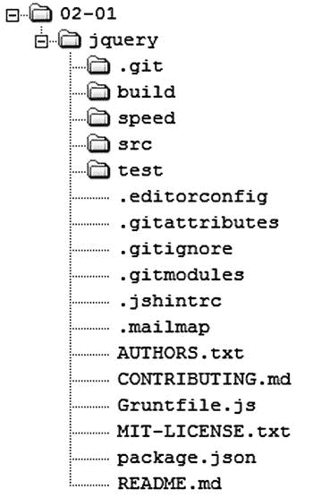
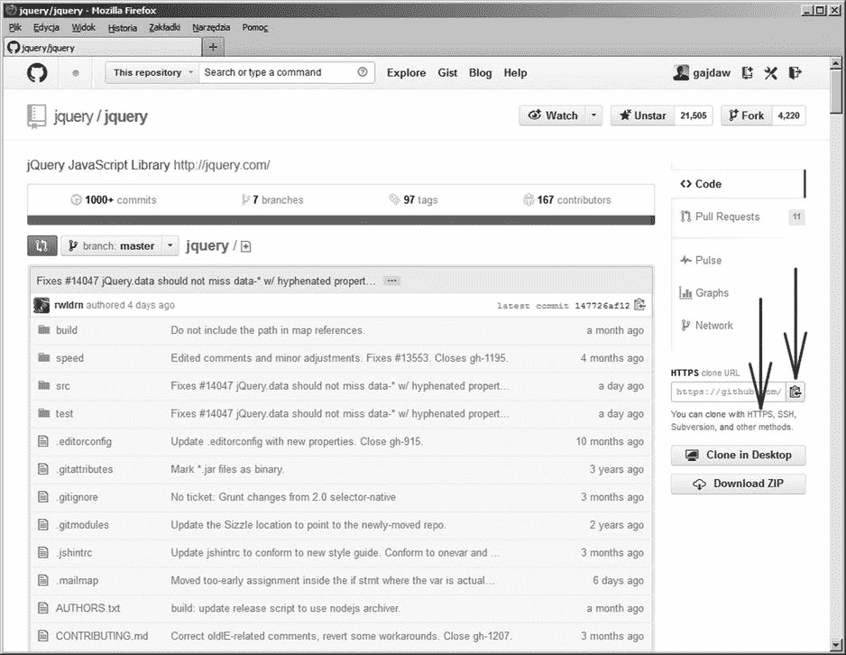
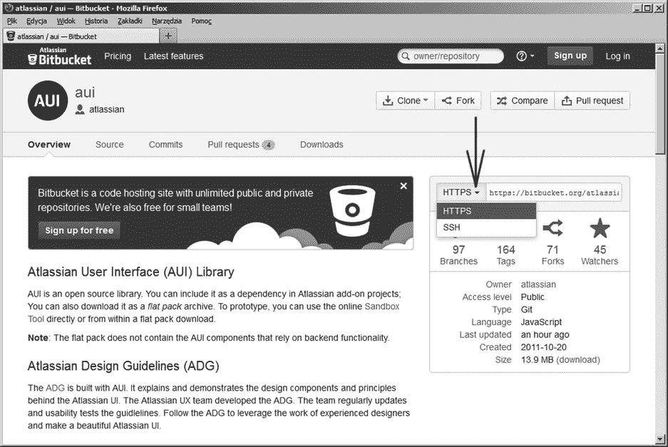
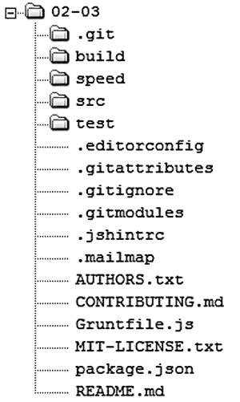
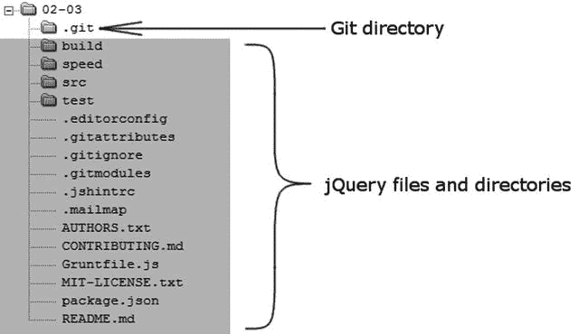
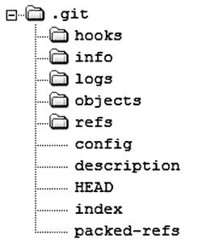
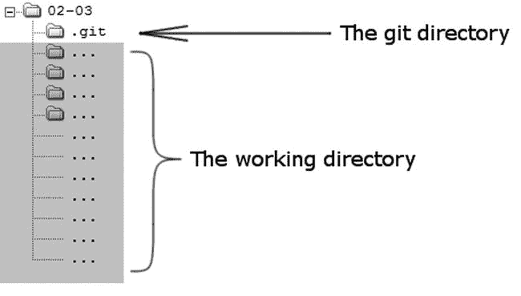
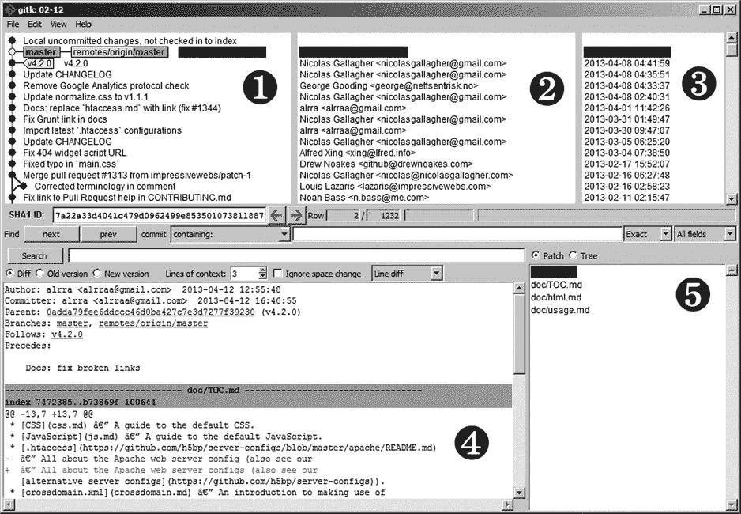
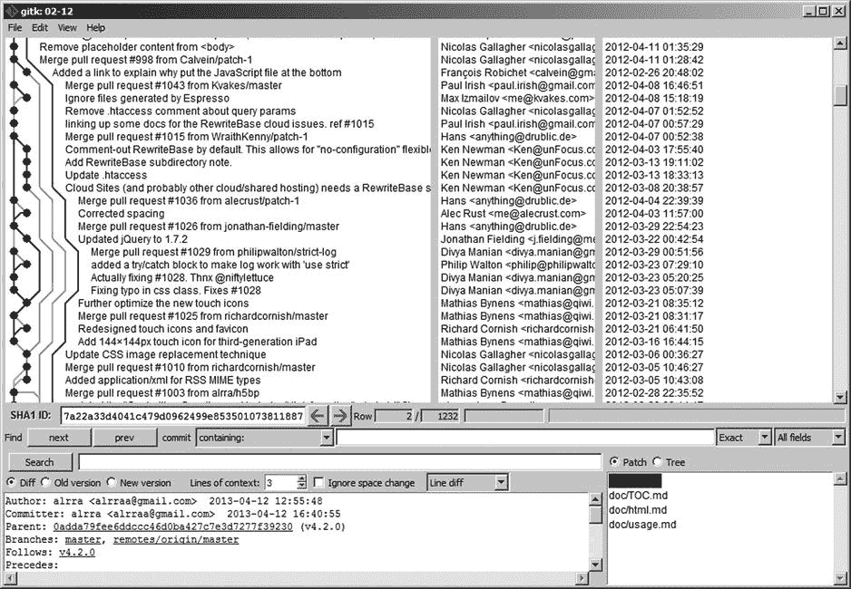

# 二、使用著名的存储库

我们将开始我们的旅程，探索现有的和相当著名的仓库。本章的主要目标是熟悉存储库——它们的类型和结构。在本章中，您将学习以下内容:

*   git 存储库最流行的托管解决方案是什么？
*   如何创建托管在`Github.com`或`Bitbucket.org`上的存储库的本地副本？

一旦我们知道如何克隆一个存储库，我们就可以分析它的结构。然后我们将探索工作目录 git 目录及其内容。在这一点上，我们将能够将一个存储库分类为裸露的或者非裸露的。

接下来，我们将讨论打印存储库信息的各种命令，例如

*   修订列表
*   贡献者列表
*   修订的数量
*   贡献者的数量
*   git 目录和工作目录的磁盘使用情况

为了使输入长 git 命令变得更容易，我将定义它们的别名。

 **注**我已经在 Linux 和 Windows 两个平台上测试了本章和书中介绍的所有命令。我的目的是提供一套不管你的平台如何都能工作的指令。为了实现这个目标，文件系统操作是用 Linux 命令执行的，比如`ls`和`rm`。此外，清单以`$`开头，路径使用`/`作为分隔符——表明它们是为 Linux 准备的。但是，如果您使用的是 Windows，请不要担心。只需使用 git 发布的 bash 命令解释器，所有的命令都会运行良好。

如果您使用的是不同于 Linux 的类 Unix 系统，一些命令(即`du`或`echo`)可以使用与本书中介绍的不同的开关。因此，您需要自定义这些命令。

2-1.克隆托管在 Github 上的存储库

问题

您想要获得 jQuery 存储库的本地副本。

解决办法

启动命令行并创建`git-recipes/`和`git-recipes/02-01/`目录:

```
$ cd /some/where/on/your/system
$ mkdir git-recipes
$ cd git-recipes
$ mkdir 02-01
```

将当前目录更改为`02-01/`:

```
$ cd 02-01
```

然后执行如[清单 2-1](#list1) 所示的命令。

[***清单 2-1。***](#_list1) 命令克隆 jQuery 库

```
$ git clone https://github.com/jquery/jquery.git
```

 **注意**在克隆命令期间，git 将一个完整的存储库从其原始位置复制到您的本地存储系统。根据您的带宽和项目大小，此操作可能需要相当长的时间。但是不用担心。克隆只在您设置本地存储库时进行一次。所有后续的数据传输都非常高效，因为 git 只传输丢失的数据部分。克隆的内部原理在第 10 章(配方 10-1)中有解释。

在您运行清单 2-1 中的[命令后，您的`git-recipes/02-01/`目录将包含如图 2-1](#list1) 中[所示的文件和目录。注意，jQuery 存储在子目录`jquery/`下，而不仅仅是在`git-recipes/02-01/`中。](#Fig1)



[图 2-1](#_Fig1) 。git 克隆命令后 git-recipes/02-01/目录的内容

 **注意事项** [图 2-1](#Fig1)2013 年 4 月编制。正如您所猜测的，jQuery 项目一直在向前发展。因此您的`git-recipes/02-01/`目录的内容可能会有所不同。

它是如何工作的

要克隆 jQuery，您必须找到指向其存储库的 URL。启动网络浏览器，转到`Google.com`，搜索`"jquery git repository"`。结果将包括:

```
https://github.com/jquery/jquery
```

以类似的方式，您可以找到其他流行的开源项目的 URL。表 2-1 列出了另外三个项目的关键词和 URL:Linux、git 和 Mozilla。

[表 2-1](#_Tab1) 。如何找到其他项目的 git 仓库？

| 

在`Google.com`中搜索的短语

 | 

存储库的 URL

 |
| --- | --- |
| linux git 仓库 | `https://github.com/torvalds/linux` |
| git git repository | `https://github.com/git/git` |
| mozilla git 存储库 | `https://github.com/mozilla/mozilla-central` |

一旦知道了 jQuery 存储库的 URL，就可以启动 web 浏览器并访问:

```
https://github.com/jquery/jquery
```

您将看到如图[图 2-2](#Fig2) 所示的页面。



[图 2-2](#_Fig2) 。jQuery 知识库的主页面`https://github.com/jquery/jquery`

Github 上存储的每个库都可以在两个不同的 URL 下使用:HTTPS 和 SSH。您可以使用图 2-2 中箭头所指的按钮复制它们。jQuery 储存库的 URL 是:

```
HTTPS: https://github.com/jquery/jquery.git
SSH: git@github.com:jquery/jquery.git

```

如果您没有安装了 SSH 密钥的 Github 帐户，则不能使用 SSH URL。你必须选择 HTTPS 网址。

 **提示**在[第十三章](13.html)我们将创建并配置一个 Github 账户。然后你也可以使用 SSH URL 在那之前，你必须使用 HTTPS 网址。

这样，您可以克隆在`Github.com`上可用的所有存储库。记住这个命令:

```
$ git clone https://github.com/abc/def.git
```

因为它创建了子目录`def/`。克隆体就储存在里面。

但是，如果您在 Windows 上工作，并且试图克隆 Linux 源代码，例如，您将会遇到问题，因为不同的系统有不同的文件名限制。我们会在[第 11 章](11.html)对此进行分析。

如果没有配置了 SSH 密钥的 Github 账号，使用 SSH URL 会怎么样？jQuery 的 SSH URL 是:

```
git@github.com:jquery/jquery.git
```

如果您将它用于 git clone 命令:

```
$ git clone git@github.com:jquery/jquery.git
```

那么您将得到以下错误:

```
Permission denied (publickey)
```

2-2.克隆 Bitbucket 上托管的存储库

问题

您想要获得存储在`Bitbucket.org`上的亚特兰蒂斯 AUI 库的本地副本:

```
https://bitbucket.org/atlassian/aui
```

您希望克隆文件直接保存在`git-recipes/02-02/`下，而没有额外的`aui/`子目录。

解决办法

启动命令行并创建一个`git-recipes/02-02/`目录:

```
$ cd git-recipes
$ mkdir 02-02
```

将您当前的目录更改为`02-02/`:

```
$ cd 02-02
```

然后运行[清单 2-2](#list2) 中所示的命令。注意最后一个参数——一个点。这个点代表当前目录，因此克隆将直接放在`git-recipes/02-02/`下。如果没有点，克隆的存储库将被存储在子目录`git-recipes/02-02/aui/`中。

[***清单 2-2。***](#_list2) 命令克隆 AUI 库

```
$ git clone https://bitbucket.org/atlassian/aui.git.
```

 **注意**git 克隆命令的语法是:`$ git clone URL [directory]`。如果使用的话，可选的`[directory]`参数为克隆的存储库设置目标目录。

它是如何工作的

启动您的网络浏览器并转到`https://bitbucket.org/atlassian/aui`。亚特兰大 AUI 知识库的主页如图 2-3 所示。



[图 2-3](#_Fig3) 。亚特兰蒂斯 AUI 知识库主页`https://bitbucket.org/atlassian/aui`

Bitbucket 为每个存储库提供了两个 URL:HTTPS 和 SSH。[图 2-3](#Fig3) 和下面的列表将为您提供对它们的访问:

```
HTTPS: https://bitbucket.org/atlassian/aui.git
SSH: git@bitbucket.org:atlassian/aui.git
```

与 Github 一样，SSH URL 只能在您拥有一个配置了 SSH 密钥的 Bitbucket 帐户时使用。

 **提示**git 最流行的两个托管解决方案是`Github.com`和`Bitbucket.org`。两者都为公共存储库提供无限制的免费账户。

2-3.克隆本地存储库

问题

你想要克隆一个你在配方 2-1 中创建的库`git-recipes/02-01/jquery/`，并且你更喜欢在`git-recipes/02-03/`下直接存储一个新的克隆，而不需要一个额外的`jquery/`目录。

解决办法

转到您的`git-recipes/`目录:

```
$ cd git-recipes
```

然后你需要执行清单 2-3 中的[命令。](#list3)

[***清单 2-3。***](#_list3) 克隆本地存储库的命令

```
$ git clone 02-01/jquery 02-03
```

使用清单 2-3 中[所示的命令后，目录`git-recipes/02-03/`中将包含如图 2-4](#list3) 中[所示的文件。](#Fig4)



[图 2-4](#_Fig4) 。成功克隆后 git-recipes/02-03/目录的内容

它是如何工作的

Git clone 命令接受指向存储库的 URL 和本地路径。因此，您可以通过向命令传递路径而不是 URL 来克隆本地存储库。

2-4.复制本地存储库

问题

您想要克隆您在配方 2-3 中创建的存储库`git-recipes/02-03/`。这一次，你想要使用一个带有–R 标志的标准`cp`命令，而不是使用`git clone`。

解决办法

进入目录`git-recipes/`:

```
$ cd git-recipes
```

第二，执行以下命令:

```
$ cp -R git-recipes/02-03 git-recipes/02-04
```

该命令将从`git-recipes/02-03/`创建文件的精确副本。`git-recipes/02-04/`的内容是一个有效的 git 存储库。

它是如何工作的

通过使用`cp -R`命令，您可以递归地复制一个目录。如果在包含存储库的目录上使用，它将创建一个正确的存储库，该存储库与使用`git clone`命令创建的存储库几乎相同。我们将在方法 2-5 中探索在方法 2-3 和 2-4 中创建的存储库之间的区别。

 **提示**一旦您知道可以使用标准的文件系统操作(如`cp`)来复制一个存储库，您可以使用`rsync`或`scp`来达到同样的效果。在第 11 章中，我们将使用 scp 命令启动一个新项目。

2-5.探索 git 存储库的内容

问题

`git clone`命令创建的目录包含什么？要回答这个问题，您需要用`cd`、`ls`和`cat`命令探索`git-recipes/02-03/`目录的内容。你也可以使用你最喜欢的文件管理器。

解决办法

`git-recipes/02-03/`目录的内容如图[图 2-5](#Fig5) 所示，包含 jQuery 文件和目录以及一个名为`.git`的特殊目录。



[图 2-5](#_Fig5) 。在配方 2-3 中创建的存储库

名为`.git`的目录称为 **git 目录** 。它包含关于存储库的所有信息。`.git`目录的内容如[图 2-6](#Fig6) 所示。



[图 2-6](#_Fig6) 。. git 目录的内容

它是如何工作的

如果你想显示一个`.git`目录的内容，你可以使用以下命令:

```
$ cd git-recipes/02-03/
$ cd .git
$ ls -l
```

最后一个命令将打印图 2-6 中[所示的文件和目录。在](#Fig6)[表 2-2](#Tab2) 中简要描述了每个项目的作用。完整的描述包含在处理 git 具体细节的方法中。

[表 2-2](#_Tab2) 。. git 目录的内容

| 

目录/文件

 | 

描述

 |
| --- | --- |
| `hooks/` | 目录包含当某些事件发生时 git 可以自动执行的脚本；例如，在每次提交之前和之后。 |
| `info/` | 目录包含一个名为`exclude`的文件，可以用来从存储库中排除文件。与`.gitignore`文件不同，该文件不被其他人共享。 |
| `logs/` | 目录包含对存储库所做的本地更改的日志。 |
| `objects/` | 这是包含文件、目录、修订和标签的所有信息的数据库。 |
| `refs/` | git 在这里存储关于分支和轻量级标签的信息。 |
| `config` | 这是本地配置文件，包含将仅应用于此存储库的选项。 |
| `description` | 这是存储库的简短描述。它由 git 发布的 Gitweb CGI 应用使用。 |
| `HEAD` | 存储库的当前分支或版本 |
| `index` | 存储库的临时区域 |
| `packed-refs` | 打包格式的来自`refs/`的参考文献列表 |

现在让我们比较三个配置文件的内容:

```
git-recipes/02-01/jquery/.git/config
git-recipes/02-03/.git/config
git-recipes/02-04/.git/config
```

配方 2-1 中创建的第一个解决方案是存储在 Github 上的原始 jQuery 存储库的克隆。在`git-recipes/02-01/jquery/.git/config`中，你会发现以下几行:

```
[remote "origin"]
    url = https://github.com/jquery/jquery.git
```

条目`[remote "origin"]`存储传递给`git clone`命令的地址。

第二个解决方案是本地目录的克隆。文件`git-recipes/02-03/.git/config`包含:

```
[remote "origin"]
    url = /home/john/git-recipes/02-01/jquery
```

如你所见，这次`[remote "origin"]`指向本地目录。

 **提示**我假设你的`git-recipes/`目录的完整路径是:`/home/john/git-recipes/`。

第三种解决方案是对`git-recipes/02-03/`的精确复制。因此，文件`git-recipes/02-04/.git/config`包含:

```
[remote "origin"]
    url = /home/john/git-recipes/02-01/jquery
```

如果我们使用:

```
$ cd git-recipes
$ git clone 02-03 02-04
```

创建`git-recipes/02-04/`；文件`git-recipes/02-04/.git/config`应该包含:

```
[remote "origin"]
    url = /home/john/git-recipes/02-03
```

`git-recipes/02-03/`和`git-recipes/02-04/`没有任何区别。稍后，在[第 10 章](10.html)中，我们将学习使用`git remote`命令改变配置文件中的`[remote "origin"]`条目。

结论

作为方法 2-4 和 2-5 的结论，记住存储库可以被复制和移动到你的驱动器上的不同位置；就像任何其他目录一样。git 目录`.git`不包含任何将存储库绑定到您的驱动器上的特定路径的信息。

2-6.删除和恢复工作目录的内容

问题

您想要验证 git 已经将您的所有文件存储在数据库`.git/objects`中。为此，您需要删除工作目录的内容，然后从 git 数据库中恢复它。

解决办法

输入在配方 2-3 中创建的储存库:

```
$ cd git-recipes/02-03
```

删除所有文件和目录，除了`.git`子目录:

```
$ ls -la
$ rm -rf *
$ rm .????*
```

现在，目录`git-recipes/02-03/`只包含一个子目录`.git`。您可以通过以下方式进行检查:

```
$ ls -l
```

接下来，执行命令:

```
$ git reset --hard
```

所有文件都将被还原。命令:

```
$ ls -l
```

现在打印出与图 2-4 中[相同的结果。](#Fig4)

它是如何工作的

通常，包含 git 存储库的目录由两个区域组成。其中一个已经讨论过了，这个 **git 目录**命名为`.git`。另一个叫做**工作目录**。它们都如[图 2-7](#Fig7) 所示。



[图 2-7](#_Fig7) 。git 目录和工作目录

工作目录是包含您的工作的临时存储。另一方面，git 目录包含存储项目所有快照的数据库。方法 2-6 应该让你相信你的工作目录的内容可以很容易地从数据库中恢复。

2-7.克隆一个空存储库

问题

您想要从配方 2-3 中创建一个存储库的裸克隆。

解决办法

发出以下命令:

```
$ cd git-recipes
$ git clone --bare 02-03 02-06
```

进入`02-06/`目录并检查其内容:

```
$ cd 02-06
$ ls -la
```

上述命令将打印与图 2-6 中的[相同的输出。](#Fig6)

它是如何工作的

git clone 命令带有一个可选参数`--bare`。您可以使用`--bare`参数来创建一个空的存储库。一个**裸库** 只包含 git 目录的内容。它不包含工作目录。这种类型的存储库仅用于同步目的。我们会在[第 10 章](10.html)用到。

 **记住**可以用`$ git clone --bare [URL]`命令创建空的存储库。这种类型的存储库不包含工作目录。它的内容相当于非裸存储库中的一个`.git`目录的内容。

2-8.使用 git log 命令浏览历史记录

问题

您希望打印以下关于 jQuery 存储库的信息:

*   存储库中修订的完整列表
*   存储库中最新修订版的简化列表
*   约翰·雷西格的修订清单
*   包含 2012 年最后五次修订的列表

解决办法

进入目录`git-recipes/02-01/jquery/`:

```
$ cd git-recipes/02-01/jquery
```

要打印存储库中修订的完整列表，请执行:

```
$ git log
```

您将会看到输出类似于[清单 2-4](#list4) 中的输出。这是可从当前修订访问的修订的完整列表。您可以使用空格键和箭头键滚动输出。按下`q`退出`git log`。

[***清单 2-4。***](#_list4)git log 命令的输出

```
commit 18cccd04a6f69018242bce96ef905bc5d3be6ff8
Author: Richard Gibson < richard.gibson@gmail.com >
Date:   Mon Apr 29 13:31:59 2013 -0400

    Fix #13803: domManip remote-script evaluation per 1.9 (AJAX dataType "script")

commit 55e319aa52eb828a3a4c2298aa75b6d15cfa06f8
Author: Corey Frang <gnarf@gnarf.net>
Date:   Wed Apr 24 16:07:15 2013 -0400

    Fixes #13815: Ensure each element has its own private data object - Tests by @rwldrn

commit 3a6194076b8b7ab5a9d9f5e6ec602db2ab427d3e
Author: Oleg < markelog@gmail.com >
Date:   Wed Apr 24 22:15:41 2013 +0400

    Fix #13818: Add wrapMap entry for col element
```

清单 2-4 中的输出显示了三个版本。第一个修订版的名称是:

```
18cccd04a6f69018242bce96ef905bc5d3be6ff8
```

本修订版由 Richard Gibson 于 2013 年 4 月 29 日星期一创建。评论是:

```
Fix #13803: domManip remote-script evaluation per 1.9 (AJAX dataType "script")
```

提供修订版包含问题编号 13803 的修复程序的信息。

经过缩短和简化，修订列表可以用[列表 2-5](#list5) 中所示的命令打印出来。

[***清单 2-5。***](#_list5) 产生简化和缩短的日志信息的命令

```
$ git log --abbrev-commit --abbrev=4 --pretty=oneline -10
```

它将打印类似于以下内容的输出:

```
18cc Fix #13803: domManip remote-script...
55e3 Fixes #13815: Ensure each element...
3a619 Fix #13818: Add wrapMap entry for...
78c8 Fix #13819: .parent sort direction...
ad71f Fix #13809: Avoid collisions with...
```

每一行都涉及一个版本，包含一个简短的缩写名 SHA-1 和注释。如果可能，缩写将缩短为四个字符:

```
18cc
55e3
78c8
```

必要时，使用更多字符:

```
3a619
ad71f
```

使用`-10`参数，输出仅限于最后 10 个版本。

清单 2-6 中显示的命令打印了 John Resig 所做的修改。

[***清单 2-6。***](#_list6) 约翰·雷西格撰写的修订版

```
$ git log --author="John Resig"
```

[列表 2-5](#list5) 和[列表 2-6](#list6) 中显示的参数可以一起使用。命令:

```
$ git log --abbrev-commit --abbrev=4 --pretty=oneline -10 --author="John Resig"
```

以简化形式打印 John Resig 的最后 10 次修订。

在清单 2-7 的[中给出了生成 2013 年最后五次修订清单的命令。](#list7)

[***清单 2-7。***](#_list7)2013 年最后五次修订

```
$ git log --pretty=oneline --since="2012-12-20" --until="2013-01-01" -5
```

它是如何工作的

git 存储库的历史由一系列修订组成。每个修订都是工作目录在特定时间点的快照。修订存储在`.git/objects`数据库中。

每个版本都通过其名称来识别。Git 使用一种 **SHA-1 算法** 来生成名字。因为修订版的 SHA-1 是使用许多不同类型的数据计算的——作者姓名、当前时间戳和快照等——我们可以将它们视为唯一标识符。两个不同的修订版具有相同 SHA-1 的概率非常小，可以忽略不计。事实上，SHA-1 唯一性是最基本的 git 假设之一。正如你将在[第 11 章](11.html)中看到的。整个同步过程都依赖于它。

 **提示**用户不能给版本命名。所有的名字都是 git 自动生成的。Git 规则，你可以相信它永远不会为不同的版本生成两个相同的名字。

SHA-1 名称的长度为 20 个字节，因此，它们的十六进制表示形式需要 40 个字符，例如:

```
18cccd04a6f69018242bce96ef905bc5d3be6ff8
```

在本书的后面，我们将需要使用这个名字作为参数传递给各种命令；如果是这样的话，就不必使用全部 40 个字符。通常，前七个字符就足够了。名称的最短缩写必须是四个字符长。记住缩写必须是唯一的——如果不是，那么你必须使用更多的字符。

储存在库中的修订列表可以用`git log`命令打印出来。它的各种选项和开关可用于过滤和重新格式化显示的修订。一个`git log`命令的输出按照版本创建的时间排序。最新版本显示在输出的顶部。

默认情况下，`git log`打印当前版本的所有可用版本。

可以用`--pretty`参数改变输出的格式。可用值及其含义总结在[表 2-3](#Tab3) 中。

[表 2-3](#_Tab3) 。pretty 参数的值

| 

价值

 | 

描述

 |
| --- | --- |
| `oneline` | 名称和注释打印在一行中。 |
| `short` | 名称、作者和注释 |
| `medium` | 与`short`相同，但增加了修订日期 |
| `full` | 名称、作者、提交者和注释 |
| `fuller` | 姓名、作者、作者日期、提交者、提交日期和注释 |
| `email` | 与电子邮件格式的`short`相同 |
| `raw` | 低级修订的信息:名称、树、父修订的名称、作者和带时间戳的提交者 |
| `format` | 用户定义的格式 |

在[表 2-3](#Tab3) 中显示的参数可以传递给`git log`命令，如下所示:

```
$ git log --pretty=oneline
$ git log --pretty=short
$ git log --pretty=raw
```

值`-–pretty=oneline`可以缩短为:

```
$ git log --oneline
```

影响格式的其他参数有:

*   `--abbrev-commit`—此选项打开缩写。
*   `--abbrev=n`—该选项设置缩写名称的长度。
*   `--decorate`—该选项包括每个版本的标签和分支。

最短的缩写必须包含四个字符。因此，`--abbrev`的最小值是 4:

```
$ git log --abbrev-commit --abbrev=4
```

 **提示**参数`--oneline`将 SHA-1 缩写为七个字符。

参数`--pretty=format`允许您定义任意输出的格式。包含占位符的特殊字符串定义了输出。命令:

```
$ git log --pretty=format:"%an --- %H"
```

将以如下形式打印输出:

```
Joe Doe --- 123456...
```

输出的第一部分(例如，Joe Doe)是作者的名字，而第二部分是修订版的完整 SHA-1。该输出由两个占位符生成:

```
%an – author's name
%H – full SHA-1 hash
```

其他有用的占位符包括:

```
%h: abbreviated commit hash,
%ae: author email,
%ad: author date,
%cn: committer name,
%ce: committer email,
%cd: committer date,
%e: encoding,
%s: subject,
%n: newline.
```

 **提示**`git log`手册中提供了占位符的完整列表。您可以使用`git help log`命令来访问它。

以下是过滤输出中包含的修订的一些参数:

*   `-n`—修订数，例如–7 将 git 日志限制为最近七次修订
*   `--since="yyyy-mm-dd"`—开始日期
*   `--until="yyyy-mm-dd"`—完成日期
*   `--author="John Doe"`—由给定作者提交

 **提示**传递给`--since`和`--until`参数的日期可以用`yyyy-mm-dd`格式或不太正式的格式设置为`--since="1 week ago"`、`--since="Two months ago"`、`--until="5 days ago"`、`--until="7 hours ago"`、`--until="yesterday"`。为了避免输入引号，你也可以用点来表示空格，比如`--since=1.week.ago`、`--since=Two.months.ago`、`--until=5.days.ago`。

2-9.使用 git log 和 shortlog 命令分析存储库

问题

对于 jQuery 项目，您需要以下问题的答案:

*   存储库包含多少修订版？
*   有多少开发人员参与了这个项目？
*   他们在这个项目上工作了多少天？
*   工作目录使用了多少空间？
*   git 目录使用了多少空间？
*   工作目录中有多少文件？

解决办法

进入目录`git-recipes/02-01/jquery/`:

```
$ cd git-recipes/02-01/jquery
```

要回答这些问题，执行[列表 2-8](#list8) 到 [2-13](#list13) 中所示的命令。

[***清单 2-8。***](#_list8) 打印存储库中提交数量的命令

```
$ git log --pretty=oneline | wc -l
```

***清单 2-9。*** 打印贡献者人数的命令

```
$ git shortlog -s | wc -l
```

***清单 2-10。*** 产生贡献天数的命令

```
$ git log --pretty=format:%cd --date=short | uniq | wc -l
```

***清单 2-11。*** 返回 git 目录使用的空间量的命令

```
$ du -h -s .git
```

***清单 2-12。*** 返回工作目录使用的空间量的命令

```
$ du -h -s --exclude=.git
```

[***清单 2-13。***](#_list13) 该命令产生工作目录中文件的数量

```
$ git ls-files | wc -l
```

 **提示** Linux 和 Windows 版本的`du`都支持`--exclude`参数。但是其他一些系统，比如 BSD，使用其他选项。在 BSD 中，用`–I`选项设置排除(`I`代表忽略)。

它是如何工作的

使用以下命令可以找到上述问题的答案:

```
git log
git shortlog
git ls-files
du
wc
uniq
grep
```

我们已经知道，命令:

```
$ git log --pretty=oneline
```

以简化形式打印所有修订的列表，其中每个修订占一行。将列表传送到`wc -l`:

```
$ git log --pretty=oneline | wc -l
```

我们得到修订的数量。

`git shortlog`命令显示了由作者分组的提交信息。如果没有任何参数，其输出具有以下形式:

```
Adam Coulombe (1):
      Fix #13150, ...

Adam J. Sontag (7):
      .closest() should
      Add a comment expl
      Add a comment to e
      Add link to chrome
      shorten the SHA
      Fix tabs vs spaces
      Revert grunt, grun
...
```

上面的列表包含了所有的开发者和他们的修订版。参数`-s`仅打印修订号和开发人员姓名:

```
1  Adam Coulombe
7  Adam J. Sontag
...
```

参数`-n`打印按修订次数以数字顺序排序的结果。

为了打印贡献者的数量，我们将`git shortlog -s`的结果传送到`wc -l`:

```
$ git shortlog -s | wc -l
```

下一个问题有点难回答。首先，我们想以特殊的形式打印出`git log`命令的输出。我们希望每行只包含一个提交日期，格式为`yyyy-mm-dd`。这可以通过以下方式实现:

```
$ git log --pretty=format:%cd --date=short
```

上述命令将生成日期列表:

```
2013-04-22
2013-04-22
2013-04-20
2013-04-20
2013-04-18
...
```

每次提交的日期都会显示在输出中。让我们删除重复的。我们可以使用`uniq`命令来完成:

```
$ git log --pretty=format:%cd --date=short | uniq
```

因此，我们将找出对项目做出贡献的不同日期。如果我们将结果传送到`wc -l`:

```
$ git log --pretty=format:%cd --date=short | uniq | wc -l
```

然后我们得到期望的天数。

 **提示**这是我用来宣布我写一本书的工作天数的大致标准。当命令`$ git log --pretty=format:%cd --date=short | uniq | wc -l`返回 95 时，意味着我写了一本书不超过 95 天。

接下来的两个问题涉及工作目录和 git 目录包含的空间量。git 目录包含的空间量由以下命令返回:

```
$ du -h -s .git
```

工作目录包含的空间量由以下命令打印:

```
$ du -h -s --exclude=.git
```

以下是 jQuery 项目的结果:

*   工作目录:1.3 MB
*   git 目录:16 MB

正如您所看到的，git 目录比工作目录使用了更多的空间。这并不奇怪:存储在`.git/objects`中的数据库包含 5192 个修订。每一次修订都可以看作是一个完整工作目录的快照。

最后一个问题可以用 git ls-files 命令来回答:

```
$ git ls-files | wc -l
```

git ls-files 命令打印工作目录中所有文件的名称。我们用`wc –l`来数它们。

2-10.为配方 2-8 和 2-9 中讨论的命令 定义别名

问题

清单 2-5 和 [2-8](#list8) 到 [2-13](#list13) 中显示的命令输入起来相当长。您希望定义更容易键入的别名，同时返回相同的输出。

解决办法

打开命令行并转到您的主目录。在 Windows 上使用 Linux、Mac 或 bash 命令行，可以通过以下方式完成:

```
$ cd ∼
```

如果您使用标准的 Windows 命令行，请尝试:

```
$ cd %userprofile%
```

启动文本文件编辑器并打开文件`.gitconfig`。如果您使用`vi`，您可以使用:

```
$ vi .gitconfig
```

在文件的底部追加清单 2-14 中[的内容。保存文件并退出编辑器。](#list14)

[***清单 2-14。***](#_list14) 清单 2-5 和 [2-8](#list8) 到 [2-13](#list13) 中所示命令的别名

```
[alias]
    l    = log --oneline --abbrev-commit --abbrev=4 -25

    days = "!days() {
        git log --pretty=format:%cd --date=short | uniq;
    }; days"

    stat = "!stat() {
        echo -n Number of revisions:;
        git log --oneline | wc -l;
        echo -n Number of developers:;
        git shortlog -s | wc -l;
        echo -n Number of days:;
        git days | wc -l;
        echo -n The working directory:;
        du -h -s --exclude=.git;
        echo -n The git directory:;
        du -h -s .git;
        echo -n Number of files in the working dir:;
        git ls-files | wc -l;
    }; stat"
```

 **提示**您不必键入[清单 2-14](#list14) 中显示的别名。它们都可以在`https://github.com/gajdaw-git-recipes/aliases`存储库中找到。

 **注意**清单 2-14 中的应该在 stat 和 days 别名中不带换行符。该文件应该类似于:

```
days = "!days() { ... }; days"
stat = "!stat() { ... }; stat"
```

换行符仅用于可读性目的。

当你在`.gitconfig`文件的底部输入完[清单 2-14](#list14) 的内容后，进入目录`git-recipes/02-01/jquery/`:

```
$ cd git-recipes/02-01/jquery
```

并执行第一个别名:

```
$ git l
```

您应该会看到类似于以下内容的输出:

```
18cc Fix #13803: domManip remote-script ...
55e3 Fixes #13815: Ensure each element ...
3a619 Fix #13818: Add wrapMap entry for ...
...
```

接下来尝试第二个别名:

```
$ git stat
```

它将产生类似的结果:

```
Number of revisions:     5192
Number of developers:    190
Number of days: 1246
The working directory:   1.3M      .
The git directory:       16M   .git
Number of files in the working dir:     149
```

 **注意**别名 git stat 使用`echo`和`–n`参数来抑制换行符的输出。如果您的系统不支持`echo –n`，以上结果的格式会有所不同。

它是如何工作的

Git 允许您为任意命令定义别名。别名应该存储在用户的配置文件中。该文件应该被命名为`.gitconfig`，并存储在您的主目录中。如果您已经执行了任何命令来配置带有`--global`选项的 git，例如`git config --global user.name`，那么`.gitconfig`文件已经存在于您的主目录中。否则，您必须创建它。

清单 2-14 中显示的第一个别名可以通过以下方式创建:

```
$ git config --global alias.l "log --oneline --abbrev-commit --abbrev=4 -25"
```

命令`git config –global alias.abc "def"`只是在您的个人`.gitconfing`文件的`[alias]`部分创建一个条目`abc = def`。

如果您想找到主目录的位置，请键入:

```
$ cd ∼
$ pwd
```

上述命令可以在 Linux、Mac 或 Windows 上的 bash 命令行上很好地工作。如果使用标准的 Windows 命令行，请使用:

```
$ cd %userprofile%
$ cd
```

如果您使用`vi`工作，您可以使用以下命令打开 git 配置文件:

```
# Linux
$ vi ∼/.gitconfig

# Windows
$ vi %userprofile%\.gitconfig
```

的语法。gitconfig 文件

我们将从一个`.gitconfig`文件的语法开始解释别名。有趣的字符有:散列符号、分号、引号和反斜杠。

在一个`.gitconfig`文件中，你可以使用散列符号和分号来表示延伸到行尾的注释。因此定义是:

```
word = lorem ; ipsum
```

用值`lorem`设置名为`word`的属性。第二个词`ipsum`被跳过，因为分号开始注释。类似的规则也适用于哈希标记。定义:

```
word2 = dolor # sit
```

用值`dolor`设置属性`word2`。

如果要定义包含分号或散列符号的值，必须使用引号:

```
sentence = "Lorem ; ipsum"
```

上面定义了一个名为`sentence`的属性，其值为:

```
Lorem ; ipsum
```

引号应该被转义是不足为奇的。该行:

```
person = "John \"Moo\" Cowboy"
```

用值定义属性`person`:

```
John "Moo" Cowboy
```

同样的转义过程也适用于反斜杠。定义:

```
str = "a\\b"
```

将`str`属性的值设置为:

```
a\b
```

以上描述阐明了以下符号:

```
something = "x ; \"y\" ; \\ ; z"
```

因为我们使用分号，所以需要用引号括起来。里面的引号被转义了。双反斜杠是转义反斜杠，因此属性`something`的值为:

```
x ; "y" ; \ ; z
```

请记住，这些规则适用于您存储在`.gitconfig`文件中的所有内容。

 **提示**`.gitconfig`文件的语法在手册的语法:$ git help config 一节中有描述

别名语法

在`.gitconfig`文件中定义 git 别名的语法是:

```
alias = command
```

或者

```
alias = !command
```

第一个版本——没有感叹号的版本——适用于 git 子命令。别名:

```
abc = def
```

定义可以命名为的命令:

```
$ git abc
```

执行时，`git abc`将产生与以下相同的效果:

```
$ git def
```

因此，我们可以定义别名:

```
l = log --pretty=oneline
```

当被调用时:

```
$ git l
```

将扩展到:

```
$ git log --pretty=oneline
```

别名的第二种语法——带感叹号的语法——适用于任意 shell 命令。别名:

```
list-files = !ls
```

可以称为:

```
$ git list-files
```

该调用将产生以下命令:

```
$ ls
```

我在 shell 函数中使用带感叹号前缀的别名。别名:

```
foo = "!bar(){ }; bar"
```

可以称为:

```
$ git foo
```

感叹号告诉 git 应该将这个别名传递给 shell。下一部分:

```
bar(){};bar
```

由函数定义组成:

```
bar(){};
```

和一个函数调用:

```
bar
```

在大括号内，您可以放置任意数量的完整 shell 调用，用分号分隔，例如:

```
foo = "!bar(){ echo abc; ls; }; bar"
```

这个别名可以称为:

```
$ git foo
```

这将产生两个命令:

```
$ echo abc
$ ls
```

同样，别名:

```
info = "!funInfo(){ git --version; git log --pretty=oneline -3; }; funInfo"
```

可以称为:

```
$ git info
```

它将产生与两个命令相同的输出:

```
$ git --version
$ git log --pretty=oneline -3
```

由于分号的存在，使用 shell 函数的别名需要用引号括起来。

清单 2-14 中[的别名](#list14)

清单 2-14 中的第一个别名是:

```
l = log --oneline --abbrev-commit --abbrev=4 -25
```

它没有使用感叹号；因此，它指的是 git 子命令。被呼叫时:

```
$ git l
```

它将扩大到:

```
$ git log --pretty=oneline --abbrev-commit --abbrev=4 -25
```

Git 允许您向别名传递额外的参数。因此，如果您想生成 John Doe 修订的简化列表，请使用参数`--author`调用别名:

```
$ git l --author="John Doe"
```

您可以用同样的方式传递任何其他参数。

下一个别名是:

```
days = "!days() {
    git log --pretty=format:%cd --date=short | uniq;
}; days"
```

由于感叹号，它被扩展为一个 shell 命令。该命令定义并调用名为`days()`的函数。当您键入时:

```
$ git days
```

它将最终执行:

```
$ git log --pretty=format:%cd --date=short | uniq
```

最后一个别名是一个 shell 函数，它调用许多其他命令。

```
stat = "!stat() {
    echo -n Number of revisions:;
    git log --oneline | wc -l;
    echo -n Number of developers:;
    git shortlog -s | wc -l;
    echo -n Number of days:;
    git days | wc -l;
    echo -n The working directory:;
    du -h -s --exclude=.git;
    echo -n The git directory:;
    du -h -s .git;
    echo -n Number of files in the working dir:;
    git ls-files | wc -l;
}; stat"
```

请注意，我们用 subalias 产生天数:

```
$ git days | wc -l
```

 **提示**在 git 中创建别名有两种方法。第一种方法在配方 2-10 中讨论，第二种在配方 5-3 中讨论。我更喜欢在里面定义别名。gitconfig 文件，如配方 2-10 所示。这种方法不依赖于用户平台或权限，使得在课堂和培训中更容易采用。

2-11.分析一个流行的存储库

问题

最流行的 Github 库之一是 twitter/bootstrap，可从以下网址获得:

```
https://github.com/twitter/bootstrap.git
```

你想用配方 2-10 的别名来分析它。

解决办法

打开命令行并克隆`twitter/bootstrap`:

```
$ git clone https://github.com/twitter/bootstrap.git 02-11
```

命令:

```
$ git stat
```

将打印:

```
Number of revisions:     3569
Number of developers:     259
Number of days:           505
The working directory:   4.9M      .
The git directory:        28M   .git
Number of files in the working dir: 254
```

它是如何工作的

使用$ git clone 命令，您可以克隆 Github 或 Bitbucket 上任何可用的公共存储库。在配方 2-10 中创建的别名将有助于您获得项目的一些基本信息。

2-12.可视化存储库的历史

问题

您希望使用一个`gitk`应用以图形形式显示 HTML 5 样板库的历史。

解决办法

克隆 HTML 5 样板文件库:

```
$ cd git-recipes
$ git clone https://github.com/h5bp/html5-boilerplate.git 02-12
```

进入`02-12/`目录:

```
$ cd 02-12
```

并运行`gitk`命令:

```
$ gitk
```

 **注意**如果追加了&符号`$ gitk &`，gitk 应用将在后台运行，可以使用命令行执行其他命令。

它是如何工作的

命令`$ gitk`将显示图 2-8 中[所示的窗口。它包含五个面板:](#Fig8)

1.  修订
2.  作者
3.  日期
4.  修改列表
5.  已修改文件的列表



[图 2-8](#_Fig8) 。gitk 应用的主窗口

使用`gitk`你不仅可以轻松检查修订列表，还可以检查每个修订中引入的修改。

尝试向下滚动修订。你会发现这些修订并不一定形成一个线性的历史。非线性历史如图 2-9 所示。我们将在[第 5 章](05.html)、[第 6 章](06.html)和[第 7 章](07.html)中讨论非线性历史。



[图 2-9](#_Fig9) 。HTML 5 样板库的历史

 **注意**`$ gitk`命令接受我们在配方 2-8 中讨论的所有过滤器。例如，您可以使用 gitk 只显示给定作者提交的内容:`$ gitk --author=john`。

2-13.移除. git 目录

问题

您希望发现删除一个`.git`目录会如何影响一个存储库。

解决办法

克隆 FontAwesome 存储库:

```
$ cd git-recipes
$ git clone https://github.com/FortAwesome/Font-Awesome.git 02-13
```

输入目录:

```
$ cd 02-13
```

现在，目录`02-13/`包含一个 git 存储库。因此，您可以列出日志条目:

```
$ git log
```

或项目的贡献者:

```
$ git shortlog -n -s
```

如果使用以下命令删除`.git`目录:

```
$ rm -rf .git
```

您将看到工作目录的内容。Git 命令不再起作用了。如果您发出:

```
$ git log
```

您将得到以下错误:

```
fatal: Not a git repository (or any of the parent directories): .git
```

它是如何工作的

可以用简单的命令删除 git 目录:

```
$ rm -rf .git
```

执行此命令后，您将丢失项目的全部历史记录。项目目录将只包含存储在工作目录中的文件的最新版本。

摘要

在这一章中，我们已经讨论了使用 git 库的基本能力。您现在知道如何:

*   克隆一个存储库(远程和本地)。
*   进入存储库并发出各种 git 命令。
*   打印存储在存储库中的列表或修订。
*   用 git log 和 gitk 分析历史。
*   发现存储在存储库中的修订、贡献者和文件的列表和数量。
*   为最常用的命令定义别名。

你也学到了

*   git 目录
*   git 数据库
*   工作目录

所有这些都是理解后面章节所需要的。

**git 目录**是一个名为`.git`的特殊目录，它通常存储在您的项目目录中。它包含您的项目的所有历史和 git 运行所需的各种配置条目。除非得到严格指示，否则不要修改`.git`目录的内容。

在 git 目录中有一个名为`.git/objects`的特殊子目录。就是 **git 数据库**，也叫**对象库**。这是各种 git 命令存储数据的地方。修订、文件的不同版本、目录、它们的内容等等——它们都存储在这个数据库中。git 不时尝试优化这个数据库。如果使用 git 不当，这可能会导致数据丢失。

第三个区域称为**工作目录**。它是项目的目录，不包括 git 目录。这是你工作的地方。工作完成后，您可以将工作目录的内容作为下一个版本存储在数据库中。你将在下一章学习如何做到这一点。

你记得秘籍 2-6 吗？如果没有，再分析一遍。这个菜谱展示了使用 git 的一个非常重要的方面。您存储在数据库中的修订可以检索到工作目录中。我们使用`git reset --hard`来恢复被删除的文件。从现在开始，您应该将工作目录视为一个临时存储。

工作目录和 git 目录用于将每个存储库分类为**非裸**或**裸**。

一个非裸存储库包含工作目录和 git 目录。非裸存储库的配置文件`.git/config`包含以下条目:

```
[core]
    bare = false
```

**裸存储库**只包含`.git`目录。它的`.git/config`文件包含:

```
[core]
    bare = true
```

正如你将在第 10 章中看到的，这种类型的库用于同步目的。