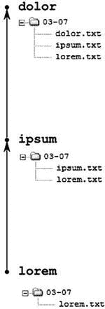

# 三、使用线性历史创建本地存储库

在这一章中，你将学习如何创建你自己的库，以及如何在你的日常工作中使用它们。这包括

*   用`$ git init`初始化新的储存库
*   使用`$ git add –A`和`$ git commit -m "..."`将快照存储为修订版
*   使用`$ git status -s -b`检查储存库的状态

您将学习如何从头开始一个新项目，以及如何导入现有文件。

三种方法将集中在将工作目录恢复到存储在修订版中的快照。在学习了这些方法之后，您应该能够将任何存储库(比如 jQuery)的工作目录重置为任意修订版，比如存储库中的第一个修订版，然后将工作目录返回到其最新状态。

我特别关注可能会引发问题的情况。两种方法精确地描述了如何以及何时丢失未提交或已提交的修改。这些知识会建立你的自信。如果您遵守一些简单的规则，您将永远不会丢失存储在 git 存储库中的内容。

在第 2 章中，我们将存储库描述为非裸露或者裸露。这种特征基于工作目录的存在。这里我们再介绍另一种分类:**干净**或者**脏**。这个分类只适用于非裸库。当存储库的工作目录内容与存储在其最新版本中的快照相同时，存储库就是**干净的**。另一方面，如果工作目录中的文件被修改并且没有提交，我们称这个存储库**为脏的**。为了找出一个存储库是干净的还是脏的，我们使用了`$ git status`命令。

3-1.创建您的第一个存储库

问题

您想要开始一个新项目，该项目将由包含您最喜欢的作家所写的书籍列表的文本文件组成。让我们假设您计划将每个作家的作品存储在一个单独的文件中。创建文件并键入其内容后，您应该保存文件并将其提交到存储库中。假设你用阿加莎·克里斯蒂、约翰·格里森姆和斯蒂芬·金的作品创建文件。你的存储库的历史看起来类似于图 3-1 。


[图 3-1](#_Fig1) 。配方 3-1 中的储存库

解决办法

在这个菜谱中，您将使用 git commit 命令创建您的第一个修订。Git 不允许提交，除非您将您的身份存储在配置文件中。如果到目前为止您还没有这样做，请运行以下两个命令，用您的个人信息替换`John Doe`和`john.doe@example.net`:

```
$ git config --global user.name "John Doe"
$ git config --global user.email john.doe@example.net
```

当您准备好提交时，初始化一个新的存储库:

```
$ cd git-recipes
$ git init 03-01
$ cd 03-01
```

现在，目录 03-01 包含了 git 存储库。要进行验证，请运行命令:

```
$ ls -la
```

它将打印三个项目:

```
.
..
.git
```

正如您所猜测的，存储库是空的。这意味着数据库不包含修订。我们可以用`$ git log`和`$ git status`命令来验证这一点。首先，打印历史记录:

```
$ git log

```

答案将是:

```
fatal: bad default revision 'HEAD'
```

现在，使用以下命令检查状态:

```
$ git status

```

git status 打印的信息将是:

```
# On branch master
#
# Initial commit
#
nothing to commit (create/copy files and use "git add" to track)
```

注释`# Initial commit`意味着存储库已经准备好存储第一次提交。就这么办吧。

创建第一个文件:

```
$ vi agatha-christie.txt
```

该文件可以包含清单 3-1 中的文本，但这并不重要。

[***清单 3-1。***](#_list1) 阿加莎-克里斯蒂的内容. txt

```
Novels
    1943 | Five Little Pigs
    1934 | Murder on the Orient Express
```

保存文件`agatha-christie.txt`后，使用以下命令检查存储库的状态:

```
$ git status -s
```

您将看到以下输出:

```
?? agatha-christie.txt
```

两个问号`??`通知您`agatha-christie.txt`文件未被跟踪。这是一个尚未提交的新文件。现在，仓库是脏的。

使用以下两个命令创建您的第一个修订版:

```
$ git add -A
$ git commit -m "First revision [Agatha Christie]"
```

该文件现在存储在新版本中。命令:

```
$ git status -s
```

返回空输出，这意味着工作目录中没有挂起的更改。换句话说，仓库是干净的。让我们用`$ git log`检查日志。输出将类似于:

```
commit de3680b0a770dd46ede81f46cba0ae32f9e4687c
Author: Włodzimierz Gajda <gajdaw@gajdaw.pl>
Date:   Thu May 2 12:50:19 2013 +0200

    First commit [Agatha Christie]
```

储存库的当前状态如[图 3-2](#Fig2) 所示。


[图 3-2](#_Fig2) 。第一次修订后配方 3-1 的储存库

让我们创建第二个修订版。请遵循以下步骤:

1.  创建文件`john-grisham.txt`

    ```
    $ vi john-grisham.txt
    ```

2.  键入文件的内容:

    ```
    Novels
    1989 | A Time to Kill
    1991 | The Firm
    1992 | The Pelican Brief
    ```

3.  保存文件并关闭编辑器。
4.  Check the status of the repository:

    ```
    $ git status -s
    ```

    输出:

    ```
    ?? john-grisham.txt
    ```

    通知您一个新的、未被跟踪的文件:

    ```
    john-grisham.txt
    ```

5.  将工作目录的当前状态保存为新版本:

    ```
    $ git add -A
    ```

    ```
    $ git commit -m "Second revision [John Grisham]"
    ```

6.  Check the status of the repository with:

    ```
    $ git status -s
    ```

    空输出证明存储库是干净的。

7.  Check the log of the repository with the alias from Recipe 2-10:

    ```
    $ git l
    ```

    输出包含两个修订:

    ```
    0468 Second revision: [John Grisham]
    ```

    ```
    de36 First commit [Agatha Christie]
    ```

8.  存储库应该看起来像[图 3-3](#Fig3) 。


[图 3-3](#_Fig3) 。第二次修订后配方 3-1 的储存库

完成配方，创建第三个文件`stephen-king.txt`和第三个版本。程序如下:

1.  创建文件`stephen-king.txt`

    ```
    $ vi stephen-king.txt
    ```

2.  输入内容:

    ```
    Novels
        1974 | Carrie
        1975 | Salem’s Lot
        1977 | The Shining
    ```

3.  保存文件并关闭编辑器。
4.  Check the status of the repository:

    ```
    $ git status -s
    ```

    存储库不干净:

    ```
    ?? stephen-king.txt
    ```

5.  为工作目录的当前状态创建修订:

    ```
    $ git add -A
    $ git commit -m "Third revision [Stephen King]"
    ```

6.  Check the status of the repository:

    ```
    $ git status -s
    ```

    现在，输出是空的；因此，我们知道存储库是干净的。

7.  Check the log with:

    ```
    $ git l
    ```

    输出将包含三个修订:

    ```
    ffa6 Third revision [Stephen King]
    0468 Second revision: [John Grisham]
    de36 First commit [Agatha Christie]
    ```

8.  储存库如[图 3-1](#Fig1) 所示。

 **注意**配方 3-1 中介绍的两个命令:`$ git add –A`和`$ git commit -m "..."`将你的工作目录的当前状态保存为一个新的版本。我们用它们在每个版本中存储一个新文件，但这不是必须的。您可以创建、删除、移动和复制任意数量的文件。这两个命令存储工作目录，不管修改了多少文件或者使用了哪种类型的工具。

它是如何工作的

使用以下命令初始化新的存储库:

```
$ git init

```

您可以传递一个路径来告诉 git 您希望项目存储在哪里。命令:

```
$ git init 03-01

```

创建一个新的空目录`03-01`并初始化其中的一个空存储库。没有任何参数,`$ git init`命令将在当前目录中初始化一个新的存储库。

当存储库初始化后，您就可以处理您的项目了:您可以创建文件并输入它们的内容。Git 非常智能地跟踪您在工作目录中所做的更改。它知道你做的所有修改。如果您怀疑这一点，请尝试使用以下命令:

```
$ git status
```

它返回关于工作目录中引入的更改的确切信息。这个命令的缩写形式也非常有用。如[清单 3-2](#list2) 所示。

[***清单 3-2。***](#_list2) 回答问题的命令:仓库是脏的还是干净的？

```
$ git status -s
```

 **提示**仓库可以被描述为干净或者肮脏。当我们说**库是干净的**；这意味着工作目录中的所有文件都存储在最新版本中。在这种状态下，命令:`$ git status -s`返回一个空结果。**存储库是脏的**意味着工作目录包含未提交的修改。命令:`$ git status -s`返回挂起变更的列表。

清单 3-2 中的命令以非常紧凑的形式打印出修改列表。您可以将它视为对以下问题的快速回答:存储库干净吗？如果输出为空，那么存储库是干净的。否则存储库是脏的，输出会列出修改。

在某些时候，您需要决定将工作目录的当前状态保存为一个新的版本。为此，使用清单 3-3 中的两个命令。

[***清单 3-3。***](#_list3) 两个命令将工作目录的当前状态保存为新的版本

```
$ git add -A
$ git commit -m "Comment..."
```

现在，将它们视为一个原子操作。我们将在第 4 章中讨论他们的确切角色。现在，知道当执行时，它们将创建一个新的修订，并使存储库保持干净状态就足够了。

如果你是新的 git 用户，我建议在学习的早期阶段，你应该在每次修订后检查库的状态和日志。众所周知，这可以通过以下方式实现:

```
$ git status -s
$ git log
```

您也可以使用配方 2-10 中定义的`$ git l`别名。

3-2.创建 git 快照别名

问题

正如你已经知道的，你的工作目录的快照可以用清单 3-3 中的两个命令保存。因为我们将其视为单个操作，所以您希望定义将执行这两个命令的别名快照。您的别名，执行时为:

```
$ git snapshot
```

应该将工作目录的当前状态存储为新版本。

解决办法

打开命令行，转到您的主目录，编辑您的`.gitconfig`文件。遵循配方 2-10 开头给出的程序。

在您的`.gitconfig`文件的`[alias]`部分的末尾键入[清单 3-4](#list4) 的内容，保存文件，并关闭编辑器。

[***清单 3-4。***](#_list4) 别名饭桶快照

```
[alias]
    snapshot = "!snapshot() {
        COMMENT=wip;
        if [ \"$*\" ]; then
            COMMENT=\"$*\";
        fi;
        git add -A;
        git commit -m \"$COMMENT\";
    }; snapshot"
```

它是如何工作的

类似于配方 2-10，别名用换行符分开。请记住，这里的换行符只是为了使别名更容易阅读——您必须在您的`.gitconfig`文件中将别名作为一个长行键入。

别名使用外壳函数`snapshot`，该函数在解析`.gitconfig`后变成:

```
snapshot() {
    COMMENT=wip;
    if [ "$*" ]; then
        COMMENT="$*";
    fi;
    git add -A;
    git commit -m "$COMMENT";
}
```

说明:

```
COMMENT=wip;
```

用值`wip`定义一个名为`COMMENT`的变量。Wip 是在制品的缩写。特殊变量`$*`包含传递给脚本的所有参数。考虑以下命令:

```
$ some-script a b c
```

这个调用向脚本`some-script`发送三个参数:`a`、`b`和`c`。您可以使用带引号的`$*`变量`"$*"`来访问所有三个参数。

条件语句 if-then-fi:

```
if [ "$*" ]; then
    COMMENT="$*";
fi;
```

检查传递给脚本的参数。如果用参数调用脚本，它们将被分配给`COMMENT`变量。否则`COMMENT`变量将保持不变——它存储默认值 wip。

现在，您已经了解了将使您能够理解快照别名如何工作的一切。当我们运行该命令时:

```
$ git snapshot
```

它创建一个带有注释 wip 的版本。

如果我们传递任何参数:

```
$ git snapshot Lorem ipsum dolor
```

然后别名将创建带有注释“Lorem ipsum dolor”的修订。

3-3.在日常工作中使用 git 快照别名

问题

您想要启动一个新项目，该项目将由存储儿童歌曲的文本文件组成。类似于方法 3-1，您计划在新提交中保存每个新文件。为了避免同时键入`$ git add`和`$ git commit`命令，您更喜欢使用`$ git snapshot`别名，在配方 3-2 中定义。

解决办法

初始化新的存储库:

```
$ cd git-recipes
$ mkdir 03-03
$ cd 03-03
$ git init
```

创建包含“唱一首六便士的歌”的歌词的第一个修订版。

1.  创建文件`sing-a-song-of-sixpence.txt`

    ```
    $ vi sing-a-song-of-sixpence.txt
    ```

2.  键入文件的内容:

    ```
    Sing a song of sixpence,
    A pocket full of rye.
    Four and twenty blackbirds,
    Baked in a pie.
    ...
    ```

3.  保存文件并关闭编辑器。
4.  Check the status of the repository with `$ git status -s`

    存储库不干净。

5.  将工作目录的当前状态保存为新版本:

    ```
    $ git snapshot Sing a song of sixpence
    ```

6.  Check the status of the repository with `$ git status -s`

    仓库是干净的。

7.  Check the log of the repository with `$ git l`

    输出将包含一个版本:

    ```
    7cfb Sing a song of sixpence
    ```

存储库现在看起来像[图 3-4](#Fig4) 。


[图 3-4](#_Fig4) 。“儿童歌曲”项目第一次改版

创建包含“咩，咩，黑羊”歌曲歌词的第二个修订版。

1.  创建`baa-baa-black-sheep.txt`文件:

    ```
    $ vi baa-baa-black-sheep.txt
    ```

2.  键入文件的内容:

    ```
    Baa, baa, black sheep,
    Have you any wool?
    Yes, sir, yes, sir,
    Three bags full;
    ...
    ```

3.  保存文件并关闭编辑器。
4.  Check the status of the repository with `$ git status -s`

    存储库不干净。

5.  将工作目录的当前状态保存为新版本:

    ```
    $ git snapshot Baa, baa black sheep
    ```

6.  Check the status of the repository with `$ git status -s`

    仓库是干净的。

7.  Check the log of the repository with `$ git l`

    输出将包含两个修订:

    ```
    564f Baa, baa black sheep
    7cfb Sing a song of sixpence
    ```

“儿童歌曲”项目的现状如[图 3-5](#Fig5) 所示。


[图 3-5](#_Fig5) 。第二次修订后的“儿童歌曲”项目

现在你决定这个项目应该存储不同语言的歌曲。创建一个名为`EN`的新目录，并将两个文件移动到其中:

```
$ mkdir EN
$ mv *. txt EN
```

检查存储库的状态:

```
$ git status -s
```

存储库不干净。将工作目录的当前状态保存为新版本:

```
$ git snapshot Internationalization: directory EN
```

现在存储库是干净的。命令:

```
$ git l
```

返回三个版本:

```
f305 Internationalization: directory EN
564f Baa, baa black sheep
7cfb Sing a song of sixpence
```

我们得到的知识库如[图 3-6](#Fig6) 所示。


[图 3-6](#_Fig6) 。第三次改版后的“儿童歌曲”项目

创建新文件夹`PL`:

```
$ mkdir PL
```

现在，检查状态:

```
$ git status -s
```

多奇怪，储存库是干净的！这是因为 git 不跟踪空目录。

 **提示**绕过 git 禁止提交空目录的限制的公认方法是创建一个名为`.gitkeep`的空文件。

现在准备包含波兰歌曲“Bajka iskierki”的修订版:

1.  创建`bajka-iskierki.txt`文件:

    ```
    $ vi PL/bajka-iskierki.txt
    ```

2.  键入文件的内容:

    ```
    Na Wojtusia z popielnika
    Iskiereczka mruga....
    ```

3.  保存文件并关闭编辑器。
4.  Check the status of the repository:

    ```
    $ git status -s
    ```

    存储库不干净。

5.  将工作目录的当前状态保存为新版本:

    ```
    $ git snapshot [PL] Bajka iskierki
    ```

6.  Check the status of the repository with:

    ```
    $ git status –s
    ```

    仓库是干净的。

7.  Check the log of the repository with:

    ```
    $ git l
    ```

    输出将包含四个修订:

    ```
    d234 [PL] Bajka iskierki
    f305 Internationalization: directory EN
    564f Baa, baa black sheep
    7cfb Sing a song of sixpence
    ```

储存库的状态如[图 3-7](#Fig7) 所示。


[图 3-7](#_Fig7) 。第四次改版后的“儿童歌曲”项目

现在你决定每首歌都要以一句歌词开头:

```
TITLE: Abc...
```

打开`EN/sing-a-song-of-sixpence.txt`文件`$ vi EN/sing-a-song-of-sixpence.txt`，在文件的最开头插入一行:

```
TITLE: Sing a song of sixpence
```

保存文件并关闭编辑器。

以同样的方式修改第二个文件`baa-baa-black-sheep.txt`。第一行应该包含`TITLE: Baa, baa, black sheep`。最后修改第三个文件`bajka-iskierki.txt`。输入文本`TITLE: Bajka iskierki`。保存文件并关闭编辑器。

好了，现在三个文件都被修改了。命令`$ git status –s`打印:

```

 M EN/baa-baa-black-sheep.txt
 M EN/sing-a-song-of-sixpence.txt
 M PL/bajka-iskierki.txt
```

创建将存储项目当前状态的修订:

```
$ git snapshot Titles
```

由`$ git l`打印的历史现在打印五个修订:

```
39d6 Titles
d234 [PL] Bajka iskierki
f305 Internationalization: directory EN
564f Baa, baa black sheep
7cfb Sing a song of sixpence
```

如你所见，单个修订可以存储任意数量的修改。我们创建的最后一个修订版包括三个修改过的文件。配方 3-3 的最终储存库显示在[图 3-8](#Fig8) 中。


[图 3-8](#_Fig8) 。配方 3-3 的最终储存库

它是如何工作的

您已经知道如何用`$ git init`初始化一个新项目。当不带参数执行时，该命令将在当前目录中创建一个存储库。

项目初始化后，您可以使用以下命令继续工作:

```
$ git status -s
```

和别名:

```
$ git snapshot
$ git l
```

每当您想要将工作目录的当前状态保存为修订时，请使用以下命令:

```
$ git snapshot
```

如果要设置修订的注释，请使用参数:

```
$ git snapshot A short info explaining the purpose of the revision
```

3-4.映射名称

问题

假设在第一次接触 git 时，您以这样的方式配置它，您的名字被设置为`johny`:

```
$ git config --global user.name johny
```

你在你的项目上工作了一段时间，然后你决定你更喜欢被称为`John Doe`。又过了一段时间，在这段时间里，你会再次改变主意。这次你要叫`Paul "Moo" Cowboy`。因此，你的修改被分配给三个不同的作者:`johny`、`John Doe`和`Paul "Moo" Cowboy`。您希望重新配置您的存储库，使所有这些名称都映射到您的真实名称。你可以通过准备一个`.mailmap`文件来达到这个效果。

解决办法

从配方 3-3 克隆存储库:

```
$ cd git-recipes
$ git clone 03-03 03-04
$ cd 03-04
```

检查修订的作者:

```
$ git shortlog -s
```

输出将类似于:

```
5  Włodzimierz Gajda
```

当然，我的名字会被你的代替。该输出通知您名为“odzimierz Gajda”的人编写了五个修订。

打开您的`.gitconfig`文件，并将您的名称改为:

```
[user]
    name = johny
    email = john.doe@example.net
```

接下来创建修订版本为`johny`。遵循程序:

1.  创建目录`FR/`和文件`FR/alouette-gentille-alouette.txt` :

    ```
    $ mkdir FR
    $ vi FR/alouette-gentille-alouette.txt
    ```

2.  键入文件的内容:

    ```
    Alouette, gentille alouette,
    Alouette, je te plumerai.
    ...
    ```

3.  保存文件并关闭编辑器。
4.  创建修订:

    ```
    $ git snapshot [FR] Alouette, gentille alouette
    ```

现在，`$ git shortlog -s`产生的输出将包括两个作者:

```
5  Włodzimierz Gajda
1  johny
```

遵循相同的程序，通过`John Doe`创建新版本:

1.  把你在`.gitconfig`的名字改成无名氏:

    ```
    [user]
        name = John Doe
        email = john.doe@example.net
    ```

2.  创建一个新文件`little-skylark.txt` :

    ```
    $ vi EN/little-skylark.txt
    ```

3.  键入文件的内容:

    ```
    Little skylark, lovely little skylark,
    Little lark, I'll pluck your feathers off.
    ...
    ```

4.  保存文件并关闭编辑器。
5.  将工作目录的当前状态保存为新版本:

    ```
    $ git snapshot [EN] Little skylark, lovely little skylark
    ```

6.  Check the list of authors with:

    ```
    $ git shortlog -s -n
    ```

    由于有了`-n`选项，输出将按照修订数量降序排列:

    ```
    5  Włodzimierz Gajda
    1  John Doe
    1  johny
    ```

    接下来，在名称`Paul "Moo" Cowboy`下创建修订:

    1.  Change your name in `.gitconfig`:

        ```
        [user]
            name = "Paul \"Moo\" Cowboy"
            email = moo@wild-west.example.net
        ```

        请注意，您必须用反斜杠对引号进行转义。

    2.  创建一个新文件`frere-jacques.txt` :

        ```
        $ vi FR/frere-jacques.txt
        ```

    3.  键入文件的内容:

        ```
        Frère Jacques, frère Jacques,
        Dormez-vous? Dormez-vous?
        Sonnez les matines! Sonnez les matines!
        Ding, daing, dong. Ding, daing, dong.
        ```

    4.  保存文件并关闭编辑器。
    5.  将工作目录的当前状态保存为新版本:

        ```
        $ git snapshot [FR] Frere Jacques
        ```

    6.  Check the list of authors with:

        ```
        $ git shortlog -s -n
        ```

        输出将包含四个条目:

        ```
        5  Włodzimierz Gajda
        1  John Doe
        1  Paul "Moo" Cowboy
        1  johny
        ```

 **提示**我们现在有四个不同的作者，我们将继续邮件映射。然而，当存储库包含由以下作者创作的修订时，我鼓励您检查由`$ git shortlog -s -n`返回的结果:`name = "Paul "Moo" Cowboy", name = Peter ;Moo Cowboy, name = "Peter ;Moo Cowboy", name = "Peter "Moo" Cowboy"`。这些例子有助于理解`.gitconfig`文件的解析。理解引用和评论的处理特别有帮助。

要继续映射姓名和电子邮件，请将您在`.gitconfig`文件中的姓名和电子邮件恢复为原始数据。我会输入:

```
[user]
    name = Włodzimierz Gajda
    email = gajdaw@gajdaw.pl
```

你必须用你的名字和电子邮件替换上述数据。

现在，创建文件`.mailmap`:

```
$ vi .mailmap
```

记住,`.mailmap`文件必须存储在当前项目的工作目录的根目录下。否则没有效果。键入以下内容(用您自己的电子邮件替换我的电子邮件):

```
My New Extra Name < gajdaw@gajdaw.pl >
```

当你保存`.mailmap`文件时，命令:

```
$ git shortlog -s -n
```

它将返回:

```
5  My New Extra Name
1  John Doe
1  Paul "Moo" Cowboy
1  johny
```

你可以看到，我的名字是从`Włodzimierz Gajda`映射到`My New Extra Name`的。再次打开`.mailmap`文件并追加另一行:

```
John Doe < john.doe@example.net >
```

该行:

```
John Doe < john.doe@example.net >
```

将所有提交的名称从`john.doe@example.net`更改为`John Doe`。的输出:

```
$ git shortlog -sn
```

现在是:

```
5  My New Extra Name
2  John Doe
1  Paul "Moo" Cowboy
```

以前分配给 johny 的提交现在被视为由`John Doe`创建。

如何将`Paul "Moo" Cowboy`的修订分配给`John Doe`？您将通过以下`.mailmap`条目实现它:

```
John Doe <john.doe@example.net> <moo@wild-west.example.net>
```

上面的条目映射了从`moo@wild-west.example.net`到`John Doe`的所有修订。现在，`$ git shortlog -ns`的产量是:

```
5  My New Extra Name
3  John Doe
```

完成配方，创建`.mailmap`条目，将所有修订重新分配给你。通过添加您的第二个名字来重新映射您的姓名。这个问题的解决方案显示在[清单 3-5](#list5) 中。

[***清单 3-5。***](#_list5) 这个。邮件映射内容将所有修订重新分配给我，并通过插入我的第二个名字 Edmund 来更改我的姓名

```
Włodzimierz Edmund Gajda <gajdaw@gajdaw.pl>
Włodzimierz Edmund Gajda <gajdaw@gajdaw.pl> <john.doe@example.net>
Włodzimierz Edmund Gajda <gajdaw@gajdaw.pl> <moo@wild-west.example.net>
```

现在,`$ git shortlog -ns`命令返回:

```
8  Włodzimierz Edmund Gajda
```

所有的修改都是由一个人完成的——我。

完成制作方法，创建新版本:

```
$ git snapshot Mapping names with .mailmap
```

现在，存储库包含九个修订，只有一个提交者。您可以通过以下方式进行验证:

```
$ git stat
```

这是我们在配方 2-10 中创建的别名。

记住`.mailmap`文件只影响`$ git shortlog`命令。命令:

```
$ git log
```

将打印:

```
commit abda33b8addab96e2016f974765f937f9dac6e3c
Author: Włodzimierz Gajda <gajdaw@gajdaw.pl>
Date:   Thu May 9 10:35:15 2013 +0200

    Mapping names with .mailmap

commit ba805256075eb86cf8a09a1d5c3161dbe6fc63e5
Author: Paul "Moo" Cowboy <moo@wild-west.example.net>
Date:   Thu May 9 10:07:01 2013 +0200

    [FR] Frere Jacques

commit 659ca289a3898eaf210d0c68228a645a74a3dd52
Author: John Doe <john.doe@example.net>
Date:   Thu May 9 10:01:44 2013 +0200

    [EN] Little skylark, lovely little skylark

...
```

在内部，所有的修改都用原作者标明。

它是如何工作的

要更改您的姓名，您可以使用以下命令:

```
$ git config --global user.name "Your Name"
```

或者手动编辑您的`.gitconfig`文件。这些命令:

```
$ git config --global user.name "John Doe"
$ git config --global user.email john.doe@example.net
```

创建以下`.gitconfig`条目:

```
[user]
    name = John Doe
    email = john.doe@example.net
```

使用`$ git config`命令还是编辑`.gitconfig`文件并不重要。需要记住的重要事实是，当您使用`$ git commit`命令创建修订时，会用到来自`.gitconfig`的姓名和电子邮件条目。因此，如果您首先将您的姓名定义为:

```
[user]
    name = johny
    email = john.doe@example.net
```

后来决定将其更改为:

```
[user]
    name = John Doe
    email = john@doe.example.com
```

那么您的存储库的历史将包含两个作者:`johny`和`John Doe`。命令:

```
$ git shortlog -s
```

将返回这两个名称，因为它们被视为不同的人:

```
13 johny
 8 John Doe
```

这个输出告诉我们，johnny 编写了 13 个修订，John Doe 编写了 8 个。你可以提供额外的信息，说明 johny 和 John Doe 实际上指的是同一个人。这个映射应该存储在工作目录的`.mailmap`文件中。文件的每一行都定义了名字到名字或者电子邮件到电子邮件的映射。该行:

```
Proper Name < commit@example.net >
```

定义将作者的电子邮件设置为`commit@example.net`的提交应该用名称`Proper Name`标记。

该行:

```
< proper@example.net > < commit@example.net >
```

重新映射电子邮件。它规定由`commit@example.net`创作的修改应该分配给使用电子邮件`proper@example.net`的人。

更复杂的例子:

```
Proper Name < proper@example.net > < commit@example.net >
```

将提交的名称和电子邮件都更改为作者的电子邮件等于`commit@example.net`到`Proper Name`和`proper@example.net`。

可以将`.mailmap`文件的位置从工作目录的根目录更改为由`mailmap.file`配置选项定义的任意位置。`.gitconfig`和`.mailmap`文件都可以是 utf-8 编码的，因此你可以在里面使用非 ascii 字符，比如,。如果你想分析现实生活中的`.mailmap`例子，请访问 jQuery 资源库:`https://github.com/jquery/jquery`。

 **文档**`.mailmap`文件的完整规范可在 shortlog 命令`: $ git shortlog --help`的手册中找到。

请记住，当您定义一个奇怪的名称时，例如:

```
Paul "Moo" Cowboy
```

你必须使用引号和反斜杠:

```
[user]
    name = "Paul \"Moo\" Cowboy"
    email = john.doe@example.net
```

 **提示**命令:`$ git log --pretty=format:"- { name: '%an', email: '%ae' }" | sort | uniq`以 YAML 格式打印所有作者的完整列表。您可以使用这个列表为大型项目自动生成您的`.mailmap`文件。

3-5.使用 git 重置恢复修订

问题

您可能还记得，git 是一个版本控制系统。这意味着它存储项目中文件的所有版本。您可能想知道如何访问不久前存储的版本？您希望将项目恢复到第一个修订版，然后恢复到一段时间前提交的修订版，最后恢复到最后一个修订版。

解决办法

从配方 3-4 克隆存储库:

```
$ cd git-recipes
$ git clone 03-04 03-05
$ cd 03-05
```

并用`$ git l`打印历史。输出将类似于[清单 3-6](#list6) 。保存`$ git l`的输出，以备将来参考使用该配方。我将参考[清单 3-6](#list6) ，但是因为你有不同的 SHA-1 散列，你将需要你自己的历史副本。一旦你学会了如何使用 reflog，保存就没有必要了。你将在配方 3-8 中学习如何使用 reflog。

[***清单 3-6。***](#_list6) 储存库使用的历史菜谱 3-5

```
abda Mapping names with .mailmap
ba80 [FR] Frere Jacques
659c [EN] Little skylark, lovely little skylark
348f [FR] Alouette, gentille alouette
39d6 Titles
d234 [PL] Bajka iskierki
f305 Internationalization: directory EN
564f Baa, baa black sheep
7cfb Sing a song of sixpence
```

现在，将工作目录恢复到名为`7cfb`的第一个版本:

```
$ git reset --hard 7cfb
```

成功执行上述命令后，工作目录包含一个文件`sing-a-song-of-sixpence.txt`。您可以使用`$ ls`命令来验证它。此外，您可以通过`$ git l`查看历史记录。输出将只包含一个版本:

```
7cfb Sing a song of sixpence
```

这就是为什么我希望你复制[清单 3-6](#list6) 中的`$ git l`命令的输出。所有修订都包含在数据库中，但它们现在不包含在历史记录中。只有知道它们的 SHA-1 名称，才能恢复它们。如果你不知道它们的名字，你可以使用 ref log——我们将在秘籍 3-7 中学习。存储库现在看起来像[图 3-4](#Fig4) 。历史上除了`7cfb`没有其他版本。

我假设你知道清单 3-6 中打印的修订名称。如果没有，再次启动配方，这次保存清单 3-6 中[显示的历史。](#list6)

现在，恢复修订版，表示为:

```
f305 Internationalization: directory EN
```

您可以使用以下命令来完成:

```
$ git reset --hard f305
```

在该命令之后，工作目录包含以下目录和文件:

```
.
`-- EN
    |-- baa-baa-black-sheep.txt
    `-- sing-a-song-of-sixpence.txt
```

存储库看起来像图 3-6 。命令`$ git l`打印三个版本:

```
f305 Internationalization: directory EN
564f Baa, baa black sheep
7cfb Sing a song of sixpence
```

最后，将您的存储库重置为最新版本，如清单 3-6 所示:

```
$ git reset --hard abda
```

命令`$ git l`打印出与清单 3-6 中的[相同的结果。工作目录包含配方 3-3 和 3-4 中创建的所有文件。](#list6)

 **小心**配方 3-5 清楚地表明，存储在`.git/objects`中的数据库和存储库的历史不是一回事。在执行`$ git reset`命令后，一些修订从历史记录中删除，但它们仍然存在于数据库中。存储库的历史只是数据库中所有可用信息的子集。要从数据库中获取信息，您需要一个有效的名称。

它是如何工作的

存储库的历史可以显示为修订列表。我们可以使用`$ git log --pretty=oneline`或者别名`$ git l`。正如您已经知道的，每个修订都有其唯一的名称。要将工作目录恢复到您可以使用的修订之一:

```
$ git reset --hard [REVISION]
```

该命令执行以下两项操作:

*   它将工作目录的状态重置为指定的修订版，这意味着所有文件和目录的内容都将恢复到与修订版中保存的快照完全相同的快照。
*   它从历史记录中删除在指定版本之后创建的所有版本。

如果您想恢复存储库的原始状态，就像在使用`$ git reset`命令之前一样，您必须记住最新版本的名称，或者您可以使用 reflog。

3-6.用 git 检验恢复修订版

问题

将工作目录恢复到给定版本的操作可以通过`$ git reset`或`$ git checkout`命令来执行。在方法 3-5 中，你用`$ git reset`命令恢复旧的快照。现在，您想用一个`$ git checkout`命令获得类似的结果。

解决办法

从配方 3-4 克隆存储库:

```
$ cd git-recipes
$ git clone 03-04 03-06
$ cd 03-06
```

并用`$ git l`打印历史。输出将与清单 3-6 中的[相同。保存`$ git l`的输出以备将来参考。](#list6)

现在，将工作目录恢复到第一个版本，名为`7cfb`:

```
$ git checkout 7cfb
```

该命令将存储库的状态更改为**分离头**。您可以通过以下方式验证这一点:

```
$ git status -sb
```

输出应该是:

```
## HEAD (no branch)
```

工作目录现在包含一个文件`sing-a-song-of-sixpence.txt`，打印有`$ git l`的历史仅包含一个版本:

```
7cfb Sing a song of sixpence
```

使用以下命令将其恢复到正常状态:

```
$ git checkout master
```

现在用`$ git l`打印的历史包含了清单 3-6 中显示的所有修订。

您可以再次使用`$ git checkout`切换到其他版本，例如:

```
$ git checkout 564f
```

要返回正常状态，请使用:

```
$ git checkout master
```

它是如何工作的

恢复以前保存的快照的第二种方法是使用以下命令:

```
$ git checkout [REVISION]
```

该命令的工作方式与配方 3-5 中讨论的`$ git reset`不同。

`$ git checkout`命令执行以下三个操作:

*   它进入分离的头部状态。
*   它将工作目录的状态重置为指定的版本。
*   它从历史记录中删除在指定修订之后创建的所有修订。

分离的头是存储库的一种特殊状态，在这种状态下，您不在任何分支上。我们将在第 5 章、第 6 章、第 7 章和第 10 章更详细地讨论分支。现在，要使用`$ git checkout`，你只需要知道:

*   `$ git checkout [SHA-1]`命令进入分离头状态。
*   如何检查您的存储库的状态。
*   如何从脱离的头部回到正常状态？

命令:

```
$ git status -b
```

返回当前分支的信息。它输出:

```
# Not currently on any branch.
```

当您处于分离的头部状态或:

```
# On branch master
```

当你处于正常状态时。你可以连接一个`$ git status`命令的两个有用的开关`-s`和`-b`:

```
$ git status -s -b
```

或者甚至:

```
$ git status -sb
```

当存储库干净并处于分离磁头模式时，此命令会打印:

```
## HEAD (no branch)
```

在正常状态下，输出为:

```
#master
```

如果您处于分离状态，您可以通过以下方式返回正常状态:

```
$ git checkout master
```

总而言之，该命令:

```
$ git checkout [REVISION]
```

将工作目录恢复到指定版本，并进入分离头状态。

命令:

```
$ git checkout master
```

返回到最新版本并恢复正常状态。

 **提示**配方 3-6 介绍了一个存储库的新特性。我们可以说存储库处于**脱离头状态**或**正常状态**。

3-7.创建 git 的别名

问题

如何定义一个别名来简化一个`$ git status –sb`命令的执行？

解决办法

在您的`.gitconfig`文件的`[alias]`部分的末尾键入[清单 3-7](#list7) 的内容。

[***清单 3-7。***](#_list7) 别名饭桶年代

```
[alias]
    s = status -sb
```

您可以使用以下命令获得相同的结果:

```
$ git config --global alias.s "status -sb"
```

它是如何工作的

别名`$ git s`执行命令:

```
$ git status -sb
```

输出传达了以下问题的答案:

*   存储库是干净的还是脏的？换句话说，是否有任何未提交的更改？
*   存储库是否处于分离状态？或者我们在一根树枝上？如果是，打印分行的名称。

3-8.使用参考日志

问题

在配方 3-5 和 3-6 中，用 SHA-1 名称保存日志的程序非常麻烦。如果你知道如何使用 reflog，这是可以避免的。你将想要创建一个如图 3-9 所示的库。接下来，您希望使用`$ git reset --hard [REVISION]`命令将工作目录恢复到每次提交。您可能更喜欢使用 reflog，而不是复制和粘贴 SHA-1 名称。



[图 3-9](#_Fig9) 。配方 3-8 中讨论的储存库

 **提示**图 3-9中显示的文件内容并不重要。

解决办法

初始化新的存储库:

```
$ cd git-recipes
$ git init 03-08
$ cd 03-08
```

使用以下内容创建第一个文件:

```
$ echo lorem > lorem.txt
```

该命令创建一个名为`lorem.txt`的新文件。该文件包含一个单词`lorem`。您可以使用两个命令来验证它:

```
$ ls
$ cat lorem.txt
```

第一个文件列出了当前目录的内容(该列表将由一个文件`lorem.txt`组成)，第二个文件显示了`lorem.txt`的内容(当然是`lorem`)。

现在用以下内容创建第一个修订版:

```
$ git snapshot lorem
```

当然，存储库是干净的，`$ git status –s`返回空结果。现在使用以下命令检查参考日志:

```
$ git reflog
```

该命令的输出如清单 3-8 中的[所示。](#list8)

[***清单 3-8。***](#_list8) 第一次提交后 git reflog 的输出

```
bb057dd HEAD@{0}: commit (initial): lorem
```

它通知您，带有注释`lorem`的修订现在可以称为:

```
bb057dd
```

或者

```
HEAD@{0 }.
```

让我们创建第二个版本:

```
$ echo ipsum > ipsum.txt
$ git snapshot ipsum
```

目前，存储库包含两个修订版本，注释分别为`lorem`和`ipsum`。命令:

```
$ git reflog
```

现在返回清单 3-9 中的输出。

[***清单 3-9。***](#_list9) 第二次提交后 git reflog 的输出

```
227c9fb HEAD@{0}: commit: ipsum
bb057dd HEAD@{1}: commit (initial): lorem
```

发生了什么事？我们在历史中从版本`lorem`移动到版本`ipsum`。当前版本可以被称为`HEAD@{0}`——现在是版本`ipsum`。之前的版本——也就是`lorem`——可以称为`HEAD@{1}`。

创建第三个版本:

```
$ echo dolor > dolor.txt
$ git snapshot dolor
```

并执行:

```
$ git reflog
```

输出显示在[清单 3-10](#list10) 中。

[***清单 3-10。***](#_list10) 第三次修改后 git reflog 的输出

```
fe7dbef HEAD@{0}: commit: dolor
227c9fb HEAD@{1}: commit: ipsum
bb057dd HEAD@{2}: commit (initial): lorem
```

历史向前发展。这次`HEAD@{0}`指的是`dolor`修改。之前的版本是`ipsum`，所以可以简称为`HEAD@{1}`。我们创建的第一个版本——`lorem`——现在可以作为`HEAD@{2}`使用。

是时候使用引用日志名称来恢复修订了。首先，我们想恢复标题为`lorem`的版本。您可以使用以下命令来完成此操作:

```
$ git reset --hard HEAD@{2}
```

之后，工作目录应该只包含一个文件，`$ git reflog`命令应该返回清单 3-11 中的输出。

[***清单 3-11。***](#_list11)git 复位后 git reflog 的输出——硬磁头@{2}

```
bb057dd HEAD@{0}: reset: moving to HEAD@{2}
fe7dbef HEAD@{1}: commit: dolor
227c9fb HEAD@{2}: commit: ipsum
bb057dd HEAD@{3}: commit (initial): lorem
```

正如你在清单 3-11 中看到的，所有的`HEAD@{n}`引用都被更新了。以下是他们指出的情况:

```
HEAD@{0}—points to the revision lorem
HEAD@{1}—points to the revision dolor
HEAD@{2}—points to the revision ipsum
HEAD@{3}—points to the revision lorem
```

接下来，使用以下命令将存储库重置为标题为`dolor`的版本:

```
$ git reset --hard HEAD@{1}
```

在这之后，存储库包含三个文件`lorem.txt`、`ipsum.txt`和`dolor.txt`；并且`$ git reflog`命令返回如[清单 3-12](#list12) 所示的输出。

[***清单 3-12。***](#_list12)git 复位后 git reflog 的输出——硬磁头@{1}

```
481f34f HEAD@{0}: reset: moving to HEAD@{1}
aae6588 HEAD@{1}: reset: moving to HEAD@{2}
481f34f HEAD@{2}: commit: dolor
84fb524 HEAD@{3}: commit: ipsum
aae6588 HEAD@{4}: commit (initial): lorem
```

它是如何工作的

Git reflog 是一个特殊的日志，它在存储库中存储关于您的移动的信息。每次创建修订、重置存储库或更改当前修订时，参考日志都会更新。名称`HEAD@{0}`总是指向当前版本。先前的版本可作为`HEAD@{1}`获得。两个操作前的当前版本可作为`HEAD@{2}`获得，等等。因此，即使你不知道他们的名字，你也可以参考以前的修订。

3-9.在现有项目中创建新的存储库

问题

您正在处理一个已经包含大量文件和目录的项目。您想开始在那个项目中使用 git。

解决办法

输入包含您要跟踪的一些文件的目录:

```
$ cd my/important/project
```

初始化新的存储库:

```
$ git init
```

并创建包含所有文件的修订版:

```
$ git add -A
$ git commit -m "Initial commit"
```

当然，您可以使用别名:

```
$ git snapshot Initial commit
```

存储库包含存储所有文件的当前状态的单个修订。然后，您可以继续工作，用`$ git snapshot`或`$ git add`和`$ git commit`命令保存所有修改。

它是如何工作的

Git 的 init 命令可以在任何不包含`.git`子目录的目录中执行。您可以在已经包含由许多文件和子目录组成的项目的目录中运行`$ git init`。在存储库初始化之后，您可以用两个命令`$ git add –A`和`$ git commit –m "Initial commit"`导入所有文件。你也可以使用`$ git snapshot Initial commit`。

3-10.丢失未提交的更改

问题

如果您忘记提交更改并重置工作目录，您希望检查您的修改会发生什么情况。

解决办法

从配方 3-1 克隆存储库:

```
$ cd git-recipes
$ git clone 03-01 03-10
$ cd 03-10
```

创建一个新文件`graham-masterton.txt`:

```
$ vi graham-masterton.txt
```

键入其内容:

```
Novels
    1975 | The Manitou
    1977 | The Djinn
    1979 | Revenge of the Manitou
```

保存文件并关闭编辑器。

然后修改文件`stephen-king.txt`:

```
$ vi stephen-king.txt
```

追加两本小说`The Stand`和`The Dead Zone`:

```
Novels
    1974 | Carrie
    1975 | Salem’s Lot
    1977 | The Shining
    1978 | The Stand
    1979 | The Dead Zone
```

保存文件并关闭编辑器。

现在，`$ git status`命令打印出:

```
M stephen-king.txt
?? graham-masterton.txt
```

这意味着工作目录中有两个变化:

*   文件`stephen-king.txt`已被修改。
*   工作目录包含一个新文件`graham-masterton.txt`。

用`$ git l`别名打印历史。

输出包含我们在配方 3-1 中创建的三个修订:

```
ffa6 Third revision [Stephen King]
0468 Second revision: [John Grisham]
de36 First commit [Agatha Christie]
```

假设现在你忘记提交你的工作。当您决定使用以下命令恢复您的第一个修订版时，文件`stephen-king.txt`和`graham-masterton.txt`仍然未提交:

```
$ git reset --hard de36
```

在该命令之后，工作目录包含两个文件。命令`$ ls`打印他们的名字:

```
agatha-christie.txt
graham-masterton.txt
```

文件`stephen-king.txt`已经消失。您可以将存储库的状态重置为修订版:

```
ffa6 Third revision [Stephen King]
```

可以使用 reflog 来完成:

```
$ git reset --hard HEAD@{1}
```

文件`stephen-king.txt`将被恢复，但是它现在将只包含在配方 3-1 期间键入的三本书。命令:

```
$ cat stephen-king.txt
```

印刷品:

```
Novels
    1974 | Carrie
    1975 | Salem's Lot
    1977 | The Shining
```

你在配方 3-10 期间键入的两本新小说:

```
1978 | The Stand
1979 | The Dead Zone
```

没有存储在数据库中。你还记得吗？您忘记提交更改。在`stephen-king.txt`中输入的更改已丢失，无法恢复。

显示新文件的内容:

```
$ cat graham-masterton.txt
```

通过`$ git reset`操作，新文件保持不变。

它是如何工作的

这个配方的目的是警告您未提交的更改可能会丢失。请记住，该命令:

```
$ git reset --hard [REVISION]
```

只能在干净的目录中安全使用。签出命令:

```
$ git checkout [REVISION]
```

是内部限制的。只有在操作不会导致数据丢失的情况下，才能使用它。每当有丢失未提交的更改的风险时，系统将会警告您，并且操作将会中止。这将在配方 5-6 和 5-7 中详细讨论。

3-11.创建 git 简单提交别名

问题

您已经注意到，在学习和实践 git 时，经常需要创建一系列的修订。通常文件的内容并不重要，可以忽略不计。您希望简化使用别名`simple-commit`创建这种类型的提交的任务。被呼叫时:

```
$ git simple-commit lorem ipsum dolor
```

别名应创建如图 3-9 所示的三个版本。每个参数都应该被解释为请求创建一个新的版本来存储一个新的文件。电话:

```
$ git simple-commit abc
```

应该创建一个带有注释`abc`的修订。修订版应包括一个包含文本`abc`的新文件`abc.txt`。

解决办法

打开您的`.gitconfig`文件，并在`[alias]`部分的末尾键入如[列表 3-13](#list13) 所示的别名。

[***清单 3-13。***](#_list13) 别名:git 创建文件和 git 简单提交

```
[alias]
    create-file = "!createFile() {
        for name in \"$@\"; do
            echo $name>$name.txt;
        done;
    }; createFile"

    simple-commit = "!simpleCommit() {
        for name in \"$@\"; do
            git create-file \"$name\";
            git snapshot $name;
        done;
    }; simpleCommit"
```

它是如何工作的

第一个别名创建文件。电话:

```
$ git create-file yes no
```

创建两个文件`yes.txt`和`no.txt`。第一个文件包含文本`yes`，第二个文件包含文本`no`。`for`循环:

```
for name in \"$@\"; do
    echo $name>$name.txt;
done;
```

处理传递给脚本的所有参数。每个参数都可以作为`$name`变量在一次循环中访问。因此呼吁:

```
$ git create-file yes no
```

相当于:

```
echo yes>yes.txt
echo no>no.txt
```

第二个别名包含处理所有参数的相同循环:

```
for name in \"$@\"; do
    git create-file \"$name\";
    git snapshot $name;
done;
```

每次循环时，我们调用两个别名:

```
$ git create-file $name
$ git snapshot $name
```

电话:

```
$ git simple-commit yes no
```

相当于:

```
$ git create-file yes
$ git snapshot yes

$ git create-file no
$ git snapshot no
```

电话:

```
$ git simple-commit lorem ipsum dolor
```

创建如图 3-9 所示的储存库。

 **提示**秘籍 2-10、3-2 和 3-7 中定义的所有别名在你使用 git 的日常工作中都很有用。配方 3-11 中定义的别名只有在学习和实践 git 时才有用。

3-12.松开提交

问题

您希望验证无法通过符号引用访问的修订是否会丢失。您可以按照以下步骤操作:

*   提交更改。
*   用`$ git reset –hard [REVISION]`重置历史。一些提交将不再被`$ git log`命令返回。它们在数据库中保持不变。您可以使用 reflog 或 SHA-1 名称来访问它们。
*   一旦清除参考日志，未被`$ git log`打印的修订将变得不可及。这意味着他们仍然在数据库中，但你可以访问他们只有当你知道他们的 SHA-1 名字。
*   执行完`$ git prune`命令后，所有可删除的修订都将从数据库中删除。他们迷路了。没有办法让他们回来。

解决办法

创建新的存储库:

```
$ cd git-recipes
$ git init 03-12
$ cd 03-12
```

用注释`a`、`b`、`c`创建三个修订:

```
$ git simple-commit a b c
```

使用[清单 3-14](#list14) 中所示的命令，你可以在没有别名的情况下达到同样的效果。

[***清单 3-14。***](#_list14) 该命令相当于 git simple-commit a b c

```
$ echo a>a.txt
$ git add -A
$ git commit -m a

$ echo b>b.txt
$ git add -A
$ git commit -m b

$ echo c>c.txt
$ git add -A
$ git commit -m c
```

用`$ git l`打印历史。输出包含三个修订:

```
5c1e c
4580 b
c4ac a
```

将存储库的状态重置为第一个版本:

```
$ git reset --hard c4ac
```

虽然用`$ git l`打印的历史现在只包含一个修订版—`c4ac a`—但其他两个修订版— `5c1ec`和`4580b`—仍然在数据库中可用。您可以使用它们的名称或 reflog 来恢复它们。我们在配方 3-8 中这样做了。

现在,`$ git reflog`命令打印出以下输出:

```
c4ac743 HEAD@{0}: reset: moving to c4ac
5c1ee9a HEAD@{1}: commit: c
45800dd HEAD@{2}: commit: b
c4ac743 HEAD@{3}: commit (initial): a
```

这意味着修订版`5c1ee9ac`和`45800ddb`在符号名称`HEAD@{1}`和`HEAD@{2}`下可用。我们称这种类型的修订为*悬空修订*。让我们用以下命令清除 reflog:

```
$ git reflog expire --all --expire=now
```

执行此命令后，reflog 变为空。`$ git` reflog 命令返回空结果。这意味着现在修订版`5c1ee9ac`和`45800ddb`只能通过它们的名字获得。没有符号名称导致修改`b`和`c`。如果是这种情况，git 可以从数据库中删除修订。这种类型的修订被称为*不可达修订*。

让我们检查一下，哪些存储在`.git/objects`数据库中的对象只能通过 SHA-1 名称访问:

```
$ git prune --dry-run
```

输出将包含——除其他内容外——两个修订:

```
45800ddc19fa325296437fdbd7cc7e5654619597 commit
5c1ee9a3f19f854c783fa87003cb1ecc5508971d commit
```

如果您比较一下`$ git l`的输出，您将会看到输出中包含了修订名称`5c1ec`和`4580b`。换句话说，如果你现在执行命令`$ git prune`，那么两个修改`b`和`c`将最终丢失。就这么办吧。执行命令:

```
$ git prune
```

如果您现在尝试使用其名称将存储库重置为修订版`c`:

```
$ git reset --hard 5c1e
```

您将得到以下错误:

```
fatal: ambiguous argument '5c1e': unknown revision or path not in the working tree.
```

该修订版不再可用。你刚刚失去了它！永远！

 **提示**你可以用`$ git fsck --unreachable`列出数据库中存储的所有不可访问的对象。

它是如何工作的

Git 将所有修订存储在存储库的数据库`.git/objects`中。该数据库使用 SHA-1 散列来识别修订、文件和所有其他条目。它是一种内容可寻址存储，这意味着密钥是使用存储数据的内容生成的。有时，数据库会被清除，不能通过符号引用访问的对象最终会被删除。为了熟悉这个过程，我们需要更深入地研究存储库的结构。

在前一章中，我们将 git 存储库分为:

*   git 目录`.git/`
*   数据库`.git/objects`
*   工作目录

数据库的内容可以进一步分为:

*   通过各种符号引用(如 reflog、分支和标签)可用的对象被分类为**可达的**。
*   仅通过 SHA-1 名字可用的对象被分类为**不可达**。

清理数据库的过程会删除所有无法访问的对象。您可以使用`$ git prune`或`$ git gc`命令手动完成。但是即使不使用那些命令，git 也会自动完成——这只是时间问题。关于多久清理一次存储库的确切参数可以在配置中设置。

当我们打电话时:

```
$ git reflog expire --all --expire=now
```

参考日志已清除。因此，我们删除了所有指向修订版`b`和`c`的符号引用。这就是为什么修订版`b`和`c`变得遥不可及。接下来调用:

```
$ git prune
```

已从数据库中删除这些修订。

结论

方法 3-12 的目的是向你展示，即使是提交的变更也可以从存储库中删除。您可以通过保留符号引用来避免这种情况。为此，最简单的解决方案是使用分支。配方 5-4 也讨论了丢失已提交变更的问题。

摘要

这一章向前迈出了非常重要的一步。现在，您可以在日常工作中使用 git，而没有任何丢失数据的风险。git 最简单的工作流程是:

1.  修改您的文件
2.  Save the snapshot of the working directory with two commands:

    ```
    $ git add -A
    $ git commit -m "...".
    ```

    该操作由这两个命令实现，如图 3-10 中的[所示](#Fig10)

    

    [图 3-10](#_Fig10) 。使用$ git add–A 和$ git commit–m 命令

感谢:

```
$ git reset --hard [REVISION]
$ git checkout [REVISION]
```

您知道如何检索以前的快照之一。使用`$ git checkout`或`$ git reset`您可以访问存储在您的存储库中的每个修订。记住，当使用`$ git reset`时，参考日志将帮助你返回到最新版本。

从现在开始，您应该记住两种新的重要的描述存储库的方法。存储库可以是:

*   干净还是脏
*   在分离的头部或正常状态下

两个特征都由`$ git status –sb`命令显示。

当工作目录的内容与当前版本中保存的快照相同时，**存储库是干净的**。

当工作目录的内容包含未提交的更改时,**存储库是脏的**。

第二个特征，正常状态和分离的磁头状态，是在`.git/HEAD`文件的基础上完成的。我们将在关于分支的章节中回到这一点。目前你知道如何检查状态。当执行以下命令时,**存储库处于脱离头状态**:

```
$ git status -sb
```

开始于:

```
## HEAD (no branch)
```

否则**储存库处于正常状态**。

本章中出现的另一个重要特征将数据库的内容分为:

*   **可达对象**:通过符号引用可获得的对象
*   **无法访问的对象**:只能通过 SHA-1 名字访问的对象

请记住，在自动垃圾收集过程中，无法访问的对象可以从存储库中删除。这就是为什么你不能在分离的头部状态下工作。当您在分离的 HEAD 状态下工作时，您会创建无法访问的修订，除非您手动创建符号引用(分支或标记)。