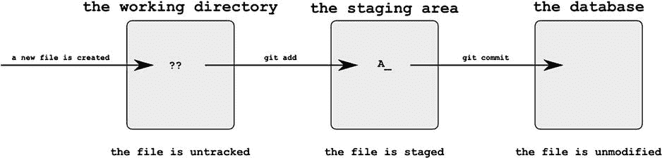
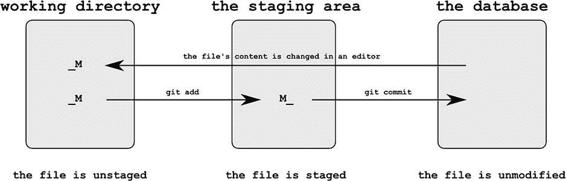
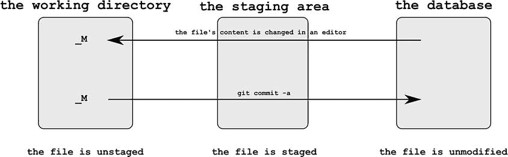
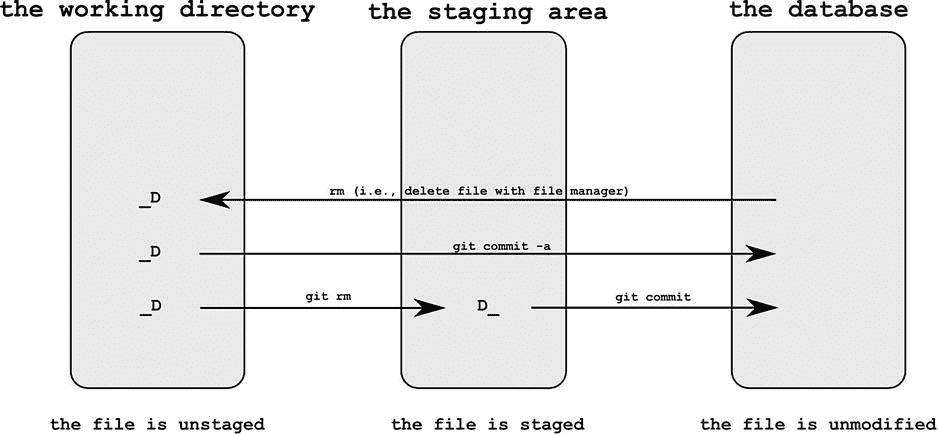
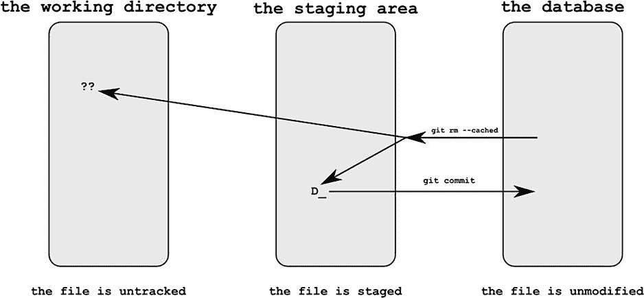
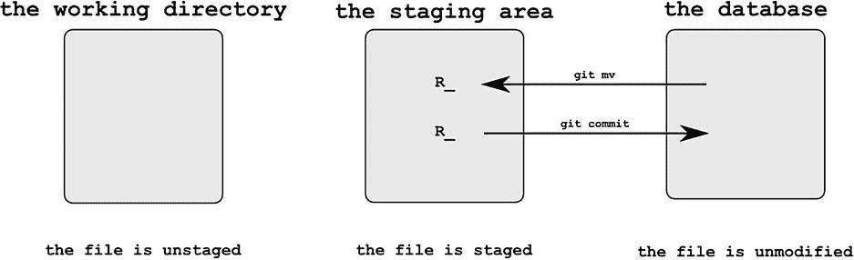
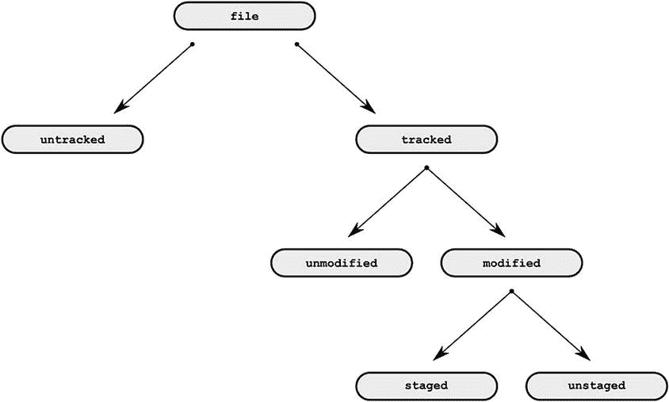
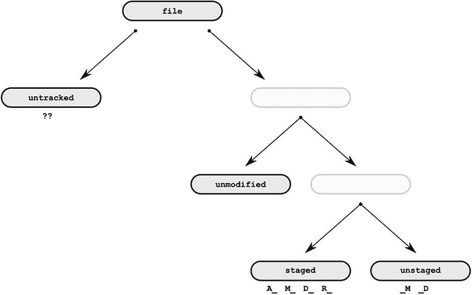
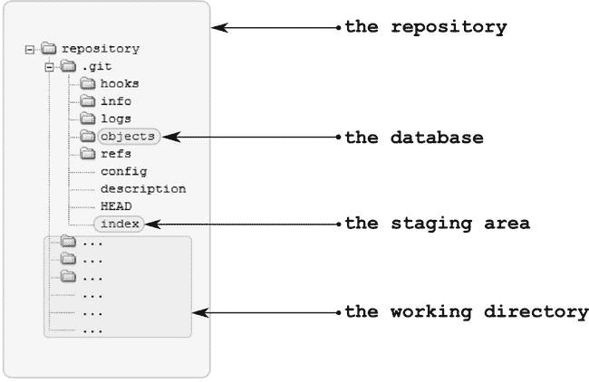
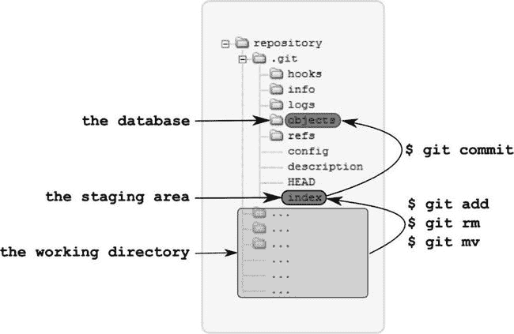

# 四、管理文件

在本章中，我们将练习和分析在工作目录中使用的文件系统命令。我们将创建、修改、删除和重命名文件，并检查这些操作如何影响存储库。

正如您已经知道的，git 不会自动注册工作目录中的更改。要创建新版本，您必须发出特殊命令:

```
$ git add -A
$ git commit -m "Some comment..."
```

至此，我们将它们视为一个原子操作，可以描述为将工作目录的快照保存为一个新的修订。现在，我们将把这个操作分解成两个独立的步骤:

```
$ git add -A
```

和

```
$ git commit -m "Some comment..."
```

Git 允许您选择哪些文件应该进入下一个版本——这就是为什么您需要两个命令来创建一个版本的原因。第一个命令为下一个修订选择文件。第二个命令使用选定的文件创建修订。为下一次修订选择的文件称为**暂存文件**。暂存文件列表存储在名为**暂存区 T5】或**索引**的`.git/index`文件中。**

4-1.暂存和提交新文件

问题

您想要创建一个新文件，并将其提交到存储库中。您还想熟悉这个配方中执行的每个命令所执行的变化。为了实现这一点，您需要使用`$ git status`和`$ git status –s`命令来分析存储库的状态。

解决办法

使用以下内容启动新存储库:

```
$ cd git-recipes
$ git init 04-01
$ cd 04-01
```

然后，按照以下步骤操作:

1.  用`$ echo new > new.txt`创建一个新文件
2.  Check the status of the repository. The output of the `$ git status` will be the following:

    ```
    # On branch master
    #
    # Initial commit
    #
    # Untracked files:
    #   (use "git add <file>..." to include in what will be committed)
    #
    #       new.txt
    nothing added to commit but untracked files present (use "git add" to track)
    ```

    如你所见，`new.txt`文件被列为**未跟踪的**。

3.  Check the shortened output of git status. The command

    ```
    $ git status -s will print:

    ?? new.txt
    ```

    未跟踪的文件用`??`表示。

4.  使用`$ git add new.txt`命令暂存文件。
5.  Check the status of the repository. The output of `$ git status` would be:

    ```
    # On branch master
    #
    # Initial commit
    #
    # Changes to be committed:
    #   (use "git rm --cached <file>..." to unstage)
    #
    #       new file:   new.txt
    #
    ```

    这一次，文件显示在**待提交的变更**部分下。这意味着该文件是暂存的。

6.  Check the status with the `$ git status -s` command. The command will print:

    ```
    A_ new.txt
    ```

    这个显示的新状态由两个字符`A`和空格组成。为了使输出更具可读性，我使用了下划线`_`来代替空格。

7.  用

    ```
    $ git commit -m "Staging and committing a new file"
    ```

    创建一个新版本
8.  用`$ git status -s`命令检查状态。输出是空的，因此存储库是干净的。

它是如何工作的

在存储库中存储新文件的过程总是由两个步骤组成。没有别的办法做这件事。当你创建一个新文件时，起初它是**未跟踪的**，这意味着 git 不会将文件存储在存储库中，也不会跟踪文件的内容。`$ git status -s`命令返回的文件状态用两个问号表示:

```
?? new.txt
```

如果要将文件存储在修订中，首先要将文件添加到临时区域。这通过以下方式完成:

```
$ git add new.txt
```

**暂存区**是一个修改列表，该列表将包含在下一次使用`$ git commit`命令进行的修改中。暂存区存储在`.git/index`文件中。添加到暂存区的文件称为**暂存文件**。在`$ git add new.txt`之后，缩短状态命令`$ git status -s`打印:

```
A_ new.txt
```

如您所见，添加到暂存区的新文件由`A_`表示。

 **提示**你可以使用通配符 `*`和`?`作为`$ git add`命令。

当文件位于临时区域时，您可以使用以下命令创建新版本:

$ git commit -m "一些解释…

临时区域中包含的所有更改都将进入修订版。该文件存储在存储库中，现在可以描述为未修改的。您可能注意到了这些命令:

```
$ git status
$ git status -s
```

不打印任何关于未修改文件的信息。

配方 4-1 将储存在储存库中的文件分为三组:

*   无人探索过的
*   阶段
*   未更改的

图 4-1 显示了新文件从未跟踪到暂存和从暂存到未修改的过程。



[图 4-1](#_Fig1) 。提交新文件的过程

由`$ git status –s`命令返回的所有代码都使用两个字母。第一个字母描述暂存区，第二个字母描述工作目录。当`$ git status –s`返回`??`时，你可以把它解释为:

*   第一个`?`通知您该文件在暂存区中未知。
*   第二个`?`通知您文件在工作目录中是未知的。

以类似的方式，由`A_`表示的状态具有以下含义:

*   第一个字符(`A`)表示文件被添加到暂存区(它已被暂存并将在下一次提交时被存储)。
*   第二个字符(`_`)表示工作目录中的文件与暂存区中存储的文件具有相同的内容。

有时您可能会无意中存放一个新文件。你如何逆转分期？如果是新文件，可以使用以下命令之一:

```
$ git rm --cached -- [filename]
$ git reset -- [filename]
```

4-2.暂存和提交修改的文件

问题

您希望修改并提交已存储在存储库中的文件。为了熟悉这个操作是如何执行的，您需要在每隔一个命令之前和之后使用$ git status 和`$ git status –s`命令。

解决办法

使用以下内容启动新存储库:

```
$ cd git-recipes
$ git init 04-02
$ cd 04-02
$ git simple-commit modified
```

现在存储库是干净的，工作目录包含一个名为`modified.txt`的文件。该文件由配方 3-11 中定义的`$ git simple-commit` 别名创建并提交。

现在，按照程序进行:

1.  用`$ echo Some other text > modified.txt`修改`modified.txt`文件
2.  Check the status of the repository with the `$ git status` command. The output:

    ```
    # On branch master
    # Changes not staged for commit:
    #   (use "git add <file>..." to update what will be committed)
    #   (use "git checkout -- <file>..." to discard changes in working directory)
    #
    #       modified:   modified.txt
    #
    no changes added to commit (use "git add" and/or "git commit -a")
    ```

    告诉您`modified.txt`文件已被修改，但没有准备提交。请注意，与配方 4-1 一样，该文件列在**未提交的变更**下。

3.  Check the simplified form of status. The output of `$ git status -s` will be:

    ```
    _M modified.txt
    ```

    状态由两个字符表示:空格和字母`M`。同样，我使用了下划线而不是空格。

4.  用`$ git add modified.txt`将`modified.txt`添加到暂存区
5.  Check the status with the `$ git status` command. The output:

    ```
    # On branch master
    # Changes to be committed:
    #   (use "git reset HEAD <file>..." to unstage)
    #
    #       modified:   modified.txt
    #
    ```

    该文件现在被列为要提交的**变更**。

6.  Check the simplified form of status with the `$ git status -s` command. The output will be:

    ```
    M_ modified.txt
    ```

    状态由两个字符表示:字母`M`和一个空格。

7.  用`$ git commit -m "Staging and committing a modified file"`提交更改
8.  用`$ git status -s`命令检查状态。输出是空的，因此存储库是干净的。

它是如何工作的

配方 4-2 从修改已经存储在版本中的文件开始。我们将使用以下内容修改文件:

```
$ echo Some other text > modified.txt
```

在此操作之后，文件变为**修改过的**。为了了解 git 对该文件的看法，我们发出以下命令:

```
$ git status

```

该文件列在**未提交的变更**下。因此，我们可以说文件是**修改的**和**未升级的**。也是**跟踪**。但是每个未转移的文件都会被跟踪和修改。因此，说文件是**未分级**就足够了。通过`$ git status –s`命令，先前在一些修改后提交的文件被标记为`_M`。

要将未登台文件添加到登台区，我们使用`$ git add`命令。之后:

```
$ git add modified.txt
```

文件变成了**上演的**。它的短标签现在是`M_`(字母`M`后跟一个空格)。

最后，我们使用以下内容提交暂存文件:

```
$ git commit -m "Some comment..."
```

并且该文件再次未被修改。

配方 4-2 在[图 4-2](#Fig2) 中描述。



[图 4-2](#_Fig2) 。使用登台区提交修改文件的过程

两个字母状态`_M`和`M_` 提供了关于暂存区和工作目录中文件状态的信息。

状态`_M`意味着:

*   第一个字符(空格):文件未添加到临时区域。
*   第二个字符(`M`):文件在工作目录中被修改。

状态`M_`可以解释为:

*   第一个字符(`M`):文件被添加到暂存区。
*   第二个字符(空格):暂存区中文件的状态与工作目录中文件的状态相同。

如果您想将状态`M_`再次反转为`_M`，您可以使用:

```
$ git checkout -- [filename]
```

4-3.提交修改的文件

问题

您想要修改并提交已经提交的文件。您希望仅使用`$ git commit`命令来执行该操作。

解决办法

创建新的存储库:

```
$ cd git-recipes
$ git init 04-03
$ cd 04-03
$ git simple-commit modified
```

现在存储库是干净的，工作目录包含一个文件— `modified.txt`。

现在，请遵循以下步骤:

1.  用

    ```
    $ echo Yet another text > modified.txt
    ```

    修改`modified.txt`文件
2.  Check the status of the repository

    ```
    $ git status
    ```

    输出与配方 4-2 中的相同:

    ```
    # On branch master
    # Changes not staged for commit:
    #   (use "git add <file>..." to update what will be committed)
    #   (use "git checkout -- <file>..." to discard changes in working directory)
    #
    #       modified:   modified.txt
    #
    no changes added to commit (use "git add" and/or "git commit -a")
    ```

3.  检查状态的简化形式。

    ```
    $ git status -s will be:

    _M modified.txt
    ```

    的输出
4.  使用

    ```
    $ git commit -a -m "Committing modified file: modified.txt"
    ```

    提交更改
5.  用`$ git status -s`检查状态

输出是空的，因此存储库是干净的。

它是如何工作的

我们从配方 4-2 中知道，在修改之后，未修改的文件(即，被提交并且此后未被修改的文件)变得未分级。我们可以用一个命令提交所有未转移的文件:

```
$ git commit -a -m "Some comment..."
```

标志`-a`告诉 git 包含在提交的未分级文件中。(你还记得吗？跟踪所有未暂存的文件！)注意，使用这个解决方案，您不能选择哪些文件将进入提交。命令:

```
$ git commit -a -m "..."
```

将提交所有暂存和未暂存的文件。如果您想提交一个未暂存的文件，您可以将其名称传递给`$ git commit`命令，如下所示:

```
$ git commit -m "Some text..." -- [filename]
```

 **提示**命令`$ git commit -m "..."`创建一个包含所有暂存文件的新版本。此命令不会修改未转移和未跟踪的文件。命令`$ git commit -a -m "..."`创建一个包含所有被跟踪文件(暂存和未暂存)的新版本。未被跟踪的文件(即标有`??`的文件)不会被该命令修改。

使用两个命令可以获得与使用`$ git commit –a`命令相同的效果:

```
$ git add -u
$ git commit -m "..."
```

命令`$ git add -u`存放所有跟踪的文件。

请记住，您不能使用一个命令:

```
$ git commit -am "..."
```

提交新文件。必须使用`$ git add`命令暂存新文件。除此之外，别无选择。

配方 4-3 中描述的程序在[图 4-3](#Fig3) 中给出。如您所见，这两个命令都跳过了临时区域。



[图 4-3](#_Fig3) 。提交修改文件的过程(跳过暂存区)

 **注意**命令`$ git commit -a -m "..."`可以写成`$ git commit -am "...".`选项的顺序很重要。你不能把它写成`$ git commit -m -a "..."`或`$ git commit -ma "...".`

4-4.暂存和提交已删除的文件

问题

您的存储库处于干净状态，包含一个提交的文件— `deleted.txt`。您希望从工作目录中删除该文件，然后提交该操作。

解决办法

使用以下内容启动存储库:

```
$ cd git-recipes
$ git init 04-04
$ cd 04-04
$ git simple-commit deleted
```

现在存储库是干净的，工作目录包含文件`deleted.txt`。

遵循程序:

1.  用`$ git rm deleted.txt`删除`deleted.txt`文件
2.  用$ ls 检查工作目录的内容。文件`deleted.txt`已被移除。
3.  Check the status of the repository with the `$ git status` command. The output:

    ```
    # On branch master
    # Changes to be committed:
    #   (use "git reset HEAD <file>..." to unstage)
    #
    #       deleted:    deleted.txt
    #
    ```

    在要提交的的**变更下列出一个文件`deleted.txt`。这意味着删除文件的操作是**上演的**。**

4.  Check the simplified form of status. The output of `$ git status -s` will be:

    ```
    D_ deleted.txt
    ```

    这一次，分段文件删除由两个字符表示:一个字母`D`和一个空格。

5.  用`$ git commit -m "Staging and committing removed file"`命令提交更改。
6.  用`$ git status -s`命令检查状态。输出是空的，因此存储库是干净的。工作目录不包含`deleted.txt`文件。

它是如何工作的

我们从一个包含文件`deleted.txt`的干净的存储库开始菜谱。命令`$ git rm deleted.txt`从工作目录中删除文件，并执行该操作。暂存和删除的文件通过`$ git status -s`命令用`D_`表示。在另一个`$ git commit`命令之后，操作被提交:存储在修订版中的快照不包含文件`deleted.txt`。

配方 4-4 的流程如图[图 4-4](#Fig4) 所示。


[图 4-4](#_Fig4) 。配方 4-4 的流程

两个字母的状态`D_`表示:

*   第一个字符(`D`):文件被删除，操作被暂存。
*   第二个字符(空格):工作目录中文件的状态与暂存区中的状态完全相同:文件已从工作目录中删除。

如何反转由`$ git rm [filename]`命令执行的操作？`$ git rm`之后的状态由`D_`表示。首先，我们使用以下命令取消转移:

```
$ git reset -- [filename]
```

该命令将状态从`D_`转换为`_D`。在`_D`状态下，文件仍然从工作目录中丢失，但是删除不再进行。因此，该文件在暂存区中是可用的。要将文件从临时区域恢复到工作目录，请执行以下命令:

```
$ git checkout -- [filename]
```

上面的命令恢复文件。我们可以说，它将`_D`状态转换为未修改的状态。工作目录现在是干净的，文件被恢复。

4-5.提交使用标准 rm 命令删除的文件

问题

您的存储库处于干净状态，并且包含了`removed.txt`文件。文件已提交。您希望使用标准的`$ rm`命令删除文件，然后将修改提交到存储库中。

解决办法

使用以下内容启动存储库:

```
$ cd git-recipes
$ git init 04-05
$ cd 04-05
$ git simple-commit removed
```

存储库是干净的，工作目录包含文件`removed.txt`。

遵循以下程序:

1.  用`$ rm removed.txt`删除`removed.txt`文件
2.  Check the status of the repository. The command:

    ```
    $ git status
    ```

    印刷品:

    ```
    # On branch master
    # Changes not staged for commit:
    #   (use "git add/rm <file>..." to update what will be committed)
    #   (use "git checkout -- <file>..." to discard changes in working directory)
    #
    #       deleted:    removed.txt
    #
    no changes added to commit (use "git add" and/or "git commit -a")
    ```

    该文件列在**未提交的更改**下。所以文件是`unstaged`。

3.  Check the simplified form of status. The output of `$ git status -s` will be:

    ```
    _D removed.txt
    ```

    状态由两个字符表示:一个空格和一个字母`D`。

4.  用

    ```
    $ git commit -a -m "Staging and committing removed file"
    ```

    提交更改
5.  用`$ git status -s`命令检查状态。输出是空的，因此存储库是干净的。工作目录不包含`removed.txt`文件。

它是如何工作的

您可以使用标准命令，如`$ rm`来删除工作目录中的文件。如果您想存放所有删除的文件，您可以使用 git commit `$ git commit -am "..."`的`-a`标志或以下命令之一:

```
$ git add -u
$ git add -A
```

您也可以只暂存用`$ rm`命令删除的选定文件；来实现`$ git rm [filename]`命令的使用。

综上所述，以下两个程序对`filename.txt`具有相同的效果:

```
# first procedure
$ rm filename.txt
$ git commit -am "..."

# second procedure
$ rm filename.txt
$ git rm filename.txt
$ git commit -m "..."
```

它们在一个方面有所不同:第一个过程将提交所有被跟踪的文件(暂存和未暂存)；第二个将只提交暂存文件。

两个程序都显示在[图 4-5](#Fig5) 中。



[图 4-5](#_Fig5) 。使用标准 rm 命令删除的文件可以使用一个命令(git commit -a)或两个命令(git rm 和 git commit)提交

状态`D_`在配方 4-4 中有详细描述。此配方中出现的另一个状态`_D`具有以下含义:

*   第一个字符(空格):操作未被分段。
*   第二个字符(`D`):文件从工作目录中删除。

命令`$ rm [filename]`将未修改的文件转换为`_D`状态。您可以使用以下方法反转此操作:

```
$ git checkout -- [filename]
```

该命令将标为`_D`的文件转换成未修改的文件。文件将被恢复到工作目录中。

4-6.将未修改的文件转换为未被跟踪的文件

问题

存储库处于干净状态，工作目录包含一个文件— `untracked.txt`。该文件未被修改。你想把它转换成未被追踪的状态。

解决办法

使用以下内容启动存储库:

```
$ cd git-recipes
$ git init 04-06
$ cd 04-06
$ git simple-commit untracked
```

现在存储库是干净的，工作目录包含一个文件— `untracked.txt`。

遵循以下程序:

1.  用

    ```
    $ git rm --cached untracked.txt
    ```

    删除未跟踪的. txt 文件
2.  用`$ ls`命令检查存储库的内容。正如您所看到的，文件没有被删除，它仍然存在于工作目录中。
3.  Check the status of the repository. The command

    ```
    $ git status prints:

    # On branch master
    # Changes to be committed:
    #   (use "git reset HEAD <file>..." to unstage)
    #
    #       deleted:    untracked.txt
    #
    # Untracked files:
    #   (use "git add <file>..." to include in what will be committed)
    #
    #       untracked.txt
    ```

    该文件同时被列为**已暂存** ( **待提交变更**)和未跟踪(**未跟踪文件**)。

4.  Check the simplified form of the status. The output of

    ```
    $ git status -s will be:

    D_ untracked.txt
    ?? untracked.txt
    ```

    该文件被列出两次:作为`D_`和`??`。

5.  用`$ git commit -m "Committing removed file"`提交更改
6.  Check the status with the `$ git status -s` command.

    输出是:？？untracked.txt

    该文件不再被跟踪，并且不包括在最新的快照中。

它是如何工作的

这一次是单一命令:

```
$ git rm --cached [filename]
```

将一个未修改的文件转换成两种不同的状态，表示为`D_ ??`。第一种状态表示文件已暂存。更准确地说，我们可以说文件删除操作是分阶段的:下一次提交将存储工作目录的快照，而不存储该文件。

第二种状态表示为`??`，指定工作目录包含一个不被跟踪的文件。在发出下一个`$ git add`命令之前，该文件不会受到下一个提交操作的影响。

配方 4-6 如[图 4-6](#Fig6) 所示。



[图 4-6](#_Fig6) 。git rm - cached 命令将一个未修改的文件转换成两种状态，分别表示为 D_ 和？？

4-7.暂存并提交用 git mv 重命名的文件

问题

您的存储库处于干净状态，包含一个名为`old-name.txt`的文件。您想要将文件`old-name.txt`重命名为`new-name.txt`，并提交该操作。

解决办法

使用以下内容启动存储库:

```
$ cd git-recipes
$ git init 04-07
$ cd 04-07
$ git simple-commit old-name
```

现在存储库是干净的，工作目录包含一个文件— `old-name.txt`。

遵循以下程序:

1.  用`$ git mv old-name.txt new-name.txt`重命名文件
2.  用`$ ls`命令检查工作目录的内容。工作目录现在包含一个名为`new-name.txt`的文件。文件`old-name.txt`已经消失了。
3.  Check the status of the repository with the `$ git status` command. The output:

    ```

    # On branch master
    # Changes to be committed:
    #   (use "git reset HEAD <file>..." to unstage)
    #
    #       renamed:    old-name.txt -> new-name.txt
    #
    ```

    说明移动文件的操作是分阶段进行的。

4.  Check the simplified form of status. The output of `$ git status -s` will be:

    ```
    R_ old-name.txt -> new-name.txt
    ```

    状态由两个字符表示:字母`R`后跟一个空格。

5.  用`$ git commit -m "Staging and committing moved file"`命令提交更改。
6.  用`$ git status -s`命令检查状态。输出是空的，因此存储库是干净的。

它是如何工作的

`$ git mv`的语法如下所示:

```
$ git mv [old-filename] [new-filename]
$ git mv [filename] [directory]
```

第一个命令重命名文件，而第二个命令将文件移动到目录中。用`$ git mv`命令重命名或移动的文件用`R_`表示。

操作如图 4-7 中的[所示。](#Fig7)



[图 4-7](#_Fig7) 。配方 4-7 中的事件流程

两个字母的状态`R_`可以解释为:

*   第一个字符(`R`)表示暂存区的状态。`R`表示文件已重命名，操作已暂存。
*   第二个字符与工作目录有关。空格意味着工作目录中文件的状态与暂存区中的状态完全相同。

如何撤销`$ git mv`命令执行的操作？该过程包括两个步骤。首先，使用以下命令取消重命名:

```
$ git reset -- [new-filename]
```

该命令会生成两个文件:

```
D_ old-file.txt
?? new-file.txt
```

您可以使用以下命令恢复`old-file.txt`:

```
$ git reset -- [old-filename]
$ git checkout -- [old-filename]
```

`new-file.txt`可通过以下方式移除:

```
$ rm new-file.txt
```

4-8.提交用标准 mv 命令重命名的文件

问题

您的存储库是干净的，包含一个名为`old-name.txt`的文件。您想要重命名并提交更改。您更喜欢用标准的`$ mv`命令来执行重命名。

解决办法

使用以下内容启动存储库:

```
$ cd git-recipes
$ git init 04-08
$ cd 04-08
$ git simple-commit old-name
```

存储库是干净的，工作目录包含一个文件— `old-name.txt`。

遵循以下程序:

1.  用`$ mv old-name.txt new-name.txt`重命名文件
2.  Check the status of the repository with the `$ git status` command. The output:

    ```
    # On branch master
    # Changes not staged for commit:
    #   (use "git add/rm <file>..." to update what will be committed)
    #   (use "git checkout -- <file>..." to discard changes in working directory)
    #
    #       deleted:    old-name.txt
    #
    # Untracked files:
    #   (use "git add <file>..." to include in what will be committed)
    #
    #       new-name.txt
    no changes added to commit (use "git add" and/or "git commit -a")
    ```

    通知您两项更改。第一个变化与文件`old-name.txt`有关。文件`old-name.txt`已删除，但操作未暂存。此外，您的存储库现在包含一个名为`new-name.txt`的新的未跟踪文件。因此，当您重命名一个文件时，git 认为它是两个独立的操作:删除和创建。

3.  Check the simplified form of status. The output of `$ git status -s` will be:

    ```
    _D old-name.txt
    ?? new-name.txt
    ```

    文件`old-name.txt`已被删除；这被表示为`_D`。git 将文件`new-name.txt`视为一个新的未被跟踪的文件。因此，将其表示为`??`。

4.  用`$ git add new-name.txt`命令暂存一个新文件。正如你在配方 4-1 中所记得的，除了使用`$ git add`命令，没有其他方法来暂存一个新的未跟踪文件。现在命令`$ git status -s`打印:

    ```
    A_ new-name.txt
    _D old-name.txt
    ```

5.  Stage the removed file with the `$ git rm old-name.txt` command and check the status with the `$ git status -s` command. The output:

    ```
    R_ old-name.txt -> new-name.txt
    ```

    显示 git 足够聪明，能够猜到文件被移动了。

6.  用`$ git commit -m "Committing a file moved with mv"`创建版本。
7.  用`$ git status –s`命令检查状态。输出是空的，因此存储库是干净的。

它是如何工作的

操作`$ mv old-name.txt new-name.txt`导致两个变化，表示为:

```
_D old-name.txt
?? new-name.txt
```

第一次变更可通过`$ git rm old-name.txt`进行

要进行第二次更改，您可以使用`$ git add new-name.txt`

当两个更改都被暂存时，git 会猜测只有一个更改—文件被重命名为:

```
R_ moved.txt -> sudir/moved.txt
```

这证明了在 git 中，重命名的方式并不重要。

4-9.暂存所有文件

问题

存储库处于干净状态，其工作目录包含三个文件:`modified.txt`、`deleted.txt`、`old-name.txt`。你想:

*   创建一个新文件— `new.txt`。
*   更改`modified.txt`的内容。
*   移除文件— `deleted.txt`。
*   将文件`old-name.txt`重命名为`new-name.txt`。
*   用一个命令`$ git add –A`准备所有的改变。
*   使用命令— `$ git commit -m "Staging all changes"`提交更改。

解决办法

使用以下内容启动存储库:

```
$ cd git-recipes
$ git init 04-09
$ cd 04-09
$ git simple-commit modified deleted old-name
```

存储库是干净的，工作目录包含三个文件:`modified.txt`、`deleted.txt`和`old-name.txt`。

遵循以下程序:

1.  创建一个新文件`$ echo new > new.txt`
2.  修改`modified.txt`文件`$ echo Some new contents > modified.txt`的内容
3.  用`$ rm deleted.txt`删除`deleted.txt`文件
4.  重命名`old-name.txt`文件`$ mv old-name.txt new-name.txt`
5.  Check the status of the repository with the `$ git status` command. The output:

    ```
    # On branch master
    # Changes not staged for commit:
    #   (use "git add/rm <file>..." to update what will be committed)
    #   (use "git checkout -- <file>..." to discard changes in working directory)
    #
    #       deleted:    deleted.txt
    #       modified:   modified.txt
    #       deleted:    old-name.txt
    #
    # Untracked files:
    #   (use "git add <file>..." to include in what will be committed)
    #
    #       new-name.txt
    #       new.txt
    no changes added to commit (use "git add" and/or "git commit -a")
    ```

    将所有变更列为未暂存。工作目录还包含一个未跟踪的文件。

6.  查看状态的简化形式。`$ git status –s`的输出将是:

    ```
    _D deleted.txt
    _M modified.txt
    _D old-name.txt
    ?? new-name.txt
    ?? new.txt
    ```

7.  用一个命令`$ git add -A`准备所有的改变。
8.  Check the status with the `$ git status` command. You will see:

    ```
    # On branch master
    # Changes to be committed:
    #   (use "git reset HEAD <file>..." to unstage)
    #
    #       deleted:    deleted.txt
    #       modified:   modified.txt
    #       renamed:    old-name.txt -> new-name.txt
    #       new file:   new.txt
    #
    ```

    所有的变化都是阶段性的。

9.  使用`$ git status -s`命令检查缩短状态。您将获得:

    ```
    D_  deleted.txt
    M_  modified.txt
    R_  old-name.txt -> new-name.txt
    A_  new.txt
    ```

10.  用`$ git commit -m "Committing all the changes"`命令提交更改。
11.  用`$ git status -s`命令检查状态。输出是空的，因此存储库是干净的。

它是如何工作的

配方 4-9 解释了我们已经非常熟悉的命令的作用。这个命令在工作目录中存放所有的改变。`$ git add -A`执行的转换汇总在[表 4-1](#Tab1) 中。

[表 4-1](#_Tab1) 。git add -A 执行的转换

| 

$ git add -A 之前的状态

 | 

$ git add -A 后的状态

 |
| --- | --- |
| 新的未暂存文件？？ | A_ |
| 已修改的未转移文件 _M | M_ |
| 已删除的未转移文件 _D | D_ |
| 重命名的未分级文件表示为两处更改；其中一个用？？另一个用 _D 表示 | R_ |

4-10.使用混合状态

问题

您希望检查修改暂存文件时会发生什么情况。

解决办法

使用以下内容启动存储库:

```
$ cd git-recipes
$ git init 04-10
$ cd 04-10
```

存储库是干净的，工作目录不包含任何文件。

遵循以下程序:

1.  创建一个新文件`$ echo Some info > file.txt`
2.  用`$ git add file.txt`命令暂存文件。此时`$ git status -s`打印:

    ```
    A_  file.txt
    ```

3.  用`$ echo Some other info > file.txt`修改文件
4.  用`$ git status -s`命令检查状态。输出将是下面的代码:

    ```
    AM file.txt
    ```

5.  该代码由两个字母组成，通知您某个文件在某个时间点被暂存，但此后被修改过。
6.  用`$ git commit -m "First revision"`命令创建修订。该命令创建一个新的版本，存储内容为`Some info`的文件。仓库仍然很脏。缩短状态命令打印:

    ```
    _M file.txt
    ```

7.  包含`Some other info`的文件仍未暂存。

它是如何工作的

配方 4-10 强调了`$ git add`命令的一个非常重要的方面。它在给定的时间点暂存文件。您可以将`$ git add`视为特殊类型的`$ cp`命令。Git add 命令将文件从工作目录复制到登台区。当然，该操作是在发出$ git add 命令后立即执行的。如果您修改已经暂存的文件，您的修改不会自动暂存。换句话说，存储在临时区域中的文件版本不同于存储在工作目录中的版本。这种状态由两个不同的字母表示，例如:

```
AM file.txt
```

第一个字母`A`表示文件已暂存。第二个字母`M`告诉您存储在工作目录中的文件被修改了。如何将文件恢复到正常状态？如果已经准备好的内容很重要，你可以遵循秘籍 4-10。否则，您可以重做$ git add 命令。国家将变成:

```
A_ file.txt
```

在这种情况下，已暂存但未提交的更改将会丢失。

通常，我在日常工作中不使用`AM`这样的状态。原因很简单。我不会存放我的文件，让它们不被提交。一旦文件被暂存，我就提交。在现实场景中使用 AM 状态的唯一例子是当我从存储库中恢复一个被删除的文件，然后在提交之前修改它。程序如下:

```
$ git simple-commit lorem
$ git rm lorem
$ git checkout HEAD∼ -- lorem.txt
$ vi lorem.txt
$ git status -s
```

命令`$ git checkout HEAD∼ -- lorem.txt`从倒数第二个版本恢复一个被删除的文件。如果编辑文件，其状态将由 AM 指示。

摘要

本章将存储在存储库中的所有文件分为几个类别。分工从问题开始:文件是否被 git 跟踪。每个文件不是**未被跟踪**就是**被跟踪**。因为 git 不存储任何关于未被跟踪的文件的信息——关于它们没有什么可说的了。

**被跟踪的**文件可以进一步分为**未修改的**和**已修改的**。

**未修改的**文件是已经存储在储存库中(即数据库中)的文件。从那以后，它们没有被修改过。

**修改过的**文件是提交后被更改过的文件。它们可以进一步分为**有级**和**无级**档。

**暂存的**文件是进入下一个版本的文件，而**未暂存的**文件将保持不变。未转移的文件不受下一个提交命令的影响，也不会影响下一个提交命令。

[图 4-8](#Fig8) 显示了所讨论文件的状态图。



[图 4-8](#_Fig8) 。文件的不同状态

请注意:

*   跟踪每个未修改的文件。
*   跟踪和修改每个暂存和未暂存的文件。

因此，我们可以毫不含糊地使用这四个形容词来描述文件:

*   无人探索过的
*   未更改的
*   阶段
*   未分级

包含`git status -s`命令返回的短代码的状态简化图如图[图 4-9](#Fig9) 所示。



[图 4-9](#_Fig9) 。git status–s 返回的带有短代码的不同文件状态的简图

知识库的结构

为了引入登台区，我扩展了存储库的结构。事实上它由三个不同的区域组成，如图[图 4-10](#Fig10) 所示:

*   工作目录
*   存储对象的数据库
*   集结地



[图 4-10](#_Fig10) 。知识库的结构

工作目录是您工作的地方。正如您已经知道的，您可以使用任意的工具和命令来操作工作目录中的文件。

一旦您决定应该提交整个工作目录或其中某些文件的当前状态，您就可以存放这些文件。您可以使用$ git add、$ git rm 和$ git mv 命令来实现这一点。它们都可以接受通配符，因此您可以编写如下命令:

```
$ git add *
$ git rm *.txt
$ git mv .????* tmp/
```

您可以避免使用`$ git rm`和`$ git mv`命令，因为`$ git add`可以为您执行重命名和文件删除。`$ git add`命令接受可选参数`--all`或`–update`，可分别缩写为`-A`和`-u`。这些参数以下列方式影响`$ git add`命令的默认行为:

*   `$ git add *`命令将暂存工作目录中所有新的和修改过的文件(删除的文件不会被暂存)。
*   `git add --update`命令将暂存所有修改的文件(包括修改和删除的文件，但不包括新文件)。
*   `git add --all`暂存所有文件(包括新的、修改的和删除的文件)。

根据您的需要，您可以用`$ git add –A`存放所有文件，或者根据您的意愿修改版本。

最后，您可以使用`$ git commit`命令创建修订。如果使用不带`-a`标志的`$ git commit`命令，只有手动添加到暂存区的文件会受到影响。`$ git add`、`$ git rm`和`$ git mv`命令执行的操作如图[图 4-11](#Fig11) 所示。



[图 4-11](#_Fig11) 。由$ git add、$ git rm 和$ git mv 命令实现的操作