# 五、分支

每当我被问及从旧版本的控制系统(VCS，如 CVS 或 Subversion)转换到 git 的好处时；我用这个简短的陈述来回答:git 分支模型。一旦你学会使用它，你会问自己，没有它我究竟是怎么工作的？事实上，git 处理分支的方式使其高于其他(如果不是全部)VCS 系统。事实上，我真的相信这个特性足以成为转向 git 的理由。

分支到底是什么？*一条分支* *是一条发展线*。这是一个高层次的定义，与特定于实现的方面无关。从技术上讲，*git 中的分支是指向数据库中任意提交的指针*。虽然自信地使用分支需要一些练习；你应该从最基本的分支特征开始。它们是相互独立的。修改一个分支的方式不会影响其他分支。为了保存项目历史中的任何一点，创建一个分支就足够了。Git 永远不会修改您的分支，除非您明确要求它这样做。

本章将为你提供一个使用分支的大部分方面的强有力的把握。我们从在非裸存储库中创建和切换分支开始。特别是，讨论包括 git 存储分支方式的各个方面。这将帮助您理解为什么 git 分支如此高效。

接下来，我们在克隆的上下文中分析分支。它将引导我们进入以下不同类型的分支:

*   远程分支(即远程存储库中的分支)
*   本地分支(即您当前工作的存储库中的分支)

*   普通地方分行
*   本地跟踪分支
*   远程跟踪分支 [<sup>1</sup>](#Fn1)

所有的分支类别，在开始时可能不清楚，将在第 10 章讨论远程存储库和协作时变得清晰。这里介绍它们是为了从一开始就提供一个清晰的观点。关于分支克隆的主题将在最后一个秘籍中返回。在那里，我们考虑在裸存储库中的分支上操作。这个方法很少使用，但是它进一步阐明了在非裸存储库中切换分支的过程。

同样，不要在分离的头部状态下工作。这是没有意义的，尤其是一旦你理解了分支。记住，使用分支保证你的修改永远不会丢失。

为了全面了解分支，我还将展示切换分支——如果不小心的话——是如何让你的生活变得复杂的。你可以用三个简单的方法来解决这些问题:

*   清除和重置分支
*   切换分支以避免冲突
*   从意外提交中恢复

有了这三个简单的方法，你一读完这一章就能利用分支。这些是应急秘籍——当你遇到困难时，你可以运用它们。

偶尔你会面临从不同分支访问文件的问题。有两个简单的命令可以解决这个问题:您可以从不同的分支中签出文件，或者在标准输出中显示它。与流重定向器`>`一起使用的后一种解决方案允许您重命名从不同分支检出的文件。显示这些命令的方法强调了您在异构环境中工作时可能遇到的问题。

本章的最后一部分介绍了解释如何删除和重命名分支的方法。这就引出了合并分支和不合并分支的非常重要的概念。

5-1.创建和切换分支

问题

你想在 git 中创建和切换分支。为了实现这个目标，你需要创建一个如图 5-1 所示的库。该图显示了一个修订图，其中每个点代表一个提交，每个带箭头的圆角矩形代表一个分支。您应该小心地创建提交，以使提交消息与相应点的标签完全相同。此外，每次提交都应该包括一个新文件，其名称和内容基于点的标签。例如，标有和`d2`的点表示带有注释`d2`的提交。它应该包含一个名为`d2.txt`的文件，其中包含文本`d2`。这种提交方法有两个重要的特点，可以帮助你练习分支和提交:

*   没有冲突。
*   对于每个版本，你可以很容易地猜出工作目录的内容。

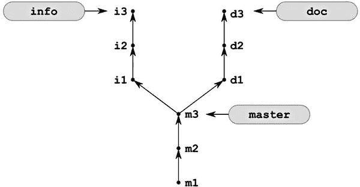

[图 5-1](#_Fig1) 。在配方 5-1 中创建的存储库

当图 5-1 中的[所示的存储库](#Fig1)完成时，您想要验证每个分支只包含分支及其祖先所指向的版本中存储的文件。

解决办法

启动命令行并创建一个新的存储库:

```
$ cd git-recipes
$ git init 05-01
$ cd 05-01
```

然后创建三个版本`m1`、`m2`和`m3`、T3。您可以使用以下步骤:

1.  用`$ echo m1 > m1.txt`创建一个新文件`m1.txt`
2.  使用`$ git snapshot m1`提交快照
3.  用`$ echo m2 > m2.txt`创建一个新文件`m2.txt`
4.  使用`$ git snapshot m2`提交快照
5.  用`$ echo m3 > m3.txt`创建一个新文件`m3.txt`
6.  使用`$ git snapshot m3`提交快照

存储库现在看起来像[图 5-2](#Fig2) 。

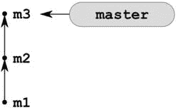

[图 5-2](#_Fig2) 。配方 5-1 中的存储库以及在主分支中创建的前三个版本

默认情况下，任何新初始化的存储库都包含一个名为`master`的分支。您可以使用以下命令验证这一点:

```
$ git branch
```

该命令打印分支列表。现在它的输出将是:

```
* master
```

让我们创建一个名为`doc`的新分支。以下是您需要的命令:

```
$ git branch doc
```

现在，如果您用`$ git branch`命令列出分支，您会注意到存储库包含两个分支，如下所示:

```

  doc
* master
```

星号表示当前分支。说明你还在`master`分支。存储库现在看起来像[图 5-3](#Fig3) 。

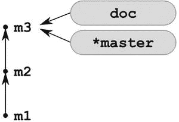

[图 5-3](#_Fig3) 。配方 5-1 中的存储库，有两个分支 master 和 doc

现在您需要在名为`doc`的分支上创建三个版本。首先，您必须使用命令切换到这个分支:

```
$ git checkout doc
```

现在命令:

```
$ git branch
```

印刷品:

```
* doc
  master
```

上面的输出通知您当前位于名为`doc`的分支上。您的提交现在将转到这个新分支。您可以通过以下步骤创建三个提交`d1`、`d2`和`d3`、:

1.  用`$ echo d1 > d1.txt`创建一个新文件`d1.txt`
2.  使用`$ git snapshot d1`提交快照
3.  用`$ echo d2 > d2.txt`创建一个新文件`d2.txt`
4.  使用`$ git snapshot d2`提交快照
5.  用`$ echo d3 > d3.txt`创建一个新文件`d3.txt`
6.  使用$ git snapshot d3 命令提交快照。

存储库现在看起来像[图 5-4](#Fig4) 。

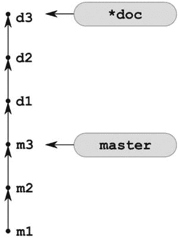

[图 5-4](#_Fig4) 。来自配方 5-1 的储存库，具有版本 d1、d2 和 d3

要创建下一个分支，可以使用三个命令:

```
# switch to master branch
$ git checkout master

# create a new branch named info
# pointing to the same commit as master branch
$ git branch info

# switch to info branch
$ git checkout info
```

或者一个命令:

```
$ git checkout -b info master
```

两个解决方案都将创建一个名为`info`的新分支，它指向与分支`master`相同的修订版本。存储库中的当前分支现在是`info`。您可以使用以下命令检查它:

```
$ git branch
```

上述命令的输出如下:

```

  doc
* info
  master
```

存储库现在看起来像[图 5-5](#Fig5) 。

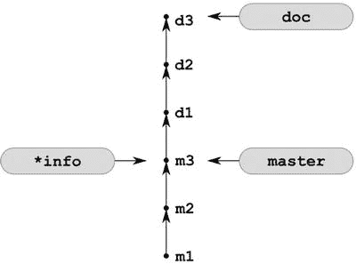

[图 5-5](#_Fig5) 。配方 5-1 中的存储库，带有一个名为 info 的新分支

您可以创建三个版本`i1`、`i2`和`i3`来完成配方:

1.  用`$ echo i1 > i1.txt`创建一个新文件`i1.txt`
2.  使用`$ git snapshot i1`提交快照
3.  用`$ echo i2 > i2.txt`创建一个新文件`i2.txt`
4.  使用`$ git snapshot i2`提交快照
5.  用`$ echo i3 > i3.txt`创建一个新文件`i3.txt`
6.  使用`$ git snapshot i3`提交快照

存储库已完成。看起来像[图 5-1](#Fig1) 。您可以使用以下命令来验证它:

```
$ gitk --all &
```

`gitk`应用绘制的图形如图[图 5-6](#Fig6) 所示。注意，在这个图中，当前分支的名称是用粗体书写的，而当前的修订是用白点表示的。在你的屏幕上，圆点将是黄色的——这是默认情况下`gitk`使用的约定。

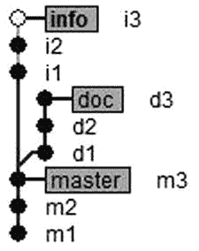

[图 5-6](#_Fig6) 。用 gitk 应用绘制的配方 5-1 的存储库

类似于图 5-6 中[所示的图表可以使用附加开关通过`$ git log`命令](#Fig6)打印出来:

```
$ git log --oneline --graph --decorate --all
```

上述命令的输出将类似于:

```
* 0d6501b (info) i3
* ab087d1 i2
* 6f4364e i1
| * 23d9855 (HEAD, doc) d3
| * f7651b8 d2
| * 6042953 d1
|/
* 7c9bc41 (master) m3
* 9cf5f5a m2
* ebf4409 m1
```

传递给`$ git log`的参数`--graph`打开连接提交的行的可见性，`--oneline`将输出压缩为一行预提交，SHA-1 缩短为 7 个字符，`--decorate`打开符号引用，如`HEAD`、`master`、`doc`和`info`。用于`$ git log`和`$ gitk`命令的参数`--all`具有相同的含义:它使得存储在存储库中所有可用分支中的修订被包括在内。默认情况下，只显示当前分支中包含的提交。

如果您现在使用命令切换到名为`master`的分支:

```
$ git checkout master
```

工作目录将只包含三个文件`m1.txt`、`m2.txt,`和`m3.txt`。可以用`$ ls`命令 来验证。同理，如果你用`$ git checkout doc`切换到`doc`分支，那么工作目录将包含六个文件:`d1.txt`、`d2.txt`、`d3.txt`、`m1.txt`、`m2.txt`和`m3.txt`。如果您切换到分支`info`，工作目录将包含文件:`i1.txt`、`i2.txt`、`i3.txt`、`m1.txt`、`m2.txt`和`m3.txt`。这就是为什么我坚持创建诸如`m1`、`m2`、`d1`、`d2`等提交。您可以很容易地验证您发出的命令如何影响工作目录。一个简单的`$ ls`命令将显示工作目录的完整内容——没有必要检查文件。

 **提示**您可以使用`$ git show info^{tree}`命令列出 info 分支中存储的文件，而无需切换分支。以类似的方式，您可以用`$ git show SHA-1^{tree}`列出任意修订版中的文件。

当用`$ git branch` 列出分支时，可以使用附加参数`-v`。命令`$ git branch -v`将打印每个分支的最新版本，例如:

```
* doc    23d9855 d3
  info   0d6501b i3
  master 7c9bc41 m3
```

执行以下两个命令完成配方:

```
$ git checkout master
$ git pack-refs --all

```

第一个会将当前分支更改为`master`，而第二个会将所有引用，包括所有分支，存储在一个名为`.git/packed-refs`的文件中。

它是如何工作的

每个存储库都包含一个特殊的文件`.git/HEAD`，它指向当前的版本。这就是 git 知道您最近签出了哪个版本的方法。这也将在您下次提交时用作父修订。存储在`.git/HEAD`文件中的引用以两种形式之一写入:

*   作为对分支的符号引用
*   作为阿沙一号

如果你在一个分支上，那么`.git/HEAD`的内容是用符号形式写的。当你进入分离头状态时，参考被写成 SHA-1。在这里，我们将集中讨论符号引用。SHA-1 参考将在配方 5-4 中讨论。

引用的符号形式如下所示:

```
ref: refs/heads/master
```

上面引用的符号形式表示您当前的版本是名为`master`的分支所指向的版本。

分支以两种不同格式之一存储在`.git`目录中:

*   松散格式
*   压缩格式

松散格式的分支存储在`.git/refs/heads`目录中。每个分支都存储在一个单独的文件中。在符号引用`ref: refs/heads/xyz`中，`refs/heads/xyz`部分是文件`.git/refs/heads/xyz`的路径。该文件包含分支`xyz`最新版本的 SHA-1 名称。

在打包格式中，许多引用，如`ref: refs/heads/xyz`、`ref: refs/heads/foo`和`ref: refs/heads/bar`，都存储在一个文件中——T3。在一个新初始化的存储库中，文件`.git/packed-refs`不存在。这意味着默认情况下，引用最初以松散的格式存储。

当您初始化一个新的存储库时，它不包含任何修订，它的数据库是空的。文件`.git/HEAD`包含条目`ref: refs/heads/master`，文件夹`.git/refs/heads`为空——文件`refs/heads/master`不存在。新的存储库包含一个名为`master`的分支，它不包含任何修订。

使用以下命令创建第一个版本后:

```
$ echo m1 > m1.txt
$ git snapshot m1
```

那么你的知识库就不再是空的了。文件`.git/HEAD`没有改变——它仍然包含指向`.git/refs/heads/master`的相同条目。但是现在目录`.git/refs/heads`包含一个名为`master`的文件。该文件存储了标有`m1`的版本的 SHA-1。您可以使用以下两个命令来检查它:

```
$ git log --pretty=oneline
$ cat .git/refs/heads/master
```

比较以上命令的输出，你会注意到存储在`.git/refs/heads/master`中的 SHA-1 与`$ git log`命令返回的完全相同。

现在,`master`分支以松散的格式存储。关于其最新版本的信息保存在文本文件`.git/refs/heads/master`中。如果要将所有引用的格式从松散格式转换为压缩格式，可以使用以下命令:

```
$ git pack-refs --all
```

在上面的命令之后，`.git/refs/heads`目录又变空了；然而，这并不意味着分支被删除。存储库仍然包含这个分支。你可以用`$ git branch`命令来验证它。然而，`master`分支的提示以打包格式存储在`.git/packed-refs`文件中。

 **提示**分支中的最后一次提交被称为分支的尖端。[图 5-1](#Fig1) 呈现了三个分支，并有如下提示:分支文档的提示为`d3`，分支主文档的提示为`m3`，分支信息的提示为`i3`。

下一次提交后，使用:

```
$ echo m2 > m2.txt
$ git snapshot m2
```

文件`.git/HEAD`保持不变，但是存储`master`分支的格式再次从打包变为松散。文件`.git/refs/heads/master` 被重新创建，它现在包含了标签为`m2`的修订版的 SHA-1。您可以使用之前使用的两个命令来检查它:

```
$ git log --pretty=oneline
$ cat .git/refs/heads/master
```

您应该注意到，每次修订都会将分支的格式从打包转换为松散。

标记为`m3`的第三个版本保持文件`.git/HEAD`不变，而`.git/refs/heads/master`包含第三个版本的 SHA-1。

用`$ git branch doc`创建一个新分支会怎么样？Git 创建一个新文件`.git/refs/heads/doc`，并在其中存储当前版本的 SHA-1。最初，每个分支都以松散的格式存储。

把一个分支想象成一个指针，指向修订图中的一个节点。因为以十六进制文本格式存储的 SHA-1 消耗 40 个字节，因此创建分支意味着在文本文件中存储 40 个字节。这也是 git 中分支如此高效的原因之一。分支创建的整个过程包括在本地存储系统中保存一个 41 字节长的引用(40 字节用于 SHA-1 和一个换行符)！不仅没有任何数据传输，也没有任何通信。是瞬间的！

注意，当你用`$ git branch doc`命令T5 创建一个新的分支时，文件`.git/HEAD`保持不变。这意味着 git 不会自动切换到新的分支。要切换到一个新的分支，你必须发出`$ git checkout doc`命令。该命令将`.git/HEAD`文件的内容更改为:

```
ref: refs/heads/doc
```

正如你所看到的关于当前分支的信息，在`$ git branch`命令的输出中用星号表示的分支，存储在`.git/HEAD`文件中。

提交时 git 执行哪些内部操作？Git 使用`.git/HEAD`文件解析当前分支的名称。让我们假设文件`.git/HEAD`包含`ref: refs/heads/abc`。这意味着您当前的分支被命名为`abc`。一旦分支的名称被解析，git 就会读取存储在`abc`分支中的最新版本的 SHA-1 名称。如果分支以松散格式存储，则从`.git/refs/heads/abc`文件中读取名称。否则分支的名称来自`.git/packed-refs`。我们将把`abc`分支中最新版本的 SHA-1 表示为`XXXX`。版本`XXXX`将被用作新版本的父版本。接下来，git 在数据库中创建并存储新的修订版`YYYY`。在此过程中，名称`XXXX`被用作`YYYY`版本的父版本。最后，新创建的修订版本的 SHA-1 名称，即`YYYY`，被存储在文件`.git/refs/heads/abc`中。正如您所记得的，每次提交的副作用是当前分支再次以松散的格式存储。

总而言之，我们可以说，当您在 branch 上工作时:

*   当您提交时，新的修订将转到当前分支。文件`.git/HEAD`不变。新创建版本的 SHA-1 将存储在`.git/refs/heads/branch-name`文件中。如果该分支已经以打包格式存储，则该格式被更改为松散格式。
*   当你用`$ git branch branch-name`创建一个新的分支时，一个新的文件`.git/refs/heads/branch-name`被创建，它存储作为参数传递给`$ git branch`命令或当前版本的版本的 SHA-1。文件`.git/HEAD`保持不变。新分支的格式总是宽松的。
*   当您使用`$ git checkout branch-name`命令切换分支时，`.git/refs/heads`中的所有文件保持不变。对分支`branch-name`的符号引用存储在`.git/HEAD`中。它的形式是`ref: refs/heads/branch-name`。该命令将工作目录重置为符合`branch-name`分支最新版本的状态。该命令不会改变存储分支提示的格式。

正如您在配方 5-1 的解决方案部分所了解的，创建和切换到新分支的两个操作都可以通过一个命令来实现:

```
$ git checkout -b new-branch existing-branch
```

这个命令创建一个名为`new-branch`的新分支，它指向与名为`existing-branch`的现有分支相同的版本。

`HEAD` 在许多 git 命令中扮演着非常特殊的角色。在任何你需要当前工作版本的 SHA-1 的地方，你都可以使用`HEAD`来代替。此外，`HEAD`通常是缺省参数的缺省值。这些命令:

```
$ git reset --hard
$ git reset --hard HEAD
```

是一样的。以类似的方式，您可以创建一个新的分支:

```
$ git branch new-name [REVISION]
```

`[REVISION]`参数定义了一个新分支将指向哪里。如果省略该参数，将使用`HEAD`。因此，这两个命令:

```
$ git branch new-name
$ git branch new-name HEAD
```

是等价的。其他命令也是如此。以下两个命令也是等效的:

```
$ git checkout -b new-branch
$ git checkout -b new-branch HEAD
```

 **注意**特殊名称`HEAD`被转换成路径`.git/HEAD`。因此，如果你在类似 u*ix 的系统上工作，你必须用大写字母输入。在 Windows 上工作的读者可以使用小写字母键入`HEAD`(即`head`)。

修订可以用许多不同的方式来识别。你已经知道 SHA-1 和缩写的 SHA-1 名字都可以使用。引用修订的其他方式包括分支、reflog 条目、祖先引用、第 n 个父引用和标签。以下是一些如何创建指向特定修订的分支的示例:

```
$ git branch new-branch info      # existing branch
$ git branch new-branch a1b2c3ef  # abbreviated SHA-1
$ git branch new-branch HEAD@{5}  # reflog entry
$ git branch new-branch doc∼5     # ancestor reference
$ git branch new-branch master^2  # n-th parent reference
$ git branch new-branch v1.2.3    # tag
```

请记住，上述命令不会修改存储在中的数据库。git/对象。他们只在`.git/refs/heads`中创建一个文件。该文件将包含给定版本的阿沙-1。

 **提示**`$ git checkout -b`命令的语法也可以用更一般的形式写成`$ git checkout -b new-branch [REVISION]`

当您开始处理分支时，值得记住的是切换分支的操作存储在一个 reflog 中。这些命令:

```
$ git checkout doc
$ git checkout master
```

将导致`$ git reflog`条目的以下输出:

```
23d9855 HEAD@{0}: checkout: moving from master to doc
7c9bc41 HEAD@{1}: checkout: moving from info to master
```

`$ git pack-refs --all`命令将存储在`.git/refs/heads`中的所有引用打包并存储在`.git/packed-refs`文件中。您可以通过在分支中创建新的提交来解包每个分支。

5-2.克隆带有分支的存储库

问题

您想要创建配方 5-1 中创建的存储库的精确副本。您希望副本包含原始存储库中存储的所有分支:`master`、`doc`和`info`。您还想创建两个名为`foo`和`bar`的新分支——它们应该指向与`master`分支相同的修订版本。

您将不得不处理由`$ git clone`命令的行为引起的困难:克隆的存储库只包含一个名为`master`的本地分支。在克隆过程中，git 只为存储在。原始存储库中的 git/HEAD。

解决办法

使用以下命令克隆在方法 5-1 中创建的存储库:

```
$ cd git-recipes
$ git clone 05-01 05-02
$ cd 05-02
```

新的存储库只包含一个名为`master`的分支。你可以用`$ git branch`命令来验证它。它的提示以松散的格式存储在文件`.git/refs/heads/master`中。要创建一个名为`info`的分支，该分支将对应于克隆存储库中同名的分支，请执行以下命令:

```
$ git checkout info
```

该命令将打印分支`info`被设置为跟踪远程分支的消息:

```
Branch info set up to track remote branch info from origin.
Switched to a new branch 'info'
```

在上面的命令之后，存储库将包含两个分支:`master`和`info`。可以用`$ git branch`命令来验证。

以同样的方式，您可以创建名为`doc`的分支:

```
$ git checkout doc
```

存储库`05-02`现在包含三个分支`master` 、`info` 和`doc` 。完成制作分支`foo`和`bar`的配方；

```
$ git checkout -b foo master
$ git checkout -b bar master
```

命令`$ git branch -a -vv`输出以下信息:

```
* bar                   7c9bc41 m3
  doc                   23d9855 [origin/doc] d3
  foo                   7c9bc41 m3
  info                  0d6501b [origin/info] i3
  master                7c9bc41 [origin/master] m3
  remotes/origin/HEAD   -> origin/master
  remotes/origin/doc    23d9855 d3
  remotes/origin/info   0d6501b i3
  remotes/origin/master 7c9bc41 m3
```

第一行:

```
* bar                   7c9bc41 m3
```

通知您您的存储库中包含一个名为`doc`的**普通本地分支** 。这是您当前的分支，它指向由注释`m3`的`7c9bc41`标识的修订。

第二行:

```

  doc                   23d9855 [origin/doc] d3
```

通知您您的存储库中包含一个名为`doc`的**本地跟踪分支** 。这个分支跟踪的分支被命名为`origin/doc`。

该行:

```

  remotes/origin/doc    23d9855 d3
```

通知您您的存储库中包含一个名为`origin/doc`的**远程跟踪分支** 。

因此，您的存储库包含三种不同类型的分支:

*   普通本地分行
*   本地跟踪分支
*   远程跟踪分支

通过删除新存储库和克隆的原始存储库之间的关系来完成这个配方。您可以通过以下方式实现这一点:

```
$ git remote rm origin
```

的输出

```
$ git branch -a -vv:
* bar    7c9bc41 m3
  doc    23d9855 d3
  foo    7c9bc41 m3
  info   0d6501b i3
  master 7c9bc41 m3
```

通知您存储库现在只包含普通的本地分支。

它是如何工作的

在这个菜谱中，我们使用两个不同的存储库。第一个存储库被命名为`05-01`。这是我们克隆的原件。第二个存储库被命名为`05-02`。它是原始存储库的副本。该配方中的所有命令都将在`05-02`库中执行。术语*本地存储库*指的是你工作的存储库，也就是`05-02`。原始存储库将被称为*远程存储库*。您可以使用`05-02`库中的命令`$ git remote -v`来检查这个关系。输出:

```
origin  .../git-recipes/05-01 (fetch)
origin  .../git-recipes/05-01 (push)
```

通知您当前所在的存储库使用别名`origin`指向`05-01`存储库。就在克隆操作之后，但是在任何人创建新的提交之前，他们存储在`.git/objects`中的数据库是相同的。

正如你在配方 5-1 中所记得的，存储库`05-01`包含三个分支:`master`、`info`和`doc`。当我们在`05-02`库中工作时，我们将把存储在`05-01`库中的分支称为**远程分支** 。您永远不会通过 commit 或 add 命令与它们进行交互。远程分支不可用—无法从当前存储库中登录远程存储库并与之交互。与远程分支交互的唯一方法是使用 push 和 fetch 命令——这些主题的详细讨论包含在第 10 章中。

在`05-02`本地创建和存储的分支将被称为**本地分支**。有三种类型的本地分支:

*   **普通地方分行**
*   **远程跟踪分支机构**
*   **本地跟踪分支机构**

我再强调一次这一点:**都是局部**。远程跟踪分支也是。

当您发出命令时:

```
$ git checkout -b foo master
$ git checkout -b bar master
```

他们创建了两个**普通本地分支** ，命名为`foo`和`bar`。可以肯定的是，没有人会用“普通”这个形容词。我只是“一时兴起”发明了它，以便让你清楚所有类型的分支。他们通常被称为地方分行。但是让我们暂时使用这个术语——它将有助于避免混淆。

**远程跟踪分支** 是远程分支的本地副本。它们会保留远程分支在初始克隆或上次获取操作期间的状态。创建远程跟踪分支的要点非常简单:每当您想要检查远程分支的状态时，您应该咨询远程跟踪分支。远程跟踪分支被命名为`remotes/X/Y`，其中`X`代表远程存储库的别名，`Y`是远程分支的名称。对于存储在远程仓库`05-01`中的名为`lorem`的远程分支，别名为`origin`，远程跟踪分支将被命名为`remotes/origin/lorem`。这个名字可以简化为`origin/lorem`。远程跟踪分支以打包格式存储；因此，您不会在`refs/remotes/origin`目录中找到它们。它们存储在`.git/packed-refs`文件中。您可以将远程跟踪分支视为只读—我们不会在其中提交。

**本地跟踪分支** 用于在远程分支发布你的提交。它们类似于普通的本地分支:您可以在其中提交。例如，当以松散格式存储时，它们被存储在`.git/refs/heads`目录中。主要区别在于它们连接到远程跟踪分支。每个本地跟踪分支跟踪一个远程跟踪分支。最初，它们指向与远程跟踪分支完全相同的修订。。

用`$ git branch`命令列出本地分支。该命令打印本地跟踪分支和普通本地分支。要列出远程跟踪分支，使用`-r`参数`$ git branch -r`。您可以使用`$ git branch -a`命令列出所有分支。附加参数`-v`打印每个分支的最新版本。如果您想将全部分类分为三组，普通本地分支、远程跟踪分支和本地跟踪分支，请使用参数`-vv`。

在[图 5-7](#Fig7) 中描述了所有四种类型的分支。来自资源库`05-02`的三个分支`info`、`origin/info`和`foo`的属性汇总在[表 5-1](#Tab1) 中。

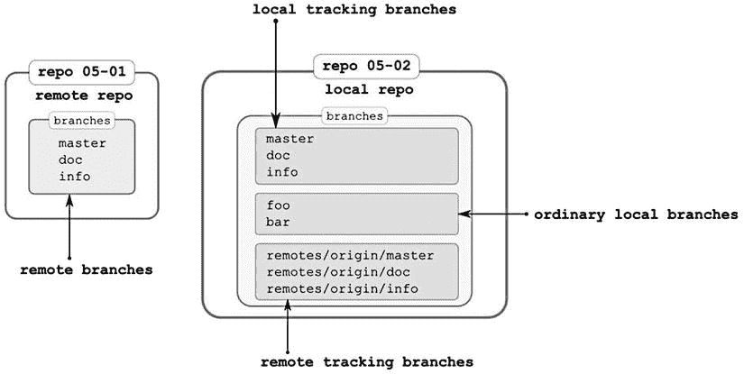

[图 5-7](#_Fig7) 。四种类型的分支:远程分支、普通本地分支、本地跟踪分支和远程跟踪分支

[表 5-1](#_Tab1) 。存储库 05-02 的三个分支 info，origin/info，foo 的属性如图 5-7 所示

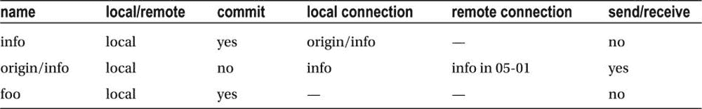

 **提示**记住:远程跟踪分支是本地分支，充当远程分支的只读副本。

表 5-1 的[栏回答了以下问题:](#Tab1)

*   本地/远程:分支机构是本地还是远程？
*   我可以在这个分支中提交吗？
*   本地连接:哪个本地分支与该分支相连？
*   远程连接:哪个远程分支与该分支相连？
*   发送/接收:我可以使用远程分支向/从这个分支发送/接收吗？

您会在[表 5-1](#Tab1) 中注意到，只有远程跟踪分支被允许与远程分支进行交互。在克隆过程中，git 会自动创建:

*   其中本地跟踪分支`master` [<sup>2</sup>](#Fn2)
*   所有远程分支的远程跟踪分支

因此，在`$ git clone`命令之后，存储库`05-02`包含以下分支:

```
* master
  remotes/origin/HEAD -> origin/master
  remotes/origin/doc
  remotes/origin/info
  remotes/origin/master
```

以上是`$ git branch -a`命令的输出。该行:

```
remotes/origin/HEAD -> origin/master
```

打印远程存储库的`.git/HEAD`文件的内容。这就是你如何知道哪个分支被远端认为是当前的。

记住，用`$ git clone`创建的新存储库包含完整的数据库——包括所有的修订和其他对象。只有存储在`.git/refs/heads`目录中的本地指针丢失。您必须手动创建它们。这可以通过`$ git checkout`命令来完成。与许多其他 git 命令一样，`$ git checkout`命令 用于实现许多不同的目标。在这个配方中，`$ git checkout`用于为同名的远程分支创建一个新的本地跟踪分支。因此命令:

```
$ git checkout info
```

创建一个名为`info`的本地跟踪分支。该分支将与存储在您的本地存储库中的远程跟踪分支`remotes/origin/info`相连接。另一个命令之后:

```
$ git checkout doc
```

存储库`05-02`包含三个本地分支`master`、`doc`和`info`。你可以使用`$ git branch`命令来检查它。这三个分支，即`master`、`doc`、`info`，就是**局部跟踪分支**。

 **提示**命令`$ git branch -a`打印本地分支、本地跟踪分支、远程跟踪分支。虽然输出清楚地显示了哪些是远程跟踪分支，但是用于普通本地分支和本地跟踪分支的格式是相同的。如果您同时使用`-vv`选项，可以获得更精确的信息。

从配方 2-5 中可以知道，克隆定义了新克隆和存储库之间的关系，存储库是您传递给`$ git clone`命令的 URL。这种关系写在`.git/config`文件的表单中:

```
[remote "origin"]
    url = ...
```

也可以用`$ git remote -v`命令来检查。

我们将在[第 10 章](10.html)中更详细地讨论远程，该章涉及远程存储库和同步。现在我只想删除这种关系，否则原始存储库中的远程分支将会模糊各种命令的输出，特别是`$ gitk --all`和`$ git log --all`。要删除关系运行:

```
$ git remote rm origin
```

此命令删除:

*   存储库配置文件中的`[remote "origin"]`条目
*   所有远程跟踪分支

命令`$ git remote -v`现在返回空结果，命令`$ git branch -a`只打印五个本地分支`doc`、`master`、`info`、`foo`和`bar`。目前，没有远程存储库；因此所有分支都是普通的本地分支。

 **提示**本地跟踪分支和远程跟踪分支只存在于配置文件中至少包含一个远程部分的存储库中。在一个孤立的存储库中谈论远程跟踪分支和本地跟踪分支是没有意义的。

5-3.创建带有分支的克隆体别名

问题

您希望创建一个别名来简化克隆带有分支的存储库的过程。您希望能够用一个命令克隆一个存储库并复制其分支:

```
$ git clone-with-branches URL directory
```

第一个参数——URL—应该指向一个现有的存储库(一个 URL 或者一个本地路径)。第二个参数—`directory`—设置要存储克隆的目录的名称。下面是我们应该如何从配方 5-1 中克隆存储库:

```
$ git clone-with-branches 05-01 05-03
```

和 jQuery:

```
$ git clone-with-branches git@github.com :jquery/jquery.git jquery-local-clone
```

解决办法

用文本编辑器打开你的`.gitconfig`文件,在`[alias]`部分的末尾输入清单 5-1 中的别名。请记住，您必须删除所有换行符。保存文件并关闭编辑器。

[***清单 5-1。***](#_list1) 用分支别名克隆一个库

```
list-remote-branches = "!listRemoteBranches() {
    git branch -r | sed \"/->/d; s/  origin\\///g\";
}; listRemoteBranches"

checkout-remote-branches = "!checkoutRemoteBranches() {
    for name in `git list-remote-branches`; do
        git checkout $name;
    done;
}; checkoutRemoteBranches"

clone-with-branches = "!cloneWithBranches() {
    git clone $1 $2;
    cd $2;
    git checkout-remote-branches;
    git remote rm origin
}; cloneWithBranches"
```

您可以通过运行以下命令来验证别名是否按预期工作:

```
$ git clone-with-branches 05-01 05-03
```

它是如何工作的

如您所知，您可以使用以下命令列出远程跟踪分支:

```

 $ git branch -r
```

如果您克隆存储库`05-01`，那么上面的命令将会打印出来:

```

  origin/HEAD -> origin/master
  origin/doc
  origin/info
  origin/master
```

因此，我们知道原始存储库包含三个名为`doc`、`info`和`master`的分支。第一个别名`$ git list-remote-branches`以如下方式转换上述输出:

*   首先，它删除包含`->`字符的条目(这个条目告诉我们，在原始存储库中`HEAD`包含对`origin/master`的符号引用)。
*   然后，它删除前缀`origin/`。

这两种操作都由流编辑器`sed`执行。以下 shell 命令:

```
$ git branch -r | sed "/->/d"
```

删除包含`->`的行。用`sed`过滤掉一些行的语法是:

```
$ sed "/PATTERN/d"
```

上面的命令过滤掉所有包含`PATTERN`的行。

为了删除前缀`origin/`,我们使用`sed’s`替换命令——其语法如下:

```
$ sed "s/PATTERN/REPLACEMENT/"
```

其中`PATTERN` 定义了将要被替换的字符串，`REPLACEMENT` 是新的字符串，斜线作为分隔符，`s`代表替换。

命令:

```
$ git branch -r | sed "s/  origin\///g"
```

用空字符串替换所有出现的`origin/`。因为我们的`PATTERN`包含一个斜杠，所以我们必须用`\`对它进行转义。

当我们使用分号作为分隔符将两个`sed`命令组合成一个处理指令时:

```
$ git branch -r | sed "/->/d; s/  origin\///g"
```

输出将只包含分支名称:

```
doc
info
master
```

这就是我们如何获得克隆存储库中所有远程跟踪分支的名称列表。

第二个别名`$ git checkout-remote-branches`，包含一个`for`循环，处理由`$ git list-remote-branches` 别名返回的名字:

```
for name in `git list-remote-branches`; do
    git checkout $name;
done;
```

对于我们执行 checkout 命令的每个名字，它都会创建一个本地跟踪分支。当循环结束时，新创建的克隆包含了来自原始存储库的所有分支。

最后一个别名`$ git clone-with-branches`，执行四个操作:

*   它克隆原始存储库:`$ git clone $1 $2`
*   它带着一个新的克隆进入目录:`cd $2`
*   创建本地分支:`$ git checkout-remote-branches`
*   它删除了与远程存储库的关系:`$ git remote rm origin`

注意，配方 5-3 和配方 2-4 产生了相似的结果。使用`$ cp -R`命令或`$ git clone-with-branches`别名创建的存储库包含与原始存储库相同的分支，没有远程。这两个过程的主要区别在于，克隆会清除 reflog，而复制会保留它。

如果您是 git 新手，那么本地跟踪分支和远程跟踪分支的概念可能不清楚。我们将更详细地讨论本地跟踪分支和远程跟踪分支，在有关同步的章节中再次强调它们的作用。然后，我希望，他们的目的会变得更清楚。

 **提示**别名`$ git clone-with-branches`在学习 git 时很有用。到本章结束时，或者一旦我们开始练习合并和重定基础，你可能会得出同样的结论。

将 git 子命令创建为 shell 脚本

您在配方 2-10 和配方 5-3 中实现的别名存储在您的全局`.gitconfig`文件中。这种方法的主要缺点是禁止换行。每个别名，不管有多复杂，都必须存储在一个`.gitconfig`文件的一行中。这是由`.gitconfig`解析强加的内部限制。您可以通过将别名存储为单独的 bash 脚本来规避这一限制。要准备使用缩进语法的`$ git clone-with-branches` git 子命令，创建文件: [<sup>3</sup>](#Fn3)

```
# on Windows
C:\Program Files (x86)\Git\libexec\git-core\git-clone-with-branches

# on Linux
/usr/lib/git-core/git-clone-with-branches
```

内容如[清单 5-2](#list2) 所示。在将[清单 5-2](#list2) 保存到一个文件时，你不必删除换行符。

[***清单 5-2。***](#_list2) Shell 脚本 git-core/git-clone-with-branch

```
#!/bin/sh

git clone $1 $2
cd $2
git checkout-remote-branches
git remote rm origin

```

5-4.以分离的头状态提交

问题

你想以一种超然的头脑状态投入。您需要从配方 5-1 中克隆存储库，并创建修订版`x1`、`x2`和`x3`，如图 5-8 中的[所示。请注意，该图不包含任何指向`x1`、`x2`或`x3`的分支。不能通过符号引用(比如分支和标签)访问的修订被称为*悬空修订*](#Fig8) 。

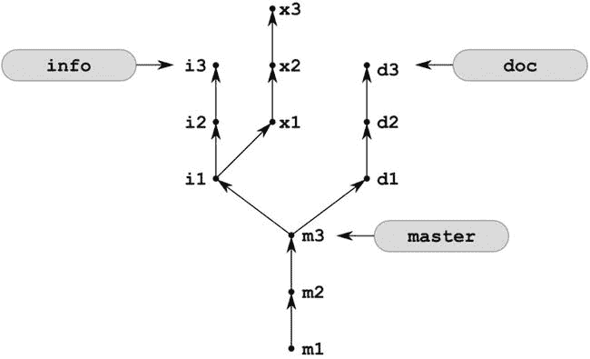

[图 5-8](#_Fig8) 。悬挂修订 x1、x2 和 x3

一旦您创建了这三个提交，您想要切换到`master`分支，并验证`x1`、`x2`和`x3`修订是否可用。他们迷路了吗？你如何找回`x1`、`x2`和`x3`，以及你如何最终移除它们？

解决办法

克隆配方 5-1 中创建的存储库及其所有分支:

```
$ cd git-recipes
$ git clone-with-branches 05-01 05-04
$ cd 05-04
```

存储库现在看起来像图 5-1 。在[图 5-8](#Fig8) 中可以看到，修订`x1`的父版本是`i1`。你可能还记得配方 3-6 中的命令`$ git checkout [REVISION]`，当与 SHA-1 名字一起使用时，进入分离头状态并重置工作目录。为了使用它，我们需要为`i1`版本取一个名字。我们可以使用下面的`$ git log`命令来检查这个名字:

```
$ git log --oneline --grep=i1 info
```

第一个参数，`--oneline`，设置输出的格式。第二个参数`--grep=i1`充当过滤器。仅包含注释包含`i1`字符串的修订。第三个参数`info`设置搜索的起点。因此，将只分析分支`info`中可用的提交。上述命令的输出将只包括一次提交，例如，

```
6f4364e i1
```

还有一种比使用 SHA-1 的简称更简单的方式来称呼`i1`。可以将`i1`修订作为由`info`分支指向的修订的第二个父修订。正式写法为`info∼2`。因此命令:

```
$ git checkout info∼2
```

进入分离磁头状态，并将工作目录重置为提交`i1`。该命令打印有关进入分离磁头状态的清晰信息。就在命令之后，`.git/HEAD`指向`i1`提交。这种状态如图 5-9 中[所示。](#Fig9)

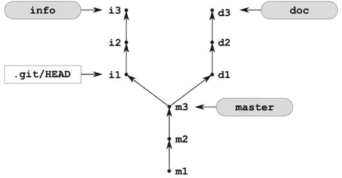

[图 5-9](#_Fig9) 。处于分离状态的存储库

现在，使用我们在配方 3-11 中创建的别名创建`x1`修订版:

```
$ git simple-commit x1
```

`x1`的 SHA-1 将存储在`.git/HEAD`中。`x1`的父代将是`i2`。仓库的这种状态如图[图 5-10](#Fig10) 所示。

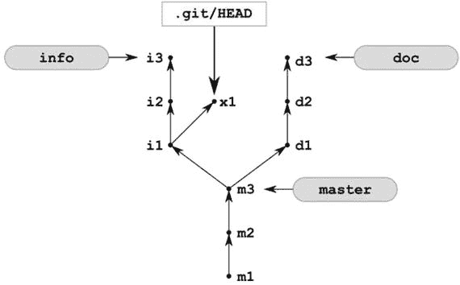

[图 5-10](#_Fig10) 。在分离头状态下创建的新提交 x1

创建另外两个版本`x2`、`x3`，使用:

```
$ git simple-commit x2 x3
```

存储库现在看起来像[图 5-11](#Fig11) 。

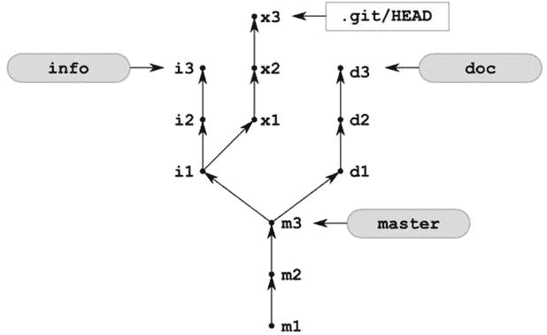

[图 5-11](#_Fig11) 。在分离的头状态下创建的新提交 x1、x2 和 x3

在图 5-11 所示的状态下，`.git/HEAD`文件包含了`x3`版本的 SHA-1 名称。如果你现在用`$ git checkout master`命令切换到分支`master`，那么库的状态将会改变，如图[图 5-12](#Fig12) 所示。这正是图 5-8 中[所示的状态，其中`.git/HEAD`被明确显示。图中通常会跳过对`.git/HEAD`的引用，因为相同的信息——在必要时——可以在主图前加上星号。](#Fig8)

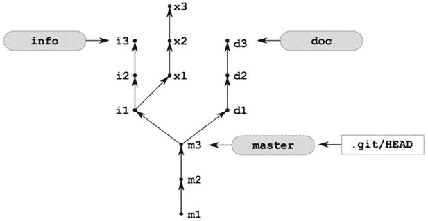

[图 5-12](#_Fig12) 。存储库中的当前分支可以通过加在主分支前面的星号或者包含一个. git/HEAD 引用来显示

当仓库处于图 5-12[所示的状态](#Fig12)时，命令`$ ls`只返回三个文件`m1.txt`、`m2.txt`、`m3.txt`—`x1.txt`、`x2.txt`和`x3.txt`不可用。

如何检索悬空修订？首先，分析`$ git checkout master`命令的输出。它包含了您的三个修订版本`x1`、`x2`和`x3`需要用类似(当然，您的 SHA-1 会不同)的命令检索回来的详细信息:

```
$ git branch new_branch_name 01f3af0
```

上面的命令创建了一个名为`new_branch_name`的分支，该分支将指向提交`x3`(它的 SHA-1 名称写为`01f3af0`)。如果由于某种原因上述信息不可用，您总是可以使用 reflog 来恢复丢失的提交。现在你可以用`$ git checkout HEAD@{1}`返回到`x3`提交。

你怎样才能最终摆脱悬而未决的修订呢？我们已经在配方 3-12 中练习过了。如果您清除 reflog 并用`$ git prune`删除数据库，那么所有悬挂的修订最终都会丢失。开始吧。用`$ git reflog expire --all --expire=now`清除参考日志。这可以通过简单的`$ rm .git/logs/*`命令来完成。现在，您可以使用以下两个命令之一来检查哪些对象会丢失:

```
$ git prune --dry-run
$ git fsck --unreachable
```

输出应该包含三个提交(`x1`、`x2`、`x3`)、三个文件[、 <sup>4</sup> 、](#Fn4) ( `x1.txt`、`x2.txt`、`x3.txt`)和三棵树(每个提交一棵树)。

 **提示**一棵树是给定目录的快照。每次提交都包含一个工作目录主文件夹的树。

现在，如果您运行`$ git prune`，所有悬挂的修订将从数据库中移除。然而，不可能再把它们找回来了。

提示你应该把这个秘籍当作另一个警告:不要在超然的状态下工作。使用分支可以很容易地避免它。

它是如何工作的

我们必须解决的第一个问题是如何引用标记为`i1`的版本。当然，你可以使用`$ git log`或`$ git log --oneline`命令找到它的全称或简称。您应该已经非常熟悉这些引用提交的方法。然而，在这个配方中，我们使用了祖先引用——这是另一种非常方便的识别修订的方法。

除了第一个版本，每个版本都包含一个父版本。我们可以使用波浪符号(`∼`)来引用父版本。符号`[REVISION]∼`表示给定修订的父版本。您可以将此符号与任何方法结合使用来标识修订。你可以写:

```
7c9bc41684455b2b38749ec9cdeed707c07038b2∼
7c9b∼
master∼
info∼
HEAD∼
```

符号:

```
7c9bc41684455b2b38749ec9cdeed707c07038b2∼
```

指`7c9bc41684455b2b38749ec9cdeed707c07038b2`指向的修订的父修订。下一个引用`7c9b∼`使用一个简称指向同一个修订版。以类似的方式:

*   `master∼`表示由`master`分支指向的提交的父提交
*   `info∼`指向由`info`分支指向的提交的父提交
*   `HEAD∼`指当前版本的父版本
*   等等

此外，您可以在波浪号后附加一个数字—它允许我们指向更早的祖先。引用`[REVISION]∼n`指向`[REVISION]`的第 n 个祖先。在[图 5-8](#Fig8) 中，`doc∼4`指向标有`m2`的版本，`master∼2`、`info∼5`、`doc∼5`均指向`m1`。分支`info`、`doc`和`master`的所有祖先参考在[图 5-13](#Fig13) 中显示。

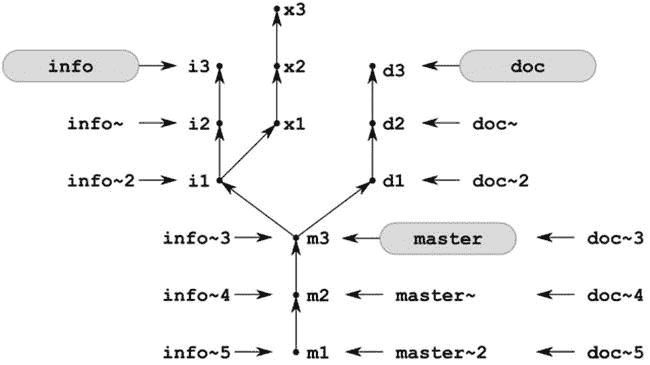

[图 5-13](#_Fig13) 。分支文档、信息和主文档的祖先引用

 **提示**引用`[REVISION]∼1`和`[REVISION]∼`的意思完全相同:给定版本的第一个父版本。

您在配方 5-1 中了解到，您当前的版本可以始终通过符号引用`HEAD` 来引用。正如您所猜测的那样，`HEAD`可以与`HEAD∼`、`HEAD∼2`、`HEAD∼3`等祖先引用结合使用。如果您使用`$ git checkout info`切换到`info`分支，那么使用`HEAD`和波形符将得到图 5-14 中的结果。

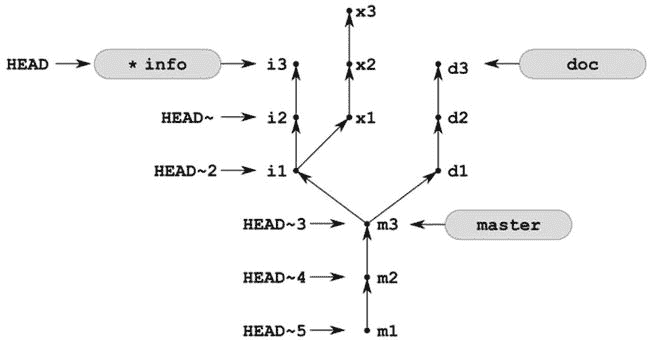

[图 5-14](#_Fig14) 。对名为 info 的分支使用 HEAD 和祖先引用

你有没有注意到`*info`分公司名称前面的星号？正如我告诉你的:这是一个更简单的方式来显示你目前在哪一个分支。星号通知您`.git/HEAD`现在包含了`ref: refs/heads/info`符号引用。这个想法不是我的——它取自`$ git branch`命令的输出，现在应该是:

```

  doc
* info
  master
```

也许你注意到命令`$ git checkout [REVISION]`的工作方式因其参数而异。如果参数是阿沙-1 名称，那么命令进入分离头状态。另一方面，如果您传递一个分支名称，该命令将改变您当前的分支。你可以用一个`--detached`选项强制分离头部状态，例如`$ git checkout --detached master`。

即使您传递了分支所指向的提交的 SHA-1，上述规则也适用。假设`$ git log --oneline --decorate`打印:

```
7c9bc41 (HEAD, master) m3
```

命令:

```
$ git checkout 7c9bc41
```

进入分离头状态；即使`7c9bc41`指向`master`分支。

5-5.重置并清洁树枝

问题

您正在一个分支中工作—创建、修改、复制、删除和重命名文件。做了一些修改后，你意识到你所有的修改(还没有提交)都是错的。您希望将分支的状态重置回起始点。

解决办法

克隆配方 5-1 中创建的存储库及其所有分支:

```
$ cd git-recipes
$ git clone-with-branches 05-01 05-05
$ cd 05-05
```

存储库现在是干净的，并且您在`master`分支中。使用以下命令修改工作目录:

```
$ echo foo > bar.txt
$ echo bar > m1.txt
$ cp m1.txt copy.txt
$ rm m2.txt
$ mv m3.txt new-m3.txt
```

`$ git status -sb`现在打印:

```
## master
 M m1.txt
 D m2.txt
 D m3.txt
?? bar.txt
?? copy.txt
?? new-m3.txt
```

您可以用两个命令放弃所有这些更改:

```
$ git reset --hard
$ git clean -f
```

现在存储库是干净的，您可以用`$ git status -s`命令检查它。所有的修改都丢失了。

它是如何工作的

你已经知道了命令`$ git reset --hard`。它会将所有跟踪的文件重置为最新版本中保存的状态。但是`$ git reset`命令不能修改未被跟踪的文件。使用`$ git clean -f`命令删除所有未被追踪的文件。参数`-f`作为预防措施；没有它，`$ git clean`命令只会打印一条消息。这是另一个安全级别，有助于避免数据丢失。但是，如果您想只列出已经删除的文件，而不实际删除它们，请使用`$ git clean -n`命令。

5-6.无冲突地切换脏存储库中的分支

问题

假设在存储库中工作期间，您修改了一些文件，并希望将它们提交到与当前分支不同的分支中。你必须在一个肮脏的仓库中切换分支。根据您的更改，git 可以允许或禁止该操作。在这个配方中，我们考虑允许切换的情况。

解决办法

克隆配方 5-1 中创建的存储库及其所有分支:

```
$ cd git-recipes
$ git clone-with-branches 05-01 05-06
$ cd 05-06
```

存储库现在是干净的，包含三个分支。您目前在`master`分支。将您的当前分支更改为`info`,使用:

```
$ git checkout info
```

然后使用以下命令修改工作目录:

```
$ echo bar > bar.txt
$ echo foo > m1.txt
$ rm m2.txt
$ mv m3.txt new-m3.txt
```

文件`bar.txt`已创建—这是一个新的未跟踪文件。`m1.txt`文件被修改——它现在包含`foo`而不是`m1`。下一个文件——`i1.txt`——被删除了。最后一个文件`m3.txt`被重命名为`new-m3.txt`。命令`$ git status -sb`现在打印出来:

```
## info
 M m1.txt
 D m2.txt
 D m3.txt
?? bar.txt
?? new-m3.txt
```

以上变化当然不是阶段性的。存储库是脏的，你在`info`分支。

假设您忘记了您的更改，并且出于某种原因想要签出`doc`分支。命令:

```
$ git checkout doc
```

成功了。所有的更改都被保留，您现在在`doc`分支中。`$ git status -sb`的输出现在几乎是一样的——只是分支名称改为了`doc`:

```
## doc
 M m1.txt
 D m2.txt
 D m3.txt
?? bar.txt
?? new-m3.txt
```

您仍然不记得您的更改或您当前的分支，并且您无意中使用`$ git add -A`进行了所有的更改。

最后，您意识到您的更改仍然没有提交。此外，您希望他们去`master`分公司。要将您的修改提交到`master`分支，您必须切换分支并创建修订:

```
$ git checkout master
$ git snapshot Recipe 5-5 Switching branches in dirty repository without conflicts
```

您的存储库是干净的，所有的修改都存储在主分支中。

它是如何工作的

在配方 5-5 之前的所有配方中，当一个库干净时，我们切换分支。但是 git 允许切换分支，即使存储库是脏的。默认情况下，所有更改都会被保留，无论它们是否被转移。如果 git 不能保存您的更改，那么它将拒绝切换分支。换句话说，*当且仅当未提交的变更不与您要切换到的*分支的内容冲突时，才允许切换脏存储库中的分支。记住一个简单的经验法则:如果分支被交换了，这意味着你的修改没有引起任何冲突。但是，有一个小小的例外:在分支切换期间，您可以在没有任何警告的情况下丢失未提交的更改的唯一情况是，当您删除一个不在您要切换到的分支中的文件时。

您可以使用以下命令来验证它:

```
$ git checkout info
$ rm i1.txt   # removed file i1.txt is not present in doc branch
$ git status -sb
```

输出将包含关于一个被删除的文件`i1.txt`的信息。如果你切换到`doc`分支(这个分支不包含`i1.txt`文件):

```
$ git checkout doc
```

然后，git 不会警告你有冲突。存储库变得干净，关于已删除文件`i1.txt`的信息丢失。如果您再次切换到`info`分支，该文件将被恢复。在用`$ rm m2.txt`命令删除配方中的`m2.txt`文件的情况下，当我们切换到`doc`分支时，文件被删除的信息被保留。那是因为文件`m2.txt`存在于每个分支中。

 **问题**你能想象出一个别名，把切换分支只限制在干净状态吗？

5-7.在有冲突的脏存储库中切换分支

问题

您刚刚修改了工作目录，并且想要在不同的分支中提交更改。您必须切换到另一个分支，然后创建一个新的版本。在这个配方中，我们考虑了当你的改变与你想要切换到的分支冲突的情况。如果是这种情况，git 不允许您签出另一个分支。

解决办法

克隆在配方 5-1 中创建的存储库:

```
$ cd git-recipes
$ git clone-with-branches 05-01 05-07
$ cd 05-07
```

切换到`info`分支，用以下命令修改工作目录:

```
$ git checkout info
$ echo foo > i1.txt
```

`i1.txt`文件被修改，列为:

```
_M i1.txt
```

到`$ git status -sb`。该文件不在`master`分支中。如果你现在执行命令`$ git checkout master`，你会看到警告:

```
error:
    Your local changes to the following files
    would be overwritten by checkout:
        i1.txt
```

因此，git 拒绝切换到`master`的当前分支，因为您会丢失对`i1.txt`文件的更改。

假设您的修改是重要的——您想要在`master`分支中保存和提交它们。您可以采取三种不同的方法:

*   您可以暂时隐藏您的更改，更改一个分支，然后检索这些更改。这就是我们在这个秘籍中要做的。
*   您可以将您的更改与您在签出期间切换到的分支合并。这种解决方案类似于存储。
*   最后，您可以在当前(错误的)分支中提交，然后将您的修订移动到适当的分支。该程序将在配方 5-8 中讨论。

隐藏未提交的更改

命令`$ git checkout master`产生警告:

```
error:
    Your local changes to the following files
    would be overwritten by checkout:
        i1.txt
```

设置如下:你在`info`分支，文件`i1.txt`被修改，你想在`master`分支提交。

首先，用以下命令保存工作目录的当前状态:

```
$ git stash
```

存储库变得干净了，工作目录反映了`info`分支中的最新修订，您对`i1.txt`文件的修改被存储在一个名为 stash 的临时区域中。因为存储库是干净的，所以您可以安全地检查`master`分支:

```
$ git checkout master
```

上面的命令不会以任何方式影响你隐藏的工作。

要检索您隐藏的修改，请执行以下命令:

```
$ git stash pop
```

工作目录的状态将被调整，以反映用 stash 命令存储的更改。上面的命令将产生一个关于冲突变更的警告:

```
CONFLICT (modify/delete):
    i1.txt deleted in Updated upstream and modified in Stashed changes.
    Version Stashed changes of i1.txt left in tree.
```

处理冲突的一般方法在[第 9 章](09.html)中介绍。命令`$ git status -sb`打印:

```
## master
DU i1.txt
```

冲突的文件表示为`DU`。要将`i1.txt`文件保存在`master`分支中，您需要暂存一个文件:

```
$ git add i1.txt
```

然后创建一个新版本:

```
$ git commit -m "i1.txt file..."
```

在签出期间合并变更

要在结帐期间合并您的修改，请使用`-m`参数:

```
$ git checkout -m master
```

上述命令将产生与这三个命令完全相同的结果:

```
$ git stash
$ git checkout master
$ git stash pop
```

然而，通过使用`$ git stash`命令，你可以推迟合并你的隐藏文件的时间。

它是如何工作的

解决方案中使用的`$ git stash`命令保存暂存区和工作目录的当前状态，并重置工作目录。新的未跟踪文件不受此命令的影响。因此，如果您想要保存所有文件(包括未跟踪的文件),请使用以下两个命令:

```
$ git add -A
$ git stash
```

第一个命令将所有修改添加到临时区域。当一起运行时，这些命令保证您的所有修改都被隐藏。

保存更改后，stash 命令会重置工作目录。存储库变得干净，它的工作目录反映了当前分支中最新版本的快照。

要恢复隐藏状态，您应该使用`$ git stash pop`命令。您可以在每个分支中执行该命令。弹出的隐藏更改将与您当前的分支合并。

Git 允许任意次数地存储未提交的更改——它们存储在堆栈上。可以用`$ git stash list`命令列出隐藏的状态。它产生类似于下面的输出:

```
stash@{0}: WIP on info: 0d6501b i3
stash@{1}: WIP on doc: 23d9855 d3
stash@{2}: WIP on master: ae34fcd m4
```

您还可以将默认消息`WIP on XXX`更改为更有意义的内容，例如:

```
$ git stash save A very descriptive information
```

命令`$ git stash`相当于`$ git stash save WIP on [branch-name]`。你已经在配方 3-2 中学习了 WIP 的含义。它代表正在进行的工作。

虽然`$ git stash`是一个非常方便的工具，可以用来在脏回购中切换分支，但是你也可以使用强制签出。有两个`$ git checkou` t 命令的开关可以帮助你:`-m`或`-f`。第一个将您的更改与您切换到的分支合并；第二种方法会丢弃您的修改。

 **提示**当然，如果没有冲突的话，可以应用隐藏。因此，在方法 5-6 中，你也可以使用 stashing 来保存和恢复你未提交的更改。

5-8.在错误的分支中提交

问题

您刚刚创建了一个新的修订版，却发现它应该转到一个不同的分支。如果您的修改在切换 branch时没有冲突，您很容易忘记在提交之前检查适当的分支。在错误的分支中创建修订后，您希望将它移动到正确的目的地。

解决办法

克隆在配方 5-1 中创建的存储库:

```
$ cd git-recipes
$ git clone-with-branches 05-01 05-08
$ cd 05-08
```

并修改`m1.txt`文件

```
$ echo A new text > m1.txt
```

让我们假设您打算在`master`分支中提交这个变更。修改不与`doc`分支冲突。您可以使用`$ git checkout doc`毫无问题地检查`doc`分支。checkout 命令输出一行内容，为您提供有关更改的信息:

```
M       m1.txt
```

但是很容易被忽略。

一段时间后，你完全意识不到现在的分支已经不是那个`master`。您使用以下内容创建了错误的版本:

```
$ git snapshot Recipe 5-8: a revision in a wrong branch
```

现在你意识到了你的失败，你想把修订移动到`master`分支。

您可以分两步完成:

*   从错误的分支复制修订版以纠正错误。
*   从错误的分支中删除修订。

在继续下面给出的程序之前，确认新版本出现在`doc`分支中，而不在`master`分支中。以下是您需要的命令:

```
$ git log --oneline doc
$ git log --oneline master
```

下面是您需要将最新版本从`doc`分支复制到`master`分支的过程:

1.  用`$ git checkout master`命令将当前分支更改为`master`。
2.  用`$ git cherry-pick doc`命令将 tip 版本从`doc`分支复制到当前分支(即`master`)。

到目前为止，新版本在两个分支中都存在。命令`$ git log --oneline -1 master`和`$ git log --oneline -1 doc`打印如[列表 5-3](#list3) 所示的输出。尽管您的实际散列会有所不同，但是您应该注意到您提交的两个 SHA-1 名称是不同的。

[***清单 5-3。***](#_list3) 输出的$ git log - oneline -1 为两个分支

```
# the output of $ git log --oneline -1 master
43336a3 Recipe 5-8: a revision in a wrong branch

# the output of $ git log --oneline -1 doc
7ad4187 Recipe 5-8: a revision in a wrong branch
```

完成配方，从`doc`分支删除错误版本:

1.  用`$ git checkout doc`命令将当前分支更改为`doc`。
2.  用`$ git reset --hard HEAD∼`命令删除修订。

`$ git l master`和`$ git l doc`的输出证明新版本只包含在`master`分支中。您也可以用一个命令来验证它，显示所有分支:`$ git log --oneline --graph --decorate --all`。

它是如何工作的

该方法使用两个重要的命令:

```
$ git cherry-pick doc
$ git reset --hard HEAD∼
```

第一个命令——`cherry-pick`——复制当前分支中的给定修订。它需要一个指向要复制的修订的参数。如果您将分支的名称传递给该命令，它将复制该分支所指向的修订；也就是树枝的尖端。您也可以使用其他方法来标识修订，例如:

```
$ git cherry-pick 7c9bc41    # shortened SHA-1 name
$ git cherry-pick info∼      # last but one commit in info branch
$ git cherry-pick info∼3     # branch name and ancestor reference
```

术语*复制修订*在这里可能有点误导。您创建的每个修订都有唯一的名称。这条规则没有例外。您只能:

*   向 git 的数据库添加新的修订版
*   从 git 的数据库中删除现有的修订

Git 不实现对存储在数据库中的对象的修改。提交的名称是阿沙-1 哈希，它是使用您的名称、当前时间戳、文件快照和父修订版的名称生成的。当我们将一个版本从历史中的一个地方复制到另一个地方时，我们至少改变了其中一个参数:父版本的名称。因此，没有办法为复制的版本保存旧的 SHA-1。因此，由`cherry-pick`命令实现的操作可以更好地描述为在当前分支之上应用由给定修订引入的变更。该命令创建一个全新的修订，该修订再现了作为参数传递的修订中存储的更改。新修订总是在当前分支的顶部创建，它成为分支中的最新修订。

您已经熟悉了第二个命令。我们在配方 3-5 中使用了它。这次我们使用一个祖先引用`HEAD∼`。该引用指向当前分支中的倒数第二个版本。

5-9.删除本地分支

问题

假设您已经意识到您的存储库中包含了您将不再需要的陈旧分支。你决定删除它们。

解决办法

克隆在配方 5-1 中创建的存储库，并切换到`doc`分支:

```
$ cd git-recipes
$ git clone-with-branches 05-01 05-09
$ cd 05-09
$ git checkout doc
```

假设您决定`master`和`info`分支不再重要。删除`master`分支执行:

```
$ git branch -d master
```

接下来尝试用相同的命令删除`info`分支:

```
$ git branch -d info
```

上面的命令无法删除`info`分支，因为它包含一些可能会丢失的修订。要强制删除，请使用命令:

```
$ git branch -D info
```

它是如何工作的

存储库中每两个分支可以被表征为*合并*或*不合并*。如果`a`中包含的所有修订也包含在`b`中，我们说`a`分支*合并*为`b`分支。[图 5-15](#Fig15) 呈现了两个分支`a`和`b`。分支`a`合并到分支`b`中。分支`a`包含两个修订`a1`和`a2`——这两个修订都可以从`b`指向的修订开始并在父修订之后找到。

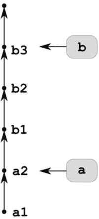

[图 5-15](#_Fig15) 。分支 a 并入分支 b；分支 b 没有合并到分支 a 中

这种关系通常不是反映性的。在图 5-15 的[库中](#Fig15)分支`b` *没有合并`master`中的*。如您所见，修订版`b1`、`b2`和`b3`包含在分支`b`中，但不包含在分支`a`中。这种关系反映的唯一情况是当两个分支指向完全相同的版本时，如图[图 5-16](#Fig16) 所示。

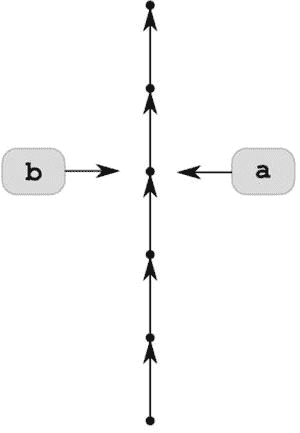

[图 5-16](#_Fig16) 。分支 a 并入分支 b，分支 b 并入分支 a

第三种情况是既没有分支`a`并入分支`b`也没有分支`b`并入分支`a`。然后我们说分支`a`和`b`T6 已经分叉。这种情况如图[图 5-17](#Fig17) 所示。

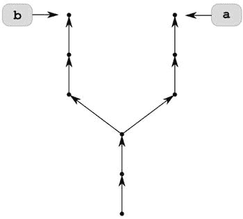

[图 5-17](#_Fig17) 。分叉的分支 a 和 b

通过传递给`$ git branch`命令的`--merged`和`--no-merged`选项，可以获得当前分支中哪些分支被合并，哪些分支没有被合并的信息；

```
# print the names of branches merged in current branch
$ git branch --merged

# print the names of branches not merged in current branch
$ git branch --no-merged
```

现在您已经了解了合并和未合并的分支，您可以很容易地猜到该命令:

```
$ git branch -d [branch-name]
```

仅当给定分支与当前分支合并时，才删除该分支。如果要删除的分支没有合并，该命令会显示一条警告:

```
error: The branch 'branch-name' is not fully merged.
```

然后离开。带有`-D`选项的命令:

```
$ git branch -D [branch-name]
```

删除分支，即使它没有被合并。

让我提醒你，分支是一个简单的指针——只是以松散或压缩格式存储的阿沙-1。如果创建一个分支，git 会在`.git`目录中存储一个新指针。当分支被删除时，指针被移除。命令`$ git branch -d`和`$ git branch -D`不会修改数据库。所有的修订都保持不变。因此，即使您删除了一个分支，也可以使用 reflog 检索它。

 **注**本秘籍描述了删除本地分支的方法。您可以使用它来删除普通的本地分支和本地跟踪分支。所有远程跟踪分支都可以用`$ git remote rm`命令删除，正如我们在配方 5-2 中所做的那样。要仅删除一个远程跟踪分支源/doc，您可以使用$ git branch -d -r origin/doc 命令。但是用$ git branch -d -r 删除的远程跟踪分支将在下一个 fetch 命令后重新创建。删除远程分支的命令将在[第 10 章](10.html)关于存储库同步中讨论。

5-10.使用分支作为备份

问题

您的存储库处于干净状态。你开始在你当前的分支中开发一个新的特性。经过一些修改后，你意识到新的想法是行不通的，想放弃它。您希望取消新特性，并将存储库恢复到该特性启动前的状态。解决这个问题的最好方法是使用分支。

解决办法

克隆配方 5-1 中创建的存储库及其所有分支:

```
$ cd git-recipes
$ git clone-with-branches 05-01 05-10
$ cd 05-10
```

存储库现在是干净的，您在`master`分支中。这是起点。您创建一个名为`feature`的新分支，它将与当前的`master`分支完全相同:

```
$ git checkout -b feature
```

现在，您在`feature`分支中创建一些提交:

```
$ git simple-commit one two three
```

您的所有修改都已提交，存储库是干净的。

现在您决定在`feature`分支中实现的整个概念不工作了。你想摆脱它。您可以使用两个命令来实现这一点:

```
$ git checkout master
$ git branch -D feature
```

它是如何工作的

这个秘籍不需要新的命令。这个方法只是强调了分支在特定场景中的作用。没有风险，git 允许你测试新的概念，否则会破坏或复杂化你的工作。每个分支都是独立于其他分支的。您在`feature`分支中提交的修改并不影响`master`分支，事实上，也不影响任何其他分支。如果您的存储库的某个特定状态对您很重要，并且您想要绝对确定无论您做什么，您总是可以得到它，只需创建一个分支。就这么简单。一旦你理解了这个想法，你会想，没有它，你究竟是怎么工作的。

请记住，如果您不确定某个想法，您不必删除该分支。多余的分支对你的工作没有任何影响。你可以不去管他们。以松散格式编写的分支只占用 41 个字节，所以不会占用很多空间。

最后，如果您删除分支，即使您删除了它，您创建的修订也不会从数据库中删除。原因很简单:reflog 包含禁止修剪这些对象的条目。要完全删除分支及其修订，您必须删除一个分支，清除 reflog，并清理数据库。

5-11.重命名分支

问题

您在图 5-1 中的[所示的存储库中工作，并且您想要重命名分支](#Fig1):

*   `info`至`information`
*   `master`至`doc`

解决办法

克隆在配方 5-1 中创建的存储库:

```
$ cd git-recipes
$ git clone-with-branches 05-01 05-11
$ cd 05-11
```

你在`master`分公司。将`info`分支机构的名称改为`information`,名称为:

```
$ git branch -m info information
```

最后，用以下代码将`master`分支的名称改为`doc`:

```
$ git branch -M master doc
```

它是如何工作的

命令`$ git branch -m [old-name] [new-name]`将名为`old-name`的分支重命名为`new-name`。如果具有新名称的分支已经存在，那么您可以使用`$ git branch -M [old-name] [new-name]`覆盖它。在这种情况下，现有的`new-name`分支将会丢失。

对了，你注意到了吗？与任何其他分支一样,`master`分支可以被重命名和删除。

5-12.从不同的分支签出文件

问题

在处理一个有许多分支的项目时，您刚刚意识到在一个分支中，您需要来自另一个分支的一些文件。您希望从当前分支之外的分支中签出文件。

解决办法

使用以下内容克隆在配方 5-1 中创建的存储库:

```
$ cd git-recipes
$ cp -R 05-01 05-12
$ cd 05-12
```

如果您愿意，可以使用`$ cp`命令创建本地克隆。用`$ cp`创建的克隆将略有不同:它的 reflog 不为空，并且不包含 remote。然而，这些差异在这个秘籍中没有计算在内，因此，你可以用`$ cp`命令来练习克隆。

我想你目前在`master`分部。更改`m1.txt`文件的内容并提交更改:

```
$ git checkout master
$ echo The new content from Recipe 5-12 > m1.txt
$ git snapshot The new content from Recipe 5-12
```

在`master`分支中唯一可用的文件是`m1.txt`、`m2.txt`和`m3.txt`。您想要一个`i1.txt`文件的副本，它存储在`info`分支中。您可以通过以下方式实现这一目标:

```
$ git checkout info -- i1.txt
```

在签出期间，您可能需要重命名文件。这正是我们修改`master`分支中的`m1.txt`文件的原因。现在，`master`分支中的`m1.txt`文件的版本与其他分支中的版本不同。如何从`doc`分支获取`m1.txt`文件而不丢失存储在工作目录中的版本？您可以使用以下命令在 stdout 上显示存储在`doc`分支中的`m1.txt`文件:

```
$ git show doc:m1.txt
```

要用不同的名称保存它，请使用流重定向将输出发送到文件:

```
$ git show doc:m1.txt > m1-from-doc-branch.txt
```

用`$ git snapshot Files from other branches`命令创建另一个版本，完成配方。

它是如何工作的

命令`$ git checkout`可以用来只签出一个文件，而不用切换分支。语法如下:

```
$ git checkout [REVISION] -- [filename]
```

当然，您可以向它传递任意的修订标识符。您可以使用`HEAD`、祖先引用、隐藏引用、远程跟踪分支和 reflog，仅举几个例子:

```
$ git checkout HEAD∼ -- file.txt
$ git checkout stash@{3} -- file.txt
$ git checkout remotes/origin/master -- file.txt
$ git checkout HEAD@{yesterday} -- file.txt
```

该命令还允许您使用全局通配符:

```
$ git checkout doc -- d*.txt
```

两个破折号将文件名与命令选项分开。很多时候，破折号并不重要，比如在`$ git checkout doc d1.txt`中。它们对于区分路径中的选项是必要的。这里的`-f`作为一个选项:

```
$ git checkout doc -f
```

在下面的例子中，`-f`被解释为一个路径:

```
$ git checkout doc -- -f
```

存储在数据库中的文件的任意版本也可以显示在您的屏幕上，而无需将其签出。这可以通过`$ git show`命令来完成。您必须确定版本和文件。这是通过冒号分隔的两个参数完成的:

```
$ git show [REVISION]:[FILENAME]
```

使用此命令，您可以签出文件，然后用不同的名称保存它:

```
$ git show [REVISION]:[FILENAME] > [new-filename]
```

举例来说，这是检出具有您的系统中不允许的名称的文件的方法。如果你在 Linux 中创建了一个名为`some*strange*name.txt`的文件，那么它将不能在 Windows 中签出这个文件。在 Windows 上工作时，您仍然可以使用新名称签出该文件:

```
$ git show HEAD:some*strange*name.txt > some-strange-name.txt
```

我遇到的最令人吃惊的文件名问题的例子是，当我在培训一个使用 Linux 的人时，他使用了带有尾随点的文件名，例如:

```
$ echo lorem > lorem.
```

环境是异构的——受训者使用 Windows 和 Linux。使用 Windows 的受训者再也无法获得一个干净的库签出。就在克隆命令之后，存储库变脏了。如果像这样的修订已经是公开的，补救方法是签出文件并更改它们的名称。多亏了`$ git show [REVISION]:[FILENAME] > [new-filename]`，这可以在任何平台上实现。

5-13.切换空存储库中的分支

问题

您已经克隆了一个空存储库，它的当前分支是`master`。你想换到另一个分行。

解决办法

使用以下命令克隆在配方 05-01 中创建的存储库:

```
$ cd git-recipes
$ git clone --bare 05-01 05-13
$ cd 05-13
```

新创建的克隆将是一个裸克隆。用`$ git branch -a`命令列出所有分支。您将得到以下输出:

```

  doc
  info
* master
```

如您所见，在一个空的存储库中，为所有远程分支创建了本地分支。你不必像我们在方法 5-2 中那样手工检查它们。`HEAD`引用指向`master`分支——我们知道这一点，这要感谢上面输出中`master`前面的星号。但是您可以使用两个命令之一来验证它:

```
$ cat HEAD
$ git symbolic-ref HEAD
```

要更改当前分支，请执行以下命令:

```
$ git symbolic-ref HEAD refs/heads/info
```

此后，命令`$ git branch`输出:

```

  doc
* info
  master
```

因此，我们知道当前分支被改变了。如果你有疑问，你可以用`$ git log --oneline -3`命令再次检查。它将打印出`i3`、`i2`和`i1`提交。

它是如何工作的

在非空存储库中切换分支的命令是:

```
$ git checkout [branch-name]
```

实际上，它执行两个操作:它更改存储在`HEAD`中的引用，并签出文件。这两个操作也可以手动执行:

```
$ git symbolic-ref HEAD refs/heads/branch-name
$ git reset --hard
```

在一个空的存储库中，您不能使用需要工作目录的命令，比如`$ git checkout`或`$ git status`。它们根本没有意义。在一个空的存储库中工作，你可以改变存储在`HEAD`中的引用，但是你不能重置工作目录。

因此，要更改空存储库中的当前分支，请使用以下命令:

```
$ git symbolic-ref HEAD refs/heads/branch-name
```

这是一个对符号引用进行操作的低级命令。与一个参数一起使用，如在`$ git symbolic-ref HEAD`中，该命令作为一个 getter:它输出引用。当使用两个参数时，它充当 setter:作为第一个参数传递的符号引用被设置为作为第二个参数传递的值。

值得记住的是，克隆中的当前分支将是发出`$ git clone`命令时原始存储库中的当前分支。不管原始存储库是裸的还是非裸的，这都是事实。您可以使用传递给 clone 的附加参数`-b`对此进行更改。这些命令:

```
$ git clone -b doc 05-01 05-13-doc-nonbare
$ git clone --bare -b doc 05-01 05-13-doc-bare
```

会创建新的克隆，使`HEAD`指向`refs/heads/doc`。

摘要

这一章的内容是我们在接下来的章节中需要的坚实基础——特别是合并和重定基础。概括地说，我们了解到:

*   创建、删除和重命名分支
*   切换分支
*   在当前分支中提交
*   显示给定分支或所有分支的历史记录——使用`$ git log`和`$ gitk`命令

这就是 ABC——使用分支的第一步。关于分支的创建和切换的方法为您提供了关于 git 存储分支的方式的详细信息，以及关于哪个分支是当前分支的信息。您知道 git 用来存储分支的两种格式——松散和打包。你也知道如何从一个变成另一个。

另一方面，删除分支机构需要引入两个术语:合并的和未合并的分支机构。这些术语非常重要——它们将在关于合并和重定基础的章节中详细使用。如有疑问，请参考[图 5-15](#Fig15) 、[图 5-16](#Fig16) 和[图 5-17](#Fig17) 寻求帮助。

我们还考虑了克隆中的分支，这给了我们两种分类:

*   远程分支机构
*   地方分行

本地分支机构进一步分为三种不同类型:

*   普通地方分行
*   本地跟踪分支
*   远程跟踪分支

您已经学会了创建所有类型的本地分支，并且由于`$ git branch`命令的`-vv`参数，您应该很容易地对您的存储库中的所有分支进行分类——即使这种分类仍然有点模糊。记住，命令只能被限制在给定类型的分支上。例如，删除带有`$ git branch -d`或`$ git branch -D`的分支只适用于本地分支。这些命令不适用于远程分支。

在分支之旅的最开始，在清晰的状态下切换分支是比较容易的。然而，这不是强制性的。一旦您练习了基础，您将需要切换到一个分支，同时保持存储库肮脏。我已经把这个任务分解成两个独立的配方:无冲突和有冲突的情况。未冲突的情况可能导致在错误的分支中提交。这个问题通过挑选和重置命令来解决。分支切换的冲突案例是引入 stashing 的绝佳场所，stashing 是一种存储脏状态的方法。

分支的下一个方面与裸分类和非裸分类相关。在学习切换裸存储库中的分支时，我们将非裸存储库中的相同操作分解为符号引用更新和工作目录重置。它让您对一些命令有了更深入的了解，比如 checkout。它们在工作目录上操作，因此不能在空存储库中执行。

最后，您学习了识别修订的新方法:

*   符号参考`HEAD`
*   分行名称
*   祖先参考
*   隐藏引用

祖先引用可以与所有其他方法一起使用，例如:

```
HEAD∼
master∼2
stash@{4}∼5
```

记住，不要用脱离的状态来提交你的工作。总是用树枝。

[<sup>1</sup>](#_Fn1) 是的，这些也是当地的分店。它们是跟踪远程分支的本地分支。 [<sup>2</sup>](#_Fn2) 分支的名称可以不同——它是远程存储库中当前分支的名称。所以配方 5-1 才以`$ git checkout master`结束。它保证在克隆之后，存储库 05-02 将包含主分支。 [<sup>3</sup>](#_Fn3) 文件的路径在您的系统上可以不同。例如，在 CentOS 上，它是/usr/libexec/git-core。 [<sup>4</sup>](#_Fn4) 文件作为二进制大对象(blobs)存储在 git 数据库中。