第七章


重建树枝基

你可以用`$ git merge`和`$ git rebase`命令连接两个不同的开发历史。在这一章中，我们将讨论重定基。合并在前一章已经讨论过了。

一般来说，重置基础是一种将分歧分支转换成线性历史的方法。您可以将它看作是一个自动的挑选操作，将一系列提交从图中的一个位置移动到另一个位置。当您开始与同一个存储库中的其他开发人员合作时，使用 rebasing 的优势将变得显而易见。通过使用 rebasing 命令，你将能够产生一个清晰的项目线性历史。

我们将从对重定基础的分叉分支的深入解释开始。我们将使用三种不同的方法来执行此操作:

*   使用`$ git rebase`命令
*   使用`$ git format-patch`和`$ git am`命令
*   使用`$ git cherry-pick`命令

这将为你提供一个坚实的背景和对重定基础工作方式的深刻理解。

然后，我们将继续单独使用`$ git rebase`来连接分离的分支(即，没有`$ git merge`命令)。在那里，您将学习如何通过重定基础来快进分叉的分支。

接下来，我们将讨论仅移动新分支的一部分的问题。这可以通过`$ git rebase`命令的`--onto`参数来实现，它适用于您的存储库包含三个或更多分支的场景。这个设置也将作为讨论提交范围的起点。在继续进行`$ git rebase --onto`操作之前，我们将讨论两点和三点操作符。

本章的最后一个食谱将涉及灯泡。我们在配方 6-6 中学习了如何创建它们。如果你想保留合并的话，改变基础要困难得多。

7-1.改变分叉分支的基础

问题

您在一个拥有两个名为`master`和`feature`的分支的存储库中工作。分支分叉了，你的存储库现在看起来像[图 7-1(a)](#Fig1) 。你想以这样的方式改造T2 分公司:

*   历史是线性的(这意味着分支不再分叉)。
*   `master`分支合并为`feature`分支。
*   在`feature`分支中进行的所有提交都在`master`分支的最顶端。

你想要实现的储存库在[图 7-1(b)](#Fig1) 中给出。

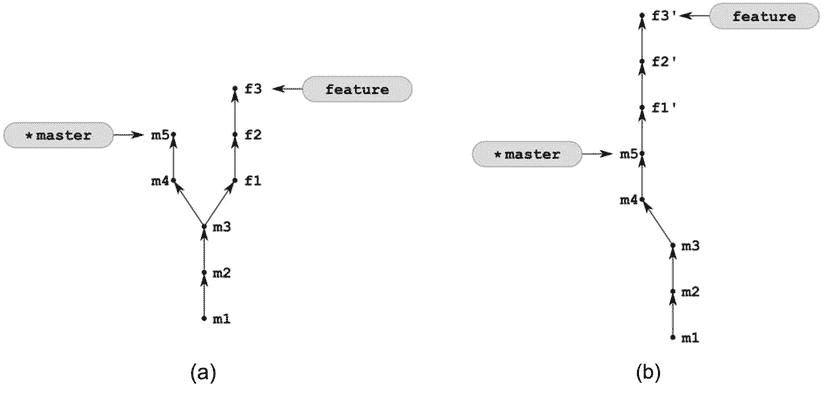

[图 7-1](#_Fig1) 。在重设基础之前(a)和重设基础之后 (b)来自配方 7-1 的储存库

解决办法

用分支克隆配方 6-4 中的存储库:

```
$ cd git-recipes
$ git clone-with-branches 06-04 07-01
$ cd 07-01
```

然后按照以下步骤操作:

1.  用`$ git checkout feature`命令检查`feature`分支。
2.  用`$ git rebase master`命令将`feature`分支复位到`master`分支上。
3.  用`$ git checkout master`命令检查`master`分支。

它是如何工作的

由`$ git rebase master`执行的转换可以被描述为在另一个分支的顶部应用由来自当前分支的提交引入的改变。这在[图 7-2](#Fig2) 中进行了描述。

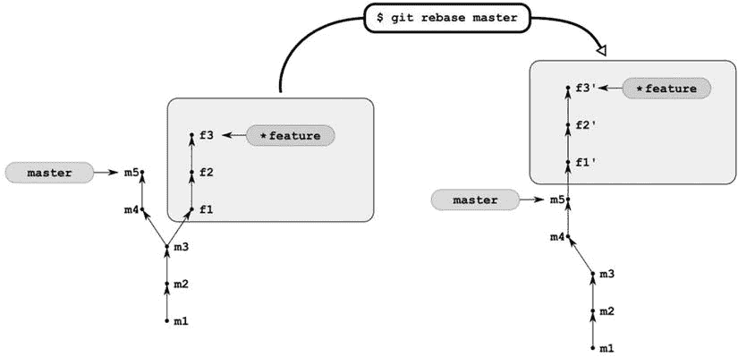

[图 7-2](#_Fig2) 。将提交从当前分支“移动”到另一个分支之上

正如你从配方 5-8 中已经知道的，没有办法将版本从一个地方移动到另一个地方。你所能做的就是创建一个新的修订版，它将有相同的注释，并且将相同的变化引入到你的文件中。这就是为什么[图 7-1(b)](#Fig1) 和[图 7-2](#Fig2) 中的修改包含了素数。它强调了这样一个事实，即这些是用不同的 SHA-1 名称进行的新修订。

最初的修订版`f1`、`f2`和`f3`会发生什么？没什么？它们完好无损。更准确地说，可以如图 7-3 中的[所示描述重置基础。最初的修订`f1`、`f2`和`f3`不再被任何分支引用——它们变成了悬空的修订。但是它们在数据库中保持不变。至少只要不使 reflog 过期并清理数据库。](#Fig3)

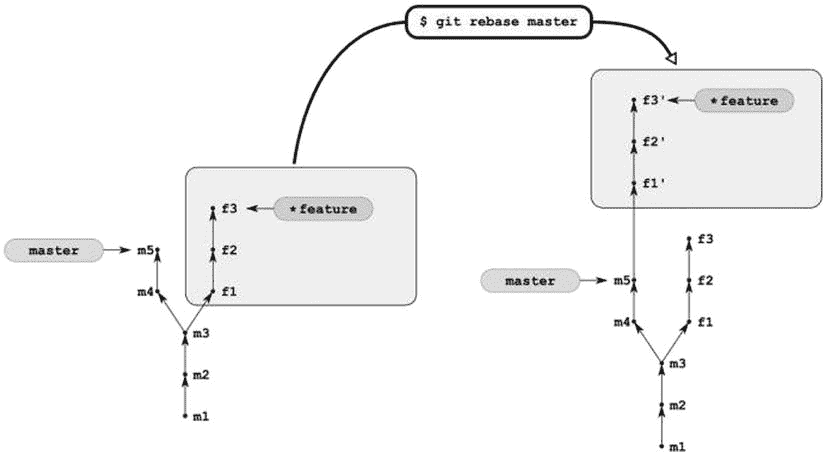

[图 7-3](#_Fig3) 。将修订 f1、f2 和 f3 的副本更精确地重新基础化到另一个分支中—原始修订保持不变

图 7-3 中的[包含了如何从重置基础中恢复的提示。要撤销](#Fig3)重置基础，你所要做的就是改变`feature`分支所指向的版本。你应该记得上一章的内容，分支只是指针。你可以把它们当成贴纸:任何东西都可以从一个地方撕下来，然后再贴到另一个地方。此操作不会修改数据库，所有修订保持不变。如果你修改了`feature`分支，使其再次指向`f3`修订版，那么重定基础将被撤销。

让我们找到最初的版本`f3`。和往常一样，您可以使用`$ git reflog`命令。但这一次，它的输出可能会产生误导。用`$ git log`命令来探索 reflog 可能会更容易。我们希望获得所有提交的列表，这些提交:

*   包含在 reflog 中
*   有包含`f3`字符串的注释

清单 7-1 中给出了适当的命令。用`--pretty`参数定义的格式打印缩短的散列(`%h`占位符)、注释(`%s`占位符)和提交日期(`%cd`占位符)。每个提交都可以在 reflog 中出现多次。实际上，每次签出都会在 reflog 中存储一个对提交的新引用。多亏了管道化的`sort`和`uniq`命令，清单 7-1 中的[命令产生的输出将包含每个提交一次。](#list1)

[***清单 7-1。***](#_list1) 该命令列出所有引用日志提交，注释中包含 f3

```
$ git log --walk-reflogs --grep=f3 --pretty="%h %s %cd" | sort | uniq
```

当您找到正确的提交时，您可以使用`$ git reset --hard [SHA-1]`命令更改`feature`分支。如果您的存储库是干净的，那么这个命令可以被看作是将您当前的分支移动到任意版本的一种方式。使用两个单独的命令也可以达到相同的效果:

```
$ git branch -D feature
$ git checkout -b feature [SHA-1]
```

第一条命令删除`feature`分支；第二个创建一个新的`feature`分支，指向期望的修订。您可以将上述两个命令合并为一个:

```
$ git checkout -B feature [SHA-1]
```

开关`-b`是一个安全的开关:只有当存储库还没有包含这样的分支时，它才会创建一个分支。如果分支存在，`$ git checkout -b`失败。开关`-B`强制`$ git checkout`命令覆盖现有分支。

好的，我们知道重定基础是如何转换修订图的结构的。但是文件会怎么样呢？从这个意义上说，重定基础的结果与合并产生的结果完全相同。两个命令:

```
# current branch is feature
$ git rebase master
$ git merge master
```

导致工作目录的内容完全相同。工作目录包含两个分支的文件:`feature`和`master`。

一般来说，[图 7-2](#Fig2) 和 [7-3](#Fig3) 中描述的换基在两个分支上操作；因此，该命令需要两个参数:

```
$ git rebase a b
```

如果跳过第二个参数，将使用`HEAD`。因此，命令:

```
$ git rebase a
$ git rebase a HEAD
```

是等价的。要将`feature`分支重定位到`master`分支上，就像在这个配方中一样，您可以:

*   将当前分支更改为`feature`，并使用一个参数进行重置，如下所示:

    ```
    $ git checkout feature
    $ git rebase master
    ```

*   使用两个参数来重新设定基数——那么你当前的分支就不重要了:

    ```
    $ git rebase master feature
    ```

无论哪种情况，`feature`都是成功重置基础后的当前分支。

7-2.手动重置分叉分支

问题

为了更深入地了解重设基础，你想执行与配方 7-1 相同的转换，而不使用`$ git rebase`命令。在这个食谱中，你想把重建基础分成两个操作:创建补丁和应用补丁。通过这种方式，补丁可以由一个开发人员创建，通过电子邮件发送，然后由另一个开发人员应用。

解决办法

用分支克隆配方 6-4 中的存储库:

```
$ cd git-recipes
$ git clone-with-branches 06-04 07-02
$ cd 07-02
```

然后按照以下步骤操作:

1.  用`$ git checkout feature` 结账`feature`分支
2.  用

    ```
    $ git format-patch --ignore-if-in-upstream master
    ```

    为`f1`、`f2`和`f3`版本生成补丁
3.  进入分离头状态，其中`HEAD`指向与`master`分支相同的版本。您将通过执行`$ git checkout `git rev-parse master`` 来实现
4.  使用`$ git am *.patch` 应用补丁
5.  使用`$ git checkout -B feature` 将`feature`分支移动到当前版本
6.  用`$ rm *.patch`删除补丁

它是如何工作的

`feature`分支包含三个提交`f1`、`f2`和`f3`，它们不包含在`master`分支中。您可以通过以下方式进行检查:

```
$ git log --oneline master..feature

```

输出将显示三个提交:

```
0deae94 f3
c1cab03 f2
3df8f34 f1
```

参数`master..feature` 指定一组提交。您可以将其视为减法运算符:

```
feature - master
```

或者更准确地说:

```
revisions included in feature - revisions included in master
```

这就是您如何发现在 rebase 期间哪些提交已经或将要被转移到其他位置。命令:

```
$ git log --oneline master..feature
```

将打印将被移动的提交。当在重置基础后发出时，它将打印被移动的提交。

现在我们想为这三次提交生成补丁。修补程序是一个文本文件，它精确地描述了要在项目文件中引入的变更集。当在`feature`分支发出时，命令:

```
$ git format-patch --ignore-if-in-upstream master
```

生成三个名为`0001-f1.patch`、`0002-f2.patch`和`0003-f3.patch`的文本文件。第一个文件是修订版`f1`的补丁。第二个文件是修订版`f2`的补丁。第三个文件是修订版`f3`的补丁。参数- `ignore-if-in-upstream`保证只生成还没有在`master`分支中合并的提交补丁。当您想要为许多分支多次生成补丁时，此选项变得很有必要。

所有生成的文件都是新的和未被跟踪的，正如`$ git status -s`命令所证明的:

```
?? 0001-f1.patch
?? 0002-f2.patch
?? 0003-f3.patch
```

在配方 5-6 中，你学到了新的未跟踪文件不会影响签出命令。您知道当前分支可以切换，未跟踪的文件将保持不变。这正是我们想要做的，因为我们想要将补丁应用到`master`分支。然而，因为`master`分支应该在结果存储库中保持不变，所以我们将使用分离的 HEAD 状态。

这个食谱给了你更多关于分离头部状态的详细实用的知识。我警告过你要避免它，所以你可能会问为什么要在 git 中引入它。分离的 HEAD 状态背后的原因是一些命令，比如 rebase，改变了修订的图形。为了保留原始分支，需要在分离的头状态下执行这些操作。如果出现问题，您可以很容易地返回到操作之前的状态，因为原来的分支没有改变。

好的，现在我们需要进入一个分离的 HEAD 状态，其中`HEAD`指向与`master`分支相同的修订。如何产生`master`分公司所指修订的 SHA-1 名称？您可以使用`$ git rev-parse`命令来完成:

```
$ git rev-parse master

```

上面的命令将一个符号引用，比如`HEAD`、`HEAD∼`、`feature`、`info^2`，转换成阿沙-1 名称。使用反勾运算符将`$ git rev-parse`的结果作为参数传递给 checkout，您将进入所需的分离头部状态。完整的命令如清单 7-2 中的[所示。您的存储库现在看起来如图 7-4 所示。](#list2)

[***清单 7-2。***](#_list2)

```
$ git checkout `git rev-parse master`
```

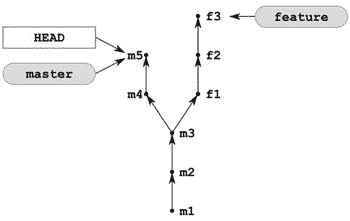

[图 7-4](#_Fig4) 。该库来自图 7-1(a)后的命令来自[清单 7-2](#list2)

当存储库看起来像[图 7-4](#Fig4) 时，我们应用存储在带有`.patch`后缀的文件中的补丁:

```
$ git am *.patch
```

上面的命令使用`HEAD`指针作为父指针来再现提交`f1`、`f2`和`f3`。存储库现在看起来像[图 7-5](#Fig5) 。

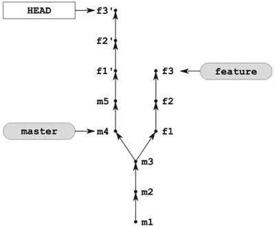

[图 7-5](#_Fig5) 。从[图 7-4](#Fig4) 中的存储库在应用了$ git am *补丁后。补丁命令

最后一步是现在改变`feature`分支。我们希望它指向我们当前的修订。为此我们可以使用`$ git checkout`命令。然而，命令`$ git checkout -b feature`将不起作用。原因相当明显:`feature`分支已经存在。不过，我们可以使用`-B`开关强制结帐:

```
$ git checkout -B feature
```

更新后的知识库如图 7-6 所示。提交`f1`、`f2`和`f3`在数据库中仍然作为悬空修订可用，但是它们没有显示在图中。

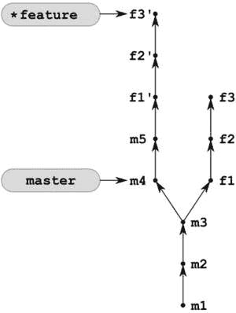

[图 7-6](#_Fig6) 。来自[的储存库图 7-5](#Fig5) 后的$ git checkout -B 特性

我们不再需要补丁了。用`$ rm *.patch` 命令删除它们。

使用樱桃采摘 rebase

您可以使用`$ git cherry-pick`命令获得类似的结果

1.  进入分离头状态:`$ git checkout `git rev-parse master``
2.  用`$ git cherry-pick feature∼2`重新应用`HEAD`中的修订`f1`
3.  用`$ git cherry-pick feature∼1`重新应用`HEAD`中的修订`f2`
4.  用`$ git cherry-pick feature`重新应用`HEAD`中的修订`f3`
5.  使用`$ git checkout -B feature`将`feature`分支移动到当前版本

上述解决方案的主要缺点是，这里您必须知道您想要重新应用哪些修订。命令`$ git format-patch`将卸下你肩上的重担！另外`$ git cherry-pick`不会创建补丁。要通过电子邮件发送补丁，你必须用`$ git format-patch`命令生成补丁。

 **提示**配方 7-2 背后的主要原因是为了让你更深入地了解`$ git rebase`是如何工作的。不要使用`$ git format-patch`、`$ git am`或`$ git cherry-pick`来重置你的分支，除非你想通过电子邮件把补丁发给其他人。请使用`$ git rebase`命令。配方 7-2 中的分析将有助于你理解重置基础的内部原理。根据您的工作流程，每次您想要发布您的作品时，都可能需要重新设定基准。

7-3.将分歧的分支连接成线性历史

问题

你在一个拥有两个分支`master`和`feature`的存储库中工作，如图[图 7-7(a)](#Fig7) 所示。您希望将`feature`分支合并到`master`分支中，这样得到的历史是线性的，也就是说，它不包含合并提交。该配方的起点如图 7-7(a) 中的[所示。您想要获取的存储库在](#Fig7)[图 7-7(b)](#Fig7) 中显示。

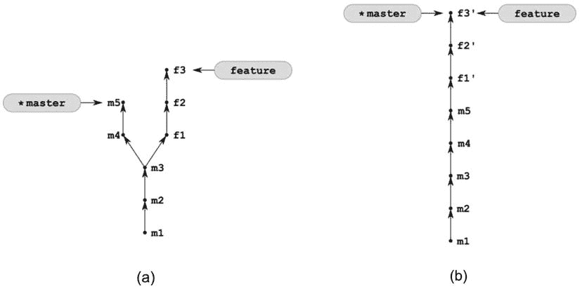

[图 7-7](#_Fig7) 。起点和结果将分歧分支加入线性历史

解决办法

用分支克隆配方 6-4 中的存储库:

```
$ cd git-recipes
$ git clone-with-branches 06-04 07-03
$ cd 07-03
```

然后按照以下步骤操作:

1.  用`$ git rebase master feature` 将`feature`分支重置到`master`分支上
2.  用`$ git rebase feature master`T3 将`master`分支重置到`feature`分支上

它是如何工作的

我们从[图 7-7(a)](#Fig7) 所示的储存库开始。该配方的第一步执行配方 7-1 中描述的操作。在`$ git rebase master feature`之后，存储库将看起来像[图 7-1(b)](#Fig1) 。我们需要将`master`分支快进到`feature`分支。这正是第二个命令`$ git rebase feature master`的目的。

快进可以用`$ git merge`或者`$ git rebase`来完成。下面是用`$ git merge`命令快进`master`分支的命令:

```
$ git checkout master
$ git merge feature
```

这是与`$ git rebase`命令相同的命令:

```
$ git rebase feature master
```

在配方 6-2 中讨论了使用`$ git merge`快进。

7-4.分叉的三个分支

问题

你的存储库包含两个分叉的分支`master`和`feature`，如图[图 7-8(a)](#Fig8) 所示。首先，你想在你的`feature`分部的最新修订版的基础上，研究一些新的想法。您需要创建一个名为`brave-idea`的新分支，并将您的更改提交为修订版`b1`和`b2`。接下来您想要切换到`feature`分支并创建三个新的修订`f4`、`f5`和`f6`。你想要实现的库如图[图 7-8(b)](#Fig8) 所示。

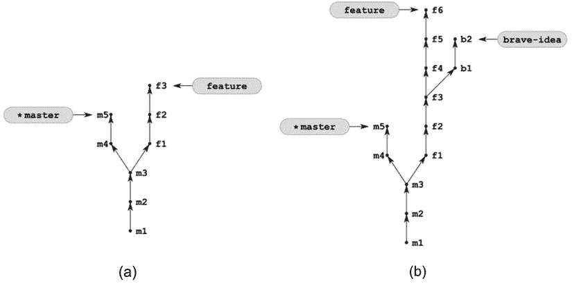

[图 7-8](#_Fig8) 。通过对存储库(a)应用配方 7-4，您将得到存储库(b)

解决办法

用分支克隆配方 6-4 中的存储库:

```
$ cd git-recipes
$ git clone-with-branches 06-04 07-04
$ cd 07-04
```

然后按照以下步骤操作:

1.  用`$ git checkout -b brave-idea feature`创建并检查`brave-idea`分支
2.  用`$ git simple-commit b1 b2`在`brave-idea`分支中创建两个版本
3.  用`$ git checkout feature`检查`feature`分支
4.  用`$ git simple-commit f4 f5 f6`在`feature`分支中创建三个版本
5.  用`$ git checkout master`将当前分支更改为`master`

它是如何工作的

这个食谱解释了如何创建许多不同的分支。我们只使用众所周知的命令来实现这一点:`clone`、`checkout`和`simple-commit`。这就是如何轻松生成具有给定结构的存储库。如果您想分析 git 命令及其对图形结构的影响，这个功能非常有用。

请记住，当您使用带有`--graph`选项的`$ git log`命令时，您得到的图形可能会稍有不同。从[图 7-8(b)](#Fig8) 中得到的一个库的`$ git log --oneline --graph --decorate --all` 结果如图[图 7-9](#Fig9) 所示。

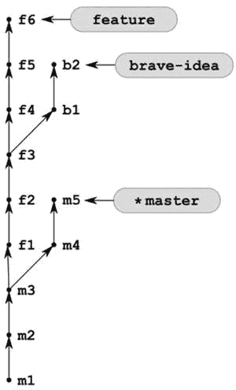

[图 7-9](#_Fig9) 。该库来自[图 7-8(b)](#Fig8) 由$ git 绘制的 log-one line-graph-decoration-all

一旦你创建了如图 7-8 所示的存储库，许多关于修订图的问题可能会出现。例如以下内容:

*   如何找到分支`a`和`b`的共同祖先？
*   如何寻找任意支数的共同祖先？
*   如何找到两个分支的差异`a - b`，即包含在分支`a`中但不包含在分支`b`中的修订？
*   如何找到两个分支的对称差异`a ∆ b`，即包含在`a`或`b`中但不同时包含在两者中的修订？
*   如何查找包含在`a`、`b`、`c`分支中，不包含在`d`、`e`、`f`分支中的修订？

两个分支的共同祖先是包含在两个分支中的最新修订。对于分支`feature`和`brave-idea`，它是`f3`。对于`master`和`feature`是`m3`。您可以使用以下方法找到共同祖先:

```
$ git merge-base feature brave-idea

```

如果你想得到两个以上分支的共同祖先，使用`--octopus`参数。命令:

```
$ git merge-base --octopus feature brave-idea master
```

打印`m3`提交的 SHA-1。

提交的范围已经在配方 7-2 中讨论过了。特殊运算符`..`被解释为分支的差异。命令:

```
$ git log --oneline master..brave-idea
```

打印提交的`b2`、`b1`、`f3`、`f2`和`f1`，同时:

```
$ git log feature..master
```

输出版本`m4`和`m5`。

由两个分支引入的新提交集由`...`操作符解析。这是分支的对称差异。的输出:

```
$ git log feature...brave-idea
```

由`f6`、`f5`、`f4`、`b2`和`b1`组成。

指定包含和排除修订的更详细的方法是使用`--not`操作符。命令:

```
$ git log a b c --not d --not e --not f
```

打印包含在`a`、`b`或`c`中，不包含在`d`、`e`和`f`中的修订。这也可以写成:

```
$ git log a b c ^d ^e ^f
```

使用上面的语法，你可以用清单 7-3 中的命令列出`master`、`feature`和`brave-idea`分支中引入的新修订。该命令输出修订:

*   `f6`、`f5`、`f4`——在`feature`分支引入的提交
*   `b2`、`b1`——在`brave-idea`分行引入的提交
*   `m5`、`m4`——在`master`分行引入的提交

[***清单 7-3。***](#_list3)

```
$ git log --oneline
    master feature brave-idea
    ^`git merge-base master feature`
    ^`git merge-base feature brave-idea`
```

我们如何达到上述结果？我们包括所有三个分支机构:

```
master feature brave-idea
```

然后排除通过`master`和`feature`分支的共同祖先可用的提交(它是修订版 m3):

```
^`git merge-base master feature`

```

并且排除通过`feature`和`brave-idea`分支的共同祖先可用的提交(它是修订版`f3`):

```
^`git merge-base feature brave-idea`

```

使用用反勾运算符定义的 shell 子命令，我们不必复制/粘贴嵌入的`m3`和`f3`的 SHA-1 名称。

在研究修订图时，您可能还会发现生成带有给定注释的提交的 SHA-1 名称的命令很有用:

```
$ git log --format="%h" --grep=XXX --all
```

上述命令考虑了所有分支(`--all`选项)，并搜索包含`XXX`字符串的修订。多亏了`--format`参数，输出只包含缩短的 SHA-1 名字。

7-5.部分重置和

问题

您决定在图 7-10(a) 所示的[库中的`brave-idea`分支中引入的代码现在可以与他人共享了。因此，您想要将修订版`b1`和`b2`移动到`master`分支。你想要实现的库如图](#Fig10)[图 7-10(b)](#Fig10) 所示。如果在你制作`brave-idea`的过程中，你最初的想法不断发展，变得足够大，可以作为独立的特征来对待，这种情况就会发生。

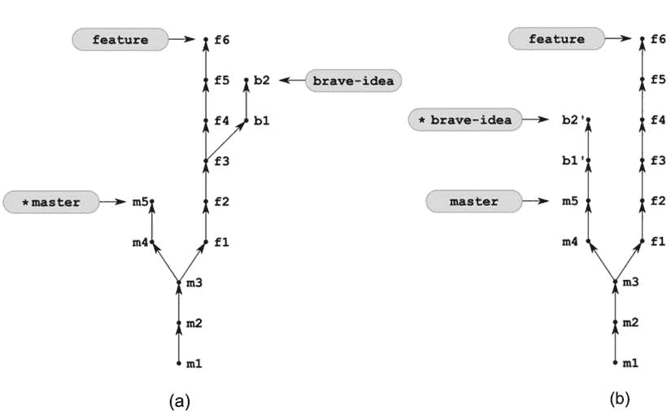

[图 7-10](#_Fig10) 。通过对存储库(a)应用配方 7-5，您将得到存储库(b)

解决办法

用分支克隆配方 7-4 中的存储库:

```
$ cd git-recipes
$ git clone-with-branches 07-04 07-05
$ cd 07-05
```

然后用[清单 7-4](#list4) 中所示的命令将`brave-idea`分支重置到`master`分支上。

[***清单 7-4。***](#_list4) 将图 7-10(a) 中[所示的库转换成图 7-10(b)](#Fig10) 中[所示状态的命令](#Fig10)

```
$ git rebase --onto master feature brave-idea
```

它是如何工作的

命令`$ git rebase --onto`作用于三个分支:

```
$ git rebase --onto a b c
```

第一个分支是我们将重新应用补丁的分支。另外两个分支定义了要重新应用的补丁集。它将是由双点运算符`b..c`定义的集合。换句话说，该命令获取包含在`c`中但不包含在`b`中的修订，并在`a`上重新应用它们。如果操作成功，则`c`被移动并指向结果提交。

清单 7-4 中的命令可以在任何分支中执行。结果总是一样的:提交`b1`和`b2`将作为`b1'`和`b2'`被重新应用到`master`分支之上。操作后的分支`c`将是你当前的分支。

如果您忽略了最后一个参数，那么您当前的分支将被重置。以下命令是等效的:

```
$ git rebase --onto foo bar
$ git rebase --onto foo bar HEAD
```

我们可以说清单 7-4 中的命令相当于两个命令:

```
$ git checkout brave-idea
$ git rebase --onto master feature
```

7-6.为分叉分支创建灯泡

问题

你的知识库看起来像图 7-11 中的[(a)](#Fig11)。您想要将`feature`分支中引入的变更合并回`master`分支，以这样的方式，重新应用的修订`f1'`、`f2'`和`f3'`在来自`master`分支的修订之上形成一个灯泡。您希望实现的存储库如[图 7-11(b)](#Fig11) 所示。

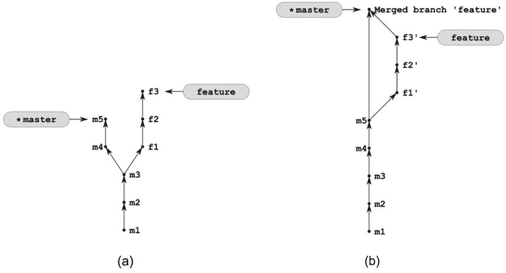

[图 7-11](#_Fig11) 。将配方 7-6 应用于图 6-5 中的存储库后，您将获得该存储库

解决办法

用分支克隆配方 6-4 中的存储库:

```
$ cd git-recipes
$ git clone-with-branches 06-04 07-06
$ cd 07-06
```

然后按照以下步骤操作:

1.  用`$ git rebase master feature`将`feature`分支重置到`master`分支上
2.  用`$ git checkout master`切换到`master`分支
3.  用`$ git merge --no-ff feature`将`feature`分支合并成`master`分支

它是如何工作的

配方 7-6 包括两个步骤:

*   首先，我们使用配方 7-1 来转换存储库，如图 7-1 所示。
*   接下来，我们使用配方 6-6 进行合并，形成一个灯泡。

7-7.在子分支 中创建灯泡

问题

你的知识库看起来像[图 7-12(a)](#Fig12) 。你想将`brave-idea`分支合并回`feature`分支作为灯泡。您希望实现的知识库如图[图 7-12(b)](#Fig12) 所示。

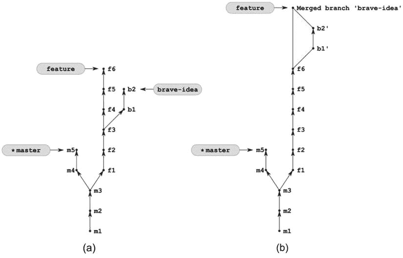

[图 7-12](#_Fig12) 。配方 7-7 中考虑的储存库

解决办法

用分支克隆配方 7-4 中的存储库:

```
$ cd git-recipes
$ git clone-with-branches 07-04 07-07
$ cd 07-07
```

然后按照以下步骤操作:

1.  用`$ git rebase feature brave-idea`将`brave-idea`分支重置到`feature`分支上
2.  用`$ git checkout feature`切换到`feature`分支
3.  用`$ git merge --no-ff brave-idea`将`brave-idea`分支合并成`feature`分支
4.  用`$ git branch -d brave-idea`删除`brave-idea`分支
5.  用`$ git checkout master`检查`master`分支

它是如何工作的

配方 7-7 显示了如何将配方 7-6 应用于`feature`和`brave-idea`分支。您可能认为这是多余的，但最终的存储库对于下一个食谱是必需的。

7-8.给树枝换上灯泡

问题

你的存储库现在看起来像[图 7-12(b)](#Fig12) 。您想要将`feature`分支重新定位到`master`分支上。

解决办法

用分支克隆配方 7-7 中的存储库:

```
$ cd git-recipes
$ git clone-with-branches 07-07 07-08
$ cd 07-08
```

然后用`$ git rebase master feature`将`feature`分支复位到`master`分支上。您将获得如图[图 7-13](#Fig13) 所示的存储库。注意`feature`分支不再包含`merge branch 'brave-idea'`修订。

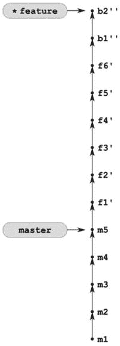

[图 7-13](#_Fig13) 。该库来自[图 7-12](#Fig12) 后的$ git rebase master 特性

它是如何工作的

正如你在图 7-13 中所看到的，重置基础只在非合并提交时起作用。所有合并提交都将丢失。重定基础总是产生一条直线的提交，没有灯泡或合并。在有球茎的树枝的情况下，它不一定是你所期望的。如果你想保留合并和灯泡，你不能使用简单的 rebase 命令。您必须移动整个分支，然后重新生成合并提交。

好好看看[图 7-13](#Fig13) 。提交`b1`和`b2`用两个素数`b1''`和`b2''`表示。双撇号强调了这些是新提交的事实。它们引入了与图 7-12[中的`b1'`和`b2'`以及图 7-8](#Fig12) 中的`b1`和`b2`相同的变化，但它们的 SHA-1 名称不同。

7-9.重设基础期间保留合并

问题

你的知识库看起来像[图 7-14(a)](#Fig14) 。你要将`feature`树枝重新放在`master`树枝上，保留灯泡。你想要实现的库如图[图 7-14(b)](#Fig14) 所示。

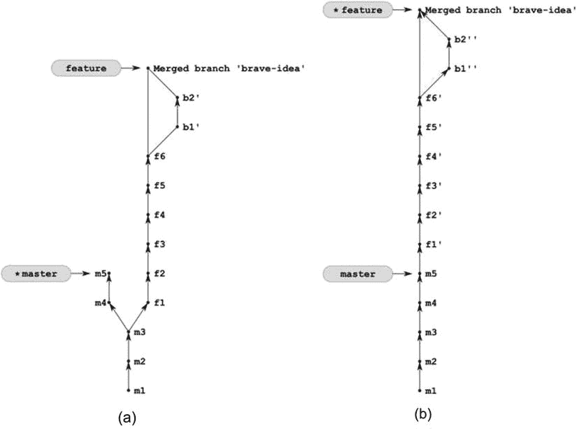

[图 7-14](#_Fig14) 。通过将配方 7-9 应用于存储库(a ),您将得到存储库(b)

解决办法

用分支克隆配方 7-7 中的存储库:

```
$ cd git-recipes
$ git clone-with-branches 07-07 07-09
$ cd 07-09
```

然后用`--preserve-merges`参数进行重置:

```
$ git rebase --preserve-merges master feature
```

它是如何工作的

参数`--preserve-merges`强制 git 在重置基础期间保留合并。

摘要

本章介绍了**重定基准**的概念——从一个分支的顶部复制另一个分支的提交序列的操作。你可以把它当成一个工具，把分叉的分支转化成线性的历史。重设基础的语法允许您在一个完整的分支之上重设基础。您可以通过以下方式实现这一点:

```
$ git rebase dest src
```

其中,`src`是您要从中获取提交的分支，而`dest`是提交将被重新应用的分支。此次操作后,`src`将成为当前分支机构。

您还可以使用以下命令执行部分重置:

```
$ git rebase --onto dest part src
```

这里的`dest`也是提交将被重新应用的分支。要移动的提交集由`part`和`src`分支定义。该操作移动包含在`src`中并从`part`分支中排除的提交。你可以把它作为`dest`重新应用的`(src - part)`差值记忆下来。

在这两种情况下，最终的`src`分支都可以省略。如果是这种情况，那么将使用当前分支。这些命令:

```
$ git rebase dest
$ git rebase dest HEAD
```

与以下命令完全等效:

```
$ git rebase --onto dest part
$ git rebase --onto dest part HEAD
```

在这一章中，我们第一次有意地在超脱的头部状态下工作。分支状态可以被视为以原子方式执行操作(如重置基础)的手段。该操作在分离的头部状态下执行。成功完成后，我们根据需要调整分支。否则不会修改分支，并且可以取消操作。在第 9 章关于冲突的讨论中会有更多关于这方面的内容。

请记住，默认情况下，重置基础会跳过合并提交。如果需要，您可以使用`--preserve-merges`选项保存它们。

在本章中，顺便说一下，你还学习了如何用`$ git merge-base`命令找到两个分支的共同祖先，以及如何指定范围提交。提交范围可以用两个特殊的操作符`..`和`...`来定义，或者用更详细的方式来定义。

当您键入`a..b`时，它是一组包含在`b`中但不包含在`a`中的提交。你可以把它想成一个区别`(b - a)`。

三个点`c...d`指定**对称差**，即两组提交的集合:

*   `c`中可用而`d`中不可用的
*   以及那些在`d`中可用而在`c`中不可用的

这可以算是`(c - d) + (d - c)`。

更详细的语法使用`--not`操作符，缩写为`^`来排除分支。范围:

```
a b c ^d ^e ^f
a b c --not d --not e --not f
```

包括`a`、`b`和`c`中可用的提交，排除`d`、`e`和`f`中可用的提交。