# 八、修改历史记录

本章介绍修改修订图结构的各种命令。有时你需要将三个不同的版本合并成一个版本。在其他时候，您可能需要相反的操作:将一个单独的提交分成许多单独的提交。无论是哪种情况，请记住 git 版本是永久的。他们永远不会改变。一旦创建了修订，就无法对其进行修改。你所能做的就是用秘籍 3-12 和 5-4 中介绍的方法把它扔掉。因此，每当我说“让我们修改一个修订”这样的话，我脑海中的操作是创建一个类似于原始版本的新修订。原始版本在 git 数据库中保持不变。它可以通过符号引用而不是 reflog 来访问，但它仍然存在。直到下一次数据库清除。

如果任何操作产生的结果令您不满意，您可以随时返回到以前的状态。您所需要的只是包含正确快照的修订名称。可以使用 reflog 来查找该名称，但也可以创建一个临时分支来保存对所需修订的引用。因为修订不会改变，所以您不需要担心修改修订的后果。无论您做什么，都不会改变已经存储在数据库中的修订。提交、重置基础和合并只会产生新的修订，这些操作不会修改现有的修订。修改修订是不可能的。

这对于我研究 git 来说是一个真正的突破。一旦我学会了如何重构修订图以及如何撤销各种操作，我就获得了自由使用该工具的信心。

8-1.修订最新版本

问题

您刚刚提交了一组变更到存储库中，一分钟后您意识到有一些额外的修改应该被合并到先前的版本中。您不想再创建另一个提交；您可能希望通过添加一些额外的更改来修改现有的修订。

解决办法

创建新的存储库:

```
$ cd git-recipes
$ git init 08-01
$ cd 08-01
```

然后按照以下步骤操作:

1.  用$ echo lorem > lorem.txt 创建文件 lorem.txt
2.  使用$ git add lorem.txt 暂存文件
3.  用$ git commit -m "lorem "提交文件

存储库包含一个标记为`lorem`的修订。[清单 8-1](#list1) 显示了`$ git log --pretty=fuller`命令的输出。

[***清单 8-1。***](#_list1) 我们希望修改的原始版本

```
commit 5a786865f21b5c1725e56c2bf60f6516ce736b9b
Author:     Włodzimierz Gajda <gajdaw@gajdaw.pl>
AuthorDate: Thu Aug 22 07:02:00 2013 +0200
Commit:     Włodzimierz Gajda <gajdaw@gajdaw.pl>
CommitDate: Thu Aug 22 07:02:00 2013 +0200

    Lorem
```

现在您意识到存储在`lorem.txt`文件中的文本应该大写并扩展。为了更深入地了解 git 的内部，我们将在不同的用户名下修改版本。

修改本地存储在这个特定存储库中的`user.name`和`user.email`配置设置。您可以通过以下方式实现这一目标:

```
$ git config --local user.name "John Doe"
$ git config --local user.email john@example.net
```

最后，按照以下步骤修改版本:

1.  用$ echo Lorem Ipsum Dolor > lorem.txt 修改 lorem.txt 的内容
2.  使用$ git add lorem.txt 暂存文件
3.  使用$ git commit-amend-m " Lorem Ipsum Dolor "提交文件

历史仍然只包含一个版本。命令`$ git log --pretty=fuller`打印清单 8-2 中[所示的输出。](#list2)

[***清单 8-2。***](#_list2)$ git commit-amend 命令创建的提交

```
commit f63bce5e17a3ba02b0dbee13bb56ceabfd622ce7
Author:     Włodzimierz Gajda <gajdaw@gajdaw.pl>
AuthorDate: Thu Aug 22 07:02:00 2013 +0200
Commit:     John Doe <john@example.net>
CommitDate: Thu Aug 22 07:07:45 2013 +0200

    Lorem Ipsum Dolor
```

两个版本，原始版本和修正版本，都可以通过 reflog 获得。命令`$ git reflog`输出:

```
f63bce5 HEAD@{0}: commit (amend): Lorem Ipsum Dolor
5a78686 HEAD@{1}: commit (initial): lorem
```

因此，您可以随时撤销用`$ git reset --hard HEAD@{1}`修改的内容。

它是如何工作的

`$ git commit`命令的参数`--amend`允许您修改历史中的最新版本。命令`$ git commit --amend`:

*   从历史中获取最近的提交(在配方 8-1 中，它是名为`5a78`的提交；文件`lorem.txt`包含`lorem`；提交如[清单 8-1](#list1) 所示
*   获取暂存区的当前状态(在配方 8-1 中，它是带有`Lorem Ipsum Dolor`的暂存文件`lorem.txt`
*   并将它们组合成一个新的修订(在配方 8-1 中，它是名为`f63b`的提交；提交如清单 8-2 所示

这个新版本(`f63b`)取代了历史中的原始版本(`5a78`)。

从技术上讲，该命令不会修改版本。它创建一个新的提交。您可以使用`$ git reflog`命令找到两个提交的名称。原始提交在 git 数据库中一直悬而未决，直到最终被垃圾收集操作删除。

 **提示**记住——git 版本是永久的！不可能更改提交中存储的任何信息并保留相同的 SHA-1。`$ git commit --amend`命令创建一个全新的版本，然后更新主分支以指向新的版本。

为什么我们在这个配方中改变了`user.name`和`user.email`的配置？它将帮助您理解 git 处理日期和分配作者身份的方式。每个提交包含四个属性:`Author`、`AuthorDate`、`Commit`和`CommitDate`。他们储存:

*   `Author`—作者的名字
*   `AuthorDate`—最初提交的日期
*   `Commit`—委托人的姓名
*   `CommitDate`—历史中引入提交的日期

当您第一次创建提交时，`Author`和`Commit`都将被设置为您的名字。存储在`AuthorDate`和`CommitDate`中的日期将是相同的。这种情况如[清单 8-1](#list1) 所示。

如果用`--amend`选项修改提交会发生什么？Git 保留原来的`Author`和`AuthorDate`字段，并为`Commit`和`CommitDate`字段设置新值。这显示在[清单 8-2](#list2) 中。同样的规则也适用于你的提交。

 **提示** Git 不关心你的文件的最后修改日期。Git 跟踪内容——文件的最后修改日期不会以任何方式影响您的修订。存储在数据库中的每个提交都包含`AuthorDate`和`CommitDate`。这些日期是在提交、rebase 或 cherrypick 时设置的。文件的最后修改日期是在您签出文件时设置的。例如，这是在切换分支时完成的。

细心的读者会注意到，`$ git commit --amend`引入的修改的作者被错误地归于原作者。在配方 8-1 中，两个词`Ipsum`和`Dolor`是由用户 John Doe 创作的，但被认为是 odzimierz Gajda。然而，实际上这种情况从来不会发生，因为不允许修改其他开发人员提交的内容。你可以对它们进行精选或重新排序，但这样作者才能被正确地归属。

8-2.删除最近的版本

问题

您希望从当前分支中删除两个最新的修订。图 8-1 中描述了您想要实现的转变。

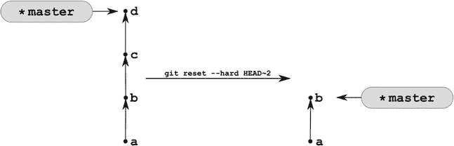

[图 8-1](#_Fig1) 。删除两个最新修订

解决办法

创建一个包含修订版本`a`、`b`、`c`和`d`的新存储库:

```
$ cd git-recipes
$ git init 08-02
$ cd 08-02
$ git simple-commit a b c d
```

您的存储库现在包含四个修订版。全部包含在`master`分支中。使用命令`$ git reset --hard HEAD∼2`删除两个最新版本。现在`$ git log --oneline`命令只返回两个版本:a 和 b。版本 c 和 d 从历史中删除。

 **提示**你可以用这个方法删除任意数量的最近提交。命令`$ git reset --hard HEAD∼13`将删除最后 13 个提交。

它是如何工作的

参考号`HEAD∼2`指向[图 8-1](#Fig1) 中的版本`b`。你也可以使用修订版的 SHA-1`b`来达到同样的效果。假设修订版`b`的名称是`a1b2c3d4`，以下命令是等效的:

```
$ git reset --hard HEAD∼2
$ git reset --hard a1b2c3d4  # SHA-1 of revision b
```

正如您已经知道的，git 命令通常不会从数据库中删除对象。因此，在[图 8-2](#Fig2) 中可以更准确地描述配方 8-2 中执行的操作。修订版`c`和`d`在数据库中保持可用，直到它们在 reflog 中的所有符号引用都被清除并且数据库被清理。要撤消操作，您可以随时使用 reflog。

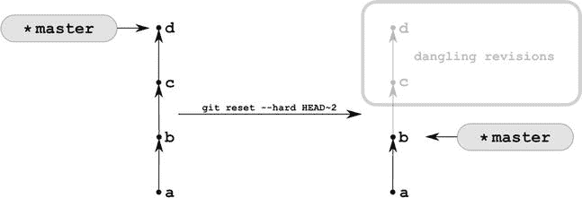

[图 8-2](#_Fig2) 。修订版 c 和 d 一直悬而未决，直到它们被 git gc 清除

 **提示**配方 8-2 中讨论的命令在配方 3-5 中使用，以检验所需的版本。

8-3.将许多修订压缩成一个修订

问题

您的存储库包含相当多的修订。你想把最后三个版本压缩成一个版本。图 8-3 中的[描述了您想要执行的操作。](#Fig3)

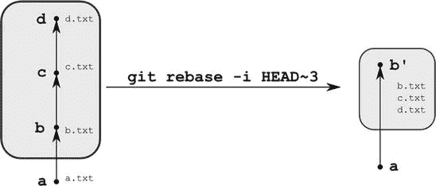

[图 8-3](#_Fig3) 。压缩最后三次修订

解决办法

创建一个包含修订版本`a`、`b`、`c`和`d`的新存储库:

```
$ cd git-recipes
$ git init 08-03
$ cd 08-03
$ git simple-commit a b c d
```

您的存储库现在包含四个修订，工作目录包含四个文件。当然，您可以使用`$ git log`和`$ ls`命令来检查它。如果您想验证哪些文件包含在最新版本中，请使用以下命令:

```
$ git show --name-only HEAD
```

它将打印上一次修订带有注释`d`的信息，其中包括一个名为`d.txt`的文件。同样，您可以列出任何以前版本中包含的文件:

```
$ git show --name-only HEAD∼
$ git show --name-only HEAD∼2
```

让我们将最后三个提交压缩到一个版本中。为此，请运行以下命令:

```
$ git rebase -i HEAD∼3
```

重置命令的开关`-i`打开交互模式。该命令将启动 vim 编辑器，内容如清单 8-3 中的[所示。更改编辑器的内容——键入清单 8-4](#list3) 中的命令。您应该将出现在第二次和第三次提交之前的单词 *pick* 改为 *fixup* 。

[***清单 8-3。***](#_list3)$ git rebase-I HEAD 后 vim 的内容∨3

```
pick f2136a0 b
pick a36ee90 c
pick 46c002f d

# Rebase d344a8a..46c002f onto d344a8a
#
# Commands:
#  p, pick = use commit
#  r, reword = use commit, but edit the commit message
#  e, edit = use commit, but stop for amending
#  s, squash = use commit, but meld into previous commit
#  f, fixup = like "squash", but discard this commit's log message
#  x, exec = run command (the rest of the line) using shell
```

[***清单 8-4。***](#_list4) 您必须在$ git rebase -i HEAD 之后键入的 vim 内容 3

```
pick f2136a0 b
fixup a36ee90 c
fixup 46c002f d
```

在你输入了清单 8-4 中[的内容后，关闭编辑器。然后 git 会执行操作。在此之后，使用以下内容检查存储库的历史记录:](#list4)

```
$ git log --oneline
```

该命令将只打印两个提交`a`和`b`。根据`$ ls`命令，工作目录仍然包含四个文件。命令:

```
$ git show --name-only HEAD
```

证明最后一次提交现在包含三个文件`b.txt`、`c.txt`和`d.txt`。

它是如何工作的

在交互式重定基础期间，git 将您在编辑器中键入的内容视为子命令列表。例如，[清单 8-4](#list4) 包含三个子命令。其中之一是:

```
fixup a36ee90 c
```

其含义是:“对修订版 a36ee90c 执行修正操作。”以下是交互式重置基础可用子命令的完整列表:

*   `pick`—提交将出现在结果历史记录中
*   `reword`—将使用提交，但 git 将允许修改其注释
*   `edit`—将使用提交，但 git 将允许修改(添加和删除文件)
*   `squash`—提交将被压缩到前一个提交中，git 将允许修改结果提交的注释
*   `fixup`—与 squash 相同，但这次 git 不允许修改结果修订的注释(将使用第一个修订的注释)
*   `exec`—该命令允许你执行任意的外壳命令

每个子命令都可以用它的首字母缩写。您键入的命令由 git 按照它们在编辑器中出现的顺序逐一执行。

那么[清单 8-4](#list4) 中显示的命令是什么意思呢？其中有三个:第一个是 pick 命令，第二个是 fixup 命令，第三个是另一个 fixup 命令。第一个命令

```
pick f2136a0 b
```

选择提交`b`。因此，它将出现在结果历史中。您可以将 pick 命令视为一个精选命令。应用由版本`f2136a0`定义的补丁。下一个命令:

```
fixup a36ee90 c
```

将提交`c`压缩为之前的提交`b`。fixup 命令不允许您修改结果提交的注释。您将获得包含来自提交`b`和`c`的变更集的提交，并且用提交`b`的原始注释来表示。

最后一个命令:

```
fixup 46c002f d
```

执行一次挤压。这一次，git 将 commit `d`压缩为将`c`压缩为`b`的结果。因此，您将以注释`b`表示的单个提交结束，并合并来自提交`b`、`c`和`d`的变更集。

交互式重置基础执行的所有操作都存储在 reflog 中。现在，命令`$ git reflog`打印以下结果:

```
e3fc0e0 HEAD@{0}: rebase -i (finish): returning to refs/heads/master
e3fc0e0 HEAD@{1}: rebase -i (squash): b
5eb1d5a HEAD@{2}: rebase -i (squash): # This is a combination of 2 commits.
f2136a0 HEAD@{3}: checkout: moving from master to f2136a0
46c002f HEAD@{4}: commit: d
a36ee90 HEAD@{5}: commit: c
f2136a0 HEAD@{6}: commit: b
d344a8a HEAD@{7}: commit (initial): a
```

正如您可能猜到的那样，原始修订会保留在数据库中，直到它们被清除。如果您想撤销重设基础，您需要以下命令:`$ git reset --hard HEAD@{4}`。

给定版本中修改的文件列表由`$ git show --name-only [REVISION]`命令打印。您也可以使用`$ git log --name-only REVISION∼..REVISION`或`$ git diff --name-only REVISION∼..REVISION`来获得类似的结果。范围`REVISION∼..REVISION`将`$ git log`和`$ git diff`命令的输出限制为仅一个版本。

8-4.将一个修订拆分成多个修订

问题

存储库中的最新版本在工作目录中引入了三个新文件。您无意中提交了所有三个文件，一分钟后才意识到每个文件都应该存储在单独的修订中。您希望将最新修订拆分为三个不同的修订，每个修订都与一个文件相关。配方 8-4 与配方 8-3 相反。

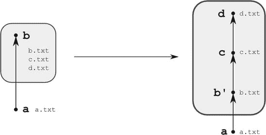

图 8-4。将最近的修订分成许多不同的修订

解决办法

创建一个新的存储库，它将包含两个修订版本:`a`和`b`。第一次修订应包括一个文件`a.txt`，第二次修订应包括三个文件:`b.txt`、`c.txt`和`d.txt`:

```
$ cd git-recipes
$ git init 08-04
$ cd 08-04
$ echo a > a.txt
$ git add -A
$ git commit -m a
$ echo b > b.txt
$ echo c > c.txt
$ echo d > d.txt
$ git add -A
$ git commit -m b
```

使用`$ git log --oneline`命令验证存储库包含两个修订版，并且最后一个修订版确实包含三个文件。`$ git show --name-only`命令的输出将打印三个文件名:`b.txt`、`c.txt`和`d.txt`。

现在，将您的历史重置为修订版`a`，将修订版`b`引入的修改作为新的未提交的变更保留在工作目录中。你可以用`$ git reset HEAD∼`命令来做这件事。在这个命令之后，由`$ git status -sb`返回的库的状态将如下:

```
?? b.txt
?? c.txt
?? d.txt
```

如您所见，文件现在未被跟踪。您可以创建三个不同的修订版本:

```
$ git add b.txt
$ git commit -m b

$ git add c.txt
$ git commit -m c

$ git add d.txt
$ git commit -m d
```

秘籍完成了。您可以使用`$ git log`命令检查历史包含四个版本`a`、`b`、`c`和`d`。每个修订版都包含一个文件。要验证它，请使用以下命令:

```
$ git show --name-only HEAD
$ git show --name-only HEAD∼
$ git show --name-only HEAD∼2
```

它是如何工作的

为了更深入地了解`$ git reset`命令 转换您的存储库的方式，您需要彻底理解回购的结构。存储库包括:

*   工作目录
*   集结地
*   数据库

存储在`.git/HEAD`中的头指向存储在数据库中的一个提交。

工作目录可以解释为项目的一个快照。那很清楚。但是同样的，你也可以把 staging 区域和你的 HEAD 指针当作两个不同的快照。因此，我们可以说，在任何给定的时间点，您的存储库在三个不同的快照上运行:

*   第一个快照—工作目录
*   第二个快照—暂存区
*   第三个快照—存储在 HEAD 指向的修订中的快照

让我们假设您刚刚用`$ git simple-commit lorem`创建了一个修订。存储库是干净的，工作目录包含一个名为`lorem.txt`的文件，存储一个字符串`lorem`。

当存储库干净时，所有三个快照—工作目录、暂存区和磁头—都是相同的。让我们用`$ echo foo > lorem.txt`来修改`lorem.txt` 文件。这次操作后`$ git status -sb`命令打印出来:

```
_M lorem.txt
```

存储在三个快照中的`lorem.txt`文件包含:

*   第一个快照(工作目录):该文件包含`foo`
*   第二个快照(暂存区):该文件包含`lorem`
*   第三张快照(头):该文件包含`lorem`

因此`_M`意味着工作目录中的文件不同于暂存区中存储的文件，同时暂存区中存储的文件与`HEAD`指向的修订中的文件相同。

`$ git status -sb` 打印的两个字母代码，如`_M`，让你知道三个快照的区别。如果两个字母的代码是`XY`，那么:

*   `X`让您了解第三个快照(`HEAD`)和第二个快照(暂存区)之间的差异
*   `Y`让您了解第二个快照(暂存区)和第一个快照(工作目录)之间的区别

让我们用`$ git add lorem.txt`暂存`lorem.txt`文件。`$ git status -s` 的输出如下:

```
M_ lorem.txt
```

代码是`M_`，这次存储在三个快照中的`lorem.txt`文件包含:

*   第一个快照(工作目录):该文件包含`foo`
*   第二个快照(暂存区):该文件包含`foo`
*   第三张快照(`HEAD`):该文件包含`lorem`

因此`M_`意味着工作目录中的文件与暂存区中的文件相同；存储在暂存区中的文件不同于存储在`HEAD`中的文件。

如果您使用`$ git commit`提交此修改，那么所有三个快照将再次同步。它们都包含带有`foo`字符串的文件`lorem.txt`。

一旦你掌握了三个快照背后的思想，就很容易理解`$ git reset`命令的工作方式。该命令更改三个快照:头、登台区和工作目录。它有三个影响其行为的重要选项`--soft`、`--mixed`、`--hard`、。它们的含义总结在[表 8-1](#Tab1) 中。

[表 8-1](#_Tab1) 。$ git reset 命令的选项- soft、- mixed、- hard

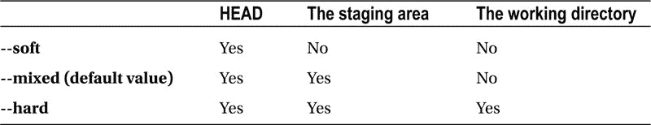

[表 8-1](#Tab1) 告诉我们`--soft`选项只影响`HEAD`，`--mixed`选项影响`HEAD`和中转区。第三个选项(`--hard`)影响所有三个快照:`HEAD`、暂存区和工作目录。

我们已经非常熟悉的操作是:

```
$ git reset --hard [REVISION]
```

该操作的内部可以描述为:

*   `HEAD`的修改:更新`HEAD`使其指向`[REVISION]`
*   暂存区的修改:获取快照，使其现在由`HEAD`指向，并将其存储在暂存区中
*   工作目录的修改:取`HEAD`现在指向的快照，签入工作目录

在该命令之后，所有三个快照完全相同。您当前的版本是`[REVISION]`。注意:这个命令会修改工作目录。正如您已经知道的，您将丢失未提交的更改！

第二个选项，`--mixed`是默认的。因此，以下两个命令是相同的:

```
$ git reset --mixed [REVISION]
$ git reset [REVISION]
```

您可以将`$ git reset --mixed`操作视为暂存和提交的逆操作。以下是根据三个快照描述的内部情况:

*   `HEAD`的修改:更新`HEAD`使其指向`[REVISION]`
*   staging area 的修改:取`HEAD`现在指向的快照，存储在 staging area 中
*   不要触摸工作区域

现在很容易分析这个菜谱中的命令:`$ git reset HEAD∼`。该命令相当于`$ git reset --mixed HEAD∼`。它执行两种操作:

*   设置`HEAD`,使其指向父版本
*   它获取快照，使其现在由`HEAD`指向，并将其存储在暂存区中。

请注意，工作目录没有改变。您的所有修改(它们已经被提交)都将保留在那里。结果与您暂存和提交变更之前完全一样。三个文件`b.txt`、`c.txt`和`d.txt`现在显示为未暂存。

第三个选项`--soft`，只移动存储在`HEAD`中的指针。它不会修改临时区域或工作目录。如果您试图在这个菜谱中使用`$ git reset --soft HEAD∼`，那么`$ git status -sb`返回的状态将是:

```
A_ b.txt
A_ c.txt
A_ d.txt
```

文件是暂存的。如果您想创建一个只存储一个文件的修订版，您必须卸载一些文件。要将`c.txt`文件从`A_`更改为`_A`，您可以使用`$ git rm --cached c.txt`命令。执行`$ git reset HEAD∼`的另一种方法是使用两个命令:

```
$ git reset --soft HEAD∼
$ git rm --cached [b-d].txt
```

尽管这个解决方案更糟糕，我还是鼓励你去尝试一下。使用`$ git add`和`$ git commit`你可以在两个不同的步骤中存放和提交文件。命令`$ git reset --soft`和`$ git rm --cached`执行相反的操作:取消提交和取消登台。

在这个配方中，我们在一次提交中执行了一个撤销操作。记住，用同样的方式，你可以用`$ git reset HEAD∼5`撤销任意数量的提交。

8-5.重新排序修订

问题

您的存储库包含许多修订。最后三个版本被标记为`b`、`c`和`d`。它们在历史中按以下顺序出现:`d`是最近的版本，`c`在`d`之前创建，`b`在`c`之前。您需要对修订版`b`、`c`和`d`重新排序，以符合[图 8-5](#Fig5) 。

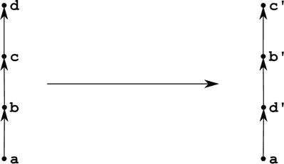

[图 8-5](#_Fig5) 。重新排序修订

解决办法

创建一个包含修订版本`a`、`b`、`c`和`d`的新存储库:

```
$ cd git-recipes
$ git init 08-05
$ cd 08-05
$ git simple-commit a b c d
```

命令`$ git log --oneline`现在返回以下输出:

```
cc595c7    d
7bb0fe3    c
b040c68    b
9dfe77d    a
```

修订顺序为`a`、`b`、`c`、`d`。最老的是`a`，最新的是`d`。

现在用`$ git rebase -i HEAD∼3`进行交互式重置基础。在这个命令之后，git 将用清单 8-5 中显示的内容启动 vim。将[清单 8-5](#list5) 中显示的内容替换为[清单 8-6](#list6) 中显示的代码。变化非常小:提交被重新排序。然后保存文件并关闭编辑器。

[***清单 8-5。***](#_list5)$ git rebase 后 vim 的原始内容-I HEAD∽3(提交顺序为 b，c，d)

```
pick b040c68    b
pick 7bb0fe3    c
pick cc595c7    d
```

[***清单 8-6。***](#_list6) 交互式改基时你应该在编辑器中输入的内容(提交顺序为 d、b、c)

```
p   cc595c7    d
p   b040c68    b
p   7bb0fe3    c
```

当您保存并关闭编辑器时，git 将执行重置。该操作完成后，使用`$ git log`命令检查您的修订顺序。`$ git log -oneline`的输出应该如下:

```
7bb0fe3    c
b040c68    b
cc595c7    d
9dfe77d    a
```

这些提交现在按`c`、`b`、`d`、`a`排序(从最新的到最早的)。

它是如何工作的

交互式重置基础的子命令`pick`可以缩写为`p`。通过更改编辑器中子命令的顺序，可以修改应用修补程序的顺序。重置基础根据补丁在编辑器窗口中的顺序应用补丁。清单 8-6 中的第一个子命令[，即`p-cc595c7-d`，定义了要应用的第一个补丁。因此，在生成的历史中，修订版`d`将出现在`a`之后。](#list6)

原始修订保留在数据库中，可以通过引用日志引用进行访问。

8-6.删除几个版本

问题

您的存储库包含几个修订版。最后五次修订被标记为`b`到`f`。您想要删除修订版`b`、`d`和`f`。图 8-6 中描述了您想要实现的转变。

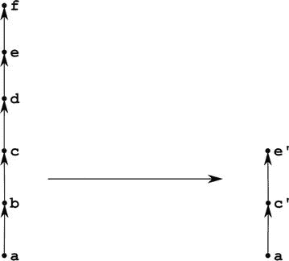

[图 8-6](#_Fig6) 。删除修订

解决办法

创建一个包含修订版`a`到`f`的新存储库:

```
$ cd git-recipes
$ git init 08-06
$ cd 08-06
$ git simple-commit a b c d e f
```

`$ git log --oneline`命令现在按以下顺序打印修订:

```
35cba5a     f
4932572     e
bb7f037     d
93b7397     c
9219566     b
17e5231     a
```

您希望从历史记录中删除一些提交。您要删除的最早提交是`b`。这是历史上第五次犯罪(`f`第一、`e`第二、`d`第三、`c`第四、`b`第五)。你需要的命令是`$ git rebase -i HEAD∼5`。这是一个交互式的重置基础，所以 git 将启动编辑器。交互式重设基础的原始子命令如清单 8-7 所示。用[清单 8-8](#list8) 中所示的子命令替换它们。最后保存文件并关闭编辑器。

[***清单 8-7。***](#_list7) 配方 8-6 中交互重置的原始子命令

```
pick 9219566 b
pick 93b7397 c
pick bb7f037 d
pick 4932572 e
pick 35cba5a f
```

[***清单 8-8。***](#_list8) 执行图 8-6 中[所示转换的命令](#Fig6)

```
pick 93b7397 c
pick 4932572 e
```

当您完成重置`$ git log --oneline`时，应打印:

```
4932572     e
93b7397     c
17e5231     a
```

它是如何工作的

如果从编辑器中删除一个子命令选择，那么相应的修订将不会出现在历史中。

8-7.编辑旧版本

问题

您的存储库包含许多修订。历史上的第三次修订被标记为`x`，它引入了一个新文件`x.txt`。现在你想重新编辑这个版本:它应该引入两个新文件`x.txt`和`y.txt`。你还想在提交`x`之后引入一个新的版本`z`。其他修订应保持不变。图 8-7 中显示了您想要实现的转换。

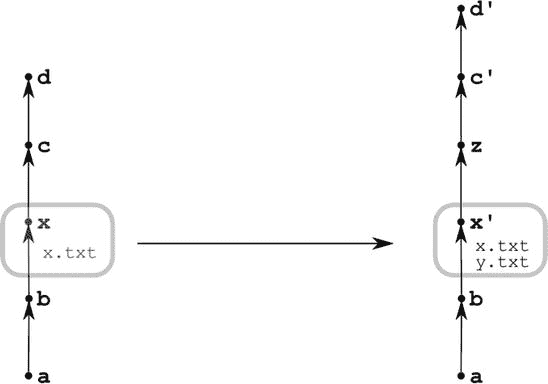

[图 8-7](#_Fig7) 。编辑旧版本

解决办法

创建一个包含修订版本`a`、`b`、`x`、`c`、`d`的新存储库:

```
$ cd git-recipes
$ git init 08-07
$ cd 08-07
$ git simple-commit a b x c d
```

并与`$ git rebase -i HEAD∼3`进行交互式重置基础。交互式重设基础的原始子命令如[清单 8-9](#list9) 所示。用清单 8-10 中的[子命令替换它们。你要把修改`x`的命令从`pick`改成`edit`。然后保存文件并关闭编辑器。](#list10)

[***清单 8-9。***](#_list9) 配方 8-7 中交互重置的原始子命令

```
pick 9aa7b18 x
pick 2455e82 c
pick f8bf7b5 d
```

[***清单 8-10。***](#_list10) 执行图 8-7 中[所示转换的命令](#Fig7)

```
edit 9aa7b18 x
pick 2455e82 c
pick f8bf7b5 d
```

重置基础过程在提交`x`时停止。您现在可以使用以下命令调整`x`提交:

```
$ echo y > y.txt
$ git add y.txt
$ git commit --amend --no-edit
```

当`x`提交被调整时，用`$ git simple-commit z`创建一个新的修订`z`。最后，用`$ git rebase --continue`完成重置。

它是如何工作的

交互式重置基础是作为一个迭代来实现的，该迭代循环通过[清单 8-10](#list10) 中所示的命令。这种迭代是在分离的磁头状态下进行的。当你关闭包含[清单 8-10](#list10) 所示子命令的编辑器时，git 进入分离状态并执行迭代。

清单 8-10 中的第一个子命令是`edit 9aa7b18 x`。该命令首先应用由`9aa7b18`标识的`x`版本定义的补丁，然后暂停重设基础。补丁`x`之后，你就处于分离的头部状态。如果你想验证，这运行命令`$ git status -sb`。您将看到以下输出:

```
## HEAD (no branch)
```

证明你现在是在超脱的头部状态下工作。bash 命令提示符:

```
gajdaw@GAJDAW /c/git-recipes/08-07 (master|REBASE-i 1/3)
```

打印您正在使用三个修补程序执行重置基础操作以及应用了第一个修补程序的信息。

如你所知，git 允许你用`$ git add`和`$ git commit`这样的命令在分离的头状态下工作。因此，您可以用`$ echo y > y.txt`创建一个新文件，用`$ git add y.txt`暂存它，最后用`$ git commit --amend --no-edit`修改当前提交。这就是`x`提交被修改的方式。如果您跳过`--no-edit`选项，那么 git 将启动编辑器，您将有机会修改修订版`x`的注释。

一旦您完成了`x`提交，您就可以继续创建版本`z`。完成后，你用`$ git rebase --continue`命令完成秘籍。

值得注意的是，当交互式重置基础暂停时，您可以用其他方法修改历史。您可以使用`$ git commit`插入额外的提交，或者使用`$ git reset`删除一些提交。但是，在完成第一个基础之前，您不能执行另一个交互式基础重建。

您可以使用`$ git rebase --abort`中止暂停的重置基础。若要撤消该操作，请使用 reflog。

8-8.恢复版本

问题

您的存储库包含任意数量的修订。其中一个提交在您的项目中引入了一个 bug。您希望以这样一种方式撤销由该提交引入的更改，即项目的历史直到当前头都保持不变。

你想要实现的转变在[图 8-8](#Fig8) 中给出。应恢复标有`b`的版本。修订版`c`之前的历史必须保持不变。该操作将通过创建一个标记为`Revert "b"`的附加版本来实现。这个新的提交恢复了由`b`引入的更改。

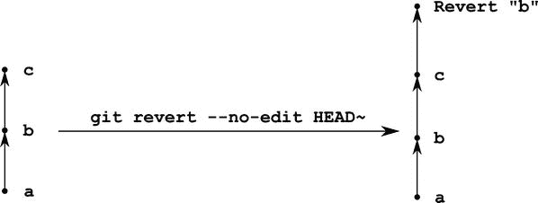

[图 8-8](#_Fig8) 。恢复修订

解决办法

创建一个包含修订版本`a`、`b`、`c`的新存储库:

```
$ cd git-recipes
$ git init 08-08
$ cd 08-08
$ git simple-commit a b c
```

然后执行`$ git revert --no-edit HEAD∼` 命令。

它是如何工作的

命令`$ git revert [REVISION]`创建一个新的修订版本，恢复由`[REVISION]`引入的更改。附加参数`--no-edit`将新版本的注释设置为`Revert "..."`。这是撤销已包含在项目公共历史中的修订的唯一方法。

8-9.正在恢复合并提交修订

问题

您在项目中使用两个分支:`master`和`feature`。分支出现分歧，你决定将`feature`分支合并为`master`分支。当你完成合并后，`feature`分支被删除。

过了一段时间，你意识到`feature` branch 引入了许多 bug 和严重的问题。因此，您希望将分支`feature`的合并恢复为`master`分支。

您想要实现的转换如图 8-9 所示。

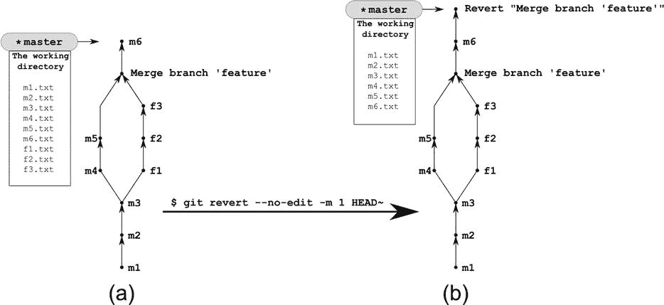

[图 8-9](#_Fig9) 。恢复合并提交

解决办法

使用以下命令创建如图 8-9(a) 中[所示的存储库](#Fig9):

```
$ cd git-recipes
$ git init 08-09
$ cd 08-09
$ git simple-commit m1 m2 m3
$ git checkout -b feature
$ git simple-commit f1 f2 f3
$ git checkout master
$ git simple-commit m4 m5
$ git merge feature
$ git branch -d feature
$ git simple-commit m6
```

用`$ git log --oneline --graph`命令验证你的库的历史看起来像图 8-9(a) 中的[。也可以用`$ ls`列出工作目录的内容。工作目录现在包含九个文件:`f1.txt`到`f3.txt`和`m1.txt`到`m6.txt`。](#Fig9)

当存储库准备就绪时，您可以使用以下命令恢复合并提交:

```
$ git revert --no-edit -m 1 HEAD∼
```

该命令将历史向前移动。存储库现在将包含一个带有注释`Revert "Merge branch 'feature'"`的新版本。这个修订删除了您在`feature`分支中创建的提交中引入的所有变更。工作目录现在只包含六个文件`m1.txt`到`m6.txt`。文件`f1.txt`、`f2.txt`、`f3.txt`都没了。您可以使用`$ ls`命令来验证它。

它是如何工作的

合并提交有两个或多个父提交。如果您恢复合并提交，您必须指出应该恢复历史的哪一部分。在[图 8-9](#Fig9) 中标为`Merge branch`’`feature`的提交有两个父级:

*   第一个是提交`m5`
*   第二个父节点是提交节点`f3`

恢复`Merge branch` ' `feature`'提交 可以产生由修订组成的快照:

```
m1, m2, m3, m4, m5, m6
```

或由修订组成的快照:

```
m1, m2, m3, f1, f2, f3, m6
```

决定权在你。您通过传递给`$ git revert`命令的附加参数`-m`做出决定。如果你想把历史保存在合并提交的第一个父项下，那么使用`-m 1`参数，比如:

```
$ git revert --no-edit -m 1 HEAD∼
```

上述命令将产生由`m1`、`m2`、`m3`、`m4`、`m5`、`m6`修订组成的快照。这种情况如图 8-10 中的[所示。](#Fig10)

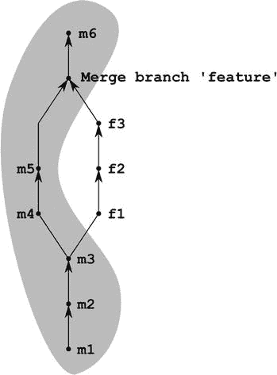

[图 8-10](#_Fig10) 。用$ git revert - no-edit -m 1 HEAD 获得的快照

如果你想把历史保存在合并提交的第二个父项下，那么使用`-m 2`参数，比如:

```
$ git revert --no-edit -m 2 HEAD∼
```

该命令产生由修订版 `m1`、`m2`、`m3`、`f1`、`f2`、`f3`、`m6`组成的快照。这种情况如图 8-11 所示。

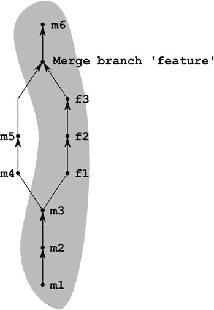

[图 8-11](#_Fig11) 。用$ git revert - no-edit -m 2 HEAD 获得的快照

如果您忘记指出想要保留的分支，git 将拒绝恢复合并提交。该命令将无法生成以下消息:

```
error: Commit XXXXXX is a merge but no -m option was given.
fatal: revert failed
```

8-10.摘樱桃修订版

问题

您想要将修订从一个分支复制到另一个分支。图 8-12 中的[展示了您心目中的转变。您的`master`分支包含一个标记为`m4`的修订。你要把它复制到`feature`分公司。](#Fig12)

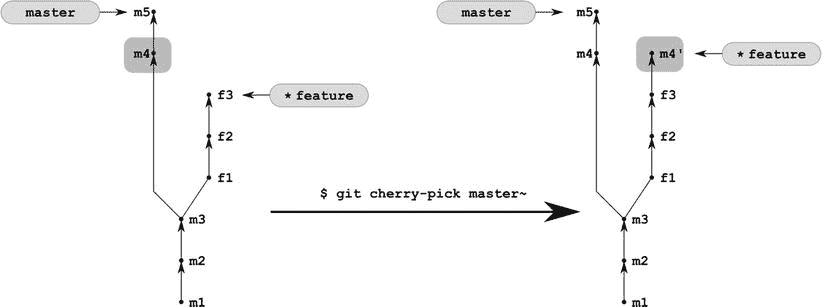

[图 8-12](#_Fig12) 。精心挑选的修订

解决办法

从配方 6-4 克隆存储库:

```
$ cd git-recipes
$ git clone-with-branches 06-04 08-10
$ cd 08-10
```

然后用`$ git checkout feature`转到特征分支，用`$ git cherry-pick master∼`复制修订`m4`。

它是如何工作的

`$ git cherry-pick`命令将修订版定义的补丁作为参数应用到当前分支。

8-11.挤压一根树枝

问题

您刚刚完成了一项新功能的工作。您的工作由存储在专用分支中的三个提交组成。您想要压缩这些提交，并将它们作为一个新的提交添加到您的`master`分支之上。

该任务在[图 8-13](#Fig13) 中给出。`feature`分支包含三个版本`f1`、`f2`和`f3`。你想把它们压缩成一个单独的版本，出现在`master`分支中。

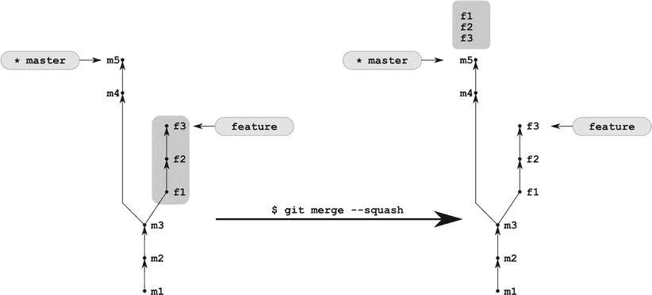

[图 8-13](#_Fig13) 。压断树枝

解决办法

从配方 6-4 克隆存储库:

```
$ cd git-recipes
$ git clone-with-branches 06-04 08-11
$ cd 08-11
```

接下来用`$ git merge --squash feature`挤压特征分支。最后，用`$ git commit -m "The feature branch was squashed"`提交变更。

它是如何工作的

操作`$ git merge --squash feature`修改工作目录和储存库的暂存区，复制在`feature`分支中引入的变更。就在这个命令之后`$ git status -sb`打印出来:

```
A  f1.txt
A  f2.txt
A  f3.txt
```

这意味着:

*   工作目录包含来自特征分支的所有变更
*   所有的变化都已经上演了

如果你真的对这个修改满意，你可以用`$ git commit`命令提交它们。

8-12.重新使用恢复的分支

问题

处理项目时，您将创建一个名为 feature 的分支，其中包含许多修订。feature 分支中的所有代码看起来都是正确的，您将它合并到主分支中，形成一个灯泡。碰巧这个分支机构引起了许多问题。因此，您决定使用方法 8-9 中解释的过程来恢复合并提交。

您的项目的工作继续进行，主分支继续前进。一段时间后，您希望再次合并已恢复的特征分支。您想要实现的操作如[图 8-14](#Fig14) 所示。

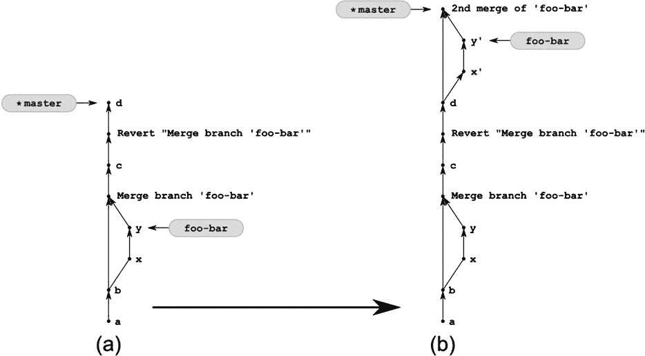

[图 8-14](#_Fig14) 。配方 8-12 将储存库(a)转换成储存库(b)

解决办法

创建新的存储库:

```
$ cd git-recipes
$ git init 08-12
$ cd 08-12
```

并创建[图 8-14(a)](#Fig14) 所示的存储库。使用以下命令:

```
$ git simple-commit a b
$ git checkout -b foo-bar
$ git simple-commit x y
$ git checkout master
$ git merge --no-ff foo-bar
$ git simple-commit c
$ git revert -m 1 --no-edit HEAD∼
$ git simple-commit d
```

使用`$ ls`命令你可以验证工作目录不包含文件`x.txt`和`y.txt`。至此`foo-bar`分支成功还原。

你的项目的历史向前推进了。revert 命令后创建了版本`d`。现在您想将`foo-bar`分支重新合并到主分支中。为此，请运行以下命令:

```
$ git format-patch foo-bar∼2..foo-bar
$ git checkout -b foo-bar-tmp
$ git am *.patch
$ rm *.patch
$ git branch -M foo-bar-tmp foo-bar
$ git checkout master
$ git merge --no-ff -m "2nd merge of 'foo-bar'" foo-bar
```

存储库应该看起来像[图 8-14(b)](#Fig14) 。您可以使用`$ git log --graph --oneline --all --decorate`命令来验证这一点。工作目录包含文件`x.txt`和`y.txt`。

它是如何工作的

当你的库看起来像图 8-14(a) 中的库时，命令:

```
$ git rebase master foo-bar
```

将不执行重置基础操作。它只会将 foo-bar 分支快进到 master 分支指向的修订。如果你想强制重置基准，你必须使用`$ git format-patch`和`$ git am`命令手动重置。

foo-bar 分支中的修订可通过范围说明符`foo-bar∼2..foo-bar`获得。命令:

```
$ git log --oneline foo-bar∼2..foo-bar
```

列出了两个版本`x`和`y`。为了创建这些修订版的补丁，我们使用:

```
$ git format-patch foo-bar∼2..foo-bar
```

接下来，我们创建一个新的临时分支，名为 foo-bar-tmp:

```
$ git checkout -b foo-bar-tmp
```

并在其中应用补丁:

```
$ git am *.patch
```

不再需要修补程序，因此您可以使用以下命令删除它们:

```
$ rm *.patch
```

然后，将临时分支 foo-bar-tmp 重命名为原来的名称 foo-bar:

```
$ git branch -M foo-bar-tmp foo-bar
```

当分支 foo-bar 准备就绪时，您可以进入主分支:

```
$ git checkout master
```

并再次合并 foo-bar 分支:

```
$ git merge --no-ff -m "2nd merge of 'foo-bar'" foo-bar
```

摘要

前两章介绍了合并和重定基——这两种操作使修订图的结构变得复杂。在第 8 章中，我们更加关注修订图，考虑了多种方法来转换其结构。我确信你会发现这里讨论的许多秘籍在你的日常工作中很有用。

这里介绍的所有配方都强调了修订的性质。让我再次提醒你:修订不会改变。一旦创建，就不能修改。你所能做的就是创建新的修订版，在某些方面与原版相似。这条规则构成了各种撤消操作的基础。如果你想在 git 中撤销某些东西，你必须在开始操作之前寻找 HEAD 指向的修订。如果你知道它的名字，那么`$ git reset --hard [REVISION]`会撤销操作。

本章要记住的第二件重要的事情涉及到存储库的三个方面:

*   工作目录
*   集结地
*   和您当前的分支(即由 HEAD 指向的修订)

它们中的每一个都定义了项目中文件的快照。您可以使用文件系统命令修改工作目录中存储的快照，例如`$ rm`、`$ cp`、`$ echo foo > bar`等等。使用 git 命令修改暂存区中存储的快照，如`$ git add`、`$ git rm`、`$ gim mv`等。最后，可以用`$ git commit`命令修改 HEAD 指向的版本中存储的快照。

使用这三个快照，您可以将由`$ git status -sb`返回的两个字母状态代码解释为:

*   代码的第一个字母比较了磁头快照和转移区:

*   空格表示存储在磁头快照和转移区中的文件是相同的
*   任何其他字符都表示存储在磁头快照中的文件不同于暂存区中的文件

*   代码的第二个字母比较了临时区域和工作目录

*   空格表示存储在临时区域中的文件和存储在工作目录中的文件是相同的
*   任何其他字符都表示存储在登台区的文件不同于存储在工作目录中的文件

本章还阐明了作者身份的概念以及 git 处理日期的方式。每个提交存储四个不同的属性:`Author`、`Commit`、`AuthorDate`、`CommitDate. Author`、`Commit`保存在提交中引入的代码作者的身份(`Author`属性)，以及在项目历史中引入提交的人的身份(`Commit`属性)。如你所知，当你执行`$ git commit`命令时`Author`被设置(没有`--amend`参数)。当您使用`$ git commit --amend`或`$ git cherry-pick`、`$ git rebase`修改提交时，git 只改变提交者的用户名——作者身份保持不变。请注意，当您压缩一些提交时，没有办法保留原始作者。被挤压的提交将归因于第一个提交的作者。

其他属性`AuthorDate`和`CommitDate`是时间戳。第一个存储创作提交时的信息，第二个存储历史中引入提交时的信息。Git 不关心或存储任何其他日期。特别是，git 操作不受文件系统中存储的修改日期的影响。如果您:

*   下午 5 点提交
*   在下午 5:10 创建、编辑并保存文件`a.txt`
*   在下午 5:20 创建、编辑并保存文件`b.txt`
*   下午 5:30 提交

then your repository will contain two commits. The first will contain the timestamp 5:00 p.m. The second revision will be denoted as created at 5:30\. There is nothing in between. The information that your files were modified at 5:10 and at 5:20 is lost—git doesn’t track it.

介绍的秘籍中有四个使用了交互式的重新基础。你应该非常仔细地分析它们，尤其是配方 8-7。即使你不打算用它的方式提出。在冲突的情况下，重定基础将被暂停——这就是配方 8-7 特别重要的原因。一旦你知道如何用配方 8-7 编辑旧版本，你将更容易解决冲突。

 **注意**请注意，本章中的配方在用于修改已与他人共享的修订时会导致严重的问题。您只能使用配方 8-8 和 8-9 中的`$ git revert`命令来修改已发布的修订。所有其他配方只能用于没有发送到共享存储库的修订。记住:你的存储库的公共历史只能向前发展。否则，在团队内部同步工作将会非常困难和麻烦。