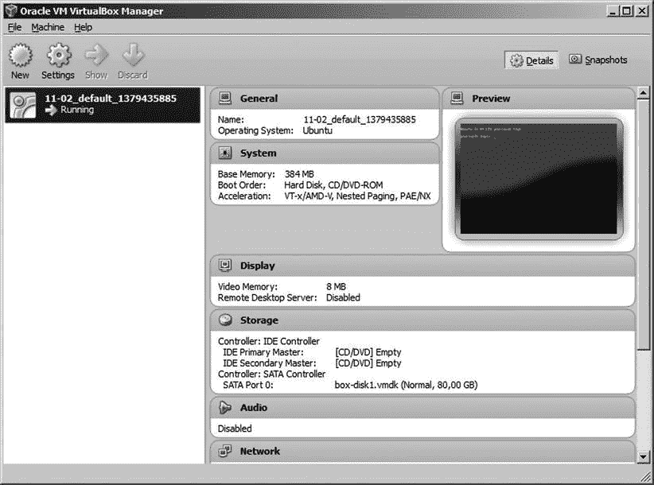
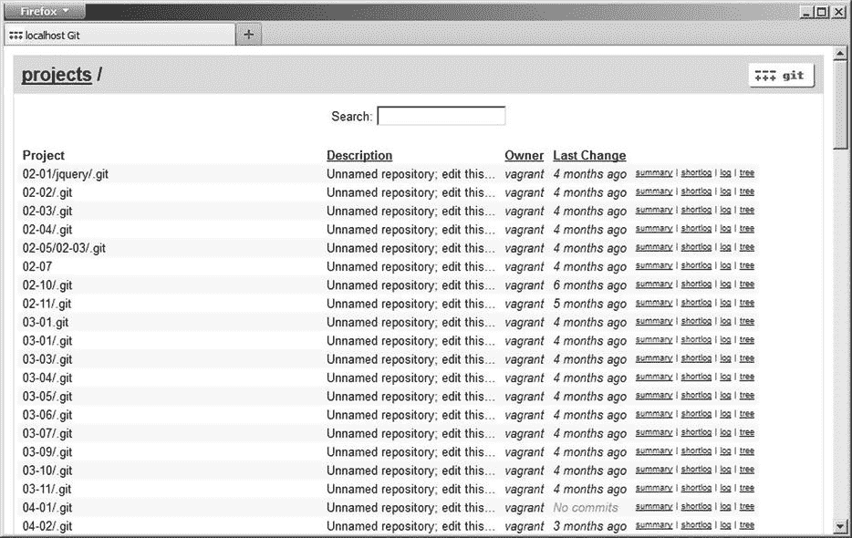
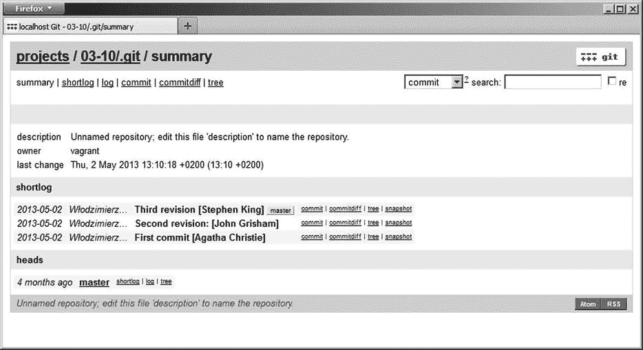
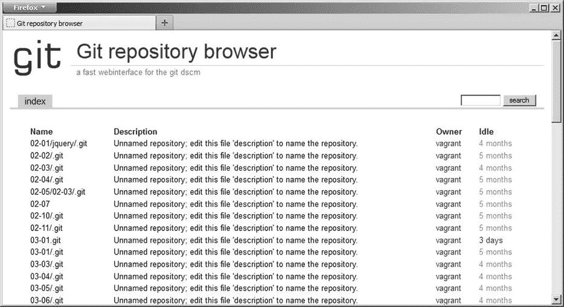
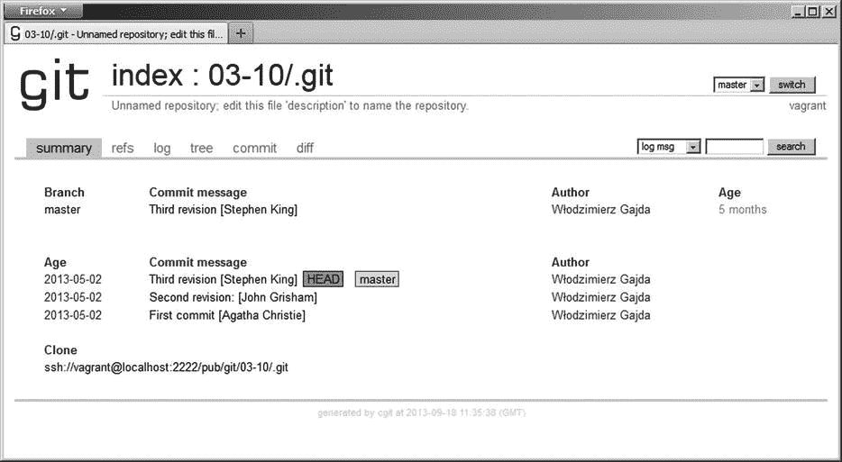

第十一章


托管 git Git 存储库

一旦你和你的同事们学会了如何提交、使用分支和远程操作，你就会想把 git 作为一个团队来使用。在这一章中，我将展示如何建立一个虚拟主机来与他人共享 git 库。

Git 可以使用 ssh、http、https 和 git 网络协议。要选择满足您需求的最佳解决方案，您必须回答两个问题:

*   您是否希望托管仅对经过身份验证的用户具有读/写访问权限(即没有匿名公共访问权限)的存储库？
*   是否希望托管具有匿名公共只读访问权限的存储库？

如果您只想为经过身份验证的用户托管存储库，那么 ssh 是最佳选择。如果你想允许匿名只读访问，你可以使用本地 git 协议或 http。如果您需要匿名和带身份验证的两种类型的访问，您可以组合两种或更多的协议。例如，您可以使用 ssh 来认证用户，使用 git 协议进行匿名访问。表 11-1 展示了 ssh、http、https 和 git 协议的基本属性。

[表 11-1](#_Tab1) 。ssh、http、https 和 git 协议的属性

| 

草案

 | 

只读访问:

不需要认证

 | 

读/写权限:

仅授权用户

 |
| --- | --- | --- |
| 嘘 | 不 | 是 |
| 超文本传送协议（Hyper Text Transport Protocol 的缩写） | 是 | 不 |
| 安全超文本传输协议 | 是 | 是 |
| 饭桶 | 是 | 不 |

本章中的菜谱包含了详细的教程，展示了如何通过 ssh、http 和 git 托管存储库。因为我真的认为 ssh 是最重要的解决方案，所以我们将深入研究关于这个协议的细节。我不仅会向您提供 ssh 如何认证用户的一般信息，还会解释以下内容:

*   生成 RSA 密钥
*   使用授权密钥文件
*   用∽/配置 ssh。ssh/配置文件

虽然这些知识和 git 没有严格的关系，但是和 ssh 有关系，我真的相信你会需要的。正如我已经解释过的，ssh 是私有存储库的最佳解决方案。你对宋承宪越有信心越好。

对于那些需要匿名访问存储库的人，我们将同时使用 http 和 git 协议。如果效率是您关心的问题之一，那么您应该使用 git 本地协议。

短语“通过 http 托管 git 存储库”指的是允许通过 http 连接执行 git 获取和 git 克隆操作。为这样的存储库使用 web 浏览器是没有用的:您将获得工作目录和。git 存储库。如果您想使用 web 浏览器检查存储库，您需要 web 应用程序。我将向您展示两个最流行的解决方案:gitweb 和 cgit。 Gitweb 是由 git 创建者开发的 Perl 脚本，包含在 git 源代码中。Cgit 是用 C 写的，被认为是 git 最快的 CGI 应用。cgit 的另一个优点是它允许您添加一个 URL 来克隆一个存储库。

最后两个方案涉及特权问题。当您通过 ssh 托管 git 存储库时，经过身份验证的用户将获得对所有存储库的完全访问权。git 或 ssh 中都没有内置的支持来限制访问。如果要授予对以下内容的访问权限:

*   基于每个用户
*   基于每个存储库
*   基于每个分支机构(一般:每个参考)

你需要吉托利特。Gitolite 是 git 之上的一个附加层，由 ssh 托管。这一层允许您授予或撤销三种类型的权限:读、写和强制写。可以为任意用户分配任意存储库和任意分支的所有权限。

我计划这本书是一个动手实践的介绍。关于托管 git 存储库的方法可能会导致许多令人头疼的问题。哪一个是合适的工作平台？如何准备在不同系统上没有任何缺陷的食谱？如何避免弄乱你目前工作的系统？如果您没有任何机器的 root 访问权限，该怎么办？为了避免这些问题，我决定使用虚拟系统。在我看来，这是实践操作系统管理的最佳方式。因此，你将能够完全按照食谱所写的去做，如果出了问题，你的系统也不会受到影响。我认为仅仅这两个优点就足以成为使用虚拟系统的理由。

设置虚拟机最简单的方法是使用 VirtualBox 和 vagger。本章的前两个食谱给你必要的介绍。

11-1.安装 VirtualBox 和流浪者

问题

你想在你的机器上安装 VirtualBox 和 vagger。

解决办法

1.  启动您的网络浏览器，访问`https://www.virtualbox.org/wiki/Downloads`并下载适用于您平台的 VirtualBox 4.2.18。
2.  在您的计算机上安装 VirtualBox 4.2.18 软件包。您可以保留所有选项的默认值。
3.  访问`http://downloads.vagrantup.com`并为您的平台下载流浪者 1.3.1。
4.  使用默认设置在您的计算机上安装 vagger 1 . 3 . 1。
5.  启动命令行并执行

    ```
    $ vagrant --version
    ```

如果安装了 vagger 并准备运行，这个命令将打印它的版本号。

它是如何工作的

VirtualBox 和 vagger 都提供了易于理解的安装程序。在撰写本文时，最新的可用版本是 VirtualBox 的 4.2.18 和 Vagrant 的 1.3.1。你可以在阅读本章时尝试最新版本的食谱。如果 vagger 的配置格式发生了变化，您可以随时切换回我使用的版本。

11-2.运行虚拟 Linux

问题

你想在你的电脑上运行虚拟的 Ubuntu Linux。

解决办法

创建一个新目录 ,包含:

```
# Host OS (e.g., Windows, Linux, OS X)
$ cd git-recipes
$ mkdir 11-02
$ cd 11-02
```

现在，在当前文件夹中初始化新的虚拟机配置:

```
# Host OS (e.g., Windows, Linux, OS X)
$ vagrant init precise32 http://files.vagrantup.com/precise32.box
```

虚拟系统已经准备好启动。使用以下命令启动虚拟 Linux:

```
# Host OS (e.g., Windows, Linux, OS X)
$ vagrant up
```

首次运行此命令时，需要一段时间才能完成。那是因为流浪汉会下载差不多用了 300 MB 的镜像文件。该文件将存储在:

```
# Unix-like systems
∼/.vagrant.d/boxes/precise32

# Windows
C:\Users\[username]\.vagrant.d\boxes\precise32
```

该操作在虚拟系统第一次启动时只执行一次。

当`$ vagrant up` 完成后，你将拥有一个完全成熟的 Linux 系统作为应用程序之一运行在你的机器上。命令:

```
# Host OS (e.g., Windows, Linux, OS X)
$ vagrant status
```

将虚拟机的状态输出为:

```
default                   running (virtualbox)
```

虚拟系统不提供用户界面。您可以使用 ssh 会话来访问该系统并在其中工作，就像您访问任何其他 Linux 主机一样。要打开虚拟机的 ssh 会话，请运行以下命令:

```
# Host OS (e.g., Windows, Linux, OS X)
$ vagrant ssh
```

当`$ vagrant ssh`命令成功时，您将拥有 shell 访问主机存储库:运行虚拟 Linux :shell 访问虚拟系统。例如，您可以使用以下命令检查系统版本:

```
# Guest OS (Ubuntu 12.04)
$ uname -a
```

或者列出已登录的用户:

```
# Guest OS (Ubuntu 12.04)
$ who
```

之后，您可以使用以下命令关闭 ssh 会话:

```
# Guest OS (Ubuntu 12.04)
$ exit
```

并使用以下命令检查虚拟机的状态:

```
# Host OS (e.g., Windows, Linux, OS X)
$ vagrant status
```

如您所见，虚拟系统仍在运行。关闭 ssh 会话不会影响虚拟系统的状态。

最后，使用以下命令停止虚拟机:

```
# Host OS (e.g., Windows, Linux, OS X)
$ vagrant halt
```

这个命令关闭系统。当系统关闭时，命令:

```
# Host OS (e.g., Windows, Linux, OS X)
$ vagrant status
```

印刷品:

```
default                   poweroff (virtualbox)
```

您可以使用`$ vagrant up`命令再次启动它。

在继续下一个配方之前，你必须记住暂停当前配方中的虚拟系统。如果您不记得当前运行的虚拟机所在的文件夹，您可以使用 VirtualBox。[图 11-1](#Fig1) 展示了 VirtualBox 的主窗口。使用`Machine/Close/Power off`主菜单选项，您可以关闭所有可用的虚拟机。



[图 11-1](#_Fig1) 。VirtualBox 的主窗口列出了 所有可用的虚拟机

 **注意**在你开始下一个配方之前，我建议你关闭当前配方的虚拟机。您可以使用`$ vagrant halt`命令。原因在“如果启动两个虚拟机会发生什么？”一节的方法 11-6 中有解释

它是如何工作的

命令:

```
$ vagrant init precise32 http://files.vagrantup.com/precise32.box
```

创建名为`Vagrantfile`的配置文件，如清单 11-1 中的[所示。](#list1)

[***清单 11-1。***](#_list1) 默认流浪文件的内容 文件无注释

```
VAGRANTFILE_API_VERSION = "2"
Vagrant.configure(VAGRANTFILE_API_VERSION) do |config|
  config.vm.box = "precise32"
  config.vm.box_url = " http://files.vagrantup.com/precise32.box "
end
```

 **注意**由`$ vagrant init`命令创建的原始文件包含大量注释。他们以`#`开头。清单 11-1 显示了`Vagrantfile`的内容，去掉了所有的注释。

条目:

```
config.vm.box_url = " http://files.vagrantup.com/precise32.box "
```

将虚拟系统的基本框设置为`http://files.vagrantup.com/precise32.box`。precise32.box 文件包含 Ubuntu 12.04 LTS 32 位版本。运行后:

```
$ vagrant up
```

您的机器上将运行 Ubuntu 12.04 虚拟机。

 **提示**在`http://www.vagrantbox.es`可以获得大量的流浪者箱子。在那里你会发现 CentOS，Debian，Gentoo，OpenBSD，等等。通过更改基本框，您将更改虚拟机运行的操作系统。

因为虚拟系统不提供用户界面，所以我们将使用安全外壳(SSH) 来访问虚拟机。

现在，你的电脑运行两个操作系统。原系统称为*主机系统**，虚拟系统称为*客户系统* 。例如，如果您在 Windows 下工作:*

 **   Windows 是你的主机系统。
*   Ubuntu Linux 12.4 是你的访客系统。

前几章中发出的所有命令都是由您的主机操作系统的外壳执行的。从菜谱 11-2 开始，我们将使用两个命令行:一个用于主机操作系统，另一个用于客户操作系统。为了使说明更加清晰，我使用了以下注释:

```
# Host OS (e.g., Windows, Linux, OS X)
$ command ...

# Guest OS (Ubuntu 12.04)
$ command ...
```

它们解释了每个命令应该使用哪个命令行。

启动、停止和销毁 虚拟 Linux

vagger 提供了以下命令来控制虚拟机的状态:

```
# Host OS (e.g., Windows, Linux, OS X)
$ vagrant status
$ vagrant up
$ vagrant suspend
$ vagrant resume
$ vagrant halt
$ vagrant destroy
```

第一个命令`$ vagrant status`，返回关于虚拟机的信息。

`$ vagrant up`命令引导虚拟机。

下一个命令`$ vagrant suspend`，将系统以当前状态保存在硬盘上。当您挂起虚拟系统时，它不会消耗 RAM 或处理器。唤醒暂停系统的过程是通过`$ vagrant resume`或`$ vagrant up`命令完成的。

`$ vagrant halt`命令关闭虚拟机。下次用`$ vagrant up`启动虚拟机时，系统将重新启动。

`$ vagrant destroy`命令永久删除虚拟机。下次运行`$ vagrant up`时，将从头开始创建虚拟机。这意味着您在之前的 ssh 会话中创建的所有文件都将被删除。

如果您目前已经完成了虚拟系统，但是您认为将来可能需要它，那么您应该使用`$ vagrant suspend`命令。在执行了`$ vagrant suspend`命令之后，虚拟系统不会消耗你的计算机资源，比如 RAM 或者处理器。系统存储在文件系统中，直到下一个`$ vagrant resume`或`$ vagrant up`命令。请记住，唤醒被`$ vagrant suspend`挂起的虚拟系统的过程是恢复虚拟系统的最快方法。

如果你想重新开始，那么使用`$ vagrant destroy`命令。

虚拟机的状态

在任何给定时间，虚拟机都可能处于以下状态之一:

*   未创建
*   运转
*   获救的
*   关闭电源

第一个状态由`$ vagrant status`命令返回:

```
default                   not created (virtualbox)
```

机器处于以下状态:

*   就在`$ vagrant init`之后和`$ vagrant up`之前
*   在`$ vagrant destroy`之后

第二种状态由`$ vagrant status`命令描述为:

```
default                   running (virtualbox)
```

这是成功执行`$ vagrant up`命令后机器的状态。

下一个状态——表示为已保存——由`$ vagrant status`命令返回:

```
default                   saved (virtualbox)
```

这是执行`$ vagrant suspend`命令后的状态。

最后一个状态——电源关闭——由`$ vagrant status`命令返回，如下所示:

```
default                   poweroff (virtualbox)
```

这是虚拟机在`$ vagrant halt`命令后进入的状态。

VirtualBox 显示的图标清楚地显示了每个虚拟机的状态。图 11-1 中[可见的虚拟机用标有`running`的绿色箭头表示。](#Fig1)

 **提示**不要使用`$ sudo shutdown -h now`或任何其他类似的命令来关闭虚拟系统。该命令将系统从运行状态转换为未创建状态。`$ sudo shutdown -h now`的结果与`$ vagrant destroy`相同。

打开到虚拟主机 的 SSH 会话

您可以使用 SSH 通过以下方式访问虚拟系统:

```
# Host OS (e.g., Windows, Linux, OS X)
$ vagrant ssh
```

此命令使用下列设置运行 ssh 客户端:

```
# Host OS (e.g., Windows, Linux, OS X)
$ vagrant ssh-config
```

您还可以使用任何其他 ssh 客户机来访问虚拟系统。它可以是您的 shell 中提供的一个典型的 ssh 客户端。您可以运行:

```
# Host OS (e.g., Windows, Linux, OS X)
$ ssh -p2222 vagrant@127.0.0.1
```

并使用以下凭据:

```
username: vagrant
password: vagrant
```

现在，你需要使用密码。稍后，在食谱 11-5 中，我将告诉你如何避免使用 RSA 密钥输入密码。在那里，您还将学习如何配置您的 SSH 客户端。

访问 root 用户的帐户

默认情况下，虚拟机中的 root 帐户是锁定的。要访问它，你需要运行`$ sudo su`命令。您也可以通过以下步骤解锁帐户:

1.  使用

    ```
    # Guest OS (Ubuntu 12.04)
    $ sudo passwd root
    ```

    为 root 用户设置新密码
2.  使用

    ```
    # Guest OS (Ubuntu 12.04)
    $ sudo passwd -u root
    ```

    解锁 root 用户的帐户
3.  使用

    ```
    # Guest OS (Ubuntu 12.04)
    $ su
    ```

    切换到 root 用户的帐户

您必须在 ssh 会话中运行以上所有命令，如`# Guest OS (Ubuntu 12.04)`注释所示。

同步文件夹

主机操作系统中带有`Vagrantfile`的文件夹(在菜谱 11-2 中是`git-recipes/11-02`)在客户操作系统中以`/vagrant`的形式存在。这意味着您可以在两个系统之间共享文件。在主机操作系统中创建的文件:

```
# Host OS (e.g., Windows, Linux, OS X)
git-recipes/11-02/lorem.txt
```

在客户操作系统中以下列名称提供:

```
# Guest OS (Ubuntu 12.04)
/vagrant/lorem.txt
```

您可以通过以下步骤进行验证:

1.  使用

    ```
    # Host OS (e.g., Windows, Linux, OS X)
    $ vagrant up
    ```

    启动虚拟机
2.  用

    ```
    # Host OS (e.g., Windows, Linux, OS X)
    $ echo lorem > lorem.txt
    ```

    在主机系统中创建文件
3.  使用

    ```
    # Host OS (e.g., Windows, Linux, OS X)
    $ vagrant ssh
    ```

    打开 SSH 会话
4.  List the contents of `/vagrant` directory with:

    ```
    # Guest OS (Ubuntu 12.04)
    $ ls /vagrant
    ```

    如您所见，文件`/vagrant/lorem.txt`在 ssh 会话中是可用的。

5.  接下来，用

    ```
    # Guest OS (Ubuntu 12.04)
    $ cat /vagrant/lorem.txt
    ```

    检查`/vagrant/lorem.txt`文件的内容
6.  使用:

    ```
    # Guest OS (Ubuntu 12.04)
    $ echo ipsum > /vagrant/ipsum.txt
    ```

    在 ssh 会话中创建一个文件
7.  使用

    ```
    # Guest OS (Ubuntu 12.04)
    $ exit
    ```

    关闭 ssh 会话
8.  List the files in the `git-recipes/11-02` directory with:

    ```
    # Host OS (e.g., Windows, Linux, OS X)
    $ ls
    ```

    文件`ipsum.txt`在您的主机操作系统中可用。

9.  用

    ```
    # Host OS (e.g., Windows, Linux, OS X)
    $ cat ipsum.txt
    ```

    检查`git-recipes/11-02/ipsum.txt`文件的内容
10.  使用

    ```
    # Host OS (e.g., Windows, Linux, OS X)
    $ vagrant halt
    ```

    停止虚拟系统

正如你所看到的，这两个文件`lorem.txt`和`ipsum.txt`在你的主机操作系统(比如 Windows)和客户操作系统(比如 Ubuntu 12.04)中都是可用的。这是在两个系统之间共享文件的最简单的方法。稍后我们还将使用`$ scp`命令在两个系统之间复制文件。

如果您想同步不同的文件夹，您可以在`Vagrantfile`中使用以下配置:

```
config.vm.synced_folder [HOST-PATH], [GUEST-PATH]
```

第一个目录是主机操作系统上的路径。它可以是绝对的，也可以是相对于带有`Vagrantfile`的目录，但它必须在启动时存在。第二条路径是在客户操作系统上。必须是绝对的。如果在启动过程中来宾路径不存在，将会创建一个。

以下是 Windows 的示例:

```
config.vm.synced_folder "c:\\some-dir-on\\windows", "/some-dir-on/virtual/ubuntu"
```

对于 Linux:

```
config.vm.synced_folder "/some-dir-on/Linux", "/some-dir-on/virtual/ubuntu"
```

11-3.在虚拟机上编译 git

问题

您希望在虚拟 Ubuntu Linux 上编译并安装最新版本的 git。编译 git 源代码的能力在以下情况下非常有用:

*   使用最新的 git 版本工作
*   编译依赖 git 的外部应用程序，如 cgit
*   为 git 项目做贡献

解决办法

1.  启动虚拟机:

    ```
    # Host OS (e.g., Windows, Linux, OS X)
    $ cd git-recipes
    $ mkdir 11-03
    $ cd 11-03
    $ vagrant init precise32 http://files.vagrantup.com/precise32.box
    $ vagrant up
    $ vagrant ssh
    ```

2.  从 Ubuntu 可用的二进制包安装 git:

    ```
    # Guest OS (Ubuntu 12.04)
    $ git --version
    $ sudo apt-get install -y git
    $ git --version
    ```

3.  编译并安装来自源代码的 git:

    ```
    # Guest OS (Ubuntu 12.04)
    $ sudo apt-get update -y
    $ sudo apt-get install -y make libssl-dev libz-dev gettext libexpat1-dev libcurl4-openssl-dev
    $ git clone --depth 1 git://git.kernel.org/pub/scm/git/git.git
    $ cd git
    $ make prefix=/usr all
    $ sudo make prefix=/usr install
    $ git --version
    ```

4.  完成食谱:

    ```
    # Guest OS (Ubuntu 12.04)
    $ exit

    # Host OS (e.g., Windows, Linux, OS X)
    $ vagrant halt
    ```

它是如何工作的

为了编译 git，我们需要下载它的源代码，您可能会猜到，可以在 git 存储库中找到。因此，我们需要一个 git 客户端。

默认情况下，git 不使用 precise32 框安装在虚拟机上。您可以使用`$ git --version`命令来验证它。要安装它，你必须启动虚拟机并运行`$ sudo apt-get install -y git`命令。这个命令从 Ubuntu 可用的二进制包中安装 git。当发出不带`-y`的命令时，`$ sudo apt-get install`命令通常会在需要安装额外的软件包时要求确认。`-y`选项强迫对所有这些类型的问题给出肯定的答案。

要编译最新版本的 git，您必须:

*   更新系统依赖关系。这是通过

    ```
    $ sudo apt-get update -y
    ```

    完成的
*   安装 git 所需的所有必要的库和工具。执行此操作的命令是:

    ```
    $ sudo apt-get install -y make libssl-dev libz-dev gettext libexpat1-dev libcurl4-openssl-dev
    ```

*   使用 git 克隆最新版本的 git 源代码:

    ```
    $ git clone --depth 1 git://git.kernel.org/pub/scm/git/git.git
    ```

*   并执行编译源代码和安装 git 的命令:

    ```
    $ cd git
    $ make prefix=/usr all
    $ sudo make prefix=/usr install
    ```

完成后，您将在虚拟机上安装最新版本的 git。您可以通过以下方式验证这一点:

```
$ git --version
```

 **提示**如果你愿意，你也可以为刚刚安装的版本生成文档。您可以使用以下两个命令来实现这一点:`$ sudo apt-get install -y asciidoc`和`$ sudo make prefix=/usr install-doc`。然而，安装 asciidoc 将花费大量时间，因为它会安装 TeX 和 LaTeX 等。

Git 源托管在`http://git.kernel.org/cgit/git/git.git`。你会发现这个网站的很多镜像，比如`https://github.com/git/git`。但是最新的版本总是可以在 kernel.org 和其他网站上找到。

我使用了`--depth 1`参数进行克隆:

```
$ git clone --depth 1 git://git.kernel.org/pub/scm/git/git.git
```

上面的命令创建了一个所谓的*浅知识库*。存储库的历史被截断为给定数量的最新修订。如果您只需要签出最新的修订版，浅层克隆就可以了。你仍然可以在这个库中提交，但是你必须像我们在方法 7-2 中所做的那样把你的提交作为补丁发送。您不能使用浅层存储库进行克隆、提取或推送。使用浅层存储库的主要优点是克隆速度更快。

 **提示**请注意，`http://git.kernel.org/cgit/git/git.git`站点由 cgit 提供支持。我将在菜谱 11-9 中向您展示如何使用 cgit 来托管存储库。

当你完成食谱时，不要破坏虚拟机。如果您销毁虚拟机，您将不得不重复完整的过程，包括安装所有软件包和克隆 git 源。如果你用`$ vagrant suspend`暂停虚拟机或者用`$ vagrant halt`关机，那么下一次你用`$ vagrant up`启动机器时，这个程序中安装的所有软件都将可用。

11-4.通过 ssh 托管 git 存储库

问题

您想要设置一个主机，用于在您的公司内部共享 git 存储库。你的任务是:

*   设置一个虚拟机来托管 git 存储库
*   在虚拟主机上安装在方法 3-1 中创建的存储库，以便每个开发人员都可以使用该存储库进行克隆、获取和推送
*   通过提交和推送存储在虚拟系统中的远程存储库来检查一切是否按预期工作

 **提示**有了这个方法，即使你不能访问 root 帐户，你也可以托管私有的 git 库。例如，您可以将这种方法用于虚拟共享主机。

解决办法

启动虚拟机:

```
# Host OS (e.g., Windows, Linux, OS X)
$ cd git-recipes
$ mkdir 11-04
$ cd 11-04
$ vagrant init precise32 http://files.vagrantup.com/precise32.box
$ vagrant up
$ vagrant ssh
```

在虚拟机上安装 git:

```
# Guest OS (Ubuntu 12.04)
$ sudo apt-get install -y git
```

虚拟机已准备就绪。您可以关闭 ssh 会话:

```
# Guest OS (Ubuntu 12.04)
$ exit
```

使用 scp 复制空存储库

创建您想要共享的空存储库。我们将使用在配方 3-1 中创建的存储库。

```
# Host OS (e.g., Windows, Linux, OS X)
$ cd git-recipes
$ git clone --bare 03-01 03-01.git
```

空存储库位于`03-01.git`目录中。使用以下命令将空存储库复制到您的虚拟机上:

```
# Host OS (e.g., Windows, Linux, OS X)
$ scp -P 2222 -r 03-01.git vagrant@127.0.0.1:03-01.git
```

使用以下凭据:

```
username: vagrant
password: vagrant
```

如果您想检查是否真的复制了空存储库，请打开 ssh 会话:

```
# Host OS (e.g., Windows, Linux, OS X)
$ cd git-recipes
$ cd 11-04

$ vagrant ssh
```

并列出文件，包括:

```
# Guest OS (Ubuntu 12.04)
$ ls
```

您将看到目录`/home/vagrant`现在包含了`03-01.git`目录。您可以进入该存储库并使用以下命令检查日志:

```
# Guest OS (Ubuntu 12.04)
$ cd 03-01.git
$ git log --oneline
```

`$ git log`命令将打印我们在配方 3-1 中创建的三个修订。

虚拟系统上的存储库`/vagrant/home/03-01.git`可从以下 URL 获得:

```
ssh://vagrant@127.0.0.1:2222/home/vagrant/03-01.git
```

使用托管在虚拟机上的存储库

现在你是开发者之一。让我们假设他的名字是保罗。将存储库从虚拟系统克隆到本地 Peter 的驱动器:

```
# Host OS (e.g., Windows, Linux, OS X)
$ cd git-recipes

$ mkdir 11-04-pauls-machine
$ cd 11-04-pauls-machine
$ git clone ssh://vagrant@127.0.0.1:2222/home/vagrant/03-01.git
```

使用凭据:

```
username: vagrant
password: vagrant
```

现在保罗提交到他的本地存储库中:

```
# the commands issued in 11-04-pauls-machine/ directory
$ cd 03-01
$ echo one > one.txt
$ git add -A
$ git commit -m "One"
```

最后，Paul 将其工作推送到存储在虚拟系统上的远程存储库:

```
$ git push origin master
```

他使用的凭证与之前使用的相同:

```
username: vagrant
password: vagrant
```

 **提示**如果您想通过网络访问虚拟系统，您需要配置端口转发，将下面一行添加到流浪者文件:`config.vm.network :forwarded_port, guest: 22, host: 3333`

将这一行添加到浮动文件后，用:`$ vagrant reload`重新加载虚拟机

如果运行虚拟系统的机器的 IP 地址是 192.168.10.225，那么您的本地网络上的每个人都可以使用`$ ssh -p3333 vagrant@192.168.10.225`访问虚拟系统

以下命令可用于克隆存储库:`$ git clone ssh://vagrant@192.168.10.225:3333/home/vagrant/03-01.git`

检查存储在虚拟系统上的存储库日志

您想要检查虚拟系统中托管的空存储库的历史。打开 ssh 会话:

```
# Host OS (e.g., Windows, Linux, OS X)
# the command should be executed in 11-04 directory
$ vagrant ssh
```

进入`03-01.git`目录:

```
# Guest OS (Ubuntu 12.04)
$ cd 03-01.git
```

列出历史记录:

```
# Guest OS (Ubuntu 12.04)
$ git log --oneline
```

输出将包括由 Paul 创建的三个提交一、二、三。

食谱完成了。关闭 ssh 会话:

```
# Guest OS (Ubuntu 12.04)
$ exit
```

并停止虚拟系统:

```
# Host OS (e.g., Windows, Linux, OS X)
```

$流浪者停止:它是如何工作的

如果您想要托管 git 存储库，您需要的只是一个主机:

*   安装 git 客户端后
*   通过 ssh 访问

虚拟框 precise32 不包含 git 客户端。为了安装 git，我们在 ssh 会话中发出了以下命令:

```
$ sudo apt-get install -y git
```

如果你现在用`$ vagrant suspend`暂停系统，或者用`$ vagrant halt`暂停系统，然后用`$ vagrant up`重新启动，git 客户端将可用。另一方面，如果您用`$ vagrant destroy`销毁虚拟机，您将不得不再次安装 git。

正如你在菜谱 2-4 中所学的，git 库可以用标准命令复制，比如`cp`、`scp`、`rsync`。要建立一个中央共享存储库，您只需将一个空存储库复制到虚拟系统中。我们使用流浪者提供的默认帐户访问虚拟系统:

```
username: vagrant
password: vagrant
```

`vagrant`用户的主目录是`/home/vagrant`。以下命令:

```
$ scp -P 2222 -r 03-01.git vagrant@127.0.0.1:03-01.git
```

将目录`03-01.git`从本地文件系统(即您的主机操作系统)复制到虚拟系统(即客户操作系统)上。由于有了`-r`选项，操作会递归所有子目录。虚拟系统上的存储库`/vagrant/home/03-01.git`可以从以下 URL 获得:

```
ssh://vagrant@127.0.0.1:2222/home/vagrant/03-01.git
```

如果您想让它通过网络可用，请记住使用以下命令在流浪者文件中配置端口转发:

```
config.vm.network :forwarded_port, guest: 22, host: 22
```

然后，知道`vagrant`帐户密码的每个人都可以使用这个简化的 URL 克隆、获取和推送这个存储库:

```
ssh://vagrant@x.x.x.x/home/vagrant/03-01.git
```

其中`x.x.x.x`是您的主机的 IP 地址。

使用这种方法:

*   每个开发者都需要知道流浪儿账号的密码。
*   每个开发人员在每次克隆、获取或推送时都必须输入流浪儿帐户的密码。
*   每个开发人员都有对流浪者帐户的完全 ssh 访问权限。
*   此存储库没有公共只读访问权限。
*   每个开发人员不仅可以对一个存储库进行克隆、获取、推送访问，还可以对这个流浪者帐户下托管的所有其他存储库进行访问。

前三个问题将在配方 11-5 中解决。我们将使用 git 帐户和 RSA 密钥来完成这项工作。

第四个问题将在方法 11-6 和 11-7 中解决，其中我们将使用 git 和 http 协议来托管 git 存储库。

最后一个问题将在配方 11-10 中用吉托利特解决。

11-5.用 authorized_keys 简化 ssh 授权

问题

你想从以下方面改进配方 11-4 的解决方案:

*   开发者不再需要流浪者账号的密码了
*   开发人员在克隆、获取或推送时不必键入密码
*   没有人可以通过共享存储库获得对主机的 ssh 访问

解决办法

初始化并引导新的虚拟机:

```
# Host OS (e.g., Windows, Linux, OS X)
$ cd git-recipes
$ mkdir 11-05
$ cd 11-05
$ vagrant init precise32 http://files.vagrantup.com/precise32.box
$ vagrant up
$ vagrant ssh
```

在虚拟机上安装 git:

```
# Guest OS (Ubuntu 12.04)
$ sudo apt-get install -y git
```

创建 git 用户:

```
# Guest OS (Ubuntu 12.04)
$ sudo adduser --disabled-password --shell /usr/bin/git-shell --gecos Git git
```

初始化新的储存库

为了创建一个所有团队成员都可以访问的新存储库，管理员(即，自由用户)执行以下命令:

```
# Guest OS (Ubuntu 12.04)
# Command executed by vagrant user
$ sudo git init --bare /home/git/lorem.git
$ sudo chown -R git:git /home/git/lorem.git
```

每当您想要创建一个由您的团队共享的新存储库时，使用上面的两个命令。

创建新账户

在这个食谱中，你是开发者之一。让他的名字叫彼得。首先，我们需要一个彼得的账户。这是由管理员使用以下命令完成的:

```
# Guest OS (Ubuntu 12.04)
# Command executed by vagrant user
$ sudo adduser --disabled-password peter --gecos Peter
```

登录彼得的账户

使用以下命令登录 Peter 的帐户:

```
# Guest OS (Ubuntu 12.04)
# Commands executed by vagrant user
$ sudo su - peter
```

当我说这个命令应该由 Peter 执行时:

```
# Guest OS (Ubuntu 12.04)
# Commands executed by peter user
$ command
```

这三个命令:

```
$ whoami
$ pwd
$ hostname
```

应打印:

```
Who am i?             peter
Current directory:  /home/peter
Hostname:             precise32
```

生成密钥

你的组织中的每个成员都必须重复这一部分。在这里，我们模仿彼得的作品。使用登录 Peter 的帐户(如果到目前为止您还没有这样做的话):

```
# Guest OS (Ubuntu 12.04)
# Commands executed by vagrant user
$ sudo su - peter
```

为 Peter 生成 RSA 密钥对，并将其保存在`.ssh`目录中:

```
# Guest OS (Ubuntu 12.04)
# Commands executed by peter user
$ mkdir .ssh
$ chmod 700 .ssh
$ ssh-keygen -t rsa -C peter@example.net -N "" -f .ssh/id_rsa
```

 **提示**不用这三个命令:

```
$ mkdir .ssh
$ chmod 700 .ssh
$ ssh-keygen -t rsa -C peter@example.net -N "" -f .ssh/id_rsa
```

您可以使用单个命令:

```
$ ssh-keygen -t rsa -C peter@example.net
```

但是你必须回答一些问题。如果您这样做，请记住对所有选项使用默认值(只需按 ENTER 键，直到命令完成)。所有选项的含义在下面的“它如何工作”一节中给出

`$ ssh-keygen`命令生成两个文件，并通知您它们的存储位置:

```
Your identification has been saved in /home/peter/.ssh/id_rsa.
Your public key has been saved in /home/peter/.ssh/id_rsa.pub.
```

第一个文件包含您的私钥，第二个文件包含您的公钥。如果一切正常，命令`$ ls .ssh/id_rsa*`应该打印两个文件的名称:`.ssh/id_rsa`和`.ssh/id_rsa.pub`。

 **注意**我经常创建虚拟系统只是为了测试、检查或验证。这个系统只使用很短的时间，然后就被破坏了。对主机的远程访问被阻止，因为我没有打开端口转发。在这种情况下，我通常对虚拟用户(如 Peter)使用空密码短语。

向管理员发送公钥

Peter 必须将他的公钥发送给管理员。因为他和管理员在同一个主机上工作，所以他可以使用一个简单的`$ cp`命令:

```
# Guest OS (Ubuntu 12.04)
# Commands executed by peter user
$ cp /home/peter/.ssh/id_rsa.pub /var/tmp/peter.pub
```

如果 Peter 在其他机器上工作，他必须找到一种方法将他的公钥发送给管理员。他可以使用电子邮件、ftp、可移动介质(如闪存)等等。

彼得的工作暂时结束了。您可以注销他:

```
# Guest OS (Ubuntu 12.04)
# Command executed by peter user
$ exit
```

使用 authorized_keys 文件授予 SSH 访问权限

我们希望允许 Peter 通过 SSH 访问 git 帐户。这是通过公钥文件完成的。我将假设 Peter 的公钥存储在`/var/tmp/peter.pub`中。

我们想授予 SSH 对名为 git 的帐户的访问权限。定义谁可以打开这个帐户的 ssh 连接的配置文件被命名为`/home/git/.ssh/authorized_keys`。

首先，您必须使用以下命令创建一个`/home/git/.ssh/authorized_keys`文件:

```
# Guest OS (Ubuntu 12.04)
# Commands executed by vagrant user
$ sudo su
# mkdir /home/git/.ssh
# touch /home/git/.ssh/authorized_keys
# chown -R git:git /home/git/.ssh
# chmod 700 /home/git/.ssh
# exit
```

要授予访问权限，您必须将 Peter 的密钥附加到 git 帐户的`/home/git/.ssh/authorized_keys`文件中。管理员可以使用以下命令来实现这一点:

```
# Guest OS (Ubuntu 12.04)
# Commands executed by vagrant user
$ sudo sh -c 'cat /var/tmp/peter.pub >> /home/git/.ssh/authorized_keys'
```

 **提示**代替一号命令:

```
$ sudo sh -c 'cat /var/tmp/peter.pub >> /home/git/.ssh/authorized_keys'
```

您也可以使用两个命令:

```
$ sudo su
# cat /var/tmp/peter.pub >> /home/git/.ssh/authorized_keys
```

要撤销 ssh 访问，管理员必须从 git 帐户的`/home/git/.ssh/authorized_keys`文件中删除带有 Peter 公钥的行。

使用远程存储库

Peter 希望在管理员创建的`lorem`存储库中工作。他想:

*   克隆存储库
*   创建一些修订
*   将他的工作推到远程存储库

首先，Peter 必须登录他的帐户:

```
# Guest OS (Ubuntu 12.04)
# Commands executed by vagrant user
$ sudo su - peter
```

然后他配置 git:

```
# Guest OS (Ubuntu 12.04)
# Commands executed by peter user
$ git config --global user.name Peter
$ git config --global user.email peter@example.net
```

现在，Peter 可以克隆存储库了:

```
# Guest OS (Ubuntu 12.04)
# Command executed by peter user
$ git clone ssh://git@localhost/home/git/lorem.git
```

继续他的工作

```
# Guest OS (Ubuntu 12.04)
# Command executed by peter user
$ cd lorem
$ echo a > a.txt
$ git add -A
$ git commit -m "The first revision by Peter"
```

当工作完成时，Peter 将他的修改推送到服务器上:

```
# Guest OS (Ubuntu 12.04)
# Command executed by peter user
$ git push -u origin master
```

彼得的工作完成了。他结束了他的会议:

```
# Guest OS (Ubuntu 12.04)
# Command executed by peter user
$ exit
```

管理员检查存储库的日志

管理员想要检查存储在服务器上的空的`lorem.git`存储库的日志。他可以通过以下方式做到这一点:

```
# Guest OS (Ubuntu 12.04)
# Command executed by vagrant user
$ cd /home/git/lorem.git
$ git log
```

这个命令应该打印 Peter 的第一个修订版。

它是如何工作的

在这个食谱中，你将使用三个不同的账户:`vagrant`、`git`和`peter`。

第一个帐户`vagrant`，是您主机的管理员。它初始化所有的存储库并设置授权规则。

第二个用户`git`是一个虚拟用户。它不允许您打开 ssh 连接。它唯一的目的是允许其他开发人员使用 git clone、fetch 和 push 命令连接 git 存储库。当一个开发人员，比如 Peter，发出一个 git 命令——比如`$ git fetch`—那么 Peter 的 git 客户端将使用这个虚拟 git 帐户连接到服务器，然后使用 git 帐户权限执行一些命令。要做到这一点，管理员(我们示例中的流浪者用户)必须允许 Peter 使用服务器上的 git 帐户。这将通过 git 账户上的`authorized_keys`文件来完成。

最后一个账号`peter`，是你用来模仿别人作品的账号。我们将在虚拟系统上使用该帐户，但您也可以在您组织中的任何其他计算机上使用任何其他帐户。

默认情况下，第一个帐户`vagrant`可用。另外两个账户，`git`和`peter`，是用`$ sudo adduser`命令手动创建的。

git 是伪账号是什么意思？多亏了以下的`--shell /usr/bin/git-shell`选项:

```
$ sudo adduser --shell /usr/bin/git-shell --gecos Git git
```

git 帐户将使用`git-shell`。如果您尝试使用以下命令打开 git 帐户的 ssh 会话:

```
# Host OS (e.g., Windows, Linux, OS X)
$ ssh -p2222 git@localhost
```

您将看到错误消息:

```
fatal: Interactive git shell is not enabled.
```

这就是我们如何限制对 git 帐户的访问。因为该帐户使用解释器`/usr/bin/git/git-shell`，所以没有人可以使用 ssh 或`$ sudo su git`命令登录该帐户。

 **提示**你可以通过创建一个目录`∼/git-shell-commands`来削弱`git-shell`所施加的限制。如果该目录包含 shell 脚本，那么您将被允许打开到该帐户的 ssh 连接并执行该脚本。目录和 shell 脚本都应该拥有`r`和`x`权限。

彼得的账户是普通用户账户。它被其中一个开发人员用于他或她的日常工作。您可以使用两种方法登录该帐户:

```
# SSH connection to peter's account - first method
# Guest OS (Ubuntu 12.04)
# Commands executed by vagrant user
$ sudo su peter
$ cd
```

或者:

```
# SSH connection to peter's account - second method
# Host OS (e.g., Windows, Linux, OS X)
$ ssh -p2222 peter@localhost
```

你选择哪种方法并不重要。

每次有新的开发人员想要加入团队时，都应该完成以下任务:

*   开发者必须生成他或她的 RSA 密钥。
*   开发者必须将他的公钥发送给管理员。
*   管理员必须将开发者的公钥附加到`/home/git/.ssh/authorized_keys`文件中。

使用这种方法，每个开发人员都可以完全访问 git 用户可以使用的所有存储库。您不能基于每个用户限制访问或定义权限。

任何存储库都没有公共只读访问权限。

RSA 密钥

命令:

```
$ ssh-keygen -t rsa -C peter@example.net
```

为 RSA 算法生成私钥/公钥对。您将被问到两个重要的问题:路径和密码。两者都很重要。

如果您已经有一对名为`∼/.ssh/id_rsa`和`∼/.ssh/id_rsa.pub`的键，那么您不应该覆盖它们。它们对你来说非常重要。如果不确定，请不要删除或覆盖这些文件。使用您已经拥有的密钥。

假设您的`∼/.ssh/`目录不包含`id_rsa`和`id_rsa.pub`，您可以对`ssh-keygen`命令使用`-f`参数:

```
$ ssh-keygen -t rsa -C peter@example.net -f .ssh/id_rsa
```

通过使用这个命令，您将避免关于路径的问题。您也可以为密钥使用不同的文件名，如下所示:

```
$ ssh-keygen -t rsa -C peter@example.net -f peter
```

该命令将在当前目录下生成两个文件:`peter`和`peter.pub`。要使用它们，您将需要`∼/.ssh/config`文件，如“SSH 配置”一节所述。

`ssh-keygen`命令询问的第二个问题是一个密码短语。这是保护您的私钥的密码。每次运行 git push 或 fetch 命令时，您都必须键入它。

SSH 和授权密钥

ssh 协议允许您使用两种不同的授权方法通过 SSH 客户端访问您的远程帐户。您可以使用您的帐户密码或公钥/私钥。

配方 11-1 中讨论的命令:

```
$ ssh -p2222 vagrant@127.0.0.1
```

使用第一种方法。如果您提供了该帐户的有效密码，则授予访问权限。这种方法很简单，但是不方便，因为每当你推或者取的时候 git 都会询问你的密码。

第二种授权方法依赖于 RSA 密钥。有两种:私有和公有。让我们假设您的当前帐户是`person@local`，您的私钥名为`id_rsa`，您的公钥名为`id_rsa.pub`。要允许从账户`person@local`访问账户`foreign@remote`，您必须:

*   使用密码登录`foreign@remote`账户
*   为`foreign@remote`帐户创建一个名为`∼/.ssh/authorized_keys`的文件
*   将来自`person@local`的公钥`id_rsa.pub`的内容附加到上一步创建的文件中

`authorized_keys`文件是允许访问 SSH 帐户的一种非常简单有效的方式。该文件可以包含任意数量的公钥，每个公钥位于单独的行中。

掌握 SSH 授权的第一步是在远程主机上使用默认的`∼/.ssh/id_rsa`和`∼/.ssh/id_rsa.pub`文件以及`authorized_keys`。迟早你会奇怪为什么这些键必须被称为`∼/.ssh/id_rsa`和`∼/.ssh/id_rsa.pub`。如果我想使用两对或多对密钥怎么办？在这种情况下，您必须更改 ssh 客户端的配置。

 **提示**您可以将`∼/.ssh/authorized_keys`文件视为允许打开 ssh 会话而无需给出密码的个人列表。

SSH 配置

如果您想将 git 与 SSH 协议结合使用，您需要了解如何配置 SSH 客户端的基本知识。原因很简单:git 命令不知道如何解析 SSH 选项。因此，不能将 SSH 选项传递给 git 命令，如下所示:

```
$ git clone --ssh-option ssh://user@host
```

当您运行以下命令时:

```
$ git clone ssh://git@localhost/home/git/lorem.git
```

git 使用默认的 SSH 配置。如果您想使用特定的 SSH 选项，比如`--ssh-option`，您必须将它应用到您的默认配置中。

 **提示**有些选项，比如端口号，可以通过`$ git`命令来处理。这不需要选项，因为端口号可以嵌入 URL: `$ git clone ssh://user@host:2222`

一般来说，没有办法将 SSH 选项直接传递给 git 命令。

您需要的最典型的 SSH 选项是带有您的私钥的文件名。您可以将它传递给 ssh 客户端，如下所示:

```
$ ssh -i /some/path/my-private-key.rsa_id user@host
```

但是 git 命令不接受。以下解决方案将不起作用:

```
$ git clone -i /some/path/my-private-key.rsa_id ssh://user@host
```

SSH 的配置存储在`∼/.ssh/config`文件中。如果这个文件不存在，那么所有选项都来自名为`/etc/ssh/ssh_config`的系统配置文件。你的默认键被命名为`∼/.ssh/id_rsa`和`∼/.ssh/id_rsa.pub`。

如果文件`∼/.ssh/config`存在，那么它的内容会覆盖 ssh 客户端使用的选项。最常用的选项显示在[清单 11-2](#list2) 中。事实上，[清单 11-2](#list2) 展示了`$ vagrant ssh`命令使用的选项。你可以用`$ vagrant ssh-config`命令来检查它们。这就是为什么您只需很少的努力就可以连接到虚拟机(无需键入端口号或密码！).

[***清单 11-2。***](#_list2)∽/的例句内容。ssh/配置文件

```
Host localhost
  HostName 127.0.0.1
  User vagrant
  Port 2222
  UserKnownHostsFile /dev/null
  StrictHostKeyChecking no
  PasswordAuthentication no
  IdentityFile /somewhere/.vagrant.d/insecure_private_key
  IdentitiesOnly yes
  LogLevel FATAL
```

 **提示**要创建如[清单 11-2](#list2) 所示的文件，可以使用`$ vagrant ssh-config > ∼/.ssh/config`命令。如果这样做，记得调整设置。

如果你创建了清单 11-2 中的[所示的文件`∼/.ssh/config`，那么命令:](#list2)

```
$ ssh localhost
```

使用来自`insecure_private_key`文件的私钥和来自[清单 11-2](#list2) 的所有其他选项打开到端口 2222 上的`vagrant@127.0.0.1`的连接。虚拟机上的`vagrant`账户有其`∼/.ssh/authorized_keys`文件，该文件带有`insecure_private_key`的公钥。这就是为什么您可以使用 ssh 登录虚拟机，而无需提供密码！

使用这些设置，命令:

```
$ Host OS (Windows, Linux, OS X)
$ git clone localhost:/home/git/lorem.git
```

克隆一个库`vagrant@127.0.0.1:/home/vagrant/lorem.git`。如您所见，简单的文本文件`∼/.ssh/config`允许您指定 git 应该使用的所有选项。可以在每个主机的基础上设置`.ssh/config`文件中的选项。

总之，SSH 授权使用:

*   在客户端:

*   私钥:`∼/.ssh/id_rsa`
*   公钥:`∼/.ssh/id_rsa.pub`
*   客户端配置:`∼/.ssh/config`

*   在远程端:

*   可信用户列表:`∼/.ssh/authorized_keys`

11-6.用 git 守护进程托管 git 存储库

问题

您希望为 git-recipes 目录下的所有存储库(即，您按照本书中的方法创建的所有存储库)设置具有公共只读访问权限的托管。通过公共只读访问，我们的意思是每个人都可以从您的存储库中克隆和获取。您希望对这个食谱使用 git 守护进程。

解决办法

初始化新的虚拟机:

```
# Host OS (e.g., Windows, Linux, OS X)
$ cd git-recipes
$ mkdir 11-06
$ cd 11-06
```

创建适合你的系统的浮动文件:如果你在 Windows 上工作，那么修改浮动文件，如清单 11-3 所示。如果你在一个类似 Unix 的系统上工作，那么使用清单 11-4 中的[所示的浮动文件。](#list4)

[***清单 11-3。***](#_list3)Windows 用配方 11-6 中的流浪文件

```
VAGRANTFILE_API_VERSION = "2"
Vagrant.configure(VAGRANTFILE_API_VERSION) do |config|
  config.vm.box = "precise32"
  config.vm.box_url = " http://files.vagrantup.com/precise32.box "
  config.vm.network :forwarded_port, guest: 9418, host: 9418
  config.vm.synced_folder "c:\\some\\where\\git-recipes", "/pub/git"
end
```

[***清单 11-4。***](#_list4) 用于类 Unix 系统的配方 11-6 中的浮动文件

```
VAGRANTFILE_API_VERSION = "2"
Vagrant.configure(VAGRANTFILE_API_VERSION) do |config|
  config.vm.box = "precise32"
  config.vm.box_url = " http://files.vagrantup.com/precise32.box "
  config.vm.network :forwarded_port, guest: 9418, host: 9418
  config.vm.synced_folder "/some/where/git-recipes", "/pub/git"
end
```

 **提示**在这个食谱中，我们不需要发出`$ vagrant init`，因为我们手动创建了完整的流浪文件。

引导虚拟机并打开 ssh 会话:

```
$ vagrant up
$ vagrant ssh
```

更新系统依赖项并安装 git 和 git-daemon-run 包:

```
# Guest OS (Ubuntu 12.04)
$ sudo apt-get update -y
$ sudo apt-get install -y git git-daemon-run
```

负责启动和停止 git 守护进程的脚本被保存为`/etc/sv/git-daemon/run`。打开编辑器:

```
$ sudo vi /etc/sv/git-daemon/run
```

并修改这个脚本，如[清单 11-5](#list5) 所示。你需要调整两条路径`/pub`和`/pub/git`并添加`--export-all`选项。参数`--export-all`允许对所有存储库进行只读访问。

[***清单 11-5。***](#_list5) 修改脚本/etc/sv/git-daemon/run

```
#!/bin/sh
exec 2>&1
echo 'git-daemon starting.'
exec chpst -ugitdaemon \
  "$(git --exec-path)"/git-daemon --verbose --reuseaddr \
    --export-all \
    --base-path=/pub /pub/git
```

现在，您可以使用以下命令重新启动守护程序

```
# Guest OS (Ubuntu 12.04)
$ sudo sv restart git-daemon
```

虚拟机已准备就绪。您可以关闭 ssh 会话:

```
# Guest OS (Ubuntu 12.04)
$ exit
```

git 守护进程托管的克隆库

现在 git 守护进程正在运行，每个人都可以克隆存储在机器上 git-recipes 目录中的任意存储库。

要克隆非裸 03-06 存储库，请运行:

```
# Host OS (e.g., Windows, Linux, OS X)
$ git clone git://localhost/git/03-06
```

您可以用几乎相同的方式克隆一个空存储库:

```
# Host OS (e.g., Windows, Linux, OS X)
$ git clone git://localhost/git/03-01.git
```

或者甚至是非空存储库的. git 目录:

```
# Host OS (e.g., Windows, Linux, OS X)
$ git clone git://localhost/git/03-05/.git
```

如果您的计算机是 192.168.10.225，则网络上的每个人都可以使用以下方式进行克隆:

```
$ git clone git://192.168.10.225/git/03-05
```

它是如何工作的

我们希望让存储在主机系统上 git-recipes 目录中的所有存储库在客户机系统上可用。这是通过`Vagrantfile`的`config.vm.synced_folder`配置条目实现的。这已经在配方 11-2 中讨论过了。第二个配置选项:

```
config.vm.network :forwarded_port, guest: 9418, host: 9418
```

涉及端口转发。

端口转发

正如您已经知道的，当您启动虚拟机时，您的计算机运行两个操作系统:主机操作系统和客户操作系统。我假设你的主机操作系统是 Windows，你的客户操作系统是 Ubuntu 12.04。虽然下面的解释是正确的，但不管你的操作系统是什么，这些假设将帮助我澄清问题。

你必须明白的要点是*每个系统都使用自己的 TCP 端口*。

假设您在 Windows(即主机操作系统)上工作。你启动网络浏览器，输入地址`http://localhost:8080`。浏览器将尝试连接到您的主机操作系统(即 Windows)上的端口 8080。如果使用 8080 端口在 Windows 机器上运行 apache 服务器，连接可能会成功。您的浏览器接收由您的主机提供的网页。

让我们考虑一下客户操作系统 Ubuntu。假设您打开到虚拟机的 ssh 连接，并在 ssh 会话中运行:

```
# Guest OS (Ubuntu 12.04)
$ ftp localhost:8080
```

ftp 将尝试在您的客户机操作系统 Ubuntu 12.04 上打开到端口 8080 的 TCP 连接。如果 Ubuntu 使用 8080 端口运行 ftp 守护程序，您的 ftp 客户端将会收到一些 ftp 输出。

在这两种情况下，都使用了相同的端口号 8080。但是正如您所看到的，相同的端口号可以分配给不同的 TCP/IP 服务。如果您的客户端运行在主机上，您将连接到主机上的守护进程。如果您的客户机运行在客户机上，您将连接到客户机上的守护进程。

我们可以说这两个系统是分离的。

从外部世界来看，您的客户操作系统是完全不可访问的。如果你的 IP 地址是 192.168.10.225，而你的网络上有人试图访问`http://192.168.10.225:8080`，那么他的请求会被发送到主机操作系统(即 Windows)。

我们如何连接主机和客户操作系统上的端口？这可以通过浮动文件中的`config.vm.network`配置选项来完成。选项:

```
config.vm.network :forwarded_port, guest: N, host: M
```

以这样一种方式设置转发，即在端口 M 上到您的主机的连接将由在来宾系统上工作的端口 N 上的守护进程提供服务。当您的系统启动时，会打印关于转发的信息:

```
[default] Forwarding ports...
[default] -- N => M (adapter 1)
```

如果您想通过运行在客户机上的 apache 来提供网页，您可以使用以下设置:

```
config.vm.network :forwarded_port, guest: 80, host: 8080
```

通过以上设置，您在主机操作系统中使用的地址`http://localhost:8080`将由运行在客户操作系统端口 80 上的守护进程提供服务。如果你的机器是 example.net，那么每个人都可以使用`http://example.net:8080`。这些请求将被转发到运行端口 80 的客户机守护程序。关于将主机上的 8080 转发到客户机上的 80 的信息在引导期间以如下方式显示:

```
[default] Forwarding ports...
[default] -- 80 => 8080 (adapter 1)
```

默认情况下，流浪者使用以下规则:

```
config.vm.network :forwarded_port, guest: 22, host: 2222
```

呈现为:

```
[default] Forwarding ports...
[default] -- 22 => 2222 (adapter 1)
```

这就是为什么您可以使用`$ vagrant ssh`或标准 ssh 客户端连接到客户操作系统。当您引导虚拟系统时，端口 2222 被转发到运行在标准端口 22 上的客户机操作系统上的 ssh 守护进程。默认情况下，客户机操作系统上端口 22 的连接仅限于 IP 地址 127.0.0.1。这就是为什么如果您想通过网络对您的客户操作系统使用 ssh，您必须使用以下配置设置:

```
config.vm.network :forwarded_port, guest: 22, host: 22
```

上面的规则打开了端口转发:到主机上端口 22 的连接将由客户机上的服务 22 提供服务。IP 地址不受限制，因此网络上的每个人都可以使用 ssh 连接到您的虚拟机。

本配方中使用的配置:

```
config.vm.network :forwarded_port, guest: 9418, host: 9418
```

打开端口 9418 的转发。这是 git 守护进程使用的标准端口。对主机端口 9418 的所有请求都由运行在同一端口上的客户机操作系统上的守护程序处理。

 **提示**git 守护进程的文档可以从`$ git daemon --help`获得

如果启动两个虚拟机会怎么样？

当你启动两个虚拟机时，它们不能使用相同的端口。因此，端口 2222 只能转发给其中一个。您启动的第一个虚拟机将获得其 ssh 守护进程的端口号 2222:

```
# Booting the first virtual machine
[default] Forwarding ports...
[default] -- 22 => 2222 (adapter 1)
```

第二台虚拟机将获得 2200 端口:

```
# Booting the second virtual machine
[default] Forwarding ports...
[default] -- 22 => 2200 (adapter 1)
```

很容易忘记哪个端口用于哪个机器。因此，我建议您在任何给定时间只运行一台虚拟机。

命令:

```
$ vagrant ssh
```

不受端口号变化的影响。它将始终将您与从当前服务器启动的机器连接起来。您可以使用以下命令检查 ssh 设置:

```
$ vagrant ssh-config
```

但是其他一些命令，比如 scp，需要调整。

11-7.通过 http 托管 git 存储库

问题

您希望将托管设置为对存储库的公共只读访问。对于公共只读访问，我们的意思是每个人都可以从存储库中克隆和获取。你想使用 http 协议。

解决办法

初始化新的虚拟机:

```
# Host OS (e.g., Windows, Linux, OS X)
$ cd git-recipes
$ mkdir 11-07
$ cd 11-07
```

创建清单 11-6 中的[所示的流浪者文件。git-recipes 的路径需要调整以适应您的系统。](#list6)

[***清单 11-6。***](#_list6) 流浪记 11-6

```
VAGRANTFILE_API_VERSION = "2"
Vagrant.configure(VAGRANTFILE_API_VERSION) do |config|
  config.vm.box = "precise32"
  config.vm.box_url = " http://files.vagrantup.com/precise32.box "
  config.vm.synced_folder "c:\\some\\where\\git-recipes", "/pub/git"
end
```

引导虚拟机并打开 ssh 会话:

```
$ vagrant up
$ vagrant ssh
```

更新系统依赖项并安装 git 和 apache2 包:

```
# Guest OS (Ubuntu 12.04)
$ sudo apt-get update -y
$ sudo apt-get install -y git apache2
```

安装要共享的存储库。

```
# Guest OS (Ubuntu 12.04)
$ cd /var/www
$ sudo git clone --bare /pub/git/03-01 03-01.git
$ sudo chown -R vagrant:www-data /var/www/03-01.git
```

创建挂钩:

```
# Guest OS (Ubuntu 12.04)
$ cd /var/www/03-01.git/hooks
$ mv post-update.sample post-update
```

首次运行发布更新:

```
# Guest OS (Ubuntu 12.04)
$ cd /var/www/03-01.git/
$ git update-server-info
```

该存储库现在可以通过以下 URL 向公众开放:`http://localhost/03-01.git`。用以下内容克隆它:

```
# Guest OS (Ubuntu 12.04)
$ cd
$ git clone http://localhost/03-01.git
```

关闭 ssh:

```
# Guest OS (Ubuntu 12.04)
$ exit
```

停止虚拟机:

```
# Host OS (e.g., Windows, Linux, OS X)
$ vagrant halt
```

它是如何工作的

这个方法中描述的托管方法提供了对存储库`/var/www/03-01.git`的只读匿名访问。任何可以使用 HTTP 协议访问主机的人都可以克隆这个存储库。但是使用 HTTP 创建的克隆，如:

```
$ git clone http://localhost/03-01.git
```

不能用于推送到原始存储库。HTTP 允许只读访问。

如果您希望以只读匿名模式通过 HTTP 协议托管存储库，您必须:

*   通过 HTTP 协议使包含存储库的目录可用
*   更新关于分支机构的信息
*   创建一个钩子，它将在每次推送时更新关于分支的信息

命令`$ git update-server-info`创建一个包含所有分支和引用的文本文件`.git/info/refs`。当您使用 HTTP 协议访问存储库时，如在`$ git clone`T3 中，那么 git 首先下载`.git/info/refs`。这就是客户端了解克隆的存储库中的引用的方式。

文件`.git/info/refs`必须在每次推送后更新。否则，客户端会得到过时的引用。这是通过将吊钩存放在`.git/hooks/post-update`中实现的。这个 shell 脚本执行一个`$ git update-server-info`命令。

 **提示**如果您想推送至`/var/www/03-01.git`，您必须使用配方 11-4 中描述的 SSH 协议或配方 10-2 中描述的本地协议。

11-8.使用 Gitweb CGI 应用程序

问题

您希望安装并运行名为 Gitweb 的 web 应用程序。这是一个用 Perl 编写的 CGI 脚本，它为 git 库提供了一个直观的 web 界面。您希望允许浏览`git-recipes`目录下的所有存储库。

解决办法

初始化新的虚拟机:

```
# Host OS (e.g., Windows, Linux, OS X)
$ cd git-recipes
$ mkdir 11-08
$ cd 11-08
```

创建清单 11-7 中的[所示的流浪汉文件。如果您在类似 Unix 的系统上工作，记得将路径更改为一个`git-recipes`目录。](#list7)

[***清单 11-7。***](#_list7) 来自 Windows 的配方 11-8 的流荡文件

```
VAGRANTFILE_API_VERSION = "2"
Vagrant.configure(VAGRANTFILE_API_VERSION) do |config|
  config.vm.box = "precise32"
  config.vm.box_url = " http://files.vagrantup.com/precise32.box "
  config.vm.network :forwarded_port, guest: 80, host: 8080
  config.vm.synced_folder "c:\\some\\where\\git-recipes", "/pub/git"
end
```

引导虚拟机并打开 ssh 会话:

```
$ vagrant up
$ vagrant ssh
```

更新系统依赖项并安装 git 和 gitweb 包:

```
# Guest OS (Ubuntu 12.04)
$ sudo apt-get update -y
$ sudo apt-get install -y git gitweb
```

接下来修改 Gitweb 的配置。用`$ sudo vi /etc/gitweb.conf`打开`/etc/gitweb.conf`文件，更改行:

```
$projectroot = "/var/cache/git";
```

致:

```
$projectroot = "/pub/git";
```

最后，打开您的 web 浏览器(在主机上)并访问以下地址:

```
http://localhost:8080/gitweb
```

您应该会看到图 11-2 中的网页。每个存储库的名称都是超链接。如果您跟随它，您将看到呈现关于存储库的详细信息的页面。[图 11-3](#Fig3) 显示了 03-01 号仓库的详细信息。描述:

```
Unnamed repository; edit this file 'description' to name the repository.
```

这在两个图中都是可见的。它来自于`.git/description`文件。



[图 11-2](#_Fig2) 。Gitweb 应用程序的主页列出了所有可用的存储库



[图 11-3](#_Fig3) 。Gitweb 展示的 03-10 知识库主页

 **提示**好好看看[图 11-3](#Fig3) 。Gitweb 不提供 URL 来克隆存储库。你只能通过网络界面浏览它们。

它是如何工作的

您希望由客户机上的 apache 守护进程提供 web 页面。为此，请为端口 8080 配置转发:

```
config.vm.network :forwarded_port, guest: 80, host: 8080
```

`Vagrantfile`中的第二个选项，即:

```
config.vm.synced_folder "c:\\some\\where\\git-recipes", "/pub/git"
```

打开主机(即您的 Windows 系统)上的`git-recipes`目录与客户机(即虚拟 Ubuntu 系统)上的`/pub/git`的同步。

默认情况下，Gitweb 扫描`/var/cache/git`目录中的存储库。这就是为什么您需要在`/etc/gitweb.conf`文件中更改项目根。我们将它设置到主机操作系统上的目录`git-recipes`。这就是为什么我们需要将客户机上的`/pub/git`与主机上的`git-recipes`同步。

apache 的默认配置存储在`/etc/apache2/sites-available/default`中。这就是你应该改变 web 服务器配置的地方。您可能需要它来配置 url 重写规则。

11-9.使用 cgit CGI 应用程序

问题

您希望安装并运行 web 应用程序 cgit。这是一个用 c 写的 CGI 脚本。它是 Gitweb 的一个替代品。您希望允许浏览`git-recipes`目录下的所有存储库。

解决办法

初始化虚拟机:

```
# Host OS (e.g., Windows, Linux, OS X)
$ cd git-recipes
$ mkdir 11-09
$ cd 11-09
```

创建清单 11-7 中的[所示的流浪者文件。请记住，您可能需要调整文件夹。然后启动虚拟机并打开 ssh 会话:](#list7)

```
# Host OS (e.g., Windows, Linux, OS X)
$ vagrant up
$ vagrant ssh
```

更新系统包并安装 git、apache2 以及编译 cgit 所需的所有工具和库:

```
# Guest OS (Ubuntu 12.04)
$ sudo apt-get update -y
$ sudo apt-get install -y git
$ sudo apt-get install -y apache2
$ sudo apt-get install -y make libssl-dev libz-dev gettext libexpat1-dev libcurl4-openssl-dev
```

下载 cgit 资源:

```
# Guest OS (Ubuntu 12.04)
$ git clone --recurse-submodules --depth 1 git://git.zx2c4.com/cgit
```

使用以下命令编译并安装 cgit:

```
# Guest OS (Ubuntu 12.04)
$ cd cgit
$ make
$ sudo make install CGIT_SCRIPT_PATH="/var/www"
```

调整 cgit 的配置以满足您的需求:

```
# Guest OS (Ubuntu 12.04)
$ sudo mv /var/www/cgit.cgi /usr/lib/cgi-bin
$ sudo touch /etc/cgirc
$ sudo sh -c "echo scan-path=/pub/git >> /etc/cgitrc"
$ sudo sh -c "echo clone-prefix=ssh://vagrant@localhost:2222/pub/git >> /etc/cgitrc"
```

最后，运行您的 web 浏览器并打开以下 URL:

```
http://localhost:8080/cgi-bin/cgit.cgi
```

你会看到图 11-4 中[所示的网页。](#Fig4)[图 11-5](#Fig5) 显示了关于仓库 03-10 的详细信息。正如您所看到的，这次页面包含一个 URL，允许您克隆存储库。



[图 11-4](#_Fig4) 。cgit 主页



[图 11-5](#_Fig5) 。cgit 03-10 主页

它是如何工作的

cgit 的最新版本可从以下网址获得:

```
http://git.zx2c4.com/cgit/
```

cgit 的源代码包括 git 的源代码。这是通过*子模块*完成的。开关`--recurse-submodules`克隆存储库和所有子模块。不幸的是，`--depth 1`选项不用于子模块。这个配方中 git 源代码的克隆将比配方 11-3 中持续更长时间。

配置文件`/etc/gitrc`允许轻松配置用于克隆的 URL。这种类型的 URL 可见于图 11-3 的下部。如果您想将 cgit 与 ssh 和 git 守护进程一起使用，请尝试以下配置:

```
clone-prefix=ssh://vagrant@localhost:2222/pub/git git ://localhost/git
```

11-10.与 gitolite 合作

问题

您希望使用 ssh 和 gitolite 为您的组织设置 git 托管。这将使您能够使用三种不同的权限授予访问权限:

*   阅读
*   写
*   强制写入

这些权限中的每一项都可以基于每个用户、每个存储库和每个分支进行分配。

在这个菜谱中，您的任务是设置一个虚拟机，通过 ssh 使用 gitolite 托管 git 存储库。您想要创建两个 gitolite 帐户:admin 和 peter 以及一个存储库 abc。管理员将是管理员，彼得将是普通用户。使用管理员帐户，您将为 peter 设置以下权限:

*   分支`a`—强制推送的读/写访问
*   分支`b`—无强制推送的读/写访问
*   分支`c`—只读访问

此配方中的存储库 abc 将是配方 6-7 中存储库的克隆。

解决办法

使用以下内容初始化新的虚拟机:

```
# Host OS (e.g., Windows, Linux, OS X)
$ cd git-recipes
$ mkdir 11-10
$ cd 11-10
$ vagrant init precise32 http://files.vagrantup.com/precise32.box
```

添加负责同步 git-recipes 目录的配置选项:

```
config.vm.synced_folder "c:\\some\\where\\git-recipes", "/pub/git"
```

引导虚拟机并打开 ssh 会话:

```
# Host OS (e.g., Windows, Linux, OS X)
$ vagrant up
$ vagrant ssh
```

gitolite 包的安装

升级依赖项并安装 gitolite:

```
# Guest OS (Ubuntu 12.04)
# as vagrant user
$ sudo apt-get update -y
$ sudo apt-get install -y gitolite
```

创建 git 和 peter 帐户

使用以下内容创建新用户:

```
# Guest OS (Ubuntu 12.04)
# as vagrant user
$ sudo adduser --gecos Git git
$ sudo adduser --gecos Peter peter
```

为流浪用户配置 git 和 RSA 密钥

为流浪用户配置git 设置:

```
# Guest OS (Ubuntu 12.04)
# as vagrant user
$ git config --global user.name vagrant
$ git config --global user.email vagrant@localhost
```

在您的客户机上为流浪用户生成 ssh 密钥

```
# Guest OS (Ubuntu 12.04)
# as vagrant user
$ ssh-keygen -t rsa -C vagrant@localhost -N "" -f .ssh/id_rsa
```

将流浪者的公钥复制到 git 帐户的主目录:

```
# Guest OS (Ubuntu 12.04)
# as vagrant user
$ scp ∼/.ssh/id_rsa.pub git@127.0.0.1:admin.pub
```

使用 git 帐户的密码来完成上面的命令。

为 peter 用户配置 git 和 RSA 密钥

切换到 peter 的帐户:

```
# Guest OS (Ubuntu 12.04)
# as vagrant user
$ sudo su - peter
```

为 peter 用户配置 git 设置:

```
# Guest OS (Ubuntu 12.04)
# as peter user
$ git config --global user.name peter
$ git config --global user.email peter@localhost
```

在您的客户机上为 peter 用户生成 ssh 密钥

```
# Guest OS (Ubuntu 12.04)
# as peter user
$ mkdir .ssh
$ ssh-keygen -t rsa -C vagrant@localhost -N "" -f .ssh/id_rsa
```

将 peter 的公钥复制到流浪者帐户的主目录中:

```
# Guest OS (Ubuntu 12.04)
# as peter user
$ scp ∼/.ssh/id_rsa.pub vagrant@127.0.0.1:peter.pub
```

使用流浪者帐户的密码完成上述命令。

关闭彼得的外壳:

```
# Guest OS (Ubuntu 12.04)
# as peter user
$ exit
```

为 git 帐户配置 gitolite

以 git 用户身份登录:

```
# Guest OS (Ubuntu 12.04)
# as vagrant user
$ sudo su - git
```

现在，`$ ls`命令:

```
# Guest OS (Ubuntu 12.04)
# as git user
$ ls
```

应该打印一个文件:`admin.pub`。为 git 帐户设置 gitolite:

```
# Guest OS (Ubuntu 12.04)
# as git user
$ gl-setup admin.pub
```

上面的命令只执行一次——当您在`git@localhost`帐户上初始化 gitolite 的工作时。它打开带有 gitolite 配置的`vi`编辑器。保存文件并关闭 git 帐户的 ssh 会话:

```
# Guest OS (Ubuntu 12.04)
# as git user
$ exit
```

创建存储库

要创建新的存储库，请打开 git 帐户的 ssh 会话:

```
# Guest OS (Ubuntu 12.04)
# as vagrant user
$ sudo su - git
```

从配方 6-7 克隆存储库:

```
# Guest OS (Ubuntu 12.04)
# as git user
$ git clone --bare file:///pub/git/06-07 /home/git/repositories/abc.git
```

从 git 帐户注销:

```
# Guest OS (Ubuntu 12.04)
# as git user
$ exit
```

设置权限

作为一个流浪用户克隆 gitolite-admin 存储库:

```
# Guest OS (Ubuntu 12.04)
# as vagrant user
$ git clone git@localhost:gitolite-admin.git
```

将`peter.pub`密钥从流浪者的主目录复制到`gitolite-admin/keydir`目录:

```
# Guest OS (Ubuntu 12.04)
# as vagrant user
$ mv /home/vagrant/peter.pub /home/vagrant/gitolite-admin/keydir
```

作为一个流浪用户，编辑`/home/vagrant/gitolite-admin/conf/gitolite.conf`文件并插入清单 11-8 中的内容。

[***清单 11-8。***](#_list8)/home/vagger/gitolite-admin/conf/gitolite . conf 文件的内容

```
repo    gitolite-admin
        RW+     =   admin

repo    testing
        RW+     =   @all

repo    abc
        RW+    a    =    peter
        RW     b    =    peter
        R      c    =    peter
```

提交`gitolite-admin`存储库中的更改，并将其推送到服务器:

```
# Guest OS (Ubuntu 12.04)
# as vagrant user
$ cd /home/vagrant/gitolite-admin
$ git add -A
$ git commit -m "Peter's priviledges for abc repo"
$ git push origin master
```

在 gitolite 控制的储存库内工作

现在你在假冒彼得的作品。登录 Peter 的帐户:

```
# Guest OS (Ubuntu 12.04)
# as vagrant user
$ sudo su - peter
```

克隆`abc`存储库:

```
# Guest OS (Ubuntu 12.04)
# as peter user
$ git clone git@localhost:abc
```

克隆会成功只是因为彼得对某些引用拥有`R`权利。如果您尝试使用 peter 的帐户克隆`gitolite-admin`存储库:

```
# Guest OS (Ubuntu 12.04)
# as peter user
$ git clone git@localhost:gitolite-admin
```

该操作将被拒绝，因为 Peter 对`gitolite-admin`存储库没有权限。

现在，使用`cd`命令进入`abc`存储库，切换到分支`a`，删除最后一次提交，并执行强制推送:

```
# Guest OS (Ubuntu 12.04)
# as peter user
$ cd abc
$ git checkout a
$ git reset --hard HEAD∼
$ git push -f origin a
```

上述推送将被接受，因为 Peter 拥有对分支`a`的`RW+`访问权。

接下来，切换到分支`b`，尝试删除最后一次提交，并对分支`b`执行强制推送:

```
# Guest OS (Ubuntu 12.04)
# as peter user
$ git checkout b
$ git reset --hard HEAD∼
$ git push -f origin b
```

这一次强制推送将被拒绝，因为 Peter 只有分支`b`的`RW`特权。

将您的本地分支`b`更新到状态`origin/b`，然后创建一个新的修订版本并推它:

```
# Guest OS (Ubuntu 12.04)
# as peter user
$ git rebase origin/b
$ echo x > x.txt
$ git add -A
$ git commit -m x
$ git push origin b
```

以上操作是快进推送。彼得有权利，因此快进被接受。

切换到分支`c`并尝试执行快进推送:

```
# Guest OS (Ubuntu 12.04)
# as peter user
$ git checkout c
$ echo y > y.txt
$ git add -A
$ git commit -m y
$ git push origin c
```

这一次推送即使是快进也被拒绝了。这是因为 Peter 对分支`c`只有`R`权限。

它是如何工作的

为团队的私有项目托管 git 存储库的最佳解决方案是使用 SSH 和 git 帐户和公钥，如配方 11-5 所示。这种方法的问题是，其公钥被附加到 git 用户的`authorized_keys`文件中的每个用户都具有完全的读/写访问权限，并对存储在 git 用户帐户中的每个存储库进行强制推送。换句话说，每个通过 SSH 验证成功访问 git 帐户的用户都获得了对每个 git 帐户的完全访问权。使用内置 git 特性可以实施的唯一限制是禁用 shell 访问，就像我们在配方 11-5 中所做的那样，将 git 用户的 shell 改为 git-shell。

Gitolite 就是规避这些缺点的工具。它安装和使用都非常简单。

 **提示**完整的 gitolite 文档可在`http://gitolite.com/gitolite/master-toc.html`获得。

要开始使用 gitolite，您需要一个主机使用 git 帐户通过 ssh 提供 git 存储库服务。git 帐户不能用 git-shell 限制。它需要一个普通的 ssh shell。gitolite 本身会限制对 git 帐户外壳的访问。因此，我们需要的第一个帐户是`git`。

我们将使用的第二个帐户是设置权限的管理员。他创建新的存储库，删除不再使用的存储库，添加新用户，删除过时用户，并为每个用户定义对每个存储库的适当权限。在这个角色中，我们将使用`vagrant`帐户。

要伪造一个普通用户的作品，我们需要另一个帐户。它将被命名为`peter`。

概括地说，在这个配方中，我们使用三个帐户:

*   `git`—这是用于 ssh 访问的帐户
*   他是管理员，负责分配访问权限
*   他是一名普通的开发人员，在一个仓库中工作

gitolite 包由`vagrant`用户用`$ sudo apt-get` `install`命令安装在系统中。一旦软件包被安装，我们可以为任何帐户配置它。为帐户配置 gitolite 的命令是`$ gl-setup`。该命令唯一需要的参数是管理员公钥的文件名。我们想使用`vagrant`作为管理员，因此我们首先必须为流浪者生成 RSA 密钥:

```
# Guest OS (Ubuntu 12.04)
# as vagrant user
$ ssh-keygen -t rsa -C vagrant@localhost -N "" -f .ssh/id_rsa
```

必须将密钥复制到 git 帐户。为此，我们使用 scp 命令:

```
# Guest OS (Ubuntu 12.04)
# as vagrant user
$ scp ∼/.ssh/id_rsa.pub git@127.0.0.1:admin.pub
```

你应该注意到，流浪者的公钥`∼/.ssh/id_rsa.pub`将被复制到`git@localhost` 账户并存储在`admin.pub`文件中。文件从`id_rsa.pub`重命名为`admin.pub`。这一点非常重要。Gitolite 使用文件名作为用户名。如果您将公钥文件命名为`sarah.pub`，那么 gitolite 会将该密钥视为名为`sarah`的用户。

当文件`admin.pub` 被复制到`git@localhost`账户时，你可以配置 gitolite 在`git@localhost`账户运行。使用以下命令打开到 git 帐户的 shell 连接:

```
$ sudo su - git
```

然后运行以下命令:

```
$ gl-setup admin.pub
```

它将为`git@localhost`账户配置 gitolite。

管理用户和权限

所有与用户相关的管理任务都由可以通过`admin.pub`键认证的人执行。在该配方中，用户是`vagrant`。`admin.pub`键是传递给`$ gl-setup`命令的参数。

Gitolite 没有用户界面。管理是通过位于以下 URL 下的`gitolite-admin`存储库完成的:`git@localhost:gitolite-admin`。第一步是克隆这个存储库:

```
$ git clone git@localhost:gitolite-admin
```

只有当发出上述命令的用户的 RSA 密钥之一与`admin.pub`相同时，该命令才会成功。因此`vagrant`用户可以克隆存储库`gitolite-admin`。当 Peter 试图克隆它时，他只会看到权限不足的消息。

一旦`vagrant`克隆了`gitolite-admin`存储库，他就可以执行管理任务。为了添加用户，他将公钥复制到`gitolite-admin/keydir`目录中。为了分配权限，他编辑了`gitolite-admin/conf/gitolite.conf`文件。当管理员将更改推送到服务器时，这些更改将被应用:

```
# the command issued by administrator
# in his or her gitolite-admin repository
# applies the rights
$ git push origin master
```

在`gitolite.config`文件中分配权限的最简单语法如下:

```
repo foo
    RW+         =   sarah
    RW          =   paul
    R           =   ann
```

它将`RW+`规则分配给`sarah`，将`RW`规则分配给`paul`，将`R`规则分配给`ann`。所有这些规则都是为`foo`库定义的。`sarah`、`paul`和`ann`的密钥应存储在:

```
gitolite-admin/keys/sarah.pub
gitolite-admin/keys/paul.pub
gitolite-admin/keys/ann.pub
```

请记住，他们帐户的用户名并不重要。莎拉可以使用账户`rose@some-host`，只要她的`∼/.ssh/id_rsa.pub`文件包含与`gitolite-admin/keys/sarah.pub`相同的密钥。

管理存储库

gitolite 管理的存储库存储在`/home/git/repositories`目录中。管理它们最简单的方法是使用`git`帐户。打开 ssh 会话后，使用以下命令进入`git@localhost`:

```
$ ssh git@localhost
```

您可以输入目录:

```
$ cd
$ cd repositories
```

并列出所有可用的存储库:

```
$ ls -la
```

如果要初始化新的存储库，请使用以下命令:

```
$ git init --bare /home/git/repositories/lorem.git
```

要克隆现有项目，请使用:

```
$ git clone --bare some-existing-repo /home/git/repositories/ipsum.git
```

您也可以通过以下方式删除存储库:

```
$ rm -rf /home/git/repositories/some-repo.git
```

命令`$ ssh git@localhost`只有在管理员发出时才会成功。如果任何其他用户试图使用 ssh 访问`git@localhost`，他或她将只能看到关于他或她当前权限的信息:

```
hello peter, this is gitolite 2.2-1 (Debian) running on git 1.7.9.5
the gitolite config gives you the following access:
     R   W      06-07
    @R_ @W_     testing
```

摘要

本章中的食谱主要涉及通常由对您的主机具有 root 访问权限的人执行的任务。为了避免干扰您的组织用于日常工作的主机的风险，我决定使用虚拟机来解释管理任务。通过这种方式，您可以练习如何在没有丝毫风险的情况下安装和删除系统中的软件包。

我准备了这些食谱给没有使用过流浪者或宋承宪的初学者。我唯一的假设是，你应该熟悉上一章的所有食谱。因此，我包括了所有必要的背景。而且，每个食谱都是完整的。这可能会使食谱运行时间稍长，但我相信它们会更容易遵循。

依你的需求而定，在我看来，以下是你可以做出的最佳选择:

*   如果您想要托管能够定义访问规则的私有存储库，请遵循方法 11-10。
*   如果您希望托管私有存储库，但不能定义访问规则(每个用户对所有存储库都有完全访问权限)，请遵循方法 11-5。
*   如果您想要托管公共可用的存储库，请遵循方法 11-6。
*   如果您的存储库需要 web 界面，请使用 cgit——遵循方法 11-9。

git 使用的协议

除了在[表 11-1](#Tab1) 中给出的四种网络协议，git 还可以处理本地 URL。您已经非常熟悉以下命令:

```
$ git clone a/local/path/repo.git
```

该命令克隆本地目录`a/local/path/repo.git`中可用的存储库。还可以使用以下内容创建本地克隆:

```
$ git clone file:///a/local/path/repo.git
```

两个 URL 的区别:

```
a/local/path/repo.git
file:///a/local/path/repo.git
```

第一个允许 git 使用标准的文件系统操作(比如复制)和硬链接。第二个 URL 不允许 git 创建硬链接，数据传输是以网络方式执行的，而不是用`cp`命令。这当然效率较低，但是创建了一个新的副本，没有任何硬链接。

当我们将来自[表 11-1](#Tab1) 的四个网络协议与两个本地协议结合起来时，我们得到了 git 使用的协议的完整列表。用于存储库的协议编码在 URL 中。[表 11-2](#Tab2) 给出了 git 使用的所有协议的 URL 示例。如果您知道存储库的 URL，您可以很容易地猜到 git 将使用的协议。

[表 11-2](#_Tab2) 。git 使用的协议可以从存储库的 URL 中猜测出来

| 

草案

 | 

用于克隆的 URL

 |
| --- | --- |
| 当地的 | `$ git clone some/local/path/dir/repo.git` |
| 文件 | `$git clone file:///pub/git/dir/repo.git $git clone file:///c/dir/repo.git` |
| 嘘 | `$git clone ssh://user@host:dir/repo.git $git clone user@host:dir/repo.git $git clone host:/dir/repo.git` |
| 超文本传送协议（Hyper Text Transport Protocol 的缩写） | $git 克隆 `http://host/dir/repo.git` |
| 安全超文本传输协议 | $git 克隆 `https://host/dir/repo.git` |
| 饭桶 | $git 克隆 `git://host/dir/repo.git` |*