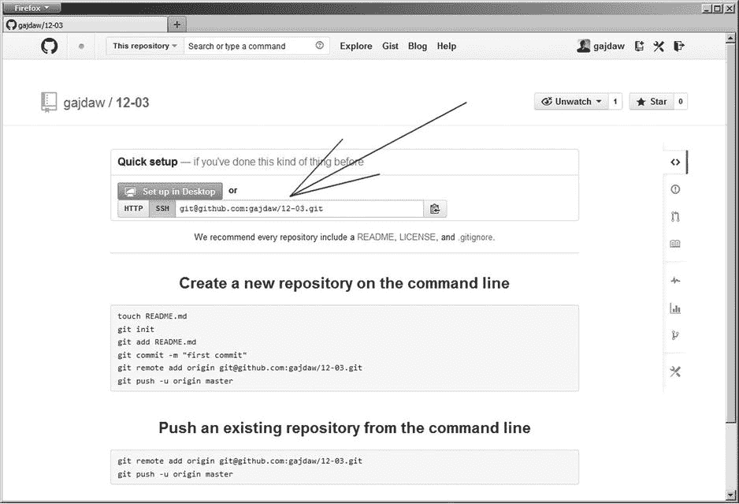

第十二章


与 Github.com 合作

在这一章中，我将讨论使用 Github 来托管存储库。目前这是一个流行的开源项目托管平台。

我们首先创建一个 Github 帐户并配置 SSH 密钥。完成后，您将学会如何:

*   从公共 Github 库克隆
*   克隆并推送至您的存储库

稍后，我将向您展示如何从头开始一个新的 Github 托管的项目，以及如何导入一个现有的项目。然后，我们将继续进行拉请求。为了同时扮演贡献者和管理员的角色，我们将使用两个 Github 帐户:您的个人帐户和组织帐户。通过这种方式，你可以将你的组织拥有的项目转移到你的个人账户中。

12-1.创建 Github 帐户

问题

您想使用`Github.com`有两个原因:

*   托管您自己的 git 存储库
*   为一些开源项目做贡献

除非您是注册的`Github.com`用户，否则您不能这样做。因此，您的首要任务是创建一个新的 Github 帐户。

解决办法

启动网络浏览器并访问`Github.com` 。点击链接“注册 GitHub”。填写登记表并提交。当您使用新创建帐户完成登录时。

如果你想为你的 Github 帐户使用头像，请访问`http://gravatar.com`网站。在`Gravatar.com`中创建一个账号，上传你的头像，并与你用于 Github 账号的邮箱关联。

当您在`Gravatar.com`上完成头像配置后，请转到`Github.com`，注销，然后再次登录您的帐户。你的帐户现在应该使用新的头像。

它是如何工作的

注册过程很简单，应该很容易使用。这个配方的重点是强调我们在配方 2-1 中提到的事实:Github 不允许使用 SSH 协议，除非你已经配置了自己的 SSH 密钥。命令:

```
$ git clone git@github.com:jquery/jquery.git
```

失败，产生以下消息:

```
Permission denied (publickey).
fatal: Could not read from remote repository.

Please make sure you have the correct access rights
and the repository exists.
```

产生此错误的原因是:

*   如果您没有 Github 帐户。
*   如果您的帐户没有配置为使用 SSH 密钥。

上面$ git clone 命令中的 URL:

```
git@github.com:jquery/jquery.git
```

使用 SSH 协议。你可以在表 11-2 中找到 git 使用的协议的完整参考。

12-2.用 SSH 密钥配置 Github 帐户

问题

您希望以 git 允许您使用 SSH URLs 克隆、获取和推送的方式配置 Github 帐户。

解决办法

要完成这个食谱，你需要一个 SSH 密钥对。检查您的`∼/.ssh/`目录是否包含它们。打开一个 bash 窗口，列出。ssh 目录:

```
$ ls ∼/.ssh
```

如果这个目录不包含`id_rsa`和`id_rsa.pub`文件，那么您必须生成它们。您需要的命令是:

```
$ ssh-keygen -t rsa -C your.email@example.net
```

该命令将询问您两个问题，这两个问题已在 RSA 密钥部分的方法 11-5 中解释过。第一个问题用键设置两个文件的名称；第二个设置使用密码来保护您的密钥。如果您按下*输入*，文件将被存储在默认位置，密码将不会被使用。

当`id_rsa`和`id_rsa.pub`文件准备好后，启动你的网络浏览器并访问 Github.com。点击标题为“注册 GitHub 完成后，使用您新创建的帐户登录。

要使用基于密钥的认证，您必须将您的公钥上传到您的帐户。将存储在`∼/.ssh/id_rsa.pub`中的公钥内容复制到剪贴板上。如果您在 Windows 上工作，可以使用以下命令:

```
$ clip < ∼/.ssh/id_rsa.pub
```

在其他系统上工作的读者可以用他们喜欢的文本编辑器打开文件，并使用编辑/复制命令。

进入你的 Github 账户设置，打开 *SSH 密钥*菜单选项，然后按下*添加 SSH 密钥*按钮。当您看到标题为*Add a SSH Key*的表单时，将剪贴板的内容粘贴到表单中。然后按下*添加键*按钮。添加 SSH 密钥的过程如图 12-1 所示。按照标记为 A、B、C、D 和 e 的箭头进行操作。完成后，上传的密钥将列在 SSH 密钥下，如[图 12-2](#Fig2) 所示。


[图 12-1](#_Fig1) 。在 Github 帐户上添加新的 SSH 密钥


[图 12-2](#_Fig2) 。成功上传的密钥列在 SSH 密钥下

配置完成。您可以通过使用 SSH 协议克隆任意的公共存储库来验证这一点。如果命令:

```
$ git clone git@github.com:jquery/jquery.git
```

成功，那么您的密钥是正确的。您可以使用 SSH 协议来访问 Github 上的存储库。

它是如何工作的

SSH 协议不允许匿名访问。要使用它，您需要一个服务器上的帐户。Github 对所有用户使用一个名为 git 的帐户。这就是为什么所有克隆命令都包含 git@github，如:

```
$ git clone git@github.com:jquery/jquery.git
```

上面的命令意味着您正在主机 github.com 上访问一个 git 帐户。只有在基于密钥的认证成功的情况下，在 github.com 上工作的 SSH 守护进程才会授予对 git 帐户的访问权限——如果您的公共 SSH 密钥是为您的[git@github.com 帐户](mailto:git@github.com account)配置的，就会发生这种情况。否则，您将无法访问任何资源。这种托管解决方案在配方 11-5 和 11-10 中进行了解释。在[图 12-1](#Fig1) 和[图 12-2](#Fig2) 中呈现的 web 界面只是简化了管理你的公共 SSH 密钥的任务。

12-3.为新项目创建 Github 托管的存储库

问题

你想开始一个新项目，并把它放在 Github 上。

解决办法

启动您的网络浏览器并登录到 Github.com。然后点击*创建新的回购*按钮。按钮*创建新的回购*在 Github 网页右上角显示的菜单上(参见[图 12-3](#Fig3) 中的 A)。您将在图 12-1 和图 12-2[中找到相同的按钮。](#Fig2)


[图 12-3](#_Fig3) 。在`Github.com`创建新的存储库

当您按下*创建一个新的回购*按钮时，您将看到[图 12-3](#Fig3) 中显示的表单。在*储存库名称*编辑框中输入 12-03，然后按下*创建储存库*按钮(参见[图 12-3](#Fig3) 中的 B 和 C)。

此后，您将看到图 12-4 所示的页面，其中显示了该存储库的 URL 以及您可以用来开始工作的两个程序。假设您的 Github 帐户名为 john-doe，那么您的存储库的 URL 将如下所示:

```
git@github.com:john-doe/12-03.gi
```



[图 12-4](#_Fig4) 。新创建存储库的网页

你会在[图 12-4](#Fig4) 所示的编辑框中找到。

Github 的工作目前已经完成。打开 bash 命令行并执行以下命令:

```
# the commands should be executed in git-recipes directory
$ cd git-recipes
$ git clone git@github.com:john-doe/12-03.git
$ cd 12-03
$ git simple-commit a b c
$ git push -u origin master
```

现在回到 Github.com，跟随图 12-5 中的链接，你会看到存储在库中的文件列表。该列表将包括三个文件:`a.txt`、`b.txt`、`c.txt`，如图 12-5 中[的 B 箭头所示。](#Fig5)


[图 12-5](#_Fig5) 。$ git push -u origin 主命令将主分支从您的驱动器发送到您的由 Github 托管的存储库

它是如何工作的

要在 Github 上创建一个新的存储库，你应该使用 web 界面。创建新存储库后，您可以克隆它。使用本地克隆创建新的提交，当您想要在 Github 上发送更新的存储库时，使用`$ git push`命令。使用图 12-5 中 C 箭头所指的按钮，您可以显示储存在库中的修订列表。列表如图[图 12-6](#Fig6) 所示。


[图 12-6](#_Fig6) 。Github 提供的修订列表

正如你在配方 8-1 中所记得的，每个版本都存储了两个特殊的属性来分配作者。分别是`Author`和`Commit` 。`Author`是创造代码的人的名字。`Commit`是版本创建者的名字。对于[图 12-6](#Fig6) 中出现的修改，`Author`和`Commit`都设置为同一个人，`Włodzimierz Gajda`和 email `gajdaw@gajdaw.pl`。Github 用这封邮件来猜测账户的名字。因此，我的提交被标注为由`gajdaw`创作。因为`Author`和`Commit`数据相同，所以作者简化为简单的`gajdaw`。这意味着`gajdaw`创建了代码和提交。

如果提交包含不同名称的`Author`和不同名称的`Commit`会发生什么？Github 显示这些信息，如图[图 12-7](#Fig7) 所示。在[图 12-7](#Fig7) 中展示的修订版是由 John Doe 编写的，并由 gajdaw 重新修改。Github 显示这些消息:

```
John Doe authored...
Gajdaw committed...
```


[图 12-7](#_Fig7) 。对于不同作者和提交数据的修订，Github 会同时显示两者

 **提示**如何创建如图[图 12-7](#Fig7) 所示的版本？您可以使用配方 8-1 中描述的`$ git commit --amend`。您可以以类似的方式使用`$ git cherry-pick`、`$ git am`和`$ git rebase`命令。

12-4.为现有项目创建 Github 托管的存储库

问题

你已经为你的项目工作了一段时间，现在你想在 Github 上发布它。

解决办法

使用以下命令创建一个项目:

```
$ cd git-recipes
$ git init 12-04
$ cd 12-04
$ git simple-commit a b c d
```

启动您的 web 浏览器，登录到 Github.com，并使用图 12-3 所示的过程创建一个名为 12-04 的新的空存储库。

当你到达图 12-4 所示的页面时，你会看到上传的说明:如何将一个现有的项目上传到这个新创建的存储库中。转到 bash 命令行，执行 Github 提示的两个命令:

```
# the commands should be executed in git-recipes/12-04 directory
$ git remote add origin git@github.com:your-github-username/12-04.git
$ git push -u origin master
```

当执行这些命令时，您的 Github 存储库应该包含来自您的项目的所有修订:`a`、`b`、`c`和`d`。

它是如何工作的

如果您想使用 Github 发布一个现有的项目，您必须创建一个新的空存储库，然后执行两个命令:

```
$ git remote add origin git@github.com:your-github-username/12-04.git
$ git push -u origin master
```

12-5.在 Github 上创建组织账户

问题

Github 接口包含一个叫做 pull 请求的特殊操作。它简化了开源项目的工作流程。如果您想练习如何处理拉取请求:

*   一个发送他的贡献的开发者
*   接受贡献代码的项目所有者需要两个 Github 角色。在这个食谱中，你要在 Github 上创建你自己的组织。这将让你有机会在两种不同的性格下工作:

*   作为普通用户
*   作为组织的所有者

在接下来的课程中，我们将使用这两个帐户来练习拉取请求。

解决办法

要创建您自己的组织，请访问您的 Github 帐户并进入您帐户的设置，然后进入*组织*并按下*创建新组织*按钮。按照[图 12-8](#Fig8) 中的按钮操作。


[图 12-8](#_Fig8) 。创建新组织

*新建组织*按钮将打开如图[图 12-9](#Fig9) 所示的对话框。输入您的组织名称和电子邮件地址。我在 Github 上的用户名是 gajdaw，我使用 gajdaw-learning-git 作为我的组织的名称，但是你可以选择任何你喜欢的名称。然后点击页面底部的*创建组织*。


[图 12-9](#_Fig9) 。新组织的属性

创建组织后，您可以使用以下 URL 访问其页面:

```
https://github.com/gajdaw-learning-git
```

不要使用 gajdaw-learning-git，而是使用您在图 12-9 所示的对话框中输入的名称。我的组织 gajdaw-learning-git 的主页如图[图 12-10](#Fig10) 所示。


[图 12-10](#_Fig10) 。gajdaw-learning-git 组织的主页位于`https://github.com/gajdaw-learning-git`

它是如何工作的

Github 界面允许你创建组织。因为每个 Github 都可以拥有自己的库，所以您可以使用您的组织来模拟 pull 请求的工作。

注意 Github 数据库许可证严格禁止一个人创建多个帐户。因此，您不能创建两个不同的用户帐户来处理拉请求。

12-6.创建由组织托管的新项目

问题

您想要启动一个由您的组织托管的新项目。

解决办法

访问您的 Github 帐户并:

1.  按下*创建新的回购*按钮
2.  从*所有者下拉列表*中选择您的组织名称
3.  将新存储库的名称填写为 12-06
4.  点击页面下部的*创建存储库*按钮

所有步骤如[图 12-11](#Fig11) 所示。


[图 12-11](#_Fig11) 。创建由您的组织拥有的新存储库

现在打开一个 bash 命令行并执行以下命令:

```
$ cd git-recipes
$ git clone git@github.com:your-github-organization/12-06.git
$ cd 12-06
$ git config --local user.name admin
$ git config --local user.email admin@example.net
$ git simple-commit a b c
$ git push -u origin master
```

您必须将您的名称-github-organization 替换为您在[图 12-9](#Fig9) 中使用的名称。当您运行上述命令时，您在 Github 上托管的存储库现在应该包含由 admin 编写的修订版 a、b、c。

它是如何工作的

对您的组织所拥有的存储库的处理与对您所拥有的存储库的处理是相同的。食谱 12-3 和 12-6 的唯一区别是，在后者中，您将所有者从您的个人帐户更改为您的组织。

在存储于`git-recipes/12-06`的存储库中，您将使用管理员身份工作。

12-7.发送拉取请求

问题

Github 主持了一个名为 12-06 的项目。该项目可从以下 URL 获得:

```
https://github.com/your-github-organization/12-06
```

您希望为这个项目做出贡献，发送一个包含三个提交的 pull 请求。

解决办法

启动 web 浏览器，登录到您的 Github 帐户，然后转到以下 URL:

```
https://github.com/your-github-organization/12-06
```

您将看到图 12-12 中的[所示的网页。确保您正在访问由 a 标识的项目 your-github-organization/12-06。](#Fig12)


[图 12-12](#_Fig12) 。您希望贡献的 your-organization/12-06 知识库的主页

使用标识为 B 的 *Fork* 按钮来创建您个人的库副本。当您按下按钮时，将会询问您“我们应该在哪里分叉这个存储库？”选择您的个人帐户(不是您的组织)来回答问题。这将重定向到如图[图 12-13](#Fig13) 所示的网页。您应该注意到，这一次存储库在您的用户名下可用，如下所示:

```
your-github-username/12-06
```


[图 12-13](#_Fig13) 。您的组织拥有的原始存储库的私有分支

在图 12-13 中显示了可以验证存储库名称的地方。

在这个菜谱中，我们将使用两个存储库。它们的网址是:

*   原始存储库:`git@github.com:your-organization/12-06.git`
*   你的叉子:`git@github.com:your-github-username/12-06.git`

现在是时候在你的硬盘上创建一个克隆了。打开 bash 命令行，键入以下命令:

```
$ cd git-recipes
$ mkdir 12-07
$ cd 12-07
$ git clone git@github.com:your-organization/12-06.git.
```

好好看看上面的命令。这应该是原始存储库的 URL。

现在添加我使用的远程 URL 别名，并指向您的分支:

```
$ git remote add my git@github.com:your-github-username/12-06.git
```

保存在 git-recipes/12-07 中的本地存储库包含两个远程别名。命令`$ git remote -v`打印以下结果:

```
$ git remote -v
my      git@github.com:your-github-account/12-06.git (fetch)
my      git@github.com: your-github-account/12-06.git (push)
origin  git@github.com:your-organization/12-06.git (fetch)
origin  git@github.com: your-organization/12-06.git (push)
```

使用以下两个命令检查您的身份:

```
$ git config user.name
$ git config user.email
```

上述命令的输出应该包括您的真实姓名和真实电子邮件地址。

您已经准备好为原始存储库做贡献了。为此，创建一个新分支:

```
$ git checkout -b numbers
```

创建三个版本一、二、三，使用:

```
$ git simple-commit one two three
```

将名为`numbers`的分支推到 Github 上的 fork，方法是:

```
$ git push -u my HEAD
```

转到 web 浏览器，检查您的 fork 是否包含新推送的分支。使用图 12-14 中[所示的按钮。](#Fig14)


[图 12-14](#_Fig14) 。你推的分支在你的叉子里有。您可以使用箭头所指的按钮来查看它

现在，您已经准备好将您的提交发送到原始存储库。按*比较&拉动要求*如图[图 12-15](#Fig15) 所示。


[图 12-15](#_Fig15) 。按钮比较&拉动请求

图 12-15 中的[按钮将打开图 12-16](#Fig15) 中[所示的对话框。字母 A 显示了关于以下内容的准确信息:](#Fig16)

*   将接收拉取请求的分支

    ```
    your-organization:master
    ```

*   将被推送的分支

    ```
    your-github-username:numbers
    ```


[图 12-16](#_Fig16) 。发送拉请求的对话框

图 12-16 中的字母 B 包含您需要键入的标题。我用 foo bar 作为标题。C 指向您的拉取请求背后的目的的完整描述。d 列出将被推送的提交。要继续请求拉动，点击*发送拉动请求*。

点击*发送拉取请求*后，你将被重定向到[图 12-17](#Fig17) 所示的网页。这是您派生的原始存储库。


[图 12-17](#_Fig17) 。提取请求已成功发送，并且在贵组织拥有的原始存储库中可用

你的工作结束了。提取请求已发送到原始存储库。这取决于该存储库的所有者是否接受您的“拉”请求。

它是如何工作的

拉请求的工作包括三个存储库，如下所示:

*   Github 上托管的原始存储库
*   你的 fork 托管在 github
*   存储在机器上的本地存储库

您负责其中的两个:您的 fork 和您的本地存储库。第一个是在[图 12-8](#Fig8) 所示的 Githhub 界面中点击 *Fork* 创建的。本地存储库是作为原始存储库的克隆创建的。三个仓库之间的关系如图[图 12-18](#Fig18) 所示。


[图 12-18](#_Fig18) 。处理拉请求所需的三个存储库之间的关系

使用拉取请求时，工作流组织如下:

*   您只能在您的本地存储库中提交、合并和重设基础。
*   您将更改从本地存储库推送到您的分支。
*   您将 pull 请求从 fork 发送到原始存储库。
*   您从原始存储库获取最新的更新到您的本地存储库。

命令流程如图 12-19 中的[所示。](#Fig19)


[图 12-19](#_Fig19) 。处理拉请求时的命令流

因为您的本地存储库是一个克隆的原始存储库，`origin`别名指向组织拥有的存储库。您可以通过以下方式获取其他开发人员所做的最新更新:

```
$ git fetch origin
```

如你所知，fetch 不会移动你的本地跟踪分支。要合并本地主分支中的最新修订，您必须执行 merge 或 rebase，例如:

```
$ git rebase origin/master master
```

为了使推送到 fork 更容易，您需要为这个存储库设置一个别名。命令:

```
$ git remote add my git@github.com:your-github-username/writers.git
```

定义一个名为`my`的别名。因此，如果您想使用 fork，可以使用以下命令:

```
$ git push my branch-name
$ git push my HEAD
```

第一个命令推送具有给定名称的分支，第二个命令推送当前分支。

当您的分支和您的贡献在分叉的存储库中可用时，您可以发送一个 pull 请求。

我更喜欢通过克隆由 organization 托管的原件来创建存储在我的机器上的本地存储库。然后，别名 original 用于获取其他人最近做出的贡献，而我的别名用于将我的新贡献推送到分叉存储库中。但是您也可以使用其他设置。您可以克隆您的 fork，并为 organization 托管的原始存储库定义一个名为 upstream 的新远程。然后，您将使用 origin alias 将您的贡献推送到 fork，并使用 upstream alias 下载最新的贡献。除了重命名的遥控器，这两种解决方案实际上没有区别。

12-8.返工您的拉动式请求

问题

您参与了一个发送拉请求的开源项目。但是你的贡献没有被接受。你被要求做一些改进。您希望在您的拉请求中添加两个新的提交。

解决办法

转到您的本地存储库，您在其中创建了作为拉请求发送的修订。它位于 git-recipes/12-07 目录中:

```
$ cd git-recipes/12-07
```

我假设您发送了一个 pull 请求，将本地 numbers 分支的修订合并到原始存储库中的主分支。为了获得清晰的线性历史记录，您应该使用远程主分支中的最新版本更新您的本地分支。执行以下命令:

```
$ git fetch origin
$ git rebase origin/master numbers
```

这些命令会将你的修改移动到`origin/master`分支的顶部。现在，您可以向 pull 请求添加一些提交。你目前的分行在重定基数后是数字。在其中创建两个新版本:

```
$ git simple-commit red green
```

把它推到你的叉子上:

```
$ git push -f my HEAD
```

您的拉动请求现在应该包含红色和绿色两个新版本。你可以用下面的方法来检查。转到原始库，按照[图 12-20](#Fig20) 所示的*拉取请求*按钮。


[图 12-20](#_Fig20) 。“拉请求”按钮提供了所有拉请求的列表

现在从列表中检查您的拉取请求。你会在窗口的下部看到你的两个修改，如图[图 12-21](#Fig21) 所示。


[图 12-21](#_Fig21) 。推送到分叉存储库中适当分支的新修订会自动添加到拉请求中

它是如何工作的

分叉存储库中的分支可用于向拉请求添加更多的提交。只要拉取请求未被接受，您就可以推送到该分支。

原始存储库中的主分支可能会向前移动。如果是这种情况，您应该使用以下内容更新您的本地存储库:

```
$ git fetch origin
$ git rebase origin/master numbers
```

当新的提交准备好时，您可以用一个命令将它们附加到现有的拉请求中:

```
$ git push -f my numbers
```

如果在更新阶段你的修改被重新设定了基数，标志`-f`是必要的。如果原始主分支中没有新的修订，那么您可以使用不带`-f`标志的命令:

```
$ git push my numbers
```

请记住，您当地的分支机构，以及您 fork 中的分支机构，在被接受之前，都被视为您的私人工作。这意味着您可以使用第 8 章中描述的任意方法来调整历史记录。您可以添加新的提交，可以对提交进行重新排序，可以删除提交，最后，您可以将所有提交压缩成一个提交。

请记住，每当您想要为 Github 上的项目做贡献时，请使用分支。不要为此在你的总分行工作。如果您在单独的分支中准备您的拉取请求,这不会使您的工作变得复杂。当拉取请求被拒绝时，您只需删除该分支。否则，您需要使用`$ git reset --hard HEAD∼n`来调整主分支，以删除被拒绝的修订。

12-9.接受拉取请求

问题

你拥有一个流行的知识库。开发人员通常会为您的项目做出贡献。您希望接受刚刚收到的拉请求。

解决办法

在这个食谱中，你将只在 Github 提供的网络界面中工作。转到您的组织，然后选择存储库 12-06 并打开可用的“拉”请求列表。接下来，打开包含有关拉取请求的详细信息的页面。您可以按照图 12-22 中的[所示的链接进行操作。](#Fig22)


[图 12-22](#_Fig22) 。由您的组织托管的存储库中所有提取请求的列表

拉动请求的细节如图 12-23 中的[所示。您可以分析所有贡献的代码。当你确定代码是正确的，你可以点击](#Fig23)[图 12-23](#Fig23) 所示的按钮进行合并。


[图 12-23](#_Fig23) 。用于合并拉取请求的按钮

如[图 12-24](#Fig24) 所示，当拉动请求被合并时，它将包含在项目历史中。


[图 12-24](#_Fig24) 。合并的拉取请求在项目历史记录中可用

它是如何工作的

发送到存储库的所有拉请求都列在图 12-22 所示的页面上。你可以彻底检查他们每一个人。特别是，Github 允许您:

*   列出包含在拉请求中的提交
*   列出拉请求修改的文件
*   要列出修改的行
*   与其他开发人员讨论拉取请求

当您确定拉动请求正确时，您可以使用图 12-23 中的[所示的*合并拉动请求*按钮](#Fig23)来接受它。

摘要

在这一章中，我向你提供了使用 Github 作为项目托管平台的基本信息，以及为他人所有的项目做贡献的程序。

如果您想使用 Github 托管一个开源项目，请遵循食谱 12-3、12-4 和 12-6。每当你收到一个拉动请求，你可以按照食谱 12-9 接受它。

也许你想为一个开源项目做贡献？你可以用食谱 12-7 和 12-8 中解释的方法来做这件事。

如果你主持一个由你信任的开发团队开发的项目，你可以避免你和你的朋友使用拉请求。设置适当的权限，你可以允许其他 Github 用户直接推送到原始存储库。在图 12-25 中[所示的团队管理链接下有一个对话框。](#Fig25)


[图 12-25](#_Fig25) 。“团队管理”链接会将您带到可以为其他开发人员分配权限的页面

如果您需要更多的参数来尝试 Github，请考虑它包含一个嵌入式问题跟踪器。所有参与该项目的贡献者都可以用它来讨论提交的代码。所有这些特性使 Github 成为一个真正伟大的代码共享平台。