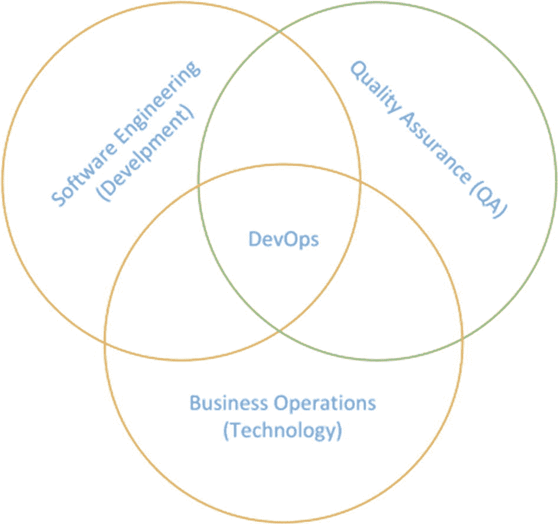
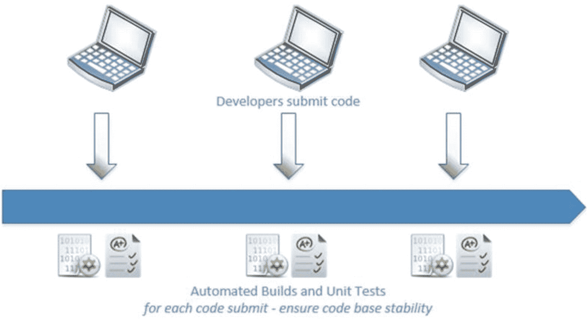
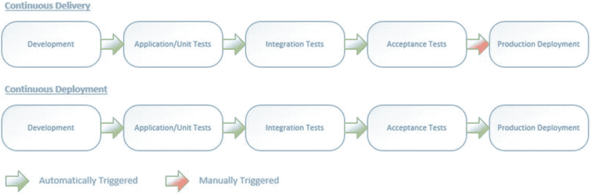
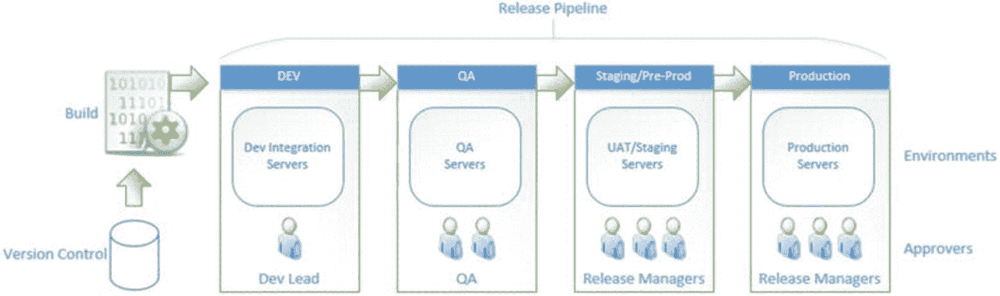
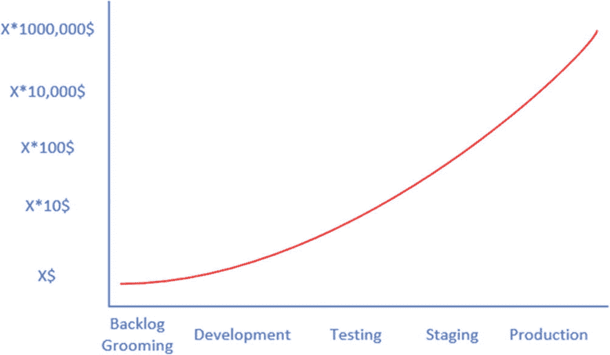
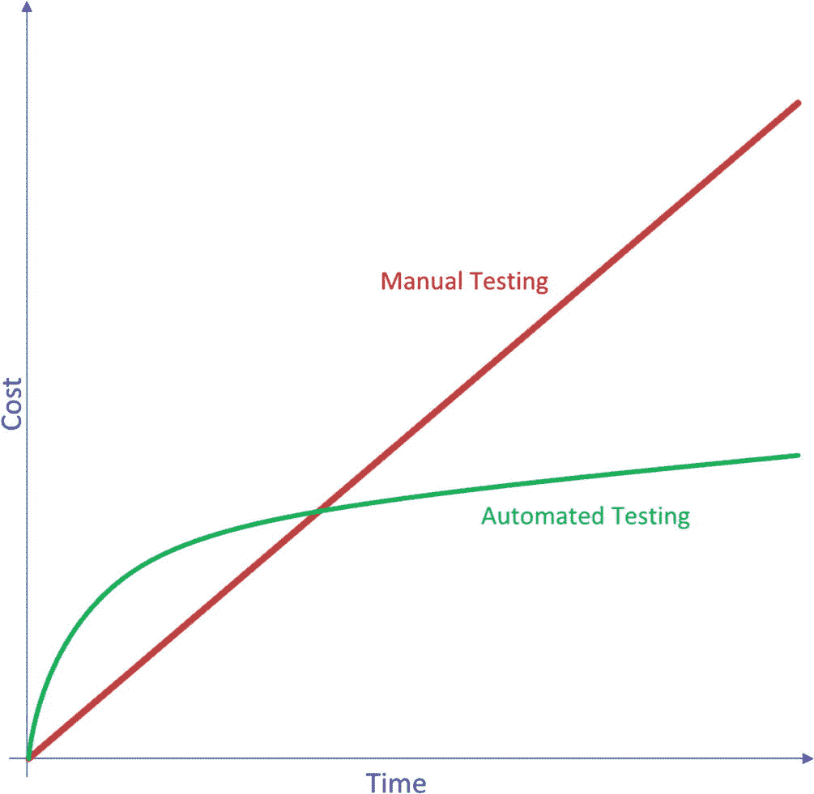

# 1.理解软件交付自动化的重要性

现代软件开发非常依赖敏捷性，它是项目或产品开发成功的关键因素。快速的技术发展和不断增长的商业趋势要求软件按时高质量地交付。如此快速的软件开发和交付阶段需要软件交付方面的自动化，以确保快速、频繁的部署和更高的产品质量。

从建立一个环境到将一个软件部署到该环境，软件开发应该尽可能地被编码和自动化，以避免人为错误并支持快速的发布节奏，同时将交付软件的质量保持在尽可能高的水平。自动化基础设施的建立以及软件的部署和测试方面大大降低了给定项目或产品的时间成本，因为它需要较少的人力资源干预。除此之外，自动化还进一步防止了人为错误，因为每个目标环境中使用的同一组脚本或任务实现了部署的一致性。

在这一章中，提供了软件交付过程自动化的快速介绍，这在软件项目/产品的应用生命周期管理(ALM)中是至关重要的。理解持续集成(CI)和持续部署(CD)的概念，以及讨论引入基础设施、配置、应用程序、组件部署自动化的重要性，并在部署后实现测试自动化，将为读者理解和利用本书的其余章节奠定基础。

## 第 1.01 课:DevOps

DevOps(软件**开发**开发和信息技术**运营**T4)是你今天在软件开发行业听到的时髦词汇。它定义了软件开发组织的文化和实践。DevOps 的目标是建立一个环境，在这个环境中，定义、构建、测试和发布软件可以更快、更频繁地进行，并且具有更高的质量和可靠性。这需要一个组织采用一种协作文化，其中自动化是一个关键的信念。一家公司需要大量的基础架构更改或升级来支持新的开发运维实践。在 DevOps 文化中，开发人员和 IT 专业人员被鼓励更频繁地相互协作和交流，这强调了团队合作的概念。见图 [1-1](#Fig1) 。

图 1-1

DevOps 一瞥

微软的多诺万·布朗(Donovan Brown)为开发运维提供了一个更有意义的定义:“开发运维是人员、流程和产品的结合，能够为我们的最终用户持续交付价值。”这突出了这样一个事实，即人民是 DevOps 最重要的方面。人们需要调整实践和过程，以帮助他们协作并为团队的目标做出贡献，并创建一种文化，在这种文化中，自动化在向软件用户交付价值中扮演着重要的角色。

如前所述，软件交付的自动化对于交付高质量的软件和缩短上市时间至关重要。因此，将 Azure DevOps 中的部署自动化功能作为 DevOps 的综合工具套件是值得一试的。在本章接下来的几节中，让我们试着理解软件构建和部署的概念。

## 第 1.02 课:持续集成(CI)

在软件开发团队中，多个团队成员开发代码并参与创建软件功能。虽然许多人都在为一个代码库做贡献，但是保持代码库的完整性对于确保团队的任何成员都可以检索最新的代码库、在本地构建和运行代码库，并开始做出贡献是非常重要的。为了确保代码库的稳定性，可以使用两个因素。第一个是确保代码编译没有错误。第二个因素是确保所有单元测试都通过，最新的代码变更和单元测试的代码覆盖率非常高。可以定义一个构建来编译代码库的每个签入/提交，然后执行所有单元测试来验证代码库，以确保代码库的稳定性，这通常称为 CI 构建。根据所有单元测试的成功编译和通过，构建可以生成和发布输出，这些输出可以部署到目标环境中。参见图 [1-2](#Fig2) 。

除了单元测试之外，代码安全漏洞的验证可以集成到构建管道中，以提高项目/产品的安全性。进一步扫描代码质量也是可以在构建管道中验证的一个方面。从长远来看，使用这种左移方法及早检测安全漏洞和代码质量问题将会降低成本，因为在产品中检测到的漏洞修复起来成本很高。

图 1-2

连续累计

## 第 1.03 课:连续交付(CD)

在现代软件开发方法中，开发团队在短周期内生产软件。最大的挑战之一是确保在任何给定时间向目标环境发布软件的可靠性。直截了当且可重用的部署过程对于降低交付软件变更的成本、时间和风险是必不可少的。这些可能是生产中应用程序的增量更新。简而言之，CD 正在更频繁、更可靠地交付软件变更，DevOps 可以被认为是持续交付的产物。

## 第 1.04 课:持续部署

一方面，连续交付确保每个变更都可以部署到生产环境中，同时可以选择暂停生产部署，直到获得人工批准。另一方面，持续部署让每一个更改都可以自动部署到生产中。要实现连续部署，必须准备好连续交付，因为连续部署是通过自动化连续交付的批准步骤来创建的。参见图 [1-3](#Fig3) 。

图 1-3

持续交付与持续部署

## 第 1.05 课:发布/部署管道

发布管道描述了从从源代码控制中检索已完成的工作到将软件交付给最终用户的一系列操作。从版本控制中检索到的软件在到达发布管道中的生产环境之前，必须经过几个阶段的构建、测试和部署。基于所使用的软件开发实践，该过程涉及许多个人、团队、各种工具和组件。成功的部署管道应该为使用它的团队/个人提供部署流程的可见性、控制和灵活性。可以有多个关卡和批准级别，以增加通过管道发布的软件版本的可靠性。参见图 [1-4](#Fig4) 。

图 1-4

发布/部署渠道发布/部署渠道

## 第 1.06 课:基础设施即代码(IaC)

随着快速部署的高需求，设置新环境来手动部署软件可能是一项挑战，并且容易出错。因此，从头开始编写创建环境的脚本会使新环境运行得更快、更可靠。尤其是在以云平台为目标时，用代码设置新环境会产生更快、更可靠的结果。这种为建立基础设施而开发的代码被称为基础设施代码(IaC)。拥有 IaC 甚至允许版本控制给定项目中的目标环境设置，为我们如何设置环境增加了更多的可追溯性和可见性。有几种工具和技术可以用来实现 IaC，在本书中，我们将在后面的章节中更详细地讨论它们。

## 第 1.07 课:测试自动化集成

正如我们在持续集成中已经讨论过的，为验证应用程序代码而编写的单元测试应该在构建管道中执行。然而，还有其他测试，比如功能 UI 测试、API 测试、集成测试以及负载和性能测试，它们不能在构建管道中运行。不可能在构建管道中运行单元测试之外的测试的原因是，它们都需要在部署的目标环境中运行。因此，在将项目/产品部署到目标环境之后，除了单元测试之外，这些类型的测试应该集成到要执行的部署管道中。我们将在 Azure DevOps 系列的动手测试自动化一书中讨论更多关于测试自动化与管道的集成。

## 第 1.08 课:为什么我们需要自动化软件交付过程？

我们已经在本章前面的章节中讨论了软件交付过程自动化的几个方面。没有这样的软件过程自动化，更频繁地部署软件将是一项具有挑战性的任务。运营团队可能不得不花费大量时间来手动设置和部署新环境。设置过程中很有可能会遗漏一些步骤，导致新环境中出现意外问题，并导致部署的软件不可用或出现严重问题。所有这些都需要时间和金钱来解决。此外，每次设置和部署环境都需要为任务投入额外的人力资源，从而花费更多的钱。参见图 [1-5](#Fig5) 。

图 1-5

错误成本

考虑到执行完整测试所需的时间和人力资源，如果没有测试自动化来对部署的应用程序运行回归和冒烟测试，就不可能对每个交付执行完整的手动测试。这可能从两个方面影响应用程序。一种是跳过测试，因为测试成本可能会导致 bug 蔓延到产品中，这将花费更多的钱，甚至导致客户完全不满意。有时，这种不满会导致针对软件提供商的法律诉讼，这有时会损害整个企业及其声誉。另一个选择是试图一直手动地做所有的测试来确保质量，但是这将花费人力资源的金钱并且延迟交付，导致团队不能按时交付。这显示了尽可能自动化的迫切需要，以避免软件交付测试中的成本和问题。参见图 [1-6](#Fig6) 。

图 1-6

自动化测试与手动测试

为了避免所有这些成本，自动化部署和测试，结合使用左移方法识别软件中的安全性和其他漏洞，是至关重要的。尽可能早地检测这些漏洞(尽可能在流程流的左侧)将花费更少的钱来修复它们。

## 摘要

这一章已经向你介绍了软件交付自动化的概念。我们已经探索了 CI 和 CD 的概念，以及使用 IaC 和测试自动化来增强软件交付过程的需求和好处。有了对软件交付自动化概念的理解，我们就有足够的背景知识来探索本书的其余章节，这些章节将关注 Azure 管道来实现所讨论的概念。

在下一章中，我们将讨论 Azure Pipeline 特性的概述，这些特性将支持您理解其余章节，详细讨论每个特性及其用法。