# 二、Azure 管道概述

连续交付和部署已经成为从详细说明链接软件开发行业的重要方面。正如我们在第 [1](01.html) 章中所讨论的，持续集成和交付管道立即将您的软件开发过程带到一个高性能和可靠的水平。Azure DevOps 为我们提供了很好的特性，可以根据我们的项目需求创建 CI/CD 管道。本章将通过提供 Azure DevOps 管道特性的各个方面的基本介绍，帮助您了解 Azure DevOps 管道。

## 第 2.01 课:池和代理简介

正如您已经知道的，CI/CD 通过自动化构建和部署过程提高了您的交付速度。说到自动化，你需要一台机器在没有任何人类互动的情况下为你做这件事。Azure DevOps 提供代理为您做 CI/CD 工作。本课将帮助您了解这些代理以及在 Azure DevOps 中的何处可以找到它们。

在 Azure DevOps 中，您可以在项目设置下找到代理池部分。您将在“池”部分找到所有代理的详细信息。有两种类型的代理池:

Azure Pipelines:微软托管的代理池，包含所有平台的机器，Windows、Linux 和 MacOS，其中安装了许多软件工具。

私有/自托管代理池:有一个默认的私有池，您可以根据自己的需要创建更多的私有代理池。然后，您可以在这些专用池中注册机器，用作构建或部署机器。

转到“项目设置”,选择团队项目中“管道”部分下的代理池，以便查看代理池。见图 [2-1](#Fig1) 。

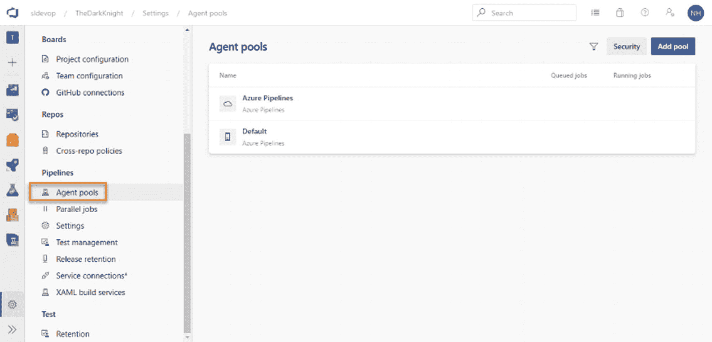

图 2-1

代理池

Azure DevOps 允许您基于项目可访问性类型(如私有或公共)使用大量托管代理管道。公共项目允许您在托管管道上一次使用十个并行执行，而私有项目(其中您的源代码或其他项目详细信息对公共访问是隐藏的)只允许您在给定时间使用一个构建或部署执行。参见图 [2-2](#Fig2) 。

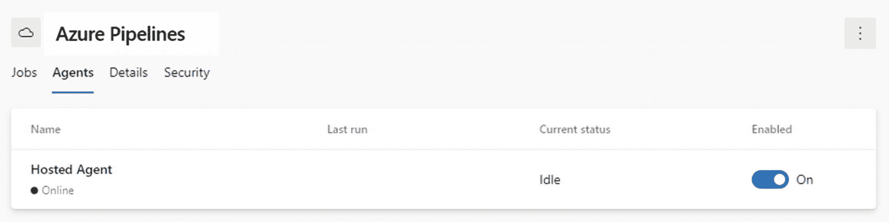

图 2-2

Azure DevOps 代理

正如已经提到的，我们可以在私有池中配置我们自己的代理，这将在以后的章节中详细解释。配置自承载代理后，它将与该代理的所有信息一起添加到代理池中。例如，摘要将给出代理中安装的软件的详细信息以及这些版本。

Azure DevOps 以其多平台支持而闻名。一旦您检查托管代理池中的代理集合，您就能够体验 Azure DevOps 的这种多平台支持。以下是我们在本书中使用的版本中可用的不同托管代理。它支持 Mac、Ubuntu 和 Windows。参见图 [2-3](#Fig3) 。

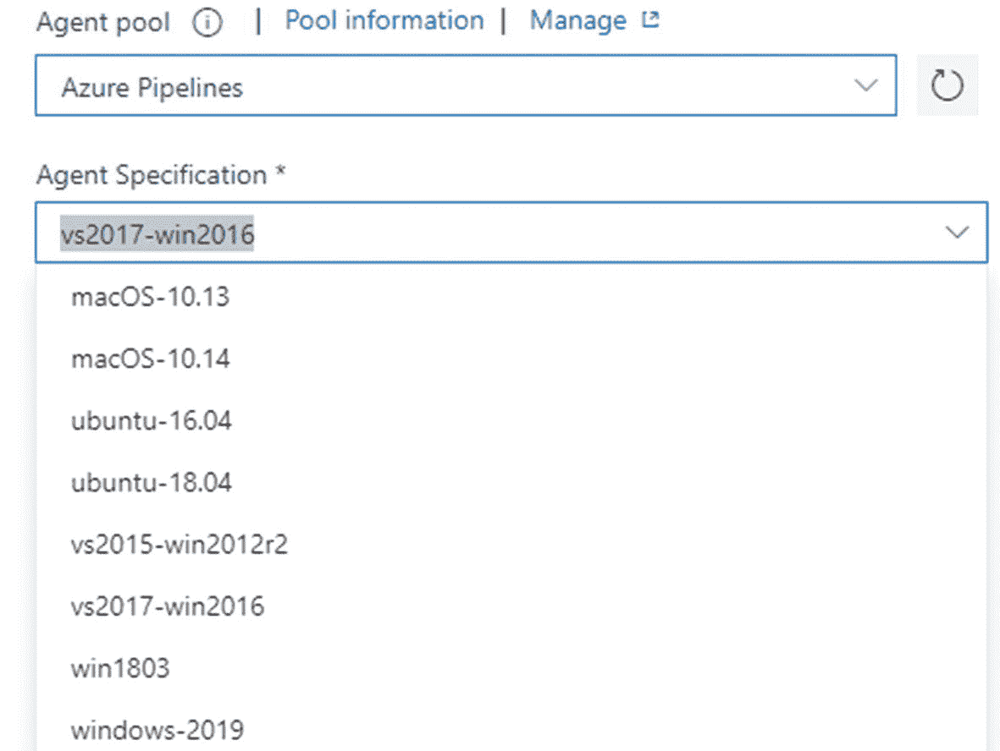

图 2-3

托管代理池中可用的代理

此外，可以控制代理池权限以提供安全的访问。它有三个主要的权限级别。参见图 [2-4](#Fig4) 。

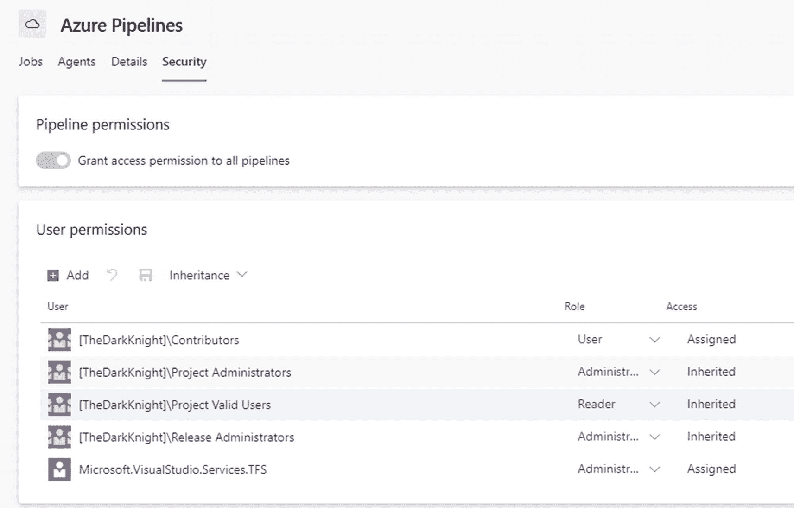

图 2-4

代理池安全性和权限

*   读者–只能查看代理池

*   用户–可以查看和使用池，但不能管理或创建代理池

*   管理员–可以管理、查看和使用代理池

即使是单个代理池，也可以应用与上面类似的单独权限集。

本课解释了什么是代理池以及可用的代理类型。此外，我们讨论了可以使用代理池功能部分来监控自托管代理的功能。最后，我们能够理解如何使用池的安全性部分中可用的权限级别来控制代理池的访问和管理功能。我们将在本书的后续章节中讨论关于代理的更多细节。

## 第 2.02 课:部署组

我们已经在本章的第一课中讨论了代理和池。正如我们已经知道的，代理是帮助执行构建或部署的专用机器。部署组也类似于代理池。部署组是一组安装了代理的计算机。部署组的特点是每台机器都是一个实际的部署目标，专用于每个部署环境，并有一个角色。例如，一个部署组可以拥有一台以 dev 为目标、以 webserver 为角色的机器，它们仅用于部署到 dev 环境的 web 应用。同样，一个部署组为每个部署目标和一个角色配备了一台专用机器。

转到 Azure DevOps 的组织设置。您将能够在 pipelines 部分找到部署池。在此部分，您可以创建和管理部署组。参见图 [2-5](#Fig5) 。

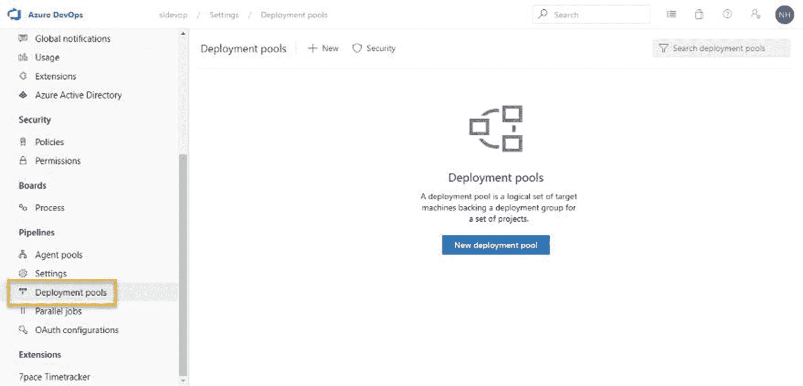

图 2-5

部署池

在配置部署组时，我们可以提供我们将要使用该组的项目。一旦我们创建了一个部署池，它就允许我们选择项目并定位我们需要使用的服务器平台。根据您的要求，Azure DevOps 提供了一个注册脚本，可用于配置部署组。参见图 [2-6](#Fig6) 。

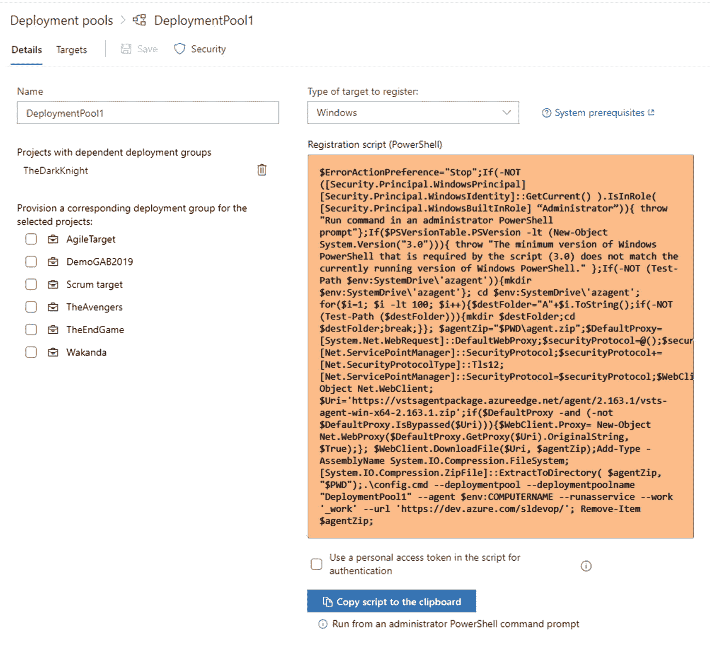

图 2-6

部署组创建

在配置部署组时，使用注册脚本允许您为部署组的每个服务器添加标记，以表示机器的角色。例如，如果您创建一个标记为“Webserver”的服务器，那么您可以使用这个服务器来进行 web 应用部署。因此，在使用部署管道时，可以通过在代理阶段选择部署组来对部署任务进行分组，我们将在以后的课程中更详细地讨论这一点，这将有助于您更好地理解部署组的概念。

在本课中，我们对部署组及其用途有了基本的了解。您将能够在以后的章节中了解更多关于部署组的内容。

## 第 2.03 课:构建管道

在本课中，您将能够对如何构建管道有一个基本的了解。您还将了解什么是构建管道以及为什么使用它。

通过使用持续集成选项，Azure DevOps 构建管道可用于构建您的源代码，以尽早识别代码问题。您可以使用 Azure DevOps 构建管道来构建、测试和创建可部署的代码包。此外，构建可以用来为输出包分配版本号。

转到 Azure DevOps 项目，并从左侧窗格菜单中选择“管道”。您可以看到可以创建构建管道的管道部分。参见图 [2-7](#Fig7) 。

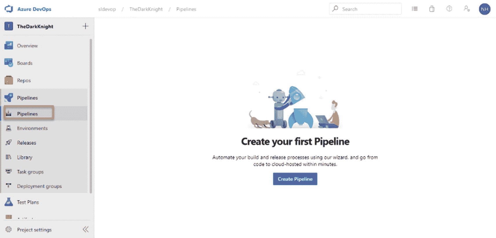

图 2-7

构建管道

Azure DevOps 支持两种类型的构建:即经典构建和 YAML 非标记语言(YAML)构建。经典编辑器允许您使用图形视图，并根据您的要求创建构建管道。但是当涉及到 YAML 构建时，您需要很好地理解 YAML 语法，以编写声明性脚本来将构建管道定义为代码。

构建管道的主要目的之一是从源代码创建可部署的包。但是，为了使用 Azure 版本，并不强制将代码保存在 Azure DevOps repos 中。Azure DevOps 允许你使用几个源代码控制系统。例如，如果您的源代码在 Bitbucket 中，您可以在 Azure DevOps 构建管道中构建 Bitbucket 代码。Azure Pipelines 支持广泛的存储库，如 Azure Repos、GitHub 和 GitHub Enterprise、Bitbucket、Subversion 和其他 Git repos。

在 classic editor 中，它允许您选择模板来创建构件或使用空作业，这适用于创建符合您需求的所有步骤。带有空作业的经典构建将如图 [2-8](#Fig8) 所示。

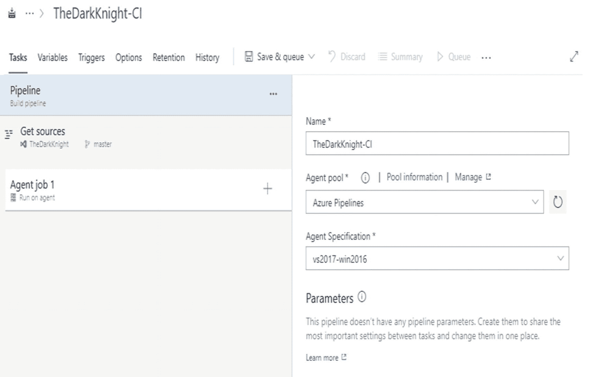

图 2-8

经典编辑器使用空作业构建管道

在构建管道中，有一些代理阶段，允许您在每个阶段下对代理的任务进行分组。Azure DevOps 有两个阶段:

**代理阶段**——与代理池中的代理连接，使用代理池代理执行任务。

**无代理阶段**–它无法连接代理池中的代理。此阶段下的所有任务都将在 Azure DevOps 服务器本身中执行。

构建管道的主要目的是构建代码、测试代码并生成输出包。当生成构建输出时，我们可以在服务器或文件共享上发布包。此外，我们可以生成包，并使用构建管道将这些包推送到 Azure DevOps 工件源。

Azure DevOps 管道中的另一个重要特性是触发器，它允许我们决定何时开始构建。触发器可用于决定新构建何时开始。此外，如果变更来自特定的分支，我们可以定义它，然后只触发一个构建。此外，我们可以使用文件夹路径作为过滤器来控制触发器，这样，如果某个东西被提交到给定的路径，就会触发一个构建。另一个选择是设置构建在给定的时间表上运行。我们将在后面的章节中讨论这些构建触发器。

安全性是任何类型工具的一个非常重要的特性。Azure DevOps 使用几种安全机制来保护整个部署过程。此外，它允许您通过限制每个用户或用户组的访问权限来单独保护每个构建管道。

正如本课中所讨论的，build 主要用于构建、测试和打包源代码作为可部署的输出。我们现在对 Azure DevOps 构建管道的能力有了一个简单的概念。我们将在以后的章节中讨论更多的细节。

## 第 2.04 课:释放管道

本课将介绍释放管道。发布管道，也称为部署管道，用于将版本部署到选定的部署平台。例如，Azure DevOps 发布了管道，可用于将 web 应用、功能应用、逻辑应用和各种类型的工件部署到 Azure 平台。

转到 Azure DevOps 项目并选择 pipelines 部分下的 releases。在此部分，您可以创建和管理所选项目的所有发布管道。参见图 [2-9](#Fig9) 。

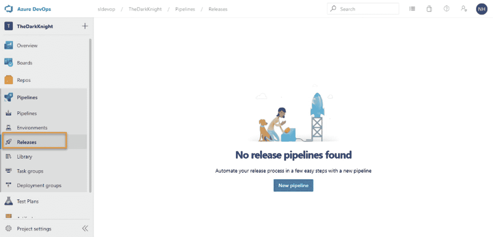

图 2-9

释放管道

发布管道的主要目的是将创建的可部署包部署到目标宿主平台。

Azure DevOps 管道有一个工件部分和阶段部分。工件是发布管道的起点，可用于设置连续部署触发器。需要添加一种类型的工件来启用部署。工件部分允许您选择不同类型的工件，比如构建输出、来自工件提要的包以及像 Jenkins 这样的第三方工件。我们将在接下来的章节中探索 Azure 发布管道支持的所有工件类型。一旦启用了连续部署，就可以使用构建分支筛选器来控制这种连续部署。如果构建是由于给定分支中发生的变更而触发的，那么您可以说 deploy。此外，您可以启用拉请求触发器，允许您决定是否将从拉请求生成的工件部署到给定的目标分支。

在部署管道的各个阶段，您可以定义允许您控制部署的部署前和部署后条件。在预部署条件下，Azure DevOps 有三个主要触发器:手动触发器，在创建新版本后开始部署，如果管道的前几个阶段的部署成功，则触发给定阶段的部署。此外，部署前和部署后批准允许您基于手动批准控制部署流程。可以添加工件过滤器，允许您添加不同的条件。因此，只有满足这些条件，部署才会继续。此外，您还可以添加条件来控制拉式或基于请求的部署。Azure DevOps 具有 gates 特性，可以根据 gate 条件返回值的结果来控制部署。Gates 允许您基于 Azure 函数、REST API、工作项查询和其他几个 gates 来设置各种条件。此外，可以使用预部署条件来控制计划部署。

使用部署管道时，需要在几个阶段暂停部署。例如，一旦您部署到 QA 环境，如果自动化测试用例没有测试应用的合理区域作为覆盖，我们需要等待直到手工测试完成，以继续部署到生产。因此，我们可以在部署前和部署后步骤中设置手动批准。

与任何部署工具一样，Azure DevOps 也引入了几个选项来保护工具。对于部署管道，控制这些部署权限非常重要。否则，如果部署发生在错误的时间并且失去控制，就会给你带来很多麻烦。因此，我们可以通过仅向选定的用户或选定的用户组授予管理权限来单独保护每个部署管道，仅允许指定人员批准对重要目标(如生产)的部署。

本课对释放管道进行了基本介绍。您将在后续章节中了解发布管道的更多功能。

## 第 2.05 课:任务组

本课将向您介绍任务组。正如你已经知道的，我们可以为构建、执行单元测试和创建可部署的包创建 Azure DevOps 构建管道。要将应用的版本部署到目标平台，可以使用部署管道。每种类型的管道都使用任务/步骤来执行构建和部署步骤。有时，当我们在一个项目中工作时，我们会创建一个以上的管道，并且可能在两个管道中使用相同的步骤。如果我们必须创建一百个管道，我们需要创建一百次相同的管道。但是 Azure DevOps 为我们提供了一个任务组功能，我们可以创建一组可以在多个管道中使用的任务，并发送与每个管道相关的参数值。任务组有助于将可实现的、可重用的步骤作为多个管道中的单个块。

转到 Azure DevOps 项目并选择 Pipelines 部分下的任务组。参见图 [2-10](#Fig10) 。

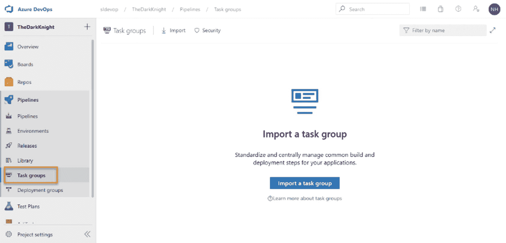

图 2-10

任务组

Azure DevOps 任务组还通过引入安全机制来确保任务组的安全性，我们可以使用这些安全机制来控制项目用户的访问和管理功能。我们将在接下来的章节中讨论任务组的细节以及它们的使用示例。

在本课中，我们能够对什么是任务组有一个基本的概念。我们简要讨论了任务组的目的，这将有助于你继续准备本书的其余章节。

## 第 2.06 课:图书馆

这一课给你一个 Azure DevOps 库的基本介绍。该库可用于将管道的变量值保存为变量组，并将文件存储为安全文件。使用管道时，需要为管道任务定义变量。有时，多个管道之间会共享一些变量。当有这样的需要时，我们可以将共享变量保存在库下的一个变量组中。

转到 Azure DevOps 项目并选择管道下的库部分。您可以在这里添加变量组和管理共享变量。见图 [2-11](#Fig11) 。

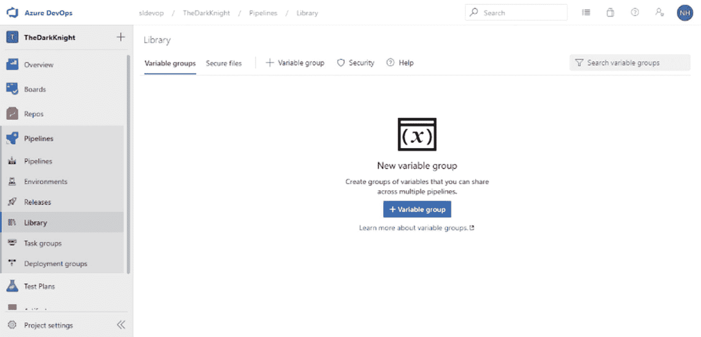

图 2-11

图书馆

除了共享变量之外，Azure DevOps 库还允许你保存安全的文件，比如可以在管道中使用的证书和密钥。因此，您可以将所有受保护的文件保存在库部分。但是如果我们在这里保存受保护的文件，我们需要控制每个文件的访问权限。Azure DevOps 通过允许我们决定哪个管道可以使用受保护的文件以及哪个项目用户可以管理这些受保护的文件来确认这些文件的安全性。

在本课中，我们讨论了 Azure DevOps 库的基本用法。在以后的章节中，你会学到更多关于如何创建和使用变量组和安全文件的知识。

## 第 2.07 课:服务连接

服务连接是部署管道所需的最重要的功能之一。当我们进行部署时，我们需要在我们的 Azure DevOps 组织和外部资源之间创建连接，例如平台服务(如 Azure)、源代码控制提供者或其他外部服务(如 NuGet feeds)等。您甚至可能希望连接到第三方构建和部署平台，或者代码质量检查或代码安全性验证工具。几个例子是Jenkins、章鱼或部署声纳云。简单的云部署目标也是通过服务连接连接到 Azure DevOps 组织的构建和部署的支持工具。

转到 Azure DevOps 项目设置，在管道部分，您可以导航到服务连接部分。参见图 [2-12](#Fig12) 。

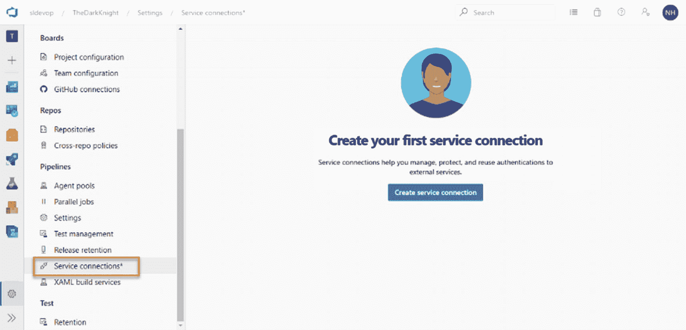

图 2-12

服务连接

Azure DevOps 允许您连接许多工具和外部服务。您可以创建服务连接来连接像 Azure 这样的部署平台。此外，您可以使用服务连接来连接外部源代码控制工具，如 Bitbucket 和 GitHub。在某些情况下，我们尝试使用多种部署工具。因此，Azure DevOps 允许您与 Jenkins 和 Octopus 等服务器建立服务连接。使用服务连接可以连接许多工具。

添加服务连接后，它不应该被项目的所有用户控制。您可以使用权限级别来保护服务连接。对于一个服务连接，我们可以有两个用户权限:

用户–可以使用服务连接，但不能管理它

管理员–可以创建、管理和使用服务连接

本课简要介绍了什么是服务连接，以及它对 Azure DevOps 管道有多重要。此外，我们还了解了一些可以用 service connection 连接的外部工具和服务。我们将在以后的章节中讨论如何创建服务连接以及如何在管道中使用它们。

## 第 2.08 课:环境

Azure DevOps 部署/发布管道可用于各种部署。我们主要做 web app 部署，DB 部署，AKS 部署，功能 app 部署等。如果 Azure 是部署目标，则需要登录 Azure 门户来监控每个部署目标。Azure DevOps 引入了一个新功能，可用于从 Azure DevOps 服务器监控部署目标，而无需登录 Azure 门户。

Azure DevOps 环境部分在 pipelines 下提供。参见图 [2-13](#Fig13) 。

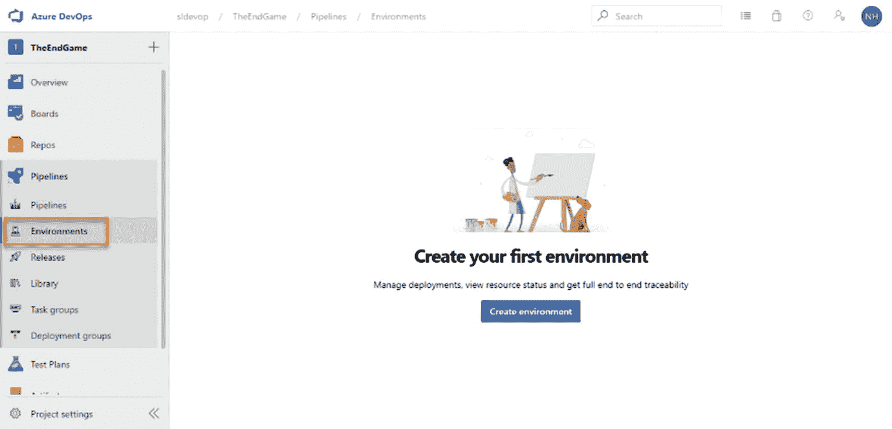

图 2-13

Azure DevOps 环境

Azure DevOps 环境代表了部署管道可以针对的资源集合。作为例子，我们可以使用 Azure Kubernetes 服务的名称空间，在撰写本书时，这些名称空间是 Azure DevOps 环境中的数据库。

Azure DevOps 环境提供了跟踪部署管道历史和部署资源细节的能力。此外，您可以跟踪每个部署环境中部署了哪些变更集，这对于识别部署了哪些特性或错误修复非常有帮助。此外，Azure DevOps 环境有一个非常重要的特性，它提供了部署资源的健康详细信息。因此，它允许用户跟踪部署的应用是否在期望的状态下运行，或者它是否需要更多的关注。

Azure DevOps 环境安全部分允许您使用三种不同的权限级别来控制环境管理功能:

创建者-可以管理、创建和经营环境

读者-可以看到环境

用户–可以创建环境

除了这些用户权限之外，环境只能与允许的管道一起使用。

正如我们在本课中所讨论的，环境可用于跟踪与部署管道相关的资源的性能，这对于跟踪部署到每个目标环境的所有更改非常有用。

## 第 2.09 课:并行管道和计费

正如我们所讨论的，Azure DevOps 有两种主要类型的代理:微软托管代理和自托管代理。但是，当我们使用多个管道进行部署时，我们需要并行部署的能力。否则影响项目的效率。

如果我们使用越来越多的自托管代理来进行并行部署，将会对项目预算产生巨大的负面影响。因此，Azure DevOps 服务器有几个可用选项。

在 Azure DevOps 中，转到项目或组织设置页面，并选择管道部分下的并行作业，以查看您的组织的并行作业功能。参见图 [2-14](#Fig14) 。

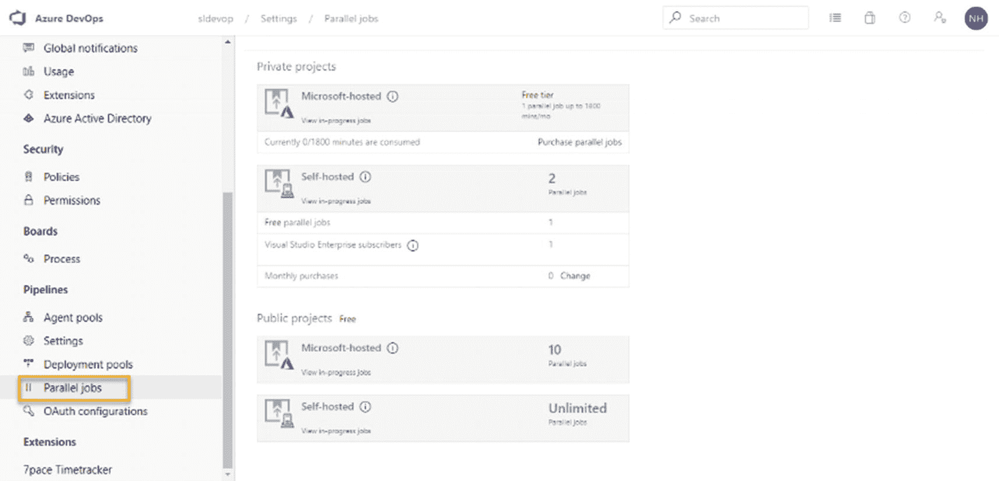

图 2-14

平行作业

当创建 Azure DevOps 项目时，有两个选项作为公共和私有项目。如果项目是作为公共项目创建的，它可以使用 Microsoft 托管的代理，这些代理支持十个并行作业。此外，如果您为一个公共项目创建一个自托管代理，它有无限的并行作业。因此，在不挂起或留在队列中的情况下进行部署非常重要。因此，Azure DevOps 为公共项目提供了多种并行作业执行能力。

如果项目是作为私人项目创建的，Microsoft 托管的代理每月提供 1，800 分钟。此外，它有一个并行作业，这意味着一次只能部署一个管道。对于自托管代理，它也有一个并行作业。但是，如果组织订阅了 Visual Studio Enterprise，则会向自承载代理添加一个并行作业。如果组织有越来越多的订阅，它会将更多的并行作业添加到管道中，作为每个订阅的一个附加并行作业。

当谈到 Azure DevOps 计费时，它免费提供了大多数功能。正如我们之前讨论的，它免费为 Microsoft 托管的代理提供一个并行作业，为自托管的代理提供一个并行作业。董事会和回购是免费的，最多五个用户。此外，它还免费提供高达 2GB 的工件存储空间。

测试在构建和部署周期中也扮演着更重要的角色。因此，Azure DevOps 为测试计划的创建提供了 30 天的免费试用。试用期过后，你就可以购买了。

转到 Azure DevOps 组织设置页面，并选择常规部分下的计费。参见图 [2-15](#Fig15) 。Azure DevOps 计费设置允许用户监控当前计费并为组织设置新的计费。

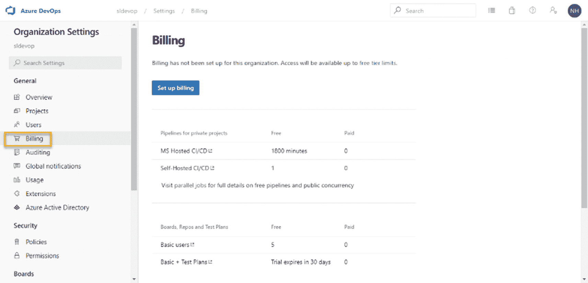

图 2-15

演员表

到目前为止，我们已经讨论了 Azure DevOps 计费和并行管道执行功能。在使用 Azure DevOps 时，这些类型的信息对于决策非常重要。在以后的章节中，您将了解到关于这些计费和并行作业的更多细节。

## 摘要

在本章中，我们讨论了与 Azure 管道相关的几个特性。我们确定了构建和部署管道、Azure DevOps 代理以及代理的使用。然后，我们简要讨论了任务组和库选项。此外，我们还了解了 Azure DevOps 的环境和计费。

在下一章，我们将讨论设置代理池；部署组和其中的代理，这将在本书的剩余部分继续帮助我们。