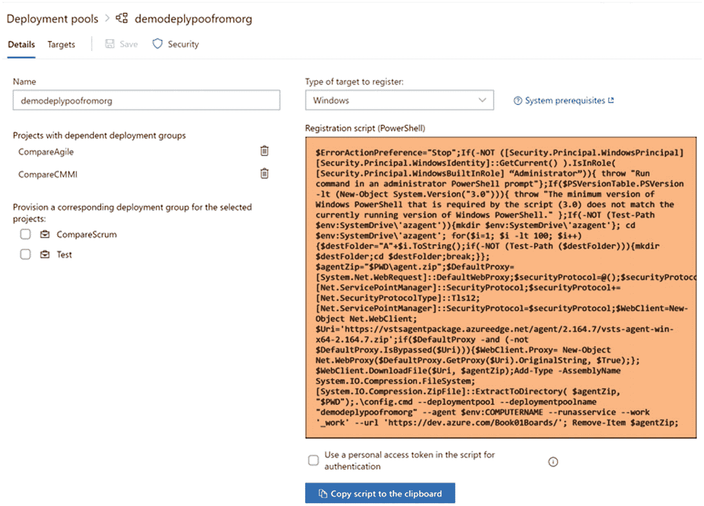

# 3.设置池、部署组和代理

在前两章中，我们讨论了持续集成和交付的概念，并简要探讨了 Azure Pipelines 的概念和特性。这为我们深入研究 Azure Pipelines 的每个特性提供了背景，这将使我们能够理解如何利用 Azure Pipelines 来自动化软件交付过程。

在这一章中，我们将看看 Azure Pipelines 中的代理。正如我们已经讨论过的，我们有两种类型的管道可以在 Azure DevOps 中使用。一个是 Azure Pipelines，它让 Windows、Linux 和 Mac 代理托管在微软服务器上，促进和构建许多类型的软件项目。下一种类型是自托管代理，可用于将您自己机器的虚拟或物理组件添加到您可以在 Azure DevOps 中创建的代理池中。

拥有一个自托管代理的主要优势是可以满足一些我们用 Azure 托管的管道无法满足的需求。其中一个需求是拥有自定义版本的软件需求来构建您的软件项目，例如，如果您需要一个特定的 SharePoint 版本，并且您的项目依赖于 SharePoint 库。Azure 托管的代理没有这种类型的特定需求，这是自托管代理派上用场的情况之一，因为你可以在你的机器上安装任何你想要的软件。

自托管(内部-甚至可以是云虚拟机)代理的另一个好用途是当您尝试部署到内部环境时，其中的计算机位于合作防火墙之后。在这种情况下，Azure 托管的代理看不到 cooperate 防火墙后面的机器。另一种你看不到 Azure 托管的管道的情况是当你使用 Azure App Service Environments(ASE)实现完全隔离和安全时。自托管代理的所有这些场景都有帮助，因为它们可以驻留在协作网络或 ASE 中，并使用所需目标的本地网络可访问性来执行 Azure 管道分配的部署作业。见图 [3-1](#Fig1) 。

图 3-1

视线

首先，让我们看看如何创建代理池并在其中设置权限。然后，通过几节课，让我们将代理添加到我们创建的池中，以了解如何在本章中使用它们。

## 第 3.01 课:设置池和权限

如前所述，我们可以将自托管、内部部署的机器、虚拟机或云虚拟机设置为代理。在设置代理之前，我们需要定义代理池以将代理作为一个组。一个代理池可以有多个分配了相同功能的代理，以使消费构建或发布管道能够在给定时间点利用可用代理的服务。

可以在两个级别上定义池。首先，您可以在 Azure DevOps 组织中定义一个池，并将其添加到所有现有的团队项目中。为此，请单击您的 Azure DevOps 组织中的组织设置，然后单击代理池➤添加池。您可以看到用于设置代理的名为 default 的默认自承载池(如果可用)。见图 [3-2](#Fig2) 。

图 3-2

添加池

将出现一个窗格，允许您为新池提供名称。通过授予权限，可以允许所有管道使用新池中的代理。如果希望以后从团队项目设置中将新池仅添加到所需的团队项目中，请取消选择使新池可用于所有团队项目的选项。见图 [3-3](#Fig3) 。

图 3-3

添加池

添加池后，您可以单击池名称导航到其作业页面，该页面显示代理池正在运行和排队的作业。您可以单击“设置”页面，在“设置”页面中，有一些选项允许将池应用于组织中创建的任何新团队项目。但是，此设置不会为任何现有项目提供已经创建的代理池。见图 [3-4](#Fig4) 。您只能在创建池时将池添加到现有项目中(参见图 [3-3](#Fig3) )，或者通过转到单个团队项目并添加现有池来添加。您可以在设置页面中为池中的代理设置维护计划。见图 [3-4](#Fig4) 。

图 3-4

池设置

维护历史记录将显示为池中的代理执行的任何维护活动。“代理”选项卡允许您将代理添加到池中，在“详细信息”选项卡中，您可以查看详细信息，如池的描述和所有者。

在“安全”选项卡中，您可以为创建的代理池定义权限。如第 [2](02.html) 章所述，在代理池中有三种类型的权限可以分配。读者将被允许查看代理池。服务帐户权限将授予查看代理、创建会话和侦听池分配的作业的权限。管理员可以管理池，并查看和使用它。见图 [3-5](#Fig5) 。

图 3-5

代理池权限

转到团队项目，单击“项目设置➤代理池”导航到“项目设置代理池”页，将代理池添加到团队项目中。您可以添加没有为团队项目设置的现有池，也可以从“团队项目设置”页添加新池。从团队项目中添加池时，它只会被添加到当前团队项目中。如果希望将其添加到另一个团队项目中，可以通过将现有池添加到其他团队项目中来实现。见图 [3-6](#Fig6) 。

图 3-6

将代理池添加到团队项目中

在本课中，我们探索了向 Azure DevOps 组织和团队项目添加代理池的选项。自定义代理池对于设置自承载代理和使用不同的代理池非常有用，可让您将一组用于相同目的的代理组合成一个池。我们在本课开始时详细讨论了代理池的用处。

## 第 3.02 课:向池中添加代理

您可以将虚拟机或物理机设置为自托管代理。这些代理可以添加到名为 Default 的池中，这是默认的自承载代理池；或者如前一课所述，您可以向团队项目中添加自定义池。我们可以使用这些池来添加代理。要将代理添加到池中，您需要在添加代理的池中分配管理员角色。您可以在项目或组织的设置中进入该池。

有三种类型的计算机(Windows、Linux 和 Mac)可以设置为自托管代理池中的代理。设置每种类型的代理的说明可以在面板中找到，该面板通过单击“项目/组织设置”“➤代理库”,然后单击“代理库名称”“➤新建代理”按钮来加载。参见图 [3-7](#Fig7) 。

图 3-7

新代理

让我们从将 Windows 计算机作为代理添加到池开始。您只需按照加载的面板窗口选项卡中的说明进行操作。参见图 [3-8](#Fig8) 。

图 3-8

Windows 代理安装说明

您也可以点击图 [3-8](#Fig8) 所示的下载按钮，手动下载代理 zip 文件。然后将其提取到一个文件夹中。使用命令提示符或 PowerShell 窗口，运行 config.cmd 并按照提示进行操作。您必须提供 Azure DevOps 组织 url。然后你需要提供一个个人访问令牌(PAT ),我们已经在本系列的 Azure Boards 手册中讨论了如何创建一个。PAT 需要定义代理池管理和读取范围。您可以不使用 PAT，而是使用 negotiate 或 alt 作为身份验证选项，并提供用户名和密码来注册代理，或者使用集成身份验证类型来使用登录的 windows 凭据。您使用的凭据只需要设置代理，而不是用于维护代理与 Azure DevOps 的连接的凭据。因此，您不需要在设置代理后保持 PAT 或其他凭据处于活动状态，因为代理和 Azure DevOps 在设置代理时使用不同的机密令牌设置进行通信，这对您是不可见的。您可以从图 [3-8](#Fig8) 所示的详细说明链接中获得详细信息。您可以提供代理需要加入的代理池的名称。只要代理不需要执行任何交互活动，将代理作为服务运行是明智的。在您需要运行需要桌面交互的 UI 测试的场景中，您可以将其配置为具有自动登录选项的交互。见图 [3-9](#Fig9) 。

图 3-9

配置代理

或多或少，以类似的方式，您可以按照图 [3-8](#Fig8) 所示面板中选项卡中的说明，在 Mac 或 Linux 中设置代理。代理注册后，它将在代理池的“代理”选项卡中可用，并且可以执行由代理池分配的作业。可以启用或禁用代理，以便允许池向其分配作业。见图 [3-10](#Fig10) 。如果您在池中的给定代理上执行维护任务，例如应用安全补丁、安装软件，甚至应用 Windows 更新等，这将非常有用。

图 3-10

池中的代理

您可以单击代理来查看其作业和功能。“作业”选项卡将显示代理已执行和正在进行的作业。“功能”选项卡将显示代理的系统功能，您可以添加手动功能作为键和值，以便这些功能可用于构建和发布管道中的需求代理。这些需求如何工作将在第 [4](04.html) 章中讨论。见图 [3-11](#Fig11) 。

图 3-11

用户能力

关于向池中添加代理的课程到此结束，在该课程中，我们探索了在何处可以找到为所有平台在池中设置代理的说明。此外，我们以基于 Windows 的代理为例，讨论了设置代理的重要信息。此外，本课还解释了如何为自托管代理定义用户功能以及如何查看系统功能。

## 第 3.03 课:设置部署组

部署组可用于将部署目标保存在机器中。一个部署组可以注册多台机器，可以在这些机器上设置一个部署代理，标记不同的角色，如 webserver、dbserver 等。，表示该计算机在部署组中的用途。

在 Azure DevOps 组织级别，您可以在设置中找到部署池。部署池允许您与多个团队项目共享一个部署组。从“组织设置”中，您可以定义新的组织池。见图 [3-12](#Fig12) 。

图 3-12

创建新的部署池

如果需要，可以在创建部署池时将部署池设置为选定项目中的部署组。见图 [3-13](#Fig13) 。

图 3-13

新部署池

创建部署池后，您可以单击池名称，通过执行适用于 Windows 和 Linux 机器的脚本将机器添加到池中。下拉菜单允许您根据机器类型选择操作系统和可用的脚本更改。您可以单击 Use a personal access token 选项，将 PAT 嵌入到脚本中，这样它就可以在最少交互的情况下自动执行，将一台机器设置为部署组中的目标。您可以在 Azure DevOps 组织中的其他现有团队项目中设置部署组/池，甚至可以从当前设置的团队项目中移除部署组。见图 [3-14](#Fig14) 。

图 3-14

部署池详细信息

在“安全性”选项卡中，您可以定义部署工具的安全性。您可以定义四种类型的角色，并将用户或组添加到池权限中。管理员可以查看、管理和使用部署池。用户角色可以使用该池在团队项目中创建部署组并查看该池。服务帐户可以查看部署池中的代理/目标，并侦听池中的作业。读者只能查看池。参见图 [3-15](#Fig15) 。

图 3-15

部署池安全性

您可以展开 Azure Pipelines 左侧菜单，在那里您可以找到 deployment groups 子菜单，在这里您可以创建部署组或部署池中已经可用的配置作为部署组。见图 [3-16](#Fig16) 。

图 3-16

部署组

添加新部署组时，可以为其提供名称和描述。见图 [3-17](#Fig17) 。

图 3-17

从项目创建部署组

一旦在项目中创建了部署组，您就可以通过与其他团队项目共享它来在其他团队项目中提供它。参见图 [3-18](#Fig18) 。

图 3-18

共享部署组

在部署组中，您可以为角色读者设置安全性，读者只能查看该组；可以在管道中使用组的用户；以及可以管理和使用该组的管理员角色。与部署池窗口类似，团队项目中的部署组允许您复制并使用脚本在所需的操作系统、Windows 或 Linux 中创建目标。参见图 [3-19](#Fig19) 。在 targets 选项卡中，您将能够看到部署组的目标。

图 3-19

部署组详细信息

在项目中创建的部署组在组织设置中作为部署池提供，您可以在其中为项目、目标或设置安全性提供该部署组。见图 [3-20](#Fig20)

图 3-20

部署池

在团队项目中，可以使用组织的现有部署池来设置部署组。见图 [3-21](#Fig21) 。

图 3-21

将可用池作为一个组进行资源调配

在这一课中，我们学习了如何创建可在 Azure 管道中使用的部署组来完成部署。

## 第 3.04 课:向部署组添加目标

部署组中的目标是可以设置为参与部署的目标计算机、目的地或可以在 Azure 管道中使用的目标。您可以将 Windows 或 Linux 机器设置为部署目标，这在您的软件系统是本地的或者基础设施虚拟机设置在云平台上时非常有用。

若要添加部署目标，可以转到“组织设置”中的部署池或团队项目中的部署组。打开部署细节后，您可以找到可以在 Windows 或 Linux 机器上复制的脚本。选择个人访问令牌选项以在脚本中嵌入 PAT，以便它可以通过 Azure DevOps 进行身份验证来设置部署目标。通过复制上一课中所示的脚本，并使用管理权限在目标计算机 PowerShell 或终端 windows 中执行它，这将设置一个代理，并将目标计算机添加为部署组。见图 [3-22](#Fig22)

图 3-22

将目标计算机注册到部署组/池

与代理池代理类似，目标和部署组之间的通信是使用不同于您用来设置的 PAT 的令牌来维护的，因此不需要 PAT 处于活动状态来保持目标对部署组可用。

一旦将目标添加到池/组中，它将可用于使用相同池的部署组提供的项目。见图 [3-23](#Fig23) 。

图 3-23

部署池与目标一起添加

您可以向目标添加标记，以定义其在部署过程中的角色。见图 [3-24](#Fig24) 。

图 3-24

目标用 WebSrv 标记

但是，当您在多个项目中使用部署池来设置部署组时，可以在不同的团队项目部署组中为同一目标定义不同的标记。简单地说，这意味着同一台计算机可以作为目标位于同一部署池中，但可以作为不同的部署目标角色在不同的团队项目部署组中使用。见图 [3-25](#Fig25) 。

图 3-25

不同项目中的部署目标使用相同的部署池

在本课中，我们讨论了在部署组中设置目标的选项，这将有助于部署到您自己的内部或云基础架构的目标。

## 摘要

在这一章中，我们探讨了如何创建一个自托管的代理，它可以促进自定义构建管道的执行，并满足微软托管的 Azure Pipelines 代理的特殊软件需求。此外，如果您有备用机器或您自己的带有虚拟机的数据中心，您可能更愿意通过在您自己的代理池上注册它们来将它们用作构建代理。此外，我们还讨论了部署组和目标，以及如何设置它们来促进您自己的基础设施上的软件部署。

在下一章，我们将探索使用经典编辑器创建 Azure 构建管道的选项。