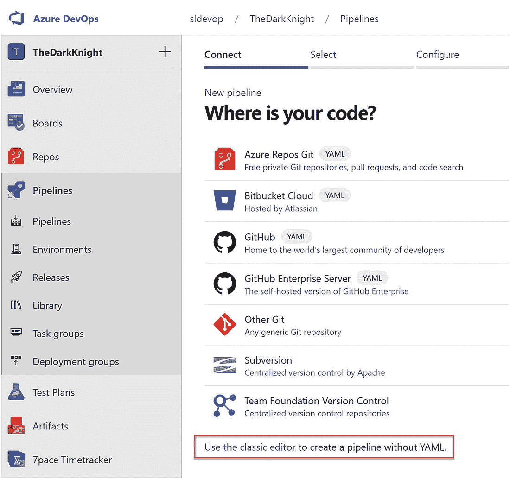
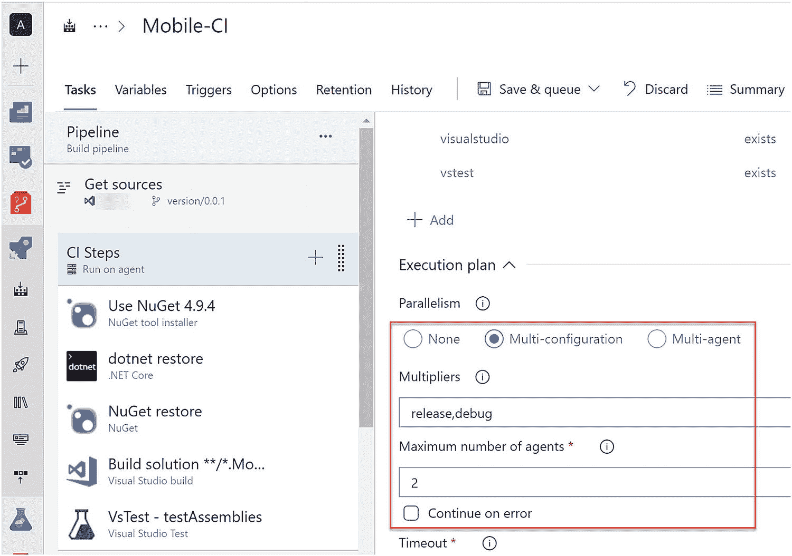
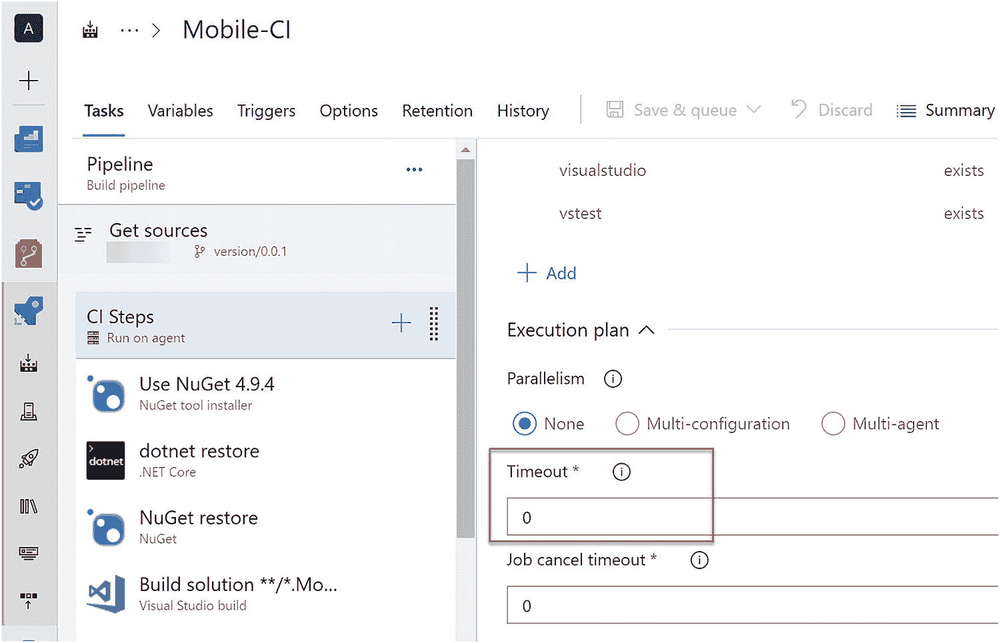

# 四、创建构建管道——经典——源代码管理、模板、作业和任务

构建管道允许您编译源代码，运行单元测试，并将您的代码发布为可部署的工件。在经典的构建管道中，您可以轻松地拖放步骤，并以非常直观的方式设置管道。您可以使用构建管道中的几个可用设置来确定其行为。在接下来的三章中，我们将详细探讨这些特性及其用法。

在本章中，我们将讨论 Azure DevOps 构建管道的几个部分。您将能够经历从选择源代码到构建和打包已构建的二进制文件以供发布的整个构建过程。

## 第 4.01 课:使用源代码管理提供程序

构建管道的主要目的是构建源代码、执行单元测试，以及将构建的源代码发布和打包为可部署的工件。我们需要从源代码控制库中选择源代码来构建。

构建管道创建的第一个重要特性是选择源代码报告。Azure DevOps 提供了两个内置的源代码管理提供程序。它们是被称为 team foundation 版本控制(TFVC)的集中式源代码控制 repo 和分布式源代码控制 repo Azure Git。因此，可以使用 Azure DevOps 将项目源代码作为 Git 源代码控件或 TFVC 来管理。但是当我们在 Azure DevOps 中创建构建管道时，它并不局限于它们自己的源代码控制仓库。您可以使用 Azure DevOps 构建管道连接外部源代码控制仓库，如 GitHub、Subversion、BitBucket 和其他 Git 仓库，并创建构建包。

转到 Azure DevOps 管道部分。开始创建新的构建管道。Azure DevOps 有两种类型的管道:YAML 构建管道(我们将在第 [8](08.html) 章讨论)和经典构建管道。选择 classic 编辑器，然后它会引导您到可以选择存储库的部分。见图 [4-1](#Fig1) 。

图 4-1

经典编辑器链接

经典编辑器是构建管道创建的更直观的版本。Azure DevOps 经典编辑器允许编码经验较少的用户轻松创建构建管道。在构建管道创建的开始，您可以选择您的源代码所在的存储库。见图 [4-2](#Fig2) 。

图 4-2

选择存储库

正如我们之前提到的，Azure DevOps 内置了两种类型的源代码控制:即 Azure Git Repo 和 Team Foundation 版本控制(TFVC)。这两个存储库都可以用来保存项目的源代码。

如果您选择 Azure Git repo 作为源，它将允许您从源选择页面中可用的下拉列表中选择团队项目、相关存储库和分支。选择相关值后，通过单击 continue 按钮继续构建创建过程。

选择空作业并创建构建管道。见图 [4-3](#Fig3) 。

图 4-3

选择空工单

创建构建管道后，您将能够看到“获取源代码”部分，该部分允许 Azure DevOps 用户更改源代码并更新所选源代码的值。

如果您继续使用 Azure Git repo，您也可以从这里选择 Azure DevOps 项目、存储库和分支。除了这三个值，它还允许我们为管道提供一些重要的配置值。参见图 [4-4](#Fig4) 。

图 4-4

Azure Git repo 作为源

图 4-5

源 Repo 构建标记和构建状态

1.  Clean:通过将值选择为 true 来启用 clean，以便在运行构建之前清理代理中的构建工作区。

2.  标记源代码:在每次构建或每次成功构建后，您都要在源代码中添加一个标记。如果您选择值为“成功时”或“总是”，它允许您决定标记格式。标记允许您跟踪由该版本生成的变更集/提交。此外，如果需要，您可以使用标签创建一个新的分支。在回购的“历史记录”标签中可以看到这些标签。参见图 [4-5](#Fig5) 。

图 4-6

显示构建状态

1.  报告构建状态:显示源库中的构建状态为成功或失败，如图 [4-6](#Fig6) 所示。

1.  签出子模块:如果选择了此选项，将允许构建管道从同一存储库或外部存储库中的子模块中签出文件。

2.  从 LFS 签出文件:如果选中，此选项将在签出生成期间在生成代理中签出大文件，如音频和视频文件。

3.  不同步源代码:这将不会在签出过程中同步源代码。

4.  浅层获取:它允许您决定需要获取多少提交。

到目前为止，我们已经讨论了当我们选择 Azure Repos Git 作为源代码控制时，Azure DevOps 中可用的功能。

让我们讨论一下当我们选择 TFVC 作为源时可用的特性。参见图 [4-7](#Fig7) 。

图 4-7

TFVC 作为来源

一旦您选择 TFVC 作为源，它允许您决定工作空间映射。您可以决定使用这个构建来构建哪些源代码。

1.  类型:有地图和斗篷两种。如果选择“映射”,它会将给定服务器路径中的选定文件夹映射到使用此生成管道进行的生成。如果您选择遮盖，它会排除选定文件夹的内容。

2.  服务器路径:选择要在此版本中包含或排除的源代码。

3.  $(build.sourcesDirectory)下的源路径:决定源中需要包含在构建中或从构建中排除的文件夹。

一旦您使用 TFVC 作为源创建了一个构建管道，它允许您随时更改工作区映射。除此之外，您可以在构建之前清理工作目录，并在构建成功完成时用构建号标记构建。

除了使用 Azure Git 和 TFVC 回购，Azure DevOps 允许您使用以下外部回购:

1.  开源代码库

2.  GitHub 企业服务器

3.  破坏

4.  云的碎片

5.  其他 Git 休息

选择所需的外部回购并授权与其连接。之后，您可以使用 Azure DevOps 构建管道在外部 repo 中构建和打包源代码。

本课讨论了什么是源代码控制仓库，以便您可以连接 Azure DevOps 构建管道。此外，本课还解释了连接内部回购和外部回购的能力。

## 第 4.02 课:使用模板

随着新的开发工具和技术越来越频繁地引入到行业中，构建和部署工具也需要不断地改进，以便与那些新的开发工具和技术一起工作。Azure DevOps 有各种类型的构建模板，支持并使用多种技术设置构建管道。

当您创建 Azure DevOps 构建管道时，您可以使用空管道或模板来创建它。这一课将解释什么是模板，以及 Azure Pipelines 如何使用它们轻松设置。

我们已经知道，构建管道的目的是从链接的源 repo 中获取源代码，编译并构建源代码，测试源代码，发布代码，最后将发布的代码打包为可部署的包。Azure DevOps 中有各种可用的构建任务，我们可以使用它们来配置构建管道步骤。因此，我们必须一个接一个地添加每个相关的任务来建立一个构建管道。然而，使用 Azure DevOps 构建模板，您可以将特定技术构建设置的多个步骤添加到构建管道中，包括成功构建项目所需的通用配置值，这使得设置管道变得简单明了。

通常，Azure DevOps 构建模板是作为包创建的一组构建管道任务。模板可能包含恢复所需依赖项所需的所有任务，例如 NuGet 包、构建源代码、测试源代码、发布源代码，以及最终创建可部署的包。它还可能包含特定技术类型项目所需的一般配置。在添加了相关的构建模板之后，您可以通过对管道进行微小的更改来完成您的构建管道。因此，对于初学者来说，这使得构建管道配置过程更加容易。Azure DevOps 中有各种构建模板支持构建管道的设置，这些模板使用不同的开发工具和技术。让我们确定几个可用的构建模板。

ASP.NET 核心是一项众所周知的技术。因此，Azure DevOps 有一个我们可以使用的 ASP.NET 核心构建模板，如下所述。

当您创建一个新的管道时，它有一个您可以选择构建模板的步骤。参见图 [4-8](#Fig8) 。

图 4-8

构建模板

单击 apply 按钮后，它将被添加到构建管道中。参见图 [4-9](#Fig9) 。

图 4-9

ASP.NET 核心模板

一旦您将构建模板添加到构建管道中，它就会将所有必要的步骤添加到构建中。在 ASP.NET 核心模板中，我们可以确定以下添加的构建任务。

restore–如果项目源代码中使用了任何 NuGet 包或 Azure DevOps 工件提要，这将恢复所有引用包。

构建–这一步构建选定的项目，并验证源代码的编译状态。

测试——在构建项目源代码之后，接下来我们需要对源代码进行单元测试。此步骤可以配置为执行单元测试。

发布——这一步将准备好构建的二进制文件，以作为网站发布。

发布工件——这将发布可部署的工件。

正如您在上面看到的 ASP.NET 核心模板，所有必要的步骤都包含在模板中，它使构建管道配置对任何人来说都很容易，甚至对没有任何经验的用户来说也是如此。添加模板后，如果有必要，您可能需要做一些小的更改。因此，模板非常有用，它使构建配置过程变得高效。

如果你浏览一些其他的 Azure DevOps 模板，你将能够很好的了解这些模板是多么的有效和有用。如果我们考虑 docker，与直接部署 ASP.NET 核心相比，这是一种完全不同的部署。它需要从您实现的源代码中构建一个 docker 映像。因此，docker 构建管道应该能够连接到源代码，并使用构建步骤构建映像。docker 映像构建步骤需要执行更复杂的过程，如下载 docker hub 或源代码中包含的 docker 文件中引用的其他注册表中可用的 docker 映像。下载 docker 图像后，需要将其转换为 docker 容器。所有的构建过程都发生在这些 docker 容器中，最后它用您的应用创建一个 docker 容器，并将其转换为 docker 映像。Docker 映像是由 docker 构建创建的可部署包。在 docker 中，这些图像需要存储在特定的位置调用注册表中。

所以，在 Azure DevOps docker 模板中，它使用 docker 构建步骤创建一个 docker 映像；之后，使用另一个任务将创建的映像推送到注册表。参见图 [4-10](#Fig10) 。

图 4-10

Docker 模板

你已经看到了 Azure DevOps 模板如何支持两种完全不同的部署技术。即使您对这些技术完全陌生，您也能够使用这些模板轻松地创建一个构建管道。有很多模板可用于机器学习(ML)等最新技术。见图 [4-11](#Fig11) 。

图 4-11

机器学习构建模板

机器学习是一项最新的技术，我们大多数人都不知道如何为机器学习建立一个构建管道。但是 Azure DevOps 推出了一个机器学习模板，可以用来训练一个模型。训练模型时，需要在 Azure 中创建一个 ML 工作空间。为了创建工作区，我们通常使用 Azure CLI(命令行界面)命令。要使用机器学习，需要安装 Azure CLI ml 扩展。因此，在管道开始时，使用模板中的第一步，您可以准备代理来使用 Azure CLI ML 命令。基本上，机器学习是开发一种算法并训练数据，使其表现为所提供的算法。在训练模型之前，需要创建工作空间。创建工作区之后，您可以使用后续步骤来训练模型并部署它。所有这些步骤都可以通过为每个步骤提供相关数据，使用 Azure DevOps 机器学习模板来完成。

Azure DevOps 构建模板为用户创建支持各种技术的构建管道提供了很好的支持。此外，对于任何人来说，即使没有这些不同技术的经验，开始设置构建管道也是一个不错的选择。

## 第 4.03 课:使用多重职务

正如您已经知道的，CI 和 CD 是现代软件开发过程中非常重要的一部分。它将自动化复杂的软件构建和测试流程，如果您手动完成，这会给您带来很多麻烦。有时我们需要用不同版本的框架来构建代码，有时我们需要用不同的平台来构建代码。创建一个好的可部署包需要遵循很多场景。当您需要创建需要多个框架或平台支持的复杂构建管道时，Azure DevOps multiple jobs 提供了很好的帮助。

代理作业(也称为代理阶段)是您可以定义用于执行构建管道下的任务的构建代理的阶段。此外，代理作业/阶段可用于定义与该代理阶段下的所有任务相关的一些配置。

代理阶段允许您选择代理池和相关代理。正如我们在之前的课程中已经讨论过的，我们知道我们可以根据项目和计费要求创建托管代理和私有代理。在某些情况下，您可能需要使用托管代理中可用的某个特定框架版本来构建 agent 应用。因此，您可以为该代理阶段选择托管代理池。此外，可能会有一些情况，例如当您需要在代理中安装特定的框架版本时，如果代理中有相同框架的其他版本，则构建会失败。因此，在这种情况下，最好只使用特定的框架版本来创建私有代理。一个这样的例子是需要 SharePoint 版本，这在托管代理中是不可用的。因此，您可以使用代理阶段来决定是使用私有代理还是托管代理。

此外，项目需求代码必须使用特定版本的框架进行编译。例如，您需要一个具有。已安装. net framework 3.5。因此，您可以使用代理阶段的需求部分添加这些类型的需求。您可以设置具有特定框架版本的生成代理，并根据需要设置代理名称或特定功能。当 build 被触发时，它会搜索与代理阶段中定义的需求相匹配的代理。

如图 [4-12](#Fig12) 所示，您可以根据需要添加代理名称和代理版本。然后，当构建触发时，它将搜索满足需求中提到的所有需求的代理。与图 [4-12](#Fig12) 中提到的需求一样，它将在代理池中搜索名为“Agent01”且代理版本为“2.107.0”的代理，并使用该代理运行管道任务。

图 4-12

代理阶段需求

到目前为止，我们已经讨论了代理阶段的一些功能。现在让我们讨论一下在同一个构建管道中需要使用多个代理阶段的情况。在移动开发业务中，开发人员通常需要在 iOS 和 Android 平台上发布移动应用。此外，对于两个平台，有必要在相同的内部版本号下发布这些版本。我们可以通过使用相同的构建管道来构建 Android 和 iOS 应用，在同一构建中利用多个代理阶段，并将一个代理设置为 MacOS for iOS 应用，另一个根据 Android 应用的需要设置为 Windows 或其他平台。参见图 [4-13](#Fig13) 。

图 4-13

iOS 和 Android 的代理阶段

例如，我们可以创建一个包含三个阶段的构建管道，其中一个阶段可以用于通过运行单元测试来测试代码。对于代理阶段，您可以选择一个可以运行单元测试的代理。另外两个代理阶段可以使用两个不同的代理分别构建 Android 和 iOS 代码。iOS 使用 Mac OS 代理，Android 使用池中合适的 Windows 代理。通过使用多个代理阶段，您可以实现两个主要的构建需求。一个是你可以使用同一个构建管道，用同一个构建号为不同的平台构建一个移动应用。此外，您可以快速完成构建过程，因为代理阶段可以并行运行，而不会相互依赖。并行执行使构建过程更加高效并节省时间。参见图 [4-14](#Fig14) 。

图 4-14

代理阶段并行配置

我们已经讨论了代理阶段如何独立工作，如何并行构建而不相互依赖。可能存在代理阶段需要相互依赖的情况。考虑这样一种情况，您需要使用具有特定软件需求的代理来构建源，并且您需要决定是否继续使用具有单独软件需求的另一个代理来构建源，并且使用来自前一个代理阶段的构建输出。您可以轻松地开发一个构建管道，通过使用代理阶段和设置依赖关系来帮助这些类型的情况更容易地运行。参见图 [4-15](#Fig15) 。

图 4-15

代理阶段依赖性

此外，Azure DevOps 代理阶段具有并行化作业任务的能力。有时会有项目需求，需要使用各种配置(如调试和发布)来构建相同的代码。如果您需要使用不同的配置进行构建，代理阶段具有这种能力。此外，您可以决定并行执行需要使用多少代理，这允许我们为一个配置使用一个代理。如果组织中的代理数量有限，当您使用所有其他构建和发布的多个代理进行并行执行时，可能会遇到麻烦，这些代理需要在队列中等待，直到代理可用为止。因此，您可以定义代理阶段在给定的占用时间内使用的最大代理数量，并保持池中的其他代理可用。参见图 [4-16](#Fig16) 。

图 4-16

多个配置并行构建

构建源代码时，由于不同的原因，构建时间会有所不同。无论如何，为代理阶段定义一个超时值是有好处的。例如，有时您可能会遇到这样的情况:由于构建任务的问题，构建管道会持续运行更长的正常执行时间。在这种情况下，它可能会影响构建和部署过程的生产率。发生这种情况是因为队列中可能有其他生成在等待使用代理，并且长时间运行的生成会影响其他生成的队列等待时间。要控制此类问题，可以添加代理阶段超时，该超时将在指定的持续时间后导致构建失败。它可以减少队列中其他构建不必要的等待时间。除此之外，还可能存在需要更多时间来运行构建管道任务(如测试步骤)的情况。正如你所知道的，一些项目的自动化测试脚本运行在 4 到 5 个小时甚至更长时间，这需要更多的时间设置为代理阶段的超时值。参见图 [4-17](#Fig17) 。

图 4-17

代理超时

代理阶段还有一个有趣的特性，允许 Azure DevOps 用户在构建管道中使用 OAuth 令牌。例如，如果构建管道中使用的 PowerShell 脚本通过 Azure DevOps Rest API 调用来激活其功能，则需要对其进行身份验证才能执行对 Rest API 的调用。因此，您可以使用 PAT(个人访问令牌)作为一个选项来授权对 API 的访问，并将其作为一个参数提供。或者，如果您在管道中启用了“允许脚本访问 OAuth 令牌”,那么您就可以利用这个系统。出于相同目的在脚本中添加 Accesstoken。参见图 [4-18](#Fig18) 。

图 4-18

Auth token(验证令牌)

在本课中，我们讨论了代理作业/阶段和并行执行功能的一些功能和使用场景，以及阶段的依赖性和超时的使用，这将在您使用 Azure DevOps 设置构建管道时对您非常有用。

## 第 4.04 课:使用任务

由于其惊人的能力，Azure DevOps 构建管道可用于提高企业的生产力和效率。正如我们在前面的课程中讨论的那样，它有许多很好的模板。此外，它提供了代理阶段，允许用户创建更有用和更复杂的管道。在这些模板中，我们有可以使用的步骤。类似地，我们可以手动添加步骤/任务来构建管道，以便在代理作业中执行操作。让我们在本课中了解管道任务。

任务是代码段的一个包，创建它是为了在自动化管道中完成一些特定的工作。每项任务都需要几个输入，以便使用您在构建管道中设置为链接的源代码执行操作。此外，这些任务在几个版本中都可用，每个版本都有微小的改进。

正如我们已经知道的，构建管道可以使用构建模板来创建，也可以根据需求通过逐个添加任务来创建。Azure DevOps 中提供了各种任务，有助于执行不同的操作，如构建、测试、打包等。参见图 [4-19](#Fig19) 。

图 4-19

管道任务

使用不同的技术时，需要使用不同的构建任务。作为一个例子，我们使用 ASP 的 ASP.NET 核心构建任务。NET 核心源代码。当我们进行 Android 开发时，我们需要使用 Android 签名任务。同样，Azure DevOps 为不同的技术需求和目的提供了几个构建任务。

在某些情况下，我们需要执行命令来做一些事情。例如，在机器学习构建管道中，我们使用 PowerShell 任务执行 Azure CLI 命令来创建 ML 工作区。我们有 PowerShell、bash 和其他工具作为 Azure DevOps 任务。

我们已经讨论了 Azure DevOps 中可用的内置任务。如果可用的任务不符合您的需求，您可以从市场安装任务。marketplace 提供了各种免费任务，您可以将其安装到 Azure DevOps 组织中，并在管道中使用。然而，marketplace 是一个开放的平台，您可能会发现 marketplace 中的一些扩展任务有时并不可靠或有效。因此，建议使用来自可信提供者的任务，这些提供者具有良好的评论或良好的文档以及任务实现源代码的可用性，这允许您创建自己的版本——可能带有错误修复。最好以可控的方式将这些任务从市场安装到 Azure DevOps 实例中。出于控制目的，仅允许管理员用户安装市场工具。如果没有管理员权限的用户需要安装 marketplace 扩展，他们需要提出请求，以便管理员可以评估和批准此类请求，并安装所需的扩展。参见图 [4-20](#Fig20) 。

图 4-20

管理权限请求

发送请求 admin 后，获取包含所有必要信息的请求邮件。见图 [4-21](#Fig21) 。

图 4-21

市场扩展安装请求

收到这个请求后，管理员可以决定是否安装扩展。此外，如果没有符合您要求的任务，您可以创建自己的自定义任务，并在市场中发布它们，或者仅与您希望共享扩展的 Azure DevOps 组织共享它们。

Azure DevOps 构建管道中的任务具有几乎所有任务都可用的通用配置值，这允许您为任务决定一些控制选项。举个例子，当我们使用管道任务运行测试时，并不是所有的测试都能通过。因此，如果您想要继续构建管道，那么即使测试步骤失败也要运行它，并且您可以使用任务配置来这样做。使用管道时的另一个常见体验是，如果任务将会失败，那么它将花费太多时间来完成。在这种情况下，我们可以设置一个任务超时，在指定的超时时间后，服务器停止任务。参见图 [4-22](#Fig22) 。

图 4-22

任务的常见配置

在处理多个任务时，可能有必要在每个任务之间保持一些相关性。有时，您可以根据情况决定执行构建管道步骤，例如，如果管道不是基于拉请求(PR)触发的。在创建构建管道以构建 PR 请求的情况下，没有必要打包发布的代码，因为这是在将源代码合并到主分支之前完成的虚拟工作，以验证在将代码合并到目标分支之后，代码更改如何影响源代码。为此，您可以设置自定义控制条件，以便在步骤/任务不是由拉请求触发的构建并且所有先前步骤都成功的情况下执行该步骤/任务。参见图 [4-23](#Fig23) 。

图 4-23

NuGet 推送的自定义条件

在本课中，我们探讨了 Azure DevOps 任务用法和常见控制选项。此外，我们还讨论了 marketplace 扩展的用法以及在使用此类扩展时应该考虑的事项。

## 摘要

在本章中，我们已经开始探索经典的构建管道，详细介绍了连接各种源代码控制仓库的方法，以及使用模板来轻松完成构建管道的设置。此外，我们讨论了代理作业的目的和代理作业中的几个设置，它们有助于优化项目的构建执行需求。然后我们看了一下构建任务以及它们的公共控制选项和扩展的使用。

在下一章中，我们将进一步探索经典的构建管道，以了解如何使用变量，如何设置触发器和路径过滤器，格式化构建号以支持软件和软件包的版本控制，以及其他几个有用的构建管道特性和属性。