# 5.创建构建管道–经典–变量、触发器、过滤器、选项和保留

在前一章中，我们看了一些你可以在用经典编辑器设置 Azure 构建管道时使用的特性。这些包括使用不同源代码控制系统的能力、应用公共步骤模板来建立构建、在构建中使用多个作业，以及包括多配置构建的并行性。此外，您还探索了向构建管道添加任务或构建步骤的能力，甚至通过安装 marketplace 扩展获得额外的任务。然后你好好看看任务控制条件和自定义条件的使用，以满足各种场景。

有了这些知识，我们将在本章中逐步了解经典构建管道设置的更多功能，探索如何定义和使用变量，设置构建触发器，包括应用分支保护策略和路径过滤器构建。此外，我们将讨论格式化构建编号；启用、禁用和暂停将工作项链接到生成的生成。应用需求、超时和编辑经典构建的历史；以及保留选项。

## 第 5.01 课:使用变量

变量有助于将构建中使用的多个步骤的设置保存在一个公共位置。它们可以是路径、名称和密码等常用值，甚至是应用程序中使用的配置值。您可以在构建管道中使用两种类型的变量。Azure DevOps 提供的预定义变量可以在 [`https://docs.microsoft.com/en-us/azure/devops/pipelines/build/variables?view=azure-devops&tabs=classic`](https://docs.microsoft.com/en-us/azure/devops/pipelines/build/variables%253Fview%253Dazure-devops%2526tabs%253Dclassic) 找到，你可以将 Azure 管道中的变量定义为自定义变量。让我们试着理解本课中每种类型的变量和用法。

通过使用$(variableName)语法，可以在任何管道任务中使用系统变量和自定义变量。要定义自定义变量，可以使用经典构建管道中的 variables 选项卡。单击 Add+将允许您向管道中添加新变量。预定义变量链接会将您带到有关预定义变量的 Microsoft 文档页面。

如果您的变量包含密码等敏感值，您可以通过输入值并单击挂锁图标将其锁定在每个变量中来隐藏该值。变量值一旦被锁定并保存，就不能再看到。如果您解锁它，该值将为空，您必须再次提供该值并锁定它。

在排队时启用设置的选项将允许您在新构建排队时更改变量的值。System.debug 是一个在排队时设置的有用变量，因为它允许您决定以调试模式运行正在排队的当前构建，在对构建进行排队时发出更多的诊断日志详细信息。这将有助于您识别损坏的构建管道中的问题并修复它们。见图 [5-1](#Fig1) 。

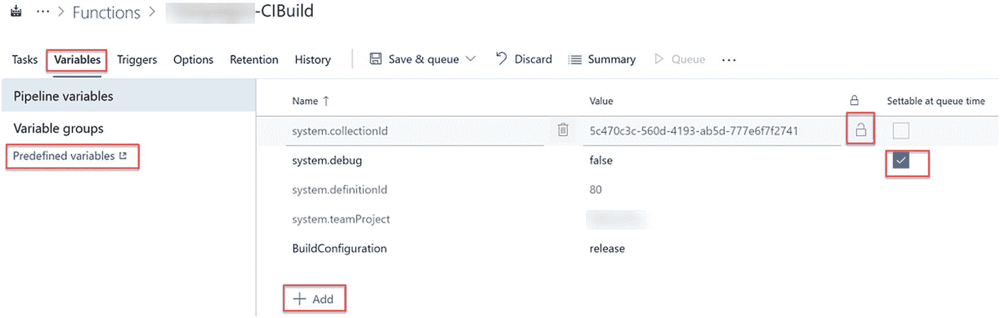

图 5-1

版本中的变量

在对构建进行排队时，您可以单击变量来查看排队时的可设置变量。见图 [5-2](#Fig2) 。

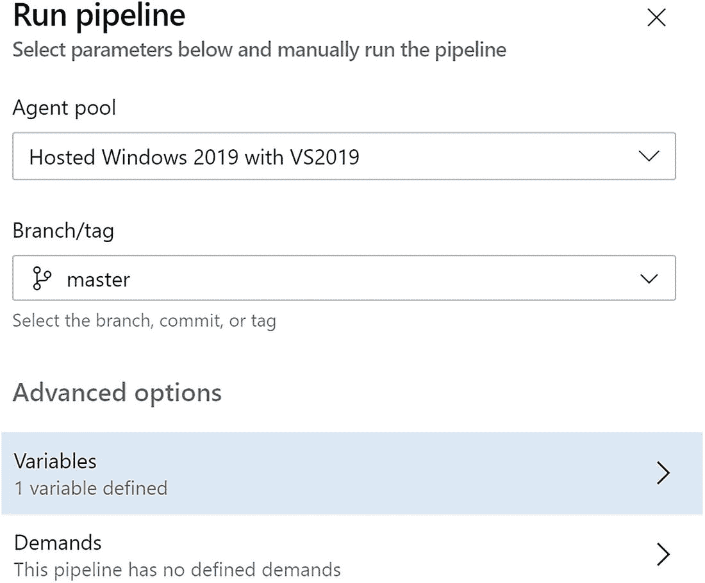

图 5-2

排队时可设置的变量

然后，您可以单击所需的变量来更新它。见图 [5-3](#Fig3)

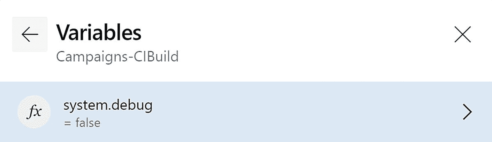

图 5-3

运行管道前要更新的变量

点击变量时，可以更新变量的值。见图 [5-4](#Fig4) 。

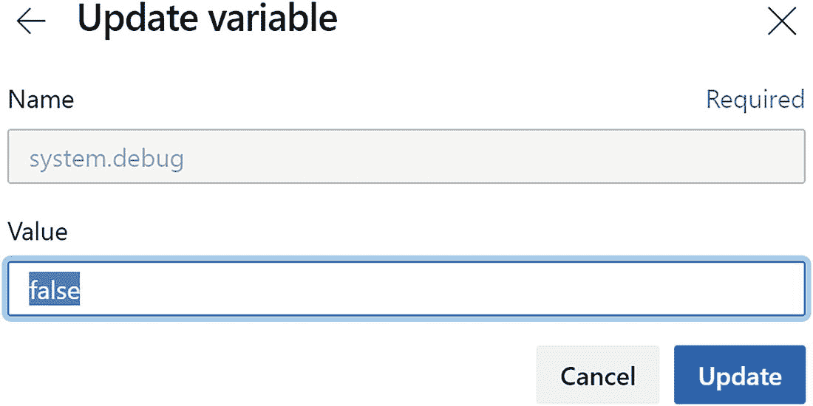

图 5-4

排队时更新变量

变量可以定义为变量组，以便您可以在团队项目中的多个生成管道之间共享它们，甚至可以在生成管道和发布管道之间共享变量。若要在团队项目中定义变量组，可以使用管道➤库的“变量组”选项卡。单击+变量组以添加新的变量组。见图 [5-5](#Fig5) 。

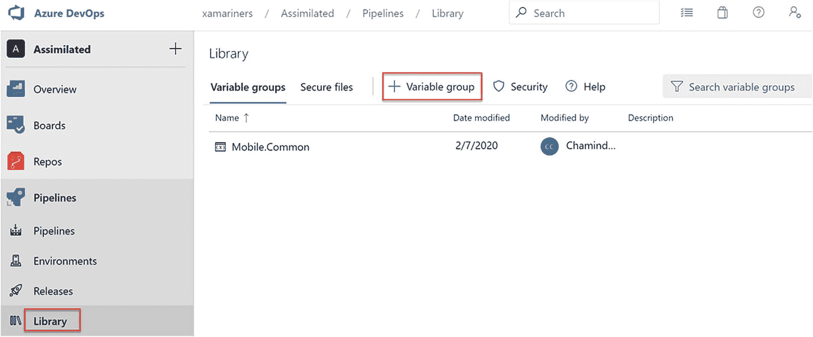

图 5-5

添加新变量组

变量包含一个名称来标识它，您可以为它添加描述。对于变量组，您可以启用对管道的访问，使其可在 Azure 管道中使用。您可以克隆变量组，这对于为多个范围(如部署目标环境)创建相同的变量集非常有用。参见图 [5-6](#Fig6) 。

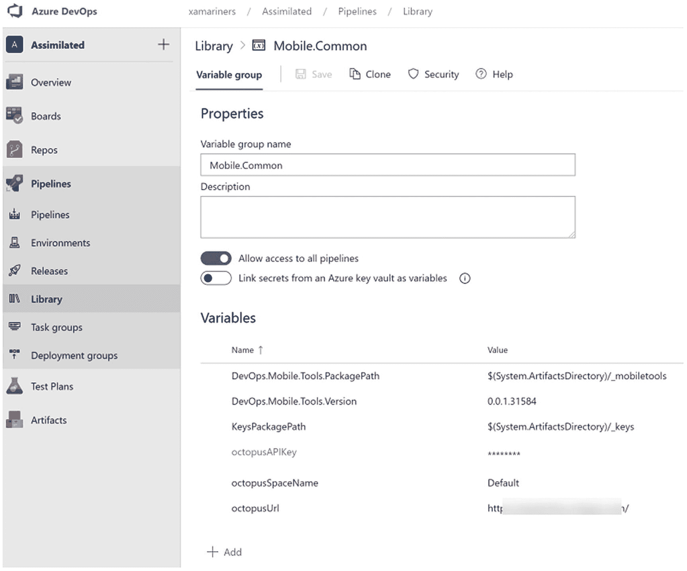

图 5-6

可变组

从 Azure Key Vault 链接机密允许您基于来自给定 Azure Key Vault 的选定变量设置变量组。由于这个功能，您将能够在 Azure Key Vault 中的一个公共安全库中存储您的所有秘密变量，并在所需的管道中使用它们。参见图 [5-7](#Fig7) 。

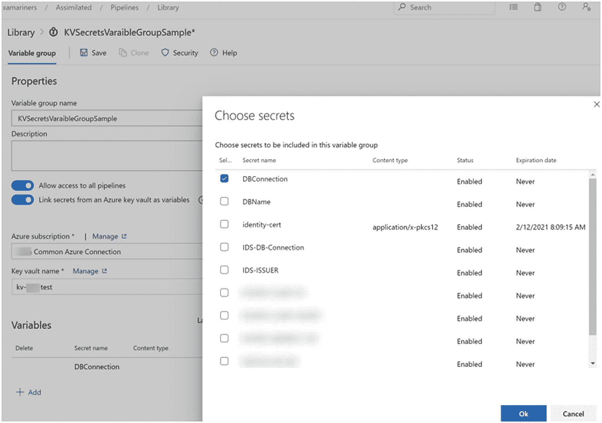

图 5-7

变量组中的 Azure 密钥库机密

在 Azure 构建管道中使用变量组有助于在多个构建管道中共享公共变量。在经典的构建定义中，可以在 Variables 选项卡中选择变量组，并将其添加到构建管道中，以便可以在管道中使用该组中的变量。与构建管道类似，您可以在 Azure 发布管道中使用变量组。您可以将变量组限定在给定的阶段，或者在 Azure 发布管道中发布它们。您可以使用克隆变量组的功能，将同一组变量创建到另一个具有不同值的组中，这有助于您将变量组中每个阶段的值保持在该阶段的范围内。参见图 [5-8](#Fig8) 。

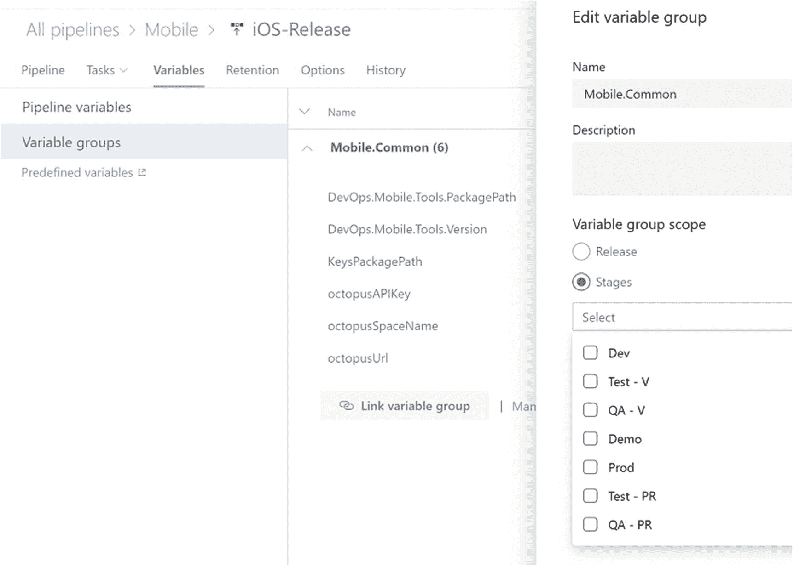

图 5-8

在发布管道中使用变量组

我们已经讨论了变量的用法，如何将它们定义为管道变量，以及如何使用变量组跨管道共享变量。此外，我们还研究了使用 Azure Key Vault 机密作为变量的能力。

## 第 5.02 课:设置触发器和路径过滤器

构建管道可以手动触发。然而，为构建提供不同的触发选项是很重要的。例如，一旦代码被推送到存储库以验证代码编译状态并评估单元测试状态，您可能想要运行构建。或者它可能是您的回归测试验证的夜间时间表。

您可能有一个包含几个项目的大型代码库。想象一个场景，比如一个基于微服务的大型系统的实现。在这种微服务场景中，您可能只希望在为微服务推送的代码发生变化时构建相关的微服务，而不希望构建应用程序的其他部分。因此，对于触发器，它应该有一个过滤机制来确定哪些代码路径应该触发一个构建。

让我们探索构建的不同触发选项。

启用持续集成触发器将使构建在代码被推送到已定义的分支或者分支满足已定义的分支模式时被触发。推送到分支的每个提交都将被构建，您甚至可以在这样的构建中执行单元测试，以确保提交的代码在编译时没有任何问题，并且测试没有中断，从而证明代码的有效性。path filter 选项允许您过滤包含的路径，这样您就可以确保在给定的路径和给定的分支中是否发生了符合模式的代码更改，并在代码推送时进行构建。exclude 允许忽略该路径，以便仅推送到该路径不会触发构建管道。如果一个构建已经处于运行状态，batch changes 选项允许对一个分支的多个推送一起进行批处理，并在一个构建中执行，而不是每次推送都执行一个构建。参见图 [5-9](#Fig9) 。

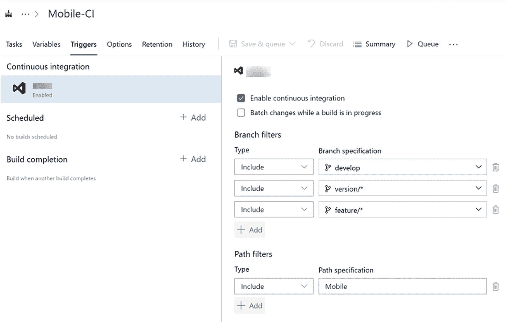

图 5-9

持续集成触发器

调度触发器可用于设置一个触发器，该触发器在一周中所选日期的给定调度时间执行构建管道，并通过定义的分支模式使用所选的一个或多个分支。对于预定触发器，您也可以设置排除分支模式。此外，您可以选择将构建设置为仅在执行最后一个调度构建之后，在源代码或管道中发生更改时才触发。您可以将多个这样的计划作为触发器添加到一个版本中。这种构建调度允许您运行您的构建，比如说每晚运行，或者一天运行几次，根据漏洞扫描来评估您的代码库，并执行长时间运行的单元测试。参见图 [5-10](#Fig10) 。

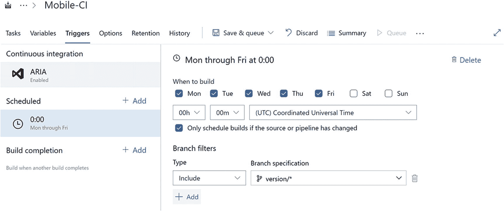

图 5-10

预定触发器

还有另一种类型的构建触发器，允许您创建构建链。此选项允许您基于另一个构建管道的执行完成来触发给定的构建管道。也许您可以在一个时间表中使用一个构建，并在该构建完成后运行另一个构建，这可以让您执行一些相关的步骤或测试运行。或者您甚至可以将多个测试分成不同的构建，并在给定的先决条件构建完成后触发它们。您甚至可以添加 exclude include 分支过滤器模式，以考虑在给定的构建是针对满足所定义的分支模式的分支执行的情况下触发构建。见图 [5-11](#Fig11)

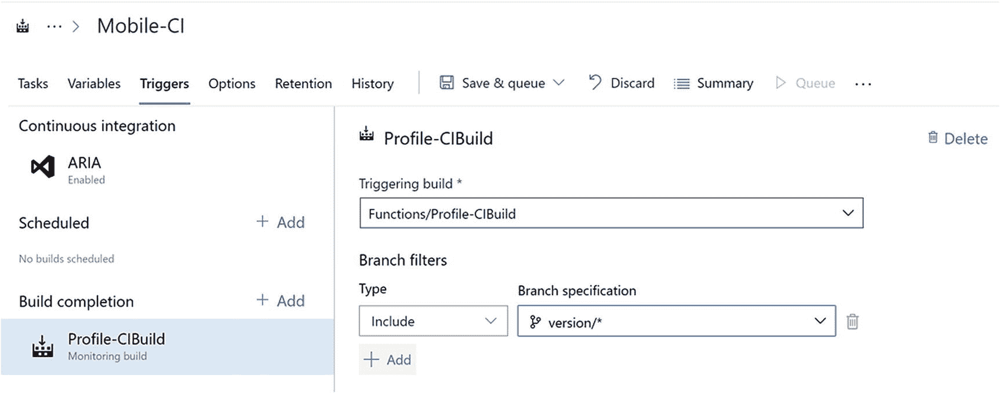

图 5-11

生成完成触发器

在本课中，我们已经了解了可以为构建管道设置的不同触发器，这有助于您基于不同的上下文执行。

## 第 5.03 课:格式化内部版本号

构建号可以用于将版本应用到作为构建管道的输出而生成的包/工件。此外，它允许您正确地版本化您的软件版本。您可以使用 Azure 构建管道来遵循和实现不同的构建号模式，我们将在本课中快速浏览一下。

格式化内部版本号的最简单方法是在给定的生成管道定义中的“选项”选项卡中设置内部版本号格式。您可以使用构件编号格式中的预定义变量来创建具有您偏好的编号格式的构件。参见图 [5-12](#Fig12) 。

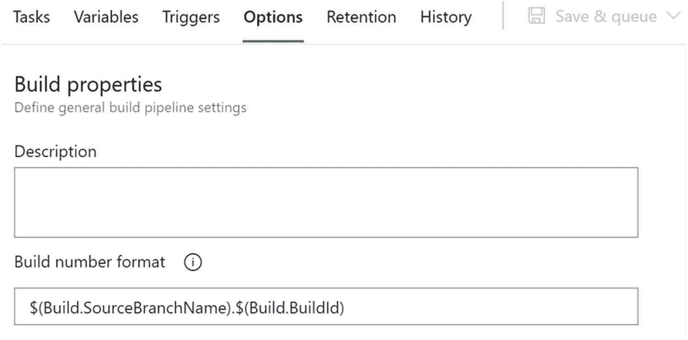

图 5-12

内部版本号格式

$(Rev:r)或 revision 可用于向内部版本号添加修订格式，使每个内部版本号都是唯一的。对于任何内部版本号格式，它都将从 1 开始，并继续增加编号，直到基本格式发生变化。例如，如果您定义您的构建使用一个分支名称和修订，$(Build。SourceBranchName)$(Rev:r)作为编译号格式，对于名为 master 的分支，编译号将是 master.1、master.2，并将继续。如果您构建的分支更改为 develop，它将从 develop.1 开始。＄( Rev:RR)可以用来添加一个两位数的修订号，当修订号是一位数时，前面有一个零。例如，第一个版本的版本号是 01。

可以使用 PowerShell 之类的脚本来操作构建号，这些脚本可以作为构建管道步骤运行。在 PowerShell 中，您可以使用下面的语法来更新当前内部版本的内部版本号。

```
##vso[build.updatebuildnumber]buildnumber

```

例如，以下 PowerShell 语句将 PowerShell 变量$ BuildNumberToSet 的内容作为内部版本号应用于当前内部版本。

```
Write-Output "##vso[build.updatebuildnumber]$BuildNumberToSet"

```

使用 bash 脚本也可以做到这一点。

```
echo "##vso[build.updatebuildnumber]$BuildNumberToSet"

```

您可以使用您的脚本功能来操作您的源代码包版本号和您的内部版本号，以对您创建的包应用正确的版本控制。例如，在 C#项目中，您可以操作 AssmplyInfo.cs 文件、版本信息来更新程序集版本以及在版本中生成的 dll 或 exe 的程序集文件版本。或者在构建任务(比如创建 NuGet 包)中，您可以使用当前的构建号来应用 NuGet 包的版本。参见图 [5-13](#Fig13) 。

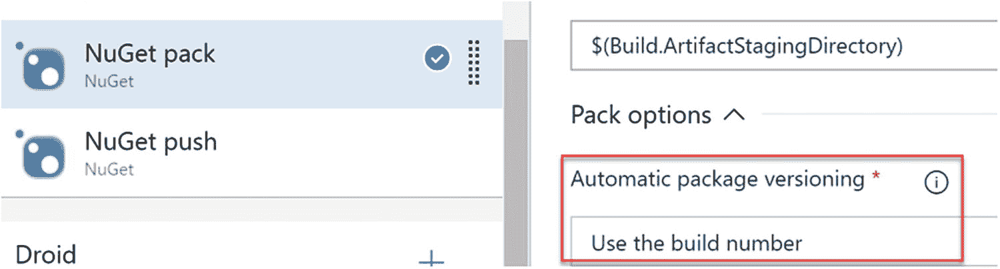

图 5-13

在 NuGet 包中使用内部版本号

使用预定义的变量$(Build ),可以在 Azure 管道中的任何脚本或任务中引用内部版本号。BuildNumber)。

在本课中，我们讨论了内部版本号的用法，以及使用内部版本选项或脚本来设置它。

## 第 5.04 课:启用、禁用和暂停生成

Azure DevOps 中的构建管道允许您保持启用、禁用或暂停它们。让我们看看每个设置的行为是什么，并讨论一下用法。

您可以在生成管道的“选项”选项卡中设置启用、禁用或暂停选项。参见图 [5-14](#Fig14) 。

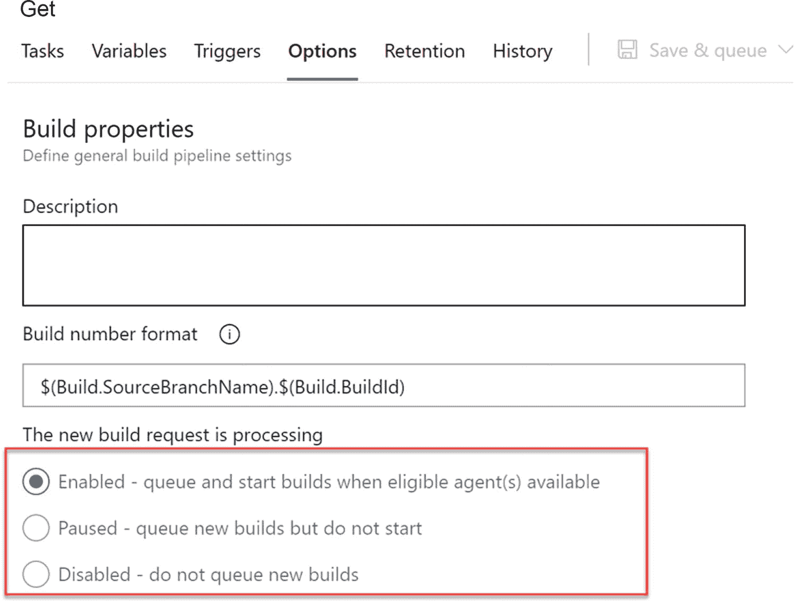

图 5-14

启用、禁用或暂停生成管道

当具有所需功能的代理可用时，Enabled 选项允许构建排队并开始执行构建步骤。这是构建管道的正常预期情况，因为它应该根据其中设置的触发器来触发和执行。

生成管道的暂停选项允许生成排队，但在再次启用生成之前，生成不会开始执行。当您想要提交/推送对可能触发多个构建的源代码存储库的更改，但想要在您设置的构建暂停之前优先执行另一个构建时，此选项暂停很有用。

Disabled 选项在设置为 Paused 或 Enabled 之前不会让生成排队等待触发器。这在对管道进行维护或改进，同时对保存在管道定义中的内容进行中间更改时非常有用，因为这将阻止正在进行的构建管道步骤的执行。

在本课中，我们讨论了构建管道中定义构建管道排队和执行行为的三个可用选项，这使您可以在所描述的预期场景中有效地使用它们。

## 第 5.05 课:生成和工作项

工作条目被用来跟踪你在项目中所做的工作，我们已经在这个关于 Azure Boards 实践系列的第一本书中详细讨论了它们。这些工作项可以被集成到构建管道中，这样它们就可以在部署时被用来生成自动化的发布说明。此外，为了通知构建失败并确保有人对失败的构建负责，我们可以在失败的构建上创建一个工作项。在本课中，让我们看看如何将构建与工作项一起使用。

您可以在构建选项中定义，以便根据关联的工作项自动将工作项链接到与指定分支模式匹配的分支中的提交。一旦构建成功，将会创建与提交相关联的所有工作项的链接，这些工作项是在给定的构建中新构建的。稍后，这些工作项可以用于生成一个发布说明，同时基于先前部署的构建和当前部署的构建部署到一个给定的目标。参见图 [5-15](#Fig15) 。

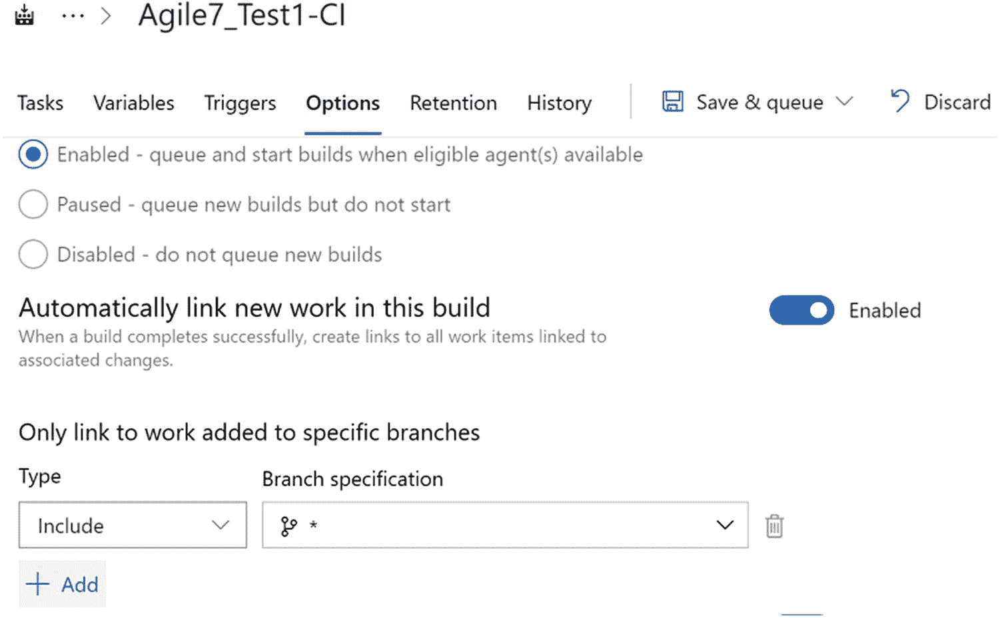

图 5-15

将工作项与版本链接

为失败构建创建工作项允许您选择工作项类型，并使用首选值设置正在创建的工作项的字段值。这些值可以是构建中的变量或您定义的任何其他值。可以将工作项分配给请求者，以便在提交的情况下，将提交用户视为构建请求者，向其分配工作项。失败构建的责任可以分配给提交导致失败的代码的开发人员。这种能力使得失败的构建能够被及时处理，而不会被忽略。参见图 [5-16](#Fig16) 。

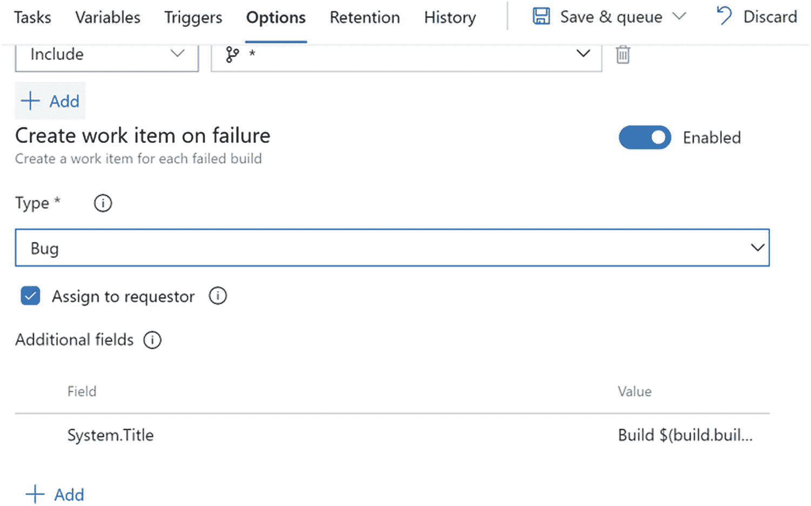

图 5-16

失败生成时创建工作项

在本课中，我们探讨了工作项和构建关联，以及创建工作项来分配构建失败责任。

## 第 5.06 课:构建状态徽章

“生成状态”标志是标识给定生成的当前生成状态的一种有用方式。它可以用于文档，如维基，或任何其他网页等。，您希望在其中报告构建的状态。

状态徽章在构建管道的选项页面中可用。它可以用作三种格式。一个图像 URL 将提供一个构建状态图像，可以在网页或 wiki 页面等中使用。您可以为一个特定的分支使用一个 Image URL，报告给定分支的构建状态。markdown 链接是一种 markdown 语法，因此您可以在任何 markdown 文档(如 wiki)中使用 build 徽章。参见图 [5-17](#Fig17) 。

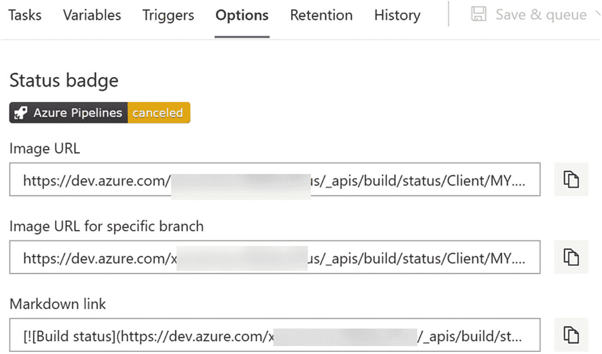

图 5-17

构建状态徽章

在本课中，我们讨论了构建状态徽章，它可用于在文档中显示构建状态。

## 第 5.07 课:其他构建选项

还有几个构建选项值得关注，比如范围、超时和需求。

生成的授权范围可以设置为项目集合或当前项目。项目集合范围允许生成作业访问项目集合级别的信息(Azure DevOps 组织范围)。当前项目限制对当前项目的访问。一个示例场景是使用系统访问令牌和 Azure DevOps 的 REST API 来访问信息的 PowerShell 步骤，这些信息是基于 Azure DevOps 组织/项目集合或当前项目范围的授权范围设置的范围。生成作业超时指定在取消生成步骤之前，生成步骤在给定代理中可以执行的最大分钟数。如果对某个构建作业发出取消请求，如果取消未发生，该作业在服务器终止该作业之前等待的时间(以分钟为单位)由构建作业取消超时决定。

需求允许您定义如何根据代理在给定代理池中的能力来查找代理。您可以将其设置为检查功能是否存在，或者根据需求检查功能值。可以为一个构建作业设置多个需求。参见图 [5-18](#Fig18) 了解本课中讨论的选项。

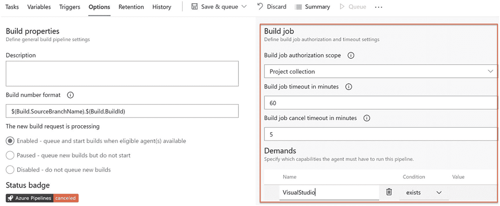

图 5-18

范围、超时和需求

在本课中，我们探讨了一些其他选项，如授权范围、超时和构建作业的要求。

## 第 5.08 课:建立历史和保留

构建历史和保留是 Azure Pipelines 中另外两个有用的特性，值得一看以理解它们的用途和用法。

您对 Azure 构建管道所做的更改会被记录为历史。在对管道进行更改时，可以添加注释，以确保所做的更改易于识别。历史记录可用于比较两个历史记录之间对管道所做的更改。可以将管道恢复到给定的历史点，这在对构建管道进行维护或升级时非常有用。参见图 [5-19](#Fig19) 。

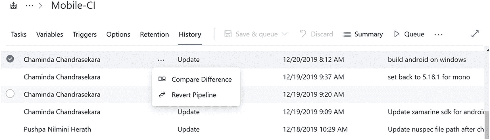

图 5-19

管道历史

构建管道的保留是精简的，可以作为项目设置使用。我们可以设置日期来保持构建的运行，拉请求构建，并在管道中附加工件。即使超过了保留构建的时间限制,“要保留的最近运行的次数”值将决定有多少构建的最后运行将保持可用或保留，而不考虑天数规格。参见图 [5-20](#Fig20)

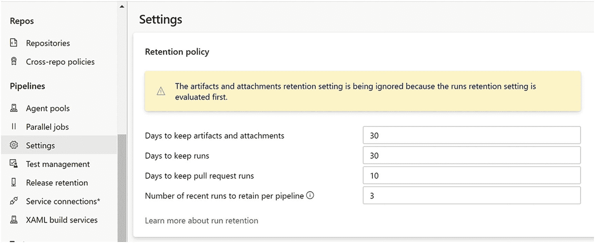

图 5-20

建立保留

在本课中，我们讨论了构建管道历史记录、恢复到管道先前版本的能力以及构建运行的保留选项。

## 摘要

我们已经在本章中详细探讨了变量及其用法。详细讨论了构建的各种触发器和为正确的版本控制目的格式化构建号。此外，我们还研究了构建管道中的其他几个选项和功能，比如启用、禁用和暂停构建管道；失败时创建工作项并启用工作项的链接；构建状态徽章的使用；作业范围和超时；历史；正在还原生成管道；和保留选项。

在下一章中，我们将进一步了解经典构建管道的特性，例如队列、使用 PowerShell 脚本在构建中设置变量、访问脚本中的秘密变量值、使用系统访问令牌、任务组、无代理阶段、发布工件、导出和导入构建管道，以及将构建组织到文件夹中。