# 6.创建构建管道——经典——排队、调试、任务组、工件和导入/导出选项

在前两章中，我们已经讨论了 Azure 构建管道的许多有用特性。在这些文章中，我们讨论了如何使用构建任务、变量、构建作业选项、对构建使用不同的源代码控制系统、使用构建来保护分支，以及其他几个选项和功能来建立构建管道。

在这一章中，我们将探索更多的功能，例如使用 PowerShell 脚本中的变量对构建进行排队并在调试构建模式下启用诊断信息，OAuth 令牌的使用，为可重用性对任务进行分组，无代理阶段的使用，导入和导出构建，以及为可维护性将构建组织到文件夹结构中。

## 第 6.01 课:排队生成和启用调试模式以获取更多诊断信息

在使用构建管道时，我们需要学习如何快速修复构建失败。考虑这样一种情况，您正在发布一个关键的客户机版本，并且需要快速地将其推向生产，但是如果您的构建失败了呢？当这些类型的失败发生时，你们可能都经历过来自团队的压力。为了快速解决构建失败，有必要快速识别问题。构建失败后，我们需要阅读构建日志来了解失败的原因。但是有时提供的日志数据不足以确定失败的真正原因。让我们看一下同样的构建任务日志，调试状态为 false，调试状态为 true，看看我们在调试模式打开的情况下诊断问题时得到的好处。

以下 NuGet restore 任务已在调试模式设置为 false 的情况下执行。它有 178 条日志线。见图 [6-1](#Fig1) 。

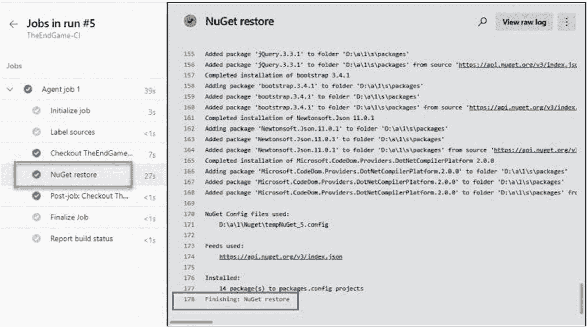

图 6-1

带有调试错误状态的构建日志

如果我们在变量(system.debug 变量)中将 debug 设置为 true 来运行同一个构建，您可以看到两个日志之间的差异。它比前一个提供了更多的细节。如下图所示，相同的 NuGet 恢复步骤有 785 个日志行，这意味着它提供了比 debug false 更多的信息。见图 [6-2](#Fig2) 。

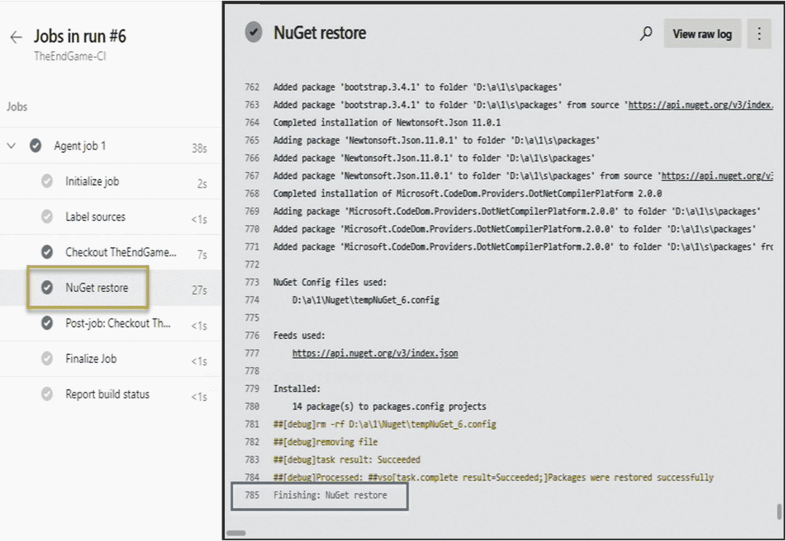

图 6-2

构建调试为真的日志

因此，在构建失败后，执行将调试值设置为 true 的构建，这提供了更多的细节，您可以使用这些细节轻松地确定构建失败的原因。

本课讨论了我们可以将 debug 变量值设置为 true，并获得有关失败的更多信息，通过这些信息，我们可以轻松地识别构建中的问题。

## 第 6.02 课:在 PowerShell 脚本中设置变量值

配置构建管道时，管道任务需要各种输入值。有时它可以是项目名称或文件夹路径，或者是基于您正在构建的项目类型的一组不同的值。我们都知道在构建步骤中使用参数化的值而不是硬编码的值是一个好的实践。因此，在管道中，我们在变量部分下声明变量。在管道的变量部分中定义的所有变量都可以在管道中的任何代理阶段使用。无需在管道变量部分声明变量，您也可以使用 PowerShell 脚本为代理阶段定义动态变量。这些动态变量只属于 PowerShell 脚本所属的代理阶段。

当您使用像 Octopus 这样的外部工具时，动态变量非常有用，Octopus 具有更强大的多维和限定范围变量管理功能。假设您已经定义了一个 Octopus 项目，它有一个带有一些值的变量集。您需要从 Octopus 变量集中读取值，并将这些值用于 Azure 构建管道的任务。您可以编写一个 PowerShell 脚本，使用 Octopus 中使用的相同变量名动态创建代理阶段变量，并应用从 Octopus 获得的值。见图 [6-3](#Fig3) 。

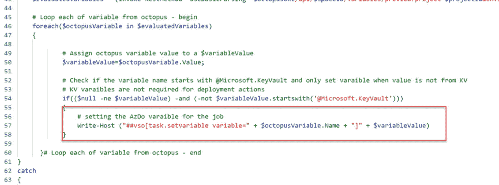

图 6-3

在 Azure DevOps 管道中使用 Octopus 变量

所有的魔法都是使用这段代码行完成的。

```
"##vso[task.setvariable variable=" + $octopusVariable.Name + "]" + $variableValue

```

它用给定的变量名创建一个变量，并给给定的变量值赋值。例如，一个变量可以在 Octopus 中被指定为环境，它可以有 develop 或 prod 等值。，它作为 Azure 管道中的一个新变量被应用。代理阶段中的任何任务都可以使用这些变量值。

本课讨论了一个非常有用的功能，该功能允许您通过动态使用 PowerShell 脚本来创建构建管道变量。

## 第 6.03 课:在 PowerShell 中访问秘密变量值

正如在前面的课程中所讨论的，有各种类型的生成任务可用于为各种要求配置生成管道。在大多数情况下，我们需要使用 PowerShell 脚本来自动化一些管道任务。因此，了解 PowerShell 脚本如何在管道中使用变量是很有好处的。见图 [6-4](#Fig4) 。

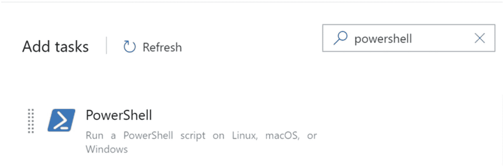

图 6-4

PowerShell 任务

在处理项目时，我们需要处理不同类型的值。有些可以公开分享，有些需要保密。因此，由于这些秘密值需要不同的保护级别，因此需要区别对待。

代理通过在代理内部创建环境变量来使用生成管道中定义的变量值。但是对于秘密值，它不会在代理环境变量中添加任何值。因此，在 PowerShell 脚本中，我们只能通过对非机密变量使用$env:variablename 或$(variablename)来访问变量。但是对于秘密变量，由于代理不在其中创建环境变量，所以我们不能使用$env:variable 格式访问秘密变量。在 PowerShell 中访问秘密变量的唯一可能的方法是使用$(variablename)格式。

我们能够了解在 PowerShell 脚本中如何处理秘密变量，以及这些秘密变量在管道中的行为。此外，在本课中，我们讨论了生成管道中秘密变量行为的原因。

## 第 6.04 课:在构建中使用身份验证令牌

正如我们在本书之前的课程中已经讨论过的，在 Azure DevOps 构建管道代理阶段有很多可用的配置选项。这些配置值可用于提高构建过程的效率和效果。在本课中，我们将讨论代理阶段的 OAuth 配置。

在使用 Azure DevOps 时，有时需要使用 Azure REST API 端点来创建、删除、更新和检索 Azure DevOps 服务资源。因此，大多数 PowerShell 任务用于在构建管道中执行 REST API 调用。正如我们已经知道的，在执行任何 REST API 调用之前，有必要使用认证机制来允许 API 执行授权的操作。在 Azure DevOps 中，个人访问令牌(PAT)是提供身份验证的最常见方式。但是代理阶段的 OAuth 配置允许我们在不使用 PAT 作为认证参数的情况下执行 API 调用。

Azure DevOps 构建管道中的启用 OAuth 令牌配置使任务启动的脚本和其他流程能够通过系统访问 OAuth 令牌。ACCESS.TOKEN 变量。启用对系统访问令牌的访问时，可以在构建管道作业中执行的任务脚本中使用$env:SYSTEM_ACCESSTOKEN 环境变量。见图 [6-5](#Fig5) 。

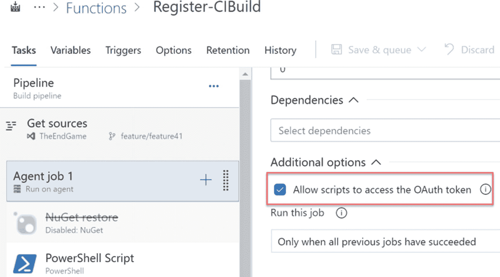

图 6-5

启用 OAuth 令牌

下面的代码示例显示了如何使用 API 脚本列出构建。它在任务脚本中使用$env:SYSTEM_ACCESSTOKEN 变量进行身份验证。如果未启用构建管道 OAuth 配置，脚本将无法运行，因为$env:SYSTEM_ACCESSTOKEN 无法获取值，因为只有在启用了构建管道 OAuth 配置时才允许获取值。

```
$url = $env:SYSTEM_TEAMFOUNDATIONCOLLECTIONURI + $env:SYSTEM_TEAMPROJECTID +  "/_apis/build/builds?api-version=5.1"
Write-Host "URL: $url"
$pipeline = Invoke-RestMethod -Uri $url -Headers @{
    Authorization = "Bearer $env:SYSTEM_ACCESSTOKEN"
}
Write-Host "Pipeline = $($pipeline | ConvertTo-Json -Depth 100)"

```

在本课中，我们讨论了如何在构建管道中使用 OAuth 配置，以及这种配置的重要性。

## 第 6.05 课:创建和使用任务组

管道的一个重要特征是管道任务。当我们配置构建管道时，有时我们需要在多个构建管道中使用同一组任务。假设一个用微服务架构开发的项目。假设 Azure 函数已经用于开发微服务架构，我们需要为每个函数配置一个单独的构建管道。在这种情况下，我们在每个函数构建管道中使用相同的步骤。它有一个构建任务来构建代码，一个 NuGet pack 任务来打包构建的输出，一个 NuGet push 任务来将打包的内容推送到 Azure DevOps 工件提要。如果项目中有 100 个函数，我们需要创建 100 个管道来构建它们。但是，我们可以创建任务组来减少配置管道的工作量，而不是重复同样的工作 100 次。

任务组将一组重复的任务进行分组，并将其作为多个管道的共享组件进行维护。如果我们考虑这样一种情况，即项目中有多个使用相同任务集的构建管道，我们可以使用重复任务创建一个任务组，并使用每个构建管道向它传递参数，以便它构建和打包不同的项目。

让我们看看如何利用一组现有的构建步骤轻松地创建一个任务组。创建一个包含所有必要任务的完整管道。之后，如果每个任务有任何输入值，就将这些值参数化。现在选择要添加到任务组的任务，并创建一个任务组。见图 [6-6](#Fig6) 。

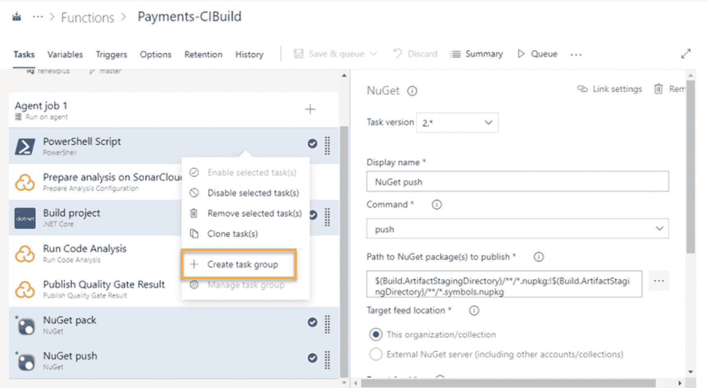

图 6-6

创建任务组

添加任务组后，它将在 Azure DevOps 任务组部分下可用。现在，我们可以使用任务组来创建构建管道。见图 [6-7](#Fig7) 。

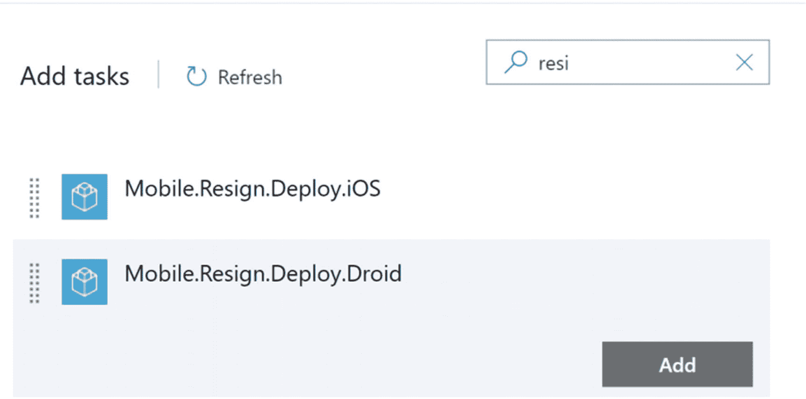

图 6-7

添加要构建的任务组

如果我们创建一个任务组，我们也可以与其他项目共享。您可以将任务组从一个项目导出到同一组织或外部组织中的另一个项目。任务组是非常有用和高效的组件，我们可以在 Azure DevOps 中进行配置。例如，如果要在另一个项目或另一个组织中的项目的生成管道中配置相同的生成任务，可以导出任务组。当您点击 task group export 按钮时，它将下载 json 文件。您可以在另一个团队项目中导入此文件，它会自动为您创建一个任务组。

本课解释了任务组的用途和重要性。我们能够了解如何创建一个任务组及其目的。此外，我们讨论了它的功能和可重用性，允许我们导出和导入到同一个组织中的项目和外部组织中的项目。

## 第 6.06 课:使用无代理阶段

自动化构建使用一台或多台机器为我们做一些工作，而不需要任何人工交互。我们称这些机器为代理，当涉及到自动化管道时，它们扮演着任务执行者的重要角色。但是，在某些情况下，您需要执行一些不需要机器来执行的活动，例如等待批准。对于这些等待类型的目的，您可以在构建管道中使用无代理阶段。在本课中，我们将讨论无代理阶段功能。

无代理阶段包含无需代理计算机帮助即可执行的任务。大多数任务都是依赖于从外部查询或 API 检索的数据的手动干预任务或操作。正如您已经知道的，一个构建管道可以有多个代理阶段。类似地，如果需要，您可以向构建管道添加多个无代理阶段。见图 [6-7](#Fig7) 。您可以对代理阶段或无代理作业进行排序，并根据需要建立执行顺序或启用并行执行。见图 [6-8](#Fig8) 。

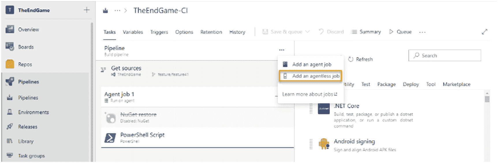

图 6-8

添加无代理阶段

当进入无代理阶段时，它可以执行不需要代理计算机参与的任务。例如，在某些情况下，我们可能需要在构建管道中的两个任务之间留出一个时间间隔。假设我们执行一个脚本，将更改应用到 Azure 中的现有资源，或者想要提供一个新资源。将这些更改应用到 Azure 中的资源需要一些时间。可能需要等到更改完全应用后，才能在下一个任务中继续执行构建管道，因为这取决于您对 Azure 资源所做更改的可用性。因此，我们可以使用无代理任务来等待所需的时间段，以将更改应用到 Azure 资源，并继续下一个任务的另一个代理阶段，这取决于 Azure 资源的更改。参见图 [6-9](#Fig9) 。

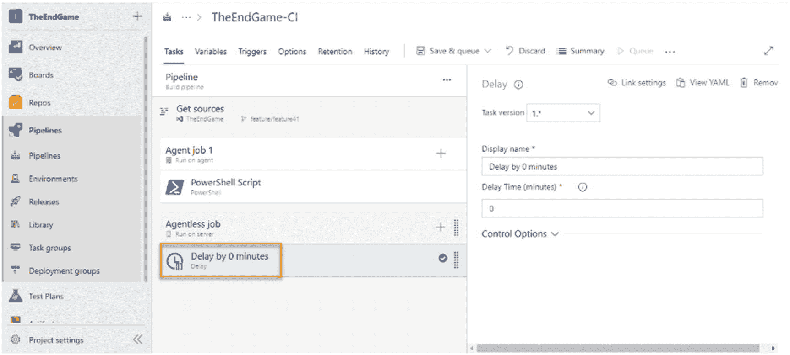

图 6-9

无代理阶段的延迟任务

无代理阶段的另一个有用任务是查询工作项任务。考虑这样一种情况，当且仅当所有的工作项在 sprint 中被标记为完成时，您才需要打包工件。因此，您需要做的是编写一个查询来获得特定 sprint 中处于 to-do 或 in-progress 状态的工作项的计数。如果在 sprint 中有任何未完成的工作项，您应该停止构建管道而不创建工件。参见图 [6-10](#Fig10)

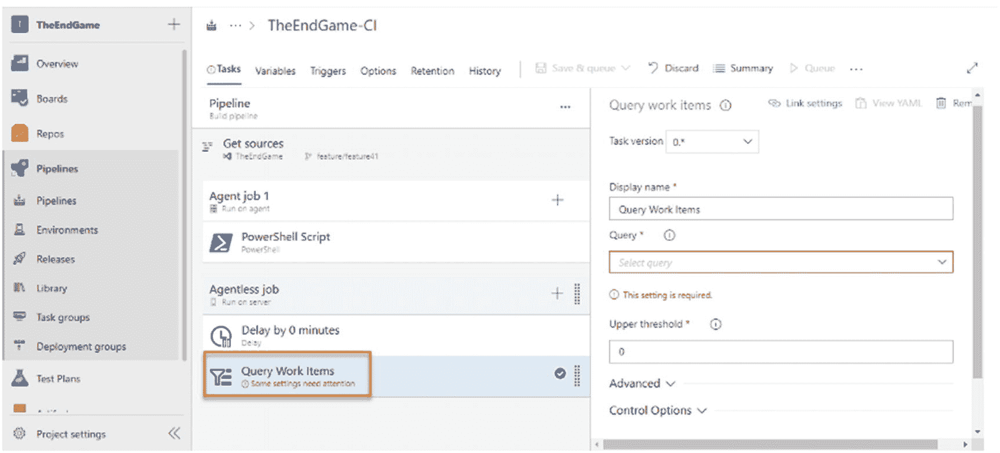

图 6-10

无代理阶段的查询工作项任务

另一个有用的任务是手动干预任务，它可以等待用户批准或拒绝流水线的进一步执行。这种类型的手动干预有助于在进一步执行流水线之前对所执行的步骤进行任何所需的手动验证。

除了这些任务，市场上还有一些其他无代理任务。

学习完本课程后，您能够了解 Azure DevOps 构建管道中可用的无代理阶段。此外，我们还讨论了一些特定于无代理阶段的任务，以及这些任务在一些实际场景中的用法。

## 第 6.07 课:发布工件

Azure DevOps 构建管道用于从 repo 获取源代码，构建代码，测试代码，发布构建的二进制文件，并将其打包为可部署的工件。发布的工件是大多数构建管道的结果。Azure DevOps 使用不同的方法来保存构建工件。一种方法是将发布的工件保存在同一个构建管道中。此外，您可以将工件作为 NuGet 包发布到 Azure DevOps NuGet 提要或外部 NuGet 提要。他们保存工件的方式是将它们保存在一个共享的文件位置。

保存工件的最著名、最简单的方法是使用发布工件任务将发布的工件保存到管道本身。在完成构建之后，如果您将工件放置作为同一个构建，那么您将能够找到附加到构建管道的工件。见图 [6-11](#Fig11) 。

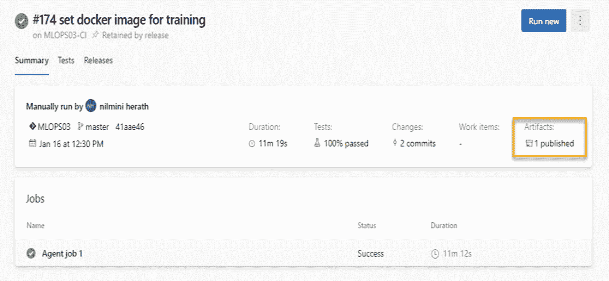

图 6-11

附加到管道的已发布项目

附加到构建管道的工件具有较短的生命周期，因为它们将依赖于构建保留时间。

使用相同的发布构建输出任务，可以将工件发布到给定文件的共享路径中。当您关注安全性，并希望使用它作为本地代理将您的构建工件发布到您的网络的共享文件夹中时，保留一个文件共享是值得的，因为您的公司网络之外的人不能访问它。

在本课中，我们简要讨论了构建工件。在第 [7](07.html) 章中，我们将讨论这些不同的工件发布选项，更详细的讨论，以及使用场景。

## 第 6.08 课:导出和导入生成定义

正如我们所知，有时我们需要为多个项目建立构建管道，主要是为了相似类型的构建需求。在这种情况下，花费更多时间从零开始手动设置每个构建管道是不值得的。Azure DevOps 具有导出和导入构建管道的能力，当我们在多个项目中需要类似的构建时，这允许我们轻松地设置构建管道。

如果您必须在单个项目中设置多个相似的构建管道，您可以轻松地克隆构建管道并根据需求进行更新。或者，您可以导出现有的生成，然后导入以在同一个团队项目中创建新的生成管道。转到您需要导出的构建管道，并单击 export options。见图 [6-12](#Fig12) 。

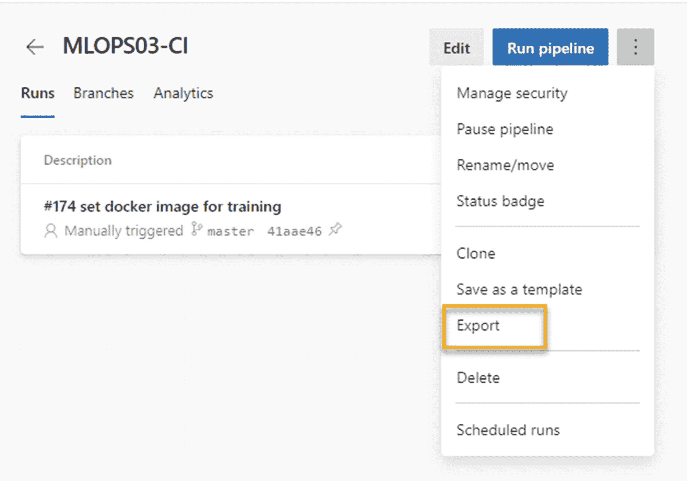

图 6-12

导出生成管道

它将下载 json 文件。为了导入管道，您可以将 json 文件导入 Azure DevOps 项目，它将创建一个构建管道。见图 [6-13](#Fig13)

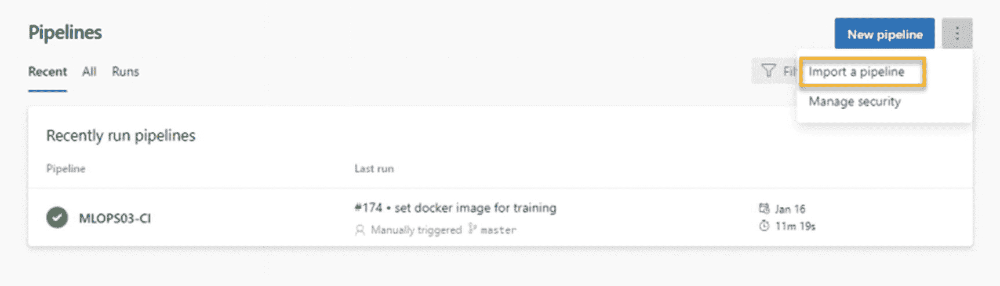

图 6-13

导入构建管道的 json

但是，如果您想要导出管道，并将其导入到相同或不同 Azure DevOps 组织中的不同团队项目，这并不像上面解释的导入到相同团队项目那样简单。

在我们将构建管道 json 导入到另一个项目之前，需要对导出的 json 文件做一个小的更改。Azure DevOps 项目对每个团队项目都有唯一的 id。当您导出构建管道时，它包含 json 文件中源团队项目的项目 id。此项目 id 需要替换为目标团队项目 id 的项目 id。否则，由于 json 中项目 id 的差异，在尝试导入目标团队项目的构建并保存它时，它会给出一个错误。因此，首先您必须使用下面的 REST API 调用找到目标和源项目 id。您可以通过更改相关的组织名称和项目名称来查找项目 id，从而运行下面的 REST API 调用。见图 [6-14](#Fig14)

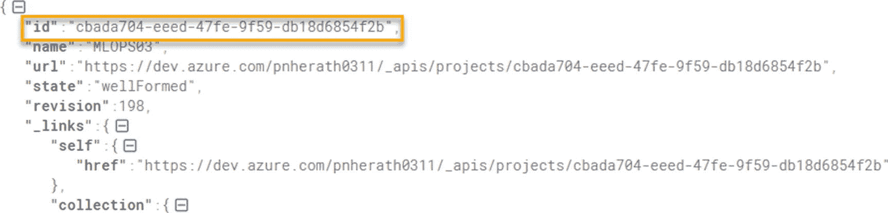

图 6-14

项目 id

[T2`https://dev.azure.com/yourorgname/_apis/projects/teamprojectname?api-version=5.0`](https://dev.azure.com/yourorgname/_apis/projects/teamprojectname%253Fapi-version%253D5.0)

找到目标项目 id 和源项目 id 后，用目标项目 id 替换导出的 json 文件和源项目 id。然后，您可以将它导入到目标团队项目中，并保存它以创建一个生成管道。

本课讨论了 Azure DevOps 中可用的构建管道导出和导入功能及其用途。此外，我们能够学习在团队项目和 Azure DevOps 组织之间导出和导入构建管道的技术。

## 第 6.09 课:将构建组织到文件夹中

根据项目体系结构的不同，一个团队项目中可以有多个生成管道。例如，如果团队使用微服务架构开发系统，就需要为每个微服务组件建立单独的构建管道。以一种更易于管理的方式组织构建管道以增加其可维护性将是一件好事。

本课讨论如何在团队项目中创建文件夹结构，并以更易于管理的方式组织生成管道。见图 [6-15](#Fig15)

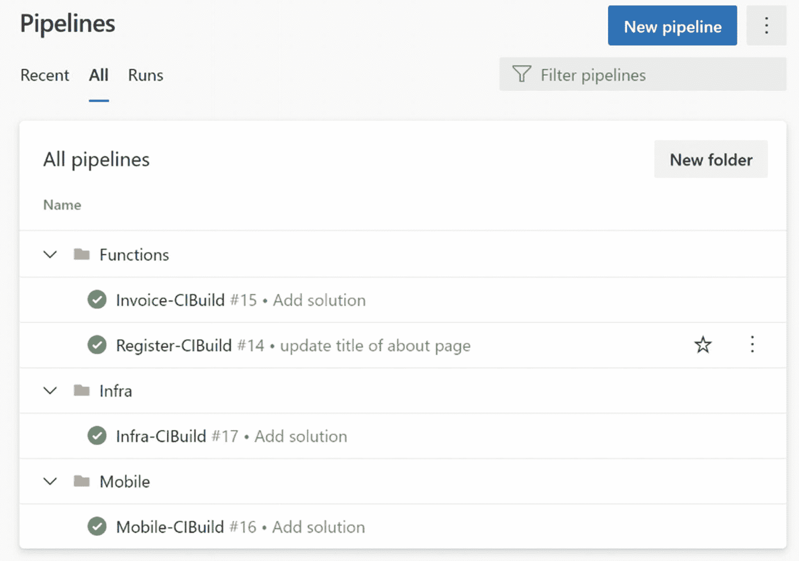

图 6-15

构建文件夹结构

让我们考虑一个使用 Azure 函数作为后端微服务组件的移动开发项目。函数构建可以放在名为 Functions 的文件夹下。移动构建可以组织在名为 mobile 的文件夹下。此外，如果基础架构是使用脚本调配的，则这些基础架构构建可以放在基础架构文件夹中。同样，所有构建管道都应该使用有意义的文件夹结构进行分类。它将帮助用户轻松访问相关的构建管道，而无需滚动浏览所有的构建定义。

本课讨论了拥有一个良好的、有组织的文件夹结构来保存构建定义的重要性，这有助于用户轻松识别和维护构建管道。

## 摘要

在本章中，我们讨论了 Azure DevOps 版本中更有用的配置和功能。正如我们所解释的，构建的调试模式对于检查构建失败日志和识别失败原因非常重要。此外，在使用 PowerShell 脚本时，我们还讨论了 Azure DevOps 管道中一些有用的功能。此外，我们讨论了任务组和构建工件的使用，这是 Azure DevOps 构建管道的一个非常重要的部分。此外，我们能够了解如何在同一组织或外部组织中的团队项目之间导入和导出构建管道，这在需要在项目之间复制相似的构建管道时非常有用。最后，我们讨论了拥有一个组织良好的文件夹结构来保持构建管道的重要性。

在下一章中，我们将详细讨论构建工件，以确定我们可以使用的不同选项来发布带有使用场景的工件。