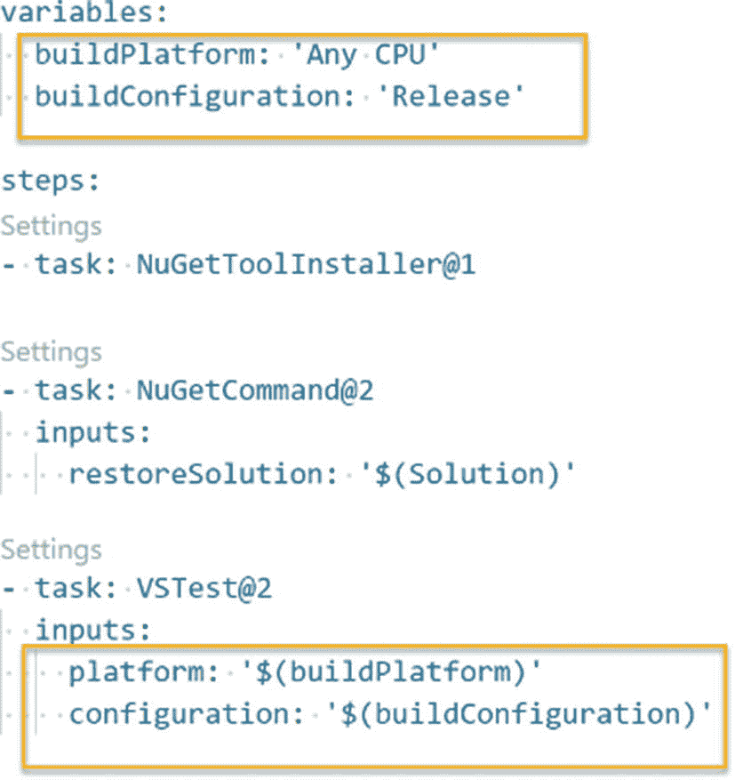

# 八、创建和使用 YAML 生成管道

我们在前几章讨论了 Azure DevOps 经典构建管道。现在，您应该对经典构建的特性和构建管道的使用有了很好的理解。Azure DevOps 提供了两种类型的管道:经典的构建和发布管道以及 YAML 管道。在这一章中，让我们讨论 YAML 构建管道，它使我们能够将管道作为代码。

## 第 8.01 课:YAML 管道入门

YAML 管道是使用 YAML 脚本创建的 Azure DevOps 管道，该脚本提供了所有的触发器、管道任务等。，作为代码。因此，整个构建管道作为一个脚本来管理，而不使用任何 UI。您在前面关于经典构建管道的章节中获得的知识将使您更容易学习和使用 YAML 管道。然而，与经典的构建管道相比，您需要更多的脚本知识来实现 YAML 构建管道。

当创建 Azure DevOps YAML 管道时，它为您提供了一个源代码仓库列表，供您选择代码可能存在的位置。见图 [8-1](#Fig1) 。


图 8-1

选择源代码管理

在下一步中，它允许您选择存储库。例如，如果您选择 Azure Git 作为源 repo，项目中的所有 Azure Git Repos 将在第二步中列出以供选择。参见图 [8-2](#Fig2) 。


图 8-2

选择存储库

下一步允许用户选择管道将要配置的技术。例如，如果您需要配置一个. NET 核心应用，您需要选择。列表中的. NET 核心框架。参见图 [8-3](#Fig3) 。


图 8-3

选择要配置管道的框架

在过程结束时，它将根据创建管道时选择的值创建一个 YAML 管道。您可以修改此 YAML 脚本来添加或删除任务、变量、触发器和池。参见图 [8-4](#Fig4) 。


图 8-4

YAML 脚本

您可以从头开始编写自己的 YAML 脚本，并将它们保存在源 repo 中，而不是使用上面解释的管道创建过程。通过创建经典构建管道，这些 YAML 脚本可以转换为 YAML 构建管道。在经典的构建管道中，有一个模板将管道配置为代码。参见图 [8-5](#Fig5) 。


图 8-5

经典版本中的 YAML 模板

选择该模板，并使用您自己的 YAML 构建管道创建一个构建管道。

到目前为止，我们已经讨论了如何在 Azure DevOps 中创建 YAML 构建管道。让我们看看 YAML 是如何使用建造管道的。与使用 UI 组件创建的经典构建管道相比，YAML 管道是使用脚本创建的。因此，很容易使用一个脚本文件来更新管道。通过使用 YAML 管道，我们得到的最重要的好处是，用户可以对构建进行版本控制，这有助于跟踪对管道所做的更改。例如，您需要将声纳分析任务集成到管道中。如果使用 YAML 管道，可以从回购的稳定分支中创建一个特征分支作为特征分支，并更新特征分支中的 YAML 文件。然后，您可以测试管道，并将其合并到稳定分支，就像您对普通源代码所做的那样。

在本课中，我们学习了 Azure DevOps YAML 管道入门的基本步骤。

## 第 8.02 课:设置管道触发器和过滤器

正如我们在前面章节中所讨论的，一旦您将代码变更推送到 repo，就可以设置一个自动管道来自动触发。如前几章所述，您能够使用可视化工具为经典构件设置自动化触发器和过滤器。本课讨论了可以用编码方式实现的 YAML 管道触发器和过滤器。

在 Azure DevOps pipeline 中启用持续集成时，可以选择添加过滤器和指定触发器。例如，假设在 Azure DevOps 项目中有四种类型的分支，名为功能分支、版本分支、开发分支和主分支。但是，当且仅当代码变更被推送到一个特性分支时，您才需要触发一个构建。您可以启用与分支过滤器的持续集成来达到这一要求。

此外，在 Azure DevOps 的分支过滤器中，它允许用户向代码路径添加更多过滤器，这有助于以自定义方式指定自动化触发器。举个例子，假设一个 Azure DevOps 分支触发器已经被设置为在代码更改被推送到功能分支时触发。此外，还有一个要求，当且仅当对特定文件夹中的代码进行了更改时，才应该触发构建。因此，您可以通过使用 Azure DevOps YAML 管道中可用的路径过滤功能来实现这一要求。

让我们试着用另一个例子来说明触发器的用法。当您使用微服务架构开发解决方案时，应用的每个组件都应该能够单独部署。假设在开发一个基于微服务的应用时，已经实现了多个 Azure function apps。因此，需要为每个功能应用单独创建一个构建和发布管道。如果您在构建管道中启用了持续集成，并且只添加了一个分支过滤器，则每次对所选分支进行推送时，都会触发此构建。它为构建代理带来了不必要的流量，因为它构建了所有的微服务构建，即使只有一个被更改，这也是对资源时间的浪费。通过添加路径过滤器，您可以解决这个问题。因此，您可以为给定的微服务构建指定一个触发器，以便在仅将代码更改推送到相关微服务代码文件夹路径时进行构建。

遵循 YAML 示例脚本将帮助您学习如何设置触发器。一旦主分支或开发分支或任何版本分支或任何特性分支发生变更，它就会触发构建。如果您想要为一个特定的分支触发一个构建，您可以给这个分支一个带有“include”关键字的名称，如下所示。如果您不想为一个给定的分支触发一个构建，您可以在 YAML 脚本中为该分支指定一个带有“exclude”关键字的名称。此外，下面 YAML 中的 path filter 的含义是在将代码更改推送到 Functions 文件夹中的 UserRegistration 文件夹时触发构建。

```
trigger:
  branches:
    include:
    - master
    - develop
    - version/*
    - feature/*
  paths:
    include:
    - Functions/UserRegistration
variables:
  BuildConfiguration: 'Release'
  FunctionPath: 'Functions/ UserRegistration'
  NuspecName: 'TestPro.Services.UserRegistration.nuspec'
pool:
  vmImage: 'windows-latest'
name: $(Build.SourceBranchName).$(Build.BuildId)
steps:
- template: ../Templates/BuildNumber.yml
- template: ../Templates/CoreFunctionBuild.yml
  parameters:
    BuildConfiguration: $(BuildConfiguration)
    FunctionPath: $(FunctionPath)
    NuspecName: $(NuspecName)

```

除了使用分支和路径过滤器设置触发器之外，您甚至可以使用标记过滤器。标记过滤器允许您基于应用于 Git 提交的标记来触发管道。您也可以将其设置为排除标签。有一个选项可以将 batch 设置为 true 或 false，以便在管道活动运行时批处理和执行更改。请参见下面的示例。

```
trigger:
  batch: true

```

与代码推送触发器类似，您可以使用分支和路径过滤器在 YAML 管道中设置拉请求触发器。下面显示了一个示例实现，它类似于持续集成触发器。拉请求触发器还可以包括和排除分支和路径。

```
pr:
  branches:
    include:
    - master
    - develop
    - version/*
    - feature/*
  paths:
    include:
    - Functions/UserRegistration

```

要禁用拉请求触发器，可以使用下面的语法；但是，这不会影响持续集成触发器。

```
pr: none

```

有一个默认为真的自动取消布尔选项，如果有更多的更改被推送到同一个拉请求，它将自动取消正在进行的拉请求构建。

```
pr:
  autoCancel: false

```

此外，您还能够在 YAML 管道中使用过滤器设置预定的触发器。Cron 语法用于以 UTC 时间设置触发器。如下面的示例所示，您可以设置多个计划。将 always 布尔值设置为 true 允许您设置是否应该运行计划的生成，即使在最后一次运行后没有对代码进行任何更改。always 布尔值的默认值为 false。

```
schedules:
- cron: "0 0 * * *"
  displayName: Daily midnight build
  branches:
    include:
    - master
    - version/*
    exclude:
    - releases/ancient/*
- cron: "0 12 * * 0"
  displayName: Weekly Sunday build
  branches:
    include:
    - version/*
  always: true

```

本课解释了 Azure DevOps 管道触发器的使用和过滤器的使用。此外，我们能够通过实现示例来识别过滤器和触发器的用法。

## 第 8.03 课:在 YAML 中使用变量

设置构建管道时，需要提供各种类型的值来构建管道任务。我们已经在前面的章节中讨论了 Azure DevOps 变量组和变量的使用，以及在使用经典版本时如何使用变量。本课将讨论如何在 YAML 构建管道中使用变量值。

在 YAML 脚本中，可以用“variables”关键字定义变量。在变量部分，提供变量名和值。之后，这些值可以在管道任务中使用。因为变量只在一个地方定义，所以很容易改变脚本的变量。参见图 [8-6](#Fig6) 。



图 8-6

任务中使用的 YAML 变量

当您将您的构建维护为 YAML 时，您可能需要定义具有不同访问级别的变量。一个 YAML 脚本可以用三种类型的变量来编写。您可以定义可在多个作业和阶段中使用的全局变量。此外，您可以定义可以在指定作业中使用的变量。例如，如果您希望用调试配置生成一个代理作业，用发布配置生成另一个代理作业，您可以定义作业级变量。还有另一种类型的变量，不仅可以在作业中使用，还可以用作代理变量。有时我们需要访问环境变量来执行管道中的各种操作。

你可以使用两种语法来定义变量。第一种语法如图 [8-6](#Fig6) 所示。在第二种语法中，您可以在两行中定义变量的名称和值，如下例所示。

```
variables:
- name: MY_VARIABLE
  value: some value
- name: MY_VARIABLE2
  value: some value2

```

在前面的课程中，我们学习了变量组以及如何使用它们。正如您已经知道的，变量组允许用户保存在更多管道之间共享的变量值。可以使用下面显示的语法在 YAML 管道中引用变量组。

```
variables:
- name: MY_VARIABLE
  value: some value
- group: my-variable-group-1
- group: my-variable-group-2

```

您可以在管道任务中使用变量组中的变量，有两种语法:宏样式和运行时表达式样式。假设您在变量组中指定了一个 myvar 变量，它的用法如下所示。

```
variables:
- group: my-variable-group

steps:
- script: echo $(myvar) # uses macro syntax
- script: echo $[variables.myvar] # runtime expression

```

你可能有的另一个问题是，如何在使用 YAML 管道时保持秘密值。正如你已经知道的，YAML 变量是在脚本中定义的，我们不能在 YAML 脚本中提供加密值。因此，如果您想要使用任何秘密值，需要使用 web UI 将其定义为管道变量，而不是定义为 YAML 变量，或者您可以将它保存在变量组中。

在本课中，我们讨论了在 YAML 管道中使用变量的用法和语法。

## 第 8.04 课:管道中的作业和阶段

作业用于定义管道执行阶段。可以用执行所需操作的步骤/任务来定义作业。

当您有一个包含单个作业的管道时，您不必指定 job 关键字，但是您必须指定管道的步骤，如下所示。

```
pool:
  vmImage: 'ubuntu-16.04'
steps:
- bash: echo "Hello world"

```

与传统的构建管道类似，如果需要，您可以在一个管道中定义多个作业。

```
jobs:
- job: A
  steps:
  - bash: echo "A"

- job: B
  steps:
  - bash: echo "B"

```

在作业中，您可以定义要使用的代理，如下所示。

```
jobs:
- job: myJob
  timeoutInMinutes: 10
  pool:
    vmImage: 'ubuntu-16.04'
  steps:
  - bash: echo "Hello world"

```

您可以在您的管道中定义类似于发布管道中的阶段，我们将在第 [9](09.html) 和 [10](10.html) 章中讨论传统的发布管道。在每个阶段，如果需要，可以使用多个作业。

```
stages:
- stage: MyBuild
  jobs:
  - job: BuildJob
    steps:
    - script: echo My Build steps!
- stage: MyTest
  jobs:
  - job: TestingOnWindows
    steps:
    - script: echo Testing on Windows!
  - job: TestingOnLinux
    steps:
    - script: echo Testing on Linux!
- stage: MyDeploy
  jobs:
  - job: DeployJob
    steps:
    - script: echo Deploying the code!

```

定义作业时，可以定义管道中其他作业的条件和相关性。

```
jobs:
- job: FirstJob
  steps:
  - script: exit 1

- job: SecondJob
  dependsOn: FirstJob
  condition: failed()
  steps:
  - script: echo this will run when FirstJob fails

- job: THirdJob
  dependsOn:
  - FirstJob
  - SecondJob
  condition: succeeded('SecondJob')
  steps:
  - script: echo this will run when SecondJob runs and succeeds

```

作业可以作为在池的代理上运行的代理池作业运行；或者运行在 Azure DevOps 服务器或容器作业上的服务器作业。代理池作业可以要求代理功能，如操作系统。

```
pool:
  name: myPrivateAgents
  demands:
  - agent.os -equals Windows_NT
  - anotherCapability -equals capabilityvalue

```

对于服务器作业，您可以将池指定为服务器。

```
jobs:
- job: myserverjob
  pool: server

```

容器作业将在托管代理上运行。例如，下面的 YAML 管道从 DockerHub 获得版本为 16.04 的 Ubuntu 容器映像，并在托管的 Linux VM 代理上运行它，这些步骤在用容器映像创建的容器实例中执行。

```
pool:
  vmImage: 'ubuntu-16.04'

container: ubuntu:16.04

steps:
- script: printenv

```

您可以定义作业设置为签出为无的 YAML 管道，以防止代码签出，从而便于实现部署管道。下面的语法被定义为执行部署作业，而不签出 repo，也不从指定的构建管道(例如，本例中 ID 为 15 的构建管道)下载最新的工件。

```
- job: Deploy
  pool:
    vmImage: 'ubuntu-16.04'
  steps:
  - checkout: none
  - task: DownloadPipelineArtifact@2
  inputs:
    source: 'specific'
    project: 'mysampleproj'
    pipeline: 15
    runVersion: 'latest'

```

在部署作业中，可以使用代理池来定位您的部署计算机。此外，可以将环境用作虚拟机或 Kubernetes 来进行部署。

```
jobs:
- deployment: VMDeploy
  displayName: web
  environment:
    name:  VMenv
    resourceType: VirtualMachine
    tags: web1

```

正如我们在本课中所讨论的，YAML 管道作业甚至可以用于管道的多个阶段，它们可以用于实现构建管道和部署管道。

## 第 8.05 课:工作中的步骤和任务

在作业中，您可以使用任务定义步骤，以定义要执行的操作。有多种类型的步骤可以定义为 YAML 管道中的步骤。

命令行任务可以在管道中定义为脚本。

```
steps:
- script: echo Hello world!
  displayName: hellosample

```

可以在执行 bash 命令的步骤中定义 Shell 脚本任务。pwsh 允许您定义可以在 Windows、macOS 或 Linux 中执行的 PowerShell 核心任务。但是，如果在一个步骤中使用 PowerShell 作为任务，那么它只能在 Windows 平台上运行。

```
steps:
- powershell: echo Hello $(name)
  displayName: Say hello name
  name: chaminda

```

对于所有这些步骤任务，您可以使用 failOnStderr 布尔值来定义执行是否应该在脚本或命令行执行失败时使管道失败。

```
steps:
- pwsh: echo Hello $(name)
  displayName: Say hello name
  name: chaminda
  workingDirectory: $(build.sourcesDirectory)
  failOnStderr: true

```

签出是您可以定义的另一个步骤操作，以允许签出源代码管理仓库。如前一课所述，将此项设置为“无”会阻止签出操作。签出设置为 self 将签出当前 YAML 管道代码所在的回购。但是，如果需要，您可以在 pipeline 步骤中使用签出任务来定义其他 repos 并将其签出。在下面的 checkout 示例中，可以看到 GitHub repo 和 Azure Git repo 的用法。

```
resources:
  repositories:
  - repository: MyRepoNameToUseInChekoutStep
    type: github
    endpoint: MyGitHubServiceConnection
    name: Chamindac/myrepo

trigger:
- master

pool:
  vmImage: 'ubuntu-latest'

steps:
- checkout: self
- checkout: MyRepoNameToUseInChekoutStep
- checkout: git://MyTeamProject/myazuregitrepo

```

任务是可用于管道的任务目录，我们在经典构建中讨论过。您可以在链接 [`https://docs.microsoft.com/en-us/azure/devops/pipelines/tasks/?view=azure-devops`](https://docs.microsoft.com/en-us/azure/devops/pipelines/tasks/%253Fview%253Dazure-devops) 中找到所有可用任务的列表，并找到每个任务的 YAML 片段。所有的任务都是预定义的，非常有用，因此您可以快速实现您的管道。诸如查询工作项和调用 HTTP REST API 之类的任务可以使用服务器作业(无代理)来实现基于 YAML 的部署管道的门控，我们将在第 [9](09.html) 和 [10](10.html) 章的经典发布管道的使用课程中对此进行描述。

在本课中，我们探讨了管道中的几个可用任务，这些任务以各自的名称指定，如 script 和 pwsh，以及默认情况下可用于实现管道需求的任务目录。

## 第 8.06 课:使用模板

在第 [6](06.html) 章中，我们讨论了使用任务组来实现通用步骤。类似地，使用 YAML 管道，您可以通过使用模板将步骤共享给多个管道来达到相同的目的。

在 Azure YAML 管道中有四种模板可用。阶段、作业、步骤和变量是这些模板类型，它们对您来说更有意义，因为您已经在本章的前几课中学习了这些类型。

下面是一个阶段模板的用法，名为 name 的参数定义为空字符串，默认值为空字符串。

```
# File: stages/mystagetemplate.yml

parameters:
  name: ''

stages:
- stage: Print_${{ parameters.name }}
  jobs:
  - job: ${{ parameters.name }}_Windows
    pool:
      vmImage: vs2017-win2016
    steps:
    - script: echo hello ${{ parameters.name }}
  - job: ${{ parameters.name }}_Mac
    pool:
      vmImage: macos-10.14
    steps:
    - script: echo hello ${{ parameters.name }}

```

上述阶段模板可以在管道中使用，如下所示。请注意参数值是如何传递的。

```
stages:
- template: stages/mystagetemplate.yml
  parameters:
    name: Chaminda

- template: stages/mystagetemplate.yml
  parameters:
    name: Pushpa

```

同样，您也可以定义作业和步骤模板，并在管道中使用它们。

工作模板如下。

```
# File: jobs/myjobtemplate.yml

parameters:
  name: ''
  pool: ''
  sign: false

jobs:
- job: ${{ parameters.name }}
  pool: ${{ parameters.pool }}
  steps:
  - script: echo hello

```

作业模板可以如下所示使用。

```
jobs:
- template: jobs/myjobtemplate.yml
  parameters:
    name: macOS
    pool:
      vmImage: 'macOS-10.14'

- template: jobs/myjobtemplate.yml
  parameters:
    name: Linux
    pool:
      vmImage: 'ubuntu-16.04'

```

Step 也将具有类似的语法，唯一的区别不是作业内容，而是步骤内容和参数化以匹配步骤需求。

可以定义变量模板来保持变量共享。变量名和值可以在模板中定义，如下所示。

```
# File: variables/mybuildvartemplate.yml
variables:
- name: vmImage
  value: vs2017-win2016
- name: buildplatform
  value: x64
- name: buildconfiguration
  value: release

```

然后，变量模板可以使用以下语法在管道中使用。

```
variables:
- template: variables/mybuildvartemplate.yml
pool:
  vmImage: ${{ variables.vmImage }}
steps:
- script: build x ${{ variables.buildplatform }} ${{ variables.buildconfiguration }}

```

在本课中，我们探讨了如何使用模板将阶段、作业、步骤和变量作为模板进行共享，以及如何在 YAML 管道中使用模板。

## 摘要

在这一章中，我们重点了解了 YAML 管道实现，以支持管道作为代码，这使我们能够轻松地对我们实现的管道进行版本控制和跟踪源代码的更改。本章探讨了定义基于 YAML 的管道以支持构建、测试和部署需求的各种选项。有了这些知识，您将能够用您的应用代码并排编写您的管道并对它们进行版本控制。

在下一章中，我们将讨论经典的发布管道实现选项和特性。一旦您发现了经典发布管道中的可用功能，您可以使用这些知识来尝试和实现经典管道以及 YAML 管道所满足的相同需求，因为您现在已经对 YAML 管道语法有了坚实的理解。