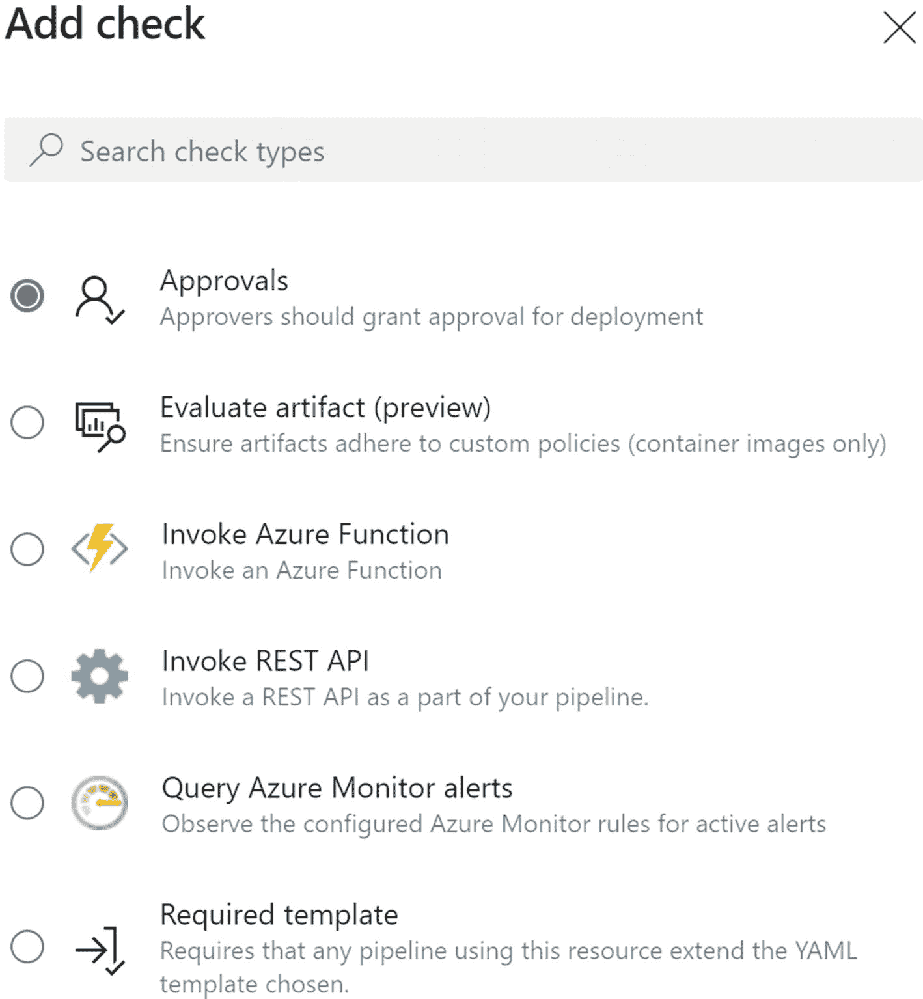

# 9.Azure 发布管道——服务连接、模板、工件、阶段和环境

在前几章中，我们讨论了设置构建管道的特性和选项。构建管道允许您构建源代码并使用构建的二进制文件创建可部署的包，使用代码分析工具检查源代码中的漏洞，以及运行单元测试。此外，您可以在构建管道中运行部署操作，尤其是在涉及 YAML 管道时，部署的实现也是通过 YAML 构建管道设置的。

Azure DevOps 中的发布管道具有各种功能，使您能够部署到几乎所有可用的目标和平台。在本章中，我们将探索 Azure DevOps 中与部署管道相关的一些可用功能，以便您能够理解这些功能的使用，从而实现自动化软件交付，甚至是生产目标。

## 第 9.01 课:服务连接

通常，在给定的软件中，不同的平台上可能有不同的部署目标。既可以有云目标，也可以有本地目标。此外，目标可以是云平台资源或云上的基础设施。为了支持部署到如此多样的平台，需要连接到这样的资源。换句话说，应该对给定资源中的端点进行身份验证，并且应该从 Azure DevOps 以服务连接的形式连接到端点，以便允许管道与资源进行交互。

例如，我们可以考虑 Azure 订阅或资源组。Azure 中的服务原则允许访问 Azure 资源。使用服务原则，您可以在 Azure DevOps 中建立 Azure 服务连接。见图 [9-1](#Fig1) 。

图 9-1

Azure 服务连接

您可以从 Azure DevOps 建立各种各样的服务连接。它们涉及诸如 Azure、AWS 之类的云服务目标，诸如 Bitbucket 和 GitHub 之类的代码回购，不同类型的部署工具 chefs、Octopus 以及许多其他连接代码质量工具的目标。

到 GitHub 和 Bitbucket 等源代码控制仓库的服务连接允许您将不同的源代码控制仓库连接到 Azure 管道。您可以通过将它们与服务连接联系起来，在这样的 repos 中构建可用的代码。

Azure DevOps 的 marketplace 扩展安装了一些服务连接类型。例如，要链接 sonar cube 服务器，您需要安装 sonar cube 扩展。一旦添加了扩展，就可以设置管道来触发源代码控制库中源代码的代码分析。另一个例子是面向 Amazon Web Services (AWS)的服务连接，允许部署到 AWS。参见图 [9-2](#Fig2) 。

图 9-2

不同类型的服务连接

在本课中，我们探讨了服务连接及其使用，以促进与 Azure DevOps 的外部资源连接。

## 第 9.02 课:使用模板

模板被预先创建为一组组合在一起的管道任务，用于给定的目的。这些模板还设置了常用的变量，以便快速部署到所需的目标。见图 [9-3](#Fig3) 。

图 9-3

发布模板

例如，如果您应用 Azure 机器学习模型部署模板作为您的管道模板，它将创建部署机器学习模式所需的两个步骤。您可以选择创建为服务连接的 Azure 订阅，并使用此模板快速开始机器学习模型部署。参见图 [9-4](#Fig4) 。

图 9-4

ML 模型部署模板

模板的主要用途是让您开始使用给定类型的应用，并快速完成目标部署。如果您是设置发布管道的初学者，这些模板将帮助您在更短的时间内熟悉发布管道，最大限度地减少学习工作量。您可以通过从 Visual Studio 市场设置扩展来安装附加模板。

我们在本课中讨论了模板的使用，这将帮助您快速开始使用发布管道。

## 第 9.03 课:发布的工件

正如我们在本书第 [7](07.html) 章中讨论的，构建管道应该生成可部署的二进制包，称为工件。这些工件可以在发布管道中使用，将它们的内容下载到目标上，并根据需要进行部署。

Azure 发布管道支持许多工件类型。参见图 [9-5](#Fig5) 。

图 9-5

工件类型

如果您已经在构建本身中将您的工件发布为发布的放置文件夹，那么您可以将该构建用作您的构建的工件类型。一旦构建完成，如果您想要设置发布的连续触发，那么将构建设置为通过其他方式发布构件的构件类型甚至是有用的，例如发布中的构件提要。

Azure repos 可以用作另一种工件类型。在发布步骤中可以使用代码或其他文件，如 YAML 部署支持文件。有时，甚至机器学习所需的基于 Python 的部署和部署后测试代码文件也可以存储在 Azure repos 中，并在发布管道中使用，以执行部署和测试步骤。通过使用 GitHub 和 Team Foundation 版本控制 repos 作为发布管道中的工件，可以达到类似的目的。

如第 7 章[所解释的，Azure 工件可以用来在工件提要中存储生成的工件，比如 NuGet 包。工件提要可以在发布中使用，包可以下载并在部署代理中使用，以部署到所需的目标。](07.html)

Azure container repositories 和 docker hub 作为工件，允许您使用它们中可用的 docker 映像，以便在发布管道中使用。此外，Jenkins 管道可以集成为一个工件源，这样您就可以在发布管道中使用 Jenkins 管道的输出。

一旦添加了工件，您就可以基于新工件的可用性为管道设置一个触发器，这允许连续的部署。使用生成时，可以为触发器添加额外的排除或包含分支筛选器。当使用 repo 时，它可以基于 pull 请求设置一个触发器，带有一个目标分支过滤器，您可以使用分支过滤器来触发提交。参见图 [9-6](#Fig6) 。

图 9-6

回购工件触发器

在本课中，我们讨论了可以在发布管道中使用的不同类型的工件，这使您能够基于新工件的可用性来触发发布管道。

## 第 9.04 课:发布阶段

发布阶段可用于控制发布管道的流量。您可以将它们视为管道中的部署环境表示。管道中的阶段为您提供了定义您想要的软件交付工作流的灵活性。在这一课中，让我们探索发布阶段的功能和用法，以管理软件项目向期望目标的交付。参见图 [9-7](#Fig7) 。

图 9-7

释放管道流量

可以用三种类型触发器设置阶段。手动触发要求您在从发布管道创建发布后，通过单击手动部署来手动触发阶段。“后阶段”允许您定义前面的阶段，以便仅当所有前面的阶段完成时才触发当前阶段。一旦为管道创建了发布，发布后将触发一个阶段，通过手动创建或在连接的工件上设置连续部署触发器。参见图 [9-8](#Fig8) 。此外，您可以为给定的阶段设置预定的发布。工件过滤器允许您过滤分支，排除或包含模式，或者设置其他工件条件。启用拉取请求部署将允许将基于拉取请求的发布部署到给定阶段；但是，建议在生产阶段禁用此功能。

图 9-8

阶段触发器

可以设置一个具有预部署批准的阶段。作为审批者，您可以添加个人或组，并设置审批超时。设置批准将在触发阶段时向批准人发送提醒电子邮件。批准者可以批准或拒绝部署到给定阶段。但是，如果需要，可以安排延迟时间来批准部署。这种预部署批准可以有效地用于保护所需的环境，如生产或演示环境。此外，当应用的一个版本正在被测试时，它可以被用来防止到诸如质量保证阶段的任何部署，以便它防止在质量保证阶段的应用的组件被意外地覆盖，直到 QA 团队决定接受新的版本进行测试。部署前审批设置见图 [9-9](#Fig9) 。部署后批准也可以像部署前批准一样进行设置，以表明如果某个已部署的应用通过了给定应用的必需的强制工作条件，则该应用将得到验证和考虑。见图 [9-9](#Fig9) 。

图 9-9

部署前批准

另一个可以应用于 stage 的预部署设置是 Azure pipelines 中的 gates。Gates 允许您调用第三方调用，并在继续某个特定阶段之前等待期望的结果。换句话说，gates 用于在部署给定阶段之前执行看门人的工作。例如，在允许发布部署 QA 阶段之外的任何阶段之前，查询工作项门可以评估是否有任何关键错误处于未解决的状态。参见图 [9-10](#Fig10) 。

图 9-10

盖茨

某个阶段的部署队列设置允许您定义多个发布在给定阶段排队时的行为。您可以定义在给定的阶段是否允许并行部署，但是这是一个极不可能的场景。当部署排队的多个版本时，可以使用一个序列中的所有版本。或者，您可以将设置为仅部署最新版本，并放弃其他以前的部署请求。参见图 [9-11](#Fig11) 。

图 9-11

部署队列设置

在部署后阶段，如本课前面所讨论的，可以设置批准以表示应用在该阶段工作正常，在部署到该阶段后，让它触发任何后续阶段。此外，您还可以向部署后阶段添加关卡。此外，您可以选择在部署阶段失败时设置重新部署触发器，以便它将当前阶段以前成功的部署再次部署到该阶段。参见图 [9-12](#Fig12) 。

图 9-12

重新部署触发器

您可以克隆一个阶段来创建另一个阶段，这使您可以轻松地创建发布工作流。在一个阶段中，您可以添加代理阶段、部署组阶段和无代理阶段，这些将在第 [10](10.html) 章中详细介绍。与构建管道类似，您可以将任务添加到发布阶段，以定义作为部署和自动化测试操作执行的步骤。见图 [9-13](#Fig13) 。

图 9-13

阶段

在本课中，我们讨论了前阶段和后阶段中可用于简化发布工作流的几个功能。

## 第 9.05 课:环境

可以用作部署目标的资源集合可以设置为 Azure DevOps 中的环境。一个环境可能包含一个 Kubernetes 集群、一组虚拟机或资源，例如 Azure web app 或 functions apps。

您可以创建一个有虚拟机、Kubernetes 或没有资源的环境。创建无资源环境时，可以在以后向环境中添加资源。参见图 [9-14](#Fig14)

图 9-14

环境

对于环境，您可以基于读者、用户和管理员的角色设置权限，其中管理员可以管理环境，用户可以使用管道中的环境，而读者只能查看。

环境可以添加检查，有点类似于 gates。检查甚至还包括工件的批准者评估。参见图 [9-15](#Fig15) 。

图 9-15

环境检查

YAML 管道可以使用环境作为部署行动的目标。参见图 [9-16](#Fig16)

图 9-16

YAML 的使用环境

环境促进了 YAML 管道基于批准的工作流实施，类似于传统发布管道中可用的阶段。

在本课中，我们已经确定了在 YAML 管道环境中的用法和可用选项。

## 摘要

本章给出了发布管道的初步介绍，强调了服务连接的功能和模板的使用，以便轻松地开始使用发布管道。然后我们讨论了工件在发布管道中的使用，以及设置基于工件的触发器来支持连续部署。还详细讨论了实现发布工作流的发布阶段功能，解释了每个可用选项的用法。此外，我们探索了允许为 YAML 管道设置部署目标的环境，类似于经典发布管道中的阶段。

在下一章中，我们将讨论发布管道阶段的可用阶段，以便您获得成功实施发布工作流所需的知识。此外，我们将探索其他选项和特性，例如变量、发布定义历史的使用，以及发布管道的导出和导入选项。