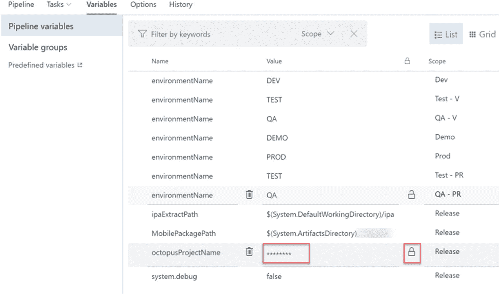

# 10.Azure 发布管道——作业、部署组、变量和其他选项

在前一章中，我们讨论了一些与发布管道相关的重要特性。描述了允许发布管理的各种部署目标的服务连接。此外，我们探索了可用于发布管道实现的模板的使用，发布管道中实现发布工作流的阶段，以及设置触发器、批准和关口的方法。还讨论了新的功能环境，以了解其用法。

作为上一章的延续，我们将探讨代理作业、部署组作业和无代理作业阶段及其用法。然后，我们简要地讨论变量及其在发布管道中的使用，这或多或少类似于变量在构建管道中的使用。

## 第 10.01 课:代理作业

代理作业需要安装 Azure DevOps 代理来执行作业。根据我们在本课中讨论的部署目标，代理计算机可以是托管代理计算机或本地计算机。

根据执行情况，代理的步骤技术要求会有所延迟。代理的需求可以作为代理阶段的需求。例如，如果您的部署步骤涉及 Azure CLI，要部署到 Azure 目标，您的代理计算机需要有可用的 Azure CLI。代理阶段的需求用于这些类型的技术需求。见图 [10-1](#Fig1) 。

图 10-1

代理需求

如果您正在部署到云目标，如 Azure 或 AWS，您可以使用 Microsoft 托管代理来执行部署操作。但是，如果您要部署到内部部署目标或更安全的 Azure 目标(如 Azure App Service Environment ),您可能需要设置自己的部署代理机器。大多数情况下，内部部署环境位于企业防火墙之后，托管代理无法看到针对此类目标执行的部署。与此类似，在 Azure App Service Environment (ASE)中，对平台服务的访问只能在 Azure ASE 中定义的虚拟网络中进行。因此，您需要在 Azure ASE 虚拟网络中设置一个配置为 Azure DevOps 代理的虚拟机，它可以访问 Azure ASE 中的平台服务。

有类似于构建管道的并行选项，允许您在单个代理或 multipliers 中指定的多个配置中运行作业步骤。当在多个配置上运行时，您可以指定代理数量限制。您可以在多个代理中运行同一组任务，也可以使用多代理选项。见图 [10-2](#Fig2) 。如果您希望部署到不同的目标，这些选项会很有用，因为指定的配置可能会启用调试配置上的部署，以诊断一些问题，同时还有一个发布配置目标。

图 10-2

平行

您可以在代理步骤中有选择地设置下载或跳过下载工件。见图 [10-3](#Fig3) 。例如，如果您有一个单独的代理作业来运行自动化测试，那么除了需要执行的自动化测试脚本之外，您可能不需要下载工件。因此，您可以跳过部署文件，只下载与测试执行相关的工件。

图 10-3

史前古器物

您可以设置允许脚本在代理阶段访问 OAuth 令牌，以便代理作业中的任何脚本任务都可以使用系统访问令牌来访问 Azure DevOps 的 REST API。

代理作业有两种超时设置。超时定义了作业可以在代理中执行的时间。作业取消超时定义在服务器终止作业之前，当发出取消请求时，给作业多少时间来完成。

执行选项允许您定义作业开始的条件。见图 [10-4](#Fig4) 。如果部署失败，您可能需要设置回滚过程，这在前面的代理作业中已定义。在这种情况下，您可以将其设置为在当前代理作业中的上一个作业失败时执行，并定义回滚任务。如果您希望在成功部署作业后执行自动化测试，您可以设置一个代理作业，以便在成功执行该作业后执行部署，从而在后续作业上执行功能测试，前提是前一个作业成功。但是，与生成代理作业不同，执行是在发布代理作业中按定义的顺序进行的，并且没有像在生成代理作业中那样定义依赖项的选项，因为执行是按发布管道中设置的作业顺序进行的，所以不需要依赖项。

图 10-4

OAuth 令牌和作业运行条件

您可以使用 Azure DevOps 中默认可用的许多任务，以及通过代理作业中的市场扩展添加的任务来执行所需的部署步骤。这些部署步骤可能涉及设置给定环境目标的基础设施，部署您的应用程序，甚至执行功能和集成测试。在 Azure DevOps 的市场中，你可以找到支持各种平台的任务和几乎所有你需要做的动作。如果找不到任务，你可以自己实现它们，我们将在第 [11](11.html) 章详细讨论。您可以将您的任务分组为任务组，以便在多个代理作业中重用它们，我们在第 [2](02.html) 章中讨论了任务组。

在本课中，我们讨论了在发布管道中使用代理作业。

## 第 10.02 课:部署组作业

部署组作业意味着在定义的部署组上执行。我们已经在本书的第 [2](02.html) 章中讨论了部署组和部署池，以及如何将它们添加到具有角色的目标机器中。

在发布管道中，可以在部署组作业中使用团队项目中定义的部署组。您可以使用部署组目标中定义的角色作为给定部署组阶段的必需标记。例如，可以使用部署组作业中的标记将角色设置为 webSvr 的任何机器标识为 Web 服务器，这需要使用应用程序的 Web 服务器部署步骤进行部署。见图 [10-5](#Fig5) 。

图 10-5

部署组标记

与代理作业类似，部署组作业也有超时和作业取消超时设置，您可以使用这两个设置来分别确定作业在超时前可以执行的时间，以及在终止前发出取消请求后允许完成作业的时间。

要并行部署的目标设置根据部署组的目标中选定的标记和定义的角色，定义当部署组中有多个目标可用时，部署操作并行执行的目标数量。这使您能够在负载平衡的情况下部署多个 web 服务器，等等。，并行。超时 0 表示无限超时，超时以分钟为单位定义。见图 [10-6](#Fig6) 。

图 10-6

目标并行设置和超时

与部署组中的代理作业类似，您还可以定义在给定的作业中下载哪些工件。OAuth 令牌访问和基于条件的作业执行也可以像代理作业一样进行设置。这些功能可用于定义部署组的回滚和测试执行场景，正如我们在上一课中对代理作业所做的解释。当使用测试执行时，这种机器中的角色可以是基于标签(如 test client)的测试客户端角色。

这些任务可以在类似于代理作业的部署组阶段中使用，以根据其目标角色实现部署。即使在市场任务中，也可以根据需要利用任务组。

在本课中，我们探索了部署组作业中的可用选项，以在 Azure DevOps 中设置发布管道。

## 第 10.03 课:无代理作业

无代理作业对于执行不需要计算机来执行正在执行的步骤非常有用。无代理作业可执行的步骤数量有限。见图 [10-7](#Fig7) 。

图 10-7

无代理作业步骤

使用无代理阶段，您可以使用延迟步骤在给定代理或部署组作业后等待给定时间。延迟时间过后，可以执行下一个代理或部署组作业。这种类型的延迟在诸如在云平台目标上配置基础架构的场景中非常有用。一旦在这样的云平台上执行基础设施命令来提供所需的平台资源，可能会有时间要求。因此，延迟任务可以用来等待这样一个所需的时间。

类似于在管道阶段之间应用的门控，在部署前和部署后阶段，您可以利用无代理阶段来实现代理或部署组作业之间的门控，或者通过使用诸如调用 Azure 函数、调用 REST API、查询 Azure Monitor 警报和查询工作项任务等任务来实现。有关门控的更多信息，请参阅第 [9](09.html) 章。

手动干预任务可用于在代理或部署组作业之间实施批准、拒绝步骤。在执行管道的下一步之前，如果您希望手动执行某个操作，这些批准可能会很有用。

在无代理作业中，与代理或部署组作业相比，设置最少。参见图 [10-8](#Fig8) 。无代理作业可以针对乘数中指定的多种配置执行。可以指定超时来执行无代理阶段。运行条件允许您根据上一步成功或失败来定义是否应执行无代理阶段；或者使用自定义条件，帮助您确定是否需要根据管道执行流执行无代理作业。

图 10-8

无代理作业设置

在本课中，我们讨论了无代理阶段以及发布管道中无代理步骤的用法。

## 第 10.04 课:变量

类似于构建管道的发布管道包含变量。在发布管道的“变量”选项卡中，您可以定义键和值对。变量中包含的敏感信息可以定义为机密，这样的变量值一旦标记为敏感就不可见。参见图 [10-9](#Fig9) 。

图 10-9

敏感变量

如图 [10-9](#Fig9) 所示，发布管道中的变量的范围可以是发布或阶段。同一变量在每个阶段可以包含不同的值。对于发布管道中的每个变量，您可以在发布时将其设置为可设置的，这允许在创建发布时设置这些变量的值。参见图 [10-10](#Fig10) 。

图 10-10

发布时可设置

如第 [2](02.html) 章所述，变量组可用于为多个发布管道保存共享变量，甚至与构建管道共享变量。这样的变量组可以在具有发布范围或阶段范围的发布管道中使用。见图 [10-11](#Fig11) 。

图 10-11

发布管道中的变量组

当变量自动解析时，可以在另一个变量中使用$(variablename)来重用变量。这有助于在多个变量中重复值，并确保变量包含唯一的值，只需更改一个位置就可以更改变量值。

在本课中，我们讨论了变量及其在发布管道中的用法。

## 第 10.05 课:其他有用的功能

发布管道还有一些其他有用的功能:在“保留”选项卡、“选项”选项卡、“历史记录”选项卡中，以及在“导入”、“导出选项”等发布菜单中。

在“保留”选项卡中，您可以设置版本保留设置。有一个链接可以设置项目默认值以及留成。无论保留日期设置如何，您都可以设置保留版本的天数以及应保留的最小版本数。保留天数指定版本将保留的天数。无论天数是多少，在“要保留的最小发布次数”中指定的发布次数都将被保留。参见图 [10-12](#Fig12) 。

图 10-12

保留

您可以设置版本号格式，并向版本定义添加描述。发布号可以与带有修订版的内部版本号一起使用，以赋予完整发布号更多的含义。参见图 [10-13](#Fig13) 。

图 10-13

发布号

options 选项卡提供了发布管道的集成选项，可以与存储库、板和外部服务吉拉集成。参见图 [10-14](#Fig14) 。

图 10-14

集成

发布管道的历史记录提供了发布管道中的修订信息，您可以在其中进行版本比较，并在需要时恢复到给定版本。

在本课中，我们讨论了发布管道的一些有用选项。

## 摘要

在本章中，我们详细探讨了代理作业、部署组作业和无代理作业及其用法。此外，我们还研究了其他一些特性，如变量、选项、集成、保留设置、发布管道的历史及其使用。

在下一章，我们将探索 REST API 和命令行界面的特性以及它们的用法。