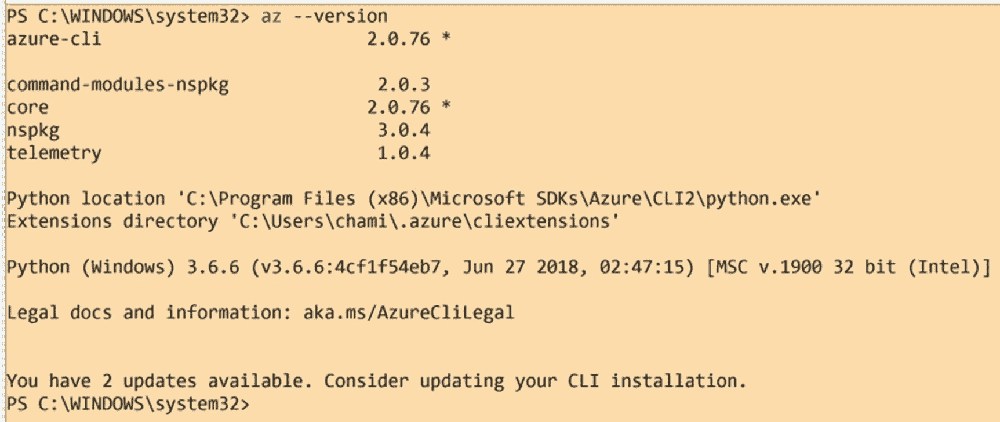
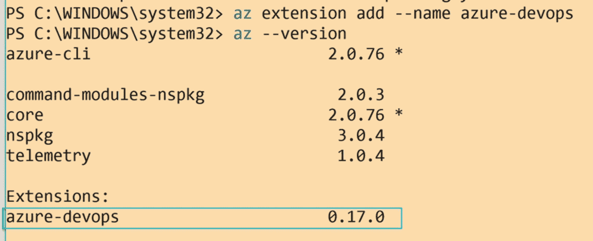
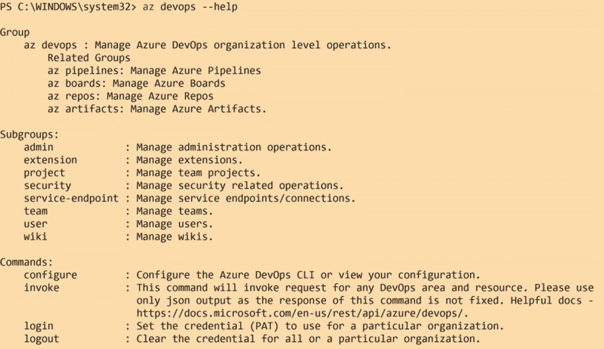
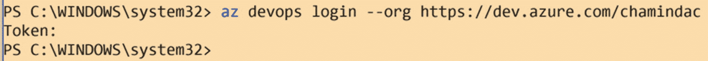
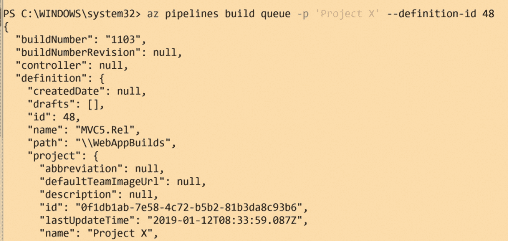
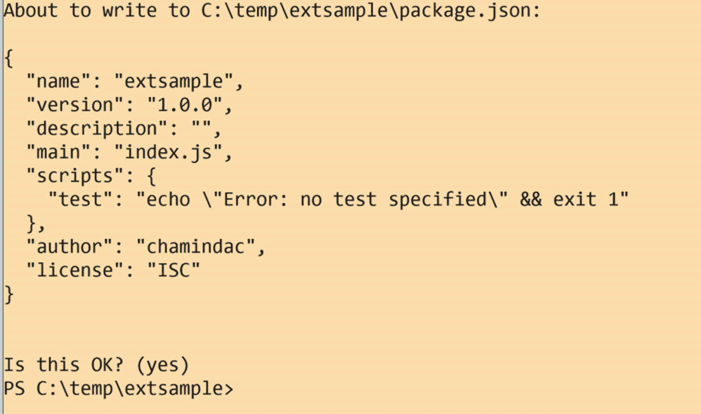
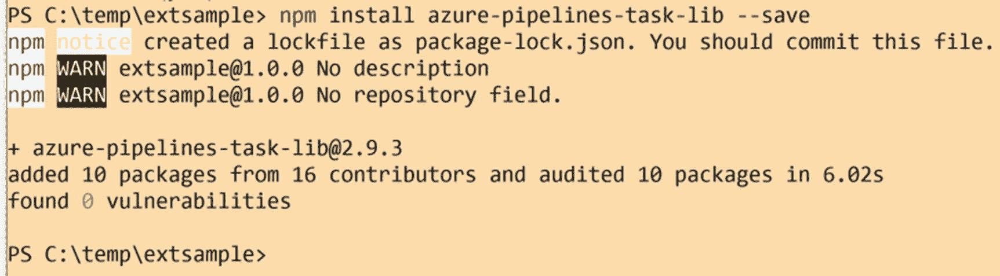
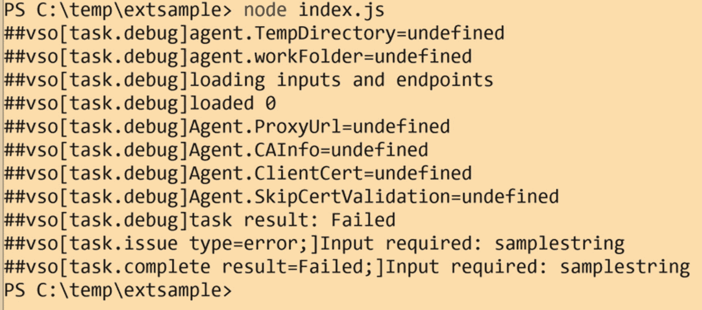
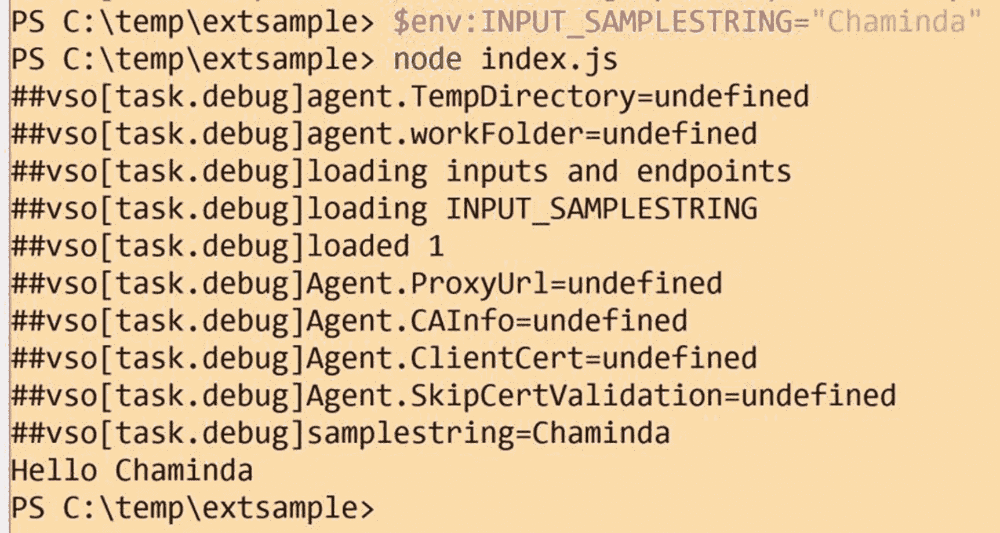
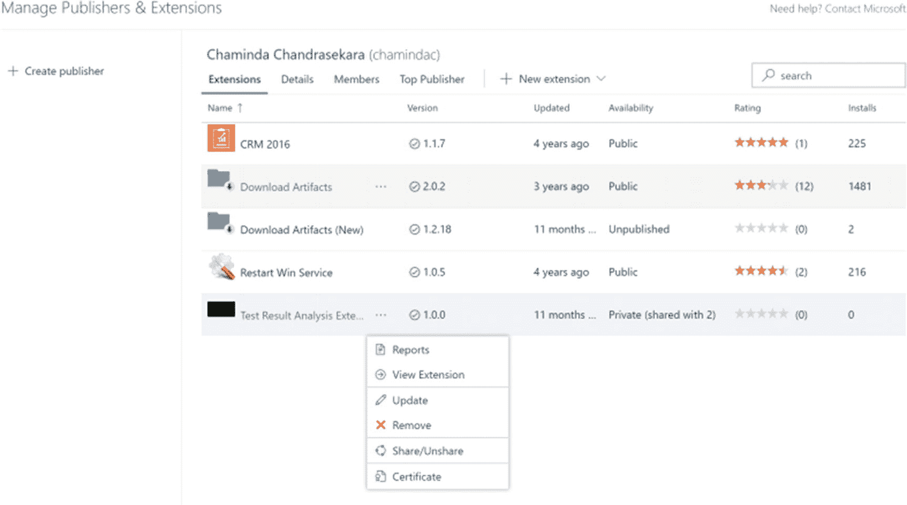

# 十一、REST API、命令行和扩展开发

在前几章，我们讨论了 Azure DevOps 中的构建和发布管道。我们已经研究了经典和 YAML 管道。对于我们讨论的管道功能，REST API 支持我们以编程方式处理许多操作。此外，Azure DevOps 的命令行界面(CLI)提供了几个命令，可用于构建和发布的编程管理。

对构建和发布管道的编程访问对于生成报告、操纵管道行为，甚至实现管道的可扩展性都很有用。在这一章中，让我们看看如何利用 REST API 和 CLI，以及先决条件是什么。接下来，我们讨论如何使用对构建和发布管道的编程访问来构建扩展。

## 第 11.01 课:使用构建和发布 REST APIs

Azure DevOps build 的 REST API 提供了几个 API。您可以使用 REST API 执行诸如运行构建、更新构建定义、获取关于构建的细节、标记构建等操作。

REST API 请求/响应对可以用下面列出的五个组件来标识。

*   **请求 URI**

    `VERB https://{instance}[/{team-project}]/_apis[/{area}]/{resource}?api-version={version}`

    其中`instance`将 Azure DevOps 组织或 Azure DevOps 服务器分别定义为`dev.azure.com/{organization}`或`{server:port}/tfs/{collection}`。

    资源路径应该是`_apis/{area}/{resource}`的形式，例如`_apis/build/builds`。API 版本应定义为表示 REST API 的版本，以`{major}.{minor}[-{stage}[.{resource-version}]]`的格式使用，例如`api-version=5.0`或`api-version=5.0-preview`或`api-version=5.0-preview.1`

*   **HTTPS 请求报头**

    强制请求头/动词/操作，如 GET、POST、PUT、PATCH 或 HEAD。您可以选择提供一个授权头作为载体令牌。

*   **消息请求正文**

    为了支持 POST、PUT 操作，您可以为 JSON 这样的主体提供指定为 application/json 的内容类型。

*   **响应报文头**

    HTTP 响应代码，2xx 表示成功，4xxx、5xx 表示错误。可选的响应头，如 Content-type，以支持请求/响应。

*   **响应消息正文**

    JSON 或 XML 响应体。

每个请求都应该提供访问 REST API 的授权头。您可以在所需的访问范围内使用 Azure DevOps 中生成的个人访问令牌(PAT )(我们已经在 Azure Boards 手册中更详细地描述了 PAT)。

要在 PowerShell 中创建所需的授权头，可以使用下面的代码段。

```
$AzureDevOpsPAT = "yourazuredevopsPAT"
$User="";

$base64AuthInfo = [Convert]::ToBase64String([Text.Encoding]::ASCII.GetBytes(("{0}:{1}" -f $User,$AzureDevOpsPAT)));
$header = @{Authorization=("Basic {0}" -f $base64AuthInfo)};

```

然后，您可以在调用请求中使用这个头，如下所示。

```
$Url = 'https://dev.azure.com/'+ $OrganizationName + '/' + $teamProjectName +
            '/_apis/git/policy/configurations?repositoryId=' + $repository.id + '&refName=refs/heads/' + $fromBranch + '&api-version=5.1-preview.1';

$policies = Invoke-RestMethod -Uri $Url -Method Get -ContentType application/json -Headers $header

```

使用 REST API 来实现功能，这在 Azure DevOps 中是不可用的，是值得讨论的事情。例如，假设您使用构建策略来保护您的版本(发布)分支。如果您想将一个版本分支中的分支保护构建策略复制到另一个版本，没有现成的方法可以做到这一点。您必须在新分支中手动创建分支保护构建策略。但是，您可以使用 REST API，通过获取一个分支的策略并将其应用到另一个分支来实现 PowerShell 脚本。

另一个例子是，在向给定目标发布时，您可能想要从您的构建的相关变更和工作项中生成一个发布说明。给定目标的发布必须考虑之前对目标所做的发布，然后检查从上一个发布到目标的所有中间发布和构建，以识别当前发布中的所有变更。在这种情况下，REST API 将派上用场，您可以在 PowerShell 中实现所需的功能，并在发布管道中执行它来生成发布说明。

让我们快速看一下如何使用 REST API 对构建进行排队，以理解它是如何工作的。

```
POST https://dev.azure.com/{organization}/{project}/_apis/build/builds?api-version=5.1

```

您必须为 REST API 的 post 请求提供主体。作为最低要求，所提供的 json 主体应该包含构建定义 id。此外，您可以提供更多信息，如源分支。注意，构建定义 id 48 在下面是硬编码的，它可以被参数化。

```
{
        "definition": {
            "id": 48
        },
        "sourceBranch": "master"}

```

此类请求的示例脚本如下所示。

```
$AzureDevOpsPAT = "yourPAT"
$OrganizationName = "yourAzureDevOpsOrgname"
$teamProjectName = 'yourteamprojectname'

$User="";

$base64AuthInfo = [Convert]::ToBase64String([Text.Encoding]::ASCII.GetBytes(("{0}:{1}" -f $User,$AzureDevOpsPAT)));
$header = @{Authorization=("Basic {0}" -f $base64AuthInfo)};

$Url = 'https://dev.azure.com/'+ $OrganizationName + '/' + $teamProjectName + '/_apis/build/builds?api-version=5.1'

$body = '{
        "definition": {
            "id": 48
        },
        "sourceBranch": "master",
    }';

$BuildQResponse = Invoke-RestMethod -Uri $Url -Method Post -ContentType application/json -Headers $header -Body $body

$BuildQResponse

```

在本课中，我们讨论了使用 REST API 执行构建和发布操作的可能性。此外，几个有用的场景解释了 REST API 可以在哪里使用，我们还看了一个示例来了解它如何与 PowerShell 一起工作。

## 第 11.02 课:使用 Azure 管道 CLI

与 REST API 类似，我们可以使用 Azure DevOps CLI 进行编程访问，并在 Azure 管道上执行操作。Azure DevOps CLI 是 Azure CLI 的扩展。作为先决条件，您需要安装 Azure CLI。

您可以通过在 PowerShell 窗口或命令提示符中执行`az --version`来检查当前安装的 Azure CLI 扩展。见图 [11-1](#Fig1) 。



图 11-1

已安装的 az 扩展

要设置 az devops 扩展，您可以在 PowerShell、命令提示符或终端窗口中执行`az extension add --name azure-devops`。见图 [11-2](#Fig2) 。



图 11-2

安装 az devops 扩展

要了解 az devops 扩展中可用的命令，请执行`az devops --help`。您可以看到有几个可用的命令。除此之外，让我们关注管道命令。见图 [11-3](#Fig3) 。



图 11-3

az devops 命令

您必须执行`az devops login` `--org orgname`，然后在提示获得 Azure DevOps 组织的 CLI 认证时提供 PAT 作为令牌。您也可以使用 Windows 中的`$env:AZURE_DEVOPS_EXT_PAT = 'yourPAT'`和 Linux 或 macOS 中的`export AZURE_DEVOPS_EXT_PAT=yourPAT`设置环境变量，然后登录。见图 [11-4](#Fig4) 。



图 11-4

使用 CLI 登录 Azure DevOps

让我们以 REST APPI 为例，尝试对一个构建进行排队，看看如何使用 CLI 来完成。为了理解 build queue 命令，您可以运行一个`az pipelines build queue –help,`，它会给出所有的帮助信息。要对一个构建进行排队，您可以运行一个命令，例如,`az pipelines build queue -p 'Project X' --definition-id 48`,这个构建就会被排队。见图 [11-5](#Fig5) 。



图 11-5

使用 CLI 构建队列

您可以在 PowerShell 脚本或批处理脚本中使用 CLI，然后将它们用作管道中的步骤或用于其他目的。

在本课中，我们讨论了如何使用 Azure DevOps CLI 对 Azure 管道进行编程访问。

## 第 11.03 课:开发和分发扩展

如果市场上现有的现成功能或可用的扩展不能满足您对管道的要求，您可以为 Azure 管道开发扩展。

您可以选择使用基于 typescript 或基于 PowerShell 的管道扩展来设置管道扩展。但是，只有 windows 代理能够运行基于 PowerShell 的任务。如果您打算在所有代理平台上运行管道扩展，建议使用 typescript 来开发管道扩展。

您需要在 PowerShell 的文件夹中或终端窗口中运行一个`npm init`来为扩展完成 npm 初始化。出现提示时提供所需的信息，初始 package.json 将在该文件夹中创建。见图 [11-6](#Fig6) 。



图 11-6

npm 初始化以创建 package.json

然后可以运行 NPM install azure-pipelines-task-lib-save 添加任务库来创建管道任务。见图 [11-7](#Fig7) 。这会将所需的节点模块安装到您的扩展文件夹中。



图 11-7

添加管道任务库

然后，您需要通过执行以下命令来添加 typescript 类型。

```
npm install @types/node --save-dev
npm install @types/q --save-dev

```

运行`tsc –init`以确保在构建扩展时 typescripts 被编译成 javascripts。如果您的机器中还没有安装 typescript，您需要使用`npm install -g typescript`命令全局安装它。

有了这个所有需要开发的结构，你的扩展就创建在文件夹中了。接下来，您需要将任务 json 添加到扩展任务文件夹中。您可以使用下面显示的模板，并用所需的值替换{{placeholder}}。Microsoft 文档中提供了该模板，建议从文档中复制最新的模板。以下文件内容中的输入是为示例任务设计的，您可能需要根据您的任务需求使用输入。

```
{
    "$schema": "https://raw.githubusercontent.com/Microsoft/azure-pipelines-task-lib/master/tasks.schema.json",
    "id": "{{taskguid}}",
    "name": "{{taskname}}",
    "friendlyName": "{{taskfriendlyname}}",
    "description": "{{taskdescription}}",
    "helpMarkDown": "",
    "category": "Utility",
    "author": "{{taskauthor}}",
    "version": {
        "Major": 0,
        "Minor": 1,
        "Patch": 0
    },
    "instanceNameFormat": "Echo $(samplestring)",
    "inputs": [
        {
            "name": "samplestring",
            "type": "string",
            "label": "Sample String",
            "defaultValue": "",
            "required": true,
            "helpMarkDown": "A sample string"
        }
    ],
    "execution": {
        "Node10": {
            "target": "index.js"
        }
    }
}

```

上述任务 json 文件中的可替换值可以像下面这样更新。

```
    "id": "bdf70ab0-8600-45fd-98d4-834e22030ff6",
    "name": "chamindacdemotask",
    "friendlyName": "My Demo Task",
    "description": "Demo Task",
    "helpMarkDown": "",
    "category": "Utility",
    "author": "chamindac",

```

然后，我们可以使用下面的内容创建一个 intex.ts (typescript 文件)来启用演示/示例任务的功能。

```
import tl = require('azure-pipelines-task-lib/task');

async function run() {
    try {
        const inputString: string | undefined = tl.getInput('samplestring', true);
        if (inputString == 'bad') {
            tl.setResult(tl.TaskResult.Failed, 'Bad input was given');
            return;
        }
        console.log('Hello', inputString);
    }
    catch (err) {
        tl.setResult(tl.TaskResult.Failed, err.message);
    }
}

run();

```

然后可以从扩展文件夹中执行`tsc`，将 typescript 编译成 javascript。现在，如果您运行`node index.js,`，它将在本地测试扩展；但是，由于没有提供输入，它将失败。见图 [11-8](#Fig8) 。



图 11-8

测试扩展任务

您可以提供一个带有`$env:INPUT_SAMPLESTRING="Chaminda"`的输入字符串，并测试它来检查是否成功执行。见图 [11-9](#Fig9) 。



图 11-9

提供输入参数值的测试函数

要部署扩展，您需要打包它。但是在打包之前，您需要为它创建一个清单文件。对于我们使用的示例，您可以创建一个名为 vss-extension.json 的文件，并添加下面的内容。

```
{
    "manifestVersion": 1,
    "id": "build-release-task",
    "name": "Chamidac Build and Release Tools",
    "version": "0.0.1",
    "publisher": "chamindac",
    "targets": [
        {
            "id": "Microsoft.VisualStudio.Services"
        }
    ],
    "description": "Tools for building/releasing with chamindac. Includes one build/release task.",
    "categories": [
        "Azure Pipelines"
    ],
    "icons": {
        "default": "img/extension-icon.png"
    },
    "files": [
        {
            "path": "buildAndReleaseTask"
        }
    ],
    "contributions": [
        {
            "id": "custom-build-release-task",
            "type": "ms.vss-distributed-task.task",
            "targets": [
                "ms.vss-distributed-task.tasks"
            ],
            "properties": {
                "name": "buildAndReleaseTask"
            }
        }
    ]
}

```

要打包您的扩展，您需要有 tfx CLI，它可以用`npm i -g tfx-cli`命令安装。您必须在扩展文件夹中创建一个名为`buildAndReleaseTask`的文件夹，并移动除了`vss-extension.json`文件之外的所有文件和文件夹。您可以在扩展中添加更多文件夹，并添加更多任务来创建包含多个任务的扩展。然后从扩展文件夹中，`run tfx extension create --manifest-globs vss-extension.json`命令将扩展打包。

要创建发布者，您必须登录 [`https://marketplace.visualstudio.com/manage`](https://marketplace.visualstudio.com/manage) 并设置您的发布者档案。然后，您可以使用`tfx extension publish --manifest-globs vss-extension.json --share-with` [`https://dev.azure.com/yourorgname`](https://dev.azure.com/yourorgname) 命令将您的扩展发布、共享到您的组织。

发布后，您的扩展模块可以共享给其他组织或公开共享。参见图 [11-10](#Fig10) 。



图 11-10

扩展ˌ扩张

在本课中，我们讨论了如何为 Azure pipelines 构建扩展。

## 摘要

在本章中，我们讨论了使用 REST API 和命令行界面对 Azure 管道的编程访问。此外，我们已经讨论了构建管道扩展所需的基本步骤。

在下一章中，我们将看看测试自动化与 Azure 管道的集成选项。