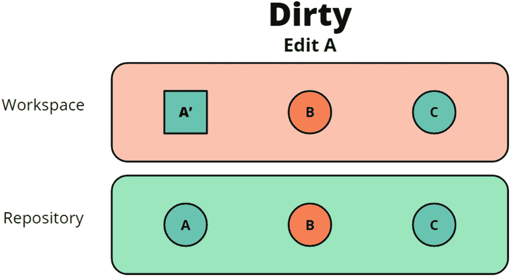
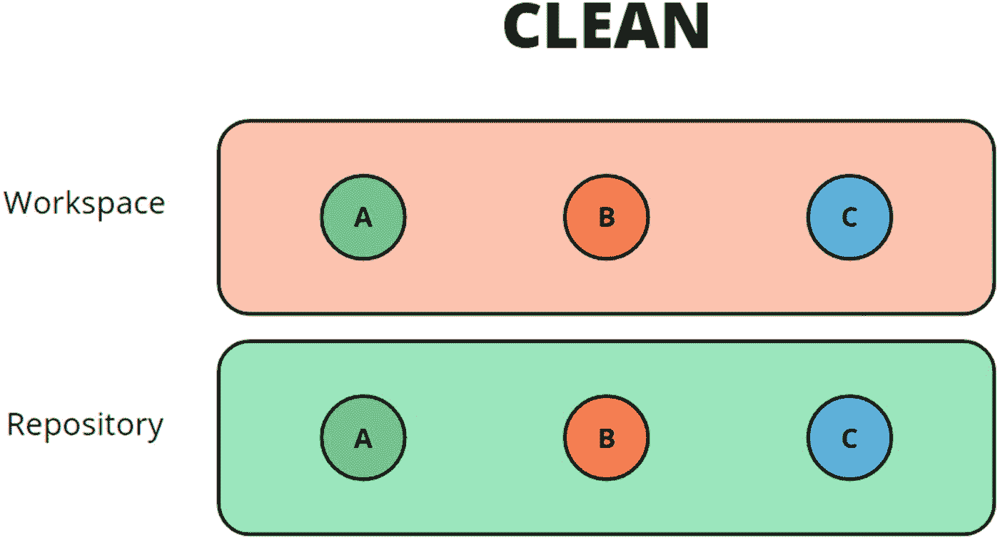
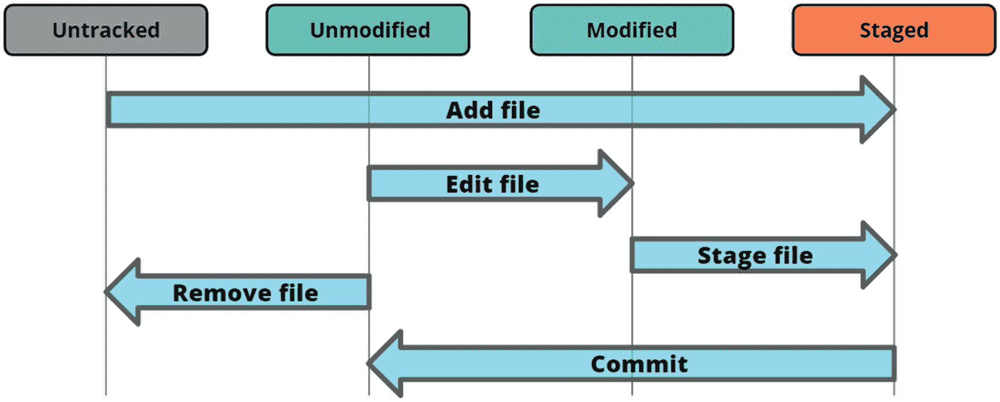
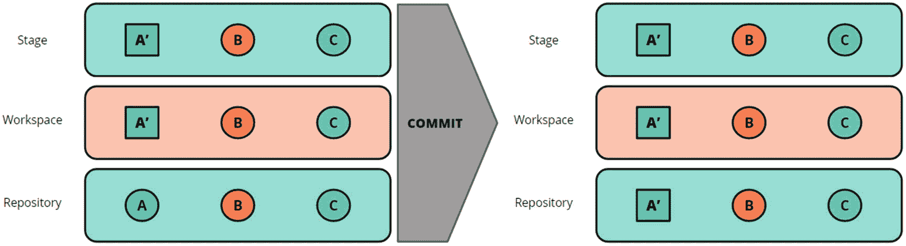
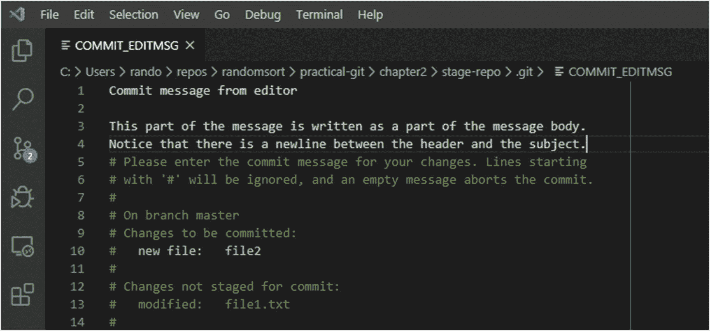
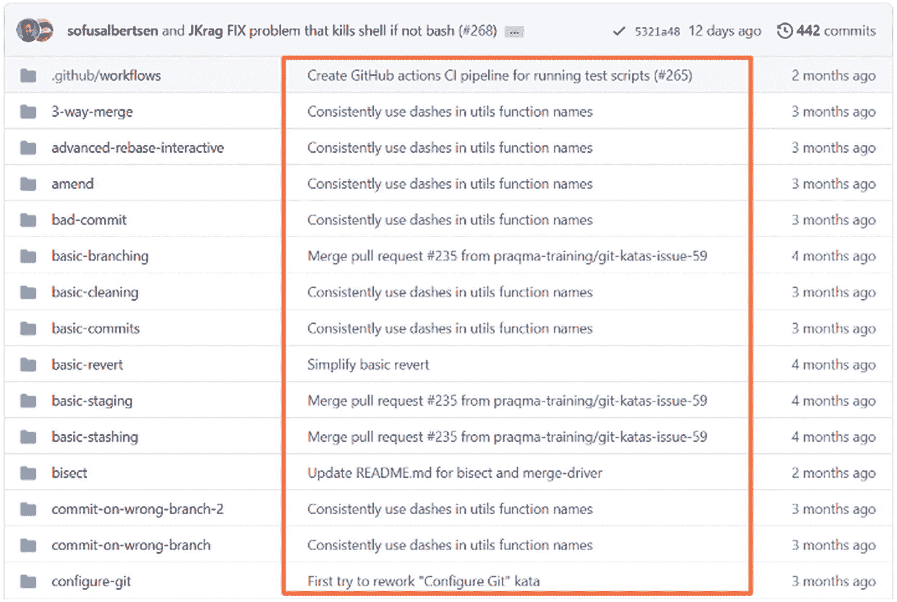
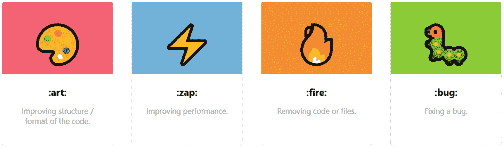
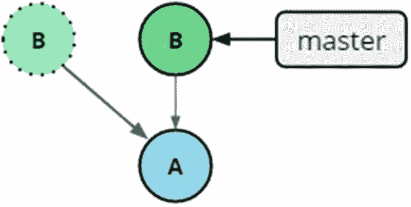

# 二、构建提交

在本章中，我们将详细讨论提交。提交是我们历史的基本组成部分，既包含我们版本的实际内容，也包含定义我们历史的父指针。有意地形成提交并附上格式良好的提交消息是在协作环境中成为有价值的个人贡献者所需的基本技能。

## 工作区里有什么

在其核心，Git 是关于文件和目录。在软件开发中，我们存储项目特定文件和代码的地方通常称为工作区。当我提到我们的工作空间时，我指的是我们项目的根文件夹，包含构成项目的文件和目录，以及。git 文件夹。在下面的代码片段中，我们看到了一个同时在 shell 和 Windows 资源管理器中列出的目录。请注意。包含 git 存储库的 Git 文件夹是隐藏的。隐藏以`.`开头的文件和文件夹是一种常见的惯例。

```
$ ls
img/  index.js  library.js  README.md

```

如前所述，与存储库上当前签出的提交相比，我们的工作空间可以是脏的，也可以是干净的。脏不是一个不好的词；它只是意味着不同。这种差异当然是一件好事，因为这些是我们已经做出的改变，只是还没有实施。另一个可能使我们的工作空间变脏的来源是自动生成的文件和构建工件。我们将在后面介绍如何让 Git 忽略某些路径。

我们可以把我们的工作区看作总是由一个提交和一个应用于其上的变更集或差异来表示。图 [2-1](#Fig1) 显示了对象在一个干净的工作区和存储库中是如何相同的。



图 2-2

在存储库顶部更改文件 A 后的脏工作区



图 2-1

存储库顶部的干净工作区

因为工作区和存储库的内容是相同的，所以工作区被认为是干净的。在图 [2-2](#Fig2) 中，我们可以看到当我们改变文件 a 时，脏工作区是如何与存储库相关联的。

我们可以使用 Git status 命令看到这一点。当我们更改存储库中的文件并运行 git status 命令时，我们可以看到 git 如何告诉我们已经被 Git 跟踪的文件被修改或删除，或者我们第一次添加到工作区的文件如何在 Git 状态中显示为未被跟踪。

```
$ ls
A  B  C  D
$ git status
On branch master
nothing to commit, working tree clean
$ echo testing > A
$ git status
On branch master
nothing to commit, working tree clean
$ git add A
$ git status
On branch master
nothing to commit, working tree clean
$ git commit -m 'Edit A'
On branch master
nothing to commit, working tree clean
$ git status
On branch master
nothing to commit, working tree clean
$ rm B
$ git status
On branch master
Changes not staged for commit:
  (use "git add/rm <file>..." to update what will be committed)
  (use "git checkout -- <file>..." to discard changes in working directory)

        deleted:    B

no changes added to commit (use "git add" and/or "git commit -a")
$ git commit -am 'Remove B'
[master db1f9c6] Remove B
 1 file changed, 0 insertions(+), 0 deletions(-)
 delete mode 100644 B
$ git status

On branch master
nothing to commit, working tree clean
$ touch D
$ git status
On branch master
nothing to commit, working tree clean
$ git add D
$ git status
On branch master
nothing to commit, working tree clean
$ git commit -m 'Add D'
On branch master
nothing to commit, working tree clean
$ git status
On branch master
nothing to commit, working tree clean

```

## 使用阶段准备提交

在 Git 中，文件可以表示在三个不同的位置，其中两个我们已经讨论过了:工作区和存储库。在这两者之间还有第三个区域，这个区域被称为指数或阶段。这一阶段的逻辑是，我们在这里设计下一步要提交的内容。工作流程如下:我们进行一些更改，我们准备我们希望成为下一次提交的一部分的更改，最后我们提交。冲洗并重复。这个流程可以在图 [2-3](#Fig3) 中看到。



图 2-3

本地存储库中的流程

这个流程是普通软件开发流程的简化视图，但是希望它是可识别的。我听过的对舞台最直观的描述是，我们想象自己是家庭聚会上的摄影师，我们在指导人们谁应该去拍下一张照片，当我们完成后，我们就拍照。然后，我们重复。以类似的方式，我们使用命令`add`向舞台添加一个路径。此操作也称为转移文件。

Note

当我们存放一个文件或目录时，我们不仅仅存放一个路径，我们告诉 Git 在下一次提交中包含这个路径。我们在运行`git add`命令时暂存内容。这意味着，如果我们在转移文件后更改它，我们需要再次转移它，以便在下一次提交时包含它。

正如我们在图 [2-3](#Fig3) 中看到的，从 Git 的角度来看，一个文件可以有几种不同的状态。下面的列表只省略了我们将在本章后面讨论的最后一个状态:

*   **未修改的**:这个文件在工作区和存储库中当前签出的提交中是相同的。

*   **修改过的**:这个文件同时存在于工作区和存储库中，但是不同。

*   **Staged** :该文件位于工作区、当前提交和 stage 中。请注意，该文件在所有三个位置都可以不同。

*   **未跟踪**:该文件在工作区中，但不在当前提交中。

MANIPULATING THE STAGE

在本练习中，我们将通过一些步骤来操作转移，以及在更改、转移和取消转移文件时会发生什么。

首先，让我们使用调查命令的基本工具包来看看我们的存储库中的内容。

首先，我们运行命令 pwd 来查看我们所在的路径，然后运行 ls 来查看目录包含的内容。

```
$ pwd
/c/Users/rando/repos/randomsort/practical-git/chapter2/stage-repo
$ ls
file1.txt  subfolder/
$ ls -al
total 9
drwxr-xr-x 1 rando 197609  0 mar 13 12:18 ./
drwxr-xr-x 1 rando 197609  0 mar 13 12:18 ../
drwxr-xr-x 1 rando 197609  0 mar 13 12:19 .git/
-rw-r--r-- 1 rando 197609 14 mar 13 12:18 file1.txt
drwxr-xr-x 1 rando 197609  0 mar 13 12:18 subfolder/

```

请注意。git 文件夹在我们使用标志-a 之前不会显示，这是因为默认情况下`ls`不会显示隐藏的文件夹，正如前面提到的，惯例是文件和文件夹以句点(.)被认为是隐藏的。除此之外，我们可以看到我们有几个文件和一个目录。

现在我们已经对文件系统有了基本的了解，我们使用几个基本的 git 命令来控制存储库。我们使用 git status 来询问 git 我们的工作空间相对于我们的存储库的状态。我们得到了更多的信息，我们将忽略这些信息，直到下一章。

```
$ git status
On branch master
nothing to commit, working tree clean
$ git log --oneline --decorate
1cc4f2e (HEAD -> master) Initial commit

```

我们从 git 状态中得到的首先是确认我们确实在 Git 存储库中工作。我们还了解到，我们的工作空间是干净的，没有任何东西是精心布置的。从 git 日志中，我们了解到我们有一个历史非常短的存储库。

在接下来的步骤中，我们将对工作区进行更改，并在此过程中存放文件。我们将继续使用 Git status 来查看我们的操作如何反映在文件的状态中。记住，我们从一个干净的工作空间开始。

```
$ echo "test" > file1.txt

$ git status
On branch master
Changes not staged for commit:
  (use "git add <file>..." to update what will be committed)
  (use "git restore <file>..." to discard changes in working directory)
        modified:   file1.txt

no changes added to commit (use "git add" and/or "git commit -a")

$ git add file1.txt

$ git status
On branch master
Changes to be committed:
  (use "git restore --staged <file>..." to unstage)
        modified:   file1.txt

$ echo thing > file1.txt

$ git status
On branch master
Changes to be committed:
  (use "git restore --staged <file>..." to unstage)
        modified:   file1.txt

Changes not staged for commit:
  (use "git add <file>..." to update what will be committed)
  (use "git restore <file>..." to discard changes in working directory)
        modified:   file1.txt

$ echo content > file_that_did_not_exist_before.txt

$ git status
On branch master
Changes to be committed:
  (use "git restore --staged <file>..." to unstage)
        modified:   file1.txt

Changes not staged for commit:
  (use "git add <file>..." to update what will be committed)
  (use "git restore <file>..." to discard changes in working directory)
        modified:   file1.txt

Untracked files:
  (use "git add <file>..." to include in what will be committed)
        file_that_did_not_exist_before.txt

$ git add file
file_that_did_not_exist_before.txt  file1.txt

$ git add file
file_that_did_not_exist_before.txt  file1.txt

$ git add file_that_did_not_exist_before.txt

$ git status
On branch master

Changes to be committed:
  (use "git restore --staged <file>..." to unstage)
        modified:   file1.txt
        new file:   file_that_did_not_exist_before.txt

Changes not staged for commit:
  (use "git add <file>..." to update what will be committed)
  (use "git restore <file>..." to discard changes in working directory)
        modified:   file1.txt

$ echo content > subfolder/subfile1.txt

$ echo content > subfolder/subfile2.txt

$ git status
On branch master
Changes to be committed:
  (use "git restore --staged <file>..." to unstage)
        modified:   file1.txt
        new file:   file_that_did_not_exist_before.txt

Changes not staged for commit:
  (use "git add <file>..." to update what will be committed)
  (use "git restore <file>..." to discard changes in working directory)
        modified:   file1.txt

Untracked files:
  (use "git add <file>..." to include in what will be committed)
        subfolder/subfile1.txt
        subfolder/subfile2.txt

$ git add subfolder/
$ git status
On branch master
Changes to be committed:
  (use "git restore --staged <file>..." to unstage)
        modified:   file1.txt
        new file:   file_that_did_not_exist_before.txt
        new file:   subfolder/subfile1.txt
        new file:   subfolder/subfile2.txt

Changes not staged for commit:
  (use "git add <file>..." to update what will be committed)
  (use "git restore <file>..." to discard changes in working directory)
        modified:   file1.txt

$ git restore --staged file1.txt

$ git status
On branch master
Changes to be committed:
  (use "git restore --staged <file>..." to unstage)
        new file:   file_that_did_not_exist_before.txt
        new file:   subfolder/subfile1.txt
        new file:   subfolder/subfile2.txt

Changes not staged for commit:
  (use "git add <file>..." to update what will be committed)
  (use "git restore <file>..." to discard changes in working directory)
        modified:   file1.txt

$ git commit -m "our first commit"
[master de09faa] our first commit
 3 files changed, 3 insertions(+)
 create mode 100644 file_that_did_not_exist_before.txt
 create mode 100644 subfolder/subfile1.txt
 create mode 100644 subfolder/subfile2.txt

$ git status
On branch master
Changes not staged for commit:
  (use "git add <file>..." to update what will be committed)
  (use "git restore <file>..." to discard changes in working directory)
        modified:   file1.txt

no changes added to commit (use "git add" and/or "git commit -a")

$ git log --oneline --decorate
de09faa (HEAD -> master) our first commit
1cc4f2e Initial commit

```

在前面的列表中，我们看到一些值得注意的项目。

*   当我们在转移 file1.txt 后对其进行更改时，它将同时被修改和转移。

*   我们可以在同一个阶段修改和添加文件。

*   当我们暂存一个目录时，所有子路径都会被暂存。

*   我们可以使用 git restore - staged <path>撤销路径的暂存。</path>

## 犯罪

在上一节中，我们花了很多精力讨论如何控制提交的内容。在这一节中，我们将介绍如何进行实际的持久化，将阶段的内容持久化到我们称为提交的包中的存储库中。

### 去吧，Committee

为了创建提交，我们使用命令`git commit`。图 [2-4](#Fig4) 显示了提交流程的不同步骤。它假设我们已经在舞台上添加了一些变化。接下来发生的是用命令行标志`-m`传递的消息，变更集和一些自动生成的内容被保存在提交对象中。之后，当前签出的分支被更新以指向这个新创建的提交。



图 2-4

这是我们运行命令`git commit`时发生的情况，假设文件是暂存的

如前所述，我们主动控制提交的两个部分，而其余部分由 Git 自动处理。我们使用 stage 定义了提交的文件内容，同时我们控制在创建提交时将什么消息附加到提交。

指定提交消息的最常见方式是使用标志-m，并在命令中直接传递提交消息。这种方法的优点是提交消息很可能是简短的，并且我们在创建提交的过程中没有额外的步骤。这有几个缺点；稍后当我们讨论什么是好的提交消息时，我们将会谈到这些。命令行中最基本的提交流程如下所示:

```
$ git add file.txt
$ git commit -m “Add file.txt”
$ git log
commit 2a99799c0b9727dc22ae8a790d3978ac40273960 (HEAD -> master)
Author: Johan Abildskov <randomsort@gmail.com>
Date:   Fri Mar 13 13:17:41 2020 +0100

```

我们在前面的示例中看到的是，我们添加到阶段的变更集成为我们使用`git commit`命令创建的下一个提交的一部分。我们作为参数传递的消息显示在日志中。这很有用，因为我们可以给每个提交一个标题，给出变更集的原因。许多开发人员还使用消息来引用外部问题，这些问题在吉拉、GitLab 或 Azure DevOps Boards 等工具中维护。

如果我们在`commit`命令中省略了`-m`标志，Git 将打开一个文本编辑器，您可以在其中设计提交消息。这也为使用提交消息的主题和主体打开了大门。在大多数公司中，只使用 subject，因为附加信息是在版本控制之外保存的。在这些情况下，将任何问题引用放在正文中，不要放在主题中。这允许一个更干净的提交头，它简明地描述了任何 Git 提交引入的更改。

在开源工作流中，提交消息体更常用于添加更多关于变更集的文档。该信息不应与适当文件中的内容重复，如阅读材料、生成的文件、用户说明或类似文件。相反，它应该包含与具体变更集相关的补充信息。以下项目列表是此类文档中可能包含的内容的一些示例:

*   引入这个变更集的原因是

*   任何架构决策

*   设计选择

*   代码中不一定显而易见的权衡

*   可以考虑的替代解决方案的描述

*   变更集内容的更详细描述

在清单 [2-1](#PC7) 中，我从 Git 核心源代码库中抓取了一条提交消息。这显示了使用提交消息的主题和正文的提交消息的示例。

```
mm, treewide: rename kzfree() to kfree_sensitive()

Listing 2-1An example commit message with the subject giving a high-level description of the feature and the body verbosely listing the content

```

正如莱纳斯所说:

对称命名只有在暗示使用中的对称性时才有帮助。

否则就是主动误导。

在“kzalloc()”中，z 是有意义的，是

来电者想要。

在“kzfree()”中，z 是有害的，因为可能在

将来我们真的可能想要使用“memfill(0xdeadbeef)”或

一些东西。界面的“零”部分甚至是不相关的。

kzfree()存在的主要原因是清除敏感信息

这不应该泄露给相同存储器的其他未来用户

物体。

在前面的代码中，我们看到了当我们在提交消息中都有一个 subject 和一个 body 时，它会是什么样子——在下面的代码中，我将展示当我们在命令行中没有指定提交消息的情况下执行创建提交的步骤时，它会是什么样子。

```
$ git commit
hint: Waiting for your editor to close the file...
[master 1a41582] Commit message from editor
 1 file changed, 0 insertions(+), 0 deletions(-)
 create mode 100644 file2
$ git log -n 1
commit 1a41582591bedad5757914acf3fc8be562e468a4 (HEAD -> master)
Author: Johan Abildskov <randomsort@gmail.com>
Date:   Fri Mar 13 13:19:57 2020 +0100

    Commit message from editor

    This part of the message is written as a part of the message body.
    Notice that there is a newline between the header and the subject.

```

但是前面的代码中缺少了一个步骤，很难在书中展示出来。图 [2-5](#Fig5) 显示了 Git 在我的系统上打开的编辑器的截图，其中有一个预填充的提交消息，我们可以根据自己的喜好进行更改。注意，如果我们保存并退出编辑器时只有空行和注释，提交过程将被中止。



图 2-5

命令行中未指定消息时提交消息编辑器的默认视图

开箱即用，Git 将默认您的 shell 正在使用的任何编辑器，在环境变量编辑器或 VISUAL 中定义。如果 Git 不能决定使用哪个编辑器，它将会退回到 vi，这让许多 Windows 用户感到沮丧。前面描述的行为可以用配置 core.editor 覆盖。我们将在后面介绍配置，但是请注意，您可以选择您最喜欢的编辑器。不一定所有的编辑器都支持这样使用，或者可以由 Git 运行，而不需要启动特定的配置。大多数常用的编辑器都是兼容的，或者可以很容易地配置为正常工作。这比谷歌搜索导致堆栈溢出差不了多少。

#### 好的、坏的和难看的提交消息

正如我们前面提到的，提交是不可变的。这也意味着提交消息是永久的，因此在编写它们时投入一些思考以最大化消息对我们的合作者和未来的自己的价值是很重要的。有一种说法是，计算机科学中的一个难题是给事物命名。我想我们可以一起写提交消息。这很难，但很重要。

在这一节中，我们将介绍编写好的提交消息的一些基本规则，一些需要避免的事情，并给出好的和坏的提交消息的例子。

在深入细节之前，我想强调有用的提交消息的一个关键因素是存储库中合作者之间的一致性。在我看来，提交消息具有相同的语义和外观比它们被客观地优化编写要重要得多。能够浏览提交列表并且能够感受到存储库中正在发生的事情是非常强大的。有些人还将集成添加到他们的 ide 中，用最近更改代码行的提交的提交消息主题来修饰每个代码行。如果提交消息具有相同的基本形状，这种工作方式会更加强大。我们为此使用的 git 特性不太敏感地称为 Git 责备。它让我们能够指出是谁引起了特定的变化。虽然这很有用，但是责备这个词的内涵并不是很有建设性，也不利于健康的文化。我们将在稍后讨论 git 责备。

##### 主题或标题

从图 [2-6](#Fig6) 中可以看出，无论从哪个角度看，提交消息主题的位置都很突出。在日志中，它是我们与提交相关联的内容；这是通过它们描述的事件来显示我们代码库的脉动。在存储库管理器中，通常显示的文件和目录用最后修改它们的提交来注释。有些人甚至在编辑器中逐行添加这些提交消息。例如，这可以在 Visual Studio 代码中使用 Git lens 来完成。



图 2-6

通过 GitHub 接口提交消息头

当大多数人讨论提交消息时，他们仅仅是指主题。有几类好的提交消息，如前所述，代码库的各个贡献者在策略上保持一致是很重要的。

我将介绍的第一个策略是简单地描述提交中发生了什么变化。在我看来，这不应该是描述一个实现细节。因此，好的提交消息可能是“启用单独的调试和信息记录”或“将签出功能移动到单独的类”，而坏的消息可能是“将 checkout()从 app.js 移动到 checkout.js”。我的观点是，我应该能够从提交头中获得比简单的 diff 更多的信息。

第二种风格是描述如果应用这个提交将会发生什么。这可以成功地用在开源项目中，或者用在开发人员为许多模块做贡献的现场，也许有些模块超出了他们的核心职责。使用这些语义还可以很好地表明提交和交付形状的意图。语言和交流塑造了我们的工作方式，因此这也是帮助构建一致的工作流程的一种强有力的方式。像这样的好的提交消息可能是“添加随机重试”或“更新 2020 模型的价格”。不好的例子可能是“删除不需要的文件”或“添加 JIRA-1234”。

如前所述，许多组织也使用提交头来引用一个或多个问题。这是一个我有很多意见的话题，但我会尽量保持最少的咆哮，只介绍几个项目来思考。我不反对在提交消息中引用问题，我认为这提高了可追溯性，并且在大多数情况下是一个好的实践。我反对使用问题引用来代替适当的、有用的提交消息。我更喜欢将问题引用放在消息体中，而不是占据提交头中的稀疏空间。提交头只有一行，所以最好不要超过 70 个字符。如果您有许多提交引用了同一个问题，或者需要从同一个提交中引用多个问题，您应该反思您是否以次优的方式处理了您的工作。这两种一对多的关系都是工作流的味道，表明您要么试图一次做太多的事情(在一次提交中有许多问题的情况下)，要么在将变更集提交到公共存储库之前没有做基本的历史记录整理。当然，可能会有各种各样的特殊场景，但是在大多数情况下，在单个存储库中应该有一对一的提交与问题比率。

利用我们越来越多的高级终端和添加到 Unicode 中的表情符号，一种新的风格已经被引入。一些人在他们的提交信息中使用这些表情符号来表示改变的意图或类型。这有时被称为 Gitmojis。在图 [2-7](#Fig7) 中，你可以看到一些描述和用法的例子。



图 2-7

Gitmojis 用于简明地对变更集进行分类

使用 Gitmojis 可能看起来只不过是一个噱头，但如果持续使用并经过思考，它可能是一种非常有效的交流方式。然而，有效地使用它需要纪律。如果你正在使用 Gitmoji，就把它作为标题的第一个字符。请限制在提交消息中使用表情符号。如果没有别的，那么确保你使用的表情符号与代码库的工程文化一致。用于调味的表情符号应该添加在提交消息的末尾，这样它们就不会干扰所用 Gitmoji 的消息传递。最后，根据与存储库交互的工具的最新程度和定制程度，可能会有技术上的挑战。定制工具或过时软件可能与提交消息或路径中的表情符号不兼容。

以上是编写好的提交消息的一些不同的风格或策略。您所选择的内容会因项目和存储库的不同而不同。确保有高度的一致性，这样 git 日志看起来是干净的！我用一个错误提交消息的汇编列表来结束这一节，它应该作为如何不编写提交消息的警告。该列表可能基于也可能不基于实际的提交消息:

*   修正打字错误

*   虚拟提交

*   修复 CI(在十个提交的字符串上)

*   也许这能行

*   我甚至不知道为什么我*咒骂删除*关心了

*   

提交消息的主体应该包含什么内容是非常依赖于项目的，但是如果没有别的，我建议您将提交消息放在这里——即使这会妨碍您使用 short -m 直接在命令行中设置提交消息。获得一个好看的历史记录当然值得那些额外的按键。我不会详细介绍提交消息体，因为这里有太多不同的方法要介绍。

## 用**修正**从哎呀时刻恢复

git commit 命令有一个名为`amend`的标志，允许我们编辑最近的提交。我说的编辑，是骗人的。我们将在后面更详细地介绍发生了什么，但是如前所述，提交是不可变的，所以我们并不真正编辑提交，而是创建一个新的几乎相同的提交，并指向它。旧的提交不会立即消失，但会在一段时间后被垃圾收集。

图 [2-8](#Fig8) 显示了当我们做`amend`时会发生什么。创建新的提交并更新分支指针。



图 2-8

修改提交会创建新的提交并更新指针。它留下了一个悬空提交，该提交将在某个时候被垃圾收集。新的悬空提交以淡化的轮廓示出，新的提交以实线示出

提交`amend`在很多情况下都是有用的。我们可能忘记了准备我们需要的一切，或者准备得太多了。我们可能已经写了一个可怕的提交消息，并立即后悔。在下面的部分中，我运行了一个提交示例，然后向提交中添加了一个文件。在本例中，我将使用-m 运行命令来指定消息。如果我们不使用-m，我们将打开我们的$EDITOR，并预先填充来自我们正在修改的提交的消息。

```
$ git log -n 2
commit 25cb0925de7cbc8c12803c6d51a7ddbc5f114509 (HEAD -> master)
Author: Johan Abildskov <randomsort@gmail.com>
Date:   Sat Mar 14 13:13:59 2020 +0100

    Add Feature X

commit 67e7eef1a44f222a50207fc20b24477bd9e0ddd8
Author: Johan Abildskov <randomsort@gmail.com>
Date:   Sat Mar 14 13:12:34 2020 +0100

    Initial Commit
$ git add example.md
$ git status
On branch master
Changes to be committed:
  (use "git reset HEAD <file>..." to unstage)

        new file:   example.md

$ git commit –amend -m “ADD Feature X, with docs”
[master 8fb3eba] Add Feature X, with docs
 Date: Sat Mar 14 13:13:59 2020 +0100
 2 files changed, 2 insertions(+)
 create mode 100644 example.md
 create mode 100644 featurex.app

$ git log -n 2
commit 8fb3ebac82ac4940cf478746e04d73eb1882aa76 (HEAD -> master)
Author: Johan Abildskov <randomsort@gmail.com>
Date:   Sat Mar 14 13:13:59 2020 +0100

    Add Feature X, with docs

commit 67e7eef1a44f222a50207fc20b24477bd9e0ddd8
Author: Johan Abildskov <randomsort@gmail.com>
Date:   Sat Mar 14 13:12:34 2020 +0100

    Initial Commit

$ git status
On branch master
nothing to commit, working tree clean

```

从前面的例子中我们可以看到，我们可以很容易地修复一个常见的错误。虽然修改历史和提交通常被认为是不好的做法，但这只适用于人们之间共享的项目。因此，只要我们致力于不共享的提交，我们就应该注意积极地编辑和塑造我们的历史，以便为后代提供尽可能多的价值。

## 使用获取干净提交。被增加

开发人员的一个常见错误是在他们的提交中添加了太多内容。这可能是编译的文件、日志或其他构建工件。如果我们正在构建 Python 代码，我们绝不会对持久化。pyc 编译 Python 文件作为我们版本化源代码的一部分。过多地进入我们的存储库可能会有一些不幸的结果。

首先，随着时间的推移，它会降低性能。进行初始克隆和通过签出将不同的提交放入工作区都可能成为长时间运行的任务。由于 Git 是不可变的和分布式的，这可能会有很高的代价，并且以后很难修复。

第二，它混淆了真正的变更，使得提交具有明确定义的边界和明显的变更集变得更加困难。如果一个提交包含了由于一堆变更的构建工件而导致的数万个文件的变更，那么很难辨别真正的逻辑变更隐藏在哪里。

第三，它强制实施坏习惯，只是将所有已经改变的添加到下一次提交中。作为专业的软件工作者，我们必须小心并确保我们交付的是我们想要交付的。以这种方式，简单地添加我们的存储库中存在的东西确实有助于我们形成深思熟虑的变更集。

幸运的是，Git 附带了一个解决方案，可以帮助我们避免意外弄乱我们的存储库。Git 附带了一个特性，允许我们将路径放入一个名为。gitignore，并且当我们暂存要提交的项目时，此处包含的文件将被忽略。这使得我们在发布内容时更加自由。使用 git add folder/比单独暂存文件要高效得多。

a。gitignore 文件包含要忽略的模式列表。如果您在一行前面加上感叹号，那么该模式将被包括在内，即使它以前被忽略了。在下图中，我们将展示根据。gitignore 文件。

清单 [2-2](#PC10) 展示了一个例子。gitignore 适合 Python 项目的文件。

```
# Created by www.gitignore.io/api/python
# Edit at www.gitignore.io/?templates=python

### Python ###
# Byte-compiled / optimized / DLL files
__pycache__/
*.py[cod]
*$py.class

# C extensions
*.so

Listing 2-2A basic .gitignore file that can be used for Python projects to avoid cluttering the repository (generated from https://gitignore.io)

```

Note

比如说。gitignore 文件对于大多数常用的语言和框架，可以去 gitignore.io 下载一个合适的。

将. gitignore 文件添加到我们的存储库之后，我们可能还需要做一些清理工作。仅仅因为我们忽略了文件，并不能从工作区中删除已经提交的文件。更重要的是，它不会将它们从历史中删除，所以它们仍然会占用空间，即使它们不再使工作空间变得杂乱。如何处理这是一个完全不同的复杂问题，我们将在后面讨论。

在下面的命令行片段中，您可以看到添加. gitignore 文件如何更改 add 命令的行为:

```
$ ls
app.exe*  example.md  featurex.app  file
$ git add .
$ git status
 $ git status
On branch master
Changes to be committed:
  (use "git reset HEAD <file>..." to unstage)

        new file:   app.exe

$ git restore app.exe

$ git status
On branch master
Untracked files:
  (use "git add <file>..." to include in what will be committed)

        app.exe

nothing added to commit but untracked files present (use "git add" to track)
$ echo “*.exe” > .gitignore
$ git add .
$ git status
On branch master
Changes to be committed:
  (use "git reset HEAD <file>..." to unstage)

        new file:   .gitignore

```

从前面的例子可以看出，创建一个. gitignore 文件有助于防止我们的存储库变得不必要的混乱。我们还可以看到。gitignore file 只是一个文件，对它的更改将像任何其他文件更改一样被跟踪。

### 高级版。吉蒂尔

虽然前面的例子很好，并且提供了很多价值，但通常还不够。我们倾向于对我们的存储库中允许的内容有更详细的计划。

制定诸如“除了文件夹图像之外，我们不允许 png 出现在我们的存储库中”这样的方案并不少见。我们可以用 git ignore 文件做这些事情。

git ignore 文件包含一个从上到下应用的模式列表。我们可以给行加上前缀`!`,使它们成为包含而不是排除。

因此，为了获得前面的场景，我们可以使用下面的`.gitignore`文件。请注意，git ignore 文件中以`#`开头的行将被忽略。

```
# Example .gitignore
# Exclude all pngs
*.png
# Include pngs in img/
!img/*.png

```

BUILDING A .GITIGNORE FILE

以下一组命令在命令行中构建了一个 git ignore 文件，该文件不允许将 png 文件添加到存储库中，除非它们位于 images 文件夹中。

首先，我们注意到存储库中有两个 png 文件，一个在根目录中，一个在 images 文件夹中。当我们添加根时。)，两个 png 文件都是临时的。

```
$ ls
file.png  img/  README.md
$ git add .

$ git status
On branch master
Changes to be committed:
  (use "git reset HEAD <file>..." to unstage)

        new file:   file.png
        new file:   img/file.png
$ git restore .
$ git status
On branch master
Untracked files:
  (use "git add <file>..." to include in what will be committed)

        file.png
        img/file.png

nothing added to commit but untracked files present (use "git add" to track)

```

在将我们的 stage 恢复到存储库中的状态之后，我们完全忽略存储库中的 png 文件。当我们转移根目录时，不会转移任何 png 文件。

```
$ echo *.png > .gitignore
$ git add .
$ git status
On branch master
Changes to be committed:
  (use "git reset HEAD <file>..." to unstage)

        new file:   .gitignore

$ git restore .
$ git status
On branch master
Untracked files:
  (use "git add <file>..." to include in what will be committed)

        .gitignore

nothing added to commit but untracked files present (use "git add" to track)

```

既然我们已经再次恢复到基本状态，我们可以使用！作为模式的前缀。在这种情况下，我们允许图像文件夹中的 png。

```
$ echo !img/*.png >> .gitignore
$ git add .
$ git status
On branch master
Changes to be committed:
  (use "git reset HEAD <file>..." to unstage)

        new file:   .gitignore
        new file:   img/file.png

```

这也可以通过单独的。gitignore file 文件夹中只包含这一行的文件！*.png。这将具有这样的效果，即无论存储库相信什么，在这个文件夹和下面的 png 文件都是允许的。因此，我们可以在目录结构中放置任意数量的 git ignore 文件。与 Git 的许多其他方面一样，这增加了复杂性，我们应该在根之外添加 ignore 文件。

#### 忽略全局

在 shell 语言中，有一个 globbing 的概念，这是一种模糊通配符扩展。一个`*`代表任何一个名字。但是我们也可以使用序列`**`来表示任意嵌套。这使得我们可以说“我们不希望 png 文件在我们的存储库中，除非它们在一个名为 images 的文件夹中，不管那个文件夹在哪里”。在您希望允许存储库中有 png 文件，但又担心人们会不小心添加他们随意放置的 png 文件的情况下，这是非常有用的。如果 png 被放在一个名为 images 的文件夹中，那么它就是允许的，这迫使开发人员在将 png 添加到存储库时要更加慎重，同时不要过度限制。

以下示例从上一个练习开始，然后扩展到其他几个位置。

GLOB PATTERNS IN GIT IGNORE

本练习假设我们有与上一个练习相同的 git ignore 文件，也就是说，git ignore 文件拒绝 png，除了存储库根目录中的文件夹 img/之外。这意味着我们有一些不同的图像文件夹，它们的内容是不允许的。

我们从上一个练习中的设置开始，然后向 gitignore 文件添加一个通配符模式。

```
$ echo ‘img/*.png’ >> .gitignore
$ git add .
$ git status
$ git status
On branch master
Changes to be committed:
  (use "git reset HEAD <file>..." to unstage)

        new file:   .gitignore
        new file:   img/file.png
        new file:   subfoldimg/file.png

$ git restore .

```

我们现在添加了一个通配符模式，允许任何子文件夹在名为 images 的子文件夹中包含 png。这允许我们更广泛地允许异常，而不用在一个文件夹一个文件夹的层次上做所有的事情。

```
$ echo '!img/*.png' >> .gitignore
$ git add .
$ git status
On branch master
Changes to be committed:
  (use "git reset HEAD <file>..." to unstage)

        new file:   .gitignore
        new file:   img/file.png
        new file:   subfoldimg/file.png
        new file:   subfolder/subfoldimg/file.png

```

我们现在添加了一个更广泛的模式，只要 png 在一个名为 img/的文件夹中，这种情况发生在目录树中的多远都没有关系。该子句比本练习中的第一个子句更宽泛，因此我们可以返回并从 Git ignore 文件中删除行`img/*.png`,因为它被刚刚添加的行所覆盖。

前面的例子非常具体地展示了我们如何创建精细的方案，这些方案将给予我们对进入存储库的内容的细粒度控制。它还表明，即使是像前面这样简单的例子，它也可能很快变得复杂。

我强烈建议不要创建太复杂的 gitignore 文件，它们会很快变得看起来很神奇，而且当开发人员使用他们的版本控制系统时，他们不会很清楚发生了什么。如果可能的话，这当然是要避免的。

## 去吧卡塔

为了更好地支持本章的学习目标，我建议您阅读以下 Git 表格:

*   基本-提交

*   基本阶段

*   改进

*   忽视

## 摘要

在这一章中，我们已经介绍了这个阶段，以及如何利用它来创建漂亮的原子提交。我们还讨论了提交消息以及如何写好它们。更重要的是，我们讨论了一些不同的策略来决定您希望您的提交消息遵循什么模式。我们谈到了使用 amend 重做提交的最简单的方法。最后，我们讨论了如何使用 Git ignore 文件来避免存储库中的意外文件。有了这些知识，我们就可以大胆尝试，创造完美提交的悠久历史。