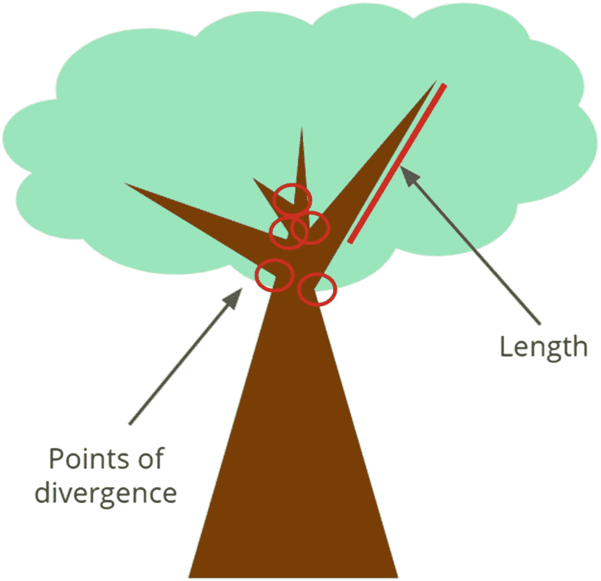
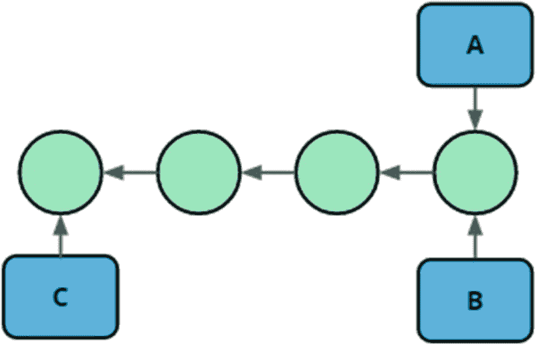
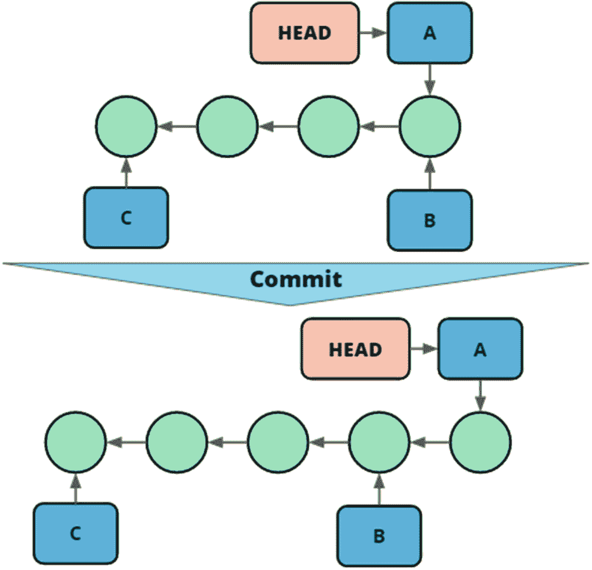

# 3.线性历史

Git 以其轻量级分支而闻名。它们在创建和合并方面都非常高效。作为开发人员，它们使用起来也相对简单。任何经历过看似无法解决的合并冲突的人都会质疑这种说法。

简而言之，分支是我们如何管理我们的源代码生命周期，我们如何管理我们的代码库的不同版本，以及我们如何隔离我们的变更集以促进原子变更和协作。

分支看起来有点复杂，但是我会尽我所能给你正确的词汇和心智模型，让你能够轻松地使用分支。

在这一章中，我们将涵盖线性历史，也就是说，具有完整的单字符串提交链的存储库。首先，我们将介绍 Git 分支模型的基本构件。然后，我们将展示它们如何以可视化的方式交互，并通过 Git 存储库中的任务来总结这一点。

## 分支基础

当我们想到树枝时，会想到两件事。一是发散。它甚至在自然语言中表现出来。“分支的道路”指的是分成多个方向的道路。其次，我们对分支的直觉是有一定长度的——而不仅仅是一个点。就版本控制而言，当我们有独立的提交链时，我们会期望我们有分支。这种直觉是人们学习 Git 时许多困惑的根源。在图 [3-1](#Fig1) 中，我们可以看到这些概念是如何映射到实际树的绘图中的。



图 3-1

我们的直觉表现出来了；树枝有长度，代表分叉点

在 Git 中，分支只不过是对单个提交的引用。这是本书中最重要的一句话，所以我要重复一遍。在 Git 中，分支只不过是对单个提交的引用。这意味着，当我们提到源代码的一个分支时，我们通常指的是该分支上的最新提交以及在它之前的提交。但是从技术上来说，分支只是指向最新的提交，而“分支上”的其余提交是通过跟随来自该提交的父指针而得到的。这也意味着分支的存在不一定需要任何分歧。我们可以有两个指向相同提交的分支，因此两个分支是相同的，没有任何差异。

该布局如图 [3-2](#Fig2) 所示。我们有一串提交和指向这串提交的三个分支。分支 A 和 B 指向相同的提交，而分支 C 指向不同的提交。请注意，虽然 C 不同于 A 和 B，但并不存在分歧。c 仅仅是 A 和 b 的前缀，这在我们讨论合并时会变得很重要。



图 3-2

线性历史中的三个分支。A 和 B 指向同一个提交，而 C 指向 A 和 B 的前任

### 保持头脑清醒

如前所述，我们可以在同一个存储库中拥有多个分支，甚至指向同一个提交。这使得我们目前在哪个分支上工作变得不明显。在 Git 中，当前活动的分支被称为签出。Git 使用一个名为 HEAD 的文件来跟踪当前签出的内容。

在图 [3-3](#Fig3) 中，你可以看到当我们创建提交时，头指针是如何引用移动的分支指针的。



图 3-3

树枝是如何移动的

头指着的东西定义了两件事。首先，HEAD 指向一个分支，也就是说，当我们进行更多提交时移动的分支。第二，当我们使用 git status 这样的命令时，我们的工作区和 stage 要与提交进行比较。

## 提交到您的分支机构

从上一章，我们知道了如何创建提交。我们现在已经讨论了分支指针和头指针。这意味着我们现在准备在主分支上创建一些提交。需要注意的重要一点是，当我们提交时，HEAD 指针不会改变。它一直指向主分支，主分支指向的内容会发生变化。

以下练习将使用 git 命令完成图 [3-3](#Fig3) 中的场景。

COMMITTING

在下面的练习中，我们将首先看到我们的历史与图 [3-3](#Fig3) 的历史相匹配。然后我们将提交并看到我们的历史现在与图 [3-3](#Fig3) 的下半部分相匹配。这个练习可以在本书的源代码中找到。

```
$ git log --oneline
f157eed (HEAD -> A, B) 4
3652176 3
5cbbdc1 (C) 2
6856025 1

$ echo 5 > README.md

$ git commit -am "5"
[A 933a6c5] 5
 1 file changed, 1 insertion(+), 1 deletion(-)

$ git log --oneline
933a6c5 (HEAD -> A) 5
f157eed (B) 4
3652176 3
5cbbdc1 (C) 2
6856025 1

```

正如在下面的练习中可以看到的，我们在创建提交时移动了一个分支，但是头部保持不变。

## 签出以前的版本

到目前为止，我们只关心创建提交。我们没有积极地探索历史。在这一节中，我将向您展示如何在您的工作区中切换版本。Git 的一个关键特性是速度快。这也意味着使您的工作空间类似于您的代码库的不同版本是一项微不足道的任务。由于 Git 是分布式的，我们在本地表示了整个存储库，这也允许这些操作发生，即使我们离线。

我们使用命令“`git checkout <target>`”将特定的修订放入我们的工作区。因为目标检验可以获取任何最终导致提交的内容。最常见的是，我们使用分支、标记或提交 sha。Git 结帐是一个两步的过程。首先，它将头指针移动到特定的修订版。然后，它获取该修订中的内容，并将其移动到工作区中，使工作区看起来像该修订。如果 Git 不能以安全的方式做到这一点，它将中止签出。这意味着如果您的工作被签出覆盖，Git 将不会完成操作。Git 也不会清理任何未被跟踪的文件。如果我们使用一个标签或者一个提交 sha 作为 checkout 命令的目标，我们将会以一个分离的 HEAD 状态结束。这听起来比实际更危险。这仅仅意味着我们目前没有跟踪任何分支，并且可能会丢失我们在这一点上所做的工作，因为我们没有提交任何分支。然而，没有理由为此担心。稍后，我们将一起解决这个问题。

在下面的练习中，我们将看到如何使用 git checkout 命令在不同版本的存储库之间切换。我们将检查单独的提交，查看工作空间是如何变化的，并返回到最近的版本。

CHECKING OUT DIFFERENT VERSIONS

这个练习从上一个练习的结束状态开始。

```
$ git log --oneline --decorate
7f1c255 (HEAD -> A) 5
f157eed (B) 4
3652176 3
5cbbdc1 (C) 2
6856025 1

$ cat README.md
5

$ git checkout 4
error: pathspec '4' did not match any file(s) known to git.

$ git checkout B
Switched to branch 'B'

$ cat README.md
4

$ git log --oneline --decorate
f157eed (HEAD -> B) 4
3652176 3
5cbbdc1 (C) 2
6856025 1

$ git checkout C
Switched to branch 'C'

$ cat README.md
2

$ git checkout A
Switched to branch 'A'

$ cat README.md
5

$ echo "Important information" > README.md

$ git checkout B
error: Your local changes to the following files would be overwritten by checkout:
        README.md
Please commit your changes or stash them before you switch branches.
Aborting

```

请注意，当我们试图检出一些会以不安全的方式覆盖我们工作空间中的更改的内容时，Git 会阻止该操作，并建议可能的操作。

当你完成前面的练习时，注意每个操作有多快。它几乎不需要任何时间。虽然这是一个小而琐碎的存储库，但是在非常大的存储库上也可以看到类似的性能。简单地说，Git 不需要与服务器通信这一事实是一个很大的优势，即使假设网络连接和服务器负载处于最佳状态。

## 看到不同版本之间的差异

在上一节中，我们看到了如何将代码库的任何版本实例化到我们的工作空间中。有了这些知识，找出我们的存储库的两个版本之间的区别的一个常见方法是在磁盘上有相同存储库的两个副本，在不同的文件夹中检查不同的版本，并比较它们。这既可以通过手动调查感兴趣的领域来完成，也可以使用工具来显示差异。这不是地道的饭桶。它还容易出错，并可能导致繁琐的返工，因为您需要反复检查哪个版本在哪个文件夹中，并试图找出哪个文件要复制到哪里。

Git 用 diff 命令解决了这个问题。diff 命令显示了两次提交之间的区别。该命令接受两次提交，或者对提交的引用作为参数。如果只给出一个参数，则假定 HEAD 是第一个参数。该命令如下所示:git diff <commit1><commit2>，git diff master release-1.0 就是一个例子。这将显示提交主机引用的提交和 1.0 版引用的提交之间的内容差异。</commit2></commit1>

Note

git diff 的参数顺序很重要。如果改变参数的顺序，一个方向的文件创建就变成了文件删除。添加的 20 行变成删除的 20 行。当您试图找出变更集中的内容时，这可能会导致混乱。

我对 diff 的直觉是，我将 Git 指向两个不同的提交，它会告诉我从一个提交到另一个提交需要做什么。这当然也可以看作是两者之间发生的事情。在清单 [3-1](#PC3) 中，显示了这一点，以及参数顺序对 diff 的影响。

```
$ git diff C A
diff --git a/README.md b/README.md
index 0cfbf08..7edff8 100644
--- a/README.md
+++ b/README.md
@@ -1 +1 @@
-2
+5

$ git diff C A
diff --git b/README.md a/README.md
index 7edff8..0cfbf08 100644
--- a/README.md
+++ b/README.md
@@ -1 +1 @@
-5

+2

Listing 3-1A diff and the impact of the order of the arguments. Here, we need to delete a 2 and add a 5 or, in the other direction, delete a 5 and add a 2

```

diff 命令并不关注提交之间的历史记录，不管它是否有分歧。Git 只是告诉您作为参数传递的提交所代表的两个工作区之间的区别。

有时，补丁输出可能有点难以解析——尤其是长行中的小变化。这有时可以用标志`--word-diff`来帮助，它将在一行中内联更改，而不是作为两个单独的行。这可以在清单 [3-2](#PC4) 中看到。

```
Normal Diff
 <Navbar bg="success" variant="dark">
-    <Navbar.Brand href={window.location.host}>Cultooling</Navbar.Brand>
+    <Navbar.Brand href={homeUrl()}>Cultooling</Navbar.Brand>
     <Nav className="mr-auto">
-      <Nav.Link href={window.location.host}>Home</Nav.Link>
+      <Nav.Link href={homeUrl()}>Home</Nav.Link>
     </Nav>
   </Navbar>
With --word-diff
<Navbar bg="success" variant="dark">
    <Navbar.Brand
[-href={window.location.host}>Cultooling</Navbar.Brand>-]{+href={homeUrl()}>Cultooling</Navbar.Brand>+}
    <Nav className="mr-auto">
      <Nav.Link
[-href={window.location.host}>Home</Nav.Link>-]{+href={homeUrl()}>Home</Nav.Link>+}
    </Nav>
  </Navbar>

Listing 3-2Showing how it is much easier to see what the changes are using the --word-diff flag. This can vary from use case to use case

```

我们还可以使用不带参数或带标志`--staged`的 diff 命令来查看我们的工作区、阶段和存储库之间的差异。这两个命令是强大的工具，可以帮助您更加谨慎地进行提交。

## 去吧卡塔

为了支持本章的学习目标，我建议你去解决以下 Git 卡塔:

*   分离的头部。

*   再次执行基本提交并注意正在进行的分支特定的事情可能是有用的。

## 摘要

在这一章中，我们首先介绍了如何使用一个简单的分支，包括头指针来跟踪我们当前已经签出的内容。我们还创建了一些提交，并看到我们的分支指针随着我们的操作而移动。随后，我们用 checkout 命令浏览了我们的历史，并用一些 diff 魔术完成，向我们展示了在历史的两个点之间到底发生了什么。学完这一章后，你应该对使用线性分支历史感到舒服了。