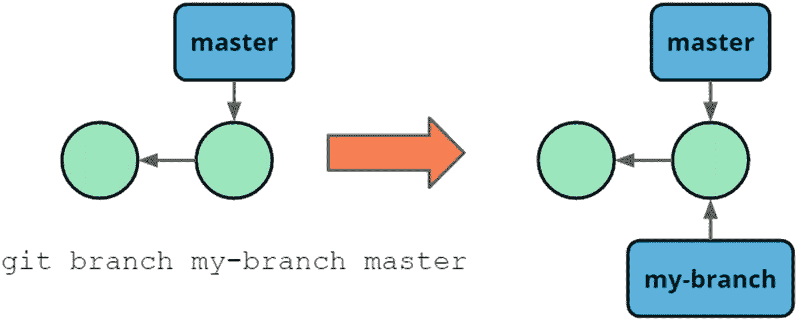
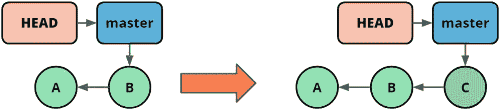
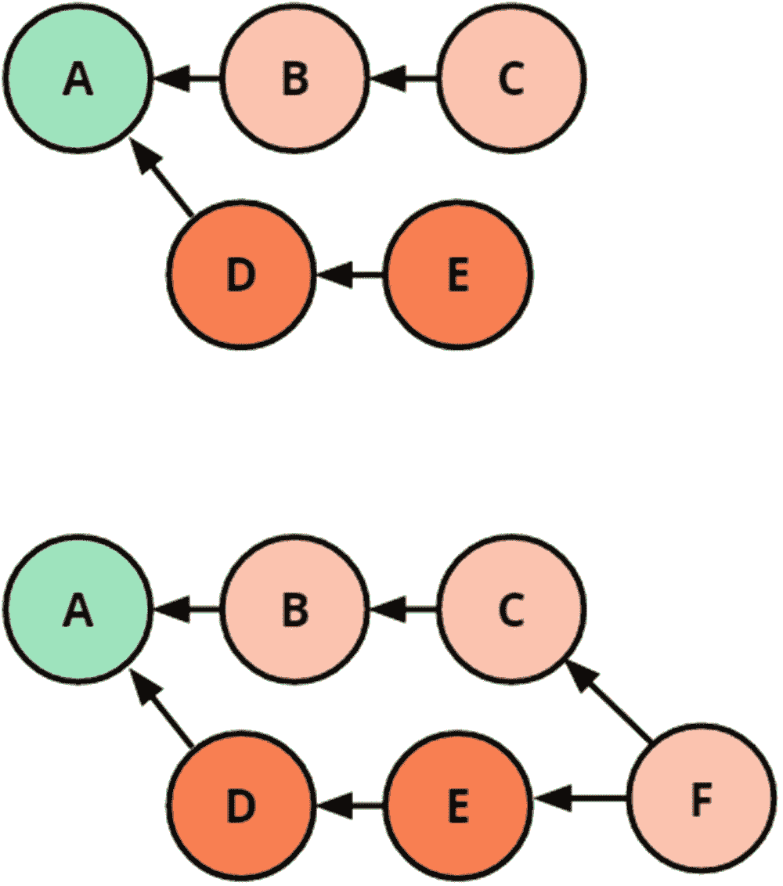
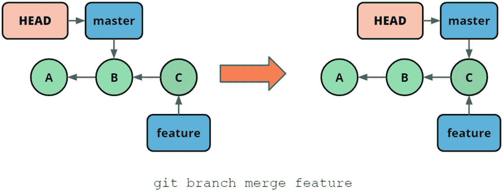
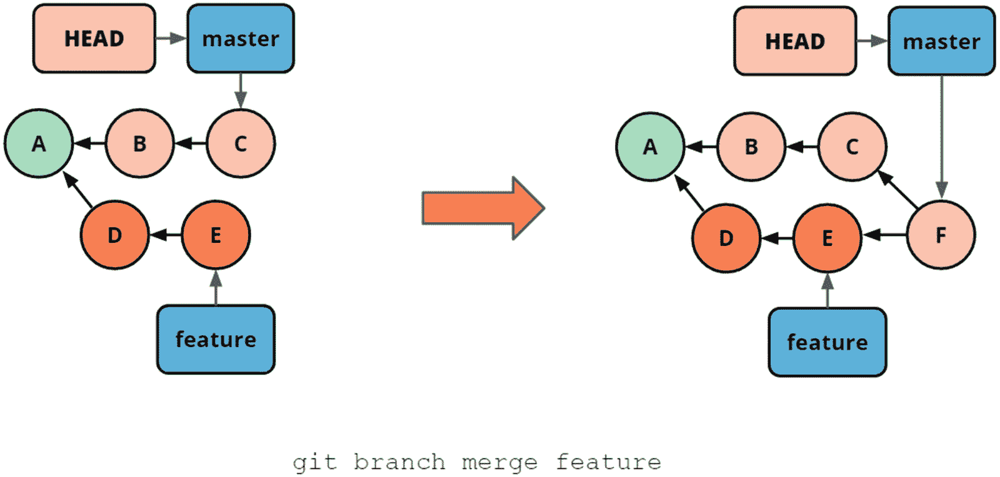
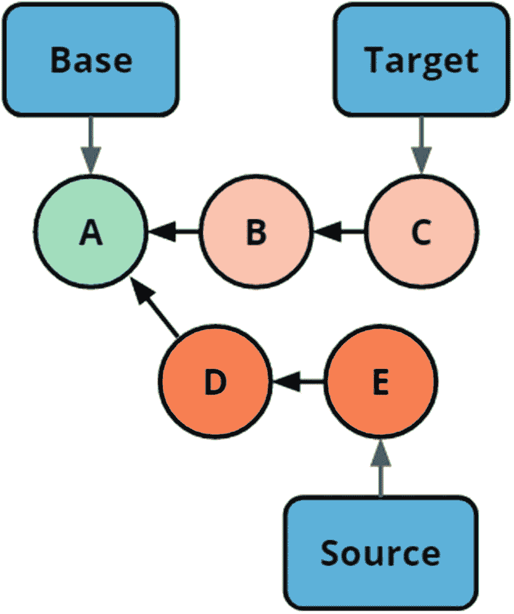
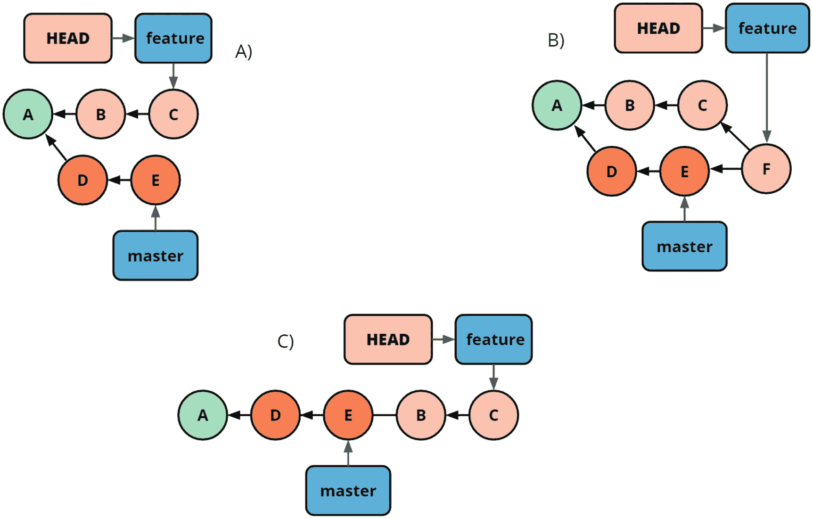
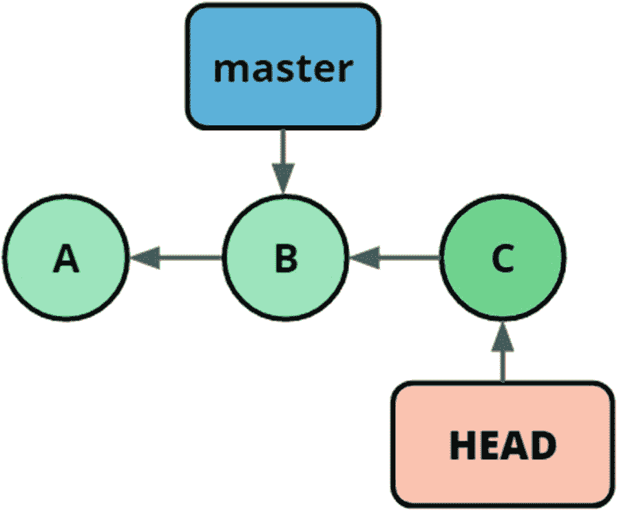

# 4.复杂分支

在上一章中，我们看了线性历史。这对于琐碎的存储库来说可能是好的，但是如果我们有信心使用分支工作，它将几乎不会引入开销，所以我们可以运用分支的力量，甚至对于我们最简单的项目。

在 Git 中与分支积极合作有很多好处。我们将在下一章讨论与多个开发人员的合作，但是即使对于一个单独的开发人员，也有来自分支的成功。它们主要源于这样一个事实，即我们可以使用分支来隔离我们的工作。当我们隔离我们的工作时，我们可以减轻一些多任务的成本。通过隔离我们在一个分支上的工作，我们总是可以创建一个新的分支，如果一个紧急的任务需要被开发的话。我们可以安全地在一个分支上运行实验，并且只有当它以一种有利的方式出现时才整合我们的实验。如前所述，分支是围绕 Git 如何工作产生混乱的一个重要原因。这是非常不幸的，因为它们是获得 Git 全部价值和理解许多概念的关键，包括使用远程存储库和除了最简单的协作方案之外的所有概念。

在这一章中，我们将着重于围绕多个分支获得一个健康的心智模型，并获得足够的实践经验，使你能够使用和推理分支。

## 创建分支

我们已经介绍过，分支是提交的指针。具体地说，这意味着分支是存储库中的一个文件，包含分支所指向的 sha。这可以在清单 [4-1](#PC1) 中看到。

```
$ cat .git/refs/heads/master
5355b7b7f01b6d69c1ae94b428f54952139eb2f8
$ git log --oneline --decorate -n 1
5355b7b (HEAD -> master, origin/master, origin/HEAD) [Chapter 7] Add aliases exercise

Listing 4-1A branch is a file containing the sha of the commit it points to

```

我们可以使用命令 git branch 来操作和列出分支。谈到远程分支时有一些微妙之处，但是我们将在下一章中讨论这些。当我们使用不带参数的命令时，我们列出(本地)分支。

我们还使用 branch 命令创建分支。我们用两个参数调用:`git branch <branch-name> <commit>`。举个例子:`git branch my-branch master`。这将在存储库中创建一个分支。它将被称为`my-branch`，并指向与主服务器相同的提交。这可以在图 [4-1](#Fig1) 中看到。



图 4-1

从引用创建分支

现在我们已经创建了一个分支，我们可以在不同的分支上做一些工作。根据 HEAD 当前指向的内容，将在适当的位置创建新的提交，并更新当前签出的分支以指向新的提交。这可以从图 [4-2](#Fig2) 中看出。



图 4-2

在分支上创建提交将添加提交并更新分支指针

既然我们已经看到了在分支上创建提交时的样子，我们就为分支的下一步做好了准备

## 使用多个分支

在 Git 中，没有任何分支的工作真的没有任何意义，我们默认总是在一个分支上工作:主分支。但真正的力量来自于对多个分支的玩弄。使用多个分支时有两个主要任务。一是让我们的工作在不同的分支上分开。我们之前已经讨论过了。另一部分是将多个分支上的变更放入同一个分支。这通常被称为合并。有多种方法可以做到这一点。在这一章中，我们将讨论合并和重置基础。

从概念上讲，当我们想要合并两个分支时，我们创建一个新的 commit，它包含来自两个分支的联合变更集。这是通过找到分支分叉的点并连接两个变更集来实现的。这可以从图 [4-3](#Fig3) 中看出。



图 4-3

一个普通的合并，合并分别指向 C 和 E 的分支

在变更集兼容的情况下，Git 将为我们处理一切。如果变更集不兼容，或者 Git 无法合并它们，我们将会陷入合并冲突。我们将在本章后面讨论这些。在我工作过的大多数代码库中，合并冲突并不常见。

### 合并

合并是我们的语言妨碍我们理解 Git 的另一个地方。我们都在谈论分支的抽象合并，不管我们打算如何做，我们都在谈论命令“git merge”。

使用 merge 命令的常见方式是“git merge branch”形式，它将把分支中的变更集合并到当前签出的分支中，例如，`git merge feature-123`。还有其他选择，但我喜欢这种工作方式，因为我们只改变我们所在的分支，这很好，因为它导致相对较少的问题。这种融合就是图 [4-3](#Fig3) 被创造出来的原因。

#### 快进合并

快进合并是 Git 中最简单的合并形式。不幸的是，人们对它们的工作方式也有一些误解。这一节将有希望让您处于喜欢快速合并的状态。

当您要合并的分支之间没有分歧时，就会发生快进合并。当一个分支是另一个分支的延续时，就会出现这种情况。在图 [4-4](#Fig4) 中，我们可以看到特征分支线性领先于主分支的场景。为了合并特性中的变化，我们需要做的就是将主分支指针移动到提交特性点。因为主分支中包含的所有变更已经是特征分支的一部分。



图 4-4

执行快进合并不会导致任何新的提交，而是一个简单的操作

这也意味着任何冲突都不可能进行快速合并。出于这个原因，快进合并可以被认为是安全的。

Note

一些工作流使用 Git 特性，其中创建新的提交来标记分支的合并。这将创建一个没有变更集的合并提交，以标记此时分支已被合并。这是通过命令 git merge - no-ff <branch>完成的。</branch>

FAST FORWARD

在本练习中，我们将只从`master`分支开始。它有两个提交。我们将创建一个名为`feature`的分支，创建一个 commit，并将其合并到 master 中。这个练习可以在练习文件夹中找到，名为`chapter4/fast-forward/`。

```
$ git log --oneline --decorate
fa8d7db (HEAD -> master) second commit
35b6a68 Initial Commit

$ git checkout -b feature
Switched to a new branch 'feature'

$ git add 1.txt

$ git commit -m "Adding file1"
[feature 4b346fe] Adding file1
 1 file changed, 0 insertions(+), 0 deletions(-)
 create mode 100644 1.txt

$ git log --oneline --decorate
4b346fe (HEAD -> feature) Adding file1
fa8d7db (master) second commit
35b6a68 Initial Commit

```

此时，功能分支包含不在主服务器上的提交，但是主服务器不包含也不能从功能分支到达的任何内容。

```
$ git checkout master
Switched to branch 'master'

$ git merge feature
Updating fa8d7db..4b346fe
Fast-forward
 1.txt | 0
 1 file changed, 0 insertions(+), 0 deletions(-)
 create mode 100644 1.txt

```

Git 告诉我们它正在进行快进，并从哪个提交开始移动指针。

```
$ git log --oneline
4b346fe (HEAD -> master, feature) Adding file1
fa8d7db second commit
35b6a68 Initial Commit

```

如果我们将其与快进合并之前的日志语句中的一个进行比较，我们可以看到提交 ID 是相同的。这意味着没有创建新的提交，并且更改纯粹是分支更新。

从前面的练习中可以看出，默认情况下，快进合并不会导致新的提交。这意味着这种类型的合并是一个非常快速的操作，因为它只是一个简单的两步过程:将更新的 sha 写入分支文件，然后签出该修订版的工作区。

#### 三向合并

在上一节中，我们讨论了琐碎的或快速前进的合并，其中没有分歧，也没有冲突的可能性。在本节中，我们将讨论简单合并或三向合并。当我们正在合并的两个分支都包含只在一个分支上的工作时，就会出现这种情况。这种差异是完全自然的，在大多数情况下，当多个开发人员在一个源代码库上合作时，都会出现这种差异。通常，当我们在我们的特性分支上开发时，一些其他开发人员已经向主分支交付了一些变更。因此，我们从主分支分支出来的点不再是主分支上的最新提交。由于提交表示工作区的特定状态，我们需要创建一个新的提交，它包含在获取两个变更集之后工作区的状态。在图 [4-5](#Fig5) 中，您可以看到这在合并前后在 Git 图上的样子。在下一个练习中，我们将介绍它在磁盘上的外观。



图 4-5

合并两个分支会创建新的提交并更新分支指针

三向合并之所以这样命名，是因为在合并中涉及三个点——两个结束状态以及两个分支离开的点。我们分别将它们命名为源、目标和合并库。这可以在图 [4-6](#Fig6) 中看到。



图 4-6

三向合并的不同组件:源、目标和合并基础

Git 使用合并基础来确定不同的变更集，并计算它们是否重叠，从而不能被 Git 自动合并。结果将是提交，并且接收分支将被更新。当我们在一个方向上完成了三向合并，如果我们在另一个方向上进行合并，它将始终是一个快进合并。

THREE-WAY MERGE

在本练习中，我们有两个内容不同的分支需要合并。我们将首先把来自`master`的内容合并到`feature`中。然后，我们将主更新到特征分支。这是一个常见的工作流程，因为您可以在交付给主模块之前，首先测试您的特征分支中的最终状态。这个练习的资源库可以在`chapter4/three-way-merge/`的练习中找到。

```
$ git log --all --graph --oneline
* d03b0bd (HEAD -> feature) Add feature.txt
| * 390d440 (master) Add master.txt
|/
* ea2b9f5 second commit
* f90da57 Initial Commit

```

我们看到有两个分叉。

```
$ git merge master
Merge made by the 'recursive' strategy.
 master.txt | 0
 1 file changed, 0 insertions(+), 0 deletions(-)
 create mode 100644 master.txt

```

当我们将来自`master`的变更合并到`feature`分支时，使用三向合并来解决合并问题。它使用了递归策略，这是一个我们可以放心忽略的实现细节。

```
$ git log --all --graph --oneline
*   ddeeef9 (HEAD -> feature) Merge branch 'master' into feature
|\
| * 390d440 (master) Add master.txt
* | d03b0bd Add feature.txt
|/
* ea2b9f5 second commit
* f90da57 Initial Commit

```

三向合并导致了新的提交`ddeeef9`。请注意，主分支仍然指向与以前相同的提交。

```
$ git checkout master
Switched to branch 'master'

$ git merge feature
Updating 390d440..ddeeef9
Fast-forward
 feature.txt | 0
 1 file changed, 0 insertions(+), 0 deletions(-)
 create mode 100644 feature.txt

```

现在我们在另一个方向合并分支，我们得到一个快速前进的合并。这是真的，因为从`master`可到达的所有内容也是从`feature`可到达的，因此 Git 认为这个合并已经解决了。许多工作流只允许在`master`上快进合并，这就是如何实现的。

```
$ git log --all --graph --oneline
*   ddeeef9 (HEAD -> master, feature) Merge branch 'master' into feature
|\
| * 390d440 Add master.txt
* | d03b0bd Add feature.txt
|/
* ea2b9f5 second commit
* f90da57 Initial Commit

```

在前面的代码中，我们遍历了三路合并，并注意到在另一个方向重复三路合并会导致快进合并。

前面的练习经历了快乐之路的场景。当我们的合并很简单时，Git 可以很容易地自动解决它们，我们感觉很强大。不幸的是，Git 并不总是能够为我们解决合并问题。我们将在下一节讨论这一点。

#### 合并冲突

Git 可能无法确定合并分支的结果。在这种情况下，Git 将要求用户解决合并问题，并继续这个过程。这种情况称为合并冲突。Git 将进入提示符状态，并将文件标记为处于冲突状态。清单 [4-2](#PC10) 通过一个状态命令展示了这一点。

```
$ git status
On branch master
You have unmerged paths.
  (fix conflicts and run "git commit")
  (use "git merge --abort" to abort the merge)
Unmerged paths:
  (use "git add <file>..." to mark resolution)
        both modified:   mergesort.py
no changes added to commit (use "git add" and/or "git commit -a")

Listing 4-2Git status shows that we are in a state of an unresolved merge conflict and instructs as to what our next steps are

```

我可以解释如何解决合并冲突的最简单的方法是，您需要使工作区看起来像您想要的合并，然后告诉 Git 您已经完成了。Git 在冲突的文件中输出所谓的标记。这可以在清单 [4-3](#PC11) 中看到。

```
$ cat mergesort.py
from heapq import merge

def merge_sort2(m):
    """Sort list, using two part merge sort"""
    if len(m) <= 1:
        return m

    # Determine the pivot point

    middle = len(m) // 2

    # Split the list at the pivot
<<<<<<< HEAD
    left = m[:middle]
    right = m[middle:]
=======
    right = m[middle:]
    left = m[:middle]
>>>>>>> Mergesort-Impl
<Rest of file truncated>

Listing 4-3Merge markers in a file show origin of different changes

```

如果您遇到复杂的合并冲突，通常使用外部合并工具(如 meld 或 kdiff)会有所帮助。在正常情况下，必须合并冲突很容易解决，可以简单地在您的普通编辑器中处理。编辑器，比如 Visual Studio 代码，理解 Git 放在文件中的标记，这使得解决合并冲突变得更加容易。

同一文件中可以有多个合并冲突。Git 查看更小的块，找出文件版本之间的相似之处。这使得处理合并冲突变得更加容易，因为您不必一次决定整个文件，而是可以分解成更小的片段进行比较。

MERGE CONFLICT

在本练习中，我们将经历与上一个练习相同的情况，只是分叉的分支会有不兼容的变化。这将导致合并冲突，我们将解决这一冲突。这个练习可以在`chapter4/merge-conflict/`下的例子中找到。

```
$ ls
0.txt  master.txt

$ cat master.txt
feature

$ git log --oneline --decorate --graph --all
* 6ce4209 (HEAD -> feature) Add feature.txt
| * c301b9a (master) Add master.txt
|/
* f237b8b second commit
* 7e48076 Initial Commit

$ git checkout master
Switched to branch 'master'

$ cat master.txt
master

```

现在，我们在仓库里找到了方向。两个分支已经分开。每个都添加了内容不同的文件`master.txt`。

```
$ git merge feature

Auto-merging master.txt
CONFLICT (add/add): Merge conflict in master.txt
Automatic merge failed; fix conflicts and then commit the result.

```

在我们启动合并后，Git 检测到合并冲突并暂停合并，提示我们解决合并。

```
$ git status
On branch master
You have unmerged paths.
  (fix conflicts and run "git commit")
  (use "git merge --abort" to abort the merge)

Unmerged paths:
  (use "git add <file>..." to mark resolution)

        both added:      master.txt

no changes added to commit (use "git add" and/or "git commit -a")

```

使用`git status`向我们展示哪里有问题，让我们知道 Git 无法合并文件`master.txt`。

```
$ cat master.txt
<<<<<<< HEAD
master
=======
feature
>>>>>>> feature

```

Git 在 master.txt 中放置了显示不同变更集的合并标记，这表明当前状态是包含 master 的文件，引入的变更是包含 feature 的文件。

```
$ echo master > master.txt

$ git add master.txt
warning: LF will be replaced by CRLF in master.txt.
The file will have its original line endings in your working directory.

```

大多数情况下，我们希望在编辑器或合并工具中完成合并，但在这种情况下，我只需选择我想要的状态。请注意，此状态可以是解决方案之一，也可以是它们的某种组合。这就是 Git 需要人工干预的原因——它不知道我们的源的语义。我们使用`add`将文件标记为处于已解析状态。

```
$ git status
On branch master

All conflicts fixed but you are still merging.
  (use "git commit" to conclude merge)

$ git commit
[master 3be77eb] Merge branch 'feature'

$ git log --oneline --decorate --graph --all
*   3be77eb (HEAD -> master) Merge branch 'feature'
|\
| * 6ce4209 (feature) Add feature.txt
* | c301b9a Add master.txt
|/
* f237b8b second commit
* 7e48076 Initial Commit

```

解决了合并冲突后，我们看到我们处于与快乐之路三向合并类似的情况。我们只需要在前进的道路上帮助 Git 一点点。

从这个练习中可以看出，解决合并冲突并不是一项令人畏惧的任务。然而，在复杂的场景中，当使用我们不熟悉的代码库时，这可能会很困难。

### 重定…的基准

三向合并的替代方法是重定基数。与三向合并不同，三向合并通过合并两个分支来创建表示工作区的新提交，而 rebase 直观地移动了提交。这在技术上是错误的，但是我们暂时保留直觉。当我们将我们的分支放在另一个分支之上时，直觉上我们将提交移动到我们的分支上，并将它们应用到目标分支之上。这可以在图 [4-7](#Fig7) 中看到。



图 4-7

重定基础与合并。从 A 开始，B 是将母版合并到特征的结果，而 C 是将特征重新基于母版的结果

我们使用`git rebase <target>`命令在`<target>`之上重设`HEAD`的基础。假设特性被签出，我们将编写`git rebase master`在主特性的基础上重新构建特性分支。这可以从图 [4-7](#Fig7) (c)中看出。

REBASE EXERCISE

在本练习中，我们从与三路合并练习相同的情况开始，但是我们不是合并分支，而是在`master`的顶部重设`feature`的基础。这个库可以在练习文件夹中找到，名为`chapter4/rebase/`。

```
$ git log --oneline --graph --all
* b188294 (HEAD -> feature) Add feature.txt
| * 8cab888 (master) Add master.txt
|/
* 6fb6ffc second commit
* 2a97e8c Initial Commit

$ git rebase master
First, rewinding head to replay your work on top of it...
Applying: Add feature.txt

$ git log --oneline --graph --all
* 449abd2 (HEAD -> feature) Add feature.txt
* 8cab888 (master) Add master.txt
* 6fb6ffc second commit
* 2a97e8c Initial Commit

```

重定基数的结果与合并的结果有一个巨大的区别。也就是说，我们没有增加提交的数量，并且降低了 Git 图的复杂性。特别是，当您在开发代码时更新您的分支以包含来自 master 的最新内容时，这是一种很好的工作方式。请注意，该功能指向一个新的提交 sha。

```
$ git show b18829
commit b1882942ed4722828d595e3428fbac75522bb587
Author: Johan Abildskov <randomsort@gmail.com>
Date:   Mon May 4 09:34:52 2020 +0200

    Add feature.txt

diff --git a/feature.txt b/feature.txt
new file mode 100644
index 0000000..e69de29

```

在这里，我们使用`show`来查看特性先前指向的提交仍然存在，因此我们可以安全地从 rebase 中恢复。

Note

虽然我们对 rebase 的直觉是我们移动了一个分支，但事实并非如此。新的提交是在合并基础之上进行的，而旧的提交没有任何对它们的引用。因此，在垃圾收集发生之前，它们可以被恢复。

对于重定基数或合并的情况有许多不同的意见。对此我有几点看法。首先，无论谁交付给定的变更集，整个团队的工作方式都会产生一致的历史，这一点很关键。这最有可能意味着每个人都 rebases 或每个人都合并。团队正在开发的工作流也可能带来影响。然而，如果工作流指示您是否可以从技术的角度使用合并或 rebases，它可能需要被查看，并且您需要重新评估它是否是一种合理的工作方式。

第二，如果你不在一个共享的分支上工作，你应该总是改变基础。这将使您的历史保持干净，并将您的提交很好地捆绑在一起，以实现简洁的交付。这也使你在交付之前更容易操纵你的本地历史，我们将在后面的章节中讨论。由于重定基础改变了提交 sha，所以重定公共分支的基础被认为是不好的做法。但是，您可能正在自己的公共分支上工作。它可以被发布以从持续集成系统中获得构建，或者从同行那里获得反馈。在这种情况下，您不应该停止对您自己的分支，而是对 public 分支进行重新基准化。

## 标签

到目前为止，在这一章中，我们已经介绍了分支，以及它们是如何轻量级和易于移动的。对于更加静态的提交，命名引用有许多用途。在 Git 中，我们有标签来提供这种功能。标签是对提交的引用。通常，标签被用来标记我们的源代码的发布版本，所以我们有一个产生我们的软件的任何给定版本的源代码的命名引用。

有两种类型的标签，轻量级的和带注释的。轻量级标签就像分支，只是它们是静态的。这意味着它们只是对提交的引用，没有附加信息。带注释的标签是 Git 对象数据库中的完整对象，接收消息并提供附加信息。通过在 tag 命令中添加-a、-s 或-m 来创建带注释的提交。tag 命令看起来像这样:`git tag <target>`对于轻量级标签。例如，`git tag v1.6.2 a233b`将创建一个指向提交的轻量级标签，前缀为 a233b。

如果我们省略目标，标签将在 HEAD 处创建。

TAGGING

在本练习中，我们将进入一个简单的存储库，添加一些标签并研究它们。本练习的知识库可在`chapter4/tags/`中找到。

```
$ git tag

```

首先，我们注意到没有标签。这与 flow log 命令的输出一致。

```
$ git log --oneline --all
f203381 (HEAD -> feature) Add feature.txt
0a664dc (master) Add master.txt
810eb22 second commit
0cae311 Initial Commit

```

现在，我们使用 sha 810eb22 在提交时创建一个标记。我们使用提交的唯一前缀。

```
$ git tag v1.0 810eb

```

现在，当我们列出所有标记时，这些标记都会显示出来，并作为日志上的参考。

```
$ git tag

v1.0

$ git log --oneline --decorate --graph --all
* f203381 (HEAD -> feature) Add feature.txt
| * 0a664dc (master) Add master.txt
|/
* 810eb22 (tag: v1.0) second commit
* 0cae311 Initial Commit

```

之前的提交是直接使用提交 sha 进行的。在下面，我们重复相同的流程，但是不使用提交，而是从引用创建一个标签。

```
$ git tag v2.0 master

$ git tag
v1.0
v2.0

$ git log --oneline --decorate --graph --all
* f203381 (HEAD -> feature) Add feature.txt
| * 0a664dc (tag: v2.0, master) Add master.txt
|/
* 810eb22 (tag: v1.0) second commit
* 0cae311 Initial Commit

```

前面的标签是轻量级标签，是纯粹的引用。我们可以创建完整的标签对象，例如，将消息附加到标签上。

```
$ git tag v3.0 feature -m "pre-release"

```

创建标记后，我们可以看到标记和被标记的提交的完整信息。将这与轻量级标签上的相同信息进行对比。

```
$ git show v3.0
tag v3.0
Tagger: Johan Abildskov <randomsort@gmail.com>
Date:   Mon May 4 10:04:34 2020 +0200

pre-release

commit f203381f79576e69f4de2a75cd6289ea635f3543 (HEAD -> feature, tag: v3.0)
Author: Johan Abildskov <randomsort@gmail.com>
Date:   Mon May 4 10:02:12 2020 +0200

    Add feature.txt

diff --git a/feature.txt b/feature.txt
new file mode 100644
index 0000000..e69de29

$ git show v1.0
commit 810eb22a50a1bd94facd9917531295ddddd27bb7 (tag: v1.0)
Author: Johan Abildskov <randomsort@gmail.com>
Date:   Mon May 4 10:02:11 2020 +0200

    second commit

diff --git a/0.txt b/0.txt
index 303ff98..36db9be 100644
--- a/0.txt
+++ b/0.txt
@@ -1 +1,2 @@
 first file
+\n additional content

```

正如我们在这个练习中所看到的，标签可以用来标记我们历史中具有某种意义的地方。

### 分离头

如果你在开始阅读这本书之前有过任何 Git 经验，很可能你已经发现自己处于一种超然的头脑状态，很可能它吓到了你。我知道，因为至少我花了一些时间才没有让我觉得自己做了不该做的事。

头部分离是完全正常的情况，很容易补救。分离的头仅仅意味着头指向提交而不是分支。这样做的结果是，在分离 head 情况下创建的提交没有任何指向它们的引用。这可能会使它们从 git 日志中消失，被垃圾收集，或者变得不必要的难以恢复。在分离的 HEAD 中结束的两种最常见的方法是显式地检查提交或检查标记。图 [4-8](#Fig8) 给出了一个例子。



图 4-8

分离的头部，带有悬空的提交

如果结束一个分离的头的情况的目的是简单地看代码，看在那个时间点上库的状态是什么，没有问题，并且我们可以停留在分离的头的状态直到我们准备好返回我们正在工作的分支。如果我们想做出改变，我们最好创建一个分支；这可以在签出时使用标志-b 很容易地完成，它将在我们签出的目标上创建一个分支。这个看起来像`git checkout -b <branch-name> <target>`。如果我们想在标签`v1.2.7`处创建一个名为 bugfix 的分支，我们使用命令`git checkout -b bugfix v1.2.7`。

DETACHED HEAD

在这个练习中，我们将把自己置于分离的头部状态，并从中恢复过来。本练习的资源库可以在示例中找到，名称为`chapter4/detached-head/`。

```
$ git log --oneline --decorate --graph --all
* adfcb1d (HEAD -> feature) Add feature.txt
| * ca3e69b (tag: v1.0, master) Add master.txt
|/
* 66d6ce7 second commit
* 66d93b9 Initial Commit

```

我们检查与主分支指向同一个分支的标签。

```
$ git checkout v1.0
Note: checking out 'v1.0'.

You are in 'detached HEAD' state. You can look around, make experimental
changes and commit them, and you can discard any commits you make in this
state without impacting any branches by performing another checkout.

If you want to create a new branch to retain commits you create, you may
do so (now or later) by using -b with the checkout command again. Example:

  git checkout -b <new-branch-name>

HEAD is now at ca3e69b... Add master.txt

```

前面的文字墙是分离的头感到危险的主要原因。注意，即使有指向我们签出的提交的引用，HEAD 并不指向它们，而是直接指向提交。

```
$ git log --oneline --decorate --graph --all

* adfcb1d (feature) Add feature.txt
| * ca3e69b (HEAD, tag: v1.0, master) Add master.txt
|/
* 66d6ce7 second commit
* 66d93b9 Initial Commit

$ git checkout -b new-branch
Switched to a new branch 'new-branch'

```

请注意，我们只是在 HEAD 处创建并签出了一个分支。根据我们的用例，我们可以检查主分支并从那里继续。

```
$ git log --oneline --decorate --graph --all
* adfcb1d (feature) Add feature.txt
| * ca3e69b (HEAD -> new-branch, tag: v1.0, master) Add master.txt
|/
* 66d6ce7 second commit
* 66d93b9 Initial Commit

```

从下面的练习可以看出，没有理由害怕脱离的头部，很容易恢复。

## 去吧卡塔

为了支持本章的学习目标，我建议您完成以下表格:

*   基本分支

*   三路合并

*   合并-冲突

*   合并-合并排序

*   Rebase-branch

*   Git-tag

*   分离头

## 摘要

在这一章中，我们谈到了 Git 中的分支以及它们是如何工作的。我们讨论了不同类型的合并，并将合并与 rebases 进行了对比。我们逐步解决了合并冲突。我们以一个简短的描述结束了这一章，描述了我们如何使用标签来标记我们代码库中的有趣的点。最后，我们缩小了分离头部的情况。

现在我们已经有了分支的基础，我们可以继续使用 Git 进行协作了。