# 五、Git 中的协作

和许多其他事情一样，软件开发并不有趣，除非我们和其他人一起做。不幸的是，大多数软件开发人员都没有在健康的环境中接触过 Git。要么他们在教室里体验 Git，在那里教授理解 Git 的重要性，应该有人向学生教授它，但它只是更大课程中的一个脚注。或者他们被介绍到某个组织的 Git 中的工作流和协作，这些组织更关心按照描述的过程而不是以有意义的方式做事。这一章将有希望让你回到正轨，并使你能够选择 Git 工作流，并与同事有效地工作。

在本章中，我们将首先介绍使用远程存储库的基础。到目前为止，我们只关心本地存储库。不要害怕，如果你已经掌握了分支，遥控器将是这些概念的一个小的延伸。之后，我们将比较最常见的工作流，并讨论每种工作流的优缺点。

## 使用遥控器

Git 据说是一个分布式版本控制系统，Git 通过 remotes 的概念来实现这种分发。通常，我们在存储库中使用单个遥控器，默认情况下，它的名称是`origin`。大多数软件项目的开发都是从现有项目的克隆开始的。这将在您的计算机上实例化原始存储库的本地副本，并将对原始存储库的引用保存为远程源。

在基于客户机/服务器的版本控制系统中，所有的命令和动作都要通过服务器。这意味着我们可以做像锁定文件这样的事情，所以一次只有一个用户可以修改它。在 Git 中，情况并非如此。我们异步工作，然后在用户空闲时同步我们的工作。最常见的是，这是通过一个公共的存储库管理器来完成的，比如 GitHub。

协作中的大多数任务都围绕着我们如何管理分支，但除此之外，我们还会处理克隆、获取、推送和拉取。有了这四个命令，您 98%的日常协作工作都将涵盖在内。

Note

协作通常发生在托管服务器或云解决方案上，如 GitHub、GitLab 或 Bitbucket。为了创建独立的练习，我们没有使用存储库管理器。我们正在使用本地存储库对工作流进行建模。如果你选择完成本章的最后一个练习，需要一个 GitHub 帐户，并展示一个存储库管理器。

### 克隆

开始一个项目的工作有两种情况。第一，可以是新项目。我们很久以前使用`git init`讨论过这个场景。第二，也可能是更常见的，我们将对现有的代码库做出贡献，开源的或专有的。当从现有的代码库开始时，我们要做的第一件事是克隆存储库，以便在我们的机器上获得一个本地实例。我们用命令`git clone <url> <path>`来做到这一点，例如`git clone` `https://github.com/randomsort/practical-git/` `git-exercises`。这将初始化磁盘上的本地存储库，从远程下载整个存储库，检查工作区中的默认分支，并创建一个指向名为`origin`的远程存储库的指针。大多数情况下默认的分支是`master`分支。如果我们省略了`path`参数，Git 将使用存储库名称。在前面的例子中，如果我们省略路径，它将在一个名为`practical-git`的文件夹中。

CLONING A REPOSITORY

在本练习中，我们将从 GitHub 克隆一个公共存储库，并看看我们在磁盘上得到了什么。这个练习可以在任何地方完成，因此不依赖于本书附带的练习源。

首先，我们克隆存储库 [`https://github.com/randomsort/practical-git-students`](https://github.com/randomsort/practical-git-students) 。

Git 告诉了我们很多关于克隆过程中发生的事情，但是它基本上是关于性能的无趣的事实。把它当成一个令人讨厌的进度条。

```
$ git clone https://github.com/randomsort/practical-git-students git-exercises
Cloning into 'git-exercises'...
remote: Enumerating objects: 7, done.
remote: Counting objects: 100% (7/7), done.
remote: Compressing objects: 100% (6/6), done.
remote: Total 7 (delta 1), reused 2 (delta 0), pack-reused 0
Unpacking objects: 100% (7/7), done.

$ cd git-exercises/

$ git status
On branch master
Your branch is up-to-date with 'origin/master'.

nothing to commit, working tree clean

$ ls
README.md  the-practical-git.md

```

导航到存储库并使用 git status 和 ls 让我们知道我们下载了什么。我们可以看到有一些文件，我们有一个干净的工作区，主分支与远程是最新的。这是意料之中的，因为我们没有在存储库中做任何工作。

```
$ git log --oneline -n 5
f18e7bc (HEAD -> master, origin/master, origin/HEAD) Merge pull request #1 from the-practical-git/master
1135048 Add the Practical Git Bio
ce866b9 Initial commit

```

我们用`git log`来看历史。对于您来说，这可能看起来有所不同，因为更多的拉请求会频繁地进入存储库。在这里，我们既可以看到本地分支，也可以看到远程分支。远程分支以`origin/`为前缀。

```
$ git remote show origin

```

我们使用命令 git remote show origin 来查看关于我们的遥控器的一些细节。

```
* remote origin
  Fetch URL: https://github.com/randomsort/practical-git-students
  Push  URL: https://github.com/randomsort/practical-git-students
  HEAD branch: master
  Remote branch:
    master tracked

```

此部分显示了关于存储库远程的基本信息。通常，获取和推送指向同一个存储库，但是如果您有一个高度分布式的设置，有可能有不同的读取和写入服务器。

```
  Local branch configured for 'git pull':
    master merges with remote master
  Local ref configured for 'git push':
    master pushes to master (up to date)

$ git branch
* master

$ git branch --remote
  origin/HEAD -> origin/master
  origin/master

```

这个练习向您展示了如何克隆一个存储库并查看其来源。

### 与远程同步

既然我们的本地存储库已经建立，我们可以开始做一些工作了。Git 中常见的工作流是在本地完成一些工作，然后将这些工作与远程同步。把我们的工作交付到远程叫做推送。当远程上有本地没有的工作时，我们可以使用 pull 或 fetch 来获得该工作。本地遥控器和本地遥控器之间有几种不同的地方。它们可以是关于对象的，也可以是关于引用的。为了本章的目的，提交是我们唯一关心的对象类型。当我们同步对象时，它总是一个加法运算。我们总是交付更多的对象或下载更多的对象。我们永远不能本地或远程删除或修改对象。这使得对象操作是安全的，因为除了垃圾收集之外，我们不会丢失任何对象。其次，我们可能需要同步引用，即分支和标签。他们可以不同意他们指向什么，或者他们是否应该存在。

使用分支方法和与远程交互的方法来协调这些分歧:推、取和拉。Pull 是获取和合并的简写。Push 是最没意思的命令。我们将拥有的引用和对象发送到远程设备，如果远程设备无法对引用进行快速合并，那么它将拒绝更改。

当我们取的时候，我们从遥控器上得到我们丢失的所有对象。然后，我们从遥控器获取引用。它们的名字是分开的，因此来自远程命名源的引用以 origin/为前缀；因此，当我们从本地存储库中查看时，原点上的主分支称为原点/主分支。因此，从原始主机获取更改的流程如下:

*   **获取**:从远程获取对象和引用

*   **Merge** :将远程的更改放到本地的主分支上

这可以从图 [5-2](#Fig2) 中看出。

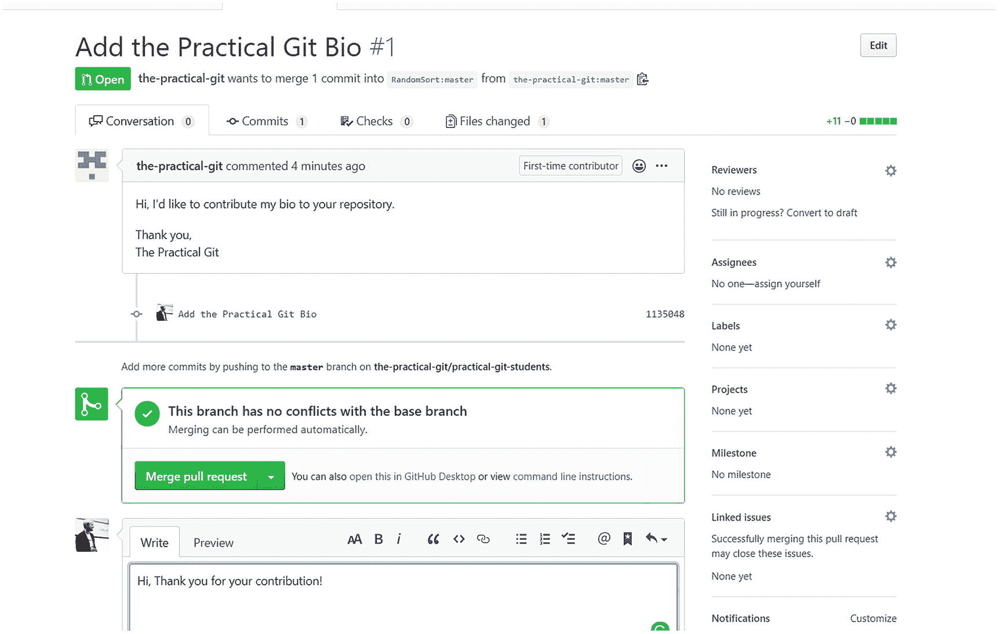

图 5-12

与拉取请求贡献者互动

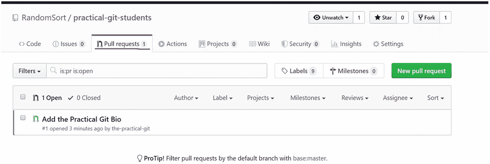

图 5-11

拉取请求标签

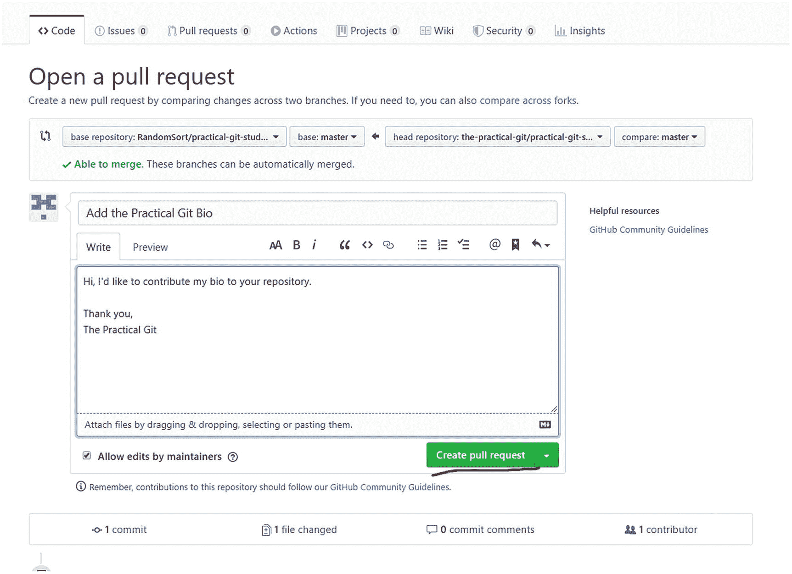

图 5-10

打开拉取请求

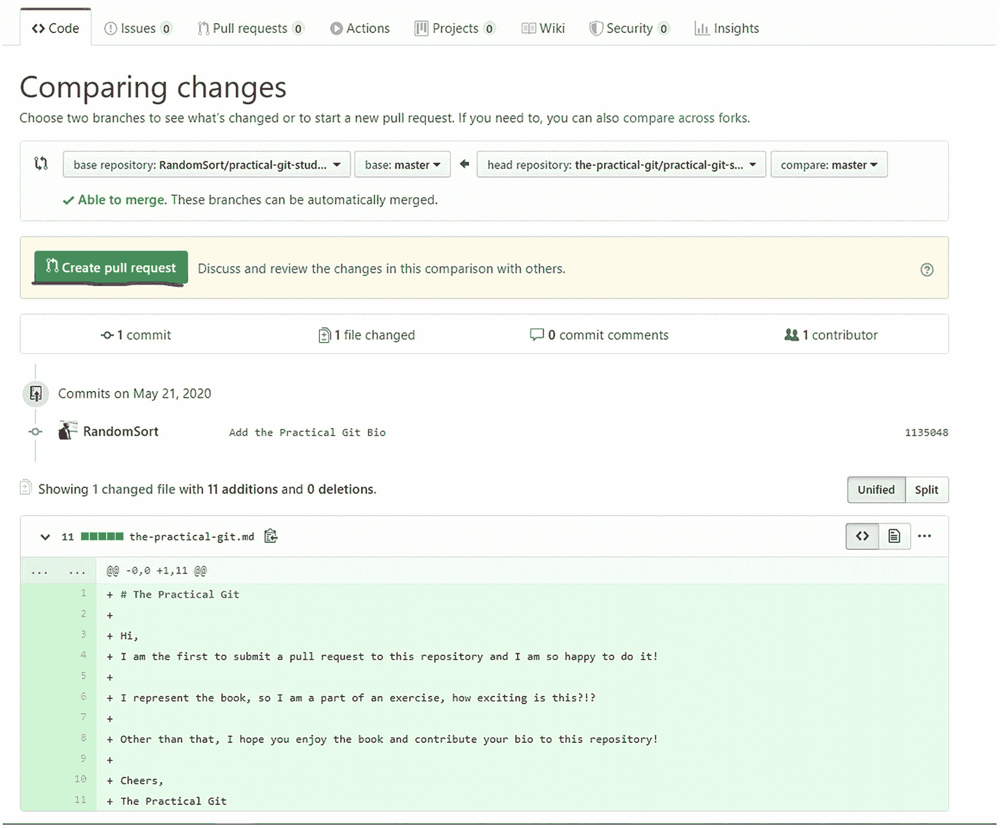

图 5-9

查看变更集。创建拉取请求

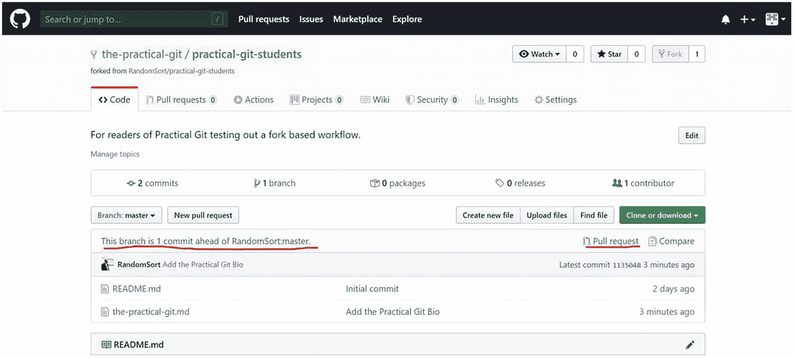

图 5-8

在存储库中提交–单击“拉取请求”

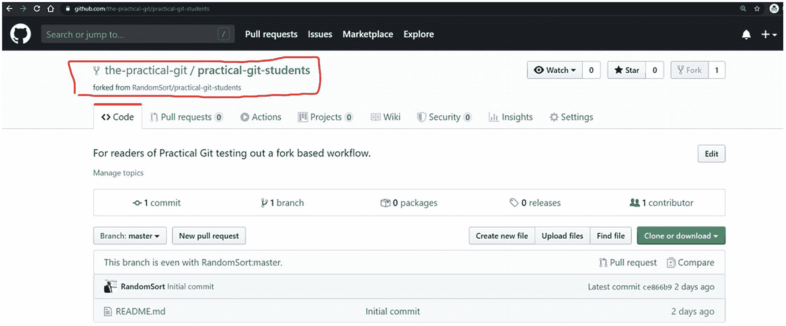

图 5-7

为您的帐户使用存储库

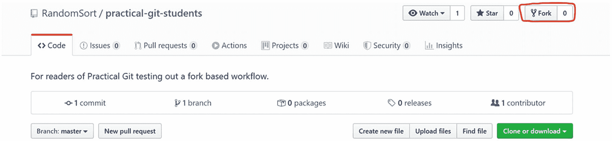

图 5-6

存储库中的分叉按钮

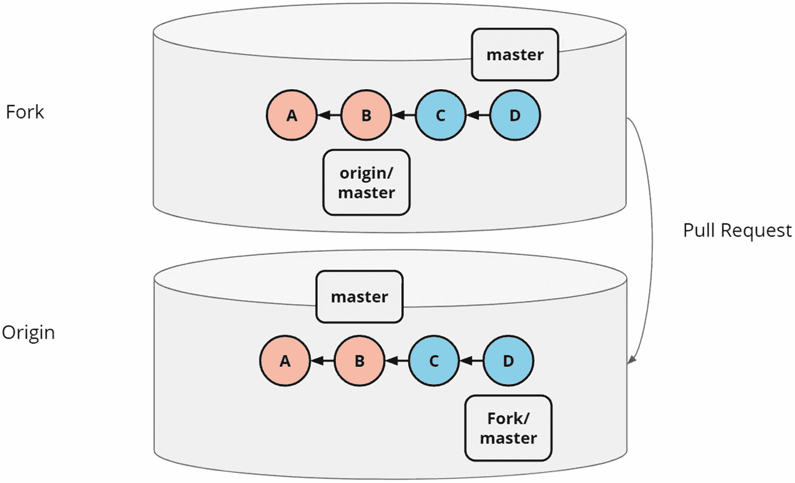

图 5-5

从分支到原始存储库的拉请求。通常，分支的所有者没有访问原始存储库的权限

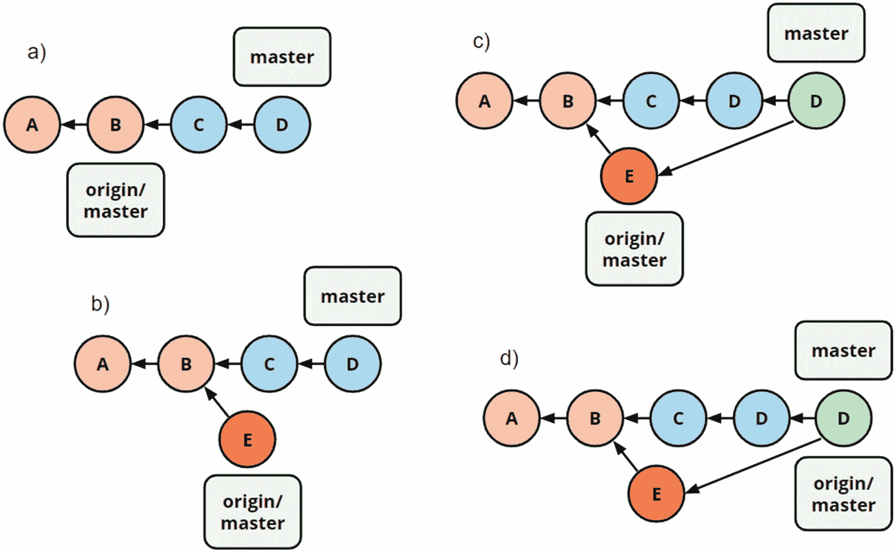

图 5-4

(一)在我们推之前，这是我们的世界观；(b)由于已经在远程主机上完成了工作(提交 E)，推送将被拒绝。获取后，它看起来是这样的(c)。我们通过合并来协调差异，并且结果可以被推送，这导致推送后的(d)状态

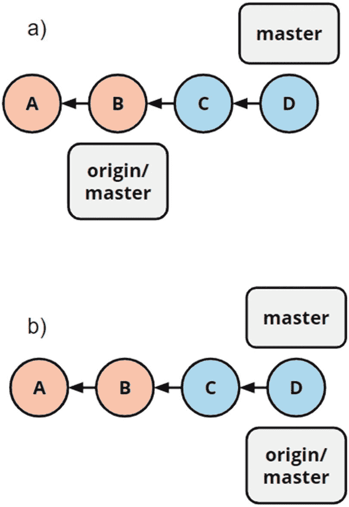

图 5-3

(一)情景预演。(b)推送后的场景。请注意，在推送之前，遥控器上的 C 和 D 不可用

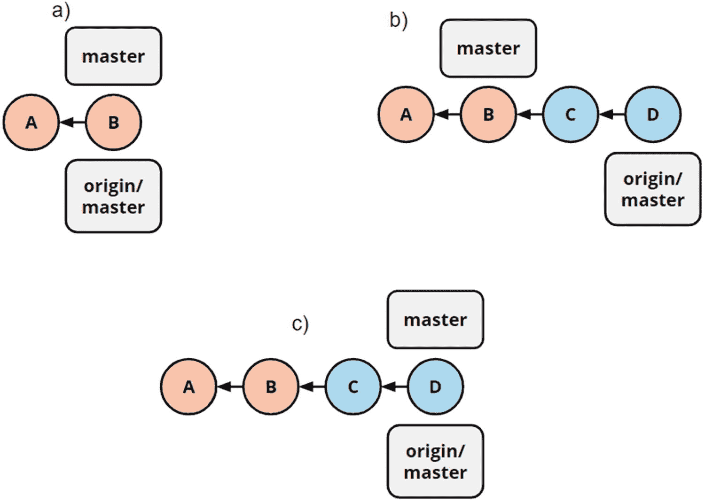

图 5-2

(一)取数前的储存库。(b)获取后的储存库。(c)合并后的储存库

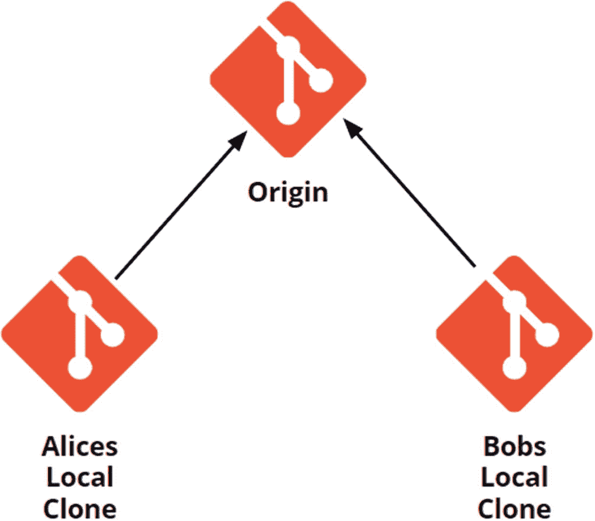

图 5-1

Git 存储库集中管理，但在本地克隆。Alice 和 Bob 可以异步工作，或者在原点或者在彼此之间协调工作

当我们推送并拒绝我们的更改时，我们会经历一个获取/合并循环，然后能够提交我们的更改。

Note

我们可以将 origin/ namespace 视为远程存储库外观的缓存。这不是 Git 自动同步的，所以我们需要进行提取来更新我们的缓存。因此，当我们运行 Git status 时，输出是基于我们的缓存，而不是远程的，这可能会产生意想不到的结果。

我们将在下一个基于简化工作流的练习中介绍这是如何进行的。既然我们已经研究了遥控器的活动部件，我们可以了解不同的工作方式以及如何在其中工作。

## 简化的工作流程

你可能已经听说过简化工作流、基于主流程或集中式工作流。此工作流有许多名称，并且是默认的工作流，除非您对存储库管理器进行了不同的配置。这个工作流的定义特征是所有的协作都直接发生在主服务器上。这意味着，虽然您可能有本地分支机构来隔离您的工作，但当您完成工作时，您会将其推送到 master。这个工作流程就是我如何处理我的玩具项目、笔记库和类似的东西。好的一面是开销很小，几乎没有流程。这使得它成为一个容易理解的高效工作流程，也就是说，如果我们保持在快乐的道路上。糟糕的是，我们可能会与同事产生竞争，并且我们没有工作流工具来帮助我们的主分支保持高质量的源代码。

在基于母版的工作流中，我们基本上需要涵盖两种场景。首先，有一个令人高兴的场景，当我们在本地工作时，master 中没有工作被完成。这种情况是无聊的，因为这种工程，并成为一个快速前进的合并在远程。这种情况可以在图 [5-3](#Fig3) 中看到。

然后，有一个竞争条件场景，当我们在本地工作时，一个同事已经将工作交付给主分支。这是一个非常有趣的场景，因为它需要一些努力来解决。技术细节是，存储库管理器只允许您推动快进合并。任何其他类型的合并必须在本地进行对账。这意味着竞争交付的情况如下所示:

*   从原点克隆或提取。

*   一定要在本地工作，并且全身心的投入。

*   推，被遥控拒绝。

*   获取最新的更改，并将它们合并到本地主分支中。

*   将 master 推至原点，因为现在是快进合并。

Note

这完全有可能重复发生，从而阻止开发人员交付他们的变更。这意味着存储库跨越了太多的架构边界，或者您正在使用的工作流没有随您的组织扩展。在任何情况下，这在正常使用中都不太可能发生，所以如果您在这里结束，请后退一步，反思一下存储库架构。

前面的工作流程如图 [5-4](#Fig4) 所示。首先是本地更改将被拒绝的场景，然后是远程上的协调和快速合并。

在下面，我们将做一个练习，模拟与主分支上的远程存储库进行交互。由于这是一个比前面的练习更复杂的练习，所以我将在这个练习中贯穿主工作流程式。kata 可以在 git-kata 库中找到。

MASTER-BASED WORKFLOW

在这个练习中，我们将浏览整个主工作流程形，并体验快乐路径和竞赛状态路径。

```
$ git clone https://github.com/praqma-training/gitkatas
Cloning into 'gitkatas'...
remote: Enumerating objects: 111, done.
remote: Counting objects: 100% (111/111), done.
remote: Compressing objects: 100% (99/99), done.
remote: Total 1961 (delta 26), reused 35 (delta 10), pack-reused 1850
Receiving objects: 100% (1961/1961), 528.24 KiB | 1.56 MiB/s, done.
Resolving deltas: 100% (825/825), done.

$ cd gitkatas/

$ cd master-based-workflow/

$ source setup.sh

--- Truncated Output ---

```

现在，我们已经获取了形并运行了适当的练习脚本，所以我们已经准备好完成自述文件中描述的练习。

```
$ ls
fake-remote-repository/  fitzgerald-pushes-before-we-do.sh*

```

首先，我们克隆假的远程存储库，并在本地存储库中提交。然后，我们可以调查本地和远程之间的关系。

```
$ git clone fake-remote-repository/ local-repo
Cloning into 'local-repo'...
done.

$ cd local-repo/

$ echo "line of text" >> README.md

$ git status
On branch master
Your branch is up-to-date with 'origin/master'.

Changes not staged for commit:
  (use "git add <file>..." to update what will be committed)
  (use "git checkout -- <file>..." to discard changes in working directory)

        modified:   README.md

no changes added to commit (use "git add" and/or "git commit -a")

```

我们注意到，因为我们没有创建任何提交，所以我们仍然与远程主机保持同步，也指定为 origin/master。

```
$ git add .

$ git commit -m "Added content to the README"
[master 9eea570] Added content to the README
 1 file changed, 1 insertion(+)

$ git status
On branch master
Your branch is ahead of 'origin/master' by 1 commit.
  (use "git push" to publish your local commits)

nothing to commit, working tree clean

```

由于我们已经创建了一个提交，并且远程上没有做任何工作，所以我们是最新的。

```
$ git push
Counting objects: 3, done.
Writing objects: 100% (3/3), 279 bytes | 279.00 KiB/s, done.
Total 3 (delta 0), reused 0 (delta 0)
To C:/Users/rando/repos/randomsort/gitkatas/master-based-workflow/exercise/fake-remote-repository/
   054c055..9eea570  master -> master

```

现在，我们可以将更改提交到遥控器，并继续处理不愉快的路径场景。

```
$ echo "Another line of text" >> README.md

$ git add README.md

$ git commit -m "Update README"
[master d144b48] Update README
 1 file changed, 1 insertion(+)

```

现在，在我们更新了自述文件并再次提交之后，我们运行一个脚本来模拟我们的同事交付工作。

```
$ ../fitzgerald-pushes-before-we-do.sh
 --- Output truncated ---

$ git push
To C:/Users/rando/repos/randomsort/gitkatas/master-based-workflow/exercise/fake-remote-repository/
 ! [rejected]        master -> master (fetch first)
error: failed to push some refs to 'C:/Users/rando/repos/randomsort/gitkatas/master-based-workflow/exercise/fake-remote-repository/'
hint: Updates were rejected because the remote contains work that you do
hint: not have locally. This is usually caused by another repository pushing
hint: to the same ref. You may want to first integrate the remote changes
hint: (e.g., 'git pull ...') before pushing again.
hint: See the 'Note about fast-forwards' in 'git push --help' for details.

```

现在当我们试着推的时候，我们被遥控器拒绝了。如果我们读取错误输出，我们可以看到我们的推送被拒绝，因为远程包含我们没有的工作。然而，当我们运行 git status 时，我们被告知我们是最新的。

```
$ git status
On branch master
Your branch is ahead of 'origin/master' by 1 commit.
  (use "git push" to publish your local commits)

nothing to commit, working tree clean

```

这是因为我们有一个远程状态的本地缓存，它不是在推送时更新的，而是在获取时更新的。

```
$ git fetch
remote: Counting objects: 3, done.
remote: Compressing objects: 100% (2/2), done.
remote: Total 3 (delta 0), reused 0 (delta 0)
Unpacking objects: 100% (3/3), done.
From C:/Users/rando/repos/randomsort/gitkatas/master-based-workflow/exercise/fake-remote-repository
   9eea570..96a3f9c  master     -> origin/master

$ git status
On branch master
Your branch and 'origin/master' have diverged,
and have 1 and 1 different commits each, respectively.
  (use "git pull" to merge the remote branch into yours)

nothing to commit, working tree clean

```

在获取之后，状态告诉我们，我们已经偏离了原点/主点。这就是图 [5-4](#Fig4) (b)所示的场景。

```
$ git log --all --graph --decorate --oneline
* 96a3f9c (origin/master, origin/HEAD) Fitz made this
| * d144b48 (HEAD -> master) Update README
|/
* 9eea570 Added content to the README
* 054c055 Add README.md

$ git merge origin/master -m "merge"
Merge made by the 'recursive' strategy.
 fitz-was-here.md | 0
 1 file changed, 0 insertions(+), 0 deletions(-)
 create mode 100644 fitz-was-here.md
$ git merge origin/master

$ git status
On branch master
Your branch is ahead of 'origin/master' by 2 commits.
  (use "git push" to publish your local commits)

nothing to commit, working tree clean

```

合并后，我们处于如图 [5-4](#Fig4) (c)所示的状态。我们提前了两次提交，本地提交和合并提交。

```
$ git log --all --oneline --decorate --graph
*   a73deeb (HEAD -> master) Merge remote-tracking branch 'origin/master'
|\
| * 96a3f9c (origin/master, origin/HEAD) Fitz made this
* | d144b48 Update README
|/
* 9eea570 Added content to the README
* 054c055 Add README.md

```

我们现在可以推进，因为我们已经建立了从`origin/maste` r 到`master`的快速前进合并的条件。

```
$ git push
Counting objects: 5, done.
Delta compression using up to 4 threads.
Compressing objects: 100% (3/3), done.
Writing objects: 100% (5/5), 582 bytes | 582.00 KiB/s, done.
Total 5 (delta 0), reused 0 (delta 0)
To C:/Users/rando/repos/randomsort/gitkatas/master-based-workflow/exercise/fake-remote-repository/
   96a3f9c..a73deeb  master -> master

$ git status
On branch master
Your branch is up-to-date with 'origin/master'.

nothing to commit, working tree clean

```

正如我们在这个练习中所看到的，没有发生非常令人兴奋的事情，在这个简单的场景中很容易协调竞争条件。如果您遇到许多合并冲突，这表明您应该研究一种不同的工作方式。

基于 master 的工作流对于简单的项目来说是不错的，并且低开销和低流程对许多人来说是有吸引力的。如果你刚刚开始，这是一个很好的工作流程，以获得你的轴承。如果你持续关注流程的缺失是否会损害你的生产力，你应该是优秀的。

## 基于分叉的工作流

基于 Fork 的工作流通常用在开源软件中，其中的信任模型与组织内部的有点不同。虽然开源意味着每个人都可以做出贡献，但这并不意味着所有的变化都会进入项目。基于 fork 的工作流有助于实现这种工作方式。

在基于 fork 的工作流中，我们有多个远程存储库。其中一个是原始的，包含了项目的最终真相。假设我想为 Kubernetes 这样的大型开源项目做贡献。我不能简单地克隆存储库，然后将我想要的任何更改推回。首先，是我的交付质量问题，如果我非常不称职，我的工作应该被排除在外怎么办？其次，还有产品的愿景。如果没有清晰的愿景和指导方针来确定项目想要支持的特性，随着时间的推移，它将变得不可维护和不可用。因此，即使我的工作很好，项目也可能对集成它不感兴趣。最后，前两点甚至假设我的意图是善意的。如果我们没有防护栏或某种访问控制，所有开源项目都会立即被不良的第三方破坏。曾经有过这样的情况，邪恶的行为者在引人注目的开源项目中注入漏洞，从而危及所有依赖于这些代码的人。

对此的解决方案是，我们在自己的名称空间上创建原始项目的所谓分支。这使我们可以完全使用我们的叉子。然后，我们可以使用一种通常称为“拉请求”的机制进行更改，并将这些更改提交回原始项目。这可以从图 [5-5](#Fig5) 中看出。

Note

之所以称之为拉请求，是因为您提供了第二个可用的遥控器，并请求维护人员将您的更改拉至他们的存储库中。

FORK-BASED WORKFLOW

这个练习有点不同，因为它将需要一个 GitHub 帐户，并且它将更多地基于截图而不是命令行界面。

然而，如果你完成了这个练习，你就已经为 GitHub 上的一个公共库做出了贡献。

本练习假设您有一个 GitHub 帐户，并且已经登录。

首先，我们将定位我们要贡献的存储库，并创建一个分支。

为此，在浏览器中打开 [`https://github.com/randomsort/practical-git-students`](https://github.com/randomsort/practical-git-students) 并找到如图 [5-6](#Fig6) 所示的分叉按钮。

单击 fork 按钮会将存储库分支到您自己的帐户，并将您带到图 [5-7](#Fig7) 中的页面，在这里显示的将是您自己的用户名，而不是我的。

我们可以注意到，从何处分叉存储库是显式的。

现在我们有了自己的分支，或者工作副本，我们可以通过克隆按钮或者命令行来克隆这个链接。

我将通过命令行克隆。我不会在这里介绍如何设置凭证或任何东西。

```
$ git clone https://github.com/the-practical-git/practical-git-students
Cloning into 'practical-git-students'...
remote: Enumerating objects: 3, done.
remote: Counting objects: 100% (3/3), done.
remote: Compressing objects: 100% (2/2), done.
remote: Total 3 (delta 0), reused 0 (delta 0), pack-reused 0
Unpacking objects: 100% (3/3), done.

```

现在，我将进入该文件夹，创建一个包含我的简历的文件。

```
$ cd practical-git-students/

$ touch the-practical-git.md

$ vim the-practical-git.md

$ git add .

$ git commit -m "Add the Practical Git Bio"
[master 1135048] Add the Practical Git Bio
 1 file changed, 11 insertions(+)
 create mode 100644 the-practical-git.md

$ git push
Username for 'https://github.com': the-practical-git
Counting objects: 3, done.
Delta compression using up to 4 threads.
Compressing objects: 100% (3/3), done.
Writing objects: 100% (3/3), 493 bytes | 493.00 KiB/s, done.
Total 3 (delta 0), reused 0 (delta 0)
To https://github.com/the-practical-git/practical-git-students
   ce866b9..1135048  master -> master

```

注意，如果你按照练习进行，你应该选择你自己的名字或用户名作为文件名，并且你应该使用你自己的用户名来认证 GitHub。根据本地 Git 安装的配置，可能会提示您输入凭证，或者它可能会正常工作。

现在，我们可以回到我们的 fork，看到我们所做的更改出现在 GitHub 界面中。对我来说，我去 [`https://github.com/the-practical-git/practical-git-students`](https://github.com/the-practical-git/practical-git-students) ，但是你必须用你自己的用户名代替。

我们可以在图 [5-8](#Fig8) 中看到，我们现在有了一个提交，这个提交在原始存储库中是不存在的。这就是我们想要回报的！因此，我们单击右侧的“拉取请求”链接。

这将我们带到图 [5-9](#Fig9) 中，在那里我们可以看到变更集和我们正在使用的分支。在这种情况下，我们将贡献回原始存储库中的主分支，即我们 fork 中主分支上的内容。因此，我们单击“创建拉取请求”按钮。

这将我们带到图 [5-10](#Fig10) ，在这里我们可以向拉取请求添加更多的信息。通常，我们会描述变更集，或者变更的原因。这是我们与仓库维护者的交流。在这种情况下，我们的变更集很简单，所以我们只在单击 Create pull request 之前添加了一个简短的描述。

在许多场景中，贡献者和维护者之间会有一点反复，以确保 pull 请求符合他们的编码指南，有他们需要的文档和测试，等等。在这种情况下，我会接受你的请求，如果你保持语言的干净和友好，不涉及政治或宗教问题。不过，我希望你能向我问好！

既然您已经创建了拉请求，那么您的工作就完成了，除非维护人员有任何返工的请求。从维护者的角度来看，我们现在可以在 pull requests 选项卡中找到 Pull 请求，如图 [5-11](#Fig11) 所示。

我们单击“拉”请求来查看贡献了什么，在这里我们可以发表评论并与贡献者进行交互(图 [5-12](#Fig12) )。

作为维护者，我可以点击合并请求并接受您的更改。如果你一直在做这个练习，我期待着加入你的提交！

请注意，虽然这个练习是在 GitHub 中执行的，但是所有大型存储库管理器都支持基于 fork 的工作流。

这是对基于 fork 的工作流的一次练习，通常在开源设置中使用。我知道一些在 Git 中有源代码的开源项目有不同的基于电子邮件的系统，但这是如此神秘，并没有被大量使用，我们就不详细讨论了。在下一节中，我们将介绍组织内部更常用的工作流。

## 基于拉取请求的工作流

虽然我们可以说前面描述的基于 fork 的工作流也是基于 pull 请求的，但是我们在这一节中经历的工作流通常被称为基于 pull 请求的工作流。它是基于 fork 的工作流的一个更简单的版本，从一个组织内部我们有一个不同的信任模型这一事实开始。每个人都被允许直接对存储库做出贡献，尽管并不是每个人都必须拥有合并到主分支的访问权限。

其工作方式是使用分支作为抽象，而不是分叉。这大大减少了保持本地和远程存储库最新的开销。基于拉取请求的工作流是这样的:

*   克隆或获取存储库。

*   创建特征分支。

*   一定要在本地工作，并致力于你的特色分支。

*   将您的功能分支推至远程。

*   转到 remotes web 界面，创建一个从您的功能分支到您的主分支的 pull 请求。

*   那些有访问权限的合并或请求更改。

基于拉取请求的工作流简单易懂，并且没有太多的开销。然而，拉请求本身有助于一些我们将在这里讨论的反模式。首先，根据您的工作方式，拉取请求可能是一个人工关口，需要审查和人工批准。这可能导致切换和延迟的反馈回路；这降低了生产力和士气，导致软件质量下降。

第二，拉取请求往往是在开发过程的后期创建的，那时我们已经准备好交付了。为了达到更好的效果，它们可以在流程开始时被创建为一个在制品分支。这将创建可追溯性，并增加对工作和协作的早期反馈能力，从而提高生产率。

第三，当许多拉请求以同一个主分支为目标时，这也会导致同步和维护拉请求的问题，而队列中前面的请求会得到处理。由于测试在另一个状态上运行，最终被合并，这也可能导致主服务器上的构建被破坏。

同样，如果您遇到这种情况，您已经超越了这种工作方式或您的存储库架构。

## Git 流

关于是否覆盖 Git 流，我已经进行了很长时间的内心讨论。我看到许多组织都采用了这种工作流程，但没有一个成功。nvie 在 [`https://nvie.com/posts/a-successful-git-branching-model/`](https://nvie.com/posts/a-successful-git-branching-model/) 的博客中将其描述为“一个成功的 git 分支模型”虽然我确信一些组织在这个工作流中运气不错，但是 Git、围绕它的工具以及我们的工作方式已经超越了它。因此，在大多数情况下，Git 流是一种反模式。我们试图通过引入抽象和“开发”分支来解决的问题往往以相反的方式结束。我们最终会有很长的合并队列、复杂的工作流和多个方向的集成地狱。所以，我真的建议不要这么做。

我能想象的 Git 流有用的场景是，如果你有一个完全不正常的工作方式，你需要一个临时的过渡流来到达一个正常的地方。这有助于组织阻力、工具和所需的技能提升。

## 去吧卡塔

为了支持本章的学习目标，我建议你完成上一个练习的主工作流程图。在那之后，如果你还没有完成在 GitHub 上做一个拉请求的练习，我建议你回到那个练习，现在就做一个拉请求。我期待着你的问候和来信！

## 摘要

在这一章中，我们介绍了一些基本的 Git 工作流程，并展示了如何使用 Git 进行协作。希望你现在更有信心成为一个软件组织中有价值的贡献者。对我来说很重要的一点是，你要掌控自己的工作流程，不要让工作流程决定你的工作方式，而是让你的工作方式决定你的工作流程。如果期望的工作方式和实现的 Git 工作流不匹配，您将生活在痛苦和沮丧中。

我建议您定期考虑以下问题:

*   我的工作流是否引入了手动入口或交接？

*   我的工作流程使交付变更变得容易了吗？

*   我对我们的工作流程有信心吗？

*   工作流程是否引入了不必要的官僚主义？

*   我们开发人员常犯的错误有哪些？我们能做些什么来最小化这些事件的影响或频率吗？

如果我们不断地问这些问题，并接受我们的工作流不是一个死的静态的东西，而是与我们的软件一起生活和发展的东西，我们将会在一个好的地方结束。