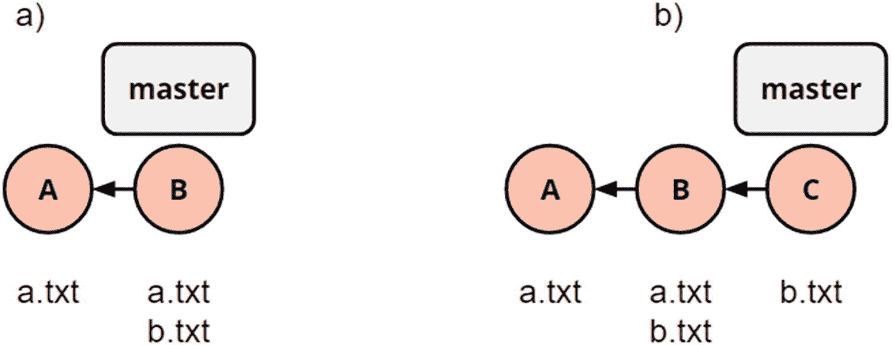
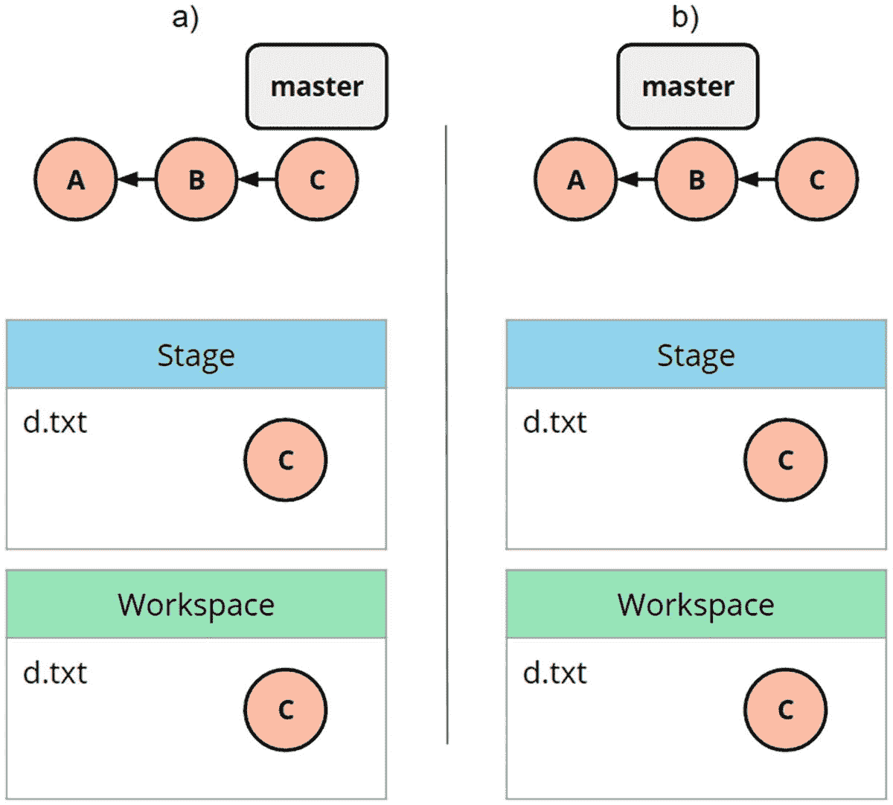
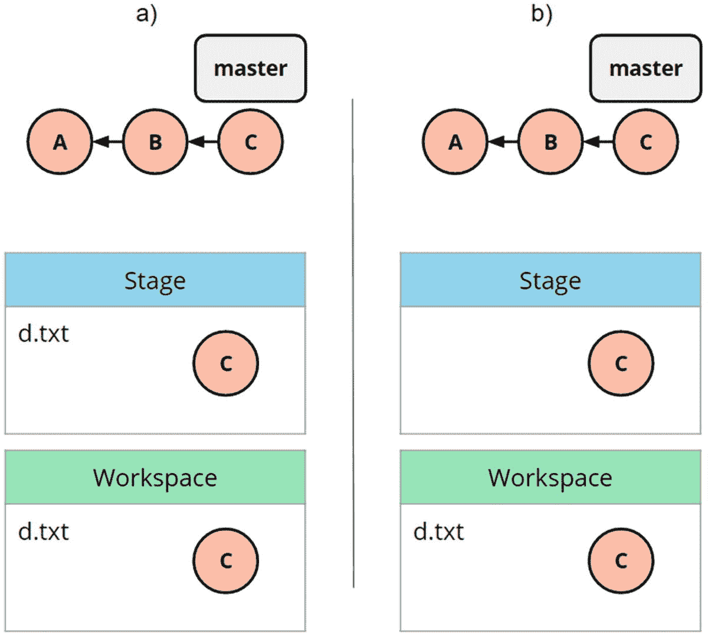

# 6.操纵历史

我用了整整一章的篇幅来讲述操纵历史，这似乎非常违反直觉。版本控制的核心是可追溯性、可再现性和不变性。但是 Git 允许您操纵历史。对于任何公开的历史，无论是向同事公布的还是在互联网上可以找到的，我们都必须小心行事，谨慎负责地使用本章赋予我们的权力。但是对于本地历史，在我们发布它之前，塑造版本历史以适应逻辑单元会带来巨大的价值。

在这一章中，我们将首先介绍用 revert 撤销历史中的一个变更。这允许我们安全地撤销以前的工作，同时保持完全的可追溯性和不变性。

接下来，我们将介绍 reset，这是一个红色的大按钮，用于撤销我们的大量历史记录，不仅从我们的工作区中删除更改，还从我们的历史记录中删除它们。它也做一些不太有影响力的事情，是我最喜欢的地方杂耍分支的工具。

最后，我们讨论了交互式 rebase，它允许我们在历史中合并、拆分、删除和重新排序提交。这是一个极其强大的工具，但可能会让人觉得有点可怕，而且同样应该与公共历史保持很长的距离。就向同事或未来的自己传递最好的历史而言，没有什么工具比它更好。

## 还原提交

在很多情况下，我们需要撤销历史上的一些改变。如果我们幸运的话，这是最近的变化，但很可能不是。我们希望从应用程序中移除的这些更改可能是引入的错误、不再使用的功能，或者只是一些我们希望移除的混乱。在这个场景中，我们有一个特定的提交，它引入了一个我们想要删除的更改，我们可以使用 git revert。git revert 的逻辑是，它创建一个提交，该提交是我们想要还原的提交的反向变更集。这可以从图 [6-1](#Fig1) 中看出。



图 6-1

(a)两次提交，每次添加一个文件。(b)运行命令 git revert a 后的历史记录

在这个场景中，我们没有主动操纵历史，而是使用 Git 作为恢复变更的快捷方式。如果没有 Git，我们将被迫手动尝试并找出如何撤销给定的更改，然后自己创建提交。

这也意味着我们没有做任何会损害通过 Git 建立的可追溯性的事情。因此，从审计的角度来看，对公共历史使用 revert 是安全的。您是否破坏了您不想破坏的功能超出了 Git 的范围。始终运行您的测试！

REVERT EXERCISE

在本练习中，我们将介绍如何恢复提交。这个练习的资源库可以在文件夹`revert/`中第 [6 章](6.html)的源代码中找到。

```
$ ls
a.txt  b.txt

$ git log --oneline
5be4a3d (HEAD -> master) Add File B
c8482f6 Add File A

```

我们看到一个简单的历史记录，我们想撤销 commit `c8482`中引入的更改，并显示消息“Add File A”。

首先，我们使用`git show`来查看提交代表什么变更集。

```
$ git show c8482
commit c8482f67747fd8dcb6ced373d89ce3e8dc7d7754
Author: Johan Abildskov <randomsort@gmail.com>
Date:   Sun Jun 14 16:05:10 2020 +0200

    Add File A

diff --git a/a.txt b/a.txt
new file mode 100644
index 0000000..4ef30bb
--- /dev/null
+++ b/a.txt
@@ -0,0 +1 @@
+file a

```

除了普通的提交信息之外，我们还可以看到差异。在这里，我们可以看到文件`a.txt`被创建。这是我们将要还原的基础。

```
$ git revert c8482
Removing a.txt
hint: Waiting for your editor to close the file...
[master 26dc609] Revert "Add File A"
 1 file changed, 1 deletion(-)
 delete mode 100644 a.txt

```

当我们将提交定位到恢复时，我们得到通常的提交消息提示。它预先填充了一条 sane 消息，所以我们可以保存文件并让 Git 创建提交。

```
$ git log --oneline
26dc609 (HEAD -> master) Revert "Add File A"
5be4a3d Add File B
c8482f6 Add File A

```

我们观察到 Git 创建了一个新的 commit，所以让我们看看它包含了什么。

```
$ git show 26dc
commit 26dc6094fbbd6293bb2a69f354d78008194ea6c3 (HEAD -> master)
Author: Johan Abildskov <randomsort@gmail.com>
Date:   Sun Jun 14 16:05:53 2020 +0200

    Revert "Add File A"

    This reverts commit c8482f67747fd8dcb6ced373d89ce3e8dc7d7754.

diff --git a/a.txt b/a.txt
deleted file mode 100644
index 4ef30bb..0000000
--- a/a.txt
+++ /dev/null
@@ -1 +0,0 @@
-file a

```

这里，我们得到了与我们恢复的提交完全相反的结果，即文件不再存在。我们在提交消息的主体中获得了更多的细节，因为对原始提交的跟踪得到了维护。

```
$ ls
b.txt

```

不出所料，我们的工作区现在只有`b.txt`。如本练习所示，恢复提交是一种安全的方法，可以撤消在历史上任意时间点引入的更改。

如果作为开发人员，您能注意到您正在处理的更改的语义，那么恢复提交就可以容易而安全地完成。这可能比在没有工具帮助的情况下试图手动恢复更改更安全。像 revert 等 Git 工具是使提交原子化和自包含的另一个好理由。

## 重置

Reset 是我最喜欢的 Git 命令之一，不仅因为它的强大功能，还因为它是允许我们揭示关于 Git 如何工作以及我们的直觉如何与之冲突的最多知识的命令之一。

总的来说，Git 在采取可能导致您意外丢失工作的行动方面非常保守。在其硬模式下，Git 重置是 Git 在没有警告的情况下丢弃未保存的工作的方式之一。它确实需要用户主动选择，所以这本身并不太坏。不幸的是，reset 也是用户体验很糟糕的命令之一。我希望通过命令来指导你，并结合练习和做形，使你有信心在日常编码生活中引入复位命令。

Git 重置有三种模式:软、混合和硬。我们将依次讨论它们，并以涵盖所有三个方面的练习结束。

### 软复位

在软模式下，`git reset --soft <ref>`，我们只操纵头部。也就是说，当前签出的引用将被更改为作为参数给出的目标。换句话说，软复位可以用来移动分支指针。

例如，如果您在开始工作之前忘记创建您的特性分支，从而在 master 上创建了您的提交，那么这将非常有用。然后，你可以通过首先在`master`创建你的特征分支，然后将`--soft master`重置为`origin/master`，让它看起来你一直在做正确的事情。

由于软复位不涉及工作目录和载物台，因此这是一种完全安全的操作。图 [6-2](#Fig2) 显示更新分支指针。



图 6-2

(B)是从(a)开始并运行 git 重置软 B 的结果

软复位可用于将一系列提交压缩成一次提交。这是通过重置到您的工作开始的点，然后创建一个提交来完成的。squash 之所以有效，是因为最新提交的所有工作都将处于可以提交到单个提交中的阶段。这不是一个典型的场景，通常可以通过交互式的 rebase 来更好地解决，我们将在本章的后面讨论。

### 混合复位

当您不向 git reset 传递模式时，混合重置是默认行为。混合重置除了像软重置一样更新磁头外，还会将载物台更新到目标位置。当我们不向 reset 传递任何 ref 时，HEAD 是默认行为。这导致了一个令人困惑的情况，即`reset --mixed`最常见的用例是不暂存文件。也就是说，如果您在某个时候使用了 git add 来存放路径，并且您不再希望存放该路径，那么您可以使用命令`git reset <path>`。逻辑是用 ref 指向的提交中的内容覆盖 stage，默认情况下是 HEAD。我花了一段时间才明白这样一个事实:要从舞台上拿走一样东西，你必须在那里放些别的东西。

图 [6-3](#Fig3) 显示了这种情况。在其中，我们还展示了 stage，除非在它上面添加了一些东西，否则它将等同于 HEAD 中的内容。



图 6-3

显示 git reset d.txt 改变了阶段，但没有改变工作区

基于之前的文本，一个合理的问题是，如果我们重置 mixed 为 B，会发生什么？在这种情况下，我们会将 B 且仅将 B 放入 stage 并更新 HEAD。

### 硬重置

如前所述，硬重置是 Git 中唯一危险的命令之一——至少从 Git 在没有给你警告的情况下丢弃你的工作的可能性来看是这样的。混合复位用目标 ref 的内容更新磁头和载物台。硬复位更新磁头、载物台和工作目录。这意味着不仅未保存的工作会丢失，不属于提交的工作也会丢失。这是 Git 能够以不可恢复的方式覆盖您的工作的少数几种方式之一。所以，小心行事。硬重置是我日常 Git 工作的一部分，也可能是你的一部分；只要确保你是故意这样做的。图 [6-4](#Fig4) 显示了硬复位如何改变载物台、工作空间和头部。


图 6-4

git reset - hard B 将 HEAD、stage 和 workspace 更新为 B 的内容

虽然硬重置被一些人认为是禁区，但它是我日常工作流程的一部分。如果我们在经常提交时遵守纪律，并且在硬重置之前注意运行 git status，我们就拥有了一个强大而简单的工具。我曾多次看到开发人员无意中用拉的方式弄乱了他们的本地历史，或者污染了他们的主分支。我个人做这件事的方法是，除了最简单的情况之外，避免拉扯。大多数情况下，我会使用`git fetch`来更新我的本地缓存，然后使用`git reset --hard origin/maste` r 从最新的开始。当我确定将我的工作放在独立的分支上时，这是一个运行的安全命令。

RESET EXERCISE

在本练习中，我将从 git-katas 存储库中浏览 reset kata。这个练习可以在 git 卡塔中找到，叫做重置。在本练习中，我们使用`HEAD~1`来指代`HEAD`的父节点。

```
$ ls
1.txt  10.txt  2.txt  3.txt  4.txt  5.txt  6.txt  7.txt  8.txt  9.txt

$ git log --oneline
6742e05 (HEAD -> master) 10
76ac07a 9
c3e33b7 8
da46ca2 7
1d9b4de 6
21a5ff1 5
a7e2065 4
065ebe8 3
df9cfa3 2
89514e1 1

```

我们注意到，我们有一个很长的历史，并且每次提交都有一个包含单个文件的工作区。我们不做调查，但是可以安全地假设每个文件都是在相应的提交中添加的。

```
$ git reset --soft HEAD~1

$ git log --oneline
76ac07a (HEAD -> master) 9
c3e33b7 8
da46ca2 7
1d9b4de 6
21a5ff1 5
a7e2065 4
065ebe8 3
df9cfa3 2
89514e1 1

```

我们注意到`master`分支现在指向提交 9 而不是 10。

调查工作区和`git status`向我们展示了 stage 和 workspace 仍然有来自 10。

```
$ ls
1.txt  10.txt  2.txt  3.txt  4.txt  5.txt  6.txt  7.txt  8.txt  9.txt

$ git status
On branch master
Changes to be committed:
  (use "git restore --staged <file>..." to unstage)
        new file:   10.txt

```

现在，我们可以`reset --mixe` d 了，日志显示我们又继续前进了。

```
$ git reset --mixed HEAD~1

$ git log --oneline
c3e33b7 (HEAD -> master) 8
da46ca2 7
1d9b4de 6
21a5ff1 5
a7e2065 4
065ebe8 3
df9cfa3 2
89514e1 1

$ ls
1.txt  10.txt  2.txt  3.txt  4.txt  5.txt  6.txt  7.txt  8.txt  9.txt

$ git status
On branch master
Untracked files:
  (use "git add <file>..." to include in what will be committed)
        10.txt
        9.txt

nothing added to commit but untracked files present (use "git add" to track)

```

查看工作区并检查状态显示我们仍然没有更改我们的工作区，但是现在`9.txt`和`10.txt`没有被跟踪，因为 stage 与 8 中的内容相匹配。

```
$ git reset --hard HEAD~1
HEAD is now at da46ca2 7

$ git log --oneline
da46ca2 (HEAD -> master) 7
1d9b4de 6
21a5ff1 5
a7e2065 4
065ebe8 3
df9cfa3 2
89514e1 1

```

硬重置延续了头部更新的趋势。但现在，我们正在努力重置，所以我们期待我们的工作空间发生变化。在继续之前，我建议你花一些时间思考一下你期望的工作空间是什么样子的。

```
$ ls
1.txt  10.txt  2.txt  3.txt  4.txt  5.txt  6.txt  7.txt  9.txt

```

这里正在发生一件奇怪的事情。`8.txt`不见了，但是`9.txt`和`10.txt`仍然存在于工作区中。发生这种情况是因为 9 和 10 因为我们之前的行动而没有被跟踪。因此，Git 此时并不关心它们，它们将被留在工作区中。

```
$ git status
On branch master
Untracked files:
  (use "git add <file>..." to include in what will be committed)
        10.txt
        9.txt

nothing added to commit but untracked files present (use "git add" to track)

```

现在我们已经看到了 git reset 命令的三种不同模式。这可能是令人生畏的，这个形是我最喜欢的一个，因为它包含了很多知识。这就是为什么我真的建议你多练习几次这个形，直到你建立了你的重置直觉，并且可以像忍者一样使用重置硬技。

在本节中，我们将 reset 用于不同的目的。需要记住的一件重要事情是，无论如何，如果您将数据提交，您可以恢复它，即使是在硬重置之后。我希望这一节已经向您展示了这种安全性可以带给您的力量。

## 交互式 Rebase

我们之前经历的一些技巧可以用来操纵历史。但是，真正强大和精细的方法来调整你的本地历史是与互动 rebase。请记住，如果我们的历史是地方性的，我们可以随意修改它。这个能力给了我们机会和责任来考虑我们发布的历史作为交付的一部分。我们交付的 Git 历史也是一种交流形式，它应该以正确的顺序被分割成正确的提交，并带有良好、清晰的提交消息。通过向 git rebase 命令添加标志`--interactive`来调用交互式 rebase，例如`git rebase --interactive master`。

准备 Git 历史的最好方法是交互式 rebase。从概念上讲，您给 Git 一个 rebase 目标，这就是您想要在其上进行 rebase 的目标。然后，Git 为您提供一个它打算执行的 rebase 计划。在 Git 执行这个计划之前，您可以修改它。这允许您完全跳过提交、编辑提交、重新排序提交或将其压缩在一起。这个计划采取行动的形式。删除一行只会让 rebase 跳过提交。如果不编辑计划，这与在 rebase 命令中省略- interactive 标志是一样的。

最常见的操作如下:

*   **Pick** 此时添加提交。

*   **挤压**将该提交合并到先前的提交中。

*   **编辑**停止编辑该提交。

*   **Drop** 不选择此提交。

前面的动作和重新排序是交互式 rebases 最常用的方式。

以下是 rebase - interactive 执行计划的示例:

```
pick 8c1e4de file9
reword 921d2d0 file8
squash 3374035 file3
pick 5b3a4fc file4
pick f0d1634 file5
drop a7df72d file2
drop 3d7e5ea file6
pick 18bfdfe file7

```

交互式 rebase 可能是最强大的 Git 命令，几乎任何 Git 任务都可以用这个命令来解决。我希望意识到这个命令将有助于你在旅途中始终向你的合作伙伴和你未来的自己传递一个精心整理的历史。

## 去吧卡塔

为了支持本章的学习目标，我建议你做以下 Git 动作:

*   回复。

*   重置。

*   重新排列历史。

*   然后，我建议你再做一遍重置形；重温 1F642 永远是健康的运动。

## 摘要

由于可追溯性，操纵历史通常被认为是版本控制中的大忌。但是，只要我们只重写本地的历史，或者只重写已经发布到临时分支的历史，我们就有义务使历史尽可能地有用。无论是将多个提交挤压在一起，还是将提交分割成不同的包，都是关于将您交付的历史视为您的可交付成果的一部分。

记住，我们在这里介绍的所有命令都是安全的，在 Git 内部的章节中，我们将介绍如何从事故中恢复。