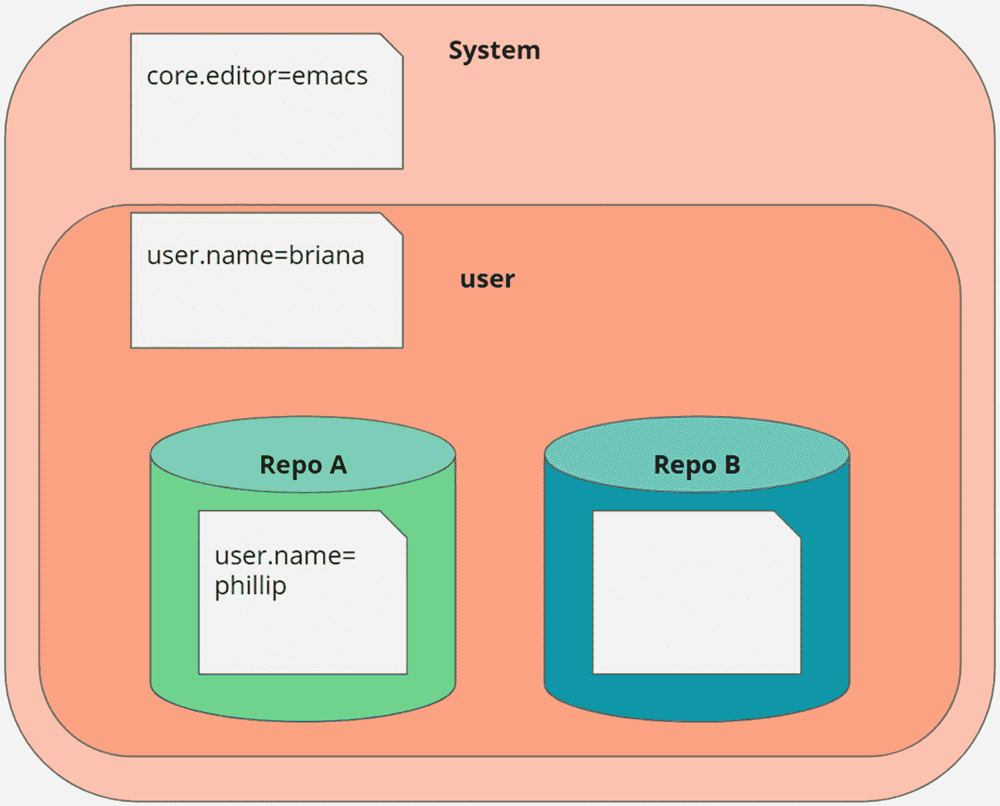
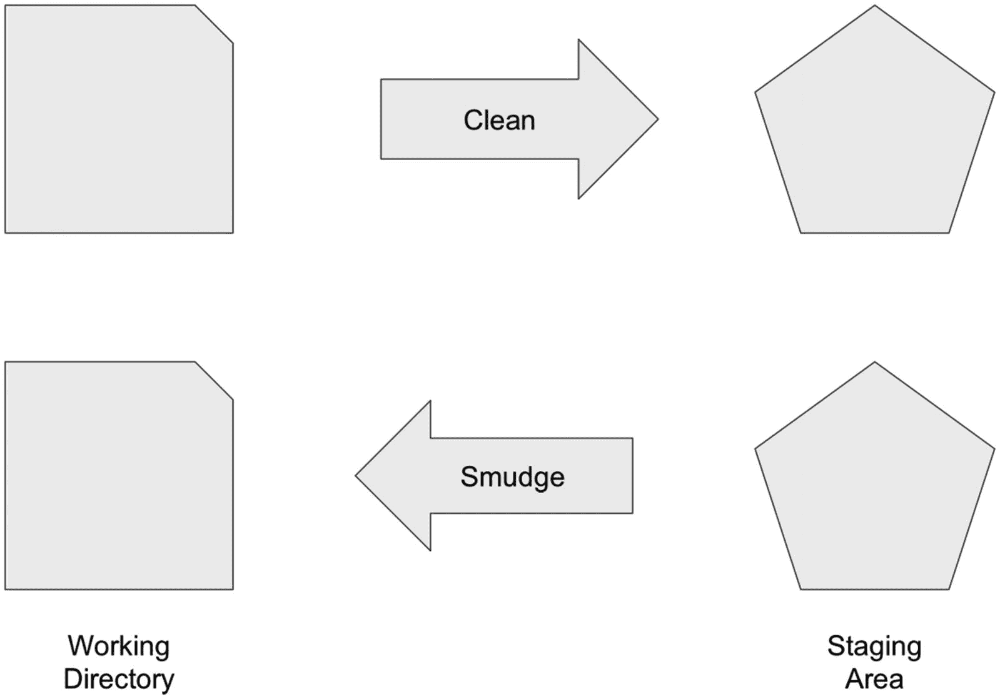
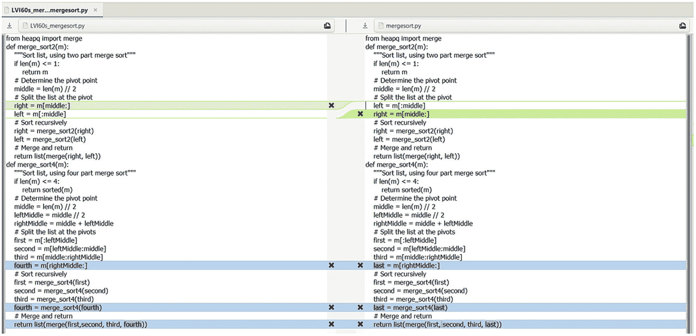
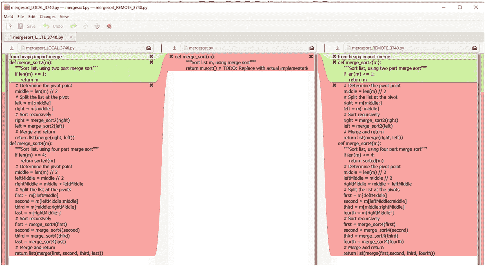

# 七、定制 Git

Git 是工程师的工具，由工程师构建。这意味着，虽然 Git 以某种方式开箱即用，但当我们开始定制 Git 以匹配我们的工作方式时，真正的力量才会释放出来。使用 Git，我们可以在简单配置方面做很多事情，为我们经常使用的任务创建快捷方式，或者拥有特定于存储库的配置来帮助我们管理我们工作的不同上下文。

但是 Git 并没有就此止步。使用钩子，我们可以将脚本注入到 Git 操作的正常工作流中，以更好地支持我们的工作流，使用 Git 属性和过滤器，我们可以改变 Git 的最基本操作，即文件如何在存储库和工作区之间移动。在这一章中，我们将讨论从最基本的配置和别名到改变 Git 一些基本行为的定制。

## 正在配置 Git

Git 支持三个级别的配置:系统、用户和本地存储库。在大多数情况下，我们只使用用户配置。系统配置很少使用，可以在多用户环境中使用，以实施一些合理的默认设置。存储库本地配置是我们作为普通 Git 用户可以在更大程度上使用的东西。Git 按照以下顺序应用配置:系统、用户和本地。每个分组都会覆盖前一个分组中的任何重复条目。如图 [7-1](#Fig1) 所示。



图 7-1

在全局配置中，user.name 被设置为 briana，而在 Repo A 中，有一个. gitconfig 文件将 user.name 指定为 phillip。因此，在全局范围和 Repo B 中，user.name 将解析为 briana，而在 Repo A 中，它将解析为 phillip。在系统配置中，默认编辑器设置为 emacs

在 Git 中应用配置是通过接口 git config 完成的。如果我们在命令中添加- list，我们将读取而不是设置值。我们使用键/值对来设置配置。使用标志- global 和`--system`，我们可以设置用户或系统配置，而不是默认的存储库本地配置。为了将拉策略设置为总是为当前用户重设基础，我们将运行命令`git config --global pull.rebase true`。如果我们想为系统设置它，我们可以使用- system，或者把它放在存储库配置中，去掉`--global`标志。Git 中有很多配置，这里就不赘述了。具体的配置可以在 Git 文档中找到。然而，我们将讨论 Git 配置，因为它们支持接下来的三个部分。

GIT CONFIGURATION EXERCISE

在本练习中，我们将对 Git 配置进行调整。这个练习的知识库可以在随书提供的练习中找到，在文件夹`chapter7/`中。

在这个练习中，我们有两个存储库`config-ACME`和`config-AJAX`，我们将使用它们来研究配置是如何重叠的。首先，我们运行脚本来设置练习，然后我们可以继续。注意，在非 bash 提示符下运行可能会有问题。

```
$ ./config.sh
$ cd config
$ ls
config-ACME/  config-AJAX/
$ git config user.email
randomsort@gmail.com

```

这里，我们注意到即使我们不在 Git 存储库中，我们也可以访问配置。在这种情况下，本地配置没有任何意义。你也不太可能得到和我一样的回复。

```
$ cd config-ACME
$ git config user.email
janedoe@acme

```

进入 ACME 存储库，我们可以看到用户的电子邮件现在不同了。我们访问本地和全局范围来验证此配置的来源。

```
$ git config --local user.email
janedoe@acme
$ git config --global user.email
randomsort@gmail.com

```

我们也可以用标志`--show-origin`获得相同的信息。

```
$ git config --show-origin user.email
file:.git/config        janedoe@acme

```

现在，我们去另一个存储库看看我们得到了什么值。

```
$ cd ..
$ cd config-AJAX/
$ git config user.email
randomsort@gmail.com
$ git config --local user.email
$ git config --show-origin user.email
file:C:/Users/Rando/.gitconfig   randomsort@gmail.com

```

在这个存储库中，我们注意到没有设置本地 user.email，所以我们改为访问用户定义的。我们使用`--show-origin`来验证这一点。

user.email 配置是 Git 开箱即用的一部分，但是我们也可以为自己的目的添加任意配置。在这些存储库中，我们正在使用一个自定义配置，我们称之为 practical-git。在我们的部分中可以有多个条目，每个条目都有一个名称，但是我们使用的是公司密钥。

```
cd ../config-ACME
$ git config practical-git.company
ACME
In the ACME repository company contains the value ACME

, let’s check in AJAX.
$ cd ../config-AJAX/
$ git config  practical-git.company
UNKNOWN

```

这里，我们收到的值是 UNKNOWN，所以让我们将配置设置为 AJAX。

```
$ git config practical-git.company AJAX
$ git config practical-git.company
AJAX
We can still access the global scope.
$ git config --global practical-git.company
UNKNOWN

```

现在我们已经用这个部分污染了您的全局配置空间，我们将删除这个部分，以便从您的配置文件中删除它。

```
$ git config --remove-section --global practical-git
$ git config --get --global practical-git.company

```

练习到此结束。我们已经讨论了用户和本地范围，以及如何在不同的存储库中拥有不同的配置。如果您将同一台计算机用于个人、开源和公司项目，这可能特别有用。

## 别名

在 Git 中，我们可以使用别名来构造快捷方式或扩展 Git 的功能。我们既可以使用 Git 自带的命令，也可以调用外部命令。别名的一个常见目标是让您的日志与您的特定品味完美匹配。我的 go-to log 命令是`git log --oneline --decorate --graph --all`,这是一个需要键入的长字符串，为打字错误和其他错误留下了足够的空间。通常，我无法正确拼写`--oneline`。在这种情况下，我可以为该命令创建一个别名。没有直接的 alias 命令，但是我们可以使用 git config 来设置别名。注意，这也意味着我们可以有不同作用域的别名。

GIT ALIAS EXERCISE

在本练习中，我们将为存储库中的常见任务设置一些别名。本练习的知识库可在`chapter7/aliases`中找到。

我经常使用一种相当长的 log 来研究存储库。

```
$ git log --decorate --oneline --graph --all
$ git log --decorate --oneline --graph --all
* b5566ae (myBranch) 7
* 506bb29 6
* f662f41 5
* bd90c39 (HEAD -> master) 5
* 55936c5 4
* 6519696 3
| * e645e36 (newBranch) 9
| * d5ed404 8
|/
* 0425411 (tag: originalVersion) 2
* 11fbef7 1

```

当然，这是乏味的，并且经常导致打字错误和我不记得我实际上想要添加的部分。因此，让我们为这个命令设置一个别名。我们在本地存储库中设置了所有的别名，这样我们就不会泄漏到我们的全局范围中。

```
$ git config --local alias.l "log --oneline --decorate --graph --all"
This allows us to use git l as a shortcut to the longer variation.
$ git l
$ git log --decorate --oneline --graph --all
* b5566ae (myBranch) 7
* 506bb29 6
* f662f41 5
* bd90c39 (HEAD -> master) 5
* 55936c5 4
* 6519696 3
| * e645e36 (newBranch) 9
| * d5ed404 8
|/
* 0425411 (tag: originalVersion) 2
* 11fbef7 1

```

已经省掉了一堆按键，我们正在优化我们的工作方式。接下来，我们将添加运行外部命令的快捷方式。在这个简单的例子中，我们将简单地执行`ls -al`，但是它可能是一个任意复杂的命令。请注意，我们在别名的开头添加了一个感叹号，以表示我们运行的不是 Git 命令。这对扩展 Git 很有用。例如，Git LFS 就是这样开始的。考虑一下如果您使用 shell 别名会不会更好。

```
$ git config --local alias.ll '!ls -al'

$ git ll
total 10
drwxr-xr-x 1 joab 1049089   0 Jul  9 13:10 .
drwxr-xr-x 1 joab 1049089   0 Jul  9 13:10 ..
drwxr-xr-x 1 joab 1049089   0 Jul  9 13:14 .git
-rw-r--r-- 1 joab 1049089 155 Jul  9 13:10 gitconfig-alias
-rw-r--r-- 1 joab 1049089  25 Jul  9 13:10 test
So now we have augmented Git’s functionality ever so slightly.
We can all set up scripts to run as in the following section.
$ git config --local alias.helloworld '!f() { echo "Hello World"; }; f'
joab@LT02920 MINGW64 ~/repos/randomsort/practical-git/chapter7/aliases (master)
$ git helloworld
Hello World
And we can make our scripts take arguments.
$ git config --local alias.helloperson '!f() { echo "Hello, ${1}"; }; f'
$ git helloperson Phillip
Hello, Phillip

```

虽然这些别名很简单，但是它们应该显示出它们是多么强大的一个工具，以及如何既可以为经常使用的命令创建快捷方式，又可以用额外的功能扩展 Git。如果您在工作流程中有一组常用的事情，您可以为其中的每一项创建别名，并与您的团队共享它们。这是调整你工作方式的好方法。

正如我们所见，我们可以快速创建自定义命令的快捷方式，甚至用别名替换工作流程中的复杂部分。对于普通开发人员来说，别名是一个严重未被充分利用的 Git 特性。从现在开始，你有义务为你经常输入的东西创建别名。你也可能偶尔需要一个复杂的魔法，下一次你这么做的时候，为它创建一个别名，这样它总是在手边准备好。

## 属性

Git 属性是 Git 特性集的高级部分。这是我们可以从根本上改变 Git 在其内部数据库中编写对象的方式的地方之一。它们通常用于强制行尾或如何处理二进制文件，但也可以用于在签入时转换为特定的编码样式。由于这是发生在客户端的事情，如果我们真的想实施什么，我们需要在服务器端或自动化引擎中实现它。

我们实现属性的方式类似于。我们创建了`.gitattributes`文件，在这些文件中，我们列出了在这些特定路径上设置和取消设置属性的路径。例如，如果我们想让 Git 知道一个特定的 XML 文件是自动生成的，不应该像文本文件一样被合并，我们可以在它上面设置属性`binary`，得到一个. gitattributes，如下所示:

```
autogeneratedFile.xml binary

```

在路径上设置`-text`属性会阻止 Git 将匹配的路径视为文本文件。调整现有 Git 行为最常见的场景是，要么像前面展示的那样移除文本行为，要么强制 Git 以特定的方式处理行尾。

我们还可以使用 Git 属性来添加与 Git 本来的功能无关的功能。我们可以通过向配置中添加过滤器并从我们的`.gitattributes`中引用这些过滤器来做到这一点。Git LFS (Git 大文件存储)用这个来处理大文件。过滤器改变了 Git 处理文件和存储库的方式。Git LFS 将匹配的路径上传到中央二进制存储库管理器，并且只在签入时将引用保存在 Git 中。在结帐时，Git LFS 解析这些路径并下载二进制文件。Git LFS 似乎允许我们在 Git 中存储大型二进制文件，Git 在处理这种文件方面是出了名的糟糕。存储库大小的减少是以能够完全脱机工作为代价的。如果连接性在您的环境中是一种稀缺资源，那么不能完全分布式工作可能会是一个问题。该过滤器工作流程如图 [7-2](#Fig2) 所示。



图 7-2

清洁过滤器适用于从工作目录到临时区域和涂抹的其他方向

根据我的经验，Git 属性很少是必需的，除非您的上下文有些复杂，比如在多个不同的平台上，您使用的工具在检查代码时遇到行尾时会很脆弱。当然，正确的解决方案是修复脆弱性或复杂性，但在此之前，Git 属性可以帮助解决这些问题。

ATTRIBUTES

在本练习中，我们将回顾之前产生合并冲突的形，并研究如何使用。改变发生的事情。在本练习中，我们将进行 kata 合并-合并排序，因为我们知道这会导致合并冲突的发生，我们可以使用 Git 属性来改变其结果。

```
$ cd merge-mergesort
$ . setup.sh

```

现在，我们在练习中，我们可以通过在分支 Mergesort-Impl 中合并来强制合并冲突。

```
$ git merge Mergesort-Impl
Auto-merging mergesort.py
CONFLICT (content): Merge conflict in mergesort.py
Automatic merge failed; fix conflicts and then commit the result.
$ git status
On branch master
You have unmerged paths.
  (fix conflicts and run "git commit")
  (use "git merge --abort" to abort the merge)
Unmerged paths:
  (use "git add <file>..." to mark resolution)
        both modified:   mergesort.py
no changes added to commit (use "git add" and/or "git commit -a")

$ cat mergesort.py
from heapq import merge

def merge_sort2(m):
    """Sort list, using two part merge sort"""
    if len(m) <= 1:
        return m

    # Determine the pivot point
    middle = len(m) // 2

    # Split the list at the pivot
<<<<<<< HEAD
    left = m[:middle]
    right = m[middle:]
=======
    right = m[middle:]
    left = m[:middle]
>>>>>>> Mergesort-Impl
    # Sort recursively
    right = merge_sort2(right)
    left = merge_sort2(left)
    # Merge and return
    return list(merge(right, left))

def merge_sort4(m):
    """Sort list, using four part merge sort"""
    if len(m) <= 4:
        return sorted(m)

    # Determine the pivot point
    middle = len(m) // 2
    leftMiddle = middle // 2
    rightMiddle = middle + leftMiddle

    # Split the list at the pivots
    first = m[:leftMiddle]
    second = m[leftMiddle:middle]
    third = m[middle:rightMiddle]
<<<<<<< HEAD

    last = m[rightMiddle:]
=======
    fourth = m[rightMiddle:]
>>>>>>> Mergesort-Impl

    # Sort recursively
    first = merge_sort4(first)
    second = merge_sort4(second)
    third = merge_sort4(third)
<<<<<<< HEAD
    last = merge_sort4(last)

    # Merge and return
    return list(merge(first, second, third, last))
=======
    fourth = merge_sort4(fourth)

    # Merge and return
    return list(merge(first,second, third, fourth))
>>>>>>> Mergesort-Impl

```

在前面的代码中，我们注意到有合并标记。如果它是一个自动生成的文件，或者是一个合并没有任何意义的文件，那就糟了。所以我们放弃合并。

```
$ git merge --abort
We then make Git consider mergesort.py a binary file, not to be automatically merged. We then repeat the merge.
$ echo "mergesort.py binary" > .gitattributes
$ git merge Mergesort-Impl
warning: Cannot merge binary files: mergesort.py (HEAD vs. Mergesort-Impl)
Auto-merging mergesort.py
CONFLICT (content): Merge conflict in mergesort.py
Automatic merge failed; fix conflicts and then commit the result.
$ cat mergesort.py
from heapq import merge

def merge_sort2(m):
    """Sort list, using two part merge sort"""
    if len(m) <= 1:
        return m

    # Determine the pivot point
    middle = len(m) // 2

    # Split the list at the pivot
    left = m[:middle]
    right = m[middle:]

    # Sort recursively
    right = merge_sort2(right)
    left = merge_sort2(left)

    # Merge and return
    return list(merge(right, left))

def merge_sort4(m):
    """Sort list, using four part merge sort"""
    if len(m) <= 4:
        return sorted(m)

    # Determine the pivot point
    middle = len(m) // 2
    leftMiddle = middle // 2
    rightMiddle = middle + leftMiddle

    # Split the list at the pivots

    first = m[:leftMiddle]
    second = m[leftMiddle:middle]
    third = m[middle:rightMiddle]
    last = m[rightMiddle:]

    # Sort recursively
    first = merge_sort4(first)
    second = merge_sort4(second)
    third = merge_sort4(third)
    last = merge_sort4(last)

    # Merge and return
    return list(merge(first, second, third, last))

```

正如我们所看到的，我们的文件中不再有合并标记，而是有一个大的自包含文件。我们可以使用 git checkout 和标志-- ours 和-- their 来建立传入的文件或者已经存在于我们的分支中的文件。

```
$ git checkout --ours -- mergesort.py
$ git add mergesort.py
$ git commit -m “merge”
$ git status

```

关于分行行长

未跟踪的文件:

```
  (use "git add <file>..." to include in what will be committed)
        .gitattributes

```

提交时没有添加任何内容，但存在未跟踪的文件(使用“git add”进行跟踪)

所以我们很好地解决了合并问题。如果我们已经知道如果有任何冲突，我们需要哪个源，我们可以将它指定为合并策略，作为合并命令的标志。首先，我们重置到前一阶段，然后用策略标志重复合并。

```
$ git reset --hard HEAD~1
HEAD is now at b4cac37 Mergesort implemented on master
$ git merge --strategy ours Mergesort-Impl
Merge made by the 'ours' strategy.

```

本练习展示了一种使用 Git 属性来改变 Git 工作方式的简单方法。关于 Git 属性还有更高级的事情要做，但是它们超出了本书的范围。

## 差异和合并工具

虽然命令行或 IDE 扩展对于大多数用例来说已经足够了，但是在有些情况下，您的域会为您设置一些具有挑战性的差异和合并。如果是这种情况，我们可以配置 Git 使用外部工具来处理这个问题。也许不足为奇的是，我们在 git config 中设置了工具，然后可以通过命令行调用它们。合并和比较工具的过程是相似的。如果我们配置了一个 diff 工具，我们可以通过`git difftool`调用它，如果我们配置了一个 merge 工具，命令是`git mergetool`。有免费的、开源的和专有的合并工具可用。我们在练习中使用开源工具 meld，而一个流行的付费工具 BeyondCompare。您的团队或部门可能有偏好的工具。如果是这样，这是一个好主意。

MERGE TOOL

本练习假设您已经安装了 meld 合并工具(meldmerge.com ),并且使用的是 Windows。如果您在不同的平台上，我建议您遵循特定于平台的指南来配置 meld 和 mergetools，但是您可能会比在 Windows 上更容易。首先，我们将把 meld 配置为 mergetool，然后我们将重新访问 merge-mergesort 表，看看当我们使用合并工具来解决冲突时合并是什么样子的。

当我安装 Meld 时，它位于路径 C:\ Program Files(x86)\ Meld \ Meld . exe 中，所以我想将 Git 指向该路径。

```
$ git config --global mergetool.meld.path 'C:\Program Files (x86)\Meld\Meld.exe'

```

然后，我们可以告诉 Git 使用 Meld 作为 mergetool 和 difftool。

```
$ git config --global merge.tool meld
$ git config --global diff.tool meld
So let’s go back to the merge-mergesort kata. Remember to run the setup script again to get a clean kata.
$ pwd
$ . setup.sh
$ git diff Mergesort-Impl
diff --git a/mergesort.py b/mergesort.py
index 9de927a..646b20f 100644
--- a/mergesort.py
+++ b/mergesort.py
@@ -9,8 +9,8 @@ def merge_sort2(m):
     middle = len(m) // 2

     # Split the list at the pivot
-    right = m[middle:]
     left = m[:middle]
+    right = m[middle:]

     # Sort recursively
     right = merge_sort2(right)
@@ -33,13 +33,13 @@ def merge_sort4(m):
     first = m[:leftMiddle]
     second = m[leftMiddle:middle]
     third = m[middle:rightMiddle]
-    fourth = m[rightMiddle:]
+    last = m[rightMiddle:]

     # Sort recursively
     first = merge_sort4(first)
     second = merge_sort4(second)
     third = merge_sort4(third)
-    fourth = merge_sort4(fourth)
+    last = merge_sort4(last)

     # Merge and return
-    return list(merge(first,second, third, fourth))
+    return list(merge(first, second, third, last))

```

对于更复杂的产品来说，这种差异可能是无用的。我们可以使用 difftool 命令运行 meld。



```
$ git difftool Mergesort-impl

```

现在，我们有了一个更直观的视图。

让我们试着继续合并。

```
$ git merge Mergesort-Impl
Auto-merging mergesort.py
CONFLICT (content): Merge conflict in mergesort.py

```

自动合并失败；修复冲突，然后提交结果。



```
$ git mergetool
Merging:
mergesort.py
Normal merge conflict for 'mergesort.py':
  {local}: modified file
  {remote}: modified file

```

因此，我们得到了一种可视化的方法来解决我们的合并，而不是*手动*设置冲突路径的状态。

如果您处理特定的文件类型或者有复杂的合并冲突，这可能是有用的，但是我在实践中很少遇到对这些工具的实际需求。在大多数情况下，合并冲突不会出现，当它们出现时，ide 提供了开箱即用的优秀工具。

## 钩住

我们讨论的最后一个配置选项是 Git 挂钩。钩子是小的 shell 脚本，允许我们在 Git 动作流中注入功能。钩子可以帮助防止我们做不应该做的事情，或者为 Git 准备数据。

钩子可以在服务器端和客户端使用。在本书中，我们只讨论客户端钩子，但是如果您注意到服务器因为非快进合并而拒绝推送，那么您已经看到了服务器端钩子的作用。其他常用的服务器端钩子检查引用的问题，或者防止您意外地将大文件添加到存储库中。

当谈到客户端钩子时，我多次使用过的那个短语仍然有效。如果你想在服务器端执行任何你必须做的事情，你只能在客户端支持工作流。钩子驻留在文件夹`.git/hooks`中，当您`git init`一个存储库时，有一组样例钩子，您可以查看 Git 钩子的实例。如果钩子退出时返回一个非零的退出代码，当前的操作将被中止。我们在下一个练习中使用这个来防止主分支上使用`pre-commit hook`的提交。在`prepare-commit-msg`钩子的情况下，我们都可以检查一些东西，也就是说，提交消息中是否存在诅咒语，或者是否缺少引用的问题 ID。因此，钩子帮助我们做正确的事情，通过阻力最小的路径，我们提高。当然，我们可以在本地绕过它。请注意，钩子不能跨分布式存储库共享，因为这会带来安全问题。

GIT HOOK EXERCISE

在这个练习中，我们已经学习了如何实现一个简单的钩子来帮助我们避免一个常见的错误，以及如何在需要的时候避开这个钩子。这个练习的存储库可以在文件夹`chapter7/pre-commit-hook`中找到。如果你是一个 Mac 和经验的问题，你可以看看这个堆栈溢出帖子寻求帮助: [`https://stackoverflow.com/a/14219160/28376`](https://stackoverflow.com/a/14219160/28376) 。

```
$ ls
pre-commit*

```

我们可以看到这里只有一个文件，但是让我们首先检查一下我们是否能够以正常的方式创建一个提交。

```
$ echo "test" > testfile.txt
$ git add testfile.txt
$ git commit -m "Initial commit"
[master (root-commit) 8d6ae42] Initial commit
 1 file changed, 1 insertion(+)
 create mode 100644 testfile.txt

```

这没什么奇怪的，我们可以存放一个文件并创建一个提交。所以让我们看看文件预提交中的内容。您不必成为 shell ninja，也能看出这个脚本的结构。我们退出时出错，当前分支是主分支；否则，我们零退出。有几个 echo 语句可以让我们看到控制流。

```
$ cat pre-commit
#!/bin/bash

echo "Running Hook"

if [ `git rev-parse --abbrev-ref HEAD` = master ]
then
    echo "You can't commit to master"
    exit 1
else
    echo "Commit freely on this branch"
fi

```

钩子是活跃的，它位于`.git/hooks`文件夹中，当它应该运行时有一个匹配的名字。我们的钩子叫做预提交，所以它将在提交创建之前运行。

```
$ cp pre-commit .git/hooks

```

现在钩子已经就位，我们将尝试看看是否可以创建一个额外的提交。

```
$ echo "more content" >> testfile.txt
$ git commit -am "Add more content"
Running Hook
You can't commit to master

```

我们的提交被拒绝，所以我们将创建另一个分支并在这里创建提交。

```
$ git checkout -b other
Switched to a new branch 'other'

$ git commit -am "Add more content"
Running Hook
Commit freely on this branch
[other ec31264] Add more content
 1 file changed, 1 insertion(+)

```

我们的钩子运行，但是因为我们在不同的分支上，所以允许提交。这有助于缓解那些糟糕的时刻。

但是让我们说，我们真的很想在 master 上提交，即使有一个钩子阻止我们这样做。让我们回到 master，在那里创建一个提交。

```
$ git checkout master
$ echo "some items of interest" > test
$ git add test
$ git commit -m "on master"
Running Hook
You can't commit to master

```

我们的钩子还在工作，阻止我们向主人承诺。但是，我们可以使用标志- no-verify 来阻止钩子运行。

```
$ git commit --no-verify -am "on master"
[master c6d4486] on master
 1 file changed, 1 insertion(+)
 create mode 100644 test

```

这就是我一直说我们需要处理服务器端强制执行的原因。有人可能会说,“不验证”是一种不好的做法，或者我们不能禁用它吗？但是考虑到钩子驻留在本地存储库中，没有什么可以阻止用户简单地删除钩子。

至少`--no-verify`给我们提供了一个跳过钩子的合适方法。

## 卡塔斯

为了支持本章的学习目标，我建议你练习以下动作:

*   Git 属性

*   预推

作为补充，您可以进入任何本地 Git 存储库，查看`.git/hooks`文件夹中的示例钩子。

## 摘要

在这一章中，我们介绍了许多不同的方法，您可以定制您的 Git 安装，以更有效地工作并支持任意的工作流和约束。

我们讨论了配置文件如何允许我们拥有全局、用户和存储库本地配置，以及我们如何使用这些配置来扩展 Git 功能。

我们构建了自己的快捷方式，并使用别名调用外部命令。我们研究了 Git 属性，以及如何使用它们来调整 Git 的默认性能和完全改变 Git 的基本功能。我们介绍了如何使用 mergetools 获得定制的合并体验。最后，我们讨论了如何使用钩子来促进我们的工作流，从而干扰标准的 Git 流。