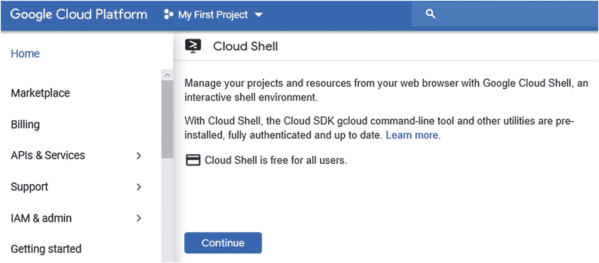

# 一、GCP 自动化简介

本章涵盖了 GCP(谷歌云平台)的自动化构建模块，并解释了如何建立一个 GCP 帐户。本章涵盖的主题如下:

*   GCP 简介

*   GCP 的自动化积木

*   注册谷歌云

## GCP 简介

谷歌云平台(GCP)是谷歌的公共云产品，它根据需求向最终用户提供一系列 IaaS 和 PaaS 服务。他们的服务非常适合现代应用开发用户。GCP 在大数据分析、人工智能和容器化领域有一些独特的产品。

谷歌首次涉足云计算是通过谷歌应用引擎，它于 2008 年 4 月作为平台即服务(PaaS)产品推出。它使开发者能够在谷歌的基础设施上构建和托管应用。2011 年 9 月，App Engine 走出预览版，2013 年正式采用 Google 云平台名称。该公司随后发布了各种工具，如其数据存储层、云 SQL、BigQuery、计算引擎以及组成今天谷歌云平台的其余工具。

GCP IaaS 资源包括物理硬件基础设施——计算机、硬盘驱动器、固态驱动器和网络——包含在[谷歌的全球分布式数据中心](https://en.wikipedia.org/wiki/Google_Data_Centers)中。这种硬件以[虚拟化](https://en.wikipedia.org/wiki/Virtualization)资源的形式提供给客户，比如[虚拟机](https://en.wikipedia.org/wiki/Virtual_machine) (VMs)。

为了构建云应用，GCP 提供了各种产品。下面介绍了一些比较流行的服务:

<colgroup><col class="tcol1 align-left"> <col class="tcol2 align-left"></colgroup> 
| 

服务

 | 

描述

 |
| --- | --- |
| 谷歌计算引擎 | 帮助创建虚拟机来运行操作系统，并允许在云中创建不同的计算机。 |
| 谷歌库比厄引擎 | 帮助管理容器编排器；使用 Kubernetes 作为托管服务来帮助部署、扩展和发布。 |
| 谷歌云功能 | 有助于实现事件驱动的无服务器云平台，有助于创建代码形式的基础设施(即由代码设计和实现的基础设施)。 |
| 谷歌容器注册 | 在 GCP 上提供安全、私有的 Docker 图像存储。它为团队提供了一个单一位置来管理 Docker 映像、执行漏洞分析，并通过细粒度的访问控制来管理谁可以访问什么。 |
| Google Stackdriver(现在的 Google Operations) | 帮助向公共云用户提供性能和诊断数据。提供对 Google 云和 AWS 云环境的支持，使其成为混合云解决方案。 |

## GCP 的自动化积木

许多新的应用正在被创建和开发，以便在云原生环境中运行。其中一些利用了容器化的架构，并部署在容器上。每个云提供商都有围绕 Kubernetes 的产品——谷歌有 GKE，Azure 有 Azure Kubernetes 服务，亚马逊有亚马逊 EKS 和亚马逊 Fargate。

容器化和云原生架构的整体理念以可用性、可伸缩性、自动化和开发运维为中心。Docker 和 Kubernetes 为开发人员和管理员提供了轻松部署和管理容器化应用的选项。

在容器化的环境中有许多发布和部署选项。其中最流行的是金丝雀部署、蓝绿部署和 A/B 测试。开发人员和发布/部署团队现在可以使用与 Kubernetes 生态系统完美集成的新型工具，轻松直观地开发/管理应用。在本书中，我们将介绍四种重要的工具，它们可用于持续部署和支持基于 Kubernetes 的应用部署。我们将讨论 Google 部署管理器、Spinnaker、Tekton 和 Jenkins。此外，我们还将介绍如何利用这四种解决方案的原生 GCP 服务来自动化 GCP 上的应用生命周期管理。

这些系统中的一些公共元素有助于开发人员和部署团队自动化他们的持续部署版本，这些元素将在下面的章节中进行解释。

### 支持简化部署

前面提到的大多数工具都允许开发人员简化云环境中应用的部署。它们通过提供易于使用的标准和模板以及应用部署的声明式格式来实现这种简化。一些工具支持 YAML 格式，并支持 Python 和 Jinja 模板来提供配置的参数化。

这些工具支持标准化，只需创建一个模板，然后允许它在类似的部署和不同的应用中重用。支持应用的核心基础设施元素包括自动扩展组、负载平衡器、节点、pod 等。它们都可以作为模板项或资源提供，通过模板进行配置，然后以标准化、可重复的方式进行部署。

### 可重复的部署流程

由于这些工具提供了一种创建声明性模板的方法，模板和部署策略在整个组织中的可重用性得到了增强。团队可以标准化处理不同类型发布的方式，以及定义和执行在容器化环境中运行应用所需的跨基础架构组件的标准。这可以节省部署工作和时间，并减少错误。

### 应用焦点

连续部署工具帮助团队专注于应用，选择适当的部署策略，并在将来的修改中重用模板，而不是专注于 Kubernetes 平台和相关基础设施元素的部署，然后重新定义部署策略。这使得应用开发/发布团队能够通过抽象特定于平台(如操作系统、数据库、Web 服务器)和云(私有云或公共云)的底层组件供应和配置过程的复杂性，专注于应用本身。

### 自动发布

这些工具支持端到端 CI/CD，因此可以与 CI 中的现有工具很好地集成。一些流行的 CI 工具有 Jenkins、Travis CI 等等。CD 工具与它们无缝集成，支持端到端的管道自动化和部署。因此，通过利用这些集成，实现了在容器化或云环境中完全自动化交付管道的端到端自动化愿景。

### 启用最佳实践

持续部署工具通过确保部署流程的标准化、模板的可重用性、不可变映像的部署、完全自动化和快速的应用部署，以及在出现问题时执行回滚的能力，在整个组织中实现最佳实践。这些工具还通过为深入诊断提供简单直观的界面和相关日志，使调试更容易，并有助于更快地解决与部署相关的事件。

### 零停机部署

在推出新的应用版本时，应用和业务所有者已经开始期望没有应用停机时间，或者至少是最小的停机时间。利用 Jenkins、Spinnaker 和 Google Deployment Manager 等解决方案，并使用 blue-green/canary/dark releases 等部署策略，运营团队能够以自动化方式管理 GCP 上的发布，最大限度地减少停机时间。虽然 GCP 本地和第三方工具在自动化发布中起着重要作用，但部署模式在实现最小或零停机时间方面也起着至关重要的作用。以下小节将介绍一些更常见的零停机部署策略。

#### 蓝绿色部署

使用蓝绿色部署策略，有两个相同应用版本的生产实例(蓝色和绿色)，它们相互隔离。只有蓝色实例接收所有生产流量。在发布过程中，新的代码版本部署在绿色实例中，并执行各种测试(如负载、功能和安全测试)。如果成功通过所有测试，绿色实例将被提升为接收所有生产流量(使用负载平衡器、DNS、反向代理等解决方案)。在使用这种方法时，应用团队必须记住长时间运行的数据库事务和应用会话带来的复杂性。

在 GCP 上使用这种方法(如图 [1-1](#Fig1) 所示)将需要应用的蓝色和绿色实例在 GCP 上运行，这会产生成本。通过利用 Google Deployment Manager 旋转蓝色和绿色实例，这变得相当简单，并有助于控制成本。绿色环境仅在与蓝色环境具有相同规格的版本中部署，使用 infra as code 原则。Jenkins X 和 Spinnaker 等解决方案在 CI/CD 管道中模拟蓝绿色模式。


图 1-1

蓝绿色部署

#### 滚动更新

这种部署策略(也称为渐变部署策略)包括通过逐渐替换旧实例来推出新版本。虽然这种方法可以解决长期运行的事务问题，或者在推出新版本时维护状态，但是总的部署时间可能相当长(取决于要执行的总体测试和要替换的组件)。如图 [1-2](#Fig2) 所示，通过滚动更新部署，旧版本将被批量更新的实例所取代，流量将通过 GCP 负载均衡器进行管理。


图 1-2

滚动更新方法

#### 金丝雀

金丝雀方法(也称为金丝雀或增量部署)与蓝绿方法类似，唯一的区别是新版本的应用逐渐接收生产流量(如新旧版本之间的 90-10、75-25 和 50-50)，而不是完全的流量切换(如图 [1-3](#Fig3) 所示)。


图 1-3

金丝雀部署

如果在测试过程中检测到问题，所有流量都将转移到旧的稳定版本。利用 GCP 本地负载平衡器有助于实现逐步流量切换功能，然后可以与部署管理器一起利用该功能来设置新环境。

这种方法与 A/B 测试密切相关，通过这种方法，可以在一部分用户中测试新特性(通常用于测试 UX 或应用级别的功能)。除了用于 A/B 测试和 canary 部署的负载平衡器的流量分配功能之外，应用开发人员还可以使用各种条件，如浏览器 cookies 或版本、地理位置等。

## 注册谷歌云

让我们从 GCP 开始吧。第一步是报名 GCP。以下部分包含注册所需的步骤，适用于初次用户。

注册该平台的首要先决条件是一个谷歌账户。GCP 使用谷歌账户进行访问管理和认证。如图 [1-4](#Fig4) 所示，您只需在浏览器窗口中输入 [`https://cloud.google.com/free#`](https://cloud.google.com/free#) 网址。


图 1-4

谷歌云平台

点击免费开始按钮。然后你会看到登录界面，如图 [1-5](#Fig5) 所示。


图 1-5

GCP 登录屏幕

系统会提示您输入一个 Google 帐户。如果您没有帐户，请按照创建帐户流程创建一个帐户。

Note

如果您已经登录到您的 Google，您将被重定向到图 [1-6](#Fig6) 所示的 GCP 云控制台。选择适当的国家，然后单击协议复选框。然后点击同意并继续。


图 1-6

GCP 云平台

如果您符合免费层的条件，系统会提示您输入帐户详情，如图 [1-7](#Fig7) 所示。


图 1-7

GCP 自由层注册，步骤 1

选择您的国家，同意服务条款，然后单击同意并继续按钮。这将带您进入第二步，如图 [1-8](#Fig8) 所示，在这里您可以创建并选择您的支付模式。提供所需的账单详情；但是，请放心，除非您手动请求，否则自动借记不会发生。


图 1-8

GCP 自由层注册，步骤 2

当您创建付款资料并登录时，右侧面板会显示详细信息，如图 [1-9](#Fig9) 所示。


图 1-9

GCP 自由层信息

如图 [1-9](#Fig9) 所示，谷歌向所有用户提供 300 美元的信用额度，可以在 12 个月内使用。这不仅足以探究书中所有的练习，也足以进一步评价 GCP。一旦您指定了所有的细节，点击开始我的免费试用按钮。

注册需要一段时间才能完成。一旦必要的验证完成，你将被重定向到谷歌控制台，你就可以开始了。

## 使用虚拟机创建控制台

点击创建按钮，创建一个新的虚拟机选项，如图 [1-10](#Fig10) 所示。


图 1-10

虚拟机创建控制台

单击页面右上角的激活按钮。它会提示你升级。点击升级，如图 [1-11](#Fig11) 所示。


图 1-11

虚拟机创建控制台

根据提示刷新页面(参见图 [1-12](#Fig12) )。


图 1-12

当询问您时，选择刷新

一旦激活过程完成，将显示图 [1-13](#Fig13) 中的屏幕。


图 1-13

激活屏幕后

## 为谷歌 GKE 设置环境

本节描述了为谷歌 GKE 设置环境的步骤。

### 创建项目

首先，您需要创建一个项目，如下所示:


图 1-15

新项目视图

1.  转到云控制台中的管理资源页面。

2.  在页面顶部的选择组织下拉列表中选择您的组织。

    **注意**如果您使用的是免费试用版，此列表不会出现。

3.  单击新建项目。

4.  In the New Project window, enter your project name, as shown in Figure [1-14](#Fig14).

    

    图 1-14

    新项目详细信息屏幕

    项目 ID 是所有 Google Cloud 项目的唯一名称(我们选择的名称不适合您)。这是本书其余部分使用的`PROJECT_ID`。

5.  输入完新项目的详细信息后，单击创建。新项目将被选中并出现，如图 [1-15](#Fig15) 所示。

### 发射云壳

使用右上角工具栏上的 GCP 控制台云壳图标激活 Google 云壳，如图 [1-16](#Fig16) 所示。


图 1-16

云壳按钮

将出现图 [1-17](#Fig17) 所示的屏幕。单击继续。



图 1-17

云壳屏

接下来，点击启动云壳按钮，如图 [1-18](#Fig18) 所示，启动云壳会话。


图 1-18

云壳开始屏幕

配置和连接到环境应该需要一些时间。这是一次性活动；下次点击云壳按钮，将会看到图 [1-19](#Fig19) 中的屏幕。


图 1-19

云壳屏

这个虚拟机提供了一个持久的 5GB 主目录，它运行在 Google Cloud 上。你已经通过认证了。请注意，项目被设置为您的`PROJECT_ID`。

在云 Shell 中运行以下命令，以确认您已经过身份验证:

```
gcloud config list project

```

该命令的输出如图 [1-20](#Fig20) 所示。


图 1-20

list project 命令的输出

## 摘要

本章包括 GCP 服务和支持自动化构建模块的简要概述。您还了解了如何创建 GCP 帐户，这将在后续章节的实践练习中用到。下一章从 GCP 部署管理器服务开始，并向您展示如何使用它来自动化设置 GCP 服务的过程。