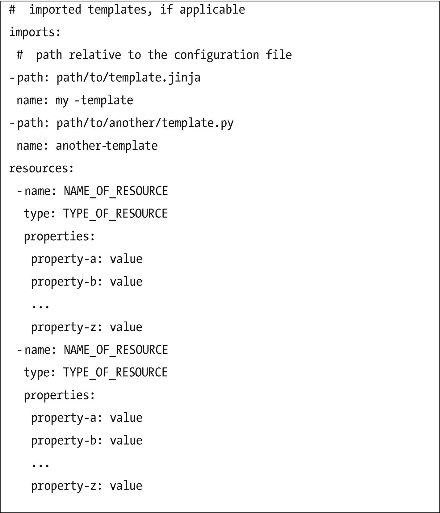
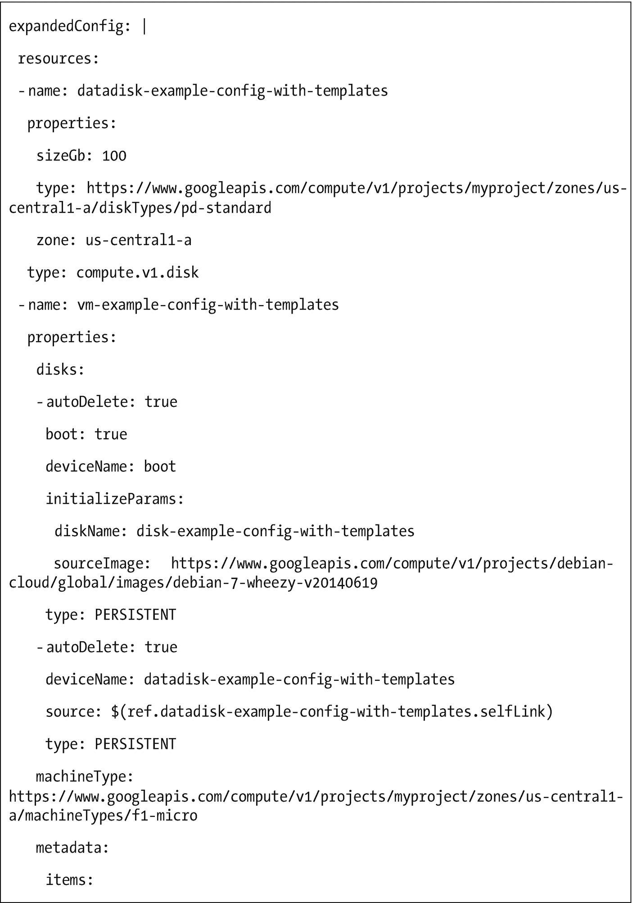
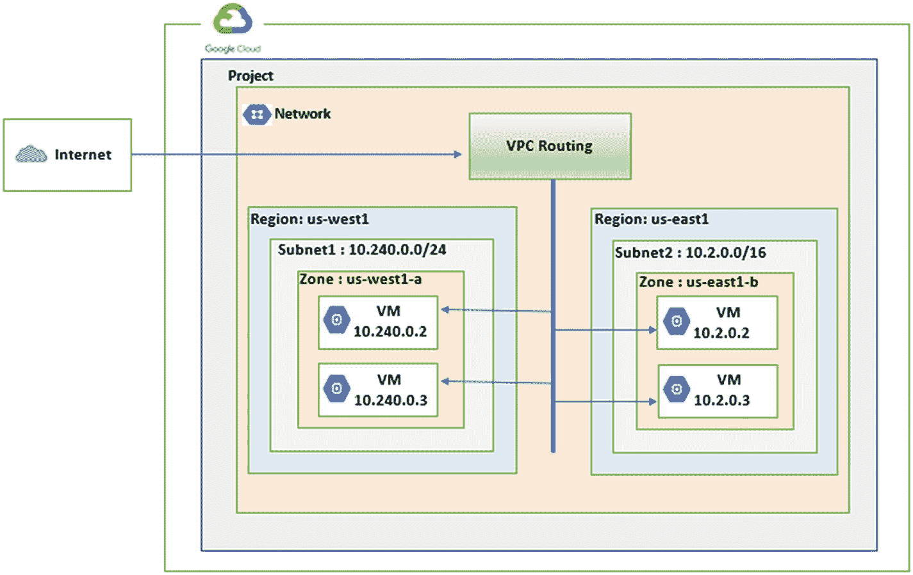
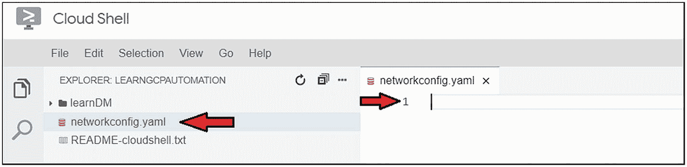
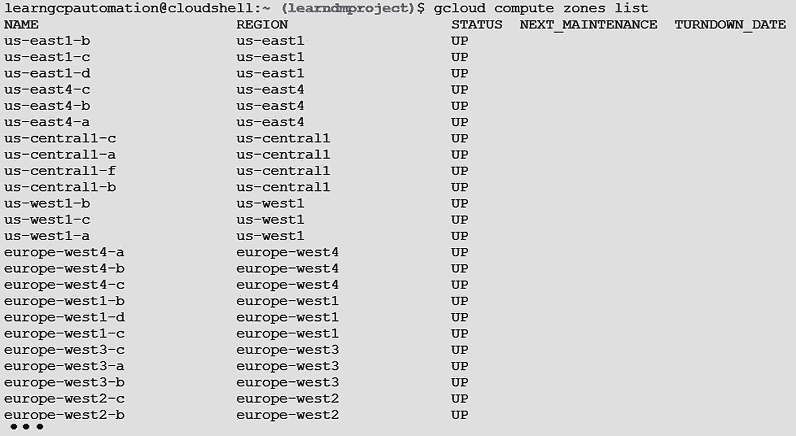
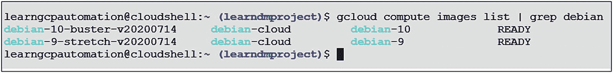
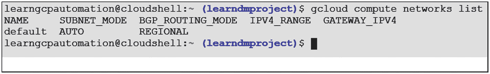

# 二、GCP 开发管理器入门

在本章中，我们将介绍 GCP 部署管理器服务的核心概念，并解释如何使用它来实现基础设施即代码(IaC ),以管理和供应 Google 云基础设施。本章涵盖以下主题:

*   部署管理器简介

*   了解部署管理器的组件

*   部署管理器的实践用例

## 部署管理器简介

DevOps 和基础设施即代码(IaC)正在获得全球开发者、管理员、架构师和云工程师的青睐。DevOps 是一种包含人员、流程和工具的哲学。它的目标是加速软件开发以及相关的发布和部署过程。在 DevOps 的总体框架中，IaC 是一个重要的组件，它从基础设施方面提供敏捷性和可伸缩性，以满足开发团队的需求。IaC 还支持稳定、安全和一致的平台来托管应用。

市场上有许多工具可用于实现 IaC。如今，Terraform 和 Ansible 在 DevOps 和开发人员社区中越来越受欢迎。同样，公共云托管平台提供原生解决方案，这些解决方案被打包为公共云服务产品的一部分，如 AWS 的 Amazon Cloud Formation 和 Azure 的 Azure Resource Manager。

在 GCP，云原生 IaC 原生产品被称为部署管理器。部署管理器提供了一种使用声明性语言定义 Google 云基础设施资源的机制。Deployment Manager 使用户能够使用 IaC 原则来设计和构建他们的 GCP 资源，以便他们可以使用软件开发的源代码控制和版本控制机制来维护对所提供内容的粒度控制，并自动执行提供过程。

部署管理器使您能够使用声明性配置(使用 Jinja 和 Python 语言)管理您的 GCP 基础设施。它帮助您编写灵活的模板和配置文件，然后使用它们来创建各种 GCP 服务，如 GKE、虚拟机、VPC、网络等等。

### 部署管理器的主要特性

作为 Google 部署管理器中的一个概念，部署只不过是 GCP 的另一个资源。通过更新部署文件和运行 update 命令对部署配置所做的任何修改，都只会通过将新配置与早期部署进行比较来引发所需的更改。这确保了通过有限的努力，从配置中移除的任何资源也从 GCP 基础设施中移除。图 [2-1](#Fig1) 总结了部署管理器的主要特性。


图 2-1

部署管理器功能

### Python 和 Jinja

要理解 Python 和 Jinja 的关系，我们需要理解什么是*模板引擎*。开发人员使用模板作为中间格式，以编程方式生成不同的所需输出格式，如 HTML 或 XML。这个活动是在模板引擎的帮助下执行的，模板引擎接受输入标记化的字符串，并生成一个呈现的字符串，用一个值代替标记作为输出。模板引擎通过使用一些数据和编程结构(如条件和循环)来操作输出。由开发人员创建然后由模板引擎处理的模板文件由预先编写的标记和插入数据的模板标记块组成。

Python 使用了几个模板引擎，比如可比、Django、string。模板，还有 Jinja2。这些模板引擎在允许代码执行和使用模板标签授予有限的功能集方面是不同的。

Jinja 或 jinja2 是最广泛使用的 Python 模板引擎，它是作为开源项目编写的。其流行的原因是其他模板引擎，如 Django 模板，可以作为大型 web 框架的一部分使用，这使得在项目之外使用它们很麻烦，因为它们与它们的库紧密耦合。许多 Python 开源应用，如配置管理工具 Ansible 和 SaltStack，默认使用 Jinja 模板来生成输出文件。

要了解关于 Python 和 Jinja 的更多信息，请参考以下链接:

*   忍者！忍者

*   python[`https://docs.python.org/3/tutorial/`](https://docs.python.org/3/tutorial/)

## 了解部署管理器组件

部署管理器 GCP 服务是管理谷歌云环境的一种非常有效的方式。在使用部署管理器管理 GCP 资源生命周期之前，您需要首先理解它的关键概念。

部署管理器的工作原理是，一组 GCP 资源形成一个逻辑单元，称为*部署，*一起部署。部署单元可以是任何 GCP 资源，如 GKE 集群、虚拟机、数据库、网络、IPs 等等。Deployment Manager 借助于使用声明性语句设置的模板，通过部署、更新和删除云资源来管理云基础设施。部署管理器在以下组件的帮助下执行部署的实施活动:

*   配置文件

*   资源

*   类型

*   模板

*   显示

*   部署

### 配置文件

配置文件是一起创建和管理的 GCP 资源的集合。配置文件以 YAML 模板的形式编写，包含要部署的资源的定义。部署管理器使用单个配置文件来管理多个资源。YAML 格式的配置文件的基本结构如图 [2-2](#Fig2) 所示。



图 2-2

配置文件示例

典型的配置文件包含以下部分:

*   **Type:** 表示要作为虚拟机、IP 地址等进行配置的 GCP 资源的类型。

*   **Name:** 一个名称字段，用于标识使用部署管理器设置的资源。这将作为将来对 GCP 资源集进行任何修改或删除操作的关键。

*   **属性:**定义将要创建的 GCP 资源的参数和属性，如机器类型、网络接口、启动盘等。这些值与从 GCP 控制台或云外壳手动创建服务时所需的值相同。

配置文件还包含一个类似这样的部分:

*   **Import:** 包含配置所需的所有模板文件的列表，最终由部署管理器扩展。

配置文件的其他可选部分包括:

*   **输出:**当需要将一个模板和配置中的数据输出到另一个模板供最终用户使用时使用。

*   **元数据:**用于设置资源之间的显式依赖关系。

部署管理器施加了以下限制:

*   配置的大小。原始格式和扩展格式都不能超过 1MB。

*   执行配置文件所花费的时间或处理能力也是有限的。如果超过这些，解决方案是将配置文件分成多个配置。

*   Python 模板不能进行任何系统或网络调用。如果他们尝试，他们将被拒绝。

让我们使用 YAML 文件创建一个简单的部署，如图 [2-3](#Fig3) 所示，其中我们在 Google 计算引擎服务中创建一个虚拟机。


图 2-3

简单配置文件

### 资源部分

配置文件中的资源部分描述了单个 API 资源。当我们编写配置文件时，我们可以选择使用 Google 管理的基本类型提供的 API 资源，或者使用第三方类型提供者提供的 API 资源。计算引擎实例和云 SQL 实例是 Google 云服务资源的例子。

### 类型

您必须为每个资源定义一个类型。描述资源需要类型。该类型可以是基类型或复合类型，如下所述。

#### 基本类型

当您必须创建单个原始 Google Cloud 资源时，您可以选择基本类型。基本类型使用 RESTful APIs 对资源执行 CRUD(创建、读取、更新和删除)操作。常用的 Google owned base 类型有`compute.v1.instance`和`storage.v1.bucket`。可以分别使用`compute.v1.instance` API 和`storage.v1.bucket` API 来访问它们。

要获得受支持资源类型的完整列表，包括 alpha 中的资源，请在`gcloud`中运行这个 [`types list`](https://cloud.google.com/sdk/gcloud/reference/deployment-manager/types/list) 命令:

```
gcloud deployment-manager types list

```

示例输出如图 [2-4](#Fig4) 所示。


图 2-4

部署管理器类型列表

#### 复合类型

当您必须创建一组原始的 Google Cloud 资源时，您需要多个模板作为一个单元一起工作，这可以使用 Python 或 Jinja 来完成。复合类型通常用于定义模板的一部分，可以很容易地重用。例如，您可以为网络创建负载平衡器资源。

每个资源都必须在配置文件中定义为一个类型。该类型可以是 Google 托管类型、复合类型、类型提供者或导入类型。这些类型可以在配置文件中定义。

#### Google 托管类型

这些类型与 Google 自己的托管基础云资源类型相关，如云存储桶或计算实例。在配置文件中定义它的语法如图 [2-5](#Fig5) 所示。


图 2-5

Google 管理的类型模板片段

```
Example: For Compute Engine instance type and Cloud Storage
                 bucket type

type: compute.v1.instance
type: storage.v1.bucket

```

#### 复合或类型提供程序

在配置文件中定义复合和类型提供者的语法如图 [2-6](#Fig6) 和 [2-7](#Fig7) 所示。

**模板:复合**


图 2-6

复合提供程序模板片段

**模板:类型提供者**


图 2-7

类型提供程序模板片段

#### 导入的模板

在配置文件中定义导入模板的语法如图 [2-8](#Fig8) 所示。模板导入一个名为`my_vm_template.jinja`的模板来创建一个名为`my-first-virtual-machine`的计算引擎实例。


图 2-8

导入的模板片段

**模板:模板导入**

### 模板

模板是配置文件的一部分。这些是包含一组资源详细信息的单个文件。对于复杂的部署，我们可以创建包含资源集信息的不同模板，从而在不同的部署之间提供一致性。部署管理器以内嵌的方式扫描和解释每个模板。

让我们创建一个基本模板。考虑下面的配置文件，它用于创建一个名为`vm-created-by-deployment-manager`的计算引擎虚拟机，如图 [2-9](#Fig9) 所示。


图 2-9

配置文件基本模板片段

现在我们将为这个配置创建一个模板，方法是取出相关的部分并创建一个新的 Jinja 文件。参见图 [2-10](#Fig10) 所示的模板片段。


图 2-10

Jinja 文件中的基本模板

部署管理器还创建包含部署信息的预定义环境变量。当我们在模板中使用这些环境变量时，部署管理器设置这些变量并替换它们的值。例如，`project_number`是一个保存部署的项目编号的环境变量。当在模板中使用它时，它被替换为该部署的实际`project_number`值。用于声明环境变量的语法如图 [2-11](#Fig11) 所示。


图 2-11

环境变量模板片段

图 [2-11](#Fig11) 显示了 GCP 提供的内置环境变量，该变量在代码中用于自动获取项目 ID。(参见表 [2-1](#Tab1) 。)图 [2-12](#Fig12) 显示了 Jinja 模板中环境变量的使用示例。


图 2-12

Jinja 模板片段中的环境变量示例

表 [2-1](#Tab1) 列出了部署管理器使用的环境变量集。

表 2-1

环境变量列表和描述

<colgroup><col class="tcol1 align-left"> <col class="tcol2 align-left"></colgroup> 
| 

环境变量名

 | 

描述

 |
| --- | --- |
| `Deployment` | 部署的名称 |
| `Name` | 使用此模板的配置文件中声明的名称 |
| `project` | 本次部署的`Project_Id` |
| `project_number` | 本次部署的`project_number` |
| `current_time` | 此部署开始扩展时的 UTC 时间戳 |
| `type` | 顶级配置中声明的资源类型 |
| `username` | 当前部署管理器用户 |

### 显示

每个部署都有相应的清单。清单是描述部署中所有资源的只读属性，并且是在每次新部署时自动创建的。清单创建后不能修改。清单不同于配置文件，而是基于配置文件创建的。您可以通过清单的惟一 ID 来识别它，ID 的格式是`manifest-TIMESTAMP`。例如，查看图 [2-13](#Fig13) 中所示的例子。


图 2-13

清单 ID 示例

清单提供了部署的三个视图，即初始配置视图、完全评估的配置视图和部署布局。我们将在接下来的章节中逐一讨论。

#### 初始配置视图

原始配置是您在任何模板扩展之前提供给部署的配置。初始配置由`config`属性表示，如图 [2-14](#Fig14) 所示。


图 2-14

清单的初始配置视图

#### 完全评估的配置视图

该视图在所有模板和导入展开后显示。扩展配置是对您的部署的完整描述，包括处理所有模板后的所有资源及其属性。这是您配置的最终状态。清单的扩展配置部分由`expandedConfig`属性表示，如图 [2-15](#Fig15) 所示。

 

图 2-15

清单的扩展配置

#### 部署的布局

该视图以分层结构描述了部署的所有资源。布局是您的部署及其资源的概要，并显示资源名称和类型。您可以使用布局来可视化您的展开结构、在初始展开期间设置的视图样板属性以及展开前有关您的配置的其他信息。在您的 manifest 中，您可以看到`layout`属性中的布局，如图 [2-16](#Fig16) 所示。

 

图 2-16

清单的布局视图

### 部署

一个*部署*是作为一个单元一起部署和管理的 GCP 资源的集合。我们可以使用配置文件和 GCP 云 Shell 的 create 命令来创建部署。用于执行部署的命令如图 [2-17](#Fig17) 所示。


图 2-17

在 GCP 创建新部署的命令

要定义配置文件，您必须使用`--config`选项，后跟配置文件的名称。当部署完成后，您可以使用图 [2-18](#Fig18) 中所示的命令来查看是否配置正确。


图 2-18

描述部署的命令

## 部署管理器的实际使用案例

既然我们已经介绍了 GCP 部署管理器的基本概念，那么让我们进入代码开发部分，开始在部署管理器的帮助下创建云基础设施。在开始之前，我们必须设置 GCP 环境以使用部署管理器。您可以通过以下链接访问本教程中使用的所有文件:

[T2`https://github.com/dryice-devops/GCPAutomation`](https://github.com/dryice-devops/GCPAutomation)

步骤 1:为了使用部署管理器，您需要一个 Google 项目。我们为本教程创建了一个名为`LearnDMProject`的项目，因此我们将选择该项目，如图 [2-19](#Fig19) 所示。您可以通过单击屏幕右上角的“新建项目”选项来创建新项目。


图 2-19

选择 LearnDMProject 项目

第二步:第一次点击部署管理器时，如图 [2-20](#Fig20) 所示，会提示您启用云部署管理器 V2 API，如图 [2-21](#Fig21) 所示。


图 2-20

选择部署屏幕

点击启用按钮，如图 [2-21](#Fig21) 所示，启用部署管理器 API。


图 2-21

启用部署管理器 API 屏幕

单击 Enable 按钮后，该 API 将可用于该项目。您将看到部署管理器屏幕，如图 [2-22](#Fig22) 所示。


图 2-22

部署管理器控制台

第三步:作为先决条件，你也可以安装名为`gcloud`的 Cloud SDK 命令行工具，或者你可以使用 Google Cloud Shell，它默认启用了`gcloud`。在本教程的剩余部分，我们将使用 Google Cloud Shell。

一旦满足了先决条件，就可以使用部署管理器来配置 GCP 资源。我们将首先处理一个用例，在这个用例中，我们将配置一个由虚拟机组成的部署。

步骤 1:第一步是激活云 Shell，它提供对 Google 云资源的命令行访问。在云控制台中，点击右上方工具栏中的激活云壳按钮，如图 [2-23](#Fig23) 所示。


图 2-23

激活云壳

点击激活云壳图标后，您将看到如图 [2-24](#Fig24) 所示的屏幕。单击继续按钮继续。


图 2-24

云壳信息屏幕

云壳终端现已可用，项目设置为`PROJECT_ID`，如图 [2-25](#Fig25) 所示。


图 2-25

云壳终端

步骤 2:为了开始为配置文件编写代码，我们将使用云外壳编辑器。点击打开编辑器按钮，如图 [2-26](#Fig26) 所示。


图 2-26

云 Shell 终端中的“打开编辑器”按钮

可以查看云编辑器和云终端，如图 [2-27](#Fig27) 所示。


图 2-27

云壳编辑器和终端视图

步骤 3:正如您之前看到的，我们将通过创建一个配置文件来定义我们的基础设施。我们将首先创建网络和子网配置。

### 创建网络和子网

在本节中，我们将使用部署管理器创建 GCP 网络和子网。这些网络和子网的一般表示如图 [2-28](#Fig28) 所示。



图 2-28

通用 VPC 网络

这个 VPC 网络在`us-west1`区域将`subnet1`定义为`10.240.0.0/24`，在`us-east1`区域将`subnet2`定义为`10.2.0.0/16`。`Subnet1`在`Subnet1`的可用地址范围内有两个 IP 为`10.240.0.2`和`10.240.0.3`的虚拟机。类似地，`Subnet2`有两个虚拟机，其 IP`10.2.0.2`和`10.2.0.3`位于定义的子网范围内。

对于本教程，我们将创建以下三个配置文件:

*   `networkconfig.yaml`:配置 YAML 文件，我们在其中定义资源(网络和子网)类型和属性。

*   `network.py`:这将被导入到配置文件中，包含网络/子网定义以及特定的环境变量。

*   `network.py.schema`:描述了部署管理器的规范。它包含部署管理器在使用`network.py`模板时将强制执行的一组规则。

对于这个用例，实施解决方案架构可以如图 [2-29](#Fig29) 所示。


图 2-29

实现架构

现在，按照以下步骤进行实施:

1.  Create a file called `networkconfig.yaml` in the Cloud Shell Editor by navigating to File ➤ New ➤File, as shown in Figure [2-30](#Fig30).

    

    图 2-30

    新文件视图

    Once it’s created, the file will appear in the Explorer along with the text editor, as shown in Figure [2-31](#Fig31).

    

    图 2-31

    创建网络配置文件

    Now paste the following code into the `networkconfig.yaml` file and save the file, as shown in Figure [2-32](#Fig32).

    

    图 2-32

    网络配置代码

2.  Create another file called `network.py` in the Cloud Shell Editor by choosing File ➤ New ➤ File, as shown in Figure [2-33](#Fig33).

    

    图 2-33

    新文件视图

    Now paste the following code into the `network.py` file and save the file. This file is used to describe the network and subnetwork configuration and is imported by the `networkconfig.yaml` file to create the network setup, as shown in Figure [2-34](#Fig34).

    

    图 2-34

    网络配置代码

3.  Create another file called `network.py.schema` in the Cloud Shell Editor by choosing File ➤ New ➤ File, as shown in Figure [2-35](#Fig35).

    

    图 2-35

    新文件视图

    Now paste the following code into the `network.py.schema` file and save it, as shown in Figure [2-36](#Fig36).

    

    图 2-36

    网络配置模式代码

4.  现在我们已经创建了配置文件，我们将使用以下命令执行部署:

    ```
    gcloud deployment-manager deployments

    ```

```
         create networsubnetworkdm –config networkconfig.yaml

```

该命令将执行网络和子网的部署，并将产生如图 [2-37](#Fig37) 所示的输出。


图 2-37

部署命令 CLI

您可以在 GCP 控制台上通过导航到主➤ VPC 网络来验证部署。这样做将显示如图 [2-38](#Fig38) 所示的屏幕。


图 2-38

VPC 网络屏幕

1.  最后，您可以从 CLI 使用以下命令删除创建的网络和子网:

```
         gcloud deployment-manager deployments delete networsubnetworkdm

```

此命令将删除您创建的网络和子网。在删除过程中，系统会提示您“是否要继续(y/N)？”键入`y`以产生如图 [2-39](#Fig39) 所示的输出。


图 2-39

删除部署 CLI

可以在谷歌云控制台验证 [`learndmproject-network`](https://console.cloud.google.com/networking/networks/details/learndmproject-network%25253Fproject%25253Dlearndmproject%252526cloudshell%253Dfalse) 被删除，如图 [2-40](#Fig40) 。


图 2-40

VPC 网络控制台

### 创建虚拟机

在本节中，我们将使用部署管理器创建一个 VM 实例。我们将编写包含虚拟机创建定义的`createVMConfig.yaml`配置文件。

实施方案如图 [2-41](#Fig41) 所示。


图 2-41

实现架构

现在，按照以下步骤进行实施


图 2-45

编辑器中的 createVMConfig.yaml 代码片段


图 2-44

createVMConfig.yaml 代码片段

1.  Create a file called `createVMConfig.yaml` in the Cloud Shell Editor by going to File ➤ New ➤ File, as shown in Figure [2-42](#Fig42).

    

    图 2-42

    新文件视图

    Once it’s been created, the file will appear in the Explorer along with text editor, as shown in Figure [2-43](#Fig43).

    

    图 2-43

    新文件视图

2.  现在将下面的代码粘贴到`createVMConfig.yaml`文件中并保存，如图 [2-44](#Fig44) 和 [2-45](#Fig45) 所示。

在进入下一步之前，您需要理解前面代码中使用的参数和值。我们通过声明提到的资源 VM 实例类型及其名称来启动配置文件，如图 [2-46](#Fig46) 所示。


图 2-46

资源配置

`name`是一个用户定义的字符串，它可以是任何有意义的名称，以后会被引用。接下来，我们将实例的类型定义为`compute.v1.instance`。我们可以通过运行以下命令来检查哪些类型可用:

```
gcloud deployment-manager types list

```

该命令将列出部署管理器的所有类型。它将产生如图 [2-47](#Fig47) 所示的输出。


图 2-47

DM 类型列表

我们可以使用下面的命令来过滤结果以找到实例类型。输出将如图 [2-48](#Fig48) 所示。


图 2-48

过滤的 DM 类型列表

```
gcloud deployment-manager types list | grep instance

```

现在让我们看看在`tutorialConfig.yaml`文件中为虚拟机定义的属性。

*   `Zone`:描述虚拟机将驻留在哪里。我们可以通过运行以下命令来检查哪些类型可用:

```
         gcloud compute zones list

```

前面的命令将列出所有可用的区域并产生输出，如图 [2-49](#Fig49) 所示。



图 2-49

区域列表

*   `machineType`:您可以使用以下命令检查`machineType`。由于本例中的区域是`us-central1-a`，我们可以在这个区域上过滤我们的列表搜索。

```
        gcloud compute machine-types list | grep us-central1-a

```

该命令将列出`us-central1-a`中所有可用的机器类型，并将产生如图 [2-50](#Fig50) 所示的输出。


图 2-50

在区域上过滤的机器类型

从前面的列表中选择机器类型后(本例中为`f1-micro`，我们需要在配置文件中定义`f1-micro`机器类型的`selfLink` URL。为了获得`selfLink` URL，我们将使用之前在配置文件中定义的相同区域选择(即`us-central1-a`)来执行以下命令。

```
         gcloud compute machine-types describe f1-micro --zone us-
         central1-a | grep selfLink

```

该命令将显示配置文件中使用的`selfLink` URL，并将产生如图 [2-51](#Fig51) 所示的输出。


图 2-51

机器类型自链接

*   `disk`:`disk`配置将具有以下值:

*   `initializeParams`:这将有启动盘的初始化参数。您可以使用以下命令检查图像列表:

```
             - deviceName: boot
             - type: PERSISTENT
             - boot: true
             - autoDelete: true

```

```
gcloud compute images list

```

该命令将显示可用图像列表，并将产生如图 [2-52](#Fig52) 所示的输出。


图 2-52

计算图像列表

在这个例子中，我们将创建一个 Linux 实例，因此我们将过滤 Debian-9 映像上的搜索列表。我们可以使用以下命令获得图像列表:

```
gcloud compute images list | grep debian

```

该命令将显示可用的 Debian 映像列表，并将产生如图 [2-53](#Fig53) 所示的输出。



图 2-53

过滤的计算图像列表

它显示了两个 Debian 映像，所以我们将获得 Debian-9 映像的`selfLink` URL，并将其放在我们的配置文件中。

```
gcloud compute images describe debian-9-stretch-v20200714 --project debian-cloud | grep selfLink

```

该命令将显示配置文件中使用的`selfLink` URL，并将产生如图 [2-54](#Fig54) 所示的输出。


图 2-54

计算机图像自动链接

*   `network`:要列出项目可用的网络，使用以下命令。

```
gcloud compute networks list

```

该命令将显示配置文件中使用的网络列表，并将产生如图 [2-55](#Fig55) 所示的输出。



图 2-55

网络列表

我们有一个默认网络可用，所以我们现在将为默认网络生成`selfLink`,以便在配置文件中使用它。

```
gcloud compute networks describe default | grep selfLink

```

该命令将为默认网络生成`selfLink`，并将产生如图 [2-56](#Fig56) 所示的输出。


图 2-56

默认网络自动链接

配置文件中的最后一个条目将`accessConfigs`添加到默认网络。有两个参数，定义如下:

*   `name` : `External NAT`

*   `type` : `ONE_TO_ONE_NAT`

有关更多属性，请参考以下链接:

[T2`https://cloud.google.com/compute/docs/reference/rest/v1/instances`](https://cloud.google.com/compute/docs/reference/rest/v1/instances)

现在我们已经创建了配置文件，我们可以继续下一步并部署它。

```
gcloud deployment-manager deployments create my-first-deployment --config createVMConfig.yaml

```

该命令将部署我们创建的配置文件，并将产生如图 [2-57](#Fig57) 所示的输出。


图 2-57

虚拟机部署 CLI

在图 [2-57](#Fig57) 中可以看到，名为`createfirstvm`的配置文件已经被部署管理器成功执行。此外，您还可以验证配置文件的执行和 Linux 虚拟机的创建，如图 [2-58](#Fig58) 所示。


图 2-58

部署管理器控制台

导航到谷歌云控制台➤部署经理➤仪表板控制台。它将显示名为`my-first-deployment`的部署列表，如图 [2-58](#Fig58) 所示。

您还可以验证 Debian-9 Linux VM 是否已经创建。导航到谷歌云控制台➤计算引擎➤虚拟机实例。它将显示一个用名称`createfirstvm`创建的虚拟机，如图 [2-59](#Fig59) 中的配置文件所定义。


图 2-59

计算引擎控制台

在配置文件中，我们将网络定义为默认网络。我们可以通过单击`createfirstvm`来验证这一点，这将显示所创建虚拟机的详细信息，如图 [2-60](#Fig60) 所示。


图 2-60

计算引擎网络详细信息

### 删除部署

如果部署不是根据您的要求创建的，或者其中有错误，您可以使用以下命令将其删除:

```
gcloud deployment-manager deployments delete  my-first-deployment

```

此命令将删除部署。在删除过程中，您会得到一个提示，“您要继续吗(y/N)？”。键入`y`以查看如图 [2-61](#Fig61) 所示的输出。


图 2-61

删除部署 CLI

现在让我们在 Google Cloud 控制台中验证部署管理器和 VM 实例控制台，以确认部署和 VM 已经被删除。见图 [2-62](#Fig62) 。


图 2-62

部署管理器控制台

类似地，我们可以验证虚拟机已经从计算引擎控制台中删除，如图 [2-63](#Fig63) 所示。


图 2-63

计算引擎控制台

## 摘要

本章详细介绍了部署管理器的主要概念，并解释了如何定义配置文件，以便在代码的帮助下执行环境供应和维护。您还进行了创建网络、子网和 GCP 单实例虚拟机的实践练习。下一章将介绍 Spinnaker，它是一个强大而灵活的 Kubernetes-native 开源框架，用于创建持续集成和交付(CI/CD)系统。