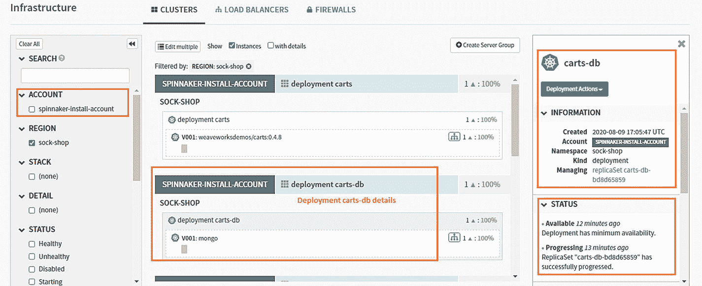
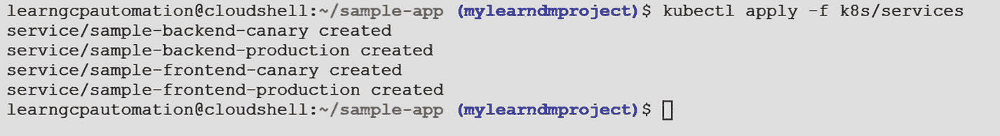
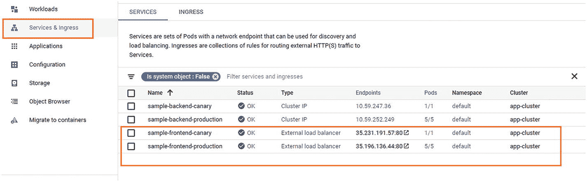

# 3.GCP Spinnaker 入门

Spinnaker 是一个流行的持续部署工具，它支持主要的云提供商在 Kubernetes、Function as a Service (FaaS)等平台上部署应用。本章涵盖了 Spinnaker 架构、组件和用例。您还将学习如何在 GCP 上安装和配置 Spinnaker。

本章涵盖以下主题:

*   三角帆的特点

*   三角帆的建筑

*   GCP 大三角帆

*   在 GCP 上安装三角帆

*   使用 Spinnaker

*   Spinnaker 的金丝雀部署用例

## 三角帆的特点

Spinnaker 是一个开源的持续部署工具，它本身支持将应用部署到主要的云提供商，如 GCP、AWS 等。Spinnaker 由谷歌和网飞联合开发，旨在加速他们的软件交付。Spinnaker 现在是开源的，其不断增长的社区正在积极开发新功能，并推动产品向前发展。主要贡献者是谷歌、网飞、微软、亚马逊和其他公司。Spinnaker 的源代码可以在 GitHub 的 [`https://github.com/spinnaker`](https://github.com/spinnaker) 获得。

Spinnaker 是 GCP 的一个市场解决方案，只需点击几下就可以安装。Spinnaker 不支持持续集成；但是，它提供了与 Jenkins 等市场领先 CI 工具的集成。市场上还有提供 CI/CD 实施的其他工具。表 [3-1](#Tab1) 是 Jenkins、JenkinsX 和 Spinnaker 的功能比较。

表 3-1

特征比较

<colgroup><col class="tcol1 align-left"> <col class="tcol2 align-left"> <col class="tcol3 align-left"> <col class="tcol4 align-left"></colgroup> 
| 

特征

 | 

詹金斯

 | 

詹金斯

 | 

大三角帆

 |
| --- | --- | --- | --- |
| 图像使用者界面 |  |  |  |
| 管道作为代码 | 宣言的 | 亚姆 | 数据 |
| kubernetes-本地(基于控制器) |  |  |  |
| 海峡群岛 |  |  |  |
| 激光唱片 |  |  |  |
| WebHook 触发 |  |  |  |
| Git 轮询触发 |  |  |  |
| 模板支持 |  | 通过脚本 DIY |  |

可用

不可用

现在让我们看看 Spinnaker 的主要特性:

*   **多云支持** : Spinnaker 支持主要的云提供商，如 Google、Amazon 等等。

*   **连续交付工具** : Spinnaker 是一个连续交付工具，因为它以安全和自动化的方式部署应用。

*   开源:Spinnaker 得到了大型开发者社区的支持，包括谷歌、网飞、亚马逊等等。

*   **支持主要部署策略** : Spinnaker 支持许多部署策略，包括 blue-green、滚动更新、canary 和具有轻松回滚功能的 highlander。

## 三角帆建筑

Spinnaker 是一个基于微服务的架构，其中有 11 个独立的微服务。以下是这些微服务的列表:

*   **Deck**:Spinnaker 基于浏览器的 UI 和前端服务。

*   **Gate** :一个 API 网关；Spinnaker 的所有微服务都通过这个网关相互通信。

*   Orca :负责所有特别操作的编排引擎。这个微服务还负责保存有关管道执行的信息。

*   **CloudDriver** :负责建立与云提供商的连接，缓存所有部署的资源。它是与云提供商集成的主要服务。

*   **Front50** :负责在应用、管道、项目、通知中持久化元数据。

*   Rosco :负责烘焙不可变的 VM 镜像，比如 GCE 镜像、AWS AMI 等等，它们将被部署到特定的云。它使用打包工具来创建虚拟机映像。

*   **Igor** :用于连接像 Jenkins 或 Travis CI 这样的 CI 工具。它允许在自己的管道中使用 Jenkins/Travis CI 阶段。没有这项服务，您就无法与任何 CI 工具集成。

*   **Echo** :用于通过 Slack、email 或者 SMS 发送通知，负责所有传入的 WebHooks，比如 GitHub 到 Spinnaker。

*   **Fiat** :负责 Spinnaker 中的用户授权。它用于查询应用和服务帐户的用户权限。

*   Kayenta :负责 spinnaker 的自动金丝雀分析。

*   Halyard:Spinnaker 的配置服务，在 Spinnaker 启动、更新和回滚期间维护这些服务的生命周期。

图 [3-1](#Fig1) 显示了哪些微服务相互依赖。绿框代表“外部”组件，包括在浏览器中运行的 Deck UI。黄色框表示 Halyard 组件，它们仅在启动、更新和回滚期间配置 Spinnaker 时运行。


图 3-1

Spinnaker 微服务架构

应用管理和部署是 Spinnaker 的两个主要组件。让我们来详细了解一下这些组件。

### 应用管理

应用管理用于查看和管理云资源。它表示需要由用户部署的服务。应用、集群和服务器组是 Spinnaker 用来描述服务的关键概念。负载平衡器和防火墙描述了服务是如何暴露给外部用户的，如图 [3-2](#Fig2) 所示。


图 3-2

Spinnaker 应用管理

应用管理包括托管服务的以下基础架构。

*   **集群**:Spinnaker 中服务器组的逻辑分组。例如，在 GCP，它将是 GKE 集群节点。

*   **服务器组**:基础资源，即服务器组，标识可部署的工件，例如 VM 镜像、Docker 镜像和源位置，以及基本的配置设置，例如实例数量、自动伸缩策略等等。部署时，服务器组是运行软件实例的集合。例如，在 GCP，这将是虚拟机。

*   **防火墙**:通过一组防火墙规则定义网络流量访问，这些规则由具有通信协议和端口/端口范围的 IP 范围定义。

*   **负载平衡器**:与入口协议和端口范围相关。它平衡其服务器组中实例之间的流量。

### 应用部署

Spinnaker 用于通过管道和阶段执行应用的连续部署。管道由一系列动作组成，称为*阶段*，可以按任何顺序组合。阶段又包含任务，任务是具体的行动，如图 [3-3](#Fig3) 所示。

Spinnaker 提供了许多阶段，比如部署、禁用、手动判断等等。基于某些事件，可以手动或自动触发管道。例如，一旦 Jenkins 构建了代码并放置了可部署单元，就会触发 Spinnaker 管道进行部署。Spinnaker 支持广泛使用的云本地部署策略，包括蓝绿色、滚动红/黑和金丝雀部署。


图 3-3

三角帆管道流

## GCP 大三角帆

GCP 的 Spinnaker 平台带有内置的部署最佳实践，用户可以利用 Google 托管服务，如 Google Kubernetes 引擎、Google 计算引擎、合规性、安全性等。

表 [3-2](#Tab2) 列出了 Spinnaker 在 GCP 的优势。

表 3-2

三角帆在 GCP 的优势

<colgroup><col class="tcol1 align-left"> <col class="tcol2 align-left"></colgroup> 
| **安全安装** | Spinnaker for GCP 提供一键式 HTTPS 配置和云身份感知代理(IAP)，后者控制谁可以访问 Spinnaker 安装。 |
| **自动备份** | Spinnaker 安装的配置会自动安全备份，这有助于用户进行审计和快速恢复。 |
| **集成审计和监控** | Spinnaker for GCP 集成了 Spinnaker 和 Google Stackdriver，用于监控、故障排除和审计应用和 Spinnaker 本身的更改、部署和整体健康状况。 |
| **易于维护** | 面向 GCP 的 Spinnaker 提供了许多助手来自动维护 Spinnaker 安装，其中包括面向 GKE 的 Spinnaker 配置。 |

Google 在 GKE 集群上提供了一个生产就绪的 Spinnaker 实例。基于云 Shell 的安装工具遵循推荐的做法，如防火墙、服务帐户、实例组和 bucket 来存储在 Google 云平台上运行 Spinnaker 的 Spinnaker 相关数据。该解决方案还与谷歌提供的其他服务(如谷歌云平台)进行了很好的集成，包括 Stackdriver(现为谷歌运营)、云构建、容器注册、谷歌 Kubernetes 引擎、谷歌计算引擎、谷歌应用引擎和云身份感知代理。

## 在 Google 云平台上安装 Spinnaker

现在让我们从在 GCP 上设置 Spinnaker 开始:

第一步:使用您在第 [1 章](1.html)中创建的 [`https://accounts.google.com/`](https://accounts.google.com/) 链接和凭证登录 GCP。

步骤 2:在本练习中，我们将创建一个新项目。使用以下步骤在 GCP 创建项目。点击新建项目，如图 [3-4](#Fig4) 所示。


图 3-4

GCP 上的三角帆装置

在下一个屏幕中提供项目名称。在这种情况下，我们将项目命名为`mylearndmproject`。点击创建按钮，如图 [3-5](#Fig5) 所示。


图 3-5

为 GCP 的 Spinnaker 装置创建新项目

第三步:选择新建的名为`mylearndmproject`的项目，如图 [3-6](#Fig6) 所示。


图 3-6

选择项目

第四步:导航到市场，如图 [3-7](#Fig7) 所示。


图 3-7

GCP 市场

第五步:搜索“用于 Google 云平台的 Spinnaker”，如图 [3-8](#Fig8) 所示。


图 3-8

用于谷歌云平台的 Spinnaker

第六步:点击 Spinnaker for Google Cloud Platform，如图 [3-9](#Fig9) 。


图 3-9

单击 Spinnaker for Google Cloud Platform，选择它

第 7 步:它将打开 Spinnaker for Google Cloud Platform 页面。点击转到 Spinnaker For Google 云平台选项，如图 [3-10](#Fig10) 所示。


图 3-10

转到 Spinnaker for Google 云平台

第八步:点击链接后，会得到云壳提示，确认将 GitHub repo [`https://github.com/GoogleCloudPlatform/spinnaker-for-gcp.git`](https://github.com/GoogleCloudPlatform/spinnaker-for-gcp.git) 克隆到云壳中。点击确认，如图 [3-11](#Fig11) 所示。


图 3-11

在云外壳中克隆 Spinnaker 代码

Cloud Shell 显示了一个文件树，其中包含了 Spinnaker 存储库中的文件，如图 [3-12](#Fig12) 所示。


图 3-12

Spinnaker 为云壳中的 GCP 代码

步骤 9:在终端上使用以下命令配置 Git。将`[EMAIL_ADDRESS]`替换为您的 Git 电子邮件地址，将`[USERNAME]`替换为您的 Git 用户名。

```
git config --global user.email \
    "[EMAIL_ADDRESS]"
git config --global user.name \
    "[USERNAME]"

```

步骤 10:现在通过在终端上执行以下命令，在您的项目中提供 Spinnaker(在我们的例子中，它是`mylearndmproject`)。

```
PROJECT_ID=mylearndmproject\
    ~/cloudshell_open/spinnaker-for-gcp/scripts/install/setup_properties.sh

```

该命令的输出如图 [3-13](#Fig13) 所示。


图 3-13

我的学习项目 GCP 大三角帆

步骤 11:通过执行以下命令，将安装 Spinnaker。此安装命令可能需要大约 20 分钟才能完成。当输出显示`Installation complete`时，安装完成。观察云壳命令行，看看什么时候完成。

```
~/cloudshell_open/spinnaker-for-gcp/scripts/install/setup.sh

```

该命令的输出如图 [3-14](#Fig14) 和 [3-15](#Fig15) 所示。


图 3-15

用于 GCP 安装脚本执行的 Spinnaker


图 3-14

用于 GCP 设置的三角帆

步骤 12:重启云壳加载新的环境设置，如图 [3-16](#Fig16) 所示。


图 3-16

重启 GCP 云外壳

### 进入三角帆

安装 Spinnaker 后，您可以执行一个命令来转发端口以访问 Deck UI 并开始使用 Spinnaker。使用以下步骤访问 Spinnaker UI。

第一步:在云壳终端执行以下命令:

```
~/cloudshell_open/spinnaker-for-gcp/scripts/manage/connect_unsecured.sh

```

该命令将本地端口 8080 转发到端口 9000，供 Deck UI 使用。见图 [3-17](#Fig17) 。


图 3-17

GCP 港转运用三角帆

第二步:点击高亮显示的预览按钮，选择 8080 端口预览，如图 [3-18](#Fig18) 所示。


图 3-18

查看 GCP GUI 的 Spinnaker

这将打开 Spinnaker UI，如图 [3-19](#Fig19) 所示。


图 3-19

Spinnaker GUI

Spinnaker UI 将显示各种选项，例如搜索、项目、应用等等。在下一节中，您将了解 Spinnaker 中的一些关键选项；见图 [3-20](#Fig20)


图 3-20

Spinnaker GUI 选项

### 三角帆导航

让我们探索 Spinnaker UI 中的一些可用选项，并看看它们的相关性。

#### 应用

要查看应用，点击应用选项，如图 [3-21](#Fig21) 所示。


图 3-21

Spinnaker GUI 应用选项

由于 GCP 的 Spinnaker 运行在 Kubernetes 集群上，该集群是在 GCP 安装 Spinnaker 期间创建的，因此在您再次登录到 Spinnaker UI 后，您将看到该应用显示为“Kubernetes”。要查看更多详情，请点击 Kubernetes，如图 [3-22](#Fig22) 所示。


图 3-22

Spinnaker 应用页面

在特定的应用页面(在本例中是 Kubernetes)上，单击 Config 选项可以深入到与应用相关的信息，比如应用属性、通知、特性等等。见图 [3-23](#Fig23) 。


图 3-23

Spinnaker 应用详细信息

#### 通知

Spinnaker 可以向管道事件发送通知。它使用各种渠道发送通知，如电子邮件、SMS 和 Slack。

#### 特征

您可以禁用任何不需要的主要功能，如图 [3-24](#Fig24) 所示。


图 3-24

Spinnaker 应用功能

#### 链接

在“链接”部分，您可以包含自定义链接，这些链接是常用功能的快捷方式，如日志、健康状况等。

#### 交通警卫集群

这种[集群](https://spinnaker.io/concepts/clusters/)总是至少有一个活动实例。如果 Spinnaker 知道尝试删除、禁用或调整服务器组大小的用户或进程会使集群没有活动的实例，则该操作将被停止。表 [3-3](#Tab3) 显示了相关字段。

表 3-3

流量防护集群字段详细信息

<colgroup><col class="tcol1 align-left"> <col class="tcol2 align-left"> <col class="tcol3 align-left"></colgroup> 
| 

田

 | 

必需的？

 | 

描述

 |
| --- | --- | --- |
| 账户 | 是 | 您正在为其设置流量监控的帐户。 |
| 地区 | 是 | 列表中的适用区域，或`*`代表所有区域。 |
| 堆 | 不 | 要应用此流量保护的堆栈。将此项留空，以便仅将保护应用于没有堆栈的集群。 |
| 详述 | 不 | 通过应用堆栈详细信息命名约定标识该集群所需的详细信息字符串。 |

#### 应用创建

您必须在中创建应用，才能创建部署管道。要创建应用，请使用以下步骤。

第一步:点击操作，然后创建应用，如图 [3-25](#Fig25) 所示。


图 3-25

Spinnaker 应用创建

将出现新的申请单，如图 [3-26](#Fig26) 所示。


图 3-26

Spinnaker 创建表单

申请表包含各种需要填写的选项。有些是强制的，比如名字。表 [3-4](#Tab4) 列出了更多细节。

表 3-4

Spinnaker 应用表单字段详细信息

<colgroup><col class="tcol1 align-left"> <col class="tcol2 align-left"> <col class="tcol3 align-left"></colgroup> 
| 

田

 | 

需要

 | 

描述

 |
| --- | --- | --- |
| 名字 | 是 | 用于标识该应用的唯一名称。 |
| 所有者电子邮件 | 是 | 在您安装的 Spinnaker 中，该应用所有者的电子邮件地址。 |
| 回购类型 | 不 | 承载此应用的代码库的平台。可能是 Stash，Bitbucket，GitHub，Google Storage，AWS S3 桶，Kubernetes 对象，Oracle 对象。 |
| 描述 | 不 | 如有必要，使用此文本字段描述应用。 |
| 仅考虑云提供商的健康状况 | 布尔，默认值 = 否 | 如果启用，云提供商报告的实例状态被认为足以确定任务完成。禁用时，任务需要由其他健康提供者(负载平衡器或发现服务)报告健康状态。 |
| 显示健康覆盖选项 | 布尔，默认值 = 否 | 如果启用，用户可以切换每个任务的先前选项。 |
| 实例端口 | 不 | 该字段用于生成从 Spinnaker 实例详细信息到正在运行的实例的链接。实例端口可以用于或覆盖为应用配置的特定链接(通过配置屏幕)。 |
| 启用重新启动正在运行的管道 | 布尔，默认值 = 否 | 如果启用，用户可以在管道仍在运行时重新启动管道阶段。不推荐这种行为。 |

在本章的后面，你会学到更多关于创建应用的知识。

#### 管道模板

管道控制如何通过一系列阶段部署应用，这些阶段映射到应用部署/发布过程步骤。Pipeline 既可以手动执行，也可以自动执行，通过广泛的外部输入(比如 WebHook，在 Jenkins 作业完成后触发，基于从 Google 云存储上传工件的触发等等)。

##### 创建管道

使用下列步骤创建管线:

步骤 1:选择要在其中创建管道的应用。

第二步:导航到 Spinnaker UI 中的 Pipelines 选项卡，如图 [3-27](#Fig27) 所示。


图 3-27

Spinnaker 管道选项

第三步:点击管道页签右上角的新建，如图 [3-28](#Fig28) 所示。


图 3-28

Spinnaker 管道创建

第 4 步:从下拉菜单中选择 Pipeline 并命名管道。然后点击创建按钮，如图 [3-29](#Fig29) 所示。


图 3-29

Spinnaker 新的管道创建选项

管道的配置信息作为一个 JSON 文件存储在 Spinnaker 中。当 Spinnaker 保存管道时，您使用 UI 对管道所做的任何更改都会被转换为 JSON 文件。创建管道后，您可以根据管道的需要添加任意多个阶段。我们将在“Spinnaker 的 CI/CD 用例”一节中详细介绍这一点。

第五步:要手动触发管道，在管道页签中点击开始手动执行，如图 [3-30](#Fig30) 和 [3-31](#Fig31) 所示。然后，Spinnaker 会显示一个确认对话框，您可以在其中添加任何必要的参数。


图 3-31

Spinnaker 管道执行参数


图 3-30

Spinnaker 管道手动执行

##### 管道管理

管道管理用于在管道中执行与管理相关的活动，如重命名、删除、锁定等。您可以在管道管理中执行下列操作。

*   **重命名管道**:这个动作负责重命名管道。

*   **删除管道**:该操作允许您删除现有的管道。

*   **禁用管道**:如果想阻止管道执行，可以将其禁用。

*   **锁定管道**:锁定管道可以防止所有用户使用 Spinnaker UI 修改它。

*   **将管道编辑为 JSON** :无论您在 Spinnaker 上为创建应用或管道做了什么更改，Spinnaker 都会将它们转换为 JSON 格式。您可以根据需要编辑 JSON 文件，这些更改将会反映在 UI 中。

*   **查看和恢复修订历史**:每次保存管道，当前版本被添加到修订历史中。您可以使用不同版本管线的修订历史，或恢复较旧版本的管线。

*   **将管道导出为模板**:这个特性有助于在团队中标准化和分发可重用的管道。这些管道模板可以在单个应用中使用，也可以跨不同应用使用，甚至可以跨 Spinnaker 的不同部署使用。

##### 管道表达式

通过管道表达式，开发人员可以通过设置变量并在管道执行期间动态使用它们来参数化管道。Spinnaker 提供了各种文本字段来提供这样的输入(例如，端口名、集群 IP 等。)在可以使用这些表达式的流水线阶段。管道表达式的一些用例可能是获取当前阶段名称、禁用特定阶段、检查另一个阶段的状态或获取内部版本号。开发人员也可以将 Java/Groovy 逻辑写入管道表达式。管道表达式语法基于 [Spring 表达式语言(SpEL)](https://docs.spring.io/spring/docs/current/spring-framework-reference/html/expressions.html) 。

管道表达式以`$`开始，后跟开/闭括号:`${ }`。比如:`${buildnumber}`

Spinnaker 在某个阶段开始时计算该阶段的表达式。管道表达式不能在管道配置阶段使用，因为 Spinnaker 直到配置阶段完成后才开始计算表达式。

###### 密码

Spinnaker 允许在管道表达式中执行 Java 代码。这对于高级的定制逻辑很有用，比如字符串操作。

###### 操作员

Spinnaker 支持关系运算符，如`==`、`<>`、`!=`等等。这些运算符可用于比较表达式中的值。例如，您可以使用关系运算符检查实例大小是否大于 200(参见 [`https://docs.spring.io/spring/docs/current/spring-framework-reference/html/expressions.html`](https://docs.spring.io/spring/docs/current/spring-framework-reference/html/expressions.html) ):

```
 ${instance["size"] > 200}

```

###### 列表

Spinnaker 还支持可以在表达式中使用的列表。Spinnaker 提供了一个名为 stages 的列表，您可以使用它通过索引访问每个阶段。例如，`${execution["stages"][0]}`返回管道中第一阶段的值。

###### 地图

您还可以使用映射从管道的 JSON 表示中访问数据。例如，`${trigger["properties"]["example"]}`计算出示例触发器属性的值。

###### 数学

可以在表达式中使用算术运算，比如`${trigger["buildInfo"]["number"] * 4}`。

###### 用线串

字符串对自己求值:`${"Spinnaker"}`比如变成了`“Spinnaker”`。

###### 助手功能

Spinnaker 提供了内置的助手函数 <sup>[1](#Fn1)</sup> ，帮助创建常见用途的管道表达式，例如通过名称访问特定阶段、解析 JSON 等等。以下是一些有用的表达方式:

*   `#fromUrl(String)`。以字符串形式返回指定 URL 的内容。

*   `#currentStage().`返回当前阶段。

*   `#toInt(String)`。将值转换为整数。

*   `#alphanumerical(String)`。返回传入字符串的字母数字值。

您可以通过在管道中添加一个井号(`#`)来获得管道表达式。它显示所有可用的助手功能列表，如图 [3-32](#Fig32) 所示。


图 3-32

Spinnaker 辅助函数

Note

[`https://spinnaker.io/reference/pipeline/expressions/#helper-properties`亦见](https://spinnaker.io/reference/pipeline/expressions/%2523helper-properties)。

##### 条件表达式

Spinnaker 管道表达式流程允许您使用条件表达式来触发特定条件下的任何事件。例如，假设您想在演习期间跳过某个特定阶段。您可以使用以下条件表达式`trigger["dryRun"] == false`。

前往 [`https://spinnaker.io/reference/pipeline/expressions/`](https://spinnaker.io/reference/pipeline/expressions/) 获取更多关于帮助器功能及其属性的详细信息。

#### 项目

您会在 Spinnaker UI 的标题中找到项目选项，如图 [3-33](#Fig33) 所示。项目选项提供了各种应用的聚合视图。一个应用可以是许多项目的一部分，反之亦然。项目将有助于根据应用的性质对其进行隔离。如果 Spinnaker 正在为多个项目(基于 Java 的、基于 Python 的等等)执行交付管道，您可以在 Spinnaker 中隔离这些项目，以便于管理，并通过基于角色的访问控制来限制用户访问。


图 3-33

Spinnaker 项目选项

要创建项目，请单击项目菜单，然后导航至操作。选择创建项目，如图 [3-34](#Fig34) 所示。


图 3-34

Spinnaker 项目创建

单击 Create Project 选项后，需要用应用项目名称、所有者名称等填充一个表单。添加应用、集群和管道的详细信息，然后点击保存按钮创建项目，如图 [3-35](#Fig35) 所示。


图 3-35

Spinnaker 项目配置

## 带 Spinnaker 的 CI/CD 用例

在本节中，您将学习如何使用 Spinnaker 执行应用部署。在这个练习中，我们将使用一个基于微服务架构的袜子商店应用。使用以下步骤在 GKE 集群上部署 sock-shop 应用，如图 [3-36](#Fig36) 所示。


图 3-36

三角帆管道流

在 Spinnaker 管道中，我们检查袜子商店应用代码，它本质上是一个清单文件(`complete-demo.yaml`)，基于来自 GitHub 的 Kubernetes，位于 [`https://github.com/dryice-devops`](https://github.com/dryice-devops) 。然后，我们将连接到 GKE 集群(我们使用 Google 创建的相同集群和服务帐户来部署 Spinnaker。).最后，我们将袜子商店应用部署到同一个 GKE 集群。现在让我们看看袜子商店应用架构。

### 袜子商店应用架构

sock-shop 应用是一个容器化的云原生应用，其中前端服务构建在 Node.js 上。

支付、用户和目录微服务运行在前端服务之后，使用 Go 语言构建。

订单、购物车、运输和队列管理微服务都是基于 Java 语言的。

MySQL 被用作持久性存储数据库，而 MongoDB 被用作服务数据存储。这两个数据库都作为 pods 下的一个容器运行，并在 Kubernetes 集群内部公开。

RabbitMQ 是一个开源消息队列框架，用于订单队列。它也作为一个容器运行，并在 Kubernetes 集群内部公开。图 [3-37](#Fig37) 显示了袜子店应用架构设计图。


图 3-37

袜子商店应用架构

Sock-shop 应用被打包成一个 Docker 映像，使用一个 Docker 文件，该文件包含如何构建映像的说明。我们使用`complete-demo.yaml`文件，这是该应用基于 Kubernetes 的部署。以下部分解释了应用的节点池和其他组件。

#### 节点池选择

sock-shop 应用使用在创建 Kubernetes 集群时创建的默认节点池。

#### 节点选择

我们在 YAML 文件中定义了节点选择，该文件用于在 Kubernetes 集群上部署应用。以下是在 Kubernetes 中将 pod 分配给节点的各种方法。

*   `nodeSelector`:通过匹配用户定义的节点标签来选择部署特定 pod 的节点的最流行、最简单的方法。

*   **节点关联**:这个特性是在 Kubernetes 1.4 中引入的。它是节点选择器的增强版本。它提供了更具表现力的语法来控制如何将 pod 部署到特定节点。

*   **Pod 间关联**:Pod 间关联通过将 Pod 调度到已经运行特定 Pod 的节点上，而不是基于节点上的标签，来实现共存。

在 sock-shop 应用中，我们使用`nodeSelector`在特定节点上部署 pod，如图 [3-38](#Fig38) 所示。


图 3-38

配置文件中的节点选择器片段

### 袜子商店应用中的服务

Kubernetes 中的服务是 pod 的逻辑集合/组。每个服务都有一个选择器部分，其中包含要连接的 pod 标签。这些是 Kubernetes 中的服务类型:

*   **ClusterIP(默认)**:在集群中的内部 IP 上公开服务，使服务只能从集群内部访问。

*   **NodePort** :每个节点上的一个静态端口，服务在该端口上公开，并且可以从集群外部使用。

*   **负载平衡器**:在当前云中创建一个外部负载平衡器，并将固定的外部 IP 分配给服务。

按照袜子商店应用架构，前端与终端用户交互，这就是为什么前端服务是使用 GCP 外部负载平衡器公开的。

为了将前端服务公开为外部负载均衡器，我们在`complete-demo.yaml`文件中将其定义为`type:LoadBalancer`，如图 [3-39](#Fig39) 所示。在这种情况下，GKE 将通过调用适当的 Google Cloud API 并将其附加到前端服务来创建一个区域性的非代理外部网络负载平衡器。


图 3-39

作为负载平衡器的前端服务类型

sock-shop 应用的其他服务作为集群 IP 公开，这些服务在 GKE 集群内部，不能通过互联网访问(它们都是后端服务)。

下面是对`complete-demo.yaml`文件的简要说明:

*   **apiVersion** :定义 Kubernetes 的`apiVersion`，与 Kubernetes API 服务器交互，创建对象。`apiVersion`根据用于容器平台的 Kubernetes 版本的不同而不同。

*   **kind** :定义 Kubernetes 对象的类型，如 clusterRole、deployment、service、pods 等。在本例中，我们将其定义为部署和服务。

*   **元数据**:定义对象，如`name as carts-db`。

*   **命名空间**:定义将要创建 Kubernetes 对象的命名空间名称，比如`sock-shop`。

*   **副本**:要创建的 pod 的副本。

*   **选择器**:客户/用户用来识别一组对象。

*   **模板**:待复制对象的定义——在其他情况下可以自己创建的对象。

*   **容器**:定义容器的特性。
    *   **名称**:容器的名称。

    *   **图像**:哪个 Docker 图像用于创建容器。

    *   **Ports**:Docker 容器运行的端口。

    *   **Env** : `env`在 Docker 图像中使用的变量来运行容器。

*   `securityContext`:管理 Kubernetes 集群上运行的 pod 或容器的权限和特权。该功能通过添加控制(如限制运行 pod 的用户的访问权限)、捕获流程系统调用或使用 AppArmor 功能限制程序执行权限(如读/写权限)来保护容器部署。

容器的安全设置如下:

*   `volumeMounts`:这是容器中将要进行卷安装的路径。

*   `volume`:这定义了我们将要使用的体积定义。

### 在 Spinnaker 中创建连续的交付管道

现在，我们将在 Spinnaker 中创建管道，为袜子商店应用执行连续交付。首先，我们将通过 Halyard 在 Spinnaker 中配置 GitHub 工件。它将从 GitHub ( [`https://github.com/dryice-devops/spinnaker`](https://github.com/dryice-devops/spinnaker) )获取清单文件。使用以下步骤来配置 GitHub 工件。

#### 配置一个 GitHub 工件

第一步:通过升降索执行以下命令。

```
hal config features edit –artifacts true
hal config artifact github enable

```

这些命令的输出将是**“成功启用 GitHub”**，如图 [3-40](#Fig40) 所示。


图 3-40

Spinnaker 上的 GitHub 配置

步骤 2:执行以下命令来添加 GitHub 帐户。在这种情况下，我们添加了`dryice-devops`帐户。如果您想添加您的 GitHub 帐户，请用该帐户名称替换`dryice-devops`。

```
hal config artifact github account add dryice-devops

```

你应该得到`"Successfully added artifacts account dryice-devops for artifact"`消息，如图 [3-41](#Fig41) 所示。


图 3-41

GitHub 帐户添加到 Spinnaker

步骤 3:执行以下命令，在 Spinnaker 上应用更改:

```
hal deploy apply

```

输出如图 [3-42](#Fig42) 、 [3-43](#Fig43) 和 [3-44](#Fig44) 所示。


图 3-44

GitHub 配置更改在 Spinnaker 上成功部署


图 3-43

GitHub 配置更改了 Spinnaker 上的部署进度


图 3-42

Spinnaker 上部署的 GitHub 配置更改

一旦配置了 GitHub 帐户，就可以在 Spinnaker 中创建应用了。

#### 在 Spinnaker 中创建应用

按照以下步骤在 Spinnaker 中创建应用。

步骤 1:打开 Spinnaker GUI 并单击 Actions 下拉选项，该选项位于 Spinnaker GUI 屏幕的右上角。选择创建应用选项，如图 [3-45](#Fig45) 所示。


图 3-45

在 Spinnaker 上为 CI/CD 创建应用

第二步:打开新的应用窗口，如图 [3-46](#Fig46) 所示。


图 3-46

申请表格选项

填写行内必填字段，这些字段标有星号(`*`):

*   **名称**:输入应用名称。在这种情况下，我们称之为`sock-shop-application` **。**

*   **所有者电子邮件**:提供 Spinnaker 将向其发送通知的所有者电子邮件。

*   **回购类型**:选择回购类型。在本例中，我们选择 GitHub 来获取袜子商店应用清单文件(一个基于 Kubernetes 的 YAML 文件)。

在 Repo Project 字段中，提供您的 GitHub 项目名称。在这种情况下，我们使用了名称`dryice-devops`。在 Repo Name 字段中，提供 GitHub 存储库名称。在这种情况下，我们使用`spinnaker`作为存储库名称，如图 [3-47](#Fig47) 所示。


图 3-47

申请表详情

保持其余选项不变，然后点击创建按钮，如图 [3-48](#Fig48) 所示。


图 3-48

保存申请表格

#### 创建管道

Spinnaker 将按照给定的名称创建应用。现在可以创建管道来获取袜子商店应用清单文件(Kubernetes YAML 文件)。

步骤 1:打开新创建的应用页面，并导航到 Pipelines 页面。点击位于管道页签右上角的创建管道按钮，如图 [3-49](#Fig49) 所示。


图 3-49

为袜子店应用的 CI/CD 创建管道

步骤 2:在您点击 Create New Pipeline 按钮(一个+号)之后，一个表单将会打开。提供一个管道名称(在本例中，我们使用`sock-shop-pipeline` ) **。**保持其他选项不变，单击 Create 按钮在 Spinnaker 中创建管道。见图 [3-50](#Fig50) 。


图 3-50

袜子店应用的管道创建表单 CI/CD

第三步:新管道创建完成后，将打开配置页面，如图 [3-51](#Fig51) 所示。


图 3-51

袜子商店管道配置

第四步:对于配置，首先选择添加工件，可以在配置的预期工件部分找到，如图 [3-52](#Fig52) 所示。这些工件将被用于管道中的 Kubernetes 集群。


图 3-52

添加工件

步骤 5:单击 Add Artifacts 选项后，会打开一个包含更多选项的菜单。首先，您必须选择用于从各种来源获取工件的帐户，例如 Docker 图像的 Docker 注册表、Kubernetes 等等。您也可以定义您的定制工件。当我们从 GitHub 获取清单文件时，我们选择了在“配置 GitHub 工件”一节中配置的`dryice-devops`帐户。见图 [3-53](#Fig53) 。


图 3-53

添加工件帐户

接下来，提供在 GitHub 中`dryice-devops`项目下提交的清单文件 **(** `complete-demo.yaml` **)** 的文件路径，并提供显示名称。在这种情况下，显示名称是`sock-shop-github`。点击保存按钮，如图 [3-54](#Fig54) 所示。


图 3-54

添加工件帐户详细信息

现在，我们将在管道中添加执行所需操作的阶段，以便在 GKE 集群上部署工件(`complete-demo.yaml`)文件。使用以下步骤在管道中添加阶段:

第一步:点击添加阶段选项，在配置的下方，如图 [3-55](#Fig55) 所示。


图 3-55

添加工件帐户详细信息

第二步:点击添加阶段将显示图 [3-56](#Fig56) 中的选项。


图 3-56

添加部署阶段

步骤 3:单击类型以获得 Spinnaker 支持的用于应用部署的各种选项。选择 Deploy (Manifest)选项部署一个 Kubernetes 清单 YAML 文件，如图 [3-57](#Fig57) 所示。


图 3-57

选择部署清单选项

选择 Deploy 之后，Spinnaker 将在基本设置下显示与部署(清单)配置相关的选项。选择`spinnaker-install-account`账户，如图 [3-58](#Fig58) 所示。这是 GCP 在 GKE 集群上安装 Spinnaker 时创建的服务帐户。


图 3-58

选择服务帐户

现在选择`sock-shop-application`我们在应用部分创建的应用，如图 [3-59](#Fig59) 所示。


图 3-59

选择应用

步骤 4:在清单配置选项中，我们必须选择部署 GKE 集群所需的 Kubernetes 工件。有两个选项——一个是文本，您可以按原样粘贴清单文件，第二个是您可以在工件选项中选择清单文件。在这种情况下，我们将选择 Artifact 选项，它将显示其他子选项，如图 [3-60](#Fig60) 所示。现在选择`sock-shop-github`作为我们在管道的配置部分创建的清单工件，并保留其他选项。


图 3-60

清单配置

点击保存修改按钮，如图 [3-61](#Fig61) 所示。


图 3-61

保存更改

第五步:点击开始手动执行选项，现在手动运行`sock-shop-pipeline`，如图 [3-62](#Fig62) 所示。


图 3-62

流水线执行

第 6 步:你会看到流水线执行的进度，如图 [3-63](#Fig63) 所示。


图 3-63

管道执行进度

如果所有定义的阶段的状态都显示为`SUCCEEDED`，那么 sock-shop 应用在 GKE 集群上的部署是成功的。

在下一步中，您将学习如何验证 sock-shop 应用是否部署在 GKE 上，并获取前端 UI IP 地址，以便您可以在任何浏览器上打开 sock-shop 应用。

您可以获得关于 Spinnaker 执行的步骤的更多细节，并获得关于已部署的 Kubernetes 工作负载的特定信息(例如，部署、pods 等。)从正在运行的流水线状态的执行细节部分，如图 [3-64](#Fig64) 所示。


图 3-64

管道阶段详细信息

要获得关于特定 Kubernetes 对象的更多详细信息，请单击相应的详细信息链接，如图 [3-65](#Fig65) 所示。


图 3-65

袜子店部署详情

一旦你点击详细信息选项，Spinnaker 将显示状态、创建类型、种类和其他详细信息，如图 [3-66](#Fig66) 所示。



图 3-66

袜子店应用组件详细信息

从 Load Balancers 部分，您将获得根据 sock-shop 应用的清单文件创建的服务和入口的详细信息，如图 [3-67](#Fig67) 所示。


图 3-67

袜子店负载平衡器详细信息

第 7 步:导航到 GCP 控制台页面并选择 Kubernetes 引擎。点击集群选项，如图 [3-68](#Fig68) 所示。


图 3-68

GKE 集群

步骤 8:选择工作负载，查看与 sock-shop 应用相关的 Kubernetes 部署和 pod，如图 [3-69](#Fig69) 所示。


图 3-69

袜子店应用工作负载详细信息

您也可以通过执行下面的`kubectl`命令从云 Shell 中验证这些:

```
kubectl get namespace

```

这验证了 sock-shop 名称空间已创建。现在执行下面提到的其他命令来查看部署在`sock-shop`名称空间下的 pod 和服务。

```
kubectl get pods -n sock-shop
kubectl get service -n sock-shop

```

你会看到命令的输出，如图 [3-70](#Fig70) 、 [3-71](#Fig71) 和 [3-72](#Fig72) 所示。


图 3-72

GKE 集群中的袜子店服务列表


图 3-71

GKE 集群中的袜子店列表


图 3-70

GKE 集群中的 sock-shop 命名空间

步骤 9:现在我们将获取袜子商店应用前端组件端点，以在浏览器中打开袜子商店应用。导航到 Kubernetes 引擎页面，然后单击服务和入口。您将能够查看部署在 GKE 集群上的服务。现在查找前端服务，然后注意外部负载平衡器的详细信息，如图 [3-73](#Fig73) 中突出显示的。


图 3-73

袜子商店前端端点

第十步:打开任意浏览器，按照上一步粘贴复制的 IP 地址(如 [`http://34.75.85.135`](http://34.75.85.135) )。按下输入按钮。你将看到袜子店应用，如图 [3-74](#Fig74) 所示。


图 3-74

袜子商店应用 web 界面

## Spinnaker 的金丝雀部署用例

在本节中，我们将使用 Google 云组件(如 Google Kubernetes Engine (GKE)、Spinnaker 以及云构建和云源存储库)创建一个持续交付管道。我们将利用 Google 提供的一个样例应用，并配置这些 GCP 服务来建立一个自动化的构建、测试和部署过程。任何代码修改都将触发新代码变更的自动构建、测试和部署，以展示连续交付。连续输送管道流程如图 [3-75](#Fig75) 所示。


图 3-75

canary 部署的 CI/CD

此使用案例的主要目标如下:

*   创建一个名为`app-cluster`的新 GKE 集群来部署示例应用。

*   下载一个示例应用，创建一个 Git 存储库，并将其上传到一个云资源存储库。

*   建立你的码头工人形象。

*   创建触发器，以便在应用代码更改时创建 Docker 图像。

*   配置一个 Spinnaker 管道，使用 canary 部署策略在 GKE 集群上部署示例应用。

*   手动执行 Spinnaker 管道，并在 Docker 图像标签改变时自动触发。把它推到容器注册处。

### 创建新的 GKE 集群

在部署示例应用之前，按照以下步骤创建一个名为`app-cluster`的新 GKE 集群。

步骤 1:使用 Cloud Shell，我们将创建一个名为`app-cluster`的新 GKE 集群来部署示例应用。在云 Shell 中执行内联命令。

```
ZONE=us-east1-c
gcloud config set compute/zone $ZONE
gcloud container clusters create app-cluster \
--machine-type=n1-standard-2

```

这些命令的输出如图 [3-76](#Fig76) 、 [3-77](#Fig77) 和 [3-78](#Fig78) 所示。


图 3-78

GKE 应用-集群已创建


图 3-77

GKE 应用-集群创建开始


图 3-76

GKE app-集群创建命令

您可以在 GCP 控制台中通过导航到 Kubernetes 引擎➤集群来验证这一点。您可以查看新创建的集群，如图 [3-79](#Fig79) 所示。


图 3-79

GCP 控制台上的 GKE 应用集群验证

步骤 2:通过执行以下命令，将新的 GKE 集群添加到 Spinnaker 中。

```
~/cloudshell_open/spinnaker-for-gcp/scripts/manage/add_gke_account.sh

```

该命令的输出如图 [3-80](#Fig80) 所示。


图 3-80

将 GKE 应用集群添加到 Spinnaker

步骤 3:现在通过执行以下命令，将 Kubernetes 上下文改回到名为`spinnaker1`的 Spinnaker 集群:

```
kubectl config use-context gke_mylearndmproject_us-east1-c_spinnaker-1

```

我们这样做是为了创建管道，以便在 GKE 集群上部署示例应用。该命令的输出如图 [3-81](#Fig81) 所示。


图 3-81

将 Kubernetes 上下文从 app-cluster 更改为 Spinnaker

步骤 4:现在，我们将通过执行以下命令，将配置更改推送并应用到 Spinnaker。

```
~/cloudshell_open/spinnaker-for-gcp/scripts/manage/push_and_apply.sh

```

该命令的输出如图 [3-82](#Fig82) 所示。


图 3-82

将更改应用到 Spinnaker

第五步:为了让 Cloud Build 检测到你的应用源代码的变化，你必须构建一个 Docker 镜像，然后把它推送到容器注册中心。在 Cloud Shell 中执行以下命令来下载示例源代码。

```
cd ~
wget https://gke-spinnaker.storage.googleapis.com/sample-app-v4.tgz

```

该命令的输出如图 [3-83](#Fig83) 所示。


图 3-83

下载示例应用源代码

步骤 6:通过执行下面的命令来解包源代码。

```
tar xzfv sample-app-v4.tgz

```

该命令的输出如图 [3-84](#Fig84) 所示。


图 3-84

解包示例应用源代码

步骤 7:现在通过执行下面的命令来改变目录。

```
cd sample-app

```

该命令的输出如图 [3-85](#Fig85) 所示。


图 3-85

进入示例应用

步骤 8:让我们通过执行下面的 Git 命令对源代码库进行初始提交。

```
git init
git add .
git commit -m "Initial commit"

```

这些命令的输出如图 [3-86](#Fig86) 所示。


图 3-86

进入示例应用

步骤 9:通过执行以下命令，创建一个存储库来存放这段代码。

```
gcloud source repos create sample-app

git config credential.helper gcloud.sh

```

这些命令的输出如图 [3-87](#Fig87) 和 [3-88](#Fig88) 所示。


图 3-88

在存储库中配置凭据


图 3-87

在 GCP 上创建知识库

步骤 10:添加新创建的存储库作为`remote`。

```
export PROJECT=$(gcloud info --format='value(config.project)')

git remote add origin https://source.developers.google.com/p/$PROJECT/r/sample-app

```

该命令的输出如图 [3-89](#Fig89) 所示。


图 3-89

存储库作为远程添加

步骤 11:现在通过执行下面的命令将代码推送到新存储库的主分支。

```
git push origin master

```

该命令的输出如图 [3-90](#Fig90) 所示。


图 3-90

将代码推入新的存储库

第 12 步:导航到 [`https://console.cloud.google.com/code/develop/browse/sample-app/master?ga`](https://console.cloud.google.com/code/develop/browse/sample-app/master%253Fga) 链接，可以在控制台看到签入的源代码，如图 [3-91](#Fig91) 所示。


图 3-91

将代码推入新的存储库

在接下来的步骤中，我们将构建 Docker 映像，运行单元测试，并将 Docker 映像推送到 Google 容器注册表，如图 [3-92](#Fig92) 所示。


图 3-92

谷歌代码构建管道

现在，我们将配置 Cloud Build，以便每当我们将 [Git 标签](https://git-scm.com/book/en/v2/Git-Basics-Tagging)推送到源存储库时，构建并推送 Docker 映像。Cloud Build 自动检查源代码，从存储库中的 Docker 文件构建 Docker 映像，并将该映像推送到容器注册中心。

使用以下步骤执行这些任务。

第一步:在云控制台中，导航到云构建部分，点击触发器，然后点击创建触发器，如图 [3-93](#Fig93) 和 [3-94](#Fig94) 所示。


图 3-94

Google 代码构建触发器


图 3-93

谷歌代码构建

步骤 2:在触发器表单中设置以下触发器设置:

*   **姓名** : `sample-app-tags`

*   **事件**:选择推送新标签

*   **储存库** : `sample-app`

*   **标签(regex)** : `v.*`(用于触发)

*   **构建配置** : `/cloudbuild.yaml`这个文件附带了示例代码，用于在每次将 Git 标签推送到源存储库时构建和推送 Docker 映像。

完成后，点击创建按钮，如图 [3-95](#Fig95) 所示。


图 3-95

Google 代码构建触发器表单

一旦新的触发器被创建，你可以在同一个触发器上看到它，如图 [3-96](#Fig96) 所示。


图 3-96

触发器创建的 Google 代码版本

现在，每当我们将前缀为字母`v`的 Git 标签推送到源代码库时，Cloud Build 会自动构建应用，并将它作为 Docker 映像推送到容器注册表。

现在我们将准备 Kubernetes 清单，Spinnaker 将使用它来部署 GKE 集群。

本节创建一个云存储桶，在云构建中的 CI 过程中，将使用清单填充该桶。清单存储在云存储中后，Spinnaker 将在管道执行期间下载并应用它们。

步骤 1:通过执行以下命令在 GCP 创建 bucket。

```
export PROJECT=$(gcloud info --format='value(config.project)')
gsutil mb gs://$PROJECT-kubernetes-manifests

```

这些命令的输出如图 [3-97](#Fig97) 所示。


图 3-97

GCP 的水桶创作

导航到存储➤浏览器，可以看到新的存储桶已经创建，如图 [3-98](#Fig98) 所示。


图 3-98

GCP 的水桶创作

步骤 2:在存储桶上启用版本控制，这样您就可以维护清单的历史。

```
gsutil versioning set on gs://$PROJECT-kubernetes-manifests

```

该命令的输出如图 [3-99](#Fig99) 所示。


图 3-99

GCP 的水桶创作

步骤 3:在 Kubernetes 部署清单中设置正确的 Google Cloud 项目 ID:

```
sed -i s/PROJECT/$PROJECT/g k8s/deployments/*

```

该命令的输出如图 [3-100](#Fig100) 所示。


图 3-100

在 Kubernetes 部署中设置云项目 ID

步骤 4:将变更提交给存储库。

```
git commit -a -m "Set project ID"

```

该命令的输出如图 [3-101](#Fig101) 所示。


图 3-101

将更改提交到存储库

在下一部分中，我们将在 Spinnaker 中创建一个持续部署管道，如图 [3-102](#Fig102) 所示。


图 3-102

将更改提交到存储库

第 1 步:使用命令行界面`spin`创建一个名为`sample`的应用。Spinnaker 附带了用于 GCP 的 Spinnaker 包，所以没有必要在 GCP 明确地安装它。

```
spin application save --application-name sample \
                      --owner-email example@example.com \
                      --cloud-providers kubernetes \
                      --gate-endpoint http://localhost:8080/gate

```

该命令的输出如图 [3-103](#Fig103) 所示。


图 3-103

在 Spinnaker 中创建应用

步骤 2:在云 Shell 上，从`sample-app`根目录运行以下命令，为示例应用创建 Kubernetes 服务。

```
     kubectl apply -f k8s/services

```

该命令的输出如图 [3-104](#Fig104) 所示。



图 3-104

为示例应用创建的服务

第三步:导航到 Spinnaker UI ➤应用➤样例，如图 [3-105](#Fig105) 所示。


图 3-105

为示例应用创建的服务

现在我们将在`sample`应用中创建新的管道`deploy`，点击创建按钮，如图 [3-106](#Fig106) 所示。


图 3-106

创建部署管道

步骤 4:在 Cloud Shell 中，在源代码目录下运行下面的命令，创建一个新的 spinnaker 管道模板作为`updated-pipeline-deploy.json`。这是基于当前的 Google 项目，带有名为`pipeline-deploy.json`的现有管道模板，附带示例代码。

```
export PROJECT=$(gcloud info --format='value(config.project)')
sed s/PROJECT/$PROJECT/g spinnaker/pipeline-deploy.json > updated-pipeline-deploy.json

```

执行完这些命令后，点击打开的编辑器查看新创建的`updated-pipeline-deploy.json`文件，如图 [3-107](#Fig107) 所示。


图 3-107

打开编辑器

你会看到项目文件夹➤大三角帆➤ `updated-pipeline-deploy.json`。复制`updated-pipeline-deploy.json`文件的内容，如图 [3-108](#Fig108) 所示。


图 3-108

updated-pipeline-deploy.json 文件

步骤 5:在 Spinnaker 中，导航到我们刚刚创建的部署管道的配置页面，并选择管道操作➤编辑为 JSON，如图 [3-109](#Fig109) 所示。


图 3-109

编辑管道

在 JSON 编辑器中，复制`updated-pipeline-deploy.json`文件的内容，点击更新管道按钮，如图 [3-110](#Fig110) 所示。


图 3-110

编辑管道的 JSON

第 6 步:您将看到更新后的管道配置，如图 [3-111](#Fig111) 所示。


图 3-111

部署管道流

### 手动运行管道

我们刚刚创建的配置包含一个触发器，每当推送一个包含前缀`v`的新 Git 标记时，该触发器就会启动管道。现在，您将通过手动运行来测试管道。

第一步:在部署管道页面，点击开始手动执行选项，如图 [3-112](#Fig112) 所示。


图 3-112

手动执行管道

您将在 pipeline execution 页面上看到管道的进度，在这里您可以验证 Spinnaker 管道采用了新的 Docker 镜像版本`v1.0.0`，如图 [3-113](#Fig113) 所示。


图 3-113

管道的手动执行

从执行细节部分还可以看到流水线流程图，如图 [3-114](#Fig114) 所示。


图 3-114

管道执行细节

步骤 2:管道执行将暂停，等待人工批准将 Kubernetes 清单部署到 GKE 集群上。点击继续按钮，提供手工审批，如图 [3-115](#Fig115) 所示。


图 3-115

人工批准

点击继续按钮后，流水线执行剩余阶段，如图 [3-116](#Fig116) 和 [3-117](#Fig117) 所示。


图 3-117

生产部署进度


图 3-116

生产部署

当所有阶段运行成功后，管道状态为`SUCCEEDED`，如图 [3-118](#Fig118) 所示。


图 3-118

Spinnaker 部署管道状态

第三步:导航到 Google 控制台➤ Kubernetes 引擎➤工作负载，查看示例应用 Kubernetes 工作负载，如图 [3-119](#Fig119) 所示。


图 3-119

Spinnaker 管道状态

现在点击服务和入口来查看`sample-frontend-canary`和`sample-frontend-production` **的端点。**要导航至应用 GUI，请在浏览器中打开它。复制端点并粘贴到浏览器中，如图 [3-120](#Fig120) 、 [3-121](#Fig121) 和 [3-122](#Fig122) 所示。


图 3-122

示例应用生产前端 GUI


图 3-121

示例应用金丝雀前端 GUI



图 3-120

示例应用前端端点

### 通过代码更改自动触发管道

现在，让我们通过更改代码、推送 Git 标记并观察管道的响应执行来测试管道的端到端。通过推送一个以`v`开头的 Git 标签，我们将触发容器构建器构建一个新的 Docker 映像，并将其推送到容器注册中心。Spinnaker 自动检测到新的图像标签以`v`开始，并触发管道将图像部署到 canaries，运行测试，并将图像部署到部署中的所有 pod。

第一步:在`sample-app`目录下执行以下命令，将 app 的颜色从橙色改为黄色。

```
sed -i 's/orange/yellow/g' cmd/gke-info/common-service.go

```

该命令的输出如图 [3-123](#Fig123) 所示。


图 3-123

更改示例应用的背景颜色

步骤 2:现在我们将标记变更，并将其推送到源代码存储库。为此，请执行以下命令。

```
git tag v1.0.1
git push --tags

```

该命令的输出如图 [3-124](#Fig124) 所示。


图 3-124

新标签

一旦这个命令被执行，我们将看到新的构建出现在 Google Cloud 构建中。导航到 [`https://console.cloud.google.com/cloud-build/builds`](https://console.cloud.google.com/cloud-build/builds) 。

然后你会看到新的标签`V1.0.1`，如图 [3-125](#Fig125) 所示。


图 3-125

创造历史

步骤 3:观察金丝雀部署。当部署暂停，等待推广到生产时，开始刷新包含应用的选项卡。九个后端运行应用的前一版本，而只有一个后端运行金丝雀。参见图 [3-126](#Fig126) 。


图 3-126

自动触发部署管道

步骤 4:当管道完成时，如图 [3-127](#Fig127) 所示，你会看到由于代码的改变，颜色变成了黄色，版本字段现在显示为`v1.0.1`。


图 3-127

自动触发部署管道成功完成

现在单击服务和入口来确定`sample-frontend-canary`的端点。要在浏览器中打开它并查看 GUI，只需复制端点 IP 地址并将其粘贴到浏览器中。您将看到图形用户界面更新为黄色，如图 [3-128](#Fig128) 和 [3-129](#Fig129) 所示。


图 3-129

黄色淡黄色 GUI


图 3-128

canary 部署的端点

## 摘要

在本章中，您学习了 Spinnaker 连续部署工具。我们讨论了 Spinnaker 架构及其在 Google 云平台(GPC)上的安装步骤。您还了解了如何使用 Spinnaker 在 GKE 上部署应用，以及可以使用 Spinnaker 轻松配置的各种部署策略。在下一章中，我们将介绍如何利用 Tekton 实现 GCP 自动化。

<aside aria-label="Footnotes" class="FootnoteSection" epub:type="footnotes">Footnotes [1](#Fn1_source)

[T2`https://spinnaker.io/reference/pipeline/expressions/#helper-functions`](https://spinnaker.io/reference/pipeline/expressions/%2523helper-functions)

 </aside>