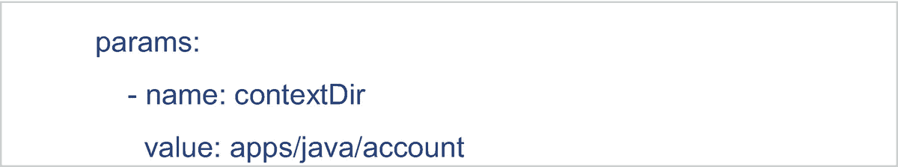
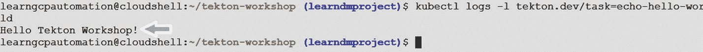
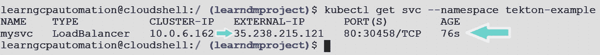

# 四、GCP Tekton 入门

本章介绍 Tekton，这是一个即将推出的用于在 Google 云平台上部署应用的解决方案。本章涵盖以下主题:

*   Tekton 的特性介绍

*   Tekton 流水线架构

*   Tekton 管道组件配置

*   在 GCP 建立泰克顿管道

*   Tekton 管道的用例实现

## Tekton 功能

让我们先简要介绍一下 Tekton 及其主要特性。Tekton 是一个开源框架，专为云原生 CI/CD 实施而设计。

它最初是由 Google 为基于 Kubernetes-native 的软件构建和部署开发的。2018 年，Tekton 项目捐赠给持续交付基金会。从那时起，CDF 接管了新功能和增强功能的责任。

Tekton 基于 Kubernetes-native 原则，允许开发人员跨多个云提供商构建、测试和部署云原生的容器化应用。Kubernetes 环境包括 AWS 弹性 Kubernetes 服务、Google Kubernetes 服务和混合环境。

Tekton 拥有定义 Kubernetes 风格的资源的最佳实践，用于声明 CI/CD 风格的管道，这将帮助开发人员轻松创建云原生 CI/CD 管道。开发人员还可以轻松地构建和部署不可变的映像、管理基础设施版本控制，以及执行高级 Kubernetes 部署/回滚策略，如 blue-green、canary 部署、滚动更新等。Tekton 使用其他第三方工具来存储、管理和保护工件。由于 Tekton 是由 Google 早期设计/开发的，它与 GCP 特定的 Kubernetes 解决方案(如用于 K8 本地应用部署的 GKE 或用于存储/扫描容器图像的 Google container registry)配合得很好。

虽然 Tekton 具有基于 Kubernentes 的应用的原生功能，但在涉及第三方插件和创建完整应用工作流的用户友好选项时，它仍然缺乏 Jenkins/Azure DevOps 等工具的功能。表 [4-1](#Tab1) 显示了 Jenkins、JenkinsX 和 Tekton 的功能比较，让您了解 Tekton 的功能。

表 4-1

工具比较

<colgroup><col class="tcol1 align-left"> <col class="tcol2 align-left"> <col class="tcol3 align-left"> <col class="tcol4 align-left"></colgroup> 
| 

特征

 | 

Jenkins

 | 

Jenkins

 | 

泰顿

 |
| --- | --- | --- | --- |
| 图像使用者界面 |  |  |  |
| 管道作为代码 | 宣言的 | 亚姆 | 亚姆 |
| kubernetes-本地(基于控制器) |  |  |  |
| 海峡群岛 |  |  |  |
| 激光唱片 |  |  |  |
| WebHook 触发 |  |  |  |
| Git 轮询触发 |  |  |  |
| 模板支持 |  | 通过脚本 DIY | 通过脚本 DIY |

可用

不可用

Tekton 有四个核心组件:

*   **Tekton pipelines** :该组件定义了 CI/CD 工作流的基本构建模块(管道和任务)。

*   **触发器**:CI/CD 工作流的触发事件。

*   CI/CD 工作流管理的命令行界面。

*   **Dashboard** :基于 web 的管道管理 UI。

## Tekton 的流水线架构

Tekton 的管道设计在 Kubernetes 上运行。它利用了 Kubernetes 自定义资源定义(CRD ),用于定义其组件，如管道、任务等。CRD 是一个 Kubernetes API 扩展，用于创建自定义对象，并像使用其他 Kubernetes 对象一样使用它们(如 pod、服务等)。).一旦安装完毕，就可以通过 Kubernetes CLI ( `kubectl`)和 API 调用来访问 Tekton 管道，就像在 Kubernetes 中调用 pod 和其他资源一样。这些特性使得 Tekton 能够很好地与整个 Kubernetes 系统集成。图 [4-1](#Fig1) 展示了 Tekton 流水线的架构，图 [4-2](#Fig2) 展示了流水线的执行。让我们在接下来的小节中看看这个架构中的核心组件。


图 4-2

泰克顿管道流程图


图 4-1

Tekton 的流水线架构

### 步伐

一个*步骤*是 Tekton 流水线的最小操作。它在 CI/CD 中执行特定的功能，比如管理工作流、编译代码、运行单元测试、构建和推送 Docker 映像等等。

### 任务

一个*任务*是步骤的集合，这些步骤按照用户定义的特定顺序执行，如图 [4-3](#Fig3) 所示。任务在 K8 集群中以 Kubernetes pods 的形式执行，而步骤在同一个 pod 中作为容器运行。在任务中，我们还可以提供共享的环境信息，在同一个 pod 中运行的所有步骤都可以访问这些信息。我们可以在 Tekton 任务中安装秘密，在同一个 Tekton 任务中定义的每个步骤都可以访问它。


图 4-3

任务和步骤

### 集群任务

集群任务类似于 Kubernetes 集群级别范围内的任务(任务范围仅特定于单个名称空间)。

### 管道

管道定义了要按顺序执行的任务集。管道是无状态的、可重用的和参数化的。简而言之，Tekton 根据任务创建几个 pod，并确保所有 pod 都按预期成功运行。管道可以在不同的 Kubernetes 节点上执行任务。

管道按以下顺序执行:

*   连续的

*   同时地

*   有向无环图

任务执行的顺序如图 [4-4](#Fig4) 所示。图中的任务 A 表示执行的顺序，其中步骤 1、2 和 3 依次执行。


图 4-4

管道流动

图中的任务 B 和 C 表示任务执行的并发流程，其中步骤 1 和 2 中的两个任务并行执行。

图 [4-4](#Fig4) 中的任务 D 代表有向无环图流，其中任务按照有向无环图(DAG)顺序组织。DAG 执行还允许连接管道任务，以便一个可以在另一个之前运行，因此管道执行不会陷入无限循环。有关更多详细信息，请参见以下链接:

[T2`https://en.wikipedia.org/wiki/Directed_acyclic_graph`](https://en.wikipedia.org/wiki/Directed_acyclic_graph)

### 管道资源(输入/输出资源)

管道资源组件定义了可以在管道或任务中用作输入或输出的对象。例如，pipeline/task 需要 Git 存储库位置作为输入，以获取最新的代码并提供容器图像作为输出。

Tekton 支持多种类型的资源(图 [4-5](#Fig5) 中提到了其中几种):


图 4-5

管道输入输出流

*   Git:一个 Git 库

*   Pull 请求:Git 存储库中特定的 pull 请求

*   图像:容器图像

*   丛集:丛集

### 任务运行和管道运行

PipelineRun 负责对特定事件执行管道，并将所需的执行参数、输入和输出传递给管道。

类似地，任务运行是任务的特定触发点。任务运行和管道运行将资源与任务和管道连接起来。您可以手动或自动创建 TaskRuns 和 PipelineRuns，以立即或在特定时间触发任务和管道(如图 [4-6](#Fig6) )。


图 4-6

taskerun 和 pipelinerun 流量

例如，您可以在 Tekton 中设置每天执行管道的具体时间，或者在开发人员通过 WebHook 将代码签入 Git 存储库时执行管道。

PipelineRun 或 TaskRun 必须包含与管道或任务相关联的所有输入和输出资源。您可以在规范中声明它们，或者使用 Tekton 在执行时自动解析的名称引用(如图 [4-6](#Fig6) 和 [4-7](#Fig7) 所示)。


图 4-7

任务运行管道资源和管道运行流程

在下一节中，您将学习如何在 Tekton 中定义这些组件来创建管道。

## 配置 Tekton 的管道组件

在 Kubernetes 中，YAML 经常被用来定义其工作负载(如 pod、服务定义等)。)，因为维护简单，使用灵活。Tekton 组件在 Kubernetes 集群上运行，它也使用 YAML 来定义它们。让我们看看如何通过 YAML 以声明的方式定义 Tekton 管道组件。

### 配置任务

在 Tekton 中，任务包含一组步骤，这些步骤在 Kubernetes 集群中作为一个 pod 执行。按照最佳实践，它们应该部署在特定的 Kubernetes 名称空间中。默认情况下，它们被部署到`default` Kubernetes 名称空间。图 [4-8](#Fig8) 显示了 Tekton 中任务定义的一个例子。


图 4-8

任务配置片段

现在让我们根据图 [4-8](#Fig8) 中使用的例子来看看必填和可选字段及其相关性。

以下是必填字段:

*   `apiVersion`:用于与 Kubernetes API 服务器交互，创建对象。在 Tekton 中，任务的 API 版本被称为`tekton.dev/v1beta1`。API 版本取决于 Tekton 管道的版本。

*   `kind`:我们定义 Kubernetes 对象的类型(例如，集群角色、部署)。在 Tekton 中，管道任务总是使用种类`task`来将这个资源对象标识为任务对象。

*   `metadata`:指定在 Kubernetes 集群中唯一标识任务资源对象的元数据。例如，根据 CI/CD 流，`Name`应该是有意义的。在前面的例子中，我们使用任务名为`name: build-ui`，这意味着该任务基于构建 UI 应用。

*   `spec`:指定该任务资源对象的配置信息。

*   `steps`:指定在任务中运行的一个或多个容器图像。

可选字段详细信息:

*   `description`:任务的描述。

*   `params`: Specifies parameters that are passed to the task at execution time. As per the example in Figure [4-9](#Fig9), we have defined a parameter called `pathToDockerFile`, which has a `string` type, a description, and a default location of the dockerfile that needs to be built by the Tekton task.

    

    图 4-9

    参数

*   `resources`:指定 PipelineResources 提供的输入输出资源。您将在 PipelineResources 部分获得关于它的详细信息。

*   在 inputs 部分，我们定义了任务输入的资源。

*   `outputs`:在输出部分，我们定义任务产生的资源。

*   `workspaces`:指定任务执行过程中需要的一个或多个卷的路径。你会在本章的工作区部分得到更多的细节。

*   `results`:在 result 部分，我们指定任务用来写入和存储其执行结果的文件。

*   `volumes`:指定任务中的步骤可用的一个或多个卷。

### 任务运行配置

TaskRun 实例化并执行任务，我们可以在 TaskRun 中指定任务，既可以在`taskRef`中提供任务名称，也可以直接在 TaskRun 中嵌入任务定义。

在 Tekton 中调用 TaskRun 配置中的任务有两种方法，一种是将目标任务指定为 taskRef，另一种是通过将其嵌入 TaskRun 来指定目标任务。

#### 将目标任务指定为 taskdef

在图 [4-10](#Fig10) 所示的例子中，我们在 TaskRun 配置中将任务名称`build-ui`作为`taskRef`提供。


图 4-10

taskRef 片段

#### 通过将目标任务嵌入 TaskRun 来指定目标任务

在图 [4-11](#Fig11) 的例子中，任务定义作为`taskSpec`嵌入到 TaskRun 中。


图 4-11

任务片段中的目标

#### 检查字段

现在让我们看看定义 TaskRun 的强制和可选字段。以下是必填字段:

*   `apiVersion`:指定 API 版本，例如`tekton.dev/v1beta1`。这取决于 Tekton 管道版本。

*   `kind`:将这个 Kubernetes 资源对象标识为 TaskRun 对象。

*   `metadata`:指定唯一标识 TaskRun 对象的元数据(如`generateName: build-ui-app`)。

*   `spec`:指定任务运行的配置。

*   `taskRef`或`taskSpec`:指定 TaskRun 将要执行的任务(如`name: build-ui`)。

以下是可选字段:



图 4-12

参数定义片段中的参数

*   `serviceAccountName`:指定一个`ServiceAccount`对象名，为在 Kubernetes 集群中执行 TaskRun 提供凭证。

*   `params`:如果任务有参数，则在`params`中指定，如图 [4-12](#Fig12) 所示。

`contextDir`是参数的名称，`app/java/account`是该参数的值。如果参数没有隐式默认值，则必须显式设置其值。

*   `resources`:指定 PipelineResource 值。

*   `inputs`:指定输入资源名称。

*   `outputs`:指定输出资源名称。

*   `timeout`:指定任务运行失败前的超时时间(分钟)。

有关 TaskRun 的更多信息，请访问以下链接: [`https://tekton.dev/docs/pipelines/taskruns/`](https://tekton.dev/docs/pipelines/taskruns/) 。

### 定义管道

请记住，在 Tekton 中，管道是任务的集合。任务是按照 CI/CD 顺序定义的(例如，从源代码管理中签出代码，选择构建代码，运行单元测试)。图 [4-13](#Fig13) 显示了在 Tekton 中定义管道的例子。


图 4-13

管道定义片段

现在，让我们了解一下管道配置中必需的强制和可选字段。以下是必填字段:

*   `apiVersion`:如前几节所述，API 版本需要与 Kubernetes API 服务器交互来创建对象。`apiVersion`取决于 Tekton 的版本。在前面的例子中，我们使用`apiVersion`作为泰克顿。`Dev/ v1beta1.`在 Tekton 的旧版本中，它可能是一个 alpha 版本。

*   `kind`:用于标识 Kubernetes 资源对象，如 pod、service 等。如果是管道类的，永远都是`Pipeline` only。

*   `metadata`:用于唯一标识管道对象。比如一个`name: build-ci-cd-pipeline`。

*   `spec`:指定`Pipeline`对象的配置信息(如资源或任务)。

*   `tasks`:指定流水线定义的任务及其执行顺序。

现在让我们来看看可用于在 Tekton 中定义管道的可选字段。


图 4-14

资源定义片段

*   `from` **:** 如果一个任务需要前一个任务的输出作为其输入，则在`from`参数中定义，该参数在需要该输出作为其输入的任务之前执行。

*   **任务:**

*   **资源.输入/资源.输出**

*   `resources`:在管道定义的`spec`部分声明，具有唯一的名称和类型。在图 [4-14](#Fig14) 的例子中，我们定义了两个具有唯一名称和类型的资源。

在图 [4-15](#Fig15) 的例子中，`deploy-ui-app`任务需要名为`mydocker-image`的`build-ui-app`任务的输出作为其输入。


图 4-15

管道输入/输出片段

因此，`build-ui-app`任务将在`deploy-ui-app`任务之前执行，而不管这些任务在管道定义中的声明顺序。见图 [4-15](#Fig15) 。

*   `runAfter` : If the tasks must be executed in a specific order as per the CI/CD requirements and they do not have any resource dependencies, those tasks are mentioned under `runAfter`. In the example in Figure [4-16](#Fig16), `code build` should be run before the unit testing happens. There is no output linking required between these tasks, so the `unittesting-java-app` task uses `runAfter` to indicate that `build-java-app` must run before it, regardless of the order in which they are referenced in the pipeline definition.

    

    图 4-16

    runAfter 管道片段

*   `retries` **:** 指定任务执行失败后重试的次数。

在图 [4-17](#Fig17) 所示的例子中，`build-docker-image`任务的执行在失败后会重试两次。如果重试执行也失败，则任务执行失败。


图 4-17

重试管道片段

*   `conditions`:指定某个条件，当满足该条件时，允许任务执行。

在图 [4-18](#Fig18) 的例子中，`is-feature-branch`指的是一个条件资源。只有当条件评估成功时，才会执行生成任务。


图 4-18

条件管道片段

更多信息，请点击此链接: [`https://tekton.dev/docs/pipelines/pipelines/`](https://tekton.dev/docs/pipelines/pipelines/) 。

### 管道运行

PipelineRun 在 Kubernetes 集群中实例化并执行管道。PipelineRun 按照定义的顺序执行管道中的任务，直到所有任务都成功执行或出现故障。PipelineRun 为管道中引用/定义的每个任务自动创建相应的任务运行，以执行任务。

图 [4-19](#Fig19) 显示了在 Tekton 中定义 PipelineRun 的示例。


图 4-19

pipeline 运行管道片段

现在，让我们了解一下在前面的示例中使用的管道配置中必需的强制和可选字段。以下是必填字段:

*   `apiVersion`:同上。

*   `kind`:用于标识 Kubernetes 资源对象，如 pod、service 等。

*   **元数据**:用于唯一标识 PipelineRun 对象。比如一个`name: build-ci-cd-java-app`。

*   `spec`:pipeline run 的规范，包括管道触发事件及其输入输出资源。

*   `pipelineRef`或`pipelineSpec`:指定需要执行的目标管道名。

以下是可选字段:

*   `resources`:在流水线中，任务需要资源作为要执行的步骤的输入/输出。`PipelineResources`提供这些资源。我们将在下一节了解更多关于`PipelineResources`的内容。在资源字段中，我们提供了`PipelineResources`的详细信息。

有两种方法可以在 PipelineRun 配置中定义 PipelineResources:


图 4-23

serviceAccountName 管道代码段

*   Provide a reference of the PipelineResources in the `resourceRef` field, as shown in the example in Figure [4-20](#Fig20).

    

    图 4-20

    pipeline 运行管道片段

*   Embed the `PipelineResource` definition in the PipelineRun using the `resourceSpec` field, as shown in the example in Figure [4-21](#Fig21).

    

    图 4-21

    resourceSpec 管道代码段

*   `params`: Specifies parameters that are required by the pipeline at execution time, as shown in the example in Figure [4-22](#Fig22).

    

    图 4-22

    Params 管道片段

*   `serviceAccountName`:指定一个 Kubernetes `ServiceAccount`对象，为管道在 Kubernetes 集群上执行提供具体的执行凭证，如图 [4-23](#Fig23) 中的例子所示。

更多信息，请访问此链接: [`https://tekton.dev/docs/pipelines/auth/`](https://tekton.dev/docs/pipelines/auth/) 。

*   `timeout`:指定管道运行失败前的超时时间(分钟)。如果没有为`timeout`指定值，Tekton 将应用全局默认超时值，即 60 分钟。如果超时值设置为`0`，则在执行过程中出现任何错误时，PipelineRun 都会立即失败。

要了解更多关于 PipelineRun 的信息，请访问以下链接: [`https://tekton.dev/docs/pipelines/pipelineruns`](https://tekton.dev/docs/pipelines/pipelineruns) 。

### 工作空间

Workspace 是 Tekton 管道和任务用来共享数据的文件系统，因为输入/输出 Workspace 类似于 Kubernetes 卷。唯一的区别是它不提供实际的卷，而是用它来声明文件系统的用途。一个工作区可以用多种方式来声明，比如`ConfigMap`、`PersistenceVolumeClaim`、`Secrets`等等。

在 Tekton 中，出于以下原因可以使用 Workspace。

*   在任务间共享数据。

*   任务和管道可以用它来存储输入/输出。

*   用于分别通过`ConfigMap`和`Secrets`访问应用配置和凭证。

*   用作构建缓存文件以加速 CI/CD 过程。

在本节中，您将学习如何在 Task、TaskRun、Pipeline 和 PipelineRun 中配置工作区。

#### 任务中的工作区

借助图 [4-24](#Fig24) 中的示例，我们将了解 Tekton 任务中的工作空间配置及其字段。


图 4-24

工作区配置片段

在前面的例子中，我们在一个名为`mvn`的任务中定义了一个名为`mavenrepo`的工作空间。这个工作区定义了每当`mvn`运行时，应该提供并挂载一个卷作为本地 Maven 仓库。

然后，这个工作区的路径被传递给 Maven 命令，以便与`Dmaven.repo.local=$(workspaces.mavenrepo.path)`一起用作本地 Maven 存储库。任务定义可以根据需要包含任意数量的工作空间。Tekton 建议您最多使用一个可写工作空间。让我们来看看 workspace 的必填和可选字段。

*   `name`(必填):工作区的唯一标识。

*   `description`:描述工作区的用途。

*   `readOnly`:任务写入/读取工作区的布尔值。

*   `mountPath`:工作区在磁盘上可用位置的路径。挂载路径可以是相对的或绝对的，其中相对路径以目录名开始，绝对路径以`/`开始。如果在工作区定义中没有提供`mountPath`，工作区将默认放置`/workspace/<name>`，其中`<name>`是工作区的唯一名称。

#### 任务运行中的工作区

如前所述，TaskRun 执行任务。如果任务包含工作空间，那么它应该与实际的物理卷绑定，因为工作空间只是一个声明。物理卷可以是任何 Kubernetes 卷类型，如`emptyDir`、`PersistentVolumeClaim`等。为了提供同样的功能，TaskRun 包含了自己的工作空间，如图 [4-25](#Fig25) 中的示例所示。


图 4-25

TaskRun 代码片段中的工作区

*   `name`(必填):为其提供卷的任务中工作区的名称。

*   `subPath`:卷上的可选子目录，用于存储该工作区的数据。子路径必须在 TaskRun 执行之前存在，否则 TaskRun 执行将失败。

#### 管道中的工作空间

在下面的例子中，我们在名为`docker-build`的管道中定义了一个名为`pipeline` `-workspace`的工作空间。这个管道决定哪个任务将使用`pipeline-workspace`。例如，名为`task`的任务使用`pipeline-workspace`工作空间(见图 [4-26](#Fig26) )。


图 4-26

管道片段中的工作区

#### 管线管路中的工作空间

PipelineRun 提供了一个将与管道的工作区字段相关联的卷。该列表中的每个条目必须对应于管道中的一个工作区声明。工作区列表中的每个条目必须指定以下内容，如图 [4-27](#Fig27) 中的示例所示。

*   `name`(必选):为其提供卷的管道定义中指定的工作空间的名称。

*   `subPath`(可选):卷上的一个目录，将存储该工作区的数据。TaskRun 执行时，此目录必须存在；否则，执行将会失败。


图 4-27

PipelineRuns 代码段中的工作区

### 管道资源

管道资源提供一组由任务用作输入/输出的对象。任务可以有多个输入/输出。图 [4-28](#Fig28) 显示了一个这样的配置的示例片段。


图 4-28

管道资源片段

在这个例子中，我们用名称`git-repo-url`定义了`PipelineResource`，它提供了源 Git 存储库。

以下是 PipelineResource 的必填字段:

*   `apiVersion`:与上一节所述相同。

*   `kind`:与上一节所述相同。对于 PipelineResource，`kind`将始终仅是 PipelineResource。

*   `metadata`:与上一节所述相同。

*   `spec`:在`spec`中，我们指定了 PipelineResource 资源对象的配置信息。

*   `type`:在`type`中我们指定了 PipelineResource 的类型，比如`git`。

以下是可选字段:

*   `description`:资源的描述。

*   `params`:特定于每种 PipelineResource 的参数，用唯一的名称和值定义。

*   `optional`:将资源标记为可选的布尔标志(默认情况下，optional 设置为`false`，使资源成为强制)。

现在，您将学习如何使用图 [4-29](#Fig29) 中的示例在管道中调用 PipelineResource。


图 4-29

管道代码段中的管道资源

在资源部分下的管道定义中，我们将 PipelineResource 名称作为`git-repo-url`传递，将类型作为`git`传递。

## 在 GCP 建立泰克顿管道

Tekton 管道是在 Kubernetes 上本地执行的 CRD(自定义资源定义)。Tekton 建立在 Kubernetes 原型机的基础上。为了帮助您理解这个概念，请参考图 [4-30](#Fig30) 。


图 4-30

Tekton 管道和 Kubernetes

表 [4-2](#Tab2) 概述了 Tekton 如何使用 Kubernetes 对象——主要是 pod 和 CRD 对象——来形成 CI/CD 管道的构建块。

表 4-2

泰顿和库比涅斯

<colgroup><col class="tcol1 align-left"> <col class="tcol2 align-left"></colgroup> 
| 

情定

 | 

作为 Kubernetes 原语的实现

 |
| --- | --- |
| 工作 | 任务是要执行的一系列命令。它实际上是一个 pod，而每个步骤都是该 POD 中的一个容器。 |
| TaskRun(任务运行) | 引用任务对象的 CRD。它接受任务对象的名称并执行它们。 |
| 管道 | 引用 TaskRun 对象的 CRD。它接受 TaskRun 对象的名称和执行顺序。它链接所有管道对象，如 task 和 PipelineResource 项。 |
| 管道运行 | 引用管道对象的 CRD。它产生 TaskRun 对象。它获取管道对象的名称并执行它们。它管理管道的执行和状态。 |
| 管道资源 | 要结帐的 git 存储库，要构建的 Docker 映像。 |

正如您在表 [4-2](#Tab2) 中看到的，PipelineRun 采用管道的名称，并创建运行任务对象(pod)的 TaskRun 对象，任务对象运行步骤(容器)。定义可以嵌套。例如，可以在 TaskRun 中定义任务，但是如果将它们定义为单独的对象并通过引用应用，通常会更容易跟踪它们。

由于任务是作为 Kubernetes pod 执行的，所以我们可以在 TaskRun 中定义 pod 调度规则，这样当 TaskRun 产生一个 pod 时，就会为它添加注释，以利于 kube-scheduler。此外，由于 Tekton 运行只是另一个 Kubernetes 对象，它的输出可以像任何其他资源一样通过使用`kubectl get <POD_NAME> -o yaml`来记录和读取。

我们还可以使用`kubectl logs -f`跟踪 pod 的日志。这意味着我们不需要登录到 CI/CD 提供商的网站来查看构建日志。因此，这为 Kubernetes 事件和管道事件提供了单一的日志来源。

我们现在将在 Kubernetes 集群上安装和配置 Tekton，并安装 Tekton CLI。对于动手练习，我们将在 GCP 云壳上安装预先安装的 Kubernetes 版本 1.17.8-gke.17 的 Tekton 官方版。使用以下步骤安装 Tekton 及其所需的依赖项。

步骤 1:使用以下命令创建服务帐户:

```
gcloud iam service-accounts create tekton --display-name Tekton

```

图 [4-31](#Fig31) 显示了结果。


图 4-31

创建服务帐户

步骤 2:现在使用以下命令向服务帐户添加权限。首先:

```
export GCP_PROJECT=$(gcloud config get-value project)

```

图 [4-32](#Fig32) 显示了该命令成功执行后的输出。


图 4-32

向服务帐户添加权限

然后发出以下命令:

```
gcloud projects add-iam-policy-binding ${GCP_PROJECT} \--member serviceAccount:tekton@${GCP_PROJECT}.iam.gserviceaccount.com \--role roles/storage.admin

```

图 [4-33](#Fig33) 显示了该命令成功执行后的输出。


图 4-33

绑定到帐户的策略

下面是下一个命令:

```
gcloud projects add-iam-policy-binding ${GCP_PROJECT} \--member serviceAccount:tekton@${GCP_PROJECT}.iam.gserviceaccount.com \--role roles/container.developer

```

图 [4-34](#Fig34) 显示了该命令成功执行后的输出。


图 4-34

绑定到帐户的策略

步骤 3:在这一步中，使用以下命令启用 Kubernetes 引擎 API:

```
gcloud services enable container.googleapis.com

```

步骤 4:现在让我们创建一个名为`tekton-workshop`的集群。在 GCP 控制台上，导航到 Kubernetes 引擎➤集群，如图 [4-35](#Fig35) 所示。


图 4-35

创建一个集群

第五步:输入`tekton-workshop`等必填字段，选择`us-east1-d`区，如图 [4-36](#Fig36) 。


图 4-36

向集群添加参数

另外，请确保选择“主版本”作为发布版本，并在单击“创建”按钮之前，从“发布通道”下拉列表中选择“快速通道–1 . 17 . 8-gke . 17”。见图 [4-37](#Fig37) 。


图 4-37

选择 Kubernetes 版本

创建集群需要一些时间。创建后，其名称将出现在 Kubernetes 引擎仪表板中，如图 [4-38](#Fig38) 所示。


图 4-38

创建集群仪表板

步骤 6:安装 Tekton CLI，因为使用 Tekton 实现 CI/CD 需要它。要安装 Tekton CLI，首先下载 TAR 文件，并使用以下命令将其复制到本地`/bin`文件夹:

```
curl -LO https://github.com/tektoncd/cli/releases/download/v0.2.0/tkn_0.2.0_Linux_x86_64.tar.gz
sudo tar xvzf tkn_0.2.0_Linux_x86_64.tar.gz -C /usr/local/bin/ tkn

```

成功执行如图 [4-39](#Fig39) 所示。


图 4-39

下载 tekton cli

步骤 7:我们将首先通过执行以下命令，连接到我们在本章前面使用云外壳创建的集群:

```
gcloud container clusters get-credentials tekton-workshop --zone us-east1-d --project learndmproject

```

图 [4-40](#Fig40) 显示了该命令成功执行后的输出。


图 4-40

连接到集群

步骤 8:设置完成后，我们通过运行以下命令将 Tekton 安装到集群中:

```
kubectl apply --filename https://storage.googleapis.com/tekton-releases/pipeline/latest/release.yaml

```

图 [4-41](#Fig41) 显示了该命令成功执行后的输出。


图 4-41

安装 Tekton 集群

步骤 9:现在，通过执行以下命令查看可用的名称空间来验证 Tekton 在集群上的安装(参见图 [4-42](#Fig42) )。第二个命令获取一个吊舱列表(参见图 [4-43](#Fig43) )。第三个命令获取关于 Tekton 名称空间的详细信息(参见图 [4-44](#Fig44) )。

第一个命令是:

```
kubectl get namespace

```

图 [4-42](#Fig42) 显示了结果。


图 4-42

获取 Tekton 名称空间

第二个命令是:

```
kubectl get pods –namespace tekton-pipelines

```

图 [4-43](#Fig43) 显示了结果。


图 4-43

去拿泰克顿豆荚

第三个命令是:

```
kubectl get all --namespace tekton-pipelines

```

图 [4-44](#Fig44) 显示了结果。


图 4-44

获取 Tekton 名称空间详细信息

步骤 10:为了可视化 Tekton 管道，我们将安装 Tekton 仪表板。为此，请运行以下命令:

```
kubectl apply --filename https://storage.googleapis.com/tekton-releases/dashboard/latest/tekton-dashboard-release.yaml

```

图 [4-45](#Fig45) 显示了结果。


图 4-45

安装 Tekton 仪表板

要验证 Tekton 仪表板的安装，请执行以下命令:

```
kubectl get all --namespace tekton-pipelines

```

图 [4-46](#Fig46) 显示了该命令成功执行后的输出。


图 4-46

验证 Tekton 安装

步骤 11:为了检查仪表板，我们将设置从云 Shell 到 Tekton 仪表板的端口转发。为此，请执行以下命令:

```
export TEKTON_POD=$(kubectl get pods -n tekton-pipelines -o jsonpath="{.items[0].metadata.name}" -l app=tekton-dashboard)
kubectl port-forward --namespace tekton-pipelines $TEKTON_POD 8081:9097 >> /dev/null &

```

图 [4-47](#Fig47) 显示了结果。


图 4-47

仪表板端口转发

要验证仪表板，请在云外壳中单击 web 预览，然后选择 8081 端口上的预览，如图 [4-48](#Fig48) 所示。


图 4-48

Tekton 仪表板预览端口

点击端口 8081 后，Tekton 仪表盘将打开，如图 [4-49](#Fig49) 所示。此时，将看不到任何任务、管道、PipelineResource 或 PipelineRun，因为我们尚未创建任何任务、管道、管道资源或管道运行。我们将在后续部分中创建这些。


图 4-49

泰克顿仪表板

## Tekton 管道的用例实现

现在让我们学习如何创建和运行任务和管道。为此，我们将考虑一个 hello world 示例。按照这些步骤来理解在 GCP 上使用 Tekton 的 CI/CD 实现。我们将首先看到如何创建和运行一个任务。

步骤 1:在本地创建一个名为`task`的文件夹，并在其中创建一个名为`hello-world.yaml`的 YAML 文件。将图 [4-50](#Fig50) 中的代码片段复制到文件中。


图 4-50

你好 Tekton 车间示例

现在执行这个命令:

```
kubectl apply -f tasks/hello-world.yaml

```

图 [4-51](#Fig51) 显示了该命令成功执行后的输出。


图 4-51

部署 Tekton 研讨会示例

步骤 2:该任务在集群中不会显示为 pod。为了使它可见，我们将创建一个 TaskRun 来调用我们创建的任务。执行以下命令:

```
kubectl apply -f taskruns/hello-world.yaml

```

图 [4-52](#Fig52) 显示了该命令成功执行后的输出。


图 4-52

部署 Tekton 研讨会示例

使用以下命令验证部署:

```
kubectl get pods

```

图 [4-53](#Fig53) 显示了该命令成功执行后的输出。


图 4-53

检查展开的吊舱

现在使用以下命令检查日志:

```
kubectl logs -l tekton.dev/task=echo-hello-world

```

图 [4-54](#Fig54) 显示了该命令成功执行后的输出。



图 4-54

检查展开的吊舱

现在，让我们构建一个 CI/CD 管道，了解 Tekton 的所有组件如何在 GCP 上协同工作。在这个用例中，我们将使用 Tekton 配置一个管道。在第一阶段，我们将从 GitHub 中检查代码，在第二阶段，我们将构建代码并将其推送到容器注册中心。管道的流程如图 [4-55](#Fig55) 所示。


图 4-55

CI/CD 管道流量

您可以下载 Git 资源库中的代码。使用以下命令克隆存储库:

```
git clone https://github.com/dryice-devops/GCPAutomation-Tekton.git

```

在您克隆了存储库之后，转到`GCPAutomation-Tekton/getting-started/src/`目录；它包含两个文件夹和一个文件:

*   `app`:包含一个简单的 Python Flask web 应用

*   `tekton`:包含用例将要使用的规范

*   `Dockerfile`:将用于构建应用和创建图像的 dockerfile 文件

对于这个用例，我们将把图像存储在本地文件夹中。

步骤 1:为了开始这个用例，我们将首先在集群中创建一个名为`tekton-example`的新名称空间，并提供所需的权限。要创建新的集群，请执行以下命令:

```
kubectl create namespace tekton-example

```

图 [4-56](#Fig56) 显示了该命令成功执行后的输出。


图 4-56

创建名称空间

现在创建一个名为`tekton-example-rbac.yaml`的 YAML 文件，并将图 [4-57](#Fig57) 所示的代码粘贴到其中。


图 4-57

角色访问文件

现在运行以下命令来应用角色访问级别更改:

```
kubectl apply -f tekton-example-rbac.yaml

```

图 [4-58](#Fig58) 显示了该命令成功执行后的输出。


图 4-58

配置基于角色的访问

步骤 2:创建一个集群，如“在 GCP 建立 Tekton 管道”一节中的步骤 4 和 5 所述。我们将创建一个名为`tekton-example`的集群。创建集群后，从云外壳使用以下命令连接到集群:

```
gcloud container clusters get-credentials tekton-example --zone us-central1-c --project learndmproject

```

步骤 3:现在通过运行以下命令将 Tekton 安装到这个集群中:

```
kubectl apply --filename https://storage.googleapis.com/tekton-releases/pipeline/latest/release.yaml

```

图 [4-59](#Fig59) 显示了该命令成功执行后的输出。


图 4-59

安装 Tekton

步骤 4:现在，通过执行以下命令查看名称空间和 pod，验证 Tekton 在集群上的安装:

```
kubectl get namespace

```

图 [4-60](#Fig60) 显示命令成功执行后的输出。


图 4-60

Tekton 部署

步骤 5:现在是时候为应用的构建和部署设置环境了。执行这些命令:

```
sudo mkdir mnt/data

kubectl apply -f https://k8s.io/examples/pods/storage/pv-volume.yaml

kubectl apply -f ~/GCPAutomation-Tekton/getting-started/src/tekton/init.yaml --namespace=tekton-example

kubectl delete configmap/config-artifact-pvc -n tekton-pipelines

kubectl create configmap config-artifact-pvc --from-literal=storageClassName=manual -n tekton-pipelines

```

这些命令将设置环境，如图 [4-61](#Fig61) 所示。


图 4-61

环境设置

步骤 6:在这一步中，我们将创建任务来运行在`app/`文件夹中可用的测试。它将首先从 GitHub 克隆源代码。接下来，它将使用 Docker 构建容器映像，并将其保存在本地。克隆 YAML 文件中代码的说明如图 [4-62](#Fig62) 所示。在下面的代码片段中，`spec.input.resource`字段中指定的类型`git`是 Tekton 的内置资源类型之一。它指定任务必须将 GitHub 存储库作为其输入。名称`git`告诉 Tekton 将存储库克隆到本地`/workspace/git:`


图 4-62

构建 YAML 代码片段

接下来，我们将在代码中定义步骤。Tekton 使用工具图像来运行命令。在下面的代码片段中，使用了`python`图像，并运行命令以切换到`app/`目录。它安装所需的依赖项，并使用`pytest`运行所有测试，如图 [4-63](#Fig63) 所示。


图 4-63

构建 YAML 代码片段

下一步确定测试完成后，YAML 文件必须将代码容器化。我们将使用 Docker 构建容器映像，并以名称`app`保存在本地，如图 [4-64](#Fig64) 所示。


图 4-64

构建 YAML 代码片段

现在，我们通过运行以下命令来应用该任务:

```
cd ~/GCPAutomation-Tekton/getting-started/src/tekton/ && kubectl apply -f tasks/build.yaml --namespace=tekton-example

```

该命令将应用构建和测试 app，如图 [4-65](#Fig65) 所示。


图 4-65

应用构建

步骤 7:在构建和测试步骤执行之后，我们将应用`kubectl`命令，该命令将用于启动构建在集群中的容器。图 [4-66](#Fig66) 描述了使用 Kubernetes 命令的工具映像`lachlanevenson/k8s-kubectl`进行部署，然后公开映像以供外部访问。


图 4-66

部署 YAML 代码片段

现在，我们将通过运行以下命令来应用该任务:

```
cd ~/GCPAutomation-Tekton/getting-started/src/tekton/ && kubectl apply -f tasks/deploy.yaml --namespace=tekton-example

```

这些命令将应用 app 的部署，如图 [4-67](#Fig67) 所示。


图 4-67

部署构建

在上一节中，我们已经部署了 Tekton 仪表板，因此我们可以看到在仪表板中创建的任务，如图 [4-68](#Fig68) 所示。


图 4-68

任务仪表板

步骤 8:现在任务已经创建，我们将创建构建这两个任务的管道。管道将包括任务将使用的所有资源。为了触发管道，我们将资源类型指定为`git`，Tekton 将把它传递给请求它们的任务(在`spec.resource`字段中指定，如图 [4-69](#Fig69) )。


图 4-69

管道 YAML 代码片段

对于每个任务，我们还指定了 Tekton 管道可以分配给它们的输入和输出资源。在图 [4-70](#Fig70) 中，我们定义了流水线中任务的名称以及特定任务使用的输入/输出资源。


图 4-70

管道 YAML 代码片段

我们通过运行以下命令来应用任务:

```
cd ~/GCPAutomation-Tekton/getting-started/src/tekton/ && kubectl apply -f pipelines/pipeline.yaml --namespace=tekton-example

```

这些命令将创建如图 [4-71](#Fig71) 所示的管道。


图 4-71

管道部署

在 Tekton 仪表板中，我们可以看到管道已经创建，如图 [4-72](#Fig72) 所示。


图 4-72

管道仪表板

步骤 9:到目前为止，我们已经创建了管道，但是只指定了类型(Git)。我们现在将把该值指定为 GitHub 存储库的 URL。Tekton 使用管道资源来存储这些值。图 [4-73](#Fig73) 中的代码片段定义了图 [4-73](#Fig73) 的`param.name`字段中显示的`metadata`字段中显示的管道资源的名称、存储库的版本/分支以及存储库的 URL。


图 4-73

Git YAML 代码片段

我们通过运行以下命令来应用任务:

```
cd ~/GCPAutomation-Tekton/getting-started/src/tekton/ && kubectl apply -f resources/git.yaml --namespace=tekton-example

```

这些命令将创建一个 Git，如图 [4-74](#Fig74) 所示。


图 4-74

Git 部署

在 Tekton 仪表板中，我们可以看到 Git 已经被创建，如图 [4-75](#Fig75) 所示。


图 4-75

管道资源部署

步骤 10:现在我们已经创建了任务、管道和 PipelineResources，我们可以通过手动触发来运行 CI/CD。为了运行它，我们创建了一个 pipelineRun 类型的 YAML 文件。它应该包括管道的名称及其使用的管道资源，如图 [4-76](#Fig76) 所示。


图 4-76

运行 YAML 代码片段

我们通过运行以下命令来应用任务:

```
cd ~/GCPAutomation-Tekton/getting-started/src/tekton/ && kubectl apply -f pipelines/run.yaml --namespace=tekton-example

```

这些命令将运行管道，如图 [4-77](#Fig77) 所示。


图 4-77

管道运行

一旦管道成功执行，我们可以在 Tekton 仪表板中看到结果。它将显示一个带有勾号的绿色圆圈，如图 [4-78](#Fig78) 所示。


图 4-78

管道运行仪表板

您可以通过点击管线名称深入查看管线运行的状态，如图 [4-79](#Fig79) 所示。


图 4-79

管道运行仪表板

步骤 11:为了验证管道的状态，我们可以运行以下命令:

```
kubectl get pipelineruns/build-test-deploy-app-run -o yaml

```

这些命令将验证管道运行状态，如图 [4-80](#Fig80) 所示。


图 4-80

管道状态

当运行成功时，它将显示带有`"Succeeded"`状态的`"All Steps have completed executing"`消息。运行管道时检查错误消息；这些字段将显示原因以及故障排除说明。

您还可以使用以下命令检查群集的部署并查找已部署群集的 IP；输出如图 [4-81](#Fig81) 所示。



图 4-81

部署状态

```
kubectl get svc –namespace tekton-example

```

通过执行以下命令，可以使用外部 IP `35.238.215.121`访问部署的服务，如图 [4-79](#Fig79) 所示:

```
curl http:// 35.238.215.121

```

图 [4-82](#Fig82) 显示了命令成功执行时的输出。


图 4-82

部署的服务

同一个网址(`http:// 35.238.215.121`)可以从浏览器访问，如图 [4-83](#Fig83) 所示。


图 4-83

在浏览器上部署服务

## 摘要

本章介绍了 Tekton 的核心概念以及如何使用 Tekton 定义管道的步骤。您还了解了如何使用配置文件定义 task、taskRun、pipeline 和 PipelineResource，并在 Google Cloud Platform 上的 GKE 中使用它们。在下一章中，我们将讨论如何利用 Jenkins 以及部署管理器、源代码回购等 GCP 本地服务在 GCP 上部署应用。